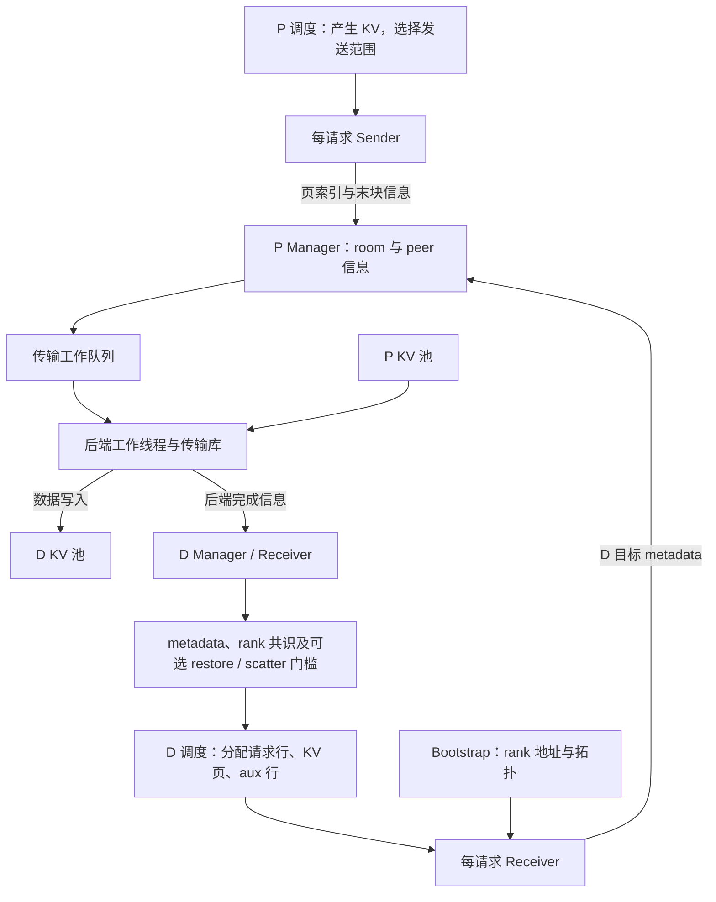
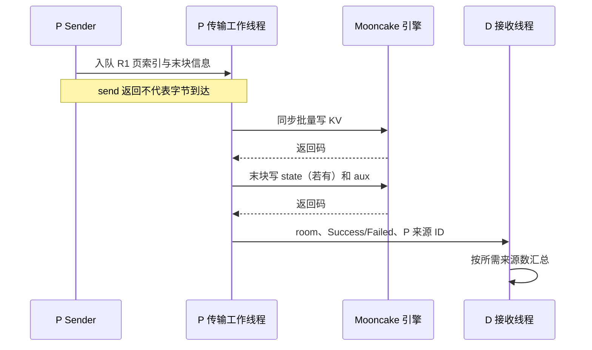

# KV 传输接口与后端实现地图

本文是 **07-04，源码分析型学习资料**，面向第一次读传输后端的同学。前两篇已经解释 P 如何产生 KV、D 如何预留位置。本篇继续回答：**同样一个 `send()`，换成 Mooncake、NIXL 或 MoRI 后，谁登记内存、谁发起写入、谁判断完成？**

先记住：注册是告诉传输库“哪些内存可以被访问”，请求 metadata 是告诉对端“这一单写到哪些位置”，提交是把工作交给传输库；这三步都不能单独替代请求就绪判断。

## 0. 阅读基线与范围

| 项目 | 内容 |
| --- | --- |
| 源码仓库与路径基准 | 官方 `sgl-project/sglang`；源码路径相对于 SGLang 仓库根目录 `.` |
| 分支 | `codex/sglang-source-study-20260909`，基于已拉取的官方 `main` |
| 固定 commit | `72d5c5bb73cadd7ffbf5114e5f81e29d36b6c61a` |
| 读取日期 | `2026-09-10`；沿用 2026-09-09 固定基线 |
| 实际源码工作区 | 独立 `sglang-source-study` worktree，读取时干净；原 `sglang` 工作区保留 `muxi-main` 与已有 26 个未跟踪文件 |
| 文档工作区 | 在 Wiki 的 `sglang/source-study/` 增补正文、附录和导航；其他已有资料保留 |
| 操作边界 | 静态阅读 SGLang 适配层和列明测试；未安装或导入 SGLang、传输库、torch，未运行模型、RDMA、单测或性能实验 |
| 主线 | 普通 Dense/GQA、P/D attention TP=1、PP=1、单次请求、直接写入 D 的 GPU KV 池；分别替换三个传输后端 |
| 首轮例子关闭的变化 | Overlap、提前发送缓存前缀、D Radix/HiCache/HiSparse、staging、统一内存搬迁、投机和额外模型状态；后文只按需单独加入变化 |
| 本篇不完成的证明 | 外部传输库内部协议、硬件兼容全集、故障后所有写者退役、任意 TP/PP/CP 组合、性能优劣；异常资源退役留到 07-05 |

前置：[07-01 PD 地图](01-PD分离职责与端到端请求地图.md)、[07-02 Prefill 侧](02-Prefill侧Bootstrap与传输状态.md)、[07-03 Decode 侧](03-Decode侧预分配接收与就绪.md)。尚不熟悉物理页时先读 [04-01 请求视图与分配器](../04-kv-cache/01-请求视图物理槽位与分配器.md)。

文中的固定链接证明 **SGLang 在该版本调用了什么接口、检查了什么条件**，不把外部库的全部行为一并当作已验证事实。小数字和图是整理者归纳；本篇没有运行观察。

## 1. 先把公共层和后端层分开

### 1.1 五类对象怎样装配

`get_kv_class()` 根据 `TransferBackend` 和 `KVClassType` 返回类。所有后端共用 `KVArgs`；Manager、Sender、Receiver 和 BootstrapServer 则按后端选择。工厂还包括 Ascend、Fake；Fake 没有真实 BootstrapServer，不是网络正确性验证工具。[工厂][S1]

| 对象 | 人话解释 | 生命周期与职责 |
| --- | --- | --- |
| `KVArgs` | 池的布局说明书 | 指针、区域长度、每项字节跨度、层 ID、设备、页大小和额外 state 组件；不为每个请求分配 KV |
| Manager | 一个 rank 的传输组织者 | 持有引擎、注册信息、连接与多个 room 的状态；服务多个请求 |
| Sender | P 为这一单开出的发送单 | 跟踪该 room 的页数、发送游标、aux 行号和结果 |
| Receiver | D 为这一单开出的接收单 | 解析 P 路由、发布目标页/aux、查询结果；不执行模型 forward |
| BootstrapServer | rank 地址与拓扑登记处 | 帮 D 找到 P 的 rank 端点；本身不替代大块 KV 搬运 |

`KVArgs` 中 `kv_data_lens` 是整个区域的字节长度，`kv_item_lens` 是相应项的字节跨度；本篇普通分页 KV 例子中，一项对应一个物理页。`state_*` 是分组件、再分 buffer 的嵌套结构，不能把 Mamba、SWA、压缩状态都按普通 K/V 页号解释。[布局字段][S2]



**图意解读：** 这是职责图，箭头包含函数调用、消息和内存读写三种关系，标注分别说明其用途。P/D 池由调度与缓存体系管理；传输引擎得到地址访问能力，没有接管准入、缓存淘汰或请求结束策略。[D 接收门槛][S46] [staging 门槛][S47]

### 1.2 接口相同，不等于时序和清理语义相同

| 接口 | 上层表达的意图 | 阅读实现时还要追什么 |
| --- | --- | --- |
| `Sender.init(num_kv_indices, aux_index)` | 记录本请求待发送总范围和 P aux 行 | 数量单位；是否只是本地记录 |
| `Receiver.init(prefill_dp_rank)` | 根据路由与拓扑准备接收关系 | 连接复用、peer 注册、需等待几个来源 |
| `Receiver.send_metadata(...)` | 发布 D 目标页、aux 和 state 位置 | 发到了哪个 rank；是否发送成功；发布后地址寿命 |
| `Sender.send(...)` | 提交本段页索引与可选 state | 是否仅入队、哪个线程读取源数据、末块何时发送 aux |
| `poll()` | 询问适配层状态 | 主动拉取通知还是读已有状态；完成条件是本地还是跨来源 |
| `clear()` / `abort()` | 清理或终止请求侧状态 | 是否等待异步操作、是否只是删 room 记录、是否注销池 |

基础类里的 `clear()`、`abort()` 默认没有动作；实际使用的 Common/后端类有覆盖实现。因此不能从接口名推出“abort 已排空所有 DMA”。`KVPoll` 统一为 `Failed=0、Bootstrapping=1、WaitingForInput=2、Transferring=3、Success=4`，但实际后端不保证每个观察者都经过所有中间值。[Sender 接口][S4] [Receiver 接口][S5] [状态值][S3]

公共 Sender 用 `curr_idx` 构造 `index_slice`，在累计数量等于初始化总数时标记末块。本篇的数量单位是页，不是字节。Common 的 `should_send_kv_chunk()` 接受“有页 **或** 是末块”，使零页末块仍能交接 aux；不能只看基础类的 `num_pages > 0`。[游标][S8] [末块策略][S9]

## 2. 三次登记，以及一套不能混用的身份

### 2.1 注册池与发布一条请求，为什么要分两步

可以把池想成一排长期存在的格子。登记池相当于登记整排格子的范围；发布 R1 则只说 R1 使用其中第 3、9 格。R1 结束后这些格子可能供下一条请求使用，整排内存和连接通常仍然存在。

| 层次 | 传什么 | 作用与主要入口 |
| --- | --- | --- |
| 服务/rank 登记 | P 的拓扑、rank 地址、页与 dtype 信息等 | `CommonKVManager.register_to_bootstrap`；供 D 查找入口 |
| 持久 peer/内存登记 | D 池地址或描述符、引擎身份、布局信息 | 后端 `Receiver._register_kv_args()`；让 P 能解释 D 的内存 |
| 请求目标发布 | room、D 物理页索引、aux 行、state 索引、prefix 长度等 | 后端 `send_metadata()`；把本次传输和具体目标槽位绑定 |

这三步的源码分别见 [rank 注册][S61]、[公共 Receiver 初始化][S7]、[Mooncake 池登记][S54]、[NIXL 池登记][S55]、[MoRI 池登记][S42]。NIXL/MoRI 的请求目标消息见 [NIXL][S26]、[MoRI][S66]；它们不是 KV 内容本身。

| 名字 | 区分什么 | 不可代替什么 |
| --- | --- | --- |
| `rid` | 调度层请求身份 | 不能直接当物理页号 |
| `bootstrap_room` | 一次 P/D 交接关联 | 不能当网络连接或引擎实例 ID |
| Mooncake session ID | 传输引擎的远端会话 | 不等于某请求独占一个 session |
| NIXL `agent_name` | UUID 命名的 agent | 不等于 PP rank 或 room |
| MoRI `engine_key` | 包含角色、rank、进程及随机部分的引擎键 | 不等于某条请求的 transfer UID |
| rank 来源 ID | D 完成汇总中识别发送来源 | 不等于已经收到的 chunk 数量 |

NIXL P 用 `add_remote_agent(agent_metadata)` 导入远端；MoRI 用 `register_remote_engine(engine_desc)`。两者都按 peer 身份保存长期信息，再由 room 找到本次目标。[NIXL peer][S21] [MoRI peer][S33] [NIXL agent 创建][S19] [MoRI engine 创建][S31]

### 2.2 rank mapping 属于公共连接层，字节切片仍属于后端

以下只针对非 MLA、CP=1、PP=1、attention TP 整数倍的简化例子。这里的 P/D TP 是 attention 的并行度，不直接拿系统 DP 或任意 `--tp` 数值替代。[映射实现][S6]

| P TP / D TP | 取一个 D rank 看目标 P | 每个 P 等几个 D 目标描述 | 该 D 等几个 P 来源 |
| --- | --- | ---: | ---: |
| 2 / 2 | D1 对 P1 | 1 | 1 |
| 2 / 4 | D2、D3 对 P1 | 2 | 1 |
| 4 / 2 | D1 对 P2、P3 | 1 | 2 |

`required_dst_info_num` 解决 P 的目标描述是否凑齐，`required_prefill_response_num` 解决 D 的来源完成是否凑齐。它们分别看网络两端，不是同一个计数器。MLA 的复制/dummy 路径会改变上述关系；CP/PP 还会改变目标 rank 集合与所需来源数，07-06 再组合展开。

即使 rank 对上了，后端仍要把 KV head 范围、页布局和层范围映射成实际写入。MoRI 的 `send_kvcache()` 会在 TP 不等时构造 slice plan；NIXL 有预制切片描述符和 staging 分支。**拓扑映射成功并不证明 dtype、stride、模型状态或外部库组合兼容。**[MoRI 分片入口][S38] [NIXL 准备分支][S60] [NIXL 发送分支][S24]

## 3. 用 R1 算清楚页号、地址和描述符索引

### 3.1 普通直接传输的共同账本

继续用 R1：8 个输入 token，计划生成 3 个输出 token。为演示传输，设物理页大小 4，P 两页是 `[7, 12]`，D 对应两页是 `[3, 9]`。只取一个假想的两层 Dense/GQA 模型、每层一个 KV head、head dimension=2、FP16；K/V 各自独立 buffer。**这些是教学条件，不是可直接启动的模型配置。**

| 项目 | 教学值与单位 | 推导 |
| --- | --- | --- |
| 单个 K 或 V buffer 的每页跨度 | 16 B | 4 token × 1 head × 2 dimension × 2 B |
| K/V buffer 数 | 4 | 2 层 × K/V 两类 |
| 两页 KV 搬运量 | 128 B | 2 页 × 4 buffer × 16 B；不含 aux、协议及重传 |
| P / D 页容量 | 16 / 32 页 | 只为展示两端描述符表长度不同 |
| P / D aux 行 | 3 / 7 | 独立于 P/D KV 页号 |

取其中一个 K buffer，假想 P 基址为 1000、D 基址为 5000，均用十进制示意，不是真实设备指针：

| 逻辑范围 | P 页 | D 页 | 源起始地址 | 目标起始地址 | 长度 |
| --- | ---: | ---: | ---: | ---: | ---: |
| token `[0,4)` | 7 | 3 | 1000 + 7 × 16 = 1112 | 5000 + 3 × 16 = 5048 | 16 B |
| token `[4,8)` | 12 | 9 | 1000 + 12 × 16 = 1192 | 5000 + 9 × 16 = 5144 | 16 B |

其他三个 buffer 用各自基址重复对应关系。不能把 P 的页号直接当 D 的页号，也不能拿 token ID 参与地址乘法。普通路径的 `item_len` 以页为跨度；DCP 和 state 组件必须另外核对自己的单位。

公共 `group_concurrent_contiguous()` 只在**源、目标同时连续**时合并。例如 `[7,8,12] → [3,4,9]` 分成长度 2 和 1 的两组；`[7,8] → [3,9]` 不能合并。若非空两侧长度不等会报错；若任一侧为空返回空组，也不能据此认定原请求数据要求已满足。[连续分组][S12]

### 3.2 同一账本在三种后端里的表示

| 后端 | 为一个 buffer 表达两页传输的方式 | 交给谁执行 |
| --- | --- | --- |
| Mooncake | 源地址 `[1112,1192]`、目标地址 `[5048,5144]`、长度 `[16,16]`；实际可再跨 buffer 组批 | `batch_transfer_sync` 包装器 |
| NIXL 预制路径 | 从全池描述符表选出索引；描述符已包含地址、长度和设备 | `make_prepped_xfer("WRITE", ...)`，再 `transfer(handle)` |
| MoRI | 已注册的源/目标 `MemoryDesc`，源偏移 `[112,192]`、目标偏移 `[48,144]`、长度 `[16,16]` | `batch_write(...)` |

依据分别是 [Mooncake 调用][S14]、[NIXL 提交][S23]、[MoRI 偏移物化][S59] 与 [MoRI 提交][S37]。这里是同一数据需求的表示转换，不是三个库实际发出的网络包数量对照。

NIXL 的 `repeat_indices_over_layers()` 把每个 buffer 的页索引展平成一个大描述符表的索引。对本例四个 buffer，P 每块表长 16，D 每块表长 32：[索引展开][S53]

```text
P 描述符索引：[7,12, 23,28, 39,44, 55,60]
D 描述符索引：[3,9, 35,41, 67,73, 99,105]
                 ↑ 每换一个 buffer，各自加自己的池容量
```

函数参数名 `num_layers` 在这个展开步骤表示 buffer 块数；对分离 K/V 的两层模型是 4，不应再少算一半。预制表按本地和远端各自 geometry 构建；stride 与实际 transfer length 在特殊 host 目标上还可能不同。[描述符准备][S22] [peer geometry][S60]

## 4. Mooncake：外层排队，工作线程里同步写

### 4.1 内存注册与请求发送

Manager 汇集 KV、aux、state 区域，以 `(ptr, length)` 精确去重后 `batch_register()`；这个去重照顾了同一原始 buffer 被多个组件报告的情况。请求只引用其中的页，不是每到一个请求就重新注册整池。[区域集合][S13]

Sender 的任务经 `add_transfer_request()` 进入工作队列。工作线程选择当前 room 的 D 目标，再进入普通 KV、TP 切片或 staging 分支。本篇直接路径最终把地址列表交给 `_transfer_data()`；SGLang 包装器调用外部引擎的 `batch_transfer_sync_write()`。[入队][S57] [工作线程][S16] [同步包装器][S15]



**图意解读：** 同步发生在工作线程与引擎调用之间，不表示 Scheduler 的 `send()` 等待了整次搬运。图中 aux 画的是普通引擎路径；源码也允许 aux 走 TCP，不能把图推广到所有配置。

### 4.2 成功与池寿命

普通末块先处理需要的 state 和 aux，再按所需 D 目标返回情况发送状态。D 接收线程按 P 来源 ID 去重计数，数量满足本 room 的期望值后设置 `Success`。它不是收到任意一条 Success 就放行多来源请求。[P 完成通知][S16] [D 来源汇总][S17]

aux 常规路径使用独立 aux 基址和行跨度；配置 TCP aux 或特定 NVLINK 自定义池条件时转向 `send_aux_tcp()`。因此“Mooncake KV 使用什么传输”与“aux 使用什么传输”要分别记录。[aux 选择][S18]

`CommonKVSender.clear()` 删除 room 状态、目标信息等；`MooncakeKVManager.deregister_buffer_to_engine()` 才是另一个明确注销池区域的方法，并清理 connection pool。两者不应混为一个请求结束动作。[请求清理][S10] [池注销][S63] 本篇只建立正常成功链；失败返回时，其他并发调用是否仍持有源/目标资源，留给 07-05 审计。

## 5. NIXL：WRITE 句柄与 Decode 通知账本

### 5.1 注册、预制描述符与提交是三层对象

NIXL Manager 创建 UUID 命名的 agent，并选择 NIXL 插件。固定版本中默认插件环境值是 `UCX`；P agent 配置 `num_threads=8`，D 是 0，且启用 strict thread sync。这里的 8 是 agent 配置，不能等同于 SGLang 传输队列/worker 数。插件参数从 JSON 读取，要求字符串键和值。[agent 初始化][S19] [默认插件][S44]

KV 根据 memory kind 分组注册为 `VRAM` 或 `DRAM`；aux 注册 `DRAM`；非零额外 state 区域注册 `VRAM`。普通直接 GPU KV 路径用 VRAM；存在 DRAM 分支不意味着任意 CPU/GPU 布局组合都得到支持。[内存注册][S20]

| 对象 | 对应层次 | R1 到来时做什么 |
| --- | --- | --- |
| 注册 memory descriptors | 池/agent 层 | 复用已注册的内存区域 |
| `prep_handles` | 给 peer 准备的全池描述符表 | 选择本次页对应的表索引；源表和各 peer 目标表分开 |
| `xfer_handle` | 一次提交的传输操作 | `make_prepped_xfer` 或 `initialize_xfer` 创建，再 `transfer` 提交 |
| `TransferStatus` | D 的每 room 完成账本 | 汇总各来源的 chunk、末块期望数、aux 与必要 state |

同名“handle”在不同层次服务不同对象。普通等 TP KV 走预制表路径；其他路径可临时构建传输描述符。aux 用 `initialize_xfer("WRITE", ...)` 从 DRAM 行发送。**这份 SGLang 适配层是 P 发起 WRITE，不是 D 发起 READ。**[KV WRITE][S23] [aux WRITE][S30]

NIXL worker 收集当前 chunk 的 KV/state/aux 句柄，调用 `check_xfer_state()`：`ERR` 进入失败处理，所有句柄 `DONE` 才越过该 chunk 的屏障；末块完成后更新 P 侧 `Success`。队列提交函数本身只入队并返回。[任务队列][S58] [工作线程][S24]

### 5.2 D 为什么不能只等一个“最后一块到了”

D 的 `poll()` 在开始传输后主动调用 `update_transfer_status()` 拉取 `get_new_notifs()`。普通通知包括 KV、aux、state；KV 携带 room、chunk ID、是否末块及来源标识。代码沿用 `pp_rank` 字段名，但发送方填入的 `transfer_source_rank = pp_rank × 全局 tp_size + engine_rank`，不是始终等于裸 PP 编号。[通知生成][S24] [来源值初始化][S19] [通知处理][S28]

普通非 staging、单来源、两 chunk 的教学账本如下，假设通知观察顺序为末块、aux、首块。这里只演示账本为什么能等缺块，不声称实测发生了乱序。

| 本次观察 | 来源 0 已到 chunk 集合 | 已知期望数 | aux 已到 | `is_done()` |
| --- | --- | --- | --- | --- |
| 初始 | `{}` | 未知 | 否 | 否 |
| `R1_kv_1_1_0` 的语义 | `{1}` | 2，即末块 ID + 1 | 否 | 否 |
| `R1_aux` 的语义 | `{1}` | 2 | 是 | 否 |
| `R1_kv_0_0_0` 的语义 | `{0,1}` | 2 | 是 | 是 |

表中的 `R1` 便于教学，真实 wire 用可解析为整数的 room。源码用集合去重，以集合大小和期望数比较；它不是对任意恶意/损坏 chunk ID 连续性的完整校验器。额外 state 被期待时，各所需来源的 state 也必须满足条件。[完成谓词][S27]

若 D 缓存已经覆盖待传 KV，末块仍需 aux。NIXL 用 `aux_nokv_<source>_<expected>` 表达该来源之前应有多少 KV chunk；完全无需 KV 时 expected=0。空 KV 不自动等于 dummy 请求，不能把最后一次 aux 交接删掉。[末块 aux 标记][S24] [通知解释][S28] [零页策略][S9]


**图意解读：** P 的句柄屏障和 D 的通知账本是同一传输的不同观察面，不是一张共享 Python 状态表。`Receiver.poll()` 先消化通知并检查完成，再检查等待超时，避免已经可观察的完成被超时判断抢先覆盖。[D poll 顺序][S29]

本篇确认了句柄检查顺序，没有读取外部 NIXL 库的完整句柄回收契约。不能仅凭 SGLang 的局部变量离开作用域，声称所有外部资源均已注销，也不能反过来据此宣布存在资源泄漏。

## 6. MoRI：MemoryDesc、偏移计划与状态集合

### 6.1 把长寿命描述符和一次写入分开

MoRI Manager 创建 `IOEngine`，在本适配层明确创建 `BackendType.RDMA`。KV/state 用 GPU `MemoryLocationType` 注册，aux 用 CPU 注册，得到长期 `MemoryDesc` 列表；D 将它们和 `EngineDesc` 打包传给 P。读取这段只能证明适配接口选择，不能证明当前机器已经具备运行条件。[引擎][S31] [注册][S32] [描述符发布][S42]

`GroupedIndexPlan` 记录源页组起点、目标页组起点、连续页数；`materialize(item_len)` 才换成字节偏移和长度。`send_kvcache()` 按模型布局选择 K/V 或 MLA 描述符、按 TP 情况选择普通或切片计划，再调用 `_submit_batch_transfer_plan()`。[偏移计划][S59] [模型与 TP 分支][S38]

一次非空 plan 分配 transfer UID，调用 `batch_write()`，返回一组外部 `TransferStatus`。这个类型来自 `mori.cpp`，不同于 NIXL 文件里自定义的 room 账本 `TransferStatus`。[写入提交][S37]

| MoRI 对象 | 示例 | 所在寿命层次 |
| --- | --- | --- |
| `MemoryDesc` | R1 某层 K 池的注册描述符 | 池/engine |
| `BatchTransferPlan` | offsets `[112,192]` → `[48,144]`，sizes `[16,16]` | 本次 buffer 写入计划 |
| transfer UID | `allocate_transfer_uid()` 返回值 | 一次外部传输标识，不是 room |
| 外部 `TransferStatus` 列表 | KV/state，以及选择 RDMA 的 aux 返回状态 | 已提交操作的等待对象 |
| room 状态 | `Bootstrapping`、`Transferring`、`Success` 等 | SGLang 请求关联 |

### 6.2 工作线程等待什么，aux 又在哪里

MoRI 以 `room % shard 数` 选择队列，同一 room 的任务交给同一 shard。worker 取 chunk 后提交所有目标操作，再用 `engine.wait_all(statuses, timeout_ms=...)` 检查：`IN_PROGRESS` 继续，`SUCCESS` 通过，其他结果收集失败原因。末块等待成功后通知 D，并更新 P 状态。[入队][S56] [worker 主线][S35] [状态等待][S36] [提交目标集合][S64]

| 参数 | 固定版本声明默认值 | 准确含义 |
| --- | --- | --- |
| `SGLANG_MORI_TRANSFER_SHARDS` | 8 | P 传输队列/worker 分片数量，构造时至少取 1 |
| `SGLANG_MORI_WAIT_POLL_MS` | 1000 | 每次 `wait_all` 等待窗口，单位 ms |
| `SGLANG_MORI_TRANSFER_TIMEOUT_MS` | 0 | 本适配层的等待 SLA；代码仅在值大于 0 时检查，0 不表示立刻超时 |
| `SGLANG_MORI_SEND_AUX_RDMA` | False | 默认 aux 走 TCP；不是说 KV 也改走 TCP |

默认值见 [环境字段][S68]，实际行为以 [等待循环][S36] 与 [aux 选择][S39] 为准。还存在 bootstrap、D 等待和服务层其他超时，不能把一个 SLA=0 推成“整个请求永不超时”。

默认 TCP aux 将各 buffer 的指定 P 行序列化成 `AUX_DATA` 消息；该函数返回空状态列表，所以它不在 RDMA `wait_all` 集合里。D 的接收线程处理 aux 消息并写入对应 D 行，也处理 P 的状态通知。若启用 RDMA aux，描述符缺失或数量不匹配仍会回退 TCP；成功采用 RDMA 时才返回可等待状态。[TCP aux][S40] [RDMA 与回退][S65] [D 接收线程][S41]

因此排查 MoRI 必须分别记录 KV/state 状态集合、aux 实际路径和 D 上层 metadata gate。不能把 `wait_all(SUCCESS)` 解释成默认 TCP aux 的独立收讫证明。普通完成路径的 D 仍汇总所需 P 来源，然后经过 07-03 描述的 metadata 与调度交接条件。[D 来源汇总][S41] [上层接收][S46]

### 6.3 可选提前发送：事件必须找到实际消费者

单独打开“提前发送 P 已缓存前缀”和 Overlap 后，公共 Prefill helper 在 forward stream 上记录 event，放入 sender 的 `_early_send_wait_event`。MoRI Sender 取出并清空该字段，将 event 随 `TransferKVChunk` 入队；worker 在读取这些源 KV 前执行 `wait_event.synchronize()`。[event 发布][S45] [Sender 转交][S34] [worker 消费][S35]

这是“先有源数据，再让传输读”的一个具体依赖链，不是“调用 send 就天然同步所有 GPU stream”。本次检索这三个后端的 `conn.py`，只有 MoRI 路径显式消费上述 event 字段；Mooncake/NIXL 的对应 Sender/入队函数没有相同字段传递。这里只记录固定基线的接入差异，没有运行提前发送实验，也没有据此判定其他路径必然发生竞态。首轮例子关闭该优化。[Mooncake 入队][S57] [NIXL Sender][S25]

## 7. 对照完成条件、资源寿命与组合边界

### 7.1 四道门要分别签字

| 门槛 | 需要什么证据 | 不能拿什么替代 |
| --- | --- | --- |
| 源可读 | 当前发送范围对应的 GPU 写入已具备正确依赖 | 只有页号、只有任务入队 |
| 本次数据操作完成 | Mooncake 返回/工作线程汇总；NIXL 句柄 DONE；MoRI 等待状态集合 | `send()` 返回、只存在远端地址 |
| D 适配层交接完成 | 所需来源结果或 NIXL chunk/aux/state 账本满足 | 多来源时只收到一个来源；NIXL 只收到末块 |
| D 请求可接续 | metadata 身份/就绪、rank 共识，以及启用时的 restore/scatter 等条件 | 单个 receiver 的 Success；预分配长度提前写入 |

这是对三个后端及 D 公共门槛的教学归纳，不是新增一个源码枚举。具体条件见 [Mooncake][S16]、[NIXL][S24]、[MoRI][S35] 和 [D 接收门槛][S46]；PREBUILT、首 token 停止判断和 KV 行保留见 [07-03](03-Decode侧预分配接收与就绪.md)。

资源也要分层：请求结束可清 room 和 aux 分配，D 的 KV 还可能供后续 Decode 使用；缓存命中页还可能被缓存拥有。公共 `Receiver.clear()` 只清 room 相关表，不是全池 deregister。[Receiver 清理][S11] 统一内存搬迁还要关注地址已经发布但请求尚未进入传输队列的窗口，不能只看队列为空。[搬迁门][S62]

### 7.2 已核查的局部限制，不做全功能打勾表

| 条件 | 固定源码处理 | 证据边界 |
| --- | --- | --- |
| `mooncake_tcp` | 归一化成 `mooncake`，对 `MC_FORCE_TCP` 使用 `setdefault`，清除该解析路径的 IB 选择 | 必须另查进程已有环境；不能忽略 `setdefault` 的语义 |
| 开启 PD staging | 参数 hook 只允许 Mooncake/NIXL | MoRI 在此组合被拒绝；不是遗漏一个相同实现 |
| PD Decode 的 `dcp_size > 1` | hook 允许 Mooncake/NIXL，以及用于合成负载的 Fake；还拒绝相关 D Radix/HiCache 组合 | 不等于本文证明任意模型 DCP relayout 正确 |
| NIXL backend 参数不是字符串字典 | 创建 agent 前解析/验证时报错 | 不是网络握手故障 |
| NIXL 混合目标 memory kind | 可拆 segment，通知按 part 聚合后才算一个 chunk | `part` 数、`chunk` 数和来源数不能合并计数 |
| NIXL HiSparse 与仅 D 投机等特定 geometry | `_prepare_payload_xfer` 存在明确拒绝分支 | “能注册 DRAM”不足以证明组合可用 |

依据：[参数 hook][S43]、[NIXL 配置验证][S19]、[NIXL geometry][S60]、[part 汇总][S67]。staging 中 KV 先到临时区域，还需 scatter 到最终布局；公共 D 队列走独立 staging poll，不应把传输库通知直接当作全部 scatter 已完成。[staging 接收门][S47]

外部依赖应记录实际安装版本、插件及硬件。Mooncake 包装器对缺少批量写 API 给出版本提示，但这不是对当前环境完成兼容验证；NIXL/MoRI 的外部 API 实现同样没有被本篇运行验证。[Mooncake API 边界][S15]

## 8. 小白排障地图与可复查实验设计

### 8.1 按卡住的位置回到代码

| 现象 | 先查看的对象或条件 | 回源码 |
| --- | --- | --- |
| 能访问 bootstrap，P 一直等目标 | peer 注册是否完成；room 的 D 页/aux 描述是否到齐；两个方向计数是否弄反 | [公共 Receiver][S7]、[rank mapping][S6] |
| Sender 返回后 D 还未就绪 | 任务是否仍排队；后端工作线程是否已提交/完成；D 是否消化结果 | [Mooncake worker][S16]、[NIXL worker][S24]、[MoRI worker][S35] |
| NIXL 末块已经到但不成功 | 每来源 expected、已到 chunk 集合、aux、必要 state；混合路径再看 part | [完成谓词][S27]、[通知汇总][S28]、[part][S67] |
| NIXL 恰在等待期限边界完成 | 是否先拉通知，再判断 timeout；记录真实 poll 顺序 | [Receiver.poll][S29] |
| MoRI KV 等待成功但 D metadata 未就绪 | aux 实际走 TCP 还是 RDMA；对应 D aux 行是否填入；是否仍在等其他来源 | [aux 分支][S39]、[D listener][S41]、[metadata gate][S46] |
| 多 TP 下内容或位置不对应 | 目标 rank 集合、每页字节跨度、K/V 列表布局及后端切片 | [映射][S6]、[NIXL 准备][S60]、[MoRI KV][S38] |
| 空 KV 末块停住 | 是否错误跳过 aux；NIXL nokv 期望数是否反映此前 chunk | [末块策略][S9]、[NIXL aux 通知][S28] |
| 请求 clear 后担心仍有写者 | 将 room 表、工作队列、已提交操作、池注册和 allocator 所有权分别记录 | [请求 clear][S10]、[池 deregister][S63]；07-05 继续 |

同一个症状可以来自不同层次；表格是定位入口，不是凭日志关键词自动宣布根因。三种后端的吞吐、延迟不能从同步/异步 API 名称推断大小。

### 8.2 本次实际读取的测试与尚未执行的验证

| 固定源码测试范围 | 本次读到的断言/配置 | 不能证明什么 |
| --- | --- | --- |
| `test/registered/unit/disaggregation/test_mooncake_transfer_batching.py` 的五个 `test_*` | Mock 引擎下的索引分批、短路径、失败后停止、device 页索引、自定义池按层传输 | 真实 Mooncake/RDMA 完成及性能 |
| `test/registered/unit/disaggregation/test_nixl_backend_basic.py::TestNixlTransferStatus` | 四个用例：aux/expected 缺失、零 KV、多来源 chunk、state 门槛 | 真实 NIXL 通知传输质量 |
| 同文件 `TestNixlNotifications` 的末块、nokv、state 相关用例 | 标签解析到集合、期望数和 state 记录 | 所有损坏消息校验与 staging 生命周期 |
| 同文件 `TestNixlReceiverPoll.test_queued_completion_wins_over_waiting_timeout` | mock 时间超过等待期时，已可观察完成先于 timeout | 真实网络 deadline 下的可靠性 |
| `test/registered/amd/disaggregation/test_mori_transfer_engine_e2e.py` | fixture 显式选 MoRI；TP1/1 要求至少 2 GPU，TP2/4 要求至少 6 GPU；生成 smoke 检查 HTTP/text | 三后端一致精度、所有拓扑或故障后槽位复用安全 |

这些测试**只阅读，未执行**。对应源码：[Mooncake 测试][S48]、[NIXL 状态测试][S49]、[NIXL 通知测试][S50]、[NIXL poll 测试][S51]、[MoRI fixture 与 smoke][S52]。MoRI fixture 未设置 RDMA 设备时的打印文案不改变适配层创建 RDMA backend 的事实，不能据此认定存在自动 TCP KV 回退。

实际实验留给具备条件的环境。第一轮建议固定同一模型、请求、tokenizer、采样及 P/D 拓扑，只替换后端，记录以下证据：[记录模板](../appendices/05-实验记录与证据模板.md)。

1. **配置证据**：SGLang SHA、模型修订、库版本、NIXL 插件、驱动/设备、P/D 生效参数、aux 路径，注明源码允许与本次实测的区别。
2. **传输证据**：room、来源身份、源/目标页号与跨度、chunk/part、aux 行、提交/完成/接收门槛时间。不要复制未经解释的裸地址当成功证据。
3. **内容证据**：在适当同步点验证对应目标内容或可复查的校验结果，再验证端到端输出；单次 HTTP 200 不证明每层 KV 或故障并发正确。
4. **性能证据**：分别记录等待分配、排队、库传输、D 交接和首轮 Decode 时间；对齐字节/页/有效 token 单位，明确重复次数和统计方法。

本轮仅对教学地址、描述符展开、连续分组和通知账本做独立算术/逻辑核对，以及 Markdown/源码锚点检查。没有执行上述实验步骤。

## 9. 自测、答案与下一篇

### 9.1 自测

1. D 的页号是 3，P 的页号是 7。能否让传输库直接把“7”发送过去作为目标位置？
2. 为什么 NIXL 收到 chunk ID=1 的末块和 aux 后，仍可能等待？
3. MoRI 的 `wait_all` 返回成功，能否据此断言默认 TCP aux 已由 D 写入？
4. P/D 都注册了池，能否立即移动 D 的物理页或复用请求占用的页？
5. 教学 P 描述符表每 buffer 有 16 页，第三个 buffer 的页 12 对应什么平铺索引？若 D 每 buffer 32 页、目标页 9 呢？
6. `[7,8,12] → [3,9,10]` 每页 16 B，可合并成几段、每段多长？

### 9.2 参考答案

1. 不能。目标页由 D allocator 决定，P 必须按 R1 的目标描述将 P7 对应到 D3，再由后端换成目标地址/描述符偏移。
2. 末块 ID=1 建立期望数 2；若只到 `{1}`，还缺 chunk 0。多来源或带 state 时还要满足相应账本条件。
3. 不能。默认 TCP aux 返回空状态列表，未进入 RDMA 等待集合；还需 D 的 aux 处理及上层 metadata gate 等证据。
4. 不能。注册说明访问范围，发布给对端的请求目标还关联在途写者。搬迁/复用需符合调度、缓存和传输的生命周期约束；失败场景需单独追排空条件。
5. 按从 0 开始的 buffer 序号 2 计算：P 是 `2×16+12=44`，D 是 `2×32+9=73`。这是描述符索引，不是字节地址。
6. 三段，各 16 B。第一对转换到第二对时 D 不连续；第二对转换到第三对时 P 不连续。总计仍是 48 B，但不能伪造连续范围。

### 9.3 推荐回源码顺序

先读 `python/sglang/srt/disaggregation/utils.py::get_kv_class` 和 `python/sglang/srt/disaggregation/base/conn.py::KVArgs`，建立接口/布局地图；再读公共 `CommonKVReceiver.init` 与 `CommonKVManager._resolve_rank_mapping`，最后按以下三条调用链分别跟一次 R1：

- Mooncake：Sender → `add_transfer_request` → `transfer_worker` → `_transfer_data` → D `start_decode_thread`。
- NIXL：Sender → `add_transfer_request` → `transfer_worker` → `_send_kvcache_generic` → D `update_transfer_status` / `TransferStatus.is_done` / `poll`。
- MoRI：Sender → `add_transfer_request` → `_process_transfer_chunk` → `_submit_kv_transfer` → `batch_write` / `_wait_transfer_completion` → D `_start_decode_thread`。

**本篇带走的判断方法：** 先标出池、请求和传输操作各自的对象，再分别找到提交、完成、D 就绪和释放条件。后端可替换，并不消除这几层边界。

下一篇 [07-05《PD 异常取消与资源退役》](05-PD异常取消与资源退役.md)继续追踪取消、超时、对端失败和迟到写入，检查谁仍持有源页、目标页和元数据行，以及何时可以重新使用。

[返回总目录](../README.md) · [术语速查](../appendices/01-术语与对象速查.md) · [源码索引](../appendices/02-源码入口与调用链索引.md) · [配置矩阵](../appendices/03-配置解析与功能兼容矩阵.md) · [排障索引](../appendices/04-症状到源码的排障索引.md) · [进度记录](../appendices/06-学习进度与版本变更记录.md)

[S1]: https://github.com/sgl-project/sglang/blob/72d5c5bb73cadd7ffbf5114e5f81e29d36b6c61a/python/sglang/srt/disaggregation/utils.py#L643
[S2]: https://github.com/sgl-project/sglang/blob/72d5c5bb73cadd7ffbf5114e5f81e29d36b6c61a/python/sglang/srt/disaggregation/base/conn.py#L46
[S3]: https://github.com/sgl-project/sglang/blob/72d5c5bb73cadd7ffbf5114e5f81e29d36b6c61a/python/sglang/srt/disaggregation/base/conn.py#L100
[S4]: https://github.com/sgl-project/sglang/blob/72d5c5bb73cadd7ffbf5114e5f81e29d36b6c61a/python/sglang/srt/disaggregation/base/conn.py#L128
[S5]: https://github.com/sgl-project/sglang/blob/72d5c5bb73cadd7ffbf5114e5f81e29d36b6c61a/python/sglang/srt/disaggregation/base/conn.py#L197
[S6]: https://github.com/sgl-project/sglang/blob/72d5c5bb73cadd7ffbf5114e5f81e29d36b6c61a/python/sglang/srt/disaggregation/common/conn.py#L678
[S7]: https://github.com/sgl-project/sglang/blob/72d5c5bb73cadd7ffbf5114e5f81e29d36b6c61a/python/sglang/srt/disaggregation/common/conn.py#L1404
[S8]: https://github.com/sgl-project/sglang/blob/72d5c5bb73cadd7ffbf5114e5f81e29d36b6c61a/python/sglang/srt/disaggregation/common/conn.py#L1299
[S9]: https://github.com/sgl-project/sglang/blob/72d5c5bb73cadd7ffbf5114e5f81e29d36b6c61a/python/sglang/srt/disaggregation/common/conn.py#L1275
[S10]: https://github.com/sgl-project/sglang/blob/72d5c5bb73cadd7ffbf5114e5f81e29d36b6c61a/python/sglang/srt/disaggregation/common/conn.py#L1360
[S11]: https://github.com/sgl-project/sglang/blob/72d5c5bb73cadd7ffbf5114e5f81e29d36b6c61a/python/sglang/srt/disaggregation/common/conn.py#L1642
[S12]: https://github.com/sgl-project/sglang/blob/72d5c5bb73cadd7ffbf5114e5f81e29d36b6c61a/python/sglang/srt/disaggregation/common/utils.py#L111
[S13]: https://github.com/sgl-project/sglang/blob/72d5c5bb73cadd7ffbf5114e5f81e29d36b6c61a/python/sglang/srt/disaggregation/mooncake/conn.py#L301
[S14]: https://github.com/sgl-project/sglang/blob/72d5c5bb73cadd7ffbf5114e5f81e29d36b6c61a/python/sglang/srt/disaggregation/mooncake/conn.py#L641
[S15]: https://github.com/sgl-project/sglang/blob/72d5c5bb73cadd7ffbf5114e5f81e29d36b6c61a/python/sglang/srt/distributed/device_communicators/mooncake_transfer_engine.py#L246
[S16]: https://github.com/sgl-project/sglang/blob/72d5c5bb73cadd7ffbf5114e5f81e29d36b6c61a/python/sglang/srt/disaggregation/mooncake/conn.py#L1759
[S17]: https://github.com/sgl-project/sglang/blob/72d5c5bb73cadd7ffbf5114e5f81e29d36b6c61a/python/sglang/srt/disaggregation/mooncake/conn.py#L2253
[S18]: https://github.com/sgl-project/sglang/blob/72d5c5bb73cadd7ffbf5114e5f81e29d36b6c61a/python/sglang/srt/disaggregation/mooncake/conn.py#L1217
[S19]: https://github.com/sgl-project/sglang/blob/72d5c5bb73cadd7ffbf5114e5f81e29d36b6c61a/python/sglang/srt/disaggregation/nixl/conn.py#L402
[S20]: https://github.com/sgl-project/sglang/blob/72d5c5bb73cadd7ffbf5114e5f81e29d36b6c61a/python/sglang/srt/disaggregation/nixl/conn.py#L1417
[S21]: https://github.com/sgl-project/sglang/blob/72d5c5bb73cadd7ffbf5114e5f81e29d36b6c61a/python/sglang/srt/disaggregation/nixl/conn.py#L1475
[S22]: https://github.com/sgl-project/sglang/blob/72d5c5bb73cadd7ffbf5114e5f81e29d36b6c61a/python/sglang/srt/disaggregation/nixl/conn.py#L671
[S23]: https://github.com/sgl-project/sglang/blob/72d5c5bb73cadd7ffbf5114e5f81e29d36b6c61a/python/sglang/srt/disaggregation/nixl/conn.py#L1490
[S24]: https://github.com/sgl-project/sglang/blob/72d5c5bb73cadd7ffbf5114e5f81e29d36b6c61a/python/sglang/srt/disaggregation/nixl/conn.py#L1088
[S25]: https://github.com/sgl-project/sglang/blob/72d5c5bb73cadd7ffbf5114e5f81e29d36b6c61a/python/sglang/srt/disaggregation/nixl/conn.py#L2898
[S26]: https://github.com/sgl-project/sglang/blob/72d5c5bb73cadd7ffbf5114e5f81e29d36b6c61a/python/sglang/srt/disaggregation/nixl/conn.py#L3001
[S27]: https://github.com/sgl-project/sglang/blob/72d5c5bb73cadd7ffbf5114e5f81e29d36b6c61a/python/sglang/srt/disaggregation/nixl/conn.py#L382
[S28]: https://github.com/sgl-project/sglang/blob/72d5c5bb73cadd7ffbf5114e5f81e29d36b6c61a/python/sglang/srt/disaggregation/nixl/conn.py#L2569
[S29]: https://github.com/sgl-project/sglang/blob/72d5c5bb73cadd7ffbf5114e5f81e29d36b6c61a/python/sglang/srt/disaggregation/nixl/conn.py#L3078
[S30]: https://github.com/sgl-project/sglang/blob/72d5c5bb73cadd7ffbf5114e5f81e29d36b6c61a/python/sglang/srt/disaggregation/nixl/conn.py#L2053
[S31]: https://github.com/sgl-project/sglang/blob/72d5c5bb73cadd7ffbf5114e5f81e29d36b6c61a/python/sglang/srt/disaggregation/mori/conn.py#L340
[S32]: https://github.com/sgl-project/sglang/blob/72d5c5bb73cadd7ffbf5114e5f81e29d36b6c61a/python/sglang/srt/disaggregation/mori/conn.py#L386
[S33]: https://github.com/sgl-project/sglang/blob/72d5c5bb73cadd7ffbf5114e5f81e29d36b6c61a/python/sglang/srt/disaggregation/mori/conn.py#L884
[S34]: https://github.com/sgl-project/sglang/blob/72d5c5bb73cadd7ffbf5114e5f81e29d36b6c61a/python/sglang/srt/disaggregation/mori/conn.py#L1643
[S35]: https://github.com/sgl-project/sglang/blob/72d5c5bb73cadd7ffbf5114e5f81e29d36b6c61a/python/sglang/srt/disaggregation/mori/conn.py#L456
[S36]: https://github.com/sgl-project/sglang/blob/72d5c5bb73cadd7ffbf5114e5f81e29d36b6c61a/python/sglang/srt/disaggregation/mori/conn.py#L501
[S37]: https://github.com/sgl-project/sglang/blob/72d5c5bb73cadd7ffbf5114e5f81e29d36b6c61a/python/sglang/srt/disaggregation/mori/conn.py#L966
[S38]: https://github.com/sgl-project/sglang/blob/72d5c5bb73cadd7ffbf5114e5f81e29d36b6c61a/python/sglang/srt/disaggregation/mori/conn.py#L1105
[S39]: https://github.com/sgl-project/sglang/blob/72d5c5bb73cadd7ffbf5114e5f81e29d36b6c61a/python/sglang/srt/disaggregation/mori/conn.py#L1185
[S40]: https://github.com/sgl-project/sglang/blob/72d5c5bb73cadd7ffbf5114e5f81e29d36b6c61a/python/sglang/srt/disaggregation/mori/conn.py#L1228
[S41]: https://github.com/sgl-project/sglang/blob/72d5c5bb73cadd7ffbf5114e5f81e29d36b6c61a/python/sglang/srt/disaggregation/mori/conn.py#L784
[S42]: https://github.com/sgl-project/sglang/blob/72d5c5bb73cadd7ffbf5114e5f81e29d36b6c61a/python/sglang/srt/disaggregation/mori/conn.py#L1748
[S43]: https://github.com/sgl-project/sglang/blob/72d5c5bb73cadd7ffbf5114e5f81e29d36b6c61a/python/sglang/srt/arg_groups/pd_disaggregation_hook.py#L22
[S44]: https://github.com/sgl-project/sglang/blob/72d5c5bb73cadd7ffbf5114e5f81e29d36b6c61a/python/sglang/srt/environ.py#L676
[S45]: https://github.com/sgl-project/sglang/blob/72d5c5bb73cadd7ffbf5114e5f81e29d36b6c61a/python/sglang/srt/disaggregation/prefill.py#L1195
[S46]: https://github.com/sgl-project/sglang/blob/72d5c5bb73cadd7ffbf5114e5f81e29d36b6c61a/python/sglang/srt/disaggregation/decode.py#L2260
[S47]: https://github.com/sgl-project/sglang/blob/72d5c5bb73cadd7ffbf5114e5f81e29d36b6c61a/python/sglang/srt/disaggregation/decode.py#L2273
[S48]: https://github.com/sgl-project/sglang/blob/72d5c5bb73cadd7ffbf5114e5f81e29d36b6c61a/test/registered/unit/disaggregation/test_mooncake_transfer_batching.py#L14
[S49]: https://github.com/sgl-project/sglang/blob/72d5c5bb73cadd7ffbf5114e5f81e29d36b6c61a/test/registered/unit/disaggregation/test_nixl_backend_basic.py#L278
[S50]: https://github.com/sgl-project/sglang/blob/72d5c5bb73cadd7ffbf5114e5f81e29d36b6c61a/test/registered/unit/disaggregation/test_nixl_backend_basic.py#L625
[S51]: https://github.com/sgl-project/sglang/blob/72d5c5bb73cadd7ffbf5114e5f81e29d36b6c61a/test/registered/unit/disaggregation/test_nixl_backend_basic.py#L737
[S52]: https://github.com/sgl-project/sglang/blob/72d5c5bb73cadd7ffbf5114e5f81e29d36b6c61a/test/registered/amd/disaggregation/test_mori_transfer_engine_e2e.py#L20
[S53]: https://github.com/sgl-project/sglang/blob/72d5c5bb73cadd7ffbf5114e5f81e29d36b6c61a/python/sglang/srt/disaggregation/nixl/conn.py#L346
[S54]: https://github.com/sgl-project/sglang/blob/72d5c5bb73cadd7ffbf5114e5f81e29d36b6c61a/python/sglang/srt/disaggregation/mooncake/conn.py#L2566
[S55]: https://github.com/sgl-project/sglang/blob/72d5c5bb73cadd7ffbf5114e5f81e29d36b6c61a/python/sglang/srt/disaggregation/nixl/conn.py#L3108
[S56]: https://github.com/sgl-project/sglang/blob/72d5c5bb73cadd7ffbf5114e5f81e29d36b6c61a/python/sglang/srt/disaggregation/mori/conn.py#L580
[S57]: https://github.com/sgl-project/sglang/blob/72d5c5bb73cadd7ffbf5114e5f81e29d36b6c61a/python/sglang/srt/disaggregation/mooncake/conn.py#L2328
[S58]: https://github.com/sgl-project/sglang/blob/72d5c5bb73cadd7ffbf5114e5f81e29d36b6c61a/python/sglang/srt/disaggregation/nixl/conn.py#L2524
[S59]: https://github.com/sgl-project/sglang/blob/72d5c5bb73cadd7ffbf5114e5f81e29d36b6c61a/python/sglang/srt/disaggregation/mori/conn.py#L270
[S60]: https://github.com/sgl-project/sglang/blob/72d5c5bb73cadd7ffbf5114e5f81e29d36b6c61a/python/sglang/srt/disaggregation/nixl/conn.py#L965
[S61]: https://github.com/sgl-project/sglang/blob/72d5c5bb73cadd7ffbf5114e5f81e29d36b6c61a/python/sglang/srt/disaggregation/common/conn.py#L791
[S62]: https://github.com/sgl-project/sglang/blob/72d5c5bb73cadd7ffbf5114e5f81e29d36b6c61a/python/sglang/srt/disaggregation/utils.py#L144
[S63]: https://github.com/sgl-project/sglang/blob/72d5c5bb73cadd7ffbf5114e5f81e29d36b6c61a/python/sglang/srt/disaggregation/mooncake/conn.py#L331
[S64]: https://github.com/sgl-project/sglang/blob/72d5c5bb73cadd7ffbf5114e5f81e29d36b6c61a/python/sglang/srt/disaggregation/mori/conn.py#L1536
[S65]: https://github.com/sgl-project/sglang/blob/72d5c5bb73cadd7ffbf5114e5f81e29d36b6c61a/python/sglang/srt/disaggregation/mori/conn.py#L1196
[S66]: https://github.com/sgl-project/sglang/blob/72d5c5bb73cadd7ffbf5114e5f81e29d36b6c61a/python/sglang/srt/disaggregation/mori/conn.py#L1798
[S67]: https://github.com/sgl-project/sglang/blob/72d5c5bb73cadd7ffbf5114e5f81e29d36b6c61a/python/sglang/srt/disaggregation/nixl/conn.py#L2679
[S68]: https://github.com/sgl-project/sglang/blob/72d5c5bb73cadd7ffbf5114e5f81e29d36b6c61a/python/sglang/srt/environ.py#L798
