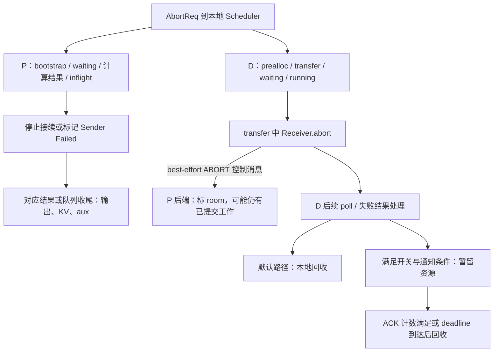
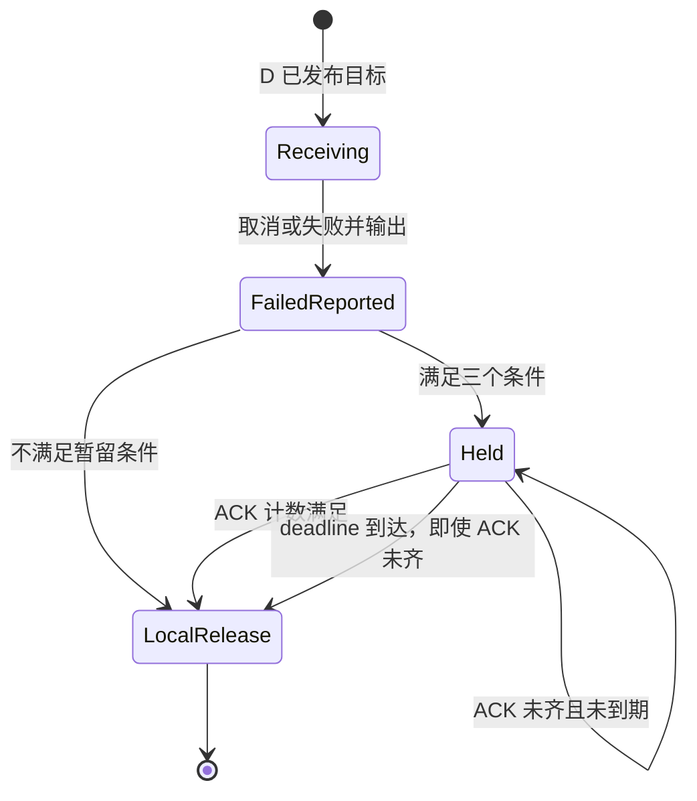
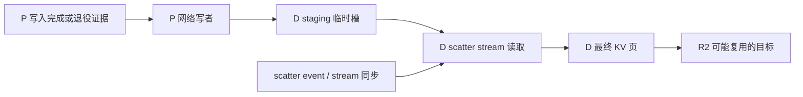

# PD 异常取消与资源退役

本文是 **07-05，源码分析型学习资料**。前几篇解释了 KV 怎样从 P 交给 D；本篇跟踪另一条主线：**R1 在传输途中被取消，已经交给 GPU、传输线程和远端的工作怎么办？**

人话版：取消订单可以很快，但已经出发的搬运任务未必立刻停下。只有弄清楚谁还可能读旧页、写旧目标，才能判断这些格子何时可以交给 R2。客户端收到错误、room 被删除、ACK 到达、allocator 执行 free，是不同事件。

## 0. 阅读基线与范围

| 项目 | 内容 |
| --- | --- |
| 源码仓库与路径基准 | 官方 `sgl-project/sglang`；所有源码路径相对于 SGLang 仓库根目录 `.` |
| 分支 | `codex/sglang-source-study-20260909`，基于已拉取的官方 `main` |
| 固定 commit | `72d5c5bb73cadd7ffbf5114e5f81e29d36b6c61a` |
| 读取日期 | `2026-09-10`；沿用 2026-09-09 固定源码 |
| 源码工作区 | 独立 `sglang-source-study` worktree，读取时干净；原 `sglang` 工作区保留 `muxi-main` 及原有 26 个未跟踪文件 |
| 文档工作区 | Wiki `sglang/source-study/`；只增补本篇、附录与必要导航，保留其他资料 |
| 主线 | 普通 Dense/GQA，P/D 各一个实例，TP/CP/PP=1，直接 Mooncake KV；R1 在 D transfer queue 中收到显式取消 |
| 逐次加入的变化 | 开启延迟释放、多个 P 来源、等待超时/心跳失败，再对照 NIXL/MoRI、staging、PP 与迟到结果 |
| 首轮关闭 | Overlap、提前发送缓存前缀、D Radix/HiCache/HiSparse、staging、投机、统一内存搬迁及重算恢复 |
| 操作边界 | 静态阅读与文档/教学账本检查；未改 SGLang，未安装或导入运行依赖，未执行单元测试、服务、GPU/RDMA、故障注入或槽位复用实验 |
| 结论范围 | 描述本版实际状态与释放条件，并标出尚不能据此证明的并发边界；不借用历史内部协议，不宣称已完成外部传输库的排空证明 |

前置：[07-02 P 侧](02-Prefill侧Bootstrap与传输状态.md)、[07-03 D 侧](03-Decode侧预分配接收与就绪.md)、[07-04 三个后端](04-KV传输接口与后端实现地图.md)。本地请求结束/缓存所有权见 [02-06](../02-request-lifecycle/06-完成取消与资源释放.md) 和 [04-07](../04-kv-cache/07-KV缓存全生命周期与排障.md)。

本文区分：**源码事实**是固定版本的分支与调用顺序；**整理者推演**是按已读条件构造的时序；**运行观察**需要真实执行证据。本篇没有运行观察。源码注释中的 “safe”“drained” 需结合调用者和所有在途操作理解，不能单独充当安全结论。

## 1. 先列出取消时仍可能存在的对象

### 1.1 一条请求有几种“结束”

| 名字 | 人话解释 | 不能单独证明什么 |
| --- | --- | --- |
| `AbortReq` | 调度控制消息：请求不要继续生成 | GPU 或网络任务已经停止 |
| `FINISH_ABORT` / `to_finish` | 已结束原因 / 交给结果处理路径的待结束标记 | 数据搬运已排空 |
| `KVPoll.Failed` | 当前传输状态被判失败 | 所有同 room 的已提交操作都已终止 |
| `abort_notified` | receiver 已执行过 best-effort ABORT 通知路径 | 每个 P rank 收到消息或回复 |
| `clear()` | 移除请求级状态/索引 | 关闭传输引擎、注销池、撤销已经发布的地址 |
| deferred release | 暂留失败请求的 KV、请求位置和 aux 分配 | 永远等到真实排空才释放；本版还有 deadline 分支 |
| `ABORT_ACK` | 后端定义的一种响应消息 | 不看消息格式、开关和发送条件就认定可复用 |

`prepare_abort()` 写 `finished_reason` 并处理部分 logprob 字段；它自己不发送输出，也不执行 KV 回收。`is_aborted()` 同时检查 `to_finish` 和已完成原因。公共 Sender 的 `abort()` 记录失败并锁存本 sender 的失败结果；Receiver 的 `abort()` 还尝试向 P 发 ABORT。[结束标记][S3] [判定][S4] [Sender][S5] [Receiver][S6]

### 1.2 R1 的资源清单

沿用 8 输入 token、页大小 4、P 页 `[7,12]`、D 页 `[3,9]`。假想 P aux 行=3、D aux 行=7，D 请求位置表行为 5。它们只是独立编号空间中的教学值。

| 对象/资源 | 谁持有或管理 | 取消时仍可能发生的访问 |
| --- | --- | --- |
| P `Req`、KV 与前缀锁 | Scheduler、缓存/allocator | 已排队任务或引擎仍读 P 页；GPU 也可能完成旧 forward |
| `TransferKVChunk` 与已提交操作 | 传输队列、worker、外部引擎 | 任务从队列取出后，删队列/room 不会自动撤回外部调用 |
| D `DecodeRequest` 与请求行 5 | prealloc/transfer queue、请求池 | 定位目标 KV 和 metadata；错误后可能先退出活动队列但仍被暂留表引用 |
| D KV 页 `[3,9]` | KV allocator，接收期间归 R1 占用 | P 仍可能向已发布地址写；复用给 R2 后旧写会触及同一物理区域 |
| P aux 3、D aux 7 | 两端各自的 metadata allocator | 交接首 token/统计等的独立传输，不能只核对 KV 页 |
| 可选 staging 槽与 scatter | staging allocator、D scatter stream | 网络写入临时槽；本地 GPU 从临时槽读取并写最终 KV |
| peer 描述、ZMQ 连接、内存注册 | Manager/传输库 | 通常服务多个 room，寿命长于一次请求 |

资源回收应回到 `release_kv_cache()`：它交给缓存处理完成请求、处理多分配范围并释放请求行/状态，是否保留前缀由缓存策略和 `is_insert` 决定；这个 helper 没有调用远端传输排空接口。[本地回收入口][S16] “释放请求持有”也不必然等于整块缓存内存立刻变成空闲。

## 2. 取消从哪里进入，为什么每个队列处理不同

### 2.1 从请求 ID 到 P/D 本地调度

TokenizerManager 防止空 rid 在非 `abort_all` 时误匹配所有请求，并对有状态的请求用 `abort_sent` 避免重复派发。Scheduler 用 `abort_all` 或 `rid.startswith(...)` 匹配目标，再按所在队列处理。因此阅读测试时要看其是否显式取消了 P 和 D，不能默认一次调用等于完整双端取消。[Tokenizer 入口][S1] [Scheduler 分发][S2]



**图意解读：** 方框是处理阶段，不是新的独立进程。实线表达控制关系；图没有画出某个 ABORT 能中断传输库。P 的状态变化与已提交工作分别由不同线程观察。

### 2.2 按请求位置查实际动作

| 位置 | 源码采取的动作 | 资源边界 |
| --- | --- | --- |
| P bootstrap queue | 调用 sender.abort；PP 还把 Req 标为 FINISH_ABORT；由后续 bootstrap 处理失败 | 不能因为尚未握手就认为乐观计算路径绝无本地 KV |
| P waiting queue | 移出等待、向 Tokenizer 回报，释放已分配 aux；pending bootstrap 情况尝试 abort sender | 普通未计算请求与特殊 state/乐观路径需分开看 |
| P 已在 inflight queue | 对 sender 标记 abort，后续 poll 的失败分支收尾 | 此时可能存在已提交的网络读写 |
| D prealloc queue | receiver.abort；握手失败处理写 FINISH_ABORT，再从主 queue 与共享 pending 引用列表移除 | 当前请求尚未进入正常目标发布/transfer 阶段 |
| D transfer queue | receiver.abort；满足条件时建立 ACK 计数器；后续统一失败路径决定立即或延迟回收 | D 已经拥有并可能公布目标页和 aux |
| D waiting queue | 请求 KV 已接收并交接；移出队列并释放本地 KV 持有 | 不应套用“waiting 一定没分配资源” |
| running/已发起计算 | 设置 `to_finish`，复用结果处理链收尾 | 已经发起的计算仍需按本地执行依赖处理 |

表中队列分发来自 [Scheduler.abort_request][S2]；P bootstrap 后续见 [pop_bootstrapped][S8]、[bootstrap 失败][S9]；D 后续见 [握手失败][S17]、[prealloc 清理][S18]。`DecodeRequest` 可以同时被 queue 与 pending_reqs 引用，删一个列表不等于完全退役。

### 2.3 P 的迟到结果不能重新发送或重复释放

分块取消先记录 `_pending_chunked_abort_req`，在调度边界由 `process_pending_chunked_abort()` 处理，停止后续 chunk 接续；它会标记结束、调用 sender.abort、释放已分配 aux/本地 KV 并清掉 chunk 指针。这里应结合本地 stream/结果顺序理解，不能把“在调度边界释放”自动理解成“所有网络读者已排空”。[分块取消处理][S12]

P 结果处理器在有 `copy_done` 时等待该事件；对 `is_aborted(req)` 分支跳过输出 token 接入、缓存未完成请求和 KV 发送。中间块先扣 `inflight_middle_chunks`；若还有后续/最终块在途，推迟相应结果收尾。`_retire_aborted_prefill_result()` 再检查 Req 是否还持有 KV、Mamba 或 aux，避免已退役请求被迟到结果重复清理。[结果处理][S10] [资源持有检查][S11]

`maybe_release_metadata_buffer()` 只在 P aux 编号非负时 free，并将编号设为 -1。这是本地重复释放防护，不是对端 aux 写入完成屏障。[aux helper][S15]

## 3. 先走默认主线：D 在传输中取消 R1

### 3.1 默认分支实际做了什么

固定源码的 `SGLANG_DISAGGREGATION_DEFERRED_DECODE_KV_RELEASE` 默认 **False**，等待期限声明默认 30 秒。第一轮不开启该功能。[声明值][S71]

1. D `Receiver.abort()` 记录失败、设 `conclude_state=Failed`，对已知 P 端点逐个尝试发 ABORT。
2. `_send_abort_notification()` 捕获每个目标的发送异常；调用者随后把 `abort_notified` 设为 True。因此它表示“已尝试通知”，不能解释成所有发送成功，更不能解释成 P 已接收。
3. D 下一次 transfer queue poll 得到 Failed，调用 `failure_exception()` 获取/清理错误信息，然后 `prepare_abort()` 并输出失败。
4. 默认不进暂留分支，调用 `release_kv_cache(..., is_insert=False)`，清 receiver。随后复位 D aux 的 room 标记为 0、释放 aux 索引，并从活动队列移除。

对应源码：[通知方法][S7]、[receiver abort][S6]、[D 失败与回收][S19]。

**源码事实：** 这条默认路径没有等待 ABORT_ACK 才调用 D 本地释放。**结论边界：** 是否有未完成写入、何时物理槽位实际被重用，还取决于当时传输操作、缓存/allocator 和调度时序。本篇没有故障实测，不能把默认本地回收当作远端写入排空证明。

### 3.2 P 看见失败以后，源页也有自己的收尾

P inflight 队列通过 TP/CP 的 poll 汇总观察 Failed，调用 `handle_inflight_transfer_failure()`。它取 sender 的失败异常，再释放本地 KV 持有、构造 FINISH_ABORT；批次收尾输出，并释放 P aux。成功与失败都不是通过注销整池完成请求清理。[P inflight][S13] [失败 helper][S14]

Mooncake 的 `failure_exception()` 会 clear 请求表再抛异常；NIXL Sender 还锁存 `_send_failed` 并清理例外表/room；公共 Sender.clear 会移除 `request_status`、transfer 信息、prefix 信息，以及持有的 deferred ACK 目标。[Mooncake 异常][S34] [NIXL 异常][S37] [公共 clear][S43]

这里必须问：**worker 是否已经复制了 target 引用，或把地址交给外部引擎？** 如果答案是“可能”，删 Python room 表就不等于撤销这些操作。P 源页可复用与 D 目标页可复用是两条证明，不能只保住 D 就忽略 P。

## 4. 打开延迟释放后：保留什么、等待什么

### 4.1 三个条件与两个表

D transfer 失败分支只有同时满足以下三个条件才调用 `_defer_release()`：[D 分支][S19]

```python
# 从失败分支摘取条件；self 和 decode_req 由所在方法提供。
(
    self.enable_deferred_kv_release
    and decode_req.kv_receiver.kv_mgr.enable_deferred_decode_kv_release
    and decode_req.kv_receiver.abort_notified
)
```

前两个条件来自队列和 Manager 对环境开关的读取；第三个是通知路径标记。它不是一个检查外部引擎状态的表达式。Common Manager 也读取这个开关，因此字段为 True 本身不能证明某个后端实现了相同 ACK 协议。[Manager 初始化][S23]

| 暂留对象 | 记录内容 | 用途 |
| --- | --- | --- |
| `_deferred_releases` | `(DecodeRequest, deadline, metadata_idx, required_acks)` | 保存已移出活动 transfer queue 的失败请求及其资源 |
| `_deferred_abort_ack_tracker[room]` | 已收到的 P 来源 ID 集合 | 每个来源只计一次；该 room 必须先注册集合 |
| P `_deferred_ack_targets[room]` | D 的 IP/端口 | P 满足自己的 ACK 条件后知道回复哪里 |

`_defer_release()` 使用 `time.monotonic()+timeout` 建立期限，快照 `required_acks = len(receiver.bootstrap_infos)`，包含实际通知列表中的目标，不能拿正常 KV 数据来源计数替代。它不自己创建 ACK 集合。[暂留][S20] [ACK 注册][S24] [ACK 记录][S25] [P 目标登记][S30]

暂留期间，失败输出已经可以发送，Req 仍由暂留表持有，D KV/请求行/aux 仍未走该分支的释放。活动队列为空不再意味着这些资源全回池。

### 4.2 R1 的两来源教学时序

为了只演示 ACK 计数，令 D 此次通知两个 P 来源；两个来源各自负责目标布局的一部分，仍共同服务 D 页 `[3,9]`。假定显式取消已经建立 ACK 集合，之后 ACK 才到达；不启用 staging，暂留期限默认 30 秒。

| 时间 | 动作 | ACK 集合 / 需求 | D 资源 |
| --- | --- | --- | --- |
| 10.0 s | D 显式取消 R1，尝试 ABORT，建立集合 | `{}` / 2 | 页、请求行和 aux 仍持有 |
| 10.1 s | 失败处理进入 `_defer_release` | `{}` / 2；deadline=40.1 s | 从活动 queue 移出，放入暂留表 |
| 11.0 s | 收到来源 0 ACK | `{0}` / 2 | 暂留 |
| 12.0 s | 再收到来源 0 ACK | `{0}` / 2 | 重复消息不加一 |
| 15.0 s | 收到来源 1 ACK | `{0,1}` / 2 | 下一次 resolve 选择释放 |
| 15.1 s | `_do_release` 完成 | ACK 表清除 | 本地 KV 持有释放，aux room=0、aux 索引归还，receiver 清掉 |

这些时间是教学值，不是网络延迟实测。`is_abort_release_safe()` 的实际谓词是集合大小 `>= required_acks`；它没有保存并比对一个完整的预期来源身份集合。[计数谓词][S26] [清 ACK 表][S27] [实际释放][S21]



**图意解读：** 这是 D 队列的教学状态图，不是 `KVPoll` 枚举。两条从 Held 到释放的边都存在于源码；必须在记录中注明到底走了哪一条。

### 4.3 期限回收和异常处理也属于契约

若上表来源 1 始终没回复，40.1 秒后执行 resolve 时仍会选中释放，并记录 “without a full drain ack … releasing anyway”。所以“延迟释放”不能改写成“永不复用尚未排空的页”。[resolve][S22]

`resolve_deferred_releases()` 先把仍需暂留的列表写回，再逐个 `_do_release()`；某个释放抛异常时记录日志并继续，已选中的条目不会在下一轮自动重试。这避免重复尝试已部分释放条目，但也意味着**暂留列表为空不能证明每个释放动作都完整成功**。[选择与异常隔离][S22]

普通 D 队列处理在回撤/轮询门槛之前 resolve；PP 路径即使本次没有 release rids 也会 resolve。它依赖调度调用推进，不是独立的 deadline 定时器。D 有暂留条目时，on_idle 暂跳过对应池泄漏检查，不能把该跳过解释成无资源持有。[普通调用][S51] [PP 调用][S53] [idle 检查][S52]

## 5. ACK 究竟说明了什么：按后端逐个追

### 5.1 Mooncake 的两种 ACK 不能互换

| P 侧条件 | 实际动作 | D 应怎样理解 |
| --- | --- | --- |
| 未开启延迟释放 | 活跃 room 标 Failed，直接回复 `[ABORT_ACK, room]` 两帧 | 是处理取消通知后的回复，不等待 `_staging_outstanding` |
| 开启延迟释放，room 活跃 | 先标 Failed，再登记 ACK 目标，尝试检查 outstanding | 不能先登记目标再继续接受正常工作；还要看计数覆盖范围 |
| 开启延迟释放，room 已结束或不存在 | 仅在 outstanding 为 0 时直接回复三帧 ACK | room 不存在本身不足以回复 |
| worker 正常越过本 chunk 的完成路径 | 扣 outstanding，再尝试发已登记 ACK | 回复带来源 ID；D 才能去重计数 |

对应 [P ABORT 分支][S31]、[worker 计数][S32]、[三帧发送][S28]。D Mooncake 接收线程只有在本地开启功能且消息至少三帧时，才把 ACK 交给计数器。P/D 开关不一致时，不能把两帧回复当成三帧 drain 协议已经完成。[D ACK 分支][S84]

公共 `_maybe_ack_drained_abort()` 的直接依据是 `_staging_outstanding.get(room,0) <= 0`，再从目标表 pop 后发送。这个计数在 worker **取出任务时**建立，不是队列内所有任务数，也不是外部引擎逐操作的完整句柄表。推演时必须连同 Failed 后的拒绝/跳过、defer 重入、异常和清理一起检查。[ACK 条件][S29] [worker][S32]

Mooncake 还有一个具体加强点：并行 futures 返回非零状态时，会尝试 cancel 其他 futures；开启延迟释放后仍遍历等待已经运行的 futures，关闭时保留提前返回。`cancel()` 不能撤回已经运行的 future。这说明开关不仅影响 D 暂留，也影响 P 的这条非零返回路径；不能扩大成任意异常都已经排空。[future 等待][S33]

### 5.2 NIXL：DONE 屏障与 ERR 分支要分开读

NIXL 收到 ABORT 后把活跃 room 标为 Failed。开启功能并有回程端口时登记 ACK 目标，按 outstanding 尝试回复；不开启功能时没有这套 ACK。D 使用独立 ZMQ listener 收取三帧 ACK，避免依赖已经退出活动队列的 receiver.poll。[NIXL ABORT][S35] [D listener][S38]

正常 worker 对当前 chunk 的每个 handle 检查 `DONE/ERR`，所有 DONE 后扣计数并尝试 ACK。然而遇到首个 `ERR` 就进入异常分支，记录异常和 Failed；**该分支没有等其他 handle 都终止，也不在那里 ACK**。注释明确指出其他句柄仍可能写入，保留等待期限回收。[NIXL worker][S36]

所以可以得出“源码避免在这个 ERR 分支直接回复 drain ACK”，不能得出“ERR 已经取消所有写入”或“之后的所有清理都自动保持这些计数”。后续 sender.clear、排队任务 skip 和再来的 ABORT 仍是同一条生命周期的一部分。[Sender 失败清理][S37] [公共 clear][S43]

### 5.3 MoRI：状态失败与排空 ACK 的接入不同

MoRI 的 `_handle_abort_message()` 在锁内处理已知、尚未成功的 room，将其标 Failed；本函数没有发送上述三帧 ACK。`_process_transfer_chunk()` 在提交前后检查是否已失败/清除；若提交后发现失败可直接返回，正常等待函数也可能因正数 SLA 到期而返回失败原因。这些都不是显式取消并排空所有外部操作的调用。[ABORT 处理][S39] [提交前后检查][S40] [等待/SLA][S41]

MoRI Receiver.abort 在公共通知后还会 clear 本地 room 关联。它继承 Common Manager 的环境开关，但本篇检查的 MoRI `conn.py` 没有 `ABORT_ACK` 发送/接收接入。**若 D 满足暂留条件且没有 ACK 来源，非零 required_acks 的暂留条目将依赖 deadline 分支**；不能因为继承同一字段就认为三个后端实现了同一排空协议。[Receiver abort][S42] [开关来源][S23] [D 期限][S22]

### 5.4 Failed 是否不可逆，也要看实现

| 状态入口 | 固定版本行为 | 阅读影响 |
| --- | --- | --- |
| `CommonKVManager.update_status` | 缺失 room 的迟到 Failed 不创建；已有 room 收到非 Failed 时取数值 max | Failed=0，后续非失败更新并非总被禁止 |
| NIXL 覆盖 | 已有 Failed 时直接返回 | 已失败记录在 clear 前保持 Failed；不等于全体外部操作已停止 |
| MoRI 覆盖 | 已有 Failed 不被提升；缺失 room 只接受初始化类状态 | 减少迟到状态重新建立已清理 room 的情况 |
| sender/receiver 的 `conclude_state` | 部分实现缓存终态 | 是该对象的观察结果，不是所有线程共享的排空屏障 |

依据：[Common][S45]、[NIXL][S46]、[MoRI][S44]。Mooncake 普通 Manager 使用 Common 更新逻辑，不能只因枚举名字就声称“所有后端 Failed 全局不可逆”。异常记录与物理操作寿命仍要独立核查。

## 6. 超时、心跳失败与重启，不是一种故障

### 6.1 把时钟、起点和覆盖范围列出来

| 等待 | 固定默认与时钟 | 起点/触发范围 | 超时后的主要动作 |
| --- | --- | --- | --- |
| P bootstrap | 300 s，`time.time()` 差值 | sender 的 init_time；poll 仍为 Bootstrapping 时检查 | 记录 Failed，P bootstrap/inflight 路径随后收尾 |
| D 传输交接等待 | 300 s，`time.time()` 差值 | 普通 receiver 成功完成目标消息发送后计时；后端各自决定何时检查 | 记录 Failed、失效本次连接缓存引用、尝试 ABORT |
| D 延迟回收 | 30 s，`time.monotonic()` | `_defer_release()` 时开始 | ACK 不齐也可到期释放 |
| D 到 P 的 heartbeat | 间隔默认 5 s、失败阈值默认 2；HTTP timeout `(2,3)` | 遍历缓存的 P bootstrap 地址，连续请求失败/非 200 | 失效连接/拓扑，影响尚未成功的 room |
| MoRI 操作等待 SLA | 默认 0，即不启用该循环的总 SLA；`perf_counter()` | 本次状态集合等待 | 返回失败原因；不等于提交了外部取消 |
| staging 完成等待 | handler 的 completion timeout，`monotonic()` | 已记录所有来源 Success 后仍有未完成槽或 event | 标记 staging failed，由 D 失败路径收尾 |

声明与实现：[环境默认][S70]、[P 计时][S48]、[D 计时][S47]、[目标发送起点][S81]、[heartbeat][S65]、[MoRI 等待][S41]、[staging 推进][S62]。heartbeat 包括网络等待、遍历和调度时间，不能简单写成“10 秒精确判死”。

Mooncake D 只有 poll 为 WaitingForInput 时检查接收期限；其 receiver 已缓存 Success 后，如果外层 metadata gate 仍没满足，不会自动继续执行同一个 receiver 等待超时。NIXL 则在开始传输后先消化通知、判断完成，再检查等待期限。没有一条全局计时规则覆盖所有后端与外层 gate。[Mooncake poll][S49] [NIXL poll][S50]

### 6.2 两个 ACK 建表顺序，为什么影响等待

**显式取消：** Scheduler 先 `receiver.abort()`，其内可能已经发出 ABORT；返回后才 `register_deferred_abort_room()`。`note_abort_ack()` 只向已存在集合加入元素。如果回复在建表之前被接收，就会被丢弃；重复显式取消还会重新创建空集合，而 `abort_notified=True` 又可使 receiver 不再重复发送 ABORT。[Scheduler 顺序][S2] [通知去重][S6] [建表][S24] [收集条件][S25]

**仅 receiver 等待超时：** `_check_waiting_timeout()` 会尝试 ABORT 并置通知标记，但没有调用 ACK 建表；`_defer_release()` 也不建表。若此前没有显式取消等路径建立集合、required_acks>0，收到的 ACK 不会在这条路径上被计入，条目会依赖期限处理。[超时路径][S47] [暂留路径][S20]

这些是从调用顺序得到的**静态推演条件**，不是本轮测得的“所有取消都必定等满 30 秒”。正常教学时序特意假定 ACK 在建表后到达；实际复现要覆盖两种顺序与重复取消。

### 6.3 peer 失效与恢复：清连接，不是杀死远端 DMA

heartbeat 连续失败后，Common Manager 从 connection pool 取出旧 rank 端点，删除对应连接缓存和 P 拓扑记录，关闭缓存的 ZMQ PUSH socket，再把关联、尚未 Success 的 room 标 Failed。它没有调用外部传输引擎的全局排空接口。[节点失败处理][S66] [socket 关闭][S68]

等待超时的 `invalidate_cached_bootstrap_infos()` 还使用 Python 对象身份 `is`：只有当前缓存值仍是该 receiver 当初使用的那份列表，才删除，避免旧请求把并发替换的新缓存删掉。测试中的“generation”在这里是缓存对象的代次语义，不是 wire 上每次内存租约的 epoch。[按引用失效][S67]

Mooncake P 还会探测失败 session；probe 返回 0 后移出失败集合、清计数，让会话恢复可用。它不自动恢复已经 FINISH_ABORT 的 R1，也不验证旧 room 的每个目标页内容。[会话恢复][S69]

重启场景至少分开：P 的 HTTP/路由是否恢复、rank 端点是否变化、缓存是否重新取回、传输库 peer 身份是否更新，以及旧请求是否已经终止。新连接成功或 health=200 只说明对应观测点可用，不能替代旧写者退役证明。

## 7. 多 rank 共识与 staging，多出了哪些边界

### 7.1 共识同步的是状态与候选 ID

TP/CP poll 用 MIN 汇总，Failed=0 因而会传播。P 先在 attention TP 组汇总，再在 attention CP 组汇总。某 rank 没有本地错误原因，却被归约为失败时，`failure_exception()` 可标注异常来自其他 rank，日志降级只是减少重复报错，不代表该 rank 没有执行失败收尾。[MIN][S54] [TP/CP 汇总][S55] [Mooncake 异常来源][S34]

| PP 阶段 | ID 合并规则 | 含义 |
| --- | --- | --- |
| P bootstrap、D prealloc | good 取交集、bad 取并集；本地 FINISH_ABORT 移入 bad | 一处拒绝/取消可以进入本轮失败共识 |
| P/D transfer 候选 | 每 stage 的 Success/Failed 终态 RID 集合取交集 | 是“各 stage 已观察终态”的候选集合，不是一个统一的成功布尔值 |
| 最终队列处理 | 只处理共识选中的 RID，并继续检查对应本地 poll/gate | PP 共识没有替代外部传输库的完成条件 |

依据：[P bootstrap][S56]、[D prealloc][S57]、[P transfer][S58]、[D transfer][S59]。例如 stage0 的终态候选为 `{R1,R2}`、stage1 为 `{R1,R3}`，交集只有 R1；若它们对 R1 的具体终态分别是 Success/Failed，单看这个 RID 交集并不能推出“所有 stage 都成功”。

D 暂留 ACK 数来自各本地 receiver 的 bootstrap_infos；这些计数与 TP/CP poll、PP RID 集合是三套机制。同步 Failed 的目的包括让各 rank 一致退出某条调度路径，它本身没有让尚未完成的写操作变成 DONE。

### 7.2 staging 增加了本地写者，回收顺序要看到调用者

staging 下，网络先写临时槽，再由 D scatter stream 搬到最终 KV。`submit_chunk_scatter()` 获取 room 的 DecodeRequest，提交后记录 CUDA event；`advance_scatter()` 查询 event，回收完成的临时槽并发送 watermark，还会检测“来源 Success 后长期未完成”。[提交][S63] [推进][S62]



**图意解读：** D 同步 scatter stream 只处理本地这类 GPU 工作；不能据此推定 P 的网络写者也排空。反过来，P 的数据已经送到临时槽，也不代表 D scatter 完成。

`unregister_decode_req()` 先从 room 映射移除对象，再调用 `release_room()`；后者同步 scatter stream，释放未 scatter 的分配和 event 关联分配。但必须继续看谁先调用它：[注销][S60] [释放 helper][S61]

| 调用路径 | 读到的先后顺序 | 结论边界 |
| --- | --- | --- |
| 延迟回收 `_do_release` | staging unregister/stream 同步 → `release_kv_cache` → aux free | 明确安排本地 staging 收尾先于 KV 释放 |
| `pop_transferred` 的立即失败分支 | `release_kv_cache` → receiver clear → 后续移除循环中的 staging unregister | 不能把 helper 内“先同步再释放”的注释泛化为所有调用者先于 KV free |
| 后台已经取得 room 对象的提交 | 取引用、提交 kernel、登记 event 分属步骤 | 仅 pop 映射不等于已经撤回所有后台引用；需验证线程交错 |

依据：[延迟调用者][S21]、[立即调用者][S19]、[后台提交][S63]。这些顺序是源码事实；本篇没有测得旧 scatter 写入复用页，也没有将某个局部同步推广成完整线程/网络排空证明。

HiCache 还多出预取登记、恢复节点锁和本地回载。D 失败路径会调用 `_clean_hicache_prefetch_resources()` 清预取/恢复关联；它和远端传输排空不是同一个动作。完整缓存控制器的运行时故障证据需要结合 [04-05](../04-kv-cache/05-HiCache分层存储与回载.md) 单独收集。[HiCache 清理入口][S64]

## 8. 审视复用时，用“操作清单”补足状态名

### 8.1 下面这些局部事实，不能扩大为完整保证

| 已读源码事实 | 仍需补足的证明或条件 |
| --- | --- |
| D 因 P 失败/heartbeat 失败进入 Failed，且 `abort_notified=False` 时走立即释放 | 失败由哪个引擎事件触发；是否存在其他尚未终止的 handle/future。不能只采用“P 已失败，所以已经停写”的注释假设 |
| ABORT 通知逐目标 best effort，标记不代表全部发成功 | 每个可能写者是否真的停止接续/排空；不能只数发送尝试 |
| NIXL ERR 不在异常分支 ACK | 其他句柄是否仍运行；后续 clear/skip 是否保留了足够的在途记账 |
| P clear 删除 deferred ACK target | worker 尚未完成时是否仍有回复目的地；是否因此转入 D deadline 路径 |
| ACK 集合在新注册时清空，并丢弃没有集合时的迟到 ACK | 若同一 room 被复用、旧 ACK 在新集合建立后到达，三帧里没有新请求 epoch；不能仅用集合重置证明全窗口隔离 |
| D 按 ACK 不同来源 ID 的数量判断 | 不能等同于严格核对完整预期写者身份集合；还需结合可信来源与拓扑 |
| aux room 先设为 0，收到后再校验 room | 这是识别未写入/错交接的门槛，不阻止迟到数据先写入某个已复用的地址 |
| move gate 检查队列与已发布/待结算计数 | 这是正常地址暴露窗口的调度保护，不替代每条异常路径的已提交操作排空 |

对应 [D 分支][S19]、[通知][S7]、[NIXL ERR][S36]、[clear][S43]、[ACK 内容][S28]、[计数条件][S26]、[room 提交校验][S80]、[move gate][S79]。这里讨论相同 room 复用是条件推演，不声称本轮已经观察到默认 ID 分配碰撞。

另一个容易遗漏的窗口是**部分目标发布成功后发送失败**。例如 Mooncake `send_metadata()` 逐个向 P 发送；后一个目标发生 ZMQError 时，将请求置 Failed 并返回，前面已经发送的目标不会因此自动撤回。本函数没有在该 catch 中设置 `abort_notified` 或给已成功发送的端点执行一轮 ABORT。不能把这个失败等同于“从未向任何 P 公布过地址”。[目标发布失败][S81]

### 8.2 一份有用的排障记录应追到这些层次

| 现象 | 第一组检查 | 回源码与避免误判 |
| --- | --- | --- |
| 客户端已收到 abort，但内存没有立即恢复 | 是否进入暂留；deadline/required_acks；是否仍由缓存持有 | [D 暂留][S20]、[本地释放][S16]；不直接判断泄漏 |
| 取消后约 30 秒才回收 | ACK 集合何时注册、是否重置、发送是否成功、P/D 开关与后端接入 | [顺序][S2]、[timeout][S47]、[resolve][S22] |
| 暂留表已空，却有资源未清理日志 | `_do_release` 是否抛异常、哪些动作已完成 | [异常隔离][S22]；空表不证明全部释放成功 |
| NIXL Failed 后计数仍非零 | 哪个 handle ERR，其他 handle 状态，worker 是否到 DONE 屏障 | [worker][S36]；不强制把计数归零来“修复”现象 |
| P 取消后迟到结果又到 | `to_finish`、finished_reason、middle chunk 计数、KV/aux 持有标记 | [结果处理][S10]、[退役 guard][S11] |
| 节点重启后新请求握手不通 | 缓存端点、对象替换、HTTP 拓扑与外部 peer 身份 | [失效][S67]、[节点失败][S66]；health=200 不是全路径验收 |
| 错 room 或疑似复用页污染 | 源/目标页的时间线、aux 行、旧 worker/handle、scatter 和新 owner | [提交校验][S80]、[staging][S63]；不能只看最后一次错误日志 |

这里只提供定位地图，不在文档中执行清队列、改超时或重启。排障证据应包含不可混淆的模型/实例版本、rank、room、请求和物理槽位关系。

## 9. 测试读到了什么，真实验证还差什么

### 9.1 本轮只阅读的六份测试文件

| 测试文件/范围 | 已读内容 | 覆盖边界 |
| --- | --- | --- |
| `test/registered/unit/disaggregation/test_deferred_decode_kv_release.py` | ACK 去重/建表前丢弃/重置、集齐后释放、无 ACK 到期释放、释放异常隔离、期限记录 | 使用替身和 Mock，未验证真实在途 DMA；迟到 ACK 用例将旧 ACK 放在新注册之前 |
| `test/registered/unit/disaggregation/test_nixl_deferred_kv_release.py` | 计数大于零不 ACK、归零后 ACK、登记前 worker skip、已清理但仍 outstanding 的 room 不 ACK、两帧旧 ABORT 兼容 | 操纵计数/截获发送；不是外部 NIXL 句柄排空实验 |
| `test/registered/unit/disaggregation/test_prefill_abort_result_cleanup.py` | 七个用例：最终/中间/仍有后续块/已释放结果、sender.abort 抛异常、grammar 拒绝、先分配 Mamba 的清理 | 验证调用和对象字段，不证明 GPU/RDMA 交错下物理页复用安全 |
| `test/registered/disaggregation/test_disaggregation_chunked_prefill_abort.py` | 长输入生成时反复向 P 和 D `/abort_request` 发取消；断言 abort 结果、请求线程结束和三个 health 端点正常 | 没有精确停在某个 DMA/scatter 窗口，也没有在同槽复用后比对 KV 内容 |
| `test/registered/unit/disaggregation/test_receiver_connection_pool.py` | 缓存按对象身份失效、保留并发替换、下一 receiver 重取、等待超时失效 | 测试“generation”不等于网络写租约/重启 epoch |
| `test/registered/unit/disaggregation/test_nixl_sender_failure_cleanup.py` | 异常前清本 room、保留另一 room、锁存发送失败 | 只证明本地 bookkeeping 清理 |

固定入口：[ACK 用例][S72]、[释放用例][S73]、[NIXL ABORT 用例][S74]、[P 结果用例][S75]、[端到端取消测试][S76]、[连接缓存测试][S77]、[NIXL 失败清理测试][S78]。**以上均未执行。** 测试文件的注释或命名表达意图；判断覆盖范围以实际输入和断言为准。

D 的 `failure_exception()` 也有实现差异：Mooncake/MoRI 会 clear 本地 room，NIXL Receiver 主要取原因并抛错。共同的 `pop_transferred()` 仍需完成各自剩余收尾，不能假定“取异常”在所有后端都只是只读操作。[Mooncake][S34] [NIXL Receiver][S82] [MoRI Receiver][S83]

### 9.2 若后续做实验，应分开验证控制流与内容

本轮不执行下列实验。准备环境后，使用[实验记录模板](../appendices/05-实验记录与证据模板.md)，每次只加入一个变化：

1. **取消到达位置**：分别停在 P 未握手、P 已排队未提交、已提交操作、D 目标部分发布、D 接收成功未 commit、D 已进入运行的阶段。
2. **精确事件记录**：同一 rid/room 下记录源页、D 页/请求行/aux、所有 writer/handle、失败标记、ACK 建表/收取/清除、释放和 R2 复用时刻；staging 再记录取引用、kernel 提交和 event。
3. **故障变量**：ABORT 丢失、ACK 早到/迟到/重复、某个 NIXL handle ERR 而其他仍运行、P/D 重启、更换端点、deadline 到达，分别覆盖，不以一次 sleep 假定命中窗口。
4. **内容与隔离断言**：R1 结束可见只是第一层；还要证明 R2 复用后内容不被旧写者改动、所有相关 rank 状态一致、资源账本守恒，并确认非目标请求继续正常。
5. **证据分级**：记录“已读源码”“Mock 验证”“真实设备/网络验证”“未覆盖”四种状态；不把健康检查或单次端到端输出代替内容与资源生命周期验证。

## 10. 自测与下一篇

### 10.1 自测

1. D 已给客户端输出 abort，为什么 transfer queue 为空而 KV 仍可能被占用？
2. 需要两个来源 ACK，按顺序收到 `0、0、1`，何时满足计数？若第二个来源始终不到，deadline 后源码做什么？
3. ACK 在 `register_deferred_abort_room()` 之前到达，与旧请求 ACK 在新一次注册之后到达，现有集合逻辑能否同样区分？
4. NIXL 一只 handle ERR，是否可以直接认为其他句柄已经停止？
5. `release_room()` 内部先同步 scatter，能否证明 D 所有失败分支都先同步再释放最终 KV？
6. PP 两个 stage 的终态 RID 集合都含 R1，能否推出它们对 R1 都判定成功？

### 10.2 参考答案

1. 错误输出、移出活动队列和物理释放分开；暂留表仍引用 DecodeRequest，缓存也可能继续持有某些页。先查暂留条件和实际缓存策略。
2. 第三个消息后集合 `{0,1}` 满足；第二个 `0` 不增加数量。若不齐且到期，resolve 仍尝试回收，不能把它当排空已证实。
3. 建表前没有集合，ACK 被丢弃；新集合存在后，消息只有 room/来源 ID，集合本身不带旧/新请求 epoch。后者需要额外身份与时序约束，不能由前者测试推出。
4. 不能。固定 worker 在首个 ERR 跳出等待路径，其他句柄可能还运行；必须分别检查其最终状态及后续资源持有。
5. 不能。必须检查调用者：延迟 `_do_release` 先 unregister，立即失败分支先调用 KV 释放、后在移除循环注销 staging。
6. 不能。这里交集包含 Success 或 Failed 的终态候选 ID，不是所有 stage 成功的布尔共识，也不是传输库排空证明。

### 10.3 推荐回源码顺序

按 `python/sglang/srt/managers/scheduler.py::Scheduler.abort_request` → `python/sglang/srt/disaggregation/common/conn.py::CommonKVReceiver.abort` → `python/sglang/srt/disaggregation/decode.py::DecodeTransferQueue.pop_transferred` → `_defer_release` / `resolve_deferred_releases` / `_do_release` 阅读。随后选择一个后端的 ABORT 处理和 worker，反向问“本次 free 之前，哪些操作可能还保有地址”。

**本篇验收：** 能从 R1 的取消入口画出 P 源页、D 目标页、aux、staging 和控制消息的不同寿命，指出本版何时立即回收、何时暂留、何时期限回收，并区分代码动作与尚缺的真实排空证据。

下一篇 [07-06《PD 与 PP 及 Encoder 分离的组合》](06-PD与PP及Encoder分离的组合.md)继续把 stage 层分片、P/D KV 交接和 Encoder 输出接起来，分别画出 embedding、激活和 KV 的路径。

[返回总目录](../README.md) · [术语速查](../appendices/01-术语与对象速查.md) · [源码索引](../appendices/02-源码入口与调用链索引.md) · [配置矩阵](../appendices/03-配置解析与功能兼容矩阵.md) · [排障索引](../appendices/04-症状到源码的排障索引.md) · [进度记录](../appendices/06-学习进度与版本变更记录.md)

[S1]: https://github.com/sgl-project/sglang/blob/72d5c5bb73cadd7ffbf5114e5f81e29d36b6c61a/python/sglang/srt/managers/tokenizer_manager.py#L2009
[S2]: https://github.com/sgl-project/sglang/blob/72d5c5bb73cadd7ffbf5114e5f81e29d36b6c61a/python/sglang/srt/managers/scheduler.py#L5171
[S3]: https://github.com/sgl-project/sglang/blob/72d5c5bb73cadd7ffbf5114e5f81e29d36b6c61a/python/sglang/srt/disaggregation/utils.py#L1626
[S4]: https://github.com/sgl-project/sglang/blob/72d5c5bb73cadd7ffbf5114e5f81e29d36b6c61a/python/sglang/srt/disaggregation/utils.py#L1641
[S5]: https://github.com/sgl-project/sglang/blob/72d5c5bb73cadd7ffbf5114e5f81e29d36b6c61a/python/sglang/srt/disaggregation/common/conn.py#L1371
[S6]: https://github.com/sgl-project/sglang/blob/72d5c5bb73cadd7ffbf5114e5f81e29d36b6c61a/python/sglang/srt/disaggregation/common/conn.py#L1647
[S7]: https://github.com/sgl-project/sglang/blob/72d5c5bb73cadd7ffbf5114e5f81e29d36b6c61a/python/sglang/srt/disaggregation/common/conn.py#L1662
[S8]: https://github.com/sgl-project/sglang/blob/72d5c5bb73cadd7ffbf5114e5f81e29d36b6c61a/python/sglang/srt/disaggregation/prefill.py#L422
[S9]: https://github.com/sgl-project/sglang/blob/72d5c5bb73cadd7ffbf5114e5f81e29d36b6c61a/python/sglang/srt/disaggregation/prefill.py#L1092
[S10]: https://github.com/sgl-project/sglang/blob/72d5c5bb73cadd7ffbf5114e5f81e29d36b6c61a/python/sglang/srt/disaggregation/prefill.py#L701
[S11]: https://github.com/sgl-project/sglang/blob/72d5c5bb73cadd7ffbf5114e5f81e29d36b6c61a/python/sglang/srt/disaggregation/prefill.py#L1063
[S12]: https://github.com/sgl-project/sglang/blob/72d5c5bb73cadd7ffbf5114e5f81e29d36b6c61a/python/sglang/srt/managers/scheduler.py#L3408
[S13]: https://github.com/sgl-project/sglang/blob/72d5c5bb73cadd7ffbf5114e5f81e29d36b6c61a/python/sglang/srt/disaggregation/prefill.py#L918
[S14]: https://github.com/sgl-project/sglang/blob/72d5c5bb73cadd7ffbf5114e5f81e29d36b6c61a/python/sglang/srt/disaggregation/prefill.py#L1025
[S15]: https://github.com/sgl-project/sglang/blob/72d5c5bb73cadd7ffbf5114e5f81e29d36b6c61a/python/sglang/srt/disaggregation/prefill.py#L121
[S16]: https://github.com/sgl-project/sglang/blob/72d5c5bb73cadd7ffbf5114e5f81e29d36b6c61a/python/sglang/srt/mem_cache/common.py#L238
[S17]: https://github.com/sgl-project/sglang/blob/72d5c5bb73cadd7ffbf5114e5f81e29d36b6c61a/python/sglang/srt/disaggregation/decode.py#L874
[S18]: https://github.com/sgl-project/sglang/blob/72d5c5bb73cadd7ffbf5114e5f81e29d36b6c61a/python/sglang/srt/disaggregation/decode.py#L1083
[S19]: https://github.com/sgl-project/sglang/blob/72d5c5bb73cadd7ffbf5114e5f81e29d36b6c61a/python/sglang/srt/disaggregation/decode.py#L2292
[S20]: https://github.com/sgl-project/sglang/blob/72d5c5bb73cadd7ffbf5114e5f81e29d36b6c61a/python/sglang/srt/disaggregation/decode.py#L2429
[S21]: https://github.com/sgl-project/sglang/blob/72d5c5bb73cadd7ffbf5114e5f81e29d36b6c61a/python/sglang/srt/disaggregation/decode.py#L2438
[S22]: https://github.com/sgl-project/sglang/blob/72d5c5bb73cadd7ffbf5114e5f81e29d36b6c61a/python/sglang/srt/disaggregation/decode.py#L2453
[S23]: https://github.com/sgl-project/sglang/blob/72d5c5bb73cadd7ffbf5114e5f81e29d36b6c61a/python/sglang/srt/disaggregation/common/conn.py#L147
[S24]: https://github.com/sgl-project/sglang/blob/72d5c5bb73cadd7ffbf5114e5f81e29d36b6c61a/python/sglang/srt/disaggregation/common/conn.py#L386
[S25]: https://github.com/sgl-project/sglang/blob/72d5c5bb73cadd7ffbf5114e5f81e29d36b6c61a/python/sglang/srt/disaggregation/common/conn.py#L391
[S26]: https://github.com/sgl-project/sglang/blob/72d5c5bb73cadd7ffbf5114e5f81e29d36b6c61a/python/sglang/srt/disaggregation/common/conn.py#L398
[S27]: https://github.com/sgl-project/sglang/blob/72d5c5bb73cadd7ffbf5114e5f81e29d36b6c61a/python/sglang/srt/disaggregation/common/conn.py#L405
[S28]: https://github.com/sgl-project/sglang/blob/72d5c5bb73cadd7ffbf5114e5f81e29d36b6c61a/python/sglang/srt/disaggregation/common/conn.py#L416
[S29]: https://github.com/sgl-project/sglang/blob/72d5c5bb73cadd7ffbf5114e5f81e29d36b6c61a/python/sglang/srt/disaggregation/common/conn.py#L432
[S30]: https://github.com/sgl-project/sglang/blob/72d5c5bb73cadd7ffbf5114e5f81e29d36b6c61a/python/sglang/srt/disaggregation/common/conn.py#L441
[S31]: https://github.com/sgl-project/sglang/blob/72d5c5bb73cadd7ffbf5114e5f81e29d36b6c61a/python/sglang/srt/disaggregation/mooncake/conn.py#L2120
[S32]: https://github.com/sgl-project/sglang/blob/72d5c5bb73cadd7ffbf5114e5f81e29d36b6c61a/python/sglang/srt/disaggregation/mooncake/conn.py#L1759
[S33]: https://github.com/sgl-project/sglang/blob/72d5c5bb73cadd7ffbf5114e5f81e29d36b6c61a/python/sglang/srt/disaggregation/mooncake/conn.py#L907
[S34]: https://github.com/sgl-project/sglang/blob/72d5c5bb73cadd7ffbf5114e5f81e29d36b6c61a/python/sglang/srt/disaggregation/mooncake/conn.py#L2438
[S35]: https://github.com/sgl-project/sglang/blob/72d5c5bb73cadd7ffbf5114e5f81e29d36b6c61a/python/sglang/srt/disaggregation/nixl/conn.py#L2761
[S36]: https://github.com/sgl-project/sglang/blob/72d5c5bb73cadd7ffbf5114e5f81e29d36b6c61a/python/sglang/srt/disaggregation/nixl/conn.py#L1088
[S37]: https://github.com/sgl-project/sglang/blob/72d5c5bb73cadd7ffbf5114e5f81e29d36b6c61a/python/sglang/srt/disaggregation/nixl/conn.py#L2968
[S38]: https://github.com/sgl-project/sglang/blob/72d5c5bb73cadd7ffbf5114e5f81e29d36b6c61a/python/sglang/srt/disaggregation/nixl/conn.py#L597
[S39]: https://github.com/sgl-project/sglang/blob/72d5c5bb73cadd7ffbf5114e5f81e29d36b6c61a/python/sglang/srt/disaggregation/mori/conn.py#L715
[S40]: https://github.com/sgl-project/sglang/blob/72d5c5bb73cadd7ffbf5114e5f81e29d36b6c61a/python/sglang/srt/disaggregation/mori/conn.py#L456
[S41]: https://github.com/sgl-project/sglang/blob/72d5c5bb73cadd7ffbf5114e5f81e29d36b6c61a/python/sglang/srt/disaggregation/mori/conn.py#L501
[S42]: https://github.com/sgl-project/sglang/blob/72d5c5bb73cadd7ffbf5114e5f81e29d36b6c61a/python/sglang/srt/disaggregation/mori/conn.py#L1890
[S43]: https://github.com/sgl-project/sglang/blob/72d5c5bb73cadd7ffbf5114e5f81e29d36b6c61a/python/sglang/srt/disaggregation/common/conn.py#L1360
[S44]: https://github.com/sgl-project/sglang/blob/72d5c5bb73cadd7ffbf5114e5f81e29d36b6c61a/python/sglang/srt/disaggregation/mori/conn.py#L418
[S45]: https://github.com/sgl-project/sglang/blob/72d5c5bb73cadd7ffbf5114e5f81e29d36b6c61a/python/sglang/srt/disaggregation/common/conn.py#L365
[S46]: https://github.com/sgl-project/sglang/blob/72d5c5bb73cadd7ffbf5114e5f81e29d36b6c61a/python/sglang/srt/disaggregation/nixl/conn.py#L665
[S47]: https://github.com/sgl-project/sglang/blob/72d5c5bb73cadd7ffbf5114e5f81e29d36b6c61a/python/sglang/srt/disaggregation/common/conn.py#L1616
[S48]: https://github.com/sgl-project/sglang/blob/72d5c5bb73cadd7ffbf5114e5f81e29d36b6c61a/python/sglang/srt/disaggregation/common/conn.py#L1341
[S49]: https://github.com/sgl-project/sglang/blob/72d5c5bb73cadd7ffbf5114e5f81e29d36b6c61a/python/sglang/srt/disaggregation/mooncake/conn.py#L2719
[S50]: https://github.com/sgl-project/sglang/blob/72d5c5bb73cadd7ffbf5114e5f81e29d36b6c61a/python/sglang/srt/disaggregation/nixl/conn.py#L3078
[S51]: https://github.com/sgl-project/sglang/blob/72d5c5bb73cadd7ffbf5114e5f81e29d36b6c61a/python/sglang/srt/disaggregation/decode.py#L2716
[S52]: https://github.com/sgl-project/sglang/blob/72d5c5bb73cadd7ffbf5114e5f81e29d36b6c61a/python/sglang/srt/managers/scheduler.py#L4675
[S53]: https://github.com/sgl-project/sglang/blob/72d5c5bb73cadd7ffbf5114e5f81e29d36b6c61a/python/sglang/srt/managers/scheduler_pp_mixin.py#L1266
[S54]: https://github.com/sgl-project/sglang/blob/72d5c5bb73cadd7ffbf5114e5f81e29d36b6c61a/python/sglang/srt/disaggregation/utils.py#L227
[S55]: https://github.com/sgl-project/sglang/blob/72d5c5bb73cadd7ffbf5114e5f81e29d36b6c61a/python/sglang/srt/disaggregation/utils.py#L249
[S56]: https://github.com/sgl-project/sglang/blob/72d5c5bb73cadd7ffbf5114e5f81e29d36b6c61a/python/sglang/srt/managers/scheduler_pp_mixin.py#L591
[S57]: https://github.com/sgl-project/sglang/blob/72d5c5bb73cadd7ffbf5114e5f81e29d36b6c61a/python/sglang/srt/managers/scheduler_pp_mixin.py#L1159
[S58]: https://github.com/sgl-project/sglang/blob/72d5c5bb73cadd7ffbf5114e5f81e29d36b6c61a/python/sglang/srt/managers/scheduler_pp_mixin.py#L633
[S59]: https://github.com/sgl-project/sglang/blob/72d5c5bb73cadd7ffbf5114e5f81e29d36b6c61a/python/sglang/srt/managers/scheduler_pp_mixin.py#L1210
[S60]: https://github.com/sgl-project/sglang/blob/72d5c5bb73cadd7ffbf5114e5f81e29d36b6c61a/python/sglang/srt/disaggregation/common/staging_handler.py#L194
[S61]: https://github.com/sgl-project/sglang/blob/72d5c5bb73cadd7ffbf5114e5f81e29d36b6c61a/python/sglang/srt/disaggregation/common/staging_handler.py#L204
[S62]: https://github.com/sgl-project/sglang/blob/72d5c5bb73cadd7ffbf5114e5f81e29d36b6c61a/python/sglang/srt/disaggregation/common/staging_handler.py#L351
[S63]: https://github.com/sgl-project/sglang/blob/72d5c5bb73cadd7ffbf5114e5f81e29d36b6c61a/python/sglang/srt/disaggregation/common/staging_handler.py#L237
[S64]: https://github.com/sgl-project/sglang/blob/72d5c5bb73cadd7ffbf5114e5f81e29d36b6c61a/python/sglang/srt/disaggregation/decode_hicache_mixin.py#L180
[S65]: https://github.com/sgl-project/sglang/blob/72d5c5bb73cadd7ffbf5114e5f81e29d36b6c61a/python/sglang/srt/disaggregation/common/conn.py#L1104
[S66]: https://github.com/sgl-project/sglang/blob/72d5c5bb73cadd7ffbf5114e5f81e29d36b6c61a/python/sglang/srt/disaggregation/common/conn.py#L1154
[S67]: https://github.com/sgl-project/sglang/blob/72d5c5bb73cadd7ffbf5114e5f81e29d36b6c61a/python/sglang/srt/disaggregation/common/conn.py#L1515
[S68]: https://github.com/sgl-project/sglang/blob/72d5c5bb73cadd7ffbf5114e5f81e29d36b6c61a/python/sglang/srt/disaggregation/common/conn.py#L1584
[S69]: https://github.com/sgl-project/sglang/blob/72d5c5bb73cadd7ffbf5114e5f81e29d36b6c61a/python/sglang/srt/disaggregation/mooncake/conn.py#L2390
[S70]: https://github.com/sgl-project/sglang/blob/72d5c5bb73cadd7ffbf5114e5f81e29d36b6c61a/python/sglang/srt/environ.py#L669
[S71]: https://github.com/sgl-project/sglang/blob/72d5c5bb73cadd7ffbf5114e5f81e29d36b6c61a/python/sglang/srt/environ.py#L687
[S72]: https://github.com/sgl-project/sglang/blob/72d5c5bb73cadd7ffbf5114e5f81e29d36b6c61a/test/registered/unit/disaggregation/test_deferred_decode_kv_release.py#L32
[S73]: https://github.com/sgl-project/sglang/blob/72d5c5bb73cadd7ffbf5114e5f81e29d36b6c61a/test/registered/unit/disaggregation/test_deferred_decode_kv_release.py#L151
[S74]: https://github.com/sgl-project/sglang/blob/72d5c5bb73cadd7ffbf5114e5f81e29d36b6c61a/test/registered/unit/disaggregation/test_nixl_deferred_kv_release.py#L68
[S75]: https://github.com/sgl-project/sglang/blob/72d5c5bb73cadd7ffbf5114e5f81e29d36b6c61a/test/registered/unit/disaggregation/test_prefill_abort_result_cleanup.py#L91
[S76]: https://github.com/sgl-project/sglang/blob/72d5c5bb73cadd7ffbf5114e5f81e29d36b6c61a/test/registered/disaggregation/test_disaggregation_chunked_prefill_abort.py#L53
[S77]: https://github.com/sgl-project/sglang/blob/72d5c5bb73cadd7ffbf5114e5f81e29d36b6c61a/test/registered/unit/disaggregation/test_receiver_connection_pool.py#L66
[S78]: https://github.com/sgl-project/sglang/blob/72d5c5bb73cadd7ffbf5114e5f81e29d36b6c61a/test/registered/unit/disaggregation/test_nixl_sender_failure_cleanup.py#L12
[S79]: https://github.com/sgl-project/sglang/blob/72d5c5bb73cadd7ffbf5114e5f81e29d36b6c61a/python/sglang/srt/disaggregation/utils.py#L144
[S80]: https://github.com/sgl-project/sglang/blob/72d5c5bb73cadd7ffbf5114e5f81e29d36b6c61a/python/sglang/srt/disaggregation/decode.py#L2092
[S81]: https://github.com/sgl-project/sglang/blob/72d5c5bb73cadd7ffbf5114e5f81e29d36b6c61a/python/sglang/srt/disaggregation/mooncake/conn.py#L2656
[S82]: https://github.com/sgl-project/sglang/blob/72d5c5bb73cadd7ffbf5114e5f81e29d36b6c61a/python/sglang/srt/disaggregation/nixl/conn.py#L3199
[S83]: https://github.com/sgl-project/sglang/blob/72d5c5bb73cadd7ffbf5114e5f81e29d36b6c61a/python/sglang/srt/disaggregation/mori/conn.py#L1876
[S84]: https://github.com/sgl-project/sglang/blob/72d5c5bb73cadd7ffbf5114e5f81e29d36b6c61a/python/sglang/srt/disaggregation/mooncake/conn.py#L2253
