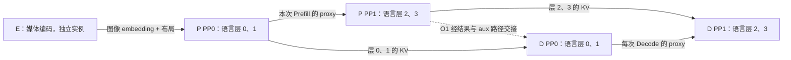
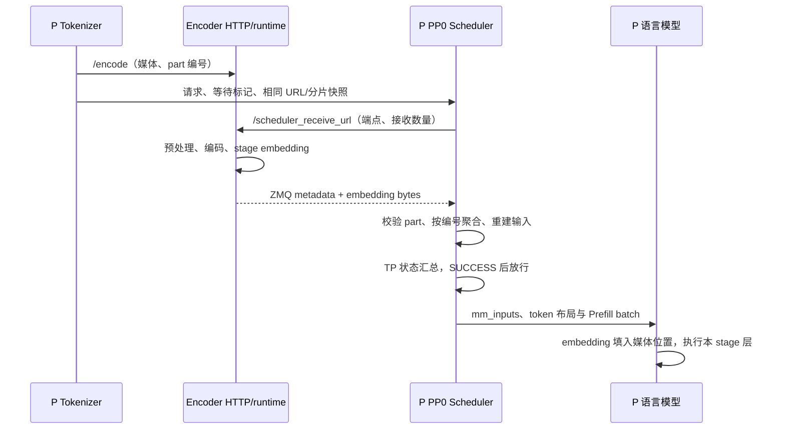

# PD 与 PP 及 Encoder 分离的组合

> **先建立架构心智模型：** [M08 · PD与Encoder分离的三条通路](<../architecture/08-PD与Encoder分离的三条通路.md>)。先看职责、数据和生命周期，再回到本篇源码细节。

本文是 **07-06，源码分析型学习资料**。本篇从一条请求回答三个问题：模型按层切到不同 PP stage 后，KV 送到哪里？图像先交给独立 Encoder 后，语言模型拿什么继续算？这两种拆分同时存在时，谁负责等待与释放？

人话版：Encoder 把图片变成语言模型能使用的向量；Prefill 把完整输入读一遍，为每层建立 KV；Decode 使用 KV 接着生成。PP 则把 P 或 D 内部的模型层分给多个工位。**分工有联系，但交接的货物不同。**

## 0. 阅读基线与范围

| 项目 | 内容 |
| --- | --- |
| 源码仓库与路径基准 | 官方 `sgl-project/sglang`；所有源码路径相对于 SGLang 仓库根目录 `.` |
| 学习分支 | `codex/sglang-source-study-20260909`，基于已拉取的官方 `main` |
| 固定 commit | `72d5c5bb73cadd7ffbf5114e5f81e29d36b6c61a` |
| 读取日期 | `2026-09-10`；沿用 2026-09-09 固定的官方源码 |
| 源码工作区 | 独立 `sglang-source-study` worktree，读取时干净；原 `sglang` 保留 `muxi-main` 及 26 个未跟踪文件 |
| 文档位置 | Wiki `sglang/source-study/07-disaggregation/`，与本阶段前五篇连续阅读 |
| 阅读主线 | 先用普通 Dense/GQA 文本请求解释 P/D 的 PP 分层，再加入 Qwen2.5-VL 代表路径中的外部图像 embedding |
| 教学配置 | 单请求 R1、TP/CP/DP=1、普通 KV、P/D 的 PP=2、相同均匀层划分；Encoder 独立且 TP=1，HTTP + `zmq_to_scheduler` |
| 独立变化 | D PP=1、语言侧 TP>1、Encoder 的另外两个传输后端；这些变化逐项分析，不视为全部叠加后的实测配置 |
| 首轮不展开 | Overlap、投机、staging、HiCache、D Radix、DeepStack、混合状态池、Encoder 全局缓存、Encoder DP 调度策略及具体算子优化 |
| 操作边界 | 只读源码、编写文档与静态检查；未安装/导入 SGLang，未运行测试、模型、GPU/RDMA、并行服务或性能实验 |
| 证据边界 | 已连接主要源码调用路径；参数允许、存在测试入口与实际验证通过分别记录，不能把两份独立测试合并成 EPD+PP 的端到端验收 |

前置：[06-04 PP 与 Microbatch](../06-parallelism/04-PipelineParallel与Microbatch.md)、[07-01 P/D 请求地图](01-PD分离职责与端到端请求地图.md)、[07-03 D 接收与就绪](03-Decode侧预分配接收与就绪.md)、[07-04 传输后端](04-KV传输接口与后端实现地图.md)。异常寿命见 [07-05](05-PD异常取消与资源退役.md)。

**源码事实**对应本文固定锚点；**教学推演**中的层数、维度、编号和时序是便于手算的例子；本篇没有**运行观察**。旧 Wiki 的内部 PP 专题只作为写作风格参考，其版本与本篇不同。

## 1. 先分清四种交接

### 1.1 货物、控制者与寿命

| 对象 | 是什么 | 主要去向 | 谁决定下一步 |
| --- | --- | --- | --- |
| 多模态 embedding | 图像等媒体经编码得到的向量行，以及 grid、模态、顺序等信息 | E → 语言实例的 Tokenizer 或 PP0 Scheduler | Encoder 负责计算/发送；语言侧 receiver 校验并组装输入 |
| PP proxy tensor | 当前 forward 在某个 stage 之后的 `hidden_states`、`residual` 等 | 同一个 P 或 D 实例内部，前 stage → 后 stage | PP loop 安排通信，模型继续执行后续层 |
| KV cache | 每层保存的历史 K/V；不是只有最后一层的输出 | P 的层片段 → D 中对应层的存储 | D 分配目标，后端搬运，D 队列决定何时交给 Decode |
| 控制与交接信息 | 请求、room、目标地址、part 编号、首 token、完成候选 RID 等 | 多条独立通道 | 各自的 Scheduler、receiver、Manager 或路由组件 |

`EmbeddingData` 描述 Encoder 结果；`ReqState` 维护 E 的计算/发送引用；Qwen2 的非末 PP stage 返回 `PPProxyTensors`；KV 层指针则由传输 Manager 映射。对象所属层次不同，不能共用一句“传完了”。[Encoder 结果][S33] [E 生命周期][S71] [PP 模型][S15] [KV 映射][S12]

### 1.2 五个教学工位



**图意解读：** 方框是模型职责/逻辑 rank，不代表必须部署在五台物理机器上。TP=1 时 P、D 各有两个模型 rank。E→P 的箭头包括接收和输入组装，不是把 E 张量直接当成 PP proxy。图省略网关双发、请求转发与完成共识；这些控制步骤仍然存在。O1 由 P 末 stage 的语言模型结果产生，实际 PP 结果回环和各 rank 的 aux 发送不能简化为图中一根物理直连。[P loop][S2] [D loop][S3] [末块 aux][S68]

后续 stage 在模型 forward 中消费 proxy，但请求对象/多模态布局仍可能沿 PP 请求通道转发；因此图中的“主要计算数据”不等于网络消息已经完全没有其他字段。[接收顺序][S20] [P 请求转发][S2]

## 2. PP 切的是层，P→D 必须对齐层的所有权

### 2.1 同 PP 大小与 D PP=1

Common Manager 在 D 侧解析 P 拓扑时明确要求：

```python
# 摘自 PP rank mapping 条件；这里 self 是 D 的 Manager。
assert self.pp_size == info.pp_size or self.pp_size == 1
```

相同大小时，本地 D stage 联系同编号 P stage；D PP=1 时，联系所有 P stage，并把所需 Prefill 响应数乘以 P 的 PP 大小。TP/CP 映射在此前处理，所以实际计数不能只看 PP。[完整映射][S11]

| P PP | D PP | 此处映射规则 | 四层教学例子 |
| --- | --- | --- | --- |
| 2 | 2 | D0→P0，D1→P1 | 两端都按 `[0,2)`、`[2,4)` 分层 |
| 2 | 1 | D0→P0、P1 | P0 的层 0、1 与 P1 的层 2、3 都送到 D0 |
| 1 | 2 | assert 拒绝 | 不能仅因为 D 卡更多就自动反向切层 |
| 4 | 2 | assert 拒绝 | 不是“PP 大小能整除就行” |

这里的“映射允许”不证明所有模型、量化、缓存或自定义层划分都兼容。相同 PP 大小尤其不能自动证明两端每个 stage 的层边界相同。

### 2.2 层指针怎样切到正确目标

P 的 `KVArgs.prefill_start_layer` 来自本地 KV 池/层布局；普通 MHA/GQA helper 将平面指针表拆成 K 段、V 段，再定位 D 的对应区间。[参数来源][S14] [MHA 指针][S12]

假设四层，P PP1 负责层 `[2,4)`，D PP=1；P 提供 `[PK2,PK3,PV2,PV3]`，D 提供 `[DK0,DK1,DK2,DK3,DV0,DV1,DV2,DV3]`。helper 选择：

| 分段 | P 来源 | D 目标 |
| --- | --- | --- |
| K | `PK2, PK3` | D 表索引 `[2:4]` → `DK2, DK3` |
| V | `PV2, PV3` | D 表索引 `[6:8]` → `DV2, DV3` |

层号与 token/page 编号是两根轴：即使 P 页是 `[7,12]`、D 页是 `[3,9]`，仍需先选对层，再在该层的 buffer 内用页映射定位。D PP=2 且相同布局时，本地两层表直接对应，不能再把全局 layer 2 当本地数组下标 2。

本例刻意采用均匀层切分、普通 K/V 表、无 draft KV。helper 还有额外分支，MLA 更有压缩分段等布局，不能把上述索引公式直接套到任意混合池。[MLA 分支][S13] 传输后端使用该映射后的描述，细节回看 07-04。

## 3. 加入 PD 后，PP loop 多了哪些等待

### 3.1 两条循环，两个含义不同的 release

启动分发依据 PD mode 与 PP 大小选择 `event_loop_pp_disagg_prefill()` 或 `event_loop_pp_disagg_decode()`。循环为每个 microbatch 槽保存当前、运行中、前一批状态，槽数为 `pp_size + pp_async_batch_depth`。depth 是循环中的在途深度，不等于启用了普通 Overlap Scheduler。[分发][S1] [槽位初始化][S4]

| P 侧步骤 | D 侧步骤 | 为什么不能合成一个 ready |
| --- | --- | --- |
| 接收请求、建立各 stage 的本地 Req | 接收请求、建立 prealloc 等状态 | 请求到达不代表内存或数据已准备好 |
| bootstrap good 交集、bad 并集 | prealloc good 交集、bad 并集 | 先协调各 stage 的准入/失败 |
| 按本地层执行，向下一 stage 发 proxy | 为可执行批次接收 proxy；prebuilt 路径另处理 | proxy 是一次 forward 的中间值 |
| 收集 inflight 的终态候选 RID | 收集 transfer queue 的终态候选 RID | 候选中包含 Success 和 Failed |
| 共识回环后处理本地 inflight 与资源 | 共识回环后 `pop_transferred()`，成功 Req 进入 waiting | P release 偏向发送收尾；D release_rids 是接收交接候选，不是清空已成功接收的 KV |

源码：[P bootstrap][S5]、[P transfer][S6]、[D prealloc][S7]、[D transfer][S8]、[D 发布目标/入 transfer][S9]、[D 接入 waiting][S10]。具体 forward、输出回环与通信 work 的等待见 [P 循环][S2]、[D 循环][S3]。

### 3.2 用集合看一轮共识

P0 bootstrap good=`{R1,R2}`，P1 good=`{R1}`，交集只有 R1；若任一 stage 的 bad 含 R2，bad 并集保留 R2。本地已取消请求还会从 good 移到 bad。

对于 transfer，P0 终态集合=`{R1,R2}`，P1=`{R1,R3}`，交集也是 R1，但**不能据此推出两个 stage 都成功**：该集合收集的是 Success 或 Failed。随后仍要走本地 poll、metadata/gate 与失败处理。异常与写者退役条件见 07-05。

因此 R1 要在 D 正常接续，必须同时满足实际传输/metadata 条件、本地资源条件，以及启用 PP 时对应的调度共识。PP 控制消息不是 KV 数据，也不是外部 DMA 排空屏障。

## 4. Encoder 独立以后，谁发请求、谁收向量

### 4.1 启动与发现

`--encoder-only` 让启动入口进入 Encoder 服务；HTTP 路径由 runtime 构造 Encoder 和其调度器，DP>1 时使用独立 dispatcher。语言侧 `--language-only` 创建 Encoder 接收相关对象；Tokenizer 中的 `EncoderBootstrapServer` 管理静态 URL 与动态注册列表。[启动][S54] [HTTP runtime 选择][S56] [Tokenizer 初始化位置][S55] [发现服务][S57]

这里 Encoder 的调度器负责媒体编码请求，不是 P/D 的 KV Scheduler；Encoder TP/DP 的分工也不是 P/D PP stage 的编号空间。本文只走单 Encoder TP=1，更多 Encoder 的批处理和负载分配留待专项阅读。

Tokenizer 决定分发后设置 `need_wait_for_mm_inputs`。对于 Scheduler 接收后端，它快照 Encoder URL 列表、按模态分配 items，并把相同的 `encoder_urls` 和 `num_items_assigned` 随请求交给 Scheduler。这样后续 `encoder_idx` 对应的是同一份列表，不会被动态注册改变索引含义。[分发入口][S22] [快照与后台派发][S24]

### 4.2 三个后端分别等在哪里

| `encoder_transfer_backend` | 派发与接收主线 | P 何时拿到可用 mm_inputs |
| --- | --- | --- |
| `zmq_to_tokenizer` | Tokenizer 建 PULL socket，异步 `/encode` 与接收并行；E 通过 ZMQ 发结果 | Tokenizer 接收/组装后完成 tokenization，再交给 Scheduler |
| `zmq_to_scheduler` | Tokenizer 发 `/encode`；P PP0 各 TP rank 注册 `/scheduler_receive_url`；E 向这些端点发向量 | Scheduler 接齐 parts、组装校验，并通过 TP 状态汇总 |
| `mooncake` | Tokenizer 发 `/encode`；P PP0 拉尺寸、分配 GPU 接收区，再向 E `/send` 提供地址 | RDMA 数据与后续 metadata 通知接入接收对象，组装并通过 TP 状态汇总 |

入口：[Tokenizer tokenization][S23]、[Tokenizer 接收][S73]、[HTTP 派发][S25]、[ZMQ 端点注册][S35]、[RDMA 接收][S42]。HTTP `/encode` 的响应不是“把大 embedding 作为 JSON 返回”；各后端的数据交付另有通道。

固定 `auto` 规则通常选 `zmq_to_scheduler`，Kimi K3 且 TP>1 时选 `zmq_to_tokenizer`，不能把 auto 写成固定 Mooncake。HTTP/gRPC 控制传输还由 receiver mode 与 URL 前缀选择，它和上表的 embedding 数据后端是不同配置维度。[auto][S50] [receiver 工厂][S76]

### 4.3 为什么只让 PP0 接收

`SchedulerRequestReceiver.recv_requests()` 先接收/广播工作，再应用多模态等待。`_apply_mm_receiver()` 的条件明确包含 `pp_rank == 0`。后续 PP stage 不再逐个向 E 注册一套相同 embedding 接收任务。[接收顺序][S20] [PP0 条件][S21]

在 PP0 内，默认 Scheduler 接收路径为每个 TP rank 建立等待对象，`receive_count=self.tp_size`；启动失败先 all-gather 错误，再对等待状态做 MIN 汇总。因此“TP=2”在这里表示两个目标接收端，不表示各自只收到一半 embedding。模型后续 TP 运算的张量切分是另一层规则。[等待队列][S39]

## 5. E 计算完成、P 接收完成与输入组装分别发生什么

### 5.1 Encoder 的正常链路

HTTP handler 校验请求，再进入统一 `execute_encode_pipeline()`；可组批请求交给 EncoderScheduler，否则进入对应单请求路径。`MMEncoder.encode()` 是 batch-of-1，主体仍是 `batch_encode()`。[HTTP][S26] [公共流水线][S27] [编码主体][S28]

顺序是：准备媒体/模型输入 → 发布尺寸 metadata → 汇总 Encoder TP 的预处理状态/布局 → 调用模型 feature 方法 → 校验输出行数 → 按请求切分并发布 embedding。预处理按模态选择实际处理器，不能把图像、视频、音频的原始数据直接当作统一大小的 tensor。[预处理入口][S81] [预处理同步][S29] [实际计算][S30] [结果分片][S32]

`_publish_preprocess_metadata()` 可在模型 forward 前给出 `[token_count, embedding_dim]` 和字节数，此时 `embedding_ready` 尚未代表真实向量完成。发送逻辑仍等待 `_wait_for_embedding()`；GPU 常驻发送路径在发布 staged embedding 前同步当前 CUDA stream。[早期尺寸][S31] [发送等待][S74] [发布顺序][S32]

### 5.2 ZMQ 主线的一次交接



**图意解读：** `/encode` 和端点注册允许交错，E 的注册方法会等待该请求状态存在；图不要求“注册一定早于编码完成”。HTTP 注册在后台执行，不应把它画成 Scheduler 主循环一直阻塞等待网络。[注册等待][S47] [非阻塞注册路径][S35]

ZMQ 正常消息有 metadata 和数据帧，接收端把数据视图 reshape 后 clone，避免后续依赖 ZMQ frame 的寿命。parts 按 `part_idx` 放置，ready 需要全部 parts；请求仍在接收并进入聚合校验时，错编号、num_parts 不一致、重复 part 会校验失败。已退出 PENDING 的对象不再消费消息。这里的重复 part 校验与 PD ACK 去重不同。[数据取出][S75] [接收处理][S36] [聚合对象][S34] [part 校验][S69]

### 5.3 组装不是简单拼接张量

接齐后，receiver 准备输入 buffer，调用模型 processor 的 `get_validated_mm_data()`，再写 `recv_req.mm_inputs` 和重建后的 input_ids，最后标记 SUCCESS。[组装][S37] [发布输入][S38]

processor 必须把 embedding 行放到正确媒体占位区间。公共校验要求每个 item 的行数符合 offset 范围，并检查各模态消耗的总行数等于收到的行数。Qwen VL 还根据 grid 等信息重建输入与位置布局；“shape 能拼起来”不足以说明图片与 token 已正确对应。[公共入口][S53] [行数/消费校验][S79] [Qwen 布局][S70]

等待状态的数值是 TIMEOUT=-2、FAIL=-1、PENDING=0、SUCCESS=1。MIN 汇总意味着一个 TP rank 仍 PENDING 就不能整体 SUCCESS，失败/超时也不会被另一个 rank 的成功掩盖。局部 parts 齐全但 GPU pool 尚无空位时，组装仍可保持 PENDING 并在后续 tick 重试。[组装重试][S37] [TP 汇总与清理][S39]

### 5.4 Mooncake 独立变化：先知道尺寸，再准备落点

1. P 各接收端按同一 part 规划拉 `/scheduler_receive_meta_data`，获得各 part 大小。
2. 按 part_idx 排序、计算偏移，从池分配或单独注册 GPU buffer。
3. 向对应 E 的 `/send` 提供 session、目标地址、embedding_port 和 receive_count。
4. E 等待真实 embedding ready，执行传输，随后发不含 embedding 本体的 metadata 通知。
5. P 从目标 buffer 建立各模态视图，继续走组装和 TP 状态汇总。

依据：[P 接收三阶段][S42]、[发送 handler][S48]、[等待真实数据][S74]、[传输及通知][S77]。早期尺寸发布只允许接收区分配与编码有机会并行，不是承诺已经测得延迟收益。

## 6. 一条带图片的 R1 怎样走完 E、P、D

### 6.1 embedding 进入语言模型的位置

Qwen2.5-VL 的 forward 调用 `general_mm_embed_routine()`。该例程只在语言模型首 PP stage 构造输入 embedding；普通非 Decode 的多模态输入走 `embed_mm_inputs()`，优先使用已经提供的 `precomputed_embeddings`，按本 chunk 的范围与媒体 mask 放入文本 embedding 序列。后续 stage 使用上一 stage 的 proxy。[VLM forward][S16] [首 stage 分支][S17] [媒体填入][S18] [预计算优先][S19] [chunk 切片][S78]

首 PP stage 不是把整个输入替换成图片向量：文本位置仍有文本 embedding；媒体位置才使用对应行。Qwen2 模型分别运行自己的 `[start_layer,end_layer)`，非末 stage 返回 hidden_states/residual，末 stage 归一化并交给 logits/采样。[语言层执行][S15]

### 6.2 固定的教学账本

只为手算，假设 R1 的**最终语言输入**共 8 个位置，其中 4 行媒体 embedding 放在 `[1,2,5,6]`，其余位置为文本/特殊 token；hidden=8，KV heads=2，head_dim=2，BF16 每元素 2 字节，语言层共 4 层。它不是 Qwen2.5-VL 真实模型维度，也不是图片像素数或 patch 数的通用公式。

| 时点 | E/P/D 已有的数据 | 尚未完成的事 |
| --- | --- | --- |
| a. D 先收到路由请求 | 可以推进自身预分配/握手；P Tokenizer 正在派发图片 | E 结果和 P KV 尚未生成；具体并行先后以就绪条件约束 |
| b. E 发布 `[4,8]` 尺寸 | P 可以在 Mooncake 变化中准备接收区 | 尺寸不是 embedding_ready |
| c. P PP0 接收并组装 | 媒体行放到四个指定位置，得到 `[8,8]` 语言输入 | 还没有因此得到四层 KV |
| d. P PP0 执行层 0、1 | 写本层 KV，产生给 P PP1 的 proxy | P PP1 的层 2、3 尚需执行 |
| e. P PP1 执行层 2、3 | 写后两层 KV，最终产生 O1；结果沿 PP 路径处理 | D 仍需接齐目标层与交接信息 |
| f. D 交接完成 | 各 stage 持有自己层对应的 8 位置 KV，接入 O1 | O1 的 KV 尚未由其首轮 Decode forward 产生 |
| g. D 首轮正常 Decode | D PP0 输入 O1，proxy 交给 D PP1；各层 KV 增至 9 位置，产生 O2 | 接着进入后续 token 的循环 |

步骤 f/g 沿用 07-03 的“首 token 与首轮计算分开”定义。D prebuilt 路径不是重新执行一遍图片编码或完整 Prefill；正常 Decode 分支使用当前 token 的文本 embedding 与已有 KV。D 仍需正确的输入长度、位置/多模态元信息等控制数据，不能把“无需重算视觉特征”误写成“D 只接收裸 KV 就足够”。[D PP prebuilt 分支][S3] [模型 Decode 分支][S17]

### 6.3 三种数据的字节数为什么不同

| 教学对象 | 计算 | 有效张量字节 |
| --- | --- | ---: |
| E→一个接收端的媒体 embedding | `4 × 8 × 2` | 64 |
| P 两 stage 之间的 hidden_states + residual | `2 × 8 × 8 × 2` | 256 |
| P 每个 stage 的两层 KV | `2层 × 8位置 × 2头 × 2维 × 2(K/V) × 2字节` | 256 |
| P 全四层 KV | 两个 stage 各 256 | 512 |
| D 单 token forward 的 proxy | `2 × 1 × 8 × 2` | 32 |

这些是 TP=1、两个 proxy 张量均存在时的有效元素账本，未计 padding、分配粒度、协议、metadata、辅助状态及重传。不能将 64 与 512 的比值当作端到端加速比。若 PP0 的 TP=2 且使用上文 Scheduler 接收路径，两个接收端各需要该 embedding；也不能直接把 64 除以 2 当单端收取量。

D PP=1 的变化只将四层 KV 的目标集中到一个 D stage：层 0、1 来自 P0，层 2、3 来自 P1。P 内的 proxy 通信仍存在，D 内没有 PP 边界。由此可见，减少某条通信不等于减少了模型需要保存的全部 KV。

## 7. 不同资源怎样结束

| 资源 | 正常持有者与释放入口 | 必须保留的寿命界限 |
| --- | --- | --- |
| E 编码任务/结果 | `ReqState.active_encodes`、`embedding_data`、`embedding_ready` | 早期 metadata 不等于计算已完成 |
| E 正在发送的 embedding | `active_sends`；`release_request()` 等待发送计数为 0 后释放 | 不把 HTTP 调用结束直接等同于所有接收端已完成 |
| E ZMQ 目标登记 | `register_embedding_destinations()` 与 `send_with_url()` | 登记目标数、已发起任务和任务结果不同；finally 仍有资源清理 |
| E Mooncake 多目标完成 | metadata registry 按规范化 endpoint 去重记完成，达到 receive_count 后释放 | 同一端点重试不能替代另一个目标完成 |
| P 接收的 embedding/pool 槽 | 组装后可把 slot 释放绑定到 mm_inputs 的 finalizer；失败/取消另调用清理 | 不能在生成 mm_inputs 的瞬间无条件回收仍被其视图引用的槽 |
| P/D PP proxy | forward/通信 work、microbatch 状态与 stream event | 只服务对应计算/传递窗口，不是请求长期历史缓存 |
| P/D KV、aux | PD 发送/接收队列及缓存 allocator | 继续使用 07-02—07-05 的成功、失败、暂留与退役规则 |

依据：[E 发送引用][S43]、[E 释放][S44]、[ZMQ 目标和任务][S46]、[Mooncake 完成计数][S45]、[P slot 所有权转交][S40]、[失败清理][S41]、[PP 循环][S2] [S3]。

本地 finalizer、发送引用计数和 TP/PP 共识各解决一段生命周期。真实取消、迟到写入、跨线程对象引用和设备 stream 复用仍需要专门实验；本篇未把这些局部机制合成为全系统排空证明。

## 8. 组合约束表：先确认允许，再谈验证

| 组合或条件 | 固定源码判断 | 本篇证据状态 |
| --- | --- | --- |
| P/D PP 相同，或 D PP=1 | Common rank mapping 允许；仍需匹配层布局与缓存表示 | 已读映射与指针选择，未运行 |
| P PP=1、D PP=2；或 P PP=4、D PP=2 | 此处 assert 拒绝 | 已读拒绝条件 |
| 非 NPU PP>1 + 普通 Overlap/投机 | validation 要求 disable_overlap_schedule 且无 speculative_algorithm | 已读拒绝条件；NPU 有单独受限分支，不外推 |
| PP>1 + min_free_slots_delay | validation 拒绝 | 已读拒绝条件 |
| `moe_dp_size>1` + PP>1 | `handle_context_parallelism()` 在该条件下要求 PP=1 | 按实际 guard 判断；报错文字提到 CP，但不能据此宣称所有 Prefill CP 都拒绝 PP |
| encoder_only + language_only | 拒绝 | 已读配置 hook |
| encoder_only + PD mode prefill/decode | 拒绝；E 应作为独立角色启动 | 已读配置 hook |
| language_only + encoder-only 架构白名单之外的模型 | EPD 模型检查拒绝 | 白名单以固定 hook 为准，不按“都是 VLM”推断兼容 |
| language_model_only 当作 language_only 使用 | 前者是跳过多模态编码器、拒绝多模态请求的独立模式；配置也拒绝与 language_only/encoder_only 混用 | 两个参数不能替换 |
| EPD + 语言侧 PP>1 | PP0 receiver、模型首 stage embedding 与后续 proxy 的源码路径可连接 | 已静态追踪；本文阅读的 EPD 集成 fixture 没有设置 PP>1，不能宣称组合实测通过 |
| Encoder 自身 PP、DeepStack/Omni、多种并行全叠加 | 不由本篇代表路径推出通用支持 | 待针对具体模型和拓扑核查 |

依据：[PP 映射][S11]、[PP validation][S52]、[moe_dp_size 局部条件][S72]、[EPD hook][S51]、[字段定义][S49]、[language_model_only 检查][S80]、[PP0 接收][S21]、[模型分支][S17]。

动态发现没有 Encoder URL 时，Scheduler 接收派发方法会清除等待标记，并回到相应本地处理路径；这是源码回退行为，不代表该服务一定还保留了可用的本地视觉权重。是否可成功处理需核对模型构造、加载策略和实际配置。[派发回退][S24] [Tokenizer 本地处理分支][S23]

## 9. 排障与测试证据

### 9.1 从现象找到是哪一段没有交接

| 现象 | 首先检查 | 回源码 |
| --- | --- | --- |
| E `/encode` 已响应，P 仍未放行 | 数据后端、全部 parts、组装校验、pool 空位与 TP 最小状态 | [派发语义][S25]、[组装][S37]、[等待][S39] |
| 拉到尺寸但 `/send` 迟迟未完成 | embedding_ready、编码失败、实际发送任务与目标 | [尺寸发布][S31]、[数据等待][S74]、[发送][S77] |
| PP0 已 ready，PP1 没有进度 | 请求转发、bootstrap 共识、proxy 到达、上一批通信 work | [P loop][S2]、[PP bootstrap][S5] |
| D 收到部分 KV 仍不能计算 | 所需 P TP/CP/PP 来源、层区间、metadata gate、D PP 交接 | [映射][S11]、[D transfer][S8] [S10] |
| 图片位置或 token 数错位 | 固定媒体顺序、grid、part_idx、offset、实际消耗行数、P/D 输入布局一致性 | [part 校验][S69]、[模型 processor][S70]、[行数校验][S79] |
| Encoder 动态变化后请求访问错服务 | 本请求的 URL 快照与 num_items_assigned 是否一致 | [派发快照][S24]、[接收取快照][S39] |
| 开启 language-only 仍异常 | 实际 Encoder URL、backend auto 的结果、是否走回退、是否误用 language-model-only | [auto][S50]、[回退][S24]、[模式检查][S80] |
| 缓存未立即回落 | E active_encodes/sends、P mm_inputs 引用、PD inflight/暂留分别记账 | [E 生命周期][S44]、[P finalizer][S40]、07-05 |

### 9.2 本轮阅读的四份测试文件

| 文件与已读范围 | 能定位的覆盖入口 | 不能据此宣称 |
| --- | --- | --- |
| `test/registered/disaggregation/test_disaggregation_pp.py`，`TestDisaggregationPrefillPPAccuracy` | P TP2/PP2、D TP2/默认 PP1；GSM8K 200 题、断言 score>0.24 | 本轮分数、P/D 都 PP2、EPD+PP 已通过 |
| `test/registered/disaggregation/test_epd_disaggregation.py`，OneEncoder fixture 与 Mooncake fixture/skip 条件 | E TP1，P language-only/TP1，D TP1；MMMU mixin；Mooncake 类在 CI 中因 RDMA 条件跳过 | 测试注释中的分数是本轮测量，或该文件的默认 EPD fixture 覆盖 PP>1 |
| `test/registered/unit/disaggregation/test_encode_receiver.py`，两条方法 | HTTP 注册不阻塞调用线程；Mock TP peer failure 后释放并关闭接收状态 | 真实多卡同步/网络交错通过 |
| `test/registered/unit/disaggregation/test_encode_server.py`，五条方法 | 目标去重、预处理尺寸先于 embedding ready、ZMQ 等编码完成、GPU sync 先于 ready、release 等发送结束 | Mock 事件顺序已证明真实 GPU/RDMA 内容正确与资源复用安全 |

固定入口：[PP fixture][S58]、[EPD fixture][S59]、[Mooncake fixture][S67]、[非阻塞注册][S60]、[peer failure][S61]、[去重][S62]、[早期 metadata][S63]、[ZMQ 顺序][S64]、[CUDA ready 顺序][S65]、[释放等待][S66]。**本轮均未执行。**

后续实验证据至少应固定 E/P/D 三方代码和模型配置，记录最终 token/媒体布局、每个 part、每层 KV 目标及实际接收者；先做无 PP 的对照，再只加入一种 PP 布局。内容正确、请求完成、资源回收和性能分别验收，不能由某个 health 端点成功替代。[实验模板](../appendices/05-实验记录与证据模板.md)

## 10. 自测与阶段收尾

### 10.1 自测

1. P PP=2、D PP=1 时，P PP1 的层 2、3 应写入 D 指针表的哪两个区间？
2. E 给出 `[4,8]` 和 64 字节后，P 是否可以马上运行语言模型？
3. 两个 TP rank 的等待状态为 SUCCESS 和 PENDING，MIN 汇总后是什么？若有 TIMEOUT 呢？
4. PP0 收到图像 embedding 后，PP1 的模型输入为什么不再是原来的图片向量？
5. 重复收到相同 Encoder part 与重复完成同一 Mooncake 目标，在本文机制中是否一样处理？
6. P/D PP 测试与 EPD TP1 测试分别存在，能否证明 EPD+PP2 已通过？

### 10.2 参考答案

1. 本文普通四层 K/V 表中，K 是 `[2:4]`，V 是 `[6:8]`；页号再在选中的层 buffer 内映射。
2. 不可以。尺寸可早于 forward；还需真实向量到达、parts 齐全、布局校验和对应 TP 就绪汇总。
3. 得到 PENDING；TIMEOUT=-2 会使 MIN 得到 TIMEOUT，不能被 SUCCESS 覆盖。
4. PP0 已完成自己的语言层，PP1 接收该次 forward 的 hidden_states/residual，继续后面的层；图片向量已在首 stage 的输入位置参与计算。
5. 不一样。仍在接收且进入聚合校验的重复 part 会触发错误；metadata registry 的同目标完成用集合去重，不替代其他目标。
6. 不能。它们覆盖不同组合；本篇给出可追溯源码主线和实验入口，组合运行结论仍需相同模型/拓扑下的证据。

### 10.3 推荐源码阅读顺序

| 要找的主线 | 从 SGLang 仓库根目录打开 |
| --- | --- |
| 先选 PP/PD 循环 | `python/sglang/srt/managers/scheduler.py::dispatch_event_loop` → `python/sglang/srt/managers/scheduler_pp_mixin.py` 的 P/D 两条循环 |
| 再核对层的去向 | `python/sglang/srt/disaggregation/common/conn.py::CommonKVManager._resolve_rank_mapping` → `CommonKVManager.get_mha_kv_ptrs_with_pp` |
| 追 E 的计算与交付 | `python/sglang/srt/disaggregation/encoder/runtime.py::execute_encode_pipeline` → `python/sglang/srt/disaggregation/encoder/server.py::MMEncoder.batch_encode` |
| 追 P 如何放行与使用 | `python/sglang/srt/disaggregation/encoder/receiver.py::MMReceiverBase._process_waiting_requests` → `python/sglang/srt/managers/mm_utils.py::general_mm_embed_routine` |

每条路径先回答“目前持有哪种数据、还有谁要使用”，再查看条件、状态更新和释放；不要从名字相近的 receiver、ready 或 release 直接跳到另一个协议。

### 10.4 阶段 07 的产物在哪里

| 阶段要求 | 已落盘位置 |
| --- | --- |
| P/D 端到端时序 | [07-01](01-PD分离职责与端到端请求地图.md) |
| 两侧状态与资源账本 | [07-02](02-Prefill侧Bootstrap与传输状态.md)、[07-03](03-Decode侧预分配接收与就绪.md) |
| KV 传输后端与分片拓扑 | [07-04](04-KV传输接口与后端实现地图.md)、本篇第 1—3 节 |
| 取消后仍在途的对象及退役边界 | [07-05](05-PD异常取消与资源退役.md)、本篇第 7 节的 Encoder 补充 |
| Encoder/PP/PD 组合与约束 | 本篇第 4—8 节 |

**本篇验收：** 能拿着 R1 的模型层、媒体行、proxy、KV 和目标端点清单，解释每一步是谁推进、等什么、保存什么，以及完成了哪一段证据。阶段完成指静态阅读与文档产物完成，不表示部署组合运行验收。

下一篇进入阶段 08：[08-01《结构化输出与 Grammar 状态》](../08-advanced-generation/01-结构化输出与Grammar状态.md)，追踪允许生成的 token 如何由 grammar 状态约束。

[返回总目录](../README.md) · [术语速查](../appendices/01-术语与对象速查.md) · [源码索引](../appendices/02-源码入口与调用链索引.md) · [组合矩阵](../appendices/03-配置解析与功能兼容矩阵.md) · [排障索引](../appendices/04-症状到源码的排障索引.md) · [进度记录](../appendices/06-学习进度与版本变更记录.md)

[S1]: https://github.com/sgl-project/sglang/blob/72d5c5bb73cadd7ffbf5114e5f81e29d36b6c61a/python/sglang/srt/managers/scheduler.py#L5646
[S2]: https://github.com/sgl-project/sglang/blob/72d5c5bb73cadd7ffbf5114e5f81e29d36b6c61a/python/sglang/srt/managers/scheduler_pp_mixin.py#L170
[S3]: https://github.com/sgl-project/sglang/blob/72d5c5bb73cadd7ffbf5114e5f81e29d36b6c61a/python/sglang/srt/managers/scheduler_pp_mixin.py#L355
[S4]: https://github.com/sgl-project/sglang/blob/72d5c5bb73cadd7ffbf5114e5f81e29d36b6c61a/python/sglang/srt/managers/scheduler_pp_mixin.py#L551
[S5]: https://github.com/sgl-project/sglang/blob/72d5c5bb73cadd7ffbf5114e5f81e29d36b6c61a/python/sglang/srt/managers/scheduler_pp_mixin.py#L591
[S6]: https://github.com/sgl-project/sglang/blob/72d5c5bb73cadd7ffbf5114e5f81e29d36b6c61a/python/sglang/srt/managers/scheduler_pp_mixin.py#L633
[S7]: https://github.com/sgl-project/sglang/blob/72d5c5bb73cadd7ffbf5114e5f81e29d36b6c61a/python/sglang/srt/managers/scheduler_pp_mixin.py#L1159
[S8]: https://github.com/sgl-project/sglang/blob/72d5c5bb73cadd7ffbf5114e5f81e29d36b6c61a/python/sglang/srt/managers/scheduler_pp_mixin.py#L1210
[S9]: https://github.com/sgl-project/sglang/blob/72d5c5bb73cadd7ffbf5114e5f81e29d36b6c61a/python/sglang/srt/managers/scheduler_pp_mixin.py#L1245
[S10]: https://github.com/sgl-project/sglang/blob/72d5c5bb73cadd7ffbf5114e5f81e29d36b6c61a/python/sglang/srt/managers/scheduler_pp_mixin.py#L1266
[S11]: https://github.com/sgl-project/sglang/blob/72d5c5bb73cadd7ffbf5114e5f81e29d36b6c61a/python/sglang/srt/disaggregation/common/conn.py#L678
[S12]: https://github.com/sgl-project/sglang/blob/72d5c5bb73cadd7ffbf5114e5f81e29d36b6c61a/python/sglang/srt/disaggregation/common/conn.py#L930
[S13]: https://github.com/sgl-project/sglang/blob/72d5c5bb73cadd7ffbf5114e5f81e29d36b6c61a/python/sglang/srt/disaggregation/common/conn.py#L963
[S14]: https://github.com/sgl-project/sglang/blob/72d5c5bb73cadd7ffbf5114e5f81e29d36b6c61a/python/sglang/srt/disaggregation/prefill.py#L206
[S15]: https://github.com/sgl-project/sglang/blob/72d5c5bb73cadd7ffbf5114e5f81e29d36b6c61a/python/sglang/srt/models/qwen2.py#L395
[S16]: https://github.com/sgl-project/sglang/blob/72d5c5bb73cadd7ffbf5114e5f81e29d36b6c61a/python/sglang/srt/models/qwen2_5_vl.py#L855
[S17]: https://github.com/sgl-project/sglang/blob/72d5c5bb73cadd7ffbf5114e5f81e29d36b6c61a/python/sglang/srt/managers/mm_utils.py#L628
[S18]: https://github.com/sgl-project/sglang/blob/72d5c5bb73cadd7ffbf5114e5f81e29d36b6c61a/python/sglang/srt/managers/mm_utils.py#L389
[S19]: https://github.com/sgl-project/sglang/blob/72d5c5bb73cadd7ffbf5114e5f81e29d36b6c61a/python/sglang/srt/managers/mm_schedule.py#L688
[S20]: https://github.com/sgl-project/sglang/blob/72d5c5bb73cadd7ffbf5114e5f81e29d36b6c61a/python/sglang/srt/managers/scheduler_components/request_receiver.py#L89
[S21]: https://github.com/sgl-project/sglang/blob/72d5c5bb73cadd7ffbf5114e5f81e29d36b6c61a/python/sglang/srt/managers/scheduler_components/request_receiver.py#L232
[S22]: https://github.com/sgl-project/sglang/blob/72d5c5bb73cadd7ffbf5114e5f81e29d36b6c61a/python/sglang/srt/managers/tokenizer_manager.py#L3564
[S23]: https://github.com/sgl-project/sglang/blob/72d5c5bb73cadd7ffbf5114e5f81e29d36b6c61a/python/sglang/srt/managers/tokenizer_manager.py#L970
[S24]: https://github.com/sgl-project/sglang/blob/72d5c5bb73cadd7ffbf5114e5f81e29d36b6c61a/python/sglang/srt/disaggregation/encoder/receiver.py#L2195
[S25]: https://github.com/sgl-project/sglang/blob/72d5c5bb73cadd7ffbf5114e5f81e29d36b6c61a/python/sglang/srt/disaggregation/encoder/receiver.py#L2711
[S26]: https://github.com/sgl-project/sglang/blob/72d5c5bb73cadd7ffbf5114e5f81e29d36b6c61a/python/sglang/srt/disaggregation/encoder/http_server.py#L287
[S27]: https://github.com/sgl-project/sglang/blob/72d5c5bb73cadd7ffbf5114e5f81e29d36b6c61a/python/sglang/srt/disaggregation/encoder/runtime.py#L1239
[S28]: https://github.com/sgl-project/sglang/blob/72d5c5bb73cadd7ffbf5114e5f81e29d36b6c61a/python/sglang/srt/disaggregation/encoder/server.py#L2209
[S29]: https://github.com/sgl-project/sglang/blob/72d5c5bb73cadd7ffbf5114e5f81e29d36b6c61a/python/sglang/srt/disaggregation/encoder/server.py#L1207
[S30]: https://github.com/sgl-project/sglang/blob/72d5c5bb73cadd7ffbf5114e5f81e29d36b6c61a/python/sglang/srt/disaggregation/encoder/server.py#L1700
[S31]: https://github.com/sgl-project/sglang/blob/72d5c5bb73cadd7ffbf5114e5f81e29d36b6c61a/python/sglang/srt/disaggregation/encoder/server.py#L1858
[S32]: https://github.com/sgl-project/sglang/blob/72d5c5bb73cadd7ffbf5114e5f81e29d36b6c61a/python/sglang/srt/disaggregation/encoder/server.py#L2112
[S33]: https://github.com/sgl-project/sglang/blob/72d5c5bb73cadd7ffbf5114e5f81e29d36b6c61a/python/sglang/srt/disaggregation/encoder/receiver.py#L443
[S34]: https://github.com/sgl-project/sglang/blob/72d5c5bb73cadd7ffbf5114e5f81e29d36b6c61a/python/sglang/srt/disaggregation/encoder/receiver.py#L566
[S35]: https://github.com/sgl-project/sglang/blob/72d5c5bb73cadd7ffbf5114e5f81e29d36b6c61a/python/sglang/srt/disaggregation/encoder/receiver.py#L1156
[S36]: https://github.com/sgl-project/sglang/blob/72d5c5bb73cadd7ffbf5114e5f81e29d36b6c61a/python/sglang/srt/disaggregation/encoder/receiver.py#L976
[S37]: https://github.com/sgl-project/sglang/blob/72d5c5bb73cadd7ffbf5114e5f81e29d36b6c61a/python/sglang/srt/disaggregation/encoder/receiver.py#L1039
[S38]: https://github.com/sgl-project/sglang/blob/72d5c5bb73cadd7ffbf5114e5f81e29d36b6c61a/python/sglang/srt/disaggregation/encoder/receiver.py#L1069
[S39]: https://github.com/sgl-project/sglang/blob/72d5c5bb73cadd7ffbf5114e5f81e29d36b6c61a/python/sglang/srt/disaggregation/encoder/receiver.py#L2310
[S40]: https://github.com/sgl-project/sglang/blob/72d5c5bb73cadd7ffbf5114e5f81e29d36b6c61a/python/sglang/srt/disaggregation/encoder/receiver.py#L1085
[S41]: https://github.com/sgl-project/sglang/blob/72d5c5bb73cadd7ffbf5114e5f81e29d36b6c61a/python/sglang/srt/disaggregation/encoder/receiver.py#L1109
[S42]: https://github.com/sgl-project/sglang/blob/72d5c5bb73cadd7ffbf5114e5f81e29d36b6c61a/python/sglang/srt/disaggregation/encoder/receiver.py#L1428
[S43]: https://github.com/sgl-project/sglang/blob/72d5c5bb73cadd7ffbf5114e5f81e29d36b6c61a/python/sglang/srt/disaggregation/encoder/server.py#L809
[S44]: https://github.com/sgl-project/sglang/blob/72d5c5bb73cadd7ffbf5114e5f81e29d36b6c61a/python/sglang/srt/disaggregation/encoder/server.py#L826
[S45]: https://github.com/sgl-project/sglang/blob/72d5c5bb73cadd7ffbf5114e5f81e29d36b6c61a/python/sglang/srt/disaggregation/encoder/server.py#L257
[S46]: https://github.com/sgl-project/sglang/blob/72d5c5bb73cadd7ffbf5114e5f81e29d36b6c61a/python/sglang/srt/disaggregation/encoder/server.py#L2302
[S47]: https://github.com/sgl-project/sglang/blob/72d5c5bb73cadd7ffbf5114e5f81e29d36b6c61a/python/sglang/srt/disaggregation/encoder/server.py#L857
[S48]: https://github.com/sgl-project/sglang/blob/72d5c5bb73cadd7ffbf5114e5f81e29d36b6c61a/python/sglang/srt/disaggregation/encoder/http_server.py#L382
[S49]: https://github.com/sgl-project/sglang/blob/72d5c5bb73cadd7ffbf5114e5f81e29d36b6c61a/python/sglang/srt/arg_groups/fields/disagg.py#L28
[S50]: https://github.com/sgl-project/sglang/blob/72d5c5bb73cadd7ffbf5114e5f81e29d36b6c61a/python/sglang/srt/server_args.py#L567
[S51]: https://github.com/sgl-project/sglang/blob/72d5c5bb73cadd7ffbf5114e5f81e29d36b6c61a/python/sglang/srt/arg_groups/pd_disaggregation_hook.py#L189
[S52]: https://github.com/sgl-project/sglang/blob/72d5c5bb73cadd7ffbf5114e5f81e29d36b6c61a/python/sglang/srt/arg_groups/validation_hook.py#L27
[S53]: https://github.com/sgl-project/sglang/blob/72d5c5bb73cadd7ffbf5114e5f81e29d36b6c61a/python/sglang/srt/multimodal/processors/base_processor.py#L651
[S54]: https://github.com/sgl-project/sglang/blob/72d5c5bb73cadd7ffbf5114e5f81e29d36b6c61a/python/sglang/launch_server.py#L17
[S55]: https://github.com/sgl-project/sglang/blob/72d5c5bb73cadd7ffbf5114e5f81e29d36b6c61a/python/sglang/srt/managers/tokenizer_manager.py#L683
[S56]: https://github.com/sgl-project/sglang/blob/72d5c5bb73cadd7ffbf5114e5f81e29d36b6c61a/python/sglang/srt/disaggregation/encoder/http_server.py#L207
[S57]: https://github.com/sgl-project/sglang/blob/72d5c5bb73cadd7ffbf5114e5f81e29d36b6c61a/python/sglang/srt/disaggregation/encoder/receiver.py#L93
[S58]: https://github.com/sgl-project/sglang/blob/72d5c5bb73cadd7ffbf5114e5f81e29d36b6c61a/test/registered/disaggregation/test_disaggregation_pp.py#L20
[S59]: https://github.com/sgl-project/sglang/blob/72d5c5bb73cadd7ffbf5114e5f81e29d36b6c61a/test/registered/disaggregation/test_epd_disaggregation.py#L623
[S60]: https://github.com/sgl-project/sglang/blob/72d5c5bb73cadd7ffbf5114e5f81e29d36b6c61a/test/registered/unit/disaggregation/test_encode_receiver.py#L108
[S61]: https://github.com/sgl-project/sglang/blob/72d5c5bb73cadd7ffbf5114e5f81e29d36b6c61a/test/registered/unit/disaggregation/test_encode_receiver.py#L353
[S62]: https://github.com/sgl-project/sglang/blob/72d5c5bb73cadd7ffbf5114e5f81e29d36b6c61a/test/registered/unit/disaggregation/test_encode_server.py#L190
[S63]: https://github.com/sgl-project/sglang/blob/72d5c5bb73cadd7ffbf5114e5f81e29d36b6c61a/test/registered/unit/disaggregation/test_encode_server.py#L891
[S64]: https://github.com/sgl-project/sglang/blob/72d5c5bb73cadd7ffbf5114e5f81e29d36b6c61a/test/registered/unit/disaggregation/test_encode_server.py#L1790
[S65]: https://github.com/sgl-project/sglang/blob/72d5c5bb73cadd7ffbf5114e5f81e29d36b6c61a/test/registered/unit/disaggregation/test_encode_server.py#L1527
[S66]: https://github.com/sgl-project/sglang/blob/72d5c5bb73cadd7ffbf5114e5f81e29d36b6c61a/test/registered/unit/disaggregation/test_encode_server.py#L2008
[S67]: https://github.com/sgl-project/sglang/blob/72d5c5bb73cadd7ffbf5114e5f81e29d36b6c61a/test/registered/disaggregation/test_epd_disaggregation.py#L1563
[S68]: https://github.com/sgl-project/sglang/blob/72d5c5bb73cadd7ffbf5114e5f81e29d36b6c61a/python/sglang/srt/disaggregation/mooncake/conn.py#L1759
[S69]: https://github.com/sgl-project/sglang/blob/72d5c5bb73cadd7ffbf5114e5f81e29d36b6c61a/python/sglang/srt/disaggregation/encoder/receiver.py#L732
[S70]: https://github.com/sgl-project/sglang/blob/72d5c5bb73cadd7ffbf5114e5f81e29d36b6c61a/python/sglang/srt/multimodal/processors/qwen_vl.py#L638
[S71]: https://github.com/sgl-project/sglang/blob/72d5c5bb73cadd7ffbf5114e5f81e29d36b6c61a/python/sglang/srt/disaggregation/encoder/server.py#L353
[S72]: https://github.com/sgl-project/sglang/blob/72d5c5bb73cadd7ffbf5114e5f81e29d36b6c61a/python/sglang/srt/arg_groups/parallel_hook.py#L92
[S73]: https://github.com/sgl-project/sglang/blob/72d5c5bb73cadd7ffbf5114e5f81e29d36b6c61a/python/sglang/srt/disaggregation/encoder/receiver.py#L2050
[S74]: https://github.com/sgl-project/sglang/blob/72d5c5bb73cadd7ffbf5114e5f81e29d36b6c61a/python/sglang/srt/disaggregation/encoder/server.py#L437
[S75]: https://github.com/sgl-project/sglang/blob/72d5c5bb73cadd7ffbf5114e5f81e29d36b6c61a/python/sglang/srt/disaggregation/encoder/receiver.py#L1243
[S76]: https://github.com/sgl-project/sglang/blob/72d5c5bb73cadd7ffbf5114e5f81e29d36b6c61a/python/sglang/srt/disaggregation/encoder/receiver.py#L2944
[S77]: https://github.com/sgl-project/sglang/blob/72d5c5bb73cadd7ffbf5114e5f81e29d36b6c61a/python/sglang/srt/disaggregation/encoder/server.py#L1888
[S78]: https://github.com/sgl-project/sglang/blob/72d5c5bb73cadd7ffbf5114e5f81e29d36b6c61a/python/sglang/srt/managers/mm_schedule.py#L73
[S79]: https://github.com/sgl-project/sglang/blob/72d5c5bb73cadd7ffbf5114e5f81e29d36b6c61a/python/sglang/srt/multimodal/processors/base_processor.py#L668
[S80]: https://github.com/sgl-project/sglang/blob/72d5c5bb73cadd7ffbf5114e5f81e29d36b6c61a/python/sglang/srt/arg_groups/model_hook.py#L894
[S81]: https://github.com/sgl-project/sglang/blob/72d5c5bb73cadd7ffbf5114e5f81e29d36b6c61a/python/sglang/srt/disaggregation/encoder/preprocessor.py#L638
