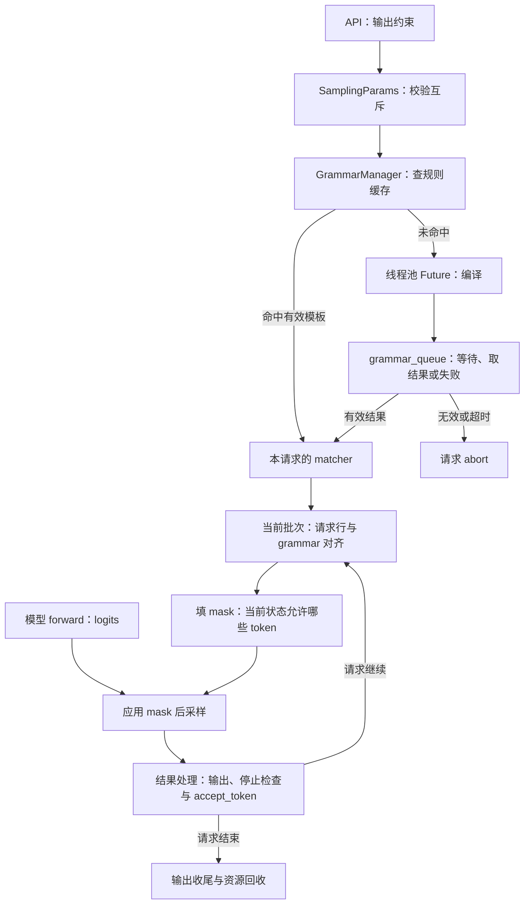
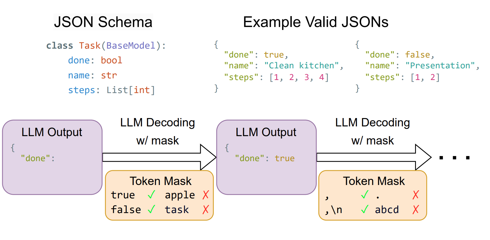
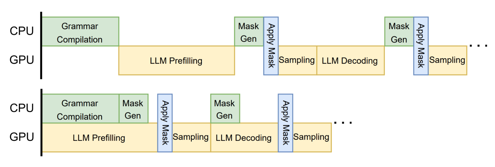
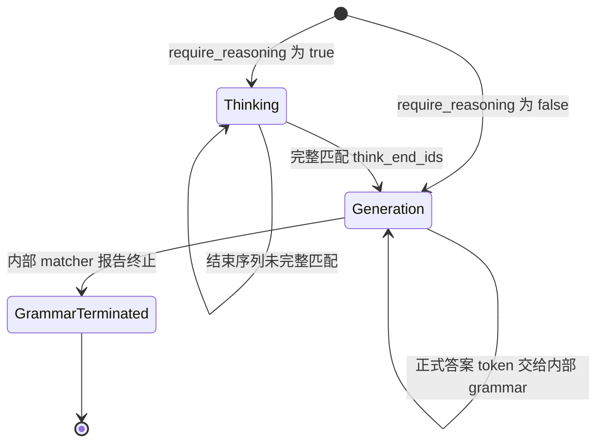

# 结构化输出与 Grammar 状态

本文是 **08-01，源码分析型学习资料**。本篇追踪一条要求“只能回答 `yes` 或 `no`”的请求：规则怎样编译，生成一半时怎样知道下一个 token 是否允许，为什么两条使用相同规则的请求不能共享一个正在前进的匹配器？

人话版：模型每步给词表里的 token 打分，grammar 为当前生成位置提供一张“允许继续走的路”清单。采样从允许的候选中选择，选择结果再推进这条请求的规则状态。**规则、请求进度和本步掩码是三种不同寿命的对象。**

## 0. 阅读基线与范围

| 项目 | 内容 |
| --- | --- |
| 源码仓库与路径基准 | 官方 `sgl-project/sglang`；所有源码路径相对于 SGLang 仓库根目录 `.` |
| 学习分支 | `codex/sglang-source-study-20260909`，基于已拉取的官方 `main` |
| 固定 commit | `72d5c5bb73cadd7ffbf5114e5f81e29d36b6c61a` |
| 读取日期 | `2026-09-10`；沿用 2026-09-09 固定的官方源码 |
| 源码工作区 | 独立 `sglang-source-study` worktree，读取时干净；原 `sglang` 保留 `muxi-main` 和 26 个未跟踪文件 |
| 文档位置 | Wiki `sglang/source-study/08-advanced-generation/`，作为高级生成阶段的第一篇 |
| 阅读主线 | 普通文本、单实例、TP/PP/DP=1、非投机、非 Beam；代表实现为 XGrammar，先关闭 reasoning 与 Overlap 理解顺序 |
| 独立变化 | JSON Schema、EBNF、structural tag；批次混合、思考阶段、编译异常和多 rank 决策传播 |
| 不展开 | 外部 grammar 编译器的算法证明、完整 Schema/正则方言、所有工具调用解析器、投机树验证和 Beam 分支复制；后续文章继续连接 |
| 外部依赖边界 | `python/pyproject.toml` 声明 `xgrammar==0.2.1`；这里只读 SGLang 的适配与调用，没有下载、导入或核查外部库内部实现 [依赖声明][S54] |
| 操作边界 | 只读源码、编写文档与静态检查；未运行 SGLang/torch 单测、服务、模型、GPU kernel 或性能实验 |

前置：[02-01 协议到请求](../02-request-lifecycle/01-API协议到内部请求对象.md)、[05-04 采样](../05-model-execution/04-Logits采样与输出概率.md)。跨实例状态的背景见 [07-05](../07-disaggregation/05-PD异常取消与资源退役.md)。

**源码事实**由固定锚点支撑；玩具词表、概率、示意图和阶段划分是**教学推演**。本文没有**运行观察**，也不把任意 JSON Schema 的兼容性当作已经实测。

## 1. 从“请按格式回答”到逐 token 约束

### 1.1 规则限制什么

在 prompt 中写“只能回答 yes 或 no”，仍然由模型自行决定是否遵守。这里研究的接口还把规则交给引擎：每步采样之前，利用已生成前缀计算合法 token 集合，再改写不允许的 logits。[生成掩码][S28] [应用掩码][S35]

可以理解为走迷宫：模型给岔路打分，规则负责封闭走不到合法出口的路。这个比喻解释的是适配层的目标，不表示外部编译器真的使用某种迷宫或简单有限状态自动机。

| 术语 | 人话解释 | 本篇要区分的边界 |
| --- | --- | --- |
| grammar / 约束规范 | 描述输出允许的结构或文本 | 规范字符串不是请求已经走到的位置 |
| JSON Schema | 描述字段、类型等要求的输入形式 | 支持哪些关键字要按后端、版本和具体 Schema 验证 |
| regex / EBNF | 正则表达式 / 通过产生式描述语法 | 两种输入类型分别分发，不是同一种字符串格式 |
| compiled context | 编译后的规则上下文 | 可供新 matcher 使用，不是正在生成的输出历史 |
| matcher | 记住本请求已接受 token 的匹配器 | 下一步合法集合依赖它的当前状态 |
| vocab mask | 本步、每请求一行的词表掩码 | 不等于模型 Attention mask，也不等于 KV 页表 |
| accept_token | 把实际选择的 token 交给 matcher 前进 | 编译成功、填好 mask 都没有完成这一步 |
| is_terminated / finished | matcher 的终止判断 / 与 Req 结束状态同步的字段 | 两者不总在同一语句、同一时刻更新 |

XGrammar 对象保存 `ctx`、`matcher`、`accepted_tokens` 和继承的 `current_token`；其 `is_terminated()` 直接询问 matcher。[对象][S19] [接受 token][S21] [终止查询][S23]

### 1.2 控制流与数据流总览



**图意解读：** 方框是组件职责或步骤，只有编译方框明确表示线程池任务，不是一框一个进程。规则字符串从 API 流向编译器，mask 从请求状态流向 logits，token ID 从采样流回 matcher。停止检查与 accept 的具体先后见第 6 节，不能从合并方框推断全部路径具有同一种顺序。[Manager][S7] [Runner][S31] [结果处理][S41]

## 2. 用户输入怎样变成 grammar key

### 2.1 先看内部统一入口

`SamplingParams` 有 `json_schema`、`regex`、`ebnf`、`structural_tag` 四个约束字段。初始化将空字符串规范为 `None`；`verify()` 要求四者最多设置一个。[初始化][S68] [互斥校验][S2]

GrammarManager 依次检查字段，构造 `(类型, 字符串)` 的 key，例如 `("regex", "(yes|no)")`。**这个分支顺序不表示客户端可以同时传多个约束让它们取交集**；前面的参数校验会拒绝这种组合。[请求分发][S7]

下列是原生请求中采样参数的教学片段，只解释字段，没有实际发送：

```json
{
  "sampling_params": {
    "regex": "(yes|no)",
    "temperature": 0,
    "max_new_tokens": 16
  }
}
```

它不是完整 `/generate` 请求，真实调用还需要文本等字段。16 只是假设的长度预算，不表示该约束固定需要 16 个 token。`temperature=0` 的贪心路径仍在 Runner 应用 grammar 之后调用 Sampler。[Runner 调用][S32] [贪心分支][S34]

### 2.2 兼容 API 中同名 JSON 模式的区别

下表描述 SGLang 自己的 `ChatCompletionRequest.to_sampling_params`，不外推其他服务商的协议实现。[转换入口][S1]

| 外层输入 | 此路径的内部行为 | 阅读时注意 |
| --- | --- | --- |
| `response_format.type=json_schema` | 通常把 `json_schema.schema_` 转成字符串交给 `json_schema` 字段 | 存在 `strict=false` 且 renderer 接手 response_format 时跳过该约束的条件分支 |
| `response_format.type=json_object` | 使用 `{"type": "object"}` | 与 XGrammar 适配器中的 `$$ANY$$` 特殊字符串不同 |
| `response_format.type=structural_tag` | 把 response_format 序列化给对应字段 | 后端还要处理格式版本及结构兼容性 |
| `regex` / `ebnf` | 进入同名内部字段 | 不改变四种约束互斥的原则 |
| 必选或指定工具 + 已有输出约束 | 检测到 tool-call constraint 冲突时抛错 | 不能把 tool grammar 与输出 grammar 默认为可叠加 |

`$$ANY$$` 在 XGrammar 的 JSON 分发中走 `compile_builtin_json_grammar()`；普通 Schema 走 `compile_json_schema()`。前者的“任意 JSON”意图与“必须是 object”的输入不同，阅读 `json_object` 时不能直接替换成它。[JSON 分发][S14]

### 2.3 后端选择是另一层条件

`create_grammar_backend()` 从生效执行配置选择内置 `xgrammar`、`llguidance`、`outlines` 或 `none`，也有注册后端入口。Manager 在跳过 tokenizer 初始化时不会创建 grammar backend。[选择][S3] [Manager 初始化][S63]

XGrammar 初始化需要把 tokenizer、词表大小和模型 EOS 信息交给 `TokenizerInfo`/compiler。特殊 tokenizer 初始化不受支持时会抛出适配器异常；非 strict-thinking 路径将生效 grammar backend 回退为 `none`，后续受约束请求由 Manager abort。启用 strict thinking 的相关失败路径会直接报错。[初始化][S13] [回退][S3] [无后端请求][S7]

因此，启动成功不能代替“这条受约束请求拥有可用后端”的检查。模型 tokenizer 和 grammar 编译结果属于同一个词表坐标系；不要跨不同 tokenizer 直接搬 matcher 或 mask。

## 3. 编译、缓存与请求状态的三本账

### 3.1 对象在哪里，活多久

| 对象或字段 | 持有者 | 内容与寿命 | 不表示什么 |
| --- | --- | --- | --- |
| `backend.cache[key]` | 本进程的 grammar backend | 按规则 key 保存可复制对象，也可能保存 InvalidGrammarObject | 不是所有服务实例共享的全局缓存 |
| `Future` | 编译 executor；等待期间由 Req 引用 | 表示一次异步编译工作及结果 | `done()` 不等于编译出有效 grammar |
| `grammar_queue` | GrammarManager | 尚待取编译结果或处理退出的请求 | 不等于等待 GPU 准入的普通 waiting_queue |
| `Req.grammar` | 单请求 | 未命中时先是 Future，准备完成后是 grammar 对象 | 不能在仍是 Future 时拿来填 vocab mask |
| XGrammar `ctx` | grammar 对象引用的外部编译结果 | 供新 matcher 构造时复用 | 不是本请求的已生成前缀 |
| XGrammar `matcher` / `accepted_tokens` | 单请求 grammar | 随每次接受 token 推进 | 两个同规则请求可以处于不同位置 |
| `GrammarRow(row, grammar)` | 本次 mask 填充输入 | 本批次行号与对应 matcher 的配对 | row 不是永久 RID |
| `GrammarMask` | SamplingBatchInfo 暂持 | 本步 mask + 一个用于分发 apply 方法的 grammar 句柄 | 句柄不代表全部请求共用它的 matcher |

`GrammarMask` 的注释明确说明 grammar 仅作为应用掩码的后端句柄。真实每行状态来自 `GrammarRow` 中各请求自己的对象。[mask 句柄][S36] [逐行组装][S28]

### 3.2 未命中：先编译，再进入普通调度

第一条 R1 的规则未命中时，backend 把 `_init_value_dispatch` 提交到 `ThreadPoolExecutor`；Manager 把返回的 Future 放进 `Req.grammar`，记录 key，并加入 grammar_queue。Scheduler 的请求入口据返回值决定是否暂缓普通入队。[缓存入口][S4] [编译分发][S5] [请求入口][S37]

之后 `_get_new_batch_prefill_raw` 取回 ready grammar 请求，再交给 `_add_request_to_queue`；普通非分离模式走 waiting_queue。**编译 ready 只是移交调度的条件，后面仍有准入、组批与显存条件。** 该 ready 列表还可能含已 abort 的请求，不能把列表里的每一项都理解成成功进入模型计算。[调度接回][S38] [入队分发][S70]

成功取结果时，Manager 先把 `req.grammar.copy()` 放入缓存，再应用本请求的 thinking budget/结束标记选择。这样请求级选项不会在这一操作中写进缓存模板。[取结果与顺序][S8] [请求配置][S12]

### 3.3 命中：复用上下文，建立新匹配器

XGrammar 的 `copy()` 构造新的 `GrammarMatcher(self.ctx, ...)`，再构造新的 XGrammarGrammar；它复用 ctx，重置该新对象的已接受 token 历史。[copy 实现][S20]

教学场景：R1 已经生成 `y`，R2 随后以同一个 regex key 到达。R2 命中规则缓存，从起点开始，可以选 `y` 或 `n` 等允许前缀；它不应继承 R1 的“下一步需要接 `es`”状态。复用的是编译工作，不是两人的作答进度。

有三个限制要同时记住：

- **字符串相同才命中这里的 key。** JSON 的空白、键顺序若导致传入字符串不同，wrapper 层不会替你证明语义等价。[key 构造][S7]
- **并发未命中没有在这里合并 Future。** cache 中尚无对象时，每次调用都会 submit；Manager 的请求队列也没有按 key 把两条请求折叠为一个 Future。外部 compiler 是否另有共享缓存属于另一层。[缓存实现][S4] [对应单测断言][S55]
- **不要把方法名 copy 当成统一语义。** Base 默认返回 self；XGrammar 此处新建起始 matcher，Guidance 使用 matcher 的 deep_copy，Outlines 的构造参数又不同。本文证明的是 XGrammar 缓存取用路径，不是所有后端对生成中前缀的克隆保证。[Base][S69] [Guidance][S64] [Outlines][S65]

测试 `test_cache_miss_duplicate_key_submits_separate_futures` 的断言证明两个 Future 不同。其注释关于 Manager 去重的泛化描述，不能替代实际 Manager 的逐请求代码；本篇以上述可见实现为准。

### 3.4 失败也可能被缓存

| 情况 | Manager/Backend 的动作 | 后续影响 |
| --- | --- | --- |
| 后端返回 InvalidGrammarObject | 保留错误文本，取结果时记录无效缓存并 abort | 同 key 再来可能立即命中错误 |
| Future 内部抛异常 | `.result()` 的异常转换为 InvalidGrammarObject，再 abort | Future.done 只能证明任务结束 |
| 等待次数达到上限 | 调用 Future.cancel，缓存超时 InvalidGrammarObject，abort | 不是自动换无约束模式重试 |
| 用户取消排队请求 | 尝试 cancel Future，并设置请求 abort | 后续从 grammar_queue 清出 |
| clear/reset | Base 清 wrapper cache；XGrammar 的 reset 另外清 compiler cache | 不等于杀掉已运行的编译线程或取消所有在途请求 |

源码还在编译分发前检查规则中的 NUL，包括 JSON 解码后的嵌套字符串。命中后直接拒绝，不进入后端编译。这是本基线的防护条件，不代表验证了所有非法字符或所有外部库错误。[异常与超时][S8] [取消][S10] [清理][S11] [XGrammar reset][S18] [NUL][S62]

`Future.cancel()` 是一次取消尝试，调用点没有据其返回值建立“线程已停止”的确认。这里应分开请求退出、编译工作结束、缓存项清除；不要把清缓存写成强制终止编译。[取消调用][S10]

## 4. R1/R2 怎样从规则状态得到词表掩码

### 4.1 token 不等于字符

下面人为定义 9 个 token，只用于手算，并约定完整单词之后允许 EOS 结束。不使用真实 tokenizer，也不宣称这是 XGrammar 对真实词表的逐项输出。

| 教学 ID | 文本/作用 | 起点允许？ | 已生成 `y` 后允许？ |
| ---: | --- | --- | --- |
| 0 | `y` | 是 | 否 |
| 1 | `es` | 否 | 是 |
| 2 | `yes` | 是 | 否 |
| 3 | `n` | 是 | 否 |
| 4 | `o` | 否 | 否 |
| 5 | `no` | 是 | 否 |
| 6 | `maybe` | 否 | 否 |
| 7 | 空格 | 否 | 否 |
| 8 | EOS | 否 | 否 |

规则允许完整文本 `yes` 或 `no`。起点的 `y` 虽不是完整答案，但还能由 `es` 补完；`yes` 又是一个完整词 token。这解释了为什么 mask 必须围绕 tokenizer 的 token ID 生成，不能简单用“允许字符列表”替代。[词表上下文][S13] [matcher 填掩码][S24]

在这个**教学约定**下，R1 可走 `0 → 1 → 8`，R2 可走 `5 → 8`。同一个规则允许不同 token 路径；真实 EOS 和终止行为还受 tokenizer/模型的 stop token 信息及请求停止条件影响，不能仅凭字符串结束推断 matcher 已终止。[模型 EOS 输入][S13] [请求停止][S44]

### 4.2 同批次三行可以处在三个不同状态

假设某次采样前批次顺序是 `[R2, R1, R3]`：R2 位于起点，R1 已接受 `y`，R3 没有约束。

| row | 请求 | 当前 grammar 状态 | 教学允许 ID 集合 | mask 的责任 |
| ---: | --- | --- | --- | --- |
| 0 | R2 | 起点 | `{0, 2, 3, 5}` | 用 R2 的 matcher 填第 0 行 |
| 1 | R1 | 已接受 `y` | `{1}` | 用 R1 的 matcher 填第 1 行 |
| 2 | R3 | 无 grammar | 不由此机制限制 | 保留新分配 buffer 的无约束值 |

ForwardBatch 初始化从 `batch.reqs` 按顺序取 grammar；`update_regex_vocab_mask()` 为未 finished、未 terminated 的有效 grammar 建立 row 配对。名字虽然叫 regex，实际承接这些 grammar 类型的公共采样入口。[请求行对齐][S30] [筛选条件][S28]

每次普通路径新分配 mask，省略的行保持无约束初值；**不能把“finished 行没填”解读成“保留上次的拒绝列表”**。这也不授权该请求继续向客户端发 token，调度和结果处理仍负责结束请求。[填充条件][S28] [结果处理][S41]

### 4.3 压缩位图如何改写 logits

XGrammar 路径分配以 `-1` 填充的整型位图，填好后移到执行设备。仓内 Triton apply kernel 每 32 个 token 使用一个 int32：位为 0 时，把对应 logit 写成负无穷；位为 1 时，保留该 token 的分数。[分配][S25] [搬运][S26] [设备分发][S27] [kernel][S35]

对教学 ID 集合 `{0, 2, 3, 5}`，低 9 位的数值为 `1 + 4 + 8 + 32 = 45`；R1 仅允许 ID 1，对应值为 2。教学词表只有 9 项，实际词表、padding 和末尾无效位以真实分配形状及 kernel 范围为准，45/2 不是生产 mask dump。

假设仅为演示，起点未加约束的归一化概率如下；温度为 1，不额外启用 top-k/top-p/min-p：

| 教学 ID | 原概率 | mask 后允许？ | 在允许集合重新归一化后的概率 |
| ---: | ---: | --- | ---: |
| 0 | 0.20 | 是 | 0.40 |
| 1 | 0.10 | 否 | 0 |
| 2 | 0.15 | 是 | 0.30 |
| 3 | 0.10 | 是 | 0.20 |
| 4 | 0.05 | 否 | 0 |
| 5 | 0.05 | 是 | 0.10 |
| 6 | 0.25 | 否 | 0 |
| 7 | 0.05 | 否 | 0 |
| 8 | 0.05 | 否 | 0 |

允许项总质量为 0.50。表格是对“logits 置负无穷后做 softmax”的数学教学等价解释，不表示实现先算这张概率表再除法。原来概率最高的 `maybe` 被屏蔽；在允许的四个候选中，模型仍决定分数。贪心时会选允许项中的最高分，本例为 ID 0。[应用 kernel][S35] [采样分支][S34]

### 图解补充：语法状态每走一步，允许的 token 就改变



[查看原尺寸](../../../images/sglang-source-study/24-grammar-decoding.png)（手机查看宽图时可横屏或放大）。

**图意解读：** 观察下方两个黄色框：在 done 后只允许符合布尔字段的续写；值完成后，允许集合随语法位置改变。约束发生在生成过程，不是输出完再修 JSON。

**对应本篇源码：** 对照 XGrammar backend 的逐请求状态与词表 bitmask；编译结果可复用，不代表所有请求共享同一个可变匹配位置。 [源码：python/sglang/srt/constrained/xgrammar_backend.py][S13]

**来源与边界：** [Achieving Efficient, Flexible, and Portable Structured Generation with XGrammar](https://blog.mlc.ai/2024/11/22/achieving-efficient-flexible-portable-structured-generation-with-xgrammar)，MLC Community，2024-11-22。token mask 约束的是格式与语法，不能保证内容事实正确；图中的可见词只是讲解粒度，真实 bitmask 对应 tokenizer 的词表 token。 [来源档案 F24](../../../images/sglang-source-study/SOURCES.md#f24)。

## 5. 一次采样的顺序为什么重要

普通路径的可见调用顺序是：

1. `ModelRunner._preprocess_logits` 用当前 grammar 状态更新 mask。
2. SamplingBatchInfo 先应用 penalty，再应用 grammar mask，再加 `logit_bias`。
3. Runner 释放 `sampling_info.grammar_mask` 引用，把 logits 交给 Sampler。
4. Sampler 运行自定义 logits 处理器与非有限值处理，再走贪心或随机采样。

这些步骤由 [Runner 预处理][S31]、[bias 顺序][S29]、[Sampler 预处理][S33] 和 [采样入口][S34] 连接。

通常有限的加性 logit_bias 不会把负无穷变回有限数。但任意自定义 logits 处理器位于后面，可能重写被屏蔽的值。因此“grammar 对任何插件叠加都绝对有效”不由这条调用链自动保证。出现非法 token 时，应检查后续处理、行号和状态推进，而不是只看编译是否成功。

这里释放的是**本步 mask 张量的 Python 引用**，没有清除请求 matcher 或规则缓存。代码注明此举避免 Overlap 的延迟采样闭包/批次记录延长 mask 的持有寿命；本文未测显存下降，也不把引用清除当成设备 allocator 立即向系统归还内存的证据。[mask 引用释放][S31]

### 图解补充：CPU 可以提前准备规则，采样仍要等待正确 mask



[查看原尺寸](../../../images/sglang-source-study/25-grammar-overlap.png)（手机查看宽图时可横屏或放大）。

**图意解读：** 上下两条时间线对照串行与重叠：CPU 上的编译或 mask 准备可与 GPU forward 交错，但一次采样必须使用对应前缀状态的约束。

**对应本篇源码：** 回到本节采样顺序与下一节状态推进：性能重叠不得让当前 mask 使用上一份错误前缀状态。 [源码：python/sglang/srt/constrained/xgrammar_backend.py][S13]

**来源与边界：** [Achieving Efficient, Flexible, and Portable Structured Generation with XGrammar](https://blog.mlc.ai/2024/11/22/achieving-efficient-flexible-portable-structured-generation-with-xgrammar)，MLC Community，2024-11-22。这是 XGrammar 的设计示意，不是当前 SGLang 每一种后端与投机组合的执行记录；延迟采样、状态推进和回滚条件以正文为准。 [来源档案 F25](../../../images/sglang-source-study/SOURCES.md#f25)。

## 6. 采样完成后，谁推进 grammar，谁决定结束

### 6.1 普通首 token 与 Decode 的真实顺序

模型采样拿到了 token，不表示 matcher 已接受它。普通最后一个 Prefill chunk 的结果处理中，先 append 输出并调用 `req.update_finish_state()`，之后调用 `_apply_prefill_grammar()`；普通 Decode 同样先扩展 output_ids、检查停止与处理结束资源，再调用 `_accept_grammar_tokens()`。[Prefill][S39] [首 token accept][S40] [Decode][S41]

| 顺序 | 普通非投机路径的动作 | 读取的状态 |
| ---: | --- | --- |
| 1 | 本步输出写入 Req | 新 token 已知 |
| 2 | `update_finish_state` | 包括新输出、stop/长度；此时本步 grammar accept 尚未在该结果路径执行 |
| 3 | 按请求结束状态处理缓存等 | 依赖 Req 的结束原因 |
| 4 | grammar 接受本步 token | matcher 前进；拒绝时记录错误并设置 `to_finish=FINISH_ABORT` |
| 5 | `grammar.finished = req.finished()` | 将请求结束状态同步到 grammar 对象 |

`XGrammarGrammar.accept_token()` 向 matcher 提交 token，失败返回会变成 ValueError；成功才追加 `accepted_tokens`。结果处理捕获异常，将 abort 意图留给请求结束逻辑。[接受实现][S21] [捕获][S42]

因此，**不要把普通路径画成“本步 matcher 终止 → 同一调用立刻根据它结束 Req”**。普通 `update_finish_state` 在本步 accept 之前；常见 EOS/长度可以先结束请求，而仅由 matcher 本步新终止所触发的可见行为必须连同后续调度与 EOS 配置核查。本篇记录顺序，不声称已经实测所有非 EOS 终止边界。

### 6.2 三种结束不要混用

`Req.update_finish_state` 先处理已有 `to_finish`，再检查异常 token、stop 字符串、stop token/EOS、长度上限，最后查询 grammar 的 `is_terminated()`。部分 stop 与长度还有截断优先级处理。[完整条件][S44]

| 状态 | 能说明什么 | 不能说明什么 |
| --- | --- | --- |
| 规则已编译 | 可以取得 grammar 对象继续约束 | 输出已完整或语义正确 |
| matcher 已终止 | 外部 matcher 认为达到其终止状态 | 客户端一定收到完整 JSON；结果还可能被 stop/输出裁剪影响 |
| Req.finished | 请求按某个 finish reason 停止 | 必然因为 grammar 合法结束；也可能 length、stop、abort |

例如 length 在 `{"answer":` 后耗尽，或者 stop 字符串截在 JSON 内部，客户端就可能拿到不完整文本。流式输出每个片段本来就只是前缀，消费端应结合最终内容与 finish reason 校验。Schema 类型正确也不会替业务证明答案事实正确。

### 6.3 投机路径只先建立接口边界

投机一次可能保留多个 token，所以不能只推进最后一个。这里的 `advance_grammar_fsm` 使用 `result.grammar_advanced` 避免重复推进，并为 Decode 保存 `grammar_retained_tokens`；接受序列在 matcher 终止处截断。[推进与记账][S43] [逐 token 截断][S42]

教学测试例为候选 `[101, 102, 103]`，假的 grammar 在 102 后终止，预期保留 `[101, 102]`。该单测还检查 KV 提交长度，但本次未运行，不能把 fake grammar 的通过意图推广成真实 XGrammar/GPU 验证。[测试入口][S60]

`ScheduleBatch.grammar_needs_sync()` 又按 spec algorithm 的能力决定 grammar 是否要求同步路径。由此不能断言所有 grammar 请求都与 Overlap 不兼容，也不能用普通结果顺序替代支持 grammar barrier 的投机路径。[同步条件][S67]

XGrammar 还提供 rollback 和 jump-and-retokenize 入口；后者比较新旧 token 前缀并回滚、重放差异。这些是恢复匹配状态的接口，不表示 Beam 可以直接用缓存 copy 克隆任意生成中前缀。[rollback][S22] [重分词][S66]

## 7. 加入思考阶段：何时才约束正式答案

### 7.1 reasoning wrapper 的分工

创建内置后端后，满足 reasoning parser 与结束标记条件时，可以包上 `ReasonerGrammarBackend`。wrapper 保存思考结束 token 序列匹配状态，内部 grammar 保存正式答案状态。[选择和包装][S3] [wrapper 初始化][S48]



**图意解读：** 这是 wrapper 正向接受 token 的教学状态图，最后节点只表示 matcher 终止，不表示全部请求清理完成。没有画 stop/abort 和 rollback；Req 可以在任一阶段因预算等原因结束，rollback 也可能跨回 thinking。[状态推进][S46] [回滚][S49] [请求停止][S44]

`accept_token` 先判断当前是否已经进入 generation；只有进入后才把这个 token 交给内部 grammar，然后推进 wrapper 状态。因此“构成思考结束序列最后一项的 token”在 thinking 中被接收，不会同时当作 JSON 答案的第一项提交给内部 grammar。[接收顺序][S45]

### 7.2 多 token 结束标记与预算

假设教学结束标记是 `[7, 8]`：只看到 7 时还没退出 thinking，随后正确接上 8 才切换。真实匹配通过 TokenSequenceMatcher 处理部分匹配和回退，不能用“看见任意一个结束 token”替代完整序列。[转移][S46]

| 情况 | fill_vocab_mask 的行为 | 边界 |
| --- | --- | --- |
| thinking 且没有启用 token filter | 不调用内部 grammar 填这行 | 思考文本不受最终 JSON 语法直接约束 |
| thinking、filter 开启、仍可思考 | 按配置排除特定 token | 与 JSON 的字段约束不是同一张规则 |
| thinking、filter 开启、预算已尽 | 仅放行结束序列下一项 | 结束标记可能需要多步完成 |
| generation 且存在内部 grammar | 转交内部 grammar 填 mask | 开始按照正式答案前缀约束 |

这张表对应 [wrapper 填充][S47]。strict-thinking 在需要 token filter 而后端不支持时会报错；请求级 budget 和结束标记先经过 Manager 配置校验。[后端能力检查][S48] [请求配置][S12]

测试中先接受一个思考 token，再分别允许 7、8，证明测试期望的是“逐项补齐多 token 结束标记”。本次只阅读测试，未运行。[预算用例][S59]

## 8. 多 rank、其他后端与兼容性边界

### 8.1 多 rank 同步的是排队决定

PP0 的 DP/TP 同步组交换 ready 与 failed 的**队列索引集合**：ready 取交集，failed 取并集。随后 PP0 通过 `GRAMMAR_PP_SYNC` 沿 PP 链传播该决定。下游 stage 接收并应用，没有在这里重新做所有 PP stage 的 readiness 交集。[集合逻辑][S8] [PP 转发][S9]

教学例：两 rank 的 ready 分别为 `{0, 1}`、`{0}`，共同 ready 为 `{0}`；failed 分别为 `{2}`、`{3}`，共同处理失败集合为 `{2, 3}`。它们是对齐队列中的位置，不是请求 RID，更不是两个 Schema 的语法交集。

后续 PP stage 对这些索引调用本地 Future.result 取对象，因此传播 ready 决定不等于已把编译对象或 matcher 状态从 PP0 传过去。检查卡点时仍应看本地编译任务与队列一致性。

轮询环境声明为间隔 0.005 秒、最多 10000 次；计数在 PP0 未 ready 的请求上按调用轮次累加。**不能把两者相乘的 50 秒写成精确的端到端超时 SLA**，实际节奏还受调度循环、计算及通信影响。[默认声明][S53] [计数位置][S8]

### 8.2 后端支持要落到具体分发

| 组合或选择 | 本基线可见行为 | 证据等级 |
| --- | --- | --- |
| XGrammar + JSON/regex/EBNF | 分别调用对应 compiler 接口，编译错误转无效对象 | 源码有分发，具体语法支持需验证 [JSON][S14] [regex][S15] [EBNF][S16] |
| XGrammar + structural tag | 处理 legacy/新结构并清理缺失 Schema 的相关字段，再编译 | 源码有路径，不等于任意标签格式都支持 [结构处理][S17] |
| Outlines + JSON/regex | JSON 转 regex，再走 RegexGuide | 适配路径存在，Schema 子集不能套用 XGrammar [JSON][S52] |
| Outlines + EBNF/structural tag | 走基类不支持分发 | 本适配器返回无效 grammar [EBNF 与相邻分发][S51] |
| Guidance + structural tag | 要求 legacy structural tag，按 begin/trigger 匹配转换 | 此路径不能按 XGrammar 新格式能力外推 [转换][S50] |
| backend none + 显式约束 | Manager 设置 abort | 源码拒绝 [入口][S7] |
| JSON + strict=false | 是否启用内核约束还受 renderer_handles_response_format 影响 | 条件路径，不能只看 strict 字段 [协议][S1] |
| grammar + 自定义 logits 处理器 | 处理器在 mask 之后执行 | 顺序事实，组合保真仍需单独验证 [Sampler][S33] |

## 9. 从症状反查到状态

| 现象 | 先确认的对象/字段 | 源码入口 | 不能直接得出的结论 |
| --- | --- | --- | --- |
| 第一条请求很久没有首 token | Future 是否 done、grammar_wait_ct、grammar_queue、调度等待 | [Manager][S8] [接回队列][S38] | 不一定是 GPU forward 慢 |
| 修正环境后同 Schema 仍立即报错 | 实际 key、InvalidGrammarObject 缓存、错误文本 | [命中][S4] [无效处理][S7] | 不证明本次又执行了一次编译 |
| 同规则两请求进度串了 | matcher 是否独立、cache copy 与 batch row 配对 | [copy][S20] [行填充][S28] | ctx 共享本身不等于状态串扰 |
| 看到了不符合规则的 token | tokenizer、已接受前缀、mask 行、后置自定义处理器、accept 日志 | [accept][S21] [Sampler][S33] | 编译成功不是每步状态正确的证据 |
| 最终 JSON 解析失败 | finish reason、原始 token、stop 裁剪、长度、思考与答案分界 | [停止][S44] [wrapper][S45] | 不应只归因于 grammar 编译器 |
| 思考阶段看起来“没约束” | require_reasoning、token filter、完整 think_end_ids | [fill][S47] | 不等于正式答案阶段也没启用 grammar |
| 普通请求批次受到了旧 mask 影响 | 本次 row 顺序、有效 entries、新 mask 初值、复用路径 | [普通 mask][S28] | 不能用 Request ID 的顺序猜当前行 |
| PP 下 grammar 等待卡住 | PP0 集合、PP 同步 work、本 stage Future | [PP 同步][S9] [取结果][S8] | PP0 ready 不证明下游编译已经完成 |
| 取消后仍有编译线程工作 | cancel 是否成功、请求是否退出、Future 执行阶段 | [取消][S10] | abort 不等于线程被强制停止 |
| 结构合法但答案错误 | 最终字段值与业务校验 | 回到应用要求 | 格式约束不负责事实核验 |

## 10. 回源码的最短阅读顺序

以下路径全部从 SGLang 仓库根目录起算。先读主线，后读条件分支；表格是导航，不替代前面的状态解释。

| 次序 | 行为 | 文件与符号 |
| ---: | --- | --- |
| 1 | 外层协议与内部约束互斥 | `python/sglang/srt/entrypoints/openai/protocol.py::ChatCompletionRequest.to_sampling_params` [S1]；`python/sglang/srt/sampling/sampling_params.py::SamplingParams.verify` [S2] |
| 2 | 按 key 命中或 submit | `python/sglang/srt/constrained/base_grammar_backend.py::BaseGrammarBackend.get_cached_or_future_value` [S4] |
| 3 | 暂存 Future、取结果并转交 Scheduler | `python/sglang/srt/constrained/grammar_manager.py::GrammarManager.process_req_with_grammar` [S7]；`python/sglang/srt/constrained/grammar_manager.py::GrammarManager.get_ready_grammar_requests` [S8] |
| 4 | JSON 编译与新 matcher | `python/sglang/srt/constrained/xgrammar_backend.py::XGrammarGrammarBackend.dispatch_json` [S14]；`python/sglang/srt/constrained/xgrammar_backend.py::XGrammarGrammar.copy` [S20] |
| 5 | 从请求列表取得本批 grammar | `python/sglang/srt/model_executor/forward_batch_info.py::ForwardBatch.init_new` [S30] |
| 6 | 每请求一行填 mask | `python/sglang/srt/sampling/sampling_batch_info.py::SamplingBatchInfo.update_regex_vocab_mask` [S28] |
| 7 | 应用 mask、清引用、采样 | `python/sglang/srt/model_executor/model_runner.py::ModelRunner._preprocess_logits` [S31]；`python/sglang/srt/layers/sampler.py::Sampler.forward` [S34] |
| 8 | 禁止位对应 logit 置负无穷 | `python/sglang/kernels/ops/grammar/bitmask_ops.py::apply_token_bitmask_inplace_kernel` [S35] |
| 9 | 已选择 token 推进状态 | `python/sglang/srt/managers/scheduler_components/batch_result_processor.py::SchedulerBatchResultProcessor._accept_grammar_tokens` [S42] |
| 10 | 请求结束与 matcher 终止 | `python/sglang/srt/managers/schedule_batch.py::Req.update_finish_state` [S44] |
| 11 | 何时开始约束正式答案 | `python/sglang/srt/constrained/reasoner_grammar_backend.py::ReasonerGrammarObject.accept_token` [S45]；`python/sglang/srt/constrained/reasoner_grammar_backend.py::ReasonerGrammarObject.fill_vocab_mask` [S47] |

## 11. 练习、验证记录与下一篇

### 11.1 不运行模型也能做的练习

1. R1 已接受 `y`，同 regex 的 R2 新到达。二者允许集合为什么不同？缓存省掉了什么？
2. 在教学词表中，ID 0、2、3、5 允许，压缩低位值是多少？批次换成 `[R1, R3, R2]` 后，三行怎样填？
3. Future.done 为 true，却得到 InvalidGrammarObject。应该继续无约束生成吗？同 key 再来会怎样？
4. JSON 文本因 length 停止，`grammar.finished` 已同步为 true。能否据此断言 JSON 完整？
5. 多 token think_end 为 `[7, 8]`，预算用尽后只发出 7。下一步应该已进入 JSON 还是继续补结束标记？
6. 普通 Decode 与支持提前 grammar barrier 的投机 Decode，能否统一描述为“先 append、后 accept”？

**参考答案：** 1）各自 matcher 跟踪不同前缀；复用编译上下文，R2 重新从起点走。2）45；新顺序应分别填 `{1}`、无约束、`{0,2,3,5}`。3）Manager abort 并可能缓存错误；同 key 可直接命中无效结果。4）不能，finished 是请求状态同步，length 可能截断合法前缀。5）继续允许 8，完整匹配后才切换。6）不能；普通结果路径与投机提前推进/去重路径的可见顺序不同。

### 11.2 已读测试与证据边界

| 测试入口 | 本次阅读到的意图 | 尚未证明 |
| --- | --- | --- |
| `test/registered/unit/constrained/test_base_grammar_backend.py` [并发 miss][S55] | 两次未命中得到不同 Future；缓存命中通过 copy 取对象 | 外部 compiler 缓存命中率或编译并发性能 |
| `test/registered/unit/constrained/test_grammar_manager.py` [超时][S56] [请求 budget][S57] | 超时 abort 并缓存错误；请求 budget 不写进缓存模板 | 真实线程超时、跨 rank 并发与取消排空 |
| `test/registered/unit/sampling/test_sampling_batch_info.py` [混合行][S58] | 活跃 grammar 填 mask；finished/terminated 行不调用填充 | 真词表与 GPU 上每一位都正确 |
| `test/registered/unit/constrained/test_reasoner_grammar_backend.py` [多 token 标记][S59] | 预算用尽时逐步允许 7、8 | 真实模型 reasoning 格式和最终答案质量 |
| `test/registered/unit/managers/test_batch_result_processor_spec_grammar.py` [截断][S60] | 假 grammar 终止后不保留候选后缀 | 真实投机树、KV 写入与设备并发正确性 |
| `test/registered/constrained_decoding/test_constrained_decoding.py` [fixture][S61] | 按后端参数启动服务，复用 JSON/regex/EBNF 测试 mixin | 本次只读 fixture，未运行这些服务测试 |

**已执行：** 固定源码路径/符号/链接和文档导航核查；教学集合、位图、概率归一化与结果处理顺序静态检查。**未执行：** 上表任何单测、SGLang/torch 导入、外部 grammar 编译、真实 tokenizer、API 服务、GPU、投机/PP 并发与性能实验。Mermaid 只做结构和语义静态检查，未渲染。

后续有环境时，实验记录应分别保留原始规则字符串、实际后端与依赖版本、tokenizer、冷/热缓存、输出 token、finish reason、最终文本解析结果和业务验证结果。不要只保存一份漂亮的 JSON，就宣布整个状态链验证通过。

继续阅读时先记住：**grammar 每步回答“哪些 token 还能接”，matcher 记住“这条请求走到哪”，Req 决定“这条请求因为什么结束”。** 下一篇为 [08-02《Beam Search 与请求分支状态》](02-BeamSearch与请求分支状态.md)，转向多候选的扩展、筛选和分支历史。

返回[系列目录](../README.md)、[术语表](../appendices/01-术语与对象速查.md)、[配置矩阵](../appendices/03-配置解析与功能兼容矩阵.md)或[学习进度](../appendices/06-学习进度与版本变更记录.md)。

[S1]: https://github.com/sgl-project/sglang/blob/72d5c5bb73cadd7ffbf5114e5f81e29d36b6c61a/python/sglang/srt/entrypoints/openai/protocol.py#L1095
[S2]: https://github.com/sgl-project/sglang/blob/72d5c5bb73cadd7ffbf5114e5f81e29d36b6c61a/python/sglang/srt/sampling/sampling_params.py#L223
[S3]: https://github.com/sgl-project/sglang/blob/72d5c5bb73cadd7ffbf5114e5f81e29d36b6c61a/python/sglang/srt/constrained/base_grammar_backend.py#L350
[S4]: https://github.com/sgl-project/sglang/blob/72d5c5bb73cadd7ffbf5114e5f81e29d36b6c61a/python/sglang/srt/constrained/base_grammar_backend.py#L283
[S5]: https://github.com/sgl-project/sglang/blob/72d5c5bb73cadd7ffbf5114e5f81e29d36b6c61a/python/sglang/srt/constrained/base_grammar_backend.py#L258
[S6]: https://github.com/sgl-project/sglang/blob/72d5c5bb73cadd7ffbf5114e5f81e29d36b6c61a/python/sglang/srt/constrained/base_grammar_backend.py#L297
[S7]: https://github.com/sgl-project/sglang/blob/72d5c5bb73cadd7ffbf5114e5f81e29d36b6c61a/python/sglang/srt/constrained/grammar_manager.py#L145
[S8]: https://github.com/sgl-project/sglang/blob/72d5c5bb73cadd7ffbf5114e5f81e29d36b6c61a/python/sglang/srt/constrained/grammar_manager.py#L198
[S9]: https://github.com/sgl-project/sglang/blob/72d5c5bb73cadd7ffbf5114e5f81e29d36b6c61a/python/sglang/srt/constrained/grammar_manager.py#L81
[S10]: https://github.com/sgl-project/sglang/blob/72d5c5bb73cadd7ffbf5114e5f81e29d36b6c61a/python/sglang/srt/constrained/grammar_manager.py#L113
[S11]: https://github.com/sgl-project/sglang/blob/72d5c5bb73cadd7ffbf5114e5f81e29d36b6c61a/python/sglang/srt/constrained/grammar_manager.py#L69
[S12]: https://github.com/sgl-project/sglang/blob/72d5c5bb73cadd7ffbf5114e5f81e29d36b6c61a/python/sglang/srt/constrained/grammar_manager.py#L128
[S13]: https://github.com/sgl-project/sglang/blob/72d5c5bb73cadd7ffbf5114e5f81e29d36b6c61a/python/sglang/srt/constrained/xgrammar_backend.py#L208
[S14]: https://github.com/sgl-project/sglang/blob/72d5c5bb73cadd7ffbf5114e5f81e29d36b6c61a/python/sglang/srt/constrained/xgrammar_backend.py#L336
[S15]: https://github.com/sgl-project/sglang/blob/72d5c5bb73cadd7ffbf5114e5f81e29d36b6c61a/python/sglang/srt/constrained/xgrammar_backend.py#L359
[S16]: https://github.com/sgl-project/sglang/blob/72d5c5bb73cadd7ffbf5114e5f81e29d36b6c61a/python/sglang/srt/constrained/xgrammar_backend.py#L351
[S17]: https://github.com/sgl-project/sglang/blob/72d5c5bb73cadd7ffbf5114e5f81e29d36b6c61a/python/sglang/srt/constrained/xgrammar_backend.py#L367
[S18]: https://github.com/sgl-project/sglang/blob/72d5c5bb73cadd7ffbf5114e5f81e29d36b6c61a/python/sglang/srt/constrained/xgrammar_backend.py#L400
[S19]: https://github.com/sgl-project/sglang/blob/72d5c5bb73cadd7ffbf5114e5f81e29d36b6c61a/python/sglang/srt/constrained/xgrammar_backend.py#L74
[S20]: https://github.com/sgl-project/sglang/blob/72d5c5bb73cadd7ffbf5114e5f81e29d36b6c61a/python/sglang/srt/constrained/xgrammar_backend.py#L144
[S21]: https://github.com/sgl-project/sglang/blob/72d5c5bb73cadd7ffbf5114e5f81e29d36b6c61a/python/sglang/srt/constrained/xgrammar_backend.py#L92
[S22]: https://github.com/sgl-project/sglang/blob/72d5c5bb73cadd7ffbf5114e5f81e29d36b6c61a/python/sglang/srt/constrained/xgrammar_backend.py#L106
[S23]: https://github.com/sgl-project/sglang/blob/72d5c5bb73cadd7ffbf5114e5f81e29d36b6c61a/python/sglang/srt/constrained/xgrammar_backend.py#L110
[S24]: https://github.com/sgl-project/sglang/blob/72d5c5bb73cadd7ffbf5114e5f81e29d36b6c61a/python/sglang/srt/constrained/xgrammar_backend.py#L118
[S25]: https://github.com/sgl-project/sglang/blob/72d5c5bb73cadd7ffbf5114e5f81e29d36b6c61a/python/sglang/srt/constrained/xgrammar_backend.py#L61
[S26]: https://github.com/sgl-project/sglang/blob/72d5c5bb73cadd7ffbf5114e5f81e29d36b6c61a/python/sglang/srt/constrained/xgrammar_backend.py#L122
[S27]: https://github.com/sgl-project/sglang/blob/72d5c5bb73cadd7ffbf5114e5f81e29d36b6c61a/python/sglang/srt/constrained/xgrammar_backend.py#L125
[S28]: https://github.com/sgl-project/sglang/blob/72d5c5bb73cadd7ffbf5114e5f81e29d36b6c61a/python/sglang/srt/sampling/sampling_batch_info.py#L234
[S29]: https://github.com/sgl-project/sglang/blob/72d5c5bb73cadd7ffbf5114e5f81e29d36b6c61a/python/sglang/srt/sampling/sampling_batch_info.py#L295
[S30]: https://github.com/sgl-project/sglang/blob/72d5c5bb73cadd7ffbf5114e5f81e29d36b6c61a/python/sglang/srt/model_executor/forward_batch_info.py#L752
[S31]: https://github.com/sgl-project/sglang/blob/72d5c5bb73cadd7ffbf5114e5f81e29d36b6c61a/python/sglang/srt/model_executor/model_runner.py#L1856
[S32]: https://github.com/sgl-project/sglang/blob/72d5c5bb73cadd7ffbf5114e5f81e29d36b6c61a/python/sglang/srt/model_executor/model_runner.py#L1884
[S33]: https://github.com/sgl-project/sglang/blob/72d5c5bb73cadd7ffbf5114e5f81e29d36b6c61a/python/sglang/srt/layers/sampler.py#L114
[S34]: https://github.com/sgl-project/sglang/blob/72d5c5bb73cadd7ffbf5114e5f81e29d36b6c61a/python/sglang/srt/layers/sampler.py#L123
[S35]: https://github.com/sgl-project/sglang/blob/72d5c5bb73cadd7ffbf5114e5f81e29d36b6c61a/python/sglang/kernels/ops/grammar/bitmask_ops.py#L14
[S36]: https://github.com/sgl-project/sglang/blob/72d5c5bb73cadd7ffbf5114e5f81e29d36b6c61a/python/sglang/srt/constrained/base_grammar_backend.py#L148
[S37]: https://github.com/sgl-project/sglang/blob/72d5c5bb73cadd7ffbf5114e5f81e29d36b6c61a/python/sglang/srt/managers/scheduler.py#L2708
[S38]: https://github.com/sgl-project/sglang/blob/72d5c5bb73cadd7ffbf5114e5f81e29d36b6c61a/python/sglang/srt/managers/scheduler.py#L3693
[S39]: https://github.com/sgl-project/sglang/blob/72d5c5bb73cadd7ffbf5114e5f81e29d36b6c61a/python/sglang/srt/managers/scheduler_components/batch_result_processor.py#L253
[S40]: https://github.com/sgl-project/sglang/blob/72d5c5bb73cadd7ffbf5114e5f81e29d36b6c61a/python/sglang/srt/managers/scheduler_components/batch_result_processor.py#L660
[S41]: https://github.com/sgl-project/sglang/blob/72d5c5bb73cadd7ffbf5114e5f81e29d36b6c61a/python/sglang/srt/managers/scheduler_components/batch_result_processor.py#L889
[S42]: https://github.com/sgl-project/sglang/blob/72d5c5bb73cadd7ffbf5114e5f81e29d36b6c61a/python/sglang/srt/managers/scheduler_components/batch_result_processor.py#L789
[S43]: https://github.com/sgl-project/sglang/blob/72d5c5bb73cadd7ffbf5114e5f81e29d36b6c61a/python/sglang/srt/managers/scheduler_components/batch_result_processor.py#L820
[S44]: https://github.com/sgl-project/sglang/blob/72d5c5bb73cadd7ffbf5114e5f81e29d36b6c61a/python/sglang/srt/managers/schedule_batch.py#L1773
[S45]: https://github.com/sgl-project/sglang/blob/72d5c5bb73cadd7ffbf5114e5f81e29d36b6c61a/python/sglang/srt/constrained/reasoner_grammar_backend.py#L133
[S46]: https://github.com/sgl-project/sglang/blob/72d5c5bb73cadd7ffbf5114e5f81e29d36b6c61a/python/sglang/srt/constrained/reasoner_grammar_backend.py#L103
[S47]: https://github.com/sgl-project/sglang/blob/72d5c5bb73cadd7ffbf5114e5f81e29d36b6c61a/python/sglang/srt/constrained/reasoner_grammar_backend.py#L170
[S48]: https://github.com/sgl-project/sglang/blob/72d5c5bb73cadd7ffbf5114e5f81e29d36b6c61a/python/sglang/srt/constrained/reasoner_grammar_backend.py#L264
[S49]: https://github.com/sgl-project/sglang/blob/72d5c5bb73cadd7ffbf5114e5f81e29d36b6c61a/python/sglang/srt/constrained/reasoner_grammar_backend.py#L151
[S50]: https://github.com/sgl-project/sglang/blob/72d5c5bb73cadd7ffbf5114e5f81e29d36b6c61a/python/sglang/srt/constrained/llguidance_backend.py#L298
[S51]: https://github.com/sgl-project/sglang/blob/72d5c5bb73cadd7ffbf5114e5f81e29d36b6c61a/python/sglang/srt/constrained/outlines_backend.py#L160
[S52]: https://github.com/sgl-project/sglang/blob/72d5c5bb73cadd7ffbf5114e5f81e29d36b6c61a/python/sglang/srt/constrained/outlines_backend.py#L166
[S53]: https://github.com/sgl-project/sglang/blob/72d5c5bb73cadd7ffbf5114e5f81e29d36b6c61a/python/sglang/srt/environ.py#L395
[S54]: https://github.com/sgl-project/sglang/blob/72d5c5bb73cadd7ffbf5114e5f81e29d36b6c61a/python/pyproject.toml#L98
[S55]: https://github.com/sgl-project/sglang/blob/72d5c5bb73cadd7ffbf5114e5f81e29d36b6c61a/test/registered/unit/constrained/test_base_grammar_backend.py#L186
[S56]: https://github.com/sgl-project/sglang/blob/72d5c5bb73cadd7ffbf5114e5f81e29d36b6c61a/test/registered/unit/constrained/test_grammar_manager.py#L545
[S57]: https://github.com/sgl-project/sglang/blob/72d5c5bb73cadd7ffbf5114e5f81e29d36b6c61a/test/registered/unit/constrained/test_grammar_manager.py#L638
[S58]: https://github.com/sgl-project/sglang/blob/72d5c5bb73cadd7ffbf5114e5f81e29d36b6c61a/test/registered/unit/sampling/test_sampling_batch_info.py#L325
[S59]: https://github.com/sgl-project/sglang/blob/72d5c5bb73cadd7ffbf5114e5f81e29d36b6c61a/test/registered/unit/constrained/test_reasoner_grammar_backend.py#L122
[S60]: https://github.com/sgl-project/sglang/blob/72d5c5bb73cadd7ffbf5114e5f81e29d36b6c61a/test/registered/unit/managers/test_batch_result_processor_spec_grammar.py#L155
[S61]: https://github.com/sgl-project/sglang/blob/72d5c5bb73cadd7ffbf5114e5f81e29d36b6c61a/test/registered/constrained_decoding/test_constrained_decoding.py#L29
[S62]: https://github.com/sgl-project/sglang/blob/72d5c5bb73cadd7ffbf5114e5f81e29d36b6c61a/python/sglang/srt/constrained/base_grammar_backend.py#L161
[S63]: https://github.com/sgl-project/sglang/blob/72d5c5bb73cadd7ffbf5114e5f81e29d36b6c61a/python/sglang/srt/constrained/grammar_manager.py#L31
[S64]: https://github.com/sgl-project/sglang/blob/72d5c5bb73cadd7ffbf5114e5f81e29d36b6c61a/python/sglang/srt/constrained/llguidance_backend.py#L198
[S65]: https://github.com/sgl-project/sglang/blob/72d5c5bb73cadd7ffbf5114e5f81e29d36b6c61a/python/sglang/srt/constrained/outlines_backend.py#L77
[S66]: https://github.com/sgl-project/sglang/blob/72d5c5bb73cadd7ffbf5114e5f81e29d36b6c61a/python/sglang/srt/constrained/xgrammar_backend.py#L173
[S67]: https://github.com/sgl-project/sglang/blob/72d5c5bb73cadd7ffbf5114e5f81e29d36b6c61a/python/sglang/srt/managers/schedule_batch.py#L2430
[S68]: https://github.com/sgl-project/sglang/blob/72d5c5bb73cadd7ffbf5114e5f81e29d36b6c61a/python/sglang/srt/sampling/sampling_params.py#L163
[S69]: https://github.com/sgl-project/sglang/blob/72d5c5bb73cadd7ffbf5114e5f81e29d36b6c61a/python/sglang/srt/constrained/base_grammar_backend.py#L108
[S70]: https://github.com/sgl-project/sglang/blob/72d5c5bb73cadd7ffbf5114e5f81e29d36b6c61a/python/sglang/srt/managers/scheduler.py#L3148
