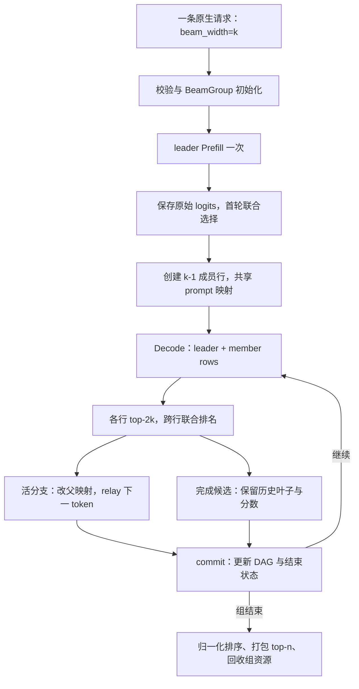
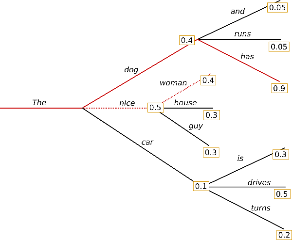
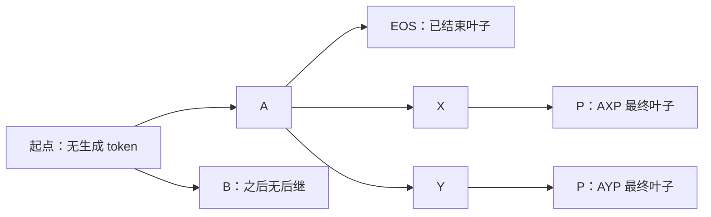

# Beam Search 与请求分支状态

> **先建立架构心智模型：** [M09 · 高级生成特性插入位置](<../architecture/09-高级生成特性插入位置.md>)。先看职责、数据和生命周期，再回到本篇源码细节。

本文是 **08-02，源码分析型学习资料**。本篇围绕一个宽度为 2 的 Beam 请求，回答三个问题：每步怎样从多个分支选择后继？两个后继都来自同一个父分支时，历史和 KV 怎么处理？已经生成的候选何时作为最终答案返回？

人话版：Beam Search 同时保留几条暂时有希望的续写，每轮把“已有路径分数”和“再接一个 token 的分数”相加，跨路径筛选。SGLang 这版实现由一个请求带着一组成员行执行；**请求身份、候选历史和 KV 槽位的归属需要分别记账。**

## 0. 阅读基线与范围

| 项目 | 内容 |
| --- | --- |
| 源码仓库与路径基准 | 官方 `sgl-project/sglang`；全部源码路径相对于 SGLang 仓库根目录 `.` |
| 学习分支 | `codex/sglang-source-study-20260909`，基于已拉取的官方 `main` |
| 固定 commit | `72d5c5bb73cadd7ffbf5114e5f81e29d36b6c61a` |
| 读取日期 | `2026-09-10`；沿用 2026-09-09 固定的官方源码 |
| 源码工作区 | 独立 `sglang-source-study` worktree，读取时干净；原 `sglang` 保留 `muxi-main` 和 26 个未跟踪文件 |
| 文档位置 | Wiki `sglang/source-study/08-advanced-generation/`，承接 grammar 篇，随后进入投机解码 |
| 阅读主线 | 原生 `/generate`、普通 Dense 文本模型、单实例单卡、page_size=1、beam_width=2、n=2、生成预算 3；先关闭 Overlap |
| 独立变化 | 加入普通请求的混合 batch、不同 stop token、Overlap 的 select/commit 分拆、取消与显存不足 |
| 不展开 | 跨模型质量比较、外部框架完整算法对照、TP 数值一致性、CP/多模态组合和具体 Attention kernel；不把未拒绝组合视为已验证 |
| 操作边界 | 只读源码与测试定义，编写文档和静态检查；未导入 SGLang/torch、未运行单测、服务、模型或 GPU 实验 |
| 证据边界 | 本篇解释该基线的搜索与资源策略，不证明全局最优搜索、任意模型效果或与 Transformers 逐 token 等价 |

前置：[05-04 Logits 与采样](../05-model-execution/04-Logits采样与输出概率.md)、[04-01 请求视图与物理槽位](../04-kv-cache/01-请求视图物理槽位与分配器.md)、[03-05 Overlap 依赖](../03-scheduling/05-Overlap中的CPU与GPU依赖.md)。与约束生成的区别见 [08-01](01-结构化输出与Grammar状态.md)。

**源码事实**由固定锚点支撑；本篇的 token 字母、概率、行号、槽位和图是**教学推演**，不是模型输出或显存实测。下面的请求片段仅用于解释字段，没有实际发送。

## 1. Beam 是一个组，成员行不各自拥有 Req

### 1.1 先区分三个数量

```json
{
  "text": "Hello SGLang",
  "sampling_params": {
    "beam_width": 2,
    "n": 2,
    "max_new_tokens": 3
  }
}
```

`beam_width>1` 才进入本篇路径。此时 `n` 表示最终最多返回多少条候选，不再把输入复制成 n 条独立并行采样请求；默认 n 仍为 1。未设置 beam_width 或其值为 1 时按普通请求处理。[参数声明][S1] [关闭并行 fan-out][S2] [调度识别][S3]

| 数量 | 宽度 2、n=2 时 | 含义 |
| --- | ---: | --- |
| 用户可见 Req | 1 | leader 负责 RID、请求级参数、输出与生命周期接口 |
| Decode 计算行 | 通常 2 | leader 行 + 1 条没有 Req 对象的 member 行 |
| 返回候选上限 | 2 | 最终从完成结果中取 n 条，n 必须不大于宽度 |

组开始时 frontier 只有一个“prompt 伪行”，累计分数为 0。leader 先 Prefill 一次，再从这一个分布选出初始后继；成员不各自重做 Prefill。[组初始化][S7] [首轮选择][S20] [成员创建][S21]

### 1.2 人话术语与真实对象

| 术语或对象 | 人话解释 | 必须区分的边界 |
| --- | --- | --- |
| BeamGroup | 管理一条用户请求的搜索组 | 负责组内搜索结束与成员资源，不是一个额外进程 |
| frontier / survivors | 还会继续展开的前沿 / 本轮保留下来的活分支 | 与已结束候选池不同 |
| completed | 已结束或在截止时收进来的候选 | 只保存历史叶子和分数等，不要求继续占一个活动计算行 |
| parent_idx | 新分支继承旧 frontier 的哪一行 | 是组内父位置，不是 RID 或物理 KV 地址 |
| member_rows / all_rows | 成员 req_to_token 行 / leader 在前的所有组内行 | 物理行可改为另一历史的承载者 |
| BeamNode | 一个 token 和一个父节点引用 | 输出历史用回指链共享前缀，不是 leader.output_ids 的副本 |
| BeamTail | 本次 forward 附加到基础行后面的成员布局 | 只扩展需要运行的行张量，不扩展 batch.reqs |
| StagedOrphans | 改父前后映射与对应 tick | 保存待确定/回收的失去引用槽位；不是一条可重试请求 |
| generated / committed | 已完成设备侧选步数 / 已提交到主机历史的步数 | Overlap 时前者可能领先后者 |

这些对象来自 [BeamGroup][S7]、[历史节点][S28]、[尾部布局][S11] 和 [待回收记录][S74]。

### 1.3 从请求到结果的整体地图



**图意解读：** 图中是步骤和对象职责，不是一框一个进程。第一个选步若已达到长度预算，会直接进入最终选择而不创建成员；图画的是预算大于 1 的主线。select 与 commit 在非 Overlap 下连续进行，在 Overlap 下跨一次 forward 分开；后面单独解释。[Prefill 特例][S20] [选择分发][S23] [组完成][S41]

## 2. 请求准入：把用户语义交给组管理

### 2.1 先验证，再附着 BeamGroup

Scheduler 创建 leader Req 后调用 `validate_and_init()`。如果它返回错误文本，该请求按 BAD_REQUEST 输出并退出；成功才创建组、绑定 leader。[入口][S3] [校验][S4]

| 条件 | 此基线的动作 | 为什么与本篇有关 |
| --- | --- | --- |
| page_size>1 | 拒绝 | 本篇按一个 token 一个槽位分叉/回收，没有实现部分页复制 |
| 投机、PD、PP>1、DP Attention | 拒绝 | 不能把下一篇的投机或上一阶段的分离协议直接叠到此组上 |
| HiSparse、HiCache、SWA/Mamba 混合缓存 | 拒绝 | 组内共享和释放只覆盖本篇的普通缓存寿命 |
| Diffusion LLM、encoder-decoder 模型 | 拒绝 | 不是本篇自回归 Dense 代表链路 |
| session、LoRA | 此校验函数拒绝相关请求 | 成员没有各自完整请求元数据 |
| JSON/regex/EBNF/structural tag | 拒绝 | 此基线没有把 grammar 状态随 Beam 分支复制的服务路径 |
| stop 字符串/正则、min_new_tokens>0 | 拒绝 | 组目前通过 token 级停止和统一长度预算管理结束 |
| return_logprob / hidden_states / sampling_mask / routed_experts | 对应返回选项被拒绝 | 返回 sequence_score 不等于开启通用逐 token logprob 返回 |
| n>k、2k>词表大小、k>请求行池大小 | 拒绝 | 返回量、top-2k 和行资源要满足显式限制 |

表格是 [validate_and_init][S4] 的可见条件，不是所有硬件、模型和插件的完整兼容性承诺。TP/CP 等没有在这里被统一拒绝，也不代表本次做过组合验证。

有效生成预算取用户预算与 `max_req_len - prompt_len - 1 - MEMBER_LENGTH_MARGIN` 的较小值，margin 声明为 4；若剩余不足一个新 token 则拒绝。组使用这个预算，行侧预算另加 margin，避免普通行长度限制先于组的最终选择触发。[预算计算][S4] [margin 与行参数][S5]

### 2.2 为什么要“中和”行采样参数

成功初始化后，leader 的行参数被替换为 neutral 参数：温度 1、top_p 1、min_p 0、penalty 中性值、n=1、ignore_eos=true 等。真正的返回数量、停止 token 与生成长度保存在组内。[参数替换][S4] [neutral 参数][S5]

组评分使用采样前保存的原始 logits，因此不应把此功能理解为“先按用户 top-p/温度随机采样 k 条，再排序”。普通采样可能仍在通用路径执行，但 Beam 选中的 token 会覆盖它在 relay 中的结果。[原始 logits 保存][S13] [relay 覆写][S60]

停止 ID 由用户 stop_token_ids、模型 EOS 和 tokenizer 的 EOS/additional stop IDs 汇总。**本实现中 user_params.ignore_eos=true 会直接返回空停止集合，用户 stop_token_ids 也不会再被加入。** 这比仅从参数名推测“只忽略 EOS，保留自定义 stop”更具体。[停止集合][S6]

### 2.3 行池与 KV 容量分别检查

准入时不仅要给 leader 一行，还要预留尚未创建的 k-1 条成员行。`get_num_allocatable_reqs()` 先扣 pending_member_rows，再按宽度限制可接纳请求数。[待建行计数][S8] [行准入][S9]

例如行池还有 7 行，已经接纳的其他组稍后需要 3 条成员行，那么当前可用只算 4 行。新请求 k=2 时，这一行池条件最多容纳 2 组；还需同时满足其他调度与 KV 预算。**请求行足够不等于 token KV 池足够。**

## 3. 排名的两层：本轮累计分数与最终长度分数

### 3.1 从每行 logits 到跨分支候选

设父分支 r 的累计 log probability 为 C(r)，本步 token t 的条件概率为 p(t|r)。扩展分数为：

```text
C(r -> t) = C(r) + log p(t | r)
```

`_rows_topk_logprobs()` 将原始 logits 转 float，先求该行词表上的 logsumexp，再取 2k 个最大 logits 并减去 logsumexp。这得到的是以**整个词表**归一化的 top-2k logprobs，不是把候选 top-2k 再归一化成一个新分布。[行内计算][S15]

接着 `_ranked_candidates()` 将父累计分数加到每行候选上，展平，跨父分支选全局 top-2k，并把展平索引还原成 parent_idx 和 token ID。[联合排名][S16]

这意味着两个新分支完全可以都来自同一个父分支。宽度 k 指下一轮活分支数的上限，不是“每个旧分支必须各保留一个孩子”。

### 3.2 top-2k 中怎样区分继续与停止

普通选步按联合分数从高到低考察候选，等价的人话规则如下：

1. 遇到非 stop token，加入 survivors。
2. 遇到 stop token，加入本轮 finished。
3. 已经找到 k 个 survivors 后，不再考察更后面的候选。

源码用 `non_stop_rank`、`examined` 与固定形状 scatter 实现这个顺序，避免为本轮有效条目数构造不断变化的输出张量。[joint_select][S17]

| 返回字段 | 用途 | 有效范围 |
| --- | --- | --- |
| next_tokens / parent_idx / new_cum_logprobs | 下一轮活分支及其父位置、分数 | 只读前 num_survivors 项 |
| fin_tokens / fin_parent_idx / fin_cum_logprobs | 本轮结束候选 | 只读前 num_finished 项 |
| num_survivors / num_finished | 实际有效条目数 | 后面的固定形状填充值不能当成真实候选 |

排名较低的 stop 若在 k 个活分支之后，不会进入完成池；top-2k 之外的候选也不再继续搜索。它是一套有限宽度的剪枝规则，不能据此宣布找到了全空间概率最高的最终文本。

### 3.3 什么时候整个组结束

| 触发 | 本实现的处理 | 容易误读之处 |
| --- | --- | --- |
| 本轮有效 survivors 仍有 k 个 | 记录 finished，活分支继续 | 已完成 k 条甚至更多，不会单凭这个数量自动停止 |
| survivors 少于 k | 把剩余活分支也收进 completed，整个组结束 | 不会按更小宽度继续，也不继续搜索 top-2k 之外补满 |
| 下一选步达到 max_new_tokens | 调 `select_final_topk`，本轮 top-k 全部完成 | 该路径不做 stop 分类，matched_token 记为 None |
| 请求取消/不可继续 | abort 组，清空 final_results | 已有 completed 不自动作为成功结果返回 |

对应 [普通提交][S33]、[最终选择][S18]、[最终提交][S34] 与 [abort][S42]。

部分 survivors 被提前收进池时，其 matched_token 为 None，后续按 length 类型表达；这不一定表示跑满原始 max_new_tokens。长度最终步上即使选到 stop ID，这个分支也按最终步的 length 规则记录，不能套用普通 stop 路径的 finish reason。

### 3.4 最终排序才引入长度归一化

组完成后，对于每条 completed：

```text
beam_score = cum_logprob / num_tokens ** length_penalty
```

`finalize()` 按 beam_score 从大到小排序并最多保留 k 条；输出打包再切到 num_return，即请求 n。[评分][S35] [排序][S36] [top-n 打包][S49]

服务准入创建组时没有传自定义 length_penalty，使用 BeamGroup 默认 1.0；虽然单测可直接构造其他值，不能因此声称原生请求已经暴露同名可调字段。[初始化调用][S4] [默认值][S7]

同一选步的活候选长度相同，累计分数足以排序；完成池可能混有不同长度，归一化可以改变最终次序。这里的计数包含生成的 stop token，文本展示时的裁剪不会反过来重算 score。[完成节点][S33] [文本解码][S50]

## 4. 一个三步、宽度 2 的完整搜索例子

### 4.1 第一步：一份 prompt 分出 A 和 B

教学条件：prompt 有 8 个 token，k=2，n=2，max_new_tokens=3，EOS 是组的 stop token。下面各行给出的四项概率加起来为 1；其他教学词表项视为 0。它们是人为构造的数据，不来自真实 logits。

| 第一步候选 | 条件概率 | 累计 logprob，约数 | 决策 |
| --- | ---: | ---: | --- |
| A | 0.45 | -0.798508 | 活分支 0 |
| B | 0.35 | -1.049822 | 活分支 1 |
| C | 0.15 | -1.897120 | 已找到两个活分支，不再考察 |
| EOS | 0.05 | -2.995732 | 同上，不进入 completed |

注意：第一轮的 prompt 只对应一行分布；选出 A/B 之后才创建成员行，并把下一 token A/B 写入组内行对应的 FutureMap。A/B 此时已知，但还没有各自的生成 token KV。[首轮选择][S20] [创建行][S21] [relay][S77]

### 4.2 第二步：两个孩子都来自 A

第一次 Decode 用 A/B 分别 forward，得到下表分布。

| 父分支 | EOS | X | Y | Z |
| --- | ---: | ---: | ---: | ---: |
| A | 0.40 | 0.34 | 0.24 | 0.02 |
| B | 0.22 | 0.28 | 0.26 | 0.24 |

乘以前缀概率再排序，相当于累计 logprob 相加。全局 top-4 为：

| 顺序 | 扩展 | 联合概率 | 累计 logprob，约数 | 处理 |
| ---: | --- | ---: | ---: | --- |
| 1 | A EOS | 0.180 | -1.714798 | 结束，加入 completed |
| 2 | A X | 0.153 | -1.877317 | survivor 0，parent_idx=0 |
| 3 | A Y | 0.108 | -2.225624 | survivor 1，parent_idx=0；达到 k |
| 4 | B X | 0.098 | -2.322788 | 不再考察 |

新的父位置是 `[0, 0]`。旧活分支 B 没有后继；A 的历史产生三个孩子：已结束的 EOS、继续走的 X、继续走的 Y。这时 `completed` 的存在不要求再为 A EOS 分配一个活动成员行。[选择][S17] [历史提交][S33]

### 4.3 第三步：预算到达，最终排名改变

第二次 Decode 分别用 X/Y forward。教学分布为：AX 后接 P/Q/EOS/R 的概率为 0.55/0.25/0.15/0.05；AY 后为 0.70/0.15/0.10/0.05。

这一轮达到预算，最终 top-2 扩展是 AXP 和 AYP；连同第二步已保存的 A EOS，一起参与最终排序。

| 完成序列 | 联合概率 | 累计 logprob | 生成 token 数 | beam_score，约数 | 最终位置 |
| --- | ---: | ---: | ---: | ---: | --- |
| A X P | 0.08415 | -2.475154 | 3 | -0.825051 | 1 |
| A EOS | 0.18000 | -1.714798 | 2 | -0.857399 | 2 |
| A Y P | 0.07560 | -2.582299 | 3 | -0.860766 | 3，被 top-k 截掉 |

较长的 AXP 累计概率低于 A EOS，但本版长度归一化后排在它前面。n=2 时返回前两条；n=1 时仍按宽度 2 搜索，只返回第一条。不要把 n 当成减少组内计算宽度的参数。

### 图解补充：比较整条候选路径，不只看下一步



[查看原尺寸](../../../images/sglang-source-study/26-beam-search.png)。

**图意解读：** 沿树把路径概率相乘：dog 的首步概率低于 nice，但继续到 has 后的累计概率可以更高。保留多个候选，才有机会发现这种路径。

**对应本篇源码：** 把树上累计路径分数对应到本篇联合选择，再与最终长度评分和 BeamGroup 的成员行区分。 [源码：python/sglang/srt/beam_search/joint_select.py][S16]

**来源与边界：** [How to generate text: using different decoding methods for language generation with Transformers](https://huggingface.co/blog/how-to-generate)，Patrick von Platen / Hugging Face，2020-03-01；页面注明 2023-07 更新。这是短搜索树示例，不展示 SGLang 的 BeamGroup、累计 logprob、最终长度评分或 KV 共享结构；搜索树节点不能直接当成独立 Req。 [来源档案 F26](../../../images/sglang-source-study/SOURCES.md#f26)。

## 5. 分支历史与 KV 共享沿两条独立链处理

### 5.1 历史是 BeamNode 回指结构



**图意解读：** 箭头按阅读顺序画为父→子，实际 BeamNode 保存的是 child.parent 回指。AX 和 AY 共享同一个 A 节点；两个 P 虽然 token 值相同，父节点不同，因此不是同一条序列。图没有表示 KV 地址、内存页或物理进程。[节点][S28] [提交节点][S33]

提交时以旧 `leaves[parent_idx]` 为父建立新节点。最终需要返回文本，才从叶子向根收集 token 并反转；不会每轮把整个输出前缀复制一遍。[历史还原][S29]

leader.output_ids 在首轮与后续非最终选步里追加的 0 是**长度占位**。权威候选历史在 DAG，不能将这串 0 当成模型输出、训练 token 或可直接返回的答案。[Prefill 占位][S20] [Decode 占位][S24]

### 5.2 prompt 映射共用，但锁与请求身份仍归 leader

设 leader 使用 req_to_token 行 4，member 使用行 9。prompt 8 个 token 的 KV 位于槽位 `[10,11,12,13,14,15,16,17]`。

成员创建时复制的是这一段**整数映射**，两行都指向相同的 prompt KV；没有把 K/V tensor 复制成两份。成员也不另外持有一份独立前缀树锁，树与请求侧处理仍由 leader 承接。[prompt alias][S27]

组将 leader 的 `skip_radix_cache_insert` 设为 true，避免把变化中的 Beam 后缀当成普通请求历史写回前缀树。未结束缓存入口直接跳过；结束入口抑制插入，但仍要执行相应释放处理。这不等于关闭已有 prompt 前缀的读取能力。[初始化标记][S4] [未结束缓存][S62] [结束处理][S63]

### 5.3 改父时只重排已计算后缀的映射

第一次 Decode 已算出 A/B 的 KV：行 4 的 A 占槽位 40，行 9 的 B 占 41。随后第二步选择 AX、AY，两条都继承 A：

| 时刻 | 行 4：prompt 后的 KV 映射 | 行 9：prompt 后的 KV 映射 | 当前要接续的 token |
| --- | --- | --- | --- |
| A/B 已 forward | `[40]` | `[41]` | 刚得到第二步分布 |
| 选择 AX/AY，parent_idx=[0,0] | `[40]` | `[40]` | 分别 relay X、Y |
| 下一次 Decode 分配并 forward | `[40,50]` | `[40,51]` | 已算 X/Y 的 KV，得到第三步分布 |

`remap_kv_mapping()` 取得 `[prompt_len, seq_len)` 的旧窗口，先 clone 映射，再按 parent_idx gather 成新映射写回。clone 保护的是旧**地址表快照**，不是复制被地址引用的 K/V 数据；这样重排不会先覆盖一个父行，再错误读取已经变过的内容。[映射改父][S25]

窗口包含刚刚算出的输入 token KV，但不包含刚选出来、尚未 forward 的下一 token。每条新行下一步仍分配自己的新槽位，因此共享的历史 40 可以继续被读取，X/Y 分别写入 50/51。[应用 survivors][S24] [Decode 分配顺序][S10]

第 3 步选出最终 P 时，它作为返回 token 已知，主线不会再为这个 P forward。最终生成长度是 3，但此时后缀 KV 只包含两个已计算位置。这仍遵守前面基础篇“本次采样结果在下一次 forward 才得到自身 KV”的时间关系。

### 5.4 失去引用的槽位怎样找出来

本例改父前后：

```text
old_mapping = [[40], [41]]
new_mapping = [[40], [40]]
old_unique - new_unique = {41}
```

41 已经不被任何新活分支引用，成为 orphan；40 有两处引用，必须保留。`collect_orphan_slots()` 对旧、新映射分别 unique，再求差集。[差集][S26]

设备侧改父先把 old/new 和 tick 放进 pending_orphans。差集计算与 free 在延后提交阶段执行，因为这种数据相关大小的操作可能同步设备，不能直接塞到下一轮依赖的 launch 路径中。[暂存][S24] [回收][S39]

### 5.5 正常结束按组去重释放，再让 leader 收尾

最终两行后缀是 `[40,50]`、`[40,51]`，共四个映射项，但只有三个物理槽位。`free_member_rows()` 将**包括 leader 在内的所有组内行**的后缀 flatten+unique 后释放，因此释放 `{40,50,51}` 一次。[组释放][S40]

随后把 leader 的 kv_committed_len 与 kv_allocated_len 回退到 prompt_len，再释放 member 的行号。这样普通 leader 的后续 release 不会重复释放已由组处理的后缀；leader 请求行与 prompt 部分继续走普通收尾。[组释放][S40] [共享结束处理][S58] [leader KV 释放][S63]

orphan 41 已从所有新行消失，不能指望最终遍历成员行再找到它。Coordinator 的 teardown 还会清 pending_orphans；retract-abort 走直接成员释放后，retire 路径也补做此回收。[retire][S43] [对应回归用例][S68]

## 6. 成员行怎样搭上普通 Decode batch

### 6.1 请求列表与计算行数暂时不同

假设同批还有一个普通请求 R2：`batch.reqs=[BeamLeader, R2]`，只有 2 个 Req。Beam 宽度为 2 时，Decode 的行张量变成 `[BeamLeader, R2, BeamMember]`，实际 forward 3 行。

| 数据 | 是否扩展成员行 | 原因 |
| --- | --- | --- |
| req_pool_indices、seq_lens、orig_seq_lens | 是 | 分配、relay resolve 与 Attention 必须处理成员 |
| batch.reqs、RID 列表、sampling_info 等请求侧元数据 | 否 | 成员没有 Req；通用结果处理仍按真实请求对齐 |
| 模型输出 logits | forward 时有全部行 | Beam 需要每个成员的条件分布 |
| 普通 Sampler 看到的 logits | 先切回基础请求行 | 防止拿只有 2 行的 sampling_info 处理 3 行 logits |

`append_beam_tail()` 附加成员行并复制 leader 的长度；`prepare_for_decode()` 在 KV 分配之前调用它。filter、merge、prepare 等布局变更先 strip tail，避免重复附加或索引错配。[附加][S11] [分配前调用][S10] [移除][S12]

### 6.2 为什么要提前保存原始 logits

普通采样可能原地改写 logits。`capture_pre_sample_logits()` 在 TP worker 调用采样之前，clone leader 行；member tail 则保留在不会进入普通采样的切片里。[保存][S13] [Worker 调用点][S14]

之后 Coordinator 分别读取 leader capture 与该组 tail，计算每行 top-2k 并联合选择。`_rows_topk_logprobs()` 保持这些 pieces 分别做 logsumexp；源码注明 CUDA 上把 pieces 合并可能改变末位浮点结果、影响近分候选。这个理由不是本次测得的硬件差异，也不代表 topk 为完全同分候选提供稳定排序保证。[行评分实现][S15]

### 6.3 relay 是下一轮输入的交接点

Scheduler 先将普通采样 token 写入 FutureMap，随后调用 BeamCoordinator 覆盖 Beam 行的 next token。Decode 的下一轮从 `req_pool_indices` 对应的 FutureMap 位置取输入，因此成员拿到的是 X/Y 等联合选择结果。[relay 顺序][S60] [组写入][S77] [读取输入][S61]

结果处理对 Beam 也分支：Prefill 调组 commit，Decode 调组 commit 后直接走结束处理；不会再把普通 Sampler 的 token 当作 Beam 候选追加到输出历史。[Prefill][S57] [Decode][S58]

这里必须同时对齐三种索引：`batch.reqs` 中 leader 的位置、tail 中成员的相对区间、组内 all_rows 的物理请求行。只看到一个 parent_idx，不能跳过这些映射直接修改请求列表。

## 7. Overlap 下先选步，再提交历史

### 7.1 两个半步分别负责什么

| 半步 | 主要职责 | 状态/资源 |
| --- | --- | --- |
| select / launch | 设备侧联合排名、更新 frontier 分数、改父 KV 映射、relay token | num_generated 前进；把 `(tick, selection)` 和 old/new 映射暂存 |
| commit / deferred | 在相应同步点后读取有效候选数、构建主机 DAG、收完成候选、决定终止、回收 orphan | num_committed 前进；消费与本 tick 对应的 pending 内容 |

`advance_frontier()` 只更新设备侧前沿并排队，`commit_pending(up_to_tick)` 才真正构造历史。普通同步主线把两半连续做完；Overlap 可以让后一半落后一个 forward。[暂存选步][S30] [提交门][S32] [Coordinator 两半][S22]

### 7.2 为什么必须用 tick 限制提交

教学时序：tick 7 的选择已暂存，tick 8 的选择也刚被 launch。此时如果只等待了 tick 7 的 copy_done，就只能 commit tick≤7，不能顺手把 tick 8 的候选也 `.tolist()` 并拼入历史。

| 事件 | generated | committed | pending | 可做什么 |
| --- | ---: | ---: | --- | --- |
| tick 7 已选，尚未提交 | 2 | 1 | `[7]` | 给下一次 forward relay 新 token |
| tick 8 也已选，处理 tick 7 结果 | 3 | 1 | `[7,8]` | 只提交门内 tick 7 |
| tick 7 提交且组继续 | 3 | 2 | `[8]` | 等后续对应同步再提交 8 |
| 若 tick 7 已令组结束 | 3 | 2 | 清掉后续选择 | 不把 overshoot 选步当额外用户输出 |

这是对源码分拆的教学说明，不是 GPU trace。结果处理先同步 result.copy_done，再调用相应组 commit；commit_pending 在队头 tick 超过 up_to_tick 时停止。最终提交还断言父位置不超出已提交 leaves，避免混乱时悄悄构造错误 DAG。[Prefill 同步][S57] [Decode 同步][S58] [tick 门][S32] [最终父检查][S34]

### 7.3 丢掉后续选择，不等于没有后续资源

Overlap 可能已分配下一轮槽位、完成映射变更，再得知组在先前 tick 结束。即使丢掉 overshoot 的 DAG 提交，已经脱离行映射的 orphan 仍需回收。`commit_decode` 因此在处理结束/abort 前先回收门内 orphan；retire 保证只减一次活组计数，并清除剩余 staged selections。[提交次序][S38] [retire][S43]

正常回收按 tick gate 工作；teardown 的 `_reclaim_orphans(..., up_to_tick=None)` 表示清全部暂存项，本函数本身并不额外建立全局设备排空协议。是否安全仍取决于调用方已经到达的结果/清理同步点。本篇没有运行并发取消、跨 stream 复用或设备错误实验。

## 8. 输出、停止与资源不足时的边界

### 8.1 成员不是可逐 token 输出的独立请求

OutputStreamer 对 Beam 只接纳“leader 且请求已完成”的输出。即使请求 stream=true，这条 Beam 路径也不会把仍在变化的活分支当稳定答案逐 token 发出。[输出门][S53] [接纳逻辑][S56]

完成后逐条打包 token、cum_logprob、beam_score 和各自 finish_reason，Detokenizer 逐候选处理 stop 裁剪。不能用排名第一的 finish_reason 裁剪全组：本例第一条 AXP 是 length，第二条 A EOS 是 stop。[载体][S55] [打包][S49] [逐条解码][S50]

Tokenizer 侧把最佳候选放到顶层 `text`/`output_ids`，完整返回列表放到 `meta_info.beam_results`，单条候选 meta_info 中的排序分数名为 `sequence_score`。[结果字典][S75] [顶层整理][S51]

### 8.2 返回 token 数不是搜索总计算量

本例返回 AXP 与 A EOS，completion_tokens 按返回 token 列表长度求和为 `3+2=5`；EOS 即使在文本中被裁掉，列表及分数计数仍保留原语义。n=1 时只计返回的 AXP，共 3。[token 计数][S52] [结果组装][S75]

这个 5 不表示整个搜索仅计算了 5 个模型位置：还有 prompt、未返回的活分支和被剪掉候选对应的 forward。也不能用 leader.output_ids 占位长度代替全组返回量。性能分析需另外记录计算行数、总 forward、候选宽度与输出口径。

### 8.3 容量账本：逻辑行乘长度会重复计数

在第 5 节最终释放前，prompt 有 8 个共享槽位，后缀有 3 个去重槽位；本例无 Overlap 超前分配、orphan 41 已释放，所以组当前持有 11 个物理 KV 槽位。

组的后缀容量统计使用 host 算术：`k × (leader_allocated_len - prompt_len) - slots_freed`；减去普通请求账本已计入的 leader 后缀，得到需要额外计入的部分。[额外持有量][S44]

本例为 `2×2-1=3` 个组后缀槽位，额外量为 `3-2=1`。这既不是两条独立完整 KV 的 20，也不是只看 leader 得到的 10。实际运行还应算缓存保护区、其他请求和在途分配，不能把这个教学值当显存字节数。

下一步准入另算：page_size=1 时每个正常活组要给 leader 加 1 个新槽位，并为成员各加 1 个。`new_tokens_required_next_decode()` 显式加上 member rows 的需求。[下步需求][S45]

### 8.4 回撤请求与终止 Beam 组是不同策略

普通请求可按既有回撤路径让出显存后重新排队，但 Beam 成员别名共享 leader 的 prompt，当前实现不支持这样恢复整组搜索。回撤排序先保留 Beam、先取普通请求；若最终仍要移除 Beam，则给 leader 设置 abort，先释放 member rows，再 release leader，不回队重算。[排序][S46] [回撤中的组 abort][S47]

Scheduler 随后 retire 这些组，补清 staged orphan 并维护活组计数。即使只剩最后一条请求仍无法满足 KV 条件，也有终止最后请求的路径，不能假设“最后一个 Beam 一定被保留”。[最后请求与释放][S47] [retire 接回][S48]

排队时取消还未开始的组可直接 retire；已运行组通过 to_finish 在组 commit 路径结束，final_results 清空。**已有完成池不代表取消时自动返回部分成功候选。**[排队取消][S76] [组 abort][S42] [外部结束 retire][S73]

## 9. 排障：先分清是搜索、行映射还是生命周期

| 现象 | 先检查 | 源码入口 | 不能直接推断 |
| --- | --- | --- | --- |
| n=1 仍占多条计算行 | beam_width、member_rows、num_return | [初始化][S4] [打包][S49] | n 不是计算宽度 |
| 同一 Req 的 output_ids 有大量 0 | 是否 Beam leader；DAG/final_results | [占位][S24] [还原][S29] | 不能立刻认定模型在生成 token 0 |
| 成员行算了但下一步续写错误 | raw capture、parent_idx、all_rows 与 FutureMap | [capture][S13] [改父][S25] [relay][S60] | 普通 sampled token 不一定是 Beam 选中 token |
| 两个后继拿到旧父的不同 KV | old_mapping 快照、新 parent_idx、窗口边界 | [映射][S25] | 应先查地址表，不能先假定要复制 KV tensor |
| 请求结束后 KV 泄漏 | unique 后缀、pending_orphans、retired | [释放][S40] [retire][S43] | 当前行里找不到的槽位也可能还待释放 |
| double free | 组释放是否包含 leader、是否回退 leader 长度、幂等标记 | [释放顺序][S40] | member 不是后缀 KV 的唯一所有者 |
| 组突然 length 结束但未用满预算 | 是否 survivors<k 被折叠进池 | [普通提交][S33] | length 类型不一定意味着跑满上限 |
| 候选 finish reason/文本裁剪错位 | 每条 BeamSearchSequence 的 reason 与 no_stop_trim | [逐条解码][S50] | 不应把最佳候选 reason 套给其他条 |
| Overlap 才出现历史错位 | pending tick、copy_done、generated/committed、父索引 | [tick 门][S32] [结果同步][S58] | 设备已选步不代表主机可读全部结果 |
| 内存不足后请求没有自动续跑 | 是否走 Beam abort | [回撤][S47] [组退出][S48] | 与普通请求的恢复策略不同 |
| stop_token_ids 看似失效 | user ignore_eos 与组停止集合 | [集合构造][S6] | 不能只根据参数名推测实际合并规则 |

## 10. 源码阅读路线

所有路径均从 SGLang 仓库根目录起算。建议第一次只追非 Overlap 的 k=2 请求，再返回阅读 tick 与资源延后回收。

| 次序 | 问题 | 文件与符号 |
| ---: | --- | --- |
| 1 | 如何避免 n 次独立 fan-out | `python/sglang/srt/managers/io_struct.py::GenerateReqInput._handle_beam_search_parallel_sampling` [S2] |
| 2 | 约束与组内参数怎样确定 | `python/sglang/srt/beam_search/coordinator.py::BeamCoordinator.validate_and_init` [S4] |
| 3 | 一行 prompt 怎样开始搜索 | `python/sglang/srt/beam_search/coordinator.py::BeamCoordinator.select_leader_prefill` [S20] |
| 4 | 候选分数怎样跨父行比较 | `python/sglang/srt/beam_search/coordinator.py::_rows_topk_logprobs` [S15]；`python/sglang/srt/beam_search/joint_select.py::joint_select` [S17] |
| 5 | 新父历史怎样形成 | `python/sglang/srt/beam_search/beam_group.py::BeamGroup._commit_step` [S33]；`python/sglang/srt/beam_search/history.py::materialize_tokens` [S29] |
| 6 | 行映射怎样共享与改父 | `python/sglang/srt/beam_search/fork.py::alias_members_prompt_kv` [S27]；`python/sglang/srt/beam_search/fork.py::remap_kv_mapping` [S25] |
| 7 | 真实请求与成员行怎样搭批 | `python/sglang/srt/beam_search/batch_tail.py::append_beam_tail` [S11]；`python/sglang/srt/beam_search/logits_capture.py::capture_pre_sample_logits` [S13] |
| 8 | 下一次 forward 实际输入哪一个 token | `python/sglang/srt/managers/scheduler.py::Scheduler._relay_forward_payload` [S60]；`python/sglang/srt/managers/overlap_utils.py::resolve_forward_inputs` [S61] |
| 9 | 哪些 pending step 可以提交 | `python/sglang/srt/beam_search/beam_group.py::BeamGroup.commit_pending` [S32] |
| 10 | 如何回收共享后缀和 orphan | `python/sglang/srt/beam_search/fork.py::free_member_rows` [S40]；`python/sglang/srt/beam_search/coordinator.py::BeamCoordinator._reclaim_orphans` [S39] |
| 11 | 最终分数、文本和数量怎么返回 | `python/sglang/srt/beam_search/beam_group.py::BeamGroup.finalize` [S36]；`python/sglang/srt/beam_search/output.py::pack_beam_search_output` [S49] |

## 11. 练习、验证记录与下一篇

### 11.1 先手算，再对照源码

1. 将第 4 节 n 从 2 改为 1，组的 Decode 行数与最终返回条数分别怎样变化？
2. 第二步为什么不是分别从 A、B 各选一个孩子？A EOS 为什么不占下一步的一条成员行？
3. 映射从 `[[40],[41]]` 变成 `[[40],[40]]` 后可以释放哪个槽位？下一轮 `[[40,50],[40,51]]` 结束时应释放几次 40？
4. 为什么不能用 leader.output_ids 还原两个候选？两个 token 值都是 P 的叶子是否一定是同一答案？
5. 仅同步 tick 7，却已经暂存 tick 8，commit 可以全部消费吗？清掉 pending selections 后还要检查什么资源？
6. 本例最终 n=2 的 completion_tokens 为什么是 5？这个 5 是否等于整个 Beam 搜索模型计算过的位置数？
7. 如果 top-2k 中只剩一条非 stop 候选，当前实现会缩小宽度继续还是结束？

**参考答案：** 1）仍按 k=2 计算，最多返回 1 条。2）联合比较累计分数，AX/AY 优于 B 的后继；completed 保存历史与分数，不需要活动行继续 forward。3）先释放 41；最终释放集合 `{40,50,51}`，40 只一次。4）output_ids 是长度占位；P 的父链不同可以对应 AXP/AYP。5）只消费 tick≤7；pending_orphans 与已分配后缀仍需回收。6）返回长度 3+2，含 EOS；它不是搜索总工作量。7）把剩余活候选收进完成池并结束，不按宽度 1 继续。

### 11.2 本次阅读的测试入口

| 文件/用例 | 源码中的检查意图 | 本次证据边界 |
| --- | --- | --- |
| `test/registered/unit/beam_search/test_beam_search_core.py` [stop 路由][S64] [差分][S65] | 固定例子、200 组随机值对朴素候选遍历参考 | 只读断言；没有运行 torch 或随机差分 |
| 同文件 [组生命周期][S66] [survivors 不足][S78] | EOS 与 length 混合、最终评分、提前折叠剩余前沿 | 不证明真实模型输出质量或全局最优 |
| `test/registered/unit/beam_search/test_fork.py` [改父][S67] [共享释放][S69] | 映射窗口重排、行与后缀释放、幂等行为 | 使用测试张量/假 allocator；不等于设备 KV 并发验证 |
| 同文件 [retire 清 orphan][S68] | 当前行已看不到的旧槽位在退出时仍被回收 | 未运行回归，更未做真实 OOM/取消注入 |
| `test/registered/unit/beam_search/test_output_decode.py` [逐候选裁剪][S70] | 最佳候选的停止类型不覆盖其他候选 | 使用 ID tokenizer，不是模型与真实 tokenizer 验收 |
| `test/manual/beam_search/test_beam_parity.py` [parity][S71] [top-n][S72] | 对 k=2/10 比较返回序列集合，要求与 HF 集合重合比例≥0.8；检查 n 与默认 1 条 | 手动测试入口，fixture 关闭 Overlap；阈值不是逐 token 等价证明，本次未执行 |

**已执行：** 固定源码锚点、相对路径、导航、Markdown 结构和教学算术检查；复核选择/relay/commit/回收的可见调用顺序。**未执行：** 上表测试、模型加载、HTTP 请求、GPU、真实 tokenizer、Overlap/OOM/取消/多卡并发及性能实验。Mermaid 只做静态结构与语义核对，未渲染。

后续实验需保留 k/n、原始请求、有效预算、stop 集合、top 候选分数、parent_idx、行映射、generated/committed/tick、orphan 与结束结果。性能比较应同时记录搜索工作量和最终返回量，不能只看顶层一个 completion_tokens。

下一篇为 [08-03《投机解码的 Draft、Verify、Commit》](03-投机解码的DraftVerifyCommit.md)：从保留多条候选路径，转向先提出多个 token、再由 target 验证哪些可以提交。

返回[系列目录](../README.md)、[术语表](../appendices/01-术语与对象速查.md)、[配置矩阵](../appendices/03-配置解析与功能兼容矩阵.md)或[学习进度](../appendices/06-学习进度与版本变更记录.md)。

[S1]: https://github.com/sgl-project/sglang/blob/72d5c5bb73cadd7ffbf5114e5f81e29d36b6c61a/python/sglang/srt/sampling/sampling_params.py#L114
[S2]: https://github.com/sgl-project/sglang/blob/72d5c5bb73cadd7ffbf5114e5f81e29d36b6c61a/python/sglang/srt/managers/io_struct.py#L481
[S3]: https://github.com/sgl-project/sglang/blob/72d5c5bb73cadd7ffbf5114e5f81e29d36b6c61a/python/sglang/srt/managers/scheduler.py#L2708
[S4]: https://github.com/sgl-project/sglang/blob/72d5c5bb73cadd7ffbf5114e5f81e29d36b6c61a/python/sglang/srt/beam_search/coordinator.py#L119
[S5]: https://github.com/sgl-project/sglang/blob/72d5c5bb73cadd7ffbf5114e5f81e29d36b6c61a/python/sglang/srt/beam_search/fork.py#L51
[S6]: https://github.com/sgl-project/sglang/blob/72d5c5bb73cadd7ffbf5114e5f81e29d36b6c61a/python/sglang/srt/beam_search/coordinator.py#L240
[S7]: https://github.com/sgl-project/sglang/blob/72d5c5bb73cadd7ffbf5114e5f81e29d36b6c61a/python/sglang/srt/beam_search/beam_group.py#L64
[S8]: https://github.com/sgl-project/sglang/blob/72d5c5bb73cadd7ffbf5114e5f81e29d36b6c61a/python/sglang/srt/beam_search/coordinator.py#L225
[S9]: https://github.com/sgl-project/sglang/blob/72d5c5bb73cadd7ffbf5114e5f81e29d36b6c61a/python/sglang/srt/managers/scheduler.py#L3646
[S10]: https://github.com/sgl-project/sglang/blob/72d5c5bb73cadd7ffbf5114e5f81e29d36b6c61a/python/sglang/srt/managers/schedule_batch.py#L3345
[S11]: https://github.com/sgl-project/sglang/blob/72d5c5bb73cadd7ffbf5114e5f81e29d36b6c61a/python/sglang/srt/beam_search/batch_tail.py#L43
[S12]: https://github.com/sgl-project/sglang/blob/72d5c5bb73cadd7ffbf5114e5f81e29d36b6c61a/python/sglang/srt/beam_search/batch_tail.py#L99
[S13]: https://github.com/sgl-project/sglang/blob/72d5c5bb73cadd7ffbf5114e5f81e29d36b6c61a/python/sglang/srt/beam_search/logits_capture.py#L43
[S14]: https://github.com/sgl-project/sglang/blob/72d5c5bb73cadd7ffbf5114e5f81e29d36b6c61a/python/sglang/srt/managers/tp_worker.py#L641
[S15]: https://github.com/sgl-project/sglang/blob/72d5c5bb73cadd7ffbf5114e5f81e29d36b6c61a/python/sglang/srt/beam_search/coordinator.py#L84
[S16]: https://github.com/sgl-project/sglang/blob/72d5c5bb73cadd7ffbf5114e5f81e29d36b6c61a/python/sglang/srt/beam_search/joint_select.py#L62
[S17]: https://github.com/sgl-project/sglang/blob/72d5c5bb73cadd7ffbf5114e5f81e29d36b6c61a/python/sglang/srt/beam_search/joint_select.py#L71
[S18]: https://github.com/sgl-project/sglang/blob/72d5c5bb73cadd7ffbf5114e5f81e29d36b6c61a/python/sglang/srt/beam_search/joint_select.py#L113
[S19]: https://github.com/sgl-project/sglang/blob/72d5c5bb73cadd7ffbf5114e5f81e29d36b6c61a/python/sglang/srt/beam_search/coordinator.py#L252
[S20]: https://github.com/sgl-project/sglang/blob/72d5c5bb73cadd7ffbf5114e5f81e29d36b6c61a/python/sglang/srt/beam_search/coordinator.py#L293
[S21]: https://github.com/sgl-project/sglang/blob/72d5c5bb73cadd7ffbf5114e5f81e29d36b6c61a/python/sglang/srt/beam_search/coordinator.py#L330
[S22]: https://github.com/sgl-project/sglang/blob/72d5c5bb73cadd7ffbf5114e5f81e29d36b6c61a/python/sglang/srt/beam_search/coordinator.py#L352
[S23]: https://github.com/sgl-project/sglang/blob/72d5c5bb73cadd7ffbf5114e5f81e29d36b6c61a/python/sglang/srt/beam_search/coordinator.py#L401
[S24]: https://github.com/sgl-project/sglang/blob/72d5c5bb73cadd7ffbf5114e5f81e29d36b6c61a/python/sglang/srt/beam_search/coordinator.py#L427
[S25]: https://github.com/sgl-project/sglang/blob/72d5c5bb73cadd7ffbf5114e5f81e29d36b6c61a/python/sglang/srt/beam_search/fork.py#L104
[S26]: https://github.com/sgl-project/sglang/blob/72d5c5bb73cadd7ffbf5114e5f81e29d36b6c61a/python/sglang/srt/beam_search/fork.py#L122
[S27]: https://github.com/sgl-project/sglang/blob/72d5c5bb73cadd7ffbf5114e5f81e29d36b6c61a/python/sglang/srt/beam_search/fork.py#L72
[S28]: https://github.com/sgl-project/sglang/blob/72d5c5bb73cadd7ffbf5114e5f81e29d36b6c61a/python/sglang/srt/beam_search/history.py#L29
[S29]: https://github.com/sgl-project/sglang/blob/72d5c5bb73cadd7ffbf5114e5f81e29d36b6c61a/python/sglang/srt/beam_search/history.py#L36
[S30]: https://github.com/sgl-project/sglang/blob/72d5c5bb73cadd7ffbf5114e5f81e29d36b6c61a/python/sglang/srt/beam_search/beam_group.py#L134
[S31]: https://github.com/sgl-project/sglang/blob/72d5c5bb73cadd7ffbf5114e5f81e29d36b6c61a/python/sglang/srt/beam_search/beam_group.py#L142
[S32]: https://github.com/sgl-project/sglang/blob/72d5c5bb73cadd7ffbf5114e5f81e29d36b6c61a/python/sglang/srt/beam_search/beam_group.py#L149
[S33]: https://github.com/sgl-project/sglang/blob/72d5c5bb73cadd7ffbf5114e5f81e29d36b6c61a/python/sglang/srt/beam_search/beam_group.py#L172
[S34]: https://github.com/sgl-project/sglang/blob/72d5c5bb73cadd7ffbf5114e5f81e29d36b6c61a/python/sglang/srt/beam_search/beam_group.py#L207
[S35]: https://github.com/sgl-project/sglang/blob/72d5c5bb73cadd7ffbf5114e5f81e29d36b6c61a/python/sglang/srt/beam_search/beam_group.py#L238
[S36]: https://github.com/sgl-project/sglang/blob/72d5c5bb73cadd7ffbf5114e5f81e29d36b6c61a/python/sglang/srt/beam_search/beam_group.py#L242
[S37]: https://github.com/sgl-project/sglang/blob/72d5c5bb73cadd7ffbf5114e5f81e29d36b6c61a/python/sglang/srt/beam_search/coordinator.py#L317
[S38]: https://github.com/sgl-project/sglang/blob/72d5c5bb73cadd7ffbf5114e5f81e29d36b6c61a/python/sglang/srt/beam_search/coordinator.py#L377
[S39]: https://github.com/sgl-project/sglang/blob/72d5c5bb73cadd7ffbf5114e5f81e29d36b6c61a/python/sglang/srt/beam_search/coordinator.py#L453
[S40]: https://github.com/sgl-project/sglang/blob/72d5c5bb73cadd7ffbf5114e5f81e29d36b6c61a/python/sglang/srt/beam_search/fork.py#L83
[S41]: https://github.com/sgl-project/sglang/blob/72d5c5bb73cadd7ffbf5114e5f81e29d36b6c61a/python/sglang/srt/beam_search/coordinator.py#L479
[S42]: https://github.com/sgl-project/sglang/blob/72d5c5bb73cadd7ffbf5114e5f81e29d36b6c61a/python/sglang/srt/beam_search/coordinator.py#L491
[S43]: https://github.com/sgl-project/sglang/blob/72d5c5bb73cadd7ffbf5114e5f81e29d36b6c61a/python/sglang/srt/beam_search/coordinator.py#L516
[S44]: https://github.com/sgl-project/sglang/blob/72d5c5bb73cadd7ffbf5114e5f81e29d36b6c61a/python/sglang/srt/beam_search/beam_group.py#L118
[S45]: https://github.com/sgl-project/sglang/blob/72d5c5bb73cadd7ffbf5114e5f81e29d36b6c61a/python/sglang/srt/managers/schedule_batch.py#L3049
[S46]: https://github.com/sgl-project/sglang/blob/72d5c5bb73cadd7ffbf5114e5f81e29d36b6c61a/python/sglang/srt/beam_search/batch_tail.py#L126
[S47]: https://github.com/sgl-project/sglang/blob/72d5c5bb73cadd7ffbf5114e5f81e29d36b6c61a/python/sglang/srt/managers/schedule_batch.py#L3089
[S48]: https://github.com/sgl-project/sglang/blob/72d5c5bb73cadd7ffbf5114e5f81e29d36b6c61a/python/sglang/srt/managers/scheduler.py#L4055
[S49]: https://github.com/sgl-project/sglang/blob/72d5c5bb73cadd7ffbf5114e5f81e29d36b6c61a/python/sglang/srt/beam_search/output.py#L38
[S50]: https://github.com/sgl-project/sglang/blob/72d5c5bb73cadd7ffbf5114e5f81e29d36b6c61a/python/sglang/srt/beam_search/output.py#L78
[S51]: https://github.com/sgl-project/sglang/blob/72d5c5bb73cadd7ffbf5114e5f81e29d36b6c61a/python/sglang/srt/beam_search/output.py#L130
[S52]: https://github.com/sgl-project/sglang/blob/72d5c5bb73cadd7ffbf5114e5f81e29d36b6c61a/python/sglang/srt/beam_search/output.py#L66
[S53]: https://github.com/sgl-project/sglang/blob/72d5c5bb73cadd7ffbf5114e5f81e29d36b6c61a/python/sglang/srt/managers/scheduler_components/output_streamer.py#L414
[S54]: https://github.com/sgl-project/sglang/blob/72d5c5bb73cadd7ffbf5114e5f81e29d36b6c61a/python/sglang/srt/beam_search/output.py#L146
[S55]: https://github.com/sgl-project/sglang/blob/72d5c5bb73cadd7ffbf5114e5f81e29d36b6c61a/python/sglang/srt/beam_search/types.py#L26
[S56]: https://github.com/sgl-project/sglang/blob/72d5c5bb73cadd7ffbf5114e5f81e29d36b6c61a/python/sglang/srt/managers/scheduler_components/output_streamer.py#L418
[S57]: https://github.com/sgl-project/sglang/blob/72d5c5bb73cadd7ffbf5114e5f81e29d36b6c61a/python/sglang/srt/managers/scheduler_components/batch_result_processor.py#L253
[S58]: https://github.com/sgl-project/sglang/blob/72d5c5bb73cadd7ffbf5114e5f81e29d36b6c61a/python/sglang/srt/managers/scheduler_components/batch_result_processor.py#L889
[S59]: https://github.com/sgl-project/sglang/blob/72d5c5bb73cadd7ffbf5114e5f81e29d36b6c61a/python/sglang/srt/managers/scheduler.py#L4199
[S60]: https://github.com/sgl-project/sglang/blob/72d5c5bb73cadd7ffbf5114e5f81e29d36b6c61a/python/sglang/srt/managers/scheduler.py#L4457
[S61]: https://github.com/sgl-project/sglang/blob/72d5c5bb73cadd7ffbf5114e5f81e29d36b6c61a/python/sglang/srt/managers/overlap_utils.py#L87
[S62]: https://github.com/sgl-project/sglang/blob/72d5c5bb73cadd7ffbf5114e5f81e29d36b6c61a/python/sglang/srt/mem_cache/common.py#L145
[S63]: https://github.com/sgl-project/sglang/blob/72d5c5bb73cadd7ffbf5114e5f81e29d36b6c61a/python/sglang/srt/mem_cache/common.py#L238
[S64]: https://github.com/sgl-project/sglang/blob/72d5c5bb73cadd7ffbf5114e5f81e29d36b6c61a/test/registered/unit/beam_search/test_beam_search_core.py#L98
[S65]: https://github.com/sgl-project/sglang/blob/72d5c5bb73cadd7ffbf5114e5f81e29d36b6c61a/test/registered/unit/beam_search/test_beam_search_core.py#L136
[S66]: https://github.com/sgl-project/sglang/blob/72d5c5bb73cadd7ffbf5114e5f81e29d36b6c61a/test/registered/unit/beam_search/test_beam_search_core.py#L189
[S67]: https://github.com/sgl-project/sglang/blob/72d5c5bb73cadd7ffbf5114e5f81e29d36b6c61a/test/registered/unit/beam_search/test_fork.py#L30
[S68]: https://github.com/sgl-project/sglang/blob/72d5c5bb73cadd7ffbf5114e5f81e29d36b6c61a/test/registered/unit/beam_search/test_fork.py#L193
[S69]: https://github.com/sgl-project/sglang/blob/72d5c5bb73cadd7ffbf5114e5f81e29d36b6c61a/test/registered/unit/beam_search/test_fork.py#L135
[S70]: https://github.com/sgl-project/sglang/blob/72d5c5bb73cadd7ffbf5114e5f81e29d36b6c61a/test/registered/unit/beam_search/test_output_decode.py#L123
[S71]: https://github.com/sgl-project/sglang/blob/72d5c5bb73cadd7ffbf5114e5f81e29d36b6c61a/test/manual/beam_search/test_beam_parity.py#L94
[S72]: https://github.com/sgl-project/sglang/blob/72d5c5bb73cadd7ffbf5114e5f81e29d36b6c61a/test/manual/beam_search/test_beam_parity.py#L113
[S73]: https://github.com/sgl-project/sglang/blob/72d5c5bb73cadd7ffbf5114e5f81e29d36b6c61a/python/sglang/srt/beam_search/coordinator.py#L500
[S74]: https://github.com/sgl-project/sglang/blob/72d5c5bb73cadd7ffbf5114e5f81e29d36b6c61a/python/sglang/srt/beam_search/fork.py#L38
[S75]: https://github.com/sgl-project/sglang/blob/72d5c5bb73cadd7ffbf5114e5f81e29d36b6c61a/python/sglang/srt/beam_search/output.py#L175
[S76]: https://github.com/sgl-project/sglang/blob/72d5c5bb73cadd7ffbf5114e5f81e29d36b6c61a/python/sglang/srt/managers/scheduler.py#L5171
[S77]: https://github.com/sgl-project/sglang/blob/72d5c5bb73cadd7ffbf5114e5f81e29d36b6c61a/python/sglang/srt/beam_search/coordinator.py#L527
[S78]: https://github.com/sgl-project/sglang/blob/72d5c5bb73cadd7ffbf5114e5f81e29d36b6c61a/test/registered/unit/beam_search/test_beam_search_core.py#L234
