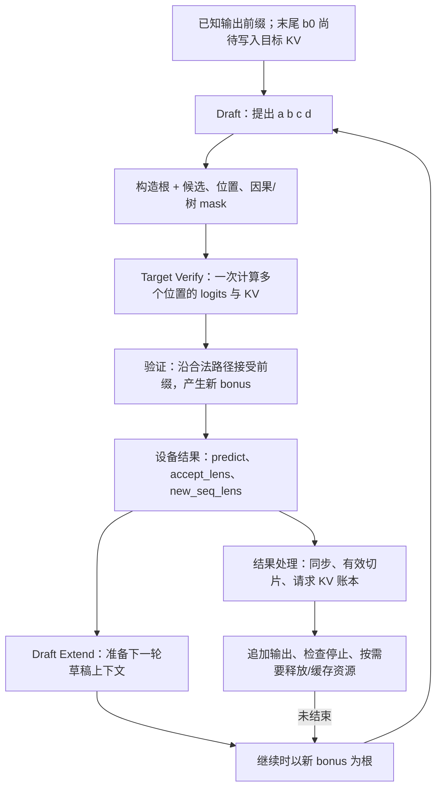
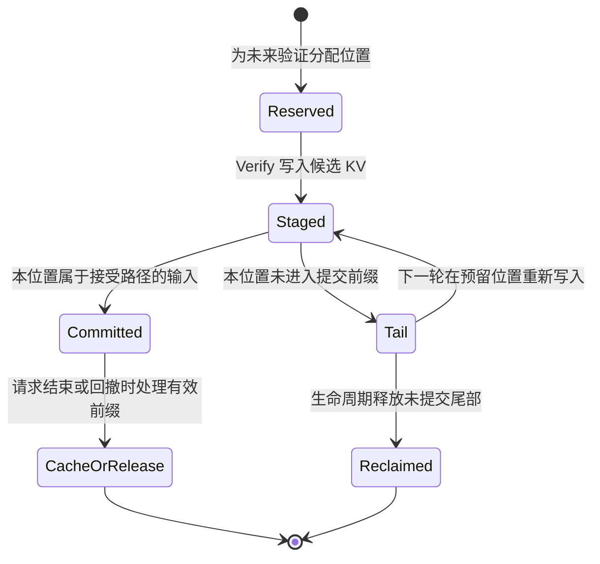

# 投机解码的 Draft、Verify、Commit

> **先建立架构心智模型：** [M09 · 高级生成特性插入位置](<../architecture/09-高级生成特性插入位置.md>)。先看职责、数据和生命周期，再回到本篇源码细节。

本文是 **08-03，源码分析型学习资料**。用“先猜 4 个、接受前 2 个”的例子，追踪候选如何交给目标模型验证、如何产生补充 token，以及哪些输出和 KV 最终进入请求状态。

人话版：先让较便宜的生成路径写一段草稿，再让目标模型一次检查多个位置。草稿只有通过验证的前缀能保留；遇到分歧，要在分歧位置产生一个新 token，下一轮从这里继续。节省的是某些目标模型串行调用，代价是草稿计算、额外验证位置和状态整理。

## 0. 阅读基线与范围

| 项目 | 内容 |
| --- | --- |
| 源码仓库与路径基准 | 官方 `sgl-project/sglang`；全部源码路径相对于 SGLang 仓库根目录 `.` |
| 学习分支 | `codex/sglang-source-study-20260909`，基于已拉取的官方 `main` |
| 固定 commit | `72d5c5bb73cadd7ffbf5114e5f81e29d36b6c61a` |
| 读取日期 | `2026-09-10`；沿用 2026-09-09 固定的官方源码 |
| 源码工作区 | 独立 `sglang-source-study` worktree，读取时干净；原 `sglang` 保留 `muxi-main` 和 26 个未跟踪文件 |
| 文档位置 | Wiki `sglang/source-study/08-advanced-generation/`，承接 Grammar、Beam，建立后续算法专题的共同接口 |
| 阅读主线 | EAGLE V2 的普通自回归文本路径；单请求、单卡 CUDA、page_size=1、topk=1、steps=4、verify 宽度 5；先关闭 Overlap、grammar、penalty、模拟接受长度 |
| 独立变化 | 贪心 → 经典随机拒绝采样；链 → 树布局；正常继续 → 停止、取消和预留尾部清理 |
| 不展开 | EAGLE 隐状态结构、具体 MTP 模型、DFlash/UNO/DSpark/Ngram 算法、完整 Overlap 依赖及所有组合；分别留给 08-04—08-06 |
| 操作边界 | 只读源码、测试定义和第一方论文，编写文档及静态检查；未导入 SGLang/torch、未运行单测、服务、模型或 GPU 实验 |
| 证据边界 | 算法公式只对应明确条件下的经典链式拒绝采样；不据此宣布所有投机模式与普通采样逐 token 等价 |

前置：[00-04 Prefill/Decode 与 KV](../00-foundations/04-Prefill与Decode及KVCache入门.md)、[04-01 请求视图与槽位](../04-kv-cache/01-请求视图物理槽位与分配器.md)、[05-04 Logits 与采样](../05-model-execution/04-Logits采样与输出概率.md)。约束状态和分支搜索分别见 [08-01](01-结构化输出与Grammar状态.md)、[08-02](02-BeamSearch与请求分支状态.md)。

**源码事实**附固定锚点；字母 token、概率、长度、槽位账本和 Mermaid 都是**教学推演**。没有运行观察。本文的“提交”是解释状态生效的一组步骤，不表示源码中存在一个包办输出、KV 和网络发送的 `commit()` 函数。

## 1. 先分清草稿、验证行和输出

### 1.1 一轮为什么会输出“2 + 1”

假设已经输出了 token `b0`，草稿接着提议 `[a, b, c, d]`。目标模型沿这条路径给出的贪心后继是：

| 目标模型已经看到的前缀尾部 | 预测下一个 token | 对草稿的判断 |
| --- | --- | --- |
| b0 | a | 第 1 个候选 a 通过 |
| b0, a | b | 第 2 个候选 b 通过 |
| b0, a, b | z | 第 3 个候选 c 未通过；这里产生 z |
| b0, a, b, c | 任意预测 | 前缀已经包含被拒绝的 c，不能作为正式续写依据 |
| b0, a, b, c, d | 任意预测 | 同上，不因 d 偶然匹配就跳过 c 保留它 |

本轮新增输出是 `[a, b, z]`，接受的**草稿数**是 2。`z` 常被接口统称为 bonus token，中文可理解为本轮额外补出的 token；发生拒绝时，它承担纠正分歧的作用，全部接受时，它是再向前多走的一步。[贪心选择][S62] [计数转换][S22]

这里的 b0 已经属于上一轮输出，不应重复发送。第一次进入 Decode 时，它可以是目标模型 Prefill 刚生成的首 token；后续轮次则是上一轮的 bonus。[Prefill 衔接][S9] [草稿输入][S18]

### 1.2 源码里的几个“长度”

| 名称 | 本篇例子 | 人话含义与边界 |
| --- | ---: | --- |
| speculative_num_steps | 4 | 链式草稿提议的步数 |
| speculative_eagle_topk | 1 | 每层只沿一条草稿分支走；不是请求采样的 top_k |
| speculative_num_draft_tokens / draft_token_num | 5 | 此链式实现的验证输入宽度，**包括旧 bonus 根节点 b0** |
| num_correct_drafts | 2 | 被接受的草稿 token 数，不包括新 bonus |
| accept_lens | 3 | 本轮有效预测长度，EAGLE 为 correct drafts + 1 |
| max_tree_depth | 5 | 此 EagleVerifyInput 的 steps+1；约束接受路径数组宽度 |
| seq_lens / new_seq_lens | 8 → 11 | 验证前后的设备侧 KV 前缀长度；不是输出 token 总数 |
| kv_allocated_len | 示例后面为 18 | 已分配的请求逻辑槽位范围，可能大于提交长度 |

字段 help 里出现“draft tokens”时，要继续看对象布局。topk=1 的配置整理会把 `speculative_num_draft_tokens` 调成 `steps+1`，所以“猜 4 个”不应直接配置成验证宽度 4。[字段][S6] [解析规则][S7] [验证对象][S17]

树模式下“验证节点总数”和“一条接受路径的最大深度”还会分离。批量输出的步幅另有 `speculative_output_stride`，不能把所有算法都硬编码成 steps+1。[输出载体][S30] [步幅解析][S58]

### 1.3 整体控制图

**图意解读：** 方框是步骤，不是独立进程。目标模型的 logits/KV 先计算，验证再决定其中哪些位置可延续。设备结果可同时服务下一轮和主机结果处理；图不规定 Overlap 的真实跨流先后，也不表示 Draft Extend 完成就已经向客户端输出。[Worker 总控][S9] [共同验证][S21] [主机结果][S33]

## 2. 谁持有对象，谁做决定

### 2.1 从算法名到 Worker

`SpeculativeAlgorithm.from_string()` 处理内置名、别名及注册算法，再由 `create_worker()` 选择具体 Worker。这版 EAGLE/EAGLE3 进入 V2 系列，关闭 Overlap 也不等于切回旧版 Worker。`is_eagle()` 是带兼容用途的家族判断，不能理解为所有成员采用完全相同的模型结构。[枚举与解析][S1] [名称解析][S2] [Worker 选择][S3]

`spec_registry.py` 允许注册额外算法；注册一个名字和 factory，不会自动获得所有内置算法的功能组合。共同基类提供 target/draft Worker 访问与一些资源/统计接口；例如 Ngram 的 draft worker 可为空，因此“投机一定有第二个神经网络模型”也不成立。[注册边界][S4] [共同基类][S5]

本篇进入 `EAGLEWorkerV2.forward_batch_generation()` 后，只追它的 `draft → verify → draft_extend` 交接。EAGLE 的 verify 方法调用共同的 `run_eagle_verify()`；算法训练方式和 draft 模型层结构留到下一篇。[总控][S9] [委托][S46]

### 2.2 三种输入和一个结果

| 对象 | 主要字段 | 生产者 → 消费者 | 生命周期重点 |
| --- | --- | --- | --- |
| EagleDraftInput | bonus_tokens、topk_p/index、hidden_states、可选 draft_probs | Prefill/上一轮 Draft Extend → 本轮 Draft | 携带下一轮种子；bonus 不是新候选数组 |
| EagleVerifyInput | draft_token、positions、custom_mask、retrieve_*、可选 draft_probs | Draft 结果整理 → Target Verify/验证采样 | 规定节点的条件前缀、位置和接受遍历关系 |
| EagleDraftExtendInput | hidden_states、num_correct_drafts、num_accept_tokens | 验证结果 → Draft Extend | 区分正确草稿数和包含 bonus 的有效长度 |
| GenerationBatchResult | next_token_ids、accept_lens、new_seq_lens、next_draft_input、copy_done | Worker → 下一轮 relay 与主机结果处理 | 同一结果有设备延续与主机消费两条用途 |
| ReqKvInfo | kv_committed_len、kv_allocated_len、req_pool_idx | 分配器/结果处理/缓存释放共同维护 | 分配范围、提交内容、前缀缓存所有权分别记账 |

对象锚点：[Draft][S18]、[Verify][S17]、[Draft Extend][S19]、[结果][S30]、[KV][S36]。持有 tensor 引用不等于独占其物理槽位；主机知道一个长度也不等于异步设备计算已经完成。

## 3. Draft：产生候选，同时保留它们从哪里来

### 3.1 Prefill 为第一轮准备种子

目标模型先完成 Prefill，得到首 token 和需要的 hidden states。`_draft_extend_for_prefill()` 把目标结果交给草稿侧扩展，返回第一份 EagleDraftInput，其中 `bonus_tokens=next_token_ids`。此时 Worker 发布的目标 `new_seq_lens` 仍是 prompt 的 KV 长度，首 token 的目标 KV 还没有计算。[Prefill 分支][S9] [草稿衔接][S15]

这与 [00-04](../00-foundations/04-Prefill与Decode及KVCache入门.md) 的普通 Decode 错位相同：**预测出一个 token，与把这个 token 输入模型生成它自己的 K/V，是前后两件事。**

### 3.2 草稿如何形成链或树

`EagleDraftWorker.draft()` 准备草稿 forward，再由 `draft_forward()` 循环生成多步，最后交给 `build_eagle_verify_input()`。普通 topk=1 路径可采用 argmax/专用快速后处理；多分支路径维护分数、token 与父关系，再选入验证树。[入口][S10] [草稿循环][S11] [整理验证输入][S16]

经典拒绝采样开启时，提议必须真从传给验证器的 q 中抽出。首个 q 在 Prefill/上轮 Draft Extend 准备；后续步调用 `sample_draft_proposal()` 返回同一份 `(q, q(X), X)`，逐步把 q 堆叠进 `draft_probs`。不能先用 argmax 选 X，再把 softmax 当成这个选择过程的提议概率。[首轮 q][S15] [后续 q][S12] [保存 q][S11]

草稿侧 q 使用按温度缩放的 softmax；`fast_sample()` 默认通过指数随机数实现抽样，也保留 multinomial 回退。q 不必与目标侧经过 top-k/top-p 处理的 p 相同，但必须是**实际产生提议的分布**，且 token ID 对应同一词表。[q 构造][S14] [抽样][S13] [词表约束][S8]

### 3.3 为什么不能只传一个 token 列表

构造验证输入时，上一轮 `bonus_tokens` 作为根，与候选节点组合。还要传 positions、mask、父子/兄弟遍历索引，使目标模型各行看到自己的合法祖先。[构造][S16]

| 字段 | 本篇链式例子中的作用 | 不能替代什么 |
| --- | --- | --- |
| draft_token | 验证输入 `[b0,a,b,c,d]` | 不是本轮已接受输出 |
| custom_mask | 决定每个节点可看哪些位置 | 树中兄弟节点不能自动互相作为前缀 |
| positions | 各节点对应的序列位置 | 展平数组下标不一定等于位置 |
| retrieve_index | 节点对应到展平计算行 | 数值是索引，不是 token ID |
| retrieve_next_token / next_sibling | 沿子节点和兄弟候选遍历 | 不允许拒绝祖先后沿错误后缀继续 |
| draft_probs | 经典采样的每步完整 q | 只有 q(X) 标量不够构造拒绝后的残差分布 |

## 4. Verify：先计算候选位置，再选择有效前缀

### 4.1 Target Verify 并没有消除条件依赖

`eagle_prepare_for_verify()` 将 `batch.input_ids` 设为验证节点，用旧 `seq_lens` 为起点，从请求映射里取得每个验证位置的 `out_cache_loc`，并构造 `TARGET_VERIFY` ForwardBatch。目标模型执行时，各行依赖由 attention mask 和位置约束，不是让所有候选彼此独立预测。[准备][S20]

`run_eagle_verify()` 调用目标 Worker 的 `is_verify=True` forward 后，再调用 `eagle_sample()`。因此大模型一次算出的多个条件分布里，可能有部分建立在最终被拒绝的前缀上；算出这些结果只代表“计算过”，不代表它们可以提交。[共同验证][S21]

以旧 KV 长度 L=8 为例，五行输入和五行预测有一位偏移：

| 行号（单请求教学下标） | 本行输入 / 新写目标 KV | 本行 logits 预测 | 本例是否保留本行 KV |
| --- | --- | --- | --- |
| 0 | 位置 8：b0 | a | 保留，b0 已知正确 |
| 1 | 位置 9：a | b | 保留，a 被接受 |
| 2 | 位置 10：b | z | 保留，b 被接受 |
| 3 | 位置 11：c | 无关预测 | 不进入已提交前缀 |
| 4 | 位置 12：d | 无关预测 | 不进入已提交前缀 |

目标新 KV 是 `[b0,a,b]`，新增输出是 `[a,b,z]`。两个列表长度都为 3，token 内容却不同。z 将在下一轮成为根，届时才写入它自己的目标 KV。

### 4.2 贪心验证怎样停在第一次分歧

`eagle_sample()` 的 greedy 分支先对目标 logits 取 argmax。CUDA/HIP/MUSA 的验证入口分发到 `sgl_kernel.verify_tree_greedy`；本仓 AOT 源码 `VerifyTreeGreedy` 按当前父节点的目标预测寻找匹配子节点，没有匹配则结束路径。XPU 的可读 Triton 对应实现也在仓内，不能把它误写成 CUDA 默认执行的 kernel。[分支][S22] [设备分发][S61] [CUDA 实现][S62] [Triton 对应][S23]

初始化时根行进入 `accept_index[0]`，正确草稿数仍为 0。每接受一个草稿，就把当前行的目标 token 写入 `predicts`，加入下一行索引；最后再写一次末个有效行的目标预测，作为 bonus。[CUDA 遍历][S62]

| 本篇结果 | 数值 | 有效含义 |
| --- | --- | --- |
| num_correct_drafts | 2 | a、b |
| accept_index | `[0,1,2,-1,-1]` | 前 3 个为有效预测行；后面是 padding |
| predict 的有效前缀 | `[a,b,z]` | 每行预测后继，不能直接拿 draft_token 代替 |
| accept_lens | 3 | eagle_sample 返回 correct drafts + 1 |

`accept_index` 中的根并不表示“又接受了一个草稿”。它指向产生第一个新输出的预测行。[返回计数][S22]

### 4.3 把边界例子也走一遍

| 4 个提议的结果 | 正确草稿数 k | 新增输出数 k+1 | 本轮保留的目标 KV |
| --- | ---: | ---: | --- |
| 第 1 个就拒绝 | 0 | 1 个 bonus | 旧根 b0 |
| 接受 a、b，拒绝 c | 2 | a、b、z | b0、a、b |
| 4 个全部接受 | 4 | a、b、c、d 和新 bonus | b0、a、b、c、d |

此表假定请求继续、没有 grammar/stop 截断、没有模拟接受长度，且一条 EAGLE 链只有 1 个非草稿输出。其他算法可重定义非草稿输出数量；不能全局写死“所有 spec 的输出数都等于 correct+1”。[结果约定][S30]

## 5. 随机采样：接受概率和纠错分布需要配套

### 5.1 算法依据与本篇对应关系

| 第一方来源 | 内容与读取范围 |
| --- | --- |
| 论文 | [Fast Inference from Transformers via Speculative Decoding](https://proceedings.mlr.press/v202/leviathan23a.html)，Yaniv Leviathan、Matan Kalman、Yossi Matias，ICML 2023，PMLR 202:19274–19286 |
| 本次读取 | 2026-09-10；核对 [PDF 第 3 页，§2.3 / Algorithm 1](https://proceedings.mlr.press/v202/leviathan23a/leviathan23a.pdf#page=3) 的接受和拒绝后重采样规则 |
| 验证范围 | 用于经典算法的数学定义；SGLang 对应分支另按固定源码核查，未复现论文实验 |

在同一个已接受前缀下，设目标分布为 p，实际提议分布为 q。先抽 X∼q，以 `min(1,p(X)/q(X))` 的概率接受；拒绝则从 `normalize(max(p−q,0))` 采样补充 token。链上遇到第一次拒绝就停止；全接受时，额外 token 直接从最后位置的目标分布产生。该规则讨论的是分布保持，不是相同随机种子下一定得到同一条样本。[论文 Algorithm 1](https://proceedings.mlr.press/v202/leviathan23a/leviathan23a.pdf#page=3)

### 5.2 在当前源码中逐项找到它

| 数学动作 | 固定源码行为 | 注意条件 |
| --- | --- | --- |
| X∼q | draft 采样返回并保留同一份 q | 不能用与候选选择过程不同的 q |
| 以 min(1,p/q) 接受 | `if coin * q < p` | 对来自 q 的有效提议、有限正常概率理解；避开显式除法 |
| 只保留连续接受前缀 | 首次失败后 `continue_verifying=0` | 后续行的条件前缀不再正确 |
| 拒绝后残差 | `max(p_val-q_val,0)`，累积质量后用 CDF 抽样 | 不是简单重新从原 p 抽一次 |
| 全接受后的额外 token | 最后目标概率行，直接使用 p | q 只有 steps 行，此分支不解引用越界的最后 q 行 |
| 计数 | kernel 输出 num_accept；上层转换成 accept_lens | kernel 计数只含正确草稿 |

核心锚点：`python/sglang/kernels/ops/speculative/reject_sampling.py::speculative_sampling_classic_kernel` [S24]，wrapper 为 `chain_speculative_sampling_triton` [S25]。上表解释代码行为，不代表已运行 kernel 验证。

### 5.3 用三个 token 的概率账本验证直觉

下面是独立教学算术，词表只有 A、B、C，不来自模型。令 p=(0.6,0.3,0.1)，q=(0.2,0.5,0.3)。

| token | p | q | 提议该 token 后的接受概率 | 直接接受贡献的概率质量 min(p,q) | 拒绝后剩余质量 max(p−q,0) |
| --- | ---: | ---: | ---: | ---: | ---: |
| A | 0.6 | 0.2 | 1 | 0.2 | 0.4 |
| B | 0.3 | 0.5 | 0.6 | 0.3 | 0 |
| C | 0.1 | 0.3 | 1/3 | 0.1 | 0 |

直接接受的总质量为 0.6，拒绝质量为 0.4；本例残差归一化后全部落到 A。相加得到 `(0.2+0.4,0.3,0.1)=p`。例如提议 B，coin=0.4 时接受，coin=0.8 时拒绝，再由残差选 A。

反过来，如果拒绝时直接从 p 重抽，本例会得到 `(0.2,0.3,0.1)+0.4×p=(0.44,0.42,0.14)`，已经不是目标分布。这解释了为什么“有验证步骤”本身还不足以保证采样语义。

### 5.4 哪些分支不能套用这套结论

| 条件 | 此基线可见行为 | 本篇的结论边界 |
| --- | --- | --- |
| 全贪心，或 CPU/HIP/XPU 平台分支 | eagle_sample 进入 argmax 验证 | 不能因请求写了非零温度，就断言走了经典随机拒绝采样 |
| CUDA/MUSA 的普通随机分支，经典开关关闭 | 调用 target-only 树采样，传入零 draft_probs | 不用本篇 q 残差公式替它证明算法；需要单独读树算法 |
| 经典开关开启 | 选择链式拒绝采样，检查实际 q 非空且词表维度匹配 | 还需通过启动侧的算法和 topk 限制 |
| penalty | 代码注明为 relaxed 处理，把当前惩罚重复到多行 | 不能声称逐候选更新惩罚与普通逐步 Decode 完全相同 |
| seed / deterministic | verify 可派生 seeded coins；draft 抽样仍有独立随机来源 | verify 随机数可复现，不等于整条生成可复现 |
| NaN q 或残差质量为零 | 残差阶段将 NaN q 当 0；零质量时保留默认尾部 token 回退 | 属于数值退化处理，本篇数学账本没有验证这些极端路径 |
| SGLANG_SIMULATE_ACC_LEN 启用 | 可人为生成接受索引与计数 | 模拟接受长度不能作为模型真实命中率或采样正确性证据 |

依据：[采样分支和 penalty][S22] [target-only 接口][S57] [随机数][S26] [seed 范围][S27] [数值边界][S24] [模拟入口][S54]。普通随机分支的 p 明确经过温度、top-k、top-p 的相应处理；本篇不补写源码中未在此路径核实的其他采样参数语义。

## 6. Commit：把接受路径交给下一轮和请求账本

### 6.1 设备结果先确定“沿哪条路径继续”

验证后，`run_eagle_verify()` 得到 `predict、accept_lens、accept_index`，计算 `new_seq_lens=batch.seq_lens+accept_lens`，从有效预测的最后位置取下一轮 bonus。主线例子就是长度 8→11，bonus=z。[共同验证][S21]

topk=1 的链已按顺序布局，省去树路径搬运。topk>1 时，`_finalize_accept_tree_path()` 按接受索引整理目标 KV、预测和 hidden states，使有效路径处于每个请求块的前部。`move_accept_tokens_to_target_kvcache()` 使用源/目标 cache location 搬 K/V；这与仅修改 token 列表不同。[树路径整理][S29] [KV 搬运][S28]

树的 `accept_index` 宽度是最大路径深度，可能小于整棵树的节点数。函数特意按它的真实元素数处理，不能拿 `batch_size×全部树节点数` 当成合法索引长度。`-1` padding 和补齐后的预测尾部都不属于有效结果。[索引边界][S28] [前部整理][S29]

随后 Draft Extend 消费有效预测及目标 hidden states，为草稿侧准备下一轮状态。`num_correct_drafts=accept_lens-1` 和 `num_accept_tokens=accept_lens` 分别传递；不要因为二者经常相差 1 就删掉语义区分。[Draft Extend][S45]

### 6.2 主机结果处理并非逐个追加所有候选

结果处理顺序如下；每一步都能回到固定源码：

| 顺序 | 行为 | 源码锚点 |
| --- | --- | --- |
| 1 | 如有 copy_done，先同步，确保待消费的 CPU 结果可读 | `python/sglang/srt/managers/scheduler_components/batch_result_processor.py::SchedulerBatchResultProcessor.process_batch_result_decode` [S33] |
| 2 | 规范化本轮输出，投机路径进入 `_resolve_spec_v2_tokens()` | `python/sglang/srt/managers/scheduler_components/batch_result_processor.py::SchedulerBatchResultProcessor._normalize_decode_outputs` [S32] |
| 3 | 按 stride 找到每条请求的块，只取 accept_lens 个预测 | `python/sglang/srt/managers/scheduler_components/batch_result_processor.py::SchedulerBatchResultProcessor._resolve_spec_v2_tokens` [S31] |
| 4 | 有 grammar 时复用其已保留的合法 token 前缀；已回撤/结束请求不再结算 KV | 同上 [S31]；[grammar 幂等门][S34] |
| 5 | 活动请求 kv_committed_len 增加实际保留长度；更新 verify 次数和正确草稿统计 | 同上 [S31] |
| 6 | req.output_ids 追加有效预测，检查 stop/长度，进入完成或继续处理 | [结果循环][S33] [停止规则][S43] |

源码注释把这次长度增加描述成提交“drafts + bonus”。结合输入/输出错位，应理解为**有效输出长度对应的 KV 前进量**；它不表示当前轮已经计算了新 bonus=z 的 K/V。位置 8—10 的实际输入仍是 `[b0,a,b]`。[输入赋值][S20] [长度结算][S31]

`on_verify_complete_cpu()` 在接受计数到 CPU 后通知模型 Worker；基类默认不做事，自适应实现可以据此更新策略。这个回调是统计交接，不能当作 KV 搬运完成事件。[调用点][S31] [基类钩子][S55]

### 6.3 staged、committed、reclaim 三种状态

下面的状态名称是教学归纳，不是源码枚举：

**图意解读：** staged 表示候选计算已经写过，committed 表示它属于可继续的 KV 前缀，tail 表示请求仍持有但当前内容不能当作有效上下文的范围。拒绝不意味着物理槽位立刻归还，也不要求清零；后续在适当依赖完成后可重新写入。[预留][S37] [分配记录][S40] [结束释放][S41]

### 6.4 把分配和内容放进同一张账本

沿用 L=8、page_size=1、steps=4、topk=1、验证宽度 5，假设此前分配长度也是 8、无共享前缀回收影响、无自适应变更。此时每轮基础需求 `max(4×1,5)=5`，reserve=2×5=10；准备 Decode 时目标分配边界为 `max(8,8+10)=18`。[基础需求][S60] [双份预留][S38] [长度计算][S39]

| 时间点 | 已知输出（只写生成段） | 目标 KV 有效前缀长度 | 分配长度 | 新增区域的实际内容/用途 |
| --- | --- | ---: | ---: | --- |
| Prefill 后 | `[b0]` | 8 | 8 | prompt KV；b0 尚无目标 KV |
| 准备本轮 | `[b0]` | 8 | 18 | 为多位置验证和后续轮次预留 |
| Verify 写完，尚未择路 | `[b0]` | 仍以旧前缀为起点 | 18 | 8—12 写有 b0、a、b、c、d 的 KV |
| 接受 2 个且主机结算后 | `[b0,a,b,z]` | 11 | 18 | 8—10 提交；11—12 是不再有效的候选；13—17 为其余预留 |
| 下一轮准备（仍无其他变化） | 同上 | 11 | 可增长到 21 | 下轮以 z 为根，从位置 11 重新建立正确上下文 |

这是逻辑位置范围，不是物理地址连续性证明，也不把 Draft 与 Target 的全部显存消耗合并成这 18 个单位。分配函数只提升 `kv_allocated_len`，有效长度另由结果处理提升。[分配函数][S40] [请求字段][S36] [主机结算][S31]

双份 reserve 用于吸收 Overlap 下主机提交长度滞后的余量；本辅助函数本身不会因本篇关闭 Overlap 就改成单份。它解释了为什么“本轮只接受 2 个”仍可能占用较多槽位，不足以据此判定泄漏。[预留规则][S38]

### 6.5 什么时刻才真正回收

`release_kv_cache()` 先让前缀缓存处理有效提交长度，再释放提交边界到分配边界之间的过量部分，最后退还请求行并标记已释放。page_size>1 时，尾部释放起点向上对齐，避免与缓存侧的尾页处理重复释放。[总释放][S41] [未提交尾部][S42]

因此要分别记录三件事：**候选内容被放弃、有效路径被搬到正式位置、物理资源归还分配器。** 本篇链式例子的前两者不要求立刻 free 所有拒绝槽位；树路径搬运也不能代替最终释放流程。

## 7. 停止、取消与异步边界

### 7.1 Verify 给出的有效长度，可能大于最终对外长度

假设本轮有效预测为 `[a,EOS,z]`。Verify 仍可能产生 z，因为此处只做预测/接受判断。主机先追加这一组，再由 `Req.update_finish_state(new_accepted_len=3)` 找出停止位置；`output_ids_through_stop` 按 `finished_len` 裁剪，停止位置本身包含在这个内部视图中，最终文本处理再遵循输出接口的规则。[结果处理][S33] [停止判断][S43] [停止视图][S44]

本基线先处理非法 token、字符串停止、token/EOS 停止，再处理单纯长度限制；命中的停止位置还受最大输出预算约束。不能只检查整个 accept run 的最后一个 token，也不能因为本轮跨过 max_new_tokens 就掩盖其中较早的 EOS。[停止顺序][S43]

| 变化 | 应该保留的边界 | 测试定义入口（本次未运行） |
| --- | --- | --- |
| 本轮中间遇到 EOS，同时达到长度上限 | 截到较早的 EOS，隐藏其后的 bonus | [test_eos_mid_run_beats_length_cap][S49] |
| EOS 出现在预算允许范围之外 | 不得因 EOS 把输出拉长，按长度截止 | [test_eos_beyond_cap_demoted_to_length][S50] |
| 请求 stop token 先于本轮末尾 EOS | 保留先触发的有效停止位置 | [test_requested_stop_token_wins_over_trailing_eos][S52] |

Grammar 是另一条边界：`_accept_grammar_tokens()` 在 grammar 终止时截断保留前缀，`_resolve_spec_v2_tokens()` 复用这个结果，避免再次推进 FSM。这与普通 stop 在追加之后形成输出视图的路径不同。[grammar 消费][S35] [结算][S31]。具体异步 grammar barrier 和投机交接见 [08-01](01-结构化输出与Grammar状态.md)，完整 Overlap 资源时序留到 08-06。

### 7.2 已结束或已回撤的请求不能重复提交

Overlap 时，主机处理上一轮结果的同时，设备可能已有下一轮工作。`_resolve_spec_v2_tokens()` 对 `req.is_retracted` 或 `req.finished()` 跳过 KV 结算；结果主循环也跳过相应过冲项，并由生命周期释放路径处理过量分配。[结算门][S31] [结果循环][S33] [释放][S41]

这里只确认“在哪些位置阻止重复消费”。它不单独证明所有跨流写入已经退役，也不把主机 `finished` 状态当作 GPU 写入完成的同步事件。新 seq_lens 的发布、future relay、双缓冲与实际释放依赖需要在 08-06 联合检查。

### 7.3 零步与空 batch 是不同情况

V2 总控中，运行策略把 steps 设为 0 时可以构造只含旧 bonus 的 trivial verify，仍由目标模型产生一个新的 bonus；是否跳过 Draft Extend 还有独立分支。idle 则构造空输入/空结果以配合执行布局。[零步输入][S56] [总控][S9] [空验证返回][S22]

“没有草稿被接受”“没有生成草稿”“这轮为空 batch”不能混成同一种计数。它们对目标 forward、缓存位置和统计分母的影响不同。

## 8. 配置、测量和排障地图

### 8.1 本篇经典随机路径的准入条件

以下家族钩子约束适用于实际进入 `_handle_eagle_family()` 的路径，不是所有算法的统一入口，也不是组合运行认证。08-04 复核发现 Frozen-KV 使用独立钩子，已在下表更正。[实际分发][S63] [Frozen 钩子][S64]

| 条件 | 可见处理 | 依据 |
| --- | --- | --- |
| speculative_use_rejection_sampling=true，且进入家族钩子 | 该钩子只接受 EAGLE/EAGLE3；NEXTN 先进行别名解析 | [启动校验][S7] |
| STANDALONE + 经典开关 | 进入家族钩子并被 allowlist 拒绝 | [启动校验][S7] [分发][S63] |
| FROZEN_KV_MTP + 经典开关 | 独立启动钩子未见同一拒绝条件；不能写成已在启动拒绝。该草稿不提供经典 q，进入经典随机验证分支时另有 q 校验；贪心分支先独立选择 | [分发][S63] [专用钩子][S64] [验证][S22] |
| speculative_eagle_topk≠1 + 经典开关 | 拒绝；实现针对线性链 | [启动校验][S7] |
| accept_threshold_single 或 accept_threshold_acc≠1 + 经典开关 | 拒绝；链式 wrapper 不使用这些阈值 | [校验][S7] [wrapper][S25] |
| enable_deterministic_inference + 经典开关 | 拒绝；不能承诺完整抽样链的 batch invariance | [校验][S7] [seed 范围][S27] |
| draft 的 reduced/hot vocab 与目标词表不一致 | 初始化拒绝；实际验证再次检查 q 的词表维度 | [初始化][S8] [验证保护][S22] |
| topk=1 且验证宽度不等于 steps+1 | 解析时调整宽度 | [配置整理][S7] |
| Beam 与投机组合 | Beam 准入明确拒绝 | [Beam 校验][S47] |

要复现随机语义，应同时记录 target/draft 权重版本、tokenizer/词表映射、设备分支、采样参数和模拟开关；只记录 `--speculative-algorithm` 不足以说明执行的是哪条采样路径。

### 8.2 接受率、接受长度和加速比是三个量

| 量 | 本篇单轮教学值 | 应当说明的分母/条件 |
| --- | ---: | --- |
| 正确草稿数 | 2 | 不含 bonus |
| 提议保留比例 | 2/4=50% | 分母为本轮提出的 4 个候选；不能默认等于某个监控指标 |
| 验证迭代的有效预测长度 | 3 | 包含 1 个 bonus，尚未扣除最终 stop 截断 |
| 对外新增 token 数 | 无停止时为 3 | 若 EOS/grammar/预算缩短，对外长度可能更小 |
| 加速比 | 需要测量 | 草稿、验证、整理、同步以及批量变化的总成本 |

`GenerationBatchResult.get_num_generated_tokens()` 按正确草稿数加上每请求非草稿输出数计算；调用发生在主机结果的后续停止检查之前。这种内部统计不能不经核对就当成客户端收到的 token 数。[计数][S59] [统计顺序][S33]

独立成本算例：假设普通单 token 目标步骤耗时 6 单位，本轮 Draft 总共 4、五位置 Verify 总共 6、其余处理 1，输出 3 个 token，则普通串行耗时 18，投机耗时 11，教学比值为 18/11≈1.64。若 Verify 实际耗时变成 15，总耗时 20，就更慢了。这里“Verify=6”只是人为假设，不意味着多位置验证天然与单 token 等时。

真实比较还需要固定硬件、模型、dtype、并行、请求到达方式、输入/输出长度、缓存命中和测量口径。高接受长度可能抵不过草稿开销、额外 KV 占用或 batch 容量下降。

### 8.3 从现象回到对象

| 现象 | 先核对的状态/字段 | 阅读入口 | 不能直接断言 |
| --- | --- | --- | --- |
| steps=4 却看到 5 个输入 token | 旧 bonus、验证宽度 | [验证对象][S17] [构造][S16] | 不一定多生成了一个草稿 |
| 接受 2 个却追加 3 个输出 | correct drafts、bonus、accept_lens | [采样返回][S22] [结算][S31] | 不是必然的 off-by-one |
| 拒绝后还有“后面的预测” | predict padding、accept_index、stride | [步幅][S58] [树压实][S29] | 算出不等于可输出 |
| 同 seed 与普通 Decode 文本不同 | 是否经典路径、draft RNG、batch、采样参数 | [q 抽样][S13] [verify seed][S27] | 单样本不同不直接否定分布算法 |
| 随机模式似乎只有 argmax | 当前平台、is_all_greedy、实际分支 | [采样入口][S22] | 配置温度不证明分支命中 |
| 输出带 EOS 后的尾巴 | finished_len、new_accepted_len、停止视图 | [停止检查][S43] [裁剪][S44] | 不能只在验证 kernel 里寻找停止逻辑 |
| 低接受率但显存不立即下降 | allocated/committed、reserve、尾部释放 | [预留][S38] [回收][S42] | 未立即 free 不等于泄漏 |
| 树模式 KV 错乱 | 接受路径深度、源/目标 cache_loc、行压实 | [搬运][S28] [整理][S29] | 只调整 next_token_ids 不足以修复 KV |
| 计数很高却质量异常 | 模拟开关、p/q、词表、数值退化 | [模拟][S54] [经典 kernel][S24] | 模拟接受长度不能证明准确性 |
| 请求结束后仍有结果回调 | finished/retracted、copy_done、过冲批次 | [消费门][S31] [生命周期][S33] | finished 本身不是设备同步事件 |

## 9. 源码阅读顺序与证据记录

### 9.1 最短主线

1. `python/sglang/srt/speculative/spec_info.py::SpeculativeAlgorithm.create_worker` [S3]：先确认选中了哪个 Worker。
2. `python/sglang/srt/speculative/eagle_worker_v2.py::EAGLEWorkerV2.forward_batch_generation` [S9]：分开 Prefill、Decode 和零步路径。
3. `python/sglang/srt/speculative/eagle_worker_v2.py::EagleDraftWorker.draft_forward` [S11]：理解候选、父关系与 q 的产生。
4. `python/sglang/srt/speculative/eagle_worker_common.py::build_eagle_verify_input` [S16]：找旧 bonus 根、mask、positions、retrieve_*。
5. `python/sglang/srt/speculative/eagle_worker_common.py::run_eagle_verify` [S21]：把目标 forward、验证与设备结果串起来。
6. `python/sglang/srt/speculative/eagle_utils.py::eagle_sample` [S22]：先选分支，再读相应 kernel，避免混用算法结论。
7. `python/sglang/srt/managers/scheduler_components/batch_result_processor.py::SchedulerBatchResultProcessor._resolve_spec_v2_tokens` [S31]：把设备计数变成主机请求长度。
8. `python/sglang/srt/mem_cache/common.py::release_kv_cache` [S41]：最后核对未提交尾部的退出处理。

### 9.2 已有测试覆盖什么，本次做了什么

| 测试定义 | 定义中覆盖的内容 | 本次状态 / 不覆盖的结论 |
| --- | --- | --- |
| test_eagle_reject_sampling.py::TestQwen35EagleRS.test_a_gsm8k [S48] | 指定 Qwen3.5-9B、NEXTN、TP=2、steps=3 等条件启动服务，检查 GSM8K 分数及接受长度阈值 | 只读；质量门槛和接受长度门槛不是分布等价证明 |
| test_eagle_seeded_coins.py::TestSeededVerifyCoins.test_seeded_coins_are_reproducible [S51] | 相同 seed/seq_len 的 verify coins 一致、范围有效 | 只读；文件位于 unit 目录仍需要 GPU，不证明 draft RNG 可复现 |
| test_finish_length_speculative.py 两个停止用例 [S49] [S50] | 多 token run 的 EOS 与长度预算先后关系 | 只读；不覆盖真实模型的目标采样或 GPU 生命周期 |
| test_grammar_stop_speculative.py::TestGrammarStopSpeculative.test_requested_stop_token_wins_over_trailing_eos [S52] | 指定 stop token 早于末尾 EOS 的裁剪 | 只读；不等于完整 grammar 与投机集成测试 |
| test_verify_commit_triton.py::test_verify_commit_steps_matches_eager [S53] | Mamba 跟踪所用的最后接受位置与边界索引，对照 eager 参考 | 只读；这是辅助状态索引测试，不是本篇 Dense KV 提交的端到端证明 |

本次实际执行的检查只有文档结构、链接、固定源码符号/行号，以及独立 Python 标准库教学账本。没有执行上述测试、模型下载、真实请求、GPU 分布采样或性能对照；Mermaid 按文字静态核对，未渲染运行图。

后续运行记录至少包含：完整生效配置、p/q 构造、候选/接受索引/bonus、old/new seq_lens、allocated/committed、停止前后输出、target/draft 分阶段耗时。随机分布验证需要设计足够样本和统计检验；不能用一条输出相同或不同替代。

## 10. 练习与阅读验收

### 10.1 先自己推一遍

1. L=8，旧 bonus=b0，提议 a、b、c、d，接受 a、b 后补 z。写出新增输出、保留的目标 KV、新 KV 长度和下一轮根。
2. 为什么拒绝 c 后不能保留 d？如果目标在 d 那一行恰好预测出想要的 token 呢？
3. p=(0.6,0.3,0.1)、q=(0.2,0.5,0.3)，提议 B、coin=0.8。应接受还是拒绝？拒绝后从哪里采样？
4. 源码里 accept_lens=3、kv_allocated_len=18，为什么不能说新 bonus 的 KV 已经写好，也不能说有 15 个槽位泄漏？
5. 请求最终只应输出到本轮第 2 个 token，但内部生成计数为 3，应该比较哪些边界？
6. 开启经典拒绝采样，同时把 eagle_topk 调到 2，或者开启 deterministic inference，这版会怎样？

### 10.2 参考答案

1. 新增 `[a,b,z]`，保留 `[b0,a,b]` 的目标 KV，长度 11，下一轮根为 z。原输出 b0 不重复追加。
2. d 的条件前缀含被拒绝的 c。后续预测即使数值巧合相同，也不能使错误前缀重新合法。
3. `0.8×0.5=0.4>0.3`，拒绝。本例残差只在 A 有质量，因此补 A；不是直接从 p 重抽。
4. 输出与 KV 输入错位；分配长度包括 prompt、提交前缀和为后续验证预留的尾部。必须比较 committed=11 与 allocated=18，以及后续退出回收，而非用 18−3 判断泄漏。
5. 先区分 kernel 接受长度、grammar 保留长度、Req.output_ids、finished_len/停止视图和对外文本处理；普通停止与 grammar 截断的时点也不同。
6. 启动校验拒绝这两种组合。verify 使用 seeded coins 也不能绕过整条经典采样链的确定性限制。

读完应能画出同一轮的**候选、预测、KV 输入三张对应表**，解释“猜 4 接受 2”为什么新增 3 个输出却不包含新 bonus 的目标 KV，并知道接受率、输出长度与实测加速需要分开记录。

下一篇为 [08-04《EAGLE 与 MTP 的源码主线》](04-EAGLE与MTP的源码主线.md)：在本篇交接关系上，继续追目标 hidden states、draft 输入和模型结构，解释 EAGLE 家族与具体 MTP 路径如何形成候选。

[S1]: https://github.com/sgl-project/sglang/blob/72d5c5bb73cadd7ffbf5114e5f81e29d36b6c61a/python/sglang/srt/speculative/spec_info.py#L33
[S2]: https://github.com/sgl-project/sglang/blob/72d5c5bb73cadd7ffbf5114e5f81e29d36b6c61a/python/sglang/srt/speculative/spec_info.py#L51
[S3]: https://github.com/sgl-project/sglang/blob/72d5c5bb73cadd7ffbf5114e5f81e29d36b6c61a/python/sglang/srt/speculative/spec_info.py#L301
[S4]: https://github.com/sgl-project/sglang/blob/72d5c5bb73cadd7ffbf5114e5f81e29d36b6c61a/python/sglang/srt/speculative/spec_registry.py#L245
[S5]: https://github.com/sgl-project/sglang/blob/72d5c5bb73cadd7ffbf5114e5f81e29d36b6c61a/python/sglang/srt/speculative/base_spec_worker.py#L154
[S6]: https://github.com/sgl-project/sglang/blob/72d5c5bb73cadd7ffbf5114e5f81e29d36b6c61a/python/sglang/srt/arg_groups/fields/spec.py#L30
[S7]: https://github.com/sgl-project/sglang/blob/72d5c5bb73cadd7ffbf5114e5f81e29d36b6c61a/python/sglang/srt/arg_groups/speculative_hook.py#L804
[S8]: https://github.com/sgl-project/sglang/blob/72d5c5bb73cadd7ffbf5114e5f81e29d36b6c61a/python/sglang/srt/speculative/eagle_worker_v2.py#L244
[S9]: https://github.com/sgl-project/sglang/blob/72d5c5bb73cadd7ffbf5114e5f81e29d36b6c61a/python/sglang/srt/speculative/eagle_worker_v2.py#L1263
[S10]: https://github.com/sgl-project/sglang/blob/72d5c5bb73cadd7ffbf5114e5f81e29d36b6c61a/python/sglang/srt/speculative/eagle_worker_v2.py#L596
[S11]: https://github.com/sgl-project/sglang/blob/72d5c5bb73cadd7ffbf5114e5f81e29d36b6c61a/python/sglang/srt/speculative/eagle_worker_v2.py#L659
[S12]: https://github.com/sgl-project/sglang/blob/72d5c5bb73cadd7ffbf5114e5f81e29d36b6c61a/python/sglang/srt/speculative/spec_utils.py#L168
[S13]: https://github.com/sgl-project/sglang/blob/72d5c5bb73cadd7ffbf5114e5f81e29d36b6c61a/python/sglang/srt/speculative/spec_utils.py#L128
[S14]: https://github.com/sgl-project/sglang/blob/72d5c5bb73cadd7ffbf5114e5f81e29d36b6c61a/python/sglang/srt/speculative/spec_utils.py#L152
[S15]: https://github.com/sgl-project/sglang/blob/72d5c5bb73cadd7ffbf5114e5f81e29d36b6c61a/python/sglang/srt/speculative/eagle_worker_v2.py#L866
[S16]: https://github.com/sgl-project/sglang/blob/72d5c5bb73cadd7ffbf5114e5f81e29d36b6c61a/python/sglang/srt/speculative/eagle_worker_common.py#L316
[S17]: https://github.com/sgl-project/sglang/blob/72d5c5bb73cadd7ffbf5114e5f81e29d36b6c61a/python/sglang/srt/speculative/eagle_info.py#L16
[S18]: https://github.com/sgl-project/sglang/blob/72d5c5bb73cadd7ffbf5114e5f81e29d36b6c61a/python/sglang/srt/speculative/eagle_info.py#L142
[S19]: https://github.com/sgl-project/sglang/blob/72d5c5bb73cadd7ffbf5114e5f81e29d36b6c61a/python/sglang/srt/speculative/eagle_info.py#L272
[S20]: https://github.com/sgl-project/sglang/blob/72d5c5bb73cadd7ffbf5114e5f81e29d36b6c61a/python/sglang/srt/speculative/eagle_utils.py#L513
[S21]: https://github.com/sgl-project/sglang/blob/72d5c5bb73cadd7ffbf5114e5f81e29d36b6c61a/python/sglang/srt/speculative/eagle_worker_common.py#L461
[S22]: https://github.com/sgl-project/sglang/blob/72d5c5bb73cadd7ffbf5114e5f81e29d36b6c61a/python/sglang/srt/speculative/eagle_utils.py#L706
[S23]: https://github.com/sgl-project/sglang/blob/72d5c5bb73cadd7ffbf5114e5f81e29d36b6c61a/python/sglang/kernels/ops/speculative/spec_tree.py#L177
[S24]: https://github.com/sgl-project/sglang/blob/72d5c5bb73cadd7ffbf5114e5f81e29d36b6c61a/python/sglang/kernels/ops/speculative/reject_sampling.py#L6
[S25]: https://github.com/sgl-project/sglang/blob/72d5c5bb73cadd7ffbf5114e5f81e29d36b6c61a/python/sglang/kernels/ops/speculative/reject_sampling.py#L163
[S26]: https://github.com/sgl-project/sglang/blob/72d5c5bb73cadd7ffbf5114e5f81e29d36b6c61a/python/sglang/srt/speculative/eagle_utils.py#L660
[S27]: https://github.com/sgl-project/sglang/blob/72d5c5bb73cadd7ffbf5114e5f81e29d36b6c61a/python/sglang/srt/speculative/eagle_utils.py#L618
[S28]: https://github.com/sgl-project/sglang/blob/72d5c5bb73cadd7ffbf5114e5f81e29d36b6c61a/python/sglang/srt/speculative/spec_utils.py#L703
[S29]: https://github.com/sgl-project/sglang/blob/72d5c5bb73cadd7ffbf5114e5f81e29d36b6c61a/python/sglang/srt/speculative/eagle_worker_common.py#L406
[S30]: https://github.com/sgl-project/sglang/blob/72d5c5bb73cadd7ffbf5114e5f81e29d36b6c61a/python/sglang/srt/managers/utils.py#L45
[S31]: https://github.com/sgl-project/sglang/blob/72d5c5bb73cadd7ffbf5114e5f81e29d36b6c61a/python/sglang/srt/managers/scheduler_components/batch_result_processor.py#L713
[S32]: https://github.com/sgl-project/sglang/blob/72d5c5bb73cadd7ffbf5114e5f81e29d36b6c61a/python/sglang/srt/managers/scheduler_components/batch_result_processor.py#L1033
[S33]: https://github.com/sgl-project/sglang/blob/72d5c5bb73cadd7ffbf5114e5f81e29d36b6c61a/python/sglang/srt/managers/scheduler_components/batch_result_processor.py#L889
[S34]: https://github.com/sgl-project/sglang/blob/72d5c5bb73cadd7ffbf5114e5f81e29d36b6c61a/python/sglang/srt/managers/scheduler_components/batch_result_processor.py#L820
[S35]: https://github.com/sgl-project/sglang/blob/72d5c5bb73cadd7ffbf5114e5f81e29d36b6c61a/python/sglang/srt/managers/scheduler_components/batch_result_processor.py#L789
[S36]: https://github.com/sgl-project/sglang/blob/72d5c5bb73cadd7ffbf5114e5f81e29d36b6c61a/python/sglang/srt/managers/schedule_batch.py#L870
[S37]: https://github.com/sgl-project/sglang/blob/72d5c5bb73cadd7ffbf5114e5f81e29d36b6c61a/python/sglang/srt/speculative/eagle_utils.py#L1004
[S38]: https://github.com/sgl-project/sglang/blob/72d5c5bb73cadd7ffbf5114e5f81e29d36b6c61a/python/sglang/srt/mem_cache/allocation_sizing.py#L53
[S39]: https://github.com/sgl-project/sglang/blob/72d5c5bb73cadd7ffbf5114e5f81e29d36b6c61a/python/sglang/srt/mem_cache/allocation_sizing.py#L62
[S40]: https://github.com/sgl-project/sglang/blob/72d5c5bb73cadd7ffbf5114e5f81e29d36b6c61a/python/sglang/srt/mem_cache/allocation.py#L665
[S41]: https://github.com/sgl-project/sglang/blob/72d5c5bb73cadd7ffbf5114e5f81e29d36b6c61a/python/sglang/srt/mem_cache/common.py#L238
[S42]: https://github.com/sgl-project/sglang/blob/72d5c5bb73cadd7ffbf5114e5f81e29d36b6c61a/python/sglang/srt/mem_cache/common.py#L283
[S43]: https://github.com/sgl-project/sglang/blob/72d5c5bb73cadd7ffbf5114e5f81e29d36b6c61a/python/sglang/srt/managers/schedule_batch.py#L1773
[S44]: https://github.com/sgl-project/sglang/blob/72d5c5bb73cadd7ffbf5114e5f81e29d36b6c61a/python/sglang/srt/managers/schedule_batch.py#L1346
[S45]: https://github.com/sgl-project/sglang/blob/72d5c5bb73cadd7ffbf5114e5f81e29d36b6c61a/python/sglang/srt/speculative/eagle_worker_v2.py#L1005
[S46]: https://github.com/sgl-project/sglang/blob/72d5c5bb73cadd7ffbf5114e5f81e29d36b6c61a/python/sglang/srt/speculative/eagle_worker_v2.py#L1666
[S47]: https://github.com/sgl-project/sglang/blob/72d5c5bb73cadd7ffbf5114e5f81e29d36b6c61a/python/sglang/srt/beam_search/coordinator.py#L119
[S48]: https://github.com/sgl-project/sglang/blob/72d5c5bb73cadd7ffbf5114e5f81e29d36b6c61a/test/registered/spec/eagle/test_eagle_reject_sampling.py#L58
[S49]: https://github.com/sgl-project/sglang/blob/72d5c5bb73cadd7ffbf5114e5f81e29d36b6c61a/test/registered/unit/managers/test_finish_length_speculative.py#L78
[S50]: https://github.com/sgl-project/sglang/blob/72d5c5bb73cadd7ffbf5114e5f81e29d36b6c61a/test/registered/unit/managers/test_finish_length_speculative.py#L102
[S51]: https://github.com/sgl-project/sglang/blob/72d5c5bb73cadd7ffbf5114e5f81e29d36b6c61a/test/registered/unit/spec/test_eagle_seeded_coins.py#L40
[S52]: https://github.com/sgl-project/sglang/blob/72d5c5bb73cadd7ffbf5114e5f81e29d36b6c61a/test/registered/unit/managers/test_grammar_stop_speculative.py#L48
[S53]: https://github.com/sgl-project/sglang/blob/72d5c5bb73cadd7ffbf5114e5f81e29d36b6c61a/test/registered/kernel/speculative/test_verify_commit_triton.py#L41
[S54]: https://github.com/sgl-project/sglang/blob/72d5c5bb73cadd7ffbf5114e5f81e29d36b6c61a/python/sglang/srt/speculative/spec_utils.py#L397
[S55]: https://github.com/sgl-project/sglang/blob/72d5c5bb73cadd7ffbf5114e5f81e29d36b6c61a/python/sglang/srt/speculative/base_spec_worker.py#L330
[S56]: https://github.com/sgl-project/sglang/blob/72d5c5bb73cadd7ffbf5114e5f81e29d36b6c61a/python/sglang/srt/speculative/eagle_worker_v2.py#L1371
[S57]: https://github.com/sgl-project/sglang/blob/72d5c5bb73cadd7ffbf5114e5f81e29d36b6c61a/python/sglang/kernels/aot/python/sgl_kernel/speculative.py#L6
[S58]: https://github.com/sgl-project/sglang/blob/72d5c5bb73cadd7ffbf5114e5f81e29d36b6c61a/python/sglang/srt/managers/scheduler_components/batch_result_processor.py#L81
[S59]: https://github.com/sgl-project/sglang/blob/72d5c5bb73cadd7ffbf5114e5f81e29d36b6c61a/python/sglang/srt/managers/utils.py#L126
[S60]: https://github.com/sgl-project/sglang/blob/72d5c5bb73cadd7ffbf5114e5f81e29d36b6c61a/python/sglang/srt/mem_cache/allocation_sizing.py#L17
[S61]: https://github.com/sgl-project/sglang/blob/72d5c5bb73cadd7ffbf5114e5f81e29d36b6c61a/python/sglang/srt/speculative/eagle_utils.py#L377
[S62]: https://github.com/sgl-project/sglang/blob/72d5c5bb73cadd7ffbf5114e5f81e29d36b6c61a/python/sglang/kernels/aot/csrc/speculative/eagle_utils.cu#L272

[S63]: https://github.com/sgl-project/sglang/blob/72d5c5bb73cadd7ffbf5114e5f81e29d36b6c61a/python/sglang/srt/speculative/spec_info.py#L219
[S64]: https://github.com/sgl-project/sglang/blob/72d5c5bb73cadd7ffbf5114e5f81e29d36b6c61a/python/sglang/srt/arg_groups/speculative_hook.py#L780
