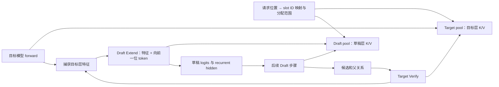
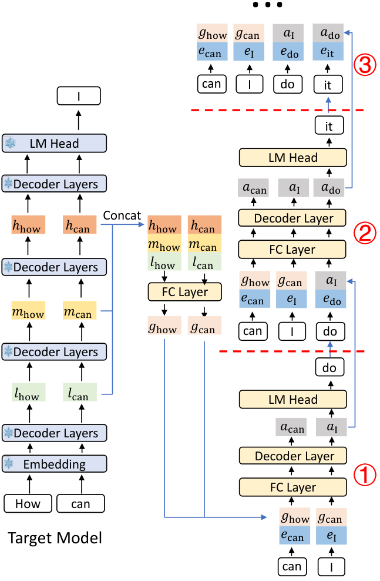
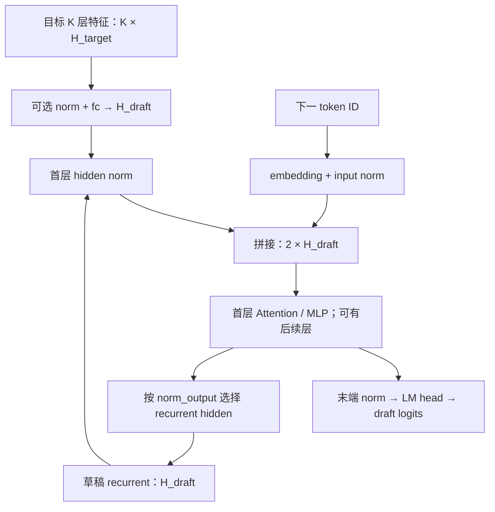
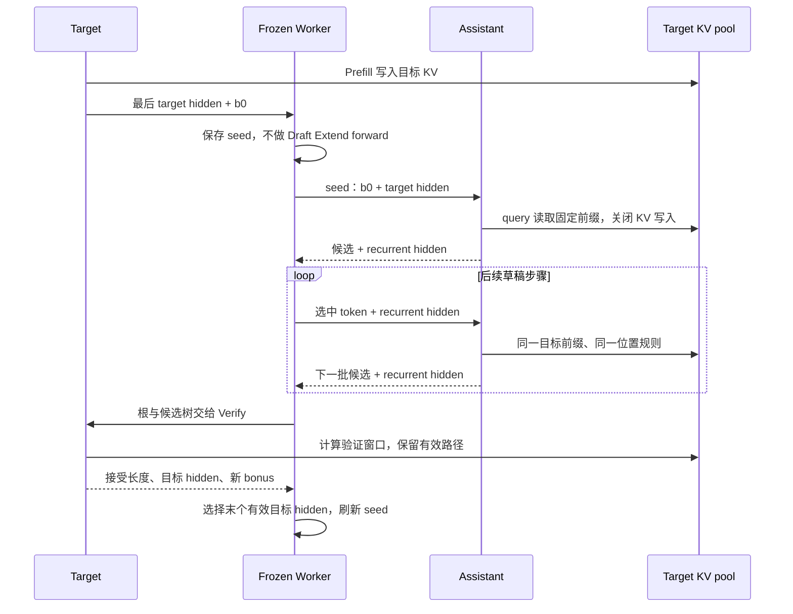

# EAGLE 与 MTP 的源码主线

> **先建立架构心智模型：** [M09 · 高级生成特性插入位置](<../architecture/09-高级生成特性插入位置.md>)。先看职责、数据和生命周期，再回到本篇源码细节。

本文是 **08-04，源码分析型学习资料**。上一章说明了草稿怎样被验证和提交；本篇继续追问：草稿模型收到哪些信息？目标 hidden states 与草稿自身的状态有什么区别？候选变成树以后，token、父关系与 KV 如何对齐？

人话版：EAGLE 类草稿不只是读一串文字，还会接收目标模型已经算出的中间表示。在便宜的草稿步骤中，模型把“已有表示”和“接下来选中的 token”一起处理，提出更远的续写。目标模型验证后，再用正确路径上的表示刷新草稿。MTP 可以借用这条交接链，但具体模型和缓存策略需要逐个核对。

## 0. 阅读基线与范围

| 项目 | 内容 |
| --- | --- |
| 源码仓库与路径基准 | 官方 `sgl-project/sglang`；全部源码路径相对于 SGLang 仓库根目录 `.` |
| 学习分支 | `codex/sglang-source-study-20260909`，基于已拉取的官方 `main` |
| 固定 commit | `72d5c5bb73cadd7ffbf5114e5f81e29d36b6c61a` |
| 读取日期 | `2026-09-10`；沿用 2026-09-09 固定的官方源码 |
| 源码工作区 | 独立 `sglang-source-study` worktree，读取时干净；原 `sglang` 保留 `muxi-main` 和 26 个未跟踪文件 |
| 文档位置 | Wiki `sglang/source-study/08-advanced-generation/`，承接 Draft/Verify/Commit，作为算法专题的模型与对象地图 |
| 主线选择 | Llama 目标模型 + `LlamaForCausalLMEagle3` 草稿；普通文本、单卡 CUDA、page_size=1、贪心、固定 steps=4/topk=1/验证宽度 5；先关闭 Overlap、grammar、自适应和模拟接受 |
| 独立变化 | topk=2 的候选树；普通 DeepSeek NextN 模型；Gemma4 Assistant 的 Frozen-KV MTP；多 MTP Runner 仅比较交接入口 |
| 不展开 | 草稿训练、权重下载/适配实操、模型效果排名、完整多卡/PD/Overlap 时序，以及各家 MTP 的所有结构差异 |
| 操作边界 | 只读固定源码、测试定义与第一方算法说明；文档和独立教学账本检查；未导入 SGLang/torch，未运行单测、模型、服务、GPU 或精度/性能实验 |
| 证据边界 | 张量尺寸、字母 token、分数和拓扑为教学设定，未据某个实测 checkpoint 得出；共享接口不等于共享模型语义或运行支持 |

前置：[08-03 投机解码的 Draft/Verify/Commit](03-投机解码的DraftVerifyCommit.md)、[05-01 Worker 到模型](../05-model-execution/01-Worker与ModelRunner执行边界.md)、[05-04 Logits 与采样](../05-model-execution/04-Logits采样与输出概率.md)、[04-01 请求映射和槽位](../04-kv-cache/01-请求视图物理槽位与分配器.md)。

下文的**源码事实**附固定锚点；图和算例是**整理者归纳**。第一方论文只提供算法目的和结构背景，不能替代当前实现的调用链证据。本文没有运行观察。

## 1. EAGLE、EAGLE-3、MTP 分别指哪一层事情

### 1.1 算法背景先说清楚

| 第一方来源 | 本篇采用的背景 | 版本与边界 |
| --- | --- | --- |
| [EAGLE: Speculative Sampling Requires Rethinking Feature Uncertainty](https://arxiv.org/abs/2401.15077v3)，Yuhui Li 等 | 用目标模型特征做草稿，并引入向前一位的 token 信息来处理特征预测中的不确定性 | arXiv v3，2025-03-04；本次读取 2026-09-10；未复现训练或论文性能 |
| [EAGLE-3: Scaling up Inference Acceleration of Large Language Models via Training-Time Test](https://arxiv.org/abs/2503.01840v3)，Yuhui Li 等 | 改为直接 token 预测目标，融合目标多层特征，区别于原 EAGLE 的特征预测约束 | arXiv v3，2025-04-23；本次读取 2026-09-10；不把不同训练目标写成相同隐状态含义 |
| [DeepSeek-V3 Technical Report，§2.2](https://arxiv.org/html/2412.19437v2#S2.SS2)，DeepSeek-AI | 报告中的 MTP 顺序组合表示与后续 token embedding，共享 embedding/output head；训练后可独立使用主模型，也可把 MTP 模块用于投机 | arXiv v2；本次读取 2026-09-10；这里只取结构与推理用途，不展开训练损失和模型性能 |

因此，**推理步数、模型层数、MTP 模块数和候选树深度必须分别数。** 一次草稿 forward 可以包含多个 Transformer 层；一个 Runner 也可以被连续调用多次。训练时预测多个未来 token，不代表服务能不经目标验证直接发出多个答案。

### 1.2 名字到具体实现的分发

| 配置/模型条件 | 此基线选择 | 不能只凭名字判断的事 |
| --- | --- | --- |
| 普通 EAGLE/EAGLE3 | EAGLEWorkerV2；内部 EagleDraftWorker 持有草稿 TpModelWorker | V2 是执行路径名称，不是 EAGLE 论文版本号 |
| EAGLE 家族且 enable_multi_layer_eagle | MultiLayerEagleWorkerV2 | 这是多 Runner 的 MTP 路径，不等于 EAGLE-3 抓取多个目标层 |
| NEXTN + 普通草稿配置 | 别名解析为 EAGLE，再根据 draft 模型架构加载 NextN 等实现 | NEXTN 不是所有模型共用的固定网络结构 |
| NEXTN/EAGLE + Gemma4 Assistant 架构 | 解析为 FROZEN_KV_MTP，选择独立 Worker | assistant 读目标 KV，不能套用普通草稿 KV 的增长方式 |
| EAGLE3 + Gemma4 Assistant 架构 | 名称解析时明确拒绝 | 不会因二者都消费 hidden states 就自动兼容 |

依据：[名称解析][S2] [Worker 工厂][S1] [普通 Worker][S4] [多 Runner][S47] [Frozen Worker][S50]。关闭 Overlap 仍使用这些 V2 Worker；它只改变调度组织，不会把草稿模型变成另一种架构。

### 1.3 两种不同的“复用”

普通 EAGLE-3 可以复用目标 embedding，并按草稿配置选择是否复用目标 LM head；目标和草稿仍计算各自的层与 KV。Frozen-KV MTP 则额外把 assistant Attention 绑定到目标已经写好的 K/V。**复用权重、共享槽位编号、读取另一模型的 KV，是三件不同的事。**[权重绑定][S10] [池配置][S7] [Frozen 绑定][S56]

## 2. 先把四种数据和两套状态分开

### 2.1 对象与所有者

| 数据/对象 | 由谁产生，谁消费 | 本篇中的含义 |
| --- | --- | --- |
| token ID / embedding | 候选选择产生 ID，草稿 embedding 查表 | ID 是离散符号；embedding 是该模型输入向量 |
| target auxiliary hidden | 目标层捕获 → LogitsProcessor 打包 → Draft Extend | 目标实际执行得到的多层特征，不是目标的 K/V |
| draft recurrent hidden | 草稿 forward → 后续草稿步骤 | 草稿自身递推状态；宽度和含义不必等于拼接后的 target 特征 |
| draft logits / topk_p/index | 草稿 LM head → 候选展开 | 提议分数；不是目标最终认可的概率 |
| parent / retrieve_* | 草稿树整理 → 目标验证 | 决定节点祖先、位置和遍历，不是用户的多个独立 Req |
| target KV | 目标 forward 写入 → 目标后续 Attention 使用 | 正式上下文和候选验证写入；提交边界由验证/请求生命周期管理 |
| 普通 draft KV | 草稿 forward 写入 → 草稿后续 Attention 使用 | 表达草稿层的上下文，不能用目标 K/V 数据替代 |
| FrozenKVMTPContext | 绑定时建立 → assistant Attention | 目标 pool 引用和 assistant 逻辑层到目标物理层的映射 |

输入载体见 [EagleDraftInput][S22]、[EagleVerifyInput][S23]，目标/草稿转换见 [总控][S24]；Frozen Context 见 [定义][S54]。

### 2.2 共享映射，不是共享普通 EAGLE 的 K/V 内容

`EagleDraftWorker.alloc_memory_pool()` 将目标请求池与槽位分配器传入草稿 Worker。`KVCacheConfigurator._init_pools()` 接受共享的请求到槽位映射，同时为当前 Runner 构建 `token_to_kv_pool`；传入的分配器在对应分支继续复用。[草稿分配][S6] [池构造][S7] [分配器复用][S8]

可以把槽位 42 理解为两本账中同一行的编号：目标层在自己的 pool 存目标 K/V，草稿层在另一 pool 存草稿 K/V。它们对应同一请求位置，但数值、层数和张量形状可以不同。这个比喻只适用于本篇普通 Dense EAGLE 主线；混合池的虚拟 ID 映射有额外分支。

**图意解读：** 这是普通 EAGLE 的数据关系图；每个框不是独立进程。两套 KV 经相同 ID 关联请求位置，目标 hidden states 则是一条额外的数据通道。图没有画出 Frozen-KV 的直接读取，那条路径在第 7 节单独展开。

### 2.3 权重共享也受配置约束

普通 `init_lm_head()` 的 EAGLE3 分支优先检查 `load_lm_head_from_target`：需要时绑定 embedding/head，否则只绑定 embedding。Llama EAGLE3 中 draft_vocab_size、tie_word_embeddings 等条件影响 head 构造；加载 d2t 权重时还会建立 draft ID 到 target ID 的映射。[绑定逻辑][S10] [head 构造][S11] [权重映射][S12]

EAGLE3 自带 token map 时，命令行另给的 `speculative_token_map` 会被忽略并提示；循环输出候选前还需映射回目标 ID。不能把“草稿词表下标 100”未经映射直接当目标 token 100。[map 初始化][S9] [候选循环][S32]

经典拒绝采样对完整 q 和词表有额外限制，见 [08-03](03-投机解码的DraftVerifyCommit.md)。本篇主线采用贪心验证，不把 reduced-vocab 草稿自然推广成随机分布保持的证明。

## 3. Target hidden states 怎样进入草稿

### 3.1 抓哪几层，由草稿配置决定

ModelRunner 初始化 speculative auxiliary 配置时，读取 draft model 配置中的 EAGLE3 选项；目标模型随后收到 `set_eagle3_layers_to_capture()` 调用。捕获配置需要在图捕获前建立，否则图中未必包含这些输出通道。[初始化][S13] [解析][S14] [应用][S15]

Llama 代表实现有一个容易读错的下标转换：目标模型循环在执行第 i 层**之前**保存 `hidden_states+residual`，因此显式配置的第 j 层输出，要在循环位置 j+1 捕获。[目标循环][S17] [层号转换][S16]

| 教学设定：目标 32 层 | 配置/循环位置 | 含义 |
| --- | --- | --- |
| 没有显式 layer_ids | 内部默认 `[2,16,29]` | 是循环前的捕获位置，对应前一层的输出 |
| 显式给 `[1,15,28]` | 转成 `[2,16,29]` | 相同位置；外部输出层号与内部捕获点相差 1 |
| 显式给其他层号 | 按本模型方法转换 | 不应把 Llama 的约定推广到所有模型类 |

此处 32 层只是为了算下标。实际匹配的目标/草稿 checkpoint、捕获层、hidden size 和训练配置需要另行核验，不能只让矩阵乘法形状通过就认为语义匹配。

### 3.2 FULL/LAST 决定保留哪些行，不决定隐藏宽度

目标 Prefill/Verify 为草稿请求 FULL hidden capture；普通 Prefill 的 logits 可以只对每请求最后位置计算，而保存给草稿的特征仍覆盖完整输入行。[总控][S24] [logits 行筛选][S41] [hidden 保存][S18]

`pack_aux_hidden_states()` 对多层列表沿最后一维拼接；若输入已经是打包张量，则直接返回。于是多层特征既可以是列表，也可以是 `[token_rows, K×H_target]` 的一个张量。[打包][S19]

| 量 | 教学尺寸 | 由什么控制 |
| --- | --- | --- |
| 目标每层宽度 H_target | 4096 | 目标/草稿配套配置 |
| 捕获层数 K | 3 | num_aux_hidden_states / layer_ids 等 |
| target→draft 输入宽度 | 12288 | K×H_target；用专门 helper 解析 |
| 草稿 recurrent 宽度 H_draft | 4096 | 草稿的 spec_hidden_size |
| 完整 8-token Prefill 捕获 | 8×12288 | FULL 保存所有位置的目标特征 |
| 草稿 Prefill Extend 后的下一轮状态 | 1×4096 | LAST 选择每请求末行的草稿状态 |

`get_draft_input_from_target_hidden_dim()` 与 `get_draft_recurrent_hidden_state_spec_from_config()` 是两种宽度的独立入口。前者明确提醒不要从某个模型的 fc.in_features 反推所有算法；后者还允许 STANDALONE 完全不携带 recurrent hidden。[输入宽度][S20] [递推宽度][S21]

### 3.3 Prefill 左移：H8 为什么配 b0

R1 的 prompt 为 `[p1,p2,…,p8]`，目标 Prefill 得到对应特征 `[H1,H2,…,H8]`，并产生首输出 b0。草稿 Prefill Extend 将 token 向左移一位，形成 `[p2,p3,…,p8,b0]`，与未这样移动的目标特征逐行配对。[左移实现][S26]

| 草稿 Prefill Extend 行 | 来自目标的特征 | 草稿 token 输入 |
| --- | --- | --- |
| 第 1 行 | H1：目标读完 p1 后的捕获特征 | p2 |
| 第 2 行 | H2 | p3 |
| … | … | … |
| 第 8 行 | H8 | b0 |

人话版：目标特征描述“走到前一个 token 时的内部状态”，下一 token 告诉草稿实际沿哪个分支继续。最后一行产生首批候选，例如 a，以及供后续草稿递推的状态。表格使用行号表达配对，不把草稿 embedding 的语义 token 位置与目标 KV 位置混写。

左移按每个请求的 extend_len 分段进行，不能把 R2 的首 token 接到 R1 尾部。若当前是未完成的 Chunked Prefill，尾部应使用下一个真实 prompt token，而不是尚未完成 prompt 时的临时预测；`_eagle_prefill_tail_tokens()` 专门处理该情况。[分段处理][S26] [分块尾部][S25]

### 图解补充：目标模型特征怎样帮助草稿继续生成

[查看原尺寸](../../../images/sglang-source-study/27-eagle-method.png)。

**图意解读：** 从左侧目标模型抽出的低、中、高层特征开始，经中部拼接与映射送到右侧草稿；右侧编号展示草稿继续向前生成。蓝色箭头传递特征，方框内的词是 token。

**对应本篇源码：** 对照 `llama_eagle3.py` 与目标特征交接，区分辅助 hidden states、草稿 token、目标验证以及最后接受的路径。 [源码：python/sglang/srt/models/llama_eagle3.py][S11]

**来源与边界：** [EAGLE-3: Scaling up Inference Acceleration of Large Language Models via Training-Time Test](https://arxiv.org/html/2503.01840v3)，Yuhui Li、Fangyun Wei、Chao Zhang、Hongyang Zhang，arXiv v3：2025-04-23。这是 EAGLE-3 论文的机制图，不能覆盖旧 EAGLE、所有 MTP 或 Frozen-KV 变体；候选仍需目标模型验证，图中的训练标记不表示本次执行了训练。 [来源档案 F27](../../../images/sglang-source-study/SOURCES.md#f27)。

## 4. Llama EAGLE-3 草稿的一次 forward

### 4.1 输入特征与递推特征走的入口不同

本模型先取 token embedding，再从 `forward_batch.spec_info.hidden_states` 读特征。如果隐藏宽度与 embedding 宽度不同，按配置执行可选归一化和 fc 投影；本例为 12288→4096。草稿后续递推已是 4096 宽时，会跳过这段投影。[模块构造][S27] [模型 forward][S28]

第一层 decoder 分别归一化 embedding 和输入 hidden，拼成 8192 宽的输入交给 Attention；后续 decoder 层处理自己的状态和 residual。模型末端把用于 logits 的归一化输出与用于下轮递推的 auxiliary 输出分开，`norm_output` 决定递推是否采用归一化后的版本。[decoder][S29] [输出选择][S28]

**图意解读：** 两个 hidden 入口属于不同阶段，不是同一次 forward 要同时喂两份独立 hidden。目标特征在刷新阶段进来，草稿递推状态用于继续猜测。箭头回环是多次模型调用；不代表 Transformer 单层内无限循环。[阶段交接][S26] [连续 draft][S32] [刷新][S39]

### 4.2 不要把这个结构原样套给其他草稿

普通 `llama_eagle.py::LlamaModel.forward` 在 embedding 与传入 hidden 拼接后直接用 fc 投影，再运行层；Llama EAGLE3 则先处理多层目标特征，并在第一 decoder 层内融合 embedding。[普通 EAGLE 模型][S75] [EAGLE3 模型][S28] [首层融合][S29]

这解释的是当前模型类的数据通路。EAGLE-3 的 recurrent hidden 仍叫 hidden_states，不表示训练目标重新变成“精确预测目标某层 feature”。算法目标与代码字段名要分开理解。

## 5. 从一条草稿链到候选树，再回到正确路径

### 5.1 steps=4 不是每轮执行 4 个不同网络

普通 EagleDraftWorker 持有一个 draft_runner。Prefill/上轮 Draft Extend 已准备第一步 topk 与 recurrent hidden；`draft_forward()` 第 0 轮先使用这些候选，再在需要后续候选时调用同一个 Runner。最后一个候选层已得到后会 break，无须再 forward 生成不会使用的下一层。[Worker 构造][S5] [循环][S32]

因此，本篇 steps=4 的链式普通路径可以拆成“提前准备首候选 + 循环内 3 次后续 forward”；另有每轮 Draft Extend 刷新成本。Frozen-KV 的 seed forward 放在 draft 内，阶段计时分界会不同，不能只比 `draft` 这一段的耗时。

`prepare_for_draft()` 使用旧 seq_lens 和共享请求映射，为草稿写入分配 cache locations，设置每请求 topk 行及起始 positions；后续步骤继续推进普通草稿位置。[准备][S31] [位置更新][S32]。这与目标一次验证整个候选窗口是两种不同的执行布局。

### 5.2 topk=2：父分数、子 token 和 hidden 必须一起选择

第一步扩成 topk 个候选时，父 hidden 按 topk 重复；后续先算 `父路径分数×子概率`，再挑本轮继续展开的 topk 条路径，并按同一父索引选择 hidden。[第一步][S33] [后续步][S34]

用两层教学树说明。设首层 a=0.6、b=0.4；a 后续 c=0.8、d=0.2，b 后续 e=0.7、f=0.3。

| 节点 | 父节点 | 条件分数 | 累计草稿分数 |
| --- | --- | ---: | ---: |
| a | 根 b0 | 0.6 | 0.6 |
| b | 根 b0 | 0.4 | 0.4 |
| c | a | 0.8 | 0.48 |
| d | a | 0.2 | 0.12 |
| e | b | 0.7 | 0.28 |
| f | b | 0.3 | 0.12 |

继续展开的两条路径是 a→c 与 b→e，其 hidden 也必须分别继承 a、b 分支。把 token 排对、hidden 却留在旧行，会让后续预测条件错位。

`organize_draft_results()` 从已收集的分数中选 `num_draft_tokens−1` 个节点，再按原节点索引排序并 gather token；减 1 是给旧 bonus 根保留位置。[最终整理][S35]

若本例验证宽度为 5，选入的非根节点为 a、b、c、e。树的存储顺序可写成 `[b0,a,b,c,e]`，本例 positions 为 `[L,L+1,L+1,L+2,L+2]`。这里的分数来自草稿，不是目标认可，也不代表跨请求的调度优先级。

### 5.3 同一深度不等于共享整个前缀

| 验证节点 | 可见的树内祖先（含自己） | 不应混入的兄弟分支 |
| --- | --- | --- |
| b0 | b0 | 无 |
| a | b0、a | b |
| b | b0、b | a |
| c | b0、a、c | b、e |
| e | b0、b、e | a、c |

所有节点还可见既有目标 KV 前缀。`build_eagle_verify_input()` 根据父关系构造 mask、positions 和 retrieve 索引，使一次目标 forward 正确计算这些条件前缀。[构造][S36]

若目标选择 b→e，再补 z，接受行是 `[0,2,4]`。后续要把这条路径的**预测、目标 hidden、目标 KV**一起整理到连续前部；不是只把输出 token 排成 b/e/z。[验证][S37] [路径整理][S38]

### 5.4 刷新草稿，不能沿着被拒绝的特征继续走

回到“猜 a/b/c/d、接受 a/b、补 z”的链。目标 Verify 输入 `[b0,a,b,c,d]`，有效预测为 `[a,b,z]`。刷新草稿时，将目标各行特征与相应后继预测配对；有效前三行就是 `(H_b0,a)、(H_a,b)、(H_b,z)`。[Draft Extend 输入][S39] [准备][S40]

普通 Draft Extend 会以固定验证宽度准备计算窗口，并不一定只计算 accept_lens 行。它在 `DRAFT_EXTEND_V2` 模式下写草稿 KV、计算草稿状态，之后以 `每请求块起点+accept_lens−1` 选出真正用于下一轮的末行 logits/hidden。无效尾部即使计算过，也不能被当作下一轮种子。[窗口][S40] [选择与回填][S39]

| 两请求教学例 | 验证块起点 | accept_lens | 应选的草稿刷新输出行 |
| --- | ---: | ---: | ---: |
| R1，宽度 5 | 0 | 3 | 2 |
| R2，宽度 5 | 5 | 1 | 5 |

eager 路径在 forward 后 gather；图执行可通过 draft_extend_select_index 提前选择要进入 LM head 的行。无论放在哪里选择，logits、普通 hidden、pre-norm hidden 和 auxiliary hidden 都必须对齐同一行。[刷新][S39] [LogitsProcessor 选择][S41] [hidden 保存][S18]

这次重新得到的 recurrent hidden 和 topk 候选被写回 next_draft_input；bonus 保持 z。目标新 bonus 的 KV 仍按上一章的错位规则在下一轮生成，不能因为草稿已经吸收 z 就说目标也写好了 z 的 KV。

## 6. 普通 NextN/MTP：沿相同交接链，换成模型自己的预测模块

### 6.1 DeepSeek 代表路径怎样进入

`ModelConfig._config_draft_model()` 在 is_draft_model 条件下，把 DeepseekV3ForCausalLM/DeepseekV32ForCausalLM 转为 NextN 架构。NextN 类的加载入口再以 `is_nextn=True` 委托权重加载。不能因为目标和草稿使用同一模型路径，就推断草稿又完整运行了一遍目标网络。[架构转换][S42] [加载入口][S46]

这里选读 `DeepseekModelNextN`，不将它作为全部 MTP 模型的通用实现。该模型构建 embedding、两种 RMSNorm、2H→H 的 eh_proj、一个 NextN decoder，以及 shared_head.norm。[构造][S43]

### 6.2 一次 NextN forward 的主线

| 步骤 | 普通语言 | 对应代码 |
| --- | --- | --- |
| token embedding | 把当前草稿输入 token 转成向量 | embed_tokens |
| previous_hidden_states | 读取本轮携带的目标/上一步表示 | forward_batch.spec_info.hidden_states |
| 归一化并融合 | 两份 H 宽输入分别归一化，拼成 2H，再投影成 H | enorm、hnorm、eh_proj |
| NextN decoder | 运行自己的 Attention/MoE 等模块，更新自己的层状态 | decoder，is_nextn=True |
| 输出头 | 归一化后形成词表 logits | shared_head.norm、lm_head、LogitsProcessor |

CUDA 的融合 norm 路径与其他设备的显式拼接代码写法不同，但这里都能追到 token embedding 与 previous hidden 两个输入。[模型 forward][S44] [输出封装][S45]

与 Llama EAGLE3 对照时，先看输入表示的来源/宽度，再看融合位置。DeepSeek 这条代表路径不先拼 K 个目标辅助层；普通 EAGLE3 的 K×H 特征输入不能原样塞进这个 H 宽接口。

### 6.3 一次网络多层，和每步换 Runner，不是一回事

| 数量 | 影响什么 | 代表入口 |
| --- | --- | --- |
| 草稿模型 num_hidden_layers | 一次 forward 内执行多少层 | Llama EAGLE3 的 layers 列表 [S27] |
| speculative_num_steps | 本轮构造多少步候选 | 普通 EagleDraftWorker 循环 [S32] |
| enable_multi_layer_eagle 下的 Runner 列表 | 不同投机步用哪个 MTP Runner | TpModelWorker 的多 Runner 构造 [S49] |
| 目标辅助捕获层数 K | 输入特征拼接宽度 | 捕获/宽度解析 [S14] [S20] |

多 Runner 路径创建带不同 draft_model_idx 的 ModelRunner，`mtp_model_runner(step)` 直接取对应元素。其 hidden 传递也有模型分支：部分架构逐步传自身输出，另一些使用目标 hidden。不能把某个模型的“逐步复用同一 head”或“每步不同 head”概括成全部 MTP。[Runner 构造][S49] [选择][S48] [hidden 策略][S47]

本篇只说明这些分发和对象边界。各模型的多 head 权重选择、boundary-KV 修复和混合状态细节需要沿实际选中的模型类继续读；不以列表存在证明所有 steps 配置均合法。

## 7. Frozen-KV MTP：assistant 读取目标的固定前缀

### 7.1 先绑定目标 pool 和真实 KV 所有者

FrozenKVMTPDraftWorker 复用 EAGLE 的验证输入/输出协议，但拥有独立 seed 和递推循环。目标 pool 建立后才绑定 context；构造 Worker 时不要求目标 KV pool 已存在。[草稿 Worker][S51] [绑定时点][S52] [context 绑定][S53]

Gemma4 Assistant 的 context 生成并非“assistant 第 i 层读取 target 第 i 层”。本基线取目标末两层对应的 attention 类型，解析它们真正的 KV owner，再按 assistant 各层类型建立映射。如果 owner 缺失或还是共享层，或 assistant 类型没有对应项，会报错。[映射构造][S55]

举一个**人工层映射**：目标末两层分别为 sliding/full，实际 KV owner 为 4/5；assistant 层类型为 `[sliding,full,sliding]`，那么 assistant 逻辑层 0/1/2 映射到目标物理层 4/5/4。这只是说明“类型 → owner”的两跳关系，不是某个 Gemma4 checkpoint 的真实层号。

绑定后，assistant 层被设置为 KV-shared，Attention 的 layer_id 指向目标物理 owner。Gemma4Attention 的共享分支把 k/v 置空，并关闭 `save_kv_cache`；它形成 query，读取已有 K/V，不把草稿位置写进目标 pool。[绑定][S56] [Attention 数据流][S57]

### 7.2 这里的 frozen 是“一轮中的前缀不随草稿步扩展”

Worker 通过临时 context view 让 metadata 和模型 forward 读取目标 pool；退出时恢复原 backend pool。metadata view 还临时去掉 spec_info，模型 forward 前必须恢复，使 recurrent hidden 仍可访问。[metadata view][S58] [forward view][S59]

`set_frozen_kv_positions()` 取 `max(seq_lens−1,0)`，seed 和后续递推都使用这一位置，不像普通 draft 一步一步增加。假设目标已写入的前缀长度为 11，本轮 assistant 多次草稿调用都以位置 10 对应的固定前缀视图计算；下一轮目标 Verify 接受路径后，才换成新的前缀长度。[位置规则][S63] [循环][S65]

这不是把目标 KV 永久冻结，也不是把草稿 token 当作独立、互不相关的查询。它仍通过 token 和 recurrent hidden 递推信息，只是不为草稿新增 assistant KV 上下文。

### 7.3 assistant 的 embedding、hidden 和输出头

Gemma4AssistantForCausalLM 的主线如下：[模型构造][S60] [forward][S61]

| 环节 | 输入/输出 | 与普通 EAGLE3 的区别 |
| --- | --- | --- |
| token embedding | 用绑定的目标 embedding 权重，按 backbone 宽度缩放 | embedding 宽度可与 assistant 内部宽度不同 |
| pre_projection | 拼接 token_embed 和 prev_hidden：2H_backbone→H_assistant | 两者形状不相同会显式报错 |
| assistant Transformer | 在绑定的目标 KV 视图上计算 | 共享分支不写自己的候选 KV |
| logits 分支 | H_assistant→assistant LM head | `set_embed_and_head()` 忽略传入的 target head，保留 assistant head |
| recurrent 分支 | post_projection：H_assistant→H_backbone | 下一步状态宽度回到 backbone 宽度 |

注意 `hidden_states_before_norm` 在此模型 forward 中承载 post_projection 的结果；LogitsProcessor 在存在这个输出时优先返回它。字段名不能替代生产者语义，应跟到赋值处确认它是哪个张量。[模型返回][S61] [保存优先级][S18] [head 绑定][S62]

本模型另有 ordered embeddings/centroid head 分支。本篇走普通 assistant head，不从该分支推断实际 checkpoint 的词表排序或概率处理。

### 7.4 没有普通 Draft Extend forward，如何刷新种子

Prefill 后，Frozen 的 `_draft_extend_for_prefill()` 只取目标最后一行 hidden，配上首输出 bonus，保存 seed；真正的 seed forward 在下轮 `draft_forward()` 内执行。普通 EAGLE 在这个时点已经执行过一次草稿 Prefill Extend，两者计时边界不同。[Prefill 种子][S66] [seed 保存][S64] [seed forward][S65]

Verify 后，Frozen 的 `_draft_extend_for_decode()` 按 `块起点+accept_lens−1` 取**目标 Verify 输出的末个有效 hidden**，配上新 bonus，替换 next_draft_input。它不执行草稿 forward，也不延伸 assistant KV。[验证后刷新][S67]

**图意解读：** Assistant 读取 KV 的箭头没有写入含义；真正更新目标内容的是 Target。Verify 的接受与提交细节仍按上一章分阶段处理，图将它简写为一次交接，不能据此推导所有异步清理时序。[总控][S78] [共享 Attention][S57]

“没有不断增长的 assistant 草稿 KV”也不等于“没有额外显存”。代码仍构建模型、图/状态缓冲，并使用一个 dummy MemoryPoolConfig 初始化兼容设施，其中 max_total_num_tokens=64。这个值不能当作目标服务容量，更不能由此宣称整个 assistant 零缓存/零额外内存。[分配入口][S52]

## 8. 对照之后，哪些约束需要单独核对

### 8.1 三条路径的对照表

| 问题 | Llama EAGLE3 主线 | DeepSeek NextN 代表 | Gemma4 Frozen-KV 代表 |
| --- | --- | --- | --- |
| 从目标收到什么 | 多层 auxiliary 特征 | 单份前序 hidden 接口 | 末个有效 target hidden + 目标 KV 视图 |
| 后续步主要传什么 | 草稿 recurrent hidden | 普通单 Runner 路径的前序 hidden | post_projection 后的 recurrent hidden |
| 融合方式 | 多层特征投影，首 decoder 内再融合 token embedding | norm embedding/hidden，eh_proj 后进入 NextN decoder | 目标 embedding+hidden 经 pre_projection |
| 草稿 Attention 的上下文 | 自己的草稿 KV | 自己的 NextN 层 KV | 目标固定前缀的 K/V |
| 每轮刷新 | 运行 Draft Extend，再取末个有效草稿输出 | 走普通 EAGLE 的刷新链 | 只选末个有效目标 hidden 保存 seed |
| LM head | 按配置独立或绑定目标 | 由普通绑定路径及模型加载决定 | assistant 保留自己的 head |
| 是否免验证 | 否 | 否 | 否 |

此表对应本篇选读的类与分支，不是所有 EAGLE/MTP 模型的功能矩阵。[EAGLE3][S28] [NextN][S44] [Frozen][S61]

### 8.2 核查“哪个条件真正经过了哪个钩子”

| 条件 | 固定源码事实 | 证据边界 |
| --- | --- | --- |
| Gemma4 Assistant + EAGLE3 | 别名解析明确拒绝 | [解析][S2] |
| 普通 EAGLE3 token map | CLI map 提示忽略，优先从草稿权重取得 d2t | [map][S9] [加载][S12] |
| 普通 EAGLE topk=1 | 家族钩子整理验证宽度为 steps+1 | [家族钩子][S3]；不能未经分发核查推广到独立算法钩子 |
| Frozen + mixed chunk | 专用钩子关闭 mixed chunk | [Frozen 钩子][S68]；不等于完全禁止 Chunked Prefill |
| Frozen topk>1 的 draft backend | 构造分支只接收 triton 或 trtllm_mha，否则报错 | [后端入口][S76]；该条件不是整套模型/平台组合的运行认证 |
| 多 Runner EAGLE | 构造要求验证宽度等于 steps+1；hidden 策略按架构分支 | [构造][S47]；不是“有多个捕获层就开启” |
| PP | 普通 EAGLE 外层只在最后 PP rank 持有 draft，draft 自身构造 pp_size=1 | [外层][S4] [内层][S5]；不能把内层注释概括成所有投机都不支持目标 PP |

**对 08-03 的复核修正：** `SpeculativeAlgorithm.handle_server_args()` 在 Frozen 分支调用 `_handle_frozen_kv_mtp()`，不会继续进入 `_handle_eagle_family()`。因此，后者关于经典拒绝采样的 allowlist 不能作为“Frozen 一定在启动时被拒绝”的证据。上一章及附录已同步收窄这处表述。[分发][S69] [专用钩子][S68]

Frozen 草稿循环构造普通 topk 候选，不提供经典采样所需的完整 q；若执行进入 `eagle_sample()` 的经典随机分支，实际 q 的保护会检查它是否为空/词表匹配。贪心分支的选择又在该随机分支之前。这些是调用链条件，不能据“没在启动钩子拒绝”宣布经典随机采样可用，也不把尚未运行的错误路径写成实测报错。[Frozen 候选][S65] [验证分支][S77]

### 8.3 小白排障地图

| 现象 | 先查对象/字段 | 回到哪里 | 不要先下什么结论 |
| --- | --- | --- | --- |
| fc 输入尺寸不匹配 | target_hidden_size、K、实际打包宽度、spec_hidden_size | [宽度 helper][S20] [模型 fc][S27] | 不能仅靠换一个矩阵大小判断配套权重正确 |
| Prefill 后第一步草稿异常 | 每请求左移边界、末尾 b0、chunk 下一 prompt token | [左移][S26] [尾部选择][S25] | 不应先归因于接受率参数 |
| 首轮正常，连续草稿异常 | recurrent hidden 是否被误当成 K 层目标特征 | [递推宽度][S21] [模型入口][S28] | 字段同名不代表张量语义相同 |
| topk>1 后路径混乱 | token、父索引、hidden 的联合 gather | [后续选择][S34] [整理][S35] | 只检查候选 token 顺序不够 |
| Verify 后第二轮异常 | accept_lens−1、块起点、hidden/logits 行一致性 | [刷新][S39] [行选择][S41] | 不能使用整个固定宽度的最后一行 |
| 草稿词表 token 对不上 | d2t/hot_token_id、head 输出宽度 | [权重映射][S12] [绑定][S10] | draft ID 不能默认等于 target ID |
| Frozen attention 读错层 | logical→physical 映射、KV owner 是否真有 K/V | [context 构造][S55] [绑定][S56] | assistant 层号不是目标层号 |
| Frozen 生成中目标 KV 被改写 | is_kv_shared_layer、k/v、save_kv_cache、pool view | [Attention][S57] [view][S59] | “绑定 pool”本身不等于只读保证 |
| Frozen 多步位置不增长 | seq_lens−1 规则、recurrent hidden | [位置][S63] [循环][S65] | 这是所选实现的策略，不应直接当作漏加 positions |
| head 看起来没有共享 | 模型 setter 与 load_lm_head_from_target | [普通绑定][S10] [Frozen setter][S62] | 接口叫 set_embed_and_head 不保证两个都采用 |

## 9. 阅读路线与验证记录

### 9.1 用一次 Prefill 和两轮 Decode 自己走通

1. `python/sglang/srt/speculative/eagle_worker_v2.py::EAGLEWorkerV2.forward_batch_generation` [S24]：找到目标输出进入草稿的地方。
2. `python/sglang/srt/models/llama.py::LlamaForCausalLM.set_eagle3_layers_to_capture` [S16]：回到目标层捕获点解释 layer_ids。
3. `python/sglang/srt/layers/logits_processor.py::LogitsProcessor._get_hidden_states_to_store` [S18]：确认 FULL/LAST、拼接和 pre-norm 输出优先级。
4. `python/sglang/srt/speculative/eagle_worker_v2.py::EagleDraftWorker._draft_extend_for_prefill` [S26]：按请求画左移表，找第一轮种子。
5. `python/sglang/srt/models/llama_eagle3.py::LlamaModel.forward` [S28]：拆开目标多层特征与草稿递推特征。
6. `python/sglang/srt/speculative/spec_utils.py::_select_top_k_tokens_later` [S34]：把候选、累计分数与 hidden 的父索引一起追踪。
7. `python/sglang/srt/speculative/eagle_worker_v2.py::EagleDraftWorker._draft_extend_for_decode` [S39]：取正确末行，准备第二轮。
8. 对照 `python/sglang/srt/models/deepseek_nextn.py::DeepseekModelNextN.forward` [S44]，再读 `python/sglang/srt/speculative/frozen_kv_mtp_worker_v2.py::FrozenKVMTPDraftWorker.draft_forward` [S65]：分别找输入融合与 KV 策略的差别。

### 9.2 源码中已有测试的范围

| 测试入口 | 定义中的检查 | 本次状态 / 不能证明什么 |
| --- | --- | --- |
| test_eagle_draft_extend_logits.py::test_last_aux_hidden_states_use_selected_rows [S70] | 选择行与 auxiliary hidden 对齐 | 只读；不能证明真实 EAGLE 模型精度 |
| 同文件 test_full_hidden_capture_stays_unpruned [S71] | FULL capture 保留全部特征行 | 只读；不覆盖图执行的完整生命周期 |
| test_eagle_worker_v2_topk1_fastpath.py::test_fast_path_matches_slow_path [S72] | steps=1—4，链式常量与普通整理结果对齐，检查 dtype/连续性 | 只读；这是布局对照，不是全模型采样等价测试 |
| test_build_eagle_tree.py::test_build_tree_kernel_efficient [S73] | 已知树输入对应的 positions、retrieve 关系、token 输出 | 只读；文件注册 GPU CI，本次未运行 |
| test_frozen_kv_mtp.py::TestFrozenKVMTP.test_gsm8k_mtp [S74] | 指定目标/assistant，topk=1/3，检查服务配置、质量和接受长度条件 | 只读；不把测试阈值、存在测试文件或 CI 注册当作本次通过记录 |

本次实际完成的是固定锚点、调用交接、文档链接、图文一致性静态检查，以及标准库独立计算的维度、请求左移、树分数/祖先、接受行和 Frozen 层映射账本。没有执行以上测试，也没有导入模型依赖。Mermaid 未渲染，不能把静态核对写成 GPU trace。

后续实验证据至少应记录 target/draft config 与权重 revision、捕获层列表、每阶段 hidden 的 shape/dtype/来源、候选父关系、目标和草稿 pool 身份、接受路径、所选末行及分阶段耗时。测量时统一阶段边界，尤其要计入普通 EAGLE 的 Draft Extend 和 Frozen 放在 Draft 内的 seed forward。

## 10. 练习与阅读验收

### 10.1 自己回答

1. H_target=4096、捕获 3 层、H_draft=4096，为什么 target→draft 是 12288 宽，而连续 draft 的 hidden 又是 4096？
2. R1 prompt=[p1,p2,p3]，R2 prompt=[q1,q2]，首输出分别 b0、c0。草稿 Prefill Extend 的 token 输入应如何分段？
3. 两请求验证宽度均为 5，accept_lens 分别 3/1，应选哪两行刷新草稿？为什么不能都取块末行？
4. 两层树 a=.6、b=.4，a→c=.8、a→d=.2、b→e=.7、b→f=.3，验证宽度 5 时选哪些非根节点？若接受 b→e，目标 KV/hidden 应取哪条路径？
5. Frozen assistant 第 0 层是 sliding，目标末个 sliding 层共享第 4 层 KV。真正应绑定哪个层号？谁可以写这个 KV？
6. 为什么 Frozen 不执行普通 Draft Extend forward，仍然必须在 Verify 后刷新 next_draft_input？
7. “某个钩子里有 rejection sampling allowlist，所以所有算法都在启动时被它保护”缺少了哪一步证据？

### 10.2 参考答案

1. 前者是三层目标特征拼接，后者是草稿模型自己的递推输出；投影与后续模型调用把两者连接，不应把它们当同一个张量类型。
2. 分别为 `[p2,p3,b0]` 与 `[q2,c0]`；不能做跨请求整体循环移位。非最终分块的尾部还应换成下一 prompt token。
3. 选全局行 2 和 5。固定宽度尾部可能是未接受候选或 padding，不属于正式路径。
4. 非根选 a、b、c、e；存储 `[b0,a,b,c,e]` 时接受行 `[0,2,4]`。目标输入路径是 b0/b/e，预测输出是 b/e/z，按同一接受索引整理目标 KV 和 hidden。
5. 绑定目标物理 owner=4；assistant 的共享 Attention 只读，目标模型负责相应目标 KV 写入。逻辑层号与物理 owner 不是一回事。
6. 下一轮需要新 bonus 和末个有效目标 hidden；本轮草稿的猜测状态不能替代验证后正确路径上的目标状态。刷新种子不要求做一次草稿 forward。
7. 缺少实际分发会进入该钩子的证明。Frozen 走独立处理器；应继续追实际验证输入和采样分支，不能只引用未被调用的检查代码。

读完应能画清目标特征、草稿递推状态、候选树、两套 KV 的数据流，并解释普通 NextN 与 Frozen-KV 在“谁维护可增长的上下文”上的差别。

下一篇为 [08-05《DFlash、Ngram 与自适应投机》](05-DFlashNgram与自适应投机.md)：继续比较其他候选来源，并追踪接受统计怎样影响后续草稿预算。

[S1]: https://github.com/sgl-project/sglang/blob/72d5c5bb73cadd7ffbf5114e5f81e29d36b6c61a/python/sglang/srt/speculative/spec_info.py#L301
[S2]: https://github.com/sgl-project/sglang/blob/72d5c5bb73cadd7ffbf5114e5f81e29d36b6c61a/python/sglang/srt/arg_groups/speculative_hook.py#L41
[S3]: https://github.com/sgl-project/sglang/blob/72d5c5bb73cadd7ffbf5114e5f81e29d36b6c61a/python/sglang/srt/arg_groups/speculative_hook.py#L804
[S4]: https://github.com/sgl-project/sglang/blob/72d5c5bb73cadd7ffbf5114e5f81e29d36b6c61a/python/sglang/srt/speculative/eagle_worker_v2.py#L1157
[S5]: https://github.com/sgl-project/sglang/blob/72d5c5bb73cadd7ffbf5114e5f81e29d36b6c61a/python/sglang/srt/speculative/eagle_worker_v2.py#L158
[S6]: https://github.com/sgl-project/sglang/blob/72d5c5bb73cadd7ffbf5114e5f81e29d36b6c61a/python/sglang/srt/speculative/eagle_worker_v2.py#L227
[S7]: https://github.com/sgl-project/sglang/blob/72d5c5bb73cadd7ffbf5114e5f81e29d36b6c61a/python/sglang/srt/mem_cache/kv_cache_configurator.py#L435
[S8]: https://github.com/sgl-project/sglang/blob/72d5c5bb73cadd7ffbf5114e5f81e29d36b6c61a/python/sglang/srt/mem_cache/kv_cache_configurator.py#L1965
[S9]: https://github.com/sgl-project/sglang/blob/72d5c5bb73cadd7ffbf5114e5f81e29d36b6c61a/python/sglang/srt/speculative/eagle_worker_v2.py#L305
[S10]: https://github.com/sgl-project/sglang/blob/72d5c5bb73cadd7ffbf5114e5f81e29d36b6c61a/python/sglang/srt/speculative/eagle_worker_v2.py#L318
[S11]: https://github.com/sgl-project/sglang/blob/72d5c5bb73cadd7ffbf5114e5f81e29d36b6c61a/python/sglang/srt/models/llama_eagle3.py#L264
[S12]: https://github.com/sgl-project/sglang/blob/72d5c5bb73cadd7ffbf5114e5f81e29d36b6c61a/python/sglang/srt/models/llama_eagle3.py#L314
[S13]: https://github.com/sgl-project/sglang/blob/72d5c5bb73cadd7ffbf5114e5f81e29d36b6c61a/python/sglang/srt/model_executor/model_runner.py#L571
[S14]: https://github.com/sgl-project/sglang/blob/72d5c5bb73cadd7ffbf5114e5f81e29d36b6c61a/python/sglang/srt/model_executor/model_runner_components/spec_aux_hidden_state.py#L74
[S15]: https://github.com/sgl-project/sglang/blob/72d5c5bb73cadd7ffbf5114e5f81e29d36b6c61a/python/sglang/srt/model_executor/model_runner_components/attention_backend_setup.py#L40
[S16]: https://github.com/sgl-project/sglang/blob/72d5c5bb73cadd7ffbf5114e5f81e29d36b6c61a/python/sglang/srt/models/llama.py#L890
[S17]: https://github.com/sgl-project/sglang/blob/72d5c5bb73cadd7ffbf5114e5f81e29d36b6c61a/python/sglang/srt/models/llama.py#L418
[S18]: https://github.com/sgl-project/sglang/blob/72d5c5bb73cadd7ffbf5114e5f81e29d36b6c61a/python/sglang/srt/layers/logits_processor.py#L716
[S19]: https://github.com/sgl-project/sglang/blob/72d5c5bb73cadd7ffbf5114e5f81e29d36b6c61a/python/sglang/srt/layers/aux_hidden_states.py#L56
[S20]: https://github.com/sgl-project/sglang/blob/72d5c5bb73cadd7ffbf5114e5f81e29d36b6c61a/python/sglang/srt/speculative/eagle_utils.py#L445
[S21]: https://github.com/sgl-project/sglang/blob/72d5c5bb73cadd7ffbf5114e5f81e29d36b6c61a/python/sglang/srt/speculative/eagle_utils.py#L487
[S22]: https://github.com/sgl-project/sglang/blob/72d5c5bb73cadd7ffbf5114e5f81e29d36b6c61a/python/sglang/srt/speculative/eagle_info.py#L142
[S23]: https://github.com/sgl-project/sglang/blob/72d5c5bb73cadd7ffbf5114e5f81e29d36b6c61a/python/sglang/srt/speculative/eagle_info.py#L16
[S24]: https://github.com/sgl-project/sglang/blob/72d5c5bb73cadd7ffbf5114e5f81e29d36b6c61a/python/sglang/srt/speculative/eagle_worker_v2.py#L1263
[S25]: https://github.com/sgl-project/sglang/blob/72d5c5bb73cadd7ffbf5114e5f81e29d36b6c61a/python/sglang/srt/speculative/eagle_utils.py#L87
[S26]: https://github.com/sgl-project/sglang/blob/72d5c5bb73cadd7ffbf5114e5f81e29d36b6c61a/python/sglang/srt/speculative/eagle_worker_v2.py#L866
[S27]: https://github.com/sgl-project/sglang/blob/72d5c5bb73cadd7ffbf5114e5f81e29d36b6c61a/python/sglang/srt/models/llama_eagle3.py#L115
[S28]: https://github.com/sgl-project/sglang/blob/72d5c5bb73cadd7ffbf5114e5f81e29d36b6c61a/python/sglang/srt/models/llama_eagle3.py#L200
[S29]: https://github.com/sgl-project/sglang/blob/72d5c5bb73cadd7ffbf5114e5f81e29d36b6c61a/python/sglang/srt/models/llama_eagle3.py#L80
[S30]: https://github.com/sgl-project/sglang/blob/72d5c5bb73cadd7ffbf5114e5f81e29d36b6c61a/python/sglang/srt/speculative/eagle_worker_v2.py#L596
[S31]: https://github.com/sgl-project/sglang/blob/72d5c5bb73cadd7ffbf5114e5f81e29d36b6c61a/python/sglang/srt/speculative/eagle_worker_common.py#L212
[S32]: https://github.com/sgl-project/sglang/blob/72d5c5bb73cadd7ffbf5114e5f81e29d36b6c61a/python/sglang/srt/speculative/eagle_worker_v2.py#L659
[S33]: https://github.com/sgl-project/sglang/blob/72d5c5bb73cadd7ffbf5114e5f81e29d36b6c61a/python/sglang/srt/speculative/spec_utils.py#L287
[S34]: https://github.com/sgl-project/sglang/blob/72d5c5bb73cadd7ffbf5114e5f81e29d36b6c61a/python/sglang/srt/speculative/spec_utils.py#L308
[S35]: https://github.com/sgl-project/sglang/blob/72d5c5bb73cadd7ffbf5114e5f81e29d36b6c61a/python/sglang/srt/speculative/eagle_utils.py#L106
[S36]: https://github.com/sgl-project/sglang/blob/72d5c5bb73cadd7ffbf5114e5f81e29d36b6c61a/python/sglang/srt/speculative/eagle_worker_common.py#L316
[S37]: https://github.com/sgl-project/sglang/blob/72d5c5bb73cadd7ffbf5114e5f81e29d36b6c61a/python/sglang/srt/speculative/eagle_worker_common.py#L461
[S38]: https://github.com/sgl-project/sglang/blob/72d5c5bb73cadd7ffbf5114e5f81e29d36b6c61a/python/sglang/srt/speculative/eagle_worker_common.py#L406
[S39]: https://github.com/sgl-project/sglang/blob/72d5c5bb73cadd7ffbf5114e5f81e29d36b6c61a/python/sglang/srt/speculative/eagle_worker_v2.py#L1005
[S40]: https://github.com/sgl-project/sglang/blob/72d5c5bb73cadd7ffbf5114e5f81e29d36b6c61a/python/sglang/srt/speculative/eagle_worker_common.py#L105
[S41]: https://github.com/sgl-project/sglang/blob/72d5c5bb73cadd7ffbf5114e5f81e29d36b6c61a/python/sglang/srt/layers/logits_processor.py#L532
[S42]: https://github.com/sgl-project/sglang/blob/72d5c5bb73cadd7ffbf5114e5f81e29d36b6c61a/python/sglang/srt/configs/model_config.py#L741
[S43]: https://github.com/sgl-project/sglang/blob/72d5c5bb73cadd7ffbf5114e5f81e29d36b6c61a/python/sglang/srt/models/deepseek_nextn.py#L57
[S44]: https://github.com/sgl-project/sglang/blob/72d5c5bb73cadd7ffbf5114e5f81e29d36b6c61a/python/sglang/srt/models/deepseek_nextn.py#L138
[S45]: https://github.com/sgl-project/sglang/blob/72d5c5bb73cadd7ffbf5114e5f81e29d36b6c61a/python/sglang/srt/models/deepseek_nextn.py#L301
[S46]: https://github.com/sgl-project/sglang/blob/72d5c5bb73cadd7ffbf5114e5f81e29d36b6c61a/python/sglang/srt/models/deepseek_nextn.py#L313
[S47]: https://github.com/sgl-project/sglang/blob/72d5c5bb73cadd7ffbf5114e5f81e29d36b6c61a/python/sglang/srt/speculative/multi_layer_eagle_worker_v2.py#L117
[S48]: https://github.com/sgl-project/sglang/blob/72d5c5bb73cadd7ffbf5114e5f81e29d36b6c61a/python/sglang/srt/speculative/multi_layer_eagle_worker_v2.py#L234
[S49]: https://github.com/sgl-project/sglang/blob/72d5c5bb73cadd7ffbf5114e5f81e29d36b6c61a/python/sglang/srt/managers/tp_worker.py#L498
[S50]: https://github.com/sgl-project/sglang/blob/72d5c5bb73cadd7ffbf5114e5f81e29d36b6c61a/python/sglang/srt/speculative/frozen_kv_mtp_worker_v2.py#L688
[S51]: https://github.com/sgl-project/sglang/blob/72d5c5bb73cadd7ffbf5114e5f81e29d36b6c61a/python/sglang/srt/speculative/frozen_kv_mtp_worker_v2.py#L100
[S52]: https://github.com/sgl-project/sglang/blob/72d5c5bb73cadd7ffbf5114e5f81e29d36b6c61a/python/sglang/srt/speculative/frozen_kv_mtp_worker_v2.py#L179
[S53]: https://github.com/sgl-project/sglang/blob/72d5c5bb73cadd7ffbf5114e5f81e29d36b6c61a/python/sglang/srt/speculative/frozen_kv_mtp_worker_v2.py#L283
[S54]: https://github.com/sgl-project/sglang/blob/72d5c5bb73cadd7ffbf5114e5f81e29d36b6c61a/python/sglang/srt/speculative/frozen_kv_mtp_info.py#L28
[S55]: https://github.com/sgl-project/sglang/blob/72d5c5bb73cadd7ffbf5114e5f81e29d36b6c61a/python/sglang/srt/models/gemma4_mtp.py#L150
[S56]: https://github.com/sgl-project/sglang/blob/72d5c5bb73cadd7ffbf5114e5f81e29d36b6c61a/python/sglang/srt/models/gemma4_mtp.py#L140
[S57]: https://github.com/sgl-project/sglang/blob/72d5c5bb73cadd7ffbf5114e5f81e29d36b6c61a/python/sglang/srt/models/gemma4_causal.py#L424
[S58]: https://github.com/sgl-project/sglang/blob/72d5c5bb73cadd7ffbf5114e5f81e29d36b6c61a/python/sglang/srt/speculative/frozen_kv_mtp_utils.py#L30
[S59]: https://github.com/sgl-project/sglang/blob/72d5c5bb73cadd7ffbf5114e5f81e29d36b6c61a/python/sglang/srt/speculative/frozen_kv_mtp_utils.py#L61
[S60]: https://github.com/sgl-project/sglang/blob/72d5c5bb73cadd7ffbf5114e5f81e29d36b6c61a/python/sglang/srt/models/gemma4_mtp.py#L64
[S61]: https://github.com/sgl-project/sglang/blob/72d5c5bb73cadd7ffbf5114e5f81e29d36b6c61a/python/sglang/srt/models/gemma4_mtp.py#L221
[S62]: https://github.com/sgl-project/sglang/blob/72d5c5bb73cadd7ffbf5114e5f81e29d36b6c61a/python/sglang/srt/models/gemma4_mtp.py#L208
[S63]: https://github.com/sgl-project/sglang/blob/72d5c5bb73cadd7ffbf5114e5f81e29d36b6c61a/python/sglang/srt/speculative/frozen_kv_mtp_utils.py#L87
[S64]: https://github.com/sgl-project/sglang/blob/72d5c5bb73cadd7ffbf5114e5f81e29d36b6c61a/python/sglang/srt/speculative/frozen_kv_mtp_worker_v2.py#L415
[S65]: https://github.com/sgl-project/sglang/blob/72d5c5bb73cadd7ffbf5114e5f81e29d36b6c61a/python/sglang/srt/speculative/frozen_kv_mtp_worker_v2.py#L531
[S66]: https://github.com/sgl-project/sglang/blob/72d5c5bb73cadd7ffbf5114e5f81e29d36b6c61a/python/sglang/srt/speculative/frozen_kv_mtp_worker_v2.py#L636
[S67]: https://github.com/sgl-project/sglang/blob/72d5c5bb73cadd7ffbf5114e5f81e29d36b6c61a/python/sglang/srt/speculative/frozen_kv_mtp_worker_v2.py#L652
[S68]: https://github.com/sgl-project/sglang/blob/72d5c5bb73cadd7ffbf5114e5f81e29d36b6c61a/python/sglang/srt/arg_groups/speculative_hook.py#L780
[S69]: https://github.com/sgl-project/sglang/blob/72d5c5bb73cadd7ffbf5114e5f81e29d36b6c61a/python/sglang/srt/speculative/spec_info.py#L219
[S70]: https://github.com/sgl-project/sglang/blob/72d5c5bb73cadd7ffbf5114e5f81e29d36b6c61a/test/registered/unit/spec/test_eagle_draft_extend_logits.py#L73
[S71]: https://github.com/sgl-project/sglang/blob/72d5c5bb73cadd7ffbf5114e5f81e29d36b6c61a/test/registered/unit/spec/test_eagle_draft_extend_logits.py#L88
[S72]: https://github.com/sgl-project/sglang/blob/72d5c5bb73cadd7ffbf5114e5f81e29d36b6c61a/test/registered/unit/spec/test_eagle_worker_v2_topk1_fastpath.py#L104
[S73]: https://github.com/sgl-project/sglang/blob/72d5c5bb73cadd7ffbf5114e5f81e29d36b6c61a/test/registered/spec/utils/test_build_eagle_tree.py#L19
[S74]: https://github.com/sgl-project/sglang/blob/72d5c5bb73cadd7ffbf5114e5f81e29d36b6c61a/test/registered/spec/test_frozen_kv_mtp.py#L150
[S75]: https://github.com/sgl-project/sglang/blob/72d5c5bb73cadd7ffbf5114e5f81e29d36b6c61a/python/sglang/srt/models/llama_eagle.py#L84
[S76]: https://github.com/sgl-project/sglang/blob/72d5c5bb73cadd7ffbf5114e5f81e29d36b6c61a/python/sglang/srt/speculative/frozen_kv_mtp_worker_v2.py#L251
[S77]: https://github.com/sgl-project/sglang/blob/72d5c5bb73cadd7ffbf5114e5f81e29d36b6c61a/python/sglang/srt/speculative/eagle_utils.py#L706
[S78]: https://github.com/sgl-project/sglang/blob/72d5c5bb73cadd7ffbf5114e5f81e29d36b6c61a/python/sglang/srt/speculative/frozen_kv_mtp_worker_v2.py#L747
