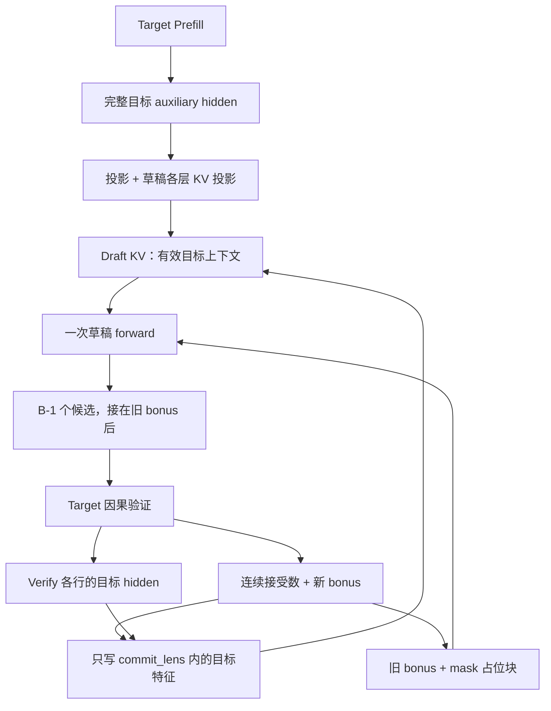
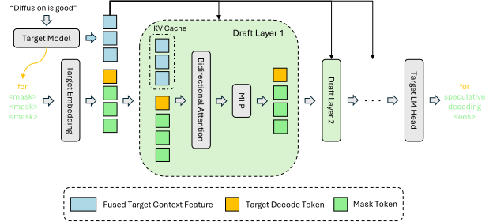
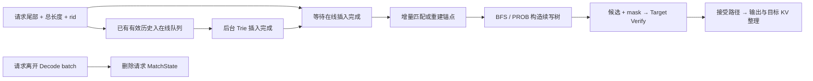
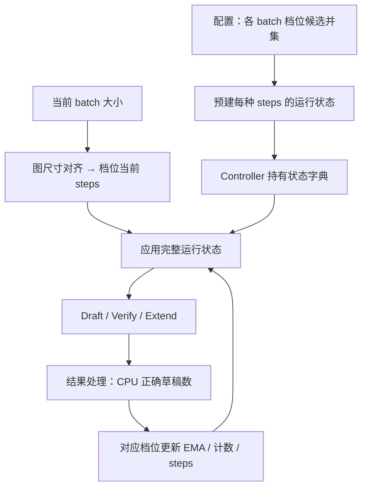

# DFlash、Ngram 与自适应投机

本文是 **08-05，源码分析型学习资料**。前两篇已经解释“先猜、再验、再提交”，本篇沿同一条请求比较两件事：**候选从哪里来，以及本轮值得猜多少。** 前者可以换成一次生成整块的 DFlash、查历史续写的 Ngram、独立小模型；后者由受支持路径上的自适应策略负责。

人话版：可以逐字拟稿，也可以一次填完几个空，或者查找以前出现过的相似句尾。但这些都只是草稿。目标模型仍然决定接受哪一段；“猜得多”和“跑得快”不是同一个指标。

## 0. 阅读基线与范围

| 项目 | 内容 |
| --- | --- |
| 源码仓库与路径基准 | 官方 `sgl-project/sglang`；所有源码路径相对于仓库根目录 `.` |
| 学习分支 | `codex/sglang-source-study-20260909`，基于已拉取的官方 `main` |
| 固定 commit | `72d5c5bb73cadd7ffbf5114e5f81e29d36b6c61a` |
| 读取日期 | `2026-09-10`；沿用 2026-09-09 固定基线 |
| 工作区 | `sglang-source-study` worktree 干净；原 `sglang` 的 `muxi-main` 与 26 个未跟踪文件保持原状 |
| 文档位置 | Wiki `sglang/source-study/08-advanced-generation/`，承接 EAGLE/MTP 与投机验证 |
| 贯穿主线 | 普通文本、代表 Dense 目标、单卡 CUDA、page_size=1、贪心；关闭 Overlap、grammar、模拟接受。用 L=8、验证宽度 B=5 的教学请求比较候选来源 |
| DFlash 选择 | `DFlashDraftModel`，无 selector、无 compact window、无特殊层类型；先读非图执行分支；B=5 仅用于账本，不指某个真实权重配置 |
| Ngram 选择 | 在线 Trie、BFS、固定宽度；外部 SAM 仅比较存储与预算边界 |
| 自适应选择 | 切回 EAGLE/EAGLE3、topk=1；分别增加 batch 档位、EMA 与预建运行状态 |
| 不展开 | DFlash 训练/selector 算法、所有 Attention 后端、外部语料 HTTP 管理、多卡同步、完整 Overlap 生命周期及质量/性能排名 |
| 操作与证据边界 | 只读源码和已有测试定义，编写文档与标准库教学检查；未导入 SGLang/torch，未编译 C++、运行单测、启动模型或进行 GPU/性能实验 |

前置：[08-03 Draft/Verify/Commit](03-投机解码的DraftVerifyCommit.md)、[08-04 EAGLE/MTP](04-EAGLE与MTP的源码主线.md)、[05-05 图执行](../05-model-execution/05-CUDAGraph编译与执行模式.md)。下文带锚点的是**源码事实**；字母 token、算例和图是**整理者归纳**；本次没有运行观察。

第一方背景：[DFlash: Block Diffusion for Flash Speculative Decoding](https://arxiv.org/abs/2602.06036v2)，Jian Chen、Yesheng Liang、Zhijian Liu，arXiv v2，2026-05-28，本次读取 2026-09-10。本文仅采用“利用目标上下文特征、单次 forward 并行产生草稿块”的算法背景；未复现论文训练和性能，也不把论文实现等同于当前 SGLang 的全部分支。

## 1. 候选来源与预算策略是两条轴

### 1.1 先认识四种方案

| 路径 | 候选从哪里来 | 额外持有什么 | 谁最终验证 |
| --- | --- | --- | --- |
| EAGLE/EAGLE3 | 目标特征与草稿模型递推 | 草稿权重、草稿 KV、recurrent hidden | Target |
| DFlash 代表路径 | 目标特征构造上下文，含 mask 的块一次 forward | 草稿权重、由目标特征投影的草稿 KV、块缓冲 | Target |
| Ngram | CPU 语料中的后缀匹配与续写树 | 在线 Trie、可选外部 SAM、请求匹配状态 | Target |
| STANDALONE | 自己的独立语言模型 | 自有 embedding/head、模型权重、草稿 KV | Target |
| 自适应策略 | 不产生 token；选择受支持 Worker 的 steps | 按 batch 档位的统计与预建运行状态 | 不改变 Target 的验证职责 |

Worker 分发见 [工厂][S2]，参数处理先完成别名和自适应准入，再进入算法钩子。[解析总线][S1]。**不能把“共享 SpecInput 接口”理解成“每个算法都能开启同一自适应功能”。**

### 1.2 本篇的四个问题

| 问题 | 要跟到哪里 |
| --- | --- |
| 谁决定候选内容 | DFlash 块预测、Ngram 查询、独立 draft 模型 |
| 数据保存在哪里 | 目标/草稿 KV、CPU 语料结构、请求 seed 和运行状态 |
| 何时成为下一轮可用状态 | 目标验证后对齐有效前缀，或语料插入完成，或运行状态已选中 |
| 何时可以丢弃 | 未接受候选不进入有效前缀；请求匹配状态、语料和 GPU KV 各按自己的生命周期处理 |

## 2. DFlash：先把目标特征变成草稿上下文

### 2.1 不是复制目标 KV，也不是普通 EAGLE 的逐步递推

DFlashWorkerV2 创建单独的草稿 Worker/Runner，读取 draft 配置与 block_size。无窗口主线复用请求映射和分配器，草稿仍有自己的 KV pool；compact window 使用私有映射视图，本篇不把它混入主线。[构造][S4] [分配][S5]

目标 Prefill 捕获所有相关 token 的 auxiliary hidden。Worker 随即调用 `_append_target_hidden_to_draft_kv_by_loc()`，将这些特征写成草稿上下文，再返回下一轮的 bonus 和长度。代码要求在 Prefill 返回前完成这一步，因为返回后 Scheduler 可能更新 Radix 状态。[总控 Prefill 分支][S8]

| 转换 | 输入与输出 | 负责对象 |
| --- | --- | --- |
| 特征投影 | 多层目标特征 → 草稿宽度，检查最后一维 | `DFlashDraftModel.project_target_hidden` [S9] |
| 每层 K/V 投影 | 草稿上下文向量 → 当前草稿层的 k/v | `DFlashAttention.kv_proj_only` [S10] |
| 位置与归一化 | k norm、k RoPE，整理 head 形状 | Worker 的 append 方法 [S11] |
| 物理写入 | 指定 cache_loc → 草稿 pool | 同上；不是目标层 K/V 的直接拷贝 |

可以理解为把目标已经理解过的上下文，翻译成草稿各层可读的 K/V。“来自目标特征”和“存的是目标 KV”是两回事。

### 2.2 一轮跨组件的数据图



**图意解读：** 方框是步骤和数据，不是独立进程。上方是 Prefill 的上下文投影，下方写回也经过投影，但 Decode 只写有效前缀。草稿的临时 mask 块状态不能直接作为正式上下文留到下一轮。[完整流程][S8] [前缀有效写入][S11]

### 2.3 状态字段与分配上界

`DFlashDraftInputV2` 携带 bonus_tokens、new_seq_lens 和用于分配/规划的长度信息；其中保留了一些兼容 EAGLE 形状的字段，不应按字段名推断 DFlash 也传递普通 EAGLE 的 recurrent 特征链。[输入对象][S6]

`prepare_for_decode()` 为下一轮预留 `2×block_size` 的空间，并按页处理。**预留上界、草稿 Attention 可见前缀、目标有效 KV 长度是三个数。** L=8、B=5、page_size=1 且原分配刚好为 8 时，教学预留边界可达 18；这不表示已经有 18 个有效 token。[分配准备][S7]

### 图解补充：草稿块怎样同时看到上下文与待填位置



[查看原尺寸](../../../images/sglang-source-study/28-dflash-design.svg)（手机查看宽图时可横屏或放大）。

**图意解读：** 蓝色块是目标上下文特征，黄色块是已知的目标 token，绿色块是待预测的 mask 位置。沿中间草稿层向右看，双向 Attention 在块内生成候选，再由输出头给出 token。

**对应本篇源码：** 对照 `models/dflash.py` 与 worker 的目标特征准备；下一节再追候选块怎样验证、截取并提交。 [源码：python/sglang/srt/models/dflash.py][S9]

**来源与边界：** [DFlash: Block Diffusion for Flash Speculative Decoding](https://arxiv.org/html/2602.06036v2)，Jian Chen、Yesheng Liang、Zhijian Liu，arXiv v2：2026-05-28。这是 DFlash 论文的草稿设计。图的右端不是“候选已全部提交”；验证、接受前缀和 KV 收尾还要走正文的 worker 链路，也不适用于 Ngram 候选来源。 [来源档案 F28](../../../images/sglang-source-study/SOURCES.md#f28)。

## 3. DFlash：一次填块，按连续前缀接受

### 3.1 B=5 时究竟输入了什么

沿用 R1：目标已有 prompt 的 8 个 KV，首输出 b0 已可见，但其目标 KV 尚待下一轮写入。

| 阶段 | 5 个位置的内容 | 位置 |
| --- | --- | --- |
| 草稿输入块 | `[b0,MASK,MASK,MASK,MASK]` | `[8,9,10,11,12]` |
| 草稿预测 | 取块内第 1—4 行的 hidden，经目标 LM head 得到 a/b/c/d | 这 4 行用于提出未来 token |
| 目标验证输入 | `[b0,a,b,c,d]` | 同样是 `[8,9,10,11,12]` |

Worker 构造 block_ids、embedding、positions 和 cache locations，调用一次 `draft_model_runner.forward()`。本篇无 selector 的非图路径把 hidden reshape 为 `[bs,B,H]`，取 `[:,1:,:]` 经 head 形成 B−1 个候选。[块构造与预测][S8] [草稿模型 forward][S13]

**mask 是草稿输入中的占位 token，不是请求输出，也不是 Grammar 的词表屏蔽位图。** block_size=5 包含旧 bonus 根，因此不是新增 5 个草稿 token。

### 3.2 草稿块与目标验证的 Attention 条件不同

代表 DFlash 配置没有 layer_types 时，草稿层使用 ENCODER_ONLY 类型；full/sliding 特例和显式 causality 另有分支。目标验证则按线性链的标准因果条件计算。[草稿 Attention 类型][S12] [目标 Verify 构造][S8]

人话版：草稿填空时可以利用块内的占位布局；目标审核第 j 个位置时，仍只依据合法前缀。不能把草稿的并行预测方式直接当作目标模型的自回归条件，也不能把“无 custom_mask”理解成目标完全没有因果约束。

### 3.3 接受 a/b，拒绝 c，为什么输出 a/b/z

设目标预测为 `[a,b,z,u,v]`。比较的是**候选从第 1 行开始**和**目标预测从第 0 行开始**：

| 比较位置 | 草稿后继 | 目标预测 | 连续接受判断 |
| --- | --- | --- | --- |
| 0 | a | a | 接受 |
| 1 | b | b | 接受 |
| 2 | c | z | 首次不一致，停止接受草稿 |
| 3 | d | u | 即使碰巧相等也不能跨过前面的拒绝继续提交 |

`compute_dflash_correct_drafts_and_bonus()` 用连续前缀规则得到 correct_len=2，bonus 取目标预测的第 2 行 z。`_commit_accept()` 左移候选并在接受边界写入 bonus；返回的 commit_lens=correct_len+1=3。[计数][S15] [构造输出][S16] [分支选择][S14]

| 账本 | 本轮结果 |
| --- | --- |
| 新增可见输出 | a/b/z，共 3 个 |
| 保留的目标验证输入 KV | b0/a/b，共 3 行 |
| 新目标有效长度 | 8+3=11 |
| 草稿上下文写回 | 目标 H_b0/H_a/H_b，经投影写到对应 3 个槽位 |
| 下一轮块根 | z；本轮还没有目标 z 的 KV |

`_append_target_hidden_to_draft_kv_by_loc()` 收到整个 B 行特征，但带 commit_lens 时使用 prefix-valid 写入：可计算多行投影，只写有效前缀。目标选择出正确 token 之后，还必须让草稿上下文与它一致。[写回][S11] [调用顺序][S8]

### 3.4 贪心、随机和实现回退要分开

`_accept_block()` 依次区分 selector 随机、普通非贪心验证可用、贪心分支。当前选读的候选主线并不自动启用 08-03 中 EAGLE 的完整 q 提议链。本篇只用贪心例子解释块对齐；随机分布证明需对应具体 sampler。[分支][S14]

非贪心验证在当前 build/device 不可用时，`_validate_phase1_sampling_support()` 可以发出警告并使用贪心 fallback。**请求带非零 temperature 不足以证明实际执行了随机验证。** 核对配置时要保存设备、实际采样分支和警告，不能把 fallback 当作相同采样语义。[检查][S17]

块准备、接受计数或 fused KV append 的部分优化失败时，代码还有关闭该优化并改走 eager/per-layer 的路径。这类实现回退与采样语义回退不同，记录时应写明具体分支。[总控][S8] [接受][S14] [KV append][S11]

## 4. Ngram：候选来自 CPU 语料结构

### 4.1 语料索引不是 KV 前缀缓存

NGRAMWorker 没有草稿模型，持有目标 Runner 和 CPU NgramCorpus。后者通过当前 kernel 路径加载 C++ 实现，内部在线 Trie 记录 token 片段、频次和近期使用关系；它不保存目标每层的 K/V。[Worker][S19] [绑定入口][S60] [Trie 插入][S72]

| 对象 | 保存什么 | 生命周期由谁管理 |
| --- | --- | --- |
| 在线 Trie | 请求 token 片段及续写关系 | 后台插入、容量淘汰、reset |
| 请求 MatchState | 某个 rid 的后缀匹配锚点、处理长度、版本 | 请求匹配增量更新，离开 Decode batch 后清理 |
| 可选外部 SAM | 外部语料的后缀自动机索引 | 显式加载/发布/删除，独立于在线 Trie |
| 目标 KV pool | 目标模型的层状态 | 请求和缓存生命周期，见阶段 04 |
| NgramVerifyInput | 本轮候选、树 mask、retrieve、长度 | Worker 与结果处理之间的交接对象 |

这里的 SAM 是 suffix automaton，即用于匹配字符串/token 后缀的结构，不是草稿神经网络。语料匹配命中只意味着找到可试的后继，不会让目标跳过验证，也不等于 Radix KV 命中。

### 4.2 一次查找经过哪些步骤

`_prepare_draft_tokens()` 取每请求 input/output 的末尾，最多保留 max_trie_depth 个 token，然后调用 corpus.synchronize() 与 batch_get。同步主线中 output_ids 已含上一轮有效输出；Overlap 主线才需要从 spec_info 接上尚未进入 output_ids 的尾部，Grammar 同步又另有条件。[查询准备][S20]

Python `NgramCorpus.batch_get()` 将 rid 映射成稳定 state_id，传入尾部和总长度。C++ `Trie::match()` 检查长度前进、epoch 和 anchor 状态，能安全增量推进就复用，否则重建匹配状态。[Python 映射][S24] [C++ 匹配][S73]

这解释了为什么“只传相同的末尾文本”仍不足以描述状态：总长度与节点是否已因淘汰失效也影响复用。不能保留旧节点地址就默认下一轮还有效。



**图意解读：** 这是 Ngram Worker 与 CPU 语料的交接图。队列中的历史必须先完成插入才能被下一次查询看见；本轮新目标预测不会因为 Verify 已返回，就自动出现在当前 req.output_ids 中。结果处理和后续查询按各自时序衔接。[查询][S20] [语料更新][S23] [总控][S22]

### 4.3 BFS 与 PROB 不对应目标模型概率

C++ batchMatch 将 BFS 分发到 buildRecency，按近期子节点关系与广度展开；PROB 分发到 buildFrequency，使用语料中的子节点频次形成搜索优先级。[分发][S69] [近期展开][S74] [频次展开][S75]

例如语料中曾有 `[A,B,C,D]` 和 `[A,B,E,F]`，当前尾部为 `[A,B]`，可以提出 B 后的 C/E 及后续 D/F。它们只是历史续写。具体顺序还受插入顺序、频次、广度、预算和重合分支影响，本例不伪造一次真实查询返回值。

### 4.4 根节点、固定宽度与未命中

普通参数把非根预算设为 draft_token_num−1；fillResult 将当前尾部最后 token 放在根，并生成祖先 mask。候选不足时按固定长度补 0。[非根预算][S77] [结果构造][S76]

假设真实续写只有 C/D，而验证宽度 B=5，教学布局可写为 `[B,C,D,0,0]`。有效树分支是 B→C→D；补位对应根的附加子节点。**源码没有因为未命中就自动缩成一次普通 Decode**，Worker 仍要求 bs×B 的候选尺寸并执行 Verify。[固定尺寸检查][S20] [验证准备][S21]

不能把补位 0 当作 EOS，也不能声称它永远不会被目标接受：0 仍是一个数值 token ID，是否被选择要看目标验证。它首先表达的是“语料树没有填满候选预算”，不是目标生成语义。

### 4.5 目标验证与语料更新各更新什么

`_prepare_for_speculative_decoding()` 只转换 Decode batch：拷贝候选/mask，重建 positions/retrieve 索引，设置 TARGET_VERIFY 与目标 out_cache_loc。Prefill/IDLE 不由这个方法强行改成 Verify。[准备][S21]

目标验证后仍使用 eagle_sample，按接受索引整理 token 与 KV；accept_lens 含 bonus，而 KV mover 收到的是 accept_lens−1。随后 Worker 提交当前可见历史的语料插入，返回 next_draft_input。[总控][S22]

同步主线在该 Worker 返回前，尚未由 Scheduler 将本轮新输出追加到 req.output_ids；因此 `_update_ngram_corpus()` 消费的是已有有效历史，不是刚生成的全部候选。Overlap 则按已暂存的上一轮有效输出补尾，不能再重复拼接一次。[语料更新][S23]

`synchronize()` 等待 pending_count=0；后台线程是在 Trie 插入完成后才减计数。这比“队列已被取空”更强：出队但仍在插入的项也要等。[等待条件][S70] [后台完成点][S71]

### 4.6 三类清理不要合并成一个动作

| 动作 | 本基线做什么 | 不代表什么 |
| --- | --- | --- |
| 请求离开 Decode batch | 比较前后 rid 集合，erase_match_state | 不清空共享语料，也不据此证明 GPU KV 已释放 |
| 在线 reset | 清空在线 Trie/匹配状态；Python 映射重置 | 不删除用户管理的外部 SAM |
| 删除外部 corpus_id | 删除对应 SAM，并扣回已加载 token 账本 | 不删除其他语料，也不改变已生成的请求输出 |

依据：[离开 batch][S22] [请求状态删除][S25] [Python reset][S26] [C++ reset 保留 SAM][S78] [删除语料][S29]。最后一批匹配状态可在空闲期间暂留，源码注释明确没有依赖当时尚未更新的 req.finished() 来判断离开。

外部语料加载先构建索引，再在同步完成/后台 join 后提交 Python 计数；外部 SAM 候选预算独立于在线 Trie 容量。多个 SAM 平分外部非根预算，整数余量归在线 Trie，合并共享根。[加载][S27] [计数提交][S28] [预算合并][S69]

例如 B=9、非根总预算 8、外部预算 5、两个 SAM，各得 2，在线 Trie 得 4。共享分支合并可能使实际不同候选少于预算；不能用“分到了 8 个预算”证明生成了 8 条不同续写。

## 5. STANDALONE：用独立小模型沿共享执行链拟稿

StandaloneWorkerV2 构造自己的 StandaloneDraftWorker，继承 EAGLE Worker 的主要调度/验证交接。它不共享 target embedding 和 LM head，目标 Prefill 与草稿刷新选择 NULL hidden capture，递推 hidden 配置也允许为空。[构造][S30] [head 覆盖][S31] [目标分支][S33] [草稿 Prefill][S79] [无 hidden 配置][S34]

人话版：这个草稿自己读 token、自己维护语言模型状态，而不是接收目标层的中间特征。共享 Worker 代码有助于复用布局和生命周期，不会使它变成 EAGLE 特征模型。

词表检查先比 vocab_size；当两个 tokenizer 都可用且有 get_vocab() 时，再比 token→ID 映射。**相同词表大小不等于同一 token ID 的含义相同。** tokenizer 缺失时不会凭空完成这项映射核验。[兼容检查][S32]

本基线 Standalone 构造把 adaptive_controller 置空；全局自适应准入也只允许 EAGLE/EAGLE3。不要因为它继承某些方法就宣布支持自适应。[构造][S30] [准入][S35]

## 6. 自适应先按 batch 选择统计档位

### 6.1 先判断能否开启

`handle_speculative_decoding()` 完成算法别名解析后，调用 `_maybe_disable_adaptive()`；不满足条件时发警告，并把 speculative_adaptive 解析为 false，再使用静态参数。满足条件才初始化候选 steps。[总线][S1] [关闭条件][S35] [回退行为][S36]

| 检查项 | 当前处理 |
| --- | --- |
| 最终算法不是 EAGLE/EAGLE3 | 关闭自适应；普通 NEXTN 先解析成 EAGLE，Frozen 特例不算 |
| topk 明确给成非 1 | 关闭自适应 |
| DP Attention | 关闭；该处说明档位决策未跨 DP 同步 |
| multi_layer_eagle | 关闭；该 Worker 未实现 adaptive |
| two_batch_overlap | 关闭；状态替换会丢弃对应 backend wrapper |
| pdmux | 关闭；状态替换未更新相应 backend group |

这些是本地解析条件，不是剩余任意组合的测试认证。尤其 two_batch_overlap 与一般 Overlap 调度不是同一个开关，本篇不外推成“所有 Overlap 都禁止”。

配置文件 candidate_steps 必须是非空、非负整数列表；有效档位 key 是整数字符串。全局候选为各档位集合的并集。显式启动 steps 不在并集时会报错；未给 steps 时取并集中间元素，topk 缺省补 1，初始验证宽度为 steps+1。[配置读取][S38] [并集][S39] [初值解析][S37]

### 6.2 默认档位是按负载分组的独立统计

| 档位下界 | 默认 candidate_steps | 人话解释 |
| ---: | --- | --- |
| 1 | `[1,3,5,7]` | 小 batch 可在较多草稿步数之间选择 |
| 8 | `[0,1,3]` | 较大 batch 也可暂时停止猜测 |
| 32 | `[0,1]` | 只在少量草稿和零草稿之间选择 |
| 64 | `[0]` | 此档位固定零步，不能探测不存在的正步候选 |

这是固定源码默认值，不是本次硬件的调优建议。[默认配置][S80]

每个档位持有自己的 current_steps、ema_accept_len、batch_count。若启动 steps 不在某个档位的局部集合中，该档位取自己排序去重后集合的中间元素；不是给所有档位强塞同一个 steps。[档位初始化][S40]

### 6.3 名叫 closest，实际是向下找档位

路由顺序是：**实际 batch_size → 可用图尺寸向上对齐 → 找最大的不超过它的档位下界**。没有图尺寸列表则跳过第一步；超过最大图尺寸时保留实际 batch_size。[路由][S43] [图尺寸对齐][S44] [档位选择][S45]

假设图尺寸为 `[4,8,16,32]`：

| 实际 batch_size | 对齐后 | 选中档位 | 对应候选 |
| ---: | ---: | ---: | --- |
| 5 | 8 | 8 | 0/1/3 |
| 17 | 32 | 32 | 0/1 |
| 100 | 100 | 64 | 0 |
| 5，无图尺寸列表 | 5 | 1 | 1/3/5/7 |

因此，同样 5 个请求在不同图配置下可能进入不同统计档位。不能按数学上的“离 5 最近是哪个 key”解释 `_find_closest_bs()`。

## 7. 接受反馈如何改变 steps

### 7.1 用的是接受草稿数，不含 bonus

结果处理在 accept_lens 已到 CPU 后，减去 num_non_draft_tokens_per_req 得到 num_correct_drafts_per_req_cpu，并把列表和该 batch 的请求数交给 Worker。普通 EAGLE 每请求非草稿量为 1，即 bonus。[CPU 反馈入口][S56] [Worker 转发][S55]

例如两请求 accept_lens=[3,1]，反馈为正确草稿数 `[2,0]`，平均 1；不能直接平均为 2，也不能使用经过字符串停止裁剪后的展示文本长度。反馈调用位于后续逐请求提交/停止处理之前，统计对象是该次验证的接受结果。

### 7.2 EMA、预热和检查间隔各管一件事

EMA 是指数移动平均：新统计保留一部分旧值，再加入本批正确草稿数的平均。当前 steps>0 时：

```text
batch_avg = 本批正确草稿数之和 / 本批请求数
ema_new = (1 - alpha) × ema_old + alpha × batch_avg
```

默认 alpha=0.2、warmup_batches=10、update_interval=5，EMA 初值为 current_steps−1。非空反馈更新计数；前 10 批只积累，第 15 个非空反馈才首次满足重算时间点。空列表既不更新 EMA，也不消耗预热批数。[初始化][S40] [反馈更新][S41]

教学算例：current_steps=3 时初始 EMA=2；反馈 `[2,0]`，batch_avg=1，新 EMA=0.8×2+0.2×1=1.8。**EMA 变化不等于此刻 steps 已切换**，还要满足时间门和候选阈值。

### 7.3 实际重算不是简单 round(EMA)+1

类说明中有简化公式，但固定实现以候选档位阈值循环移动。阅读结论应以 `_recompute_params()` 的实际分支为准。[重算][S42]

| 条件 | 当前规则 |
| --- | --- |
| 向下移动 | EMA≤前一候选−0.5+down_hysteresis；前一候选为 0 时，基础阈值改为 0.5 |
| 向上移动 | 本次没有先降档，且 EMA>当前候选−0.5+up_hysteresis |
| 是否一次只移一档 | 否；循环可跨多个候选 |
| ceiling_coeff>0 | 根据 EMA 形成上限，但只约束不高于旧 steps 的选择，不阻止探索性升档 |
| 已在 steps=0 | 到重算时间点尝试下一个候选；没有正候选则保持 0 |

上升是严格 `>`，下降是 `≤`。例如候选 `[1,3,7]`、当前 3、up_hysteresis=0：EMA=2.5 不升档，EMA=3 可以升至 7。这与“把 3 四舍五入再加 1”明显不同。[阈值测试定义][S65]

### 7.4 零步间隔为什么还会再探测

取一个**教学配置**：候选 `[0,3]`、alpha=1、warmup=0、interval=1、down_hysteresis=0。

| 轮次 | 进入时 steps | 正确草稿数反馈 | EMA 如何处理 | 下一选择 |
| --- | ---: | --- | --- | ---: |
| 1 | 3 | `[0,0]` | 更新为 0，满足下降阈值 | 0 |
| 2 | 0 | `[0,0]` | 不用零步反馈覆盖历史 EMA | 探测 3 |
| 3 | 3 | `[0,0]` | 仍为 0，再降档 | 0 |

零步没有实际草稿，不应把“接受 0 个草稿”当成又一次模型质量变差的测量。若档位初始即为 0，其 EMA=-1；第一次进入正步探测时会改成该正步的中性初值。[零步分支][S42] [测试定义][S64]

这是一种成本/接受情况的启发式，不直接测量 TTFT、TPOT 或 tokens/s，也不保证找到全局最快配置。需要实测比较时，仍应保留第 00 阶段的完整指标账本。

## 8. 切换的不只是一个整数

### 8.1 每种候选预先建立一套运行状态

`SpecRuntimeState` 同时保存 steps、验证宽度、draft/target Attention backend、各阶段图执行器，以及可选 Draft Extend 资源。AdaptiveController 持有按 steps 索引的状态字典，初始化时补齐所有候选状态。[状态对象][S48] [预建][S49]



**图意解读：** 这是同步主线的职责图，不是跨 CUDA stream 的完成证明。策略负责选哪个 steps，Worker 负责让配套资源一致。异步执行时谁仍持有旧状态、何时允许复用，在 08-06 再追踪，不能把 Python 的字段赋值称作 GPU 全局栅栏。

Worker 建立状态时创建相应 backend，并按图配置捕获执行器；apply_runtime_state 同步更改外层参数、草稿侧 backend/graph/链缓冲、目标侧 backend/graph 与运行配置视图。[构建][S53] [应用][S54]

不同步骤不必捕获所有 batch 图：`cuda_graph_bs_for_step()` 只保留能路由到该候选的图尺寸。本篇列表 `[4,8,16,32]` 下，step=7 仅需要图尺寸 4，step=3 对应 4/8/16。[裁剪][S46]

### 8.2 当前用少量 steps，不表示只分配少量资源

候选状态预建并被 Controller 字典持有；切换时取已有对象，未见在每次降档时自动销毁其他状态。当前 steps=1 不代表高 steps 的图缓冲已经释放。[预建][S49] [选择][S52]

`resolve_max_speculative_num_draft_tokens()` 在自适应开启时返回候选最大 steps+1，用于按最大可能宽度准备资源。默认候选并集 `[0,1,3,5,7]` 的最大验证宽度是 8，和某个时刻当前宽度要分开记录。[最大预算][S59]

### 8.3 反馈后的切换与当前 batch 的选择

EAGLE 的 Decode 入口先按当前 batch_size 激活档位；CPU 验证反馈也可能更新某个档位并应用新状态。二者分别经过 `activate_step_by_batch()` 与 `on_verify_complete()`。[运行入口][S33] [按 batch 选择][S50] [反馈策略][S47] [反馈切换][S51]

缺少目标 steps 的预建状态时 `_activate()` 明确报错。只更改 speculative_num_steps，未建立同宽度 graph、Attention 和输出布局，不能算实现了合法切换。[缺失保护][S52]

### 8.4 steps=0 仍经过单节点 Verify，默认仍刷新草稿

steps=0 时 EAGLE 跳过普通 draft，构造仅含旧 bonus 的 EagleVerifyInput，宽度为 1；目标计算这个 token，采样新的 bonus。外部输出效果相当于一次普通自回归推进，但仍走该单节点 Verify 接口。[零步输入][S57]

默认随后仍执行 Draft Extend，让草稿 KV 与状态跟上目标，便于负载下降后重新开始猜测。实验开关 `SGLANG_SPEC_SKIP_ZERO_STEP_DRAFT_EXTEND` 可以改为形状合法的零值 stub，源码注明重新升到正步时会从陈旧状态恢复；这不是“零成本且无恢复代价”的默认路径。[执行分支][S33] [stub 边界][S58]

## 9. 配置与排障地图

### 9.1 不同算法的参数同名，不代表同一含义

| 条件 | 固定源码行为 | 依据 |
| --- | --- | --- |
| DFlash steps/topk 非 1 | 警告并改成 1；真正窗口量是 block_size | [专用钩子][S3] |
| DFlash 两个显式宽度值不一致 | block_size 与 num_draft_tokens 冲突时报错 | [专用钩子][S3] |
| DFlash 未给宽度 | 尝试从 draft config 解析，未取得则回退 16 | [专用钩子][S3]；不把 16 当所有模型最佳值 |
| DFlash CPU、DP Attention 或 pp_size≠1 | 专用钩子拒绝；该处只接 CUDA/NPU 条件 | [专用钩子][S3]；平台全链支持另核 |
| DFlash draft window<B | 拒绝 | [专用钩子][S3] |
| Ngram CPU | 关闭 Overlap 调度；仍需目标模型与原生语料依赖 | [钩子][S18] [FFI][S60] |
| Ngram 混合 chunk | 关闭 mixed chunk；不等于完全禁止 Chunked Prefill | [钩子][S18] |
| Ngram topk>1、page_size>1、backend 非 flashinfer | 明确拒绝该组合 | [钩子][S18] |
| Ngram 外部路径已给 | 要求外部 token 上限/候选预算为正，候选预算≤B−1 | [钩子][S18] |
| Ngram DP Attention | 明确拒绝 | [钩子][S18] |
| 不支持算法 + adaptive | 警告后关闭自适应，继续静态参数路径 | [准入][S35] [处理][S36] |

此表只记录局部检查，没有启动服务验证这些组合。Ngram 的 BFS 广度、DFlash 的 B 和 EAGLE 的 steps 应分别解释，不应复制一组参数到所有算法。

### 9.2 从现象反查对象

| 现象 | 先查什么 | 对应入口 | 不能先认定 |
| --- | --- | --- | --- |
| DFlash 首次 Prefill 后失败 | target hidden 是否存在，捕获维度是否匹配 | [Prefill][S8] [投影][S9] | 不先通过改 B 来掩盖特征不匹配 |
| 块尾拒绝后下一轮异常 | commit_lens、有效特征行、草稿 KV 写入位置 | [写回][S11] | 接受 token 正确不代表草稿上下文已正确 |
| 非零温度却像贪心 | device/build、warning、实际 accept 分支 | [检查][S17] [选择][S14] | 参数非零不是采样路径证据 |
| Ngram 候选大多为 0 | 在线语料是否插入完成、后缀/总长度、预算 | [等待][S70] [匹配][S73] [补位][S76] | 0 不是必然的模型 EOS |
| 新插入内容暂不可见 | pending_count 和后台插入完成点 | [等待][S70] [线程][S71] | 队列为空不等于写入完成 |
| Ngram flush 后外部语料仍在 | reset 范围、显式 corpus 删除接口 | [reset][S78] [删除][S29] | 不应把持久外部语料当泄漏 |
| 相同请求数选了不同 steps | 图尺寸列表、floor 档位、该档位历史 | [路由][S43] | 不是只由请求数唯一决定 |
| 接受统计变化但 steps 未变 | warmup、interval、严格阈值、候选集合 | [更新][S41] [重算][S42] | 不能直接判定控制器失效 |
| steps=0 仍见草稿开销 | 默认 Draft Extend、持有的图状态 | [零步分支][S33] [状态][S48] | 零步不等于卸载草稿模型 |
| 步数切换时布局不匹配 | 当前 backend/graph/宽度/链缓冲是否同一状态 | [应用][S54] | 只打印 steps 正确不足以定位 |

## 10. 源码阅读路线与本次验证

### 10.1 先沿一轮，再回到策略

1. `python/sglang/srt/arg_groups/speculative_hook.py::handle_speculative_decoding` [S1]：看别名、自适应准入与算法钩子顺序。
2. `python/sglang/srt/speculative/dflash_worker_v2.py::DFlashWorkerV2.forward_batch_generation` [S8]：标出 Prefill KV 翻译、一次块预测、目标验证、有效特征写回。
3. `python/sglang/srt/speculative/ngram_worker.py::NGRAMWorker._prepare_draft_tokens` [S20]：用同一条请求，替换候选来源。
4. `python/sglang/kernels/jit/csrc/ngram_corpus/ngram.cpp` 的 batchMatch [S69] 与 `trie.cpp` 的 match [S73]：分清统计语料、请求匹配状态和候选树。
5. `python/sglang/srt/speculative/adaptive_spec_params.py::AdaptiveStepSlot.update` [S41] 与 `_recompute_params` [S42]：手算正确草稿数、EMA 和阈值。
6. `python/sglang/srt/speculative/adaptive_runtime_state.py::AdaptiveController.init_states` [S49] → `python/sglang/srt/speculative/eagle_worker_v2.py::EAGLEWorkerV2.apply_runtime_state` [S54]：确认策略选择怎样落到实际资源。

### 10.2 已有测试入口与证据边界

| 已阅读的测试定义 | 检查内容 | 本次状态 |
| --- | --- | --- |
| TestDFlashServerBase.test_greedy_determinism [S61] | 同一服务重复请求输出相同且进程仍存活 | 只读；不是普通 Decode 与 DFlash 的质量等价证明 |
| TestNgramCorpusNoMatch.test_unmatched_query [S62] | 未命中时保留根、其余补 0 | 只读；没有编译/运行 C++ corpus |
| TestNgramCorpusIncremental.test_stale_state_rebuilds_after_eviction [S63] | 淘汰后增量查询与重建查询对照 | 只读；不能据此宣布全部并发清理安全 |
| TestAdaptiveStepSlot 的零步/阈值用例 [S64] [S65] | 降至 0、再探测，严格上升阈值 | 只读；不代表吞吐最优 |
| TestBatchSizeRouting.test_cuda_graph_bs_pads_batch_up_before_routing [S66] | 先按图尺寸向上取整，再选档位 | 只读；不是实际 CUDA graph 回放 |
| TestAdaptiveController 的注入策略用例 [S67] | 预建裁剪状态、应用初始状态 | 使用 fake 对象的测试定义，只读 |
| TestAdaptiveZeroStepBatchSizeServer.test_batch_size_step_cycle [S68] | 特定服务负载下 3→0→3 的转换及接受指标断言 | 只读；本次未启动该服务，未获得测试结果 |

本次实际检查：固定源码锚点、文档导航、候选/预测/KV 三张账、Ngram 固定宽度与 SAM 预算、EMA 算例、图尺寸路由和零步阈值。所有算例用标准库独立核算，不导入项目代码。Mermaid 按文字静态核对，未运行图像渲染器。

后续实验需分别记录 target/draft revision、B/steps/topk、候选来源、语料与缓存初始状态、实际 batch/图尺寸/档位、接受数口径、每阶段耗时及额外内存。只测平均接受长度，无法判断是否值得增加猜测预算。

## 11. 练习与阅读验收

### 11.1 自己推演

1. DFlash B=5、旧 bonus=b0、候选 a/b/c/d，目标预测 a/b/z/u/v：新增输出、保留 KV 输入、写回草稿的目标特征分别是什么？
2. Ngram 未命中后返回 `[last,0,0,0]`，是否意味着本轮完全没有目标验证？0 是否必然是 EOS？
3. B=9、外部 SAM 预算 5、两个 SAM，在线 Trie 和每个 SAM 各获得多少非根预算？
4. 默认档位、图尺寸 `[4,8,16,32]`，实际 batch=5 与 batch=17 分别进入哪个档位？
5. 当前 steps=3、EMA=2、alpha=0.2，接受长度 `[3,1]` 含 bonus。新的 EMA 是多少？是否马上改 steps？
6. 候选 `[1,3,7]`、当前 3、上升滞后量 0，EMA=2.5 和 3 有什么区别？
7. 为什么 steps=0 不代表草稿模型已卸载？为什么只改一个 steps 字段不够？

### 11.2 参考答案

1. 新输出 a/b/z；目标 KV 输入 b0/a/b；目标 H_b0/H_a/H_b 经草稿投影写回。三个量对应同一接受前缀，但存在一个 token 的错位。
2. 否，Worker 仍按固定宽度验证。0 是补位 token ID，不能未经 tokenizer 和验证逻辑核查就等同于 EOS。
3. 非根总预算 8，两个 SAM 各 2，在线 Trie 得 4；整数余量留给 Trie，最终不同节点数还受合并影响。
4. 5→图尺寸 8→档位 8；17→图尺寸 32→档位 32。没有图列表时 batch=5 会进档位 1。
5. 正确草稿数 `[2,0]`，平均 1，新 EMA=1.8。是否改 steps 还取决于预热、间隔、候选和阈值。
6. 2.5 恰好等于阈值，不升；3 严格大于阈值，可进入下一个候选 7，而不是凭空选择 4。
7. 默认仍维护 Draft Extend，Controller 还持有多种预建状态；steps、宽度、backend、graph 和链缓冲必须保持一致。

读完应能把“候选来源、验证条件、上下文写回、负载反馈、运行状态”五件事连成一轮，并指出各自的数据所有者与证据边界。

下一篇为 [08-06《投机中的 Overlap、KV 与组合约束》](06-投机中的OverlapKV与组合约束.md)：在这些算法主线上，继续追踪异步完成、输出暂存、资源复用及功能组合的具体条件。

[S1]: https://github.com/sgl-project/sglang/blob/72d5c5bb73cadd7ffbf5114e5f81e29d36b6c61a/python/sglang/srt/arg_groups/speculative_hook.py#L81
[S2]: https://github.com/sgl-project/sglang/blob/72d5c5bb73cadd7ffbf5114e5f81e29d36b6c61a/python/sglang/srt/speculative/spec_info.py#L301
[S3]: https://github.com/sgl-project/sglang/blob/72d5c5bb73cadd7ffbf5114e5f81e29d36b6c61a/python/sglang/srt/arg_groups/speculative_hook.py#L187
[S4]: https://github.com/sgl-project/sglang/blob/72d5c5bb73cadd7ffbf5114e5f81e29d36b6c61a/python/sglang/srt/speculative/dflash_worker_v2.py#L290
[S5]: https://github.com/sgl-project/sglang/blob/72d5c5bb73cadd7ffbf5114e5f81e29d36b6c61a/python/sglang/srt/speculative/dflash_worker_v2.py#L449
[S6]: https://github.com/sgl-project/sglang/blob/72d5c5bb73cadd7ffbf5114e5f81e29d36b6c61a/python/sglang/srt/speculative/dflash_info_v2.py#L36
[S7]: https://github.com/sgl-project/sglang/blob/72d5c5bb73cadd7ffbf5114e5f81e29d36b6c61a/python/sglang/srt/speculative/dflash_info_v2.py#L114
[S8]: https://github.com/sgl-project/sglang/blob/72d5c5bb73cadd7ffbf5114e5f81e29d36b6c61a/python/sglang/srt/speculative/dflash_worker_v2.py#L1889
[S9]: https://github.com/sgl-project/sglang/blob/72d5c5bb73cadd7ffbf5114e5f81e29d36b6c61a/python/sglang/srt/models/dflash.py#L662
[S10]: https://github.com/sgl-project/sglang/blob/72d5c5bb73cadd7ffbf5114e5f81e29d36b6c61a/python/sglang/srt/models/dflash.py#L319
[S11]: https://github.com/sgl-project/sglang/blob/72d5c5bb73cadd7ffbf5114e5f81e29d36b6c61a/python/sglang/srt/speculative/dflash_worker_v2.py#L1430
[S12]: https://github.com/sgl-project/sglang/blob/72d5c5bb73cadd7ffbf5114e5f81e29d36b6c61a/python/sglang/srt/models/dflash.py#L113
[S13]: https://github.com/sgl-project/sglang/blob/72d5c5bb73cadd7ffbf5114e5f81e29d36b6c61a/python/sglang/srt/models/dflash.py#L682
[S14]: https://github.com/sgl-project/sglang/blob/72d5c5bb73cadd7ffbf5114e5f81e29d36b6c61a/python/sglang/srt/speculative/dflash_worker_v2.py#L1761
[S15]: https://github.com/sgl-project/sglang/blob/72d5c5bb73cadd7ffbf5114e5f81e29d36b6c61a/python/sglang/srt/speculative/dflash_utils.py#L775
[S16]: https://github.com/sgl-project/sglang/blob/72d5c5bb73cadd7ffbf5114e5f81e29d36b6c61a/python/sglang/srt/speculative/dflash_worker_v2.py#L179
[S17]: https://github.com/sgl-project/sglang/blob/72d5c5bb73cadd7ffbf5114e5f81e29d36b6c61a/python/sglang/srt/speculative/dflash_worker_v2.py#L1844
[S18]: https://github.com/sgl-project/sglang/blob/72d5c5bb73cadd7ffbf5114e5f81e29d36b6c61a/python/sglang/srt/arg_groups/speculative_hook.py#L988
[S19]: https://github.com/sgl-project/sglang/blob/72d5c5bb73cadd7ffbf5114e5f81e29d36b6c61a/python/sglang/srt/speculative/ngram_worker.py#L84
[S20]: https://github.com/sgl-project/sglang/blob/72d5c5bb73cadd7ffbf5114e5f81e29d36b6c61a/python/sglang/srt/speculative/ngram_worker.py#L242
[S21]: https://github.com/sgl-project/sglang/blob/72d5c5bb73cadd7ffbf5114e5f81e29d36b6c61a/python/sglang/srt/speculative/ngram_worker.py#L314
[S22]: https://github.com/sgl-project/sglang/blob/72d5c5bb73cadd7ffbf5114e5f81e29d36b6c61a/python/sglang/srt/speculative/ngram_worker.py#L429
[S23]: https://github.com/sgl-project/sglang/blob/72d5c5bb73cadd7ffbf5114e5f81e29d36b6c61a/python/sglang/srt/speculative/ngram_worker.py#L403
[S24]: https://github.com/sgl-project/sglang/blob/72d5c5bb73cadd7ffbf5114e5f81e29d36b6c61a/python/sglang/srt/speculative/cpp_ngram/ngram_corpus.py#L100
[S25]: https://github.com/sgl-project/sglang/blob/72d5c5bb73cadd7ffbf5114e5f81e29d36b6c61a/python/sglang/srt/speculative/cpp_ngram/ngram_corpus.py#L109
[S26]: https://github.com/sgl-project/sglang/blob/72d5c5bb73cadd7ffbf5114e5f81e29d36b6c61a/python/sglang/srt/speculative/cpp_ngram/ngram_corpus.py#L95
[S27]: https://github.com/sgl-project/sglang/blob/72d5c5bb73cadd7ffbf5114e5f81e29d36b6c61a/python/sglang/srt/speculative/cpp_ngram/ngram_corpus.py#L62
[S28]: https://github.com/sgl-project/sglang/blob/72d5c5bb73cadd7ffbf5114e5f81e29d36b6c61a/python/sglang/srt/speculative/cpp_ngram/ngram_corpus.py#L81
[S29]: https://github.com/sgl-project/sglang/blob/72d5c5bb73cadd7ffbf5114e5f81e29d36b6c61a/python/sglang/srt/speculative/cpp_ngram/ngram_corpus.py#L87
[S30]: https://github.com/sgl-project/sglang/blob/72d5c5bb73cadd7ffbf5114e5f81e29d36b6c61a/python/sglang/srt/speculative/standalone_worker_v2.py#L154
[S31]: https://github.com/sgl-project/sglang/blob/72d5c5bb73cadd7ffbf5114e5f81e29d36b6c61a/python/sglang/srt/speculative/standalone_worker_v2.py#L146
[S32]: https://github.com/sgl-project/sglang/blob/72d5c5bb73cadd7ffbf5114e5f81e29d36b6c61a/python/sglang/srt/speculative/standalone_worker_v2.py#L202
[S33]: https://github.com/sgl-project/sglang/blob/72d5c5bb73cadd7ffbf5114e5f81e29d36b6c61a/python/sglang/srt/speculative/eagle_worker_v2.py#L1263
[S34]: https://github.com/sgl-project/sglang/blob/72d5c5bb73cadd7ffbf5114e5f81e29d36b6c61a/python/sglang/srt/speculative/eagle_utils.py#L487
[S35]: https://github.com/sgl-project/sglang/blob/72d5c5bb73cadd7ffbf5114e5f81e29d36b6c61a/python/sglang/srt/speculative/adaptive_spec_params.py#L54
[S36]: https://github.com/sgl-project/sglang/blob/72d5c5bb73cadd7ffbf5114e5f81e29d36b6c61a/python/sglang/srt/arg_groups/speculative_hook.py#L1077
[S37]: https://github.com/sgl-project/sglang/blob/72d5c5bb73cadd7ffbf5114e5f81e29d36b6c61a/python/sglang/srt/arg_groups/speculative_hook.py#L1095
[S38]: https://github.com/sgl-project/sglang/blob/72d5c5bb73cadd7ffbf5114e5f81e29d36b6c61a/python/sglang/srt/speculative/adaptive_spec_params.py#L92
[S39]: https://github.com/sgl-project/sglang/blob/72d5c5bb73cadd7ffbf5114e5f81e29d36b6c61a/python/sglang/srt/speculative/adaptive_spec_params.py#L131
[S40]: https://github.com/sgl-project/sglang/blob/72d5c5bb73cadd7ffbf5114e5f81e29d36b6c61a/python/sglang/srt/speculative/adaptive_spec_params.py#L155
[S41]: https://github.com/sgl-project/sglang/blob/72d5c5bb73cadd7ffbf5114e5f81e29d36b6c61a/python/sglang/srt/speculative/adaptive_spec_params.py#L176
[S42]: https://github.com/sgl-project/sglang/blob/72d5c5bb73cadd7ffbf5114e5f81e29d36b6c61a/python/sglang/srt/speculative/adaptive_spec_params.py#L202
[S43]: https://github.com/sgl-project/sglang/blob/72d5c5bb73cadd7ffbf5114e5f81e29d36b6c61a/python/sglang/srt/speculative/adaptive_spec_params.py#L331
[S44]: https://github.com/sgl-project/sglang/blob/72d5c5bb73cadd7ffbf5114e5f81e29d36b6c61a/python/sglang/srt/speculative/adaptive_spec_params.py#L337
[S45]: https://github.com/sgl-project/sglang/blob/72d5c5bb73cadd7ffbf5114e5f81e29d36b6c61a/python/sglang/srt/speculative/adaptive_spec_params.py#L345
[S46]: https://github.com/sgl-project/sglang/blob/72d5c5bb73cadd7ffbf5114e5f81e29d36b6c61a/python/sglang/srt/speculative/adaptive_spec_params.py#L317
[S47]: https://github.com/sgl-project/sglang/blob/72d5c5bb73cadd7ffbf5114e5f81e29d36b6c61a/python/sglang/srt/speculative/adaptive_spec_params.py#L305
[S48]: https://github.com/sgl-project/sglang/blob/72d5c5bb73cadd7ffbf5114e5f81e29d36b6c61a/python/sglang/srt/speculative/adaptive_runtime_state.py#L11
[S49]: https://github.com/sgl-project/sglang/blob/72d5c5bb73cadd7ffbf5114e5f81e29d36b6c61a/python/sglang/srt/speculative/adaptive_runtime_state.py#L103
[S50]: https://github.com/sgl-project/sglang/blob/72d5c5bb73cadd7ffbf5114e5f81e29d36b6c61a/python/sglang/srt/speculative/adaptive_runtime_state.py#L122
[S51]: https://github.com/sgl-project/sglang/blob/72d5c5bb73cadd7ffbf5114e5f81e29d36b6c61a/python/sglang/srt/speculative/adaptive_runtime_state.py#L127
[S52]: https://github.com/sgl-project/sglang/blob/72d5c5bb73cadd7ffbf5114e5f81e29d36b6c61a/python/sglang/srt/speculative/adaptive_runtime_state.py#L137
[S53]: https://github.com/sgl-project/sglang/blob/72d5c5bb73cadd7ffbf5114e5f81e29d36b6c61a/python/sglang/srt/speculative/eagle_worker_v2.py#L1470
[S54]: https://github.com/sgl-project/sglang/blob/72d5c5bb73cadd7ffbf5114e5f81e29d36b6c61a/python/sglang/srt/speculative/eagle_worker_v2.py#L1548
[S55]: https://github.com/sgl-project/sglang/blob/72d5c5bb73cadd7ffbf5114e5f81e29d36b6c61a/python/sglang/srt/speculative/eagle_worker_v2.py#L1456
[S56]: https://github.com/sgl-project/sglang/blob/72d5c5bb73cadd7ffbf5114e5f81e29d36b6c61a/python/sglang/srt/managers/scheduler_components/batch_result_processor.py#L713
[S57]: https://github.com/sgl-project/sglang/blob/72d5c5bb73cadd7ffbf5114e5f81e29d36b6c61a/python/sglang/srt/speculative/eagle_worker_v2.py#L1371
[S58]: https://github.com/sgl-project/sglang/blob/72d5c5bb73cadd7ffbf5114e5f81e29d36b6c61a/python/sglang/srt/speculative/eagle_worker_v2.py#L1426
[S59]: https://github.com/sgl-project/sglang/blob/72d5c5bb73cadd7ffbf5114e5f81e29d36b6c61a/python/sglang/srt/speculative/spec_info.py#L252
[S60]: https://github.com/sgl-project/sglang/blob/72d5c5bb73cadd7ffbf5114e5f81e29d36b6c61a/python/sglang/kernels/ops/speculative/ngram_corpus.py#L27
[S61]: https://github.com/sgl-project/sglang/blob/72d5c5bb73cadd7ffbf5114e5f81e29d36b6c61a/test/registered/spec/dflash/test_dflash.py#L126
[S62]: https://github.com/sgl-project/sglang/blob/72d5c5bb73cadd7ffbf5114e5f81e29d36b6c61a/test/registered/unit/spec/test_ngram_corpus.py#L203
[S63]: https://github.com/sgl-project/sglang/blob/72d5c5bb73cadd7ffbf5114e5f81e29d36b6c61a/test/registered/unit/spec/test_ngram_corpus.py#L555
[S64]: https://github.com/sgl-project/sglang/blob/72d5c5bb73cadd7ffbf5114e5f81e29d36b6c61a/test/registered/unit/spec/test_adaptive_spec_params.py#L202
[S65]: https://github.com/sgl-project/sglang/blob/72d5c5bb73cadd7ffbf5114e5f81e29d36b6c61a/test/registered/unit/spec/test_adaptive_spec_params.py#L101
[S66]: https://github.com/sgl-project/sglang/blob/72d5c5bb73cadd7ffbf5114e5f81e29d36b6c61a/test/registered/unit/spec/test_adaptive_spec_params.py#L360
[S67]: https://github.com/sgl-project/sglang/blob/72d5c5bb73cadd7ffbf5114e5f81e29d36b6c61a/test/registered/unit/spec/test_adaptive_runtime_state.py#L71
[S68]: https://github.com/sgl-project/sglang/blob/72d5c5bb73cadd7ffbf5114e5f81e29d36b6c61a/test/registered/spec/eagle/test_adaptive_speculative.py#L272
[S69]: https://github.com/sgl-project/sglang/blob/72d5c5bb73cadd7ffbf5114e5f81e29d36b6c61a/python/sglang/kernels/jit/csrc/ngram_corpus/ngram.cpp#L144
[S70]: https://github.com/sgl-project/sglang/blob/72d5c5bb73cadd7ffbf5114e5f81e29d36b6c61a/python/sglang/kernels/jit/csrc/ngram_corpus/ngram.cpp#L53
[S71]: https://github.com/sgl-project/sglang/blob/72d5c5bb73cadd7ffbf5114e5f81e29d36b6c61a/python/sglang/kernels/jit/csrc/ngram_corpus/ngram.cpp#L130
[S72]: https://github.com/sgl-project/sglang/blob/72d5c5bb73cadd7ffbf5114e5f81e29d36b6c61a/python/sglang/kernels/jit/csrc/ngram_corpus/trie.cpp#L23
[S73]: https://github.com/sgl-project/sglang/blob/72d5c5bb73cadd7ffbf5114e5f81e29d36b6c61a/python/sglang/kernels/jit/csrc/ngram_corpus/trie.cpp#L205
[S74]: https://github.com/sgl-project/sglang/blob/72d5c5bb73cadd7ffbf5114e5f81e29d36b6c61a/python/sglang/kernels/jit/csrc/ngram_corpus/trie.cpp#L220
[S75]: https://github.com/sgl-project/sglang/blob/72d5c5bb73cadd7ffbf5114e5f81e29d36b6c61a/python/sglang/kernels/jit/csrc/ngram_corpus/trie.cpp#L266
[S76]: https://github.com/sgl-project/sglang/blob/72d5c5bb73cadd7ffbf5114e5f81e29d36b6c61a/python/sglang/kernels/jit/csrc/ngram_corpus/result.cpp#L12
[S77]: https://github.com/sgl-project/sglang/blob/72d5c5bb73cadd7ffbf5114e5f81e29d36b6c61a/python/sglang/kernels/jit/csrc/ngram_corpus/param.h#L30
[S78]: https://github.com/sgl-project/sglang/blob/72d5c5bb73cadd7ffbf5114e5f81e29d36b6c61a/python/sglang/kernels/jit/csrc/ngram_corpus/ngram.h#L73
[S79]: https://github.com/sgl-project/sglang/blob/72d5c5bb73cadd7ffbf5114e5f81e29d36b6c61a/python/sglang/srt/speculative/eagle_worker_v2.py#L866
[S80]: https://github.com/sgl-project/sglang/blob/72d5c5bb73cadd7ffbf5114e5f81e29d36b6c61a/python/sglang/srt/speculative/adaptive_spec_params.py#L26
