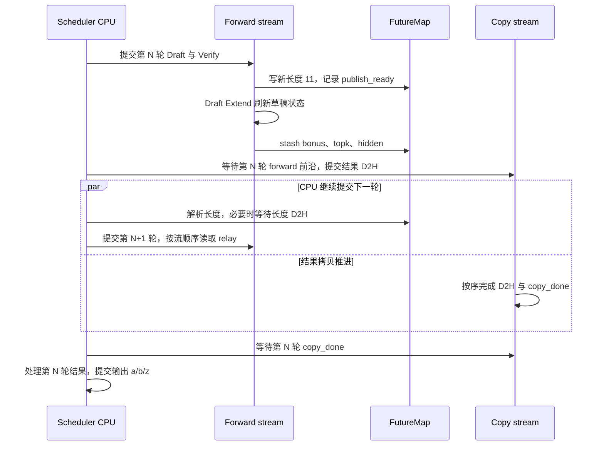
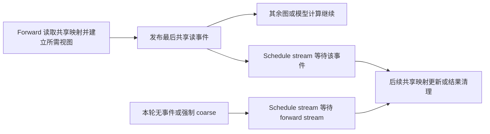
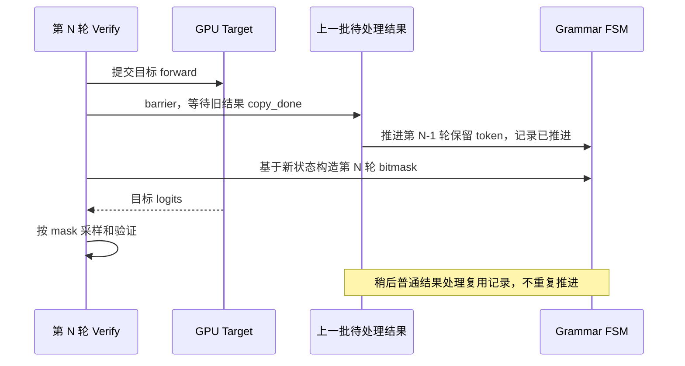

# 投机中的 Overlap、KV 与组合约束

本文是 **08-06，源码分析型学习资料**。前几篇回答了“草稿怎样产生、目标怎样验证”，本篇追问：**上一轮的 CPU 结果还没处理完，下一轮凭什么可以开始？哪些状态已经可用，哪些资源还不能复用？**

人话版：流水线可以先把下一道工序需要的小纸条递过去，稍后再完成整份记录。但“纸条已送到”“材料加工完成”“账本已登记”和“工作台可以交给别人”是四件事。投机解码也必须把这些时点分清。

## 0. 阅读基线与范围

| 项目 | 内容 |
| --- | --- |
| 源码仓库与路径基准 | 官方 `sgl-project/sglang`；源码路径相对于仓库根目录 `.` |
| 学习分支 | `codex/sglang-source-study-20260909`，基于已拉取的官方 `main` |
| 固定 commit | `72d5c5bb73cadd7ffbf5114e5f81e29d36b6c61a` |
| 读取日期 | `2026-09-10`；沿用 2026-09-09 固定基线 |
| 工作区 | `sglang-source-study` worktree 干净；原 `sglang` 的 `muxi-main` 与 26 个未跟踪文件保持原状 |
| 文档位置 | Wiki `sglang/source-study/08-advanced-generation/`，作为本阶段的生命周期与组合约束收束 |
| 贯穿主线 | EAGLE3、代表 Dense 目标、单卡 CUDA、topk=1、steps=4、验证宽度 B=5、page_size=1、普通 Overlap；先关闭 grammar、LoRA、自适应和额外 plan stream |
| 后续变化 | 分别加入树形候选、分页、grammar、LoRA、图执行及 TP/PP/PD 条件；这些是独立变化，不是同一个已验证部署配置 |
| 不展开 | 所有 Attention 后端的读写实现、混合模型状态细节、完整多机传输协议及性能调优；这些分别回到 05、07、09 和 11 阶段 |
| 操作与证据边界 | 只读源码与已有测试定义，编写文档和标准库教学检查；未导入 SGLang/torch、运行单测、模型、GPU、多卡或传输实验 |

前置：[08-03 投机账本](03-投机解码的DraftVerifyCommit.md)、[08-04 EAGLE/MTP](04-EAGLE与MTP的源码主线.md)、[08-05 候选与自适应](05-DFlashNgram与自适应投机.md)。带源码锚点的是**源码事实**；字母 token、流程图和数值账本是**整理者归纳**；本次没有运行观察。

## 1. Overlap 没有取消自回归依赖

### 1.1 可以重叠的是不同职责

同一请求的第 N+1 轮草稿，仍依赖第 N 轮的验证结果与草稿刷新状态。普通 Overlap 主要让 **CPU 处理上一批结果，与 GPU 执行当前批计算**交叠；不能据此认为同一请求的两轮可以完全独立计算。

`Scheduler.event_loop_overlap()` 的基本顺序是：收请求 → 选当前 batch → 必要时先处理旧结果 → 提交当前 forward → 安排共享读屏障 → 将结果入队 → 通常再处理旧结果。提交 GPU 工作不等于 CPU 等到了全部 GPU 工作完成。[循环][S1]

| 工作 | 主要执行位置 | 依赖 |
| --- | --- | --- |
| 请求准入、组批和部分映射更新 | Scheduler 主线程及 schedule stream | 上轮发布状态、共享读屏障、资源预算 |
| Draft → Verify → Draft Extend | forward stream 上的 GPU 工作 | 当前轮输入、目标结果及前一阶段输出 |
| 结果 D2H | CUDA 主线的 copy stream | 当前 forward 已提交的结果写入 |
| 输出、停止判断和请求提交 | Scheduler 主线程 | 对应结果的 copy_done |
| grammar 状态前移 | Scheduler 主线程，支持路径在 Verify 中调用 | 上一批结果可读，且只推进一次 |

源码中，循环运行于 schedule stream 上下文；`run_batch()` 切入 forward stream，先 `wait_stream(schedule_stream)`，之后才消费输入和调用 Worker。[上下文][S66] [交接][S2]

### 1.2 三个 Overlap 开关不能混叫

| 名称 | 本文中的含义 | 源码入口 |
| --- | --- | --- |
| 普通 overlap schedule | 当前计算与上一批 CPU 收尾重叠 | [主循环][S1] |
| overlap plan stream | 另建 stream 准备投机元数据 | [get_plan_stream][S72] |
| two-batch overlap，TBO | 另一种 batch 执行组织，可能消费 CPU 长度镜像 | [长度决策中的 TBO 分支][S68]；具体执行回到 06 阶段 |

关闭一个开关，不表示其他两种机制自动关闭；某组合禁止 plan stream，也不能概括成禁止所有 Overlap。

## 2. 先认清保存状态的对象

### 2.1 五份“账本”

| 对象 | 保存什么 | 生命周期边界 |
| --- | --- | --- |
| `ScheduleBatch` | 本轮请求列表、长度、模式、输入和 spec_info 等调度视图 | Worker 可临时重绑字段；不能把字段快照当作深拷贝 |
| `Req.kv` | 请求拥有的映射、已提交长度与已分配长度 | CPU 收尾更新；释放后不能继续当作活跃分配 |
| `GenerationBatchResult` | 本轮 token、接受长度、下一轮 draft seed、拷贝事件 | 在 result_queue 中等待 CPU 消费 |
| `FutureMap` | 按请求槽位保存未来长度、bonus、topk、hidden 等 | 从生产流写入，下一轮按请求槽位取回 |
| `EagleDraftInput` | 下一轮草稿输入与 future_indices | 在 Overlap 路径通过 relay 补齐有效数据 |

FutureMap 按 **req_pool_idx** 索引，而非当前 batch 的第几行。请求顺序变化后，R1 即使从 batch 第 0 行移动到第 1 行，仍应读取自己的槽位。槽位 0 是 padding 用途；真实请求槽位的分配和释放另有生命周期。[初始化][S6] [输入解析][S5] [草稿额外字段][S10]

### 2.2 四个可用时点，外加一个专用事件

| 标识 | 生产者做完了什么 | 消费者能做什么 | 不能从中推出什么 |
| --- | --- | --- | --- |
| `publish_ready` | FutureMap 的新长度写入，及可选 confidence 发布 | 下一轮读取长度；需要时做长度 D2H | Draft Extend 和全部草稿 relay 已完成 |
| relay 的 `stash` 写入 | 将刷新后的 bonus/topk/hidden 等写到请求槽位 | 按流顺序供下一轮 forward gather | CPU 输出已提交；stash 本身不是一个全局完成事件 |
| `shared_read_done_event` | 当前路径声明的共享池读阶段完成 | schedule stream 在等待后执行相关共享写入 | 所有 KV 数据访问、网络传输或全部 GPU 工作完成 |
| `copy_done` | 所需结果的 D2H 已排在事件之前 | CPU 等待后读取本批结果 | 下一批计算或外部传输完成 |
| `forward_done`，统一内存池专用 | 当前 forward 提交末尾记录事件，并登记写集合 | 统一池按其整理/复用协议判断在途工作 | 可拿它代替任意算法的发布、grammar 或 PD 就绪协议 |

对应入口：[长度发布][S7]、[relay 存储][S8]、[WAR 等待][S18]、[结果拷贝][S22]、[统一池登记][S2]。最后一项说明额外资源协议存在；本篇不把统一池的实现推广到所有分配器。

## 3. “猜 4 接受 2”：两条提交线怎样交接

### 3.1 先固定 token 与 KV 的错位

教学请求已有 8 个 prompt token 的 KV，上一轮已给出可见 token `b0`，本轮从它开始验证：

```text
Verify 输入：b0 a b c d
接受的草稿：a b
新 bonus：  z
新增输出： a b z
新增有效 KV 对应的输入：b0 a b
新 KV 长度：8 + 3 = 11
```

新 bonus `z` 是本轮预测结果，它自身的目标 KV 要在后续以它为输入时形成。不要因为 CPU 提交数为 3，就把新增 KV 写成 `a/b/z`。计数相同，token 对齐差一位。[Verify 的新长度][S13]

### 3.2 GPU 长度先发布，草稿状态稍后接力

EAGLE 的 Decode 分支顺序如下；省略了上下文管理等细节，下面是**教学伪代码**：

```python
verify_input = draft(batch)
result = verify(batch, grammar_barrier=grammar_barrier)
on_publish(result.new_seq_lens)
draft_extend(batch, result)
return result
```

真实入口为 `python/sglang/srt/speculative/eagle_worker_v2.py::EAGLEWorkerV2.forward_batch_generation`。[S12] Scheduler 传入的 `on_publish` 绑定的是 `FutureMap.publish`；它写 `new_seq_lens_buf` 后记录事件，**不是把下一轮所有输入同时发布**。[S2] [S7]

Draft Extend 返回后，Scheduler 才通过 `_relay_forward_payload()` 生成 payload，调用 `stash()` 写入 bonus/topk/hidden 等字段。[relay 组装][S70] [payload][S11] [stash][S8]



**图意解读：** 这是依赖关系示意，不按箭头长度表示耗时。CPU 提交 GPU 操作后可继续工作；第 N+1 轮 gather 仍排在第 N 轮 stash 之后。第 N 轮 CPU 输出提交可以晚于第 N+1 轮的提交，但不能越过自己结果的 copy_done。共享读与资源写入之间还受下一节的 WAR 屏障约束。[S1] [S2]

### 3.3 长度 D2H 不是“完全不等待”

`FutureMap.resolve_seq_lens_cpu()` 先等待发布事件的流依赖，再读取设备端新长度。[S9]

- 不需要 CPU 长度的路径把 `seq_lens_cpu` 和 `seq_lens_sum` 设为 `None`，保留设备长度。
- 需要 CPU 长度且 CUDA 私有 D2H stream 可用时，该 stream 等 `publish_ready`，将长度缓冲复制到 pinned CPU 内存，随后主线程等待这个 stream 完成。
- bootstrap 或没有该 stream/event 时走直接 CPU 取值；HIP 的发布等待还有单独的同步分支。

因此，这里优化的是**只等必要的长度生产点与拷贝**，而不是宣称主线程从不等待。CPU 镜像需求由各 Attention backend 及 TBO/Ngram 等条件决定，不是所有投机都能删除。[需求判断][S68]

### 3.4 CPU 稍后提交哪份事实

`_resolve_spec_v2_tokens()` 要求 token 和 accept_lens 已在 CPU。它按**结果自身的 stride**切出每个请求的接受段，将接受长度减去非草稿量后形成正确草稿统计，并通知自适应 Worker。[S24]

对仍活跃的请求，随后才增加 `req.kv.kv_committed_len`；有 grammar 时使用 grammar 保留的前缀。对已经结束或被撤回的请求，不再次推进这个提交长度。普通 Decode 结果处理接着追加输出、更新结束状态、执行完成后的释放与输出工作。[S24] [S25]

| 时点 | 设备长度 | CPU 请求提交长度 | 能否对外确认新输出 |
| --- | ---: | ---: | --- |
| 第 N 轮前 | 8 | 8 | 尚无 a/b/z |
| Verify 并发布长度后 | 11 | 可以仍为 8 | 不能仅凭 publish 确认 |
| Draft Extend 与 relay 排好后 | 11 | 可以仍为 8 | 仍待本批 CPU 收尾 |
| CPU 正常处理本批后 | 11，后续轮可能继续推进 | 11 | 可按输出层规则发送 a/b/z |

这张表假设没有停止截断、撤回和并发取消；它不是两个长度必须随时相等的断言。

## 4. 哪些内容暂存，哪些内容真正改变

### 4.1 Forward isolation 恢复的是字段绑定

`_forward_isolation()` 对投机路径保存 ScheduleBatch 字段；为本次 forward 替换 sampling_info，避免多次构造 ForwardBatch 时重复累加惩罚；离开时恢复字段。[S3]

但它没有复制整张 GPU KV，也没有给全部 Req 做事务回滚。tensor 原地写入、共享对象变化及 GPU 已提交工作，不会因为恢复 `batch.spec_info` 或 `batch.seq_lens` 的引用而消失。

输入 staging 在 isolation **外部先消费**，使快照保存的是已经消费后的状态，避免恢复时又把 staging 变回待消费。源码中的调用顺序有实际生命周期含义。[S2] [S5]

### 4.2 张量存活与共享池读写是两套保护

| 风险 | 当前保护 | 保护对象 |
| --- | --- | --- |
| Python 字段被重绑，旧 tensor 引用过早消失 | 两轮引用环保存 batch 字段快照；额外保存 Verify ForwardBatch | Python 引用与相关 tensor 存储寿命 |
| tensor 在另一 stream 仍被消费，缓存分配器提前复用 | `record_stream`，Verify 准备前后分别覆盖相关张量 | PyTorch 张量分配器的跨流寿命 |
| schedule stream 改写 forward 正在读取的共享结构 | WAR 屏障等待最后共享读事件，必要时等 forward stream | 应用层共享读写顺序 |
| CUDA Graph 下轮 replay 覆盖输出 hidden | Draft Extend 返回前 clone 需要跨轮保留的 hidden | 图复用输出存储与下一轮草稿输入 |
| CPU 过早读 D2H 目标 | copy_done 后再处理 | CPU 可见结果 |

源码：[引用环][S4] [Verify 额外引用][S13] [跨流标记][S14] [WAR][S18] [图输出 clone][S20] [D2H 源 tensor 标记][S23]。**保留引用不是 GPU fence，record_stream 也不是应用层 KV 槽位租约。**

### 4.3 WAR 为什么找最后一次共享读

普通 EAGLE 外层暴露的 `last_shared_read_runner` 指向 Draft Runner，因为 Decode 的最后共享读阶段在 Draft Extend。[S19]

代表 Draft Extend 图执行路径先复制输入、构造 Attention 的图外元数据快照，再记录 read-done 事件，随后 replay 图。这个事件是当前实现声明的共享池读取边界；它记录在 replay 之前，不能被解释成图已跑完。[S20]

Scheduler 取出该事件后先把 mailbox 清空，再等待事件；没有事件或强制 coarse 时，改为等待 forward stream。清空使跳过发布的路径走回退，不能重复消费上一轮遗留的“已读完”。[S18]



**图意解读：** 图只展示共享读与后续写之间的顺序。右侧清理仍须遵守 allocator、缓存所有权及后续 GPU 使用的约束；不能把一条早期事件当作所有物理 KV、异步搬运或网络写入都已退役的证明。多层 MTP 还要找最终草稿 Runner，已有测试专门覆盖这一选择。[多层事件测试定义][S61]

## 5. 拒绝候选与回收显存不是同一步

### 5.1 逻辑接受、位置整理、物理释放

| 动作 | 人话解释 | 对物理分配的影响 |
| --- | --- | --- |
| Verify 产生接受前缀 | 判断哪些猜测进入有效序列 | 不等于立即归还全部拒绝槽位 |
| 整理树形接受路径 | 把不连续树节点对应的有效 KV 搬到请求的连续位置 | 移动数据，不是完整释放流程 |
| CPU 提交 | 更新有效长度、输出与结束状态 | 决定哪些位置属于有效请求前缀 |
| 请求完成/撤回清理 | 交给缓存处理有效区，再清理过量分配区 | 按缓存所有权与物理页边界释放 |

topk>1 的代表单层 EAGLE Verify 会调用 `_finalize_accept_tree_path()`：先搬有效 KV，再压紧预测 token/hidden 等输入。搬运助手按接受路径取源位置，写入请求从旧长度起的目标位置；它不是“把所有拒绝节点立即 free”的函数。[整理][S15] [搬 KV][S16] [压紧][S17]

教学例子：接受路径在树展开数组中位于 `[0,2,4]`，这三个节点的有效 KV 需要落入请求逻辑位置 `[8,9,10]`。数组下标 4 不是请求的第 4 个 token，也不是物理槽位 4。topk=1 主线不需要这一树形搬移分支。[S13] [S15]

### 5.2 为什么分配长度可以大于提交长度

调度准备会为投机可能的执行预留位置，而最终接受长度由验证决定。不同算法的准备入口又不同：DFlash 家族保留自己的 prepare，EAGLE/Ngram 使用对应公共分发。[S67] 具体预算见 08-03；本篇用下面的简化尾部账本理解回收。

假设 page_size=1，已分配长度 18，正常提交后有效长度 11：

```text
逻辑位置 [0,11)：有效前缀，由 cache_finished_req 处理
逻辑位置 [11,18)：过量分配尾部，结束清理时另行处理
```

这里的 18 仅为教学分配上界，不是任何时刻的固定默认值。请求继续执行时，预留尾部可以继续参与后续预算；不能把“拒绝了 c/d”直接换算成“立刻 free 两个物理槽位”。

### 5.3 请求结束时，先处理有效区，再处理尾部

普通完成分支经过 `_handle_finish_state_updated_req()` 调用 `release_kv_cache()`；启用异步 KV offload 的路径则交给 offload manager，在其流程中完成释放。[完成分支][S26]

`release_kv_cache()` 的顺序是：[S27]

1. 获取 `effective_kv_committed_len()`，交给 `tree_cache.cache_finished_req()`。
2. 如果 session 等路径已经接管并释放请求持有状态，直接返回。
3. 处理有效长度到已分配长度之间的尾部。
4. 按模型/池类型处理额外状态，释放请求槽位，标记 KV 已释放。

缓存可以保留可复用前缀。因此，“请求已经释放 KV 所有权”不等于其全部内容立刻变成空闲物理内存。strip-thinking 等功能还可能改变有效长度的定义，不能只读原始 `kv_committed_len`。[有效长度][S29]

### 5.4 分页尾部要按 allocator 的物理页对齐

尾部助手使用的是 `allocator.page_size`。当页大小大于 1，尾部起点向上对齐，避免与前一步缓存收尾处理过的页重复释放。[S28]

| 教学条件 | 尾部处理起点 | 本助手交给 free_kv_row 的区间 |
| --- | ---: | --- |
| 有效 11、分配 18、物理页 1 | 11 | `[11,18)` |
| 有效 11、分配 20、物理页 4 | 12 | `[12,20)` |

第二行的 `[8,12)` 部分页归前一步缓存处理；本助手不会从 11 再释放同一物理页。实际是保留还是释放，要看该缓存的完成策略。已有 DCP 缩小例子专门检查配置逻辑页与 allocator 物理页不同的场景。[测试定义][S63]

## 6. 结束、取消与撤回：迟到的结果怎样处理

### 6.1 已经启动的下一轮可能多做一次计算

普通 Overlap 在处理第 N 轮结果前，可能已提交第 N+1 轮。若第 N 轮发现 EOS、长度限制或取消，下一轮结果就成了“已经计算，但不再属于活跃请求的结果”。

源码有两层防重复：解析投机结果时，对 `is_retracted` 或已 finished 的请求不再提交 KV 长度；Decode 结果循环对这些请求跳过输出和重复收尾。过量分配由统一结束释放路径处理。[S24] [S25]

这不是中止已提交 GPU kernel 的承诺，也不能将所有模式概括成严格只多算一个 token；投机一轮可以包含多个候选。

### 6.2 三种行为的目的不同

| 行为 | 静态可见路径 | 必须保留的边界 |
| --- | --- | --- |
| 取消还在等待的请求 | abort 按所在队列清理或标记 | PD 等待队列可能已有 KV/传输，不能等同普通未分配请求 |
| 取消在途请求 | 遍历 collect_inflight_reqs，为未结束请求设置 to_finish | 复用后续结束清理；不是收到消息就无条件释放运行中 KV |
| 因内存等原因撤回 | release_req 可备份 PD Decode KV，按不插入缓存的方式释放，再 reset_for_retract | 撤回是为了重排/恢复，不等同客户端取消 |

入口：[abort][S30] [在途集合][S71] [释放撤回请求][S31] [重置][S32]。`pause_generation(mode="retract")` 还有先处理 Overlap 上一批结果、再整理撤回列表的专用顺序；`in_place` 则保留调度状态等待恢复。[S33]

PD 的 abort、备份与重新 bootstrap 涉及额外传输所有权。本篇只标出分岔；完整完成条件回到 07 阶段。**本地 FutureMap 发布、CPU 结果可读或一个 KV 搬移函数返回，都不能充当远端传输已停止的证据。**

## 7. Grammar：先推进上一轮语法状态，再约束这一轮采样

### 7.1 Target forward 可以先提交，mask 必须看到正确历史

支持 grammar overlap 的 Worker 将 barrier 传入 Verify。代表 EAGLE 路径先准备 grammar tree 的拷贝、提交目标 forward，随后构造词表 mask；构造 mask 的函数先执行 barrier，再解析树和生成 bitmask。[Verify][S13] [mask 构造][S38] [树等待][S73]

barrier 遍历 result_queue 中的待处理结果，调用 `advance_grammar_fsm()`；它并不把这些结果全部弹出，也不执行完整输出/释放流程。[S37]



**图意解读：** 可以尝试把 CPU grammar 工作隐藏在目标计算期间，但采样仍依赖正确 mask。是否实际隐藏了多少时间需要 trace，不能由源码顺序给出加速数字。Extend→Decode 边界也由同一 helper 处理前一批的首输出。[S39]

### 7.2 语法提前终止会缩短真正提交的前缀

`advance_grammar_fsm()` 通过 `grammar_advanced` 防重复，并把 `grammar_retained_tokens` 存在本批结果中。逐 token 接受时，遇到语法终止就保留到终止处；异常可设置请求 abort。[S39] [S40]

假设 GPU 返回 `[a,b,z]`、accept_len=3，但语法在 `b` 处完成：

- 真正保留的输出是 `[a,b]`。
- CPU 的 KV 提交长度增加 2，而不是盲目增加原始 accept_len=3。
- 沿用 L=8 的错位关系，有效 KV 是 prompt 加 `b0/a`，有效长度 10；`b` 是最终可见 token。
- GPU 新长度与预留位置可能已经走得更远，结束流程按有效前缀和分配上界处理尾部。

正确草稿统计与 CPU 保留前缀是不同口径；不能把 grammar 截短后的展示 token 数直接当作接受率统计。[S24] 已有单测定义使用 `[101,102,103]` 在第 2 个 token 结束，检查只保留两个且提交量为 2。[S62]

### 7.3 Ngram 的处理顺序不同

`supports_grammar_overlap()` 对 EAGLE 家族、STANDALONE 和 DFlash 家族声明能力；Frozen KV 路径也接收并传入 grammar_barrier。这个判断依赖算法分发，不要只凭类名猜测。[能力][S34] [Frozen 入口][S59]

Ngram 从 CPU 语料形成候选，不使用这条 grammar 隐藏路径。batch 有 grammar 且算法要求同步时，Scheduler 在启动当前 Decode 前先处理旧结果。源码将其作为正式分支，而非一个待迁移占位。[batch 判断][S35] [循环分支][S36]

## 8. 组合检查：按实际生效算法、平台和阶段判断

### 8.1 LoRA：适配目标，草稿保持未适配

LoRA 的投机检查在启用 LoRA 后执行；已解析算法 NGRAM 或未启用投机时先返回。其后允许的算法是 EAGLE、EAGLE3、DFLASH、DSPARK；NEXTN 要看已解析后的名字。STANDALONE、FROZEN_KV_MTP 等不能因为也有 draft 就套入允许列表。[外层检查][S69] [投机检查][S41]

在本文 EAGLE 主线中，ModelRunner 只在非 draft Worker 中初始化 LoRA；EAGLE 获取目标 head 时还显式解除 LoRA 包装，以取得基座层。[初始化分支][S42] [共享 head][S43]

| 组合 | 此基线中的条件/行为 | 为什么要检查 |
| --- | --- | --- |
| LoRA + 普通 EAGLE3 Overlap | 该检查没有一概禁止 | 仍须满足下列配置及模型/backend 条件 |
| LoRA + 自适应投机 | 检查拒绝 | runtime-state 切换不重建相应 LoRA 图元数据 |
| LoRA + overlap plan stream | 检查拒绝 | 额外 stream 的元数据准备顺序不满足该组合要求 |
| LoRA + experimental_sgl_trtllm，目标或草稿 MoE backend | 检查拒绝 | 草稿解析配置与目标配置的消费边界 |
| LoRA + DSpark ragged mode 非 static | 检查拒绝 | 每请求不等宽与 LoRA 固定 token segment 布局不匹配 |
| LoRA + NGRAM | 本 helper 提前返回 | 不能把后面的 EAGLE 等算法检查范围硬套到 Ngram |

以上均来自同一个兼容函数 [S41]，不代表质量或性能认证。

### 8.2 图执行：模型 batch 数正确还不够

普通 EAGLE Draft Extend 图的 `can_run_graph()` 会检查实际每请求宽度与 capture 宽度；有明确宽度且不一致时返回 False，回退 eager。还要检查 batch 档位、padding 和并行同步条件。[S21]

execute 会为 padding 请求准备槽位 0 等输入，保留 CPU 长度镜像是否为 None 的语义，并 clone 跨轮保存的 hidden。[S20] 不要把“图里多分配了几行”当作“可以直接拿任意宽度重放”。

LoRA target verify 还有独立 segment 布局检查：代表 Triton backend 的图路径要求 `draft_token_num == captured max_len`，不满足时 **assert**，并不是自动 eager 回退。两个请求、宽度 4 的教学 segment 是 `[0,4,8]`，而不是 `[0,1,2]`。[LoRA 布局][S44] [测试定义][S64]

### 8.3 TP、PP、PD 的边界表

| 范围 | 已核对条件 | 不能推广的结论 |
| --- | --- | --- |
| CPU 上 EAGLE 家族 | 对应钩子关闭 overlap schedule | 不表示 CPU 已具备任意模型/算子运行条件 [S56] |
| DFlash / DSpark | 专用钩子要求 pp_size=1，并各自检查设备与其他组合 | 不能沿 EAGLE 外层结构推断它们支持 PP [S57] [S58] |
| 任意 PP>1 | 参数解析先关闭普通 overlap schedule | 关闭 Overlap 后仍需通过投机专用验证 [S45] |
| 非 NPU 的 PP>1 | 校验要求投机算法为空 | 此固定基线不准入 CUDA PP+投机 [S46] |
| NPU 的 PP>1 + 投机 | 仅 EAGLE、非 multi-layer、PD Prefill 节点，且关闭 Overlap | 不能扩大成所有平台/算法/Decode PP；入口能转发 proxy 不等于配置放行 [S46] |
| PD Decode + 显式启用 radix cache + 投机 | PD 钩子拒绝 | 不等于所有 PD+投机被禁止 [S47] |
| EAGLE PD 接力 | Decode 从接收状态重建 topk/hidden/bonus；Overlap 时 seed FutureMap 的长度和 relay | 不是仅传目标 KV 就可恢复任意草稿算法 [S48] [S49] |
| mixed chunk + 投机 | 校验调用算法能力；当前集合含 EAGLE/EAGLE3/DFLASH/DSPARK | 普通 Extend 支持不等于 mixed resume 支持 [S46] [S74] |

PP 行尤其要结合平台阅读。[08-04](04-EAGLE与MTP的源码主线.md)讨论外层 Worker 的 PP 分工，本表补全启动准入条件。源码存在转发分支，不足以证明 CUDA 的同名组合受支持。

PD 还需逐项核对目标/草稿模型、hidden shape、token 布局、TP/DP 拓扑、传输完成与取消释放。这里的 factory 或 seed 构建仅证明本地接力接口存在，完整协议回到 07 阶段。[S49]

### 8.4 TP 同步的是决策，不能代替 KV 就绪

此基线 `SpecTpSyncSite` 明列 DSpark 的 1—11 和 DFlash 的 12—16 个同步点；**没有列出 EAGLE 同步点**，不能把这份工具表当作所有投机算法的通信全集。[S50]

`SGLANG_SPEC_TP_SYNC` 默认 `all`。构造时即使 TP=1 也解析字符串，从而发现拼写错误；多 rank 时选中的决策通过组内 rank 0 广播，memory 类位置则按开关取组内可用显存最小值。[默认][S55] [解析与构造][S54] [S51] [广播][S52] [显存][S53]

这保证的是所选决策或预算输入的交接。它既不是 KV 传输事件，也不能证明取消后的远端写入已停止。学习时记录实际 site 集合，不建议为减少通信盲目删掉同步点。

## 9. 症状如何反查源码

| 现象 | 先分清哪个状态 | 首要入口与检查 |
| --- | --- | --- |
| CPU 长度暂时落后设备长度 | 正常延迟提交，还是漏处理 result_queue | [发布][S7] → [CPU 解析][S24]，对照批次和请求槽位 |
| 下一轮 bonus/hidden 偶发陈旧 | publish 与 stash 是否被误当成同一步 | [Worker 顺序][S12] → [relay][S70] → [gather][S10] |
| 只在图路径中跨轮结果不稳定 | 是否持有被下次 replay 覆盖的输出 | [hidden clone 与输入视图][S20] |
| 开 Overlap 后出现共享映射错乱 | 最后共享读 Runner、事件发布、mailbox 清空和 fallback | [WAR][S18] [Runner][S19] |
| 请求结束后重复输出或重复记 KV | 已结束/撤回请求的迟到结果 | [解析跳过][S24] [Decode 收尾][S25] |
| grammar 只在 Overlap 时越界 | mask 是否先推进旧批状态，是否重复推进 | [barrier][S37] [幂等与截短][S39] |
| 开 LoRA 后验证宽度报错 | 算法、ragged/adaptive、capture 宽度和 segment | [配置][S41] [Triton 布局][S44] |
| 结束释放报重复页 | 有效尾部与过量尾部是否共用物理页 | [对齐][S28]；看 allocator.page_size |
| PP 配置直接拒绝 | 平台、算法最终名、是否 multi-layer、PD 角色 | [最终校验][S46] |
| PD KV 到达后草稿仍异常 | 草稿 seed、hidden/索引布局与传输提交条件 | [Decode 重建][S49]，结合 07 阶段 |

排查记录应标明请求 ID、req_pool_idx、迭代/批次、模式、接受长度、CPU/设备长度及事件生产消费点。只记录“服务健康”无法复核跨轮状态是否正确。

## 10. 本篇验证与推荐阅读路线

### 10.1 阅读顺序

| 顺序 | 源码锚点 | 阅读问题 |
| --- | --- | --- |
| 1 | `python/sglang/srt/managers/scheduler.py::Scheduler.event_loop_overlap` [S1] | 当前批和上一批谁先提交、谁先处理 |
| 2 | `python/sglang/srt/managers/scheduler.py::Scheduler.run_batch` [S2] | stream、isolation、relay、D2H 如何交接 |
| 3 | `python/sglang/srt/speculative/eagle_worker_v2.py::EAGLEWorkerV2.forward_batch_generation` [S12] | Verify 发布与 Draft Extend 为什么分开 |
| 4 | `python/sglang/srt/managers/overlap_utils.py::FutureMap.resolve_seq_lens_cpu` [S9] | 哪些数据需要 CPU，等待到哪里 |
| 5 | `python/sglang/srt/speculative/eagle_worker_common.py::run_eagle_verify` [S13] | 临时输入、tree mask、接受路径和额外引用 |
| 6 | `python/sglang/srt/managers/scheduler_components/batch_result_processor.py::SchedulerBatchResultProcessor._resolve_spec_v2_tokens` [S24] | CPU 真正提交哪个前缀 |
| 7 | `python/sglang/srt/mem_cache/common.py::release_kv_cache` [S27] | 有效区、过量尾部、请求槽位如何分别收尾 |
| 8 | `python/sglang/srt/arg_groups/validation_hook.py::check_server_args` [S46] | 最终平台/功能组合是否准入 |

### 10.2 已有测试定义提供了哪些检查思路

以下只读了测试代码，**均未执行**：

| 测试 | 已有断言关注点 | 本次不能声称 |
| --- | --- | --- |
| [Decode graph shared-read fence][S60] | backend 声明、图内 marker、事件发布选择 | 实际 GPU 跨流竞争已通过 |
| [多层 EAGLE shared-read event][S61] | 最后 Runner、最后一步发布、输出切片 | 多层模型或多卡运行已通过 |
| [Spec grammar truncation][S62] | 终止后截短，提交保留段的完整长度 | 所有 grammar backend 或随机采样正确 |
| [物理页尾部释放][S63] | DCP 下按 allocator 页避免重复释放 | 全部缓存类型与异步传输无竞争 |
| [LoRA Verify batch info][S64] | eager 均匀 segment、图宽度不匹配、MoE token 数 | LoRA+投机模型精度或性能通过 |
| [CPU Overlap constraint][S65] | CPU 强制关闭及 CUDA 条件范围 | 任意 CPU 环境可运行目标模型 |

本篇完成固定源码路径/符号、事件顺序、功能条件和 Markdown 导航的静态核对；“接受 2 个草稿”、grammar 保留 2 个输出、物理页对齐、请求槽位换序和 LoRA segment 使用独立教学账本检查。Mermaid 仅核对图文语义与代码块，未调用渲染器。

### 10.3 将来做运行验证，至少需要这些证据

分别记录目标/draft 权重、算法最终名、设备/backend、所有 Overlap 开关、页与图宽度；逐次只增加一个变量。对照正常请求、接受长度变化、grammar 终止、取消及槽位快速复用；采集批次事件/stream trace、输出、缓存分配与释放记录。

只有实际记录才能证明对应环境中的功能与时序。性能还要比较相同负载下的 Draft、Verify、Draft Extend、长度 D2H、结果处理成本和端到端指标；接受率高或某个事件提前，均不直接等于整体加速。

## 11. 自测与答案

1. 已观察到 publish_ready，就可以认为下一轮 hidden 已刷新吗？
2. L=8，候选 a/b/c/d 中接受 a/b，新 bonus 为 z，新增目标 KV 对应谁？
3. GPU accept_len=3，但 grammar 只保留 a/b，CPU 提交增加多少？
4. 有效长度 11、分配 20、allocator.page_size=4，过量尾部从哪里开始？
5. `_forward_isolation()` 恢复字段后，已经写进 KV 的数据是否自动撤销？
6. LoRA 禁止 overlap plan stream，能否推导普通 Overlap 也被禁止？
7. PP Worker 存在 proxy 转发分支，是否证明 CUDA PP+EAGLE 可启动？
8. CPU 收到第 N 轮结果时请求已 finished，还应提交其接受长度吗？

**参考答案：**

1. 不能。它首先界定长度发布；草稿刷新与 stash 在后续，下一轮依靠正确的流顺序消费。
2. b0/a/b，共 3 个；z 自身的 KV 尚不属于本轮有效输入前缀。
3. 增加 2；本例有效 KV 长度 10。原始接受统计与 grammar 保留长度要区分。
4. 向上对齐到 12，本助手处理 `[12,20)`；部分页交给前面的缓存完成路径。
5. 不会。字段绑定恢复、tensor 存活和 KV 内容/所有权是不同层。
6. 不能。兼容函数检查的是具体组合，还要区分 TBO。
7. 不能。此基线非 NPU 的 PP>1 校验要求没有投机；NPU 特例也仅限规定的 EAGLE Prefill 组合。
8. 不应再次推进请求提交或输出。迟到结果走已结束/撤回请求的跳过分支。

读完应能把“暂存、长度发布、草稿接力、CPU 提交、资源退役”分别放到时序上，并以具体算法、平台和阶段核对组合条件。

下一篇为 [09-01《模型注册、配置与权重加载》](../09-model-specialization/01-模型注册配置与权重加载.md)：从请求与执行机制转向模型如何被识别、构造并加载权重。

[S1]: https://github.com/sgl-project/sglang/blob/72d5c5bb73cadd7ffbf5114e5f81e29d36b6c61a/python/sglang/srt/managers/scheduler.py#L1928
[S2]: https://github.com/sgl-project/sglang/blob/72d5c5bb73cadd7ffbf5114e5f81e29d36b6c61a/python/sglang/srt/managers/scheduler.py#L4199
[S3]: https://github.com/sgl-project/sglang/blob/72d5c5bb73cadd7ffbf5114e5f81e29d36b6c61a/python/sglang/srt/managers/scheduler.py#L4155
[S4]: https://github.com/sgl-project/sglang/blob/72d5c5bb73cadd7ffbf5114e5f81e29d36b6c61a/python/sglang/srt/managers/scheduler.py#L4139
[S5]: https://github.com/sgl-project/sglang/blob/72d5c5bb73cadd7ffbf5114e5f81e29d36b6c61a/python/sglang/srt/managers/overlap_utils.py#L87
[S6]: https://github.com/sgl-project/sglang/blob/72d5c5bb73cadd7ffbf5114e5f81e29d36b6c61a/python/sglang/srt/managers/overlap_utils.py#L253
[S7]: https://github.com/sgl-project/sglang/blob/72d5c5bb73cadd7ffbf5114e5f81e29d36b6c61a/python/sglang/srt/managers/overlap_utils.py#L571
[S8]: https://github.com/sgl-project/sglang/blob/72d5c5bb73cadd7ffbf5114e5f81e29d36b6c61a/python/sglang/srt/managers/overlap_utils.py#L596
[S9]: https://github.com/sgl-project/sglang/blob/72d5c5bb73cadd7ffbf5114e5f81e29d36b6c61a/python/sglang/srt/managers/overlap_utils.py#L513
[S10]: https://github.com/sgl-project/sglang/blob/72d5c5bb73cadd7ffbf5114e5f81e29d36b6c61a/python/sglang/srt/managers/overlap_utils.py#L406
[S11]: https://github.com/sgl-project/sglang/blob/72d5c5bb73cadd7ffbf5114e5f81e29d36b6c61a/python/sglang/srt/managers/overlap_utils.py#L159
[S12]: https://github.com/sgl-project/sglang/blob/72d5c5bb73cadd7ffbf5114e5f81e29d36b6c61a/python/sglang/srt/speculative/eagle_worker_v2.py#L1263
[S13]: https://github.com/sgl-project/sglang/blob/72d5c5bb73cadd7ffbf5114e5f81e29d36b6c61a/python/sglang/srt/speculative/eagle_worker_common.py#L461
[S14]: https://github.com/sgl-project/sglang/blob/72d5c5bb73cadd7ffbf5114e5f81e29d36b6c61a/python/sglang/srt/speculative/spec_utils.py#L227
[S15]: https://github.com/sgl-project/sglang/blob/72d5c5bb73cadd7ffbf5114e5f81e29d36b6c61a/python/sglang/srt/speculative/eagle_worker_common.py#L406
[S16]: https://github.com/sgl-project/sglang/blob/72d5c5bb73cadd7ffbf5114e5f81e29d36b6c61a/python/sglang/srt/speculative/spec_utils.py#L703
[S17]: https://github.com/sgl-project/sglang/blob/72d5c5bb73cadd7ffbf5114e5f81e29d36b6c61a/python/sglang/srt/speculative/eagle_worker_common.py#L438
[S18]: https://github.com/sgl-project/sglang/blob/72d5c5bb73cadd7ffbf5114e5f81e29d36b6c61a/python/sglang/srt/managers/scheduler.py#L1879
[S19]: https://github.com/sgl-project/sglang/blob/72d5c5bb73cadd7ffbf5114e5f81e29d36b6c61a/python/sglang/srt/speculative/eagle_worker_v2.py#L1216
[S20]: https://github.com/sgl-project/sglang/blob/72d5c5bb73cadd7ffbf5114e5f81e29d36b6c61a/python/sglang/srt/speculative/eagle_draft_extend_cuda_graph_runner.py#L503
[S21]: https://github.com/sgl-project/sglang/blob/72d5c5bb73cadd7ffbf5114e5f81e29d36b6c61a/python/sglang/srt/speculative/eagle_draft_extend_cuda_graph_runner.py#L309
[S22]: https://github.com/sgl-project/sglang/blob/72d5c5bb73cadd7ffbf5114e5f81e29d36b6c61a/python/sglang/srt/managers/utils.py#L130
[S23]: https://github.com/sgl-project/sglang/blob/72d5c5bb73cadd7ffbf5114e5f81e29d36b6c61a/python/sglang/srt/managers/utils.py#L31
[S24]: https://github.com/sgl-project/sglang/blob/72d5c5bb73cadd7ffbf5114e5f81e29d36b6c61a/python/sglang/srt/managers/scheduler_components/batch_result_processor.py#L713
[S25]: https://github.com/sgl-project/sglang/blob/72d5c5bb73cadd7ffbf5114e5f81e29d36b6c61a/python/sglang/srt/managers/scheduler_components/batch_result_processor.py#L889
[S26]: https://github.com/sgl-project/sglang/blob/72d5c5bb73cadd7ffbf5114e5f81e29d36b6c61a/python/sglang/srt/managers/scheduler_components/batch_result_processor.py#L1126
[S27]: https://github.com/sgl-project/sglang/blob/72d5c5bb73cadd7ffbf5114e5f81e29d36b6c61a/python/sglang/srt/mem_cache/common.py#L238
[S28]: https://github.com/sgl-project/sglang/blob/72d5c5bb73cadd7ffbf5114e5f81e29d36b6c61a/python/sglang/srt/mem_cache/common.py#L283
[S29]: https://github.com/sgl-project/sglang/blob/72d5c5bb73cadd7ffbf5114e5f81e29d36b6c61a/python/sglang/srt/managers/schedule_batch.py#L1381
[S30]: https://github.com/sgl-project/sglang/blob/72d5c5bb73cadd7ffbf5114e5f81e29d36b6c61a/python/sglang/srt/managers/scheduler.py#L5171
[S31]: https://github.com/sgl-project/sglang/blob/72d5c5bb73cadd7ffbf5114e5f81e29d36b6c61a/python/sglang/srt/managers/schedule_batch.py#L2092
[S32]: https://github.com/sgl-project/sglang/blob/72d5c5bb73cadd7ffbf5114e5f81e29d36b6c61a/python/sglang/srt/managers/schedule_batch.py#L1815
[S33]: https://github.com/sgl-project/sglang/blob/72d5c5bb73cadd7ffbf5114e5f81e29d36b6c61a/python/sglang/srt/managers/scheduler.py#L5329
[S34]: https://github.com/sgl-project/sglang/blob/72d5c5bb73cadd7ffbf5114e5f81e29d36b6c61a/python/sglang/srt/speculative/spec_info.py#L158
[S35]: https://github.com/sgl-project/sglang/blob/72d5c5bb73cadd7ffbf5114e5f81e29d36b6c61a/python/sglang/srt/managers/schedule_batch.py#L2430
[S36]: https://github.com/sgl-project/sglang/blob/72d5c5bb73cadd7ffbf5114e5f81e29d36b6c61a/python/sglang/srt/managers/scheduler.py#L2002
[S37]: https://github.com/sgl-project/sglang/blob/72d5c5bb73cadd7ffbf5114e5f81e29d36b6c61a/python/sglang/srt/managers/scheduler.py#L2040
[S38]: https://github.com/sgl-project/sglang/blob/72d5c5bb73cadd7ffbf5114e5f81e29d36b6c61a/python/sglang/srt/speculative/spec_utils.py#L618
[S39]: https://github.com/sgl-project/sglang/blob/72d5c5bb73cadd7ffbf5114e5f81e29d36b6c61a/python/sglang/srt/managers/scheduler_components/batch_result_processor.py#L820
[S40]: https://github.com/sgl-project/sglang/blob/72d5c5bb73cadd7ffbf5114e5f81e29d36b6c61a/python/sglang/srt/managers/scheduler_components/batch_result_processor.py#L789
[S41]: https://github.com/sgl-project/sglang/blob/72d5c5bb73cadd7ffbf5114e5f81e29d36b6c61a/python/sglang/srt/arg_groups/lora_hook.py#L166
[S42]: https://github.com/sgl-project/sglang/blob/72d5c5bb73cadd7ffbf5114e5f81e29d36b6c61a/python/sglang/srt/model_executor/model_runner.py#L788
[S43]: https://github.com/sgl-project/sglang/blob/72d5c5bb73cadd7ffbf5114e5f81e29d36b6c61a/python/sglang/srt/speculative/eagle_worker_v2.py#L318
[S44]: https://github.com/sgl-project/sglang/blob/72d5c5bb73cadd7ffbf5114e5f81e29d36b6c61a/python/sglang/srt/lora/backend/triton_backend.py#L267
[S45]: https://github.com/sgl-project/sglang/blob/72d5c5bb73cadd7ffbf5114e5f81e29d36b6c61a/python/sglang/srt/arg_groups/overrides.py#L1697
[S46]: https://github.com/sgl-project/sglang/blob/72d5c5bb73cadd7ffbf5114e5f81e29d36b6c61a/python/sglang/srt/arg_groups/validation_hook.py#L27
[S47]: https://github.com/sgl-project/sglang/blob/72d5c5bb73cadd7ffbf5114e5f81e29d36b6c61a/python/sglang/srt/arg_groups/pd_disaggregation_hook.py#L22
[S48]: https://github.com/sgl-project/sglang/blob/72d5c5bb73cadd7ffbf5114e5f81e29d36b6c61a/python/sglang/srt/speculative/spec_info.py#L194
[S49]: https://github.com/sgl-project/sglang/blob/72d5c5bb73cadd7ffbf5114e5f81e29d36b6c61a/python/sglang/srt/speculative/eagle_disaggregation.py#L20
[S50]: https://github.com/sgl-project/sglang/blob/72d5c5bb73cadd7ffbf5114e5f81e29d36b6c61a/python/sglang/srt/speculative/spec_tp_sync.py#L14
[S51]: https://github.com/sgl-project/sglang/blob/72d5c5bb73cadd7ffbf5114e5f81e29d36b6c61a/python/sglang/srt/speculative/spec_tp_sync.py#L102
[S52]: https://github.com/sgl-project/sglang/blob/72d5c5bb73cadd7ffbf5114e5f81e29d36b6c61a/python/sglang/srt/speculative/spec_tp_sync.py#L116
[S53]: https://github.com/sgl-project/sglang/blob/72d5c5bb73cadd7ffbf5114e5f81e29d36b6c61a/python/sglang/srt/speculative/spec_tp_sync.py#L121
[S54]: https://github.com/sgl-project/sglang/blob/72d5c5bb73cadd7ffbf5114e5f81e29d36b6c61a/python/sglang/srt/speculative/spec_tp_sync.py#L87
[S55]: https://github.com/sgl-project/sglang/blob/72d5c5bb73cadd7ffbf5114e5f81e29d36b6c61a/python/sglang/srt/environ.py#L1280
[S56]: https://github.com/sgl-project/sglang/blob/72d5c5bb73cadd7ffbf5114e5f81e29d36b6c61a/python/sglang/srt/arg_groups/speculative_hook.py#L26
[S57]: https://github.com/sgl-project/sglang/blob/72d5c5bb73cadd7ffbf5114e5f81e29d36b6c61a/python/sglang/srt/arg_groups/speculative_hook.py#L187
[S58]: https://github.com/sgl-project/sglang/blob/72d5c5bb73cadd7ffbf5114e5f81e29d36b6c61a/python/sglang/srt/arg_groups/speculative_hook.py#L503
[S59]: https://github.com/sgl-project/sglang/blob/72d5c5bb73cadd7ffbf5114e5f81e29d36b6c61a/python/sglang/srt/speculative/frozen_kv_mtp_worker_v2.py#L747
[S60]: https://github.com/sgl-project/sglang/blob/72d5c5bb73cadd7ffbf5114e5f81e29d36b6c61a/test/registered/unit/model_executor/runner/test_decode_cuda_graph_shared_read_fence.py#L46
[S61]: https://github.com/sgl-project/sglang/blob/72d5c5bb73cadd7ffbf5114e5f81e29d36b6c61a/test/registered/unit/spec/test_multi_layer_eagle_shared_read_event.py#L118
[S62]: https://github.com/sgl-project/sglang/blob/72d5c5bb73cadd7ffbf5114e5f81e29d36b6c61a/test/registered/unit/managers/test_batch_result_processor_spec_grammar.py#L154
[S63]: https://github.com/sgl-project/sglang/blob/72d5c5bb73cadd7ffbf5114e5f81e29d36b6c61a/test/registered/unit/mem_cache/test_paged_free_segment.py#L129
[S64]: https://github.com/sgl-project/sglang/blob/72d5c5bb73cadd7ffbf5114e5f81e29d36b6c61a/test/registered/unit/lora/test_lora_spec_verify_batch_info.py#L40
[S65]: https://github.com/sgl-project/sglang/blob/72d5c5bb73cadd7ffbf5114e5f81e29d36b6c61a/test/registered/unit/spec/test_spec_cpu_overlap_constraint.py#L34
[S66]: https://github.com/sgl-project/sglang/blob/72d5c5bb73cadd7ffbf5114e5f81e29d36b6c61a/python/sglang/srt/managers/scheduler.py#L1839
[S67]: https://github.com/sgl-project/sglang/blob/72d5c5bb73cadd7ffbf5114e5f81e29d36b6c61a/python/sglang/srt/speculative/spec_utils.py#L1081
[S68]: https://github.com/sgl-project/sglang/blob/72d5c5bb73cadd7ffbf5114e5f81e29d36b6c61a/python/sglang/srt/managers/overlap_utils.py#L26
[S69]: https://github.com/sgl-project/sglang/blob/72d5c5bb73cadd7ffbf5114e5f81e29d36b6c61a/python/sglang/srt/arg_groups/lora_hook.py#L19
[S70]: https://github.com/sgl-project/sglang/blob/72d5c5bb73cadd7ffbf5114e5f81e29d36b6c61a/python/sglang/srt/managers/scheduler.py#L4457
[S71]: https://github.com/sgl-project/sglang/blob/72d5c5bb73cadd7ffbf5114e5f81e29d36b6c61a/python/sglang/srt/managers/scheduler.py#L5162
[S72]: https://github.com/sgl-project/sglang/blob/72d5c5bb73cadd7ffbf5114e5f81e29d36b6c61a/python/sglang/srt/speculative/spec_utils.py#L1105
[S73]: https://github.com/sgl-project/sglang/blob/72d5c5bb73cadd7ffbf5114e5f81e29d36b6c61a/python/sglang/srt/speculative/spec_utils.py#L612
[S74]: https://github.com/sgl-project/sglang/blob/72d5c5bb73cadd7ffbf5114e5f81e29d36b6c61a/python/sglang/srt/speculative/spec_info.py#L139
