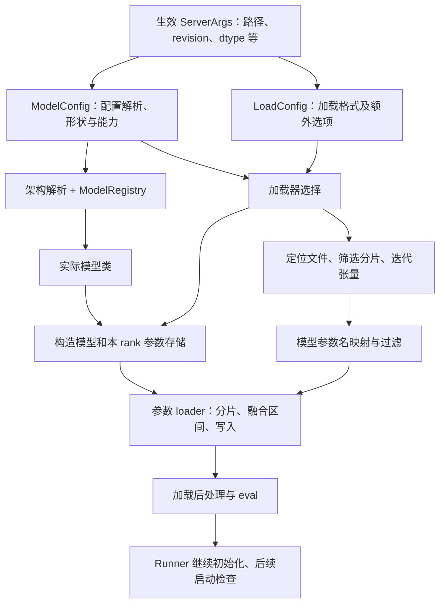
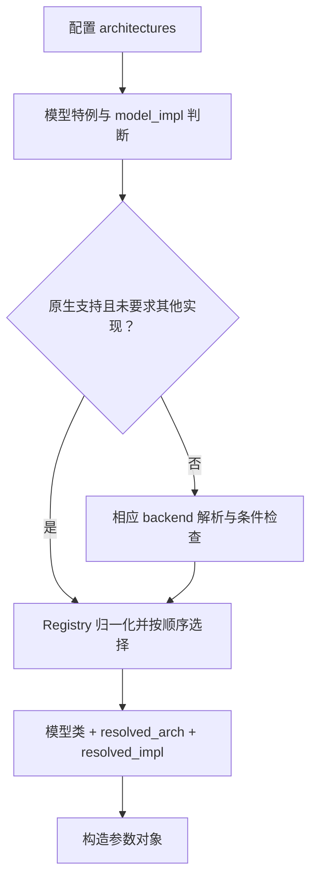
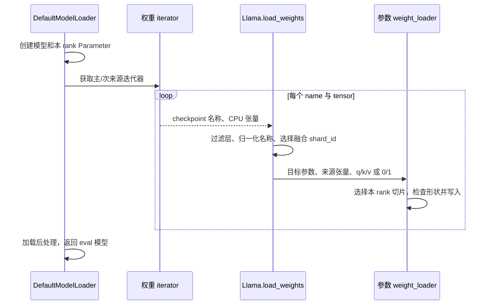
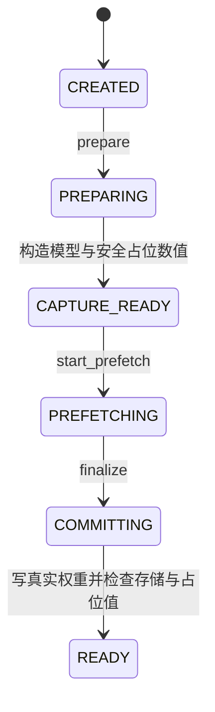

# 模型注册、配置与权重加载

> **先建立架构心智模型：** [M10 · 模型装配状态形态与输入输出](<../architecture/10-模型装配状态形态与输入输出.md>)。先看职责、数据和生命周期，再回到本篇源码细节。

本文是 **09-01，源码分析型学习资料**。前面已经把请求追进模型执行，本篇向前追一步：**服务拿到一个模型目录后，怎样知道要创建哪个类，又怎样把文件中的权重放到这个类的正确参数位置？**

人话版：配置像装配图，模型类像装配工艺，权重文件像分箱运来的零件。文件分成几箱，不决定工厂有几个工位；零件上的标签也不一定与机器里的部件名完全相同。必须经过选型、分拣、映射和写入，才能得到可执行的模型。

## 0. 阅读基线与范围

| 项目 | 内容 |
| --- | --- |
| 源码仓库与路径基准 | 官方 `sgl-project/sglang`；源码路径相对于仓库根目录 `.` |
| 学习分支 | `codex/sglang-source-study-20260909`，基于已拉取的官方 `main` |
| 固定 commit | `72d5c5bb73cadd7ffbf5114e5f81e29d36b6c61a` |
| 读取日期 | `2026-09-10`；沿用 2026-09-09 固定基线 |
| 工作区 | `sglang-source-study` worktree 干净；原 `sglang` 的 `muxi-main` 与 26 个未跟踪文件保持原状 |
| 文档位置 | Wiki `sglang/source-study/09-model-specialization/`，承接通用执行与高级生成，开始模型专题 |
| 贯穿主线 | 原生 `LlamaForCausalLM`、纯文本 Dense、非量化、单卡 CUDA、普通串行启动、本地 safetensors；先使用该基线默认的 Llama legacy 权重映射 |
| 教学模型 | 简化配置 H=8、Q heads=4、KV heads=2、head_dim=2、MLP intermediate_size=12；只做维度与索引账本，不指某个公开权重版本，也不是启动配置 |
| 后续变化 | 分别增加 TP2/TP4、PP 层过滤、V2 模块递归加载、Transformers fallback 和受限制的启动加载 Overlap |
| 不展开 | 各种量化数学与 kernel、全部模型类、远端实例传输、在线权重更新和完整多模态适配；对应后续专题继续阅读 |
| 操作与证据边界 | 只读源码和已有测试定义，编写 Markdown 与标准库教学检查；未下载权重、导入 SGLang/torch、启动服务或运行 CPU/GPU 模型测试 |

前置：[源码入口与启动](../01-getting-started/03-从CLI到服务进程启动.md)、[配置解析](../01-getting-started/04-从参数声明到最终生效配置.md)、[系列目录](../README.md)。带锚点的是**源码事实**；小矩阵、图和对照表是**整理者归纳**；本次没有运行观察。

## 1. 先把六种“模型信息”拆开

### 1.1 名称相近，职责不同

| 信息 | 人话解释 | 谁主要消费 |
| --- | --- | --- |
| 模型路径与 revision | 到哪里找配置和权重，选择哪个来源版本 | 配置 parser、下载和文件准备层 |
| `architectures` | 配置声明的模型实现名称列表，例如 LlamaForCausalLM | 模型架构解析与注册表 |
| `model_type`、层数、head 数等 | 配置类型与模型形状参数 | 配置类、ModelConfig 和模型构造函数 |
| `model_impl` | 使用原生实现还是其他实现路径的选择 | `get_model_architecture()` |
| `load_format` | 权重以何种形式读入，例如 auto/safetensors/sharded_state | `get_model_loader()` |
| checkpoint 参数名 | 文件中每块权重的标签 | 模型的 load_weights 与参数 loader |

**模型架构选择和加载器选择是两条轴。** 同一个模型类可以使用不同来源/格式的加载器；相同 safetensors 容器也可以装不同架构或量化布局的张量。[架构选择][S15] [加载器选择][S20]

### 1.2 完整装配地图



**图意解读：** 方框是职责，不是新进程。普通路径先创建模型参数存储，再消费权重迭代器填入数值；不是把一个 checkpoint 文件直接“变成模型类”。量化配置会参与类构造与层创建，不是加载结束后随意换个 dtype 标签。[普通加载][S22] [构造][S23] [Runner][S43]

## 2. ModelConfig：读配置不等于加载完整权重

### 2.1 从生效参数到自己的配置副本

`TpModelWorker._init_model_config()` 根据自己是 target 还是 draft 选择路径和 revision，再调用 `ModelConfig.from_server_args()`。后者还区分目标/草稿量化配置及配置文件，并传入 dtype、context_length、model_impl 等值。[Worker 入口][S1] [转换][S2]

`ModelConfig.__init__()` 读取模型配置、选择文本子配置、读取 generation config，再派生类型、dtype、上下文长度和形状。它对缓存返回的配置做 deepcopy，因为后续 draft 重映射、架构归一化会改动配置；一个实例的修改不应污染另一个实例。[S3]

| 对象 | 保存什么 | 不能混淆的内容 |
| --- | --- | --- |
| `hf_config` | 模型顶层配置，包含 architecture 和可能的子配置 | 不等于权重张量集合 |
| `hf_text_config` | 文本模型需要的 head/hidden 等字段 | 多模态时可能不是顶层配置 |
| `hf_generation_config` | 来源模型的生成相关配置 | 不决定 QKV 权重怎样切片 |
| `ModelConfig.dtype` | SGLang 解析后的模型计算/参数构造 dtype 入口 | 不表示 checkpoint、全部 scale 和 KV 都同 dtype |
| `ModelConfig.context_len` | 派生或校验后的上下文边界 | 不是“显存一定能承受这么长”的证明 |

纯文本模型通常直接使用本身的配置；嵌套配置由 `get_hf_text_config()` 选择、转换，并处理 dtype 继承等情况。阅读多模态配置时，不能只在顶层搜索 hidden_size 就下结论。[S7]

### 2.2 配置 parser、配置类与模型注册表并非同一个注册表

`get_config()` 根据 parser 设置决定怎样读取配置：auto 会在处理过的模型路径上选择 Mistral 或 HF parser；普通 Llama 走 HF。HF parser 调用 `AutoConfig.from_pretrained()`，随后还有模型特定归一化。[总入口][S4] [HF parser][S5]

自定义 parser 通过 `register_model_config_parser()` 注册，必须继承规定基类；获取未知名字会报错，获取成功时创建 parser 实例。它返回配置对象，**不是返回运行模型**。[注册][S74] [获取][S6]

旧文件 `python/sglang/srt/utils/hf_transformers_utils.py` 是兼容转发入口；本基线实际配置逻辑位于 `python/sglang/srt/utils/hf_transformers/config.py`。不要只停在转发文件中寻找实现。

### 2.3 覆盖配置与固定版本

`model_override_args` 是 JSON 形式的配置覆盖。若覆盖值是 dict，原字段又是 PretrainedConfig 子对象，当前实现更新子对象；否则直接设置字段。这样避免把整个文本子配置变成无法按属性读取的普通字典。[S3] [S4]

这里应记录三份事实：**checkpoint 原始声明、用户覆盖、解析后生效值**。例如把 architecture 改成另一个名字，只改变选型输入，不会自动重排权重或让模型数学结构兼容。

源码 commit 固定的是 SGLang 实现。后续真正实验还须另外固定模型仓库的 revision、实际下载 snapshot 或本地文件清单与校验值；不能将这套源码 hash 当成模型权重版本。[revision 传递][S2] [下载入口][S78]

## 3. dtype 与形状：先决定容器，再看文件数值

### 3.1 auto 的含义依赖配置

`_get_and_verify_dtype()` 在 config dtype 缺失时按 FP32 处理；普通非 Gemma 的 FP32 配置在 auto 下选择 FP16，Gemma 的对应分支选择 BF16；配置本来就是其他已识别 dtype 时沿用配置。显式且无法识别的 dtype 会报错。[S8]

| 教学输入 | 此函数的结果 | 条件 |
| --- | --- | --- |
| 普通 Llama 配置 FP32，dtype=auto | FP16 | 不代表实际 checkpoint 每个 tensor 原来都是 FP32 |
| 普通 Llama 配置 BF16，dtype=auto | BF16 | 后续设备和量化条件仍要核对 |
| 普通 Llama 配置 BF16，显式 float16 | FP16 | 此函数允许；数值质量须另测 |
| dtype 拼写未知 | 抛 ValueError | 不会悄悄回到 auto |

Runner 的设备处理还可能改写 dtype，例如 legacy GPU 的专门分支。应查看最终 `ModelConfig.dtype` 和设备条件，而不只摘命令行参数或配置文件。[S46]

### 3.2 三份 dtype 与两种大小

| 要素 | 看哪里 | 示例边界 |
| --- | --- | --- |
| 文件 tensor dtype | 真实 checkpoint 元数据 | 容器后缀不足以确定精度 |
| 运行参数的 dtype/布局 | quant method 的 create_weights 及参数对象 | 非量化主线与 FP8/INT4 packed 参数不同 |
| KV cache dtype | Runner 后续 KV dtype 配置及池构造 | 与模型权重 dtype 是另一项设置 |
| 逻辑矩阵形状 | 模型结构、head 数、hidden 等 | 用来解释数学映射 |
| 本 rank 的实际参数形状 | TP/PP、padding、量化打包结果 | 不一定等于文件张量形状 |

非量化线性层通过 `torch.empty` 按本分片形状创建 Parameter，标记 input_dim=1、output_dim=0，再附加 weight_loader 等属性。此时有存储不等于已经有训练后的数值。[S76]

`set_default_torch_dtype()` 临时改变默认 dtype，离开作用域恢复原值；这不会替代各参数显式 dtype、量化元数据及加载后处理。[S24]

### 3.3 上下文与 head_dim 的派生也有条件

ModelConfig 在没有 head_dim 时使用 hidden_size / num_attention_heads 推导，并继续派生模型特定形状。显式 context_length 超出派生上限时，普通条件下报错；允许覆盖的环境/CI 分支也不构成长度正确性或容量验证。[形状][S10] [上下文][S9]

教学配置 H=8、Q heads=4，所以 head_dim=2。KV heads=2 意味着 Q/K/V 的输出宽度分别是 8/4/4，而非三个都等于 8。后面将用这一个例子解释融合与 TP。

## 4. Architecture 怎样变成实际 Python 类

### 4.1 EntryClass 是模型包的登记入口

`import_model_classes()` 扫描包中的非子包模块并导入它们，读取模块的 `EntryClass`；该字段可以是一个类，也可以是类列表，注册键使用类名。Llama 文件在末尾提供 EntryClass 列表。[扫描][S11] [Llama 登记][S73]

| 步骤 | 当前行为 | 排障含义 |
| --- | --- | --- |
| 扫描模块 | 可按环境设置跳过指定模块 | 文件存在不保证本进程登记过 |
| 导入模块 | strict=False 时记录导入异常并继续；strict=True 时抛出 | “不支持架构”可能先有依赖/导入问题 |
| 读取 EntryClass | 按类名建立映射，检查重复实现 | Python 文件名不是最终 architecture 键 |
| 注册到 ModelRegistry | 默认不覆盖；显式 overwrite 时更新 | 外部模型包可以替换已登记实现 |

具体见 [import][S11] 与 [register][S12]。本篇只读注册代码，**没有执行导入扫描**，所以不把源码中的全部 EntryClass 数量报告成本机成功支持的模型数。

### 4.2 不只是直接字典查询

`get_model_architecture()` 先读取 architectures，处理部分模型/量化特例，然后判断原生支持与 model_impl。无原生实现或显式选择 Transformers 的路径会调用 fallback 解析；MindSpore 有单独分支。最终通过 ModelRegistry 解析，并记录实际 architecture 与实现类型。[S15] [S17]

Registry 归一化会保留已登记 architecture 的顺序，必要时把 TransformersForCausalLM 放到后面，再返回第一个能找到的类。因此配置中的名称列表、实际选中的类和实现类型应分别记录。[S13] [S14]



**图意解读：** 这是选型职责图；“相应 backend”包括不同实现分支，不代表每种 backend 条件相同。Registry 选出类后，文件格式、权重映射和算子可用性仍在后续检查。

### 4.3 Transformers fallback 不是通用成功保证

fallback 解析会查询 Transformers 类或 auto_map 动态模块。AUTO 模式下发现声明不兼容的实现可报错；显式要求 Transformers 时，部分兼容性检查改为警告并继续。动态模块加载失败、找不到 AutoModel 等也有各自分支。[S16]

因此，不能把“显式选择后未在此处报错”写成“该模型已经兼容全部 SGLang 功能”。替代实现还需要自己的权重前缀映射和 buffer 跳过规则；现有 GPT-NeoX fallback 测试就检查 `gpt_neox.`→`model.`、`embed_out.`→`lm_head.`。[测试定义][S71]

## 5. LoadConfig 怎样选中加载器

### 5.1 配置来自哪里

Runner 构造 LoadConfig 时汇总当前加载格式、download_dir、extra config、TP rank、draft index 等；LoadConfig 解析 extra config 的 JSON 字符串、规范化格式，并设置默认 ignore_patterns。IPC weight cache 启用时还可将格式改为 IPC_CACHE，同时保留磁盘 fallback 格式。[构造][S18] [规范化][S21] [IPC 分支][S19]

**看 `get_model_loader()` 的实际顺序。** 它不是只查一个字符串：dummy、自定义 loader 类型、部分量化工作流有优先分支，再到各格式；最后才返回 DefaultModelLoader。[S20]

| 代表选择 | 职责 | 本篇范围 |
| --- | --- | --- |
| auto/safetensors 等普通分支 | 解析文件、创建模型、迭代写权重 | 主线 |
| dummy | 构造模型并填入 dummy 数值 | 可供特定结构/性能工作使用，不是模型质量验证 [S48] |
| sharded_state | 读取已经按运行 rank 导出的 state dict | 不等于 HF 的普通文件分片 [S49] |
| presharded | 保存/复用后处理后的分片权重及相应目录元数据 | 与 sharded_state 是不同 loader [S50] |
| ModelOpt、bitsandbytes、GGUF、远端实例等 | 各自处理格式、转换或传输 | 本篇只定位选择入口，专题另读 [S20] |

量化配置参与 loader 选择和 `_get_quantization_config()`。只有本篇“没有量化与特殊加载要求”的条件下，才沿普通 DefaultModelLoader 继续。[S20] [S47]

### 5.2 checkpoint 分箱与计算分片不同

| 名称 | 划分的是什么 | 谁决定 |
| --- | --- | --- |
| safetensors shard 文件 | 存储包中的一部分张量 | checkpoint 打包方式及索引 |
| TP shard | 某个矩阵/head 在计算 rank 上的局部部分 | 并行配置和参数 loader |
| PP layer 范围 | 某个 stage 拥有哪段模型层 | 模型构造与层过滤 |
| presharded/state shard | 预先为运行布局导出的数据 | 专用导出/加载协议 |

两个 safetensors 文件，不意味着必须使用 TP2。普通加载器可以在每个 rank 读取相同来源张量，再由参数 loader 取自己所需部分；预分片 loader 则是另一条数据路径。[普通迭代][S27] [TP 写入][S39] [专用 state loader][S49]

## 6. 从目录到 `(name, tensor)` 迭代器

### 6.1 文件准备的选择顺序

`_prepare_weights()` 识别本地目录，或通过配置的来源获取本地文件。AUTO 先尝试 safetensors，再尝试 bin；模型允许回退时还会追加 pt。显式 PT 分支实际匹配 `*.pt`，因此排查时应看函数条件，不只引用参数说明中的概括文字。[S25]

Source 可以覆写 allow_patterns；这会替代默认模式。普通 Source 从模型读取这些约定，`_get_all_weights()` 先迭代主来源，再处理模型声明的 secondary_weights。[Source][S81] [来源汇总][S28]

下载 helper 传递 revision，区分本地目录、缓存与远端获取，并在锁内组织缓存检查和下载。普通非 CI 下载路径和 CI 验证重试路径不同；不能从该函数名推断每次下载都做了同样的完整校验。[S78]

### 6.2 索引负责去重，也能发现缺失文件

对于 safetensors，`filter_duplicate_safetensors_files()` 读取 index 中的 weight_map，得到应使用的文件集合，避免把 consolidated 与分片版本重复载入；索引引用的必要文件缺失时抛错。限定子目录模式的 Source 只检查匹配范围内的索引文件。[S26]

教学目录中有 shard-1、shard-2 和 extra-consolidated 三个文件，而索引只指向前两个：

```text
model.layers.0.self_attn.q_proj.weight -> shard-1.safetensors
model.layers.0.self_attn.k_proj.weight -> shard-1.safetensors
model.layers.0.self_attn.v_proj.weight -> shard-2.safetensors
```

应保留 shard-1/shard-2，过滤 extra；若 shard-2 不存在，应在此处失败。**文件存在性通过并不证明每个 tensor 的名称、shape、数值或来源版本正确。** 没有 index 的单文件场景也不因此必然失败。[S26] [测试定义][S66]

### 6.3 CPU 文件内容与 GPU 参数存储怎样交接

本篇先看单线程 safetensors iterator：mmap 路径在 CPU 打开文件，逐项取得 `(name, tensor)`；disable_mmap 路径读取文件内容后解析。参数 loader 后续将对应内容写入模型参数。[S29] [S41]



**图意解读：** iterator 管文件，模型层管命名和语义，参数 loader 管最终切片与写入。普通主线创建参数的设备作用域和后续数据写入分开；示意图没有声称磁盘直接向 GPU 零拷贝。[S22] [S32] [S39]

### 6.4 多线程不是把全部权重一次堆进内存

当前 iterator 分发默认考虑多线程。buffered safetensors 实现使用有限 pending 窗口：最多按 `max_workers+1` 个任务播种，取出一个、补下一个，再逐项 yield，结束后删除当前 state_dict 引用。[S27] [S30]

这限制的是该层文件任务窗口，不是整个进程内存的精确上限。消费中的张量、mmap 页缓存、其他 rank、量化转换和 GPU 参数存储仍会占资源。已有 prefetch 与多线程同时启用时，如果用户没有显式指定线程相关选项，特定条件下会退回单线程以避免竞争；这不是网络存储一定更慢或本地盘一定更快的实验结论。[S27]

## 7. Llama：checkpoint 名怎样进入运行参数

### 7.1 模型先构造出融合层

LlamaForCausalLM 构造 LlamaModel，并按 tie_word_embeddings 决定 lm_head 是否共享 embedding。LlamaModel 按 PP 角色构造 embedding、层范围与 norm；单卡主线拥有全部层。[外层][S34] [内层][S35]

Attention 中 Q/K/V 合为 `QKVParallelLinear`；MLP 中 gate/up 合为 `MergedColumnParallelLinear`，down 单独存在。[Attention][S36] [MLP][S37]

| checkpoint 后缀 | 运行参数后缀 | 传入 shard_id | 含义 |
| --- | --- | --- | --- |
| `.q_proj.weight` | `.qkv_proj.weight` | `q` | 写融合矩阵的 Q 区 |
| `.k_proj.weight` | `.qkv_proj.weight` | `k` | 写 K 区 |
| `.v_proj.weight` | `.qkv_proj.weight` | `v` | 写 V 区 |
| `.gate_proj.weight` | `.gate_up_proj.weight` | `0` | 写 gate 区 |
| `.up_proj.weight` | `.gate_up_proj.weight` | `1` | 写 up 区 |

例如完整名称 `model.layers.0.self_attn.k_proj.weight` 在本模型映射为 `model.layers.0.self_attn.qkv_proj.weight`，并附上 `k`。这个 shard_id 表示**融合参数中的部分**，不是 checkpoint 文件序号，也不是 TP rank。[S32]

### 7.2 当前默认是 legacy 映射路径

Llama 的 `load_weights()` 读取 `SGLANG_ENABLE_WEIGHT_LOADER_V2`，本基线默认 False。因此本文主线先读 `_legacy_load_weights()`。[分发][S31] [默认值][S33]

它依次处理 scale 名称归一化、PP 层过滤、部分非推理 tensor/冗余权重跳过，再进行 stacked 映射；命中后取得参数上的 `weight_loader`，传入 loaded_weight 和 shard_id。普通参数则使用其自带 loader 或 default_weight_loader。[S32]

**参数 loader 是构造层时绑定的。** ColumnParallelLinear 把选中的 loader 传给 quant method 的 create_weights，后者附到 Parameter。不同量化参数可以绑定不同实现；不是所有权重都由一条通用 copy 语句处理。[S75] [S76]

### 7.3 单卡的小矩阵账本

设 H=8，Q heads=4，KV heads=2，head_dim=2：

| checkpoint 参数 | 逻辑形状，按 `[out,in]` | 单卡融合参数中的行区间 |
| --- | --- | --- |
| Q | `[8,8]` | qkv 的 `[0,8)` |
| K | `[4,8]` | qkv 的 `[8,12)` |
| V | `[4,8]` | qkv 的 `[12,16)` |
| gate | `[12,8]` | gate_up 的 `[0,12)` |
| up | `[12,8]` | gate_up 的 `[12,24)` |

所以 qkv 参数为 `[16,8]`，gate_up 为 `[24,8]`。它们只是将不同投影放在一个运行参数中，不是把 K/V 变成与 Q 相同数量的 head。[QKV 构造][S38] [MLP 构造][S37]

如果只看 checkpoint 的 `k_proj.weight`，拿 `[4,8]` 直接与整个 qkv 的 `[16,8]` 比较，就会误以为 shape 不匹配。正确比较对象是参数 loader 选出的 K 目标区域。[S39]

## 8. 加入 TP 与 PP：谁读取，谁最终保留

### 8.1 TP2：先分 Q/K/V，再装进本 rank 的融合参数

保持同一模型，单独改为 TP2。每个 rank 的 Q/K/V 输出宽度为 4/2/2，所以本地 qkv 形状是 `[8,8]`。

| rank | 从 checkpoint Q 取行 | K 取行 | V 取行 | 本地融合区间 |
| --- | --- | --- | --- | --- |
| 0 | `[0,4)` | `[0,2)` | `[0,2)` | Q `[0,4)`、K `[4,6)`、V `[6,8)` |
| 1 | `[4,8)` | `[2,4)` | `[2,4)` | 同样的本地布局 |

源码中 Q 使用 tp_rank，K/V 使用 KV 并行 rank 与副本数推导来源 head；目标参数先 narrow 到自身融合区，再 narrow 来源权重，最后检查 shape 并 copy。[S39]

不能先把全局 Q/K/V 拼成 `[16,8]`，再盲目一刀切成前后两半给两个 rank。那会让 rank 0 只有 Q，rank 1 只有 K/V，破坏本地 Attention 所需的 Q/K/V 组合。

### 8.2 TP4：KV head 少于 rank 时会复制

同一模型使用 TP4，Q 每 rank 1 个 head；KV 总共只有 2 个 head，每个 KV head 需要供 2 个 rank 使用。每 rank 的 qkv 输出宽度为 2+2+2=6，本地参数为 `[6,8]`。[构造与副本数][S38]

| rank | Q 行 | K/V 来源 head | K/V 行 |
| --- | --- | ---: | --- |
| 0 | `[0,2)` | 0 | `[0,2)` |
| 1 | `[2,4)` | 0 | `[0,2)` |
| 2 | `[4,6)` | 1 | `[2,4)` |
| 3 | `[6,8)` | 1 | `[2,4)` |

以每元素 2 字节计算本例 QKV 权重，单卡为 16×8×2=256 字节；TP2 总计仍为 256；TP4 因复制 K/V 总计为 4×6×8×2=384 字节。**这是教学层权重账本，不是完整模型显存或 KV cache 容量测量。**

Attention 构造检查 Q head 与 TP 的整除关系；KV head 较多时检查分割整除，较少时检查复制整除。修改 TP 并不意味着所有 head 配置都合法。[S36]

### 8.3 PP 过滤与分片文件数量无关

模型构造决定每个 stage 的 `[start_layer,end_layer)`，legacy loader 跳过不属于本 stage 的层；V2 使用 `filter_pp_weights()` 做对应过滤。没有可解析层号的名称会通过这一层过滤，随后仍由模型结构或 skip 规则处理。[S35] [S32] [S57]

教学 PP 范围 `[2,4)` 只包含 layers 2、3；不能因为某文件里同时有 layer 1 和 layer 2，就把整个文件都归给某个 stage。这里讨论的是加载职责，不是宣称 PP 与其他全部功能组合兼容。

## 9. V2 路径：模块递归负责路由，层 loader 仍负责写入

### 9.1 V2 改的是装配组织方式

显式开启模型 weight loader V2 后，Llama 先过滤 PP 层，设置 tie-embedding、projector/vision 等 skip 规则，再通过 AutoWeightsLoader 递归分发。WeightsMapper 负责名称前缀/子串/后缀映射；Llama 注册的 remap 包含 FP8 scale 后缀归一化。[V2 入口][S51] [mapper][S58] [remap 获取][S59]

AutoWeightsLoader 按点号逐层拆名称，优先找 child module，再找 parameter/buffer；子模块如果提供 load_weights，就把该组内容交给子模块，而不是强行展开其内部。[S52] [S53]

LlamaAttention 和 LlamaMLP 的 load_weights 使用 StackedParamsDispatch，把 q/k/v 或 gate/up 路由到融合参数；实际写入仍调用 `param.weight_loader`。[Attention][S55] [MLP][S56] [dispatch][S54]

### 9.2 两个“V2”不是同一个开关

| 名称 | 决定什么 |
| --- | --- |
| `SGLANG_ENABLE_WEIGHT_LOADER_V2` | Llama 等模型层面采用哪种名称分发/递归组织方式 |
| `QKVParallelLinear.weight_loader_v2` | 某些参数类型怎样执行 QKV 写入，可能调用 Parameter 的 load_qkv_weight |

ColumnParallelLinear 根据 quant method/参数 scheme 绑定具体 loader；这个选择不等于读取模型层面的 V2 环境开关。因此模型走 legacy 时，也不能据此断言底层没有使用任何名为 weight_loader_v2 的方法。[S75] [S77]

### 9.3 返回 loaded 名称集合，不等于完成了全部权重验证

AutoWeightsLoader 对未被忽略的未知模块/参数路径会抛 ValueError，但遇到自定义子模块加载函数后，是否检查遗漏取决于子模块。当前 Llama 子层对部分不匹配名称会跳过；StackedParamsDispatch 甚至可为缺少的可选目标返回名称用于 skip tracking。[S53] [S54] [S55]

legacy 主线也不是通用 strict state_dict 校验：部分条目跳过，某些找不到的参数只警告；普通 DefaultModelLoader 调用模型加载方法，并未在此处统一比较“模型需要的全部参数集合”与“确实写入的参数集合”。[S32] [S42]

因此应区分：**未知名称被检查、缺失参数被检查、shape 被检查、数值确实正确**。专用 ShardedStateLoader 会将已写键移出待加载 state_dict，并对剩余键抛 Missing keys；不能把它的检查强度套到普通 Llama loader。[S49]

## 10. 什么时候才算加载完成

### 10.1 普通路径：最后一个 tensor 之后还有后处理

DefaultModelLoader 在 model.load_weights 后遍历模块的 quant_method，执行 `process_weights_after_loading()`。一些路径会 repack、量化或转换布局，CPU offload 场景还通过设备作用域处理；最后返回 model.eval()。[S42] [S22]

绕过模型 load_weights 的 dummy/sharded/部分远端路径，可能需要显式调用模型 post_load_weights hook；这是模型自己的修正入口，与 quant method 的后处理职责不同。[S72]

Runner 随后还有 kernel 准备、KV scale、模型层信息、LoRA manager、KV dtype 等初始化；普通加载结束处有分布式同步。**eval 只表示模型执行模式，不表示服务已接受并成功完成第一条请求。**[Runner load][S43] [后续初始化][S44]

### 10.2 权重、临时张量与请求 KV 的寿命

| 对象 | 主线中的开始与结束 | 读者应追问 |
| --- | --- | --- |
| ModelConfig | Worker 初始化创建；后续组件持续读取 | 是否被复制、覆盖或派生了新值 |
| 文件句柄/CPU shard 内容 | iterator 按文件打开、yield、释放本层引用 | mmap/下游引用/页缓存是否仍持有内容 |
| GPU Parameter | 模型构造分配，加载写入，供多条请求反复使用 | 是否被 quant/post-load 改变布局或绑定 |
| 加载转换的临时存储 | 随具体量化/转换过程创建和回收 | 峰值显存是否高于最终权重占用 |
| 请求 KV | 服务处理请求时另行分配和维护 | 与模型权重是不是不同分配器/所有者 |

R1、R2、R3 进入已启动模型时，主线不会为每个请求重新读 checkpoint。加载权重属于模型实例准备；请求 KV 则随请求调度变化。在线更新是另一条明确的控制流程，留到 10-05。

### 10.3 启动加载 Overlap：模型对象可能先带占位数值返回

`load_model_with_memory_saver()` 在启用启动权重 Overlap 时交给 StartupWeightLoadManager.prepare；普通模式才直接调用 loader.load_model。**这与 08-06 的请求调度 Overlap 是不同阶段的机制。**[S45]



**图意解读：** 枚举与转换来自 [状态][S65]、[prepare][S60]、[prefetch][S61]、[finalize][S62]。图只表示成功路径，没有虚构一个源码未定义的 FAILED 枚举。CAPTURE_READY 的含义是可用于受支持的图捕获准备，不是训练权重已经可服务。

finalize 在写入后做 CUDA 同步，检查图可见 tensor 的对象/地址/shape/stride/dtype/device/offset 等存储信息没有变化，并检查参数没有仍停留在占位数值。成功后才进入 READY；Runner 再执行加载后 barrier，随后释放 manager 所有权。[提交][S62] [存储比较][S79] [Runner 完成][S64]

这条路径的准入很窄：要求原生允许架构中的 Llama/Qwen2/Qwen3、CUDA、FP16/BF16、无量化、DefaultModelLoader、auto/safetensors、指定图条件、TP1/TP2；还限制 draft/spec、PP/DP/EP、LoRA、offload、mmap 等。检查不满足时创建 manager 报错，不是静默回串行。[条件][S63] [创建][S80]

这些条件只说明此固定实现允许什么；本次没有运行启动 Overlap，也没有验证占位检查能覆盖全部模型数值错误。

## 11. 失败与回退地图

| 现象 | 首先分辨 | 首要源码与下一步 |
| --- | --- | --- |
| architecture 不支持 | 未登记，还是模块导入失败/被禁用 | [注册扫描][S11] [选择][S15]，先读更早日志 |
| 显式 backend 后能继续，auto 却失败 | 兼容性检查的警告/拒绝分支不同 | [fallback][S16]；继续不代表正确 |
| Unknown model-config parser | parser 注册名与选择值 | [parser 获取][S6] |
| 找不到权重 | 本地路径、格式、allow_patterns、Source | [准备][S25] [Source][S81] |
| 索引指出 shard 缺失 | 是否下载不完整或限定 Source 范围不同 | [index 检查][S26] |
| shape mismatch | 全局 tensor、融合部分、本 rank 切片是否对应 | [QKV loader][S39] [默认 loader][S41] |
| “加载成功”但结果异常 | 必要参数遗漏、名称跳过、dtype/量化布局错误 | [legacy][S32] [V2 子层][S55] [后处理][S42] |
| 启动内存突然升高 | 本地 Parameter、并发 shard、页缓存、转换临时值 | [迭代窗口][S30] [后处理][S42] |
| 开 TP 后 K/V 重复 | 是否为 KV heads 少于 TP 的合法复制 | [head 分配][S38] |
| startup overlap 最后失败 | 存储被重绑、仍有占位数值或状态非法 | [finalize][S62]，不能只看 capture 成功 |

失败记录至少包含源码/模型版本、resolved architecture、实际 model_impl、loader 类、格式、dtype/quantization、TP/PP、原始参数名与目标名、来源/目标 shape。不要把后续 rank barrier 超时直接当成网络故障；它也可能由某个 rank 更早的加载失败引起。[Runner 完成边界][S64]

## 12. 阅读路线与验证边界

### 12.1 最短源码路线

| 顺序 | 源码锚点 | 阅读问题 |
| --- | --- | --- |
| 1 | `python/sglang/srt/configs/model_config.py::ModelConfig.from_server_args` [S2] | 使用的是哪份生效配置 |
| 2 | `python/sglang/srt/models/registry.py::import_model_classes` [S11] | 类如何登记，导入失败怎样处理 |
| 3 | `python/sglang/srt/model_loader/utils.py::get_model_architecture` [S15] | 最终选中哪个实现 |
| 4 | `python/sglang/srt/model_loader/loader.py::get_model_loader` [S20] | 哪个格式/量化分支优先 |
| 5 | `python/sglang/srt/model_loader/loader.py::DefaultModelLoader.load_model` [S22] | 构造、读取与后处理如何相接 |
| 6 | `python/sglang/srt/models/llama.py::LlamaForCausalLM._legacy_load_weights` [S32] | checkpoint 名如何映射 |
| 7 | `python/sglang/srt/layers/linear.py::QKVParallelLinear.weight_loader` [S39] | 融合位置和 TP 切片谁决定 |
| 8 | `python/sglang/srt/model_executor/model_runner.py::ModelRunner.load_model` [S43] | 模型返回后还有哪些准备 |

MLP 的对应写入入口为 `python/sglang/srt/layers/linear.py::MergedColumnParallelLinear.weight_loader`。[S40] 理解 QKV 后再比较 gate/up，可以避免重复阅读所有特例。

### 12.2 已有测试提供的验证思路

以下六份测试定义均只读，**本次未执行**：

| 测试 | 定义中检查什么 | 证据边界 |
| --- | --- | --- |
| [配置 parser registry][S67] | 注册、基类要求、未知名字错误 | 不是外部模型配置实际读取成功 |
| [Shard index consistency][S66] | 缺失 shard、过滤非索引文件、子目录范围 | 示例文件存在性，不是模型数值正确 |
| [Transformers fallback mapper][S71] | GPT-NeoX 等前缀映射与额外 buffer 规则 | 不是全部 fallback 模型兼容证明 |
| [V2 E2E][S68] | Qwen2-0.5B 的 V1/V2 输出对照，以及 Transformers 路径生成 | 该测试对象不是本篇教学 Llama；存在不等于通过 |
| [手动 V1/V2 state dict 对照][S70] | Qwen2 参数键及逐参数零容差比较 | GPU 手动验证入口，未运行 |
| [Startup manager][S69] | 状态/顺序、存储重绑、残留占位值拒绝 | mock 路径不能替代实际图捕获与多 rank 启动 |

本篇完成固定源码符号/链接与条件的静态核查，并以独立小账本检查 QKV 融合、TP 分割/复制、MLP 拼接、索引集合、PP 区间和字节数。Mermaid 只核对结构与图文语义，未使用渲染器。

### 12.3 将来验证一个实际模型时

按“配置身份 → 类与 loader → 参数映射 → 数值 → 运行输出”的顺序建立证据。只对比参数数量不够；融合/共享参数会改变命名和存储关系。需要记录忽略项的理由、关键权重的实际切片与数值、加载后布局，再运行受控请求与参考输出对照。

本地文件齐全、模型类构造成功、loaded 名称集合非空、首条文本非空，各自只证明一个较小环节。任何一个都不能单独证明完整加载与模型适配正确。

## 13. 自测与答案

1. `architectures`、model_impl 和 load_format 分别决定什么？
2. checkpoint 有 2 个 safetensors 文件，是否必须 TP2？
3. 本例单卡 qkv 与 TP2 每 rank qkv 的形状分别是多少？
4. 本例 TP4 时 rank 0、1 的 K/V 来自哪里，为什么相同？
5. 为什么不能把全局融合 qkv 直接平均切成前后两块给 TP2？
6. 环境里的模型 loader V2 关闭，能否断言参数 loader 都不是 V2？
7. index 所有文件存在且没有 shape 报错，是否能证明所有权重正确？
8. CAPTURE_READY 与 READY 分别说明什么？

**参考答案：**

1. architecture 声明模型实现名，model_impl 参与选择实现路径，load_format 参与选择读取/装配权重的方式。
2. 不必。文件分片是存储组织，TP 分片是计算布局。
3. 单卡 `[16,8]`；TP2 每 rank `[8,8]`，其中 Q/K/V 各占 4/2/2 行。
4. 都来自全局 KV head 0、行 `[0,2)`；KV heads=2 少于 TP=4，需要复制。
5. 必须让每 rank 同时拥有自己的 Q/K/V；盲切会按 Q 区与 K/V 区分开。
6. 不能。模型层递归分发开关与参数类型选择的 loader 是两层机制。
7. 不能。还可能有名称跳过、必要参数遗漏、错误版本或错误数值，需要对应证据。
8. 前者是安全占位数值已准备，可用于受支持的图捕获；后者是 manager 完成真实权重写入及其检查。服务整体可用还要经过后续启动与请求验证。

读完应能从一个 checkpoint 参数名，一直追到运行模型的本 rank 目标区域，并指出在哪里选择类、哪里决定 dtype、哪里完成真正的数值写入。

下一篇为 [09-02《量化格式与计算路径》](02-量化格式与计算路径.md)：继续区分权重、激活与 KV 的精度，追踪 scale、打包布局、加载转换和 kernel 条件。

[S1]: https://github.com/sgl-project/sglang/blob/72d5c5bb73cadd7ffbf5114e5f81e29d36b6c61a/python/sglang/srt/managers/tp_worker.py#L461
[S2]: https://github.com/sgl-project/sglang/blob/72d5c5bb73cadd7ffbf5114e5f81e29d36b6c61a/python/sglang/srt/configs/model_config.py#L692
[S3]: https://github.com/sgl-project/sglang/blob/72d5c5bb73cadd7ffbf5114e5f81e29d36b6c61a/python/sglang/srt/configs/model_config.py#L367
[S4]: https://github.com/sgl-project/sglang/blob/72d5c5bb73cadd7ffbf5114e5f81e29d36b6c61a/python/sglang/srt/utils/hf_transformers/config.py#L220
[S5]: https://github.com/sgl-project/sglang/blob/72d5c5bb73cadd7ffbf5114e5f81e29d36b6c61a/python/sglang/srt/utils/hf_transformers/config.py#L79
[S6]: https://github.com/sgl-project/sglang/blob/72d5c5bb73cadd7ffbf5114e5f81e29d36b6c61a/python/sglang/srt/configs/model_config_parser_registry.py#L55
[S7]: https://github.com/sgl-project/sglang/blob/72d5c5bb73cadd7ffbf5114e5f81e29d36b6c61a/python/sglang/srt/utils/hf_transformers/common.py#L494
[S8]: https://github.com/sgl-project/sglang/blob/72d5c5bb73cadd7ffbf5114e5f81e29d36b6c61a/python/sglang/srt/configs/model_config.py#L1931
[S9]: https://github.com/sgl-project/sglang/blob/72d5c5bb73cadd7ffbf5114e5f81e29d36b6c61a/python/sglang/srt/configs/model_config.py#L983
[S10]: https://github.com/sgl-project/sglang/blob/72d5c5bb73cadd7ffbf5114e5f81e29d36b6c61a/python/sglang/srt/configs/model_config.py#L1017
[S11]: https://github.com/sgl-project/sglang/blob/72d5c5bb73cadd7ffbf5114e5f81e29d36b6c61a/python/sglang/srt/models/registry.py#L95
[S12]: https://github.com/sgl-project/sglang/blob/72d5c5bb73cadd7ffbf5114e5f81e29d36b6c61a/python/sglang/srt/models/registry.py#L24
[S13]: https://github.com/sgl-project/sglang/blob/72d5c5bb73cadd7ffbf5114e5f81e29d36b6c61a/python/sglang/srt/models/registry.py#L61
[S14]: https://github.com/sgl-project/sglang/blob/72d5c5bb73cadd7ffbf5114e5f81e29d36b6c61a/python/sglang/srt/models/registry.py#L80
[S15]: https://github.com/sgl-project/sglang/blob/72d5c5bb73cadd7ffbf5114e5f81e29d36b6c61a/python/sglang/srt/model_loader/utils.py#L198
[S16]: https://github.com/sgl-project/sglang/blob/72d5c5bb73cadd7ffbf5114e5f81e29d36b6c61a/python/sglang/srt/model_loader/utils.py#L111
[S17]: https://github.com/sgl-project/sglang/blob/72d5c5bb73cadd7ffbf5114e5f81e29d36b6c61a/python/sglang/srt/model_loader/utils.py#L246
[S18]: https://github.com/sgl-project/sglang/blob/72d5c5bb73cadd7ffbf5114e5f81e29d36b6c61a/python/sglang/srt/model_executor/model_runner_components/load_model_utils.py#L195
[S19]: https://github.com/sgl-project/sglang/blob/72d5c5bb73cadd7ffbf5114e5f81e29d36b6c61a/python/sglang/srt/model_executor/model_runner_components/load_model_utils.py#L237
[S20]: https://github.com/sgl-project/sglang/blob/72d5c5bb73cadd7ffbf5114e5f81e29d36b6c61a/python/sglang/srt/model_loader/loader.py#L4282
[S21]: https://github.com/sgl-project/sglang/blob/72d5c5bb73cadd7ffbf5114e5f81e29d36b6c61a/python/sglang/srt/configs/load_config.py#L115
[S22]: https://github.com/sgl-project/sglang/blob/72d5c5bb73cadd7ffbf5114e5f81e29d36b6c61a/python/sglang/srt/model_loader/loader.py#L961
[S23]: https://github.com/sgl-project/sglang/blob/72d5c5bb73cadd7ffbf5114e5f81e29d36b6c61a/python/sglang/srt/model_loader/loader.py#L274
[S24]: https://github.com/sgl-project/sglang/blob/72d5c5bb73cadd7ffbf5114e5f81e29d36b6c61a/python/sglang/srt/model_loader/utils.py#L25
[S25]: https://github.com/sgl-project/sglang/blob/72d5c5bb73cadd7ffbf5114e5f81e29d36b6c61a/python/sglang/srt/model_loader/loader.py#L452
[S26]: https://github.com/sgl-project/sglang/blob/72d5c5bb73cadd7ffbf5114e5f81e29d36b6c61a/python/sglang/srt/model_loader/weight_utils.py#L754
[S27]: https://github.com/sgl-project/sglang/blob/72d5c5bb73cadd7ffbf5114e5f81e29d36b6c61a/python/sglang/srt/model_loader/loader.py#L574
[S28]: https://github.com/sgl-project/sglang/blob/72d5c5bb73cadd7ffbf5114e5f81e29d36b6c61a/python/sglang/srt/model_loader/loader.py#L724
[S29]: https://github.com/sgl-project/sglang/blob/72d5c5bb73cadd7ffbf5114e5f81e29d36b6c61a/python/sglang/srt/model_loader/weight_utils.py#L1131
[S30]: https://github.com/sgl-project/sglang/blob/72d5c5bb73cadd7ffbf5114e5f81e29d36b6c61a/python/sglang/srt/model_loader/weight_utils.py#L1272
[S31]: https://github.com/sgl-project/sglang/blob/72d5c5bb73cadd7ffbf5114e5f81e29d36b6c61a/python/sglang/srt/models/llama.py#L662
[S32]: https://github.com/sgl-project/sglang/blob/72d5c5bb73cadd7ffbf5114e5f81e29d36b6c61a/python/sglang/srt/models/llama.py#L669
[S33]: https://github.com/sgl-project/sglang/blob/72d5c5bb73cadd7ffbf5114e5f81e29d36b6c61a/python/sglang/srt/environ.py#L309
[S34]: https://github.com/sgl-project/sglang/blob/72d5c5bb73cadd7ffbf5114e5f81e29d36b6c61a/python/sglang/srt/models/llama.py#L517
[S35]: https://github.com/sgl-project/sglang/blob/72d5c5bb73cadd7ffbf5114e5f81e29d36b6c61a/python/sglang/srt/models/llama.py#L372
[S36]: https://github.com/sgl-project/sglang/blob/72d5c5bb73cadd7ffbf5114e5f81e29d36b6c61a/python/sglang/srt/models/llama.py#L138
[S37]: https://github.com/sgl-project/sglang/blob/72d5c5bb73cadd7ffbf5114e5f81e29d36b6c61a/python/sglang/srt/models/llama.py#L71
[S38]: https://github.com/sgl-project/sglang/blob/72d5c5bb73cadd7ffbf5114e5f81e29d36b6c61a/python/sglang/srt/layers/linear.py#L978
[S39]: https://github.com/sgl-project/sglang/blob/72d5c5bb73cadd7ffbf5114e5f81e29d36b6c61a/python/sglang/srt/layers/linear.py#L1201
[S40]: https://github.com/sgl-project/sglang/blob/72d5c5bb73cadd7ffbf5114e5f81e29d36b6c61a/python/sglang/srt/layers/linear.py#L584
[S41]: https://github.com/sgl-project/sglang/blob/72d5c5bb73cadd7ffbf5114e5f81e29d36b6c61a/python/sglang/srt/model_loader/weight_utils.py#L1535
[S42]: https://github.com/sgl-project/sglang/blob/72d5c5bb73cadd7ffbf5114e5f81e29d36b6c61a/python/sglang/srt/model_loader/loader.py#L993
[S43]: https://github.com/sgl-project/sglang/blob/72d5c5bb73cadd7ffbf5114e5f81e29d36b6c61a/python/sglang/srt/model_executor/model_runner.py#L1146
[S44]: https://github.com/sgl-project/sglang/blob/72d5c5bb73cadd7ffbf5114e5f81e29d36b6c61a/python/sglang/srt/model_executor/model_runner.py#L650
[S45]: https://github.com/sgl-project/sglang/blob/72d5c5bb73cadd7ffbf5114e5f81e29d36b6c61a/python/sglang/srt/model_executor/model_runner_components/load_model_utils.py#L256
[S46]: https://github.com/sgl-project/sglang/blob/72d5c5bb73cadd7ffbf5114e5f81e29d36b6c61a/python/sglang/srt/model_executor/model_runner_components/load_model_utils.py#L75
[S47]: https://github.com/sgl-project/sglang/blob/72d5c5bb73cadd7ffbf5114e5f81e29d36b6c61a/python/sglang/srt/model_loader/loader.py#L166
[S48]: https://github.com/sgl-project/sglang/blob/72d5c5bb73cadd7ffbf5114e5f81e29d36b6c61a/python/sglang/srt/model_loader/loader.py#L1610
[S49]: https://github.com/sgl-project/sglang/blob/72d5c5bb73cadd7ffbf5114e5f81e29d36b6c61a/python/sglang/srt/model_loader/loader.py#L1738
[S50]: https://github.com/sgl-project/sglang/blob/72d5c5bb73cadd7ffbf5114e5f81e29d36b6c61a/python/sglang/srt/model_loader/loader.py#L1838
[S51]: https://github.com/sgl-project/sglang/blob/72d5c5bb73cadd7ffbf5114e5f81e29d36b6c61a/python/sglang/srt/models/llama.py#L742
[S52]: https://github.com/sgl-project/sglang/blob/72d5c5bb73cadd7ffbf5114e5f81e29d36b6c61a/python/sglang/srt/models/utils.py#L270
[S53]: https://github.com/sgl-project/sglang/blob/72d5c5bb73cadd7ffbf5114e5f81e29d36b6c61a/python/sglang/srt/models/utils.py#L209
[S54]: https://github.com/sgl-project/sglang/blob/72d5c5bb73cadd7ffbf5114e5f81e29d36b6c61a/python/sglang/srt/model_loader/auto_loader.py#L86
[S55]: https://github.com/sgl-project/sglang/blob/72d5c5bb73cadd7ffbf5114e5f81e29d36b6c61a/python/sglang/srt/models/llama.py#L265
[S56]: https://github.com/sgl-project/sglang/blob/72d5c5bb73cadd7ffbf5114e5f81e29d36b6c61a/python/sglang/srt/models/llama.py#L120
[S57]: https://github.com/sgl-project/sglang/blob/72d5c5bb73cadd7ffbf5114e5f81e29d36b6c61a/python/sglang/srt/model_loader/auto_loader.py#L156
[S58]: https://github.com/sgl-project/sglang/blob/72d5c5bb73cadd7ffbf5114e5f81e29d36b6c61a/python/sglang/srt/models/utils.py#L69
[S59]: https://github.com/sgl-project/sglang/blob/72d5c5bb73cadd7ffbf5114e5f81e29d36b6c61a/python/sglang/srt/model_loader/auto_loader.py#L204
[S60]: https://github.com/sgl-project/sglang/blob/72d5c5bb73cadd7ffbf5114e5f81e29d36b6c61a/python/sglang/srt/model_executor/model_runner_components/startup_weight_load.py#L446
[S61]: https://github.com/sgl-project/sglang/blob/72d5c5bb73cadd7ffbf5114e5f81e29d36b6c61a/python/sglang/srt/model_executor/model_runner_components/startup_weight_load.py#L478
[S62]: https://github.com/sgl-project/sglang/blob/72d5c5bb73cadd7ffbf5114e5f81e29d36b6c61a/python/sglang/srt/model_executor/model_runner_components/startup_weight_load.py#L496
[S63]: https://github.com/sgl-project/sglang/blob/72d5c5bb73cadd7ffbf5114e5f81e29d36b6c61a/python/sglang/srt/model_executor/model_runner_components/startup_weight_load.py#L327
[S64]: https://github.com/sgl-project/sglang/blob/72d5c5bb73cadd7ffbf5114e5f81e29d36b6c61a/python/sglang/srt/model_executor/model_runner.py#L1285
[S65]: https://github.com/sgl-project/sglang/blob/72d5c5bb73cadd7ffbf5114e5f81e29d36b6c61a/python/sglang/srt/model_executor/model_runner_components/startup_weight_load.py#L64
[S66]: https://github.com/sgl-project/sglang/blob/72d5c5bb73cadd7ffbf5114e5f81e29d36b6c61a/test/registered/unit/model_loader/test_weight_utils.py#L29
[S67]: https://github.com/sgl-project/sglang/blob/72d5c5bb73cadd7ffbf5114e5f81e29d36b6c61a/test/registered/unit/configs/test_model_config_parser_registry.py#L29
[S68]: https://github.com/sgl-project/sglang/blob/72d5c5bb73cadd7ffbf5114e5f81e29d36b6c61a/test/registered/model_loading/test_weight_loader_v2_e2e.py#L31
[S69]: https://github.com/sgl-project/sglang/blob/72d5c5bb73cadd7ffbf5114e5f81e29d36b6c61a/test/registered/unit/model_executor/model_runner_components/test_startup_weight_load.py#L329
[S70]: https://github.com/sgl-project/sglang/blob/72d5c5bb73cadd7ffbf5114e5f81e29d36b6c61a/test/manual/test_weight_loader_v2_equiv.py#L82
[S71]: https://github.com/sgl-project/sglang/blob/72d5c5bb73cadd7ffbf5114e5f81e29d36b6c61a/test/registered/unit/model_loader/test_transformers_fallback.py#L14
[S72]: https://github.com/sgl-project/sglang/blob/72d5c5bb73cadd7ffbf5114e5f81e29d36b6c61a/python/sglang/srt/model_loader/loader.py#L304
[S73]: https://github.com/sgl-project/sglang/blob/72d5c5bb73cadd7ffbf5114e5f81e29d36b6c61a/python/sglang/srt/models/llama.py#L929
[S74]: https://github.com/sgl-project/sglang/blob/72d5c5bb73cadd7ffbf5114e5f81e29d36b6c61a/python/sglang/srt/configs/model_config_parser_registry.py#L35
[S75]: https://github.com/sgl-project/sglang/blob/72d5c5bb73cadd7ffbf5114e5f81e29d36b6c61a/python/sglang/srt/layers/linear.py#L334
[S76]: https://github.com/sgl-project/sglang/blob/72d5c5bb73cadd7ffbf5114e5f81e29d36b6c61a/python/sglang/srt/layers/quantization/unquant.py#L434
[S77]: https://github.com/sgl-project/sglang/blob/72d5c5bb73cadd7ffbf5114e5f81e29d36b6c61a/python/sglang/srt/layers/linear.py#L1147
[S78]: https://github.com/sgl-project/sglang/blob/72d5c5bb73cadd7ffbf5114e5f81e29d36b6c61a/python/sglang/srt/model_loader/weight_utils.py#L629
[S79]: https://github.com/sgl-project/sglang/blob/72d5c5bb73cadd7ffbf5114e5f81e29d36b6c61a/python/sglang/srt/model_executor/model_runner_components/startup_weight_load.py#L166
[S80]: https://github.com/sgl-project/sglang/blob/72d5c5bb73cadd7ffbf5114e5f81e29d36b6c61a/python/sglang/srt/model_executor/model_runner_components/startup_weight_load.py#L299
[S81]: https://github.com/sgl-project/sglang/blob/72d5c5bb73cadd7ffbf5114e5f81e29d36b6c61a/python/sglang/srt/model_loader/loader.py#L395
