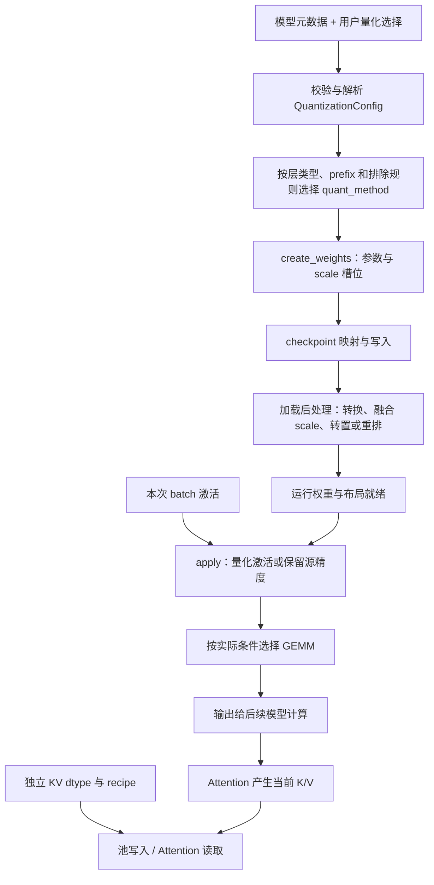
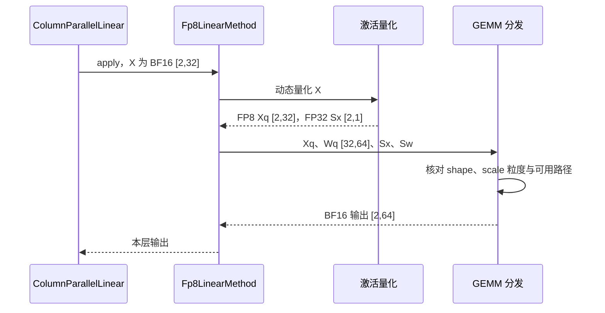
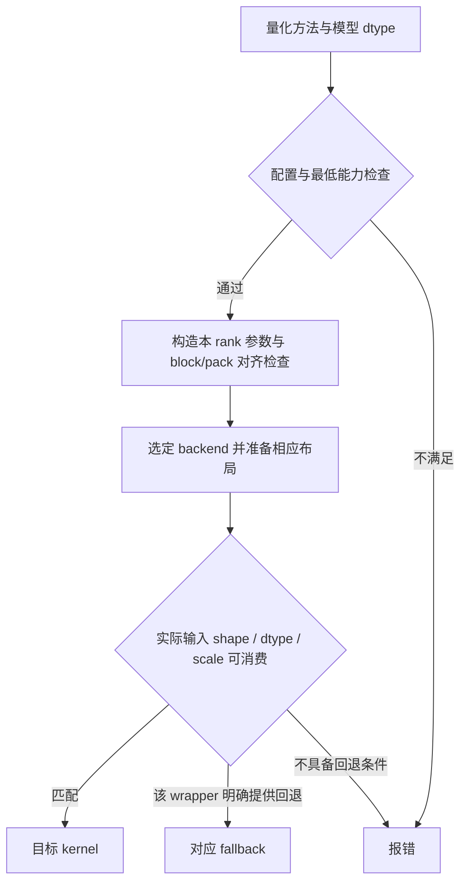
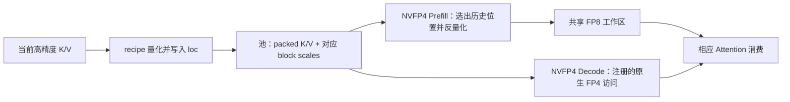

# 量化格式与计算路径

> **先建立架构心智模型：** [M10 · 模型装配状态形态与输入输出](<../architecture/10-模型装配状态形态与输入输出.md>)。先看职责、数据和生命周期，再回到本篇源码细节。

本文是 **09-02，源码分析型学习资料**。承接[模型注册、配置与权重加载](01-模型注册配置与权重加载.md)，回答：**“模型是 FP8/FP4/INT4”到底改变了哪些数据，谁负责转换，最后执行的又是哪种计算？**

人话版：量化像用较少刻度记录数值，并随数据保存“每一格代表多大”的说明。省下多少空间、怎样恢复数值、能调用哪台计算设备，都取决于数据和说明是否配套。只改文件名、dtype 标签或一个启动参数，不能完成这件事。

## 0. 阅读基线与范围

| 项目 | 内容 |
| --- | --- |
| 源码仓库与路径基准 | 官方 `sgl-project/sglang`；源码路径相对于仓库根目录 `.` |
| 分支 | `codex/sglang-source-study-20260909`，基于已拉取的官方 `main` |
| 固定 commit | `72d5c5bb73cadd7ffbf5114e5f81e29d36b6c61a` |
| 读取日期 | `2026-09-10`；沿用 2026-09-09 固定基线 |
| 工作区 | 学习 worktree `sglang-source-study` 干净；原 `muxi-main` 与 26 个未跟踪文件保留 |
| 文档位置 | Wiki `sglang/source-study/09-model-specialization/`，与模型加载、后续 LoRA/模型适配相邻 |
| 主线 | 原生 Llama 的一个 QKV 线性层；纯文本 Dense、单卡、无 bias；从非量化对照走到已量化 FP8 checkpoint、动态激活、普通 forward |
| 主线分支条件 | CUDA SM90、BF16 模型激活、CUTLASS FP8 条件成立、不强制 Marlin；权重非 block、Q/K/V 在 checkpoint 中分别保存；这些是选定的静态阅读条件，未在本机运行 |
| 教学形状 | H=32、Q heads=4、KV heads=2、head_dim=8；Q/K/V 输出宽度 32/16/16；两条 Decode 请求 R1/R2，共 M=2 行。仅用于形状推导，不对应某个下载模型或可直接启动的配置 |
| 分支对照 | 在线 FP8、block FP8/MXFP8、普通 AWQ/Marlin、ModelOpt NVFP4、FP8/FP4 KV |
| 不展开 | AWQ/GPTQ 校准算法、全部量化方案、MoE 路由与通信、各设备全部 kernel 内核、训练与反向传播；只定位有关边界 |
| 证据与操作 | 只读固定源码与五份相关测试文件中的定义；仅执行独立教学算术和文档检查，未下载权重、导入项目/torch、编译 kernel、运行模型或精度/性能测试 |

前置：[系列目录](../README.md)与 09-01。源码锚点支持**源码事实**；数值账本、比喻和图为**整理者归纳**；没有运行观察。数值格式背景另核对了 NVIDIA 官方说明，读取日期同上；它不代替本基线的 SGLang 兼容性判断。

## 1. 先分清权重、激活、KV 与输出

### 1.1 “W8A8”只是一种简写

| 对象 | 通常何时产生 | 使用时间 | 量化改变什么 |
| --- | --- | --- | --- |
| 权重 W | 模型训练/导出；启动时载入，也可能加载时转换 | 跨多个请求复用 | 文件和运行参数的编码、scale、布局 |
| 激活 A/X | 当前 batch 的某一层 forward | 随当前计算产生和消费 | 本次矩阵乘输入的编码及动态/静态 scale |
| KV cache | Attention 为 token 生成 K/V 后写入 | 后续 Decode、前缀复用等继续读取 | 池存储格式、每层/每块 scale、读取转换 |
| GEMM 累加与输出 | 算子内部及返回时 | 交给后续算子 | 累加精度、输出 dtype，不必与输入编码相同 |

W8A8 常用来表示权重和矩阵乘输入都使用 8 bit；W4A16 则区分 4 bit 权重与 16 bit 激活。**这不声明 KV、归一化、softmax、累加器和模型所有层都使用同样精度。** 本基线 FP8 的 Marlin 分支明确不量化激活，输出路径也有独立 dtype 处理。[FP8 后处理][S18] [计算分发][S19] [输出类型][S23]

FP8 E4M3 包含符号位、4 位指数和 3 位尾数；FP4 E2M1 也是浮点编码。INT4 的整数编码不能按同一套规则解读为 FP4。数值格式背景见 [NVIDIA：FP8 与 FP4 说明](https://docs.nvidia.com/deeplearning/transformer-engine/user-guide/examples/fp8_primer.html)。以下具体布局仍以 SGLang 源码为准。

### 1.2 一张图把启动与运行拆开



**图意解读：** 方框是职责。启动侧把长期权重准备好，forward 侧消费本次激活；KV 另外经过池和 Attention。图不表示 QKV GEMM 的输出立刻原样存入 KV，旋转位置编码等模型处理仍在两者之间。[线性层入口][S5] [创建][S6] [forward][S7] [KV dtype][S50]

## 2. 从量化名称到每一层的方法

### 2.1 配置声明、最终配置类和实际方法要分别记录

`ModelConfig._verify_quantization()` 读取 checkpoint 量化信息，处理用户选择、方法 override、允许的重新量化及 draft 特例；不兼容的普通目标模型配置可直接报错。它还检查方法名和平台集合。[S1]

接下来 `get_quantization_config()` 返回配置类；平台可能替换实现。`get_quant_config()` 优先处理 checkpoint 内元数据，并根据方案读取独立配置文件或创建默认在线配置。某些 ModelOpt mixed 元数据不全时还需要文件补齐，不能把“没找到一个固定文件”普遍解释成“没有量化”。[注册选择][S2] [配置来源][S3]

`_get_quantization_config()` 把模型的融合名称映射交给量化配置，并校验最低设备能力和支持的模型激活 dtype；随后还可能调整模块名映射。[S4]

| 记录项 | 为什么需要 |
| --- | --- |
| checkpoint quant_method、配置来源和模型 revision | 说明文件原来是什么格式 |
| 用户 quantization 与生效值 | 自动识别或 override 可能改变选择 |
| QuantizationConfig 实际类 | 相同名字可能有平台实现或混合配置 |
| 每层 quant_method、scheme 与实际 backend | 全局名称不等于每一层的最终计算方式 |
| 模型激活 dtype、KV dtype/recipe | 二者不是权重量化名称的同义词 |

### 2.2 三个接口是一份连贯契约

`LinearBase` 在没有 quant_config 时选择 UnquantizedLinearMethod，否则调用 `quant_config.get_quant_method(self, prefix)`。ColumnParallelLinear 之后创建参数；普通 forward 再调用同一 quant_method 的 apply。[S5] [S6] [S7]

| 接口 | 控制什么 | 完成后应具备什么 |
| --- | --- | --- |
| `create_weights` | 参数名称、shape、dtype、scale 和加载方法 | 存储存在，尚不能假定值已写入 |
| `process_weights_after_loading` | 加载后转换与计算布局 | 数据符合后续消费者的布局约定 |
| `apply` | 本次激活转换与算子调用 | 返回本层输出 |

这是基类定义的生命周期接口，实际动作由各方案实现；不是所有方案都有同样字段或会执行同一种后处理。[基类][S10] [DefaultModelLoader 后处理][S73]

### 2.3 被排除的层仍可保留原精度

Fp8Config 对 LinearBase、FusedMoE 和 RadixAttention 选择不同方法；命中 ignored_layers 的线性层返回非量化方法。[S13]

对于 qkv_proj、gate_up_proj 等融合层，`is_layer_skipped()` 会检查对应的未融合 shard 是否一致。只跳过 Q、却量化同一融合参数中的 K/V，可在这里报错。不能假设任意一段都能独立开关。[S32]

## 3. scale：数值含义比字段名更重要

### 3.1 量化、反量化与倒数的方向

用 `Q_F` 表示舍入/限制到格式 F 可表示的数值集合，可以把一种对称缩放理解为：

```text
q = Q_F(x / s)
x_hat = q * s
```

这是解释用的式子。FP8 的 `Q_F` 不是“取最近整数”；零点、非对称编码、块级 scale 和特殊值还要按具体格式处理。

`input_to_float8()` 内部先计算 `scale=fp_max/amax`，乘它后转换；返回的却是该值的倒数。消费者拿到的是恢复量级所需的乘数。`weight_scale_inv` 这样的名字也不能让读者直接决定在 kernel 中除还是乘。[S20]

已有 block FP8 Triton kernel 的实质是按 K 分块累加：`dot(a,b) * a_s * b_s`，累加器为 FP32，末尾再转换为输出类型。[S29]

教学数值：编码激活 `[4,1]`、scale=0.25，对应 `[1,0.25]`；编码权重 `[2,-4]`、scale=0.5，对应 `[1,-2]`。恢复后点积为 0.5；先算编码点积 4，再乘 0.25×0.5，也得到 0.5。这只是精确可表示值的算术，不是误差或硬件验证。

### 3.2 一个 scale 覆盖多少数据

| 粒度 | 通常的解释 | 本篇对应入口 |
| --- | --- | --- |
| per-tensor | 一整个逻辑张量共用一个 scale | FP8 checkpoint Q/K/V 各自的 scale [S16] |
| per-channel | 每个权重输出通道有自己的 scale | 转置前常沿权重行；转置后对应输出列 [S21] |
| per-token | 当前二维激活每行一个 scale | `[M,K]` 激活配 `[M,1]` scale [S24] |
| per-group / per-block | 一段输入通道或二维 tile 共享 scale | AWQ group、block FP8、NVFP4 各有定义 [S37] [S16] [S44] |

“通道”“行”“列”必须带矩阵方向。后处理可能把权重从 `[N,K]` 转为 `[K,N]`，不能把转置前的 scale 轴解释照搬到转置后。

若沿 K 分成多个块，各块 scale 不同，就不能把它们合成一个任意全局乘数。例如两个块的编码点积均为 2，scale 乘积分别为 0.5、2，总结果为 `2×0.5 + 2×2 = 5`。[分块消费][S29]

### 图解补充：8 位如何分给符号、指数与尾数


[查看原尺寸](../../../images/sglang-source-study/29-fp8-formats.png)（手机查看宽图时可横屏或放大）。

**图意解读：** 逐行比较彩色位格：指数位影响可表示范围，尾数位影响同一区间的分辨率。E4M3 与 E5M2 都是 8 位，但取舍不同。

**对应本篇源码：** 对照 FP8 方法保存和使用 scale 的位置；格式提供表示范围，scale 再把真实张量数值映射进该范围。 [源码：python/sglang/srt/layers/quantization/fp8.py][S11]

**来源与边界：** [Using FP8 and FP4 with Transformer Engine](https://docs.nvidia.com/deeplearning/transformer-engine/user-guide/examples/fp8_primer.html)，NVIDIA Transformer Engine，未标独立发布日期。这张格式图不等于量化算法；scale、block 粒度、累加精度、重排与具体 kernel 仍需分别核对，不能由位数直接推导模型质量或吞吐。 [来源档案 F29](../../../images/sglang-source-study/SOURCES.md#f29)。

## 4. Llama FP8 主线：从三个 scale 到两条请求的输出

### 4.1 先建立非量化对照

教学 QKV 逻辑权重为 `[64,32]`，其中 Q/K/V 各占 32/16/16 行。非量化方法按 `[sum(output_partition_sizes), input_size_per_partition]` 创建源精度 Parameter。普通路径可用 F.linear，部分平台/配置另有实现，不能把所有非量化线性层都称为同一个 kernel。[S8] [S9]

R1/R2 本轮各贡献一行 hidden，输入 X 为 `[2,32]`，输出 QKV 为 `[2,64]`。量化后维度语义仍应保持，改变的是表示和计算过程。

### 4.2 为 FP8 checkpoint 创建的不是只有 weight

本篇选择 Fp8Config：已序列化 FP8、activation_scheme=dynamic、无 weight_block_size、该层不被忽略。配置会检查激活方案等条件。[S11] [S12]

| 构造期字段 | 本例内容 | 作用 |
| --- | --- | --- |
| `logical_widths` | `[32,16,16]` | Q/K/V 的逻辑宽度 |
| `weight` | FP8 E4M3 `[64,32]` | 融合权重存储 |
| `weight_scale` | FP32 `[3]` | Q/K/V 各自的 checkpoint scale |
| `input_scale` | None | 运行时为动态激活计算 scale |
| `orig_dtype` | BF16 | 保留模型源激活类型信息 |

已序列化的静态激活分支会额外创建 input_scale；不能把动态主线的 None 套给它。scale 初始值还可能是哨兵，存储存在不说明已完成加载。[S16]

### 4.3 参数值和 scale 的加载单位不同

Llama legacy 模型映射仍把 checkpoint 的 q/k/v_proj 名称映射到 qkv_proj，并带 `q/k/v` shard_id。[S74]

但与 09-01 的非量化参数不同，Fp8LinearMethod 属于线性参数 V2 支持集合，ColumnParallelLinear 会绑定参数级 `weight_loader_v2`。**模型级 legacy 分发并不妨碍参数级 V2 写入。**[S6] [S77]

| 被写入对象 | 如何理解 shard_id |
| --- | --- |
| ModelWeightParameter | 选融合权重区域，再取本 rank 来源切片 [S81] |
| PerTensorScaleParameter | 将 Q/K/V 标量写入 scale 数组的 0/1/2 槽位 [S82] |
| BlockQuantScaleParameter | 还要把权重行偏移换算为 block scale 的偏移 [S77] |

因此不能拿权重的切片长度原样切 scale 数组，也不能把 scale 的 3 个槽位误认为 TP3。

### 4.4 后处理要与计算路径配套

选定主线满足 CUTLASS FP8 条件、不是 SM120 特殊 per-tensor 分支，也不走 Marlin。后处理将三个逻辑 scale 按宽度展开为 channelwise scale，并把 weight 转置给后续计算。[S18] [S21] [能力判定][S83]

例如 Q/K/V 的 scale 为 0.5、0.25、1：

| 对象 | 后处理前 | 主线后处理后 |
| --- | --- | --- |
| weight | `[64,32]`，Q/K/V 行块 | `[32,64]`，元素数量不变 |
| scale | `[0.5,0.25,1]` | 先展开为 `[64,1]`：32 个 0.5、16 个 0.25、16 个 1 |
| input_scale | None | 继续动态生成 |

另一类 per-tensor 计算分支会取最大 scale，并按逻辑 shard 反量化后重新量化。[S22] **改 scale 却不改相应编码值，通常改变数值。** 例如编码 2、scale=0.25 表示 0.5；改成 scale=0.5 后编码应改为 1 才仍表示 0.5。

### 4.5 两条请求进入 apply



**图意解读：** 这是所选动态 FP8 主线，不是所有方法的固定时序。普通 CUDA 输入在 apply_fp8_linear 中走 per-token 量化；已经由融合算子产生的 FP8 输入则携带 scale，跳过重复量化。[分发][S19] [输入处理与输出 dtype][S23] [量化输出形状][S24]

channelwise 路径还检查矩阵对齐、强制 Triton 开关与调优配置。实际可调用 Triton 或 FP8 scaled GEMM，不能仅凭 Fp8LinearMethod 类名声称“一定调用 CUTLASS”。没有预量化输入时，输出 dtype 沿输入类型；预量化输入另从携带信息或默认值取输出类型。[S23]

## 5. 加入在线转换、block 和 MXFP8

### 5.1 在线权重量化发生在加载后，动态激活发生在 forward

未序列化 FP8 的普通路径先用源参数 dtype 接收权重，加载后才量化。CUTLASS/Marlin 等条件下可采用每输出行的 scale，其他分支可用 per-tensor；之后更新运行 weight 与 scale。[创建][S16] [转换][S18]

这里的“在线权重量化”不表示每条请求都重新量化全部权重。动态激活 scale 则由当前 batch 数据计算。两者阶段和寿命不同。

另外，不能从 `modelopt_fp4` 名称推断“普通 Llama 的所有 Dense 权重会在加载时变成 NVFP4”。当前非序列化 ModelOpt FP4 分支对 LinearBase/ParallelLMHead 返回非量化方法，将对应在线转换限定于 MoE 路径。[S43]

### 5.2 block FP8 需要同时处理张量与 scale 的形状

本基线普通显式 weight_block_size 要求已序列化 FP8、二维 block、动态激活。MXFP8 有自己的特例，不能从这条普通 block 限制推断“所有在线分组量化都不支持”。[S11] [S3]

以独立教学矩阵 W=`[256,256]`、block=`[128,128]` 为例：

| 数据 | 逻辑形状 |
| --- | --- |
| FP8 权重 | `[256,256]` |
| FP32 权重 block scale | `[2,2]` |
| 激活 X，M=3 | `[3,256]` |
| 每 token、每 128 个输入值一组的激活 scale | `[3,2]` |

存储创建按 block 数计算 scale；运行时的消费者可能要求列主序、转置或对齐后的 scale。FlashInfer CUTLASS wrapper 会核对 `[K/block_k,M]` 和 `[K/block_k,N/block_n]`，而其他 backend 有各自约定。[S16] [分组量化][S84] [wrapper][S28]

TP/融合层的每个局部部分也须满足量化块对齐，不能只检查完整矩阵。`validate_block_quant_shapes()` 针对 row/column parallel 和多个逻辑输出分别检查；skip 检查开关只跳过这层检查，不是正确性证明。[S17]

### 5.3 MXFP8 不是任意一种 block FP8 的别名

Fp8Config 的 MXFP8 路径使用 `[1,32]`，scale 存为 UE8M0 的 uint8 编码；普通 block FP8 的 scale 创建为 FP32。直接把 uint8 字节当线性 scale 数值使用会出错。[S11] [S12] [S16]

加载后还可能为选定 backend 准备 swizzle/shuffle 等布局，或走特定平台的 MXFP8→block FP8 转换。后处理和实际消费者必须成对阅读。[S30] [S31]

### 5.4 名称可选、实例可创建、实际 shape 可计算是三道门



**图意解读：** 有限的 fallback 是具体代码分支，不是任意异常后的通用重试。block FP8 的 backend 设置经显式/自动分发；显式 backend 可因平台或包缺失被拒绝。FlashInfer TRTLLM wrapper 对 K<256 或输入非 BF16 的情况明确回到 Triton。[S25] [S26] [S27] [S28]

另一个例子是普通 FP8 在部分设备上自动选择 Marlin，判断范围来自 `can_auto_enable_marlin_fp8()`；后处理明确删除 input_scale，apply 使用权重专用路径。最低能力数字并不证明设备拥有原生 FP8 GEMM，也不构成速度结论。[S14] [S15] [S79] [S18]

## 6. INT4：以普通 AWQ 与 AWQ Marlin 对照

### 6.1 先确定实际选择的是哪条 AWQ 路径

这里阅读 AWQ checkpoint 的运行装配，不解释离线校准如何选出权重。普通 AWQConfig 要求 4 bit，pack_factor=32/4=8；CUDA 普通分支的激活 dtype 列表是 FP16。层选择还要经过类型与排除规则，再配置 scheme。[S33] [S80] [S34]

符合条件的 checkpoint 在自动选择时可被 AWQMarlinConfig override；显式选择 awq 会保留普通 AWQ。AWQ Marlin 又可以对不支持的局部层回退，因此不能只看全局 quantization 字符串。[S35] [S36]

### 6.2 INT32 容器里可以装八个 INT4 编码

普通 AWQLinearMethod 委托 layer.scheme，再由 AWQLinearScheme 创建数据。对单个教学线性层，K=32、N=16、group_size=16：

| 参数 | dtype | shape | 未计 padding 的字节数 |
| --- | --- | --- | ---: |
| qweight | int32 | `[K,N/8]=[32,2]` | 256 |
| qzeros | int32 | `[K/16,N/8]=[2,2]` | 16 |
| scales | FP16 | `[K/16,N]=[2,16]` | 64 |
| 合计 | 三种参数 | 不含激活、临时值等 | 336 |

对应未量化 FP16 权重是 32×16×2=1024 字节。INT4 权重净载荷是 256 字节，但加上这组 scale/zero-point 后是 336，不能把“4 bit”直接等价成“整个模型显存恰好减到四分之一”。[创建与对齐][S37]

这里输出轴是 packed_dim=1，和前面的 `[N,K]` FP8 存储方向不同。输入维度须按 group 对齐，输出维度须按 pack_factor 对齐；TP 太大可能使本 rank 尺寸不满足。[S37]

### 6.3 保存为 INT4，不代表矩阵乘一定以 INT4 输入直接执行

| 路径 | 加载后处理 | apply 的可见行为 |
| --- | --- | --- |
| 普通 AWQ | 整理 qweight/qzeros/scales 为运行参数 | 先 awq_dequantize，再 torch.matmul，最后加 bias/恢复输出 shape |
| AWQ Marlin | repack 权重、重排 scale 和 zero-point，创建 workspace | 调用 apply_awq_marlin_linear 消费专用布局 |

依据是 [方法到 scheme][S38]、[普通 kernel][S39]、[Marlin 后处理][S40]与[Marlin apply][S41]。普通分支存在反量化临时矩阵；Marlin workspace 也不是免费存储。两条路径的实际性能须在相同模型和负载下测量，不能沿用其他版本的 AWQ 经验阈值。

## 7. FP4：以已序列化 ModelOpt NVFP4 Dense 层为例

### 7.1 编码、两级 scale 和排除规则共同确定方案

ModelOptFp4Config 解析 flat/nested 元数据，区分 NVFP4、NVFP4_AWQ、W4A16_NVFP4 等形式；按是否已序列化、层类型和排除规则选择方法。[S42] [S43]

本文只继续已序列化、group_size=16、普通 W4A4 Dense 路径。权重每两个 FP4 编码压入一个 uint8；每 16 个值有一个 FP8 E4M3 block scale，另有全局 FP32 weight_scale_2；激活还有自己的 input_scale。可概括理解为“FP4 编码 × block scale × 全局 scale”，具体 scale 方向仍须看消费处。[创建][S44] [后处理][S45]

对于单个未融合 `[N,K]=[16,32]` 教学层，weight 的 uint8 `[16,16]` 为 256 字节；weight_scale 的 FP8 `[16,2]` 为 32 字节；weight_scale_2 为 4 字节，共 292 字节。若再计 input_scale，为 296 字节。**这是加载布局的局部账本，尚未计入 backend padding、重排和运行临时存储。**

### 7.2 后处理不是简单 dtype 转换

普通 W4A4 后处理取 input_scale 与 weight_scale_2 的归并值，创建 `alpha=input_scale_2×weight_scale_2`、`input_scale_inv=1/input_scale_2`，再按 backend 处理权重与 scale。[S45]

| 布局动作 | 服务于什么 |
| --- | --- |
| K/N padding | 满足相应 kernel 的对齐条件 |
| scale 的 blockwise interleave / shuffle | 让消费者以规定顺序取对应的 scale |
| 记录原始输出宽度 | GEMM 后去除填充的输出列 |
| 记录 packed K 的补齐长度 | 激活的 packed K 也做配套补齐 |

这里存在一个容易被忽略的输入契约：所读 NVFP4 fused-shard 测试让两个 shard **共享全局 scale**，并在注释中说明后处理取 max 时不会重新量化 block scale。不能因此宣称“任意不同的 shard 全局 scale 都会自动被修正”；应检查真实导出布局及对应路径。[S45] [测试构造条件][S66]

### 7.3 apply 要同时消费激活 scale 与权重 scale

普通 W4A4 分支量化当前激活，得到 packed x 和 interleaved scale，补齐 K 后调用 fp4_gemm，裁掉 N 的 padding，再处理 bias。明确允许接收预量化 FP4 tuple 的层才跳过对应量化步骤。[S46]

W4A16、Marlin 和专用融合路径是另一些分支。Fp4GemmRunnerBackend 的名字还会映射为 FlashInfer API 名字；主方法的最低能力返回 80，native Dense 后处理却另外检查 Blackwell 条件，Marlin 又有独立分支。因此最低能力校验不等于 native W4A4 kernel 已可用。[模式选择][S49] [能力][S78] [后处理][S45] [backend][S48] [GEMM 封装][S47]

外部 FlashInfer/设备库的具体实现不由 SGLang commit 单独固定。本篇读到调用边界，未下载外部源码，也未验证其安装与运行。

## 8. KV 量化：另一组配置与生命周期

### 8.1 auto 的规则不能从权重 dtype 猜测

`configure_kv_cache_dtype()` 在 auto 下检查模型 quant_config 的 kv_cache_quant_algo：识别 FP8 时解析为对应 FP8 KV，否则沿模型 dtype。它不是“所有 FP8 权重都必然 FP8 KV”，也不是“NVFP4 权重必然自动 NVFP4 KV”。[S50]

| 局部输入条件 | 此函数的行为 |
| --- | --- |
| auto，元数据 KV algo=FP8 | 选择相应 FP8 dtype 并返回解析标签 |
| auto，没有上述 FP8 元数据 | 使用 model_dtype |
| 显式 fp8_e4m3 / fp8_e5m2 | 按平台解析；E5M2 的 CPU 分支拒绝 |
| 显式 nvfp4 / fp4_mx_block16 | 要求对应 torch FP4 dtype 存在，后续还需 recipe/backend 检查 |
| draft 有独立 KV dtype | 优先处理 draft 设置；DFlash FA4 还有回到模型 dtype 的特例 |

Runner 保存自己的 kv_cache_dtype_str，避免 draft 错读 target 的进程级配置标签。[S76] 表只覆盖已读函数，不是完整的模型、平台与 Attention 兼容清单。

### 8.2 FP8 的 K/V scale 如何从权重走到 Attention

RadixAttention 可让量化方法创建 k_scale/v_scale。BaseKVCacheMethod 先以无效值占位；加载后优先使用各自正 scale，二者都缺失时用 1；只有兼容的单一 k_scale 时可复制给 V。它只支持该路径的 per-tensor scale，部分 FP8 平台还要调整表示。[创建][S75] [槽位][S51] [后处理][S52]

MHA 池普通 FP8 写入分支在输入 dtype 与池不同的情况下，按传入 scale 除 K/V 再转换 dtype；保存的低精度值必须与 scale 配套。FlashInfer Decode 又把相应 k_scale_float/v_scale_float 交给 Attention wrapper。[S53] [S54]

scale=1 的默认值让该处具备确定行为，**不是“所有模型用 1 都没有精度损失”的证明**。权重 scale、激活 scale、K scale 和 V scale 不能互相替代。

### 8.3 两种 FP4 KV recipe 不能用同一个 storage dtype 区分

`resolve_kv_cache_quant()` 明确要求 recipe 名称：`nvfp4` 与 `fp4_mx_block16`；仅传 torch FP4 storage dtype 不足以决定 recipe。旧 fp4_e2m1 被拒绝；mxfp4 名字保留给 block-size-32 语义，不能拿来称呼这里的 block16 方案。[S55]

| 项目 | nvfp4 KV | fp4_mx_block16 KV |
| --- | --- | --- |
| 编码与块 | FP4 E2M1，block16 | FP4 E2M1，block16 |
| scale | FP8 block scale + 每层全局 FP32 | uint8 指数编码的单级 scale |
| 主要注册读取规则 | Prefill：FlashInfer，反量化工作区为 FP8；Decode：trtllm_mha 原生 FP4 | 注册的普通读取路径先恢复 BF16；Prefill 额外包含 fa4 |
| 池中的共享 dq 工作区 | K/V 各一份，跨层复用 | 当前 recipe 不分配该类共享 dq 工作区 |
| 不能推导的结论 | 所有 Attention backend 都能读原生 FP4 | 没有共享 dq 工作区就没有任何临时反量化存储 |

依据：[recipe 注册表][S56]、[NVFP4 buffers][S57]、[block16 方法][S61]与[指数/打包规则][S62]。表描述局部注册事实，启动参数仍经过 [KV4 compatibility hook][S63]；CUDA、具体架构及 Prefill/Decode 后端组合还有限制。



**图意解读：** 以 NVFP4 为例，pool 保存持久缓冲区，recipe 负责量化/反量化计算，Attention 消费适合自己的视图。图中“共享”指跨模型层复用的工作区，不是任意并发消费者可无序覆盖。[写入][S58] [读取转换][S59] [缓冲区][S57]

例如 R1 新 KV 写到 loc=5，R2 写到 loc=9，对应 block scale 也必须写到同一 loc；只移动 packed 值却不移动 scale 会改变它们的含义。量化不接管请求槽位释放或前缀树淘汰策略；这些所有权仍沿缓存/调度主线追踪。

## 9. 显存与性能：把账算完整再提出假设

### 9.1 FP8 权重的局部账本

主线 `[64,32]` QKV：BF16 权重为 4096 字节；FP8 权重为 2048。若最终 channelwise scale 有 64 个 FP32，则再加 256，局部合计 2304。它不包括激活量化结果、scale、图内存或任何其他模型层。

在线转换可能先驻留源精度权重，再产生量化参数与临时转换值。加载峰值不一定等于最终权重大小。[S16] [S18]

### 9.2 NVFP4 KV 也不只有四位编码

教学池：4 层、每层 8 个 KV head、head_dim=128，按一个 token 的容量单位计算：

| 项目 | 算式 | 字节 |
| --- | --- | ---: |
| 4 层 packed K+V | `8×64×4×2` | 4096 |
| 每块一个字节的 scale | `8×8×4×2` | 512 |
| 跨层共享 FP8 dq K+V | `8×128×2` | 2048 |
| 该函数的容量账本合计 | 三项相加 | 6656 |

`NVFP4KVCacheMethod.compute_cell_size()` 正是按持久数据、scale、共享工作区分开计数；工作区不再乘层数。每层全局 scale、分配器元数据、padding 和其他模型内存还须另外考虑，不能把这里的 6656 当整个进程的实际增量。[S60] [测试定义][S68]

### 9.3 “小一些”不直接推出“快一些”

量化可能减少权重或 KV 搬运，但也增加量化、反量化、重排、scale 访问、padding 或临时缓冲区。需结合实际 kernel、M/N/K、Prefill/Decode 比例和缓存命中比较。普通 AWQ 的显式反量化、FP8 wrapper 的 shape 回退，都是为什么必须记录实际执行路径的源码例子。[S39] [S28]

精度也需要分层：先对比编码/scale 的恢复，再对比单层输出，最后检查模型任务结果；“没有 NaN”“输出不是空字符串”“某测试文件有阈值”均不能代替精度验收。

## 10. 从现象回到边界

| 现象 | 先查什么 | 首要源码 |
| --- | --- | --- |
| quantization 与模型声明冲突 | 生效选择、checkpoint 元数据、目标/草稿与 requant 特例 | [ModelConfig][S1] |
| 方法存在却不能创建模型 | 模型 dtype、设备能力、平台替换后的配置类 | [配置加载][S4] |
| 只有部分层没被量化 | ignored/exclude、融合 shard、模型层类型 | [FP8 方法选择][S13] [融合一致性][S32] |
| TP 增大后 scale/shape 错误 | 本 rank 的 block/group/pack 对齐与 scale 轴 | [FP8 对齐][S17] [AWQ][S37] |
| 加载成功但输出异常 | scale 方向、哨兵、融合全局 scale、post-load 是否执行 | [后处理入口][S73] [NVFP4 条件][S66] |
| 指定 backend 后启动报错 | 显式分支的平台/依赖要求 | [block FP8 显式分发][S26] [FP4 GEMM][S47] |
| 服务运行但没有预期加速 | 实际 shape 回退、激活转换、padding、临时矩阵 | [FP8 wrapper][S28] [AWQ apply][S39] |
| KV 开关后长文本质量变化 | 独立 KV recipe、K/V scale 与恢复过程 | [dtype][S50] [scale][S52] [读取][S54] |
| FP4 KV 某阶段不能读取 | recipe 与 Prefill/Decode 访问规则是否匹配 | [注册][S56] [参数检查][S63] |

回退没有修复模型数值语义的普遍能力。名称、shape 和值必须逐层对应，不要把本来不同的 INT4/FP4 数据强制换标签后期待 kernel 自行识别。

## 11. 阅读路线与验证记录

### 11.1 建议按一层走到消费者

| 顺序 | 仓内源码锚点 | 应回答的问题 |
| --- | --- | --- |
| 1 | `python/sglang/srt/configs/model_config.py::ModelConfig._verify_quantization` [S1] | 生效量化选择是什么 |
| 2 | `python/sglang/srt/model_loader/weight_utils.py::get_quant_config` [S3] | scale/布局元数据从何而来 |
| 3 | `python/sglang/srt/layers/linear.py::LinearBase.__init__` [S5] | 此层选了哪个方法 |
| 4 | `python/sglang/srt/layers/quantization/fp8.py::Fp8LinearMethod.create_fp8_weight_` [S16] | 参数和 scale 分别怎样分配 |
| 5 | `python/sglang/srt/layers/quantization/fp8.py::Fp8LinearMethod.process_weights_after_loading` [S18] | 写入后还改变了什么 |
| 6 | `python/sglang/srt/layers/quantization/fp8_utils.py::apply_fp8_linear` [S23] | 当前输入怎样量化并选择 GEMM |
| 7 | `python/sglang/srt/mem_cache/kv_cache_dtype.py::configure_kv_cache_dtype` [S50] | KV 是否走另一套精度 |
| 8 | `python/sglang/srt/layers/quantization/fp4_kv_cache_quant_method.py::NVFP4KVCacheMethod` [S57] | recipe 与池/工作区如何衔接 |

### 11.2 已阅读的测试定义与限度

本次以下五份文件中的相关定义均**未执行**，没有把 threshold 或参考值写成本次成绩。

| 测试入口 | 定义中的关注点 | 不能推导什么 |
| --- | --- | --- |
| [FP8 blockwise backend][S64] | 构造量化层、加载、后处理、按设备集合对照单层输出 | 不证明完整模型质量；测试构造还会跳过部分 shape 检查 |
| [NVFP4 linear backend][S65] | 不同 backend、量化后恢复参考、融合 shard；构造用共享全局 scale [S66] | 不证明任意导出布局都等价 |
| [FP4 KV registry][S67]、[NVFP4][S68]、[block16][S69] | recipe 名称、buffer 形状、局部容量、roundtrip | CPU 结构检查不等于真实 GPU Attention 通过 |
| [AWQ 服务][S70]与[AWQ Marlin BF16][S71] | 启动特定模型后做 MMLU；普通测试未显式固定普通 AWQ 分支 | 不应把自动选型测试解释成普通 AWQ kernel 单测 |
| [Llama FP8 KV + Triton][S72] | 指定量化/KV/backend 后做 GSM8K | 不是所有 FP8 模型、所有 Attention 的精度证明 |

本篇已静态核对 84 个固定源码锚点及核心分支，独立核算 scale 展开/方向、分块点积、INT4 packing 的容量、TP 对齐和 KV 工作区账本。Mermaid 仅核对语义与结构，未运行渲染器。

### 11.3 后续实际验收需要保存什么

至少保存源码及依赖版本、模型 snapshot/校验清单、量化配置原文与生效值、每个代表层的方法和 backend、shape/dtype/stride/scale 布局、转换前后关键数值。再分别记录单层对照、模型任务质量、峰值显存与实际负载下的延迟/吞吐。

先锁定同一个模型与请求集合，只改变一项条件。若需要外部 kernel 库或校准工具，其版本另固定；不要把本篇静态结果写成实际精度或性能承诺。

## 12. 自测与答案

1. FP8 权重是否意味着激活、KV、累加器与输出全部 FP8？
2. 本例三个 Q/K/V scale 为什么可以展开为 64 个 channel scale？
3. scale 从 0.25 改成 0.5，而编码 2 不变，数值发生了什么？
4. 为什么 block scale 的 shape 不能直接沿用权重的 TP 切片长度？
5. 普通 AWQ 的 qweight dtype=int32，是否意味着权重是 32 bit？
6. modelopt_fp4 作用于未序列化 checkpoint，是否会自动量化 Llama 所有 Dense 层？
7. 相同 torch FP4 storage dtype 是否足够选择 KV recipe？
8. 本文 NVFP4 KV 容量账本为什么没有给 dq 工作区再乘 4 层？

**参考答案：**

1. 不意味着。每种数据和计算阶段分别选择，Marlin 分支就是反例。
2. 每个 scale 对应逻辑投影，按宽度 32/16/16 扩展；这不改变各行的量级含义。
3. 0.5 变为 1；保持 0.5 需要配套重新编码为 1。
4. scale 对应 block/group 而非单个权重元素，还受方向、packing 与局部对齐约束。
5. 不是。普通 AWQ 用一个 int32 容器装八个四位编码，还另存 zero-point 与 scale。
6. 不能这样推断。本基线该非序列化 ModelOpt 路径对 Dense 返回非量化方法，在线转换有指定 MoE 范围。
7. 不够。NVFP4 与 block16 的 scale recipe 和读取路径不同，源码要求显式名称。
8. 该 workspace 跨层复用；持久 K/V 和每块 scale 则按层存储。

读完应能选中一个实际层，沿“配置 → 参数/scale → 加载后布局 → 激活转换 → kernel → 输出”走通，并独立说明 KV 的精度和读取方式。

下一篇为 [09-03《MultiLoRA 加载、调度与隔离》](03-MultiLoRA加载调度与隔离.md)：研究基础权重之外的 adapter 如何登记、驻留和被 batch 消费。

[S1]: https://github.com/sgl-project/sglang/blob/72d5c5bb73cadd7ffbf5114e5f81e29d36b6c61a/python/sglang/srt/configs/model_config.py#L1656
[S2]: https://github.com/sgl-project/sglang/blob/72d5c5bb73cadd7ffbf5114e5f81e29d36b6c61a/python/sglang/srt/layers/quantization/__init__.py#L150
[S3]: https://github.com/sgl-project/sglang/blob/72d5c5bb73cadd7ffbf5114e5f81e29d36b6c61a/python/sglang/srt/model_loader/weight_utils.py#L280
[S4]: https://github.com/sgl-project/sglang/blob/72d5c5bb73cadd7ffbf5114e5f81e29d36b6c61a/python/sglang/srt/model_loader/loader.py#L166
[S5]: https://github.com/sgl-project/sglang/blob/72d5c5bb73cadd7ffbf5114e5f81e29d36b6c61a/python/sglang/srt/layers/linear.py#L167
[S6]: https://github.com/sgl-project/sglang/blob/72d5c5bb73cadd7ffbf5114e5f81e29d36b6c61a/python/sglang/srt/layers/linear.py#L334
[S7]: https://github.com/sgl-project/sglang/blob/72d5c5bb73cadd7ffbf5114e5f81e29d36b6c61a/python/sglang/srt/layers/linear.py#L492
[S8]: https://github.com/sgl-project/sglang/blob/72d5c5bb73cadd7ffbf5114e5f81e29d36b6c61a/python/sglang/srt/layers/quantization/unquant.py#L434
[S9]: https://github.com/sgl-project/sglang/blob/72d5c5bb73cadd7ffbf5114e5f81e29d36b6c61a/python/sglang/srt/layers/quantization/unquant.py#L460
[S10]: https://github.com/sgl-project/sglang/blob/72d5c5bb73cadd7ffbf5114e5f81e29d36b6c61a/python/sglang/srt/layers/quantization/base_config.py#L24
[S11]: https://github.com/sgl-project/sglang/blob/72d5c5bb73cadd7ffbf5114e5f81e29d36b6c61a/python/sglang/srt/layers/quantization/fp8.py#L239
[S12]: https://github.com/sgl-project/sglang/blob/72d5c5bb73cadd7ffbf5114e5f81e29d36b6c61a/python/sglang/srt/layers/quantization/fp8.py#L319
[S13]: https://github.com/sgl-project/sglang/blob/72d5c5bb73cadd7ffbf5114e5f81e29d36b6c61a/python/sglang/srt/layers/quantization/fp8.py#L362
[S14]: https://github.com/sgl-project/sglang/blob/72d5c5bb73cadd7ffbf5114e5f81e29d36b6c61a/python/sglang/srt/layers/quantization/fp8.py#L302
[S15]: https://github.com/sgl-project/sglang/blob/72d5c5bb73cadd7ffbf5114e5f81e29d36b6c61a/python/sglang/srt/layers/quantization/fp8.py#L474
[S16]: https://github.com/sgl-project/sglang/blob/72d5c5bb73cadd7ffbf5114e5f81e29d36b6c61a/python/sglang/srt/layers/quantization/fp8.py#L548
[S17]: https://github.com/sgl-project/sglang/blob/72d5c5bb73cadd7ffbf5114e5f81e29d36b6c61a/python/sglang/srt/layers/quantization/fp8.py#L507
[S18]: https://github.com/sgl-project/sglang/blob/72d5c5bb73cadd7ffbf5114e5f81e29d36b6c61a/python/sglang/srt/layers/quantization/fp8.py#L890
[S19]: https://github.com/sgl-project/sglang/blob/72d5c5bb73cadd7ffbf5114e5f81e29d36b6c61a/python/sglang/srt/layers/quantization/fp8.py#L1013
[S20]: https://github.com/sgl-project/sglang/blob/72d5c5bb73cadd7ffbf5114e5f81e29d36b6c61a/python/sglang/srt/layers/quantization/fp8_utils.py#L1398
[S21]: https://github.com/sgl-project/sglang/blob/72d5c5bb73cadd7ffbf5114e5f81e29d36b6c61a/python/sglang/srt/layers/quantization/utils.py#L141
[S22]: https://github.com/sgl-project/sglang/blob/72d5c5bb73cadd7ffbf5114e5f81e29d36b6c61a/python/sglang/srt/layers/quantization/utils.py#L164
[S23]: https://github.com/sgl-project/sglang/blob/72d5c5bb73cadd7ffbf5114e5f81e29d36b6c61a/python/sglang/srt/layers/quantization/fp8_utils.py#L1858
[S24]: https://github.com/sgl-project/sglang/blob/72d5c5bb73cadd7ffbf5114e5f81e29d36b6c61a/python/sglang/kernels/ops/quantization/fp8_kernel.py#L804
[S25]: https://github.com/sgl-project/sglang/blob/72d5c5bb73cadd7ffbf5114e5f81e29d36b6c61a/python/sglang/srt/layers/quantization/fp8_utils.py#L556
[S26]: https://github.com/sgl-project/sglang/blob/72d5c5bb73cadd7ffbf5114e5f81e29d36b6c61a/python/sglang/srt/layers/quantization/fp8_utils.py#L716
[S27]: https://github.com/sgl-project/sglang/blob/72d5c5bb73cadd7ffbf5114e5f81e29d36b6c61a/python/sglang/srt/layers/quantization/fp8_utils.py#L778
[S28]: https://github.com/sgl-project/sglang/blob/72d5c5bb73cadd7ffbf5114e5f81e29d36b6c61a/python/sglang/srt/layers/quantization/fp8_utils.py#L827
[S29]: https://github.com/sgl-project/sglang/blob/72d5c5bb73cadd7ffbf5114e5f81e29d36b6c61a/python/sglang/kernels/ops/quantization/fp8_kernel.py#L941
[S30]: https://github.com/sgl-project/sglang/blob/72d5c5bb73cadd7ffbf5114e5f81e29d36b6c61a/python/sglang/srt/layers/quantization/fp8.py#L677
[S31]: https://github.com/sgl-project/sglang/blob/72d5c5bb73cadd7ffbf5114e5f81e29d36b6c61a/python/sglang/srt/layers/quantization/fp8_utils.py#L574
[S32]: https://github.com/sgl-project/sglang/blob/72d5c5bb73cadd7ffbf5114e5f81e29d36b6c61a/python/sglang/srt/layers/quantization/utils.py#L70
[S33]: https://github.com/sgl-project/sglang/blob/72d5c5bb73cadd7ffbf5114e5f81e29d36b6c61a/python/sglang/srt/layers/quantization/awq/awq.py#L71
[S34]: https://github.com/sgl-project/sglang/blob/72d5c5bb73cadd7ffbf5114e5f81e29d36b6c61a/python/sglang/srt/layers/quantization/awq/awq.py#L136
[S35]: https://github.com/sgl-project/sglang/blob/72d5c5bb73cadd7ffbf5114e5f81e29d36b6c61a/python/sglang/srt/layers/quantization/awq/awq.py#L333
[S36]: https://github.com/sgl-project/sglang/blob/72d5c5bb73cadd7ffbf5114e5f81e29d36b6c61a/python/sglang/srt/layers/quantization/awq/awq.py#L356
[S37]: https://github.com/sgl-project/sglang/blob/72d5c5bb73cadd7ffbf5114e5f81e29d36b6c61a/python/sglang/srt/layers/quantization/awq/schemes/awq_linear.py#L30
[S38]: https://github.com/sgl-project/sglang/blob/72d5c5bb73cadd7ffbf5114e5f81e29d36b6c61a/python/sglang/srt/layers/quantization/awq/awq.py#L427
[S39]: https://github.com/sgl-project/sglang/blob/72d5c5bb73cadd7ffbf5114e5f81e29d36b6c61a/python/sglang/srt/hardware_backend/gpu/quantization/awq_kernels.py#L88
[S40]: https://github.com/sgl-project/sglang/blob/72d5c5bb73cadd7ffbf5114e5f81e29d36b6c61a/python/sglang/srt/hardware_backend/gpu/quantization/awq_kernels.py#L112
[S41]: https://github.com/sgl-project/sglang/blob/72d5c5bb73cadd7ffbf5114e5f81e29d36b6c61a/python/sglang/srt/hardware_backend/gpu/quantization/awq_kernels.py#L147
[S42]: https://github.com/sgl-project/sglang/blob/72d5c5bb73cadd7ffbf5114e5f81e29d36b6c61a/python/sglang/srt/layers/quantization/modelopt_quant.py#L1500
[S43]: https://github.com/sgl-project/sglang/blob/72d5c5bb73cadd7ffbf5114e5f81e29d36b6c61a/python/sglang/srt/layers/quantization/modelopt_quant.py#L1606
[S44]: https://github.com/sgl-project/sglang/blob/72d5c5bb73cadd7ffbf5114e5f81e29d36b6c61a/python/sglang/srt/layers/quantization/modelopt_quant.py#L1698
[S45]: https://github.com/sgl-project/sglang/blob/72d5c5bb73cadd7ffbf5114e5f81e29d36b6c61a/python/sglang/srt/layers/quantization/modelopt_quant.py#L1788
[S46]: https://github.com/sgl-project/sglang/blob/72d5c5bb73cadd7ffbf5114e5f81e29d36b6c61a/python/sglang/srt/layers/quantization/modelopt_quant.py#L1978
[S47]: https://github.com/sgl-project/sglang/blob/72d5c5bb73cadd7ffbf5114e5f81e29d36b6c61a/python/sglang/srt/layers/quantization/modelopt_quant.py#L132
[S48]: https://github.com/sgl-project/sglang/blob/72d5c5bb73cadd7ffbf5114e5f81e29d36b6c61a/python/sglang/srt/layers/quantization/fp4_utils.py#L93
[S49]: https://github.com/sgl-project/sglang/blob/72d5c5bb73cadd7ffbf5114e5f81e29d36b6c61a/python/sglang/srt/layers/quantization/modelopt_quant.py#L1687
[S50]: https://github.com/sgl-project/sglang/blob/72d5c5bb73cadd7ffbf5114e5f81e29d36b6c61a/python/sglang/srt/mem_cache/kv_cache_dtype.py#L23
[S51]: https://github.com/sgl-project/sglang/blob/72d5c5bb73cadd7ffbf5114e5f81e29d36b6c61a/python/sglang/srt/layers/quantization/kv_cache.py#L32
[S52]: https://github.com/sgl-project/sglang/blob/72d5c5bb73cadd7ffbf5114e5f81e29d36b6c61a/python/sglang/srt/layers/quantization/kv_cache.py#L51
[S53]: https://github.com/sgl-project/sglang/blob/72d5c5bb73cadd7ffbf5114e5f81e29d36b6c61a/python/sglang/srt/mem_cache/memory_pool.py#L2518
[S54]: https://github.com/sgl-project/sglang/blob/72d5c5bb73cadd7ffbf5114e5f81e29d36b6c61a/python/sglang/srt/layers/attention/flashinfer_backend.py#L1451
[S55]: https://github.com/sgl-project/sglang/blob/72d5c5bb73cadd7ffbf5114e5f81e29d36b6c61a/python/sglang/srt/layers/quantization/fp4_kv_cache_quant_method.py#L858
[S56]: https://github.com/sgl-project/sglang/blob/72d5c5bb73cadd7ffbf5114e5f81e29d36b6c61a/python/sglang/srt/layers/quantization/fp4_kv_cache_quant_method.py#L831
[S57]: https://github.com/sgl-project/sglang/blob/72d5c5bb73cadd7ffbf5114e5f81e29d36b6c61a/python/sglang/srt/layers/quantization/fp4_kv_cache_quant_method.py#L485
[S58]: https://github.com/sgl-project/sglang/blob/72d5c5bb73cadd7ffbf5114e5f81e29d36b6c61a/python/sglang/srt/layers/quantization/fp4_kv_cache_quant_method.py#L536
[S59]: https://github.com/sgl-project/sglang/blob/72d5c5bb73cadd7ffbf5114e5f81e29d36b6c61a/python/sglang/srt/layers/quantization/fp4_kv_cache_quant_method.py#L567
[S60]: https://github.com/sgl-project/sglang/blob/72d5c5bb73cadd7ffbf5114e5f81e29d36b6c61a/python/sglang/srt/layers/quantization/fp4_kv_cache_quant_method.py#L588
[S61]: https://github.com/sgl-project/sglang/blob/72d5c5bb73cadd7ffbf5114e5f81e29d36b6c61a/python/sglang/srt/layers/quantization/fp4_kv_cache_quant_method.py#L611
[S62]: https://github.com/sgl-project/sglang/blob/72d5c5bb73cadd7ffbf5114e5f81e29d36b6c61a/python/sglang/srt/layers/quantization/kvfp4_tensor.py#L49
[S63]: https://github.com/sgl-project/sglang/blob/72d5c5bb73cadd7ffbf5114e5f81e29d36b6c61a/python/sglang/srt/arg_groups/kv_cache_hook.py#L37
[S64]: https://github.com/sgl-project/sglang/blob/72d5c5bb73cadd7ffbf5114e5f81e29d36b6c61a/test/registered/unit/layers/quantization/test_fp8_blockwise_linear_backends.py#L140
[S65]: https://github.com/sgl-project/sglang/blob/72d5c5bb73cadd7ffbf5114e5f81e29d36b6c61a/test/registered/unit/layers/quantization/test_nvfp4_linear_backends.py#L120
[S66]: https://github.com/sgl-project/sglang/blob/72d5c5bb73cadd7ffbf5114e5f81e29d36b6c61a/test/registered/unit/layers/quantization/test_nvfp4_linear_backends.py#L70
[S67]: https://github.com/sgl-project/sglang/blob/72d5c5bb73cadd7ffbf5114e5f81e29d36b6c61a/test/registered/unit/layers/quantization/test_fp4_kv_cache_quant_method.py#L23
[S68]: https://github.com/sgl-project/sglang/blob/72d5c5bb73cadd7ffbf5114e5f81e29d36b6c61a/test/registered/unit/layers/quantization/test_fp4_kv_cache_quant_method.py#L165
[S69]: https://github.com/sgl-project/sglang/blob/72d5c5bb73cadd7ffbf5114e5f81e29d36b6c61a/test/registered/unit/layers/quantization/test_fp4_kv_cache_quant_method.py#L274
[S70]: https://github.com/sgl-project/sglang/blob/72d5c5bb73cadd7ffbf5114e5f81e29d36b6c61a/test/registered/quant/test_awq.py#L20
[S71]: https://github.com/sgl-project/sglang/blob/72d5c5bb73cadd7ffbf5114e5f81e29d36b6c61a/test/registered/quant/test_awq.py#L50
[S72]: https://github.com/sgl-project/sglang/blob/72d5c5bb73cadd7ffbf5114e5f81e29d36b6c61a/test/registered/quant/test_fp8kv_triton.py#L19
[S73]: https://github.com/sgl-project/sglang/blob/72d5c5bb73cadd7ffbf5114e5f81e29d36b6c61a/python/sglang/srt/model_loader/loader.py#L993
[S74]: https://github.com/sgl-project/sglang/blob/72d5c5bb73cadd7ffbf5114e5f81e29d36b6c61a/python/sglang/srt/models/llama.py#L669
[S75]: https://github.com/sgl-project/sglang/blob/72d5c5bb73cadd7ffbf5114e5f81e29d36b6c61a/python/sglang/srt/layers/radix_attention.py#L103
[S76]: https://github.com/sgl-project/sglang/blob/72d5c5bb73cadd7ffbf5114e5f81e29d36b6c61a/python/sglang/srt/model_executor/model_runner.py#L1402
[S77]: https://github.com/sgl-project/sglang/blob/72d5c5bb73cadd7ffbf5114e5f81e29d36b6c61a/python/sglang/srt/layers/linear.py#L1147
[S78]: https://github.com/sgl-project/sglang/blob/72d5c5bb73cadd7ffbf5114e5f81e29d36b6c61a/python/sglang/srt/layers/quantization/modelopt_quant.py#L1463
[S79]: https://github.com/sgl-project/sglang/blob/72d5c5bb73cadd7ffbf5114e5f81e29d36b6c61a/python/sglang/srt/layers/quantization/fp8_utils.py#L2126
[S80]: https://github.com/sgl-project/sglang/blob/72d5c5bb73cadd7ffbf5114e5f81e29d36b6c61a/python/sglang/srt/layers/quantization/awq/awq.py#L105
[S81]: https://github.com/sgl-project/sglang/blob/72d5c5bb73cadd7ffbf5114e5f81e29d36b6c61a/python/sglang/srt/layers/parameter.py#L226
[S82]: https://github.com/sgl-project/sglang/blob/72d5c5bb73cadd7ffbf5114e5f81e29d36b6c61a/python/sglang/srt/layers/parameter.py#L376
[S83]: https://github.com/sgl-project/sglang/blob/72d5c5bb73cadd7ffbf5114e5f81e29d36b6c61a/python/sglang/srt/layers/quantization/fp8_utils.py#L272
[S84]: https://github.com/sgl-project/sglang/blob/72d5c5bb73cadd7ffbf5114e5f81e29d36b6c61a/python/sglang/kernels/ops/quantization/fp8_kernel.py#L607
