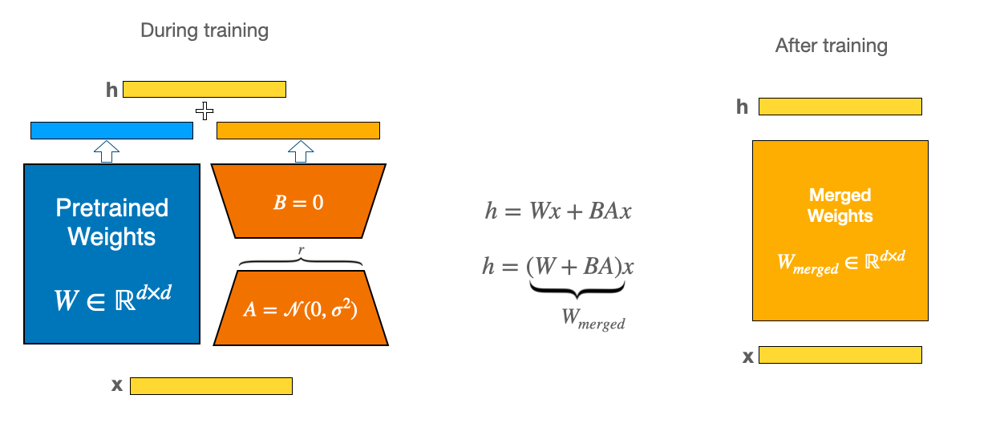
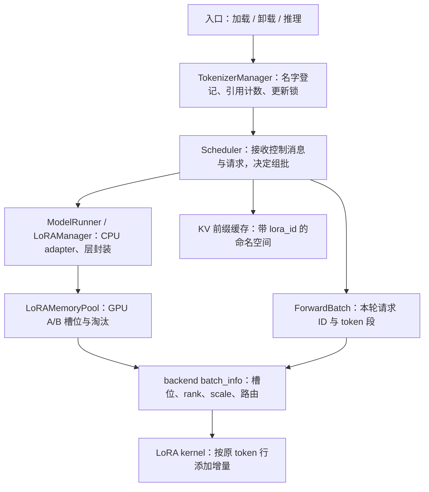
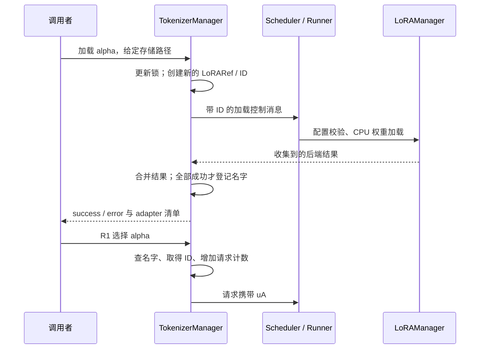
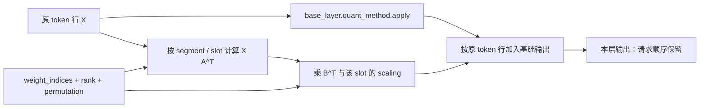
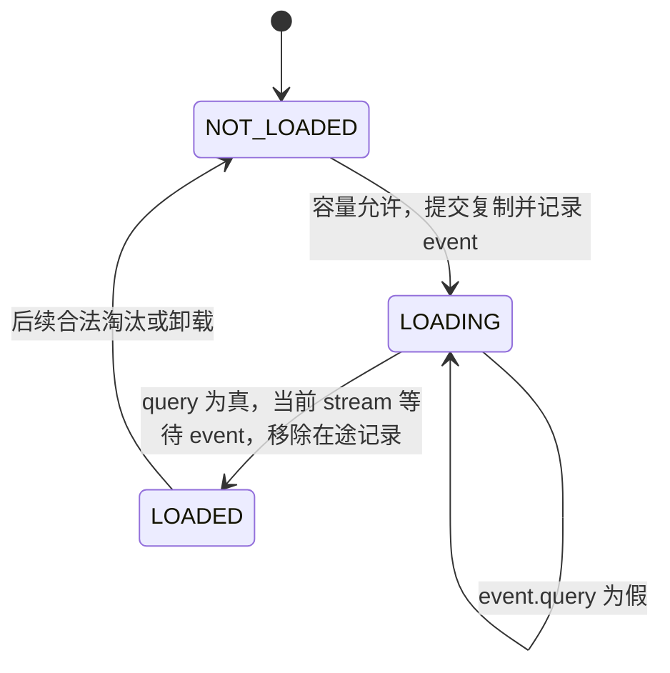

# MultiLoRA 加载、调度与隔离

本文是 **09-03，源码分析型学习资料**。承接[量化格式与计算路径](02-量化格式与计算路径.md)，沿一条主线回答：**同一个基础模型接到使用不同 adapter 的请求后，怎样选对权重、装进 GPU、混合执行，并在更新时释放旧状态？**

人话版：基础模型像一套公共工具，adapter 是不同任务附带的小套件。请求要带着正确的套件编号；套件可以先放在 CPU，轮到使用时再搬入有限的 GPU 槽位。登记名字、占用槽位和一次计算完成，是不同的事情。

## 0. 阅读基线与范围

| 项目 | 内容 |
| --- | --- |
| 源码仓库与路径基准 | 官方 `sgl-project/sglang`；源码路径相对于仓库根目录 `.` |
| 分支 | `codex/sglang-source-study-20260909`，基于已拉取的官方 `main` |
| 固定 commit | `72d5c5bb73cadd7ffbf5114e5f81e29d36b6c61a` |
| 读取日期 | `2026-09-10`；继续使用 2026-09-09 固定基线 |
| 工作区 | 学习 worktree `sglang-source-study` 干净；原 `muxi-main` 和 26 个未跟踪文件保留 |
| 文档位置 | Wiki `sglang/source-study/09-model-specialization/`，与加载、量化及后续模型专题相邻 |
| 主线 | 原生 Llama 文本 Dense、BF16、TP1/PP1/DP1、普通 Prefill/Decode；代表层为 Attention 的 o_proj；显式选 Triton LoRA backend |
| 主线开关 | 启用 LoRA；不启用投机、会话、HiCache、量化、CUDA Graph 和 LoRA overlap loading；普通前缀缓存仍按当前 UnifiedRadixCache 主线分析 |
| 教学请求 | R1 用 alpha，R2 用 beta，R3 用基础模型；GPU 容量 C=3、最大 rank=4，alpha rank=2、beta rank=4；短 ID uA/uB 只是实际 ID 的教学代号 |
| 分支对照 | GPU 淘汰、动态卸载/自动重载、加载与计算重叠、公平性 drain、TP 与 Graph 的接口边界 |
| 不展开 | LoRA 训练、全体 PEFT 变种、全部模型/backend、MoE 专用实现、分布式故障恢复的完整证明 |
| 操作与证据 | 只读源码和四份相关测试文件中的定义；执行独立算术、路由账本与文档检查。未下载模型/adapter、导入项目/torch、运行 kernel、服务、单测或模型质量/性能实验 |

前置：[目录](../README.md)、09-01/09-02，以及 03 调度、04 缓存、05 执行的基本概念。下面以固定源码支持**源码事实**；数字、图和比喻为**整理者归纳**；没有运行观察。LoRA 原理背景核对 [Hu 等人的原始论文 v2](https://arxiv.org/abs/2106.09685v2)，读取日期同上；本文不复述论文性能数字。

## 1. LoRA 改变什么，MultiLoRA 多了什么

### 1.1 先只看一个线性层

LoRA 用低秩矩阵表达权重增量。以行向量输入约定表示，一层可理解为：

```text
W: [N,K]     A: [r,K]     B: [N,r]
X: [M,K]     s = alpha / r

Y = X W^T + s (X A^T) B^T
```

这里 r 是 adapter 的低秩维度，不是 GPU rank。SGLang 的 LoRAAdapter 保存 `lora_alpha / r`；本篇 RowParallelLinearWithLoRA 分支先得到基础层输出，再让 LoRA backend 添加增量。[scale][S25] [层计算][S46] [两次乘法][S47]

单个 adapter 可以有自己的 A/B；同 batch 多 adapter 时，不应把某一套增量永久加进共享 W，再拿这个 W 服务所有请求。所选实现用“基础层 + 按请求选择的增量”执行。量化的 base quant_method 仍是另一层选择；它的存在不证明任意量化与 LoRA 组合都受支持。

**独立算例：** 取 K=N=4、W 为单位矩阵，X=[1,2,3,4]，A 的两行分别选 X 的第 1、2 个值，B 的四行是 [1,0]、[0,1]、[1,1]、[0,0]。r=2、alpha=4，故 s=2：

```text
X A^T = [1,2]
s (X A^T) B^T = [2,4,6,0]
Y = [3,6,9,4]
```

同一 X 的基础模型请求仍得到 [1,2,3,4]。这是数学示例，不是 BF16 误差或实际模型验证。

### 1.2 五个容易混淆的编号

| 名称 | 人话解释 | 谁使用 |
| --- | --- | --- |
| lora_name | 用户选择的名字，如 alpha | 请求入口与登记表 |
| lora_path | adapter 的存储来源；某些请求字段虽然叫 path，实际用于查登记名字 | 加载接口、TokenizerManager |
| lora_id | 一次 adapter 身份的内部编号 | 请求关联、manager 字典、缓存命名空间 |
| buffer_id / weight_index | 该 adapter 当前占用的 GPU 槽位 | pool、batch metadata、kernel |
| r / max_lora_rank | 实际低秩维度 / 预留维度上限 | 配置、buffer shape、kernel mask |

LoRARef 默认创建随机 ID。启动时的 lora_paths 则按名字和路径生成确定性 ID，避免多个节点独立解析配置时各生成不同编号；它不是文件内容哈希。[S1] [启动解析][S17]

同一名字的动态重载可得到新 ID；同一 ID 也可能在不同时间占据不同槽位。因此“缓存用哪个身份”和“本轮 kernel 读哪个槽位”必须分开。

### 图解补充：共享主权重，再叠加各自的小增量



[查看原尺寸](../../../images/sglang-source-study/30-lora-path.png)（手机查看宽图时可横屏或放大）。

**图意解读：** 左侧蓝色 W 与橙色 A/B 两条路径的输出相加；中部等式说明这个加法关系。读 MultiLoRA 时，重点是不同请求如何选到各自的 A/B。

**对应本篇源码：** 回到本篇注册、请求身份和 GPU 槽位三条线：不同 adapter 复用主模型，不意味着共用同一份 A/B 或 KV 身份。 [源码：python/sglang/srt/lora/lora_registry.py][S1]

**来源与边界：** [LoRA](https://huggingface.co/docs/peft/main/en/conceptual_guides/lora)，Hugging Face PEFT，未标独立发布日期。原图左侧带训练初始化，右侧画出可合并权重的情形；SGLang 的动态 MultiLoRA 不意味着每次把 adapter 永久合入 W，缩放及驻留管理按正文核对。 [来源档案 F30](../../../images/sglang-source-study/SOURCES.md#f30)。

## 2. 从整体地图找到各自的控制权



**图意解读：** TM 与 Scheduler 是跨进程边界；Manager、pool、backend 是执行侧的对象职责，不是另外三个服务。图中缓存保存的是推理状态，LoRA pool 保存的是 adapter 权重，二者不是同一个池。[控制入口][S6] [Runner 装配][S72] [pool][S31] [ForwardBatch][S41] [请求键][S12]

| 对象/状态 | 主要所有者 | 生命周期与就绪条件 |
| --- | --- | --- |
| 名字 → LoRARef、ID → 请求计数 | TokenizerManager 的 LoRARegistry | 登记后可 acquire；卸载等待计数归零 |
| configs、loras、lora_refs | LoRAManager | CPU 配置/权重已加载；不等于 GPU 已驻留 |
| A_buffer/B_buffer 与双向槽位映射 | LoRAMemoryPool | 为当前 adapter 装载，淘汰后可复用 |
| pending_lora_load_events | Manager 与 overlap loader 共享 | 异步复制在途；有映射仍可能未就绪 |
| weight_indices、ranks、scalings、segments | LoRA backend | 每个 forward 准备；不能沿用上一轮请求路由 |
| adapter_to_stats | LoRADrainer | 由当前等待/运行请求刷新；表达调度公平性 |
| extra_key、cache_salt | 请求与缓存键 | 区分可共享的前缀状态；不随 GPU 槽位重排 |

## 3. 装配阶段：先规定容量，再接收 adapter

### 3.1 启动配置的三种“最多”

| 配置 | 固定基线含义 | 约束/边界 |
| --- | --- | --- |
| max_loaded_loras | 限制已登记、CPU 已加载的 adapter 数 | 可不设；设定时至少等于 max_loras_per_batch |
| max_loras_per_batch | 一个运行集合能容纳的 adapter 身份数 | **包括基础模型 None**；同时决定本 pool 槽位数 |
| max_lora_rank | GPU buffer 可容纳的 rank 上限 | 动态 adapter 不能超过已建池形状 |
| lora_target_modules | 预先准备哪些模块 | 已加载 adapter 可用于推断；动态加载受现有池限制 |
| lora_drain_wait_threshold | 饥饿等待阈值，单位秒 | 0 默认关闭；大于 0 才创建 drainer |
| lora_backend | 实际计算实现 | 声明默认 csgmv；本文显式阅读 triton |

依据：[字段声明][S18]、[解析与检查][S17]、[Manager 初始化][S20]、[drainer 创建][S55]。若没有初始 lora_paths，必须提供 rank 上限与 target_modules。提供初始 adapter 时，模块集合与最大 rank 可以从配置推断，并经过实际模型扫描和验证。[S21]

本例 C=3 可以容纳 {None,uA,uB}。十条请求都使用 uA，只算一个 adapter 身份；三条请求分别用 uA/uB/uC，再加入一条基础模型请求，就需要四种身份。

### 3.2 配置、CPU 权重、层封装的先后关系

LoRAManager.init_state 依次加载初始 adapter、确定形状、验证 backend target、封装对应模型层、建 pool，再把 pool buffers 绑定给各层。[S20] [层扫描][S29] [绑定][S30]

LoRAConfig 提取 r、lora_alpha、target_modules 等。LoRAAdapter 利用加载器遍历权重，按层保存在 CPU，并做融合名称等归一化。[S24] [S26] [S27]

QKV 有专门处理：例如 Q/V 存在而 K 未适配时，相应分支补零后堆叠。**这是特定输入布局的处理，不意味着任意缺失 Q/K/V 都能自动修好。**[S28]

动态加载先验证 adapter，再写入配置与 CPU 权重。当前验证拒绝 DoRA、真正增加词表 token 的 adapter、重复登记名字，以及不兼容的 rank/target；相同路径用不同名字加载则给出警告，并不直接去重。[S22] [S23] [池的支持检查][S32]

### 3.3 预留槽位不等于每份 adapter 的实际大小

普通 Dense A/B buffer 分别按 [C,max_r,K_local]、[C,N_local,max_r] 准备；融合投影还带堆叠倍数，MoE 另有专家轴。[S33] [S34]

独立容量例：两层，每层只适配一个 K=N=32 的 o_proj，C=3、max_r=4、BF16：

```text
单层 A/B = 3 × (4×32 + 32×4) × 2 = 1536 字节
两层共 3072 字节
```

这是这组 A/B 的预留存储，不包括 CPU 权重、基础模型、KV、路由与临时输出。alpha 的实际 r=2，并不会自动把整个 pool 缩成 r=2。

## 4. 动态加载与请求入场：名字何时可用

### 4.1 后端先加载，前端后登记



**图意解读：** “全部成功”指合并器收到的响应集合；图不宣称一个名字对应的 CPU 权重已在每个 GPU 槽位驻留。加载控制结果成功后才登记，任一收集到的响应失败则返回失败，错误信息去重，清单取第一个失败响应。[S6] [S8]

合并器没有对已成功的后端执行回滚；Manager 的异常返回也不能当作一份跨进程原子事务。故失败后需核对实际各侧状态，不能仅用一个 loaded_adapters 清单推断整个分布式系统一致。

### 4.2 请求里的“path”常常是登记名字

TokenizerManager._resolve_lora_path 用请求字段去查登记表；从未加载过的名字会报错。曾加载且当前未登记的名字，可以根据 lora_ref_cache 触发重新加载，再 acquire。[S9]

OpenAI 入口还解析 base-model:adapter-name；从 model 得到的 adapter 优先于显式 lora_path 字段。[S71]

LoRARegistry.acquire 在查到 ID 后增加计数；列表请求先完成全部名字查找，再增加非 None 项的计数。重复使用同一 adapter 的多个请求仍分别计数。release 递减；计数器用异步条件等待归零。[S2] [S3] [S70]

R1 acquire uA 后，其身份随请求传递；后面槽位移动不能改变这个身份。名字映射、请求计数和 GPU 复制事件分别保护不同阶段，不能把一次计数增加解释成 GPU 已可读取。

## 5. GPU 驻留与淘汰：轮到执行才搬哪几套权重

### 5.1 调度先判断身份集合，再考虑普通 token/KV 预算

Scheduler 汇总未结束的 running 请求，以及已经加入 adder 的 chunked 请求的 lora_id；候选请求经过 LoRA 检查后，还要经过普通 Prefill 准入流程。[S57]

_can_schedule_lora_req 先检查 drainer；若该 ID 已在运行集合则通过 LoRA 这一关。普通加载模式下，新身份进入集合后交给 validate_lora_batch 检查容量；overlap 模式改走异步加载检查。[S56]

这只是 LoRA 准入条件，通过它不代表 token budget、KV 或其他调度条件也通过。

### 5.2 没开 overlap loading 时，ForwardBatch 准备阶段装 GPU

ForwardBatch 从请求列表取 lora_ids，普通模式先 fetch_new_loras，再 prepare_lora_batch。前者装权重，后者生成本轮计算路由。[S41] [S40] [S42]

pool.prepare_lora_batch 先按 ID 排序，None 在前；源码明确这样做是为了避免不同进程 Python hash seed 导致槽位/LRU 更新不同。随后标记本轮使用，逐个为缺失 ID 找槽位。[S35]

| 找槽位顺序 | 具体动作 |
| --- | --- |
| 有空槽 | 优先选 EMPTY_SLOT |
| pool 已满 | 排除当前 cur_uids 与 pinned adapter |
| 有普通 adapter 可淘汰 | 优先淘汰它们，再按策略选择 |
| 只剩 None 可淘汰 | 可复用基础模型占用的槽位 |
| 没有合法候选 | 报错，而不是覆盖正在需要的 adapter |

None 是基础模型身份；EMPTY_SLOT 才是空槽。None 不是永远固定在 0 号槽，基础模型请求也不是“完全不占 LoRA 容量”。[S31] [S35] [LRU][S63]

主线首次准备 {None,uA,uB}，可得到 0→None、1→uA、2→uB。以后 uA 暂时不运行，uC 可替代它的 GPU 槽位；CPU 中的 uA 仍可保留，下次需要时再装。**GPU 淘汰不等于从名字登记表卸载。**

### 5.3 被复用的槽位怎样避免残留增量

load_lora_weight_to_buffer 对缺失的相应权重写零；基础模型占用槽位时清零整套相关 A/B。显式 remove_lora 也先清槽，再删除双向映射和淘汰策略记录。[S36] [S37] [S38]

实际 rank 小于 max_rank 时，还必须看消费者是否按真实 rank 截断：本篇 Triton A/B kernel 都读取槽位的 rank，并据此限制范围。不能普遍声称“每次小 rank 加载都会把所有 padding 都清零”；有些其他实现另行清尾部。[S48] [S49]

另外，`LoRARef.pinned` 表示不作为普通淘汰候选；CPU tensor 的 `pin_memory()` 表示页锁定内存，服务于复制。二者不是同一个开关。传输缓存还检查 shape/dtype；复制 helper 处理 CPU 到设备及 dtype 转换。[S64] [S77]

### 5.4 pinned 占位也要算入容量

Manager 限制 pinned adapter 数量不能占满全部 C 个槽，至少给非 pinned/基础模型留余地。[S22]

设 P 为全部 pinned 数，B 是候选身份集合，P_B 是 B 中的 pinned 数，validate_lora_batch 同时检查：

```text
|B| <= C
|B| - P_B <= C - P
```

例如 C=3，uA pinned，但本轮只想运行 {None,uB,uC}：集合大小为 3，仍因三个非 pinned 身份只能使用剩余两个槽而拒绝。[S39] 这不是 token 数超限。

## 6. 一个 batch 怎么选对 A/B，并保持输出行对应

### 6.1 请求顺序、槽位顺序与 token 段

主线三个请求使用 [uA,uB,None]，槽位为 [1,2,0]。R1/R2 各有 8 个本轮待计算 token，R3 有 4 个：

| 元数据 | Prefill 示例 | 解释 |
| --- | --- | --- |
| weight_indices | [1,2,0] | 每个请求段使用的 GPU 槽 |
| seg_lens | [8,8,4] | **本轮 extend** 长度，不是无条件取完整历史长度 |
| seg_indptr | [0,8,16,20] | token 段边界 |
| lora_ranks | [0,2,4] | 按槽位排列；0 号基础模型 rank=0 |
| scalings | [0,s_alpha,s_beta] | 按槽位排列，不按请求顺序 |

Manager 从 lora_ids 查槽位、rank、scaling；Triton backend 建立 segment 和设备张量。普通 Decode 每请求一行，Prefill 用 extend_seq_lens；verify 有另一套宽度规则。[S42] [S43] [S45]

### 6.2 Decode 合并同 adapter 的计算段，但不改请求输出归属

为展示复用，再加入 R4，也使用 alpha。一轮 Decode 的原始 token 行为 [R1,R2,R3,R4]：

```text
原始 weight_indices = [1,2,0,1]
按槽位稳定排序后的 permutation = [2,0,3,1]
槽位 0 / 1 / 2 的 seg_lens = [1,2,1]
相应 seg_indptr = [0,1,3,4]
```

TritonLoRABackend.compute_sgemm_routing 生成这类合并路由。permutation 表示“排序后的第几个 token，对应原来的哪一行”。_resolve_token_positions 再把段内位置还原为实际 token 行；A/B kernel 的读取和写回都使用这个位置。[S44] [S50] [S48] [S49]

所以按 adapter 组织计算，不会要求用户也按 adapter 接收输出；更不能把排序后的第 0 行直接当成 R1。

### 6.3 o_proj 一层的执行走到底



**图意解读：** 选定 TP1 的 RowParallelLinearWithLoRA 不需要跨 rank reduction；基础层与 LoRA 增量最终关联到相同 token 行。[S46] [S47] backend 的 A/B 入口继续调用对应 Triton GEMM wrapper。[S78] [S79]

A kernel 读取 weight_index、实际 rank；rank=0 或段长为 0 时不做对应计算。B kernel 同样跳过 rank=0，按该槽位的 scaling 缩放增量，再加载并累加原 base_output。[S48] [S49]

因此基础模型行不需要生成一套非零 adapter。A 临时输出的无效 rank 部分也不能当成已经初始化、可任意消费的数据；B 的真实 rank 限制是契约的一部分。

### 6.4 TP 与 Graph 只增加一个变化再读

TP>1 的 RowParallel 分支会按基础层的 reduce group 规约 base 输出和 LoRA A 中间结果，再做 B；是否使用 attn-TP group 由基础层属性决定。不能把“所有 LoRA 都在全局 TP 上 all-reduce”当规则。[S46]

Graph 路径原地更新预分配的 metadata；静态地址不意味着 adapter 路由也固定。DP-attention 空闲 forward 还要清理本轮 backend 状态，让层走相应基础路径，避免读取上一批 metadata。[S43] [S74] [层是否激活][S75]

这里只定位这些接口，未做 TP/Graph 运行验证。其他 backend 的组织方式应回到各自实现，不能套用本节的 Triton 排序表。

## 7. KV 隔离：身份随请求，而不是随 GPU 槽位

### 7.1 相同 prompt 也可能是不同的缓存键

Req 构造时，在原 extra_key 后拼接非 None 的 lora_id；cache_salt 另存。init_next_round_input 用这些信息构造 RadixKey 进行匹配。[S12] [S13]

本篇无自定义 extra_key/cache_salt 的例子：

| 请求 | token 前缀 | extra_key |
| --- | --- | --- |
| R1，alpha | [10,20,30,40,50,60] | uA |
| R2，beta | 同上 | uB |
| R3，基础模型 | 同上 | None |
| 后续 alpha 请求 | 同上 | 同一个 uA 才具有同命名空间条件 |

RadixKey.child_key_at 将 extra_key 放入 child key；UnifiedTreeCore 普通匹配实际用这个键查 children。完成请求插入 UnifiedRadixCache 时，也携带 req.extra_key 与 cache_salt。[S16] [S76] [S14] [缓存匹配入口][S15]

即使只在某些层适配，系统也按 adapter 身份区分这条缓存主线；本文不推导“未适配的前几层一定会跨 adapter 共享”。

### 7.2 新 ID 隔开旧缓存，不等于旧缓存已释放

动态卸载后再加载同名 adapter，会生成新的 LoRARef ID。即使新的 adapter 恰好拿到旧 GPU 槽位，新的请求也不应以槽位号访问旧 ID 的缓存。

反过来，ID 更换只是让这条新请求主线不命中旧命名空间；所读卸载函数没有遍历并立即清空该 adapter 的全部 KV 树节点。旧缓存的回收仍由缓存策略负责。[S6] [S7] [S62]

这里的“隔离”是正确关联权重与缓存的机制，**不是租户鉴权或访问撤销证明**。启动确定性 ID 也只由名字/路径构造，不能据此断言路径内容未经改变；实际验收应固定 adapter 文件版本。

## 8. 三种 drain / eviction / unload 要分开

### 8.1 公平性 drain：给等待很久的 adapter 腾运行机会

默认阈值为 0，Scheduler 不创建 drainer。启用后，它从等待队列统计每种 adapter 的等待数和最长等待时间；从 running 请求统计该 adapter 最大的剩余生成预算，即 max_new_tokens 减已输出 token 数。[S55] [S51]

运行身份数达到上限时，按等待时间选择饥饿 adapter，再从可 drain 的运行 adapter 中选“最大剩余预算最小”的一个。[S52]

| 教学状态，容量 C=2 | 动作 |
| --- | --- |
| uA 剩余预算最大值 10，uB 为 100；uC 已超过等待阈值 | 可以选 uA，为 uC drain |
| 新 uA 请求 max_new_tokens=12 | 12 <= 10×1.2，LoRA drain 检查允许 |
| 新 uA 请求 max_new_tokens=13 | 超过容忍值，该检查拒绝 |
| uA 已无 running 请求 | 清除它的 draining 标记 |

最后两条来自 can_schedule 与 fully-drained 清理。[S53] [S54] **draining 不等于禁止所有新请求**；1.2 是源码的容忍系数。剩余 token 预算也不是实测运行时间，这套策略没有给出严格的等待秒数上界。

### 8.2 异步加载的“完成事件回收”：先建立 stream 顺序

启用 overlap loading 后，CPU 页锁定权重与 load stream 配合。hook 要求 max_loaded_loras 已设置，且同时满足 C <= max_loaded_loras <= 2C；这与默认普通加载路径不同。[S17] [S64]



**图意解读：** 状态对应 overlap loader 的判断，不是 HTTP 登记状态。_check_overlap_load_status 优先看 pending event，再看 pool 映射；有槽位但复制未完成仍是 LOADING。[S58] [S59]

开始加载时，容量保护集合包括 running adapter 和全部在途加载的 ID；在 load stream 调用 fetch_new_loras，再记录 event。回收已完成事件时，当前 stream 先 wait_event，之后移除 pending 记录。[S61] [S60]

这类 drain 处理复制依赖，不负责调度公平性，也不代表请求引用计数已经归零。

### 8.3 动态卸载：先停止旧登记接单，再等待已有请求结束

TokenizerManager 在更新锁内先 unregister 名字，保留 ID 计数器；wait_for_unload 等到零，再向后端发卸载控制消息。[S7] [S4] [S5]

所读普通完成输出路径会安排 release；特定 503/500 abort 收尾也有 release 路径。[S10] [S11] 这些是引用归还入口，不应把 HTTP 断连这一现象直接等同于“所有后端资源已安全释放”；异常和取消仍需结合请求生命周期章节及实测确认。

后端 Manager 如发现该 ID 有 pending load event，先 synchronize，再 remove_lora、通知槽位改变，并删除配置、CPU adapter、引用元数据及 pinned 计数。[S62]

| 阶段 | 名字可 acquire | 旧请求计数 | CPU/GPU 状态 |
| --- | --- | --- | --- |
| 已登记运行 | 是 | 可能 >0 | CPU 有权重；GPU 可能驻留 |
| unregister 后等待 | 旧登记不可用 | 等待已有请求归还 | 权重暂留 |
| 后端卸载 | 否 | 已归零 | 先处理 pending copy，再清槽与移除 |
| 后续隐式重载成功 | 新登记可用 | 新 ID 的计数 | 重新加载；GPU 仍按需要驻留 |

“不可用”指这次撤销的登记。lora_ref_cache 仍记得历史来源，后续请求可触发自动加载，获得新 ID。[S9] 所以 unload 不等于永久禁止某个 adapter 名字。

### 8.4 三类动作对照

| 动作 | 触发方 | 主要改变 | 不自动代表 |
| --- | --- | --- | --- |
| GPU eviction | pool 容量不足 | resident ID → slot 映射 | CPU/名字已卸载 |
| 公平性 drain | Scheduler 等待阈值 | 新请求是否获准加入 | 复制完成、强制取消、adapter 已删除 |
| 动态 unload | 控制接口或 max_loaded_loras 的 LRU 管理 | 登记、引用等待、后端权重移除 | 永久禁用、KV 树立即清空、跨进程自动回滚 |

max_loaded_loras 超限时，前端选择非 pinned 的 LRU 名字，执行真正卸载；这发生在新 adapter 加载之后，所以该上限也不能解释为瞬时峰值内存的硬上界。[S6]

## 9. 配置与排障地图

| 条件/现象 | 固定源码判断或优先检查 | 依据 |
| --- | --- | --- |
| 无初始 adapter，又没有 rank/target | 源码拒绝初始化 | [S17] [S20] |
| adapter 比预留 rank 大或 target 超出范围 | 现有 pool 不支持；检查生效配置 | [S22] [S32] |
| DoRA / 真正新增词表 token | 该验证入口拒绝 | [S22] |
| adapter 已加载但首个请求仍慢 | 区分 CPU 加载、GPU 驻留、复制与计算 | [S23] [S41] |
| 数量没超过 C 仍排不上 | 查看 None、全体 pinned、drainer、pending 与普通 KV/token 准入 | [S39] [S56] [S61] |
| 同一 prompt 换 adapter 后缓存未命中 | 检查 lora_id 与 extra_key；可能是预期隔离 | [S12] [S16] |
| 淘汰后基础模型输出异常 | 查清槽、真实 rank 和本轮 metadata | [S37] [S49] [S75] |
| 有槽位却持续报告 LOADING | 查 event/query 与 stream 依赖，不能只看映射 | [S59] [S60] |
| unload 等很久 | 查该 ID 请求计数、收尾 release、pending copy | [S5] [S10] [S62] |
| 卸载成功后又出现 | 请求触发历史名字的隐式加载 | [S9] |
| 控制更新某些响应失败 | 保留每份响应及实际状态；合并失败不执行分布式回滚 | [S8] |
| 打算组合投机/动态自适应 | 逐项核对算法与宽度/Graph 条件 | [S19] |

动态加载接口还要求 dp_size=1 或启用 DP-attention。[S6] 投机 hook 允许/拒绝的是具体组合：例如部分算法要求固定 verify 宽度，adaptive 与特定 plan stream 条件会被拒绝。不能由本篇单实例主线推出全组合支持。[S19]

## 10. 回源码的路线与证据限度

### 10.1 按一条请求读，不必先读完所有 backend

| 顺序 | 相对于 SGLang 根目录的入口 | 读完回答 |
| --- | --- | --- |
| 1 | `python/sglang/srt/managers/tokenizer_control_mixin.py::TokenizerControlMixin.load_lora_adapter` [S6] | 名字何时登记 |
| 2 | `python/sglang/srt/lora/lora_registry.py::LoRARegistry.acquire` [S2] | 请求如何绑定 ID |
| 3 | `python/sglang/srt/managers/scheduler.py::Scheduler._can_schedule_lora_req` [S56] | 何时能加入本轮 |
| 4 | `python/sglang/srt/lora/mem_pool.py::LoRAMemoryPool.prepare_lora_batch` [S35] | 哪个槽位能被复用 |
| 5 | `python/sglang/srt/lora/lora_manager.py::LoRAManager.prepare_lora_batch` [S42] | 请求 ID 怎样变成计算索引 |
| 6 | `python/sglang/srt/lora/layers.py::RowParallelLinearWithLoRA.forward` [S46] | 基础输出怎样加上对应增量 |
| 7 | `python/sglang/srt/lora/lora_drainer.py::LoRADrainer.can_schedule` [S53] | drain 到底限制什么 |
| 8 | `python/sglang/srt/lora/lora_manager.py::LoRAManager._unload_lora_adapter` [S62] | 移除权重前等待什么 |

pool 在初始化后先装入 None；以后实际槽位仍由池决定。[S73] 阅读时用身份、槽位、token 行三个独立栏位记账，最容易发现关联错误。

### 10.2 本次只读的测试定义

| 文件中的入口 | 已读定义关注什么 | 验证边界 |
| --- | --- | --- |
| [LoRA overlap loader 单元定义][S65] | pending 优先于 resident、事件完成回收、卸载先同步再移除 | 使用 mock 的顺序断言不是实机 stream 压测 |
| [LoRADrainer 定义][S66] | 饥饿标记、1.2 容忍、批处理入口 | 有些方法在 CI 条件下直接返回，不能只数测试名 |
| [更新响应合并定义][S67] | 任一失败优先、错误去重、失败侧清单 | 不测试完整分布式回滚 |
| [MultiLoRA backend 入口][S68] | 批拆分与多 batch helper | 要继续读 helper 中真正的断言 |

批拆分 helper 默认关闭 radix cache 和 CUDA Graph；混合 adapter 时主要检查并非所有输出都相同。函数名中的 equivalence 不能代替严格数值等价或缓存隔离证明。[S69] 本次上述四份文件及相关 helper 均未执行。

已静态核对 79 个固定源码锚点；独立复核低秩乘法、容量、身份/槽位映射、Prefill 分段、Decode permutation、pinned 准入、drain 容忍和卸载事件顺序的教学账本。Mermaid 仅检查结构与语义，未运行渲染器。

实际验收需要固定基础模型与 adapter 文件版本，记录每请求 ID、槽位、rank、scale、token 行、缓存键和生命周期事件；比较单独运行与混合运行的输出，再覆盖淘汰回载、基础模型回归、同名重载、取消及失败更新。性能/精度结论另以真实环境结果为准。

## 11. 自测与答案

1. max_loras_per_batch=3，能否同时容纳基础模型与三个不同 adapter？
2. GPU 淘汰 alpha 后，名字登记和 CPU 权重一定被删除了吗？
3. uA 从槽位 1 移到 2，旧请求的缓存身份是否也该改为 2？
4. Decode 的 permutation=[2,0,3,1] 中，第一个位置属于谁？
5. draining adapter 剩余预算 10，新请求预算 12 与 13 分别怎样？
6. pool 已有 uA 映射，但它还有未完成加载事件，是否就绪？
7. unload 为什么要先 unregister，再等请求计数？
8. unload 后再次请求同名 adapter，是否必然报错？
9. “不同 adapter 输出不全相同”能否证明整个混合 batch 数值正确？

**参考答案：**

1. 不能；None 也计入，共四种身份。
2. 不一定。GPU eviction 主要复用槽位，真正卸载是另一条控制流程。
3. 不该。缓存带的是 lora_id；槽位只是本轮计算位置。
4. 原 token 行 2，即示例中的 R3；kernel 通过映射读写原行。
5. 12 满足 1.2 倍容忍，13 不满足；后续普通准入仍可能拒绝。
6. 未就绪；pending event 的判断优先。
7. 停止旧登记继续接入，同时保留已有请求所需权重，等引用归还后再移除。
8. 不必然；历史加载信息可能触发隐式重载，并生成新 ID。
9. 不能。还要逐请求对照输出、缓存与生命周期，覆盖复用及异常路径。

下一篇为 [09-04《MLA、稀疏注意力与混合状态模型》](04-MLA稀疏注意力与混合状态模型.md)，继续研究不同模型架构怎样改变 Attention 与状态组织。

[S1]: https://github.com/sgl-project/sglang/blob/72d5c5bb73cadd7ffbf5114e5f81e29d36b6c61a/python/sglang/srt/lora/lora_registry.py#L28
[S2]: https://github.com/sgl-project/sglang/blob/72d5c5bb73cadd7ffbf5114e5f81e29d36b6c61a/python/sglang/srt/lora/lora_registry.py#L126
[S3]: https://github.com/sgl-project/sglang/blob/72d5c5bb73cadd7ffbf5114e5f81e29d36b6c61a/python/sglang/srt/lora/lora_registry.py#L167
[S4]: https://github.com/sgl-project/sglang/blob/72d5c5bb73cadd7ffbf5114e5f81e29d36b6c61a/python/sglang/srt/lora/lora_registry.py#L109
[S5]: https://github.com/sgl-project/sglang/blob/72d5c5bb73cadd7ffbf5114e5f81e29d36b6c61a/python/sglang/srt/lora/lora_registry.py#L186
[S6]: https://github.com/sgl-project/sglang/blob/72d5c5bb73cadd7ffbf5114e5f81e29d36b6c61a/python/sglang/srt/managers/tokenizer_control_mixin.py#L601
[S7]: https://github.com/sgl-project/sglang/blob/72d5c5bb73cadd7ffbf5114e5f81e29d36b6c61a/python/sglang/srt/managers/tokenizer_control_mixin.py#L579
[S8]: https://github.com/sgl-project/sglang/blob/72d5c5bb73cadd7ffbf5114e5f81e29d36b6c61a/python/sglang/srt/managers/tokenizer_control_mixin.py#L135
[S9]: https://github.com/sgl-project/sglang/blob/72d5c5bb73cadd7ffbf5114e5f81e29d36b6c61a/python/sglang/srt/managers/tokenizer_manager.py#L3409
[S10]: https://github.com/sgl-project/sglang/blob/72d5c5bb73cadd7ffbf5114e5f81e29d36b6c61a/python/sglang/srt/managers/tokenizer_manager.py#L2240
[S11]: https://github.com/sgl-project/sglang/blob/72d5c5bb73cadd7ffbf5114e5f81e29d36b6c61a/python/sglang/srt/managers/tokenizer_manager.py#L1689
[S12]: https://github.com/sgl-project/sglang/blob/72d5c5bb73cadd7ffbf5114e5f81e29d36b6c61a/python/sglang/srt/managers/schedule_batch.py#L928
[S13]: https://github.com/sgl-project/sglang/blob/72d5c5bb73cadd7ffbf5114e5f81e29d36b6c61a/python/sglang/srt/managers/schedule_batch.py#L1440
[S14]: https://github.com/sgl-project/sglang/blob/72d5c5bb73cadd7ffbf5114e5f81e29d36b6c61a/python/sglang/srt/mem_cache/unified_radix_cache.py#L852
[S15]: https://github.com/sgl-project/sglang/blob/72d5c5bb73cadd7ffbf5114e5f81e29d36b6c61a/python/sglang/srt/mem_cache/unified_radix_cache.py#L521
[S16]: https://github.com/sgl-project/sglang/blob/72d5c5bb73cadd7ffbf5114e5f81e29d36b6c61a/python/sglang/srt/mem_cache/radix_cache.py#L229
[S17]: https://github.com/sgl-project/sglang/blob/72d5c5bb73cadd7ffbf5114e5f81e29d36b6c61a/python/sglang/srt/arg_groups/lora_hook.py#L19
[S18]: https://github.com/sgl-project/sglang/blob/72d5c5bb73cadd7ffbf5114e5f81e29d36b6c61a/python/sglang/srt/arg_groups/fields/lora.py#L33
[S19]: https://github.com/sgl-project/sglang/blob/72d5c5bb73cadd7ffbf5114e5f81e29d36b6c61a/python/sglang/srt/arg_groups/lora_hook.py#L166
[S20]: https://github.com/sgl-project/sglang/blob/72d5c5bb73cadd7ffbf5114e5f81e29d36b6c61a/python/sglang/srt/lora/lora_manager.py#L601
[S21]: https://github.com/sgl-project/sglang/blob/72d5c5bb73cadd7ffbf5114e5f81e29d36b6c61a/python/sglang/srt/lora/lora_manager.py#L701
[S22]: https://github.com/sgl-project/sglang/blob/72d5c5bb73cadd7ffbf5114e5f81e29d36b6c61a/python/sglang/srt/lora/lora_manager.py#L275
[S23]: https://github.com/sgl-project/sglang/blob/72d5c5bb73cadd7ffbf5114e5f81e29d36b6c61a/python/sglang/srt/lora/lora_manager.py#L238
[S24]: https://github.com/sgl-project/sglang/blob/72d5c5bb73cadd7ffbf5114e5f81e29d36b6c61a/python/sglang/srt/lora/lora_config.py#L26
[S25]: https://github.com/sgl-project/sglang/blob/72d5c5bb73cadd7ffbf5114e5f81e29d36b6c61a/python/sglang/srt/lora/lora.py#L55
[S26]: https://github.com/sgl-project/sglang/blob/72d5c5bb73cadd7ffbf5114e5f81e29d36b6c61a/python/sglang/srt/lora/lora.py#L143
[S27]: https://github.com/sgl-project/sglang/blob/72d5c5bb73cadd7ffbf5114e5f81e29d36b6c61a/python/sglang/srt/lora/lora.py#L164
[S28]: https://github.com/sgl-project/sglang/blob/72d5c5bb73cadd7ffbf5114e5f81e29d36b6c61a/python/sglang/srt/lora/lora.py#L264
[S29]: https://github.com/sgl-project/sglang/blob/72d5c5bb73cadd7ffbf5114e5f81e29d36b6c61a/python/sglang/srt/lora/lora_manager.py#L946
[S30]: https://github.com/sgl-project/sglang/blob/72d5c5bb73cadd7ffbf5114e5f81e29d36b6c61a/python/sglang/srt/lora/lora_manager.py#L516
[S31]: https://github.com/sgl-project/sglang/blob/72d5c5bb73cadd7ffbf5114e5f81e29d36b6c61a/python/sglang/srt/lora/mem_pool.py#L134
[S32]: https://github.com/sgl-project/sglang/blob/72d5c5bb73cadd7ffbf5114e5f81e29d36b6c61a/python/sglang/srt/lora/mem_pool.py#L238
[S33]: https://github.com/sgl-project/sglang/blob/72d5c5bb73cadd7ffbf5114e5f81e29d36b6c61a/python/sglang/srt/lora/mem_pool.py#L394
[S34]: https://github.com/sgl-project/sglang/blob/72d5c5bb73cadd7ffbf5114e5f81e29d36b6c61a/python/sglang/srt/lora/mem_pool.py#L492
[S35]: https://github.com/sgl-project/sglang/blob/72d5c5bb73cadd7ffbf5114e5f81e29d36b6c61a/python/sglang/srt/lora/mem_pool.py#L740
[S36]: https://github.com/sgl-project/sglang/blob/72d5c5bb73cadd7ffbf5114e5f81e29d36b6c61a/python/sglang/srt/lora/mem_pool.py#L851
[S37]: https://github.com/sgl-project/sglang/blob/72d5c5bb73cadd7ffbf5114e5f81e29d36b6c61a/python/sglang/srt/lora/mem_pool.py#L824
[S38]: https://github.com/sgl-project/sglang/blob/72d5c5bb73cadd7ffbf5114e5f81e29d36b6c61a/python/sglang/srt/lora/mem_pool.py#L839
[S39]: https://github.com/sgl-project/sglang/blob/72d5c5bb73cadd7ffbf5114e5f81e29d36b6c61a/python/sglang/srt/lora/lora_manager.py#L366
[S40]: https://github.com/sgl-project/sglang/blob/72d5c5bb73cadd7ffbf5114e5f81e29d36b6c61a/python/sglang/srt/lora/lora_manager.py#L397
[S41]: https://github.com/sgl-project/sglang/blob/72d5c5bb73cadd7ffbf5114e5f81e29d36b6c61a/python/sglang/srt/model_executor/forward_batch_info.py#L752
[S42]: https://github.com/sgl-project/sglang/blob/72d5c5bb73cadd7ffbf5114e5f81e29d36b6c61a/python/sglang/srt/lora/lora_manager.py#L433
[S43]: https://github.com/sgl-project/sglang/blob/72d5c5bb73cadd7ffbf5114e5f81e29d36b6c61a/python/sglang/srt/lora/backend/triton_backend.py#L267
[S44]: https://github.com/sgl-project/sglang/blob/72d5c5bb73cadd7ffbf5114e5f81e29d36b6c61a/python/sglang/srt/lora/backend/triton_backend.py#L224
[S45]: https://github.com/sgl-project/sglang/blob/72d5c5bb73cadd7ffbf5114e5f81e29d36b6c61a/python/sglang/srt/lora/utils.py#L505
[S46]: https://github.com/sgl-project/sglang/blob/72d5c5bb73cadd7ffbf5114e5f81e29d36b6c61a/python/sglang/srt/lora/layers.py#L806
[S47]: https://github.com/sgl-project/sglang/blob/72d5c5bb73cadd7ffbf5114e5f81e29d36b6c61a/python/sglang/srt/lora/layers.py#L791
[S48]: https://github.com/sgl-project/sglang/blob/72d5c5bb73cadd7ffbf5114e5f81e29d36b6c61a/python/sglang/kernels/ops/gemm/sgemm_lora_a.py#L10
[S49]: https://github.com/sgl-project/sglang/blob/72d5c5bb73cadd7ffbf5114e5f81e29d36b6c61a/python/sglang/kernels/ops/gemm/sgemm_lora_b.py#L10
[S50]: https://github.com/sgl-project/sglang/blob/72d5c5bb73cadd7ffbf5114e5f81e29d36b6c61a/python/sglang/kernels/ops/gemm/kernel_utils.py#L6
[S51]: https://github.com/sgl-project/sglang/blob/72d5c5bb73cadd7ffbf5114e5f81e29d36b6c61a/python/sglang/srt/lora/lora_drainer.py#L76
[S52]: https://github.com/sgl-project/sglang/blob/72d5c5bb73cadd7ffbf5114e5f81e29d36b6c61a/python/sglang/srt/lora/lora_drainer.py#L101
[S53]: https://github.com/sgl-project/sglang/blob/72d5c5bb73cadd7ffbf5114e5f81e29d36b6c61a/python/sglang/srt/lora/lora_drainer.py#L176
[S54]: https://github.com/sgl-project/sglang/blob/72d5c5bb73cadd7ffbf5114e5f81e29d36b6c61a/python/sglang/srt/lora/lora_drainer.py#L160
[S55]: https://github.com/sgl-project/sglang/blob/72d5c5bb73cadd7ffbf5114e5f81e29d36b6c61a/python/sglang/srt/managers/scheduler.py#L2211
[S56]: https://github.com/sgl-project/sglang/blob/72d5c5bb73cadd7ffbf5114e5f81e29d36b6c61a/python/sglang/srt/managers/scheduler.py#L4027
[S57]: https://github.com/sgl-project/sglang/blob/72d5c5bb73cadd7ffbf5114e5f81e29d36b6c61a/python/sglang/srt/managers/scheduler.py#L3693
[S58]: https://github.com/sgl-project/sglang/blob/72d5c5bb73cadd7ffbf5114e5f81e29d36b6c61a/python/sglang/srt/lora/lora_overlap_loader.py#L33
[S59]: https://github.com/sgl-project/sglang/blob/72d5c5bb73cadd7ffbf5114e5f81e29d36b6c61a/python/sglang/srt/lora/lora_overlap_loader.py#L60
[S60]: https://github.com/sgl-project/sglang/blob/72d5c5bb73cadd7ffbf5114e5f81e29d36b6c61a/python/sglang/srt/lora/lora_overlap_loader.py#L73
[S61]: https://github.com/sgl-project/sglang/blob/72d5c5bb73cadd7ffbf5114e5f81e29d36b6c61a/python/sglang/srt/lora/lora_overlap_loader.py#L83
[S62]: https://github.com/sgl-project/sglang/blob/72d5c5bb73cadd7ffbf5114e5f81e29d36b6c61a/python/sglang/srt/lora/lora_manager.py#L332
[S63]: https://github.com/sgl-project/sglang/blob/72d5c5bb73cadd7ffbf5114e5f81e29d36b6c61a/python/sglang/srt/lora/eviction_policy.py#L47
[S64]: https://github.com/sgl-project/sglang/blob/72d5c5bb73cadd7ffbf5114e5f81e29d36b6c61a/python/sglang/srt/lora/mem_pool.py#L711
[S65]: https://github.com/sgl-project/sglang/blob/72d5c5bb73cadd7ffbf5114e5f81e29d36b6c61a/test/registered/lora/test_lora_overlap_loading.py#L47
[S66]: https://github.com/sgl-project/sglang/blob/72d5c5bb73cadd7ffbf5114e5f81e29d36b6c61a/test/registered/lora/test_lora_drainer.py#L34
[S67]: https://github.com/sgl-project/sglang/blob/72d5c5bb73cadd7ffbf5114e5f81e29d36b6c61a/test/registered/unit/managers/test_lora_update_result_merge.py#L37
[S68]: https://github.com/sgl-project/sglang/blob/72d5c5bb73cadd7ffbf5114e5f81e29d36b6c61a/test/registered/lora/test_multi_lora_backend.py#L32
[S69]: https://github.com/sgl-project/sglang/blob/72d5c5bb73cadd7ffbf5114e5f81e29d36b6c61a/python/sglang/test/lora_utils.py#L853
[S70]: https://github.com/sgl-project/sglang/blob/72d5c5bb73cadd7ffbf5114e5f81e29d36b6c61a/python/sglang/srt/utils/common.py#L4465
[S71]: https://github.com/sgl-project/sglang/blob/72d5c5bb73cadd7ffbf5114e5f81e29d36b6c61a/python/sglang/srt/entrypoints/openai/serving_base.py#L54
[S72]: https://github.com/sgl-project/sglang/blob/72d5c5bb73cadd7ffbf5114e5f81e29d36b6c61a/python/sglang/srt/model_executor/model_runner.py#L1319
[S73]: https://github.com/sgl-project/sglang/blob/72d5c5bb73cadd7ffbf5114e5f81e29d36b6c61a/python/sglang/srt/lora/lora_manager.py#L918
[S74]: https://github.com/sgl-project/sglang/blob/72d5c5bb73cadd7ffbf5114e5f81e29d36b6c61a/python/sglang/srt/lora/lora_manager.py#L426
[S75]: https://github.com/sgl-project/sglang/blob/72d5c5bb73cadd7ffbf5114e5f81e29d36b6c61a/python/sglang/srt/lora/layers.py#L64
[S76]: https://github.com/sgl-project/sglang/blob/72d5c5bb73cadd7ffbf5114e5f81e29d36b6c61a/python/sglang/srt/mem_cache/unified_cache/unified_tree_core.py#L731
[S77]: https://github.com/sgl-project/sglang/blob/72d5c5bb73cadd7ffbf5114e5f81e29d36b6c61a/python/sglang/srt/lora/utils.py#L110
[S78]: https://github.com/sgl-project/sglang/blob/72d5c5bb73cadd7ffbf5114e5f81e29d36b6c61a/python/sglang/srt/lora/backend/triton_backend.py#L74
[S79]: https://github.com/sgl-project/sglang/blob/72d5c5bb73cadd7ffbf5114e5f81e29d36b6c61a/python/sglang/srt/lora/backend/triton_backend.py#L87
