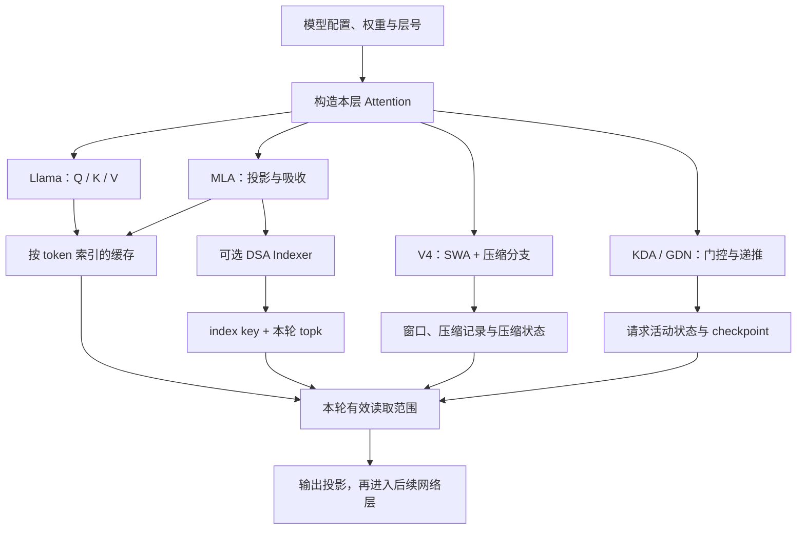
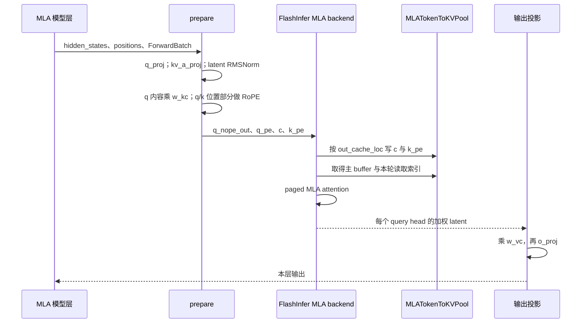
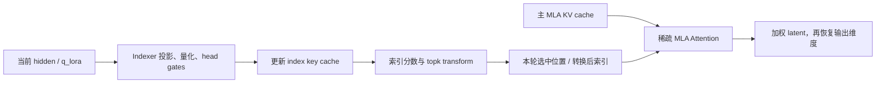
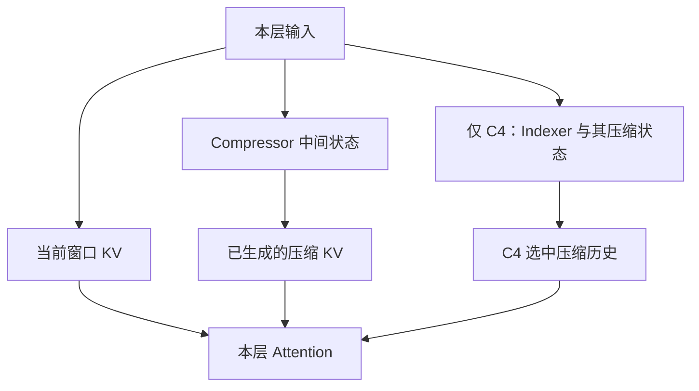
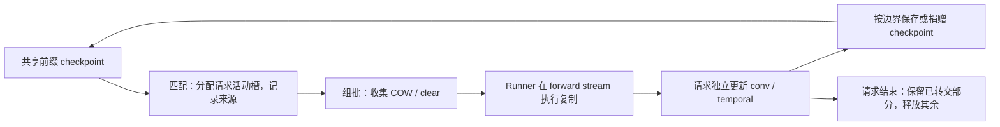

# MLA、稀疏注意力与混合状态模型

> **先建立架构心智模型：** [M10 · 模型装配状态形态与输入输出](<../architecture/10-模型装配状态形态与输入输出.md>)。先看职责、数据和生命周期，再回到本篇源码细节。

本文是 **09-04，源码分析型学习资料**。承接 [MultiLoRA 加载、调度与隔离](03-MultiLoRA加载调度与隔离.md)，从已经熟悉的 Llama Attention 出发，沿 DeepSeek MLA 走通一次计算，再对照 DSA、DeepSeek V4、Kimi K3 与 Qwen3.5。重点是：**模型换了以后，哪些层、权重投影、缓存布局、请求状态和提交规则也必须一起换？**

人话版：普通 Attention 像为每个历史 token 留一张可查询的卡片。MLA 把每张卡片的内容压缩；稀疏注意力挑选本轮要读的卡片；V4 还把一段历史整理成较少的记录；递推层则持续更新一本“读到这里的笔记”。这些方式可以组合，但笔记不能靠删除几张卡片自动退回过去。

## 0. 阅读基线与代表路径

| 项目 | 内容 |
| --- | --- |
| 源码仓库与路径基准 | 官方 `sgl-project/sglang`；所有源码位置相对于 SGLang 仓库根目录 `.` |
| 分支 | `codex/sglang-source-study-20260909`，基于已拉取的官方 main |
| 固定 commit | `72d5c5bb73cadd7ffbf5114e5f81e29d36b6c61a` |
| 读取日期 | `2026-09-10`；继续使用 2026-09-09 固定的源码 |
| 工作区 | 学习 worktree `sglang-source-study` 干净；原 muxi-main 与 26 个未跟踪文件保留 |
| 文档位置 | Wiki `sglang/source-study/09-model-specialization/`；与加载、量化、LoRA、多模态相邻 |
| 完整主线 | DeepseekV2AttentionMLA；CUDA、BF16 权重及主 KV、TP1/PP1/DP1；q_lora_rank=None；普通 Prefill → Decode |
| 主线计算选择 | FlashInfer MLA，显式按 flashinfer_mla_disable_ragged=True 分析吸收式路径；普通 MLATokenToKVPool，不启用 unified memory |
| 主线排除 | DSA、量化、LoRA、投机、CP、HiCache、Graph 和额外融合优化；这些只在独立对照中加入 |
| 分支对照 | DSA 的索引缓存与 topk；V4 的 SWA/压缩状态；Kimi KDA+MLA；Qwen GDN+全注意力；普通 checkpoint 型投机提交 |
| 操作与证据 | 只读源码、阅读五份测试文件中的相关定义；执行独立数学/索引账本和文档检查。未导入 SGLang/torch、安装依赖、下载模型、运行服务、单测或 GPU kernel |
| 不展开 | 各家完整网络、全部 MoE/多模态分支、训练、所有平台 kernel 与精度/性能测量；不从代表分支推导全功能兼容 |

这里选的是**可阅读的 Attention 配置分支**，不是一份已经验证可以直接启动的模型配置。q_lora_rank=None 是该类明确实现的分支；示例维度仅用于手算，不满足或验证任何实际 kernel 的形状要求。[构造][S3] 实际模型还须固定权重 snapshot、配置、设备及 backend 版本。

前置：[04-01 请求映射](../04-kv-cache/01-请求视图物理槽位与分配器.md)、[04-04 混合缓存组件](../04-kv-cache/04-UnifiedRadix与混合状态组件.md)、[05-03 Attention 后端](../05-model-execution/03-Attention后端与执行元数据.md)。正文引用支持**源码事实**；比喻、图和数值例是**整理者归纳**；没有运行观察。MLA 的原始背景核对 [DeepSeek-V2 论文 v5](https://arxiv.org/abs/2405.04434v5)，读取日期同上；本文的具体路径以固定代码为准，不采用论文性能数字。

## 1. 先分清四个不同的问题

### 1.1 模型结构、计算算法、存储格式、生命周期

| 问题 | 例子 | 容易混淆的点 |
| --- | --- | --- |
| 模型怎样表示信息 | Q/K/V、低秩 latent、KDA/GDN 状态 | 结构由模型配置与权重定义，不能任意切换后仍视为同一个模型 |
| 本轮怎样计算 | 展开后的 MHA、吸收式 MLA、稀疏读取、分块递推 | 同一模型的 Prefill/Decode 可以走不同实现 |
| 状态怎样存 | 独立 K/V、latent+RoPE、index key、conv/temporal | 计算中临时出现完整 K/V，不等于持久缓存也如此 |
| 谁能继续写、何时释放 | 请求活动槽、共享 checkpoint、候选状态、树节点 | 有 buffer 或有效地址，不等于拥有继续修改它的权利 |

**三个“rank”也要拆开：** q_lora_rank/kv_lora_rank 是 MLA 模型内部的投影维度；09-03 的 adapter rank 是外接 LoRA 增量的维度；TP rank 是并行进程编号。MLA 的字段名里有 lora，不代表请求携带了 adapter。[S3]

### 1.2 从 Llama 到五条代表路径

Llama 的普通路径是 qkv_proj → 拆 Q/K/V → 对 Q/K 做 RoPE → RadixAttention → o_proj。[S1] [S2] 由此逐项比较：

| 代表路径 | Attention 侧改变 | 历史状态 | 额外控制条件 |
| --- | --- | --- | --- |
| Llama MHA/GQA | 常规 Q/K/V 与 RoPE | 按 KV head 保存的 K/V | 请求映射、因果边界、前缀复用 |
| DeepSeek MLA | KV 低秩投影与权重吸收 | 每 token 的 latent 与共享位置部分 | 本轮 MHA/MLA 分发、主 KV 格式 |
| DSA | 增加 Indexer 与 topk 选择 | 主 MLA KV + 独立 index key/scale | topk 的坐标空间、短序列路径 |
| DeepSeek V4 | SWA，加 ratio=4/128 压缩分支 | 窗口 KV、压缩 KV、压缩中间状态；C4 另有索引状态 | 压缩边界、层映射、不同模式的索引 |
| Kimi K3 | 按层选择 KDA 或 MLA；MLA 有无 RoPE/门控差异 | MLA token 缓存 + KDA conv/temporal | 层列表、状态槽、checkpoint |
| Qwen3.5 文本 | 按层选择 GDN 或全注意力 | 全注意力 K/V + GDN conv/temporal | 层间隔、状态 dtype、投机提交 |

依据：MLA [S3]、DSA [S27] [S30]、V4 [S37] [S45]、Kimi [S48] [S50]、Qwen [S56] [S58]。这里的“混合”指同一个模型内部有不同层/状态，和调度器把多条请求混成一个 batch 不是同一个概念。



**图意解读：** 这是差异地图，不表示一层同时执行所有分支。MLA 与 DSA 可组合；Kimi/Qwen 的不同层由配置选出。FFN 是否为 MoE 是另一条选择轴，不能从“有专家路由”推导“Attention 是稀疏的”。

## 2. MLA 的对象与维度：先看一层

用 T 表示本轮输入 token 数，H 表示本 rank 的 query head 数，D_n 表示非位置 Q/K 维度，D_r 表示位置维度，R 表示 kv_lora_rank，D_v 表示展开后的 value 维度。

| 对象 | 本主线形状/含义 | 寿命 |
| --- | --- | --- |
| hidden_states | [T, hidden_size] | 本层输入激活 |
| q_proj 输出 | [T,H,D_n+D_r] | 本轮 query |
| kv_a_proj_with_mqa 输出 | [T,R+D_r] | 待拆分的 latent 与位置部分 |
| 归一化 c / k_nope | [T,1,R] | 本轮生成，随后写入历史缓存 |
| k_pe | [T,1,D_r]，经 RoPE 后写入 | 每 token 一份位置 key |
| q_nope_out | [T,H,R]，吸收 key 上投影后的 query | 本轮临时值 |
| w_kc | [H,D_n,R] | 模型权重；从 kv_b_proj 拆出 |
| w_vc | [H,R,D_v] | 模型权重；用于恢复输出维度 |
| 主缓存 | 每层 [size+page_size,1,R+D_r] | 物理 token 槽位的存储 |
| attention 的 latent 输出 | [T,H,R] | 加权历史 latent 的结果 |
| 最终本层输出 | o_proj 后回到 hidden_size | 交给后续层 |

构造尺寸见 [S3]；w_kc/w_vc 后处理见 [S9]；计算见 [S10] [S11]；缓存分配见 [S17]。这里的 head=1 表示每个 token 的压缩内容共享，并不表示只算一个 query head。

**k_nope 的名字要结合位置读。** MHA 展开路径里它可以是 [T,H,D_n] 的 key；吸收式路径里传给主池的 k_nope 是 [T,1,R] 的归一化 latent。名字相同不等于维度相同。[S10] [S12]

q_lora_rank 非空时，模型先产生压缩 query，再经归一化和 q_b_proj 恢复各 query head；KV 分支仍有自己的低秩维度。本篇用 None 分支避开这一步，不把 query 的中间 latent 当作历史 KV 保存。[S3]

### 图解补充：改变历史状态的保存方式


[查看原尺寸](../../../images/sglang-source-study/31-mla-heads.png)（手机查看宽图时可横屏或放大）。

**图意解读：** 从左往右对比 MHA、GQA、MQA 与 MLA：前几种改变 K/V head 的共享方式，MLA 则引入压缩的 latent 表示。先找标为缓存的部分，再看它与各 head 的联系。

**对应本篇源码：** 对照 `deepseek_v2.py` 中的 latent 与 RoPE 维度，再看本篇哪些前向路径使用展开形式、哪些直接在 latent 上计算。 [源码：python/sglang/srt/models/deepseek_v2.py][S3]

**来源与边界：** [DeepSeek-V2: A Strong, Economical, and Efficient Mixture-of-Experts Language Model](https://arxiv.org/html/2405.04434v5)，DeepSeek-AI，arXiv v5：2024-06-19。这是 DeepSeek-V2 的结构对照；RoPE 的独立部分及当前后端实际保存格式仍须读正文，也不能把 MLA 图当作 DSA、KDA 或 GDN 的状态图。 [来源档案 F31](../../../images/sglang-source-study/SOURCES.md#f31)。

## 3. 为什么可以直接在 latent 上做 Attention

### 3.1 人话版：把“展开每张旧卡片”换到 query 和结果两侧

以单 head、行向量记法，把内容 key/value 的上投影权重记为 U_K、U_V。对历史 token j：

```text
c_j: [R]
k_j_content = c_j U_K^T       U_K: [D_n,R]
v_j         = c_j U_V^T       U_V: [D_v,R]

q_content · k_j_content
= (q_content U_K) · c_j

sum_j a_j v_j
= (sum_j a_j c_j) U_V^T
```

所以可以先把 query 变为 R 维，用它读取历史 latent；求出加权 latent 后，再恢复 D_v 维。位置部分另算 q_rope 与 k_rope 的内积；不能把位置相关旋转不加区分地吸收入同一组固定内容权重。

这是对 [S9]—[S11] 中两侧 bmm 的代数解释。代码仍执行 q_nope 与 w_kc 的乘法，不意味着已经把所有投影都永久合并成一块权重。scale 也来自本模型的 qk_head_dim，并不能因为 query 吸收后变成 R+D_r，就随手改成新的维度倒数平方根。[S3]

### 3.2 可以手算的等价例子

仅验证代数，暂不加 RoPE、归一化和浮点舍入：

```text
q = [2,3]
U_K = [[1,0],[0,2]]
c1 = [1,2]       c2 = [3,1]

展开：k1=[1,4]，k2=[3,2]，分数=[14,12]
吸收：q U_K=[2,6]，与 c1/c2 点积，分数仍为 [14,12]

假设后续得到权重 a=[1/4,3/4]：
U_V = [[1,0],[1,1]]
v1=[1,3]，v2=[3,4]
先展开再加权 = [2.5,3.75]
先加权 latent=[2.5,1.25]，再乘 U_V^T = [2.5,3.75]
```

a 是人为给定的权重，不是上面 [14,12] 的 softmax。这个例子只检查乘法重排；不能证明真实 BF16/FP8 kernel 数值完全相等，也不代表不同模型的输出等价。

## 4. 完整主线：8 个输入 token 怎样走到第 3 个输出

### 4.1 先装配权重与缓存

DeepseekV2AttentionMLA 构造 query、KV 投影、归一化、RoPE、attn_mqa/attn_mha 和输出层。[S3] 加载后 post_load_weights 把 kv_b_proj 中的 key/value 部分拆成 w_kc/w_vc。[S9]

普通 MLA pool 构造器接收固定的 R、D_r、层数及页大小。[S16] 每层分配一个合并 buffer；get_value_buffer 返回同一 buffer 的 latent 部分视图，**没有因此再分配一套常驻 V**。[S17] [S18] [S19]

本篇明确关闭 unified memory，使用这一普通池作物理布局例子。UnifiedRadixCache 是前缀索引/生命周期机制，unified memory 是另一种内存组织；关闭后者不等于关闭前者。

### 4.2 Scheduler 已分配写入位置，backend 再组织读取位置

沿用 04-01：请求逻辑 token 位置经过 req_to_token 映射到缓存槽位。本轮新增 token 的位置由 out_cache_loc 提供，Attention 不自行用 token ID 当地址。

FlashInfer MLA 的 init_forward_metadata 按 Decode、Verify、普通 Extend 分开准备 metadata。主线设 disable_ragged=True，因此普通 Extend 也用 paged MLA wrapper。[S22]

Decode 的 indices updater 根据各请求长度建立 kv_indptr，调用 kv_index_translator.fill_packed_read_stream 填充读取索引，随后传给 wrapper.plan。[S23] 本文 TP1、无 DCP；有地址翻译时仍须遵循 translator 的约定，不能默认每个中间 ID 都是物理地址。

教学上，若两条请求本轮长度为 [10,6]，则读取流边界为 [0,10,16]；Decode 每请求一个 query，其 query 边界为 [0,1,2]。**indptr 是段边界，kv_indices 才是段里的地址。**

### 4.3 Prefill：投影、写缓存、读取、输出



**图意解读：** P、B、K、O 是调用职责，不是额外进程。写缓存与计算读取都受本轮位置及因果范围控制；buffer 里存在一个位置，不代表所有 query 可以看见它。

具体走法：

1. dispatch_attn_forward_method 按本轮模式取 backend；forward_prepare 再进入对应 mixin。[S4] [S5]
2. q_proj 产生各 head 的 query；kv_a_proj_with_mqa 产生 latent 与位置 key。latent 经 kv_a_layernorm；q 的内容部分与 w_kc 做 bmm，位置部分执行 RoPE。[S10]
3. forward_absorb_core 交给 attn_mqa；本主线传入分开的 q/k 位置部分，value 侧使用同一份 latent。[S11]
4. forward_extend 先按 out_cache_loc 存新增状态，再把主 buffer 拆成 latent/rope 视图交给 paged wrapper。[S24] pool 写入先检查 loc，再按 layer_id 选层，进入两部分 scatter。[S20] [S21]
5. backend 返回 [T,H,R] 结果；主线普通权重分支乘 w_vc，最后 o_proj 返回本层输出。[S11]

R1 的 8 个 prompt token 都完成模型 forward 后，缓存覆盖这 8 个输入位置；最后一个 prompt 位置的输出用于采样 y1。这里只跟踪一个 Attention 层，完整网络还经过其他层及 logits/采样。

### 4.4 Decode：每轮添加一个输入位置

| 时刻 | 本轮送入模型 | forward 后已有计算状态 | 本轮采样 |
| --- | --- | --- | --- |
| Prefill | prompt 的 8 个 token | prompt 8 个位置 | y1 |
| 第一次 Decode | y1 | prompt+y1，共 9 个位置 | y2 |
| 第二次 Decode | y2 | prompt+y1+y2，共 10 个位置 | y3 |

forward_decode 同样先写本轮新 latent/rope，再读取整条有效历史，返回 latent 输出。[S25] y3 若触发停止，不必再被送进模型，所以“已输出 3 个 token”不等于缓存必然多了 3 个位置。结束后的缓存插入、锁释放和槽位回收仍由请求/缓存系统负责，参见 [04-07](../04-kv-cache/07-KV缓存全生命周期与排障.md)。

### 4.5 显存账本：按物理格式算，不按临时计算张量算

教学维度取 H=4、D_n=4、D_r=2、D_v=4、R=3，T=10，BF16 每元素 2 字节：

```text
每层 MLA 有效 payload：T × (R+D_r) × 2 = 100 字节
若缓存展开后每 head 的 K/V：
T × H × ((D_n+D_r)+D_v) × 2 = 800 字节
两层分别为 200 / 1600 字节
```

这里的比较对象是人为指定的展开布局，不是某款 Llama GQA 模型。真实普通 MLA pool 预留按 size+page_size 计算，还须加权重、workspace、metadata、padding、量化 scale、额外组件等。例子的 8 倍不是任意模型或运行环境的节省比例。[S17]

## 5. 同一个 MLA 模型，为何 Prefill 可以走 MHA

### 5.1 “展开计算”没有强迫“展开存储”

将主线的 disable_ragged 选择放开后，attention_backend_handler 根据 backend、模式、prefix 长度、chunk 容量及图捕获状态等决定 MHA_ONE_SHOT、MHA_CHUNKED_KV 或 MLA。[S6] 因此不能写成“所有 Prefill 都是 MHA，所有 Decode 都是 MLA”。

普通展开路径先算归一化 latent 与 RoPE，并用 _set_mla_kv_buffer **保存压缩状态**，然后才 kv_b_proj 展开成各 head 的内容 K/V。[S12] [S14] forward_normal_core 调用 attn_mha 时设置 save_kv_cache=False，避免再把展开结果按普通 K/V 写一次。[S13]

Chunked KV 路径分块取历史压缩 KV、恢复计算所需 K/V，再合并 Attention 结果。[S15] 所以读代码必须同时记录：

| 本轮算法 | 当前计算中出现的历史表示 | 主存储 |
| --- | --- | --- |
| 吸收式 MLA | latent 与位置部分 | latent+位置部分 |
| 展开 MHA | 按 head 展开的 K/V | 仍可为 latent+位置部分 |
| 分块展开 | 当前块的 K/V 与合并中间量 | 仍可为 latent+位置部分 |

### 5.2 排查时别只看 launch 参数

至少记录“模型 Attention 类、实际 backend 名、本轮 forward_mode、分发方法、KV dtype/形状”。字段声明中的 flashinfer_mla_disable_ragged 默认 False；本篇主线显式选择 True。[S8] 这只是阅读隔离条件，不是性能推荐。

## 6. DSA：主 MLA 缓存之外，增加一条选历史的链路

### 6.1 先区分三种 topk

DSA 的 topk 选择历史 token/位置；MoE topk 选择专家；生成采样 top_k 选择候选词。三者的输入、编号和生命周期完全不同。

本节代表 **CUDA、普通 DSA Indexer、index_kpool=1、无 HiSparse/CP/Graph、主 KV 为 BF16 的 Decode**。索引 Q/K 的 FP8 处理是 Indexer 内部路径，不意味着主模型权重或主 KV 必须一起变成 FP8。[S27] [S28] [S30]

| 对象 | 保存什么 | 用途 |
| --- | --- | --- |
| 主 MLA KV | latent 与位置内容 | 计算最终 Attention 输出 |
| index key 与 scale | Indexer 对历史 token 的表示 | 给候选历史打分 |
| query/head gates | 本轮 Indexer 投影与权重 | 生成本轮索引分数 |
| topk_indices | 本轮选中的历史位置，可能经融合转换 | 约束主 Attention 读取 |
| page table / valid length | 地址映射与有效数量 | 正确寻址、跳过 padding |

DSATokenToKVPool 继承 MLA pool 后另外创建 index key cache；本代表 CUDA 分支还检查 page_size=64、index_head_dim=128。[S30] 这些是具体路径限制，不能套到所有平台。

### 6.2 一条 Decode 的控制流

Indexer.forward_cuda 获取本轮 metadata；非融合普通分支生成 query/key，量化 query，并通过 _store_index_k_cache 保存本轮 index key；再得到 head gates，进入 _get_topk_paged。[S27] [S29]

_get_topk_paged 从 index key buffer、block table、长度和 query 计算 logits，经遮罩后调用 metadata.topk_transform。[S28] 这里选的是**本轮要查哪些历史**，不是直接得到 Attention 的 value 输出。



**图意解读：** 两套 cache 保存不同表示。稀疏读取减少本轮主 Attention 的候选集合，不证明未选位置可以永久删除，也不证明总缓存容量按 topk 等比例缩小。

### 6.3 topk 到底是逻辑编号，还是物理地址

DeepseekSparseAttnBackend.forward_decode 明确区分 HiSparse、融合 topk 与普通转换分支；FlashMLA sparse 最后接收 [query,1,topk] 的索引表与有效长度。[S31] [S32]

以**未融合转换**说明：

```text
请求逻辑位置 0..5 的物理槽位：
page_table = [40,9,70,5,12,99]

本轮选中逻辑位置：
topk = [1,4,-1]

转换后实际读取位置：
[9,12,-1]
```

参考实现先 gather，再把无效负索引恢复成 -1。[S35] 不可把 -1 当 Python 的“最后一行”去读。融合 topk 已完成部分转换时，重复转换也会读错；Prefill 的 RAGGED/PAGED 转换还存在独立选择。[S34]

### 6.4 短序列与跨层共享不该被当成丢步骤

Indexer 可以根据长度走只准备 key 的快捷路径；对应 key 仍为后续 Decode 服务。[S27] DSA backend 也会在特定设备、长度、dtype、容量等条件满足时让普通 Extend 使用 MHA_ONE_SHOT；Decode/Verify 在该选择函数中不走这项 MHA。[S33] [S7]

此外，声明 skip_topk 的共享层不能因为没拿到前层 topk 就随意重算本层 Indexer；should_run_indexer 明确限制，并保留 NextN 的特定回退。[S26] 本节不展开共享层传播，但这说明“每一层都一定拥有可用 Indexer 权重”并不成立。

## 7. DeepSeek V4：窗口、压缩记录和压缩状态同时存在

### 7.1 ratio=4/128 与 MLA rank 是两种压缩轴

MqaAttentionBase 从 config.compress_ratios[layer_id] 取本层 ratio，限定 0、4、128。[S36] MQALayer 的 ratio=4/128 分支创建 Compressor；只有 ratio=4 再创建 C4Indexer。[S37]

| 本层 ratio | 层中构造 | 必须辨认的状态 |
| --- | --- | --- |
| 0 | SWA Attention，无本层 compressor/indexer | 窗口 KV |
| 4 | SWA + Compressor + C4Indexer | 窗口 KV、C4 压缩 KV、Attention 压缩状态、Indexer 压缩状态/索引 |
| 128 | SWA + Compressor | 窗口 KV、C128 压缩 KV、Attention 压缩状态 |

R 是每个 token 的通道维度；ratio 是这条实现的序列压缩组织参数。不能把“ratio=128”理解为“每个 token 只剩 128 个维度”，也不能把所有状态总量直接除以 128。

### 7.2 普通准备路径中的先后顺序

选 MQALayer._forward_prepare 的普通非并发分支：先准备 q 与当前窗口 KV；有 indexer 时调用 indexer；有 compressor 时调用 backend.forward_core_compressor，然后进入 Attention。[S38] [S39]

Compressor.forward_native 计算 kv_score_input，从本层对应的 CompressStatePool 取得 kv_score_buffer，再交给 backend.forward_compress。[S40] 后者依据 paged metadata/plan、压缩 ratio、归一化和位置参数计算压缩输出。[S42] 主 compressor 输出写到 c4_out_loc 或 c128_out_loc 指定的额外 KV 区。[S41] C4Indexer 则有自己的 backend 入口。[S43]

**已经生成的压缩 KV**和**用于跨轮继续生成压缩 KV 的状态**是两类资源。只搬走前者，不能据此断言后续 Decode 已具备完整状态。

### 7.3 Attention 本身读两条历史来源

在本文读取的 DSV4AttnMetadata 路径中，DeepseekV4AttnBackend.forward：

1. 按需要保存本轮窗口 KV。
2. 取得 SWA buffer 及其 indices/lengths。
3. ratio=4 时取得 extra KV 与 c4_sparse_page_indices；ratio=128 时取得 extra KV 与 c128_page_indices。
4. 将各自 buffer、索引和长度交给对应计算路径。[S44]



**图意解读：** ratio=128 不经过图里的 C4 选择分支。窗口、压缩记录、压缩状态并非同一种地址空间。其他 backend 的统一 buffer 或 Prefill 两来源策略需单独读，不能用此图推导所有缓存写入时机相同。

DeepSeekV4TokenToKVPool 为当前 stage 的每层建立 ratio→压缩池局部层号映射，分别为 4/128 建 Attention state pool，4 另建 Indexer state pool。[S45] [S46] 这也是 PP 切层以后不能拿全局 layer_id 直接当每个子池行号的原因。

### 7.4 投机之后，旧候选状态不一定能留着

clear_unaccepted_c128_draft_states 对**非 ONLINE_C128**且多候选等条件下的 C128 state ring 清理未接受候选写入的槽位；注释解释后续压缩边界可能读到这些旧槽位。C4 的对应写读顺序不同，该函数不对它执行同样处理。[S47]

这只能支持该局部分支的规则，不能推导所有 V4 投机路径都靠此函数完成提交。正文不把源码里未使用的非 paged helper 限制当成整个 V4 的投机支持结论。

## 8. Kimi K3：KDA 与 MLA 两种层怎样接在一起

### 8.1 配置层号从 1 开始，执行层号从 0 开始

KimiLinearConfig.is_kda_layer(layer_idx) 检查的是 **layer_idx+1 是否在 kda_layers 中**。[S48] KimiK3DecoderLayer 据此构造 KimiK3DeltaAttention 或 KimiK3MLAAttention；FFN 的 Dense/MoE 选择在另一段条件里。[S50]

教学配置有 6 层，kda_layers=[1,2,4,5]：

| 执行 layer_id | 配置层号 | Attention |
| ---: | ---: | --- |
| 0 | 1 | KDA |
| 1 | 2 | KDA |
| 2 | 3 | MLA |
| 3 | 4 | KDA |
| 4 | 5 | KDA |
| 5 | 6 | MLA |

这不是某个发布模型的真实层表，也不能推广为“Kimi 永远两层 KDA 加一层 MLA”。mamba2_cache_params 只把 linear_layer_ids 交给 KDA 状态形状/分配描述。[S49]

### 8.2 继承 MLA，并不代表与 DeepSeek 每个细节相同

KimiK3MLAAttention 继承 DeepseekV2AttentionMLA，但构造时明确传 skip_rope=True；输出 gate 由 mla_use_output_gate 控制，并在 forward 准备相应信息。[S51] [S52]

因此本系列 DeepSeek 主线“先对位置部分做 RoPE”的步骤，不能原封不动复制到该 Kimi 层。GGUF 分割权重、gate 并发计算等还会改变局部实现，本节不展开或承诺其任意组合。

### 8.3 KDA 层的一轮输入与状态

KimiK3DeltaAttention.forward 产生 mixed_qkv、beta、forget_gate、输出门控值；普通 Extend 与 Decode/Verify 对 beta 的预处理不同，再把 mixed_qkv/a/b 交给线性 Attention，最后做门控归一化和 o_proj。[S53]

KDAAttnBackend.forward_extend 取得当前层 conv 与 temporal，按请求状态槽索引访问；有前缀时带入初始状态，通过短卷积处理 Q/K/V，再进入 KDA kernel dispatcher。[S54] 这里的 q/k/v 仍是本轮输入，但历史不是常规“逐 token K/V 列表”。

若要保存前缀 checkpoint，conv 窗口和 temporal 必须对齐到同一有效边界。代码对需要的中间状态 snapshot 检查实际执行 kernel 的 supports_track_state_snapshot；不能只看配置 backend 名就认定会写出所需状态。[S54]

## 9. Qwen3.5：GDN 层如何与全注意力共享执行框架

### 9.1 模型钩子先决定层型，再决定池

Qwen3_5TextConfig 继承 Qwen3NextConfig，并归一化 rope_parameters/rope_scaling。[S55] 所读固定实现的 layers_block_type 按 (layer_id+1) % full_attention_interval 决定全注意力或线性层；Qwen3_5ForCausalLM 据此选择实际 decoder layer。[S56] [S58]

教学上，8 层且 full_attention_interval=4，则 layer_id=3、7 是全注意力，其余为线性层。mamba2_cache_params 根据线性层的 key/value head、短卷积等维度生成状态形状，只登记 linear_layer_ids。[S57]

HybridLinearAttnBackend 持有 full 与 linear 两个 backend；_is_full_attn 根据 layer_id 在 full_attn_layers 中的成员关系分发。[S60] [S61] 它不是让一个 token 本轮选 GDN、下一轮随意选 MLA。

### 9.2 GDN 模型层到递推 kernel

Qwen3_5GatedDeltaNet.forward 先做输入投影，普通分支整理 query/key/value/z/b/a；把 Q/K/V 拼成 mixed_qkv，a/b 交给线性 Attention；返回后以 z 做门控归一化，再输出投影。[S59]

以 Triton 代表路径理解：

| 阶段 | backend 做什么 | 状态边界 |
| --- | --- | --- |
| Decode | conv update → 门控/递推更新 | 按本请求 cache_indices 读写 conv、temporal |
| Extend | 使用 prefix 初始状态，经卷积与分块递推 | 维护最终状态，按需保存中间 checkpoint |
| Target Verify | 卷积候选窗口 + 每候选递推状态 | 候选计算结果等待接受路径选择 |
| Verify 后提交 | 选 last_correct_step 对应状态 | 恢复/提交 conv 与 temporal，避免拒绝分支污染 |

Decode 可以走 packed kernel，也可以 split 后进入 dispatcher；不论融合程度怎样，均传入状态池和状态索引。[S66] Extend/Verify 分开处理，有普通 intermediate_ssm、ReplaySSM 等不同协议。[S67] 本节只沿普通 checkpoint 协议：TritonGDNKernel.extend 把状态和索引交给 chunk_gated_delta_rule；target_verify 额外传 intermediate buffer 与候选位置。[S68] [S69]

“线性 Attention”不能解释成“没有状态”，也不能仅凭名字认定 KDA 与 GDN 的门控、卷积、dtype 和 kernel 可以互换。

## 10. 混合模型的共同难点：请求、状态与 checkpoint 对齐

### 10.1 三类地址不能混用

MambaPool.State 的基础字段是 conv 与 temporal；它被多种线性/递推层复用。[S63] 因此代码里出现 mamba_pool、SSM state 等命名，不等于正在执行 Mamba 模型，也不表示 KDA/GDN 使用相同状态更新公式。

| 编号/位置 | 指向什么 | 代表入口 |
| --- | --- | --- |
| req_pool_idx | 请求映射表中的请求行 | HybridReqToTokenPool.alloc [S64] |
| token cache loc | 全注意力/MLA 的历史 token 槽位 | 本轮 out_cache_loc、KV translator |
| mamba_pool_idx / mamba_cache_indices | 本请求跨线性层的状态槽 | _forward_metadata [S62] |
| intermediate state index | 本轮候选状态记录的位置 | Verify kernel 与提交入口 [S69] [S70] |
| tracked checkpoint slot | 某个前缀边界的共享快照 | MambaComponent [S73]—[S78] |

HybridReqToTokenPool.alloc 复用已有活动状态或新分配状态槽，再建立 request→mamba 映射；新槽带清理标记。[S64] backend 准备 metadata 时先取得 mamba 索引，再转换成物理槽位；图 padding 另用无效标记处理。[S62] 请求所在 batch 行、请求池行和状态池行没有必须相等的关系。

### 10.2 Full KV 命中得长，不代表递推状态也命中到那里

MambaComponent 根据可用 state 边界与 full_kv_hit_length 整理匹配结果，还可能提出对齐后的 branching_seqlen。[S73] **“token 前缀相同”是必要背景，不能替代“该边界有可恢复状态”。**

例如 full KV 到 128，而可复用 state 只到 64：不能直接拿第 64 个位置的笔记去执行第 129 个 token。后续必须按实际匹配/重算策略让状态也到达相应边界。64/128 只是教学长度，不是统一 checkpoint 间隔。

COW 也分两步：匹配时先为请求准备活动槽并记录 mamba_cow_src_index；ScheduleBatch 收集延迟 copy/clear；ModelRunner 在符合条件的目标 Extend forward 中执行实际清理/复制，然后才允许线性层消费。[S74] [S75] [S76] **记录 COW 来源不等于已经复制完成。**



**图意解读：** 共享 checkpoint 是恢复源，请求活动状态是后续可写目标。不能让多个继续生成的请求直接覆盖同一份前缀快照。

### 10.3 请求结束，状态可能转交给前缀树

MambaComponent.prepare_for_caching_req 按 extra buffer/no_buffer、是否结束等选择 tracked state、活动槽、复制或捐赠；cleanup_after_caching_req 根据插入是否成功、是否已有相同 state，决定保留哪些槽、释放哪些槽。[S77] [S78]

HybridReqToTokenPool.free_mamba_cache 会归还活动状态，并按 keep 参数处理 ping-pong buffer。[S65] 因此请求结束不等于所有相关 state 马上清空；共享 checkpoint 仍由缓存组件持有。反过来，已有 token KV 容量也不保证还有可分配的活动状态槽。

### 10.4 投机提交需要选中正确候选状态

普通 checkpoint 协议可理解为：从 S0 出发计算候选，保存对应的 conv 窗口和 temporal；接受算法选定路径后，用最后一个有效 step 的状态覆盖活动状态。**不是把拒绝 token 的 KV 地址释放了就完成回退。**

用一个教学递推式 S_new=2×S_old+x 说明原因：初始 S0=3，依次试算 x=[4,5,6] 后状态是 [10,25,56]。若只保留前两步，正确状态应是 25；删除第三个输入的记录不会让 56 自动变回 25。真实 KDA/GDN 不是这个标量公式，但同样要由相应协议恢复正确前缀的状态；短卷积窗口也要同步处理。

commit_mamba_states_after_verify 通过 _verify_commit_step_indices 得到 last_correct_step_indices，再调用 backend.update_mamba_state_after_mtp_verify。[S71] [S72] 普通分支 scatter 完整 mamba state；KDA fused-accept 与 ReplaySSM 在同一入口有不同的处理，不能把普通 scatter 规则推广给它们。[S70]

一个检验“接受数量不等于候选编号”的账本：

```text
每请求候选区宽度 W=5。
accept_lens = [2,3]    # 此接口已经包括 bonus 所占的一步
R1 接受顺序（扁平候选索引）=[0,3,...]
R2 接受顺序（扁平候选索引）=[5,7,9,...]

last step:
R1 = 3 - 0 = 3
R2 = 9 - 5 = 4
```

若只算 accept_lens-1，会得到 [1,2]，对这组树形布局是错的。对链式布局才可退化为该减法。这里说明的是提交索引算法，不构造真实采样结果，也不证明任意投机算法与模型组合受支持。[S71]

## 11. 模型能力到实现、状态与验证入口的对照

| 能力/条件 | 配置或模型钩子 | 层/算子路径 | 状态/验证入口 |
| --- | --- | --- | --- |
| MLA 压缩 KV | R、D_r、q_lora_rank；backend 分发 | absorbed prepare/core；w_kc/w_vc | MLATokenToKVPool；本篇独立代数账本 [S3] [S9]—[S25] |
| DSA 稀疏读取 | DSA 检测、Indexer、topk transform | Indexer → 索引转换 → sparse MLA | 主池与 index pool；API 布局 mock [S27]—[S35] [S80] |
| V4 序列压缩 | compress_ratios[layer_id] | Compressor；C4Indexer；SWA+extra KV | 两类压缩状态；C4 生命周期 mock [S36]—[S47] [S81] |
| Kimi 混合层 | kda_layers、mla_use_output_gate | KimiK3DeltaAttention / MLA | conv、temporal、track_state；snapshot 对照定义 [S48]—[S54] [S82] |
| Qwen 混合层 | full_attention_interval、mamba2_cache_params | GDN / Attention decoder layer | 活动 state 与普通 Verify checkpoint；backend 策略定义 [S55]—[S69] [S83] |
| 状态前缀复用 | cache 策略与可用 checkpoint 边界 | MambaComponent → COW → Runner | 共享源、请求目标及释放责任 [S73]—[S78] |
| 投机状态提交 | accept_index、accept_lens、实际协议 | 普通 scatter / 专用协议分支 | conv 与 temporal 必须一致 [S70]—[S72] |

此表把**源码入口、静态分支与测试定义**关联起来，不是支持矩阵认证。模型能注册、buffer 能分配、测试文件存在，都不能单独证明精度、吞吐或跨节点状态迁移正确。

## 12. 小白排障地图

| 现象 | 先核对 | 返回源码 | 不要直接下的结论 |
| --- | --- | --- | --- |
| 缓存大小与按头数估算差很大 | MLA 的 R+D_r、实际池、padding、dtype | [S16]—[S21] | 少分配了一份 V |
| Prefill 有大 K/V 临时张量 | 本轮分发方法、chunk、save_kv_cache | [S6] [S12]—[S15] | 模型没有使用 MLA |
| Decode 某请求读到别人的历史 | req 映射、indptr、translator、topk 坐标 | [S23] [S31] [S35] | 只可能是权重问题 |
| DSA 短输入和长输入路径不同 | use_mha、skip logits、有效长度 | [S27] [S33] | Indexer 被错误跳过 |
| 稀疏 attention 后显存仍高 | 主 KV、index cache、workspace 各自大小 | [S28] [S30] | topk 没有生效 |
| Kimi/Qwen 某些层状态 shape 不符 | 配置层号、full/linear 层列表、head 分片 | [S48] [S56] [S57] [S60] | 所有层都应有相同 KV |
| prefix hit 后混合模型输出变化 | checkpoint 位置/精度、COW 是否执行 | [S54] [S73]—[S76] | token 命中已经证明状态正确 |
| KV 仍有空间但请求无法分配 | mamba allocator 与活动/track 槽数量 | [S64] [S65] | 一定是 token pool 碎片 |
| 投机拒绝后长输出逐渐异常 | 接受路径索引、conv/temporal、ring 协议 | [S67] [S70]—[S72] | 释放拒绝 KV 就应该恢复 |
| V4 压缩边界后异常 | ratio、子池层号、压缩状态与候选清理 | [S45]—[S47] | 只检查压缩 KV payload 即可 |

## 13. 怎样验证，才有资格写“工作正常”

### 13.1 本次读到的五种测试证据

| 文件/定义 | 实际检查对象 | 证据边界 |
| --- | --- | --- |
| test_mla_decode_geometry 的 budget 用例 [S79] | 用给定设备计算规模检查几何/切分规则 | CPU 策略断言；不运行本篇 CUDA FlashInfer 主线，也不证明性能 |
| TestFlashInferSparseMLAAdapter [S80] | mock FlashInfer op，检查 query/KV/indices/lengths 的布局映射 | API 适配，不计算真实 sparse attention |
| TestUnifiedC4StateLifecycle [S81] | C4 ring 尺寸、仅清理选中请求、新槽 hook 与续块不清理 | CPU/mock、统一 V4 路径；不证明压缩数值 |
| TestKdaTrackState._check_track_state [S82] | tracked fp32 snapshot 与截断前缀最终状态对照，区分 bf16 h 的舍入 | 定义要求 CUDA；测试中 Helion 可能缺失，不能称所有 backend 都覆盖 |
| GDN prefill policy 的显式配置用例 [S83] | 显式设置 prefill backend 时不被默认选择覆盖 | mock 策略；不代表 GDN kernel 精度或模型质量 |

以上仅静态阅读对应代码，**五种测试均未运行**。本篇没有把源码注释中的历史 benchmark 或回归描述当成本次实测。

### 13.2 后续实验应分层做

| 层级 | 最小对照 | 必须记录 |
| --- | --- | --- |
| MLA 数学/布局 | 小输入展开式与吸收式，包含 RoPE/scale | shape、dtype、误差标准、实际计算 kernel |
| 主 KV 写读 | 非连续 loc、多请求 indptr、padding、prefix | 每层地址与有效长度，不能只看 tensor shape |
| DSA | 逻辑 topk→实际位置；短/长上下文路径 | topk 坐标、-1、有效长度、Index/main KV 格式 |
| 混合状态 | 单次完整 Prefill vs 分块；cache miss vs hit | state 边界、conv/temporal dtype、COW、层列表 |
| 投机 | 接受 0 个 draft/部分/全部、树形路径 | bonus 口径、accept_index、普通 checkpoint 或实际 ring 协议 |
| 生命周期 | 请求结束、状态槽复用、共享前缀续写 | 哪些槽转交缓存、哪些已释放，旧请求是否仍可写 |
| 模型与性能 | 固定权重、固定输入，质量与冷/热负载分别测 | 设备/软件版本、实际配置、重复次数、延迟与内存峰值 |

这里给的是后续验证设计，不表示本次已执行，也不在没有设备条件的本地环境拼凑启动成功结论。

## 14. 阅读路线与自检

### 14.1 按问题回到代码

| 顺序 | 相对于 SGLang 根的入口 | 读完回答什么 |
| --- | --- | --- |
| 1 | `python/sglang/srt/models/llama.py::LlamaAttention.forward` [S2] | 常规 Q/K/V 怎样进入 Attention？ |
| 2 | `python/sglang/srt/models/deepseek_v2.py::DeepseekV2AttentionMLA.__init__` [S3] | 哪些维度来自配置？ |
| 3 | `python/sglang/srt/models/deepseek_common/deepseek_weight_loader.py::DeepseekV2WeightLoaderMixin.post_load_weights` [S9] | w_kc/w_vc 从哪里来？ |
| 4 | `python/sglang/srt/models/deepseek_common/attention_forward_methods/forward_mla.py::DeepseekMLAForwardMixin.forward_absorb_core` [S11] | latent 输出怎样恢复为模型输出？ |
| 5 | `python/sglang/srt/layers/attention/flashinfer_mla_backend.py::FlashInferMLAAttnBackend.forward_decode` [S25] | 新 KV 写到哪里、历史如何读取？ |
| 6 | `python/sglang/srt/layers/attention/dsa/dsa_indexer.py::Indexer.forward_cuda` [S27] | 哪一套数据只负责选历史？ |
| 7 | `python/sglang/srt/models/deepseek_v4.py::MQALayer._forward_prepare` [S38] | 压缩记录与压缩状态怎样接起来？ |
| 8 | `python/sglang/srt/models/kimi_k3.py::KimiK3DecoderLayer.__init__` [S50] | KDA/MLA 层是怎样选的？ |
| 9 | `python/sglang/srt/models/qwen3_5.py::Qwen3_5GatedDeltaNet.forward` [S59] | GDN 输入投影、门控、状态和输出怎样分工？ |
| 10 | `python/sglang/srt/model_executor/model_runner.py::ModelRunner._maybe_execute_deferred_mamba_cow_and_clear` [S76] | 共享前缀状态何时变成请求可写状态？ |
| 11 | `python/sglang/srt/speculative/spec_utils.py::_verify_commit_step_indices` [S71] | 接受数量怎样定位到实际候选状态？ |

### 14.2 练习与参考答案

1. **MLA 缓存 shape 的中间维度是 1，所以模型只有一个 head？** 不是；query 有 H 个 head，主 latent 共享，每个 head 仍有自己的吸收 query 和输出恢复。
2. **w_vc 是每条请求的历史 value 吗？** 不是，它是模型投影权重；请求历史在 token cache 中。
3. **MHA Prefill 结束后必须把完整 K/V 转回 MLA？** 所读路径先保存压缩 KV，再展开临时计算，并关闭第二次 KV 写入。
4. **DSA 选中 [1,4] 就能直接读物理第 1、4 行？** 需先确认坐标空间；未融合例子实际读 [9,12]。
5. **Qwen 的全注意力层和 Kimi 的 MLA 层能共用一张固定层表吗？** 不能；必须分别读取配置层规则及实际 layer_id。
6. **prefix KV 到 128、state 到 64，是否可以直接 Decode？** 不能据此认定可用，状态边界必须经恢复/重算对齐。
7. **accept_lens=[2,3] 是否表示最后状态索引 [1,2]？** 仅特定链式布局成立；本篇树形例子是 [3,4]。
8. **同一 state 槽返回 allocator 后，里面有旧数值就一定是泄漏？** 数值残留与槽位所有权不同；关键是新所有者读前的 clear/restore 和旧所有者写入已受控。

本篇已检查独立代数、有效 payload、indptr、topk 映射、层号与提交索引账本；Mermaid 只做文字与流程静态核对，未渲染。源码锚点、相对链接和进度随全系列检查；源仓保持只读。

下一篇：[09-05《图像、视频、音频输入的处理链路》](05-图像视频音频输入的处理链路.md)。回到 [系列目录](../README.md) 或 [学习进度](../appendices/06-学习进度与版本变更记录.md)。

[S1]: https://github.com/sgl-project/sglang/blob/72d5c5bb73cadd7ffbf5114e5f81e29d36b6c61a/python/sglang/srt/models/llama.py#L218
[S2]: https://github.com/sgl-project/sglang/blob/72d5c5bb73cadd7ffbf5114e5f81e29d36b6c61a/python/sglang/srt/models/llama.py#L239
[S3]: https://github.com/sgl-project/sglang/blob/72d5c5bb73cadd7ffbf5114e5f81e29d36b6c61a/python/sglang/srt/models/deepseek_v2.py#L1716
[S4]: https://github.com/sgl-project/sglang/blob/72d5c5bb73cadd7ffbf5114e5f81e29d36b6c61a/python/sglang/srt/models/deepseek_v2.py#L1989
[S5]: https://github.com/sgl-project/sglang/blob/72d5c5bb73cadd7ffbf5114e5f81e29d36b6c61a/python/sglang/srt/models/deepseek_v2.py#L2057
[S6]: https://github.com/sgl-project/sglang/blob/72d5c5bb73cadd7ffbf5114e5f81e29d36b6c61a/python/sglang/srt/models/deepseek_common/attention_backend_handler.py#L108
[S7]: https://github.com/sgl-project/sglang/blob/72d5c5bb73cadd7ffbf5114e5f81e29d36b6c61a/python/sglang/srt/models/deepseek_common/attention_backend_handler.py#L208
[S8]: https://github.com/sgl-project/sglang/blob/72d5c5bb73cadd7ffbf5114e5f81e29d36b6c61a/python/sglang/srt/arg_groups/fields/exec_.py#L109
[S9]: https://github.com/sgl-project/sglang/blob/72d5c5bb73cadd7ffbf5114e5f81e29d36b6c61a/python/sglang/srt/models/deepseek_common/deepseek_weight_loader.py#L547
[S10]: https://github.com/sgl-project/sglang/blob/72d5c5bb73cadd7ffbf5114e5f81e29d36b6c61a/python/sglang/srt/models/deepseek_common/attention_forward_methods/forward_mla.py#L286
[S11]: https://github.com/sgl-project/sglang/blob/72d5c5bb73cadd7ffbf5114e5f81e29d36b6c61a/python/sglang/srt/models/deepseek_common/attention_forward_methods/forward_mla.py#L673
[S12]: https://github.com/sgl-project/sglang/blob/72d5c5bb73cadd7ffbf5114e5f81e29d36b6c61a/python/sglang/srt/models/deepseek_common/attention_forward_methods/forward_mha.py#L179
[S13]: https://github.com/sgl-project/sglang/blob/72d5c5bb73cadd7ffbf5114e5f81e29d36b6c61a/python/sglang/srt/models/deepseek_common/attention_forward_methods/forward_mha.py#L294
[S14]: https://github.com/sgl-project/sglang/blob/72d5c5bb73cadd7ffbf5114e5f81e29d36b6c61a/python/sglang/srt/models/deepseek_common/attention_forward_methods/forward_mha.py#L583
[S15]: https://github.com/sgl-project/sglang/blob/72d5c5bb73cadd7ffbf5114e5f81e29d36b6c61a/python/sglang/srt/models/deepseek_common/attention_forward_methods/forward_mha.py#L334
[S16]: https://github.com/sgl-project/sglang/blob/72d5c5bb73cadd7ffbf5114e5f81e29d36b6c61a/python/sglang/srt/mem_cache/kv_cache_configurator.py#L1688
[S17]: https://github.com/sgl-project/sglang/blob/72d5c5bb73cadd7ffbf5114e5f81e29d36b6c61a/python/sglang/srt/mem_cache/memory_pool.py#L4371
[S18]: https://github.com/sgl-project/sglang/blob/72d5c5bb73cadd7ffbf5114e5f81e29d36b6c61a/python/sglang/srt/mem_cache/memory_pool.py#L4408
[S19]: https://github.com/sgl-project/sglang/blob/72d5c5bb73cadd7ffbf5114e5f81e29d36b6c61a/python/sglang/srt/mem_cache/memory_pool.py#L4417
[S20]: https://github.com/sgl-project/sglang/blob/72d5c5bb73cadd7ffbf5114e5f81e29d36b6c61a/python/sglang/srt/mem_cache/memory_pool.py#L4537
[S21]: https://github.com/sgl-project/sglang/blob/72d5c5bb73cadd7ffbf5114e5f81e29d36b6c61a/python/sglang/srt/mem_cache/memory_pool.py#L4492
[S22]: https://github.com/sgl-project/sglang/blob/72d5c5bb73cadd7ffbf5114e5f81e29d36b6c61a/python/sglang/srt/layers/attention/flashinfer_mla_backend.py#L419
[S23]: https://github.com/sgl-project/sglang/blob/72d5c5bb73cadd7ffbf5114e5f81e29d36b6c61a/python/sglang/srt/layers/attention/flashinfer_mla_backend.py#L876
[S24]: https://github.com/sgl-project/sglang/blob/72d5c5bb73cadd7ffbf5114e5f81e29d36b6c61a/python/sglang/srt/layers/attention/flashinfer_mla_backend.py#L688
[S25]: https://github.com/sgl-project/sglang/blob/72d5c5bb73cadd7ffbf5114e5f81e29d36b6c61a/python/sglang/srt/layers/attention/flashinfer_mla_backend.py#L766
[S26]: https://github.com/sgl-project/sglang/blob/72d5c5bb73cadd7ffbf5114e5f81e29d36b6c61a/python/sglang/srt/models/deepseek_common/attention_forward_methods/forward_mla.py#L136
[S27]: https://github.com/sgl-project/sglang/blob/72d5c5bb73cadd7ffbf5114e5f81e29d36b6c61a/python/sglang/srt/layers/attention/dsa/dsa_indexer.py#L1500
[S28]: https://github.com/sgl-project/sglang/blob/72d5c5bb73cadd7ffbf5114e5f81e29d36b6c61a/python/sglang/srt/layers/attention/dsa/dsa_indexer.py#L779
[S29]: https://github.com/sgl-project/sglang/blob/72d5c5bb73cadd7ffbf5114e5f81e29d36b6c61a/python/sglang/srt/layers/attention/dsa/dsa_indexer.py#L1400
[S30]: https://github.com/sgl-project/sglang/blob/72d5c5bb73cadd7ffbf5114e5f81e29d36b6c61a/python/sglang/srt/mem_cache/memory_pool.py#L4789
[S31]: https://github.com/sgl-project/sglang/blob/72d5c5bb73cadd7ffbf5114e5f81e29d36b6c61a/python/sglang/srt/layers/attention/dsa_backend.py#L2308
[S32]: https://github.com/sgl-project/sglang/blob/72d5c5bb73cadd7ffbf5114e5f81e29d36b6c61a/python/sglang/srt/layers/attention/dsa_backend.py#L2545
[S33]: https://github.com/sgl-project/sglang/blob/72d5c5bb73cadd7ffbf5114e5f81e29d36b6c61a/python/sglang/srt/layers/attention/dsa_backend.py#L3592
[S34]: https://github.com/sgl-project/sglang/blob/72d5c5bb73cadd7ffbf5114e5f81e29d36b6c61a/python/sglang/srt/layers/attention/dsa_backend.py#L3654
[S35]: https://github.com/sgl-project/sglang/blob/72d5c5bb73cadd7ffbf5114e5f81e29d36b6c61a/python/sglang/kernels/ops/attention/dsa/transform_index.py#L263
[S36]: https://github.com/sgl-project/sglang/blob/72d5c5bb73cadd7ffbf5114e5f81e29d36b6c61a/python/sglang/srt/models/deepseek_v4.py#L627
[S37]: https://github.com/sgl-project/sglang/blob/72d5c5bb73cadd7ffbf5114e5f81e29d36b6c61a/python/sglang/srt/models/deepseek_v4.py#L871
[S38]: https://github.com/sgl-project/sglang/blob/72d5c5bb73cadd7ffbf5114e5f81e29d36b6c61a/python/sglang/srt/models/deepseek_v4.py#L1384
[S39]: https://github.com/sgl-project/sglang/blob/72d5c5bb73cadd7ffbf5114e5f81e29d36b6c61a/python/sglang/srt/models/deepseek_v4.py#L1591
[S40]: https://github.com/sgl-project/sglang/blob/72d5c5bb73cadd7ffbf5114e5f81e29d36b6c61a/python/sglang/srt/layers/attention/dsv4/compressor.py#L470
[S41]: https://github.com/sgl-project/sglang/blob/72d5c5bb73cadd7ffbf5114e5f81e29d36b6c61a/python/sglang/srt/layers/attention/dsv4/compressor.py#L159
[S42]: https://github.com/sgl-project/sglang/blob/72d5c5bb73cadd7ffbf5114e5f81e29d36b6c61a/python/sglang/srt/layers/attention/dsv4/compressor.py#L64
[S43]: https://github.com/sgl-project/sglang/blob/72d5c5bb73cadd7ffbf5114e5f81e29d36b6c61a/python/sglang/srt/layers/attention/dsv4/indexer.py#L1109
[S44]: https://github.com/sgl-project/sglang/blob/72d5c5bb73cadd7ffbf5114e5f81e29d36b6c61a/python/sglang/srt/layers/attention/deepseek_v4_backend.py#L1666
[S45]: https://github.com/sgl-project/sglang/blob/72d5c5bb73cadd7ffbf5114e5f81e29d36b6c61a/python/sglang/srt/mem_cache/deepseek_v4_memory_pool.py#L982
[S46]: https://github.com/sgl-project/sglang/blob/72d5c5bb73cadd7ffbf5114e5f81e29d36b6c61a/python/sglang/srt/mem_cache/deepseek_v4_memory_pool.py#L1005
[S47]: https://github.com/sgl-project/sglang/blob/72d5c5bb73cadd7ffbf5114e5f81e29d36b6c61a/python/sglang/srt/mem_cache/deepseek_v4_memory_pool.py#L1111
[S48]: https://github.com/sgl-project/sglang/blob/72d5c5bb73cadd7ffbf5114e5f81e29d36b6c61a/python/sglang/srt/configs/kimi_linear.py#L156
[S49]: https://github.com/sgl-project/sglang/blob/72d5c5bb73cadd7ffbf5114e5f81e29d36b6c61a/python/sglang/srt/configs/kimi_linear.py#L171
[S50]: https://github.com/sgl-project/sglang/blob/72d5c5bb73cadd7ffbf5114e5f81e29d36b6c61a/python/sglang/srt/models/kimi_k3.py#L2303
[S51]: https://github.com/sgl-project/sglang/blob/72d5c5bb73cadd7ffbf5114e5f81e29d36b6c61a/python/sglang/srt/models/kimi_k3.py#L2061
[S52]: https://github.com/sgl-project/sglang/blob/72d5c5bb73cadd7ffbf5114e5f81e29d36b6c61a/python/sglang/srt/models/kimi_k3.py#L2284
[S53]: https://github.com/sgl-project/sglang/blob/72d5c5bb73cadd7ffbf5114e5f81e29d36b6c61a/python/sglang/srt/models/kimi_k3.py#L1992
[S54]: https://github.com/sgl-project/sglang/blob/72d5c5bb73cadd7ffbf5114e5f81e29d36b6c61a/python/sglang/srt/layers/attention/linear/kda_backend.py#L794
[S55]: https://github.com/sgl-project/sglang/blob/72d5c5bb73cadd7ffbf5114e5f81e29d36b6c61a/python/sglang/srt/configs/qwen3_5.py#L19
[S56]: https://github.com/sgl-project/sglang/blob/72d5c5bb73cadd7ffbf5114e5f81e29d36b6c61a/python/sglang/srt/configs/qwen3_next.py#L260
[S57]: https://github.com/sgl-project/sglang/blob/72d5c5bb73cadd7ffbf5114e5f81e29d36b6c61a/python/sglang/srt/configs/qwen3_next.py#L288
[S58]: https://github.com/sgl-project/sglang/blob/72d5c5bb73cadd7ffbf5114e5f81e29d36b6c61a/python/sglang/srt/models/qwen3_5.py#L1621
[S59]: https://github.com/sgl-project/sglang/blob/72d5c5bb73cadd7ffbf5114e5f81e29d36b6c61a/python/sglang/srt/models/qwen3_5.py#L809
[S60]: https://github.com/sgl-project/sglang/blob/72d5c5bb73cadd7ffbf5114e5f81e29d36b6c61a/python/sglang/srt/layers/attention/hybrid_linear_attn_backend.py#L1112
[S61]: https://github.com/sgl-project/sglang/blob/72d5c5bb73cadd7ffbf5114e5f81e29d36b6c61a/python/sglang/srt/layers/attention/hybrid_linear_attn_backend.py#L1250
[S62]: https://github.com/sgl-project/sglang/blob/72d5c5bb73cadd7ffbf5114e5f81e29d36b6c61a/python/sglang/srt/layers/attention/hybrid_linear_attn_backend.py#L109
[S63]: https://github.com/sgl-project/sglang/blob/72d5c5bb73cadd7ffbf5114e5f81e29d36b6c61a/python/sglang/srt/mem_cache/memory_pool.py#L396
[S64]: https://github.com/sgl-project/sglang/blob/72d5c5bb73cadd7ffbf5114e5f81e29d36b6c61a/python/sglang/srt/mem_cache/memory_pool.py#L1414
[S65]: https://github.com/sgl-project/sglang/blob/72d5c5bb73cadd7ffbf5114e5f81e29d36b6c61a/python/sglang/srt/mem_cache/memory_pool.py#L1643
[S66]: https://github.com/sgl-project/sglang/blob/72d5c5bb73cadd7ffbf5114e5f81e29d36b6c61a/python/sglang/srt/layers/attention/linear/gdn_backend.py#L439
[S67]: https://github.com/sgl-project/sglang/blob/72d5c5bb73cadd7ffbf5114e5f81e29d36b6c61a/python/sglang/srt/layers/attention/linear/gdn_backend.py#L686
[S68]: https://github.com/sgl-project/sglang/blob/72d5c5bb73cadd7ffbf5114e5f81e29d36b6c61a/python/sglang/srt/layers/attention/linear/kernels/gdn_triton.py#L169
[S69]: https://github.com/sgl-project/sglang/blob/72d5c5bb73cadd7ffbf5114e5f81e29d36b6c61a/python/sglang/srt/layers/attention/linear/kernels/gdn_triton.py#L201
[S70]: https://github.com/sgl-project/sglang/blob/72d5c5bb73cadd7ffbf5114e5f81e29d36b6c61a/python/sglang/srt/layers/attention/hybrid_linear_attn_backend.py#L1328
[S71]: https://github.com/sgl-project/sglang/blob/72d5c5bb73cadd7ffbf5114e5f81e29d36b6c61a/python/sglang/srt/speculative/spec_utils.py#L796
[S72]: https://github.com/sgl-project/sglang/blob/72d5c5bb73cadd7ffbf5114e5f81e29d36b6c61a/python/sglang/srt/speculative/spec_utils.py#L858
[S73]: https://github.com/sgl-project/sglang/blob/72d5c5bb73cadd7ffbf5114e5f81e29d36b6c61a/python/sglang/srt/mem_cache/unified_cache/components/mamba_component.py#L155
[S74]: https://github.com/sgl-project/sglang/blob/72d5c5bb73cadd7ffbf5114e5f81e29d36b6c61a/python/sglang/srt/mem_cache/unified_cache/components/mamba_component.py#L187
[S75]: https://github.com/sgl-project/sglang/blob/72d5c5bb73cadd7ffbf5114e5f81e29d36b6c61a/python/sglang/srt/managers/schedule_batch.py#L2918
[S76]: https://github.com/sgl-project/sglang/blob/72d5c5bb73cadd7ffbf5114e5f81e29d36b6c61a/python/sglang/srt/model_executor/model_runner.py#L1708
[S77]: https://github.com/sgl-project/sglang/blob/72d5c5bb73cadd7ffbf5114e5f81e29d36b6c61a/python/sglang/srt/mem_cache/unified_cache/components/mamba_component.py#L529
[S78]: https://github.com/sgl-project/sglang/blob/72d5c5bb73cadd7ffbf5114e5f81e29d36b6c61a/python/sglang/srt/mem_cache/unified_cache/components/mamba_component.py#L608
[S79]: https://github.com/sgl-project/sglang/blob/72d5c5bb73cadd7ffbf5114e5f81e29d36b6c61a/test/registered/unit/layers/attention/test_mla_decode_geometry.py#L112
[S80]: https://github.com/sgl-project/sglang/blob/72d5c5bb73cadd7ffbf5114e5f81e29d36b6c61a/test/registered/unit/test_flashinfer_sparse_mla.py#L29
[S81]: https://github.com/sgl-project/sglang/blob/72d5c5bb73cadd7ffbf5114e5f81e29d36b6c61a/test/registered/unit/mem_cache/test_dsv4_c4_state_lifecycle.py#L65
[S82]: https://github.com/sgl-project/sglang/blob/72d5c5bb73cadd7ffbf5114e5f81e29d36b6c61a/test/registered/kernel/ops/attention/test_kda_track_state.py#L112
[S83]: https://github.com/sgl-project/sglang/blob/72d5c5bb73cadd7ffbf5114e5f81e29d36b6c61a/test/registered/unit/layers/attention/test_gdn_prefill_backend_policy.py#L121
