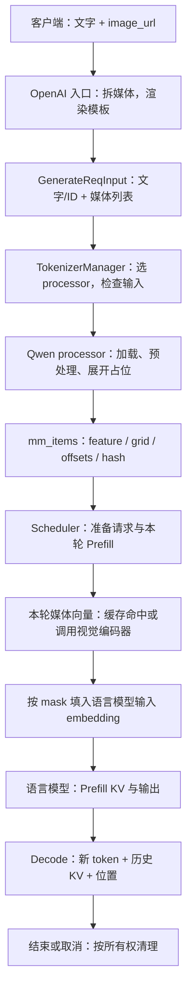
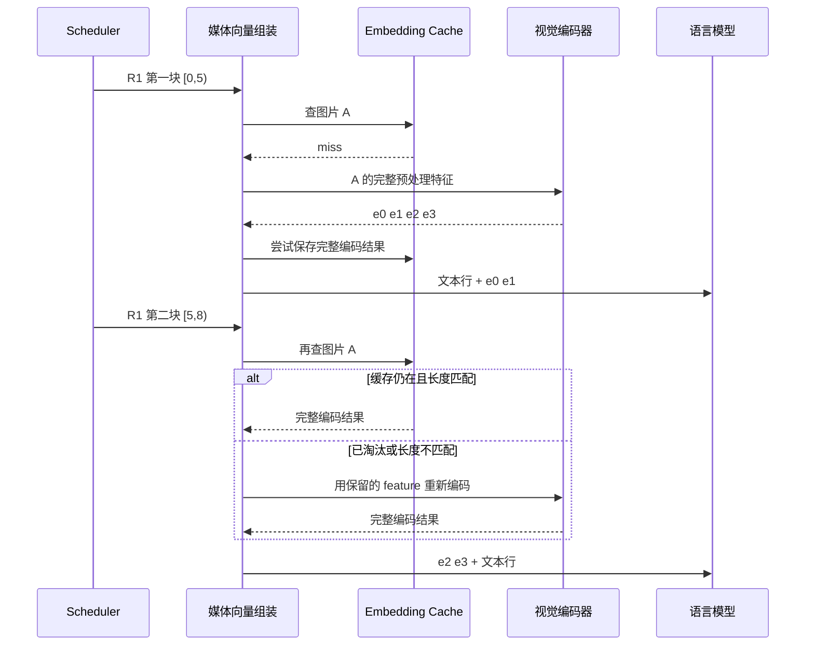
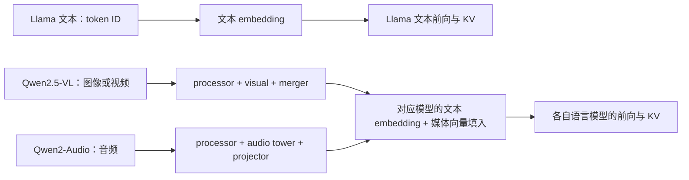

# 图像、视频、音频输入的处理链路

> **先建立架构心智模型：** [M10 · 模型装配状态形态与输入输出](<../architecture/10-模型装配状态形态与输入输出.md>)。先看职责、数据和生命周期，再回到本篇源码细节。

本文是 **09-05，源码分析型学习资料**。承接 [MLA、稀疏注意力与混合状态模型](04-MLA稀疏注意力与混合状态模型.md)，用 Qwen2.5-VL 的一条图像请求走通“媒体输入 → 预处理 → 占位展开 → 编码 → 向量填入 → 语言模型 → 结束”，再分别加入视频和 Qwen2-Audio 对照。

人话版：模型看图之前，系统先把图片整理成一组“小块”，在文字序列里给这些内容留好位置，再把编码后的向量放进去。读到图片的内容、找到要填的位置、拥有生成过程中的历史状态，是三件不同的事。本文沿着同一条请求，把它们逐一对上。

## 0. 阅读基线与代表路径

| 项目 | 内容 |
| --- | --- |
| 源码仓库与路径基准 | 官方 sgl-project/sglang；所有源码位置相对于 SGLang 仓库根目录 . |
| 分支 | codex/sglang-source-study-20260909，基于已拉取的官方 main |
| 固定 commit | 72d5c5bb73cadd7ffbf5114e5f81e29d36b6c61a |
| 读取日期 | 2026-09-10；继续使用 2026-09-09 固定的源码 |
| 工作区 | 学习 worktree sglang-source-study 干净；原 muxi-main 与 26 个未跟踪文件保留 |
| 文档位置 | Wiki sglang/source-study/09-model-specialization/ |
| 完整主线 | Qwen2_5_VLForConditionalGeneration，model_type=qwen2_5_vl；原生 SRT；一条普通图像输入请求 |
| 阅读配置 | CUDA、BF16、TP1/PP1/DP1；选用 PIL 图像预处理、CPU feature transport；普通 Prefill/Decode，再独立加入分块 |
| 主线关闭 | LoRA、量化、投机、Graph、EVS、DP encoder、Encoder 分离；配置用于明确源码分支，不是已验证的启动命令 |
| 独立对照 | 同模型的视频输入与 M-RoPE；Qwen2-Audio 的波形、有效长度和音频编码；预计算 embedding 接口 |
| 操作边界 | 只读固定源码及测试定义，执行独立位置/长度账本和文档检查；未安装依赖、导入 SGLang/torch、下载权重、运行服务或测试 |
| 不展开 | 每个多模态模型的完整网络、所有媒体协议、视觉 kernel、实时音视频、图像/语音生成及完整 EPD 传输协议 |

前置：[02-01 API 到内部请求](../02-request-lifecycle/01-API协议到内部请求对象.md)、[03-04 Chunked Prefill](../03-scheduling/04-ChunkedPrefill与长请求调度.md)、[05-02 模型前向](../05-model-execution/02-以Llama为例读懂模型Forward.md)。

本文引用对应**源码事实**；图、比喻和数值例是**整理者归纳**；没有运行观察。对外部 Transformers 的调用只追到接口，没有把其运行时安装版本、模型权重和 processor 配置视为已被 SGLang commit 一起固定。

背景资料在同日核对 [Transformers Qwen2.5-VL 官方说明](https://huggingface.co/docs/transformers/model_doc/qwen2_5_vl)和 [Qwen2Audio 官方说明](https://huggingface.co/docs/transformers/model_doc/qwen2_audio)：前者介绍图像/视频理解与视觉编码，后者介绍音频理解。这里只作为模型任务背景，具体 SGLang 调用和约束均以下面的固定源码为准。

## 1. 先区分四层数据

### 1.1 同一个“图片输入”，在不同地方是什么

| 所处阶段 | 数据形态 | 谁负责 | 不能当成什么 |
| --- | --- | --- | --- |
| API 内容 | URL、文件/字节入口、媒体类型及文字 | API 解析和加载器 | 不是已经编码的向量 |
| processor 输出 | 图像 patch 特征、视频特征、音频特征及 grid/mask | 模型对应 processor | 不是语言模型生成 KV |
| encoder 输出 | 每个媒体 token 对应的一行 hidden-size 向量 | 视觉/音频编码器与投影层 | 不是 token ID 或最终回答 |
| 语言模型历史 | 文本与媒体位置共同参与计算后形成的逐层 KV | 语言模型、请求映射与缓存组件 | 不是原图、patch 或 encoder 输出副本 |

在本主线里，MultimodalDataItem.feature 存预处理结果，precomputed_embeddings 则存已经编码的结果。字段名称不是通用类型证明：部分模型还允许 feature 携带已经处理的向量，必须结合格式、形状和模型入口判断。[S20] [S27] [S51]

### 1.2 术语速查

| 术语 | 人话解释 | 本文特别关注 |
| --- | --- | --- |
| modality | 内容属于图像、视频还是音频 | 选哪个处理器和编码函数 |
| processor | 把媒体与文字整理成模型输入的适配层 | 通常同时改变特征和 input_ids |
| patch | 图像切分后的一块输入表示 | patch 数不一定等于最终媒体 token 数 |
| grid_thw | 时间、高、宽三个方向的网格尺寸 | 不是原始像素尺寸 |
| spatial_merge_size | 空间方向合并倍率 | 两个空间轴一起影响输出行数 |
| offset | 媒体在展开后的序列中占据的位置区间 | 本文 item.offsets 的右端包含在内 |
| pad_value | 由媒体 item 身份派生的占位整数 | 不是词表里的正常词，也不是额外向量行 |
| embedding mask | 本轮 input_ids 哪些位置要填媒体向量 | 应先于对 input_ids 的词表范围裁剪确定 |
| M-RoPE | 给媒体位置提供时间/高/宽坐标的方式 | 序列位置与位置编码数值不能混用 |
| chunk | 本轮实际处理的连续输入区间 | 可以只与一张图片的一部分占位位置相交 |

对象与字段见 [S20]；占位、mask 和填入见 [S21] [S32] [S33]；网格与位置构造见 [S41]。这里的“时间”坐标是否带真实时间缩放，要看模型分支，不能从三维形状直接推断。

### 1.3 整体地图



**图意解读：** 这是请求的数据处理顺序。processor、cache 和 embedding assembly 是不同职责，不表示图中每个方框都是独立进程。CPU transport 也不等于绝无共享内存封装；跨进程承载属于传输层，参见 [07-06](../07-disaggregation/06-PD与PP及Encoder分离的组合.md)。

## 2. 从消息内容到模型处理器

### 2.1 R1 的入口：保留文字与媒体的相对顺序

设 R1 的用户消息是“这张图片里有什么？”，并携带一张图片。OpenAI 入口走 Jinja 模板的一般分支时，process_content_for_template_format 把 image_url/input_image 内容提取成 ImageData，同时在模板内容中留下 type=image 的位置；文字仍保留在原消息顺序中。video_url 和 audio_url 有各自列表与类型标记。[S2] [S3]

随后模板渲染得到模型可识别的特殊标记文本，内部请求同时携带 image_data/video_data/audio_data。媒体二进制没有被简单拼进文字字符串。[S4]

**边界：** 这里选的是支持结构化多模态内容的模板路径。通用工具可以处理某种 content 类型，不表示任意模型模板都能理解它；字符串内容格式也不能自动保留所有媒体语义。[S3] 自定义模板首先要检查它留下的标记、数量和顺序。

### 2.2 模型名不是唯一判断条件

get_mm_processor_cls 结合模型配置、实际 model implementation 和架构匹配处理器。QwenVLImageProcessor 的 models 列表注册了多个视觉模型类，构造时还会读取 model_type、vision_config 和特殊 token ID。[S1] [S7]

因此，下面两层都必须核对：

1. **注册层：** 此 architecture 是否能找到 processor？
2. **处理层：** 此 model_type 实际进入哪个分支，能接受哪种媒体和 metadata？

同一个 QwenVLImageProcessor 类中出现 audio_data，不证明本文 Qwen2.5-VL 主线支持音频；Qwen2-Audio 使用独立的处理器和模型入口。[S7] [S8] [S48] [S50]

### 2.3 TokenizerManager 是交接点

_tokenize_one_request 的普通多模态路径先整理各媒体列表、做限额检查，再调用 process_mm_data_async；如果 processor 返回新的 input_ids，就以展开后的结果替换此前文本 tokenization 的结果，随后继续请求验证和 tokenized 对象构造。[S5]

这解释了一个常见问题：**文字很短，最终输入却很长。** 初步的文本 ID 还没有完整计入媒体占位长度；展开后必须再看输入上限。Scheduler 安装多模态输入后也有对应长度检查。[S23]

不要混淆输入侧的 mm_content_hashes 与旧式 mm_hashes：前者服务媒体内容身份/预处理相关路径，后者在 TokenizerManager 中有覆盖 item.hash 的逻辑与格式检查。它们不是任意可交换的“缓存开关”。[S5] [S6]

## 3. 加载与预处理：从原图走到模型输入

### 3.1 加载器解决“读到什么”，processor 解决“模型要什么”

load_mm_data 检查输入是否已预处理，解析提示中的模态标记，再选择 fast 或 legacy 加载路径。本例采用标记数量与媒体数量对齐的原始媒体输入。[S9]

fast_load_mm_data 并行提交不同模态的加载任务，按原索引收集结果。完成顺序不决定图片在提示中的顺序。标记数量不匹配时，代码可能退到 legacy 路径；不能把这一处概括为“一律立刻报错”。[S10]

| 媒体 | 加载阶段的工作 | 后续模型处理 |
| --- | --- | --- |
| 图像 | 处理 ImageData/PIL/字节/URL 等入口；读取图像，普通 PIL 分支转 RGB | resize、归一化、patch、grid 等由 processor 组织 |
| 视频 | 解析视频来源，创建解码器包装；已解码 tensor/list 可以直接传递 | Qwen 视频采样与尺寸整理，再交给 processor |
| 音频 | 来源归一化、解码、声道处理和采样率转换 | 特征提取、有效长度及音频 token 展开 |

依据：[S11] [S12] [S13] [S14]。本篇没有读取任何实际用户媒体，也没有验证某种解码依赖已安装。

### 3.2 Qwen 主线怎样调用外部 processor

QwenVLImageProcessor.process_mm_data_async 完成加载后，调用 process_and_combine_mm_data_async；其同步工作主体在 process_and_combine_mm_data。[S8] [S16]

对于原始媒体，BaseMultimodalProcessor.process_mm_data 组织 images/videos/audio 参数，叠加对应配置，调用外部 processor：

```python
# 简化自 python/sglang/srt/multimodal/processors/base_processor.py
result = processor(
    text=[input_text],
    padding=True,
    return_tensors="pt",
    **kwargs,
)
```

行为见 [S15]：返回的不仅有媒体张量，还可能有展开后的 input_ids、grid、mask 和位置相关 metadata。图片特殊标记变成几个媒体 token，需要由实际 processor 与模型配置一起决定。

主线选 PIL/CPU feature transport，只是为了把预处理和设备侧编码分开读。源码另有 fast image processor、GPU 预处理以及 CPU/CUDA IPC/VMM transport 条件；不能把“TokenizerManager 侧执行”直接等同于“所有运算都在 CPU”。[S6] [S15] [S57]

### 3.3 返回结果怎样变成 mm_items

collect_mm_items_from_processor_output 按模态收集张量和模型字段，初步可能把多张图像放进一个 item。process_and_combine_mm_data 补 offsets，再调用 get_new_expanded_mm_items 尝试拆成单媒体 item。[S16] [S17] [S19]

图像拆分会核对 grid 的数量/维度以及 patch 总数与 feature 长度是否吻合，随后给每张图像分配自己的 feature 切片、offsets 和 metadata；新 item 的 hash 重新计算。缺少或不匹配的 grid 不应强行照一个公式切开，源码会保留或尝试对应 fallback。[S19]

所以 **一条请求、一个 item、一张图片** 不是天然的一一关系。后面的缓存路径正是根据实际 item/offset 布局再分类。

## 4. 占位、hash、向量行：三本必须对齐的账

### 4.1 先扩展长度，再替换占位身份

用教学 R1 表示展开后的序列，总长为 8，媒体位置是 3、4、5、6；其他四个位置统称 T，不承诺具体 tokenizer 会产生这个长度。

```text
序列位置             0  1  2   3   4   5   6  7
processor 展开后     T  T  T  IMG IMG IMG IMG T
item.offsets                 [(3, 6)]
媒体身份填充后       T  T  T   P   P   P   P  T
encoder 输出行                e0  e1  e2  e3
```

这里 P 是该 item 的 pad_value。**IMG 重复次数的确定**和**IMG 被 P 替换**是两步；第二步不会再把 8 个位置扩展成更长序列。[S18] [S21] [S26]

build_padded_input_ids 在每个 item 都已有 pad_value 和 offsets 时才生成预填充序列，否则返回 None。Scheduler 尝试使用已构造的 padded_input_ids；不满足其长度/前缀条件时，调用模型 pad_input_ids，Qwen2.5-VL 再进入通用占位填充模式。[S21] [S24] [S25]

### 4.2 item 身份有什么用

MultimodalDataItem.set_pad_value 在尚无身份时解析媒体 hash，再派生 pad_value；MultimodalInputs.from_processor_output 会补齐这个步骤。预计算 hash 的配置路径也可能更早完成它。[S20] [S22] [S67]

pad_value 使运行侧能在本轮 input_ids 中定位媒体区域，并给缓存/前缀处理保留媒体身份。它不证明媒体内容永远不会发生 hash 碰撞，也不意味着两个不同图片只要占位长度相同就可互换。

编码缓存显式防御了**相同紧凑 hash、不同 token 数**的情形：命中后比较编码行数和 offset 跨度，不一致就丢弃旧条目、重新编码；批内缺失项去重使用 (hash, expected_token_count)。这仍不是“同长度碰撞完全不可能”的证明。[S35] [S37]

### 4.3 图像 patch 数与媒体 token 数

对本例网格，令 grid_thw=[1,4,4]，spatial_merge_size=2：

```text
预处理 patch 数 = 1 × 4 × 4 = 16
语言模型媒体位置数 = 1 × (4/2) × (4/2) = 4
offsets = [(3,6)]，跨度 = 6-3+1 = 4
编码结果 shape = [4, hidden_size]
```

这组数只用来解释布局。普通原始输入由外部 processor 生成展开结果；SGLang 的 build_input_ids 在预计算 embedding 重建路径中明确使用 grid.prod()/merge_size² 来扩展占位，M-RoPE 路径也使用合并后的网格。[S59] [S41]

因此不能把 16 行 raw patch 特征直接当成 16 行语言模型输入。实际模型的 patch 维度、merge 参数和 projector 输出维度都需要与其权重配置匹配。

## 5. R1 进入视觉编码器，再填入语言模型

### 5.1 编码入口与形状分支

Qwen2.5-VL.get_image_feature 收集 image item 的 feature 和 image_grid_thw，并转换到视觉编码器 dtype。在本文选择的原始 patch 分支中，调用 visual。[S27]

该函数还有基于二维 feature 宽度的快速分支：某些宽度被视为已经是 embedding-like 输入，直接返回。本例明确采用源码识别的 raw_patch_dim=1176 路径；不能把任意二维输入都理解为“一定再次经过 ViT”，也不能把这个宽度启发式当成所有格式已严格验证。[S27]

### 5.2 视觉编码器做完之后，才有可填入的行

Qwen2_5_VisionTransformer.forward 的普通路径可以分为：

1. patch embedding：把预处理 patch 变成视觉隐藏表示。
2. 根据 grid 计算视觉位置，构造窗口分组与全注意力 metadata。
3. 按 block 索引选择窗口或全注意力模式，执行视觉 Transformer。
4. merger 合并空间表示，再按逆索引恢复相应输出顺序，返回编码结果。[S28]

这一步中的 attention metadata 服务**视觉网络内部的计算**，与语言模型 Decode 历史 KV 的寻址元数据不是同一份对象。本篇不推导其 kernel 算法正确性，也没有测量窗口注意力收益。

### 5.3 embedding assembly 为什么先算 mask

embed_mm_inputs 按模态寻找模型的 get_image_feature/get_video_feature/get_audio_feature，收集 item 的 pad_value 和每请求的 offsets，然后调用 get_embedding_and_mask。[S32] [S33]

获取媒体向量和 mask 后，输入 token ID 被限制到词表合法范围以便调用文本 embedding。接着 _scatter_mm_embedding 把媒体向量填入 mask 选中的行。[S32] [S69]

```text
本轮 input_ids：       [T, T, T, P, P]
先得到媒体 mask：      [0, 0, 0, 1, 1]
查文本 embedding：     [t0,t1,t2, ?, ?]
填入当前媒体切片后：   [t0,t1,t2,e0,e1]
```

P 不是要通过普通词表得到语义的词。若先破坏占位身份，再从已裁剪的 token ID 查 mask，就可能找不到原媒体位置。源码安排顺序正是为了保留这份对应关系。[S32]

### 5.4 谁写语言模型 KV

general_mm_embed_routine 把混合后的 input_embeds 交给 language_model；Qwen2.5-VL.forward 还会把合适的 M-RoPE positions 传下去，最后处理 logits 或对应输出。[S30] [S31]

媒体向量因此像序列中的其他输入位置一样参与语言模型前向；语言模型各层生成自己的 K/V，再进入既有请求/缓存机制。视觉编码器不会凭空替 Scheduler 完成语言模型的 KV 分配、前缀命中或请求结束判定。相关层和缓存主线见 [05-02](../05-model-execution/02-以Llama为例读懂模型Forward.md)与 [04-01](../04-kv-cache/01-请求视图物理槽位与分配器.md)。

### 图解补充：媒体先编码，再进入语言模型序列


[查看原尺寸](../../../images/sglang-source-study/32-qwen-vl.jpeg)。

**图意解读：** 从底部图像与视频向上读，经 Vision Encoder 变成不同长度的视觉表示，再与文字位置一起进入 LM Decoder。视频支路额外显示帧采样与时间位置。

**对应本篇源码：** 沿处理器追踪媒体、占位 token 与视觉向量行；图把大方向连起来，正确写入位置仍要核对本篇的三本账。 [源码：python/sglang/srt/multimodal/processors/qwen_vl.py][S7]

**来源与边界：** [Qwen2.5-VL Technical Report](https://arxiv.org/html/2502.13923v1)，Qwen Team / Alibaba Group，arXiv v1：2025-02-19。这是 Qwen2.5-VL 论文原图；token 数、图像尺寸和帧率是图中示例，不是所有请求默认值。音频和其他视觉模型的预处理不能直接套用。 [来源档案 F32](../../../images/sglang-source-study/SOURCES.md#f32)。

## 6. 分块 Prefill：一张图像可以跨两轮进入语言模型

### 6.1 先画区间交集，再谈缓存

继续 R1：媒体 offset 是闭区间 [3,6]。第一轮处理半开区间 [0,5)，第二轮处理 [5,8)。

| 轮次 | prefix_length | extend_length | 相交媒体位置 | 需要的编码行 |
| --- | ---: | ---: | --- | --- |
| 第一次 Prefill | 0 | 5 | 3、4 | e0、e1 |
| 第二次 Prefill | 5 | 3 | 5、6 | e2、e3 |
| 后续 Decode | 随生成推进 | 普通解码输入 | 无新图像位置 | 不重新填入整张图像 |

区间换算见 get_embedding_chunk、_assemble_per_image_chunk。[S38] [S36] 第一次碰到图片时可以编码完整图片、只取本轮需要的行；不要把“本轮填两行”误写成“视觉网络只看半张图片”。

### 6.2 CUDA 的单 offset item 路径

_get_chunked_prefill_embedding 先过滤没有待处理媒体、extend 长度为零或媒体已全部 Prefill 的请求，再看每个 item 是否恰有一个 offset。[S34]

本例满足单 offset 条件。在 CUDA 路径中：

- 跨请求收集与本轮区间相交的 item。
- 对命中项复核编码行数；对 miss 按 hash 和所需 token 数去重。
- 将 miss 一起调用媒体编码函数，按各 item 行数拆分结果。
- 尝试写入缓存，同时保留本轮本地引用。
- 按请求原顺序组装各 chunk 的切片。[S35] [S36]

这里函数名中的 per_image 是实现名称，判定条件实际看 item.offsets 的布局，不应仅凭名字推导所有其他模态都会被排除。HIP/NPU/XPU 在这处保留逐请求路径；多 offset item 则进入 full 路径，不强行套用本文跨请求聚合方式。[S34] [S37]

### 6.3 LRU 缓存不是“本轮一定拿得到结果”的唯一保证

MultiModalStaticCache 用 OrderedDict 保存 EmbeddingResult，get/get_single 命中会更新最近使用顺序；set 按张量 element_size × numel 计费并淘汰旧条目。[S39]

批内 hash_to_embedding 仍持有已取得的张量引用，即便该条目在当前批次后续插入时被 LRU 淘汰，当前组装也有自己的结果来源。[S35] 这是本轮计算所需引用，与跨请求复用缓存的保留资格分开的例子。

小例子：预算 48 字节，单条 [4,3] BF16 编码结果为 24 字节。先放 A、B，再读 A，随后放 C，则 B 是最近最少使用的条目。它只是张量 payload 账本，没有覆盖 allocator、临时激活或切片共享底层 storage 的全部显存。

另外两个源码细节：[S39]

- 大于预算的新条目可能先把旧条目逐个淘汰，最终仍无法缓存；“set 返回 False”不保证旧缓存完全没变。
- available_size 返回条目数量，不是剩余字节。不能拿它直接计算剩余显存。

缓存容量由 [KV cache 构建入口](https://github.com/sgl-project/sglang/blob/72d5c5bb73cadd7ffbf5114e5f81e29d36b6c61a/python/sglang/srt/mem_cache/kv_cache_builder.py#L363)读取 SGLANG_VLM_CACHE_SIZE_MB 后乘 1024²，再调用初始化函数。[S40] 它的预算与 KV token 池不是同一个计数。

### 6.4 第二轮为什么仍可能重新编码

general_mm_embed_routine 注明 embedding cache 是尽力保留的；为支持后续 chunk 的 fallback，常规非 language_only 分支可把 GPU feature 移回 CPU，而不是一用完第一块就删除请求全部 feature。[S31]



**图意解读：** 只画普通 image chunk 主线。缓存命中减少视觉编码，不证明语言模型前缀 KV 同时命中；KV 命中也不代表媒体文件一定不再被加载或预处理。

## 7. 视频：除了多帧，还要对齐时间和位置

### 7.1 解码、采样、尺寸与 processor 是不同步骤

Qwen 的 preprocess_video 对 VideoDecoderWrapper 读取原视频帧数和 FPS，用 smart_nframes 决定抽帧数，再以 linspace 形成帧索引、去重并取帧；随后把 NHWC 转为 TCHW，按像素预算和尺寸约束 resize，返回处理后视频及 metadata。[S45]

smart_nframes 不允许同时传 fps 与 nframes；显式帧数按 FRAME_FACTOR 对齐，FPS 路径结合 min/max/总帧数约束，最后核对范围。[S44]

这不是“总取固定 N 帧”。例如极短视频可能不满足最小因子要求；已解码 tensor/list 又不会在 preprocess_video 中重新走同一解码器采样流程。[S45]

视频再交给外部 processor，得到 video feature、video_grid_thw 和时间相关输出。Qwen3 家族有传 video_metadata 和 do_sample_frames=False 的明确分支；本文 Qwen2.5-VL 不在该条件列表，不能把 Qwen3 的接口条件复制过来。[S8]

### 7.2 视觉编码和语言模型的时间坐标

get_video_feature 汇合 video feature 与 grid，普通路径也进入 visual；之后仍通过通用 embedding assembly 对齐到语言序列。[S29] [S32]

Qwen2.5-VL 的 get_rope_index 使用合并后的 t/h/w 网格。空间坐标按网格组织；时间坐标在该分支包含：

```text
t_index = floor(temporal_grid_index × second_per_grid_t × tokens_per_second)
```

对非负坐标，这是源码浮点乘法后转 long 的教学表达。它使用 processor 提供的时间粒度；没有该时间数组时，函数有 1.0 的 fallback。[S41] 不应把视频原始 FPS、采样 FPS、temporal grid 数和 tokens_per_second 当作同一单位。

手算：video_grid=[2,4,4]、merge=2，媒体位置为 8 行。若每个时间网格间隔 0.5 秒、tokens_per_second=2，则两个时间组的局部 t 坐标分别为 0 和 1，每组各有四个空间位置。这组教学值不指定任何线上默认参数。

### 7.3 序列位置与 M-RoPE 数值可以不同

以图像 R1 的四个媒体位置为例，局部网格坐标可写作：

```text
媒体局部 t: 0 0 0 0
媒体局部 h: 0 0 1 1
媒体局部 w: 0 1 0 1
```

加上前面文字的起点偏移后形成实际位置编码。后续文字从之前坐标最大值加一接续，因此最大位置值不一定等于序列长度减一。mrope_position_delta 记录这两套计数之间的差。[S41]

ForwardBatch 的 Extend 按 prefix/extend 范围切取每个请求的三行 mrope_positions，再拼接到设备；普通后续 Decode 在没有可直接使用的预计算位置时，用 seq_len-1 加该请求 delta，复制到三个轴。[S42] [S43]

Qwen2.5-VL.forward 在启用 M-RoPE 时传递这些位置，而不是照搬一维 positions。[S30] QwenVLImageProcessor 另有 image-only offset 快速构造方法，但其 model_type 白名单不含 qwen2_5_vl；本文主线不能用那个快速方法替代通用 get_rope_index。[S68]

## 8. 音频对照：有效长度比固定补齐长度更重要

### 8.1 换模型，也换处理契约

这里单独使用 Qwen2AudioMultimodalProcessor 与 Qwen2AudioForConditionalGeneration。它们说明一条音频理解输入怎样变成语言模型的输入向量，不是在 Qwen2.5-VL 请求中任意加入音频，也不讨论生成语音。[S48] [S50]

load_audio 默认目标采样率为 16000，处理解码/声道/重采样。Qwen2-Audio 这条 process_mm_data_async 调用 load_mm_data 时没有另传目标采样率；后续实验必须核对实际 feature_extractor 的采样率要求，不只看扩展名。[S14] [S46]

音频 processor 的输入关键字也有适配：Qwen2AudioProcessor 使用 audio，而非部分其他处理器的 audios。[S15]

### 8.2 固定窗口与截断必须直接写清楚

Qwen2AudioMultimodalProcessor 把 audio_config 中 truncation 设为 True；这覆盖 Base 给相关 audio kwargs 设置的 False。其注释解释固定窗口约束，_warn_if_audio_exceeds_window 按实际 feature_extractor.sampling_rate × chunk_length 计算最大样本数，并对超长数组发出截断提示。[S48] [S47]

因此不能向读者承诺“发很长录音就一定完整理解”。应先记录实际窗口、截断位置、送入的样本数和任务输出。没有用户文字时，_build_transcription_prompt 为转写相关入口构造包含音频标记的提示；非空提示保持原样。[S70]

### 8.3 有效 mask 决定输出保留多少行

Qwen2-Audio 的 processor 输出 feature_attention_mask 后，SGLang 根据有效特征长度推导编码后的行数：

```text
L = feature_attention_mask 中的有效长度
L1 = (L - 1) // 2 + 1
Lout = (L1 - 2) // 2 + 1
```

该结果存为 audio_feature_lens。[S46] 例如：

| 有效 L | L1 | Lout | 教学含义 |
| ---: | ---: | ---: | --- |
| 3000 | 1500 | 750 | 满窗口的长度账本 |
| 101 | 51 | 25 | 更短输入，即使张量做了固定补齐，也只取有效行 |

get_audio_feature 把 input features 交给 audio_tower，经过 multi_modal_projector，再按每条音频的 audio_feature_lens 截取并拼接。接着通过 general_mm_embed_routine 的 AUDIO 映射进入语言模型。[S49] [S50]

**外部边界：** 本地模型文件从 transformers.models.qwen2_audio.modeling_qwen2_audio 导入音频 encoder 和 projector。本篇核对了 SGLang 的调用和长度裁剪，没有读取某个固定版本的完整外部卷积实现，也没有验证其输出精度。上述算式是本地长度契约的静态记录，不是运行结果。

## 9. 三种缓存与预计算输入，不能互相替代

### 9.1 媒体缓存不是 URL 缓存的同义词

| 层次 | 保存内容/查找依据 | 命中可能省什么 | 不保证省什么 |
| --- | --- | --- | --- |
| 原始媒体来源 | URL、文件、字节及可选内容身份 | 取决于具体下载或调用方策略 | 本篇没有证明通用 HTTP 响应缓存 |
| 预处理 artifact 缓存 | 接入该机制的 processor 保存 CPU 侧、与提示无关的 artifact | 该模型的重复预处理 | 不代表已有 encoder 结果或 LM KV |
| embedding 缓存 | item hash 或组合 hash → 编码张量 | 媒体编码 | 提示渲染、所有预处理、语言模型 Prefill |
| 语言模型前缀缓存 | 前缀身份、token/状态布局及匹配条件 | 对应历史前缀的语言模型计算 | 不能直接返回原图或把 encoder cache 当 KV |

Base 构造 MultimodalPreprocessCache，并按 tokenizer worker 数分摊服务级预算；缓存实现提供有界 CPU 存储与同 key 并发计算协调。[S6] [S58] **但当前 QwenVLImageProcessor 主线未读取/写入这个 artifact cache。** 只看到 Base 有这个字段，不能宣布本文图片已自动走预处理缓存。[S8] [S16]

Embedding 缓存则在本篇实际执行主线上。[S33] [S39] 各层是否命中应分开记录；“第二次请求快了”不能单凭端到端时间归因到其中一层。

### 9.2 precomputed_embeddings 是另一种输入边界

_get_precomputed_embedding 优先尝试已有编码结果，并按当前 chunk 裁剪；只有适合的布局才能直接使用。混合原始与预计算 item 有单独条件或未实现分支，不应宣传为任意混用。[S51]

EPD 重建接口的 _validate_precomputed_embedding_layout 会检查每个 item 的编码行数等于 offsets 总跨度，还核对各模态输入行数是否全部被消费、有无意外模态。[S52]

这些检查覆盖的是**行布局和消费量**，不证明向量来自正确模型、正确图像、正确 projector，或在语义上与提示一致。完整 Encoder 分离还要确认传输与就绪/释放协议，见 [07-06](../07-disaggregation/06-PD与PP及Encoder分离的组合.md)。

## 10. 结束、取消与资源所有权

### 10.1 一条请求有不止一种“释放”

| 对象 | 典型所有者/引用方 | 本文核对到的退役动作 | 关键边界 |
| --- | --- | --- | --- |
| 原始媒体/processor 局部输出 | 前端与处理任务局部变量 | 随任务和相关引用释放 | 不代表请求 feature 一定立刻消失 |
| item.feature | 请求多模态输入，可在设备/CPU 间转换 | release_features 清除 feature 字段 | 续块前可能还需要它 |
| transport proxy | 传输池及消费者 | release_features 尝试确认 deferred feature 消费，再清字段 | 丢 Python 引用不能替代传输确认 |
| item.precomputed_embeddings | 多模态 item 引用 | 随所属输入对象及其他引用退役 | release_features 本身没有统一清这个字段 |
| embedding cache 条目 | 执行进程内缓存 | LRU/free/clear 管理缓存引用 | 请求结束不必清空整份缓存 |
| 语言模型 KV | 请求和前缀缓存组件 | 走既有 KV 归还、保留或转交规则 | 与删除图像 feature 分开 |
| 会话多模态历史 | session 与当前 turn | 不能按无会话请求统一清掉共享特征 | 会话所有权需要单独处理 |

依据：[S31] [S39] [S53] [S54] [S55]。缓存被删除只代表该容器不再拥有引用；其他当前计算或共享视图还可能持有底层存储，不能直接等同于物理显存立即下降。

### 10.2 取消路径也要考虑“还没有重建”的 feature

Req.set_finish_with_abort 在无会话请求中调用 release_features，随后断开当前 req.multimodal_inputs。session 请求则跳过共享特征释放，同时断开当前 turn 的引用。[S54]

release_features 对每个 item 先尝试 acknowledge_deferred_cuda_ipc_feature；即便该清理抛异常，也在 finally 中把 feature 设为 None，避免把局部清理错误扩大成保留所有请求特征。[S53]

Scheduler._maybe_clear_mm_inputs 以请求已经 finished 且没有 session 为条件，清理 feature 并移除请求多模态输入。[S55] 这些条件不能前移到“第一轮 encoder 已经返回”：长提示尚有下一块、缓存又可能被淘汰。

## 11. 兼容与排障：从现象回到具体边界

### 11.1 与 Llama 基线相比，适配改变了哪几层

| 能力 | 配置与入口 | 层/算子接口 | 新增状态或布局 | 验证入口 |
| --- | --- | --- | --- | --- |
| Llama 文本生成基线 | 文本 config、tokenizer；见 05-02 | 词表 embedding → 文本 Transformer | 原有请求位置与 LM KV | 既有文本加载/forward 路线 |
| Qwen2.5-VL 图像理解 | vision_config、image token、merge；QwenVLImageProcessor | 预处理 → visual/merger → 通用向量填入 | grid、offsets、pad、编码缓存、M-RoPE；仍需 LM KV | 布局/坏输入单测入口，加待执行的真实图像对照 |
| Qwen2.5-VL 视频理解 | 视频采样配置、video grid、时间粒度 | 视频预处理 → visual → 通用向量填入 | 时间/空间坐标与抽帧索引 | 通用视频采样定义只作邻近入口；专用路径需另验 |
| Qwen2-Audio 音频理解 | audio config、窗口、特殊 token；独立 processor | 特征提取 → audio_tower/projector → 向量填入 | feature_attention_mask、audio_feature_lens、offsets | 容器解码/布局入口，加待执行的真实音频对照 |

图像链见 [S7] [S27] [S28]；视频见 [S29] [S41] [S45]；音频见 [S46] [S49]。下图只比较接口形态，不表示 Qwen 复用了 Llama 的实际模型类或权重。



**图意解读：** 多模态多了一条媒体编码与位置对齐的输入支路；语言模型仍需维护自己的历史。注册一个模型类只是入口，不能替代其 processor、权重、输出行数和生命周期验证。

### 11.2 本篇覆盖到什么程度

| 能力/组合 | 固定源码所见 | 本次证据状态 |
| --- | --- | --- |
| Qwen2.5-VL 普通图像 | 注册 → processor → visual → embedding → LM 路径存在 | 静态追踪；未运行 |
| Qwen2.5-VL 视频 | 专用采样/尺寸处理、video feature、时间 M-RoPE | 静态追踪；未验证解码库/权重 |
| Qwen2-Audio | 独立 processor、有效长度、音频 encoder/projector 接口 | 静态追踪；外部实现未固定 |
| CUDA 单 offset item | 跨请求聚合 miss 并按 chunk 组装 | 静态分支；没有性能数字 |
| 多 offset/其他设备 | full 或逐请求路径 | 局部对照，不按主线推导一致性 |
| artifact 预处理缓存 | Base 与独立实现存在；QwenVL 主线未接入读写 | 不标成当前主线命中 |
| EPD 预计算输入 | 有行数/模态消费校验 | 仅接口对照；非端到端验证 |
| TP/PP、LoRA、量化、投机、Graph、EVS | 不在主线组合内 | 不从单功能存在推导组合已验证 |

### 11.3 常见现象的定位顺序

| 现象 | 先查什么 | 回到源码 | 不要直接下的结论 |
| --- | --- | --- | --- |
| 图片被忽略 | 模板格式、标记、媒体列表、选中的 processor | [S1] [S2] [S3] | “视觉模型质量不好” |
| 短文字报超长 | 展开后 input_ids、grid 和 token 跨度 | [S5] [S23] | “上下文长度检查出错” |
| 媒体下载/解码报错 | 错误是坏输入、网络、缺依赖还是内存不足 | [S11] [S63] [S64] | “所有错误都由用户文件损坏引起” |
| 两张图像顺序不对 | 模板相对顺序、item 拆分、offsets、组装顺序 | [S19] [S34] [S36] | “并发结束顺序就是输出顺序” |
| 第二个 chunk 报行数错 | 闭/开区间、缓存行数、grid、当前 prefix/extend | [S35] [S38] [S56] | “只要关闭分块就修好机制” |
| cache hit 仍慢 | 哪层命中、是否重新预处理、LM KV 是否命中 | [S8] [S31] [S39] | “缓存无效” |
| 视频时间理解异常 | 抽帧索引、时间粒度、model_type 和 mrope delta | [S44] [S45] [S41] | “视频就是图片重复输入” |
| 音频后半段缺失 | 输入样本数、窗口、truncation、有效 mask | [S47] [S48] [S46] | “模型自动完整听完了长录音” |
| 请求取消后内存仍在 | session、缓存引用、预计算向量、传输 lease、KV | [S39] [S53] [S54] | “feature=None 必须立即释放所有显存” |

_adjust_embedding_length 在编码行数不足时抛 RuntimeError；编码行数过多时有警告及取尾部的妥协路径。[S56] **能继续运行不等于对齐语义已正确。** 排查时应保存原始行数、offsets、mask 数量和模型配置，不能把截断 fallback 写成通用正确性保证。

## 12. 如何验证，以及本篇已经验证什么

### 12.1 已阅读的测试定义

| 测试入口 | 定义检查了什么 | 没有因此证明什么 |
| --- | --- | --- |
| test_multimodal_abort_cleanup.py | 无 session abort 清 feature；session abort 保留共享特征；deferred 确认及异常清理 | 真实 IPC/GPU 生命周期全覆盖 |
| test_precomputed_embedding_validation.py | 精确行布局、缺行、多余行、缺失/意外模态 | 向量的模型身份、数值与任务质量 |
| test_base_processor_bad_input.py | URL/坏媒体分类；缺解码器、OOM、系统错误保留服务端错误含义 | 真实环境已经具备解码依赖 |
| test_audio_container_decode.py | 所读 AAC-in-MP4 用例检查解码、单声道、目标采样率和输出属性 | 本次音频测试已执行，或 Qwen2-Audio 已跑通 |
| test_video_utils.py | 通用 sample_video_frames 的帧索引测试 | Qwen smart_nframes/preprocess_video 的直接测试或通过结果 |

定义依据：[S60] [S61] [S62] [S63] [S64] [S65] [S66]。表内测试文件路径相对于 test/registered 下对应 unit/managers、unit/multimodal 或 vlm 子目录；精确定位见固定链接。**本次均未运行。**

### 12.2 后续实验应记录的最小证据

| 维度 | 应保存的内容 | 关键对照 |
| --- | --- | --- |
| 环境与模型 | SGLang SHA、权重 snapshot、完整 processor/模型配置、Transformers/解码库、设备/dtype | 原始特征与预计算向量的来源是否一致 |
| 请求 | 媒体内容摘要、消息模板、媒体顺序、展开前后 ID 数、rid | 同媒体不同文本；同模板不同媒体 |
| 布局 | grid、mask 有效长度、offsets、pad_value、encoder 行数、mrope/delta | 完整 Prefill 与两块 Prefill |
| 缓存 | 预处理、embedding、KV 分别的命中和淘汰；预算与实际引用 | 冷/热、LRU 被挤出、相同 hash 不同行数 |
| 生命周期 | 当前 chunk、feature 所在设备、session、取消点、transport 确认、KV 收尾 | 正常结束、加载失败、编码前取消、续块与会话 |
| 正确性与性能 | 固定媒体答案/数值对照及容差；分段计时与完整负载参数 | 不用单次 TTFT 代替所有环节结论 |

这是一份未来可执行验证设计，没有在本机执行其中的模型/服务实验。实际 trace 需要把下载、预处理、排队、编码和语言模型 Prefill 分段看，避免把所有首 token 延迟都归给视觉网络。

### 12.3 本次文档检查

本篇复核固定源码的文件/符号/行号，检查本地导航、Markdown 表格、引用定义及 Mermaid 与正文的一致性；独立手算并检查图像 grid、offset 区间交集、音频长度和 LRU payload 账本。Mermaid 只做静态检查，没有渲染器截图验证。

没有导入项目、执行代码片段、调用真实 encoder、运行单测或测量精度/性能。源码事实的完成状态与运行验证状态在进度附录中分开记录。

## 13. 练习与回源码的阅读顺序

### 13.1 先自己回答

1. R1 的 offset=[3,6]，本轮 prefix=4、extend=2，应从 [e0,e1,e2,e3] 取哪几行？下一轮从 prefix=6、extend=2 又取哪一行？
2. 两张图片 patch 数分别为 16、36，merge=2、t=1，各占多少语言模型位置？能直接按 16、36 行从 encoder 输出拆分吗？
3. embedding cache 命中以后，为什么语言模型仍可能要做完整 Prefill？
4. 音频有效特征 L=101，但输入张量补齐到 3000；应保留 25 行还是 750 行？哪个字段决定？
5. abort 后 item.feature 已是 None，为什么仍不能断言会话、embedding cache、precomputed_embeddings 和 LM KV 都已释放？

**答案线索：** 第一问分别取 e1/e2 和 e3；第二问为 4、9 行，raw patch 数和 merger 输出数不同；后三问分别回到缓存分层、audio_feature_lens 和所有者/引用关系。[S36] [S59] [S39] [S46] [S53]

### 13.2 最短阅读路线

| 顺序 | 入口 | 要带走的问题 |
| --- | --- | --- |
| 1 | `python/sglang/srt/parser/jinja_template_utils.py::process_content_for_template_format` [S3] | 媒体数据与占位顺序怎样同时保留？ |
| 2 | `python/sglang/srt/managers/tokenizer_manager.py::TokenizerManager._tokenize_one_request` [S5] | 谁用展开后的 ID 替换原文本 ID？ |
| 3 | `python/sglang/srt/multimodal/processors/qwen_vl.py::QwenVLImageProcessor.process_mm_data_async` [S8] | 特征、grid、offsets、位置怎样成套返回？ |
| 4 | `python/sglang/srt/managers/schedule_batch.py::MultimodalInputs.from_processor_output` [S22] | item 身份何时完整？ |
| 5 | `python/sglang/srt/managers/mm_schedule.py::_get_chunked_prefill_embedding` [S34] | 本轮要读哪些媒体，哪些能复用？ |
| 6 | `python/sglang/srt/models/qwen2_5_vl.py::Qwen2_5_VisionTransformer.forward` [S28] | 原始 patch 怎样成为可填入的向量行？ |
| 7 | `python/sglang/srt/managers/mm_utils.py::general_mm_embed_routine` [S31] | 谁交给 LM，续块为什么保留 feature？ |
| 8 | `python/sglang/srt/managers/schedule_batch.py::Req.set_finish_with_abort` [S54] | 取消时按谁的所有权释放？ |

沿这条顺序，应能解释：**媒体在序列里占哪些位置、这些位置对应哪些编码行、哪层状态能复用，以及每份数据何时不再被需要。**

下一篇是 [09-06《Embedding、Rerank 与模型适配清单》](06-EmbeddingRerank与模型适配清单.md)，从非生成任务的输出路径继续整理注册、加载、forward、输出协议与验证清单。

[返回系列目录](../README.md) · [学习进度](../appendices/06-学习进度与版本变更记录.md)

[S1]: https://github.com/sgl-project/sglang/blob/72d5c5bb73cadd7ffbf5114e5f81e29d36b6c61a/python/sglang/srt/managers/multimodal_processor.py#L45
[S2]: https://github.com/sgl-project/sglang/blob/72d5c5bb73cadd7ffbf5114e5f81e29d36b6c61a/python/sglang/srt/entrypoints/openai/serving_chat.py#L1336
[S3]: https://github.com/sgl-project/sglang/blob/72d5c5bb73cadd7ffbf5114e5f81e29d36b6c61a/python/sglang/srt/parser/jinja_template_utils.py#L183
[S4]: https://github.com/sgl-project/sglang/blob/72d5c5bb73cadd7ffbf5114e5f81e29d36b6c61a/python/sglang/srt/entrypoints/openai/serving_chat.py#L1046
[S5]: https://github.com/sgl-project/sglang/blob/72d5c5bb73cadd7ffbf5114e5f81e29d36b6c61a/python/sglang/srt/managers/tokenizer_manager.py#L970
[S6]: https://github.com/sgl-project/sglang/blob/72d5c5bb73cadd7ffbf5114e5f81e29d36b6c61a/python/sglang/srt/multimodal/processors/base_processor.py#L237
[S7]: https://github.com/sgl-project/sglang/blob/72d5c5bb73cadd7ffbf5114e5f81e29d36b6c61a/python/sglang/srt/multimodal/processors/qwen_vl.py#L309
[S8]: https://github.com/sgl-project/sglang/blob/72d5c5bb73cadd7ffbf5114e5f81e29d36b6c61a/python/sglang/srt/multimodal/processors/qwen_vl.py#L735
[S9]: https://github.com/sgl-project/sglang/blob/72d5c5bb73cadd7ffbf5114e5f81e29d36b6c61a/python/sglang/srt/multimodal/processors/base_processor.py#L1214
[S10]: https://github.com/sgl-project/sglang/blob/72d5c5bb73cadd7ffbf5114e5f81e29d36b6c61a/python/sglang/srt/multimodal/processors/base_processor.py#L1294
[S11]: https://github.com/sgl-project/sglang/blob/72d5c5bb73cadd7ffbf5114e5f81e29d36b6c61a/python/sglang/srt/multimodal/processors/base_processor.py#L947
[S12]: https://github.com/sgl-project/sglang/blob/72d5c5bb73cadd7ffbf5114e5f81e29d36b6c61a/python/sglang/srt/utils/common.py#L1927
[S13]: https://github.com/sgl-project/sglang/blob/72d5c5bb73cadd7ffbf5114e5f81e29d36b6c61a/python/sglang/srt/utils/common.py#L2029
[S14]: https://github.com/sgl-project/sglang/blob/72d5c5bb73cadd7ffbf5114e5f81e29d36b6c61a/python/sglang/srt/utils/common.py#L1695
[S15]: https://github.com/sgl-project/sglang/blob/72d5c5bb73cadd7ffbf5114e5f81e29d36b6c61a/python/sglang/srt/multimodal/processors/base_processor.py#L823
[S16]: https://github.com/sgl-project/sglang/blob/72d5c5bb73cadd7ffbf5114e5f81e29d36b6c61a/python/sglang/srt/multimodal/processors/base_processor.py#L1773
[S17]: https://github.com/sgl-project/sglang/blob/72d5c5bb73cadd7ffbf5114e5f81e29d36b6c61a/python/sglang/srt/multimodal/processors/base_processor.py#L1557
[S18]: https://github.com/sgl-project/sglang/blob/72d5c5bb73cadd7ffbf5114e5f81e29d36b6c61a/python/sglang/srt/multimodal/processors/base_processor.py#L1517
[S19]: https://github.com/sgl-project/sglang/blob/72d5c5bb73cadd7ffbf5114e5f81e29d36b6c61a/python/sglang/srt/managers/mm_utils.py#L1110
[S20]: https://github.com/sgl-project/sglang/blob/72d5c5bb73cadd7ffbf5114e5f81e29d36b6c61a/python/sglang/srt/managers/schedule_batch.py#L356
[S21]: https://github.com/sgl-project/sglang/blob/72d5c5bb73cadd7ffbf5114e5f81e29d36b6c61a/python/sglang/srt/managers/schedule_batch.py#L625
[S22]: https://github.com/sgl-project/sglang/blob/72d5c5bb73cadd7ffbf5114e5f81e29d36b6c61a/python/sglang/srt/managers/schedule_batch.py#L697
[S23]: https://github.com/sgl-project/sglang/blob/72d5c5bb73cadd7ffbf5114e5f81e29d36b6c61a/python/sglang/srt/managers/scheduler.py#L2708
[S24]: https://github.com/sgl-project/sglang/blob/72d5c5bb73cadd7ffbf5114e5f81e29d36b6c61a/python/sglang/srt/managers/scheduler.py#L2631
[S25]: https://github.com/sgl-project/sglang/blob/72d5c5bb73cadd7ffbf5114e5f81e29d36b6c61a/python/sglang/srt/models/qwen2_5_vl.py#L771
[S26]: https://github.com/sgl-project/sglang/blob/72d5c5bb73cadd7ffbf5114e5f81e29d36b6c61a/python/sglang/srt/managers/mm_utils.py#L331
[S27]: https://github.com/sgl-project/sglang/blob/72d5c5bb73cadd7ffbf5114e5f81e29d36b6c61a/python/sglang/srt/models/qwen2_5_vl.py#L775
[S28]: https://github.com/sgl-project/sglang/blob/72d5c5bb73cadd7ffbf5114e5f81e29d36b6c61a/python/sglang/srt/models/qwen2_5_vl.py#L509
[S29]: https://github.com/sgl-project/sglang/blob/72d5c5bb73cadd7ffbf5114e5f81e29d36b6c61a/python/sglang/srt/models/qwen2_5_vl.py#L816
[S30]: https://github.com/sgl-project/sglang/blob/72d5c5bb73cadd7ffbf5114e5f81e29d36b6c61a/python/sglang/srt/models/qwen2_5_vl.py#L855
[S31]: https://github.com/sgl-project/sglang/blob/72d5c5bb73cadd7ffbf5114e5f81e29d36b6c61a/python/sglang/srt/managers/mm_utils.py#L628
[S32]: https://github.com/sgl-project/sglang/blob/72d5c5bb73cadd7ffbf5114e5f81e29d36b6c61a/python/sglang/srt/managers/mm_utils.py#L389
[S33]: https://github.com/sgl-project/sglang/blob/72d5c5bb73cadd7ffbf5114e5f81e29d36b6c61a/python/sglang/srt/managers/mm_schedule.py#L688
[S34]: https://github.com/sgl-project/sglang/blob/72d5c5bb73cadd7ffbf5114e5f81e29d36b6c61a/python/sglang/srt/managers/mm_schedule.py#L525
[S35]: https://github.com/sgl-project/sglang/blob/72d5c5bb73cadd7ffbf5114e5f81e29d36b6c61a/python/sglang/srt/managers/mm_schedule.py#L323
[S36]: https://github.com/sgl-project/sglang/blob/72d5c5bb73cadd7ffbf5114e5f81e29d36b6c61a/python/sglang/srt/managers/mm_schedule.py#L496
[S37]: https://github.com/sgl-project/sglang/blob/72d5c5bb73cadd7ffbf5114e5f81e29d36b6c61a/python/sglang/srt/managers/mm_schedule.py#L239
[S38]: https://github.com/sgl-project/sglang/blob/72d5c5bb73cadd7ffbf5114e5f81e29d36b6c61a/python/sglang/srt/managers/mm_schedule.py#L28
[S39]: https://github.com/sgl-project/sglang/blob/72d5c5bb73cadd7ffbf5114e5f81e29d36b6c61a/python/sglang/srt/mem_cache/multimodal_cache.py#L76
[S40]: https://github.com/sgl-project/sglang/blob/72d5c5bb73cadd7ffbf5114e5f81e29d36b6c61a/python/sglang/srt/managers/mm_schedule.py#L23
[S41]: https://github.com/sgl-project/sglang/blob/72d5c5bb73cadd7ffbf5114e5f81e29d36b6c61a/python/sglang/srt/layers/rotary_embedding/mrope_rope_index.py#L47
[S42]: https://github.com/sgl-project/sglang/blob/72d5c5bb73cadd7ffbf5114e5f81e29d36b6c61a/python/sglang/srt/model_executor/forward_batch_info.py#L1294
[S43]: https://github.com/sgl-project/sglang/blob/72d5c5bb73cadd7ffbf5114e5f81e29d36b6c61a/python/sglang/srt/model_executor/forward_batch_info.py#L1228
[S44]: https://github.com/sgl-project/sglang/blob/72d5c5bb73cadd7ffbf5114e5f81e29d36b6c61a/python/sglang/srt/multimodal/processors/qwen_vl.py#L159
[S45]: https://github.com/sgl-project/sglang/blob/72d5c5bb73cadd7ffbf5114e5f81e29d36b6c61a/python/sglang/srt/multimodal/processors/qwen_vl.py#L208
[S46]: https://github.com/sgl-project/sglang/blob/72d5c5bb73cadd7ffbf5114e5f81e29d36b6c61a/python/sglang/srt/multimodal/processors/qwen_audio.py#L153
[S47]: https://github.com/sgl-project/sglang/blob/72d5c5bb73cadd7ffbf5114e5f81e29d36b6c61a/python/sglang/srt/multimodal/processors/qwen_audio.py#L90
[S48]: https://github.com/sgl-project/sglang/blob/72d5c5bb73cadd7ffbf5114e5f81e29d36b6c61a/python/sglang/srt/multimodal/processors/qwen_audio.py#L23
[S49]: https://github.com/sgl-project/sglang/blob/72d5c5bb73cadd7ffbf5114e5f81e29d36b6c61a/python/sglang/srt/models/qwen2_audio.py#L106
[S50]: https://github.com/sgl-project/sglang/blob/72d5c5bb73cadd7ffbf5114e5f81e29d36b6c61a/python/sglang/srt/models/qwen2_audio.py#L122
[S51]: https://github.com/sgl-project/sglang/blob/72d5c5bb73cadd7ffbf5114e5f81e29d36b6c61a/python/sglang/srt/managers/mm_schedule.py#L73
[S52]: https://github.com/sgl-project/sglang/blob/72d5c5bb73cadd7ffbf5114e5f81e29d36b6c61a/python/sglang/srt/multimodal/processors/base_processor.py#L668
[S53]: https://github.com/sgl-project/sglang/blob/72d5c5bb73cadd7ffbf5114e5f81e29d36b6c61a/python/sglang/srt/managers/schedule_batch.py#L680
[S54]: https://github.com/sgl-project/sglang/blob/72d5c5bb73cadd7ffbf5114e5f81e29d36b6c61a/python/sglang/srt/managers/schedule_batch.py#L1983
[S55]: https://github.com/sgl-project/sglang/blob/72d5c5bb73cadd7ffbf5114e5f81e29d36b6c61a/python/sglang/srt/managers/scheduler.py#L2697
[S56]: https://github.com/sgl-project/sglang/blob/72d5c5bb73cadd7ffbf5114e5f81e29d36b6c61a/python/sglang/srt/managers/mm_schedule.py#L657
[S57]: https://github.com/sgl-project/sglang/blob/72d5c5bb73cadd7ffbf5114e5f81e29d36b6c61a/python/sglang/srt/multimodal/processors/base_processor.py#L1967
[S58]: https://github.com/sgl-project/sglang/blob/72d5c5bb73cadd7ffbf5114e5f81e29d36b6c61a/python/sglang/srt/multimodal/cache/preprocess_cache.py#L121
[S59]: https://github.com/sgl-project/sglang/blob/72d5c5bb73cadd7ffbf5114e5f81e29d36b6c61a/python/sglang/srt/multimodal/processors/base_processor.py#L544
[S60]: https://github.com/sgl-project/sglang/blob/72d5c5bb73cadd7ffbf5114e5f81e29d36b6c61a/test/registered/unit/managers/test_multimodal_abort_cleanup.py#L48
[S61]: https://github.com/sgl-project/sglang/blob/72d5c5bb73cadd7ffbf5114e5f81e29d36b6c61a/test/registered/unit/managers/test_multimodal_abort_cleanup.py#L68
[S62]: https://github.com/sgl-project/sglang/blob/72d5c5bb73cadd7ffbf5114e5f81e29d36b6c61a/test/registered/unit/multimodal/test_precomputed_embedding_validation.py#L35
[S63]: https://github.com/sgl-project/sglang/blob/72d5c5bb73cadd7ffbf5114e5f81e29d36b6c61a/test/registered/unit/multimodal/test_base_processor_bad_input.py#L40
[S64]: https://github.com/sgl-project/sglang/blob/72d5c5bb73cadd7ffbf5114e5f81e29d36b6c61a/test/registered/unit/multimodal/test_base_processor_bad_input.py#L93
[S65]: https://github.com/sgl-project/sglang/blob/72d5c5bb73cadd7ffbf5114e5f81e29d36b6c61a/test/registered/unit/multimodal/test_audio_container_decode.py#L161
[S66]: https://github.com/sgl-project/sglang/blob/72d5c5bb73cadd7ffbf5114e5f81e29d36b6c61a/test/registered/vlm/test_video_utils.py#L58
[S67]: https://github.com/sgl-project/sglang/blob/72d5c5bb73cadd7ffbf5114e5f81e29d36b6c61a/python/sglang/srt/multimodal/processors/base_processor.py#L1937
[S68]: https://github.com/sgl-project/sglang/blob/72d5c5bb73cadd7ffbf5114e5f81e29d36b6c61a/python/sglang/srt/multimodal/processors/qwen_vl.py#L514
[S69]: https://github.com/sgl-project/sglang/blob/72d5c5bb73cadd7ffbf5114e5f81e29d36b6c61a/python/sglang/srt/managers/mm_utils.py#L371
[S70]: https://github.com/sgl-project/sglang/blob/72d5c5bb73cadd7ffbf5114e5f81e29d36b6c61a/python/sglang/srt/multimodal/processors/qwen_audio.py#L70
