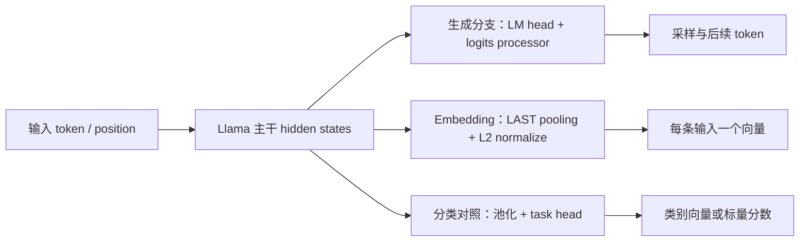
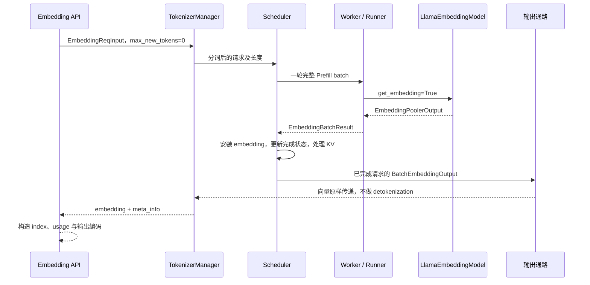
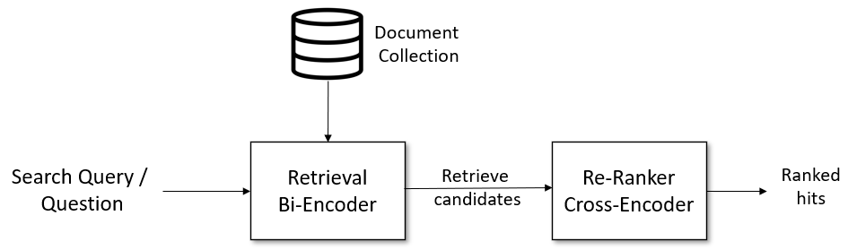
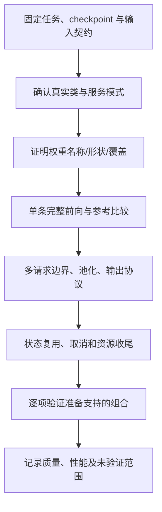

# Embedding、Rerank 与模型适配清单

> **先建立架构心智模型：** [M10 · 模型装配状态形态与输入输出](<../architecture/10-模型装配状态形态与输入输出.md>)。先看职责、数据和生命周期，再回到本篇源码细节。

本文是 **09-06，源码分析型学习资料**。承接 [多模态输入链路](05-图像视频音频输入的处理链路.md)，回到纯文本，沿 LlamaEmbeddingModel 走通一次“请求 → Prefill → 池化向量 → 返回与回收”。随后对照 BERT 分类式 Rerank 和 Qwen3 文本解码式 Rerank，再把阶段 09 的内容收束成模型适配清单。

人话版：生成模型要继续写下一个字；Embedding 模型把一段输入整理成一串可比较的数字；Rerank 模型判断查询与候选内容有多相关。这些任务可以共享许多执行基础设施，但“使用了 Transformer”不等于输出代表同一种东西。

## 0. 阅读基线与范围

| 项目 | 内容 |
| --- | --- |
| 源码仓库与路径基准 | 官方 sgl-project/sglang；源码位置均相对于 SGLang 仓库根目录 . |
| 分支 | codex/sglang-source-study-20260909，基于已拉取的官方 main |
| 固定 commit | 72d5c5bb73cadd7ffbf5114e5f81e29d36b6c61a |
| 读取日期 | 2026-09-10；沿用 2026-09-09 固定基线 |
| 工作区 | 学习 worktree sglang-source-study 干净；原 muxi-main 与 26 个未跟踪文件保留 |
| 文档位置 | Wiki sglang/source-study/09-model-specialization/ |
| 完整主线 | architecture=LlamaEmbeddingModel、LlamaConfig、原生 SRT、LAST pooling、normalize=True；纯文本 dense embedding |
| 阅读配置 | CUDA、BF16、TP1/PP1/DP1；非量化；关闭 Overlap、Graph、LoRA、投机、MIS、前缀复用与 Chunked Prefill；不启用 no-KV 快速路径；dimensions=None |
| 对照一 | BertForSequenceClassification、num_labels=1、绝对位置编码、未设置 sbert_ce_default_activation_function；完整文本 pair Prefill |
| 对照二 | Qwen3 文本 decoder reranker 路由，模型处于 generation 模式，匹配其 yes/no 模板；不包含 VL 和 MIS 主线 |
| 模型适配例 | 现有 Qwen3Model bare backbone 的注册、模式判定、权重前缀和 LAST pooling；不新增或修改源码 |
| 操作与证据 | 只读源码及七份测试文件中的列明定义，做独立数值/索引账本和文档检查；未导入 SGLang/torch、安装依赖、下载权重、启动服务或运行模型测试 |
| 不展开 | 向量数据库实现、训练目标推导、全部检索模型、稀疏/多向量检索、全部后端、MIS 专用 Attention、完整部署与性能评测 |

这些是**阅读分支和形状契约**，不是已验证的启动配置或权重组合。实际实验还必须固定 checkpoint snapshot、tokenizer/processor、任务训练方式和依赖版本。

前置：[09-01 模型注册与加载](01-模型注册配置与权重加载.md)、[05-02 Llama Forward](../05-model-execution/02-以Llama为例读懂模型Forward.md)、[02-06 完成与回收](../02-request-lifecycle/06-完成取消与资源释放.md)。有固定锚点的是**源码事实**；示例与图是**整理者归纳**；没有运行观察。

## 1. 先把向量、分数和概率分开

### 1.1 三个问题，对应三种输出

| 任务 | 输入怎么组织 | 主要输出 | 通常怎样使用 |
| --- | --- | --- | --- |
| Dense embedding | 分别编码查询或文档 | 每段输入一条向量 | 由检索系统比较向量、选候选 |
| 分类式 Rerank | 查询与一个候选组成 pair | 任务头的标量或类别分数 | 对同一查询的候选排序 |
| 解码式 Rerank | 查询与候选写入判断提示 | 指定 label token 的概率或其归一化值 | 作为相关性分数排序 |
| 文本生成 | 提示加已生成历史 | 后续 token、文本及可选概率 | 逐步生成回答 |

分别编码与联合 pair 编码的检索背景，可参照 [Sentence Transformers 的 Retrieve & Re-Rank](https://www.sbert.net/examples/sentence_transformer/applications/retrieve_rerank/README.html)及 [Cross-Encoders](https://www.sbert.net/examples/cross_encoder/applications/README.html)，读取日期同上。这里只引用任务区分；本文没有复现其性能结论。

**Embedding API 不等于搜索引擎。** 本地 _build_embedding_response 构造 embedding、index 和 usage；它没有在这里维护文档索引或做近邻检索。[S33] 同样，把两个句子分别得到的向量做点积，与让分类模型联合读取一对句子，不是同一次计算。

### 1.2 几个同名字段尤其容易误读

| 名称 | 本文中的含义 | 需要继续问的问题 |
| --- | --- | --- |
| input embedding | 模型输入的 token 向量或覆盖向量 | 它是输入，还是用户要取回的结果？ |
| hidden_states | Transformer 对各位置的隐藏表示 | 是逐 token、池化前，还是任务头之后？ |
| pooling | 按每条序列的位置/范围选取或汇总表示 | LAST、CLS、MEAN 哪一种？是否跨错请求？ |
| EmbeddingPoolerOutput.embeddings | 共用输出容器的字段 | 里面可能是语义向量，也可能是分类 logits/分数 |
| pooled_hidden_states | 任务头之前的原始池化隐藏表示 | 不是一定归一化后的检索向量 |
| is_generation | 决定模型/调度输出分支的模式判断 | 与 max_new_tokens=0 不是同一条件 |
| is_prefill_only | 用于仅 Prefill 请求的执行字段 | 生成模型也可以做零生成长度的打分 |
| dimensions | 请求的输出向量维度 | 模型是否声明 Matryoshka 能力？ |
| score | 某个接口选择返回的数值 | 原始任务分数、全词表概率，还是选定标签内归一化？ |

共用输出定义见 [S23]；池化前表示见 [S52]；模式、请求长度和执行字段见 [S5] [S12] [S24]；打分含义见 [S46] [S47]。

## 2. 同一个 Llama 主干，为什么可以有不同出口

### 2.1 生成出口与池化出口

LlamaEmbeddingModel 创建 LlamaModel 和 LAST、normalize=True 的 Pooler；forward 要求 get_embedding=True，先得到 hidden_states，再返回 pooler 的结果。[S1] [S2]

LlamaForCausalLM 的末级 PP 分支也检查 get_embedding：普通路径交给 logits_processor/lm_head，embedding 路径交给 pooler。[S71] 这说明“某个 CausalLM 类存在池化分支”与“当前服务已经进入 embedding 模式”仍需分开核对。



**图意解读：** 图把相关实现放在一个差异图中，不表示同一次服务调用同时走三个出口。LlamaForClassification 的任务头分支是独立模型类，见 [S53]；本篇完整主线是 LlamaEmbeddingModel。

### 2.2 模型类、服务模式、能力声明是三层

| 层次 | 主要入口 | 回答的问题 |
| --- | --- | --- |
| 类选择 | get_model_architecture、ModelRegistry | 实际构造哪个 Python 类？原生还是 fallback？ |
| 服务模式 | is_generation_model、ModelConfig | Scheduler/Runner 走生成还是 embedding/reward 分支？ |
| 能力声明 | resolve_embedding_model_spec、resolved_embedding_plan | attention、pooling、维度和缓存/Graph 策略怎样声明和回读？ |

类选择见 [S7] [S9]，模式见 [S5]，声明与有效配置回读见 [S4] [S56] [S70]。

固定代码明确把 LlamaEmbeddingModel 判成非生成模型，其声明为 decoder pooling、causal、LAST；模型能力调整还能对明确的 embedding architecture 自动启用 embedding 意图。[S4] [S5] [S6]

但是，不能把这三层当作完全相同的名单。**单独调用声明函数**，输入 architectures=["Qwen3Model"]、is_embedding_requested=False、is_embedding_gemma=False 时，当前声明表没有命中该 bare architecture，落入 NONE；与此同时，is_generation_model 明确把 Qwen3Model 判成 False，且已有原生注册测试定义。[S4] [S5] [S67] 这是检查多个实际入口的理由，不是对该模型运行失败的结论。

## 3. R1 从 API 进入 Scheduler

### 3.1 外部请求到 EmbeddingReqInput

以普通 /v1/embeddings 文本输入为主线。OpenAIServingEmbedding 检查空输入、字符串内容以及 encoding_format 等条件，再把字符串/字符串列表转换为 text，把 token ID 输入转换为 input_ids，并传递 dimensions、rid 等字段。[S10] [S11]

EmbeddingReqInput.normalize_batch_and_arguments 确定单条或批量输入，为请求准备 ID，并把 dummy sampling_params.max_new_tokens 设为 0。这里仍沿用共用请求结构，不意味着准备随机采样一个 embedding。[S12]

主线请求不设置 embed_overrides；该输入覆盖功能改变模型输入，不能把它当成“指定模型输出向量”的参数。[S11]

### 3.2 Tokenizer 之后还有两道重要检查

_tokenize_one_request 对文本分词或使用已有 input_ids，再进入验证和 tokenized 对象构造。[S13] [S16]

- 若服务 is_generation=True，却收到了 EmbeddingReqInput，_validate_one_request 会拒绝并提示使用 embedding 模式或合适模型。[S14]
- dimensions 非空时，要核对 is_matryoshka、维度大于零、允许维度列表以及不超过 hidden_size。[S15]

这两道检查分别保护**任务模式**和**输出表示契约**。不能靠设置 dimensions 把任意生成模型变成高质量检索模型；能运行池化分支也不证明该权重经过检索训练。

### 3.3 两条请求是怎样放进同一个 batch 的

教学设 R1 经过分词后有 3 个位置，R2 有 2 个位置，主线没有 prefix hit 或分块：

```text
R1 input_ids：a b c
R2 input_ids：d e

本轮打平输入：a b c d e
extend_seq_lens：[3, 2]
请求边界：     [0,3) [3,5)
```

TokenizedEmbeddingReqInput 携带 ID、token_type_ids、sampling_params、dimensions 等；handle_embedding_request 创建 Req，检查输入长度，设置相关属性并放入调度队列。[S16] [S17]

执行时仍有请求池、batch 和 ForwardBatch。ForwardBatch._maybe_init_non_generation_fields 从请求收集维度、可选 pooled hidden states、MIS delimiter，以及实际存在的 token_type_ids。[S24] **句子边界不是靠把不同请求之间插入一个普通词来表达，而是靠这些批次长度和请求元数据。**

## 4. 一次 Prefill 如何变成两个向量

### 4.1 执行层仍走熟悉的入口

Scheduler.run_batch 在非生成分支调用 forward_batch_embedding；Worker 构造 ForwardBatch 后调用 ModelRunner.forward。Runner 的 Extend kwargs 在非生成模式加入 get_embedding=True。[S18] [S19] [S20]

本例因此进入 LlamaEmbeddingModel.forward → LlamaModel → Pooler。[S2] 与文本生成相比，主干前向仍存在，出口换成了池化结果。



**图意解读：** 这是关闭 Overlap 的主线。存在 copy_done 事件的变体还要等待对应 CPU copy 完成。[S27] 不把函数名里的 embedding 当成容器内容一定是语义向量的证据。

### 4.2 LAST、CLS、MEAN 怎样尊重请求边界

pool_hidden_states 接收形如 [本轮总 token 数, H] 的 hidden_states，用 extend_seq_lens 区分每条请求。[S21]

| Pooling | [3,2] 批次下的选择 | 解释 |
| --- | --- | --- |
| LAST | 累计长度减一 → [2,4] | 取每条请求最后一个位置 |
| CLS | 各请求起点 → [0,3] | 取首位置；是否就是实际 CLS token 要看输入模板 |
| MEAN | 分别对 [0,3)、[3,5) 求均值 | 不把五行一起求平均后复制给两个请求 |

这三个策略是源码支持的不同运算，不表示可随意更换后仍符合原模型训练。**本主线固定 LAST**。[S1]

教学设 H=2：

```text
R1 hidden rows：[1,0] [1,2] [3,4]
R2 hidden rows：[0,2] [0,5]

LAST：[[3,4], [0,5]]
CLS ：[[1,0], [0,2]]
MEAN：[[5/3,2], [0,3.5]]
```

这是索引/算术例，没有调用 tokenizer 或模型。MEAN 实现通过累计和及前序边界差值得到每段和；边界若错，往往表现为 batch 大小改变时向量也异常变化。[S21]

### 4.3 先截维度，再归一化

Pooler.forward 的顺序是：池化 → 按 dimensions 截取 → 可选 L2 normalize → 返回 EmbeddingPoolerOutput。[S22]

主线 dimensions=None，归一化后上面的 LAST 结果为：

```text
[3,4] / 5 = [0.6,0.8]
[0,5] / 5 = [0,1]
两者点积 = 0.8
```

点积只是这个数值例中的向量比较结果，不是模型给出的“80% 正确概率”。

如果某个已声明支持 Matryoshka 的模型允许截维度，截断与归一化的先后还会影响结果。例如 [3,4,12] 截前两维再归一化得到 [0.6,0.8]；先对三维归一化再直接截断得到 [3/13,4/13]，后者已不是单位向量。能对张量切片，不等于模型允许这种输出表示；必须先通过 [S15] 的验证。

不同请求若采用不同合法维度，Pooler 可以返回 list[tensor]，而非矩形 [B,D] 张量。[S22] 输出拷贝/序列化路径也要接受这种形态。[S27] [S26]

## 5. 非生成任务的完成、输出和资源回收

### 5.1 只有向量，没有给用户的 dummy token

process_batch_result_prefill 的非生成分支把结果转换成可输出结构，并给 req.embedding 赋值。若还有 inflight_middle_chunks，则减少块计数；末块才进入完成处理。[S25] [S26]

末块会向内部 output_ids 追加一个 0，再调用 update_finish_state。请求的 max_new_tokens 已为 0，普通长度结束逻辑可以完成收尾；已有 to_finish、停止条件仍按共用方法处理。[S12] [S73]

这个 0 是实现里明确标出的 dummy output token。SchedulerOutputStreamer 发送的是 req.embedding 与 prompt/cached token 等元数据，DetokenizerManager 对 BatchEmbeddingOutput 原样返回，TokenizerManager 构造 embedding 字段。[S28] [S29] [S30] 用户不会因为这一步得到一个“token 0 的文字回答”。

### 5.2 不进入 Decode，不代表从未使用 KV

结束时会调用 release_kv_cache；未结束时有对应保留路径。[S25] 这说明不能从“只返回一个向量”推导“请求没有 KV 生命周期”。

本篇用完整、无 prefix reuse 的 Prefill，避免在第一条主线同时引入分块和复用。把它扩展到其他模式时，应分别检查：

- 因果 decoder 的历史状态是否可以安全复用。
- 双向 encoder 的旧前缀表示是否依赖后面的输入。
- LAST/CLS/MEAN 对完整序列的语义是否能由当前块得到。
- 各请求的维度、前缀和池化范围能否正确传入。

尤其是通用 Pooler 读取的是**当前 forward 的 extend_seq_lens**。源码中存在 chunk 收尾计数，不证明任意 MEAN/CLS 模型都能跨块正确聚合完整句子的表示。[S21] [S25]

EmbeddingGemma 的完整 encoder 策略明确禁用前缀复用和分块，并按实际后端等条件选择无 KV 的 Prefill 路径。[S6] 普通 decoder embedding 的声明并不自动给出 safe_disable_kv_cache=True；已有专门的声明测试定义。[S4] [S60] 不要把一个模型的优化条件推广成全部 embedding 的默认行为。

### 5.3 输出维度和网络字节格式是两个维度

OpenAIServingEmbedding 收到内部结果后构造带 index 的 EmbeddingObject，并累计 prompt_tokens；其 total_tokens 也取 prompt_tokens。[S31] [S33]

encoding_format=float 返回浮点列表；base64 路径把值打包为**小端 float32 连续字节**，再做 base64。[S32] 这与内部 BF16 计算不是同一层的 dtype。D 维向量的未编码 payload 为 4D 字节；例如 D=2 时为 8 字节，base64 字符长度为 12，不含 JSON 其他字段。

**这处 base64 的具体格式已在源码与测试定义中核对，但测试未运行。**[S62] 接收端不能按本机字节序或 BF16 直接解释网络字节。

## 6. 分类式 Rerank：把查询和候选联合读完

### 6.1 一个查询怎样变成 N 条 pair 请求

设查询 Q，候选 D0、D1、D2。OpenAIServingRerank 在 cross_encoder 路由中构造：

```text
[[Q,D0], [Q,D1], [Q,D2]]
EmbeddingReqInput(is_cross_encoder_request=True)
```

对应转换见 [S35]，统一路由判断见 [S34]。这不是先得到 Q、D0 的两个独立 embedding 再在服务端计算 cosine。

_tokenize_texts 使用 cross-encoder 输入格式，并请求 token_type_ids；BertEmbedding 加上词向量、绝对位置向量和 token type 向量，再做 LayerNorm。[S69] [S37] 模板是否正确加入 CLS/SEP，要以真实 tokenizer 为准；不要靠手拼两个字符串假定它与 pair tokenization 相同。

### 6.2 BERT 的打分头在什么位置

对本文 BertForSequenceClassification、num_labels=1 的分支：

1. Bert 主干读取 pair；其 Attention 声明 ENCODER_ONLY。[S38] [S39]
2. CrossEncodingPooler 按每条请求的长度切出 hidden rows。
3. BertPooler 取每条输入首行，经过 dense 和 tanh。
4. classifier 把 H 维表示映射到 num_labels。
5. 配置选择的激活函数处理结果，随后 squeeze 最后一维。[S40] [S41]

本例没有设置 sbert_ce_default_activation_function，当前 get_cross_encoder_activation_function 返回 Identity。[S42] **因此不能把这个分数自动写成 0 到 1 的概率。** 其他 checkpoint 若指定激活，还须核对具体函数。

内部结果仍装在 EmbeddingPoolerOutput.embeddings，沿非生成通路返回。[S23] [S36] 字段复用不改变任务含义。

### 6.3 排序结果的 index 是候选原始位置

_build_rerank_response 把每个结果映射回 request.documents[idx]，保留原 index；若结果的 embedding 是列表，当前实现取第一个数值元素作为 score。top_n 非空时取分数最大的 N 项，否则降序排序。[S43]

教学结果：

| 原候选 index | 分数 | top_n=2 时 |
| ---: | ---: | --- |
| 0 | 0.2 | 排第二 |
| 1 | 0.9 | 排第一 |
| 2 | 0.1 | 不返回 |

输出 index=[1,0]，不是重排后重新编号成 [0,1]。

这里还有一个适配陷阱：返回多类别向量时，取 embedding[0] 不一定就是业务所需的“相关”类别；该行为有测试定义，不能未经检查改写成 softmax 后的正类概率。[S64] 单标量模型也不能随意在唯一一个类别上做 softmax，因为 softmax([x]) 恒为 [1]。

### 图解补充：先找候选，再逐对比较



[查看原尺寸](../../../images/sglang-source-study/33-retrieve-rerank.png)（手机查看宽图时可横屏或放大）。

**图意解读：** 左边的查询先进入检索器，从语料中拿候选；右边 Cross-Encoder 再联合阅读查询与候选，给出排序。两段模型解决的问题不同。

**对应本篇源码：** 用图定位 embedding 与 rerank 的应用角色，再按本节分类式路径核对成对输入和输出分数；向量接口本身不完成整套检索系统。 [源码：python/sglang/srt/entrypoints/openai/serving_rerank.py][S34]

**来源与边界：** [Retrieve & Re-Rank](https://www.sbert.net/examples/sentence_transformer/applications/retrieve_rerank/README.html)，Sentence Transformers，未标独立发布日期。语料库和检索系统不由本篇 SGLang 接口自动提供；图中的应用流程也不表示所有 rerank 都采用分类式 cross-encoder，解码式打分见正文。 [来源档案 F33](../../../images/sglang-source-study/SOURCES.md#f33)。

## 7. 解码式打分与 Qwen3 文本 Rerank

### 7.1 Engine.score 并不是 Embedding API 的别名

EngineScoreMixin.score/async_score 委托 TokenizerManagerScoreMixin.score_request。[S44] 后者根据 is_generation 选择不同内部请求：[S45]

| 模式 | 内部请求 | 输出来源 |
| --- | --- | --- |
| 生成模型 | GenerateReqInput，return_logprob=True，token_ids_logprob=标签，max_new_tokens=0，stream=False | 首个输出位置的指定 token logprobs |
| 非生成模型 | EmbeddingReqInput | embedding 字段中的模型任务输出 |

生成模型要求 label_token_ids。普通单 item 文本路径把 query 和 item 直接连接，不自动插入空格，也不自动套聊天模板；调用方必须提供符合模型训练格式的提示。[S45]

max_new_tokens=0 的打分用 Prefill 得到相应 next-token 分布，不需要通过完整生成一段答案来估计“yes”。测试 test_request_avoids_decode_phase 所直接断言的是内部请求字段；其名字不等于本次有运行 trace 证明 Decode 次数为零。[S66]

### 7.2 apply_softmax 归一化的是哪一组

_process_single_item_scoring_results 从首个 output_token_ids_logprobs 中提取所选标签，再调用 _convert_logprobs_to_scores。[S46] [S47]

假设全词表分布里 p(yes)=0.2、p(no)=0.1，其余 token 共 0.7：

| 请求方式 | 返回的两项 | 含义 |
| --- | --- | --- |
| apply_softmax=False | [0.2,0.1] | 从 logprob 还原的原始 token 概率，不要求两项和为 1 |
| apply_softmax=True | [2/3,1/3] | 在所选标签集合内重新归一化 |

这不是“先对概率 0.2、0.1 做 softmax”，而是对对应的 **logprob** 做 softmax。[S47] 标签集合改变，归一化结果也可能改变。

非生成分支的 apply_softmax 则直接作用于模型返回的数值沿最后一维；不能把它与生成分支混讲，也不能默认它适合已经激活或只有一个标量的所有任务头。[S46]

### 7.3 Qwen3 文本 reranker 的请求结构

_detect_rerank_backend 结合模板特征、模型路径和是否多模态选 text_decoder、vl_decoder 或 cross_encoder；文本模板命中 yes/no 判断格式时进入文本解码式分支。[S34]

该分支要求服务仍处于 generation 模式，为每个文档渲染完整提示，调用 score_prompts(label_token_ids=[yes,no], apply_softmax=False)，再计算：

```text
relevance_score = p_yes / (p_yes + p_no)
分母非正时返回 0
```

见 [S49] [S48] [S51]。上例 relevance_score=2/3，与标签内归一化的 yes 项一致，不是原始全词表 p_yes=0.2。

yes/no ID 优先通过 tokenizer 动态取得；函数还有写明风险的固定 ID fallback。[S50] 因此适配时应验证“目标词在当前 tokenizer 下是什么 ID、是否单 token”，不能从另一个模型抄两串整数。

Qwen3 文本 reranker 若以 --is-embedding 启动而进入非生成模式，会被这一入口拒绝。[S49] “不生成长文本”不意味着它应该选择 embedding 模式。

## 8. 原始池化状态与 MIS：只增加必要对照

### 8.1 pre-head hidden states 与最终分数要分别取

score_and_pool 的普通路径先调用 pool_hidden_states，再调用 score_head；当请求需要时，额外返回任务头之前的 pooled_hidden_states。[S52]

LlamaForClassification 使用这一工具，Pooler 配置为 LAST、normalize=False，任务头是独立线性映射。[S53] 所以同一个请求可以有：

```text
hidden [T,H] → pooled_hidden [B,H] → score_head → scores [B,C]
```

只需要 C 类分数的业务，不应把 H 维原始表示误写为“分类结果”。同样，返回 H 维表示并不自动保证它是训练好的通用检索 embedding。

score_request 会拒绝生成模型的 return_pooled_hidden_states，也拒绝不暴露这份 pre-head 状态的 CrossEncodingPooler 模型；本文 BERT 对照就在后者范围内。[S45] 接口字段存在不证明所有模型都支持。

### 8.2 MIS 的位置契约不能省略

本文主线关闭 MIS；这里只看输入与输出形状。_build_multi_item_token_sequence 构造 query、delimiter、item0、delimiter、item1、delimiter，并记录位置。[S74]

例如 query 长 2、两个 item 长 3 和 1：

```text
位置：0 1 2 3 4 5 6 7 8
内容：Q Q | A A A | B |
delimiter indices：[2,6,8]
对应前一位置：     [1,5,7]
```

pool_at_delimiter_positions 从 delimiter 的前一位置抽取状态，得到每请求不同数量的行；score_and_pool 在 MIS 分支按这些位置算任务头。[S75] [S52] 返回后处理再核对 item 数加一，并丢弃首个 query 边界项，见 [MIS 结果处理](https://github.com/sgl-project/sglang/blob/72d5c5bb73cadd7ffbf5114e5f81e29d36b6c61a/python/sglang/srt/managers/tokenizer_manager_score_mixin.py#L111)。

**这只证明局部位置/消费契约。** 把多个候选拼进同一输入，要进一步验证其 attention 隔离、提示语义和各模型实现；本篇不把普通拼接当成与独立 pair 打分等价。

## 9. 新模型适配：从注册追到输出契约

### 9.1 注册不是只建一个文件

import_model_classes 扫描模型包中的模块，读取 EntryClass，按类名登记；列表形式可登记多个类，重复名有检查。导入失败是否直接抛出取决于 strict。[S8]

get_model_architecture 根据 architecture、实际 model_impl 与原生支持情况选实现，再记录 resolved architecture/implementation。[S7] 一个看起来能启动的模型也可能已经转到 Transformers fallback；适配验收应核对实际类及其模块路径。[S9]

本轮只阅读注册机制，没有导入模型包。源码主仓的 SHA 不能自动固定 fallback 所用外部 Transformers 的安装版本。

### 9.2 用现有 Qwen3 bare backbone 做最小适配例

Qwen3Model 这个类名既可能指内部主干，也可能是 checkpoint 的 architecture。qwen3_embedding.py 为后者提供原生 wrapper：内部建立 Qwen3TransformerModel，出口为 LAST+normalize 的 Pooler。[S55]

其加载器检查 bare checkpoint 的 layers./embed_tokens./norm. 前缀，在需要时补 model.，处理 Q/K/V → qkv_proj、gate/up → gate_up_proj，跳过没有对应出口的 lm_head，并处理量化 scale 名称。[S54]

这个例子展示四项独立证据：

| 检查 | 应看到什么 | 当前静态依据 |
| --- | --- | --- |
| 架构注册 | architecture 解析为 qwen3_embedding.Qwen3Model | 注册定义与测试入口 [S67] |
| 模式 | 非生成判断符合该 architecture | is_generation_model [S5] |
| 参数名称 | bare 与带 model. 前缀正确映射到实际参数 | load_weights [S54] |
| 输出语义 | 主干后 LAST pooling 与归一化 | forward [S55] |

不能只测试“类上有 forward/load_weights”就宣布权重已经完整写入、数值正确或检索质量合格。

### 9.3 构造、加载和后处理各有自己的入口

_initialize_model 用选中的模型类和实际 config/quant_config 等构造对象；DefaultModelLoader.load_model 组织权重迭代，再调用 load_weights_and_postprocess。[S57] [S58]

后者调用 model.load_weights，并对需要的 quant_method 执行 process_weights_after_loading。[S59] 与 09-02 一样，加载权重值和转换为 kernel 要求的布局是不同阶段。

本文主线 LlamaEmbeddingModel 的 load_weights 也做 fused 参数映射，但其若干“跳过”条件使用的是 **return**，会退出整个方法，而不是只跳过当前 tensor。[S3] 这是读取/复用加载器时必须核对的具体行为：不要根据注释把 return 当 continue，更不要不检查参数名、迭代顺序和覆盖量就照抄为新模型模板。本轮没有修改它，也没有据此断言某个实际 checkpoint 已加载失败。

### 9.4 外部模型包的边界

_ModelRegistry.register 支持外部包注册及显式 overwrite；模块初始化处根据 SGLANG_EXTERNAL_MODEL_PACKAGE 注册外部模型。[S72] 可扩展入口存在，不等于随意覆盖同名实现后无需复核。

test_external_models 用外部模型/processor 包启动示例模型并检查生成了非空文本。[S68] 这是外部接入的测试入口，**不直接验证新 embedding 模型的池化、向量维度或检索质量**。本文没有运行该测试。

## 10. 模型能力 → 配置 → 执行 → 状态 → 验证

| 代表能力 | 配置/模式 | 执行出口 | 状态与限制 | 最小验证方向 |
| --- | --- | --- | --- | --- |
| Llama 生成基线 | CausalLM、generation | LM head/logits → 采样 | 因果 KV、停止与 Decode | next-token 分布、生成与回收 |
| LlamaEmbeddingModel | 非生成、LAST、normalize | Llama 主干 → Pooler | 按请求边界池化；本篇完整 Prefill | 单条/批量一致、维度/范数、结束状态 |
| Qwen3 bare embedding | architecture=Qwen3Model | 原生 wrapper → LAST Pooler | 注册、模式与能力声明需逐项核对 | native class、权重前缀、参考向量 |
| Bert 单标量 Rerank | SequenceClassification、num_labels=1 | CLS/dense/tanh → classifier → 配置激活 | pair token type、encoder attention、标量语义 | pair 顺序、头权重、score/index/top_n |
| Qwen3 文本 Rerank | generation、对应 yes/no 模板 | 指定 token logprobs → 标签归一化 | label ID、提示格式、零生成长度 | HF next-token 对照、请求字段、排名 |
| Matryoshka | 模型声明支持，合法 dimensions | 截维度后归一化 | 维度可变时 batch 输出可能是 list | 每请求维度、范数、任务质量 |
| pre-head 输出/MIS | 对应模型与执行条件 | 原始池化状态/每 delimiter 分数 | 不是所有 pooler 都支持；位置和数量有契约 | 状态与任务头分开对照、item 对应关系 |

依据沿用 [S2] [S5] [S15] [S21] [S39] [S45] [S49] [S52] [S54]。表格是本轮读取范围的适配地图，不是完整兼容矩阵或全部功能组合已测试的声明。

## 11. 给新模型的可执行验收清单

这里的“可执行”指每项都有明确证据目标；本轮没有替用户运行这些实验。

| 层次 | 要回答的具体问题 | 应提交的证据 | 不能替代它的证据 |
| --- | --- | --- | --- |
| 任务与基线 | 输出是向量、类别、标量还是 token？采用哪个训练任务/模板？ | checkpoint snapshot、配置、任务说明、输入/输出样例 | 仅模型名称相近 |
| 类与模式 | 实际构造哪类，is_generation 与任务是否一致？ | resolved arch/impl、类模块路径、有效配置 | 目录里存在同名文件 |
| tokenizer/processor | 特殊 token、截断、pair 格式、输入覆盖怎样处理？ | 分词 ID、token type、长度和模板对照 | 文本肉眼相同 |
| 权重 | 每个张量放到哪里，融合/分片/前缀如何转换？ | checkpoint→参数映射、形状、加载覆盖及意外遗漏 | 进程未抛异常 |
| 前向 | 输入/输出对象、shape/dtype、Attention/backend 是否符合契约？ | 逐层/最终参考数值、误差标准 | shape 相同 |
| 池化/任务头 | LAST/CLS/MEAN 是否与训练一致？激活和归一化在哪一步？ | 原始 hidden、pooled、head 输出、最终向量/分数 | 一个最终标量看起来合理 |
| 状态与回收 | prefix、chunk、KV、session、取消和缓存版本怎样处理？ | 无复用基线与组合对照；完成/取消资源记录 | 健康检查或一次成功 |
| 协议 | output index、batch 对应、维度、float/base64、top_n 是否正确？ | 端到端请求/响应和字节解码 | 内部 tensor 正确 |
| 功能边界 | TP/PP、量化、LoRA、Graph、MIS、多模态支持哪些组合？ | 每个已声明组合的实际配置及测试证据 | 组成开关分别存在 |
| 质量与性能 | 检索/排序效果、数值容差、吞吐和延迟怎样衡量？ | 固定数据集、设备、长度/到达分布、冷/热条件 | 随手一个问题或单次计时 |

验收顺序建议从**无量化、单卡、完整 Prefill、无复用**的参考一致性开始，再逐项加入功能。不是缩小最终支持范围，而是让每次差异能归到明确条件；任何准备对外声明的组合仍须补足其对应证据。



**图意解读：** 每个框都是证据要求，不是看到下一框有代码就可以跳过前一框。尤其是“能够导出向量”不能替代训练任务匹配和真实检索质量验证。

## 12. 排障地图

| 现象 | 优先检查 | 源码锚点 | 避免误判 |
| --- | --- | --- | --- |
| Embedding 请求被当生成任务拒绝 | architecture、is_generation、实际启动配置 | [S5] [S14] | 仅改 URL 不会切换模型任务 |
| 向量 batch 后改变 | extend_seq_lens、LAST/CLS 索引、pair/token type | [S21] [S24] [S69] | 不先归因浮点误差 |
| 返回向量不是单位长度 | normalize、dimensions 顺序、是否其实返回分类输出 | [S22] [S23] | 所有 embedding 字段都应 L2 normalize |
| 自选维度被拒绝 | is_matryoshka、维度列表、hidden_size | [S15] | 能切片等于语义受支持 |
| Rerank 分数小于 0 或大于 1 | 任务头与激活函数 | [S41] [S42] | 相关性分数必须是概率 |
| 所有 scalar score softmax 后都是 1 | 沿哪个轴、该轴是不是只有一个类别 | [S46] | 这表示所有候选同样相关 |
| top_n 后 index 不连续 | index 保留的是候选原位置 | [S43] | 返回数组位置就是原文档 ID |
| Qwen3 Rerank 被要求 generation 模式 | 是否错误用了 embedding 意图 | [S49] | 零生成 token 等于 embedding 模式 |
| 引擎能启动却走了慢/不同实现 | resolved model impl、注册与 fallback | [S7] [S9] | 原生源码文件存在等于当前用了它 |
| 新模型输出异常但 shape 正常 | 权重前缀、return/continue、加载覆盖、池化方式 | [S3] [S54] [S59] | 未报错即所有参数都已正确加载 |
| 只取向量仍有 KV 活动 | 因果/encoder 模式、no-KV 条件及完成回收 | [S6] [S25] | 非生成任务从不分配历史状态 |
| 网络向量解码全错 | base64 内容的小端 float32 格式 | [S32] | 内部 BF16 就用 BF16 解码网络结果 |

## 13. 测试入口与本轮证据

### 13.1 已阅读哪些定义

| 测试文件 | 本轮所读定义覆盖 | 证据边界 |
| --- | --- | --- |
| unit/configs/test_embedding_model_spec.py | decoder embedding 意图不自动允许 encoder/no-KV 快速路径 | 声明测试，不是 backend 精度 |
| unit/layers/test_pooler_score_and_pool.py | 按 packed 请求边界 MEAN、普通任务头形状与手算关系 | 本篇重点引用边界用例 [S61] |
| unit/entrypoints/openai/test_serving_embedding.py | base64 小端 float32、非法 encoding_format | 协议构造测试 [S62]，未运行 |
| prefill_only/test_serving_rerank.py | pair 路由、列表首 scalar、排序/top_n 与原 index | mock 单元定义 [S63] [S64] |
| prefill_only/test_score_engine.py | HF 分数对照；捕获 max_new_tokens=0/return_logprob/stream=False | 需要模型/环境；本次只阅读 [S65] [S66] |
| unit/models/test_qwen3_embedding_registration.py | bare Qwen3 注册为原生类及非生成判断 | 不证明权重/向量已经正确 [S67] |
| model_loading/test_external_models.py | 外部包接入并产生非空生成输出 | 非新 embedding 适配专用验收 [S68] |

以上路径统一相对于 SGLang 的 test/registered/。**七份文件的列明定义均未执行。** test_score_engine 的参考容差属于该测试自身选择，不是本文对全部模型质量标准的建议；单元/mock 测试也不能代替真实设备和权重验证。[S60] [S65]

### 13.2 独立教学账本与文档检查

本轮独立检查：

- [3,2] 的 LAST 索引为 [2,4]、CLS 为 [0,3]；MEAN 不跨请求。
- [3,4]、[0,5] 的 L2 归一化分别为 [0.6,0.8]、[0,1]。
- 截维度后归一化与先归一化后直接截断不等价。
- p_yes=0.2、p_no=0.1 的标签内分数为 2/3、1/3。
- top_n=2 保留原 index [1,0]；MIS 示例 delimiter=[2,6,8] 对应前一位置 [1,5,7]。
- 两维 float32 的 8 字节 payload 与 12 字符 base64 长度。

这些只检查数学、索引和表示账本，没有调用项目函数。另核对固定源码符号/行号、正文导航、引用、表格与 Mermaid 文字关系；Mermaid 未做渲染截图验证。

## 14. 练习与下一阶段

1. R1 长 4、R2 长 1、R3 长 3，打平后 LAST/CLS 应取哪些索引？若把整个 batch 的最后一行返回给所有请求，会错在哪里？
2. 为什么 Qwen3 解码式 Rerank 的 max_new_tokens=0，与 is_generation=True 可以同时成立？
3. 一个分类模型返回 [负类分数,正类分数]，可以直接接入当前“取 embedding[0]”的 Rerank 响应构造吗？要先固定什么契约？
4. 为什么“注册测试通过”仍不能证明 bare checkpoint 的 layers.* 都已装入 model.layers.*？
5. 普通 MEAN Pooler 只看到第二个 chunk 的 hidden rows，能直接得到整句均值吗？缺少哪些状态/等价性证据？

**答案线索：** 第一问 LAST=[3,4,7]、CLS=[0,4,5]；第二问区分服务计算出口与生成长度；第三问核对类别顺序和分数语义；第四问需要加载覆盖与数值参考；第五问需要完整聚合及 Attention 语义证明，不能只靠末块收尾计数。

回源码时，先沿下面的主线阅读，再进入独立的 Rerank 对照。路径均从 SGLang 仓根目录起算。

| 阅读顺序 | 文件与符号 | 要确认的交接 |
| --- | --- | --- |
| 1 | `python/sglang/srt/entrypoints/openai/serving_embedding.py::OpenAIServingEmbedding._convert_to_internal_request` [S11] | 外部输入到内部请求 |
| 2 | `python/sglang/srt/managers/tokenizer_manager.py::TokenizerManager._tokenize_one_request` [S13] | 分词、验证和请求属性 |
| 3 | `python/sglang/srt/managers/scheduler.py::Scheduler.run_batch` [S18] | 非生成执行分支 |
| 4 | `python/sglang/srt/model_executor/model_runner.py::ModelRunner._extend_forward_kwargs` [S20] | get_embedding=True |
| 5 | `python/sglang/srt/models/llama_embedding.py::LlamaEmbeddingModel.forward` [S2] | 主干到池化出口 |
| 6 | `python/sglang/srt/layers/pooler.py::Pooler.forward` [S22] | 请求边界、维度与归一化 |
| 7 | `python/sglang/srt/managers/scheduler_components/batch_result_processor.py::SchedulerBatchResultProcessor.process_batch_result_prefill` [S25] | 结果安装与完成回收 |
| 8 | `python/sglang/srt/entrypoints/openai/serving_embedding.py::OpenAIServingEmbedding._build_embedding_response` [S33] | 协议输出、index 与 usage |

阶段 09 的六篇正文已把注册/加载、量化、LoRA、混合模型、多模态与非生成任务连起来。后续进入服务工程，下一篇是 [10-01《Model Gateway 注册、路由与缓存亲和》](../10-serving-operations/01-ModelGateway注册路由与缓存亲和.md)，区分实例外的 worker 选择与实例内的请求调度。

[返回系列目录](../README.md) · [学习进度](../appendices/06-学习进度与版本变更记录.md)

[S1]: https://github.com/sgl-project/sglang/blob/72d5c5bb73cadd7ffbf5114e5f81e29d36b6c61a/python/sglang/srt/models/llama_embedding.py#L15
[S2]: https://github.com/sgl-project/sglang/blob/72d5c5bb73cadd7ffbf5114e5f81e29d36b6c61a/python/sglang/srt/models/llama_embedding.py#L28
[S3]: https://github.com/sgl-project/sglang/blob/72d5c5bb73cadd7ffbf5114e5f81e29d36b6c61a/python/sglang/srt/models/llama_embedding.py#L42
[S4]: https://github.com/sgl-project/sglang/blob/72d5c5bb73cadd7ffbf5114e5f81e29d36b6c61a/python/sglang/srt/configs/embedding_model_spec.py#L264
[S5]: https://github.com/sgl-project/sglang/blob/72d5c5bb73cadd7ffbf5114e5f81e29d36b6c61a/python/sglang/srt/configs/model_config.py#L2007
[S6]: https://github.com/sgl-project/sglang/blob/72d5c5bb73cadd7ffbf5114e5f81e29d36b6c61a/python/sglang/srt/arg_groups/model_hook.py#L644
[S7]: https://github.com/sgl-project/sglang/blob/72d5c5bb73cadd7ffbf5114e5f81e29d36b6c61a/python/sglang/srt/model_loader/utils.py#L198
[S8]: https://github.com/sgl-project/sglang/blob/72d5c5bb73cadd7ffbf5114e5f81e29d36b6c61a/python/sglang/srt/models/registry.py#L95
[S9]: https://github.com/sgl-project/sglang/blob/72d5c5bb73cadd7ffbf5114e5f81e29d36b6c61a/python/sglang/srt/models/registry.py#L80
[S10]: https://github.com/sgl-project/sglang/blob/72d5c5bb73cadd7ffbf5114e5f81e29d36b6c61a/python/sglang/srt/entrypoints/openai/serving_embedding.py#L44
[S11]: https://github.com/sgl-project/sglang/blob/72d5c5bb73cadd7ffbf5114e5f81e29d36b6c61a/python/sglang/srt/entrypoints/openai/serving_embedding.py#L85
[S12]: https://github.com/sgl-project/sglang/blob/72d5c5bb73cadd7ffbf5114e5f81e29d36b6c61a/python/sglang/srt/managers/io_struct.py#L1183
[S13]: https://github.com/sgl-project/sglang/blob/72d5c5bb73cadd7ffbf5114e5f81e29d36b6c61a/python/sglang/srt/managers/tokenizer_manager.py#L970
[S14]: https://github.com/sgl-project/sglang/blob/72d5c5bb73cadd7ffbf5114e5f81e29d36b6c61a/python/sglang/srt/managers/tokenizer_manager.py#L1171
[S15]: https://github.com/sgl-project/sglang/blob/72d5c5bb73cadd7ffbf5114e5f81e29d36b6c61a/python/sglang/srt/managers/tokenizer_manager.py#L1290
[S16]: https://github.com/sgl-project/sglang/blob/72d5c5bb73cadd7ffbf5114e5f81e29d36b6c61a/python/sglang/srt/managers/tokenizer_manager.py#L1356
[S17]: https://github.com/sgl-project/sglang/blob/72d5c5bb73cadd7ffbf5114e5f81e29d36b6c61a/python/sglang/srt/managers/scheduler.py#L3306
[S18]: https://github.com/sgl-project/sglang/blob/72d5c5bb73cadd7ffbf5114e5f81e29d36b6c61a/python/sglang/srt/managers/scheduler.py#L4199
[S19]: https://github.com/sgl-project/sglang/blob/72d5c5bb73cadd7ffbf5114e5f81e29d36b6c61a/python/sglang/srt/managers/tp_worker.py#L302
[S20]: https://github.com/sgl-project/sglang/blob/72d5c5bb73cadd7ffbf5114e5f81e29d36b6c61a/python/sglang/srt/model_executor/model_runner.py#L1566
[S21]: https://github.com/sgl-project/sglang/blob/72d5c5bb73cadd7ffbf5114e5f81e29d36b6c61a/python/sglang/srt/layers/pooler.py#L47
[S22]: https://github.com/sgl-project/sglang/blob/72d5c5bb73cadd7ffbf5114e5f81e29d36b6c61a/python/sglang/srt/layers/pooler.py#L184
[S23]: https://github.com/sgl-project/sglang/blob/72d5c5bb73cadd7ffbf5114e5f81e29d36b6c61a/python/sglang/srt/layers/pooler.py#L27
[S24]: https://github.com/sgl-project/sglang/blob/72d5c5bb73cadd7ffbf5114e5f81e29d36b6c61a/python/sglang/srt/model_executor/forward_batch_info.py#L995
[S25]: https://github.com/sgl-project/sglang/blob/72d5c5bb73cadd7ffbf5114e5f81e29d36b6c61a/python/sglang/srt/managers/scheduler_components/batch_result_processor.py#L253
[S26]: https://github.com/sgl-project/sglang/blob/72d5c5bb73cadd7ffbf5114e5f81e29d36b6c61a/python/sglang/srt/managers/scheduler_components/batch_result_processor.py#L467
[S27]: https://github.com/sgl-project/sglang/blob/72d5c5bb73cadd7ffbf5114e5f81e29d36b6c61a/python/sglang/srt/managers/utils.py#L321
[S28]: https://github.com/sgl-project/sglang/blob/72d5c5bb73cadd7ffbf5114e5f81e29d36b6c61a/python/sglang/srt/managers/scheduler_components/output_streamer.py#L240
[S29]: https://github.com/sgl-project/sglang/blob/72d5c5bb73cadd7ffbf5114e5f81e29d36b6c61a/python/sglang/srt/managers/detokenizer_manager.py#L221
[S30]: https://github.com/sgl-project/sglang/blob/72d5c5bb73cadd7ffbf5114e5f81e29d36b6c61a/python/sglang/srt/managers/tokenizer_manager.py#L2240
[S31]: https://github.com/sgl-project/sglang/blob/72d5c5bb73cadd7ffbf5114e5f81e29d36b6c61a/python/sglang/srt/entrypoints/openai/serving_embedding.py#L248
[S32]: https://github.com/sgl-project/sglang/blob/72d5c5bb73cadd7ffbf5114e5f81e29d36b6c61a/python/sglang/srt/entrypoints/openai/serving_embedding.py#L269
[S33]: https://github.com/sgl-project/sglang/blob/72d5c5bb73cadd7ffbf5114e5f81e29d36b6c61a/python/sglang/srt/entrypoints/openai/serving_embedding.py#L281
[S34]: https://github.com/sgl-project/sglang/blob/72d5c5bb73cadd7ffbf5114e5f81e29d36b6c61a/python/sglang/srt/entrypoints/openai/serving_rerank.py#L88
[S35]: https://github.com/sgl-project/sglang/blob/72d5c5bb73cadd7ffbf5114e5f81e29d36b6c61a/python/sglang/srt/entrypoints/openai/serving_rerank.py#L245
[S36]: https://github.com/sgl-project/sglang/blob/72d5c5bb73cadd7ffbf5114e5f81e29d36b6c61a/python/sglang/srt/entrypoints/openai/serving_rerank.py#L281
[S37]: https://github.com/sgl-project/sglang/blob/72d5c5bb73cadd7ffbf5114e5f81e29d36b6c61a/python/sglang/srt/models/bert.py#L50
[S38]: https://github.com/sgl-project/sglang/blob/72d5c5bb73cadd7ffbf5114e5f81e29d36b6c61a/python/sglang/srt/models/bert.py#L206
[S39]: https://github.com/sgl-project/sglang/blob/72d5c5bb73cadd7ffbf5114e5f81e29d36b6c61a/python/sglang/srt/models/bert.py#L427
[S40]: https://github.com/sgl-project/sglang/blob/72d5c5bb73cadd7ffbf5114e5f81e29d36b6c61a/python/sglang/srt/models/bert.py#L84
[S41]: https://github.com/sgl-project/sglang/blob/72d5c5bb73cadd7ffbf5114e5f81e29d36b6c61a/python/sglang/srt/layers/pooler.py#L233
[S42]: https://github.com/sgl-project/sglang/blob/72d5c5bb73cadd7ffbf5114e5f81e29d36b6c61a/python/sglang/srt/layers/activation.py#L492
[S43]: https://github.com/sgl-project/sglang/blob/72d5c5bb73cadd7ffbf5114e5f81e29d36b6c61a/python/sglang/srt/entrypoints/openai/serving_rerank.py#L564
[S44]: https://github.com/sgl-project/sglang/blob/72d5c5bb73cadd7ffbf5114e5f81e29d36b6c61a/python/sglang/srt/entrypoints/engine_score_mixin.py#L29
[S45]: https://github.com/sgl-project/sglang/blob/72d5c5bb73cadd7ffbf5114e5f81e29d36b6c61a/python/sglang/srt/managers/tokenizer_manager_score_mixin.py#L444
[S46]: https://github.com/sgl-project/sglang/blob/72d5c5bb73cadd7ffbf5114e5f81e29d36b6c61a/python/sglang/srt/managers/tokenizer_manager_score_mixin.py#L193
[S47]: https://github.com/sgl-project/sglang/blob/72d5c5bb73cadd7ffbf5114e5f81e29d36b6c61a/python/sglang/srt/managers/tokenizer_manager_score_mixin.py#L643
[S48]: https://github.com/sgl-project/sglang/blob/72d5c5bb73cadd7ffbf5114e5f81e29d36b6c61a/python/sglang/srt/managers/tokenizer_manager_score_mixin.py#L30
[S49]: https://github.com/sgl-project/sglang/blob/72d5c5bb73cadd7ffbf5114e5f81e29d36b6c61a/python/sglang/srt/entrypoints/openai/serving_rerank.py#L354
[S50]: https://github.com/sgl-project/sglang/blob/72d5c5bb73cadd7ffbf5114e5f81e29d36b6c61a/python/sglang/srt/entrypoints/openai/serving_rerank.py#L24
[S51]: https://github.com/sgl-project/sglang/blob/72d5c5bb73cadd7ffbf5114e5f81e29d36b6c61a/python/sglang/srt/entrypoints/openai/serving_rerank.py#L114
[S52]: https://github.com/sgl-project/sglang/blob/72d5c5bb73cadd7ffbf5114e5f81e29d36b6c61a/python/sglang/srt/layers/pooler.py#L117
[S53]: https://github.com/sgl-project/sglang/blob/72d5c5bb73cadd7ffbf5114e5f81e29d36b6c61a/python/sglang/srt/models/llama_classification.py#L54
[S54]: https://github.com/sgl-project/sglang/blob/72d5c5bb73cadd7ffbf5114e5f81e29d36b6c61a/python/sglang/srt/models/qwen3_embedding.py#L62
[S55]: https://github.com/sgl-project/sglang/blob/72d5c5bb73cadd7ffbf5114e5f81e29d36b6c61a/python/sglang/srt/models/qwen3_embedding.py#L49
[S56]: https://github.com/sgl-project/sglang/blob/72d5c5bb73cadd7ffbf5114e5f81e29d36b6c61a/python/sglang/srt/configs/embedding_model_spec.py#L223
[S57]: https://github.com/sgl-project/sglang/blob/72d5c5bb73cadd7ffbf5114e5f81e29d36b6c61a/python/sglang/srt/model_loader/loader.py#L274
[S58]: https://github.com/sgl-project/sglang/blob/72d5c5bb73cadd7ffbf5114e5f81e29d36b6c61a/python/sglang/srt/model_loader/loader.py#L961
[S59]: https://github.com/sgl-project/sglang/blob/72d5c5bb73cadd7ffbf5114e5f81e29d36b6c61a/python/sglang/srt/model_loader/loader.py#L993
[S60]: https://github.com/sgl-project/sglang/blob/72d5c5bb73cadd7ffbf5114e5f81e29d36b6c61a/test/registered/unit/configs/test_embedding_model_spec.py#L98
[S61]: https://github.com/sgl-project/sglang/blob/72d5c5bb73cadd7ffbf5114e5f81e29d36b6c61a/test/registered/unit/layers/test_pooler_score_and_pool.py#L165
[S62]: https://github.com/sgl-project/sglang/blob/72d5c5bb73cadd7ffbf5114e5f81e29d36b6c61a/test/registered/unit/entrypoints/openai/test_serving_embedding.py#L345
[S63]: https://github.com/sgl-project/sglang/blob/72d5c5bb73cadd7ffbf5114e5f81e29d36b6c61a/test/registered/prefill_only/test_serving_rerank.py#L194
[S64]: https://github.com/sgl-project/sglang/blob/72d5c5bb73cadd7ffbf5114e5f81e29d36b6c61a/test/registered/prefill_only/test_serving_rerank.py#L79
[S65]: https://github.com/sgl-project/sglang/blob/72d5c5bb73cadd7ffbf5114e5f81e29d36b6c61a/test/registered/prefill_only/test_score_engine.py#L96
[S66]: https://github.com/sgl-project/sglang/blob/72d5c5bb73cadd7ffbf5114e5f81e29d36b6c61a/test/registered/prefill_only/test_score_engine.py#L123
[S67]: https://github.com/sgl-project/sglang/blob/72d5c5bb73cadd7ffbf5114e5f81e29d36b6c61a/test/registered/unit/models/test_qwen3_embedding_registration.py#L19
[S68]: https://github.com/sgl-project/sglang/blob/72d5c5bb73cadd7ffbf5114e5f81e29d36b6c61a/test/registered/model_loading/test_external_models.py#L18
[S69]: https://github.com/sgl-project/sglang/blob/72d5c5bb73cadd7ffbf5114e5f81e29d36b6c61a/python/sglang/srt/managers/tokenizer_manager.py#L898
[S70]: https://github.com/sgl-project/sglang/blob/72d5c5bb73cadd7ffbf5114e5f81e29d36b6c61a/python/sglang/srt/configs/embedding_model_spec.py#L58
[S71]: https://github.com/sgl-project/sglang/blob/72d5c5bb73cadd7ffbf5114e5f81e29d36b6c61a/python/sglang/srt/models/llama.py#L562
[S72]: https://github.com/sgl-project/sglang/blob/72d5c5bb73cadd7ffbf5114e5f81e29d36b6c61a/python/sglang/srt/models/registry.py#L24
[S73]: https://github.com/sgl-project/sglang/blob/72d5c5bb73cadd7ffbf5114e5f81e29d36b6c61a/python/sglang/srt/managers/schedule_batch.py#L1773
[S74]: https://github.com/sgl-project/sglang/blob/72d5c5bb73cadd7ffbf5114e5f81e29d36b6c61a/python/sglang/srt/managers/tokenizer_manager_score_mixin.py#L69
[S75]: https://github.com/sgl-project/sglang/blob/72d5c5bb73cadd7ffbf5114e5f81e29d36b6c61a/python/sglang/srt/layers/pooler.py#L77
