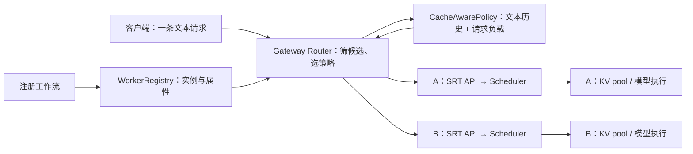
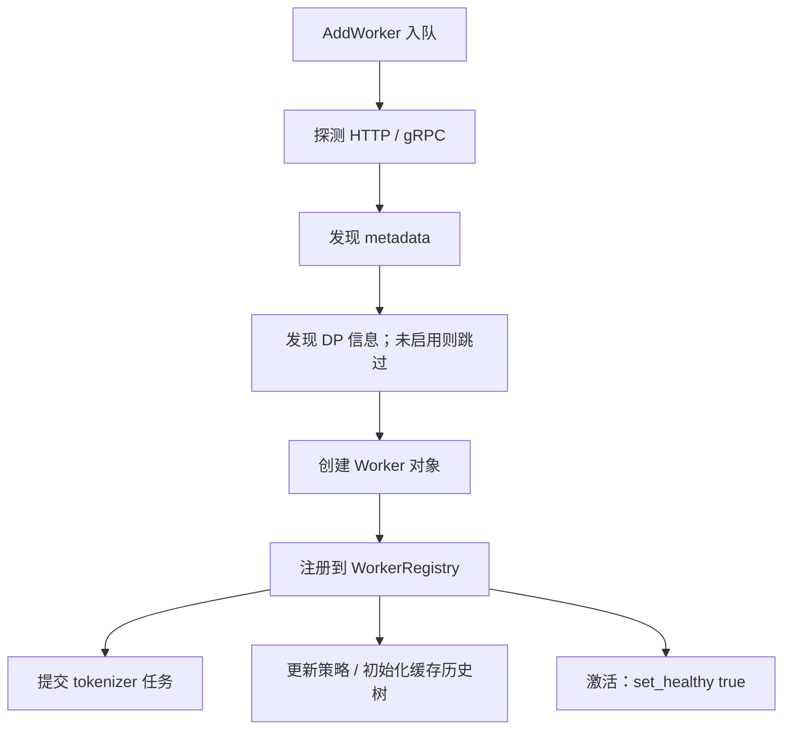
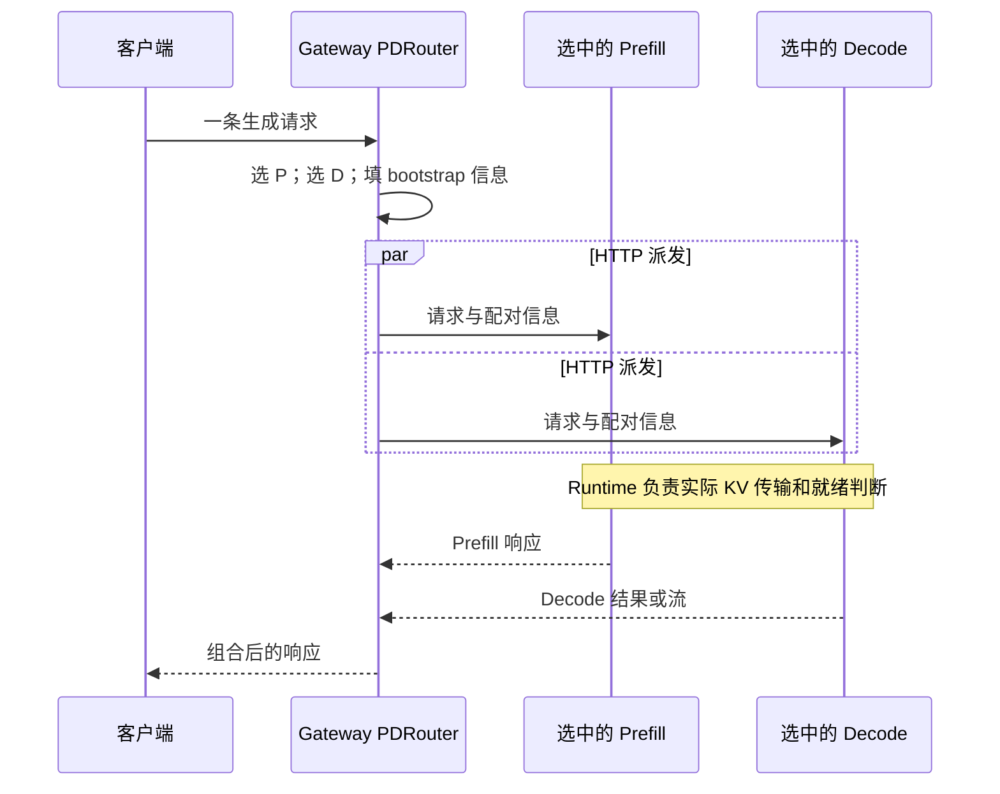

# Model Gateway 注册、路由与缓存亲和

本文是 **10-01，源码分析型学习资料**。前面已经读过实例内部的调度、KV、模型执行和 P/D 协作，本篇把视角移到实例外面：有两个运行同一模型的服务时，一条请求交给谁？网关怎样知道这些服务存在，又凭什么认为其中一个值得继续接收相似请求？

人话版：Gateway 像接待台，负责找到可以接单的服务并转交请求；每个服务里的 Scheduler 决定怎样排队、组批和执行。接待台记得“相似材料曾交给 A”，不等于它能保证 A 的显存里还保存着这些材料对应的 KV。

## 0. 阅读基线与范围

| 项目 | 内容 |
| --- | --- |
| 源码仓库与路径基准 | 官方 sgl-project/sglang；源码位置均相对于 SGLang 仓库根目录 . |
| 分支 | codex/sglang-source-study-20260909，基于已拉取的官方 main |
| 固定 commit | 72d5c5bb73cadd7ffbf5114e5f81e29d36b6c61a |
| 读取日期 | 2026-09-10；沿用 2026-09-09 固定基线 |
| 工作区 | 学习 worktree sglang-source-study 干净；原 muxi-main 与 26 个未跟踪文件保留 |
| 文档位置 | Wiki sglang/source-study/10-serving-operations/ |
| 完整主线 | Rust Model Gateway 的普通 HTTP 路由；一个模型 M、两个 Regular worker A/B；显式 cache_aware；请求为普通文本 |
| 阅读条件 | 不启用 IGW、DP-aware 或 mesh；没有单独 policy label；先看非流式，再看流式响应的计数回收 |
| 对照 | HTTP P/D 双实例选择、DP 虚拟 worker、Kubernetes 发现、power_of_two 与其他策略入口 |
| 操作与证据 | 只读源码及列明 Rust 测试定义，检查独立教学账本、锚点和文档；未编译 Rust、安装依赖、启动 Gateway/SRT、发送管理或推理请求、运行项目测试 |
| 不展开 | 完整 gRPC 分词管线、IGW 多后端分发、mesh 同步协议、网关限流与全部故障恢复；不做 Kubernetes 部署操作 |

前置：[02 请求生命周期](../02-request-lifecycle/06-完成取消与资源释放.md)、[03 调度主循环](../03-scheduling/01-NormalEventLoop与调度主循环.md)、[04 缓存生命周期](../04-kv-cache/07-KV缓存全生命周期与排障.md)、[07 P/D 端到端地图](../07-disaggregation/01-PD分离职责与端到端请求地图.md)。

本篇的实现事实以固定源码为准。另于上述日期读取了[官方 Model Gateway 指南](https://docs.sglang.io/docs/advanced_features/sgl_model_gateway)，用于核对组件定位和模式入口；网页可能继续更新，不用其性能宣传或概括性描述替代下面的分支条件。教学图、类比和数字例子属于**整理者归纳**，没有运行观察。

## 1. 先把三个“调度”分开

### 1.1 选服务、选 batch、选物理位置

| 层次 | 决定什么 | 直接管理什么 | 不能替代什么 |
| --- | --- | --- | --- |
| Gateway Router/Policy | 请求发往哪个 worker，P/D 时各选谁 | 候选服务、转发连接、策略历史、请求计数 | 实例内的 token 准入与 KV 就绪判断 |
| Runtime Scheduler | 哪些请求进入本轮 Prefill/Decode | 请求队列、batch、预算与执行状态 | 全局网关实例选择 |
| Runtime cache/pool | 请求对应哪些已缓存 token/物理槽位 | KV 索引、内存池、引用和释放条件 | 网关的服务注册与路由策略 |

普通 Router 把策略结果变成一个 Worker 引用，再通过 HTTP 转发。[S17] [S21] [S22] 实例内部的排队、KV 与计算链路见上述前置篇，不能因为两层都有“cache”和“load”就把对象合并。



**图意解读：** Gateway 内的方框是组件；A/B 代表两套运行时服务。一次普通请求只选择 A 或 B；箭头不表示网关读取了 KA/KB 中的 KV tensor。图省略协议处理细节。

### 1.2 术语与对象所有权

| 对象 | 人话解释 | 所有者与生命周期 |
| --- | --- | --- |
| WorkerConfigRequest | 希望接入哪个地址，以及角色、模型等配置 | 管理入口构造，进入异步 Job |
| Worker / Arc | 某个服务的网关侧对象；Arc 是共享引用 | Registry、策略调用、转发请求可以持有引用 |
| WorkerRegistry | 可检索的实例名单 | 维护 URL/ID、模型、角色、连接模式等索引 |
| PolicyRegistry | 模型/角色对应的选择策略 | 可能让多个映射共享一个策略实例，不保证每个模型独占对象 |
| SelectWorkerInfo | 选择时给策略的请求线索 | HTTP 主线传文本、headers，tokens=None |
| tenant | 前缀树中关联的 worker URL | 此处不是业务租户账号，也不是 GPU KV 地址 |
| tree key | pool 与模型组成的历史分区键 | 如 regular::M、prefill::M、decode::M |
| WorkerLoadGuard | 一个与生命周期绑定的计数凭据 | 创建时加一，Drop 时减一 |
| AttachedBody | 把凭据挂在响应体上的包装 | 让流式计数活到响应体被消费或丢弃 |

对象使用见 [S2] [S12] [S17] [S23] [S24] [S25]；默认策略共享见 [S65]；树分区见 [S28] [S29]。

小白读 Rust 时先认识三件事：Arc::clone 增加共享引用，不复制远端进程；Option 表示可能没有值；Drop 是对象结束生命周期时的清理入口。后面的 +1/-1 账本比背 Rust 语法更重要。

## 2. Worker 是怎样进入名单的

### 2.1 三种入口汇入异步任务

| 入口 | 本地行为 | 需要继续观察 |
| --- | --- | --- |
| 启动配置中的 worker URLs | startup 提交 InitializeWorkersFromConfig，再拆成 AddWorker | 启动任务提交与单个 worker 注册完成不同 |
| POST /workers | WorkerService::create_worker 预留 ID，提交 AddWorker，返回 202 和 Location | 按返回的 worker ID 查询状态 |
| Kubernetes 发现 | 匹配配置的 Pod 经过健康条件检查，提交 AddWorker | Pod 被发现、任务入队与 worker 可选择不同 |

启动与任务分派见 [S1] [S5]；管理 API 的服务层与响应构造见 [S2] [S3]；发现入口见 [S45] [S46] [S47]。本篇没有执行这些写入接口。

主线假设调用者已把 A/B 的正确地址交给 Gateway。WorkerService::create_worker 会把 config.dp_aware 设成 router_config.dp_aware，并为 URL 预留 ID，再等待任务入队；它没有在返回之前等待整套注册工作流完成。[S2]

JobQueue::submit 记录 pending；处理任务时进入 processing；AddWorker 根据 runtime 是否为 external 选择不同工作流。本篇读的是 local worker 工作流，即待接入的推理服务，不表示它必须与 Gateway 在同一台机器。[S4] [S5]

### 2.2 注册工作流按什么依赖执行



**图意解读：** 这是 create_local_worker_workflow 的依赖图，不是单进程启动时序图。更新策略、激活、提交 tokenizer 任务都只声明依赖 register_workers；**不能画成“策略一定全部初始化后才激活”**。图中 metadata → DP 的顺序来自实际 depends_on，文件里的“parallel”旧注释不能取代该依赖。[S6]

逐步看每一关在做什么：

1. **探测协议。** 同时尝试 HTTP /health 和 gRPC 健康检查；两边都成功时优先 HTTP；两边都失败则该步骤失败。[S7]
2. **发现 metadata。** HTTP 读取 /server_info、/model_info，相应入口在 404 时走旧接口兼容回退。这里拿到的配置描述不等于一次完整推理结果。[S8] [S9]
3. **确定身份与角色。** 配置 labels 覆盖发现的同名 labels；model_id 优先级为显式 config.model_id → served_model_name → model_path → UNKNOWN_MODEL_ID。[S10]
4. **创建对象。** 本篇启用健康检查，create_single_worker 先把对象标为不健康；禁用健康检查的分支会直接设成健康，因此不能把“创建后不健康”推广到全部配置。[S11]
5. **登记索引。** WorkerRegistry::register 保存对象和 URL 映射，更新模型、角色、连接模式等索引。[S12]
6. **初始化策略与激活。** UpdatePoliciesStep 维护模型策略并初始化适用的 cache-aware 树，还分别处理 P/D 策略；ActivateWorkersStep 把实际对象标为健康。[S13] [S14]

metadata、tokenizer 提交和策略更新的步骤配置允许 ContinueNextStep，协议探测、DP、创建、注册、激活则使用 FailWorkflow。**“工作流结束”不能被解释成每个可选步骤都成功。**[S6]

### 2.3 服务状态不要压成一个绿灯

| 观察到的状态 | 能说明什么 | 仍不能说明什么 |
| --- | --- | --- |
| API 返回 202 accepted | AddWorker 已被接受入队 | 地址已连通、模型已匹配 |
| pending / processing | 对应任务等待或执行中 | Registry 已有完整 Worker |
| Registry 找到对象 | 登记步骤已执行 | 策略就绪、熔断器允许本次执行 |
| healthy=true | 网关对象的健康标志为真 | 本次 is_available 一定为真 |
| is_available=true | 健康标志为真，且 circuit breaker 的 can_execute 允许 | 后续网络请求一定成功 |
| job_status 不存在 | 当前查询没得到任务状态条目 | 一定从未注册，或一定发生故障 |
| failed | 异步任务记录了失败 | 自动完成所有部分登记的回滚、在途请求排空 |

WorkerService::get_worker 先查已登记对象，再尝试预留 ID 对应 URL 的 pending 信息。[S15] 成功任务的 record_job_completion **删除状态条目**，失败才写 failed；因此不要一直等一个永久存在的 succeeded 字符串。[S64]

is_available 的核心是：

```rust
self.is_healthy() && self.circuit_breaker().can_execute()
```

这行来自 Worker trait。[S16] 本篇只用它说明候选资格；熔断窗口与健康探测的详细状态转换留给服务健康章节。

## 3. R1 怎样从名单中选到 A

### 3.1 候选过滤与策略选择不是同一关

Router::select_worker_for_model 的顺序如下：[S17] [S18] [S19]

| 步骤 | 普通 HTTP 主线实际条件 | 教学例 |
| --- | --- | --- |
| 模型过滤开关 | enable_igw=False 时 effective_model_id=None | 本例主动限定池中只有模型 M |
| 角色/协议过滤 | Regular + Http；runtime_type 不限定 | P、D 或 gRPC 对象不进入普通 HTTP 候选 |
| 可用性过滤 | is_available | 不健康或熔断不允许的对象先排除 |
| 策略取得 | 有 model_id 则 get_policy_or_default，否则 default | 本例没有 policy hint，共用 cache_aware |
| 策略选择 | 输入 available 列表和 SelectWorkerInfo | 返回索引，再得到对应 Arc<dyn Worker> |

**未启用 IGW 的这个函数没有按请求 model_id 过滤候选池。** 不能把我们的“单模型例子”读成多模型混放仍由该分支自动隔离。反过来，策略查找仍使用传入的 model_id，这与候选的 effective_model_id 是两次不同判断。[S17]

注册新模型且没有 policy hint 时，PolicyRegistry 复用默认策略 Arc；这也解释了为什么策略内部需要按 pool/model 划分树。[S65] 不能只根据“每模型策略映射”推断每个映射拥有独立内存。

### 3.2 路由文本从哪里来

route_typed_request 调用请求的 extract_text_for_routing，再把文本传给选择过程。HTTP 选择时明确传 tokens=None。[S20] [S17]

P/D 的 build_chat_request_text 同样调用该方法；结果为空则返回 None。相关回归测试构造多轮对话，要求路由文本同时含早期 apples 与后期 oranges 内容。[S53] [S59]

**外部依赖边界：** 本仓 src/lib.rs 将 openai_protocol 重导出为 protocols，Cargo.toml 声明 openai-protocol =1.0.0。[S67] [S68] 本篇核对了本地调用点与测试定义，没有下载该依赖源码，因而不声称已经证明它对所有角色、工具和多模态内容的完整序列化行为，更不能把提取的文本直接当成 Runtime 最终 chat template 的 token 序列。

### 3.3 选中以后才进入转发

route_typed_request 包裹重试执行器；每次 attempt 都重新调用 route_typed_request_once。后者选择 worker，无可用 worker 时返回 no_available_workers；有 worker 后，根据策略名决定是否创建负载 guard，接着转发。[S20] [S21]

本例显式 cache_aware，满足 guard 条件。send_typed_request 向 worker URL 加目标路由发送 JSON，应用 worker API key 和允许转发的 headers；非流式读取完整响应体后返回。[S22]

这条主线可以写成：

```text
route_typed_request
  → 每次 attempt: route_typed_request_once
    → select_worker_for_model
      → Registry 过滤 → available → policy.select_worker
    → WorkerLoadGuard +1
    → send_typed_request → A 的 HTTP 服务
    → 读取响应体 → guard Drop -1
```

网关再次尝试可能重新选实例。这个事实不等于失败尝试在 Runtime 中从未执行，也不构成恰好一次执行保证；跨层取消与退役继续参照 [07-05](../07-disaggregation/05-PD异常取消与资源退役.md)。

## 4. cache_aware 实际怎样做决定

### 4.1 树里记的是路由历史

先留意一个名称陷阱：策略共用的 get_healthy_worker_indices 不只检查 is_healthy，还会调用熔断器 can_execute。Router 过滤 available 后，策略内部仍可能再次检查；下文的“健康候选”沿用这个 helper 的过滤结果，不是绕过熔断器的健康名单。[S71]

tree_key_for_worker 使用角色 pool 与规范化模型名；init_workers 为各分区建立 Tree，并把空文本与 worker URL 插入，建立 tenant 身份。[S28] [S29]

| 网关文本树 | Runtime KV cache |
| --- | --- |
| text 字符前缀与 worker URL 关联 | token/状态与实际缓存条目、物理池位置关联 |
| 在路由选择过程中插入历史 | 根据计算、命中、引用和回收流程维护 |
| 有自己的字符计数与历史淘汰 | 有真实显存容量、缓存隔离与驱逐条件 |
| 为下一次实例选择提供线索 | 决定本实例实际能复用什么 |

选中正常缓存路径或失衡路径的 worker 时，策略立即插入此次 text→URL，时点在 HTTP 发送之前。[S30] [S31] on_request_complete 的本地实现只是对失败输出 debug 日志，没有在这里撤销刚插入的历史或确认 KV 已生成。[S69]

因此，A 重启、Runtime 驱逐缓存、请求失败，或路由文本与实际 token 前缀不一致，都可能使历史提示与真实 KV 状态分离。这是由对象与更新时间推导出的边界，不是本次观察到的线上故障。

### 4.2 先检查负载是否同时越过两道门槛

CacheAwarePolicy::select_worker 先求输入候选的 min_load/max_load，再判断：[S30]

```text
(max_load - min_load > balance_abs_threshold)
AND
(max_load > min_load × balance_rel_threshold)
```

差值使用 saturating_sub，比较均为严格大于。两项同时成立才进入 select_worker_min_load；该分支重新快照健康候选的 load，找最小值，在并列者中随机选，并更新历史。[S31]

CacheAwareConfig::default 的声明值如下，配置工厂可以用显式配置替换它们。这是该结构的默认值，不是对每个启动方式最终值的保证。[S35] [S36]

| 字段 | 结构默认值 | 含义 |
| --- | ---: | --- |
| cache_threshold | 0.5 | 字符前缀比例的严格门槛 |
| balance_abs_threshold | 32 | 请求负载差的门槛 |
| balance_rel_threshold | 1.1 | 相对负载门槛 |
| eviction_interval_secs | 30 | 历史树后台淘汰间隔 |
| max_tree_size | 10000 | 每个 tenant 的历史字符量淘汰目标 |

教学账本使用这些阈值：

| max / min | 绝对差 > 32 | max > 1.1 × min | 进入失衡分支 |
| --- | --- | --- | --- |
| 100 / 68 | 否，差恰为 32 | 是 | 否 |
| 100 / 67 | 是，差为 33 | 是 | 是 |
| 370 / 337 | 是，差为 33 | 否，370 < 370.7 | 否 |
| 40 / 0 | 是 | 是 | 是 |

这些算式只解释条件，不表示这些请求数适合某种生产配置。load 来自 Worker 的网关侧原子计数，本例不是 GPU 利用率、剩余显存，也不是逐 token 的工作量。[S70]

### 4.3 未失衡时再看文本前缀

Tree::prefix_match_with_counts 逐字符匹配，返回 matched_char_count、input_char_count 和一个 tenant；输入长度用 Rust chars().count()。[S32]

```text
match_rate = matched_char_count / input_char_count
输入为空时 match_rate = 0
```

| 条件 | 当前选择行为 |
| --- | --- |
| match_rate > cache_threshold | 找到匹配 tenant 对应的候选且健康时选它 |
| match_rate ≤ cache_threshold | 在健康候选的最小 load 中随机打破并列 |
| 高匹配但 tenant 已不在候选中或不健康 | 删除这个过期 tenant，回退到第一个健康候选 |
| 根本找不到该 pool/model 的树 | 输出警告并随机选健康候选 |
| 无健康候选 | 返回 None |

行为直接见 [S30]。最后两种回退不应描述成“重算所有前缀后找到全局最优”。高匹配失效后的 first-healthy 回退也没有在该分支重新插入历史、增加 processed 计数；不要拿 processed 当作所有请求的精确成功统计。

文件开头的算法说明仍写着低匹配时选“最小树”的 tenant；**当前函数体实际选最小 load**。维护文档时应复核函数体，不能只摘注释。[S30]

字符也不等于字节或 token。例如“你好世界AB”有 6 个 Unicode 字符；匹配“你好世界”是 4/6，约 0.667。UTF-8 前缀字节占比是 12/14，它既不是本算法的比例，也不能代替分词后的 KV 命中比例。[S32]

### 4.4 用 R1、R2、R3 走一次

以下输入刻意用字符书写；与前面章节的 token 教学负载分开，避免把两种计数混用。假设候选为 A/B，同属 regular::M，已有树，初始计数为 0/0。

| 事件 | 输入与假设 | 策略结果 | 历史与计数变化 |
| --- | --- | --- | --- |
| R1 | ABCDEFGH；冷历史 | 最小负载并列随机；假设选 A | 先记 text→A；转发 guard 使 A=1 |
| R1 返回 | 非流式响应体读完 | 完成这次网关转发 | guard Drop，A 回到 0；历史还在 |
| R2 | ABCDEFGHIJ；共享前 8/10 字符 | 0.8 > 0.5，负载未失衡，继续选 A | 插入更长历史；A 在请求期间加一 |
| R3 | ZZZZ；假设此刻 A=2、B=0 | 低匹配选最小负载 B | 插入 text→B，B 在请求期间加一 |
| R2 的相似后续 | 假设 A=40、B=0 | 两道失衡条件都成立，选 B | 历史随新选择更新，即使 A 有高匹配 |

前两行解释“相似请求为何可能回到同一台服务”；最后一行解释“亲和不是永久绑定”。阈值恰好 0.5 时走低匹配分支；空输入比例也按 0 处理。[S30] [S31]

### 4.5 历史树也要回收

CacheAwarePolicy::with_config 在间隔大于零时启动周期任务，对各树调用 evict_tenant_by_size；间隔为零则不启动这个任务。[S34]

Tree 的淘汰从 tenant 的叶节点与访问时间组织候选，检查 tenant_char_count 是否超过 max_size，再移除对应历史关联、调整字符计数。[S33] 这说明 max_tree_size 的实际约束按 tenant 字符量检查，不能称为“GPU KV 槽位数”或简单的全树节点数。

**淘汰 Gateway 历史不负责释放 Runtime KV。** 它改变未来路由线索；Runtime 释放条件仍在自己的缓存生命周期中。

## 5. 响应返回以后，load 何时减一

### 5.1 普通 HTTP 的生命周期账本

WorkerLoadGuard::new 增加 worker load，并在 headers 有 routing key 时维护对应 key 的计数；Drop 做相应减法。[S23] [S24]

| 时点 | 非流式 cache_aware | 流式 cache_aware |
| --- | --- | --- |
| 选完 worker、准备发送 | 创建 guard，+1 | 创建 guard，+1 |
| 收到上游响应头 | 仍读取响应体 | 构造流式响应；不能据此当作已经完成 |
| 路由函数返回 | 上游响应体已读完，函数范围结束时 -1 | guard 随 AttachedBody 继续存在 |
| 响应体结束或被丢弃 | 已完成上述释放 | AttachedBody 被丢弃时 guard Drop，-1 |
| 发送前/发送中错误返回 | guard 随作用域结束释放 | 未形成响应体时同样释放 |

转发及包装见 [S22] [S25]。普通 route_typed_request_once **只对 cache_aware 与 manual 创建这个 guard**。[S21] 因此不能把此计数链套到所有策略，尤其不能默认其他策略的回退请求计数也获得同样的更新。

### 5.2 200 响应头不等于流正常完成

BreakerTrackedStream 在 poll_next 过程中记录终态，Drop 时才更新一次熔断器结果。[S26] [S27]

| 流的结局 | wrapper 终态 | Drop 对熔断器的作用 |
| --- | --- | --- |
| 正常读到结尾 | Completed | 记录成功 |
| 字节流报错 | Errored | 记录失败 |
| 未知结局时响应被丢弃 | Active | 两者都不记录 |
| 调用方预先标为错误 | Errored | 后续干净读完也不改成成功 |

普通 HTTP 的非成功状态会先 mark_errored；真正建立流之前的发送错误也有单独的失败记录分支。[S22] 此处只解释计数与流终态的所有权，具体重试/熔断策略在后续章节展开。

丢弃网关响应体会释放本地持有的流与连接资源；**本地 load 减一不能证明远端 Scheduler 已完成取消、更不能证明 P/D 的 KV 传输与槽位退役已经结束**。这是必须跨层观察的另一条生命周期。

## 6. 改成 P/D 后，选一个实例变成选一对

### 6.1 Prefill 和 Decode 各自有候选池

PDRouter::select_pd_pair 分别取 Prefill 与 Decode workers，再各用一个策略选择。pick_worker_by_policy_arc 检查非空与 is_available，把 request_text、headers 等传给策略。[S37] [S38]

本篇对照设定为 **prefill_policy=cache_aware、decode_policy=power_of_two**。这是一组用来解释职责的显式选择，不是强制配置。若没有单独配置角色策略，RoutingMode 的 getter 会回退主策略；不能声称 Decode 固定使用 power_of_two。[S66]



**图意解读：** 双发是网关发送两个 HTTP 请求，不是 Gateway 搬运 KV。运行时怎样 bootstrap、接收和判断 KV-ready 已在[阶段 07](../07-disaggregation/01-PD分离职责与端到端请求地图.md)展开。图没有承诺任意网络条件下两端完成的固定先后。

inject_bootstrap_into_value 填入选中 Prefill 的 host/port，并生成 room ID；批量输入时构造数组。execute_dual_dispatch 的每次 attempt 重新选一对，再注入配对信息；内部创建并轮询 P/D 两个发送 future。[S39] [S40] [S41] 选到 P/D 只完成路由条件，后端协议、模型和拓扑是否兼容仍需单独验证。

### 6.2 两端不能共用一个不分角色的历史空间

同一提示交给 P 与 D，会分别写入 prefill::M 和 decode::M。即使两个映射共享同一个 CacheAwarePolicy 对象，也需要 pool 维度把 tenant 历史隔开。[S28] [S29]

UpdatePoliciesStep 除了模型策略，还专门初始化 P/D 的 cache-aware 策略实例。[S13] 只初始化 model_policies 不能替代这一过程。相关测试定义让两套 P/D 策略分别处理逐步增长的提示，检查各自池内的亲和连续性。[S57]

### 6.3 P/D 流式计数的覆盖区间不同

非流式 execute_dual_dispatch_internal 在双发之前创建 P、D 两个 guard；流式分支则在 create_streaming_response 中为两端各创建一个 guard，并把它们一起挂到最终响应体上。[S41] [S42]

由此应读出两个限制：

- 流式情况下，开始双发到构造流式响应之间的等待没有被这里这两个 guard 覆盖。
- 流式响应体仍存在时，P 侧 guard 也存在；即使 Prefill 计算已经结束，它也不代表“此刻 P 仍在计算一条 Prefill”。

这是计数的源码区间，不是服务性能测量。不能拿 P.load 直接当作 Prefill GPU 正在执行的请求数，也不能假定普通 HTTP 与 P/D 的计数时点相同。

## 7. 其他策略、DP 和发现机制放在哪一层

### 7.1 策略先按信息需求比较

| 策略 | 本次读到的选择依据 | 学习边界 |
| --- | --- | --- |
| random | 健康候选中随机选 | 不使用文本亲和 [S54] |
| round_robin | 原子计数对健康候选数取模 | 请求轮转不等于 token 工作量均匀 [S55] |
| cache_aware | 网关请求负载 + 文本历史 | 详细条件见第 4 节 [S30] |
| power_of_two | 抽两个不同健康候选，再比较同口径负载 | 不等于扫描全部 worker 找最小者 [S50] |
| bucket、manual、consistent_hashing、prefix_hash | 工厂中有对应实现入口 | 本篇不展开算法；有入口不证明任意路由组合适用 [S36] |

power_of_two 有一个关键口径保护：两个候选都在 cached_loads 中时比较缓存数值；任意一个没有条目时，两者一起退回 worker.load()，不会把一端 token 数与另一端请求数混比。[S50] 相应测试把 A 的缓存值设为 50000、B 缺失，而本地请求计数为 0/5，要求回退后选 A。[S58]

### 7.2 “缺失条目”与“请求失败得到 -1”还不是同一种状态

WorkerManager::parse_load_response 请求 /v1/loads?include=core，读取 aggregate.total_tokens；请求、状态或解析失败返回 -1。[S51]

LoadMonitor::monitor_loop 把结果按 URL 放进 map，再更新 power_of_two 策略；这段循环没有滤掉负值。PowerOfTwoPolicy 则检查两个条目是否为 Some，没有在选择处额外验证非负。[S52] [S50]

因此，本基线的静态边界是：**缺失键会触发双边回退，但存在的 -1 仍会进入数值比较。** 假设被抽中的两个候选都可用，缓存值为 -1 与 4000，当前比较会把 -1 当成较小值。本篇没有修改实现，也没有据此认定某次实际线上路由已发生错误。

同时，这个 monitor 只在发现 power_of_two policies 时抓取并更新它们；不能笼统写成“cache_aware 每次使用这里获取的实时 token 负载”。[S52] 当前普通 HTTP 主线使用自己的 guard 计数。[S21] [S70]

### 7.3 DP-aware 把一个地址展开成多个逻辑选择对象

get_dp_info 从 server_info 读取 dp_size；create_dp_aware_workers 为每个 rank 创建一个 DPAwareWorker。[S44] [S43]

例如同一个基础服务地址拥有两个 DP rank，就会有 rank 0/1 两个逻辑对象。普通 HTTP send_typed_request 在 dp_aware 时从 worker URL 提取 rank，把 data_parallel_rank 注入 JSON，再发到基础 URL。[S22]

这里选的是可寻址的 DP rank，不是随意把 TP rank 当作独立服务。P/D 还需要 bootstrap 与 Decode/P 的 rank 配对规则；本篇不把这一展开动作当作所有 DP+PD 拓扑已经验收。

### 7.4 Kubernetes 发现是名单来源

PodInfo::should_include 依据普通 selector 或 P/D selectors 筛选；PodInfo::is_healthy 要求 Ready=True 且 phase=Running。发现处理器维护 tracked_pods，再提交 AddWorker。[S45] [S46] [S47]

这里“registration success”的发现指标在**入队成功**时记录。它不等于后续工作流成功，更不是一次推理成功。只看一个发现计数不足以断言实例已经可服务。[S47]

删除已跟踪 Pod 会提交 RemoveWorker。删除工作流顺序是：查待移除对象 → 从策略注册信息移除 → 从 WorkerRegistry 移除 → 更新剩余策略。[S48] [S49]

这种名单移除控制后续候选与亲和历史；它本身不构成已有 HTTP 请求、GPU 计算与 KV 传输全部排空的证明。持有 Worker 共享引用的在途请求仍有自己的生命周期。

## 8. 给小白的一张排障地图

| 现象 | 先核对什么 | 源码入口 | 避免误判 |
| --- | --- | --- | --- |
| POST /workers 成功，但无法路由 | 202、pending/processing、实际 Registry 对象与模型/角色 | [S2] [S15] [S17] | 入队不是可用 |
| worker healthy=true 仍被排除 | can_execute、所选路由角色与协议 | [S16] [S17] | 健康标志不是全部资格 |
| 工作流结束但亲和像随机 | 策略初始化分支、tree key、是否出现 no tree 警告 | [S6] [S13] [S30] | activation 不等待策略更新 |
| 相似提示没有回到 A | 是否先命中失衡分支、提取文本与阈值 | [S30] [S31] [S53] | 亲和不是固定绑定 |
| 回到 A 但真实 KV 没命中 | 实例重启/驱逐、token 模板、Runtime 缓存隔离 | [S30] 与阶段 04 | 文本树不保证真实 KV |
| 低匹配选择与说明不符 | 看 select_worker 的最小 load 分支 | [S30] | 不把文件头旧注释当实现 |
| P/D 亲和混乱 | 是否分 pool/model、是否初始化对应角色策略 | [S28] [S13] | 只初始化模型策略不够 |
| P.load 高但 Prefill 已结束 | 流式 body 上 P guard 的范围 | [S42] | 网关持有时间不等于 GPU 工作时间 |
| worker token 负载出现 -1 | 接口失败与 map 是否保留负值 | [S51] [S52] [S50] | 缺键和负哨兵值不同 |
| 200 后流断开却统计成功 | 终态、预标记与 Drop 记录 | [S22] [S26] [S27] | 响应头不是完整结果 |
| Pod 已删除但旧请求仍存在 | RemoveWorker、已有连接与 Runtime 取消链 | [S48] [S49]、07-05 | 删除名单不等于排空 |
| 带 model 的请求仍进入其他模型池 | effective_model_id 与 enable_igw | [S17] [S37] | 本例单模型条件不可省略 |

先确认“哪一层的现象”，再选择日志和源码。比如网关返回 no_available_workers，应先看候选资格；已经到达 A 但缓存命中不足，应继续看 A 的 Runtime cache，而不是反复调整发现 selector。

## 9. 怎么把一次请求记录得可复查

下面是后续实验需要的字段清单，**不是声称当前已有一条运行 trace**。部分字段需要临时观测点或日志关联，不能假定默认日志已经完整输出。

| 层次 | 建议保留的字段 | 回答的问题 |
| --- | --- | --- |
| 基线 | Gateway/SRT commit、依赖版本、模式与生效配置 | 是否比较同一实现？ |
| 注册 | worker ID、URL、model_id、角色、连接模式、DP rank、job 状态 | 请求看到的是哪个实例对象？ |
| 候选 | 过滤前后 URL、healthy、熔断状态、effective_model_id | 谁被排除了，为什么？ |
| 策略 | 实际 policy、pool/model tree key、匹配字符数/输入字符数、阈值 | 走亲和、失衡还是回退？ |
| 负载 | 本地 load 快照、缓存 token 值及时间、是否缺键/负值 | 比较口径是否一致？ |
| 请求关联 | request ID/trace、attempt、目标 URL、P/D room、DP rank | 一次外部请求对应了哪些内部尝试？ |
| 响应生命周期 | 发送、响应头、body 结束/错误/丢弃、guard 创建/释放 | 计数为什么没有回到预期？ |
| Runtime 证据 | 实际到达、KV 命中 token、调度状态、完成或取消/退役记录 | 亲和是否转化为真正复用？ |

请求数、请求在途时间、token 负载和真实缓存命中应分开记录。若将来比较策略性能，还需固定模型权重、硬件、输入/输出长度、到达分布、共享前缀分布、冷热缓存条件与失败比例；本篇没有任何吞吐或延迟测量。

## 10. 源码阅读路线与练习

### 10.1 按问题回到代码

以下路径都从 **SGLang 仓库根目录**起算；Rust 符号用 :: 表示所属类型或模块。锚点指向固定 commit 的声明或对应 impl，不代表本次做过 Rust 编译验证。

| 阅读问题 | 仓内路径与符号 |
| --- | --- |
| 管理入口何时返回 | `sgl-model-gateway/src/core/worker_service.rs::WorkerService::create_worker` [S2] |
| 工作流实际依赖 | `sgl-model-gateway/src/core/steps/worker/local/mod.rs::create_local_worker_workflow` [S6] |
| 可选对象与过滤 | `sgl-model-gateway/src/core/worker_registry.rs::WorkerRegistry::get_workers_filtered` [S18] |
| 普通路由选谁 | `sgl-model-gateway/src/routers/http/router.rs::Router::select_worker_for_model` [S17] |
| 亲和和失衡谁先执行 | `sgl-model-gateway/src/policies/cache_aware.rs::CacheAwarePolicy::select_worker` [S30] |
| 字符前缀怎么算 | `sgl-model-gateway/src/policies/tree.rs::Tree::prefix_match_with_counts` [S32] |
| 请求计数何时回收 | `sgl-model-gateway/src/core/worker.rs::WorkerLoadGuard` [S23] [S24] |
| 流终态怎样影响熔断 | `sgl-model-gateway/src/routers/streaming_utils.rs::BreakerTrackedStream` [S26] [S27] |
| P/D 分别选谁 | `sgl-model-gateway/src/routers/http/pd_router.rs::PDRouter::select_pd_pair` [S37] |
| 负载来源与缺失处理 | `sgl-model-gateway/src/core/worker_manager.rs::LoadMonitor::monitor_loop` [S52]；`sgl-model-gateway/src/policies/power_of_two.rs::PowerOfTwoPolicy::select_worker` [S50] |
| 发现如何改变名单 | `sgl-model-gateway/src/service_discovery.rs::handle_pod_event` [S47] |

第一次阅读按“注册 → 普通请求 → cache_aware → body 生命周期”走通，再加入 P/D。不要同时从 mesh、外部后端、gRPC tokenizer 和全部策略开始。

### 10.2 已读测试定义能说明什么

| 测试定义 | 本次看到的断言意图 | 未覆盖的结论 |
| --- | --- | --- |
| test_cache_aware_with_imbalanced_load | 制造负载差后选择较空的 worker [S56] | 没有真实 KV 或 GPU 负载 |
| test_pd_pool_isolation_two_policies | 增长对话在各自 P/D 池保持亲和 [S57] | 没有实际 P/D 传输验收 |
| test_reproduce_incompatible_metric_bug | 一端缓存缺失时，两端回退请求计数 [S58] | 不证明负哨兵值被滤除 |
| test_chat_request_text_uses_full_conversation | 路由文本含早期与后期轮次 [S59] | 不等于完整 tokenizer/template 等价 |
| test_worker_load_metrics | 两个 guard 创建后为 1，Drop 后为 0 [S60] | 不等于 P/D 流式全过程负载准确 |
| drop_while_active_records_nothing | 未知结局丢弃不记熔断成功/失败 [S61] | 不证明远端取消已完成 |
| clean_stream_records_one_success | 干净读完后记一次成功 [S62] | 不证明模型生成内容正确 |
| stream_error_records_one_failure | 流报错后记一次失败 [S63] | 不等于所有网关错误归因已覆盖 |

这些测试定义分布在四份 Rust 文件中，均**只阅读、未运行**。独立教学账本只复算门槛、字符比例和计数，不调用项目实现，不能写成项目测试通过。

### 10.3 自测与答案线索

1. API 返回 202 后，为什么还要读取 WorkerInfo？——因为只确认任务入队；登记、健康与可选择仍是后续条件。
2. A/B 负载为 100/68，采用结构默认阈值，会先走失衡分支吗？——不会，差恰为 32，严格大于不成立。
3. 字符匹配 4/8、阈值 0.5，会强制亲和吗？——不会，等于门槛走最小负载路径。
4. 高匹配 worker 已不在 available 列表，会怎样？——删除过期 tenant 后回退第一个健康候选，不重新证明所有缓存最优。
5. 为什么不能把 regular::M 与 prefill::M 合并？——它们关联不同角色的服务池，历史不能互相覆盖。
6. 流式 HTTP 已返回 Response，为什么 load 仍为 1？——guard 由响应体持有，函数返回尚未结束 body 生命周期。
7. P/D 流式 P.load 为 1，说明 P GPU 正在做 Prefill 吗？——不说明；P guard 被最终响应体一起持有。
8. power_of_two 缺少一个 cached_loads 条目，与存在一个 -1 一样吗？——不一样；前者触发双边回退，后者在本地实现中仍参与数值比较。
9. Gateway 的历史树新增条目，证明哪一步已完成？——只证明策略记录了选择，不证明远端已生成或保留 KV。
10. 原 worker 从 Registry 删除，所有在途计算就结束了吗？——不能据此推出，需要连接、请求和 Runtime 退役证据。

### 10.4 本篇验收与下一篇

本篇已完成普通 HTTP 注册、候选选择、缓存亲和和响应计数的静态主线，并分别核对 P/D、DP 与 Kubernetes 名单来源的边界；已检查 71 个固定源码锚点、三张 Mermaid 的文字/依赖关系，以及阈值、字符比例和计数账本。

未进行 Rust 编译、项目测试、Gateway/SRT 请求、Kubernetes 操作、模型推理或性能实验；Mermaid 只做静态检查，未运行渲染器。阅读过程中未修改 SGLang 源码。

下一篇是 [10-02《HTTP、gRPC 与 Rust 服务边界》](02-HTTPgRPC与Rust服务边界.md)：从协议入口继续拆开 Python HTTP、gRPC bridge、Rust server 与 Gateway 的职责和转换位置。

导航：[返回目录](../README.md) · [上一篇：Embedding、Rerank 与模型适配](../09-model-specialization/06-EmbeddingRerank与模型适配清单.md) · [源码入口索引](../appendices/02-源码入口与调用链索引.md)

[S1]: https://github.com/sgl-project/sglang/blob/72d5c5bb73cadd7ffbf5114e5f81e29d36b6c61a/sgl-model-gateway/src/server.rs#L696
[S2]: https://github.com/sgl-project/sglang/blob/72d5c5bb73cadd7ffbf5114e5f81e29d36b6c61a/sgl-model-gateway/src/core/worker_service.rs#L225
[S3]: https://github.com/sgl-project/sglang/blob/72d5c5bb73cadd7ffbf5114e5f81e29d36b6c61a/sgl-model-gateway/src/core/worker_service.rs#L95
[S4]: https://github.com/sgl-project/sglang/blob/72d5c5bb73cadd7ffbf5114e5f81e29d36b6c61a/sgl-model-gateway/src/core/job_queue.rs#L204
[S5]: https://github.com/sgl-project/sglang/blob/72d5c5bb73cadd7ffbf5114e5f81e29d36b6c61a/sgl-model-gateway/src/core/job_queue.rs#L294
[S6]: https://github.com/sgl-project/sglang/blob/72d5c5bb73cadd7ffbf5114e5f81e29d36b6c61a/sgl-model-gateway/src/core/steps/worker/local/mod.rs#L76
[S7]: https://github.com/sgl-project/sglang/blob/72d5c5bb73cadd7ffbf5114e5f81e29d36b6c61a/sgl-model-gateway/src/core/steps/worker/local/detect_connection.rs#L90
[S8]: https://github.com/sgl-project/sglang/blob/72d5c5bb73cadd7ffbf5114e5f81e29d36b6c61a/sgl-model-gateway/src/core/steps/worker/local/discover_metadata.rs#L103
[S9]: https://github.com/sgl-project/sglang/blob/72d5c5bb73cadd7ffbf5114e5f81e29d36b6c61a/sgl-model-gateway/src/core/steps/worker/local/discover_metadata.rs#L141
[S10]: https://github.com/sgl-project/sglang/blob/72d5c5bb73cadd7ffbf5114e5f81e29d36b6c61a/sgl-model-gateway/src/core/steps/worker/local/create_worker.rs#L33
[S11]: https://github.com/sgl-project/sglang/blob/72d5c5bb73cadd7ffbf5114e5f81e29d36b6c61a/sgl-model-gateway/src/core/steps/worker/local/create_worker.rs#L355
[S12]: https://github.com/sgl-project/sglang/blob/72d5c5bb73cadd7ffbf5114e5f81e29d36b6c61a/sgl-model-gateway/src/core/worker_registry.rs#L242
[S13]: https://github.com/sgl-project/sglang/blob/72d5c5bb73cadd7ffbf5114e5f81e29d36b6c61a/sgl-model-gateway/src/core/steps/worker/shared/update_policies.rs#L85
[S14]: https://github.com/sgl-project/sglang/blob/72d5c5bb73cadd7ffbf5114e5f81e29d36b6c61a/sgl-model-gateway/src/core/steps/worker/shared/activate.rs#L19
[S15]: https://github.com/sgl-project/sglang/blob/72d5c5bb73cadd7ffbf5114e5f81e29d36b6c61a/sgl-model-gateway/src/core/worker_service.rs#L284
[S16]: https://github.com/sgl-project/sglang/blob/72d5c5bb73cadd7ffbf5114e5f81e29d36b6c61a/sgl-model-gateway/src/core/worker.rs#L229
[S17]: https://github.com/sgl-project/sglang/blob/72d5c5bb73cadd7ffbf5114e5f81e29d36b6c61a/sgl-model-gateway/src/routers/http/router.rs#L134
[S18]: https://github.com/sgl-project/sglang/blob/72d5c5bb73cadd7ffbf5114e5f81e29d36b6c61a/sgl-model-gateway/src/core/worker_registry.rs#L512
[S19]: https://github.com/sgl-project/sglang/blob/72d5c5bb73cadd7ffbf5114e5f81e29d36b6c61a/sgl-model-gateway/src/policies/registry.rs#L163
[S20]: https://github.com/sgl-project/sglang/blob/72d5c5bb73cadd7ffbf5114e5f81e29d36b6c61a/sgl-model-gateway/src/routers/http/router.rs#L194
[S21]: https://github.com/sgl-project/sglang/blob/72d5c5bb73cadd7ffbf5114e5f81e29d36b6c61a/sgl-model-gateway/src/routers/http/router.rs#L273
[S22]: https://github.com/sgl-project/sglang/blob/72d5c5bb73cadd7ffbf5114e5f81e29d36b6c61a/sgl-model-gateway/src/routers/http/router.rs#L487
[S23]: https://github.com/sgl-project/sglang/blob/72d5c5bb73cadd7ffbf5114e5f81e29d36b6c61a/sgl-model-gateway/src/core/worker.rs#L1152
[S24]: https://github.com/sgl-project/sglang/blob/72d5c5bb73cadd7ffbf5114e5f81e29d36b6c61a/sgl-model-gateway/src/core/worker.rs#L1171
[S25]: https://github.com/sgl-project/sglang/blob/72d5c5bb73cadd7ffbf5114e5f81e29d36b6c61a/sgl-model-gateway/src/core/worker.rs#L1200
[S26]: https://github.com/sgl-project/sglang/blob/72d5c5bb73cadd7ffbf5114e5f81e29d36b6c61a/sgl-model-gateway/src/routers/streaming_utils.rs#L111
[S27]: https://github.com/sgl-project/sglang/blob/72d5c5bb73cadd7ffbf5114e5f81e29d36b6c61a/sgl-model-gateway/src/routers/streaming_utils.rs#L130
[S28]: https://github.com/sgl-project/sglang/blob/72d5c5bb73cadd7ffbf5114e5f81e29d36b6c61a/sgl-model-gateway/src/policies/cache_aware.rs#L96
[S29]: https://github.com/sgl-project/sglang/blob/72d5c5bb73cadd7ffbf5114e5f81e29d36b6c61a/sgl-model-gateway/src/policies/cache_aware.rs#L169
[S30]: https://github.com/sgl-project/sglang/blob/72d5c5bb73cadd7ffbf5114e5f81e29d36b6c61a/sgl-model-gateway/src/policies/cache_aware.rs#L387
[S31]: https://github.com/sgl-project/sglang/blob/72d5c5bb73cadd7ffbf5114e5f81e29d36b6c61a/sgl-model-gateway/src/policies/cache_aware.rs#L310
[S32]: https://github.com/sgl-project/sglang/blob/72d5c5bb73cadd7ffbf5114e5f81e29d36b6c61a/sgl-model-gateway/src/policies/tree.rs#L531
[S33]: https://github.com/sgl-project/sglang/blob/72d5c5bb73cadd7ffbf5114e5f81e29d36b6c61a/sgl-model-gateway/src/policies/tree.rs#L718
[S34]: https://github.com/sgl-project/sglang/blob/72d5c5bb73cadd7ffbf5114e5f81e29d36b6c61a/sgl-model-gateway/src/policies/cache_aware.rs#L124
[S35]: https://github.com/sgl-project/sglang/blob/72d5c5bb73cadd7ffbf5114e5f81e29d36b6c61a/sgl-model-gateway/src/policies/mod.rs#L106
[S36]: https://github.com/sgl-project/sglang/blob/72d5c5bb73cadd7ffbf5114e5f81e29d36b6c61a/sgl-model-gateway/src/policies/factory.rs#L17
[S37]: https://github.com/sgl-project/sglang/blob/72d5c5bb73cadd7ffbf5114e5f81e29d36b6c61a/sgl-model-gateway/src/routers/http/pd_router.rs#L972
[S38]: https://github.com/sgl-project/sglang/blob/72d5c5bb73cadd7ffbf5114e5f81e29d36b6c61a/sgl-model-gateway/src/routers/http/pd_router.rs#L1053
[S39]: https://github.com/sgl-project/sglang/blob/72d5c5bb73cadd7ffbf5114e5f81e29d36b6c61a/sgl-model-gateway/src/routers/http/pd_router.rs#L238
[S40]: https://github.com/sgl-project/sglang/blob/72d5c5bb73cadd7ffbf5114e5f81e29d36b6c61a/sgl-model-gateway/src/routers/http/pd_router.rs#L365
[S41]: https://github.com/sgl-project/sglang/blob/72d5c5bb73cadd7ffbf5114e5f81e29d36b6c61a/sgl-model-gateway/src/routers/http/pd_router.rs#L646
[S42]: https://github.com/sgl-project/sglang/blob/72d5c5bb73cadd7ffbf5114e5f81e29d36b6c61a/sgl-model-gateway/src/routers/http/pd_router.rs#L1104
[S43]: https://github.com/sgl-project/sglang/blob/72d5c5bb73cadd7ffbf5114e5f81e29d36b6c61a/sgl-model-gateway/src/core/steps/worker/local/create_worker.rs#L297
[S44]: https://github.com/sgl-project/sglang/blob/72d5c5bb73cadd7ffbf5114e5f81e29d36b6c61a/sgl-model-gateway/src/core/steps/worker/local/discover_dp.rs#L18
[S45]: https://github.com/sgl-project/sglang/blob/72d5c5bb73cadd7ffbf5114e5f81e29d36b6c61a/sgl-model-gateway/src/service_discovery.rs#L114
[S46]: https://github.com/sgl-project/sglang/blob/72d5c5bb73cadd7ffbf5114e5f81e29d36b6c61a/sgl-model-gateway/src/service_discovery.rs#L219
[S47]: https://github.com/sgl-project/sglang/blob/72d5c5bb73cadd7ffbf5114e5f81e29d36b6c61a/sgl-model-gateway/src/service_discovery.rs#L422
[S48]: https://github.com/sgl-project/sglang/blob/72d5c5bb73cadd7ffbf5114e5f81e29d36b6c61a/sgl-model-gateway/src/service_discovery.rs#L556
[S49]: https://github.com/sgl-project/sglang/blob/72d5c5bb73cadd7ffbf5114e5f81e29d36b6c61a/sgl-model-gateway/src/core/steps/worker/local/mod.rs#L206
[S50]: https://github.com/sgl-project/sglang/blob/72d5c5bb73cadd7ffbf5114e5f81e29d36b6c61a/sgl-model-gateway/src/policies/power_of_two.rs#L35
[S51]: https://github.com/sgl-project/sglang/blob/72d5c5bb73cadd7ffbf5114e5f81e29d36b6c61a/sgl-model-gateway/src/core/worker_manager.rs#L207
[S52]: https://github.com/sgl-project/sglang/blob/72d5c5bb73cadd7ffbf5114e5f81e29d36b6c61a/sgl-model-gateway/src/core/worker_manager.rs#L338
[S53]: https://github.com/sgl-project/sglang/blob/72d5c5bb73cadd7ffbf5114e5f81e29d36b6c61a/sgl-model-gateway/src/routers/http/pd_router.rs#L960
[S54]: https://github.com/sgl-project/sglang/blob/72d5c5bb73cadd7ffbf5114e5f81e29d36b6c61a/sgl-model-gateway/src/policies/random.rs#L25
[S55]: https://github.com/sgl-project/sglang/blob/72d5c5bb73cadd7ffbf5114e5f81e29d36b6c61a/sgl-model-gateway/src/policies/round_robin.rs#L31
[S56]: https://github.com/sgl-project/sglang/blob/72d5c5bb73cadd7ffbf5114e5f81e29d36b6c61a/sgl-model-gateway/src/policies/cache_aware.rs#L630
[S57]: https://github.com/sgl-project/sglang/blob/72d5c5bb73cadd7ffbf5114e5f81e29d36b6c61a/sgl-model-gateway/src/policies/cache_aware.rs#L1069
[S58]: https://github.com/sgl-project/sglang/blob/72d5c5bb73cadd7ffbf5114e5f81e29d36b6c61a/sgl-model-gateway/src/policies/power_of_two.rs#L230
[S59]: https://github.com/sgl-project/sglang/blob/72d5c5bb73cadd7ffbf5114e5f81e29d36b6c61a/sgl-model-gateway/src/routers/http/pd_router.rs#L1745
[S60]: https://github.com/sgl-project/sglang/blob/72d5c5bb73cadd7ffbf5114e5f81e29d36b6c61a/sgl-model-gateway/src/routers/http/pd_router.rs#L1933
[S61]: https://github.com/sgl-project/sglang/blob/72d5c5bb73cadd7ffbf5114e5f81e29d36b6c61a/sgl-model-gateway/src/routers/streaming_utils.rs#L175
[S62]: https://github.com/sgl-project/sglang/blob/72d5c5bb73cadd7ffbf5114e5f81e29d36b6c61a/sgl-model-gateway/src/routers/streaming_utils.rs#L184
[S63]: https://github.com/sgl-project/sglang/blob/72d5c5bb73cadd7ffbf5114e5f81e29d36b6c61a/sgl-model-gateway/src/routers/streaming_utils.rs#L197
[S64]: https://github.com/sgl-project/sglang/blob/72d5c5bb73cadd7ffbf5114e5f81e29d36b6c61a/sgl-model-gateway/src/core/job_queue.rs#L748
[S65]: https://github.com/sgl-project/sglang/blob/72d5c5bb73cadd7ffbf5114e5f81e29d36b6c61a/sgl-model-gateway/src/policies/registry.rs#L169
[S66]: https://github.com/sgl-project/sglang/blob/72d5c5bb73cadd7ffbf5114e5f81e29d36b6c61a/sgl-model-gateway/src/config/types.rs#L228
[S67]: https://github.com/sgl-project/sglang/blob/72d5c5bb73cadd7ffbf5114e5f81e29d36b6c61a/sgl-model-gateway/src/lib.rs#L8
[S68]: https://github.com/sgl-project/sglang/blob/72d5c5bb73cadd7ffbf5114e5f81e29d36b6c61a/sgl-model-gateway/Cargo.toml#L83
[S69]: https://github.com/sgl-project/sglang/blob/72d5c5bb73cadd7ffbf5114e5f81e29d36b6c61a/sgl-model-gateway/src/policies/cache_aware.rs#L528
[S70]: https://github.com/sgl-project/sglang/blob/72d5c5bb73cadd7ffbf5114e5f81e29d36b6c61a/sgl-model-gateway/src/core/worker.rs#L784
[S71]: https://github.com/sgl-project/sglang/blob/72d5c5bb73cadd7ffbf5114e5f81e29d36b6c61a/sgl-model-gateway/src/policies/mod.rs#L136
