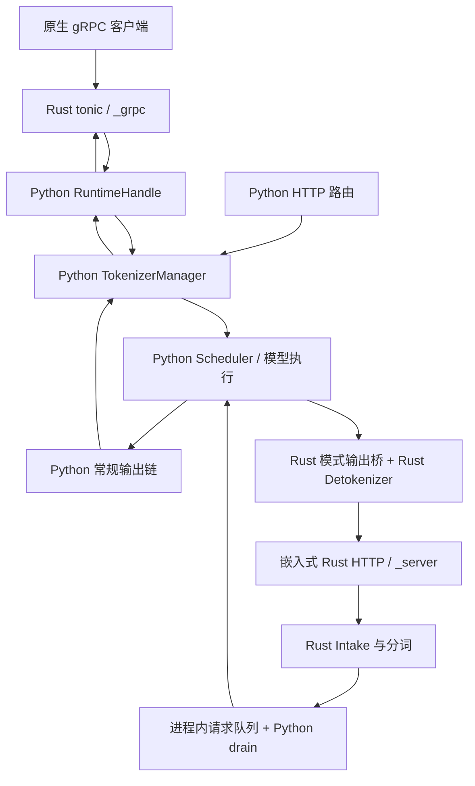
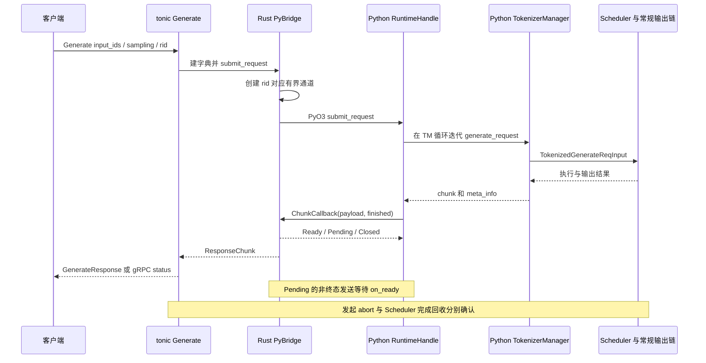
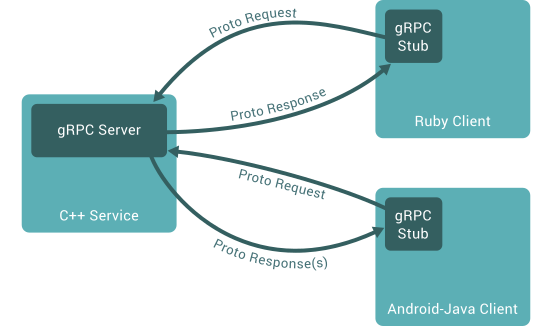
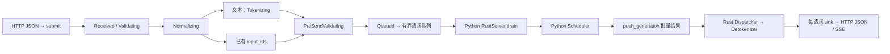

# HTTP、gRPC 与 Rust 服务边界

> **先建立架构心智模型：** [M02 · 启动装配与运行时边界](<../architecture/02-启动装配与运行时边界.md>) · [M11 · 网关服务治理与性能诊断全景](<../architecture/11-网关服务治理与性能诊断全景.md>)。先看职责、数据和生命周期，再回到本篇源码细节。

本文是**源码分析型学习资料**。面向已经能追踪一条普通推理请求、但还分不清“Python 服务”“Rust 服务”和“gRPC bridge”的读者。

先用人话建立坐标：协议入口像接单窗口，分词负责把文字变成模型认识的编号，Scheduler 决定什么时候执行，输出组件把编号重新包装成客户端能读的结果。窗口换了语言，不表示后面的排队、模型计算和资源回收一起换了实现。

## 0. 阅读基线与范围

| 项目 | 内容 |
| --- | --- |
| 源码仓库与路径基准 | 官方 sgl-project/sglang；全部源码位置相对于 SGLang 仓库根目录 . |
| 分支 | codex/sglang-source-study-20260909，基于已拉取的官方 main |
| 固定 commit | 72d5c5bb73cadd7ffbf5114e5f81e29d36b6c61a |
| 读取日期 | 2026-09-10；沿用 2026-09-09 固定基线 |
| 工作区 | 学习 worktree sglang-source-study 干净；原 muxi-main 与 26 个未跟踪文件保留 |
| 文档位置 | Wiki sglang/source-study/10-serving-operations/ |
| 完整主线 | --grpc-port 启动的原生 Rust gRPC；Generate 传入 token IDs；普通文本模型，TP/PP/DP 均为 1，单 Python TokenizerManager |
| 贯穿请求 | R1 输入编号 [10, 11]，最多生成 3 个 token；先 n=1、stream=true，再只改变 n 或 stream |
| 对照 | Python HTTP、嵌入式 Rust HTTP、旧 SMG gRPC、Gateway gRPC 前处理 |
| 操作与证据 | 只读源码和九个列明测试定义；检查文档及独立教学账本；未编译扩展、安装依赖、导入项目、启动服务、运行模型或项目测试 |
| 不展开 | TLS/网络调优、多模态 Rust 管线、全部 OpenAI 字段、外部 SMG 协议实现及跨 rank/跨 P/D 资源退役 |

前置：[02 请求与输出生命周期](../02-request-lifecycle/06-完成取消与资源释放.md)、[10-01 Gateway 注册与路由](01-ModelGateway注册路由与缓存亲和.md)。主线中的模型执行、KV 生命周期继续使用前面阶段建立的机制，不重复展开。

下文标注固定源码的行为属于**源码事实**；图、类比和数字账本属于**整理者归纳**。协议术语另参照 [gRPC 官方核心概念](https://grpc.io/docs/what-is-grpc/core-concepts/)：服务端流式 RPC 允许一次请求得到一串有序消息。该协议定义不决定每条消息是否对应一个 token，也不证明取消后 GPU 已停止。本篇没有运行观察。

## 1. 同样写着 Rust，实际有不同入口

### 1.1 先确认启动了谁

| 路径 | 启动选择与入口 | 分词/请求适配 | Scheduler |
| --- | --- | --- | --- |
| Python HTTP | 默认 launch_server，FastAPI 路由 | Python TokenizerManager；原生 /generate 和 OpenAI serving 各有适配层 | Python |
| 原生 Rust gRPC | 非旧 SMG 模式下设置 --grpc-port；Python HTTP lifespan 启动 _grpc 扩展 | Rust tonic 接收 proto，PyO3 调用 Python RuntimeHandle，再进 TokenizerManager | Python |
| 旧 SMG gRPC | --smg-grpc-mode；弃用的 --grpc-mode 转为该模式 | Python 包装入口调用外部 smg_grpc_servicer | 仓内入口不能证明外部完整实现 |
| 嵌入式 Rust HTTP | SGLANG_RUST_SERVER；Scheduler 初始化 _server 扩展 | Rust HTTP、TokenizerManager 和 Detokenizer 管线；通过进程内队列接 Python | Python |
| Gateway gRPC | Gateway 的 gRPC 路由管线 | 网关可先分词、构造客户端请求，再调用外部 gRPC client | 远端 Runtime 拥有调度权 |

启动分派见 [S1] [S2]，原生 gRPC 挂接见 [S4] [S5]；Rust HTTP 的父进程分支与 Scheduler 初始化见 [S6] [S7] [S8] [S9]。旧模式实际委托外部依赖 [S10] [S11]，Gateway 边界见 [S73] [S74] [S75] [S76]。

这里的 _grpc 和 _server 是两套扩展入口。不要仅凭日志里有 Rust，便把它们合并成同一套服务。

**图意解读：** 这是两个启动配置的叠放对照，方框主要是组件，不表示这些路径在一次运行中全部同时启用。普通原生 gRPC 复用 Python TokenizerManager 路径；嵌入式 Rust HTTP 把请求前处理与输出处理放入 Rust。两条路径最终都依赖 Python Scheduler，图没有把分词当作模型 forward。

### 1.2 初学者先记住这些对象

| 对象 | 人话解释 | 所有权与结束条件 |
| --- | --- | --- |
| proto message | 客户端和服务端约定的一种消息形状 | 只定义传输字段，不拥有 GPU 请求 |
| tonic service | Rust gRPC 请求处理器 | 持有响应流；把转换后的请求交给 bridge |
| PyO3 / RuntimeHandle | Rust 调用 Python、进入 TM 事件循环的边界 | 提交协程、接收回调、转交取消 |
| rid | 请求的标识 | 原生 bridge 用它索引通道；Rust HTTP 内部还会加唯一化后缀 |
| ResponseChunk | bridge 内部的 Data / Finished / Error | 不等于 HTTP SSE 文本，也不直接等于 proto 消息 |
| bounded channel | 有容量限制的结果队列 | 满了需要等待或失败，不是无限缓存 |
| sink | 某条 Rust HTTP 请求的结果接收口 | Detokenizer 持有；结束、失败或清理时解除 |
| abort guard | 随对象生命周期触发取消的凭据 | 尚未 disarm 的对象被 Drop 时发起取消 |
| field order | 位置式消息的字段顺序 | Rust HTTP→Python 的 MessagePack 数组依赖它 |
| finished | 原生生成 RPC 的应用层终态标志 | 多 choice 时需要整组完成；不同于单 choice 的 finish_reason |

相关声明与实现见 [S12] [S14] [S15] [S25] [S30] [S33] [S38] [S56] [S57] [S58] [S66]。这里的“结束”必须说明是哪一层，不能把结果通道关闭等同于 KV 释放。

## 2. 配置先决定路径，再讨论功能

### 2.1 原生 gRPC 的实际限制

服务参数处理会把旧 grpc_mode 折叠为 smg_grpc_mode；grpc_port 未显式提供时可从 SGLANG_GRPC_PORT 读取，旧模式还存在 port+10000 的兼容处理。非旧模式、grpc_port 不为空时才进入原生路径。[S2]

| 条件 | 固定基线的检查/行为 | 阅读含义 |
| --- | --- | --- |
| grpc_port 不在 1—65535 | 参数检查拒绝 | 端口数字合法才继续 |
| 原生 grpc_port 与 HTTP port 相同 | 参数检查拒绝 | 原生监听器是另外一个入口 |
| grpc_worker_threads 提供且小于 1 | 拒绝 | 不把 0 当“自动” |
| 原生 gRPC + use_ray / encoder_only | 拒绝 | 本篇单 TM 主线不能直接搬到这些模式 |
| 原生 gRPC + tokenizer_worker_num > 1 | 拒绝 | RuntimeHandle 复用单 TokenizerManager |
| 原生 gRPC + api_key 或 admin_api_key | 拒绝 | 此监听器不经过 Python HTTP 鉴权中间件 |
| 嵌入式 Rust HTTP | app 中 API-key middleware 仍为 TODO | 不能借用 Python HTTP 的鉴权结论 |

参数条件见 [S2] [S3]；最后一行是另一条实现的源码状态 [S53]。这是功能边界表，不是本次部署建议或安全验证结果。

### 2.2 原生与嵌入式分别在哪个位置启动

原生路径中，HTTP lifespan 创建 RuntimeHandle，把现有 TokenizerManager、模板管理器、参数和 Scheduler 信息交给 _grpc.start_server。[S4] [S5] 扩展先绑定 socket，再构建 Tokio runtime 和后台服务线程；默认响应通道容量 64，响应等待参数默认 300 秒。这些是扩展函数的默认值，不代表本篇测得的容量或耗时。[S18]

嵌入式路径中，父进程在 Scheduler 启动后进入等待 Scheduler 退出的分支；实际 Rust server 由符合 pp_rank=0、attn_tp_rank=0、attn_cp_rank=0 的 Scheduler 侧初始化。[S6] [S7] [S8] 这个条件没有把所有 DP rank 压成一个全局 rank 0。Python RustServer.launch 还按 attention DP rank 计算端口偏移；本篇 DP=1，因此不引入多个监听端口。[S9]

Rust HTTP 配置经过 _build_server_args 构成扩展需要的有类型参数，其中包含模型和长度限制等信息；不直接假设任意 Python server_args 字段都已被 Rust 实现。[S48]

## 3. 沿 R1 走通原生 Generate

### 3.1 proto 是契约，字典是适配结果

本仓原生协议位于 `proto/sglang/runtime/v1/sglang.proto`，package 为 sglang.runtime.v1。Generate 与 TextGenerate 在 service 定义中都是**服务端流式 RPC**，而 Embed 等接口另有自己的返回类型。[S12]

Rust 构建脚本通过 tonic_build 读取这份 proto，生成服务端代码；客户端是否使用同一份协议，需要另外核对客户端来源，不能只看方法也叫 Generate。[S17]

| R1 字段 | 经过边界后的形态 | 需要理解的语义 |
| --- | --- | --- |
| input_ids=[10,11] | proto repeated int32 → Rust 集合 → Python dict/list | 是输入编号，不是文本字节 |
| sampling_params.max_new_tokens=3 | 放入 sampling_params 字典 | 最大生成数量，不保证一定生成 3 个 |
| temperature 未提供 | optional 为 None 时不插入该键 | “没传”与显式 temperature=0 不同 |
| seed | 转为 sampling_seed | 客户端字段名与 Python 字段名不总相同 |
| stream 未提供 | builder 使用 false | 改变应用产出节奏，不改变 RPC 声明类型 |
| trace_headers | 转为 external_trace_header | 需要追踪字段转换，不能只找同名字段 |
| received_time | builder 填当前时间 | 是这一层记录的接收时间，不能当最初客户端发起时间 |
| rid | 未提供时 Rust 生成；提交时用作通道键 | 重复活动 rid 会在创建通道时失败 |

协议与转换见 [S13] [S14] [S19] [S27] [S29] [S30]。可选 guided_decoding 和旧 json_schema/regex 还经过转换冲突检查；本篇不展开约束生成算法，参见阶段 08。

### 3.2 从 Rust 线程进入 Python 事件循环

1. tonic 的 generate 接收 proto，确定 rid，调用 build_generate_dict。[S19] [S27]
2. PyBridge.submit_request 先为 rid 创建有界响应通道，再通过 PyO3 调用 Python RuntimeHandle.submit_request；同步调用失败时移除通道。[S30] [S31]
3. RuntimeHandle 构造 GenerateReqInput，将 _run_generate 协程提交到 TokenizerManager 所在的事件循环。[S37]
4. TokenizerManager.generate_request 做规范化、验证和请求状态登记；已有 input_ids 的普通文本路径不再把文本编码一次。[S43] [S44]
5. _send_one_request 把准备好的请求交给 Scheduler；Scheduler 的组批、KV 和模型执行沿用阶段 02—05。[S45]
6. 常规输出链回到 TokenizerManager 的生成器；_run_generate 收到 chunk，调用 Rust ChunkCallback，把 Python payload 转成 ResponseChunk。[S38] [S33]
7. tonic 从通道取 Data/Finished/Error，分别产生普通 proto 响应、终态响应或 gRPC status。[S19]

**图意解读：** PyO3 箭头是同一服务内的语言调用边界，不是一次新的网络 RPC。S 把 Scheduler 与常规输出链合为教学方框，内部机制见前置篇。响应通道只连接生产者回调与 gRPC 消费者；它不直接管理 GPU KV。

### 3.3 token IDs 与文本各在哪里处理

| 调用 | 这一层实际做什么 | 不应推导成什么 |
| --- | --- | --- |
| 原生 Generate | builder 放 input_ids，Python TM 使用已有编号 | 所有文本处理都已换成 Rust |
| 原生 TextGenerate | builder 放 text，再进入 Python TM 分词 | 名称含 gRPC 就一定使用 Rust tokenizer |
| 原生 Tokenize RPC | 有 Rust tokenizer 时用它；否则调用 Python tokenize | TextGenerate 必然复用这个 RPC 的实现 |
| 原生 Generate 输出 | Rust 从 Python chunk 中提取 output_ids 等信息 | 只因为响应只要 IDs，就证明 Python Detokenizer 被绕过 |
| 嵌入式 Rust HTTP 文本请求 | Rust 加载 tokenizer，再在自己的管线分词 | 只改了网络监听器 |
| Gateway 普通 gRPC generate | 网关可把 text 编成 IDs，再构建 worker 请求 | 远端 Runtime 拥有与网关相同的文本/模板默认值 |

前三项源码见 [S27] [S28] [S44] [S20] [S21]，输出投影见 [S33]；Rust HTTP tokenizer 加载见 [S87]，Gateway 见 [S73]。原生 start_server 尝试准备 Rust tokenizer 的代码存在，不足以证明每种方法都使用它。[S18]

### 图解补充：客户端 stub 与服务端按协议交接

[查看原尺寸](../../../images/sglang-source-study/34-grpc-concept.svg)（手机查看宽图时可横屏或放大）。

**图意解读：** 沿请求、响应两组箭头看：客户端通过 stub 发送协议消息，服务端返回协议定义的结果。语言不同仍能交接，前提是双方遵守相同契约。

**对应本篇源码：** 对照原生 `sglang.proto` 的消息与 RPC，再追 bridge；协议同名、实现语言相同或都支持 stream，都不足以证明接口兼容。 [源码：proto/sglang/runtime/v1/sglang.proto][S12]

**来源与边界：** [Introduction to gRPC](https://grpc.io/docs/what-is-grpc/introduction/)，gRPC，未标独立发布日期。这是 gRPC 官方的 C++/Ruby/Android 示例，不是 SGLang 的部署图。原生 Generate 的 proto、Rust/Python bridge 与流式终态以正文为准。 原图为透明背景，深色预览下箭头对比较弱，建议在浅色背景打开原尺寸。 [来源档案 F34](../../../images/sglang-source-study/SOURCES.md#f34)。

## 4. 流式、背压与错误怎样穿过 bridge

### 4.1 一个 chunk 不一定是一个 token

这里至少有三种边界：一次模型迭代、Python 生成器一次 yield、gRPC 一条响应。接口转换不会自动让它们一一对应。GenerateResponse 有 output_ids、meta_info 和 finished，不能仅凭收到第二条响应就断定 GPU 恰好完成第二轮。[S15] [S19] [S38]

meta_info 是 map<string,string>。bridge 把 Python 中每个值编码为 JSON 字符串：数字 3 对应内容为 3 的字符串；对象对应 JSON 对象文本；字符串值还保留 JSON 引号。客户端需要按字段理解并解码，不能把所有值直接当普通字符串相加或当嵌套对象访问。[S34]

### 4.2 n=2 时，“一个回答完了”还不够

保持 R1 其他条件不变，只设 sampling_params.n=2。_run_generate 观察每个 chunk 的 meta_info.finish_reason；非空时，把 index（缺失时取 meta_info.id）加入 completed_choices。只有完成集合达到 expected_choices，才把整个请求的 finished 置为 true。[S38]

| 教学到达顺序 | choice 是否结束 | 已完成 choice 集合 | bridge finished |
| --- | --- | --- | --- |
| index=0，中间结果 | 否 | 空 | false |
| index=0，出现 finish_reason | 是 | {0} | false |
| index=1，出现 finish_reason | 是 | {0,1} | true |

再次收到相同 choice 的终态不会增加集合大小。这个账本解释的是函数使用的字段，不保证任意客户端自造的、缺少有效 choice 身份的 chunk 也能正确计数。

若 stream=false，Python 生成器第一次返回完整结果列表，RuntimeHandle 仍逐项回调，只有最后一项标为 finished=true。因此 n=2 可以得到两条 gRPC 消息；**应用字段 stream=false 没有把 Generate 改成 unary RPC**。[S12] [S38] 阅读的两个 Python 单元测试正好约束这两种情况 [S77] [S78]，本次没有运行。

### 4.3 通道满了：先等待，不是立刻丢一条输出

以下把容量缩小为 2，仅用于理解，扩展默认容量为 64。[S18]

| 时点 | 队列中的 chunk | 暂停在 send 的 chunk | Python 生产者 |
| --- | --- | --- | --- |
| A、B 成功入队 | A、B | 无 | 收到 Ready，可继续 |
| C 到来，队列已满 | A、B | C | 收到 Pending |
| C 是非终态 | A、B | C | 等待 on_ready，不应继续提交 D |
| 消费者取走 A | B，随后 C 入队 | 无 | Rust 通知 on_ready，Python 恢复 |
| 若仍有 pending 时又提交一条且再次遇到 Full | 不能继续保证契约 | 尝试登记第二次 pending | 关闭该 rid 的通道，记录 ChannelFull 并触发取消 |

try_send_chunk 在首次 Full 后创建等待 sender.send 的任务；非终态成功入队再通知 ready。RuntimeHandle 用 asyncio.Event 接收线程安全的唤醒，等待上限为 300 秒；带 timeout_abort_rid 的生成路径超时后请求取消。[S32] [S39] [S40]

**终态有单独约定：** Finished/Error 停在 pending send 时，Python 不等待下一次 on_ready；Rust 在终态发送成功后移除通道引用，也不再发送 ready。这避免生产者在已经没有后续结果时等待不存在的“下一次可写”。终态入队仍不等于客户端已经收完网络数据。[S32] [S39]

这层是应用结果队列的背压，不是对 gRPC 传输层流控细节的完整说明，也不能据此推出 Scheduler 会立即停止每一轮计算。

### 4.4 不能把所有错误统一理解成 HTTP 500

| 出错层次 | 固定路径中的表示 | 关键区别 |
| --- | --- | --- |
| proto→字典转换失败 | tonic generate 返回 INVALID_ARGUMENT | 尚未提交 Python 请求 |
| 同步 PyO3 调用抛 ValueError/TypeError | pyerr_to_status 映射 INVALID_ARGUMENT | 其他同步 Python 异常映射 INTERNAL |
| _run_generate 异步执行异常 | Python 发 Error；tonic 映射 INTERNAL | 同样是 ValueError，异步位置可得到不同 status |
| bridge 记录 ChannelFull | RESOURCE_EXHAUSTED | 不是 HTTP 429，也不是所有首次 Full |
| bridge 记录 Aborted / ClientDisconnected | CANCELLED | 表示此层终态，不证明 GPU 退役 |
| 等待下一条 chunk 超时 | DEADLINE_EXCEEDED，并发起 abort | 每次 recv 的等待上限，不是从请求开始累计的总时长 |
| 通道结束但没有正常终态和既有错误 | INTERNAL，走取消清理 | 不把异常关闭伪装成成功 finished |

依据见 [S19] [S22] [S23] [S24] [S38]；通道错误清理见 [S36]。gRPC status 是协议结果的一层，应用 finish_reason 又是一层。

RequestAbortGuard 在响应流执行时持有 bridge 与 rid。正常 Finished 会 disarm；超时和需要取消的关闭分支会主动 abort；仍 armed 的 guard 被 Drop 时通过 spawn_abort 发起取消。[S19] [S25] [S26] 本篇按响应流已经开始被轮询的主线分析，不把 guard 的存在外推为所有尚未开始消费的生命周期都已验证。

PyBridge.abort 对单 rid 先检查活动通道，移除本地引用并记录 Aborted，再调用 Python。RuntimeHandle 将取消放入 TM 循环；TM.abort_request 做重复发送控制并分发 AbortReq。[S35] [S41] [S46] 这条链追到了**取消请求的提交**。Scheduler 何时处理、在途工作何时结束、资源何时释放仍沿前置生命周期篇检查。

### 4.5 OpenAI JSON 包装是另一种契约

原生 proto 还提供 OpenAIRequest.json_body 和 OpenAIStreamChunk.json_chunk 等 bytes 字段。它们承载 JSON，并没有把全部 OpenAI 字段都变成独立 protobuf 字段。[S16]

Python _run_openai_request 解析 JSON、选择对应请求模型，调用现有 serving。流式时它读取 serving 产生的 SSE 内容，提取 data 内容、跳过 [DONE]，再把 JSON bytes 交给 Rust 回调；最后用 finished 表示包装流结束。非流式则把 JSON body 和 status_code 交回包装层。[S42]

因此应分清三件事：JSON 中的业务字段、桥接层 JSON/SSE 转换、外层 gRPC status。这里解析的是服务端自己产生的 SSE，不是本篇已经验证了所有任意分片或第三方 SSE 方言。

Python HTTP 的原生 /generate 则直接产生 data: JSON、空行和最终 [DONE]；流式 ValueError 可成为流内错误消息，非流式另走错误响应。[S47] 不能只看“都支持 streaming”，就宣称两种客户端收到的字节契约一样。

## 5. 对照：嵌入式 Rust HTTP 把哪些环节接了过去

### 5.1 从 HTTP 一直到 Python Scheduler

Rust HTTP 的 generate 解析 JSON 和 sampling defaults，拆成一条或多条请求。单请求提交后，响应 receiver 与 AbortGuard 共同进入流式或非流式处理。[S54] [S55] [S56]

Runtime::start 建立各阶段通道，加载 tokenizer，并安排 Rust 分词和反分词组件。[S59] [S87] Intake 对普通 Generate 的推进为：

**图意解读：** 图画普通文本/已有 IDs 两条输入分支；它们在最终长度检查处汇合，不能从已有 IDs 直接跳过验证。状态名属于 Rust 请求状态，不是 Python Scheduler 队列名。Intake 在请求离开 Rust 前登记 Detokenizer；成功入队后，输出口由该登记继续持有。[S60] [S63]

实际请求队列用 flume 的有界通道，ToSchedulerTx.try_push 是 try_send；Python receiver 在 Rust 模式调用 RustServer.drain。[S67] [S68] [S51] 代码称它为 ring，不意味着本篇主线跨了一次 TCP、ZMQ 或共享内存网络传输。

### 5.2 两种字段契约不能混为一谈

| 边界 | 结构 | 容易出错的地方 |
| --- | --- | --- |
| 原生 gRPC 客户端→Rust | protobuf 字段与编号，例如 input_ids 的 repeated int32 | optional 缺省、字段改名、客户端协议版本 |
| Rust HTTP→Python 请求头 | MessagePack 位置式数组，镜像 TokenizedGenerateReqInput | 字段顺序就是 wire 顺序；中间插字段会错位 |
| Rust HTTP→Python token 数据 | header 中 input_ids 留 nil，IDs 另放连续 int64 数据；lengths 记录各请求 token 数 | 把 token 数误当字节数，或按 int32 解码 |
| Python→Rust 生成结果 | 整批元信息加列式数据，output IDs 用 array("i") | 输入与输出宽度不同；各列长度必须对应 rids |
| Rust→HTTP 客户端 | 反分词后的结果和元信息，JSON 或 SSE | 累积文本与 delta 模式不同；HTTP 200 后仍可能有流内错误 |

请求头镜像与编码见 [S64] [S66]，输入数据编码见 [S65]，Rust drain 聚合与 Python 解包见 [S68] [S49]；批输出见 [S50] [S52]。

这里是手工维护的 Rust/Python 消息镜像，不能因为两边都有“同一消息名”，便说它们从单一 schema 自动生成。镜像中的部分功能字段填默认值或 nil，尚未暴露的 LoRA/session/custom processor 等槽位也不能当作 Rust HTTP 已有对应功能。[S66]

**独立字节账本：** 两条输入分别有 2 和 1 个 token，则 lengths=[2,1]，连续 int64 输入区为 (2+1)×8=24 字节；3 个输出 ID 的 int32 区为 3×4=12 字节。这只计算 IDs 数据区，不含 MessagePack 头、其他列或 protobuf 编码，也不是整个请求的网络大小。

Rust 输入编码显式使用 i64.to_le_bytes；Python wrapper 以 array("q") 读取，以 array("i") 发送输出。这份阅读没有验证大端平台上的互操作，不能从账本推出任意平台的字节序兼容。[S65] [S49] [S50]

### 5.3 验证、入队与结果回收各有负责人

| 时点 | 负责人 | 成功/失败后的对象变化 |
| --- | --- | --- |
| 进入 intake | Rust Intake | 检查请求并登记 Detokenizer 输出口 |
| 完成分词或接收已有 IDs | Intake 的 PreSendValidating | 使用最终 input_ids 检查；失败则发送错误并撤销已登记输出口 |
| 尝试进入请求队列 | push_to_ring | 成功后交出请求；队列满则失败并清理登记 |
| Scheduler 接收 | Python drain/receiver | 解包消息头和 IDs，再进入既有调度流程 |
| 生成结果返回 | Python output streamer 与 Rust Dispatcher | 整批结果解码后按 rid 分到反分词分片 |
| 中间输出 | Rust Detokenizer | 找到 rid 对应状态、解码并发送到 sink |
| 正常终态 | Detokenizer / HTTP receiver | 发送 Done、移除 detok 状态；HTTP 读到终态后 disarm guard |
| 迟到结果 | Detokenizer | rid 状态已不存在时丢弃，不能重新建立一个请求 |

入队链见 [S60] [S61]；Python 与 Rust 输出分工见 [S52] [S69] [S70]，非流式收尾见 [S86]。这里的“发送 Done”仍不保证浏览器已经消费到最后一个字节。

Rust HTTP 对客户端给定 rid 生成带唯一后缀的内部 Rid，展示时保留客户端身份。它解决的是内部请求身份复用问题；原生 gRPC bridge 则拒绝重复的活动 rid。[S57] [S30] 两种机制不能在排障时互换假设。

### 5.4 取消经过不止一个队列

Rust HTTP 的 AbortGuard 记录仍存活的 rid；正常结束的 rid 被 disarm，guard Drop 时只向 abort lane 发送剩余 rid。[S58] 该 lane 在 runtime 中是无界通道。[S59]

Intake.on_abort 收到消息后，撤销反分词登记，并尝试把 AbortReq 放入到 Scheduler 的有界请求队列。如果该队列已满，代码记录警告并丢弃本次 abort 投递；Scheduler 可能继续生成到自然结束。[S62] **第一跳无界，不能推出第二跳必达。**

Detokenizer 的结果 sink 满或关闭时都会移除对应请求状态，但只有 Full 分支在此处主动发送 AbortSource::Detok；Closed 的请求清理还依赖 HTTP guard 等生命周期路径。[S70] 所以“输出口已不存在”不能替代“Scheduler 已收到 AbortReq”的证据。

这也是 R1 取消账本需要保留四个时点的原因：HTTP/guard 决定取消、Intake 收到、Scheduler 队列投递结果、Scheduler 实际停止及释放。最后一个时点在本篇没有运行证据。

### 5.5 Rust HTTP 的错误也分响应头与响应体

Error::http_status 把 Validation 映射 400、Disconnected 映射 499、QueueFull 映射 503，其他类型按代码映射。[S71] error_response 对非流式使用对应 HTTP code 和 JSON；对流式构造 HTTP 200 的 SSE 错误体，并追加 [DONE]。[S72]

一项前置例外是 JSON 本身解析失败：generate 尚不知道可靠的 stream 字段，会直接返回 400 非流式错误。[S54] 非流式 drain_unary 若在终态前通道关闭，则给出 500 的截断错误，不把已有部分数据视作成功完成。[S86]

排查时同时保存 HTTP code、SSE error、finish_reason 和连接结束方式，比只记录“接口返回 200”更能说明问题。

## 6. Gateway 和旧 SMG 的证据到哪里为止

Gateway 的普通 gRPC generate preparation 会解析 tokenizer；有 text 时优先把 text 编成 IDs，编码处使用 add_special_tokens=false；已有单条 input_ids 会检查转换，批量 IDs 在这条准备路径中不支持。[S73]

随后 request-building stage 把 request ID、原始文本和准备好的 token IDs 交给 client builder；GrpcClient.generate 再分派到相应客户端。[S74] [S75] 这里意味着分词可能发生在 Gateway，而 worker 接收的是另一种请求契约，不意味着 Gateway 取得了 Runtime KV 或调度权。

| 依赖边界 | 仓内可确认内容 | 本篇尚未确认 |
| --- | --- | --- |
| 原生 _grpc | 本仓 proto + build.rs + bridge + Python RuntimeHandle | 不同版本外部客户端互操作 |
| Gateway smg-grpc-client | Cargo.toml 声明 =1.0.0；仓内调用入口 | 外部 client 的完整 proto/序列化实现 |
| 旧 smg_grpc_servicer | Python serve_grpc 委托该包；依赖声明 >=0.5.0 | 实际安装版本及其服务实现 |
| Rust tokenizer 依赖 | 仓内加载、调用和失败路径 | 外部分词器内部算法与本次运行等价性 |

依赖声明见 [S11] [S76]，原生构建见 [S17]，tokenizer 调用见 [S87]。下限 >=0.5.0 不是锁定版本。**不能把 Gateway 的外部 SMG client 直接宣称为本仓 sglang.runtime.v1 的原生客户端**；需要继续固定外部源码并核对 service 全名、字段和方法契约。

## 7. 小白排障地图

| 现象 | 先定位哪层 | 回到源码 | 避免误判 |
| --- | --- | --- | --- |
| 开了 gRPC，仍看到 Python 分词 | TextGenerate 还是 Tokenize RPC | [S28] [S44] [S21] | 两种方法分词位置不同 |
| stream=false 仍收到多条消息 | RPC 类型与 n | [S12] [S38] | 应用 stream 不改变 proto 声明 |
| 第一个 choice 完成后连接就结束 | completed_choices、index/id 与 expected_choices | [S38] | 单 choice 结束不是全组结束 |
| 客户端慢后不再生成新回调 | pending send 与 on_ready | [S32] [S39] [S40] | 首次队列 Full 不是立刻丢消息 |
| 参数错误得到 INTERNAL | 同步转换还是异步 TM 错误 | [S23] [S38] [S19] | 异常类相同不保证 status 相同 |
| meta_info 数值不能直接计算 | JSON 字符串编码 | [S34] | map 的值不是原始 Python 数字 |
| Rust HTTP 已清掉输出，GPU 仍继续 | guard→abort lane→Scheduler 队列 | [S58] [S62] [S70] | 取消登记与取消投递分别核对 |
| Rust/Python 解包字段错位 | io_struct 镜像字段顺序、lengths 和宽度 | [S66] [S49] [S50] | 不把 IDs 错位归因于模型精度 |
| 两条相同客户端 rid 的日志混在一起 | Rust HTTP 内部唯一化身份 | [S57] | 展示 ID 不一定是内部通道键 |
| HTTP 200 但结果失败 | SSE 错误与终态、通道截断 | [S72] [S86] | 响应头成功不代表生成成功 |
| SMG client 接不上原生端口 | service 全名、依赖版本、方法与字段 | [S12] [S76] | 同名 Generate 不能证明兼容 |

建议一份记录至少包含：入口模式、扩展名、有效端口、协议/service、输入 text 或 IDs、分词器来源、rid/choice 身份、应用 stream、通道与终态、错误所在层、取消投递结果。实际端到端资源回收另引用 Runtime 证据。

## 8. 源码阅读路线

下面路径均从 SGLang 仓库根目录起算。先顺着原生 R1 走完，再沿 Rust HTTP 对照线阅读，避免两个 TokenizerManager 来回混读。

| 阅读次序 | 源码入口 | 要回答的问题 |
| --- | --- | --- |
| 1 | `python/sglang/launch_server.py::run_server` [S1] | 选中哪条服务路径 |
| 2 | `python/sglang/srt/entrypoints/http_server.py::_start_native_grpc_server_for_runtime` [S4] | 把哪个 Python runtime 交给 Rust |
| 3 | `rust/sglang-grpc/src/server.rs::SglangServiceImpl::generate` [S19] | 一条生成 RPC 怎样结束 |
| 4 | `rust/sglang-grpc/src/utils/request_utils.rs::build_generate_dict` [S27] | proto 字段怎样变成 Python 请求 |
| 5 | `rust/sglang-grpc/src/bridge.rs::PyBridge::submit_request` [S31] | 响应通道与 PyO3 调用如何关联 |
| 6 | `python/sglang/srt/entrypoints/grpc_bridge.py::RuntimeHandle.submit_request` [S37] | 如何进入 TM 事件循环 |
| 7 | `python/sglang/srt/entrypoints/grpc_bridge.py::RuntimeHandle._run_generate` [S38] | 怎样判断整组完成并处理背压 |
| 8 | `python/sglang/srt/managers/tokenizer_manager.py::TokenizerManager.generate_request` [S43] | 哪里登记、验证和提交运行时请求 |
| 9 | `python/sglang/srt/rust_server/server.py::RustServer.drain` [S49] | 位置式头与 IDs 怎样恢复 |
| 10 | `python/sglang/srt/managers/scheduler_components/output_streamer.py::SchedulerOutputStreamer._stream_output_generation` [S52] | 结果何时改走 Rust 输出桥 |
| 11 | `rust/sglang-server/src/tokenizer_manager/to_scheduler.rs::Intake::drive` [S60] | 如何分词、登记与准入 |
| 12 | `rust/sglang-server/src/tokenizer_manager/to_scheduler.rs::Intake::on_abort` [S62] | 取消第二跳是否投递成功 |
| 13 | `rust/sglang-server/src/message/io_struct.rs::TokenizedGenerateReqInput wire declaration` [S66] | Rust/Python 字段顺序怎样保持 |
| 14 | `rust/sglang-server/src/tokenizer_manager/detokenizer.rs::handle_chunk` [S70] | 结果 sink 的终态与满队列如何清理 |
| 15 | `sgl-model-gateway/src/routers/grpc/client.rs::GrpcClient::generate` [S75] | Gateway 在哪里交给外部客户端 |

## 9. 练习、测试证据与下一篇

### 9.1 自测与答案要点

1. R1 使用 TextGenerate，能否只凭 _grpc 加载了 Rust tokenizer 就说文本由 Rust 编码？
   **不能。** 要追到 build_text_generate_dict 与 Python _tokenize_one_request；独立 Tokenize RPC 是另一条方法分支。

2. n=2、stream=false，为什么可以有两条 GenerateResponse？
   **因为 Generate 在 proto 中始终是服务端流式，RuntimeHandle 逐个发回完整 choice，只给最后一个设置 finished。**

3. 容量 2 的队列已有 A/B，C 是终态且停在 pending send。Python 是否必须等一次 on_ready 才能结束？
   **不必。** 终态使用不同契约；Rust 等待其入队并清理，不再唤醒生产下一条。客户端是否收到仍是后续边界。

4. 两条请求共 3 个输入 ID 和 3 个输出 ID，为什么数据区一个 24 字节、一个 12 字节？
   **两侧分别使用 int64 与 int32；这不是完整网络包大小。**

5. abort lane 是无界队列，为什么仍可能看到 Scheduler 继续生成？
   **因为 Intake 到 Scheduler 的下一跳有界，try_push 可能失败；要分别核对每一跳。**

本轮独立核算了 choice 完成集合、容量 2 的背压时序、输入/输出字节数和 meta_info 的 JSON 编码例子；这些是教学逻辑检查，没有调用 SGLang 实现。

### 9.2 只读了哪些项目测试

| 测试定义 | 约束什么 | 不能当作什么证据 |
| --- | --- | --- |
| test_non_streaming_returns_every_choice_before_finishing [S77] | 非流式两 choice 回调终态为 false/true | 真实 gRPC 网络完成 |
| test_streaming_first_finished_choice_is_not_batch_terminal [S78] | 首个 choice 终态不结束整组 | 满通道背压；fake callback 始终 Ready |
| terminal_error_status_maps_channel_full_to_resource_exhausted [S79] | ChannelFull 的 status 映射 | 实际传输拥塞或压测结果 |
| terminal_error_status_maps_abort_to_cancelled [S80] | Aborted 的 status 映射 | Scheduler 取消成功 |
| over_context_request_deregisters_and_never_reaches_the_ring [S81] | 超长请求登记后撤销，未进请求队列 | 模型上下文运行结果 |
| abort_deregisters_even_when_the_ring_push_is_dropped [S82] | ring 满时仍撤销反分词登记 | 每个 AbortReq 都已送达 Scheduler |
| full_sink_drops_request_and_aborts_scheduler [S83] | sink 满时清状态，abort lane 收到 Detok 消息 | 测试名所暗示的真实 Scheduler 已停止 |
| guard_aborts_only_the_rids_still_armed [S84] | Drop 仅给未 disarm 的 rid 发消息 | GPU/KV 资源已经回收 |
| error_responses_match_python_shape [S85] | 单条错误 JSON 与 SSE/[DONE] 形状 | 所有 Python/Rust API 功能等价 |

共九个定义，来自一份 Python 文件和五份 Rust 文件。**本次全部未运行。** 静态文档检查不能替代扩展构建、端口启动、协议互通、慢客户端、断连、队列满、真实模型和资源退役验证。

读完本篇，应能从启动选择解释分词在哪里、消息经过几次转换、结果由谁持有、错误以哪一层形式返回，并指出“发起取消”之后还缺什么证据。

下一篇：[10-03《健康检查、超时、限流与优雅退出》](03-健康检查超时限流与优雅退出.md)，继续把存活、就绪、可服务、请求完成和退出过程拆开。

[S1]: https://github.com/sgl-project/sglang/blob/72d5c5bb73cadd7ffbf5114e5f81e29d36b6c61a/python/sglang/launch_server.py#L17
[S2]: https://github.com/sgl-project/sglang/blob/72d5c5bb73cadd7ffbf5114e5f81e29d36b6c61a/python/sglang/srt/arg_groups/serving_hook.py#L235
[S3]: https://github.com/sgl-project/sglang/blob/72d5c5bb73cadd7ffbf5114e5f81e29d36b6c61a/python/sglang/srt/arg_groups/validation_hook.py#L27
[S4]: https://github.com/sgl-project/sglang/blob/72d5c5bb73cadd7ffbf5114e5f81e29d36b6c61a/python/sglang/srt/entrypoints/http_server.py#L2756
[S5]: https://github.com/sgl-project/sglang/blob/72d5c5bb73cadd7ffbf5114e5f81e29d36b6c61a/python/sglang/srt/entrypoints/http_server.py#L273
[S6]: https://github.com/sgl-project/sglang/blob/72d5c5bb73cadd7ffbf5114e5f81e29d36b6c61a/python/sglang/srt/entrypoints/http_server.py#L2794
[S7]: https://github.com/sgl-project/sglang/blob/72d5c5bb73cadd7ffbf5114e5f81e29d36b6c61a/python/sglang/srt/managers/scheduler.py#L2242
[S8]: https://github.com/sgl-project/sglang/blob/72d5c5bb73cadd7ffbf5114e5f81e29d36b6c61a/python/sglang/srt/managers/scheduler.py#L2252
[S9]: https://github.com/sgl-project/sglang/blob/72d5c5bb73cadd7ffbf5114e5f81e29d36b6c61a/python/sglang/srt/rust_server/server.py#L68
[S10]: https://github.com/sgl-project/sglang/blob/72d5c5bb73cadd7ffbf5114e5f81e29d36b6c61a/python/sglang/srt/entrypoints/grpc_server.py#L157
[S11]: https://github.com/sgl-project/sglang/blob/72d5c5bb73cadd7ffbf5114e5f81e29d36b6c61a/python/pyproject.toml#L80
[S12]: https://github.com/sgl-project/sglang/blob/72d5c5bb73cadd7ffbf5114e5f81e29d36b6c61a/proto/sglang/runtime/v1/sglang.proto#L4
[S13]: https://github.com/sgl-project/sglang/blob/72d5c5bb73cadd7ffbf5114e5f81e29d36b6c61a/proto/sglang/runtime/v1/sglang.proto#L52
[S14]: https://github.com/sgl-project/sglang/blob/72d5c5bb73cadd7ffbf5114e5f81e29d36b6c61a/proto/sglang/runtime/v1/sglang.proto#L116
[S15]: https://github.com/sgl-project/sglang/blob/72d5c5bb73cadd7ffbf5114e5f81e29d36b6c61a/proto/sglang/runtime/v1/sglang.proto#L135
[S16]: https://github.com/sgl-project/sglang/blob/72d5c5bb73cadd7ffbf5114e5f81e29d36b6c61a/proto/sglang/runtime/v1/sglang.proto#L294
[S17]: https://github.com/sgl-project/sglang/blob/72d5c5bb73cadd7ffbf5114e5f81e29d36b6c61a/rust/sglang-grpc/build.rs#L1
[S18]: https://github.com/sgl-project/sglang/blob/72d5c5bb73cadd7ffbf5114e5f81e29d36b6c61a/rust/sglang-grpc/src/lib.rs#L152
[S19]: https://github.com/sgl-project/sglang/blob/72d5c5bb73cadd7ffbf5114e5f81e29d36b6c61a/rust/sglang-grpc/src/server.rs#L292
[S20]: https://github.com/sgl-project/sglang/blob/72d5c5bb73cadd7ffbf5114e5f81e29d36b6c61a/rust/sglang-grpc/src/server.rs#L223
[S21]: https://github.com/sgl-project/sglang/blob/72d5c5bb73cadd7ffbf5114e5f81e29d36b6c61a/rust/sglang-grpc/src/server.rs#L475
[S22]: https://github.com/sgl-project/sglang/blob/72d5c5bb73cadd7ffbf5114e5f81e29d36b6c61a/rust/sglang-grpc/src/server.rs#L78
[S23]: https://github.com/sgl-project/sglang/blob/72d5c5bb73cadd7ffbf5114e5f81e29d36b6c61a/rust/sglang-grpc/src/server.rs#L66
[S24]: https://github.com/sgl-project/sglang/blob/72d5c5bb73cadd7ffbf5114e5f81e29d36b6c61a/rust/sglang-grpc/src/server.rs#L200
[S25]: https://github.com/sgl-project/sglang/blob/72d5c5bb73cadd7ffbf5114e5f81e29d36b6c61a/rust/sglang-grpc/src/server.rs#L94
[S26]: https://github.com/sgl-project/sglang/blob/72d5c5bb73cadd7ffbf5114e5f81e29d36b6c61a/rust/sglang-grpc/src/server.rs#L125
[S27]: https://github.com/sgl-project/sglang/blob/72d5c5bb73cadd7ffbf5114e5f81e29d36b6c61a/rust/sglang-grpc/src/utils/request_utils.rs#L261
[S28]: https://github.com/sgl-project/sglang/blob/72d5c5bb73cadd7ffbf5114e5f81e29d36b6c61a/rust/sglang-grpc/src/utils/request_utils.rs#L203
[S29]: https://github.com/sgl-project/sglang/blob/72d5c5bb73cadd7ffbf5114e5f81e29d36b6c61a/rust/sglang-grpc/src/utils/request_utils.rs#L21
[S30]: https://github.com/sgl-project/sglang/blob/72d5c5bb73cadd7ffbf5114e5f81e29d36b6c61a/rust/sglang-grpc/src/bridge.rs#L133
[S31]: https://github.com/sgl-project/sglang/blob/72d5c5bb73cadd7ffbf5114e5f81e29d36b6c61a/rust/sglang-grpc/src/bridge.rs#L180
[S32]: https://github.com/sgl-project/sglang/blob/72d5c5bb73cadd7ffbf5114e5f81e29d36b6c61a/rust/sglang-grpc/src/bridge.rs#L527
[S33]: https://github.com/sgl-project/sglang/blob/72d5c5bb73cadd7ffbf5114e5f81e29d36b6c61a/rust/sglang-grpc/src/bridge.rs#L634
[S34]: https://github.com/sgl-project/sglang/blob/72d5c5bb73cadd7ffbf5114e5f81e29d36b6c61a/rust/sglang-grpc/src/bridge.rs#L788
[S35]: https://github.com/sgl-project/sglang/blob/72d5c5bb73cadd7ffbf5114e5f81e29d36b6c61a/rust/sglang-grpc/src/bridge.rs#L216
[S36]: https://github.com/sgl-project/sglang/blob/72d5c5bb73cadd7ffbf5114e5f81e29d36b6c61a/rust/sglang-grpc/src/bridge.rs#L452
[S37]: https://github.com/sgl-project/sglang/blob/72d5c5bb73cadd7ffbf5114e5f81e29d36b6c61a/python/sglang/srt/entrypoints/grpc_bridge.py#L268
[S38]: https://github.com/sgl-project/sglang/blob/72d5c5bb73cadd7ffbf5114e5f81e29d36b6c61a/python/sglang/srt/entrypoints/grpc_bridge.py#L299
[S39]: https://github.com/sgl-project/sglang/blob/72d5c5bb73cadd7ffbf5114e5f81e29d36b6c61a/python/sglang/srt/entrypoints/grpc_bridge.py#L121
[S40]: https://github.com/sgl-project/sglang/blob/72d5c5bb73cadd7ffbf5114e5f81e29d36b6c61a/python/sglang/srt/entrypoints/grpc_bridge.py#L161
[S41]: https://github.com/sgl-project/sglang/blob/72d5c5bb73cadd7ffbf5114e5f81e29d36b6c61a/python/sglang/srt/entrypoints/grpc_bridge.py#L371
[S42]: https://github.com/sgl-project/sglang/blob/72d5c5bb73cadd7ffbf5114e5f81e29d36b6c61a/python/sglang/srt/entrypoints/grpc_bridge.py#L703
[S43]: https://github.com/sgl-project/sglang/blob/72d5c5bb73cadd7ffbf5114e5f81e29d36b6c61a/python/sglang/srt/managers/tokenizer_manager.py#L776
[S44]: https://github.com/sgl-project/sglang/blob/72d5c5bb73cadd7ffbf5114e5f81e29d36b6c61a/python/sglang/srt/managers/tokenizer_manager.py#L970
[S45]: https://github.com/sgl-project/sglang/blob/72d5c5bb73cadd7ffbf5114e5f81e29d36b6c61a/python/sglang/srt/managers/tokenizer_manager.py#L1577
[S46]: https://github.com/sgl-project/sglang/blob/72d5c5bb73cadd7ffbf5114e5f81e29d36b6c61a/python/sglang/srt/managers/tokenizer_manager.py#L2009
[S47]: https://github.com/sgl-project/sglang/blob/72d5c5bb73cadd7ffbf5114e5f81e29d36b6c61a/python/sglang/srt/entrypoints/http_server.py#L911
[S48]: https://github.com/sgl-project/sglang/blob/72d5c5bb73cadd7ffbf5114e5f81e29d36b6c61a/python/sglang/srt/rust_server/config.py#L28
[S49]: https://github.com/sgl-project/sglang/blob/72d5c5bb73cadd7ffbf5114e5f81e29d36b6c61a/python/sglang/srt/rust_server/server.py#L164
[S50]: https://github.com/sgl-project/sglang/blob/72d5c5bb73cadd7ffbf5114e5f81e29d36b6c61a/python/sglang/srt/rust_server/server.py#L250
[S51]: https://github.com/sgl-project/sglang/blob/72d5c5bb73cadd7ffbf5114e5f81e29d36b6c61a/python/sglang/srt/managers/scheduler_components/request_receiver.py#L121
[S52]: https://github.com/sgl-project/sglang/blob/72d5c5bb73cadd7ffbf5114e5f81e29d36b6c61a/python/sglang/srt/managers/scheduler_components/output_streamer.py#L144
[S53]: https://github.com/sgl-project/sglang/blob/72d5c5bb73cadd7ffbf5114e5f81e29d36b6c61a/rust/sglang-server/src/api_server/app.rs#L31
[S54]: https://github.com/sgl-project/sglang/blob/72d5c5bb73cadd7ffbf5114e5f81e29d36b6c61a/rust/sglang-server/src/api_server/native_api.rs#L195
[S55]: https://github.com/sgl-project/sglang/blob/72d5c5bb73cadd7ffbf5114e5f81e29d36b6c61a/rust/sglang-server/src/api_server/native_api.rs#L258
[S56]: https://github.com/sgl-project/sglang/blob/72d5c5bb73cadd7ffbf5114e5f81e29d36b6c61a/rust/sglang-server/src/api_server/submit.rs#L20
[S57]: https://github.com/sgl-project/sglang/blob/72d5c5bb73cadd7ffbf5114e5f81e29d36b6c61a/rust/sglang-server/src/message/ids.rs#L89
[S58]: https://github.com/sgl-project/sglang/blob/72d5c5bb73cadd7ffbf5114e5f81e29d36b6c61a/rust/sglang-server/src/api_server/guard.rs#L29
[S59]: https://github.com/sgl-project/sglang/blob/72d5c5bb73cadd7ffbf5114e5f81e29d36b6c61a/rust/sglang-server/src/utils/runtime.rs#L111
[S60]: https://github.com/sgl-project/sglang/blob/72d5c5bb73cadd7ffbf5114e5f81e29d36b6c61a/rust/sglang-server/src/tokenizer_manager/to_scheduler.rs#L145
[S61]: https://github.com/sgl-project/sglang/blob/72d5c5bb73cadd7ffbf5114e5f81e29d36b6c61a/rust/sglang-server/src/tokenizer_manager/to_scheduler.rs#L468
[S62]: https://github.com/sgl-project/sglang/blob/72d5c5bb73cadd7ffbf5114e5f81e29d36b6c61a/rust/sglang-server/src/tokenizer_manager/to_scheduler.rs#L437
[S63]: https://github.com/sgl-project/sglang/blob/72d5c5bb73cadd7ffbf5114e5f81e29d36b6c61a/rust/sglang-server/src/utils/fsm.rs#L93
[S64]: https://github.com/sgl-project/sglang/blob/72d5c5bb73cadd7ffbf5114e5f81e29d36b6c61a/rust/sglang-server/src/message/request.rs#L651
[S65]: https://github.com/sgl-project/sglang/blob/72d5c5bb73cadd7ffbf5114e5f81e29d36b6c61a/rust/sglang-server/src/message/request.rs#L658
[S66]: https://github.com/sgl-project/sglang/blob/72d5c5bb73cadd7ffbf5114e5f81e29d36b6c61a/rust/sglang-server/src/message/io_struct.rs#L19
[S67]: https://github.com/sgl-project/sglang/blob/72d5c5bb73cadd7ffbf5114e5f81e29d36b6c61a/rust/sglang-server/src/tokenizer_manager/channel.rs#L71
[S68]: https://github.com/sgl-project/sglang/blob/72d5c5bb73cadd7ffbf5114e5f81e29d36b6c61a/rust/sglang-server/src/tokenizer_manager/channel.rs#L84
[S69]: https://github.com/sgl-project/sglang/blob/72d5c5bb73cadd7ffbf5114e5f81e29d36b6c61a/rust/sglang-server/src/tokenizer_manager/from_scheduler.rs#L50
[S70]: https://github.com/sgl-project/sglang/blob/72d5c5bb73cadd7ffbf5114e5f81e29d36b6c61a/rust/sglang-server/src/tokenizer_manager/detokenizer.rs#L285
[S71]: https://github.com/sgl-project/sglang/blob/72d5c5bb73cadd7ffbf5114e5f81e29d36b6c61a/rust/sglang-server/src/utils/error.rs#L41
[S72]: https://github.com/sgl-project/sglang/blob/72d5c5bb73cadd7ffbf5114e5f81e29d36b6c61a/rust/sglang-server/src/utils/response.rs#L38
[S73]: https://github.com/sgl-project/sglang/blob/72d5c5bb73cadd7ffbf5114e5f81e29d36b6c61a/sgl-model-gateway/src/routers/grpc/regular/stages/generate/preparation.rs#L42
[S74]: https://github.com/sgl-project/sglang/blob/72d5c5bb73cadd7ffbf5114e5f81e29d36b6c61a/sgl-model-gateway/src/routers/grpc/regular/stages/generate/request_building.rs#L33
[S75]: https://github.com/sgl-project/sglang/blob/72d5c5bb73cadd7ffbf5114e5f81e29d36b6c61a/sgl-model-gateway/src/routers/grpc/client.rs#L129
[S76]: https://github.com/sgl-project/sglang/blob/72d5c5bb73cadd7ffbf5114e5f81e29d36b6c61a/sgl-model-gateway/Cargo.toml#L114
[S77]: https://github.com/sgl-project/sglang/blob/72d5c5bb73cadd7ffbf5114e5f81e29d36b6c61a/test/registered/unit/entrypoints/test_grpc_bridge.py#L47
[S78]: https://github.com/sgl-project/sglang/blob/72d5c5bb73cadd7ffbf5114e5f81e29d36b6c61a/test/registered/unit/entrypoints/test_grpc_bridge.py#L70
[S79]: https://github.com/sgl-project/sglang/blob/72d5c5bb73cadd7ffbf5114e5f81e29d36b6c61a/rust/sglang-grpc/src/server/tests.rs#L24
[S80]: https://github.com/sgl-project/sglang/blob/72d5c5bb73cadd7ffbf5114e5f81e29d36b6c61a/rust/sglang-grpc/src/server/tests.rs#L33
[S81]: https://github.com/sgl-project/sglang/blob/72d5c5bb73cadd7ffbf5114e5f81e29d36b6c61a/rust/sglang-server/src/tokenizer_manager/to_scheduler_tests.rs#L379
[S82]: https://github.com/sgl-project/sglang/blob/72d5c5bb73cadd7ffbf5114e5f81e29d36b6c61a/rust/sglang-server/src/tokenizer_manager/to_scheduler_tests.rs#L480
[S83]: https://github.com/sgl-project/sglang/blob/72d5c5bb73cadd7ffbf5114e5f81e29d36b6c61a/rust/sglang-server/src/tokenizer_manager/detokenizer.rs#L445
[S84]: https://github.com/sgl-project/sglang/blob/72d5c5bb73cadd7ffbf5114e5f81e29d36b6c61a/rust/sglang-server/src/api_server/guard.rs#L88
[S85]: https://github.com/sgl-project/sglang/blob/72d5c5bb73cadd7ffbf5114e5f81e29d36b6c61a/rust/sglang-server/src/utils/response.rs#L66
[S86]: https://github.com/sgl-project/sglang/blob/72d5c5bb73cadd7ffbf5114e5f81e29d36b6c61a/rust/sglang-server/src/api_server/native_api.rs#L298
[S87]: https://github.com/sgl-project/sglang/blob/72d5c5bb73cadd7ffbf5114e5f81e29d36b6c61a/rust/sglang-server/src/tokenizer_manager/tokenizer.rs#L40
