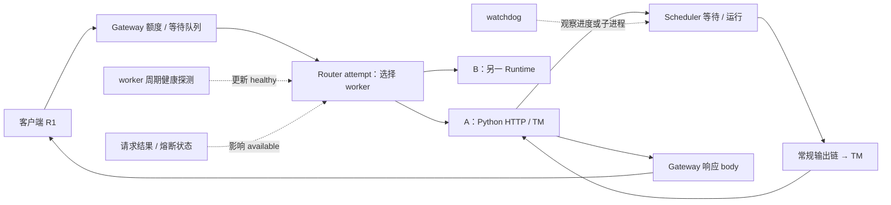
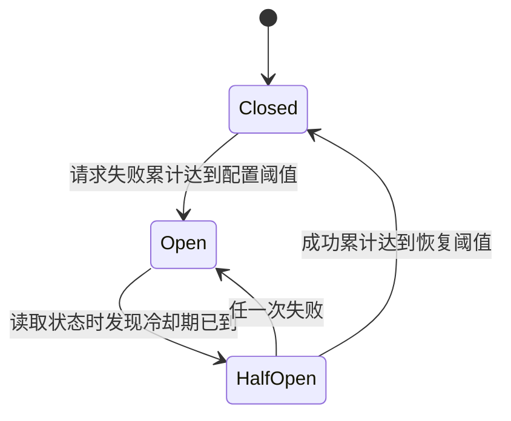
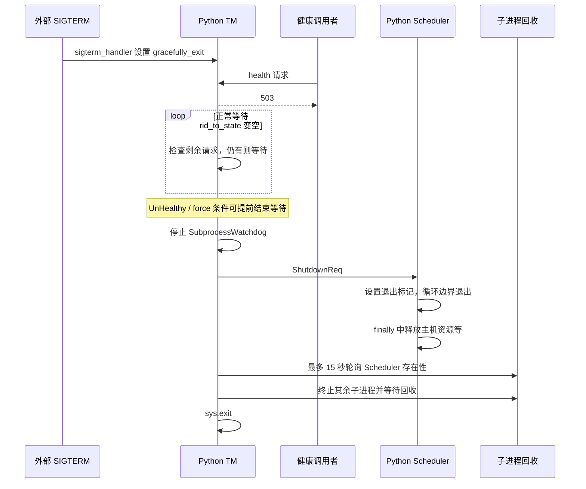

# 健康检查、超时、限流与优雅退出

本文是**源码分析型学习资料**。面向已经理解一条请求怎样执行、希望进一步读懂“服务还活着，但请求为什么失败”的读者。

先用人话区分六件事：进程存在、HTTP 能应答、有合适 worker、运行时在前进、这条请求成功、所有资源都已退出。它们需要不同证据。一个健康接口返回 200，通常只回答其中一部分问题。

## 0. 阅读基线与范围

| 项目 | 内容 |
| --- | --- |
| 源码仓库与路径基准 | 官方 sgl-project/sglang；全部源码路径相对于 SGLang 仓库根目录 . |
| 分支 | codex/sglang-source-study-20260909，基于已拉取的官方 main |
| 固定 commit | 72d5c5bb73cadd7ffbf5114e5f81e29d36b6c61a |
| 读取日期 | 2026-09-10；沿用 2026-09-09 固定基线 |
| 工作区 | 学习 worktree sglang-source-study 干净；原 muxi-main 与 26 个未跟踪文件保留 |
| 文档位置 | Wiki sglang/source-study/10-serving-operations/ |
| 完整主线 | 普通 HTTP Gateway → Python HTTP Runtime → Normal Scheduler；单模型、两个 Regular worker A/B，每个 Runtime 的 TP/PP/DP 均为 1 |
| 请求条件 | 普通文本生成、n=1；先非流式 R1，再单独对照流式断连 |
| 教学配置 | Gateway 额度容量 2、补充速率未单设、queue_size=2；重试示例显式 max_retries=3、初始退避 100ms、倍率 2、上限 250ms、jitter=0 |
| 操作与证据 | 只读源码、九个列明测试定义，检查文档和独立教学账本；未运行服务、模型或项目测试，未发送信号、管理请求或部署操作 |
| 不展开 | IGW、mesh 全局限流、P/D 传输退役、所有路由类型、全部硬件退出细节与外部 HTTP 库内部实现 |

前置：[10-01 Gateway 注册与路由](01-ModelGateway注册路由与缓存亲和.md)、[10-02 协议与 Rust 服务边界](02-HTTPgRPC与Rust服务边界.md)、[02-06 请求完成与取消](../02-request-lifecycle/06-完成取消与资源释放.md)、[03-06 回撤与调度排障](../03-scheduling/06-回撤背压饥饿与调度排障.md)。

下文实现事实对应固定源码；图、类比和数字属于**整理者归纳**。涉及自动重试的 HTTP 语义另核对了 [RFC 9110 §9.2.2](https://www.rfc-editor.org/rfc/rfc9110.html#section-9.2.2)，协议原则不替代当前实现的条件。本篇没有运行观察。

## 1. 先画出“谁在等谁”

### 1.1 接单、派工、执行和退出是不同阶段

可以把 Gateway 理解为接待台，Runtime HTTP/TM 是本地接单与结果登记处，Scheduler 是安排计算的工位负责人。接待台回答“营业中”，不保证某个工位没有故障；工位今天处理过订单，也不保证 R1 没在角落里等待。



**图意解读：** 方框是职责或组件，A/B 是不同 worker；一次 attempt 只选一个。额度不足时请求尚未进入 worker，Scheduler 等待时则已离开 Gateway 等待队列。虚线是状态观察与选择依据，不是模型数据流。[S39] [S48] [S49] [S24] [S28] [S62]

### 1.2 同一个“成功”至少有六种口径

| 层次 | 直接证据 | 不能单独证明 |
| --- | --- | --- |
| 进程存活 | OS 进程状态、子进程 exitcode | 事件循环在前进、GPU 正常 |
| 前端可应答 | Gateway /liveness 或 /health 返回 200 | 有 worker、模型就绪 |
| 名单满足就绪条件 | Gateway /readiness 返回 200 | 指定模型/协议/rank 可用、熔断器允许 |
| 运行时有响应活动 | Python /health_generate 的活动时间推进 | 专属探针完成、R1 成功、所有请求公平前进 |
| R1 完整成功 | 原始响应、终态、内容和错误层核对 | 下次请求成功、全体请求状态相同 |
| 退出完成 | 进程回收、端口和资源状态的实际证据 | 仅凭“收到 SIGTERM”日志就已释放全部资源 |

这张表是证据分层，不是额外添加六个状态枚举。对应入口见 [S18] [S19] [S20] [S1] [S63]；退出实现见 [S7] [S13]。

## 2. Python Runtime 的健康检查实际检查什么

### 2.1 Starting、Up、UnHealthy 与退出标记

Python HTTP 的 /health 与 /health_generate 共享 health_generate 函数。最前面先检查：

1. TM.gracefully_exit 为真：返回 503。
2. TM.server_status 为 Starting：返回 503。
3. 诊断旁路 SGLANG_DIAG_BYPASS_HEALTH_GENERATE 生效：返回 200。
4. 只对 /health，若关闭 SGLANG_ENABLE_HEALTH_ENDPOINT_GENERATION：返回 200。
5. 其余情况才发起探测并等待活动。[S1]

默认健康生成开关为 true；HEALTH_CHECK_TIMEOUT 默认 20 秒，来自该模块的环境读取。[S5] [S77] 所以不能不看路径与环境，就宣称 /health 永远是静态存活检查或永远执行一次生成。

正常启用 warmup 的普通非分离路径中，_execute_server_warmup 先等 /model_info 应答，再提交 warmup 请求，HTTP 200 后把 TM.server_status 置为 Up。[S4] 这是特定启动分支的状态更新；元信息接口可访问与 warmup 成功不同，单次 warmup 也不是所有模型能力的验证。

### 2.2 探针触发工作，活动时间才是通过条件

探针使用唯一的 HEALTH_CHECK rid、input_ids=[0]、max_new_tokens=1、temperature=0；生成模型与 embedding 模型分别构造对应输入。分离模式另有 fake bootstrap 字段，本篇不把这个探针视为真实 P/D KV 传输验证。[S1]

随后创建任务迭代 TM.generate_request，但健康判断并不等待该 rid 的完整答案。它记录 tic，周期性检查：

```text
TM.last_receive_tstamp > tic
```

条件成立就取消探针任务、删除探针本地状态、设置 Up、返回 200；到达检查期限仍不成立，则设置 UnHealthy 并返回 503。[S1]

TM.handle_loop 在处理完一条来自常规输出/控制回程的消息后更新 last_receive_tstamp。更新位置并未限定为“这次探针的成功 token”。[S2] Scheduler 忙时还会跳过专属健康生成请求，并记下相应回程信息，因为普通请求的活动也会提供信号。[S3]

**教学例子：** tic=100，R1 在排队，R2 的回包在 101 被 TM 处理。健康检查可以通过；这不能证明 R1 已获得计算机会。相反，没有回包只说明该观测窗口缺少活动，根因仍可能在调度、执行、通信、反分词或事件循环。

不要把文件注释中的“零开销”当作测量结果：本篇只能确认忙时跳过的分支和活动判据，没有测量探测请求的实际成本。

### 2.3 不同服务入口不要套用同一个健康结论

| 入口 | 固定实现的判断 | 关键边界 |
| --- | --- | --- |
| Python /health_generate | 状态前置门 + 全局 last_receive_tstamp 推进 | 不要求专属 probe rid 完成 |
| Python /health | 默认共享上述逻辑，可通过配置变轻 | 仍先检查 Starting 与 gracefully_exit |
| 原生 gRPC RuntimeHandle.health_check | gracefully_exit 为假，状态不为 Starting/UnHealthy | 此函数不发起新生成探针 |
| 嵌入式 Rust HTTP /health_generate | 发探针，等待全局 response_activity 计数变化 | 同样是全局活动，不是只看 probe 结果 |
| 嵌入式 Rust HTTP /health | 构建路由时决定共享探测或静态 200 | 健康超时与开关在启动时固定 |

原生 gRPC 见 [S15]，Rust HTTP 见 [S16] [S17]。Rust probe 的 AbortGuard 用于离开时清理登记；取消投递的下一跳边界见 10-02，不能把健康成功当作所有取消或资源释放已验证。

## 3. Gateway 的 healthy、ready 与 available

### 3.1 Gateway 自己活着，不等于后端够用

Gateway /liveness 直接返回 200；/health 调用同一逻辑。[S18] [S20] /readiness 则读取 WorkerRegistry，把 is_healthy 为真的 worker 收集起来：

| 模式条件 | readiness 的条件 |
| --- | --- |
| enable_igw=true | 至少一个 healthy worker |
| 非 IGW 的 Regular / OpenAI | 至少一个 healthy worker |
| 非 IGW 的 PrefillDecode | healthy 集合里至少一个 Prefill 和一个 Decode |

满足时返回 200 和数量，否则 503。[S19] 这里没有按本次请求的模型、连接协议或熔断状态重新做完整候选过滤。

普通 HTTP Router 的 /health_generate 经 proxy_get_request 转给 select_first_worker 找到的第一个 healthy worker；它没有在该方法中轮询验证所有 worker，也不是生成请求所用的完整策略选择路径。[S21] [S22] [S23]

因此存在一个完全可解释的状态：Gateway /readiness=200，但 R1 仍得不到 available worker。下一节说明多出来的门。

### 3.2 健康探测有自己的失败与恢复计数

Registry 周期任务取得 worker 快照，跳过禁用探测的项，并行调用 check_health_async。某个周期的全部检查完成后才继续该任务循环，不能把周期配置直接当作故障一定被发现的精确时长。[S24]

HTTP worker 检查配置的 endpoint，用独立请求 timeout，以上游 HTTP 成功状态作为该次探测结果。[S26] 默认 HealthCheckConfig 为失败阈值 3、成功阈值 2、请求超时 5 秒、检查周期 60 秒、endpoint=/health，且未禁用。[S27] 实际 worker 配置可能覆盖默认值。

| 连续观察 | 健康对象变化 |
| --- | --- |
| 探测成功 | 清失败计数，增加成功计数 |
| 原来不健康且成功计数达到阈值 | 设 healthy=true，并清该成功计数 |
| 探测失败 | 清成功计数，增加失败计数 |
| 原来健康且失败计数达到阈值 | 设 healthy=false，并清该失败计数 |
| check_health_async 内显式禁用检查分支 | 必要时设为健康并返回 |

见 [S25]。Registry 周期任务已过滤禁用检查的 worker，因此最后一行不能写成“周期探测每轮会主动修正所有禁用项”。

### 3.3 熔断器是另一套状态机

Worker.is_available 的判断是 is_healthy 与 circuit_breaker.can_execute 同时成立。[S28] 健康探测的连续失败计数和请求结果的熔断计数不是同一组字段。



**图意解读：** 这是 Gateway CircuitBreaker 的状态转换，不是 Runtime ServerStatus。Open 到 HalfOpen 由状态读取中的检查触发，不是独立计时器到了就必然立即执行。[S30] Closed/HalfOpen 的 can_execute 都直接返回 true；本实现没有在这个方法中设置“只允许一个试探请求”的令牌。[S29]

record_success 清连续失败计数，并在 HalfOpen 达成功阈值时关闭熔断；record_failure 清连续成功计数，Closed 达失败阈值或 HalfOpen 任一次失败都会打开熔断。[S31] [S32]

**教学账本：** 假设失败阈值 2、成功阈值 2。F、F 使 Closed→Open；冷却后状态被读取，进入 HalfOpen；S 仍为 HalfOpen，再 S 才回 Closed。这个例子不使用默认阈值，也不构成多线程并发切换正确性的运行验证。

## 4. 限流、并发额度和等待队列

### 4.1 “token”在这里是接单额度

Gateway 的 TokenBucket token 是额度单位，不是模型输入/输出 token。concurrency_limit_middleware 每次请求申请 1.0；它没有按 prompt 长度扣 100 或 10000 个额度。[S39]

配置工厂 maybe_rate_limiter 的行为是：

| 配置 | 实际构造 |
| --- | --- |
| max_concurrent_requests ≤ 0 | 不创建本地 rate_limiter |
| max_concurrent_requests=N>0，补充速率为正数 r | 容量 N、每秒补充 r |
| N>0，补充速率未设或非正 | 容量 N、每秒补充 N |

依据 [S33]。TokenBucket 类本身支持 refill_rate=0 的纯并发用法，但这条配置工厂会把非正速率回退为 N；不能用类的能力推导 CLI/配置一定选中了该模式。[S34]

令 b 为当前可用额度、Δt 为距离上次更新的时间。try_acquire_sync 先做：

```text
b = min(N, b + Δt × r)
若 b ≥ 1，则 b = b - 1
```

返回额度时再执行 b=min(N,b+returned)。[S35] [S38] **时间补充与请求结束归还共同存在**，所以这个工厂配置不构成“最多 N 条在途请求”的严格计数器。

### 4.2 容量 2 的独立账本

使用本篇教学配置 N=2，未单设速率，因此 r=2/s；假设所有长请求仍未结束：

| 时点 | 动作 | 可用额度 | 仍在途请求数 |
| --- | --- | ---: | ---: |
| t=0 | 初始桶 | 2 | 0 |
| t=0 | A、B 各拿 1 | 0 | 2 |
| t=0.5s | 时间补充 1，C 再拿 1 | 0 | 3 |
| 稍后 | A 的 response body 被 Drop | 归还 1，但不超过容量 | 至少 B、C 仍在途 |

这是依据公式的独立推演，不是实际并发压测。它直接说明“桶最大容量 2”与“在途最多 2”不是同一限制。

响应 body 由 TokenGuardBody 包装，Drop 时同步归还额度；该动作跟随 body 生命周期，不能仅因 response headers 已生成便认定额度已经返还。[S42] 同时，body 被丢弃也可能来自断连，不等于用户成功收完整个答案。

### 4.3 没有额度时，进入哪个队列

middleware 先尝试立即申请。失败后若启用等待队列，则创建 QueuedRequest，记录 queued_at 和 oneshot permit 通道，再 try_send 入 mpsc；否则直接 429。[S39] ConcurrencyLimiter 只有在桶存在且 queue_size>0 时创建该队列。[S41]

QueueProcessor 取出队列项后：

1. 用 queued_at 计算已等待时间；已经达到 queue_timeout，返回 408。
2. 用剩余时间作为外层申请期限。
3. 能立即申请就通知调用者。
4. 需要等待则创建独立异步任务等待额度，之后通过 oneshot 返回成功或 408。[S40]

| 结果 | HTTP 层表现 |
| --- | --- |
| 立即/等待取得额度 | 继续执行路由，最终包装 response body |
| 无额度且未启用等待队列 | 429 |
| try_send 失败 | 该分支返回 429 |
| 等待额度超时 | 408 |
| permit 通知通道关闭 | 500 |

这些拒绝发生在 middleware，尚未调用下游 Router，因此不会自动进入 Router 内部的 worker 重试循环。[S39] [S48]

### 4.4 容量、等待期限与取消还有局部边界

queue_size 限制 mpsc 中尚未被取走的条目；processor 取出后可把额度等待交给新任务。因此不能只看 queue_size，推导所有等待中的请求数都被它严格约束，也不能据此宣称严格 FIFO 公平。[S40] [S41]

正补充速率下，TokenBucket.acquire 内部还按 tokens_needed/refill_rate 计算一次等待时间，再包一层 timeout；acquire_timeout 外层另有调用方期限。实际等待可能因内部期限先结束而返回，不能把 queue_timeout 当作每个请求至少或恰好等待的时长。[S36] [S37]

取消清理也要按拥有者检查：TokenGuardBody 在 next.run 返回 response 后才构造；QueueProcessor 给 oneshot 发成功时忽略 send 失败结果。[S39] [S40] 本地这些分支没有展示覆盖所有早期取消的额度凭据，不能从 Drop 路径存在推导“每种中断都已经归还额度”。本篇记录这一证据边界，没有修改实现或运行故障注入。

受保护的生成等路由挂接该 middleware；公开 health/readiness 路由分开构建。健康请求通过，不代表普通请求可以绕过额度限制。[S43]

## 5. 超时分别从哪里开始计时

### 5.1 先确定时钟与作用对象

| 等待/超时 | 起点与检查者 | 到期行为与边界 |
| --- | --- | --- |
| Gateway 等待额度 | QueuedRequest.queued_at；QueueProcessor 与 TokenBucket | 408；尚未进入 worker |
| Gateway 连接/请求 | AppContextBuilder 给 HTTP client 设置 connect_timeout 与 timeout | 约束该 client 操作；不是包含前置队列与全部重试的统一总预算 |
| Runtime 健康探测 | health 函数 tic；活动时间轮询 | 成功设 Up，超时设 UnHealthy/503 |
| Scheduler waiting | wait_queue_entry_time；_poll_timeout_aborts | 生成 AbortReq；不在这里直接删队列 |
| Scheduler running | forward_entry_time；遍历在途 batch | 跳过已完成项并按 rid 去重；生成 AbortReq |
| TM 等状态事件 | state.event.wait；默认每 4 秒超时一次 | 检查断连后继续等待，不是请求 4 秒必定失败 |
| 原生 gRPC 响应间隔 | 每次等待下一条 chunk | 与整条请求总时长不同，见 10-02 |
| Watchdog 进度 | 上次计数变化与 active 条件 | 诊断或触发故障退出；不是逐请求 deadline |

Gateway client 配置见 [S53]；健康见 [S1]；Scheduler 见 [S54]；TM 见 [S56] [S76]；watchdog 见 [S61] [S62]。连接库内部精确网络阶段本篇未逐层阅读，不把其 timeout 与自己的端到端 SLA 混写。

### 5.2 Scheduler timeout 是轮询生成取消输入

waiting/running 阈值只有大于 0 才启用。环境声明默认 -1，表示这些轮询条件默认不启用。[S75] [S54]

waiting 的筛选要求 0<entry_time<当前 perf_counter−阈值；running 使用同样的严格边界，并跳过 finished 的请求。timestamp=0 是未设置哨兵，等于截止线也不满足本次严格小于判断。[S54]

例如 now=10、阈值=2，entry=7.9 会产生超时取消；entry=8 本次不会；entry=0 也不会。这里没有测量实际调度周期。

ingest_requests 在指定入口 rank 生成本轮 timeout abort，再经过 receiver 和输入分派链处理。[S55] _poll_timeout_aborts 本身不 pop waiting_queue，也不直接给运行请求设置最终完成状态。取消如何进入结果与 KV 回收链，见 02-06。

如果主循环卡在别处，不能只凭配置阈值就承诺恰好在第 N 秒抢占 GPU。waiting、running 和 watchdog 观察的是不同对象。

### 5.3 多层期限不会自动拼成一个总预算

假设排队 1 秒，随后最多 3 次 attempt，每次各自可能等待 2 秒，两次退避为 0.1、0.2 秒。把每层都耗尽的教学时间相加是 1+3×2+0.1+0.2=7.3 秒。

这个算式用来说明“2 秒上游期限不是 2 秒端到端期限”，不是运行耗时上界证明。实际还存在执行调度、协议处理、客户端总 deadline、不同失败点和提前终止；客户端先结束也不会替其他层证明在途工作已经停止。

## 6. 重试可以重发请求，不能恢复已输出的流

### 6.1 当前循环按响应状态决定是否继续

普通 HTTP route_typed_request 把每次 route_typed_request_once 包在 RetryExecutor 中；每个 attempt 重新选择 worker，再发送请求。[S48] [S49]

可重试集合是 408、429、500、502、503、504。[S44] 这只是函数的状态分类，不能据名称就说每个失败都适合重试。上游错误先经过响应转换；convert_reqwest_error 按多个谓词顺序映射，is_request 等检查位于 is_timeout 之前，因此也不应把所有底层 timeout 一律概括为 504。[S78]

RetryExecutor 使用 max=config.max_retries.max(1)，attempt 从 0 开始，attempt+1>=max 视为最后一次。[S45]

| max_retries | 最多执行 attempt 数 | 最多退避次数 |
| ---: | ---: | ---: |
| 0 | 1 | 0 |
| 1 | 1 | 0 |
| 3 | 3 | 2 |

这里的字段名不是“首次调用之外再补几次”。disable_retries 的有效配置把 max_retries 设为 1。[S47]

### 6.2 R1 的三个 attempt 账本

假设 A 暂时返回 503，第二次选择仍失败，第三次选择 B 返回 200：

| attempt | 操作与结果 | 下一步 |
| ---: | --- | --- |
| 0 | 选择 worker、发送，得到 503 | 等待 100ms |
| 1 | 重新选择、发送，得到 503 | 等待 200ms |
| 2 | 重新选择、发送，得到 200 | 返回最终响应 |

如果第三次仍是可重试失败，执行 exhausted hook 后返回那次响应。代码没有因为耗尽而必然生成一种全新的统一错误。[S45] 独立测试定义也断言调用次数等于 max_retries、退避次数少一次。[S71]

退避基值为 min(initial×multiplier^attempt,max_backoff)，再添加 jitter；本例关闭 jitter，所以是 100、200，下一次基值才被限制到 250ms。开启 jitter 时随机调整发生在截断之后，不应把 max_backoff_ms 当作调整后绝不超过的硬上限。[S46]

重选 worker 不保证一定换到不同 worker；策略、候选与健康状态仍影响选择，见 10-01。

### 6.3 200 之后的流错误为什么不能在这里重试

非流式 send_typed_request 先读完上游 body，再构造返回响应。读取 body 失败可生成 500，再由外层状态分类处理。[S50]

流式则把上游 bytes stream 装进 body 返回。外层重试循环此时看到的是初始 HTTP status；若为 200 就已经返回，后续消费时的错误只会进入流的生命周期，不能回到这层循环自动续写答案。[S48] [S50]

BreakerTrackedStream 记录三种终态：

| body 终止方式 | Drop 时对熔断器的处理 |
| --- | --- |
| 干净读到结束 | 记成功 |
| 流中出现上游错误，或已被标记错误 | 记失败 |
| 仍 Active 就被调用者丢弃 | 不记成功，也不记失败 |

见 [S51] [S52]。非 2xx 的流式响应预先标记 Errored，避免一个正常读完的小错误体被误算成功。[S50] 这套判断主要观察状态和传输结果，不等于逐条理解 SSE 业务字段；HTTP 200 中的业务错误仍要核对实际内容。

### 6.4 “没拿到答案”与“后端没执行”不同

R1 的连接超时可能发生在请求未到达之前，也可能发生在 worker 已经执行之后。当前重试链重发同一类请求，并没有在这些入口展示跨 worker 的执行结果去重协议。[S48] [S49] [S50]

RFC 对客户端和代理分别规定重试条件：客户端不应自动重试非幂等方法，除非能确认请求的业务语义实际幂等，或原请求从未生效；代理不得自动重试非幂等请求。因此，Gateway 的状态码重试机制本身不能证明业务请求具备可重试语义，也不能仅从通信失败推定后端没有执行。[RFC 9110 §9.2.2](https://www.rfc-editor.org/rfc/rfc9110.html#section-9.2.2)

因此阅读生成接口时应分别考虑重复计算、随机输出、会话状态和调用方后续动作。相同 request ID、固定 seed 或相同 prompt 都不自动构成“只执行一次”的证明。若已经向用户展示部分流，重新生成也不是原流的透明续传。

本篇解释实现与适用边界，不把 Gateway 当前状态重试规则推广到任意写接口或外部业务动作。

## 7. 断连与 watchdog 怎样接到取消和退出

### 7.1 客户端断连先改变连接与任务

Python TM._stream_one_response 在等待状态事件超时时检查断连；非流式运行期间也有对应检查。只有 request 存在且不是 background 请求等条件成立，才调用 abort_request 并通过异常结束该调用栈。[S56]

HTTP /generate 的流式返回附带 create_abort_task。该任务等待 2 秒后，逐个检查 rid 是否仍在 TM 状态表，再请求取消；它本身不是每两秒轮询连接的永久监视器。[S57] [S58]

Gateway 流式 body 持有上游流，丢弃 body 会连带丢弃上游流对象；下游 Runtime 的断连/任务取消再接入取消链。[S50] 源码提供了这些连接点，但本轮没有证明任意网络故障下的传播时延，更不能由客户端窗口关闭推导 GPU/KV 已回收。

对于 background 请求，不应照搬普通交互请求的断连判断。原生 gRPC 和嵌入式 Rust HTTP 的 guard 与队列条件另见 10-02。

### 7.2 三类 watchdog 看不同信号

| 观察器 | 判断输入 | 主要动作与限制 |
| --- | --- | --- |
| Scheduler WatchdogRaw | forward_ct；初始化中或 cur_batch_for_debug 存在时 active | 计数不变超过门槛则输出诊断；不覆盖所有无 batch 的等待停滞 |
| TM soft watchdog | handle_loop 处理进度；等待回包时在 disable 区间 | 正常无回包等待与“处理代码不前进”分开 |
| SubprocessWatchdog | 受监控进程的 is_alive 与 exitcode | 活着或 exitcode=0 时跳过；非正常退出触发本进程 SIGQUIT |

Scheduler 接线见 [S62]，TM 循环见 [S2]，子进程判据见 [S63]。某条请求长期饥饿时，其他请求仍可推进 forward_ct；没有报警不能排除这类问题。

WatchdogRaw 用 perf_counter 检查计数，轮询间隔为 timeout/2；超时输出诊断，hard 模式随后等待 5 秒并给父进程发 SIGQUIT，soft 模式没有这一步。[S61] 这不是主动把某条请求重新排队的机制。

TM 安装信号处理器只在主线程条件下进行，并启动 sigterm_watchdog。[S59] SIGQUIT 处理会停止子进程 watchdog、尝试记录请求信息并终止进程树；它与下一节“等待请求排空”的 SIGTERM 路径不同。[S60]

## 8. 优雅退出要走到哪个终点

### 8.1 Python Runtime：先等本地请求表，再让 Scheduler 退出

SIGTERM handler 只先把 TM.gracefully_exit 置为 true。[S6] 随后的健康检查返回 503；这不等于所有已有连接或直接 /generate 调用已经被统一拒绝。在本篇已读的 generate 入口中，不能找到仅靠这个标记就阻断全部新请求的统一门。[S1] [S58]

sigterm_watchdog 每 5 秒观察退出标记；进入 draining 后反复读取 len(rid_to_state)。正常情况只在该表为空时继续，没有为这一段配置一个统一总截止时间。[S7]

特殊分支是 UnHealthy 或 get_bool_env_var("SGL_FORCE_SHUTDOWN") 为真：结束这一段等待并进入后续清理。这个函数读取的是**精确环境名 SGL_FORCE_SHUTDOWN**；get_bool_env_var 直接读取传入键，不做前缀替换。[S7] [S14] force_exit_handler 在基础 TokenizerManager 中只是空的扩展钩子，不能因名字含 force 就认为调用它已经杀掉进程。[S8]



**图意解读：** 图是本篇单 TM、Normal Scheduler 主线。健康调用者只收到 503；外部如何更新路由不在这些函数内自动完成。15 秒是后半段等 Scheduler 的局部期限，不含前面可能长期等待的请求表排空。[S7]

### 8.2 ShutdownReq 不等于发送瞬间已退出

Scheduler.handle_shutdown 设置自己的 gracefully_exit。Normal loop 在循环边界检查标志；如果标志在 ingest_requests 中才被设置，该轮后续代码与下一轮检查的关系仍要按实际循环阅读，不能说消息一到就抢占正在执行的 kernel。[S9] [S10]

run_scheduler_process 的 finally 会关闭相应指标组件；只有 scheduler.gracefully_exit 为真才走 release_host_resources，避免把可能卡住设备同步的清理无条件套到异常退出路径。[S11]

release_host_resources 继续调用 HiSparse、tree cache、decode offload 等对象的主机资源释放入口，并关闭其他捕获/一致性组件。[S12] 这证明有用户态清理链，不证明当前所有硬件、所有并行模式及每种在途传输都已完成安全退役。

TM 等待 Scheduler 的 15 秒结束后调用 kill_process_tree(include_parent=False,wait_timeout=60)。该函数给子进程发 kill，并等待回收；等待失败可能报错。[S7] [S13] 不能把“请求排空 + 15 + 60”写成严格固定的总退出时间，更不能仅凭日志中的 shutdown 一词证明端口与 GPU 资源已经可复用。

### 8.3 Gateway 的退出是另一套生命周期

Gateway startup 创建 axum_server Handle，等待 Ctrl+C 或 terminate 信号后调用 graceful_shutdown(Some(grace_period))；grace_period 来自 shutdown_grace_period_secs。[S64] [S65]

这是把 Gateway 监听/连接的优雅关闭交给外部 axum_server 的调用边界。这里没有向每个 worker 发出 Runtime ShutdownReq，也没有读取所有 worker 的 TM 请求表。Gateway 退出、Runtime 退出、worker 从名单移除和跨实例资源退役都应分别记录。

主线中的稳妥理解是：停止把新工作送入待退出实例、确认已有请求走完或取消、推进本地组件清理、检查进程及资源最终状态。前两项是否实际做到，要从外部路由与请求证据确认；本篇没有执行任何退出操作。

## 9. 症状到源码与观测字段

### 9.1 常见现象怎样定位

| 现象 | 先检查 | 源码/正文 | 避免误判 |
| --- | --- | --- | --- |
| Gateway health=200 但生成 503 | readiness、候选与熔断状态 | [S18] [S19] [S28] | 存活不是可选 |
| readiness=200，但无 available worker | healthy 与 can_execute | [S19] [S29] | readiness 不含全部选择条件 |
| Runtime health 通过，R1 不前进 | 谁推进 last_receive_tstamp、R1 所在队列 | [S1] [S2] | 全局活动不证明单请求公平 |
| max_concurrent_requests=2，却有 3 条长请求 | 时间补充与 body 归还 | [S33] [S35] [S42] | 额度容量不是严格在途上限 |
| 等待人数超过 queue_size | processor 取出后的异步等待任务 | [S40] | 缓冲区容量不是全部等待者 |
| 排队 408 没看到 worker 重试 | 拒绝位于 middleware 还是 Router | [S39] [S48] | 共享状态码不表示共享处理层 |
| max_retries=3 只调用了 3 次 | attempt 的边界与 disable_retries | [S45] [S47] | 字段值不是额外次数 |
| 200 后流中断，没有自动恢复 | response 返回后 body 的消费阶段 | [S50] [S51] | 状态重试不负责流续传 |
| 设了 running timeout 仍未停止 | 入口时戳、主循环是否还能轮询 | [S54] [S55] | deadline 不是独立 GPU 抢占 |
| 没有 watchdog 报警但请求卡住 | active 条件、全局 forward 计数 | [S61] [S62] | 没报警不等于每个请求有进度 |
| SIGTERM 后久久不退出 | rid_to_state、新请求来源、UnHealthy/force 分支 | [S7] | drain 没有统一总期限 |
| force hook 返回，进程仍存在 | hook 是否基础空实现、后续 kill/reap | [S8] [S13] | 函数名不是终止证据 |

### 9.2 一条 R1 的可复查记录

| 记录组 | 最少字段 | 回答的问题 |
| --- | --- | --- |
| 实例与基线 | Gateway/Runtime 身份、commit、模型、路由模式、有效配置 | 查的是哪条实现与哪个实例 |
| 选择 | rid、attempt、worker URL、healthy、breaker state | 有没有进入正确的 worker |
| 额度与等待 | 容量/速率、queued_at、获得额度时间、拒绝所在层 | 等在 Gateway 还是 Runtime |
| 执行 | wait_queue_entry_time、forward_entry_time、活动时间、forward_ct | 单请求与全局进度是否一致 |
| 输出 | HTTP status、错误码、SSE 终态、body 结束方式 | 只完成响应头还是完整结果 |
| 取消 | 断连观察、AbortReq 提交/处理与资源释放时点 | 清理走到了哪一步 |
| 退出 | SIGTERM 时间、TM 剩余 rid、ShutdownReq、Scheduler/子进程状态 | 等待、清理与回收是否各有证据 |

本表是应采集的字段关系，不表示所有字段在默认日志中已经输出；日志、Metrics 和 Trace 的实际归属由下一篇逐一追踪。

## 10. 源码阅读路线、练习与证据

### 10.1 按请求主线回到代码

以下路径均相对于 SGLang 仓库根目录。先读健康和准入，再读重试与输出，最后读退出。

| 顺序 | 源码入口 | 阅读问题 |
| --- | --- | --- |
| 1 | `python/sglang/srt/entrypoints/http_server.py::health_generate` [S1] | 健康信号是否来自专属探针 |
| 2 | `sgl-model-gateway/src/server.rs::readiness` [S19] | ready 是否等于可选择 |
| 3 | `sgl-model-gateway/src/core/worker.rs::BasicWorker::check_health_async` [S25] | 连续探测怎样更新标志 |
| 4 | `sgl-model-gateway/src/app_context.rs::AppContextBuilder::maybe_rate_limiter` [S33] | 实际是纯并发还是时间补充桶 |
| 5 | `sgl-model-gateway/src/middleware.rs::concurrency_limit_middleware` [S39] | 请求在哪层被拒绝 |
| 6 | `sgl-model-gateway/src/middleware.rs::QueueProcessor::run` [S40] | 等待者离开队列后由谁持有 |
| 7 | `sgl-model-gateway/src/core/retry.rs::RetryExecutor::execute_response_with_retry` [S45] | max_retries 到底计数什么 |
| 8 | `sgl-model-gateway/src/routers/http/router.rs::Router::route_typed_request` [S48] | 每个 attempt 是否重新选 worker |
| 9 | `sgl-model-gateway/src/routers/http/router.rs::Router::send_typed_request` [S50] | 流结束与错误在哪里处理 |
| 10 | `python/sglang/srt/managers/scheduler.py::Scheduler._poll_timeout_aborts` [S54] | 超时是否直接删队列 |
| 11 | `python/sglang/srt/managers/tokenizer_manager.py::TokenizerManager._stream_one_response` [S56] | 断连怎样接到取消 |
| 12 | `python/sglang/srt/utils/watchdog.py::WatchdogRaw._watchdog_once` [S61] | watchdog 观察什么计数 |
| 13 | `python/sglang/srt/managers/tokenizer_manager.py::TokenizerManager.sigterm_watchdog` [S7] | 什么时候停止等待本地请求 |
| 14 | `python/sglang/srt/managers/scheduler.py::Scheduler.handle_shutdown` [S9] | 收到 ShutdownReq 先改什么状态 |
| 15 | `python/sglang/srt/managers/scheduler.py::run_scheduler_process` [S11] | finally 何时清理主机资源 |
| 16 | `sgl-model-gateway/src/server.rs::startup` [S64] | 网关把退出交给哪个组件 |

### 10.2 自测与答案要点

1. A 的 healthy=true，熔断器 Open，Gateway readiness 可否是 200？
   **可以。** readiness 看健康名单；available 还要检查熔断器，当前调用可能没有可选 worker。

2. N=2、r=2/s，A/B 尚未结束，0.5 秒后 C 可否取得额度？
   **可以。** 时间补充产生一个额度；容量约束可用额度，不等于严格限制在途数量。

3. R1 在 Gateway 队列超时 408，会自动使用 worker 的 max_retries 吗？
   **不会进入这层循环。** middleware 尚未调用 Router；同一个 408 在不同层有不同后续路径。

4. max_retries=3、始终 503，实际调用和退避分别多少次？
   **最多 3 次调用、2 次退避。** 用的是总 attempt 数，耗尽后返回最后一次响应。

5. 看到 HTTP 200 后 body 出错，这层重试是否能拼接另一个 worker 的答案？
   **不能。** 返回 200 后重试循环已结束，流消费错误不提供跨 worker 续传协议。

6. TM 剩余请求表不为空、又没有 UnHealthy/force 条件时，是否一定在 75 秒内退出？
   **不保证。** 正常 drain 阶段没有总截止时间；15 秒与 60 秒属于后续局部步骤。


### 10.3 本轮只读的测试定义

| 测试 | 约束内容 | 不构成什么证据 |
| --- | --- | --- |
| TestWaitingTimeout.test_emits_only_reqs_past_the_deadline_and_keeps_queue_intact [S66] | 只产生过期项取消，原队列保持 | 真实超时响应、GPU 抢占 |
| TestRunningTimeout.test_req_in_both_running_and_last_batch_is_emitted_once [S67] | 按 rid 去重 | 跨 rank 取消运行正确性 |
| TestSubprocessWatchdog.test_normal_exit_no_sigquit [S68] | 正常 exitcode 不发 SIGQUIT | Runtime 完整资源退役 |
| TestSubprocessWatchdog.test_crashed_process_triggers_sigquit [S69] | 子进程异常可触发被 mock 的信号观察 | 本次真实生产故障恢复 |
| test_token_bucket_zero_refill_rate [S70] | 直接构造零补充桶，不随时间补充 | 配置工厂默认就是零补充 |
| test_execute_response_with_retry_exhausted_hooks [S71] | 调用/退避/耗尽次数 | 外部 worker 未重复执行 |
| test_circuit_half_open_after_timeout [S72] | 冷却后读状态进入 HalfOpen | 任意并发只允许一个试探 |
| test_circuit_closes_on_success_threshold [S73] | HalfOpen 两次成功后关闭 | 健康检查与熔断计数是同一组 |
| test_circuit_reopens_on_half_open_failure [S74] | HalfOpen 失败重新打开 | 所有流内业务错误都被识别 |

共九个定义，来自两份 Python 文件和三份 Rust 文件，**均未运行**。子进程测试定义包含受控进程与信号 mock，本轮只读；没有触发它们。

独立文档检查核算了额度补充、attempt/退避次数、超时严格边界、熔断状态例子和分层时间账本。Mermaid 只做源码与文字的静态对照，未执行渲染器；没有测试服务启动、真实断连、限流压测、信号退出或 GPU/网络资源回收。

下一篇：[10-04《Metrics、日志与 Trace 关联》](04-Metrics日志与Trace关联.md)，将上述阶段与字段映射到实际观测入口。

[S1]: https://github.com/sgl-project/sglang/blob/72d5c5bb73cadd7ffbf5114e5f81e29d36b6c61a/python/sglang/srt/entrypoints/http_server.py#L664
[S2]: https://github.com/sgl-project/sglang/blob/72d5c5bb73cadd7ffbf5114e5f81e29d36b6c61a/python/sglang/srt/managers/tokenizer_manager.py#L2225
[S3]: https://github.com/sgl-project/sglang/blob/72d5c5bb73cadd7ffbf5114e5f81e29d36b6c61a/python/sglang/srt/managers/scheduler.py#L2070
[S4]: https://github.com/sgl-project/sglang/blob/72d5c5bb73cadd7ffbf5114e5f81e29d36b6c61a/python/sglang/srt/entrypoints/http_server.py#L2203
[S5]: https://github.com/sgl-project/sglang/blob/72d5c5bb73cadd7ffbf5114e5f81e29d36b6c61a/python/sglang/srt/environ.py#L335
[S6]: https://github.com/sgl-project/sglang/blob/72d5c5bb73cadd7ffbf5114e5f81e29d36b6c61a/python/sglang/srt/managers/tokenizer_manager.py#L3715
[S7]: https://github.com/sgl-project/sglang/blob/72d5c5bb73cadd7ffbf5114e5f81e29d36b6c61a/python/sglang/srt/managers/tokenizer_manager.py#L3197
[S8]: https://github.com/sgl-project/sglang/blob/72d5c5bb73cadd7ffbf5114e5f81e29d36b6c61a/python/sglang/srt/managers/tokenizer_manager.py#L3243
[S9]: https://github.com/sgl-project/sglang/blob/72d5c5bb73cadd7ffbf5114e5f81e29d36b6c61a/python/sglang/srt/managers/scheduler.py#L5607
[S10]: https://github.com/sgl-project/sglang/blob/72d5c5bb73cadd7ffbf5114e5f81e29d36b6c61a/python/sglang/srt/managers/scheduler.py#L1893
[S11]: https://github.com/sgl-project/sglang/blob/72d5c5bb73cadd7ffbf5114e5f81e29d36b6c61a/python/sglang/srt/managers/scheduler.py#L5744
[S12]: https://github.com/sgl-project/sglang/blob/72d5c5bb73cadd7ffbf5114e5f81e29d36b6c61a/python/sglang/srt/managers/scheduler.py#L1826
[S13]: https://github.com/sgl-project/sglang/blob/72d5c5bb73cadd7ffbf5114e5f81e29d36b6c61a/python/sglang/srt/utils/common.py#L2283
[S14]: https://github.com/sgl-project/sglang/blob/72d5c5bb73cadd7ffbf5114e5f81e29d36b6c61a/python/sglang/srt/utils/common.py#L1250
[S15]: https://github.com/sgl-project/sglang/blob/72d5c5bb73cadd7ffbf5114e5f81e29d36b6c61a/python/sglang/srt/entrypoints/grpc_bridge.py#L439
[S16]: https://github.com/sgl-project/sglang/blob/72d5c5bb73cadd7ffbf5114e5f81e29d36b6c61a/rust/sglang-server/src/api_server/native_api.rs#L101
[S17]: https://github.com/sgl-project/sglang/blob/72d5c5bb73cadd7ffbf5114e5f81e29d36b6c61a/rust/sglang-server/src/api_server/native_api.rs#L130
[S18]: https://github.com/sgl-project/sglang/blob/72d5c5bb73cadd7ffbf5114e5f81e29d36b6c61a/sgl-model-gateway/src/server.rs#L98
[S19]: https://github.com/sgl-project/sglang/blob/72d5c5bb73cadd7ffbf5114e5f81e29d36b6c61a/sgl-model-gateway/src/server.rs#L102
[S20]: https://github.com/sgl-project/sglang/blob/72d5c5bb73cadd7ffbf5114e5f81e29d36b6c61a/sgl-model-gateway/src/server.rs#L146
[S21]: https://github.com/sgl-project/sglang/blob/72d5c5bb73cadd7ffbf5114e5f81e29d36b6c61a/sgl-model-gateway/src/server.rs#L150
[S22]: https://github.com/sgl-project/sglang/blob/72d5c5bb73cadd7ffbf5114e5f81e29d36b6c61a/sgl-model-gateway/src/routers/http/router.rs#L92
[S23]: https://github.com/sgl-project/sglang/blob/72d5c5bb73cadd7ffbf5114e5f81e29d36b6c61a/sgl-model-gateway/src/routers/http/router.rs#L82
[S24]: https://github.com/sgl-project/sglang/blob/72d5c5bb73cadd7ffbf5114e5f81e29d36b6c61a/sgl-model-gateway/src/core/worker_registry.rs#L646
[S25]: https://github.com/sgl-project/sglang/blob/72d5c5bb73cadd7ffbf5114e5f81e29d36b6c61a/sgl-model-gateway/src/core/worker.rs#L733
[S26]: https://github.com/sgl-project/sglang/blob/72d5c5bb73cadd7ffbf5114e5f81e29d36b6c61a/sgl-model-gateway/src/core/worker.rs#L952
[S27]: https://github.com/sgl-project/sglang/blob/72d5c5bb73cadd7ffbf5114e5f81e29d36b6c61a/sgl-model-gateway/src/config/types.rs#L439
[S28]: https://github.com/sgl-project/sglang/blob/72d5c5bb73cadd7ffbf5114e5f81e29d36b6c61a/sgl-model-gateway/src/core/worker.rs#L229
[S29]: https://github.com/sgl-project/sglang/blob/72d5c5bb73cadd7ffbf5114e5f81e29d36b6c61a/sgl-model-gateway/src/core/circuit_breaker.rs#L148
[S30]: https://github.com/sgl-project/sglang/blob/72d5c5bb73cadd7ffbf5114e5f81e29d36b6c61a/sgl-model-gateway/src/core/circuit_breaker.rs#L165
[S31]: https://github.com/sgl-project/sglang/blob/72d5c5bb73cadd7ffbf5114e5f81e29d36b6c61a/sgl-model-gateway/src/core/circuit_breaker.rs#L217
[S32]: https://github.com/sgl-project/sglang/blob/72d5c5bb73cadd7ffbf5114e5f81e29d36b6c61a/sgl-model-gateway/src/core/circuit_breaker.rs#L238
[S33]: https://github.com/sgl-project/sglang/blob/72d5c5bb73cadd7ffbf5114e5f81e29d36b6c61a/sgl-model-gateway/src/app_context.rs#L375
[S34]: https://github.com/sgl-project/sglang/blob/72d5c5bb73cadd7ffbf5114e5f81e29d36b6c61a/sgl-model-gateway/src/core/token_bucket.rs#L38
[S35]: https://github.com/sgl-project/sglang/blob/72d5c5bb73cadd7ffbf5114e5f81e29d36b6c61a/sgl-model-gateway/src/core/token_bucket.rs#L63
[S36]: https://github.com/sgl-project/sglang/blob/72d5c5bb73cadd7ffbf5114e5f81e29d36b6c61a/sgl-model-gateway/src/core/token_bucket.rs#L95
[S37]: https://github.com/sgl-project/sglang/blob/72d5c5bb73cadd7ffbf5114e5f81e29d36b6c61a/sgl-model-gateway/src/core/token_bucket.rs#L147
[S38]: https://github.com/sgl-project/sglang/blob/72d5c5bb73cadd7ffbf5114e5f81e29d36b6c61a/sgl-model-gateway/src/core/token_bucket.rs#L159
[S39]: https://github.com/sgl-project/sglang/blob/72d5c5bb73cadd7ffbf5114e5f81e29d36b6c61a/sgl-model-gateway/src/middleware.rs#L493
[S40]: https://github.com/sgl-project/sglang/blob/72d5c5bb73cadd7ffbf5114e5f81e29d36b6c61a/sgl-model-gateway/src/middleware.rs#L418
[S41]: https://github.com/sgl-project/sglang/blob/72d5c5bb73cadd7ffbf5114e5f81e29d36b6c61a/sgl-model-gateway/src/middleware.rs#L468
[S42]: https://github.com/sgl-project/sglang/blob/72d5c5bb73cadd7ffbf5114e5f81e29d36b6c61a/sgl-model-gateway/src/middleware.rs#L71
[S43]: https://github.com/sgl-project/sglang/blob/72d5c5bb73cadd7ffbf5114e5f81e29d36b6c61a/sgl-model-gateway/src/server.rs#L536
[S44]: https://github.com/sgl-project/sglang/blob/72d5c5bb73cadd7ffbf5114e5f81e29d36b6c61a/sgl-model-gateway/src/core/retry.rs#L10
[S45]: https://github.com/sgl-project/sglang/blob/72d5c5bb73cadd7ffbf5114e5f81e29d36b6c61a/sgl-model-gateway/src/core/retry.rs#L85
[S46]: https://github.com/sgl-project/sglang/blob/72d5c5bb73cadd7ffbf5114e5f81e29d36b6c61a/sgl-model-gateway/src/core/retry.rs#L28
[S47]: https://github.com/sgl-project/sglang/blob/72d5c5bb73cadd7ffbf5114e5f81e29d36b6c61a/sgl-model-gateway/src/config/types.rs#L603
[S48]: https://github.com/sgl-project/sglang/blob/72d5c5bb73cadd7ffbf5114e5f81e29d36b6c61a/sgl-model-gateway/src/routers/http/router.rs#L194
[S49]: https://github.com/sgl-project/sglang/blob/72d5c5bb73cadd7ffbf5114e5f81e29d36b6c61a/sgl-model-gateway/src/routers/http/router.rs#L273
[S50]: https://github.com/sgl-project/sglang/blob/72d5c5bb73cadd7ffbf5114e5f81e29d36b6c61a/sgl-model-gateway/src/routers/http/router.rs#L487
[S51]: https://github.com/sgl-project/sglang/blob/72d5c5bb73cadd7ffbf5114e5f81e29d36b6c61a/sgl-model-gateway/src/routers/streaming_utils.rs#L111
[S52]: https://github.com/sgl-project/sglang/blob/72d5c5bb73cadd7ffbf5114e5f81e29d36b6c61a/sgl-model-gateway/src/routers/streaming_utils.rs#L130
[S53]: https://github.com/sgl-project/sglang/blob/72d5c5bb73cadd7ffbf5114e5f81e29d36b6c61a/sgl-model-gateway/src/app_context.rs#L312
[S54]: https://github.com/sgl-project/sglang/blob/72d5c5bb73cadd7ffbf5114e5f81e29d36b6c61a/python/sglang/srt/managers/scheduler.py#L3253
[S55]: https://github.com/sgl-project/sglang/blob/72d5c5bb73cadd7ffbf5114e5f81e29d36b6c61a/python/sglang/srt/managers/scheduler.py#L2050
[S56]: https://github.com/sgl-project/sglang/blob/72d5c5bb73cadd7ffbf5114e5f81e29d36b6c61a/python/sglang/srt/managers/tokenizer_manager.py#L1740
[S57]: https://github.com/sgl-project/sglang/blob/72d5c5bb73cadd7ffbf5114e5f81e29d36b6c61a/python/sglang/srt/managers/tokenizer_manager.py#L2187
[S58]: https://github.com/sgl-project/sglang/blob/72d5c5bb73cadd7ffbf5114e5f81e29d36b6c61a/python/sglang/srt/entrypoints/http_server.py#L911
[S59]: https://github.com/sgl-project/sglang/blob/72d5c5bb73cadd7ffbf5114e5f81e29d36b6c61a/python/sglang/srt/managers/tokenizer_manager.py#L2200
[S60]: https://github.com/sgl-project/sglang/blob/72d5c5bb73cadd7ffbf5114e5f81e29d36b6c61a/python/sglang/srt/managers/tokenizer_manager.py#L3721
[S61]: https://github.com/sgl-project/sglang/blob/72d5c5bb73cadd7ffbf5114e5f81e29d36b6c61a/python/sglang/srt/utils/watchdog.py#L133
[S62]: https://github.com/sgl-project/sglang/blob/72d5c5bb73cadd7ffbf5114e5f81e29d36b6c61a/python/sglang/srt/managers/scheduler_components/invariant_checker.py#L505
[S63]: https://github.com/sgl-project/sglang/blob/72d5c5bb73cadd7ffbf5114e5f81e29d36b6c61a/python/sglang/srt/utils/watchdog.py#L211
[S64]: https://github.com/sgl-project/sglang/blob/72d5c5bb73cadd7ffbf5114e5f81e29d36b6c61a/sgl-model-gateway/src/server.rs#L696
[S65]: https://github.com/sgl-project/sglang/blob/72d5c5bb73cadd7ffbf5114e5f81e29d36b6c61a/sgl-model-gateway/src/server.rs#L1099
[S66]: https://github.com/sgl-project/sglang/blob/72d5c5bb73cadd7ffbf5114e5f81e29d36b6c61a/test/registered/unit/managers/test_scheduler_timeouts.py#L95
[S67]: https://github.com/sgl-project/sglang/blob/72d5c5bb73cadd7ffbf5114e5f81e29d36b6c61a/test/registered/unit/managers/test_scheduler_timeouts.py#L138
[S68]: https://github.com/sgl-project/sglang/blob/72d5c5bb73cadd7ffbf5114e5f81e29d36b6c61a/test/registered/unit/utils/test_subprocess_watchdog.py#L127
[S69]: https://github.com/sgl-project/sglang/blob/72d5c5bb73cadd7ffbf5114e5f81e29d36b6c61a/test/registered/unit/utils/test_subprocess_watchdog.py#L97
[S70]: https://github.com/sgl-project/sglang/blob/72d5c5bb73cadd7ffbf5114e5f81e29d36b6c61a/sgl-model-gateway/src/core/token_bucket.rs#L222
[S71]: https://github.com/sgl-project/sglang/blob/72d5c5bb73cadd7ffbf5114e5f81e29d36b6c61a/sgl-model-gateway/src/core/retry.rs#L284
[S72]: https://github.com/sgl-project/sglang/blob/72d5c5bb73cadd7ffbf5114e5f81e29d36b6c61a/sgl-model-gateway/src/core/circuit_breaker.rs#L460
[S73]: https://github.com/sgl-project/sglang/blob/72d5c5bb73cadd7ffbf5114e5f81e29d36b6c61a/sgl-model-gateway/src/core/circuit_breaker.rs#L478
[S74]: https://github.com/sgl-project/sglang/blob/72d5c5bb73cadd7ffbf5114e5f81e29d36b6c61a/sgl-model-gateway/src/core/circuit_breaker.rs#L502
[S75]: https://github.com/sgl-project/sglang/blob/72d5c5bb73cadd7ffbf5114e5f81e29d36b6c61a/python/sglang/srt/environ.py#L607
[S76]: https://github.com/sgl-project/sglang/blob/72d5c5bb73cadd7ffbf5114e5f81e29d36b6c61a/python/sglang/srt/environ.py#L1358
[S77]: https://github.com/sgl-project/sglang/blob/72d5c5bb73cadd7ffbf5114e5f81e29d36b6c61a/python/sglang/srt/entrypoints/http_server.py#L193
[S78]: https://github.com/sgl-project/sglang/blob/72d5c5bb73cadd7ffbf5114e5f81e29d36b6c61a/sgl-model-gateway/src/routers/http/router.rs#L673
