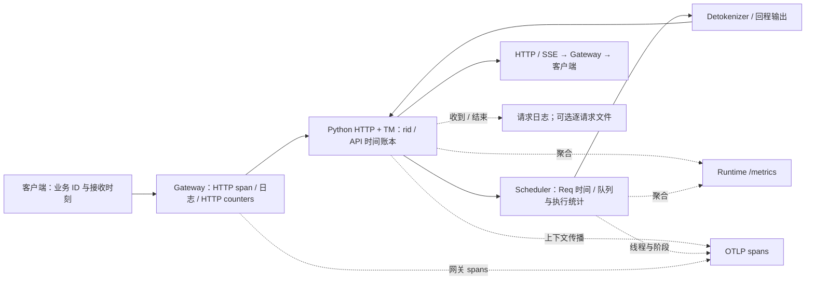
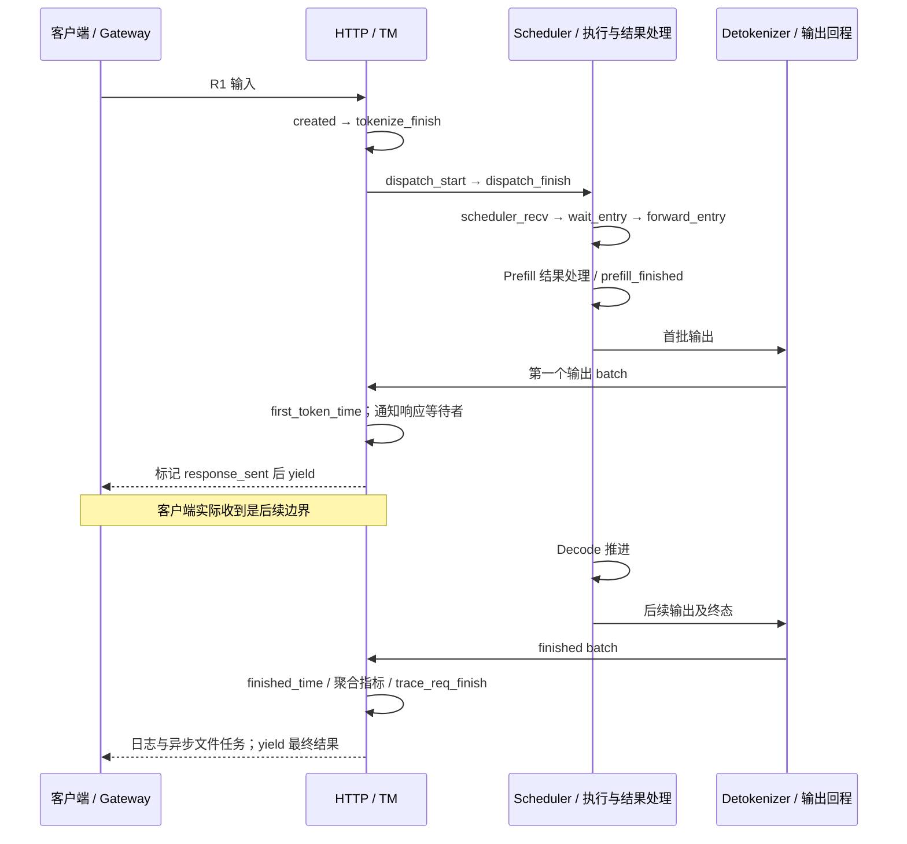
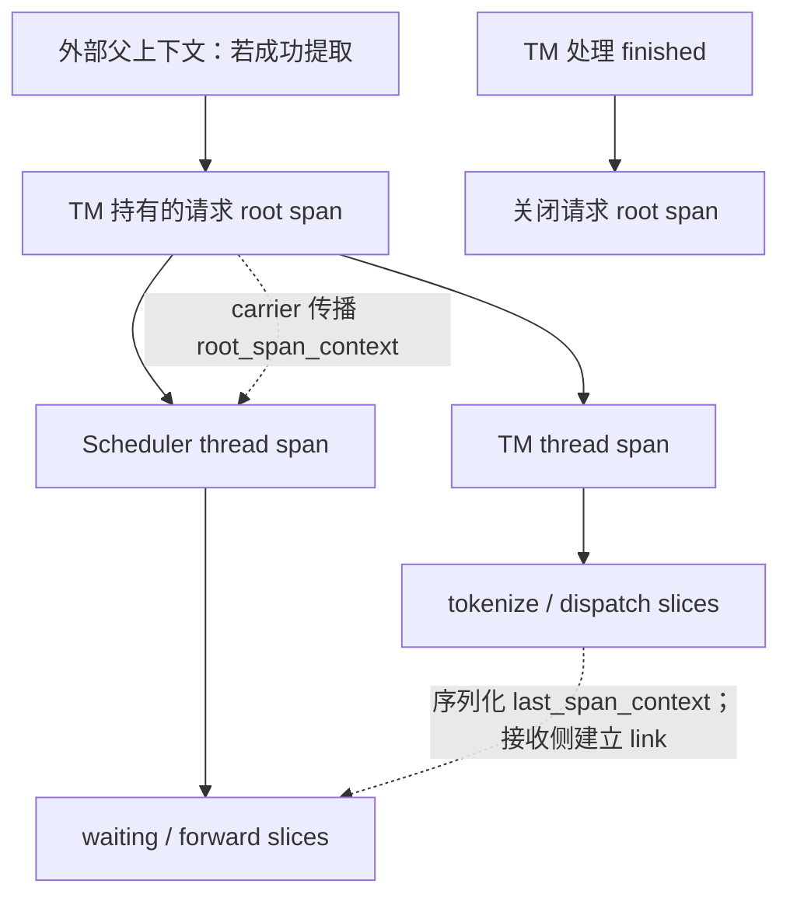

# Metrics、日志与 Trace 关联

> **先建立架构心智模型：** [M11 · 网关服务治理与性能诊断全景](<../architecture/11-网关服务治理与性能诊断全景.md>)。先看职责、数据和生命周期，再回到本篇源码细节。

本文是源码分析型学习资料，面向已经能沿一条请求找到 TM、Scheduler 和输出通路的读者。本篇要解决的问题是：**看到“这条请求很慢”之后，怎样把时间、身份和状态对到同一条链路，而不把不同层的数字直接相减或相加。**

## 0. 阅读基线与范围

| 项目 | 内容 |
| --- | --- |
| 源码路径基准 | SGLang 仓库根目录 `.`；所有源码位置使用仓内相对路径 |
| 读取工作区 | `sglang-source-study` 独立 worktree，属于原 SGLang 仓的同一 Git 对象库 |
| 分支 | `codex/sglang-source-study-20260909`，基于官方 `main` |
| commit | `72d5c5bb73cadd7ffbf5114e5f81e29d36b6c61a` |
| 读取日期 | `2026-09-10` |
| 工作区状态 | 源码 worktree 干净；原源码工作区与 Wiki 原有资料保留 |
| 主线 | 普通 HTTP Gateway → Python 原生 /generate → 单 TM → Normal Scheduler → Detokenizer/TM → HTTP/SSE；普通文本、单请求、n=1、TP/PP/DP 均为 1 |
| 观测前提 | 分别启用 Metrics、请求日志与 Trace；采用默认 collector 和同步 TraceReqContext 路径，SGLANG_TRACE_ASYNC=False |
| 扩展边界 | 对照 P/D 传输指标、rank 与标签；不展开 Rust/gRPC 内部观测、异步 Trace exporter、私有 collector、全部 GPU profiler 和外部存储平台 |
| 操作边界 | 静态阅读与文档检查；未安装依赖、启动服务、运行项目测试、抓取真实指标或连接 OTLP 服务 |

前置阅读：[02-05 输出通路](../02-request-lifecycle/05-Detokenizer与流式输出.md)、[10-02 协议边界](02-HTTPgRPC与Rust服务边界.md)、[10-03 健康与生命周期](03-健康检查超时限流与优雅退出.md)。P/D 传输需要阶段 07 的对象和退役知识。

下文代码行为是**源码事实**；图、时间账本与排查顺序是**整理者归纳**。Prometheus 分布统计原则另核对[官方 Histograms and summaries](https://prometheus.io/docs/practices/histograms/)（读取于 2026-09-10）。没有运行观察；官方页面不替代本基线的指标声明和调用位置。

## 1. 先把三种观测工具放回各自位置

### 1.1 人话版：总账、流水和流程时间线

Metrics 像总账：最近多少请求、等待队列多长、首输出延迟分布怎样。日志像流水：某次收到什么请求、在哪个分支报错、最后返回什么。Trace 像带层次的时间线：同一上下文经过哪些线程和阶段，每段何时开始、何时结束。

总账中的一个桶通常装着很多请求，不保留每个请求的完整身份；一条日志也不会自动拥有所有阶段的耗时。Trace 上出现一个 span，只能说明对应观测代码建立了这段记录，不能直接证明 GPU 已同步完成或 KV 已可复用。

| 术语 | 人话解释 | 本篇要守住的边界 |
| --- | --- | --- |
| Counter | 累加发生次数或处理量 | 请求结束时加的 token 数与每轮处理量不同 |
| Gauge | 某次更新时的状态值 | scrape 时读到的是最近一次上报值 |
| Histogram | 按区间统计观测值的分布 | 桶不是逐请求明细；分位数受桶和聚合口径影响 |
| label | 给一组时间序列附上的维度 | model、角色、rank 与 rid 的用途不同 |
| rid | Runtime 查找请求状态的键 | 不自动等于 Gateway 请求头中的 ID |
| Trace ID / Span ID | 一条跟踪链 / 其中一段的身份 | 与业务 rid 分开记录；父子关系和 link 也不同 |
| OTLP | 向观测后端导出遥测数据的协议 | exporter 初始化成功不等于后端已经持久化 |
| monotonic / wall time | 适合量时长的计时轴 / 日历时间轴 | 原始 perf_counter 不能当 Unix 时间戳 |

### 1.2 哪个组件拥有哪份记录



**图意解读：** 实线是教学主线中的请求与结果方向，虚线是观测数据。图中同一个 OTLP 方框表示观测出口类别，不承诺两套 exporter 实际使用同一后端。Runtime /metrics 通过多进程 collector 汇总 Python 进程侧数据；Gateway 的 Rust HTTP 指标有自己的记录位置。[S3] [S6] [S31] [S32] [S33] [S58] [S76] [S59]

指标、日志和 Trace 都是附着在控制流上的观察者。请求队列、输出 event、span 栈和文件锁分别由各自对象管理，不存在一个“打开 observability 就接管所有生命周期”的总开关。

## 2. 先统一身份：三个 ID 要建立映射

### 2.1 Gateway 的请求 ID 在哪里生成

RequestIdMiddleware 依次检查配置的请求头，采用第一个可转为文本的值；没有则按路由生成 ID。默认候选包括 x-request-id、x-correlation-id、x-trace-id、request-id。它把 ID 放进 request extensions，随后把同一个值写进**响应**的 x-request-id。[S51] [S78]

build_app 的层次让请求先经过 RequestIdLayer，再进入 HTTP 日志层；RequestLogger 从 extensions 取 ID 写入 span 的 request_id。需要注意，源码注释里有些旧的 Service 名称，实际行为应以这两个实现为准。[S52] [S53]

关键片段如下，省略了选取 ID 和错误处理：

```rust
// sgl-model-gateway/src/middleware.rs
req.extensions_mut().insert(RequestId(request_id.clone()));
let future = self.inner.call(req);
// await 之后，ID 写入 response.headers_mut()
```

这里没有把**新生成的** ID 填入转发请求头，也没有改写 JSON 的 rid。普通 HTTP router 使用请求头副本和 typed request 构造下游请求；允许转发的头包含 x-request-id、x-correlation-id、traceparent、tracestate 等，但白名单不会凭空补出某个头。[S51] [S55] [S77]

因此可以出现：Gateway 生成了 G1，响应头可见 G1，但 Runtime 只知道自己生成的 R1。排查时不能默认在 Runtime 日志里搜索 G1 一定有结果。若入口采用某个自定义请求头，还要核对它是否被转发以及是否被日志白名单保留。

### 2.2 Runtime rid 与 traceparent 各走一条路径

TM.generate_request 先 normalize，再初始化请求状态。原生 GenerateReqInput 在单请求没有 rid 时生成 UUID；_init_req_state 用 rid 建立 rid_to_state，并拒绝重复的活动 ID。[S1] [S2] [S3]

Trace 则优先读取 obj.external_trace_header；未提供时，才在 enable_trace 条件下从真实 HTTP request 提取 trace headers。TraceReqContext.trace_req_start 从该 carrier 提取父上下文，再建立请求 root span。它不把 traceparent 的 Trace ID 当作 rid。[S2] [S62] [S36]

还有一个易漏细节：本基线的请求 span 属性 rid 使用 `self.rid.split("_")[-1]`，span 名又只展示该结果的前 8 个字符。教学例子 `team_R1` 在该属性中可能成为 `R1`；完整 Runtime rid 应从请求/响应和日志另存，不能只靠 span 的短名字做唯一匹配。[S36]

| 身份 | 从哪里取得 | 用来关联什么 | 需另存什么 |
| --- | --- | --- | --- |
| 调用方业务 ID | 调用记录 | 同一业务动作及重试关系 | 每次 HTTP 调用、attempt 与时间 |
| Gateway request_id | 请求头选取或生成；响应 x-request-id | Gateway 日志 / HTTP span | 实际转发头、worker、attempt |
| Runtime rid | 归一化输入、响应 meta_info.id | TM ReqState、Scheduler Req、请求日志 | 实例身份和完整字符串 |
| Trace ID + Span ID | OTLP 上下文/后端 | 父子 span 与跨线程 link | service、host、线程、rank、时间 |
| bootstrap_room | P/D 专属配对信息 | 跨 P/D 的传输任务对照 | P/D 实例、rid 与传输状态 |

上述字段是**关联清单**，不是一组保证自动齐全的响应字段。普通输出的 meta_info.id 在 TM 处理 batch 时明确赋为 rid；其他映射须由所在层证据补齐。[S6]

### 2.3 Gateway Trace 到 Runtime 的可见边界

普通 HTTP router 在发送前向请求头副本注入当前 Gateway span 的上下文；Python 再按前述过程提取，形成一条可检查的 Gateway → Runtime 传播链。[S56] [S57] [S2]

这段代码证明了向下游注入的路径，不能据此声称“调用方外部 Trace 一定原样贯穿 Gateway”。本篇阅读的 RequestSpan/RequestLogger 和注入函数没有展示从调用方 carrier 设置 Gateway span parent 的步骤。验收时必须分别比对客户端、Gateway、Runtime 的 Trace ID 和 parent，而不是只确认 traceparent 头存在。

同理，重试可能使一个 Gateway 请求对应多个下游执行尝试。记录 worker 与 attempt 后再做映射；重试条件和流终态见 10-03，不把 ID 相同解释为只执行过一次。

## 3. R1 的时间账本：每个时钟从哪里开始

### 3.1 TM 起点并非网络接收的最早一刻

APIServerReqTimeStats.set_created_time 接受传入 ts；未传入有效值则读 perf_counter。TM 传给它的是 obj.received_time。对未设置此字段的原生请求，起点落在 _init_req_state，已经晚于请求解析与 normalize；其他前端若显式带入时间，应重新核对那条入口。[S9] [S2] [S3] [S50]

普通主线依次发生：

1. _tokenize_one_request 将 API time_stats 挂到 tokenized_obj，记录 tokenize 完成。
2. _send_one_request 记录 dispatch 开始和结束。
3. Scheduler 创建 Req，从传来的账本生成 SchedulerReqTimeStats，并绑定本地 metrics collector，记录 scheduler_recv_time。
4. 请求进入等待队列时记录 wait_queue_entry_time；选入首次 forward 前记录 forward_entry_time。
5. 结果处理器在消费 Prefill/Decode 结果时设置对应完成时刻，再经输出通路返回 TM。
6. TM 收到第一个输出 batch 时记录 first_token_time；看到请求 finished 时记录 finished_time、e2e_latency，并唤醒输出等待者。[S4] [S5] [S15] [S63] [S16] [S17] [S22] [S23] [S6]

这里的“Prefill 完成”是**结果处理代码设置时间戳的主机侧边界**。一次 forward 的区间还受调用位置、分块与结果处理方式影响；要研究 GPU kernel 的实际持续时间，应进入阶段 11 的 profiler 主线。

### 3.2 一张时序图看清首输出和客户端接收



**图意解读：** 这是代表主线的顺序图，省略了队列与进程间消息细节。TM 首输出先于响应生成器恢复；response_sent_to_client_time 在第一次准备 yield 时写入，既不是 TCP ACK，也不是客户端收到文本的时间。Trace 请求 root 在 TM 处理 finished 时结束，仍早于后续响应提交和网络传送。[S6] [S7] [S9] [S41]

### 3.3 用同一组教学数字算一遍

设 R1 输入 8 个 token、最终输出 3 个、无缓存命中。下面使用**相对 TM created 的毫秒数**；不是给源码传入 ts=0，也不是实测。为展示合并输出，假设 TM 收到的两个 batch 分别携带累计 1 和 3 个 completion token。

| 事件 | 相对时刻 | 所有者 / 字段 |
| --- | ---: | --- |
| 请求状态建立 | 0 ms | TM created_time |
| 预处理完成 | 15 ms | TM tokenize_finish_time |
| dispatch 结束 | 20 ms | TM api_server_dispatch_finish_time |
| Scheduler 接收 / 入等待队列 | 25 / 40 ms | scheduler_recv_time / wait_queue_entry_time |
| 首次进入 forward / Prefill 结果处理 | 100 / 200 ms | forward_entry_time / prefill_finished_time |
| TM 收到首个输出 batch | 210 ms | first_token_time；累计 completion_tokens=1 |
| TM 第一次准备 yield / 客户端收到首输出 | 220 / 230 ms | response_sent 标记 / 客户端自己的计时 |
| TM 收到最终 batch | 410 ms | finished_time；累计 completion_tokens=3 |
| 最终 yield / 客户端收到最终结果 | 420 / 440 ms | 响应生成器 / 客户端自己的计时 |

由实现定义得到：

| 量 | 本例 | 实际含义 |
| --- | ---: | --- |
| Scheduler queue_time | 100 − 40 = 60 ms | 首次 forward 与等待入口之间 |
| TM TTFT | 210 − 0 = 210 ms | 到首个回程输出 batch |
| TM E2E | 410 − 0 = 410 ms | 到 TM 处理请求终态 |
| 首次 yield 标记 | 220 ms | 一次性记录，最终输出时仍保留这个值 |
| API 账本 decode_latency | 410 − 210 = 200 ms | 首输出到终态的 TM 区间 |
| decode_throughput | (3 − 1) / 0.2 = 10 token/s | 仅在 decode_latency>0 且输出 token>1 时给出 |
| 本次新增 token 的平均 ITL | 200 / 2 = 100 ms | 一次接收间隔被分摊到两个新 token |

这些定义来自 [S9] [S17] [S20] [S8] [S27]。客户端的首输出和总完成时间应使用客户端自己的起点，不能把本表 TM 的 0 ms 直接当成客户端发请求的时间。

如果请求只有一个最终输出 batch，first_token_time 和 finished_time 会非常接近；这不证明模型生成后续 token 没有耗时。若只有一个 completion token，源码不会凭空计算一个后续 Decode 吞吐值。

### 3.4 跨进程传递：带过去的是账本和上下文

ReqTimeStatsBase 的序列化结果把 enable_metrics 设为 False，包含 Trace 上下文状态和时钟差；不会把本地 collector 当成跨进程共享对象。Scheduler Req 初始化再创建自己的账本并绑定 collector。[S11] [S12] [S10] [S15]

时间转换采用 `wall ≈ perf_counter + diff`，diff 来源于 time.time() − time.perf_counter()。接收方调整时间时使用：

```text
receiver_time = sender_time + old_diff - new_diff
```

例如旧差为 100、新差为 90、旧计时值为 5，则新值为 15；两边换算出的 wall 都是 105。这只是转换的教学算例，不是服务器时钟同步测试。[S13] [S14]

因此同进程耗时优先用单调时钟差；跨主机对时需要额外时钟证据。NTP 调整、转换精度和未建立的时间点都可能影响拼接。不要把日志中的日历时间、Trace 纳秒时间戳和 perf_counter 原始值混在一起相减。

## 4. Metrics：先看更新点，再读曲线

### 4.1 TM 的请求指标以哪个事件为准

TM 在 enable_metrics 且请求 log_metrics 为真时调用 collect_metrics。首次观测 TTFT 的分支排除 PREFILL 角色；后续按累计 completion_tokens 与 last_completion_tokens 的差计算新 token 数。请求结束时，再调用 observe_one_finished_request。[S6] [S8]

| 指标名称 | 类型 / 单位 | 更新口径与标签差异 |
| --- | --- | --- |
| sglang:time_to_first_token_seconds | Histogram / 秒 | TM 首输出；基础标签加 is_streaming |
| sglang:inter_token_latency_seconds | Histogram / 秒 | 接收间隔按新 token 数分摊；本基线声明没有 is_streaming 标签 |
| sglang:e2e_request_latency_seconds | Histogram / 秒 | TM finished − created；带 is_streaming |
| sglang:num_requests_total | Counter / 请求 | observe_one_finished_request 中加 1；带 is_streaming |
| sglang:prompt_tokens_total | Counter / token | 结束观测时加整条 prompt 数；带 is_streaming |
| sglang:generation_tokens_total | Counter / token | 结束观测时加累计 completion 数；带 is_streaming |
| sglang:cached_tokens_total | Counter / token | cache_source 区分来源；可回退为 total |
| sglang:num_aborted_requests_total | Counter / 调用观测 | TM 成功派发 AbortReq 后记录；不等同于逐一统计所有业务失败 |

声明和更新见 [S25] [S26] [S75]。num_requests_total 记录的是该“finished 观测”路径，不能不检查 finish_reason 就把它命名为“业务成功数”。abort_all 的一次操作也不能被解释为只影响一条请求。返回错误、进入 abort 路径、最终请求结束应各自保留证据。

在 R1 教学例子中，最终观测使 prompt 累计加 8、generation 加 3、request 加 1。若长请求尚未结束，这些**结束时累加的** token 指标尚未包含其最终量；它们和 Scheduler 的实时处理 counter 在短窗口里本来就可能不同。

### 4.2 合并输出会改变 ITL 的可解释性

关键计算如下，沿用源码中的参数名 `internval`（表示接收间隔）：

```python
# python/sglang/srt/observability/metrics_collector.py
adjusted_interval = internval / num_new_tokens
```

默认 Prometheus 实现将 histogram 的 sum 加上整个 interval，并将对应桶计数增加 num_new_tokens；注入 collector 的兼容分支则重复 observe(adjusted_interval)。两者都表达“给这批新增 token 分配同一个平均间隔”。[S27]

R1 的 200 ms 间隔、新增 2 个 token，会贡献两个 100 ms 观测，总时长贡献 200 ms。它**没有测量这两个 token 各自在客户端出现的准确时刻**。stream interval、输出合并、投机一次接受多个 token 都应写进实验条件；不能把不同条件的 ITL 分位数直接当作相同测量。

### 4.3 Scheduler 总账和请求账本不同

| 指标 | 对象 / 更新边界 | 解释限制 |
| --- | --- | --- |
| sglang:num_queue_reqs | Scheduler 队列状态 Gauge | 不是 Gateway 等待队列，也不是累计排队请求数 |
| sglang:num_running_reqs | Scheduler 运行请求 Gauge | 不等于 HTTP 活动连接数 |
| sglang:queue_time_seconds | 首次 forward 入口观测的 Histogram | 对应 wait_entry→forward_entry；回退重排不能直接套无回退例子 |
| sglang:per_stage_req_latency_seconds | 请求阶段 Histogram，带 stage | 仅对 metrics_is_observed=True 的阶段写入 |
| sglang:realtime_tokens_total | 按 mode 分类的处理 Counter | Decode 在 report_decode_stats 的每轮部分更新 |
| sglang:gen_throughput | Scheduler 周期统计 Gauge | 与请求结束时 token counter 的 rate 不是同一更新方法 |

指标声明见 [S29]；阶段选择和时间点见 [S73] [S16] [S17] [S18] [S19]；Decode 更新见 [S30]。report_decode_stats 先做每轮 token 计数，随后才检查 decode_log_interval 决定是否做周期日志和重型统计；不要仅凭指标说明中的“log interval”推断每个 counter 都只在打印日志时更新。

另一个反例：prefill_waiting 有 Trace 阶段，但 metrics_is_observed=False，因为 queue_time 已单独记录。decode_loop 的阶段配置也没有启用该 per-stage Histogram。**存在 span 名不等于 /metrics 必然存在同名 stage 行。**[S73]

### 4.4 rank、标签与 scrape：不要重复求和

TM 基础标签是 model_name 和 engine_type，可加 priority、允许的自定义标签与额外静态标签。Scheduler 标签另含 tp_rank、pp_rank、moe_ep_rank，条件满足时有 dp_rank。[S24] [S28]

Scheduler 的 current_scheduler_metrics_enabled 条件使用 `ps.attn_tp_rank == 0`，或显式启用所有 scheduler 的观测。不能仅把“统计 rank”理解成所有拓扑里固定的全局 TP0；也不能把这个 flag 的结论推广为每种请求 collector 都没有在其他 rank 创建。[S28] [S30]

学习时按顺序核对：

1. 指标由 TM 还是 Scheduler 写，统计单位是一条请求、一个副本还是一个 rank。
2. 标签中是否同时含“总计”和分项，例如 priority="" 的总计与 priority="1" 的子集。
3. 各 rank 是否重复观察同一请求，P/D 是否属于不同阶段。
4. 再确定聚合范围、scrape target 和时间窗口。

Python /metrics 使用 MultiProcessCollector；多进程目录需在导入 prometheus_client 前设置。抓到 /metrics 只能证明出口返回了数据，不能证明每个期望 writer 都在工作。Gauge 的更新节奏、进程退出和采集窗口应分别检查。[S31] [S32]

Histogram 的桶、sum、count 可以按一致维度组合；各实例已经算出的 P99 不能简单平均成全局 P99。解释本基线的经典 Histogram 时应保留桶边界和筛选条件，先核对样本再计算分位数。[Prometheus 官方说明](https://prometheus.io/docs/practices/histograms/)

## 5. Trace：上下文、线程和 span 怎么连起来

### 5.1 开启后还需要经过几道门

enable_metrics、log_requests 和 enable_trace 分别控制不同路径。本篇选择 SGLANG_TRACE_ASYNC=False；这个环境字段默认就是 False。True 会进入另一套异步导出实现，不把本文同步对象的细节照搬过去。[S60] [S61] [S33]

Python HTTP lifespan 和 run_scheduler_process 分别执行本进程的 process_tracing_init，并登记 Tokenizer 或 Scheduler 线程信息；Scheduler 额外带入 rank。[S79] [S80]

Trace 还要求进程完成 process_tracing_init、依赖可用、全局 level>0，且显式命名的 module 通过 trace_modules 过滤。ReqTimeStats 初始化使用 request 模块；更细的 slice 还会按 level 过滤。[S2] [S35] [S40]

Python exporter 根据 OTEL_EXPORTER_OTLP_TRACES_PROTOCOL 选择 grpc 或 http/protobuf，默认 grpc；不支持的值会报错。初始化使用 BatchSpanProcessor，批量导出存在排队和后端接收边界。本篇没有验证丢失率、采样策略或持久化结果。[S34] [S33]

Gateway 另有自己的 enable 和 OTLP gRPC exporter，service.name 为 smg。Python 与 Gateway 配置不可当作同一个进程变量处理。[S58]

### 5.2 上下文跨进程，root span 的所有权不跨进程



**图意解读：** 实线向下表示 parent 关系，虚线区分上下文传播和 span link；不是把 TM 的可变 span 对象交给 Scheduler 共同操作。Thread span 会带 host_id、线程标签、pid 以及可用 rank 属性；这里 pid 实际来自 threading.get_native_id，应按线程身份理解。[S72] [S37] [S38] [S39] [S40]

TraceReqContext.__getstate__ 将 root_span_context 注入 carrier，并把当前或最近 span 的 span_id/trace_id 保存为 last_span_context。接收方恢复上下文、标为 is_copy，重建自己的线程 span；root_span 本体不会在另一进程恢复成同一个可结束对象。[S37] [S38] [S39]

当接收侧第一个 slice 没有嵌套父 slice 时，可将 last_span_context 加为 link；嵌套 slice 则使用当前栈顶作为 parent。**同 Trace ID、父子关系和因果 link 是三件需要分别读的事。**[S40]

TM 请求完成时关闭未结束的线程记录和 root span；这是观测对象的收尾，不是跨 rank KV 安全回收的证明。[S41] [S9]

### 5.3 span 名字很像指标，也要重新读区间

APIServerReqTimeStats 的 GenAI 属性将 finished−dispatch_finish 标为 IN_MODEL_INFERENCE，将 first_token−dispatch_finish 标为 IN_MODEL_PREFILL。这是 host 侧两个事件的差值；其中可能包含排队、IPC、结果回程等，不等同于只包住 GPU kernel 的计时器。[S9]

同理，在普通主线中 prefill_forward 是首次 forward 入口到 Prefill 结果处理；分块、重叠、P/D、回退会增加或改变阶段。先固定模式，再把每个 span 的 begin/end 函数写出来，才能读时间线。

## 6. 日志与逐请求文件：怎样留下关联证据

### 6.1 请求日志的字段由级别和白名单决定

TM 在完成 normalize 和状态初始化后调用 log_received_request；输出生成器处理最终结果时调用 log_finished_request。JSON 格式包含 rid、处理后的 obj，完成日志还包含 out。[S3] [S42] [S43]

_compute_metadata 决定截断长度与跳过字段。例如 level=0 排除输入文本、输入 IDs、媒体及输出文本等内容，保留用于定位的其他字段；不能看到日志里没有文本就断言请求没有输入。[S44]

请求头只从白名单提取。默认白名单含 x-smg-routing-key，可通过 SGLANG_LOG_REQUEST_HEADERS 扩展；**并不默认完整记录 x-request-id 和 traceparent**。若需要把 G1、R1 和 Trace 上下文放入一份证据，必须检查实际白名单和转发路径。[S45] [S55]

完成日志另受 SGLANG_LOG_REQUEST_EXCEEDED_MS 门限影响：低于设定耗时的完成记录可被跳过。这会造成“收到日志多、完成日志少”的合理情况；先检查开关和阈值，再判断丢请求。[S43]

### 6.2 文件 exporter 是另一条异步记录路径

export_metrics_to_file 启用默认文件 exporter，目录由 export_metrics_to_file_dir 指定。它把请求参数整理成 **JSON 字符串** request_parameters，再和输出 meta_info 合成外层 JSON；媒体和 input_embeds 等字段固定排除。[S49] [S46]

例如读取一行后，外层 record["request_parameters"] 仍是字符串，需要再做一次 JSON 解码才能按键取 rid。它不是 Prometheus 的 scrape 快照，也不是请求日志的同一 schema。

文件按小时命名为 `sglang-request-metrics-YYYYMMDD_HH.log`，每行一个外层 JSON；异步锁保护当前文件与写入，写任务在线程里 dump、换行、flush。包含健康检查前缀的字符串 rid 会被跳过，异常会记录日志。[S48] [S47]

TM 用 asyncio.create_task 启动该写记录动作，没有在返回响应前 await 持久化完成。于是“客户端成功收到结果”和“本地文件中已存在完整记录”是两个验收点；文件写失败不会自动改写已生成的模型结果。[S7] [S47]

### 6.3 一次请求建议保留的最小字段清单

| 层次 | 需要的字段 | 缺失时先查哪里 |
| --- | --- | --- |
| 客户端 | 业务 ID、每次调用起止、首输出、终态、原始响应头 | 客户端记录；不能用服务器时间补造 |
| Gateway | request_id、路由、worker/attempt、HTTP status/error、span | 请求头选取、日志层、router 发送事件 |
| TM | 完整 rid、model、stream、prompt/completion/cached 数、finish_reason | 请求日志级别、meta_info、finished 路径 |
| TM 时间 | request_received_ts、api_server_dispatch_finish_ts、response_sent_to_client_ts、request_finished_ts、e2e_latency | enable_metrics 与字段是否已设置；一次性 response_sent 标记 |
| Scheduler | queue_time、forward_entry_time、prefill_finished_time、retraction、role/rank | 时间设置点、输出 meta、指标标签 |
| Trace | Trace ID、Span ID、parent/link、service/host/thread/rank、level/module | 初始化、carrier、过滤和 exporter |
| P/D 扩展 | bootstrap_room、传输字节、传输时长来源、P/D 各自 rid 与状态 | transfer_metric 和 P/D 队列时间点 |
| 证据位置 | 日志/逐请求行/trace 的定位符、源码 commit、配置、采集时区 | 逐请求文件与附录 A05 模板 |

这是一张采集设计表。TM 时间字段、Scheduler 输出字段和 Trace 元数据不是每种 API 自动全量输出的统一协议；本篇已验证的原生路径见 [S6] [S7] [S9] [S20]。OpenAI/Rust/gRPC 要回到 10-02 核对适配过程。

## 7. 只增加一个变化：P/D 传输指标怎么读

普通主线里没有跨实例 KV 传输。本节仅对照 SchedulerReqTimeStats.compute_and_observe_kv_transfer_metrics 的计算口径，不重讲传输协议。[S21]

它首先要求 transfer_total_bytes；有明确 transfer_latency_s 就使用该值，否则回退到 completion_time−prefill_transfer_queue_entry_time，且两个时间点必须已设置。源码明确提示，回退区间只捕捉最后一个 chunk 的时间。不能因此把“整条请求字节数 / 最后块区间”直接当成全程带宽。[S21]

| 输出量 | 本基线计算 | 解释时必须保留 |
| --- | --- | --- |
| latency_ms | transfer_latency_s × 1000 | 时长来自 backend 还是时间点回退 |
| total_mb | bytes / 1024² | 虽命名 MB，除数对应二进制 MiB |
| speed_gb_s | total_mb / 1024 / seconds | 数值对应 GiB/s 的换算 |
| bootstrap_ms | bootstrap_done − bootstrap_queue_entry | 相关时间点需有效 |
| alloc_ms | 优先采用明确 alloc_latency_s；否则取等待入口与 bootstrap_done 的非负差 | 不能无条件称为底层内存分配耗时 |

教学例子：传输 1,073,741,824 byte、明确传输耗时 0.25 s，得到 1024 的 total_mb 和 4 的 speed_gb_s。先写出分母和单位，再解释效率；没有 RDMA 测量，不能把例子写成硬件带宽结果。[S21]

同一 P/D 请求还可能分别有 P、D 的 API 时间与请求 span。PREFILL 角色在 TM TTFT 分支被排除，不代表所有指标都不记录；也不能把 P 与 D 的 E2E 相加就得到客户端总耗时。[S8] [S36]

## 8. 从现象回到对象边界

| 现象 | 优先检查 | 尚不能直接得出的结论 |
| --- | --- | --- |
| Gateway 有 G1，Runtime 搜不到 | 原请求是否带 ID；转发与日志白名单；Runtime rid | Runtime 没收到请求 |
| Trace root 名看似重复 | 完整 rid、下划线切分、Trace ID、实例 | 两条请求是同一请求 |
| 客户端 TTFT 高于 TM TTFT | 客户端起点、网关排队、响应等待与网络 | 模型指标计算错误 |
| non-stream 的 TTFT 近似 E2E | TM 首次输出 batch 的到达时刻 | Decode 计算没有耗时 |
| ITL 很平滑，但客户端输出成串 | 每批新 token 数、stream interval、输出合并 | GPU 每个 token 都均匀完成 |
| 请求仍生成，generation_tokens_total 暂不增长 | 是否等待 finished 观测；Scheduler realtime counter | 模型已停止 |
| Trace 有 waiting，per-stage Histogram 没该 stage | RequestStage.metrics_is_observed 和独立 queue_time | Trace 或 Metrics 丢数据 |
| 所有 rank 求和后请求翻倍 | 指标写入者、rank 复制、priority 总计与分项 | 业务流量翻倍 |
| 完成日志缺行 | log_requests、耗时门限、目标与级别 | 每条缺行都是请求失败 |
| 响应成功但逐请求文件缺行 | exporter 配置、健康过滤、后台任务与写异常 | 模型结果必然不完整 |
| 传输速度异常高 | 字节范围、分母来源、最后 chunk 回退、二进制单位 | 网络超过物理峰值 |
| Gateway 日志 finished 很早 | ResponseLogger 在 Response 回调记录；body 仍可流式传输 | 客户端已收到完整回答 |

最后一行尤其容易误读：Gateway ResponseLogger 在 on_response 填 status_code 和 latency（微秒整数）并记录“finished processing request”；这里不是读取 SSE body 至 EOF 的专属完成点。smg_http_responses_total 也在此回调记录状态。应继续核对 body 终态，详见 10-03。[S54] [S59]

排查顺序建议是：**先对身份，再对时间边界，再对 writer 和开关，最后比较数值。** 这四步是基于本篇控制流整理出的阅读方法，不是额外添加的运行组件。

## 9. 回源码时按职责分段阅读

下表路径全部相对于 SGLang 仓库根目录。每个链接固定本篇 commit，可用符号名回到本地定位；表格用于导航，不替代前面的调用和数据流解释。

| 要追的问题 | 源码文件 / 符号 |
| --- | --- |
| 请求身份从哪里开始 | python/sglang/srt/managers/io_struct.py 的 GenerateReqInput.normalize_batch_and_arguments [S1]；python/sglang/srt/managers/tokenizer_manager.py 的 generate_request / _init_req_state [S3] [S2] |
| HTTP 与预处理/发送 | python/sglang/srt/entrypoints/http_server.py 的 generate_request [S50]；python/sglang/srt/managers/tokenizer_manager.py 的 _tokenize_one_request / _send_one_request [S4] [S5] |
| API 输出和指标时点 | python/sglang/srt/managers/tokenizer_manager.py 的 _handle_batch_output / _stream_one_response / collect_metrics / abort_request [S6] [S7] [S8] [S75] |
| 账本转换与时钟 | python/sglang/srt/observability/req_time_stats.py 的 APIServerReqTimeStats、ReqTimeStatsBase 及转换函数 [S9] [S10] [S11] [S12] [S13] [S14] |
| 请求建立和进入执行 | python/sglang/srt/managers/schedule_batch.py 的 Req.__init__ [S15]；python/sglang/srt/managers/scheduler.py 的 _add_request_to_queue / run_batch [S63] [S74] |
| 队列、Prefill、Decode | python/sglang/srt/observability/req_time_stats.py 的 SchedulerReqTimeStats 各时间 setter 与输出转换 [S16] [S17] [S18] [S19] [S20]；RequestStage [S73] |
| 结果时间写入者 | python/sglang/srt/managers/scheduler_components/batch_result_processor.py 的 process_batch_result_prefill / process_batch_result_decode [S22] [S23] |
| Collector 构造与更新 | python/sglang/srt/observability/metrics_collector.py 的 TokenizerMetricsCollector / SchedulerMetricsCollector [S25] [S26] [S27] [S28] [S29]；TM 初始化 [S24] |
| 周期报告和出口 | python/sglang/srt/managers/scheduler_components/metrics_reporter.py 的 report_decode_stats [S30]；python/sglang/srt/utils/common.py 的 multiprocess 设置和挂载 [S31] [S32] |
| Trace 初始化与请求 | python/sglang/srt/observability/trace.py 的 process_tracing_init / exporter / TraceReqContext [S33] [S34] [S35] [S36] [S62] |
| Trace 跨进程与线程 | 同文件的 __getstate__ / __setstate__ / rebuild_thread_context / trace_slice_start / trace_req_finish / __create_thread_context [S37] [S38] [S39] [S40] [S41] [S72] |
| 日志与文件明细 | python/sglang/srt/utils/request_logger.py [S42] [S43] [S44] [S45]；python/sglang/srt/observability/request_metrics_exporter.py [S46] [S47] [S48] [S49] |
| 开关声明 | python/sglang/srt/arg_groups/fields/observability.py 的 Observability [S60]；python/sglang/srt/environ.py 的 SGLANG_TRACE_ASYNC [S61] |
| Gateway 身份与 HTTP 记录 | sgl-model-gateway/src/middleware.rs [S51] [S53] [S54]；sgl-model-gateway/src/server.rs 的 build_app / startup [S52] [S78]；sgl-model-gateway/src/observability/metrics.rs [S76] [S59] |
| Gateway 下游上下文 | sgl-model-gateway/src/routers/header_utils.rs [S55]；sgl-model-gateway/src/routers/http/router.rs [S56] [S77]；sgl-model-gateway/src/observability/otel_trace.rs [S57] [S58] |
| P/D 计算口径 | python/sglang/srt/observability/req_time_stats.py 的 compute_and_observe_kv_transfer_metrics [S21] |

同文件中的后续符号沿用所在行给出的完整仓内相对路径，定位时以固定链接为准。

## 10. 练习、测试入口与本篇验收

### 10.1 不需要运行模型的练习

1. Gateway 生成 G1，原请求没有 x-request-id，Runtime 自行生成 R1。写出要补齐的证据，解释为何不能只 grep G1。
2. 根据 R1 账本计算 queue_time、TTFT、E2E、Decode 吞吐和 ITL 的样本数；说明 440 ms 不能替代 TM finished_time。
3. 一个指标分 priority="" 和 priority="1"，另一个在四个 TP rank 上都记录。聚合前分别要问什么？
4. Trace 中 prefill_waiting 存在，但 per_stage Histogram 没有它。回到 RequestStage 给出解释。
5. 文件 exporter 的 write_record 报错，模型响应已 yield。能够证明什么、还缺少什么？

**答案要点：** 题 1 要补 Gateway 头/worker/attempt 与 Runtime 完整 rid 的映射，不能假定 middleware 新 ID 会写入下游头。题 2 分别为 60、210、410 ms，10 token/s，两个 100 ms ITL 样本；客户端接收另有边界。题 3 先排除总计与子集、各 rank 重复样本。题 4 该阶段的 metrics_is_observed=False 且 queue_time 单独记录。题 5 文件出口失败不等于模型执行失败，需核对任务、文件、客户端终态各自证据。

### 10.2 已有测试只是阅读入口

| 测试文件 | 已阅读用例 | 覆盖意图 / 当前边界 |
| --- | --- | --- |
| test/registered/unit/observability/test_trace.py | test_full_lifecycle [S64] | root/slice 开始结束及栈变化；不证明真实 collector 接收 |
| 同上 | test_setstate_with_last_span_context [S65] | 序列化恢复最近 span 上下文；不等于跨主机时钟验证 |
| 同上 | test_module_filtering [S66] | 显式模块过滤与空模块行为 |
| test/registered/unit/observability/test_request_metrics_exporter.py | test_write_record [S67] | 一行 JSON、request_parameters 与 meta 字段 |
| 同上 | test_write_record_skips_health_check [S68] | 健康检查 rid 不生成文件 |
| 同上 | test_write_record_exception [S71] | 写入异常捕获；不证明异常下文件内容完整 |
| test/registered/observability/test_metrics.py | test_metrics_1gpu [S69] | 启动服务并检查观测出口的集成入口 |
| 同上 | test_metrics_2gpu [S70] | DP attention 的额外统计入口；源码在 CI 条件下可提前跳过 |

以上八个定义均仅静态阅读，**本次没有运行**。若以后在隔离环境验证，应先记录模型、硬件、配置、stream 条件、采集窗口与 exporter 后端，再保存请求/响应、Metrics、日志和 Trace 的原始定位符；采集与比对步骤也未在本次执行。

### 10.3 本篇完成到哪里

本篇完成了普通 HTTP 主线的身份映射、API/Scheduler 时间设置与输出顺序、Metrics 更新与标签、同步 Trace 上下文传播、日志与文件导出，以及 P/D 传输口径的静态对照。R1 时间、ITL 权重、时钟转换与二进制单位是独立教学账本，不是基准测试。

检查包含固定源码锚点、Markdown 层级、表格、相对文档链接、图文静态一致性和既有文件保留。Mermaid 未渲染；没有测得采集开销、Trace 完整率、跨主机对时误差或生产行为。

上一篇：[10-03《健康检查、超时、限流与优雅退出》](03-健康检查超时限流与优雅退出.md)。

下一篇：[10-05《权重更新、暂停恢复与 RL 接口》](05-权重更新暂停恢复与RL接口.md)，追踪观测到的请求与权重版本怎样在在线更新期间保持一致。

[S1]: https://github.com/sgl-project/sglang/blob/72d5c5bb73cadd7ffbf5114e5f81e29d36b6c61a/python/sglang/srt/managers/io_struct.py#L378
[S2]: https://github.com/sgl-project/sglang/blob/72d5c5bb73cadd7ffbf5114e5f81e29d36b6c61a/python/sglang/srt/managers/tokenizer_manager.py#L3463
[S3]: https://github.com/sgl-project/sglang/blob/72d5c5bb73cadd7ffbf5114e5f81e29d36b6c61a/python/sglang/srt/managers/tokenizer_manager.py#L776
[S4]: https://github.com/sgl-project/sglang/blob/72d5c5bb73cadd7ffbf5114e5f81e29d36b6c61a/python/sglang/srt/managers/tokenizer_manager.py#L970
[S5]: https://github.com/sgl-project/sglang/blob/72d5c5bb73cadd7ffbf5114e5f81e29d36b6c61a/python/sglang/srt/managers/tokenizer_manager.py#L1577
[S6]: https://github.com/sgl-project/sglang/blob/72d5c5bb73cadd7ffbf5114e5f81e29d36b6c61a/python/sglang/srt/managers/tokenizer_manager.py#L2240
[S7]: https://github.com/sgl-project/sglang/blob/72d5c5bb73cadd7ffbf5114e5f81e29d36b6c61a/python/sglang/srt/managers/tokenizer_manager.py#L1740
[S8]: https://github.com/sgl-project/sglang/blob/72d5c5bb73cadd7ffbf5114e5f81e29d36b6c61a/python/sglang/srt/managers/tokenizer_manager.py#L2927
[S9]: https://github.com/sgl-project/sglang/blob/72d5c5bb73cadd7ffbf5114e5f81e29d36b6c61a/python/sglang/srt/observability/req_time_stats.py#L382
[S10]: https://github.com/sgl-project/sglang/blob/72d5c5bb73cadd7ffbf5114e5f81e29d36b6c61a/python/sglang/srt/observability/req_time_stats.py#L245
[S11]: https://github.com/sgl-project/sglang/blob/72d5c5bb73cadd7ffbf5114e5f81e29d36b6c61a/python/sglang/srt/observability/req_time_stats.py#L330
[S12]: https://github.com/sgl-project/sglang/blob/72d5c5bb73cadd7ffbf5114e5f81e29d36b6c61a/python/sglang/srt/observability/req_time_stats.py#L345
[S13]: https://github.com/sgl-project/sglang/blob/72d5c5bb73cadd7ffbf5114e5f81e29d36b6c61a/python/sglang/srt/observability/req_time_stats.py#L59
[S14]: https://github.com/sgl-project/sglang/blob/72d5c5bb73cadd7ffbf5114e5f81e29d36b6c61a/python/sglang/srt/observability/req_time_stats.py#L80
[S15]: https://github.com/sgl-project/sglang/blob/72d5c5bb73cadd7ffbf5114e5f81e29d36b6c61a/python/sglang/srt/managers/schedule_batch.py#L928
[S16]: https://github.com/sgl-project/sglang/blob/72d5c5bb73cadd7ffbf5114e5f81e29d36b6c61a/python/sglang/srt/observability/req_time_stats.py#L744
[S17]: https://github.com/sgl-project/sglang/blob/72d5c5bb73cadd7ffbf5114e5f81e29d36b6c61a/python/sglang/srt/observability/req_time_stats.py#L765
[S18]: https://github.com/sgl-project/sglang/blob/72d5c5bb73cadd7ffbf5114e5f81e29d36b6c61a/python/sglang/srt/observability/req_time_stats.py#L811
[S19]: https://github.com/sgl-project/sglang/blob/72d5c5bb73cadd7ffbf5114e5f81e29d36b6c61a/python/sglang/srt/observability/req_time_stats.py#L854
[S20]: https://github.com/sgl-project/sglang/blob/72d5c5bb73cadd7ffbf5114e5f81e29d36b6c61a/python/sglang/srt/observability/req_time_stats.py#L1177
[S21]: https://github.com/sgl-project/sglang/blob/72d5c5bb73cadd7ffbf5114e5f81e29d36b6c61a/python/sglang/srt/observability/req_time_stats.py#L911
[S22]: https://github.com/sgl-project/sglang/blob/72d5c5bb73cadd7ffbf5114e5f81e29d36b6c61a/python/sglang/srt/managers/scheduler_components/batch_result_processor.py#L253
[S23]: https://github.com/sgl-project/sglang/blob/72d5c5bb73cadd7ffbf5114e5f81e29d36b6c61a/python/sglang/srt/managers/scheduler_components/batch_result_processor.py#L889
[S24]: https://github.com/sgl-project/sglang/blob/72d5c5bb73cadd7ffbf5114e5f81e29d36b6c61a/python/sglang/srt/managers/tokenizer_manager.py#L705
[S25]: https://github.com/sgl-project/sglang/blob/72d5c5bb73cadd7ffbf5114e5f81e29d36b6c61a/python/sglang/srt/observability/metrics_collector.py#L1526
[S26]: https://github.com/sgl-project/sglang/blob/72d5c5bb73cadd7ffbf5114e5f81e29d36b6c61a/python/sglang/srt/observability/metrics_collector.py#L1785
[S27]: https://github.com/sgl-project/sglang/blob/72d5c5bb73cadd7ffbf5114e5f81e29d36b6c61a/python/sglang/srt/observability/metrics_collector.py#L1868
[S28]: https://github.com/sgl-project/sglang/blob/72d5c5bb73cadd7ffbf5114e5f81e29d36b6c61a/python/sglang/srt/observability/metrics_collector.py#L1101
[S29]: https://github.com/sgl-project/sglang/blob/72d5c5bb73cadd7ffbf5114e5f81e29d36b6c61a/python/sglang/srt/observability/metrics_collector.py#L250
[S30]: https://github.com/sgl-project/sglang/blob/72d5c5bb73cadd7ffbf5114e5f81e29d36b6c61a/python/sglang/srt/managers/scheduler_components/metrics_reporter.py#L824
[S31]: https://github.com/sgl-project/sglang/blob/72d5c5bb73cadd7ffbf5114e5f81e29d36b6c61a/python/sglang/srt/utils/common.py#L2599
[S32]: https://github.com/sgl-project/sglang/blob/72d5c5bb73cadd7ffbf5114e5f81e29d36b6c61a/python/sglang/srt/utils/common.py#L2617
[S33]: https://github.com/sgl-project/sglang/blob/72d5c5bb73cadd7ffbf5114e5f81e29d36b6c61a/python/sglang/srt/observability/trace.py#L210
[S34]: https://github.com/sgl-project/sglang/blob/72d5c5bb73cadd7ffbf5114e5f81e29d36b6c61a/python/sglang/srt/observability/trace.py#L269
[S35]: https://github.com/sgl-project/sglang/blob/72d5c5bb73cadd7ffbf5114e5f81e29d36b6c61a/python/sglang/srt/observability/trace.py#L313
[S36]: https://github.com/sgl-project/sglang/blob/72d5c5bb73cadd7ffbf5114e5f81e29d36b6c61a/python/sglang/srt/observability/trace.py#L534
[S37]: https://github.com/sgl-project/sglang/blob/72d5c5bb73cadd7ffbf5114e5f81e29d36b6c61a/python/sglang/srt/observability/trace.py#L406
[S38]: https://github.com/sgl-project/sglang/blob/72d5c5bb73cadd7ffbf5114e5f81e29d36b6c61a/python/sglang/srt/observability/trace.py#L446
[S39]: https://github.com/sgl-project/sglang/blob/72d5c5bb73cadd7ffbf5114e5f81e29d36b6c61a/python/sglang/srt/observability/trace.py#L524
[S40]: https://github.com/sgl-project/sglang/blob/72d5c5bb73cadd7ffbf5114e5f81e29d36b6c61a/python/sglang/srt/observability/trace.py#L601
[S41]: https://github.com/sgl-project/sglang/blob/72d5c5bb73cadd7ffbf5114e5f81e29d36b6c61a/python/sglang/srt/observability/trace.py#L569
[S42]: https://github.com/sgl-project/sglang/blob/72d5c5bb73cadd7ffbf5114e5f81e29d36b6c61a/python/sglang/srt/utils/request_logger.py#L88
[S43]: https://github.com/sgl-project/sglang/blob/72d5c5bb73cadd7ffbf5114e5f81e29d36b6c61a/python/sglang/srt/utils/request_logger.py#L159
[S44]: https://github.com/sgl-project/sglang/blob/72d5c5bb73cadd7ffbf5114e5f81e29d36b6c61a/python/sglang/srt/utils/request_logger.py#L193
[S45]: https://github.com/sgl-project/sglang/blob/72d5c5bb73cadd7ffbf5114e5f81e29d36b6c61a/python/sglang/srt/utils/request_logger.py#L36
[S46]: https://github.com/sgl-project/sglang/blob/72d5c5bb73cadd7ffbf5114e5f81e29d36b6c61a/python/sglang/srt/observability/request_metrics_exporter.py#L34
[S47]: https://github.com/sgl-project/sglang/blob/72d5c5bb73cadd7ffbf5114e5f81e29d36b6c61a/python/sglang/srt/observability/request_metrics_exporter.py#L131
[S48]: https://github.com/sgl-project/sglang/blob/72d5c5bb73cadd7ffbf5114e5f81e29d36b6c61a/python/sglang/srt/observability/request_metrics_exporter.py#L97
[S49]: https://github.com/sgl-project/sglang/blob/72d5c5bb73cadd7ffbf5114e5f81e29d36b6c61a/python/sglang/srt/observability/request_metrics_exporter.py#L210
[S50]: https://github.com/sgl-project/sglang/blob/72d5c5bb73cadd7ffbf5114e5f81e29d36b6c61a/python/sglang/srt/entrypoints/http_server.py#L911
[S51]: https://github.com/sgl-project/sglang/blob/72d5c5bb73cadd7ffbf5114e5f81e29d36b6c61a/sgl-model-gateway/src/middleware.rs#L230
[S52]: https://github.com/sgl-project/sglang/blob/72d5c5bb73cadd7ffbf5114e5f81e29d36b6c61a/sgl-model-gateway/src/server.rs#L536
[S53]: https://github.com/sgl-project/sglang/blob/72d5c5bb73cadd7ffbf5114e5f81e29d36b6c61a/sgl-model-gateway/src/middleware.rs#L296
[S54]: https://github.com/sgl-project/sglang/blob/72d5c5bb73cadd7ffbf5114e5f81e29d36b6c61a/sgl-model-gateway/src/middleware.rs#L332
[S55]: https://github.com/sgl-project/sglang/blob/72d5c5bb73cadd7ffbf5114e5f81e29d36b6c61a/sgl-model-gateway/src/routers/header_utils.rs#L207
[S56]: https://github.com/sgl-project/sglang/blob/72d5c5bb73cadd7ffbf5114e5f81e29d36b6c61a/sgl-model-gateway/src/routers/http/router.rs#L273
[S57]: https://github.com/sgl-project/sglang/blob/72d5c5bb73cadd7ffbf5114e5f81e29d36b6c61a/sgl-model-gateway/src/observability/otel_trace.rs#L212
[S58]: https://github.com/sgl-project/sglang/blob/72d5c5bb73cadd7ffbf5114e5f81e29d36b6c61a/sgl-model-gateway/src/observability/otel_trace.rs#L90
[S59]: https://github.com/sgl-project/sglang/blob/72d5c5bb73cadd7ffbf5114e5f81e29d36b6c61a/sgl-model-gateway/src/observability/metrics.rs#L509
[S60]: https://github.com/sgl-project/sglang/blob/72d5c5bb73cadd7ffbf5114e5f81e29d36b6c61a/python/sglang/srt/arg_groups/fields/observability.py#L30
[S61]: https://github.com/sgl-project/sglang/blob/72d5c5bb73cadd7ffbf5114e5f81e29d36b6c61a/python/sglang/srt/environ.py#L464
[S62]: https://github.com/sgl-project/sglang/blob/72d5c5bb73cadd7ffbf5114e5f81e29d36b6c61a/python/sglang/srt/observability/trace.py#L74
[S63]: https://github.com/sgl-project/sglang/blob/72d5c5bb73cadd7ffbf5114e5f81e29d36b6c61a/python/sglang/srt/managers/scheduler.py#L3148
[S64]: https://github.com/sgl-project/sglang/blob/72d5c5bb73cadd7ffbf5114e5f81e29d36b6c61a/test/registered/unit/observability/test_trace.py#L264
[S65]: https://github.com/sgl-project/sglang/blob/72d5c5bb73cadd7ffbf5114e5f81e29d36b6c61a/test/registered/unit/observability/test_trace.py#L505
[S66]: https://github.com/sgl-project/sglang/blob/72d5c5bb73cadd7ffbf5114e5f81e29d36b6c61a/test/registered/unit/observability/test_trace.py#L247
[S67]: https://github.com/sgl-project/sglang/blob/72d5c5bb73cadd7ffbf5114e5f81e29d36b6c61a/test/registered/unit/observability/test_request_metrics_exporter.py#L265
[S68]: https://github.com/sgl-project/sglang/blob/72d5c5bb73cadd7ffbf5114e5f81e29d36b6c61a/test/registered/unit/observability/test_request_metrics_exporter.py#L281
[S69]: https://github.com/sgl-project/sglang/blob/72d5c5bb73cadd7ffbf5114e5f81e29d36b6c61a/test/registered/observability/test_metrics.py#L43
[S70]: https://github.com/sgl-project/sglang/blob/72d5c5bb73cadd7ffbf5114e5f81e29d36b6c61a/test/registered/observability/test_metrics.py#L61
[S71]: https://github.com/sgl-project/sglang/blob/72d5c5bb73cadd7ffbf5114e5f81e29d36b6c61a/test/registered/unit/observability/test_request_metrics_exporter.py#L299
[S72]: https://github.com/sgl-project/sglang/blob/72d5c5bb73cadd7ffbf5114e5f81e29d36b6c61a/python/sglang/srt/observability/trace.py#L362
[S73]: https://github.com/sgl-project/sglang/blob/72d5c5bb73cadd7ffbf5114e5f81e29d36b6c61a/python/sglang/srt/observability/req_time_stats.py#L105
[S74]: https://github.com/sgl-project/sglang/blob/72d5c5bb73cadd7ffbf5114e5f81e29d36b6c61a/python/sglang/srt/managers/scheduler.py#L4199
[S75]: https://github.com/sgl-project/sglang/blob/72d5c5bb73cadd7ffbf5114e5f81e29d36b6c61a/python/sglang/srt/managers/tokenizer_manager.py#L2009
[S76]: https://github.com/sgl-project/sglang/blob/72d5c5bb73cadd7ffbf5114e5f81e29d36b6c61a/sgl-model-gateway/src/observability/metrics.rs#L481
[S77]: https://github.com/sgl-project/sglang/blob/72d5c5bb73cadd7ffbf5114e5f81e29d36b6c61a/sgl-model-gateway/src/routers/http/router.rs#L487
[S78]: https://github.com/sgl-project/sglang/blob/72d5c5bb73cadd7ffbf5114e5f81e29d36b6c61a/sgl-model-gateway/src/server.rs#L696
[S79]: https://github.com/sgl-project/sglang/blob/72d5c5bb73cadd7ffbf5114e5f81e29d36b6c61a/python/sglang/srt/entrypoints/http_server.py#L273
[S80]: https://github.com/sgl-project/sglang/blob/72d5c5bb73cadd7ffbf5114e5f81e29d36b6c61a/python/sglang/srt/managers/scheduler.py#L5744
