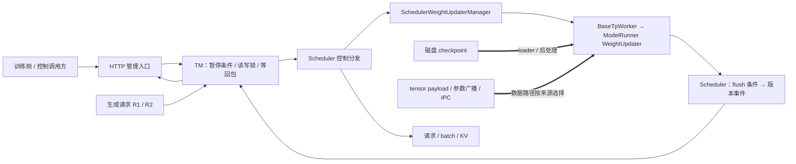
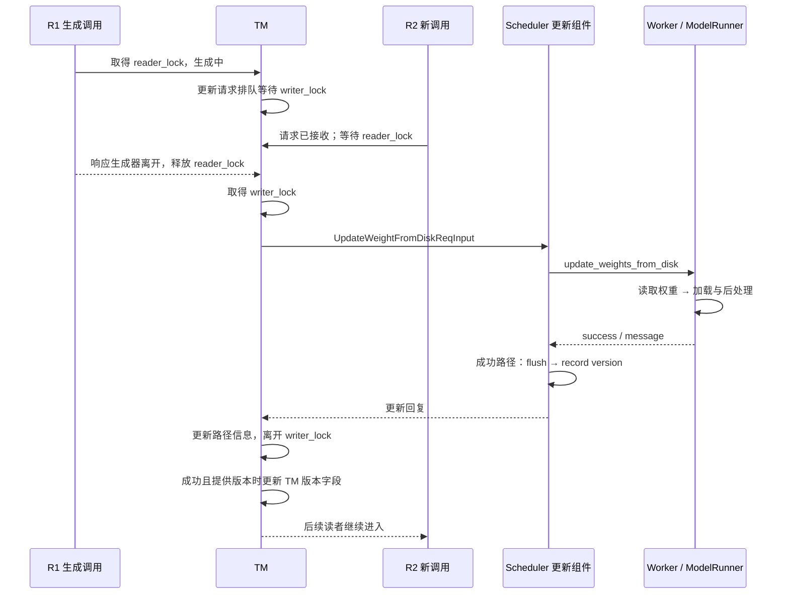

# 权重更新、暂停恢复与 RL 接口

本文是**源码分析型学习资料**。面向已经理解一条请求的执行、KV 生命周期和观测字段，想知道“服务不重启，怎样换一套权重继续生成”的读者。

本篇的中心问题是：**更新的权重、保留的请求、缓存里的状态和对外报告的版本，是否对应同一件事。** 这些对象由不同层管理，接口返回成功也需要结合返回位置解释。

## 0. 阅读基线与范围

| 项目 | 内容 |
| --- | --- |
| 源码路径基准 | SGLang 仓库根目录 `.`；所有源码引用使用仓内相对路径 |
| 读取工作区 | `sglang-source-study` 独立 Git worktree |
| 分支 | `codex/sglang-source-study-20260909`，基于官方 main |
| commit | `72d5c5bb73cadd7ffbf5114e5f81e29d36b6c61a` |
| 读取日期 | `2026-09-10` |
| 工作区状态 | 源码 worktree 干净；原源码工作区和 Wiki 原有文件保留 |
| 主线 | Python HTTP、单 TM、Normal Scheduler、普通 Dense 文本模型、TP/PP/DP 均为 1；使用同架构兼容权重做同步磁盘更新 |
| 主线配置 | 未预先暂停；abort_all_requests=False、flush_cache=True、weight_version=v1；不启用草稿模型、分层缓存、CUDA IPC 权重缓存或派生权重优化 |
| 扩展顺序 | 暂停三模式 → tensor / distributed / checkpoint IPC → token 版本区间 → 内存让出与导出；分别说明 P/D 和草稿差异 |
| 范围限制 | 不展开外部训练算法、完整训练框架、所有量化/硬件组合、多 TM/PP/PD 的完整更新协议和生产部署 |
| 操作边界 | 静态阅读、文档和独立教学账本检查；未更新真实权重、启动服务、运行项目测试、导入 torch/SGLang 或执行内存释放 |

前置阅读：[02-06 完成与释放](../02-request-lifecycle/06-完成取消与资源释放.md)、阶段 04 的 KV 缓存、[10-04 观测关联](04-Metrics日志与Trace关联.md)。磁盘加载机制可回看阶段 09 的权重加载文章。

图和数字是**整理者归纳**，实现结论对应固定源码。外部补充只使用读取于 2026-09-10 的 PyTorch 2.14 [CUDA tensor 共享说明](https://docs.pytorch.org/docs/2.14/multiprocessing.html#sharing-cuda-tensors)与 [Tensor.view 文档](https://docs.pytorch.org/docs/2.14/generated/torch.Tensor.view.html)，用于解释所有权和 dtype 视图条件；它们不证明本机安装了该版本或本组合已运行通过。

## 1. 人话版：换菜谱之前，先分清餐厅里的四类东西

权重像当前菜谱，请求像正在制作的订单，KV 像已经做完一部分后保存的中间结果，weight_version 像订单上写的菜谱标签。给标签改名不会更换菜谱；更换菜谱也不会自动把已经保存的中间结果重做一遍。

RL 中的 rollout 可以理解为“用某一版模型生成训练需要的样本”。训练一侧负责优化参数，SGLang 接收参数并执行推理。本文阅读的是这条服务接口边界，不把 SGLang 的更新接口解释成完整的优化器或训练调度器。

| 对象 | 谁拥有 | 什么情况下变化 | 不能替代什么 |
| --- | --- | --- | --- |
| model 参数 / buffers | ModelRunner 内的模型与 loader | 加载、拷贝、后处理、内存恢复 | 请求与 KV 的版本一致性策略 |
| model_update_lock | TM | 生成持读锁，普通更新持写锁 | Scheduler 所有异步资源的完整空闲证明 |
| is_pause / is_pause_cond | TM | 阻止后续生成进入读锁区 | Scheduler 已完成暂停的跨进程确认 |
| _engine_paused | Scheduler | 跳过普通循环的推理部分 | 清空 running/waiting/KV |
| SchedulerWeightUpdaterManager | Scheduler 的控制组件 | 编排 worker 更新、flush、版本记录 | 模型参数布局转换本身 |
| WeightUpdater | ModelRunner 的加载组件 | 将磁盘/张量/广播数据写入模型 | 全局事务与所有 rank 回滚 |
| weight_version_events | Req | 版本变化时记录已输出长度 | KV 来源、梯度版本或权重哈希 |
| offload_tags | Scheduler 内存控制组件 | 让出/恢复指定内存类别 | 哪条请求允许使用这些地址的调度策略 |

两个 WeightUpdater 名字相近，但职责不同：Scheduler 层安排更新后的控制动作，ModelRunner 层真正调用 loader / load_weights。[S17] [S19]

## 2. 总体地图：控制消息和参数数据分开走

**图意解读：** 普通箭头是控制和响应，粗箭头表示权重数据进入的位置；方框是职责，不是每个方框一个进程。请求和更新会在 TM 与 Scheduler 相遇，但参数数据并不都通过同一种 HTTP body 搬运。tensor、broadcast、checkpoint IPC 的具体所有权在第 6 节拆开。[S1] [S3] [S4] [S17] [S18] [S19] [S31] [S44] [S49]

本篇先走磁盘主线：更新同一个已实例化模型的参数，模型的架构、维度、词表与相关配置必须匹配。这个入口不会为任意新架构自动重建完整推理系统。

## 3. R1 完成后更新，R2 再进入：同步磁盘主线

### 3.1 生成持读锁，不只是在 forward 时持锁

TM.generate_request 完成输入归一化、请求状态初始化和日志后，先等待 is_pause=False，再进入 model_update_lock.reader_lock。读锁覆盖 LoRA 解析、分词、发送以及等待/产出响应的生成器范围。[S3]

因此读锁不是“GPU 正在算的一小段时间”。R1 仍在异步生成器中等待或交出结果时，更新写锁也可能继续等待。请求状态已经建立，不代表已经通过读锁、进入 Scheduler。

RWLock 的新读者在存在活动 writer 或等待 writer 时都会等待；writer 需要读者数降到 0 且无活动 writer。它避免后来请求不断加入读者，使已排队更新长期拿不到锁。[S7] [S8]

### 3.2 更新如何等到响应

HTTP /update_weights_from_disk 将请求交给 TM；未预先暂停时，TM 使用 writer_lock 进入更新区。[S1] [S4]

_wait_for_model_update_from_disk 记录预期 worker 数，建立 Future，派发请求并等待回包。单 worker 返回 success/message/num_paused_requests；多 worker 分支需要收齐预期回复，用 all(success) 合并。只有相应成功条件满足，才更新 TM 的 model_path/load_format 信息。[S5] [S6]

**图意解读：** 这是正常、单次、无失败的教学顺序。R2 是否已经建立 ReqState，与是否进入模型执行分开。图中的写锁不覆盖所有后续 TM 元数据赋值，也不是所有外部调用共享的分布式锁。[S3] [S4] [S5] [S7] [S8]

### 3.3 真正写权重的地方

SchedulerWeightUpdaterManager 通过 BaseTpWorker 调用 ModelRunner WeightUpdater.update_weights_from_disk。该路径先拒绝活动 CUDA IPC 权重缓存和不支持在线变更的派生权重优化，再创建 LoadConfig、选择 loader；目前此方法要求 DefaultModelLoader。[S17] [S18] [S19] [S20] [S21]

随后读取新权重 iterator，调用 loader.load_weights_and_postprocess 写入现有 model。成功后更新模型相关字段；recapture_cuda_graph=True 且设备条件满足时，再重新捕获图。更新某个参数和完成模型后处理不能省略成同一步“把文件复制到显存”。[S19]

| 阶段 | 数据/状态变化 | 谁报告完成 |
| --- | --- | --- |
| iterator 建立 | 从指定 checkpoint 准备读取参数 | loader 调用返回 |
| 参数加载与后处理 | 现有 model 内参数或派生布局变化 | ModelRunner 更新方法 |
| 可选图重捕获 | 更新执行图相关资源 | recapture 回调 |
| flush_cache | 重置可清理的缓存与映射 | Scheduler.flush_cache |
| 版本事件 | 记录活动 Req 的旧版本输出边界 | Scheduler.record_weight_version_change |
| 汇总响应 | 单 worker 回包或收齐结果 | TM Future / communicator |

这几层没有包在一个自动回滚的事务里。

### 3.4 flush 发生在写入之后

Scheduler 层在目标 worker 的磁盘更新成功后，按 flush_cache 决定调用 flush_cache_after_weight_update；若 flush 返回 False，直接 assert。完整更新成功后才记录 weight_version。[S17] [S16]

真正的 Scheduler.flush_cache 要求 is_fully_idle：普通主线中 running、last、chunked、waiting、grammar 等状态需要满足条件；扩展模式还检查 PP、P/D、HiCache、HiSparse 等在途状态。它重置 tree cache、请求/物理槽位分配器、辅助池、grammar 与部分统计；empty_cache 另控制设备 allocator 缓存整理。[S14] [S15]

**读锁排空、Scheduler 完全空闲、参数写入成功、缓存清理成功，是四个判定。** 如果权重先写成功而随后 flush 失败，不能根据“没有成功回复”反推参数从未改变。

本基线磁盘输出中的 num_paused_requests 在该 Scheduler handler 直接写为 0。看到 0 不能据此证明本次从未出现暂停请求，也不能把它当全局活动请求数。[S17]

## 4. 暂停的三种模式，各自保留什么

### 4.1 TM 阻挡入口，Scheduler 暂停推理

TM.pause_generation 在 is_pause_cond 下把 is_pause=True。abort 模式反复发送 AbortReq(abort_all=True)，检查 model_update_lock 是否仍有读者/活动 writer，直到本地锁不再被持有。in_place 与 retract 则异步派发暂停控制消息。[S9]

这里异步派发的 await 等的是发送动作，_async_dispatch_to_scheduler 没有等待一个独立“Scheduler 已暂停”的回包。HTTP 随后返回“paused successfully”，应按此边界理解，不能单独当作所有 GPU/传输资源均已静止的证明。[S91] [S2]

Normal Scheduler 每轮先 ingest_requests，再检查 _engine_paused；暂停后仍可处理控制消息，但跳过选批和推理。continue_generation 也走控制消息，让 Scheduler 清除该标记。[S13] [S12]

TM.continue_generation 在 condition 内先将 is_pause=False，发送 ContinueGenerationReqInput，再 notify_all 唤醒等待者。它恢复的是入口侧条件；Scheduler 收到消息后才执行自己的恢复步骤。这两个进程的状态不应合写成一个同时改变的布尔值。[S10] [S12]

### 4.2 三种模式的状态表

| 模式 | TM 动作 | Scheduler/请求状态 | KV 与更新含义 |
| --- | --- | --- | --- |
| abort（默认） | 阻止新生成，发送全体 abort 并等待本地锁退出 | 既有请求走取消与收尾；TM 不用该模式调用 Scheduler.pause_generation | 有利于走到可清缓存状态，但完整空闲仍由实际状态判定 |
| in_place | 阻止新生成，发送暂停 | _engine_paused=True 后立即返回；保留 running、last、chunked、result_queue | 继续时保留旧 KV；有活动请求时默认 flush 不能直接通过 |
| retract | 阻止新生成，发送暂停 | 处理必要的 overlap 结果，回退普通活动请求并放回 waiting | 释放请求的 KV 持有关系不等于全树无旧 KV，也不等于 waiting 已空 |

字段声明见 [S23]，实际行为见 [S9] [S11]。本篇正文以实际 handler 和空闲检查为准。

retract 的 release_req 调用 release_kv_cache(is_insert=False)，然后 reset_for_retract。后者清空 prefix 索引和许多执行临时状态、增加 retraction_count；不会将已经生成的 output_ids 当作新请求清空。继续生成时仍是原逻辑请求，只是需要重新准备执行状态。[S74] [S75]

### 4.3 本基线里，retract 后不一定能 flush

PauseGenerationReqInput 的注释称 retract 模式可以 flush，但当前普通 Scheduler 会把回退请求加入 waiting_queue；is_fully_idle 又明确要求 waiting_queue 为空。[S23] [S11] [S14]

以 R1 已生成两个 token 为例：

| 时刻 | running | waiting | R1 已有输出 | flush 的静态判定 |
| --- | --- | --- | ---: | --- |
| 暂停前 | 含 R1 | 空 | 2 | 不满足完整空闲 |
| retract 处理后 | 清空活动列表 | 含 R1 | 2 | waiting 非空，仍不能 flush |
| R1 被取消并完成相关收尾，其他状态也排空 | 空 | 空 | 已终止 | 才继续核对全部 is_fully_idle 条件 |

因此不能把“retract → 默认 flush=True 更新 → continue”作为所有在途请求都能采用的已验证配方。源码里 release 的是请求持有关系；其他前缀缓存、等待者与后台资源还需要各自判定。使用 flush_cache=False 可以跳过清理动作，但不能使旧 KV 自动属于新权重。

### 4.4 P/D 有额外保护和未完成边界

P/D Decode 的 retract 路径将待 rebootstrap 请求暂存，必要时弹出最后一个输出 token 作为强制输出，再在 continue 时重新放入预分配队列。目的之一是在暂停窗口避免立即开始重建。[S11] [S12]

P/D Prefill 则不会把仍有活动 sender 的中间 chunk 简单释放：代码保留相关 chunked_req，并明确标注 sender 退役仍需进一步处理，以及更新后可能保留旧权重的前缀 KV。这里不能只套用普通请求的回退表。[S11]

这些是当前实现边界，不是本篇验证过的跨 P/D 更新协议。权重更新要与传输退役、前缀重算和版本对齐一起审视；阶段 07 的资源边界仍然适用。

### 4.5 暂停状态下，不同更新入口的锁范围不同

未暂停时，磁盘、tensor、distributed 等路径会取得 writer_lock，等待生成读者结束。预先暂停时则需要绕过读锁等待，否则保留在途生成器的 in_place 请求可能一直持有读锁。[S4] [S24] [S25]

不过当前实现有差别：tensor/distributed 在 is_pause_cond 内等待更新 communicator，阻止同时 unpause；磁盘路径只在 condition 内读取 is_paused，随后释放 condition 并使用 nullcontext 执行更新。[S4] [S24] [S25]

所以不能声称所有入口都由同一把锁保证“更新与继续绝不竞争”。本篇教学场景要求控制调用方按顺序完成一次更新再继续，不并发发出管理命令；并发正确性未在本次运行验证。

## 5. 版本号怎样跟随输出 token

### 5.1 改版本号不等于加载权重

/update_weight_version 接口可按 abort_all_requests 先发送 abort，再调用 TM 的版本 communicator；这个接口本身不加载新参数。Scheduler.record_weight_version_change 在新版本为 None 或与当前相同时直接返回，否则更新配置并扫描活动、等待、chunked 等 Req，记录已有 output_ids 的长度。[S55] [S56] [S51] [S52]

反过来，真正加载了权重但没提供新的 weight_version，也不会自动生成一个内容哈希或训练步号。版本字符串由调用方提供。[S4] [S24] [S25]

### 5.2 token 区间是半开区间

WeightVersionEvent 保存 old_version 和 num_output_tokens；最终把这些事件和当前版本组合为 WeightVersionSpan(version,start,end)。这里的 span 是输出 token 区间，**不是 10-04 的 OTLP span**。[S52] [S53]

假设 R1 最终输出 7 个 token：

| 事件 | 当时已输出数 | 记录 |
| --- | ---: | --- |
| 使用 v0 开始 | 0 | 尚无切换事件 |
| 从 v0 切到 v1 | 2 | old_version=v0，边界=2 |
| 从 v1 切到 v2 | 5 | old_version=v1，边界=5 |
| R1 完成 | 7 | 当前版本 v2，末尾=7 |

最终区间为 v0:[0,2)、v1:[2,5)、v2:[5,7)，长度分别 2、3、2，总计 7。重复声明当前版本不会新建边界；没有新增 token 的重复边界、相邻同版本区间以及最终长度裁剪由计算函数处理。[S51] [S53]

**图意解读：** 图表示版本元数据流，不代表旧 token 重新计算。普通生成的区间列表在 finished 输出建立；中间流式 chunk 通常没有完整 weight_versions 列表。Detokenizer 将区间元数据带回，TM 根据可见输出长度裁剪，并把 weight_version 设为最后可见区间的版本。[S57] [S92] [S58] [S54]

如果可见输出最终裁成 6 个 token，最后一段应为 [5,6)，总计仍覆盖 6。若请求零 token 就结束，可保留从 0 开始的空区间，不应凭空推导出一个已生成 token。

### 5.3 区间说明了什么，没说明什么

区间记录“Scheduler 在这些输出边界前后认为什么版本生效”。它没有逐 token 计算权重校验和，也不追踪每个 KV 槽位来自哪个权重版本。

所以在 in_place 后更换参数并继续时，即使输出划分成 v0/v1 两段，也仍可能使用旧 KV；请求的模型状态来源不能只靠这个列表判断。只改版本标签的测试也不能证明实际权重数据被替换。第 9 节给出权重内容的独立检查入口。

## 6. RL 参数同步：三种数据入口不能混成一种

### 6.1 tensor 更新：先选对 rank 的 payload

HTTP tensor 更新入口接收 serialized_named_tensors。内部字段是每 rank 一份序列化 bytes；HTTP JSON 使用 base64 表示二进制，TM 先做规范化。[S88] [S72] [S87] [S25]

BaseTpWorker._deserialize_own_rank 只反序列化 `serialized_named_tensors[tp_rank]`。如果里面是 LocalSerializedTensor，ModelRunner 再按同一个 TP rank 取内部值，然后移动到当前目标设备。外层 payload 索引和内部本地 tensor 选择是两个层次。[S32] [S31] [S36] [S35]

| 层次 | TP=2 的教学形状 | 用途 |
| --- | --- | --- |
| 外层 payload 列表 | payload_for_tp0、payload_for_tp1 | 各 rank 只消费自己的序列化副本 |
| 可选 LocalSerializedTensor | values[0]、values[1] | 表达一个逻辑参数在不同 rank 的本地内容 |
| 实际 named_tensors | (name,tensor) 列表 | 交给模型 loader 或 direct loader |

公开 Engine._serialize_tensors_per_rank 为普通输入逐 rank 序列化，flattened_bucket 则接收预序列化 payload。该设计与 CUDA IPC 的生产端引用计数有关，不能把同一个“对别的 rank 的副本”也顺手解包。[S41] [S32]

PyTorch 的 CUDA 共享要求发送端在接收端仍持有引用时保留原 tensor，且进程生命周期需协调。本篇据此提醒读者核对 producer、consumer 和引用释放；没有测量本基线在异常退出下的完整回收行为。[PyTorch CUDA 共享说明](https://docs.pytorch.org/docs/2.14/multiprocessing.html#sharing-cuda-tensors)

### 6.2 不同 load_format 改变参数名的解释方式

ModelRunner tensor 更新完成解包后分流：

| load_format | 实际调用 | 主要要求 |
| --- | --- | --- |
| None | model.load_weights(named_tensors) | 使用该模型的名字映射、融合和 shard 逻辑 |
| direct | 按 model.named_parameters() 建字典，再 default_weight_loader | name 应对应当前模型真实参数名 |
| 注册的 custom loader | 动态导入并调用对应函数 | 外部实现需独立核对 |
| flattened_bucket | 按元数据还原 tensor 后 model.load_weights | 字节布局、dtype、shape 与索引匹配 |
| 其他值 | NotImplementedError | 不能仅凭字段是字符串就随意填写 |

对应 [S33] [S34] [S37] [S38]。例如上传 HF 名称 up_proj 的普通路径可能映射到融合参数 gate_up_proj；direct 路径不会自动把所有 HF 别名当作现有参数名。相关端到端测试明确区分上传名称与设备参数名称。[S81]

有草稿模型时，Scheduler tensor 更新的 worker 选择是：disable_draft_model 为真选 target，否则选 draft_worker（存在时）或 target。它不是默认同时更新两套模型；磁盘 handler 则先 target，成功后再尝试 draft。[S29] [S17]

### 6.3 扁平 bucket：这里的索引按字节数

FlattenedTensorBucket 先 tensor.flatten().view(torch.uint8)，按该视图的 numel 累加 start_idx/end_idx，再拼成一个 uint8 tensor。metadata.numel 因而是字节数，不是原 tensor 的逻辑元素数。[S37]

| tensor | dtype / shape | 逻辑元素 | 字节范围 | metadata.numel |
| --- | --- | ---: | --- | ---: |
| A | BF16 / [2,2] | 4 | [0,8) | 8 |
| B | FP32 / [2] | 2 | [8,16) | 8 |

恢复时取字节切片，view(meta.dtype)，再 reshape(meta.shape)。本例总计 16 byte；如果把 A 的 end_idx 错写成 4，就只留下了一半数据。[S38]

当前构造代码没有为每个 dtype 单独补齐 padding。PyTorch 的 dtype view 要求符合元素大小比例、storage_offset 和 stride 条件；“支持多 dtype”不能被理解为任意拼接偏移都合法。例如前一个 BF16 tensor 仅 3 个元素时占 6 byte，紧接的 FP32 段从 byte 6 开始，按官方 view 条件需检查 4 字节对齐。这里是源码与 API 条件的静态推导，未调用 torch 运行该例。[Tensor.view 条件](https://docs.pytorch.org/docs/2.14/generated/torch.Tensor.view.html)

### 6.4 distributed 更新：先建组，再约定每次广播

TM 的 init/update/destroy 权重组入口要求 dp_size==1 或 enable_dp_attention。ModelRunner 建组还要求默认分布式环境已初始化、group_name 非空；接收 rank 为 rank_offset+tp_rank。[S46] [S47] [S42] [S43]

教学拓扑为 trainer rank0、两个推理 TP rank，rank_offset=1，则接收组 rank 为 1、2，world_size=3。这个组不同于推理内部 TP 通信组，名字、成员和广播顺序必须两端一致。

普通更新根据 names/dtypes/shapes 逐项建立目标 tensor，发起 src=0 的异步 broadcast，等待全部 handles 后调用 model.load_weights。flattened_bucket 分支广播一个扁平 tensor，再重建参数。[S44] [S45]

源码这里使用 zip(names,dtypes,shapes)；调用方必须核对三份清单长度和顺序，不能把接口收到三个列表解释成已经验证每项完全配对。多次分批上传还要明确：何时结束全部批次、何时 flush、何时公布最终版本。一次小批成功不等于完整 checkpoint 已上传。

FanOutCommunicator 按自身实例串行请求、收齐指定数量结果并用 all(success) 合并。每个 endpoint 的 communicator 不构成所有管理动作共享的全局事务锁；也不会撤销已成功 rank 的写入。[S26] [S27] [S28]

### 6.5 checkpoint IPC 与 weight_sync helper 的实际边界

checkpoint IPC 路径从 zmq_handles 中按设备 UUID 找句柄，把 loader 与 post_hook 交给外部 checkpoint-engine。它不是上节 per-rank 序列化列表的同一协议；外部包缺失和调用异常有各自错误返回。[S48] [S49] [S50]

`python/sglang/srt/weight_sync/utils.py` 的 update_weights 展示了另一种准备方式：对 DTensor 获取 full_tensor，按 mesh gather 序列化数据，再将同名逻辑参数整理成 LocalSerializedTensor。[S39]

但本基线存在需要留意的**接口接线差异**：该 helper 最后以 UpdateWeightsFromTensorReqInput 调用并 await engine.update_weights_from_tensor；当前公开 Engine 同名方法接受 tensor/payload 列表，内部构造请求并 run_until_complete。两者签名和同步方式并不一致。[S39] [S40]

因此本文仅用 helper 解释数据组织，不把它包装成可以直接复制运行的集成示例。这一差异未经运行定位和修复；实际调用方应回到所选 Engine/TM 接口核对，不能仅凭文件位于 weight_sync 就认为整条链已通过。

## 7. 让出显存、恢复生成、导出权重分别是什么操作

### 7.1 内存恢复不是 continue_generation

release_memory_occupation/resume_memory_occupation 通过独立 communicator 发送。Scheduler 的 release 首先 assert is_fully_idle，再按 tags 处理 kv_cache、weights、cuda_graph；tags 为空时按全部类别处理。[S89] [S90] [S59]

| 操作 | 关键动作 | 不代表什么 |
| --- | --- | --- |
| pause_generation | 停止接纳/执行或取消请求 | 指定显存已经归还 |
| release_memory_occupation | 对内存类别 pause，维护 offload_tags | 训练权重已经生成或已更新 |
| resume_memory_occupation | 对类别 resume，恢复相关静态状态 | 自动完成推理请求的 continue |
| continue_generation | 可选 empty_cache、重入 P/D 暂存请求、清除暂停标志 | 自动更新权重与重建全部旧 KV |

release 的权重分支暂存 model.named_buffers 的副本，经 barrier 再交给 memory_saver；这份 stashed_model_static_state 不是完整参数 checkpoint。resume 恢复权重类别后写回这些 buffers。[S59] [S60] [S61] [S62]

同一次全类别调用中，release 依次处理 KV、weights、graph；resume 依次处理 graph、weights、KV。offload_tags 的 remove 要与先前 add 对应，不能把重复 resume 默认当成幂等操作。[S59] [S60]

### 7.2 真正释放多少，还取决于 adapter 和备份策略

TorchMemorySaverAdapter.create 在启用但依赖缺失时抛错；未启用则返回 Noop，pause/resume 不做实际释放。真实 adapter 的 pause/resume 委托给外部库。[S63] [S64] [S84] [S85]

权重加载区域的 CPU backup 由 enable_weights_cpu_backup / 草稿对应开关决定；CUDA IPC 权重缓存条件还会改变该配置。因此不能把一次 resume 无条件解释为旧参数内容已经完整恢复，需结合备份配置与后续权重加载证据。[S86]

开启 CUDA IPC 权重缓存时，在线参数修改和权重内存让出有明确拒绝路径，因为这些内存可能是其他实例共同映射的权重。派生权重缓存的拒绝又是另一项条件，不能混为普通 KV cache 清理。[S20] [S21] [S59]

### 7.3 权重导出是另一条生命周期

WeightExporter.save_sharded_model 委托 ShardedStateLoader 保存；Scheduler 的对应 handler 转发参数。它不包含训练 optimizer state，也没有在这个方法里建立覆盖所有并发更新的快照事务。[S67] [S68]

远端实例发送路径为每个 TP rank 使用一个端口建立组，要求 ports 数量与 tp_size 相同；逐个 named_parameters 做 broadcast，结束后销毁发送组。该动作传的是模型参数，并不自动同步请求状态、KV、版本事件或训练器状态。[S66] [S65]

它与 trainer→inference 的更新组角色不同。学习时先画成员、方向和参数顺序，再讨论“权重同步”，不要把同名 group_name 当作可互换协议。

## 8. 失败、部分更新与兼容边界

### 8.1 失败返回不能代替回滚证明

| 失败点/条件 | 当前代码行为 | 需要保留的证据 |
| --- | --- | --- |
| 磁盘 loader 类型不支持 / iterator 获取失败 | 返回 False | 实际 loader、model_path 与错误 |
| 磁盘 load_weights_and_postprocess 抛错 | 日志称回滚，重新取 iterator 再加载 | 不能仅凭文字认定旧权重恢复 |
| distributed 更新异常 | 明确提示参数可能部分更新 | 哪些 rank/参数已改、哪些未完成 |
| tensor loader 抛错 / 格式未知 | 某些分支直接抛异常 | 不保证所有异常都成为 success=False 正常回包 |
| 参数成功但 flush 失败 | 更新后 assert | 缓存条件和已写参数分别检查 |
| target 成功、draft 失败 | 磁盘路径仍按 target 成功执行 flush，最终 success=False | 两套模型内容与版本状态 |
| 活动权重缓存 / 派生权重缓存 | 明确拒绝对应操作 | 启动配置与选中的优化路径 |
| 多 worker 一部分失败 | TM/communicator 合并失败 | 失败汇总不会撤销其他 worker 的成功 |

对应 [S19] [S44] [S33] [S16] [S17] [S20] [S21] [S5] [S27]。

磁盘失败分支尤其要回到真实变量：进入加载前已经将 model_config.model_path 设为请求的新路径；异常后的重试仍调用 get_weight_iter(self.model_config)。本方法没有保存旧参数快照或切回旧路径的明显步骤。因此日志中的 “Rolling back to original weights” 不能单独证明恢复到了更新前版本。[S19]

本篇只记录上述静态边界，不修改源码，也不把一次无异常加载推断为整套在线更新协议具备原子性。

### 8.2 请求字段不等于已实现的事务协议

UpdateWeightFromDiskReqInput 声明了 is_async、keep_pause、token_step、manifest 等字段，但本文选定的同步 handler 不能仅据这些字段名称推导出异步事务、自动暂停恢复或完整 manifest 校验。应沿实际读取和生效位置继续核对。[S22] [S4] [S17] [S19]

本篇各分支的适用状态：

| 组合 | 静态状态 | 当前验证边界 |
| --- | --- | --- |
| 普通单实例、排空读者后磁盘更新 | 有完整读取与成功回包路径 | 未运行加载与首次请求 |
| in_place + 活动请求 + flush=True | 完整空闲条件不满足时清理失败 | 不作默认可用配方 |
| retract + 普通 waiting 非空 + flush=True | 同样不满足当前 flush 条件 | 注释与实际判定分开 |
| 预暂停 + tensor/distributed | condition 持有至 communicator 完成 | 仍需判断资源/缓存/所有 rank |
| 预暂停 + 磁盘更新 + 并发 continue | condition 锁范围不同 | 本篇不承诺并发安全 |
| tensor + 草稿模型 | 需显式核对被选中的 worker | 不代表一次更新覆盖 target+draft |
| P/D / PP / 多 TM | 需独立拓扑与生命周期分析 | 本篇只对照部分入口，不提供全组合运行结论 |
| memory_saver 未启用 | adapter 可为 Noop | API 返回不证明显存回收量 |

## 9. 怎样判断权重、版本和恢复各自完成

### 9.1 内容检查与版本标签分开

WeightChecker 支持 snapshot、compare、checksum 等动作。snapshot 保存比较基线；compare 与基线比较；checksum 按可比较参数/状态计算结果并附并行信息。量化路径可能对可比较的反量化表示做 hash，不能直接称为原始 checkpoint 文件哈希。[S69] [S70]

Scheduler check_weights 还会整理 target/draft 结果和 rank payload。结果正确归属需要模型、rank、参数范围与量化比较设置；某一个截断参数返回正确，不是全模型完整更新的证据。[S71]

特别注意 reset_tensors 是主动改写 tensor 的测试动作，不能因为它属于“检查接口”就当成只读操作。本篇没有调用任何检查/更新接口。[S69]

### 9.2 从现象反查边界

| 现象 | 首查对象/位置 | 避免的误判 |
| --- | --- | --- |
| 更新一直等锁 | R1 生成器、读锁持有者、等待 writer | 只看 GPU 空闲就认为锁应该释放 |
| pause 返回后仍有结果 | 发送完成与 Scheduler 执行、overlap 回程 | 把 HTTP 200 当作所有 rank 的 drain fence |
| retract 后 flush 报错 | waiting 与完整空闲条件 | 只看 running 已空 |
| 更新失败但输出变了 | 参数部分写入、flush/draft 后置失败 | 假定失败即零修改 |
| weight_version 改了但内容没变 | 只改版本接口、实际数据来源与 checksum | 标签等于内容 hash |
| 内容更新但版本区间没变 | 是否传 weight_version | 没切标签就没写数据 |
| 恢复后输出状态不符 | 旧 KV、CPU backup、buffers、草稿与目标选择 | resume/continue 自动修复所有状态 |
| tensor 更新卡在多 rank | per-rank payload、组成员、广播顺序、barrier | 一个 rank 成功即整个实例成功 |
| memory API 成功但显存不降 | adapter 是否真实启用、tags、缓存/地址状态 | 返回码证明实际回收容量 |

### 9.3 阶段 10 的交付闭环

| 要完成的认知 | 本阶段位置 | 本篇补充 |
| --- | --- | --- |
| Gateway 到 Runtime 的请求图 | [10-01](01-ModelGateway注册路由与缓存亲和.md)、[10-02](02-HTTPgRPC与Rust服务边界.md) | 更新控制消息与权重数据面分离 |
| 服务状态与成功层次 | [10-03](03-健康检查超时限流与优雅退出.md) | pause、idle、flush、offload 与 resume 分开 |
| 一次请求的观测字段 | [10-04](04-Metrics日志与Trace关联.md) | 权重内容、版本事件和 token 区间独立记录 |

这些是源码阅读产物；没有 Kubernetes 操作、真实部署脚本执行或外部训练框架内部实现验证。

## 10. 源码阅读路线与练习

### 10.1 回到代码的顺序

| 问题 | 仓内相对路径 / 符号 |
| --- | --- |
| 更新和暂停入口 | python/sglang/srt/entrypoints/http_server.py：update_weights_from_disk / pause_generation / update_weight_version [S1] [S2] [S55] |
| TM 生成与更新互斥 | python/sglang/srt/managers/tokenizer_manager.py：generate_request / update_weights_from_disk / _wait_for_model_update_from_disk / 回包处理 [S3] [S4] [S5] [S6]；python/sglang/srt/utils/aio_rwlock.py [S7] [S8] |
| 暂停、继续和完整空闲 | python/sglang/srt/managers/tokenizer_manager.py [S9] [S10] [S91]；python/sglang/srt/managers/scheduler.py [S11] [S12] [S13] [S14] [S15] |
| Scheduler 更新编排 | python/sglang/srt/managers/scheduler_components/weight_updater.py：flush / disk / tensor / distributed [S16] [S17] [S29] [S30] |
| 实际参数加载 | python/sglang/srt/managers/tp_worker.py 的 BaseTpWorker [S18] [S31] [S32]；python/sglang/srt/model_executor/model_runner_components/weight_updater.py [S19] [S33] [S34] [S35] [S36] |
| 控制汇总 | python/sglang/srt/managers/tokenizer_control_mixin.py [S24] [S25] [S28]；python/sglang/srt/managers/communicator.py [S26] [S27] |
| 字节打包与 Engine | python/sglang/srt/weight_sync/tensor_bucket.py [S37] [S38]；python/sglang/srt/weight_sync/utils.py [S39]；python/sglang/srt/entrypoints/engine.py [S40] [S41] |
| 广播更新与组 | python/sglang/srt/model_executor/model_runner_components/weight_updater.py [S42] [S43] [S44] [S45]；TM 组入口 [S46] [S47] |
| checkpoint IPC | python/sglang/srt/checkpoint_engine/checkpoint_engine_worker.py [S50]；TM 与 ModelRunner 入口 [S48] [S49] |
| 版本区间和输出 | python/sglang/srt/utils/weight_versions.py [S52] [S53] [S54]；Scheduler 事件 [S51]、TM 控制 [S56] 与两端输出 [S57] [S58] |
| 内存与 buffer 恢复 | python/sglang/srt/managers/scheduler_components/weight_updater.py [S59] [S60] [S61] [S62]；python/sglang/srt/utils/torch_memory_saver_adapter.py [S63] [S64] [S84] [S85] |
| 权重备份与导出 | python/sglang/srt/model_executor/model_runner_components/load_model_utils.py [S86]；python/sglang/srt/model_executor/model_runner_components/weight_exporter.py [S65] [S66] [S67]；Scheduler 保存入口 [S68] |
| 内容检查与拒绝条件 | python/sglang/srt/utils/weight_checker.py [S69] [S70]；Scheduler 汇总 [S71]；ModelRunner 权重缓存与派生缓存拒绝 [S20] [S21] |
| 消息字段与回退 | python/sglang/srt/managers/io_struct.py [S22] [S23] [S72] [S73]；python/sglang/srt/managers/schedule_batch.py [S74] [S75] |
| HTTP tensor / 内存入口 | python/sglang/srt/entrypoints/http_server.py [S88]；python/sglang/srt/utils/common.py [S87]；TM 内存 communicator [S89] [S90] |

### 10.2 练习与验收答案

1. R1 持读锁，更新 U1 已等待 writer，R2 才到。R2 可以立即分词并进入 Scheduler 吗？
2. retract 后 running 为空、waiting 有 R1，为什么不能据注释认定 flush 成功？
3. R1 在输出数 2、5 时换版本，最终输出 7；写出版本区间与每段长度。
4. BF16[2,2] 后拼 FP32[2]，bucket 的总字节数是多少？为什么 metadata.numel 不是 4 和 2？
5. 返回 success=False、TM 版本未变，能否认定模型仍是原版本？
6. 只调用 resume_memory_occupation，能否认为暂停生成已结束？

**答案要点：** 题 1 后来的 reader 需等待 writer，ReqState 存在不等于已入调度。题 2 当前完整空闲包括 waiting 为空。题 3 为 [0,2)、[2,5)、[5,7)，长度 2+3+2=7。题 4 为 16 byte，numel 在 uint8 视图下计算。题 5 不能，加载/后处理/flush/draft 失败位置不同。题 6 不能，内存标签与 TM/Scheduler 暂停标志属于不同控制路径。

### 10.3 测试入口和证据强度

| 文件 | 已读定义 | 覆盖意图 / 限制 |
| --- | --- | --- |
| test/registered/rl/test_weight_version_spans.py | test_03_spans_split_across_pause_update_continue [S76] | 版本区间切分；helper 的磁盘更新设置 flush_cache=False |
| 同上 | test_07_update_without_weight_version_does_not_split [S77] | 内容更新与标签变化分开 |
| 同上 | test_11_streaming_reports_spans_only_on_the_final_chunk [S78] | 中间 chunk 与最终区间列表 |
| test/registered/rl/test_update_weights_from_tensor.py | TestServerUpdateWeightsFromTensorNonBlocking.test_update_weights [S79] | abort 暂停后更新，再检查部分参数值 |
| test/registered/rl/test_update_weights_from_distributed.py | TestUpdateWeightsFromDistributed.test_update_weights_from_distributed [S80] | 至少两 GPU；CI 对模式/格式存在随机选择，不是每次覆盖全部矩阵 |
| test/registered/rl/test_weight_checker_e2e.py | test_c_update_with_diff_tensor_makes_compare_fail [S81] | snapshot 后改值使 compare 失败，区分上传名和融合参数名 |
| test/registered/rl/test_multi_instance_release_memory_occupation.py | _run_sglang_subprocess [S82] | 多实例释放/恢复与内存变化的执行 helper；不是本次实测 |
| test/registered/rl/test_pause_generation_tensor_consistency.py | test_fix_preserves_invariant_when_all_reqs_finished [S83] | 使用 _FakeBatch 模拟 merge/filter 不变量，不是直接调用当前 Scheduler.pause_generation |

本次阅读六份测试文件中的七个用例与一个执行 helper，全部未运行。测试文件的存在、旧问题的模拟和完整端到端通过属于不同证据强度。

### 10.4 本篇完成到哪里

本篇完成同步磁盘更新的控制/数据/回包链，并拆开暂停三模式、缓存刷新、tensor 字节与 rank、广播组、版本区间、内存让出恢复和导出的边界。锁顺序、队列条件、参数布局、版本区间与组 rank 采用独立教学账本核对。

源码锚点、Markdown 表格与相对链接已检查；三张 Mermaid 仅静态对照。没有更新/校验真实模型，没有运行服务、项目测试、GPU、IPC、NCCL/RDMA 或训练实验。

上一篇：[10-04《Metrics、日志与 Trace 关联》](04-Metrics日志与Trace关联.md)。

阶段 10 的五篇已完成静态阅读。下一篇：[11-01《Benchmark 设计与指标口径》](../11-performance-engineering/01-Benchmark设计与指标口径.md)，开始说明怎样测量并比较这些服务行为。

[S1]: https://github.com/sgl-project/sglang/blob/72d5c5bb73cadd7ffbf5114e5f81e29d36b6c61a/python/sglang/srt/entrypoints/http_server.py#L1254
[S2]: https://github.com/sgl-project/sglang/blob/72d5c5bb73cadd7ffbf5114e5f81e29d36b6c61a/python/sglang/srt/entrypoints/http_server.py#L1705
[S3]: https://github.com/sgl-project/sglang/blob/72d5c5bb73cadd7ffbf5114e5f81e29d36b6c61a/python/sglang/srt/managers/tokenizer_manager.py#L776
[S4]: https://github.com/sgl-project/sglang/blob/72d5c5bb73cadd7ffbf5114e5f81e29d36b6c61a/python/sglang/srt/managers/tokenizer_manager.py#L2056
[S5]: https://github.com/sgl-project/sglang/blob/72d5c5bb73cadd7ffbf5114e5f81e29d36b6c61a/python/sglang/srt/managers/tokenizer_manager.py#L2133
[S6]: https://github.com/sgl-project/sglang/blob/72d5c5bb73cadd7ffbf5114e5f81e29d36b6c61a/python/sglang/srt/managers/tokenizer_manager.py#L3380
[S7]: https://github.com/sgl-project/sglang/blob/72d5c5bb73cadd7ffbf5114e5f81e29d36b6c61a/python/sglang/srt/utils/aio_rwlock.py#L43
[S8]: https://github.com/sgl-project/sglang/blob/72d5c5bb73cadd7ffbf5114e5f81e29d36b6c61a/python/sglang/srt/utils/aio_rwlock.py#L59
[S9]: https://github.com/sgl-project/sglang/blob/72d5c5bb73cadd7ffbf5114e5f81e29d36b6c61a/python/sglang/srt/managers/tokenizer_manager.py#L2035
[S10]: https://github.com/sgl-project/sglang/blob/72d5c5bb73cadd7ffbf5114e5f81e29d36b6c61a/python/sglang/srt/managers/tokenizer_manager.py#L2050
[S11]: https://github.com/sgl-project/sglang/blob/72d5c5bb73cadd7ffbf5114e5f81e29d36b6c61a/python/sglang/srt/managers/scheduler.py#L5329
[S12]: https://github.com/sgl-project/sglang/blob/72d5c5bb73cadd7ffbf5114e5f81e29d36b6c61a/python/sglang/srt/managers/scheduler.py#L5417
[S13]: https://github.com/sgl-project/sglang/blob/72d5c5bb73cadd7ffbf5114e5f81e29d36b6c61a/python/sglang/srt/managers/scheduler.py#L1893
[S14]: https://github.com/sgl-project/sglang/blob/72d5c5bb73cadd7ffbf5114e5f81e29d36b6c61a/python/sglang/srt/managers/scheduler.py#L4762
[S15]: https://github.com/sgl-project/sglang/blob/72d5c5bb73cadd7ffbf5114e5f81e29d36b6c61a/python/sglang/srt/managers/scheduler.py#L4935
[S16]: https://github.com/sgl-project/sglang/blob/72d5c5bb73cadd7ffbf5114e5f81e29d36b6c61a/python/sglang/srt/managers/scheduler_components/weight_updater.py#L104
[S17]: https://github.com/sgl-project/sglang/blob/72d5c5bb73cadd7ffbf5114e5f81e29d36b6c61a/python/sglang/srt/managers/scheduler_components/weight_updater.py#L114
[S18]: https://github.com/sgl-project/sglang/blob/72d5c5bb73cadd7ffbf5114e5f81e29d36b6c61a/python/sglang/srt/managers/tp_worker.py#L144
[S19]: https://github.com/sgl-project/sglang/blob/72d5c5bb73cadd7ffbf5114e5f81e29d36b6c61a/python/sglang/srt/model_executor/model_runner_components/weight_updater.py#L142
[S20]: https://github.com/sgl-project/sglang/blob/72d5c5bb73cadd7ffbf5114e5f81e29d36b6c61a/python/sglang/srt/model_executor/model_runner_components/weight_updater.py#L127
[S21]: https://github.com/sgl-project/sglang/blob/72d5c5bb73cadd7ffbf5114e5f81e29d36b6c61a/python/sglang/srt/model_executor/model_runner_components/weight_updater.py#L36
[S22]: https://github.com/sgl-project/sglang/blob/72d5c5bb73cadd7ffbf5114e5f81e29d36b6c61a/python/sglang/srt/managers/io_struct.py#L1776
[S23]: https://github.com/sgl-project/sglang/blob/72d5c5bb73cadd7ffbf5114e5f81e29d36b6c61a/python/sglang/srt/managers/io_struct.py#L1733
[S24]: https://github.com/sgl-project/sglang/blob/72d5c5bb73cadd7ffbf5114e5f81e29d36b6c61a/python/sglang/srt/managers/tokenizer_control_mixin.py#L447
[S25]: https://github.com/sgl-project/sglang/blob/72d5c5bb73cadd7ffbf5114e5f81e29d36b6c61a/python/sglang/srt/managers/tokenizer_control_mixin.py#L507
[S26]: https://github.com/sgl-project/sglang/blob/72d5c5bb73cadd7ffbf5114e5f81e29d36b6c61a/python/sglang/srt/managers/communicator.py#L41
[S27]: https://github.com/sgl-project/sglang/blob/72d5c5bb73cadd7ffbf5114e5f81e29d36b6c61a/python/sglang/srt/managers/communicator.py#L106
[S28]: https://github.com/sgl-project/sglang/blob/72d5c5bb73cadd7ffbf5114e5f81e29d36b6c61a/python/sglang/srt/managers/tokenizer_control_mixin.py#L162
[S29]: https://github.com/sgl-project/sglang/blob/72d5c5bb73cadd7ffbf5114e5f81e29d36b6c61a/python/sglang/srt/managers/scheduler_components/weight_updater.py#L160
[S30]: https://github.com/sgl-project/sglang/blob/72d5c5bb73cadd7ffbf5114e5f81e29d36b6c61a/python/sglang/srt/managers/scheduler_components/weight_updater.py#L144
[S31]: https://github.com/sgl-project/sglang/blob/72d5c5bb73cadd7ffbf5114e5f81e29d36b6c61a/python/sglang/srt/managers/tp_worker.py#L221
[S32]: https://github.com/sgl-project/sglang/blob/72d5c5bb73cadd7ffbf5114e5f81e29d36b6c61a/python/sglang/srt/managers/tp_worker.py#L212
[S33]: https://github.com/sgl-project/sglang/blob/72d5c5bb73cadd7ffbf5114e5f81e29d36b6c61a/python/sglang/srt/model_executor/model_runner_components/weight_updater.py#L320
[S34]: https://github.com/sgl-project/sglang/blob/72d5c5bb73cadd7ffbf5114e5f81e29d36b6c61a/python/sglang/srt/model_executor/model_runner_components/weight_updater.py#L411
[S35]: https://github.com/sgl-project/sglang/blob/72d5c5bb73cadd7ffbf5114e5f81e29d36b6c61a/python/sglang/srt/model_executor/model_runner_components/weight_updater.py#L417
[S36]: https://github.com/sgl-project/sglang/blob/72d5c5bb73cadd7ffbf5114e5f81e29d36b6c61a/python/sglang/srt/model_executor/model_runner_components/weight_updater.py#L430
[S37]: https://github.com/sgl-project/sglang/blob/72d5c5bb73cadd7ffbf5114e5f81e29d36b6c61a/python/sglang/srt/weight_sync/tensor_bucket.py#L28
[S38]: https://github.com/sgl-project/sglang/blob/72d5c5bb73cadd7ffbf5114e5f81e29d36b6c61a/python/sglang/srt/weight_sync/tensor_bucket.py#L90
[S39]: https://github.com/sgl-project/sglang/blob/72d5c5bb73cadd7ffbf5114e5f81e29d36b6c61a/python/sglang/srt/weight_sync/utils.py#L16
[S40]: https://github.com/sgl-project/sglang/blob/72d5c5bb73cadd7ffbf5114e5f81e29d36b6c61a/python/sglang/srt/entrypoints/engine.py#L1462
[S41]: https://github.com/sgl-project/sglang/blob/72d5c5bb73cadd7ffbf5114e5f81e29d36b6c61a/python/sglang/srt/entrypoints/engine.py#L1526
[S42]: https://github.com/sgl-project/sglang/blob/72d5c5bb73cadd7ffbf5114e5f81e29d36b6c61a/python/sglang/srt/model_executor/model_runner_components/weight_updater.py#L68
[S43]: https://github.com/sgl-project/sglang/blob/72d5c5bb73cadd7ffbf5114e5f81e29d36b6c61a/python/sglang/srt/model_executor/model_runner_components/weight_updater.py#L114
[S44]: https://github.com/sgl-project/sglang/blob/72d5c5bb73cadd7ffbf5114e5f81e29d36b6c61a/python/sglang/srt/model_executor/model_runner_components/weight_updater.py#L223
[S45]: https://github.com/sgl-project/sglang/blob/72d5c5bb73cadd7ffbf5114e5f81e29d36b6c61a/python/sglang/srt/model_executor/model_runner_components/weight_updater.py#L286
[S46]: https://github.com/sgl-project/sglang/blob/72d5c5bb73cadd7ffbf5114e5f81e29d36b6c61a/python/sglang/srt/managers/tokenizer_control_mixin.py#L421
[S47]: https://github.com/sgl-project/sglang/blob/72d5c5bb73cadd7ffbf5114e5f81e29d36b6c61a/python/sglang/srt/managers/tokenizer_control_mixin.py#L434
[S48]: https://github.com/sgl-project/sglang/blob/72d5c5bb73cadd7ffbf5114e5f81e29d36b6c61a/python/sglang/srt/managers/tokenizer_control_mixin.py#L542
[S49]: https://github.com/sgl-project/sglang/blob/72d5c5bb73cadd7ffbf5114e5f81e29d36b6c61a/python/sglang/srt/model_executor/model_runner_components/weight_updater.py#L388
[S50]: https://github.com/sgl-project/sglang/blob/72d5c5bb73cadd7ffbf5114e5f81e29d36b6c61a/python/sglang/srt/checkpoint_engine/checkpoint_engine_worker.py#L69
[S51]: https://github.com/sgl-project/sglang/blob/72d5c5bb73cadd7ffbf5114e5f81e29d36b6c61a/python/sglang/srt/managers/scheduler.py#L5141
[S52]: https://github.com/sgl-project/sglang/blob/72d5c5bb73cadd7ffbf5114e5f81e29d36b6c61a/python/sglang/srt/utils/weight_versions.py#L39
[S53]: https://github.com/sgl-project/sglang/blob/72d5c5bb73cadd7ffbf5114e5f81e29d36b6c61a/python/sglang/srt/utils/weight_versions.py#L66
[S54]: https://github.com/sgl-project/sglang/blob/72d5c5bb73cadd7ffbf5114e5f81e29d36b6c61a/python/sglang/srt/utils/weight_versions.py#L90
[S55]: https://github.com/sgl-project/sglang/blob/72d5c5bb73cadd7ffbf5114e5f81e29d36b6c61a/python/sglang/srt/entrypoints/http_server.py#L1451
[S56]: https://github.com/sgl-project/sglang/blob/72d5c5bb73cadd7ffbf5114e5f81e29d36b6c61a/python/sglang/srt/managers/tokenizer_control_mixin.py#L932
[S57]: https://github.com/sgl-project/sglang/blob/72d5c5bb73cadd7ffbf5114e5f81e29d36b6c61a/python/sglang/srt/managers/scheduler_components/output_streamer.py#L418
[S58]: https://github.com/sgl-project/sglang/blob/72d5c5bb73cadd7ffbf5114e5f81e29d36b6c61a/python/sglang/srt/managers/tokenizer_manager.py#L2240
[S59]: https://github.com/sgl-project/sglang/blob/72d5c5bb73cadd7ffbf5114e5f81e29d36b6c61a/python/sglang/srt/managers/scheduler_components/weight_updater.py#L212
[S60]: https://github.com/sgl-project/sglang/blob/72d5c5bb73cadd7ffbf5114e5f81e29d36b6c61a/python/sglang/srt/managers/scheduler_components/weight_updater.py#L258
[S61]: https://github.com/sgl-project/sglang/blob/72d5c5bb73cadd7ffbf5114e5f81e29d36b6c61a/python/sglang/srt/managers/scheduler_components/weight_updater.py#L355
[S62]: https://github.com/sgl-project/sglang/blob/72d5c5bb73cadd7ffbf5114e5f81e29d36b6c61a/python/sglang/srt/managers/scheduler_components/weight_updater.py#L363
[S63]: https://github.com/sgl-project/sglang/blob/72d5c5bb73cadd7ffbf5114e5f81e29d36b6c61a/python/sglang/srt/utils/torch_memory_saver_adapter.py#L29
[S64]: https://github.com/sgl-project/sglang/blob/72d5c5bb73cadd7ffbf5114e5f81e29d36b6c61a/python/sglang/srt/utils/torch_memory_saver_adapter.py#L156
[S65]: https://github.com/sgl-project/sglang/blob/72d5c5bb73cadd7ffbf5114e5f81e29d36b6c61a/python/sglang/srt/model_executor/model_runner_components/weight_exporter.py#L75
[S66]: https://github.com/sgl-project/sglang/blob/72d5c5bb73cadd7ffbf5114e5f81e29d36b6c61a/python/sglang/srt/model_executor/model_runner_components/weight_exporter.py#L26
[S67]: https://github.com/sgl-project/sglang/blob/72d5c5bb73cadd7ffbf5114e5f81e29d36b6c61a/python/sglang/srt/model_executor/model_runner_components/weight_exporter.py#L129
[S68]: https://github.com/sgl-project/sglang/blob/72d5c5bb73cadd7ffbf5114e5f81e29d36b6c61a/python/sglang/srt/managers/scheduler_components/weight_updater.py#L347
[S69]: https://github.com/sgl-project/sglang/blob/72d5c5bb73cadd7ffbf5114e5f81e29d36b6c61a/python/sglang/srt/utils/weight_checker.py#L72
[S70]: https://github.com/sgl-project/sglang/blob/72d5c5bb73cadd7ffbf5114e5f81e29d36b6c61a/python/sglang/srt/utils/weight_checker.py#L121
[S71]: https://github.com/sgl-project/sglang/blob/72d5c5bb73cadd7ffbf5114e5f81e29d36b6c61a/python/sglang/srt/managers/scheduler_components/weight_updater.py#L299
[S72]: https://github.com/sgl-project/sglang/blob/72d5c5bb73cadd7ffbf5114e5f81e29d36b6c61a/python/sglang/srt/managers/io_struct.py#L1831
[S73]: https://github.com/sgl-project/sglang/blob/72d5c5bb73cadd7ffbf5114e5f81e29d36b6c61a/python/sglang/srt/managers/io_struct.py#L1808
[S74]: https://github.com/sgl-project/sglang/blob/72d5c5bb73cadd7ffbf5114e5f81e29d36b6c61a/python/sglang/srt/managers/schedule_batch.py#L2092
[S75]: https://github.com/sgl-project/sglang/blob/72d5c5bb73cadd7ffbf5114e5f81e29d36b6c61a/python/sglang/srt/managers/schedule_batch.py#L1815
[S76]: https://github.com/sgl-project/sglang/blob/72d5c5bb73cadd7ffbf5114e5f81e29d36b6c61a/test/registered/rl/test_weight_version_spans.py#L185
[S77]: https://github.com/sgl-project/sglang/blob/72d5c5bb73cadd7ffbf5114e5f81e29d36b6c61a/test/registered/rl/test_weight_version_spans.py#L327
[S78]: https://github.com/sgl-project/sglang/blob/72d5c5bb73cadd7ffbf5114e5f81e29d36b6c61a/test/registered/rl/test_weight_version_spans.py#L433
[S79]: https://github.com/sgl-project/sglang/blob/72d5c5bb73cadd7ffbf5114e5f81e29d36b6c61a/test/registered/rl/test_update_weights_from_tensor.py#L249
[S80]: https://github.com/sgl-project/sglang/blob/72d5c5bb73cadd7ffbf5114e5f81e29d36b6c61a/test/registered/rl/test_update_weights_from_distributed.py#L713
[S81]: https://github.com/sgl-project/sglang/blob/72d5c5bb73cadd7ffbf5114e5f81e29d36b6c61a/test/registered/rl/test_weight_checker_e2e.py#L108
[S82]: https://github.com/sgl-project/sglang/blob/72d5c5bb73cadd7ffbf5114e5f81e29d36b6c61a/test/registered/rl/test_multi_instance_release_memory_occupation.py#L159
[S83]: https://github.com/sgl-project/sglang/blob/72d5c5bb73cadd7ffbf5114e5f81e29d36b6c61a/test/registered/rl/test_pause_generation_tensor_consistency.py#L126
[S84]: https://github.com/sgl-project/sglang/blob/72d5c5bb73cadd7ffbf5114e5f81e29d36b6c61a/python/sglang/srt/utils/torch_memory_saver_adapter.py#L128
[S85]: https://github.com/sgl-project/sglang/blob/72d5c5bb73cadd7ffbf5114e5f81e29d36b6c61a/python/sglang/srt/utils/torch_memory_saver_adapter.py#L131
[S86]: https://github.com/sgl-project/sglang/blob/72d5c5bb73cadd7ffbf5114e5f81e29d36b6c61a/python/sglang/srt/model_executor/model_runner_components/load_model_utils.py#L256
[S87]: https://github.com/sgl-project/sglang/blob/72d5c5bb73cadd7ffbf5114e5f81e29d36b6c61a/python/sglang/srt/utils/common.py#L3036
[S88]: https://github.com/sgl-project/sglang/blob/72d5c5bb73cadd7ffbf5114e5f81e29d36b6c61a/python/sglang/srt/entrypoints/http_server.py#L1390
[S89]: https://github.com/sgl-project/sglang/blob/72d5c5bb73cadd7ffbf5114e5f81e29d36b6c61a/python/sglang/srt/managers/tokenizer_control_mixin.py#L798
[S90]: https://github.com/sgl-project/sglang/blob/72d5c5bb73cadd7ffbf5114e5f81e29d36b6c61a/python/sglang/srt/managers/tokenizer_control_mixin.py#L806
[S91]: https://github.com/sgl-project/sglang/blob/72d5c5bb73cadd7ffbf5114e5f81e29d36b6c61a/python/sglang/srt/managers/tokenizer_manager.py#L585
[S92]: https://github.com/sgl-project/sglang/blob/72d5c5bb73cadd7ffbf5114e5f81e29d36b6c61a/python/sglang/srt/managers/detokenizer_manager.py#L443
