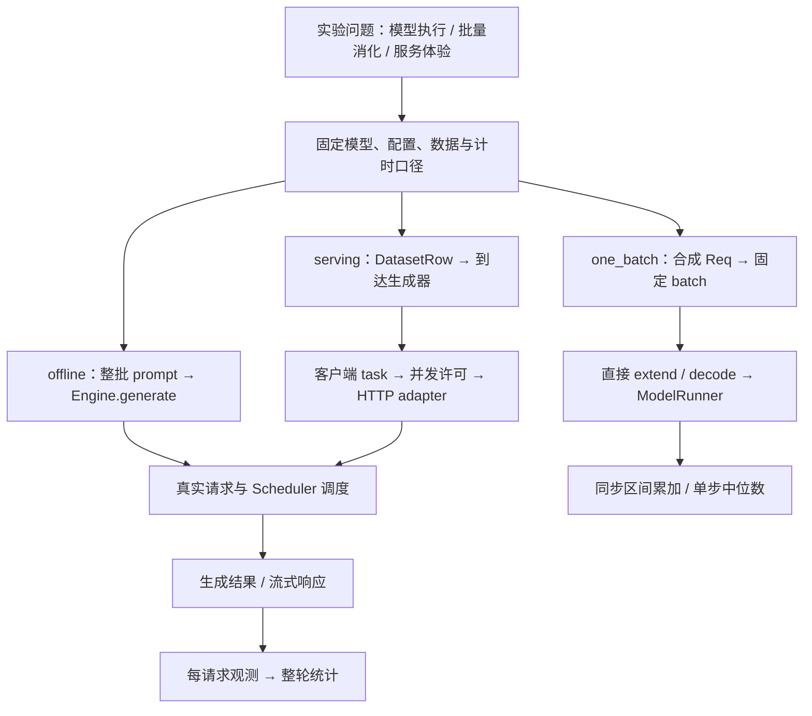
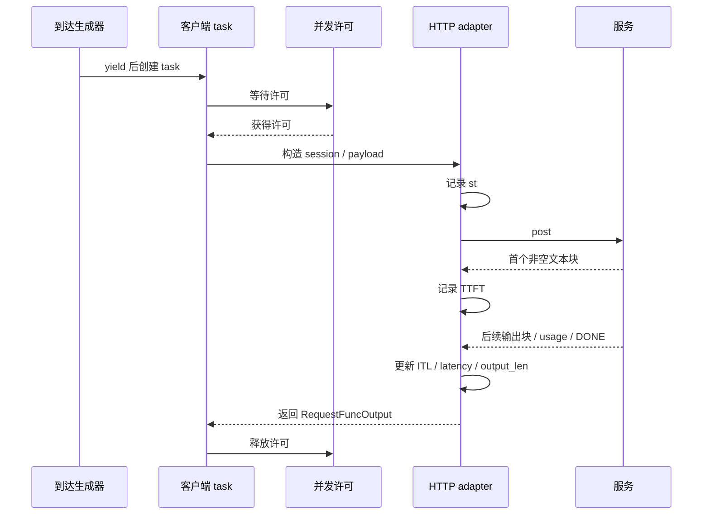

# Benchmark 设计与指标口径

本文是**源码分析型学习资料**。面向已经理解请求、调度、缓存和服务观测，准备回答“怎样测出一个有解释力的性能结果”的读者。

先写清楚**测了谁、送了什么请求、从哪里开始计时、哪些结果参与统计**，再比较数字。同名的 throughput 或 TTFT，可能来自不同边界。

## 0. 阅读基线与范围

| 项目 | 内容 |
| --- | --- |
| 源码路径基准 | SGLang 仓库根目录 `.`；所有源码路径均为仓内相对路径 |
| 读取工作区 | `sglang-source-study` 独立 Git worktree |
| 分支 | `codex/sglang-source-study-20260909`，基于官方 main |
| commit | `72d5c5bb73cadd7ffbf5114e5f81e29d36b6c61a` |
| 读取日期 | `2026-09-10` |
| 工作区状态 | 学习源码 worktree 干净；原源码工作区与 Wiki 其他资料保留 |
| 主线 | 普通 Dense 文本生成、单实例、TP/PP/DP 均为 1；在线主线用 native /generate、单轮、流式、无投机 |
| 三种测量 | PyTorch 静态单 batch；Engine 离线吞吐；普通 HTTP serving 全程统计 |
| 扩展 | OpenAI Completion/Chat 的流式差异、trace/多轮入口、稳态窗口；只解释影响口径的分支 |
| 不展开 | profiler 时间线细读、全平台跑分、真实硬件容量、精度评测、完整 PD/多模态/投机性能矩阵 |
| 操作边界 | 只读源码并编写文档；独立教学算术与文档检查；未导入项目、启动服务、请求管理接口、执行 benchmark、项目测试或 GPU 实验 |

前置：[00-05 基本账本](../00-foundations/05-吞吐延迟与显存的基本账本.md)、阶段 03—05，以及 [10-04 Metrics、日志与 Trace](../10-serving-operations/04-Metrics日志与Trace关联.md)。本文的数字和图均为**整理者归纳**；源码行为有固定锚点，实际运行观察为空。

### 0.1 先更新入口地图

目录计划中的三个旧模块现在都是弃用兼容包装：导入新实现、发 FutureWarning，再调用 cli_main。真正的阅读入口如下。[S1] [S2] [S3]

| 旧入口文件 | 当前实现文件 | 首先读什么 |
| --- | --- | --- |
| `python/sglang/bench_one_batch.py` | `python/sglang/benchmark/one_batch.py` | latency_test → latency_test_run_once |
| `python/sglang/bench_offline_throughput.py` | `python/sglang/benchmark/offline_throughput.py` | throughput_test → throughput_test_once |
| `python/sglang/bench_serving.py` | `python/sglang/benchmark/serving.py` | run_benchmark → benchmark → request adapter → calculate_metrics |

## 1. 人话版：秒表放在哪里，问题就变了

把推理服务想成餐厅。测“厨师连续做一桌菜”，测“餐厅消化一整批订单”，测“顾客按一定节奏点单后等多久”，是三种不同实验。

| 模式 | 测量对象 | 包含的主要工作 | 不足以证明 |
| --- | --- | --- | --- |
| one_batch，PyTorch 路径 | 人工构造的固定 batch | 准备执行 batch、模型 forward、采样、设备同步 | 真实请求准入、动态组批和 HTTP 服务能力 |
| offline，Engine 路径 | 一次批量 generate 调用 | Engine 请求处理、实际调度与生成，直到同步调用返回 | 某种线上到达率下的客户体验 |
| serving | 客户端发起的一组 HTTP 请求 | 请求发送、网络、服务处理、流式读取及客户端计时 | 纯 GPU kernel 性能或真实业务正确率 |

这三类结果可以互相帮助定位，但不能直接把 one_batch 的 token/s 当作 serving 的容量。offline 还有 Runtime 后端，内部路径与默认 Engine 后端不同；记录时必须写 backend。[S5] [S6] [S8] [S12] [S13] [S24]



**图意解读：** 方框表示测量职责，不是完整进程图。one_batch 绕过普通服务调度入口，自己准备 batch；offline 和 serving 会使用真实服务执行链。后者多出的环节不能靠换一个 throughput 名称消除。[S5] [S8] [S12] [S23]

## 2. 一条压测请求的对象账本

| 对象 | 谁创建 / 持有 | 保存什么 | 结束或交接条件 |
| --- | --- | --- | --- |
| DatasetRow | dataset loader | prompt、标称 prompt_len、output_len、媒体/时间戳/逐请求参数 | 被生成器交给压测循环；本篇以文本单轮为主 |
| RequestFuncInput | benchmark | URL、模型、请求内容、长度预算、LoRA、额外 body | 交给具体协议 adapter |
| asyncio task | benchmark 的 tasks 列表 | 一条请求或一组多轮请求的协程 | gather 收齐；列表顺序维持创建顺序 |
| semaphore | benchmark | 同时进入 adapter 的许可数 | adapter 或多轮 wrapper 返回后释放 |
| RequestFuncOutput | adapter | success/error、首包时间、累计延迟、ITL、输出长度与文本 | 返回后参与成功筛选与汇总 |
| BenchmarkMetrics | calculate_metrics | 吞吐、均值、分位数、并发估计 | 打印、组装结果并可追加 JSONL |

DatasetRow 的 text_prompt_len 缺省取 prompt_len，vision_prompt_len 缺省为 0，额外参数缺省为空字典。RequestFuncOutput 则先设 success=False、计时/长度为 0，再由 adapter 填写。**输入预算、协议回报 token 数、文本重新分词数是三本账。**[S14] [S19] [S20]

控制流决定“什么时候发”；数据流搬运 prompt、token IDs、JSON/SSE 与输出；统计只消费它真正记录到的字段。没有记录到的服务器排队时间或逐 token 设备时刻，不能事后凭空补出来。

## 3. one_batch：一个固定 batch 怎样被计时

### 3.1 合成请求不经过普通服务准入

默认合成输入是在 [0, 10000) 抽整数 IDs，构造 Req，并设置完整输入及 extend 范围；它不是一份自然语言任务集，也不能保证任意模型词表都适用这个 ID 区间。传入自定义 prompt 时则先分词，再按 batch 大小截取或重复最后一条。[S4] [S9]

PyTorch extend 自己创建 ScheduleBatch，使用只服务分配的 dummy tree cache，明确 enable_overlap=False、SpeculativeAlgorithm.NONE，再 prepare_for_extend → ForwardBatch → forward → sample。decode 同样准备 batch 后 forward 和 sample。因此这里的 Prefill 计时也包含首个输出 token 的采样。[S5] [S6]

### 3.2 测量区间与公式

_TorchBenchRunner.clear 清空请求映射池和 KV 分配器；并按 max_total_num_tokens // (input_len + output_len) 给出 batch 上限。超过上限时当前组合跳过，不会自动拆成较小 batch。模型加载位于正式计时前。[S7] [S8] [S9] [S10]

latency_test_run_once 的核心顺序是：

```text
clear
同步 → tic → extend → 同步 → Prefill elapsed
重复 output_len - 1 次：
    同步 → tic → decode → 同步 → 当前步 elapsed
累加各测量区间，汇总后 cleanup
```

这段是教学缩写，真实入口为 [S8]。同步前后的 CPU 工作、batch 准备和采样仍可能包含在区间内；它不是只用 CUDA Event 计某个 kernel。各步外的日志等也没有全部加入 total_latency。

令 batch 大小为 B、输入长度为 I、输出预算为 O：

| 字段 | 本实现公式 | 读者应注意 |
| --- | --- | --- |
| prefill_throughput | B × I / Prefill elapsed | 分子只算输入，区间内还做采样 |
| median_decode_latency | O−1 个 Decode 区间的中位数 | 是单步跨全 batch 的时间 |
| median_decode_throughput | B / median_decode_latency | 不是每个请求的 TPOT 均值 |
| total_latency | Prefill elapsed + 所有 Decode elapsed | 是区间和，不是进程启动到退出 |
| overall_throughput | B × (I+O) / total_latency | 输入、输出合计；不可当成输出吞吐 |

O=1 时没有 Decode 区间；不要把缺少 Decode 统计解释为 Decode 免费。自定义 prompt 的实际长度也要另核对：汇总仍使用传入的 input_len，不会自动按每条真实长度重算分子。[S8] [S9]

教学例：B=2、I=8、O=3，Prefill 0.08 s，两次 Decode 各 0.02 s。输入吞吐 200 token/s，Decode 吞吐 100 token/s，合计吞吐 22/0.12≈183.33 token/s。三个数字都对各自公式成立，回答的问题不同。

### 3.3 预热不是所有 shape 都已预热

latency_test 先用第一个 batch_size/input_len 组合预热，输出取 min(32, 第一个 output_len)，再遍历 B/I/O 的笛卡尔积。每个组合重新构造请求并测一次；它没有自动为每个 shape 做足够重复，不能据此证明后续组合已经处于稳定状态。[S9]

因此做 A/B 对照要保存具体 shape、实际 token 长度、graph/backend/量化等配置，以及重复轮次。不要把 sweep 里的一行当成自动完成统计置信度的实验。

## 4. offline：整批请求进入 Engine，测的是一次调用

throughput_test 创建 Engine 或 Runtime，准备 tokenizer 和数据，再调用 throughput_test_once。默认 backend 为 engine；Engine 的真实调度可能动态拆批，数据集的请求总数不是实际每轮 GPU batch 大小。[S11] [S13]

throughput_test_once 先组装全部 prompt 和每请求 sampling_params，再开始秒表：

```text
st → backend.generate(prompt 列表, sampling_params 列表) → 同步返回 → elapsed
```

Profiler 启动在计时前；停止、等 trace 文件、获取 server_info 都在 elapsed 截止后。与第 6 节 serving 的收尾边界不同。[S12]

输出 token 分子来自返回结果中 meta_info.completion_tokens 的和；输入分子来自 DatasetRow.prompt_len 的和。名为 successful_requests 的字段在函数开始直接设为 len(reqs)，这里没有像在线统计那样逐条过滤 success。若异常、缺少输出或返回内容不符合预期，应保留异常与返回列表核对，不能仅凭该字段宣称全部请求成功。[S12]

预热使用至多 16 条、目标输入 256、输出 16、range_ratio=1 的随机请求，默认执行，--skip-warmup 可跳过执行。预热样本的构造仍发生在该判断之前。预热后睡眠 0.5 s，再正式测量；这条驱动链没有显式 flush。[S13]

因此“模型已热”和“前缀缓存冷”需分别记录。last_gen_throughput 又只是从 server_info.internal_states[0] 取出的服务侧最近生成速率，不能代替整次 offline 输出数 / elapsed。[S12]

## 5. 数据集：标称 1024 输入，不一定真的送了 1024

### 5.1 随机范围的真实含义

get_dataset 根据名称选择 dataset 类，random 与 random-ids 共用 RandomDataset。前者从 ShareGPT 内容取 token IDs 后重复/截断；后者用整数构造 ID 序列，源码提醒这种输入可能引发 NaN 问题。不能把两者当作完全相同的工作负载。[S16] [S17] [S18]

compute_random_lens 对正 full_len 抽取的整数区间是：

```text
[max(int(full_len × range_ratio), 1), full_len]，两端包含
```

例如目标 8：ratio=0 允许 1—8；ratio=0.5 允许 4—8；ratio=1 固定为 8。输入长度与输出长度分别抽样。默认 ratio=0 并不表示固定长度。[S15] [S31]

### 5.2 text、IDs 和模板会改变计数边界

RandomDataset 默认返回文本。sampler 先从目标输入长度扣除 tokenizer.num_special_tokens_to_add，再把 IDs decode 成文本；服务端还会重新 encode。因此输入分子是 loader 保存的长度，不是一次服务响应自动校正后的真实 prompt token 计数。[S16] [S17] [S25]

--tokenize-prompt 让这一路返回整数 IDs；run_benchmark 明确只允许 backend=sglang，不能因为 sglang-native 也走 /generate 就推断参数检查同样放行。Chat template、模型特殊 token、tokenizer 版本和逐请求额外参数，也必须进入实验记录。[S16] [S30]

正式测量前分别留存：原始样本身份、实际送出的 text/IDs、应用模板后的内容、客户端标称长度，以及服务端实际 prompt/completion 计数。它们不一致时先解释差异，再比较吞吐。

### 5.3 长度之外，还要固定这些分布

| 工作负载维度 | 为什么影响结果 | 应保存的字段 |
| --- | --- | --- |
| 输入与输出的联合分布 | 短入长出和长入短出消耗不同 | 每请求 I/O；分位数、最大值，不只均值 |
| 公共前缀与请求次序 | 改变缓存复用和命中时机 | prefix group、共享长度、顺序、路由 key |
| 内容与生成规则 | 影响 EOS、投机、MoE 等路径 | 数据/模型版本、sampling、ignore_eos、约束 |
| 多轮历史 | 后续 prompt 随先前响应或占位内容增长 | session/round、历史构造方式 |
| 客户端 | 请求序列化、解码和任务等待也消耗时间 | CPU、进程数、协议、stream 设置、网络 |
| 数据复现 | seed 固定不代表远端数据永远相同 | 样本文件与 hash、tokenizer、seed、抽样顺序 |

GeneratedSharedPrefixDataset 的入口会传递 group 数、共享/问题长度、顺序、轮数、routing key 与分组分布等配置；具体选择会改变负载关系。这里给出实验维度，不把该入口存在当作真实 cache hit 证据。[S46]

## 6. serving：从到达计划走到首个可见输出

### 6.1 到达率和并发上限控制不同位置

普通 get_request 先 yield 当前请求，再从均值为 1/request_rate 的指数分布抽取等待；rate=inf 时不等待。最后一条 yield 后仍有一次抽样 sleep，然后生成器才结束。因此有限样本、低到达率下，尾部等待也可能进入整轮 duration。[S22]

benchmark 对每个 yield 创建 task；semaphore 则在 limited_request_func 内，取得许可后才进入协议 adapter。adapter 中的 st 又是在 session 和 payload 准备后、post 前记录。[S21] [S23] [S24]



**图意解读：** st 前的 task 排队不进入单请求 TTFT/E2E。图省略异常分支；抛出的异常在 adapter 内通常转为 success=False，async with semaphore 在离开时释放许可。这里的等待许可不等于 Scheduler 的 waiting_queue。[S23] [S24]

rate=inf 与 max_concurrency=K 常用于持续补充至多 K 个活动 adapter；没有并发上限时则尽快创建所有任务。有限 rate 与 K 同时使用时，生成器仍可继续创建等待许可的任务。客户端声明的发压速度不等于实际到服务端的速度，更不等于完成吞吐。

每请求都会创建自己的 aiohttp ClientSession；不能预设整轮共用一个长连接池。当前 session 总超时设为 6 小时、读取 buffer 为 10 MiB；这只是客户端配置，不是服务端 SLA。[S21] [S24]

### 6.2 单请求的秒表具体停在哪里

native adapter 以第一个包含非空 text 的响应块记 TTFT。该块可能合并多个 token，也可能晚于服务器内部的第一个 token。后续块用累计 completion_tokens 的增量，把块间隔平均分配到新增 token；新增量为 0 时不新增 ITL。[S24]

latency 在每个非空响应行被读取时更新，DONE 行也会更新；循环结束后保存最后一次值。它不是显式记录 TCP EOF 的时间，也不是最后一次 GPU forward 的时间。[S24]

### 6.3 整轮 duration 覆盖什么

benchmark_start_time 位于预热、可选 flush、1 s sleep 和 profiler 启动之后；之后创建/等待全部任务。在 gather 后，还可能停止 profiler、关闭进度条，并为 SGLang 查询一次 /server_info，才计算 benchmark_duration。[S23]

因此整轮吞吐分母包含发压间隔、客户端许可等待、请求执行与这些收尾操作。统计函数自身的重新分词、后续打印、第二次 server_info 查询与 JSONL 写文件发生在 duration 之后。[S23] [S25]

这种边界是源码事实，不表示所有基准都应使用它。报告中写“本工具全程 duration”，不要改称“纯推理耗时”；对很短的实验尤其要检查收尾占比。

### 6.4 trace 与多轮不能只看参数名字

通用 get_request 支持时间戳模式，但当前 benchmark 的普通分支只调用 get_request(input_requests, request_rate)，没有向它传递 use_trace_timestamps。结果标签却可能根据该 flag 显示 trace；单凭标签无法证明按 trace 节奏发出。[S22] [S23]

特例 backend=sglang 且 dataset=mooncake 会直接选专用生成器，按 trace 的相对毫秒时间乘 slowdown_factor 发起 session，忽略 request_rate。每个 session 的各轮随后成串 yield，历史中加入占位 assistant 文本，不等待上一轮真实回答。因此它与逐轮等待响应的真实交互是不同负载。[S23] [S47]

另一条 Chat 多轮 wrapper 会逐轮 await、把实际 generated_text 加入历史；外层许可覆盖整段 wrapper，最后扁平化结果时请求吞吐按轮计。普通 calculate_metrics 在该模式下收到 input_requests=None，输入 token 统计为 0；这是未按轮对齐统计，不能解释成模型没有输入。[S23] [S25] [S48]

## 7. 相同缩写，不同协议可能记录了不同事件

| 项目 | native /generate | OpenAI Completion | OpenAI Chat |
| --- | --- | --- | --- |
| 首次 TTFT | 首个非空累计 text | 首个非空 choices[0].text | 首个非空 content 或 reasoning 文本 |
| 后续 ITL | 块间隔 / completion_tokens 增量，并重复该次数 | 每个后续非空文本块的间隔 | 每个后续非空内容块的间隔 |
| 输出长度更新 | 非空 text 分支读取 meta_info.completion_tokens | 非空 text 分支读取 usage，缺省沿用旧值 | 可从 usage-only 块更新 completion_tokens |
| 缺少实际长度信息 | 特定异常会进入错误路径；未填充时需查回退预算 | 可能沿用请求的 output_len 预算 | 可能沿用请求的 output_len 预算 |
| 非流式 | 只有完整文本响应时才可见 | 同样不能据此还原首 token 时刻 | 明确设 TTFT=整体 latency |

依据：[S24] [S27] [S28] [S29]。不是所有服务器都按相同方式携带 usage，Completion 与 Chat 的空 choices 处理也不同，应按实际 adapter 检查。

对于 native，若首个非空块已经含 2 个 token，这 2 个 token 不会产生一个已知的内部间隔；之后把一个合并块平均拆成若干 ITL 也只是估计。它不能恢复各 token 的真实抵达轨迹。

Chat 会把 reasoning_content 或回退 reasoning 与 content 合并进入 generated_text；不能只以最终 answer 文本重新分词来解释它的 token 数。非流式 Chat 的 TPOT 公式甚至会因 TTFT=E2E 得到 0，ITL 列表为空也会汇总成 0；这些是观测边界，不代表模型没有 Decode 成本。[S25] [S28] [S29]

另一个条件分支：服务报告 accept_length>0，且 backend 为 sglang-oai 或 sglang-oai-chat 时，calculate_metrics 对每个后续 text_chunk 重新分词，再把块间隔按其 token 数拆开。该规则不会使所有 backend 的 ITL 自动可比，单独分词一个块也不保证等于对完整输出分词后的增量。[S25]

## 8. 汇总公式与 R1/R2/R3 手算

### 8.1 成功样本、请求权重和 token 权重

calculate_metrics 只将 success=True 的请求加入 TTFT、E2E、TPOT、ITL 和输入总数。失败项在 output_lens 中填 0；已经消耗的等待/运行时间仍留在整轮 duration 中。[S25]

令成功集合为 S，整轮时长为 T，每请求输出长度为 O：

| 指标 | 公式 / 样本集合 | 含义 |
| --- | --- | --- |
| Request throughput | 成功数 / T | 单轮主线的成功请求每秒 |
| Input throughput | 成功样本的 DatasetRow.prompt_len 总和 / T | 不等于实际新算 Prefill token/s |
| Output throughput | 成功样本的 output_len 总和 / T | 不包含失败项的部分输出 |
| Total throughput | 成功输入与输出总数 / T | 不能只写一个无说明的 token/s |
| TPOT | (E2E−TTFT)/(O−1)，仅 O>1 | 每请求先算一个值，再做均值/分位数 |
| ITL | 汇集成功项的 itl 列表 | 权重取决于 adapter 的 token/块拆分方式 |
| concurrency | 成功项 E2E 之和 / T | 成功活动区间的时间平均贡献，不包含许可等待 |

输出另有 retokenized 口径：tokenizer.encode(generated_text, add_special_tokens=False) 后求和。它与服务报告长度分列保留，不自动替代原 output_len。[S25]

### 8.2 三条请求的教学账本

假设整轮 T=1.00 s；以下不是实测。R1/R2 每个首块都只有 1 个 token，后续间隔按 native 口径记录。

| 请求 | prompt_len | output_len | adapter 开始 | TTFT | E2E | ITL 列表 | success |
| --- | ---: | ---: | ---: | ---: | ---: | --- | --- |
| R1 | 8 | 3 | 0.00 s | 0.10 s | 0.34 s | 0.10、0.12 s | True |
| R2 | 8 | 5 | 0.05 s | 0.15 s | 0.57 s | 0.08 s × 4 | True |
| R3 | 12 | 未完成 | 0.10 s | 不参加成功统计 | 不参加成功统计 | 不参加 | False |

R1 最后一个 token 的观测在 0.32 s，结束观测在 0.34 s；R2 最后 token 在绝对时刻 0.52 s，结束观测在 0.62 s。尾部协议耗时解释了 TPOT 与 ITL 均值为什么不一定相等。

- 成功请求吞吐为 2 req/s，成功输入 16 token/s，输出 8 token/s，合计 24 token/s；成功率另记 2/3。
- R1 TPOT=(0.34−0.10)/2=0.12 s；R2 TPOT=(0.57−0.15)/4=0.105 s；两请求等权均值为 **112.5 ms**。
- ITL 池有 6 个值，总和 0.54 s，均值为 **90 ms**；长输出贡献更多样本。
- 平均 TTFT 为 125 ms，平均 E2E 为 455 ms；工具 concurrency=(0.34+0.57)/1=**0.91**。
- 若 R2 的 task 在 0.01 s 创建，到 0.05 s 才进入计时，至少这段 0.04 s 不在其 TTFT/E2E 内。

这些教学公式按 [S23] [S24] [S25] 核对。分位数还必须同时报告样本数与筛选范围：两条成功请求的 p99 不能代表大规模尾延迟。

### 8.3 峰值、稳态、达标吞吐要另外定义

普通 calculate_metrics 根据 start+ttft 与累计 ITL 重建 token 时刻，并落入以首个成功请求开始为原点的 1 s 桶。max_output_tokens_per_s 因而是按这些观测重建的桶峰值；若首块合并、ITL 仍为块间隔，重建事件数可能不等于 output_len。[S25]

max_concurrent_requests 把请求覆盖到的整秒桶逐个加 1。两条在同一秒内先后执行、实际不重叠的请求，也可能落入同一桶；不要当作精确瞬时峰值。失败项也不进入这两种峰值统计。[S25]

达标吞吐（goodput）可在实验设计中另定义为“成功且同时满足约定 TTFT/TPOT 等门槛的请求数 / 指定窗口”。本篇这个普通 BenchmarkMetrics 没有该字段，不要将成功吞吐直接改名为 goodput。教学例若 TTFT≤200 ms、TPOT≤110 ms，只有 R2 达标，得到 1 req/s；门槛和是否把客户端许可等待纳入必须写明。

## 9. 预热、冷缓存和稳态是三个独立条件

### 9.1 在线预热与 flush 的真实顺序

在线 warmup 默认 1 条，复制第一条输入，输出预算最多 32；多个 warmup task 直接调用 request_func，不经过主测量的 limited_request_func。检查条件是“至少一条成功”，而不是全部成功。[S23] [S31]

预热完成后，仅在显式 flush_cache，或 SGLang backend 且 SGLANG_IS_IN_CI 为真时调用 flush_server_cache；普通本地默认不会因为存在那段 flush 注释就自动清缓存。调用成功后再 sleep 1 s，随后进入正式测量。[S23] [S26]

SGLang 的 flush helper 用 POST /flush_cache 并传 query timeout，默认 60 s，调用 raise_for_status；这里的 timeout 参数传给服务端，代码没有把它同时设置为 requests 的 HTTP 网络超时。HTTP handler 根据 TM 的 success 返回 200 或 400。[S26] [S31] [S49]

一次 flush 也不等于“整轮永远没有前缀复用”：正式样本之间仍可重新建立缓存。多层存储、外部缓存、路由与请求 namespace 的冷暖状态需分别记录，结合阶段 04 查证；不要只记一个 cold 布尔值。

### 9.2 固定基线还有独立的稳态 serving 报告

`python/sglang/benchmark/steady_state_serving.py` 在普通运行中捕获请求结果，再调用独立稳态计算器，保留普通全程结果；临时替换的 calculate_metrics 在 finally 恢复。[S35]

`python/sglang/benchmark/steady_state.py` 的窗口定义如下：

1. 只取成功且 latency>0 的请求，以开始 +1、结束 −1 建立精确时间事件。
2. 从活动区间求峰值；阈值为 ceil(峰值 × concurrency_ratio)，至少 1。
3. 选择并发不低于阈值的**最长连续区间**；等长时保留第一个。
4. 输入统计取成功且在 [start,end) 内开始的请求；completed 则数结束落在窗口边界范围内的成功请求，二者不是同一组对象。[S32] [S34]

输出仍由 TTFT/ITL 重建时刻，再按“落在闭区间 [start,end] 的事件比例”分摊每请求总 output_len；可能得到小数 token。它是统计估计，不是逐 token GPU 时间戳。窗口内平均并发使用活动区间与窗口交集的长度和 / 窗口时长。[S33] [S34]

测试里的教学形状可以帮助理解：一条请求活动于 [0,10]，另外两条于 [2,8]；ratio=0.8 时峰值 3、阈值 3，窗口选 [2,8]、长 6 s。相关测试还给出窗口内输出 9、吞吐 1.5、平均并发 3 的预期；本次只阅读，没有执行该测试。[S44]

### 9.3 同名“稳态”还可能指另一种窗口

`python/sglang/benchmark/stream_metrics.py` 的 BatchStreamRecorder 针对一次 batched streaming /generate：窗口从“最后一条请求收到首 token”到“第一条请求结束”。它保存累计 completion_tokens，对边界前后观测做线性插值；没有正时长、正输出的窗口时返回 None。[S36]

这是“全 batch 都已开始且尚无人结束”的窗口，与上一节“达到峰值比例的最长区间”不同，也没有自动接入本文普通 serving 主线。该文件的 validate_finish_reason 还会拒绝 NaN、异常终止及与 ignore_eos 冲突的提前停止；不能据此推断普通 HTTP adapter 已执行同样校验。[S24] [S37]

因此每份结果必须保留窗口定义；不能只写“取稳态，吞吐更高”。

## 10. 一份能复查的最小实验设计

以下是**后续实验设计**，当前未执行。先在适合的隔离环境中固定普通文本服务，再一次只改变一个变量。

| 对照步骤 | 固定项 | 变化项 | 需要回答的问题 |
| --- | --- | --- | --- |
| A：执行底座 | 模型、dtype、backend、硬件、I/O | one_batch 的 B | 固定执行规模如何影响各测量区间 |
| B：实际调度 | 同一批真实样本与 server 配置 | offline 请求总量 | 动态调度消化整批数据的成本 |
| C：服务主线 | 同一请求序列、协议、stream、缓存 | rate 与并发上限分开扫描 | 到达、客户端等待、成功延迟和吞吐如何变化 |
| D：缓存 | 内容分布与路由、其他配置 | 初始缓存状态 / prefix 关系 | 是否实际命中，命中是否减少当前瓶颈 |
| E：重复与窗口 | 完整配置和样本身份 | 独立轮次、预先声明的窗口 | 结果是否稳定，是否被短测收尾支配 |

每轮至少保存下表；完整参数对照将在 11-04 展开。

| 证据类别 | 必须记录的内容 |
| --- | --- |
| 版本与环境 | SGLang commit、模型/权重与 tokenizer revision、硬件与数量、驱动/运行时、启动命令与生效配置 |
| 工作负载 | 数据文件/hash、seed、真实样本数、逐条 I/O、特殊 token/模板、prefix group、请求次序、采样与 EOS |
| 发压条件 | 客户端机器、协议/backend、目标 URL 路径、stream、rate、并发许可、trace/多轮语义 |
| 计时定义 | 单请求 st 与最后观测位置、整轮 start/end、是否包括 profiler/server_info 收尾、warmup 和缓存条件 |
| 原始结果 | 成功/失败身份、状态与错误、输出/usage、首块和后续块时刻；需要的字段不能只靠摘要猜测 |
| 汇总 | 完成数、失败率、输入/输出/合计三种吞吐、TTFT/TPOT/ITL 样本数与分位数、窗口定义 |
| 结论边界 | 哪个变量支持结论、哪些请求被筛掉、哪些结果仅为近似、哪些动态验证未做 |

serving 的 --output-details 会保存 input_lens、output_lens、ttfts、itls、generated_texts 和 errors，并可加入缓存字段；默认文件以追加 JSONL 写入。当前 details 没有完整保存每请求 success、start_time、latency，不能仅凭这个文件复算所有 E2E 或任意时间窗口。要做那种复查需另外收集实际字段，并说明收集开销。[S23]

同一个结果文件可以累积多轮，但必须有能关联外部记录的 run 标识。不要把不同模型、负载或计时配置的行混在一起只取最优值。

## 11. 小白排障地图

| 现象 | 先检查哪本账 | 源码入口 / 证据边界 |
| --- | --- | --- |
| one_batch 很快，serving 吞吐较低 | 执行区间与端到端区间，真实组批、客户端瓶颈 | extend/decode 与 benchmark [S5] [S6] [S23] |
| 指定 1024，输入总数明显小 | ratio、special token 扣除、重新分词和失败筛选 | compute_random_lens / sampler / metrics [S15] [S17] [S25] |
| 设了 rate，服务实际到达不一致 | yield/sleep、许可等待、请求序列化 | get_request / limited_request_func [S22] [S23] |
| TTFT 不高，但用户等待很久 | st 前许可等待、上游队列、非流式行为 | benchmark 与 adapter [S23] [S24] [S28] |
| TPOT 与平均 ITL 对不上 | 请求等权 / token 或块加权、尾部时间 | calculate_metrics [S25] |
| 换成 Chat 后 ITL 或输出数改变 | reasoning、usage-only、块粒度、retokenization | 两个 OpenAI adapter [S27] [S28] |
| 第一轮和后续轮差异很大 | 模型预热与前缀缓存分开，正式样本间复用 | latency_test / throughput_test / benchmark [S9] [S13] [S23] |
| 高失败率时延迟反而下降 | 失败项被排除，只看成功分布会有偏差 | calculate_metrics [S25] |
| 所有请求失败后没有完整报告 | E2E 列表为空，部分统计仍直接求分位数 | calculate_metrics；只有 warning 不保证能生成有效结果 [S25] |
| 短测吞吐意外低 | 最后一次发压 sleep、server_info/profiler 收尾 | get_request / benchmark [S22] [S23] |
| max_concurrent_requests 超出直觉 | 整秒桶相交数与真实瞬时并发的差别 | 普通 metrics 与稳态事件算法分别看 [S25] [S32] |
| trace 标签正确，但节奏不对 | 实际 generator 分支与 flag 是否传递 | benchmark / Mooncake generator [S23] [S47] |
| success=True 但任务内容不正确 | adapter 的协议成功与模型语义正确性分开 | native adapter 未做业务精度判断 [S24] |

先保存失败原文与实际配置，定位计数或时间边界，再提出性能假设。这个顺序可以避免把发压器差异当成引擎退化。

## 12. 源码阅读路线与测试证据

### 12.1 带着问题回到代码

| 阅读问题 | 仓内相对路径 / 符号 |
| --- | --- |
| 静态 batch 到模型哪里接线 | `python/sglang/benchmark/one_batch.py::extend` [S5] |
| 单步、总时间怎么计算 | `python/sglang/benchmark/one_batch.py::latency_test_run_once` [S8] |
| 离线什么时候截断秒表 | `python/sglang/benchmark/offline_throughput.py::throughput_test_once` [S12] |
| 随机长度和文本从哪里来 | `python/sglang/benchmark/datasets/random.py::sample_random_requests` [S17] |
| 到达与许可控制谁先谁后 | `python/sglang/benchmark/serving.py::get_request` [S22]；`python/sglang/benchmark/serving.py::benchmark` [S23] |
| 原生接口首次/后续输出怎样计时 | `python/sglang/benchmark/serving.py::async_request_sglang_generate` [S24] |
| 成功筛选与公式 | `python/sglang/benchmark/serving.py::calculate_metrics` [S25] |
| 独立稳态怎么选窗口 | `python/sglang/benchmark/steady_state.py::find_steady_state_window` [S32] |
| batched streaming 的边界插值 | `python/sglang/benchmark/stream_metrics.py::BatchStreamRecorder` [S36] |

推荐顺序：先 DatasetRow → native adapter → calculate_metrics，再回 benchmark 看计时外围，最后比较 one_batch/offline。先把一次观测的来源弄清楚，再读统计结果。

### 12.2 本次只读的测试范围

| 测试文件与选读用例 | 能表达的预期 | 本次未证明 |
| --- | --- | --- |
| `test/registered/bench_fn/test_bench_serving_reasoning_stream.py`：reasoning-only stream、usage-only、reasoning-only non-stream 三个用例 | 固定 HTTP/SSE 样本怎样填文本、token 数与指标 [S38] [S39] [S40] | 真实模型性能、所有 OpenAI 协议差异 |
| `test/registered/bench_fn/test_benchmark_datasets_api.py`：backend flush 参数、模拟等待 idle、random sampler 三个用例 | HTTP 路径与 timeout 传递、文本/IDs 的类型 [S41] [S42] [S43] | 真正 Scheduler 已空闲、缓存完全冷、所有长度精确 |
| `test/registered/bench_fn/test_steady_state_benchmark.py`：trim 窗口、恢复普通计算器两个用例 | 合成观测的窗口预期、临时替换恢复 [S44] [S45] | 真实业务稳态、真实逐 token 时刻 |

总共三份测试文件的八个选定用例，只阅读定义和相关 helper，没有运行。独立教学算术检查也不等同于运行这些测试。

## 13. 练习、验收与下一篇

1. 为什么 B=2、I=8、O=3 的 one_batch 会有一次 Prefill 与两次 Decode？为什么 overall_throughput 分子是 22？
2. 若请求在客户端等许可 2 s 后才开始 adapter，HTTP 阶段 0.4 s，工具 E2E 能代表 2.4 s 吗？
3. ratio=0 与 ratio=1 对目标长度 8 各有什么含义？text 模式为什么还要复核服务端真实 token 数？
4. 用第 8 节手算 R1/R2 的 TPOT 均值与 ITL 均值；解释相差的两个原因。
5. 所有失败请求都从成功延迟分布排除后，为什么仍要保存失败率、错误和部分输出？
6. 为什么最长高并发窗口与“所有请求已出首 token、无人结束”窗口可能不同？只有 --output-details 文件能否重建任意窗口？

验收要点：首个输出在 Prefill 后采样；秒表边界不含所有等待；长度预算不等于实际长度；请求与 token/块权重不同；成功分布不能代替总体可用性；窗口定义及原始字段决定能否复查。

本篇已完成源码事实、49 个固定锚点、两张机制图和教学账本的静态核对。没有生成跑分、trace 或真实推理结论。下一篇：[11-02《Profiler 与时间线阅读》](02-Profiler与时间线阅读.md)，把这里的时间边界落实到可观测的 CPU/GPU 活动中。

[S1]: https://github.com/sgl-project/sglang/blob/72d5c5bb73cadd7ffbf5114e5f81e29d36b6c61a/python/sglang/bench_one_batch.py#L1
[S2]: https://github.com/sgl-project/sglang/blob/72d5c5bb73cadd7ffbf5114e5f81e29d36b6c61a/python/sglang/bench_offline_throughput.py#L1
[S3]: https://github.com/sgl-project/sglang/blob/72d5c5bb73cadd7ffbf5114e5f81e29d36b6c61a/python/sglang/bench_serving.py#L1
[S4]: https://github.com/sgl-project/sglang/blob/72d5c5bb73cadd7ffbf5114e5f81e29d36b6c61a/python/sglang/benchmark/one_batch.py#L451
[S5]: https://github.com/sgl-project/sglang/blob/72d5c5bb73cadd7ffbf5114e5f81e29d36b6c61a/python/sglang/benchmark/one_batch.py#L498
[S6]: https://github.com/sgl-project/sglang/blob/72d5c5bb73cadd7ffbf5114e5f81e29d36b6c61a/python/sglang/benchmark/one_batch.py#L537
[S7]: https://github.com/sgl-project/sglang/blob/72d5c5bb73cadd7ffbf5114e5f81e29d36b6c61a/python/sglang/benchmark/one_batch.py#L568
[S8]: https://github.com/sgl-project/sglang/blob/72d5c5bb73cadd7ffbf5114e5f81e29d36b6c61a/python/sglang/benchmark/one_batch.py#L748
[S9]: https://github.com/sgl-project/sglang/blob/72d5c5bb73cadd7ffbf5114e5f81e29d36b6c61a/python/sglang/benchmark/one_batch.py#L891
[S10]: https://github.com/sgl-project/sglang/blob/72d5c5bb73cadd7ffbf5114e5f81e29d36b6c61a/python/sglang/benchmark/one_batch.py#L309
[S11]: https://github.com/sgl-project/sglang/blob/72d5c5bb73cadd7ffbf5114e5f81e29d36b6c61a/python/sglang/benchmark/offline_throughput.py#L39
[S12]: https://github.com/sgl-project/sglang/blob/72d5c5bb73cadd7ffbf5114e5f81e29d36b6c61a/python/sglang/benchmark/offline_throughput.py#L226
[S13]: https://github.com/sgl-project/sglang/blob/72d5c5bb73cadd7ffbf5114e5f81e29d36b6c61a/python/sglang/benchmark/offline_throughput.py#L433
[S14]: https://github.com/sgl-project/sglang/blob/72d5c5bb73cadd7ffbf5114e5f81e29d36b6c61a/python/sglang/benchmark/datasets/common.py#L22
[S15]: https://github.com/sgl-project/sglang/blob/72d5c5bb73cadd7ffbf5114e5f81e29d36b6c61a/python/sglang/benchmark/datasets/common.py#L56
[S16]: https://github.com/sgl-project/sglang/blob/72d5c5bb73cadd7ffbf5114e5f81e29d36b6c61a/python/sglang/benchmark/datasets/random.py#L31
[S17]: https://github.com/sgl-project/sglang/blob/72d5c5bb73cadd7ffbf5114e5f81e29d36b6c61a/python/sglang/benchmark/datasets/random.py#L57
[S18]: https://github.com/sgl-project/sglang/blob/72d5c5bb73cadd7ffbf5114e5f81e29d36b6c61a/python/sglang/benchmark/datasets/__init__.py#L36
[S19]: https://github.com/sgl-project/sglang/blob/72d5c5bb73cadd7ffbf5114e5f81e29d36b6c61a/python/sglang/benchmark/serving.py#L85
[S20]: https://github.com/sgl-project/sglang/blob/72d5c5bb73cadd7ffbf5114e5f81e29d36b6c61a/python/sglang/benchmark/serving.py#L99
[S21]: https://github.com/sgl-project/sglang/blob/72d5c5bb73cadd7ffbf5114e5f81e29d36b6c61a/python/sglang/benchmark/serving.py#L71
[S22]: https://github.com/sgl-project/sglang/blob/72d5c5bb73cadd7ffbf5114e5f81e29d36b6c61a/python/sglang/benchmark/serving.py#L1056
[S23]: https://github.com/sgl-project/sglang/blob/72d5c5bb73cadd7ffbf5114e5f81e29d36b6c61a/python/sglang/benchmark/serving.py#L1338
[S24]: https://github.com/sgl-project/sglang/blob/72d5c5bb73cadd7ffbf5114e5f81e29d36b6c61a/python/sglang/benchmark/serving.py#L658
[S25]: https://github.com/sgl-project/sglang/blob/72d5c5bb73cadd7ffbf5114e5f81e29d36b6c61a/python/sglang/benchmark/serving.py#L1096
[S26]: https://github.com/sgl-project/sglang/blob/72d5c5bb73cadd7ffbf5114e5f81e29d36b6c61a/python/sglang/benchmark/serving.py#L978
[S27]: https://github.com/sgl-project/sglang/blob/72d5c5bb73cadd7ffbf5114e5f81e29d36b6c61a/python/sglang/benchmark/serving.py#L259
[S28]: https://github.com/sgl-project/sglang/blob/72d5c5bb73cadd7ffbf5114e5f81e29d36b6c61a/python/sglang/benchmark/serving.py#L376
[S29]: https://github.com/sgl-project/sglang/blob/72d5c5bb73cadd7ffbf5114e5f81e29d36b6c61a/python/sglang/benchmark/serving.py#L143
[S30]: https://github.com/sgl-project/sglang/blob/72d5c5bb73cadd7ffbf5114e5f81e29d36b6c61a/python/sglang/benchmark/serving.py#L1924
[S31]: https://github.com/sgl-project/sglang/blob/72d5c5bb73cadd7ffbf5114e5f81e29d36b6c61a/python/sglang/benchmark/serving.py#L2208
[S32]: https://github.com/sgl-project/sglang/blob/72d5c5bb73cadd7ffbf5114e5f81e29d36b6c61a/python/sglang/benchmark/steady_state.py#L64
[S33]: https://github.com/sgl-project/sglang/blob/72d5c5bb73cadd7ffbf5114e5f81e29d36b6c61a/python/sglang/benchmark/steady_state.py#L128
[S34]: https://github.com/sgl-project/sglang/blob/72d5c5bb73cadd7ffbf5114e5f81e29d36b6c61a/python/sglang/benchmark/steady_state.py#L162
[S35]: https://github.com/sgl-project/sglang/blob/72d5c5bb73cadd7ffbf5114e5f81e29d36b6c61a/python/sglang/benchmark/steady_state_serving.py#L75
[S36]: https://github.com/sgl-project/sglang/blob/72d5c5bb73cadd7ffbf5114e5f81e29d36b6c61a/python/sglang/benchmark/stream_metrics.py#L82
[S37]: https://github.com/sgl-project/sglang/blob/72d5c5bb73cadd7ffbf5114e5f81e29d36b6c61a/python/sglang/benchmark/stream_metrics.py#L33
[S38]: https://github.com/sgl-project/sglang/blob/72d5c5bb73cadd7ffbf5114e5f81e29d36b6c61a/test/registered/bench_fn/test_bench_serving_reasoning_stream.py#L153
[S39]: https://github.com/sgl-project/sglang/blob/72d5c5bb73cadd7ffbf5114e5f81e29d36b6c61a/test/registered/bench_fn/test_bench_serving_reasoning_stream.py#L215
[S40]: https://github.com/sgl-project/sglang/blob/72d5c5bb73cadd7ffbf5114e5f81e29d36b6c61a/test/registered/bench_fn/test_bench_serving_reasoning_stream.py#L305
[S41]: https://github.com/sgl-project/sglang/blob/72d5c5bb73cadd7ffbf5114e5f81e29d36b6c61a/test/registered/bench_fn/test_benchmark_datasets_api.py#L164
[S42]: https://github.com/sgl-project/sglang/blob/72d5c5bb73cadd7ffbf5114e5f81e29d36b6c61a/test/registered/bench_fn/test_benchmark_datasets_api.py#L204
[S43]: https://github.com/sgl-project/sglang/blob/72d5c5bb73cadd7ffbf5114e5f81e29d36b6c61a/test/registered/bench_fn/test_benchmark_datasets_api.py#L523
[S44]: https://github.com/sgl-project/sglang/blob/72d5c5bb73cadd7ffbf5114e5f81e29d36b6c61a/test/registered/bench_fn/test_steady_state_benchmark.py#L53
[S45]: https://github.com/sgl-project/sglang/blob/72d5c5bb73cadd7ffbf5114e5f81e29d36b6c61a/test/registered/bench_fn/test_steady_state_benchmark.py#L114
[S46]: https://github.com/sgl-project/sglang/blob/72d5c5bb73cadd7ffbf5114e5f81e29d36b6c61a/python/sglang/benchmark/datasets/generated_shared_prefix.py#L102
[S47]: https://github.com/sgl-project/sglang/blob/72d5c5bb73cadd7ffbf5114e5f81e29d36b6c61a/python/sglang/benchmark/datasets/mooncake.py#L50
[S48]: https://github.com/sgl-project/sglang/blob/72d5c5bb73cadd7ffbf5114e5f81e29d36b6c61a/python/sglang/benchmark/serving.py#L1298
[S49]: https://github.com/sgl-project/sglang/blob/72d5c5bb73cadd7ffbf5114e5f81e29d36b6c61a/python/sglang/srt/entrypoints/http_server.py#L985
