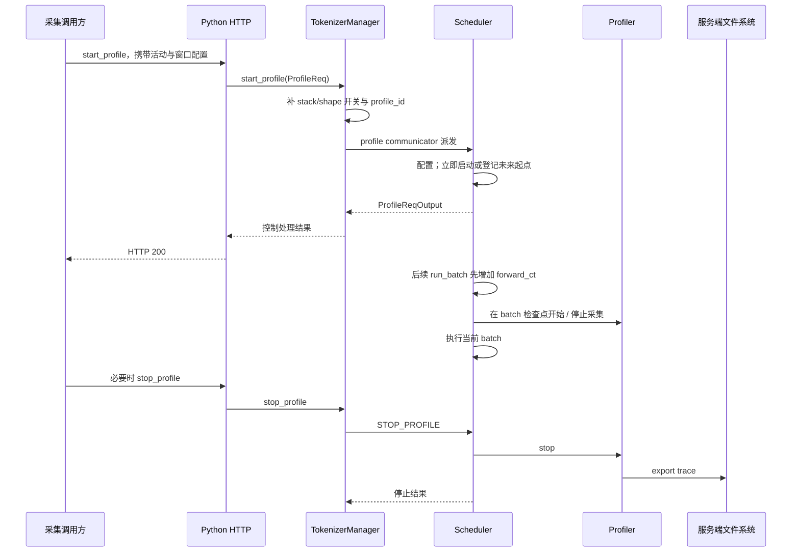
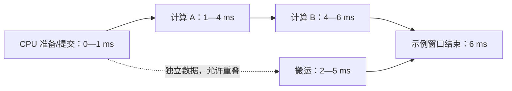

# Profiler 与时间线阅读

> **先建立架构心智模型：** [M11 · 网关服务治理与性能诊断全景](<../architecture/11-网关服务治理与性能诊断全景.md>)。先看职责、数据和生命周期，再回到本篇源码细节。

本文是**源码分析型学习资料**，面向已经知道 benchmark 在测什么，想进一步回答“这一段时间里 CPU、GPU 和通信各在做什么”的读者。

Profiler 的作用是提供事件证据。读时间线时，要沿着**请求 → 调度 batch → CPU 提交 → GPU 执行 → 结果可用**建立关系，不能仅按最长的彩色条给瓶颈下结论。

## 0. 阅读基线与范围

| 项目 | 内容 |
| --- | --- |
| 源码路径基准 | SGLang 仓库根目录 `.`；源码位置均用仓内相对路径 |
| 读取工作区 | `sglang-source-study` 独立 Git worktree |
| 分支 | `codex/sglang-source-study-20260909`，基于官方 main |
| commit | `72d5c5bb73cadd7ffbf5114e5f81e29d36b6c61a` |
| 读取日期 | `2026-09-10` |
| 工作区状态 | 学习源码 worktree 干净；原源码工作区与 Wiki 其他资料保留 |
| 主线 | Python HTTP、单 TokenizerManager、普通文本 Dense、TP/PP/DP=1；先看普通 Scheduler batch，再讨论 Overlap/Graph 与多 rank |
| profiler 主线 | SGLANG_PROFILE_V2=False；CPU/GPU 活动、profile_by_stage=False、无并发采集请求 |
| 扩展 | 分阶段采集、V2、NVTX、详细 step 标记、MEM、CUDA Graph capture、trace 合并和 PD 入口 |
| 不展开 | 全平台采集兼容性、Nsight 安装、真实模型跑分、完整 kernel 微架构调优、真实分布式时钟校准 |
| 操作边界 | 静态阅读、文档与独立教学账本检查；未启动 profiler/服务、运行模型或项目测试，未生成真实 trace、显存快照或性能结论 |

前置：[11-01 Benchmark 设计与指标口径](01-Benchmark设计与指标口径.md)、[05-05 CUDA Graph](../05-model-execution/05-CUDAGraph编译与执行模式.md)、[10-04 Metrics、日志与 Trace](../10-serving-operations/04-Metrics日志与Trace关联.md)。本文图表都是**教学归纳**，不是实际 trace 截图。

仓内官方指南为 `docs/docs/developer_guide/benchmark_and_profiling.mdx`。[S65] 本篇以实现核对其中的示例和边界，不把指南中的概括自动当成已运行事实。外部工具补充读取于 2026-09-10：PyTorch 2.14 [Profiler](https://docs.pytorch.org/docs/2.14/profiler.html)、[CUDA 异步语义](https://docs.pytorch.org/docs/2.14/notes/cuda.html#asynchronous-execution)、[显存快照](https://docs.pytorch.org/docs/2.14/torch_cuda_memory.html)，NVIDIA [Nsight Systems](https://docs.nvidia.com/nsight-systems/UserGuide/index.html) 与 [Nsight Compute](https://docs.nvidia.com/nsight-compute/ProfilingGuide/index.html)，以及 [Perfetto 阅读入口](https://perfetto.dev/docs/quickstart/trace-analysis)。这些版本说明不代表本机已安装相同工具。

## 1. 人话版：三块表，三个问题

端到端 benchmark 像顾客手里的秒表，CPU timeline 像调度员的工作记录，GPU timeline 像机器真正开工的记录。它们有关联，起止点却不同。

| 观测 | 主要回答 | 不能直接代替 |
| --- | --- | --- |
| 请求 TTFT/E2E、服务 Metrics、OTLP Trace | 请求在服务链路里等了多久、经过哪些阶段 | 每个 GPU kernel 的执行和依赖 |
| PyTorch Profiler | 算子、CPU 范围、设备活动与调用关系 | 真实业务成功率或无采集开销的性能 |
| Nsight Systems | 进程/线程、CUDA API、kernel、stream 与 NVTX 的时间关系 | 单个 kernel 全部硬件计数器分析 |
| Nsight Compute | 选定 kernel 或范围的硬件指标 | 原样保持整个 serving 工作负载的时间关系 |
| MEM 快照 | allocator 记录的分配、释放与内存状态 | 整块设备上所有外部分配或实际带宽 |

最后两类尤其要分清：Nsight Compute 的指标采集可能需要 replay；MEM 记录的是内存对象状态。它们不等于“这一秒 GPU 处理了多少业务请求”。参见 [Nsight Compute 采集机制](https://docs.nvidia.com/nsight-compute/ProfilingGuide/index.html)与 [PyTorch 显存可见范围](https://docs.pytorch.org/docs/2.14/torch_cuda_memory.html)。

本文先选择最容易复查的主线：向运行中的服务发采集控制请求，由各 Scheduler 在自己的进程中启动 profiler，最后写各自 trace。

## 2. 从 HTTP 控制请求到 Scheduler



**图意解读：** 控制回包与未来采集窗口是两条时间线。图中的自动停止和手动停止是可选路径，不要求二者重复执行；已经自动停止后再 stop，默认实现会返回“不在采集中”。[S2] [S3] [S5] [S6] [S8] [S13] [S15] [S16]

### 2.1 谁创建和保存这些对象

| 对象 / 状态 | 所有者 | 用途与寿命 |
| --- | --- | --- |
| ProfileReq | 调用方 → TM → Scheduler | 活动、步数、路径、profile_id 与选项 |
| profile_communicator | TM | 派发并等待预期 fan-out 数的控制回复 |
| SchedulerProfilerManager | 每个 Scheduler | 管理计划起点/终点、分阶段计数、真实 profiler |
| torch_profiler | 默认管理器 | start 到 stop/export 期间收集活动 |
| forward_ct | Scheduler | run_batch 的累计调用编号，不是请求数 |
| detailed annotation 开关 | Scheduler 所在进程 | 决定所有相关 ModelRunner 的 step 标签是否带聚合量 |
| rank trace | 服务端输出目录 | 停止后导出的文件；需与该次 profile_id 对齐 |
| merged trace | 选定 rank 的合并器 | 对已发现文件做展示整理，不替代原始文件 |

依据：[S4] [S7] [S9] [S10] [S11] [S14] [S16] [S19]。同一个请求可能跨许多 forward，一个 batch 也可能包含许多请求；投机时一个 Scheduler batch 还可能调用多个 runner。

### 2.2 HTTP 成功到底证明了什么

Scheduler.process_input_requests 调用 dispatcher 后，只要得到 output 就立即送回；_profile 对延后起点/分阶段请求返回配置结果，对立即启动请求返回启动结果。这里没有“等 num_steps 全部完成再回复”的 future。[S8] [S13]

因此 `python/sglang/profiler.py::run_profile` 中“API 等文件生成后才回复”的注释，与这条固定实现不一致。工具只在 POST 返回后返回目录字符串；它没有轮询该目录的 trace 是否已经完成。[S1]

TM 的 communicator 会等预期回复数收齐，但 _execute_profile 随后只检查 results[0] 的 success。扩展到多 worker 时，不能用这个 HTTP 200 证明每个 worker 都成功配置或导出。[S6] [S7]

### 2.3 路径由哪台机器解释

run_profile 在**调用方**创建 output_dir/时间戳目录、写 server_args.json，再把该路径字符串发送给服务端。Scheduler.export 使用的是**服务进程看到的文件系统**。远程 URL 不会自动把服务端 trace 下载到本机。[S1] [S14] [S16]

若使用相对输出路径，基准是实际进程工作目录；它不同于本文源码路径的仓库根目录约定。多节点自动合并需要各 rank 的文件对合并进程可见，不能仅创建一个同名本地目录。

## 3. 默认实现：采集窗口在 batch 前检查

SGLANG_PROFILE_V2 默认 False。以下先只讲这条默认路径。[S11] [S18]

### 3.1 参数先经过 TM，再到 profiler

ProfileReq 中 with_stack 与 record_shapes 默认 None；TM 会结合环境变量把它们变成布尔值。请求显式 False 或对应环境关闭，最终才为 False；这条 HTTP 路径缺省二者为 True。[S4] [S5]

不要只看 _start_profile 内部 record_shapes=None 时回退 False，就认定 HTTP 默认不采 shape。不同入口的缺省可能不同：one_batch.start_profile 直接使用自己的 profile_record_shapes 参数，默认 False；Engine.start_profile 则构造 ProfileReq 后交给 TM。[S14] [S49] [S50]

| 字段 | 默认主线的解释 | 需要明确的条件 |
| --- | --- | --- |
| activities | 未提供时 CPU/GPU | MEM、CUDA_PROFILER 等走独立分支 |
| output_dir | 请求值或服务端 SGLANG_TORCH_PROFILER_DIR，回退 /tmp | 输出位置不是 HTTP 返回附件 |
| start_step | 累计 forward 编号门槛 | 不是“从此再等待 N 步” |
| num_steps | 正数时建立停止门槛 | 停止仍依赖后续检查 |
| profile_by_stage | 分别计 prefill/decode 类检查 | 与普通累计计数路径不同 |
| detailed_annotations | 默认 False | 开启后按 CPU 长度镜像拼接标签 |
| merge_profiles | 默认 False | 文件可见性、命名与读错误另核对 |
| profile_stages | 默认实现未消费该过滤项 | 不能因请求字段存在就推断生效 |

依据：[S4] [S12] [S13] [S14] [S15]。本篇教学窗口使用正整数 num_steps；字段声明允许 None，不代表每种分阶段配置都能正确推进。

### 3.2 普通累计计数的精确顺序

Scheduler.run_batch 先执行 forward_ct += 1，再调用 _profile_batch_predicate，之后才进入 forward 或其他 batch 分支。计数还发生在 PREBUILT 分支判断之前，因此不能把这个编号无条件理解为“完成了多少次 GPU forward”。[S10]

设收到配置时 forward_ct=C。默认 _init_profile：

- 有正 start_step 时，起点 A=max(start_step,C+1)。
- 同时有 num_steps=N 时，停止门槛为 A+N。
- 立即启动且有 N 时，停止门槛为 C+N+1。
- 没有有效 N 时，普通模式不建立自动停止门槛。[S12]

每次 batch 前先判断是否达到停止门槛，再判断是否等于延后起点。[S15]

普通模式的关键分支如下，省略了前面的 V2 和分阶段路径；方法名中的 predicate 在这里还负责触发状态变化，并非只返回一个布尔值：

```python
if (
    self.profiler_target_forward_ct
    and self.profiler_target_forward_ct <= self.get_forward_ct()
):
    self._stop_profile()
if (
    self.profiler_start_forward_ct
    and self.profiler_start_forward_ct == self.get_forward_ct()
):
    self._start_profile()
```

这段顺序使停止边界落在当前 batch 执行前，也解释了下面为什么需要额外一次检查。[S15]

### 3.3 C=40、start_step=43、num_steps=2 的逐步账本

| 时刻 | forward_ct | 管理器动作 | 当前 batch 是否在窗口 |
| --- | ---: | --- | --- |
| 控制请求处理 | 40 | 登记起点 43、终点 45；回复配置成功 | 尚未开始 |
| 下一 batch 前 | 41 | 都未触发 | 否 |
| 再下一 batch 前 | 42 | 都未触发 | 否 |
| 目标 batch 前 | 43 | start | 是，第一批 |
| 下一 batch 前 | 44 | 保持采集 | 是，第二批 |
| 再下一 batch 前 | 45 | stop/export，然后执行 batch | 否 |

这是按 [S10] [S12] [S15] 推导的教学表，不是运行日志。

若服务只执行到 batch44 就没有后续 batch，达到“已采两批”并不会主动唤醒另一只计时器来 export。后续有检查或手动 stop 才会推进收尾。start_step=3 而 C 已经是 40 时，实际起点会是 41，也不是再跳过三批。

立即启动模式还可能采到第一批到来前的空闲时间；其 num_steps 门槛只限制后续 batch 检查，不会把这段空闲自动裁掉。

### 3.4 不能把一次配置视为任意可重入事务

_init_profile 在 profile_in_progress 时会返回失败；但 _profile 的“立即启动”分支没有检查这个返回值，随后仍调用 _start_profile。自动 predicate 对 _start_profile/_stop_profile 返回值也没有统一的错误传播处理。[S12] [S13] [S15]

因此本篇主线排除并发或重复 start。遇到启动/停止错误要保留管理器日志与各 rank 状态，不把接口设计成无条件重试即可恢复的事务。当前没有进行异常注入，也不修改该实现。

## 4. 分阶段采集和 V2：要重新核对计数单位

### 4.1 默认分阶段路径

profile_by_stage=True 且提供正 N 时，默认实现分别初始化 prefill/decode 计数为 0，目标都为 N。首个 prefill 检查启动，先自增再用 >N 判断停止；首个 decode 会先关闭尚未结束的 prefill 采集，再启动 decode。[S12] [S15]

SGLANG_PROFILE_BY_STAGE_DECODE_MIN_BS>0 时，首个 decode 的 batch_size 未达门槛则暂不启动 decode 采集。这里看的是当前 batch 大小，不保证全部业务请求已经准入或以后不退出。[S15]

这种逻辑适合先理解连续 Prefill、再连续 Decode 的教学序列；不能把它当作任意交错阶段的独立过滤器。也不要省略 num_steps 后假定计数器自动合理初始化。[S12] [S15]

名字还有一层差异：ForwardMode.is_prefill 复用 is_extend，后者包含 MIXED、TARGET_VERIFY 等；而详细标签把 TARGET_VERIFY 归入 g_ 聚合。**采集分组谓词与请求语义标签不是同一套分类。**[S24] [S27]

### 4.2 V2 是另一套约束

显式开启 SGLANG_PROFILE_V2 后，管理器使用 ProfileManager 和 _StageBasedTrigger。configure 要求 start_step=None、profile_by_stage=True、merge_profiles=False；profile_stages 才用于选择感兴趣阶段。manual_start/manual_stop 尚未实现，不能沿用普通手动控制工作流。[S11] [S36] [S40]

V2 step 把 ForwardMode 转成 prefill/decode 类别，idle 不推进；切换阶段或达到计数条件时 stop，再按配置决定是否启动新阶段。完成过的阶段会从 stage_configs 删除。[S37] [S62]

这版计数还值得逐项读：首次进入设 curr_count=0；后续同阶段检查先 +1，超过 N 才停止。N=2、连续同阶段时，检查序列为：

| 检查 | 操作后计数 | 动作 |
| --- | ---: | --- |
| 第 1 次 | 0 | start，随后执行当前 batch |
| 第 2 次 | 1 | 继续执行 |
| 第 3 次 | 2 | 继续执行 |
| 第 4 次 | 3 | >2，stop 在当前 batch 前 |

因此从该路径可静态推得连续窗口会包含前三个 batch，不能直接把参数 2 当作恰好两批。阶段提前切换则会提前收尾。这里记录实现边界，不宣称已验证设计意图或给出修复。[S37]

V2 在 _do_start/_do_stop 设置和清除详细标记开关，使用具体 profiler 的 start/stop 导出文件；Torch stop 后也做 cpu_group barrier，但未迁移自动合并。[S38] [S39] [S63]

## 5. stop、导出与“文件已存在”的证据层级

默认 CPU/GPU 路径创建 torch.profiler.profile 并 start。停止时执行 profiler.stop → export_chrome_trace → dp_tp_cpu_group barrier → 可选 merge → 清理对象、gc、状态和详细标记开关。[S14] [S16]

常规文件名包含 profile_id 与 TP rank，DP/PP/EP 仅在对应 size>1 时追加；可加 profile_prefix 和阶段后缀。NPU、RPD、MEM 等路径不同，不能假设都产生相同 JSON 文件。[S16]

| 看到的证据 | 能说明 | 仍需核对 |
| --- | --- | --- |
| start HTTP 200 | 控制配置/启动路径返回 | 活动是否真正开始，是否走目标实现 |
| Profiling starts 日志 | 到达启动调用附近 | 后续 start 是否失败、活动是否有效 |
| stop HTTP 200 | 所检查回复走完停止路径 | 多 worker 结果、merge 是否带失败消息 |
| 某个 .trace.json.gz 存在 | 文件路径有产物 | 可解压/解析、事件非空、窗口与身份 |
| merged 文件存在 | 合并器写出了结果 | 是否缺 rank、跳过损坏文件、时钟是否一致 |
| 查看器可打开 | 该格式可读 | 是否采到目标模型和目标阶段 |

停止导出包含 I/O、barrier 与 gc，它们可能造成观察扰动；不要把导出期间服务的暂停或抖动直接归为常态模型性能。[S16]

### 5.1 三个容易忽略的合并边界

ProfileMerger 先按 profile_id*.trace.json.gz 发现含 TP- 的文件，再按 rank 排序读取，拼接 traceEvents。_process_events 调整 pid 展示标签和部分 sort_index，**没有校准 ts 或做跨机器时间平移**。[S32] [S33] [S35]

文件名前若加了 profile_prefix，默认 export 会生成“prefix-profile_id...”形式，而当前发现模式从 profile_id 开头匹配；该组合可能找不到刚导出的文件。使用唯一 profile_id 并核对实际文件清单，不能只相信 merge_profiles=True。[S16] [S33]

_handle_file 读失败会记录错误并返回空事件；合并器仍可写出 merged 文件。_merge_profile_traces 自己失败时也只把错误拼到消息，_stop_profile 最后仍返回 success=True。HTTP handler 又没有把这条详细消息作为正文展示。[S3] [S16] [S17] [S34]

自动合并由满足 TP0 及启用的 DP/PP/EP 零 rank 条件的进程执行；barrier 作用于传入的 cpu group，不凭名字就代表所有独立 P/D 实例或远端文件都齐备。[S17] [S16]

## 6. 时间线上的 step 与 layer 标签从哪里来

### 6.1 step 标签包住的是主机侧调用范围

ModelRunner.forward 生成 build_step_span_name，再用 profile_range 包住 _forward_raw 及该范围内的相关处理。普通 EXTEND 标签包含 bs 与 toks，其他模式至少包含模式名与 bs。[S19] [S20]

profile_range 发现 torch profiler 活跃才进入 record_function；可选 NVTX 发射另受 nvtx_enabled 控制。Scheduler 的若干阶段装饰器也使用该机制，形成 scheduler.run_batch 等标记。[S21] [S22] [S23]

这证明有主机侧范围标记，不能单凭标签就说 GPU 在相同起止时刻执行完。PyTorch 的 GPU 调用通常异步提交，同 stream 有序，不同 stream 的依赖要看同步关系；解释时应沿关联事件和设备轨道核对。[PyTorch CUDA 语义](https://docs.pytorch.org/docs/2.14/notes/cuda.html#asynchronous-execution)

因此也不能把一行 step 的名字当作一次独立硬件采样。未开启 detailed_annotations 时不计算那些聚合后缀，但基础标签构造和 profiler 检查仍存在，不应写成整个路径绝对零开销。

### 6.2 detailed_annotations 的四个数

令每条请求当前查询宽度为 q、可见 KV 长度为 k，后缀计算：

| 字段 | 公式 | 是什么，不是什么 |
| --- | --- | --- |
| sq | Σq | 当前查询 token 的聚合规模 |
| sk | Σk | KV 长度聚合，不是字节数 |
| sqsq | Σq² | 查询长度平方和 |
| sqsk | Σ(q×k) | 查询与 KV 长度乘积和，不是已测 FLOPs |

EXTEND 使用 q=extend_seq_lens_cpu、k=prefix+q；普通 DECODE 使用 q=1、k=seq_lens_cpu。TARGET_VERIFY 和投机 draft decode 可从 spec_info.num_tokens_per_req 取更宽的 q。[S24] [S25] [S26]

R1 输入 8 个 token、无前缀命中；R2 同样总长 8，但已有前 6 个 token 的 KV，本次只处理 2 个。教学上 q=[8,2]、k=[8,8]：

```text
step[EXTEND bs=2 toks=10 c_sq=10 c_sqsq=68 c_sqsk=80 c_sk=16]
```

下一轮普通 Decode 若 k=[9,9]，则 g_sq=2、g_sqsq=2、g_sqsk=18、g_sk=18。这些数字描述 batch 工作形状；没有包含层数、head 数、dtype、因果掩码、算子融合和访存实现，不能据此直接宣布达到某个 roofline 效率。[S19] [S24] [S26]

MIXED 后缀用 q==1 将某行分到 generation 组，是该标签的分类规则；缺少所需 CPU 镜像则可能只输出基础标签。需要把语义回到实际 batch，避免把标签归纳当成独立生命周期证明。[S24]

### 6.3 layerwise NVTX 和上述标记是两套接线

ModelRunner.load_model 在 enable_layerwise_nvtx_marker 时注册 PytHooks，前缀为 model。它遍历模块，跳过 Identity/Dropout 等，在 pre-hook 写入模块名、本地参数形状、输入 tensor 形状和部分静态参数；forward hook 只负责 range_pop。[S28] [S29] [S30] [S31]

这条实现使用 torch.cuda.nvtx；前面 scheduler/operations 的可选 NVTX 辅助路径则检查独立 nvtx 包和环境门控。不能因为一种标记出现，就推断另一种已经启用。[S21] [S22] [S28]

CUDA Graph replay 不会像 eager 那样重新执行所有逐层 Python hook。若为了源码定位另采 eager 对照，应明确它改变了执行方式；保留原 graph 模式的基准，不把 eager 的时间直接作为 graph 性能。Nsight 的 graph/node 采集粒度也由实际版本和选项决定。[Nsight Systems CUDA Graph Trace](https://docs.nvidia.com/nsight-systems/UserGuide/index.html#cuda-graph-trace)

## 7. 给小白的一条时间线阅读顺序

先验证产物身份，再缩放到一个代表区间。Perfetto 等工具可以浏览时间轨道并做进一步查询；具体支持的导入格式以实际 trace 和查看器为准。[Perfetto 入口](https://perfetto.dev/docs/quickstart/trace-analysis)

1. **确认采到谁。** 检查模型/配置、机器、PID、rank、设备、profile_id、事件数和起止范围。不要先在全图找最宽的条。
2. **确认属于哪类 batch。** 搜 step[EXTEND 或 step[DECODE，结合 bs/toks/聚合后缀核对长短输入与缓存条件。
3. **读主机范围。** 看 recv/process/get_next_batch/run_batch/result 等阶段是否连续；哪个线程在执行，哪个在等待。
4. **找到提交与设备活动。** 从 CPU 算子或 CUDA API 追关联的 kernel、memcpy、stream，不按名字相似就强行对应。
5. **找结果依赖。** 某个 GPU 工作完成之后谁才能继续？下一计算是否等数据、通信、CPU 发射或其他 stream？
6. **回到请求观察。** 当前窗口覆盖 TTFT 还是 Decode？采集之外的前端/网络/客户端等待需要另找证据。
7. **提出下一步对照。** 每个“可能的瓶颈”都写出一个能排除它的检查，而不是把图当成最终根因。

### 7.1 一组教学区间：为什么总和不等于经过时间

以下仅是抽象的区间练习，不是 SGLang 实际 trace。假设某设备从 0 到 6 ms 的观察窗口中：

| 轨道 | 事件 | 区间 | 时长 |
| --- | --- | --- | ---: |
| GPU compute stream | 计算 A | [1,4] ms | 3 ms |
| GPU compute stream | 计算 B | [4,6] ms | 2 ms |
| GPU copy stream | 与 A 独立的数据搬运 | [2,5] ms | 3 ms |
| CPU | 准备和提交 | [0,1] ms | 1 ms |

GPU 各事件时长相加是 8 ms，但设备活动区间并集为 [1,6]，只有 5 ms；整个观察窗口则是 6 ms。8/6>100% 只说明把重叠工作相加了，不是“设备效率超过物理上限”。



**图意解读：** 箭头表达本练习假设的依赖，不按横向长度绘制真实时间比例。若 A 实际依赖这次搬运，给定区间和依赖就需要重新核对；不能为了展示重叠而添加不成立的数据关系。

上表也不能直接变成 SM 利用率或带宽百分比。那些指标需要额外硬件计数与合适的分母。若只看总表，嵌套的父/子算子时间还可能重复计入；先看是否 self time、total time，以及使用哪组区间。

### 7.2 把常见图形转成可证伪假设

| 观察到的形状 | 可以提出的假设 | 还必须检查 |
| --- | --- | --- |
| GPU 前有空档，CPU 仍忙 | 输入准备、调度或发射影响供给 | 活跃线程、对应 batch、其他 stream、采集边界 |
| GPU 空档、CPU 同步调用很长 | 主机在等先前设备工作或跨 stream 条件 | 被等待事件、产生它的 stream/设备、实际依赖 |
| 大量很短 kernel 与发射间隔 | 发射开销或小 batch 可能显著 | graph/eager、shape、融合、真实工作量 |
| Attention 区间增长 | q/k 形状、缓存、后端或访存路径变化 | 同层同 shape、KV dtype、实际命中和后端 |
| GEMM 时间占比较高 | 矩阵规模/精度/实现可能主导 | 输入 shape、量化/packing、是否相同层与同一 workload |
| collective 很长 | 通信、到达不齐或前序 rank 工作造成等待 | 所有参与 rank、拓扑、消息量、先后依赖 |
| memcpy 与计算串行 | 数据就绪或 stream 同步限制重叠 | 搬运方向/字节数、内存类型、调用和等待链 |
| 图里没有预期 kernel | 采集活动、进程、graph 粒度或窗口不匹配 | 先证明采到了目标，不把“没看见”当“没执行” |

这是诊断方法，不是本次运行结论。对于通信区间，先确定哪个 rank 最晚准备好；一条很长的 collective 不能单独证明网络带宽不足。

### 图解补充：把 CPU 线程与 GPU stream 对齐阅读


[查看原尺寸](../../../images/sglang-source-study/35-profiler-trace.png)（手机查看宽图时可横屏或放大）。

**图意解读：** 先找 CPU 线程行和 GPU stream 行，再比较色块起止与空隙。上层算子范围和下层 kernel 范围不应简单逐块一一对应。

**对应本篇源码：** 按本节顺序读范围、时间与依赖，再回到 ProfilerManager 的采集窗口和导出流程；截图只是读法练习。 [源码：python/sglang/srt/managers/scheduler_components/profiler_manager.py][S11]

**来源与边界：** [PyTorch Profiler](https://docs.pytorch.org/tutorials/recipes/recipes/profiler_recipe.html)，PyTorch，未标独立发布日期。这是 PyTorch 官方 ResNet/conv2d 示例截图，不是本系列采集的 SGLang trace；图中的耗时、算子名和利用情况不能用作本次性能结论。 [来源档案 F35](../../../images/sglang-source-study/SOURCES.md#f35)。

## 8. CUDA Graph：运行期 replay 与建图期 capture 分开采

普通 /start_profile 观测后续服务活动；启动或重新捕获图的工作，另由 DecodeCudaGraphRunner.capture 的 enable_profile_cuda_graph 路径包住。即使都使用 PyTorch Profiler，测量阶段也不同。[S41]

| 组合 | 固定实现的输出方式 | 关键条件 |
| --- | --- | --- |
| enable_profile_cuda_graph | 创建 capture profiler，输出统计表和 memory snapshot | 来自 Decode runner 的 capture 路径 |
| 再加 SGLANG_ENABLE_CUDA_GRAPH_CAPTURE_TRACE | 整段 capture 的合并 trace，按 runner/TP 命名 | 该环境开关控制 trace export |
| 再加 SGLANG_GRAPH_BATCH_CAPTURE，且未开上一项 | 每个 capture batch size 一份 trace | wait=2、warmup=0、active=1 的循环 schedule |
| 两种 trace 环境开关都开 | 整段 trace 优先 | _graph_batch_capture_active 显式排除合并开关 |

依据：[S41] [S42] [S43] [S45] [S64]。

FullCudaGraphBackend.capture_one 在两次 warmup 后各推进一次 profiler.step，再进入 capture，并在后续推进 schedule；目的是跳过 dummy runs，把对应捕获区间写入每 shape 的文件。这里的 profiler.step 是 PyTorch schedule 的推进，不能与 Scheduler.forward_ct 混用。[S42] [S44]

trace 放在 SGLANG_TORCH_PROFILER_DIR 下的 graph_capture_profile；但 _post_process_after_profile 的 memory snapshot 使用固定相对文件名 cuda_graph_runner_memory_usage.pickle，在执行进程工作目录解析。它没有用相同的 runner/rank 命名规则，归档时需核对实际来源，不能从名称推断多 rank 已隔离。[S43] [S45]

建图中可能包含初始化、warmup、分配和同步，不能拿 capture 的 top kernel 表证明稳定 replay 的吞吐。采集自身也会改变成本，详细 shape/stack 选项需要与无采集基准对照。[PyTorch Profiler 开销说明](https://docs.pytorch.org/docs/2.14/profiler.html)

## 9. MEM、CUDA_PROFILER 与多实例采集边界

### 9.1 MEM 保存 allocator 历史，不是通用显存带宽图

默认管理器对 MEM 调用 CUDA memory history，停止时 dump snapshot，再关闭历史记录；其条目上限由环境配置决定。它与 torch.profiler 的 CPU/GPU 活动分支并列。[S14] [S16]

PyTorch 的快照可见范围主要是受其 allocator 管理的分配；直接 CUDA 分配以及 NCCL 等外部分配可能不在里面。缺失部分不是“没有占用显存”。本篇没有创建或打开真实快照。[PyTorch 显存说明](https://docs.pytorch.org/docs/2.14/torch_cuda_memory.html)

### 9.2 CUDA_PROFILER 是控制外部采集器的开关

该活动调用 cudaProfilerStart/Stop，默认管理器只在 gpu_id 等于 base_gpu_id 时发起；它本身不创建一个普通 torch_profiler，也不保证生成 .trace.json.gz。[S14] [S16]

需要核对实际 Nsight 会话、目标进程和 capture-range。仅让 nsys 包住压测客户端，不会自动使另一台机器或独立启动的服务进程成为该客户端的 CUDA 子进程。仓内指南的客户端采集示例不能单独证明服务端 layerwise NVTX 已被记录。[S65] [Nsight Systems 采集范围](https://docs.nvidia.com/nsight-systems/UserGuide/index.html)

真实 Nsys 测试 helper 将**服务启动命令**放在 nsys profile -c cudaProfilerApi 下，再发 /start_profile。测试有清理进程等操作，本次只阅读；不把其清理方式变成用户环境里的执行步骤。[S55]

### 9.3 PD 入口按 worker 调用，不是自动全链路对齐

benchmark 的 _build_profile_urls 构造 worker 列表，_call_profile_pd 逐个 await 对应 start/stop 接口，记录各自成功或失败；这不保证所有 worker 在同一时刻开始，也不合并 P/D 的时钟。[S47] [S48]

async_request_profile 会在调用方创建输出路径，并组装 num_steps/profile_by_stage 等 body。它和 live profiler 工具一样，要区分调用方目录与 worker 的目录。普通 benchmark 在何时 start/stop 对整轮 duration 的影响已在 11-01 解释。[S46]

多 rank、多节点或 P/D 分开采集时，保留各进程原始 trace、机器/rank 清单和工作负载身份。没有时钟与协议关联证据，不把图上左右位置解释为跨机器因果顺序。

## 10. 一个可执行前先检查的采集方案

本节是**后续隔离实验模板，当前未执行**。它默认已有准备好的单实例文本服务、目标负载和输出目录；这里不安装工具、不启动模型，也不改服务器配置。

先用 [11-01](01-Benchmark设计与指标口径.md) 的相同负载测无采集基准。第一轮可先采 CPU/GPU 的短窗口、明确关闭 stack/shape，随后按定位需要增加详细字段；比较采集前后的耗时变化。

下面 JSON 表示默认 V1 手动窗口：立即开始，结束后需要主动 stop；output_dir 由服务端已配置环境决定。它省去自动步数收尾的不确定性，但仍需检查调用结果与文件。

```json
{
  "activities": ["CPU", "GPU"],
  "with_stack": false,
  "record_shapes": false,
  "detailed_annotations": true,
  "profile_by_stage": false,
  "merge_profiles": false
}
```

请求体结构按 ProfileReq 与 TM/管理器路径核对。[S4] [S5] [S13] [S14] 如果环境启用了 V2，这份模板不适用。

执行顺序应为：确认目标进程与无活动采集 → POST /start_profile → 发固定负载 → POST /stop_profile → 核对服务端每 rank 文件 → 在查看器检查目标窗口。自动窗口方案则把实际 forward 起止和“最后一批后还需要检查”的条件另外记录。

| 记录项 | 需要保留的具体证据 |
| --- | --- |
| 采集前 | commit、模型与 tokenizer、硬件/拓扑、实际配置、PID/rank、工具版本、无采集基准 |
| 控制请求 | 原始 JSON、发往哪个 URL、开始/返回时间、HTTP 与 worker 日志、V1/V2 |
| 窗口 | immediate/delayed/stage、配置时 C、实际 A/终点、实际 forward_mode、缺少尾部检查与否 |
| 标记 | detailed flag、stack/shape、NVTX 来源、graph/eager、CPU 镜像与 batch shape |
| 文件 | 服务端真实目录、profile_id、rank/阶段、大小/hash、gzip/JSON 可读性、事件数、时间范围 |
| 合并 | 预期/实有文件清单、每文件解析结果、merge 警告、时钟假设、保留原始 trace |
| 分析 | 选中区间、事件和依赖、事实与假设、下一项对照、无法观测的部分 |
| 扰动 | trace 体积、采集开关、导出/barrier/gc、采集相对无采集的耗时变化 |

没有实际采集时，这张表应保持“待填写”，而不是根据源码填入虚构机器时间或 kernel 用时。

## 11. 小白排障地图

| 现象 | 首先核对 | 不能据此宣称 |
| --- | --- | --- |
| start 返回但没 trace | 配置/启动回包与 export 分开；是否还在窗口 [S1] [S13] [S16] | 文件已落盘只是 UI 没刷新 |
| num_steps 足够却不自动停止 | 下一次 run_batch 检查是否发生 [S10] [S15] | num_steps 是后台计时器 |
| start_step=3 没跳过三批 | 配置时 forward_ct、max(start_step,C+1) [S12] | 参数一直按相对步数解释 |
| 开 V2 后普通控制失败 | configure 断言与 manual 控制未实现 [S36] [S40] | V2 只是同 API 的性能优化开关 |
| V2 采的批数与 N 不一致 | curr_count 初值 0 和 >N 停止 [S37] | 所有实现对步数语义相同 |
| 分阶段 trace 混入意外模式 | is_prefill/is_extend 的具体集合 [S15] [S27] | prefill 文件只包含原始 prompt |
| 只有 CPU 标记，GPU 轨道缺失 | activities、目标进程、工具/设备支持、graph 粒度 [S14] [S20] | GPU 没执行 |
| step 标记比 kernel 短 | 主机提交范围与设备异步执行 | GPU 时间记录错了 |
| detailed 后缀没有出现 | 开关、模式、CPU 长度镜像 [S19] [S24] | batch 没有 KV |
| merge 成功但缺 rank | 发现模式、prefix、读文件错误、共享存储 [S33] [S34] | 合并成功证明所有 rank 齐全 |
| 合并图跨机器顺序异常 | 合并器不改 ts；时钟与对齐证据 [S35] | 自动合并已经校时 |
| MEM 低于设备已用显存 | allocator 可见范围、外部分配 | 内存统计必然泄漏或错误 |
| 停止时延迟抖动 | export、barrier、gc 与活动范围 [S16] | 是常态推理瓶颈 |

下一篇将把这些观察扩展成完整的瓶颈排除路线；这里先保证每个观察的来源和限制可以回查。

## 12. 源码入口与测试边界

| 要追的问题 | 仓内相对路径 / 符号 |
| --- | --- |
| live 工具做了什么 | `python/sglang/profiler.py::run_profile` [S1] |
| 配置、起止与 batch 前检查 | `python/sglang/srt/managers/scheduler_components/profiler_manager.py::SchedulerProfilerManager._profile` [S13]、_profile_batch_predicate [S15] |
| step 计数在哪里增加 | `python/sglang/srt/managers/scheduler.py::Scheduler.run_batch` [S10] |
| 主机范围与后缀 | `python/sglang/srt/model_executor/model_runner.py::ModelRunner.forward` [S20]；`python/sglang/srt/model_executor/step_span_utils.py::build_detailed_annotation_suffix` [S24] |
| V2 触发状态 | `python/sglang/srt/utils/profile_utils.py::_StageBasedTrigger.step` [S37] |
| 文件合并的错误边界 | `python/sglang/srt/utils/profile_merger.py::ProfileMerger._handle_file` [S34] |
| capture profiler | `python/sglang/srt/model_executor/runner/decode_cuda_graph_runner.py::DecodeCudaGraphRunner.capture` [S41] |
| benchmark 的另一组采集边界 | `python/sglang/benchmark/one_batch.py::latency_test_run_once` [S51]；`python/sglang/benchmark/offline_throughput.py::throughput_test_once` [S52] |

one_batch 将选定的 Prefill/Decode 区间直接包在 profiler 中；offline 在 generate 前启动，随后停止并等待 trace。它们的数步方式和等待逻辑不能直接套用到 live HTTP 控制。[S50] [S51] [S52]

本次选读了四份测试文件的九个用例：

| 文件 / 选读范围 | 表达的预期 | 本次边界 |
| --- | --- | --- |
| `test/registered/profiling/test_start_profile.py`：start_step、手动 stop、CUDA_PROFILER 三个用例及 helper | HTTP 返回、目录非空、Nsys 报告存在 [S53] [S54] [S55] | 未启动模型/Nsys；存在文件不证明目标窗口完整 |
| `test/registered/unit/utils/test_profile_merger.py`：正常合并、损坏文件两个用例 | rank 标签、事件拼接；损坏文件也可得到空 merged 结果 [S56] [S57] | 未执行；不证明分布式校时或所有文件齐全 |
| `test/registered/unit/managers/test_profile_merger_http_api.py`：请求字段构造一个用例 | 从字典构造 ProfileReq 保留 merge 参数 [S58] | 名称含 HTTP API，但该用例没有真实 HTTP 往返 |
| `test/registered/unit/managers/test_detailed_annotations.py`：Prefill、TARGET_VERIFY、全局开关三个用例 | CPU 镜像的聚合标签与开关行为 [S59] [S60] [S61] | 未证明真实 GPU trace 的展示位置或性能 |

独立教学检查只核对计数账本、聚合量和区间关系，不导入这些测试，也不把它们标为通过。

## 13. 练习、验收与下一篇

1. C=40 时设置 start_step=43、num_steps=2，哪些 batch 被采？为什么还需要检查到 45？
2. 只采到两批后服务空闲，start 接口早已返回，能否宣称 trace 已导出？
3. 为什么 prefill 分阶段文件可能包含 TARGET_VERIFY，而其详细后缀使用 g_？
4. 按 R1/R2 的 q=[8,2]、k=[8,8] 手算四个聚合值；为什么 sqsk 不是已测 FLOPs？
5. 两个 stream 的时长总和大于观察窗口，说明什么？还缺哪些证据才能判断 SM 利用率？
6. 文件前缀、坏 JSON、跨机器时钟，各会怎样影响 merged trace 的解释？
7. 为什么 nsys 包住客户端不能自动证明已采到独立服务端的模型层？

验收时应能画出控制回包与采集窗口、指出主机/设备/请求三种时间，并为至少一个可疑区间写出可证伪的下一步检查。

本篇完成 65 个固定源码锚点、两张教学图、计数与区间账本的静态核对；没有运行采集、模型、GPU、项目测试或生成真实性能报告。下一篇：[11-03《从现象定位性能瓶颈》](03-从现象定位性能瓶颈.md)。

[S1]: https://github.com/sgl-project/sglang/blob/72d5c5bb73cadd7ffbf5114e5f81e29d36b6c61a/python/sglang/profiler.py#L21
[S2]: https://github.com/sgl-project/sglang/blob/72d5c5bb73cadd7ffbf5114e5f81e29d36b6c61a/python/sglang/srt/entrypoints/http_server.py#L1176
[S3]: https://github.com/sgl-project/sglang/blob/72d5c5bb73cadd7ffbf5114e5f81e29d36b6c61a/python/sglang/srt/entrypoints/http_server.py#L1187
[S4]: https://github.com/sgl-project/sglang/blob/72d5c5bb73cadd7ffbf5114e5f81e29d36b6c61a/python/sglang/srt/managers/io_struct.py#L2117
[S5]: https://github.com/sgl-project/sglang/blob/72d5c5bb73cadd7ffbf5114e5f81e29d36b6c61a/python/sglang/srt/managers/tokenizer_control_mixin.py#L377
[S6]: https://github.com/sgl-project/sglang/blob/72d5c5bb73cadd7ffbf5114e5f81e29d36b6c61a/python/sglang/srt/managers/tokenizer_control_mixin.py#L400
[S7]: https://github.com/sgl-project/sglang/blob/72d5c5bb73cadd7ffbf5114e5f81e29d36b6c61a/python/sglang/srt/managers/communicator.py#L41
[S8]: https://github.com/sgl-project/sglang/blob/72d5c5bb73cadd7ffbf5114e5f81e29d36b6c61a/python/sglang/srt/managers/scheduler.py#L2070
[S9]: https://github.com/sgl-project/sglang/blob/72d5c5bb73cadd7ffbf5114e5f81e29d36b6c61a/python/sglang/srt/managers/scheduler.py#L2192
[S10]: https://github.com/sgl-project/sglang/blob/72d5c5bb73cadd7ffbf5114e5f81e29d36b6c61a/python/sglang/srt/managers/scheduler.py#L4199
[S11]: https://github.com/sgl-project/sglang/blob/72d5c5bb73cadd7ffbf5114e5f81e29d36b6c61a/python/sglang/srt/managers/scheduler_components/profiler_manager.py#L58
[S12]: https://github.com/sgl-project/sglang/blob/72d5c5bb73cadd7ffbf5114e5f81e29d36b6c61a/python/sglang/srt/managers/scheduler_components/profiler_manager.py#L87
[S13]: https://github.com/sgl-project/sglang/blob/72d5c5bb73cadd7ffbf5114e5f81e29d36b6c61a/python/sglang/srt/managers/scheduler_components/profiler_manager.py#L452
[S14]: https://github.com/sgl-project/sglang/blob/72d5c5bb73cadd7ffbf5114e5f81e29d36b6c61a/python/sglang/srt/managers/scheduler_components/profiler_manager.py#L168
[S15]: https://github.com/sgl-project/sglang/blob/72d5c5bb73cadd7ffbf5114e5f81e29d36b6c61a/python/sglang/srt/managers/scheduler_components/profiler_manager.py#L408
[S16]: https://github.com/sgl-project/sglang/blob/72d5c5bb73cadd7ffbf5114e5f81e29d36b6c61a/python/sglang/srt/managers/scheduler_components/profiler_manager.py#L313
[S17]: https://github.com/sgl-project/sglang/blob/72d5c5bb73cadd7ffbf5114e5f81e29d36b6c61a/python/sglang/srt/managers/scheduler_components/profiler_manager.py#L281
[S18]: https://github.com/sgl-project/sglang/blob/72d5c5bb73cadd7ffbf5114e5f81e29d36b6c61a/python/sglang/srt/environ.py#L441
[S19]: https://github.com/sgl-project/sglang/blob/72d5c5bb73cadd7ffbf5114e5f81e29d36b6c61a/python/sglang/srt/utils/profile_utils.py#L463
[S20]: https://github.com/sgl-project/sglang/blob/72d5c5bb73cadd7ffbf5114e5f81e29d36b6c61a/python/sglang/srt/model_executor/model_runner.py#L1612
[S21]: https://github.com/sgl-project/sglang/blob/72d5c5bb73cadd7ffbf5114e5f81e29d36b6c61a/python/sglang/srt/utils/nvtx_utils.py#L84
[S22]: https://github.com/sgl-project/sglang/blob/72d5c5bb73cadd7ffbf5114e5f81e29d36b6c61a/python/sglang/srt/utils/nvtx_utils.py#L71
[S23]: https://github.com/sgl-project/sglang/blob/72d5c5bb73cadd7ffbf5114e5f81e29d36b6c61a/python/sglang/srt/observability/scheduler_stage_metrics.py#L135
[S24]: https://github.com/sgl-project/sglang/blob/72d5c5bb73cadd7ffbf5114e5f81e29d36b6c61a/python/sglang/srt/model_executor/step_span_utils.py#L75
[S25]: https://github.com/sgl-project/sglang/blob/72d5c5bb73cadd7ffbf5114e5f81e29d36b6c61a/python/sglang/srt/model_executor/step_span_utils.py#L58
[S26]: https://github.com/sgl-project/sglang/blob/72d5c5bb73cadd7ffbf5114e5f81e29d36b6c61a/python/sglang/srt/model_executor/step_span_utils.py#L49
[S27]: https://github.com/sgl-project/sglang/blob/72d5c5bb73cadd7ffbf5114e5f81e29d36b6c61a/python/sglang/srt/model_executor/forward_batch_info.py#L135
[S28]: https://github.com/sgl-project/sglang/blob/72d5c5bb73cadd7ffbf5114e5f81e29d36b6c61a/python/sglang/srt/utils/nvtx_pytorch_hooks.py#L255
[S29]: https://github.com/sgl-project/sglang/blob/72d5c5bb73cadd7ffbf5114e5f81e29d36b6c61a/python/sglang/srt/utils/nvtx_pytorch_hooks.py#L217
[S30]: https://github.com/sgl-project/sglang/blob/72d5c5bb73cadd7ffbf5114e5f81e29d36b6c61a/python/sglang/srt/utils/nvtx_pytorch_hooks.py#L197
[S31]: https://github.com/sgl-project/sglang/blob/72d5c5bb73cadd7ffbf5114e5f81e29d36b6c61a/python/sglang/srt/model_executor/model_runner.py#L1146
[S32]: https://github.com/sgl-project/sglang/blob/72d5c5bb73cadd7ffbf5114e5f81e29d36b6c61a/python/sglang/srt/utils/profile_merger.py#L39
[S33]: https://github.com/sgl-project/sglang/blob/72d5c5bb73cadd7ffbf5114e5f81e29d36b6c61a/python/sglang/srt/utils/profile_merger.py#L84
[S34]: https://github.com/sgl-project/sglang/blob/72d5c5bb73cadd7ffbf5114e5f81e29d36b6c61a/python/sglang/srt/utils/profile_merger.py#L124
[S35]: https://github.com/sgl-project/sglang/blob/72d5c5bb73cadd7ffbf5114e5f81e29d36b6c61a/python/sglang/srt/utils/profile_merger.py#L143
[S36]: https://github.com/sgl-project/sglang/blob/72d5c5bb73cadd7ffbf5114e5f81e29d36b6c61a/python/sglang/srt/utils/profile_utils.py#L93
[S37]: https://github.com/sgl-project/sglang/blob/72d5c5bb73cadd7ffbf5114e5f81e29d36b6c61a/python/sglang/srt/utils/profile_utils.py#L216
[S38]: https://github.com/sgl-project/sglang/blob/72d5c5bb73cadd7ffbf5114e5f81e29d36b6c61a/python/sglang/srt/utils/profile_utils.py#L144
[S39]: https://github.com/sgl-project/sglang/blob/72d5c5bb73cadd7ffbf5114e5f81e29d36b6c61a/python/sglang/srt/utils/profile_utils.py#L164
[S40]: https://github.com/sgl-project/sglang/blob/72d5c5bb73cadd7ffbf5114e5f81e29d36b6c61a/python/sglang/srt/utils/profile_utils.py#L141
[S41]: https://github.com/sgl-project/sglang/blob/72d5c5bb73cadd7ffbf5114e5f81e29d36b6c61a/python/sglang/srt/model_executor/runner/decode_cuda_graph_runner.py#L1026
[S42]: https://github.com/sgl-project/sglang/blob/72d5c5bb73cadd7ffbf5114e5f81e29d36b6c61a/python/sglang/srt/model_executor/runner/decode_cuda_graph_runner.py#L792
[S43]: https://github.com/sgl-project/sglang/blob/72d5c5bb73cadd7ffbf5114e5f81e29d36b6c61a/python/sglang/srt/model_executor/runner/decode_cuda_graph_runner.py#L840
[S44]: https://github.com/sgl-project/sglang/blob/72d5c5bb73cadd7ffbf5114e5f81e29d36b6c61a/python/sglang/srt/model_executor/runner_backend/full_cuda_graph_backend.py#L115
[S45]: https://github.com/sgl-project/sglang/blob/72d5c5bb73cadd7ffbf5114e5f81e29d36b6c61a/python/sglang/srt/utils/profile_utils.py#L52
[S46]: https://github.com/sgl-project/sglang/blob/72d5c5bb73cadd7ffbf5114e5f81e29d36b6c61a/python/sglang/benchmark/serving.py#L843
[S47]: https://github.com/sgl-project/sglang/blob/72d5c5bb73cadd7ffbf5114e5f81e29d36b6c61a/python/sglang/benchmark/serving.py#L898
[S48]: https://github.com/sgl-project/sglang/blob/72d5c5bb73cadd7ffbf5114e5f81e29d36b6c61a/python/sglang/benchmark/serving.py#L917
[S49]: https://github.com/sgl-project/sglang/blob/72d5c5bb73cadd7ffbf5114e5f81e29d36b6c61a/python/sglang/srt/entrypoints/engine.py#L1348
[S50]: https://github.com/sgl-project/sglang/blob/72d5c5bb73cadd7ffbf5114e5f81e29d36b6c61a/python/sglang/benchmark/one_batch.py#L112
[S51]: https://github.com/sgl-project/sglang/blob/72d5c5bb73cadd7ffbf5114e5f81e29d36b6c61a/python/sglang/benchmark/one_batch.py#L748
[S52]: https://github.com/sgl-project/sglang/blob/72d5c5bb73cadd7ffbf5114e5f81e29d36b6c61a/python/sglang/benchmark/offline_throughput.py#L226
[S53]: https://github.com/sgl-project/sglang/blob/72d5c5bb73cadd7ffbf5114e5f81e29d36b6c61a/test/registered/profiling/test_start_profile.py#L73
[S54]: https://github.com/sgl-project/sglang/blob/72d5c5bb73cadd7ffbf5114e5f81e29d36b6c61a/test/registered/profiling/test_start_profile.py#L81
[S55]: https://github.com/sgl-project/sglang/blob/72d5c5bb73cadd7ffbf5114e5f81e29d36b6c61a/test/registered/profiling/test_start_profile.py#L319
[S56]: https://github.com/sgl-project/sglang/blob/72d5c5bb73cadd7ffbf5114e5f81e29d36b6c61a/test/registered/unit/utils/test_profile_merger.py#L122
[S57]: https://github.com/sgl-project/sglang/blob/72d5c5bb73cadd7ffbf5114e5f81e29d36b6c61a/test/registered/unit/utils/test_profile_merger.py#L225
[S58]: https://github.com/sgl-project/sglang/blob/72d5c5bb73cadd7ffbf5114e5f81e29d36b6c61a/test/registered/unit/managers/test_profile_merger_http_api.py#L11
[S59]: https://github.com/sgl-project/sglang/blob/72d5c5bb73cadd7ffbf5114e5f81e29d36b6c61a/test/registered/unit/managers/test_detailed_annotations.py#L81
[S60]: https://github.com/sgl-project/sglang/blob/72d5c5bb73cadd7ffbf5114e5f81e29d36b6c61a/test/registered/unit/managers/test_detailed_annotations.py#L141
[S61]: https://github.com/sgl-project/sglang/blob/72d5c5bb73cadd7ffbf5114e5f81e29d36b6c61a/test/registered/unit/managers/test_detailed_annotations.py#L236
[S62]: https://github.com/sgl-project/sglang/blob/72d5c5bb73cadd7ffbf5114e5f81e29d36b6c61a/python/sglang/srt/utils/profile_utils.py#L177
[S63]: https://github.com/sgl-project/sglang/blob/72d5c5bb73cadd7ffbf5114e5f81e29d36b6c61a/python/sglang/srt/utils/profile_utils.py#L355
[S64]: https://github.com/sgl-project/sglang/blob/72d5c5bb73cadd7ffbf5114e5f81e29d36b6c61a/python/sglang/srt/model_executor/runner/decode_cuda_graph_runner.py#L780
[S65]: https://github.com/sgl-project/sglang/blob/72d5c5bb73cadd7ffbf5114e5f81e29d36b6c61a/docs/docs/developer_guide/benchmark_and_profiling.mdx#L1
