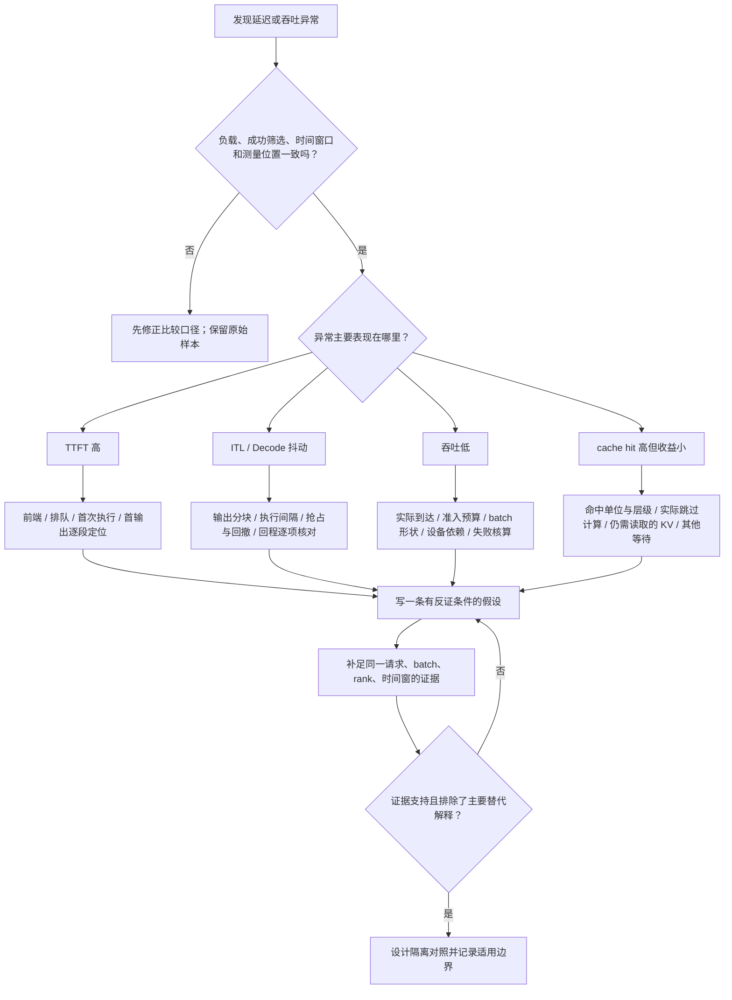
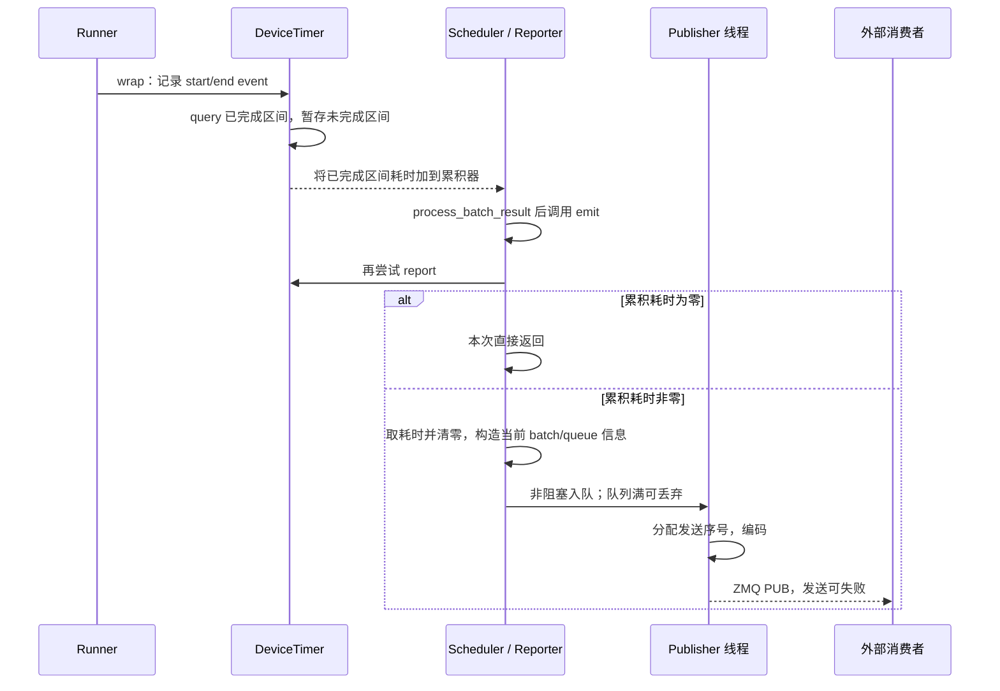

# 从现象定位性能瓶颈

本文是**源码分析型学习资料**，面向已经会读 benchmark 指标和 Profiler 时间线，想回答“下一步究竟应该查哪里”的读者。

本篇主线是：**先证明测量口径一致，再把延迟定位到一段具体等待或执行，最后提出能被证据推翻的解释。** TTFT 高、ITL 抖动、吞吐低和缓存命中后没有收益，都只是排查起点。

## 0. 阅读基线与范围

| 项目 | 内容 |
| --- | --- |
| 源码路径基准 | SGLang 仓库根目录 `.`；所有源码位置使用仓内相对路径 |
| 读取工作区 | `sglang-source-study` 独立 Git worktree |
| 分支 | `codex/sglang-source-study-20260909`，基于官方 main |
| commit | `72d5c5bb73cadd7ffbf5114e5f81e29d36b6c61a` |
| 读取日期 | `2026-09-10` |
| 工作区状态 | 学习源码 worktree 干净；原源码工作区与 Wiki 其他资料保留 |
| 主线 | Python HTTP、单 TM、普通文本 Dense、普通自回归、TP/PP/DP=1；先采用普通调度与设备端前缀缓存 |
| 观测范围 | 请求时间、Scheduler stage、DeviceTimer、ForwardPassMetrics、日志与缓存统计 |
| 扩展 | Overlap、Graph、分块 Prefill、分层缓存及 P/D；只分析它们改变排查方向的边界 |
| 不展开 | 真实硬件性能诊断、全部算子微架构、生产变更、自动调参、完整分布式时钟校准 |
| 操作边界 | 静态阅读与独立教学账本检查；未启动服务、运行模型、项目测试、Profiler 或真实压力实验 |

前置：[11-01 Benchmark 设计与指标口径](01-Benchmark设计与指标口径.md)、[11-02 Profiler 与时间线阅读](02-Profiler与时间线阅读.md)、[10-04 Metrics、日志与 Trace](../10-serving-operations/04-Metrics日志与Trace关联.md)。队列与资源细节回看 [03-06 调度排障](../03-scheduling/06-回撤背压饥饿与调度排障.md)、[04-07 KV 生命周期](../04-kv-cache/07-KV缓存全生命周期与排障.md)。

本篇的排障树、R1/R2/R3 和所有数字均为**教学归纳**，没有真实运行观察。计时与统计的外部补充读取于 2026-09-10：[PyTorch 2.14 CUDA Event](https://docs.pytorch.org/docs/2.14/generated/torch.cuda.Event.html)、[Python process_time](https://docs.python.org/3/library/time.html#time.process_time)、[Prometheus 分布聚合](https://prometheus.io/docs/practices/histograms/)。这些说明不代表本机已安装或运行对应环境。

## 1. 人话版：瓶颈是挡住下一步的条件

把推理服务想成一个需要接单、备料、加工、交付的系统。加工机器有空档，可能是没单、材料未就绪、调度没发任务，也可能是在等另一台机器。看到“机器不忙”，还不能知道谁挡住了进度。

本篇用三个层次写结论：

| 层次 | 示例 | 所需证据 |
| --- | --- | --- |
| 观察 | R2 在 wait_queue 到首次 forward 之间经过了 150 ms | 同一请求的可靠时间边界 |
| 假设 | 这段等待主要由前面的长 Prefill 占用执行机会造成 | 同窗口 batch 顺序、长度与准入条件 |
| 已支持的解释 | 核对窗口及条件后，长 Prefill 覆盖主要等待；隔离对照也符合预测 | 可追溯观测与能排除其他解释的对照 |

最后一行只是说明验收标准，本次没有这样的运行证据。

| 术语 | 人话解释 | 容易混淆的对象 |
| --- | --- | --- |
| 瓶颈 | 当前负载下限制进度或容量的条件 | 某张图里最长的条 |
| 关键路径 | 必须先完成，后续结果才能出现的一串依赖 | 所有工作时间的总和 |
| 排队 | 请求已到某一层，但尚未获得下一步资格 | 全部前端、网络或设备等待 |
| 供给不足 | 可执行工作没有及时到达设备 | 一定是客户端问题 |
| 准入受限 | 有请求，但槽位、预算、规则或数据条件未满足 | 一定已发生设备 OOM |
| 设备事件区间 | 两个 CUDA event 之间经过的时间 | 全设备所有 kernel 的纯执行时间 |
| 窗口 | 一次指标统计覆盖的样本和起止点 | 图表刷新间隔 |
| 可证伪假设 | 写得出什么观察会让它不成立 | “可能是性能不好” |

不要平均多个实例的 p99，也不要把客户端 p99 减去服务端 p99 当成网络 p99；不同分位数通常不是同一条请求。对可聚合的分布，应先按正确标签和窗口汇总，再计算分位数。[Prometheus 聚合说明](https://prometheus.io/docs/practices/histograms/)

## 2. 先走这棵排障树



**图意解读：** 方框是人的排查步骤，不是新增的 SGLang 模块。四条分支可以汇合：例如回撤既可能降低吞吐，也可能制造 ITL 长尾；排队可能掩盖缓存节省的 Prefill 时间。图最后仍是待执行的验证方案，没有自动修复或运行成功的含义。

每次进入下一层前，至少保留：模型与输入身份、实例/rank、请求 rid、是否重试、输入/输出长度、缓存状态、stream 设置和生效配置。关联方式见 10-04，不把一个客户端业务请求直接视为一次 Scheduler forward。

## 3. 先校准四种时间：请求、循环、CPU、设备

### 3.1 请求等待与执行完成由不同位置记录

SchedulerReqTimeStats.set_forward_entry_time 在首次 forward 入口记录 queue_time；其公式是 forward_entry_time 减 wait_queue_entry_time。set_prefill_finished_time 位于 Prefill 结果完成账本，不是客户端收到首个字节的时刻。[S36] [S37] [S38]

TM 的 collect_metrics 用自己的 first_token_latency 记录 TTFT，并按收到输出的 completion_tokens 增量记录后续间隔。它属于 API 侧观测，已经经过 Scheduler 的输出交接；客户端又在更外层计时。[S39]

因此先用**同一请求、同一时间域的事件链**分段。请求经历分块、回撤或 PD 时，应继续看相应子阶段和重置规则；不要把单个 queue_time 当作完整生命周期里所有等待的累加器。相关时间字段的来源和转换见 10-04。

### 3.2 Scheduler stage 统计是互斥的墙钟分账

SchedulerStageMetricsRecorder.enter 先把上一个阶段到当前时刻的时间记账，再切换当前阶段；exit 采样后恢复父阶段；drain 把剩余时间采完并清空本轮累计。[S1] [S2] [S4]

同名嵌套不会再切换。装饰器用 finally 恢复阶段，因此异常退出也要归还这份“当前阶段”状态；record 还负责给 Profiler/NVTX 建立对应范围。[S3] [S5]

一个独立教学窗口如下，单位任意但一致：

| 时段 | 所在代码范围 | 互斥统计归属 |
| --- | --- | --- |
| 0—10 | 尚未进入命名阶段 | other：10 |
| 10—30 | get_next_batch_to_run | get_next_batch_to_run：20 |
| 30—50 | 内层 process_queue | process_queue：20 |
| 50—80 | 返回 get_next_batch_to_run | get_next_batch_to_run：30 |
| 80—100 | 离开命名阶段 | other：20 |

结果是 other=30、get_next_batch_to_run=50、process_queue=20，总和 100。外层函数从 10 到 80 经过了 70，但该统计只分给它 50；不能再把 70 与内层 20 相加。

对应指标是 `sglang:scheduler_stage_seconds_total`，category 表示阶段。[S52] 它与 Profiler 中父子范围的 inclusive time 不同，且统计的是主机墙钟：范围内的同步等待也会占时间，不能直接叫“CPU 计算耗时”。

### 3.3 idle 阶段、真正空闲与进程 CPU 不相等

_record_scheduler_time 用 monotonic_ns 分配空闲墙钟，用 process_time_ns 记录整个 Scheduler 进程的 CPU 时间，并在达到约一秒的采样窗口后，随调用更新计数器。它不是独立的一秒后台上报线程；如果执行停在别处，上报也可能延后。[S6]

| 指标 | 记录对象 | 不能直接解释成 |
| --- | --- | --- |
| scheduler_stage_seconds_total | 命名代码范围及 other 的互斥墙钟 | 每个阶段的纯 CPU 算力消耗 |
| scheduler_idle_seconds_total | 由调度状态标记的空闲区间 | GPU 没有 kernel 的全部区间 |
| scheduler_process_cpu_seconds_total | 整个 Scheduler 进程的 CPU 时间 | 单线程耗时或 GPU 工作量 |
| forward_execution_seconds_total | DeviceTimer 汇报的区间，按 category 累积 | 整个请求延迟或硬件 SM 利用率 |

指标声明与更新分别见 [S52] [S6] [S13]。Python 的 process_time 是进程级用户态与系统态 CPU 时间，不包含 sleep；多线程进程的含义与单条墙钟时间轴不同。[Python 计时说明](https://docs.python.org/3/library/time.html#time.process_time)

尤其要读 Scheduler.on_idle：这个方法被标为 idle 阶段，但首先检查 is_fully_idle。若请求或其他工作仍在等待，它会 record_scheduler_active、限频更新负载后返回；只有真正空闲路径才标记 idle 并继续收尾。[S7] [S8]

所以 **stage=idle 增长，不等于 scheduler_idle_seconds_total 必须等量增长**。同样，“没有 batch 可跑”不证明没有排队：普通 waiting_queue、grammar、Overlap 结果、PP microbatch、P/D 队列或分层缓存操作都可能阻止 fully_idle 成立。

### 3.4 DeviceTimer 的范围取决于插在哪一层

DeviceTimer.wrap 在进入时记录 CUDA start event，退出时记录 end event，然后尝试汇报。_report 按队列顺序检查 end_event.query；第一个未完成就停止收集，不在这里用 synchronize 等待。[S9] [S10] [S11] [S12]

事件未指定 stream 时记录在当前 CUDA stream；elapsed_time 给出两事件间的毫秒数，SGLang 再除以 1000 交给 reporter。这个区间可以包含相关依赖等待，不能仅按“GPU-accurate”字样理解为所有 kernel 的净计算之和。[PyTorch CUDA Event](https://docs.pytorch.org/docs/2.14/generated/torch.cuda.Event.html)

插桩位置也不完全一致：

| 执行路径 | 当前计时包装位置 | 对比时的限制 |
| --- | --- | --- |
| Eager Decode | metadata 等准备之后包 model.forward | 部分准备在设备计时区间外 [S23] |
| Decode Graph | 包含 load_batch、replay_session 和 replay 路径 | 与 Eager 的包装边界不同 [S24] |
| Prefill Graph 分支 | 在 ModelRunner 中包 runner.execute | 源码注明范围还含 load_batch，不能当只包 model.forward [S22] |

开关 SGLANG_ENABLE_METRICS_DEVICE_TIMER 缺省 False；FPM 初始化可以另行创建同类 timer，再装到相关 runner。[S50] [S13] [S14] [S64] “没有启用这个环境开关”不等于当前实例绝对没有设备计时。

fwd_occupancy 用窗口内已汇报的设备区间累积除以主机经过时间，并裁到 100；窗口按 decode_log_interval 的计数推进。[S25] 这是该实现定义的观测比值，既不是 SM occupancy，也不能从 100% 推出没有通信等待或代码已最优。

## 4. FPM：实时调度信息有价值，但不是完整逐批审计日志

### 4.1 谁生产、什么时候发布

FPM 是 ForwardPassMetrics 的简称。当前 _init_fpm 在功能开启、attn_tp_rank=0、且处于最后一个 PP stage 时建立 publisher；endpoint 由配置基址加 dp_rank 后缀形成，未指定时生成 IPC 路径。[S14]

process_batch_result 在处理输出与更新计数之后调用 _emit_forward_pass_metrics；后者再组装当前 batch 的 scheduled 信息和当前队列信息。[S21] [S15] 它们属于不同对象的观测快照，不能默认是“这一 batch 开始之前的同一瞬间”。



**图意解读：** 方框表示计时对象、Scheduler 侧逻辑和发布线程。event 的完成时刻、结果处理时刻与实际发布时刻并不相同。箭头表示实现中的调用和数据方向，不表示消费者已可靠收到全部消息。[S9] [S10] [S14] [S15] [S19] [S20] [S21]

### 4.2 wall_time 的当前实际定义

类型注释把 wall_time 描述为 iteration duration，但启用路径会创建 DeviceTimer，并把 _fpm_uses_device_timer 设为 True。[S18] [S14] 此时关键逻辑是：

```python
self.forward_pass_device_timer._report()
wall_time = self.scheduler._fpm_gpu_time_acc
self.scheduler._fpm_gpu_time_acc = 0.0
if wall_time == 0.0:
    return
```

因此它取的是**自上次提取后、timer 已汇报的设备区间累积**。[S15] 对尚未完成的 event 没有在这里强制等待，也没有用 batch ID 将每个 interval 与当前 batch 严格配对。

一个条件教学例：interval A=3 ms、B=5 ms；第一次 emit 时 A 仍未完成、累积为 0，于是没有普通消息；第二次 emit 时两者都已完成，可取到 8 ms，再搭配第二次调用时的 batch 信息。它说明对象接口允许什么，不声称普通单卡主线一定发生这种时序；实际完成关系还受结果复制和同步控制。

源码另有以 monotonic 减 batch.fpm_start_time 的 fallback，但正常 _init_fpm 会设置使用设备 timer。单元测试可以人为构造 fallback；有这条分支不代表当前实测走了它。[S14] [S15] [S34] [S58]

### 4.3 字段要看分组与计数单位

| FPM 字段 | 构造来源 | 容易误读的地方 |
| --- | --- | --- |
| num_prefill_requests | PrefillStats.num_new_seqs，缺 stats 时取请求列表数 | 不自动等于所有活动请求 |
| sum_prefill_tokens | PrefillStats.log_input_tokens，缺 stats 时为 0 | 不是全部原始 prompt 长度之和 |
| var_prefill_length | 请求 origin_input_ids 长度的总体方差 | 与本轮 chunk 长度不是同一变量 |
| sum_prefill_kv_tokens | prefill 请求 prefix_indices 长度之和 | 是 token 数，不是传输字节或保存时间 |
| num_decode_requests / sum_decode_kv_tokens | 普通 Decode 的 seq_lens_cpu；MIXED 的 decoding_reqs | 模式与字段来源需要对应 |
| queued_requests | emit 时按实际模式扫描的队列 | 不是所有阶段所有等待者的全集 |

构造代码见 [S16] [S17]。MIXED 使用 decoding_reqs 的对象身份拆开 Prefill 与 Decode；普通模式的等待队列则把已有 output_ids 的请求归到 decode 类。

PD 扩展尤其要重看队列范围：Prefill 分支扫 bootstrap 与 waiting；Decode 分支扫 prealloc.queue 与 transfer.queue。这里没有把所有普通 waiting、retracted_queue 或其他暂留状态一起加入。FPM 中队列数为 0 不能证明完整系统无等待。[S17]

### 4.4 序号连续和心跳都不是完整性证明

publish 用 put_nowait，内部队列满会直接跳过；发送线程才生成 counter_id 并 send_multipart。发送遇到 zmq.Again 也被忽略。[S19] [S20]

因此：

- 队列满时，丢失发生在分配发送序号之前，消费者看见连续序号也不能证明每次 emit 都在。
- counter_id 是 publisher 的发送尝试序号，包含心跳，不是 Scheduler.forward_ct。
- 线程在队列等待超时且距离上次发布达到阈值时构造默认零值消息；这段代码没有调用 Scheduler.is_fully_idle。
- 长 batch、计时尚未汇报、缺采集或真正空闲，都需要结合其他证据判断；零值心跳只证明发布线程走到了该分支。[S18] [S20]

使用 FPM 做实时趋势时，保留版本、worker_id、dp_rank、序号和接收时间；需要严格逐批归因时，再补日志/trace/请求账本。不要把消息缺口补成虚构的零耗时 batch。

## 5. TTFT 高：沿 R1 的首输出路径逐段缩小

先确认比较的是客户端首可见文本、首 HTTP 数据块，还是 TM TTFT。非流式接口、usage-only 块、特殊输出和不同 adapter 的定义见 11-01，不能统一叫“模型首 token”。

### 5.1 四段排除顺序

| 检查位置 | 若这一段增长，可提出什么假设 | 什么证据会削弱它 |
| --- | --- | --- |
| 客户端到 TM 可观测起点 / tokenize / dispatch | 客户端发压、前端处理或转发增加等待 | 同请求前端区间稳定，增长已明确落在 Scheduler |
| wait_queue → 首次 forward | 准入、已有任务、预算或数据未就绪 | 请求很快被选中，等待字段并未增长 |
| 首次 forward → Prefill 结果处理 | 处理 token 变多、后端路径变化、设备依赖或多 chunk | 同 shape 设备区间稳定，增长主要在两次执行之间 |
| 结果处理 → TM / 客户端首输出 | 输出门控、解码/事件循环、传输或客户端读取 | 同一请求各层接收间隔稳定 |

前两类 Scheduler 时间入口见 [S36] [S37] [S38]；输出观测与门控见 [S39] [S41]。表中前端因素是待验证假设，不能从 Scheduler 指标缺失直接推定。

### 5.2 有等待队列，为什么还不准入

get_new_batch_prefill 不是简单地“取队首直到填满”。当前路径会检查 running batch 的 full 状态、可分配请求槽位、min_free_slots_delayer、优先级与 prefill 预算；分层缓存还可能跳过预取未完成的请求。[S33]

它先更新请求输入/前缀状态，再交给 PrefillAdder.add_one_req；返回 NO_TOKEN 等状态时决定是否终止本轮候选。**匹配到了前缀，不代表已经获得本轮执行资格。**[S32] [S33]

所以排查顺序应当是：哪个请求没有进入 can_run_list → 在哪个条件返回/跳过 → 该条件读取哪份容量、数据或规则。不要一看到 waiting_queue 增长，就直接调整 chunk 或最大 batch。

get_next_batch_to_run 在已有可运行 new_batch 时优先选择该 Prefill；否则才在普通非空 running_batch 上准备 Decode。[S34] 这为“Prefill 与 Decode 竞争执行机会”提供源码入口，但是否构成当前长尾，仍需实际 batch 顺序。

### 5.3 R1/R2/R3 教学账本：缓存省时可以被排队盖住

设 R1 和 R2 使用相同输入；R2 复用了前缀，R3 是 R2 等待期间可能占用执行机会的长输入请求。下面的数值仅用于练习，且三段被人为定义成互不重叠：

| 请求 | 排队 | 首次计算至所需结果 | 其他首输出链路 | 客户端 TTFT |
| --- | ---: | ---: | ---: | ---: |
| R1：冷前缀、低排队 | 10 ms | 100 ms | 10 ms | 120 ms |
| R2：前缀复用、等待增大 | 150 ms | 20 ms | 10 ms | 180 ms |

计算阶段节省 80 ms，但排队多了 140 ms，总 TTFT 反而多 60 ms。

可支持的教学判断是“计算节省与总体变慢可以同时成立”。不能直接写“R3 已证明是根因”：还要核对 R3 的实际执行窗口、R2 的准入条件、其他请求与观测开销。真实系统若字段有重叠或来自不同时间域，也不能照搬这个加法。

## 6. ITL 抖动：先确认是 token、块，还是执行机会在抖

### 6.1 80 ms 的输出间隔，不一定记录成一个 80 ms 的 ITL 样本

TokenizerManager.collect_metrics 计算 completion_tokens 的新增数量，再交给 TokenizerMetricsCollector.observe_inter_token_latency。后者将接收间隔除以新增 token 数，并按该数量增加 histogram 的样本。[S39] [S40]

教学例：两个观测点相隔 80 ms，新增加 4 个 token。该逻辑相当于记录四个 20 ms 样本；它无法从一个接收间隔恢复这四个 token 的真实产生时间。

Scheduler 的输出还有独立门控：stream_interval>1 时，未完成请求按输出长度的取模条件出流；还会检查 stop-string 前缀。完成请求另走强制输出分支。[S41] 客户端 adapter 又可能按文本块记录 ITL，见 11-01。先核对这三层，再解释“抖动”。

### 6.2 再分执行变慢与两次执行之间等得更久

| 现象与对应证据 | 候选解释 | 下一项排除检查 |
| --- | --- | --- |
| 同请求后续输出变慢，设备 Decode 区间稳定 | 两次 Decode 之间插入别的工作，或回程节奏改变 | 同窗口 Prefill/batch 顺序、输出门控与接收时刻 |
| 设备 Decode 区间随历史变长 | KV 读取、Attention 形状或实现路径影响成本 | 同 batch size 下的 seq_lens、dtype、后端与真实事件 |
| 新 Prefill 到达后 ITL 长尾增加 | Prefill 获得执行机会，或 MIXED 负载变化 | 该 batch 的选择路径、q/k 形状及目标请求是否在批中 [S34] |
| 同请求离开运行批、随后再次准入 | KV 压力触发回撤/重算 | retract 计数、rid、资源变化和重新排队 [S35] |
| 某些 batch 突然切 Eager | 当前 shape/模式不满足 graph 分支 | ModelRunner 实际分发、can_run_graph 与计时边界 [S22] |
| 设备结果稳定但客户端块延后 | Detokenizer/TM、流式门控、网络或客户端读取 | 请求级分段，不用进程 aggregate 直接归因 |
| 多卡 collective 出现长条 | 某 rank 迟到、依赖等待或传输成本 | 全部参与 rank 的前序工作与关联时序 |

这些是诊断路径，没有通用阈值。大 batch 可能提高吞吐，也可能延长单轮时间；更小 chunk 可能缩短一次占用，也可能增加调度/执行次数。改变参数的对照方法留到 11-04。

### 6.3 回撤要找到“从运行到等待”的证据

update_running_batch 先过滤完成请求，随后检查 Decode 内存；空间不满足时调用 retract_decode，记录释放收益、更新 new_token_ratio，将回撤请求重新加入队列。[S35]

因此一次性能长尾可能跨越“已生成 → 被回撤 → 再等待 → 重新执行”，不应只看首次 queue_time。源码还有测试回撤条件，应区分实际 KV 压力与测试触发的日志前缀，不把所有 retract 都描述成同一种运行故障。

不要为排障清理在途 KV 或重启实例来“验证”假设。本篇的下一步是收齐对应状态与时间，实验变更仅在后续隔离方案中明确设计。

## 7. 吞吐低：从实际工作量查到设备依赖

### 7.1 先排除分母和样本变化

成功输出 token/s、输入加输出 token/s、当前新计算 token/s、服务端窗口吞吐，并不是同一个数。缓存命中减少本轮新计算 token 后，Prefill 日志的输入分子也可能下降；不能据此说业务吞吐退化。[S26]

report_prefill_stats 的 input throughput 用**当前上报的新 token 数 / 距上次 Prefill 上报的间隔**；Decode 的 gen throughput 则用窗口内累积生成数 / 距上次 Decode 统计的间隔，并由 decode_log_interval 控制周期。[S26] [S27] 二者都不能直接替代当前 batch 的设备执行时间。

SGLANG_RECORD_STEP_TIME 保存的也是 gap_latency/decode_log_interval，不能按名字当成逐次 CUDA event 测量。[S27] 端到端 benchmark 的失败筛选、预热与末尾等待另见 11-01。

### 7.2 沿五个条件推进

| 层 | 首先取得的证据 | 候选限制 | 还不能宣称什么 |
| --- | --- | --- | --- |
| 实际到达 | 计划/实际发送、客户端许可、服务接收 | 发压端供给或协议路径 | GPU 空闲必然是服务器问题 |
| 准入 | waiting/grammar/相关队列、槽位、token budget | 请求排着但尚不可执行 [S33] | 队列长必然缺算力 |
| 工作形状 | Prefill/Decode、bs、q/k、已用与可回收池 | batch 太小、历史长或资源压力 | token_usage 就是整卡显存百分比 |
| 执行 | 同 shape 下设备区间、kernel/通信/搬运依赖 | 计算、访存、发射或同步路径 | occupancy 高就已达到硬件极限 |
| 交付与成功 | 完成数、失败/取消/重试、客户端可见输出 | 结果回程或统计口径 | 服务端生成数等于业务成功交付数 |

PoolStats.get_max_pool_usage 取相关 full/SWA/Mamba 池占用比的最大值，update_scheduler_stats 再将其写入 token_usage，并保留细分字段。[S42] [S43] 该值描述内部池压力，不是全部权重、workspace、外部分配合计的设备显存比例。纯 Dense 主线先看 full 池，再扩展其他状态池。

### 7.3 最新 scrape 不代表每个值都刚更新

cache_hit_rate 在 Prefill 上报时更新，Decode 不将其清零；gen_throughput 在 Decode 统计窗口计算，长时间没有 Decode 统计时，_current_gen_throughput 可将旧值归零，当前阈值为 30 秒。[S26] [S27] [S29]

这只是源码中的陈旧值处理阈值，不是“30 秒以内都健康”的服务保证。Gauge 的更新时间、统计窗口与 scrape 时间应分别记录。[S52]

此外，FPM queued=0、status 日志未更新、stage=idle 三种现象都不单独证明没有工作；要回到各自生产位置，而不是用其中一个代替全部队列检查。

### 图解补充：重放一组工作，减少逐个启动的开销


[查看原尺寸](../../../images/sglang-source-study/16-cuda-launch.png)（手机查看宽图时可横屏或放大）。

**图意解读：** 上半部分 CPU 逐个启动 A—E，GPU 中间留下空隙；下半部分预先建立图后一次发起重放，仍执行 A—E。

**对应本篇源码：** 把启动空隙作为待验证的假设，结合设备计时和真实 trace 排除等待数据、通信或 CPU 工作；不能只看到空隙就断言该开 Graph。 [源码：python/sglang/srt/utils/device_timer.py][S9]

**来源与边界：** [Accelerating PyTorch with CUDA Graphs](https://pytorch.org/blog/accelerating-pytorch-with-cuda-graphs/)，Vinh Nguyen、Michael Carilli 等 / PyTorch，2021-10-26；网页另标 2024-11-15 更新。这是 CUDA Graph 的概念图，不是算子融合图，也不是当前 SGLang 的速度测量；能否重放仍取决于形状、地址、数据依赖和所选 runner。 [来源档案 F16](../../../images/sglang-source-study/SOURCES.md#f16)。

## 8. cache hit 高但无收益：命中、少算、变快是三步

### 8.1 先问这个 hit 在数什么

Req.init_next_round_input 使用实际 token IDs、extra_key、cache_salt 和 prefix 上限去匹配，随后保存 prefix_indices 及 host 等匹配结果。位置 embedding override、混合状态要求等还会改变可复用范围。[S32]

PrefillAdder._update_prefill_budget 累加 prefix_len 与 extend_input_len，并将回撤后重处理部分另外累计。report_prefill_stats 计算导出的 cache_hit_rate 时先扣掉这些重处理量：[S30] [S26]

```text
effective_input = log_input_tokens - reprocessed_log_input_tokens
effective_hit   = log_hit_tokens   - reprocessed_log_hit_tokens
cache_hit_rate  = effective_hit / (effective_input + effective_hit)
```

分母为零时取 0。它是该次上报的 token 比例，不是每请求命中比例的简单平均，也不是节省的时间比例。

旁边的 recent_cache_hit_rate 则由 _CacheHitRateWindow 按时间滚动汇总 token；缺省窗口 15 秒，过期样本在 add 时移除。它用于另一个内部口径，不会自动替换导出的 per-report gauge。[S28] [S63] [S26]

### 8.2 命中位于哪一层，决定还要等待什么

_account_prefill_cache_admission 会将已经纳入的 prefix 按 device、host、storage 拆分，并单独处理没有兑现的 storage 命中归因。[S31]

| 证据层 | 能说明 | 还要核对 |
| --- | --- | --- |
| 前缀匹配结果 | 找到候选可复用前缀或更低层的命中信息 | 是否最终准入、物化、未被缩短 [S32] [S33] |
| 准入与分层计数 | 当前计数把多少 prefix 归到各层 | 回载/预取时间、设备槽位与数据就绪 [S31] |
| 本轮 extend 变短 | 新处理 token 数减少 | 仍需读取的历史 KV、batch 形状与执行路径 [S44] [S45] |
| 设备区间降低 | 所选范围内成本减少 | 是否被排队、其他执行、输出和采集成本盖住 |
| TTFT/吞吐改善 | 在给定负载与窗口下收益出现 | 成功率、长度分布、重复性与适用配置 |

“L3 找到了数据”不能直接写成“设备已经可读”；“设备可读”也不等于请求已获得调度资格。完整回载路径见阶段 04，本篇保留这些关口用于排障。

### 8.3 复用前缀后，新 token 仍要关注历史

固定源码的 Prefill 估算用每条请求的 chunk 长度 c 与前缀 p 计算：

```text
causal_pairs = Σ[c × p + c × (c+1) / 2]
```

第一项是新 query 对前缀的关系，第二项是 chunk 内的因果关系。[S44] _estimate_prefill_perf 还另有线性层和字节数近似，不能把这个式子当成全部 FLOPs 或已测带宽。[S45]

教学例：总长 8、冷前缀时 c=8、p=0，得到 36 对；复用前 6 个 token 后 c=2、p=6，仍有 12+3=15 对。虽然本轮 query 从 8 降到 2，这个因果关系数并没有同比缩成 9。它也不同于 11-02 标签的 q×k：这里包含显式三角因果项。

再叠加第 5 节的排队账本，就能理解“缓存确实减少工作，但 TTFT 没有改善”。确认这种解释需要逐请求和同窗口证据，不能只拿两张聚合图作因果证明。

## 9. 调试工具要与问题匹配

debug_utils 目录不等于“低成本性能开关合集”。先选择能回答当前问题的最小观测，增加采集后重新记录实验条件。

| 工具 / 入口 | 适合回答 | 当前边界 |
| --- | --- | --- |
| batch 日志 + SGLANG_LOG_FORWARD_ITERS | 哪次上报对应哪个 batch 编号、模式和工作量 | 缺省关闭编号；Decode 日志仍按周期，不自动变成逐 token 明细 [S51] [S26] [S27] |
| SchedulerStatusLogger | 某次采样有哪些 running/queued rid | 需 enable_metrics 和 target；缺省间隔 60 秒，且要有调用触发 [S46] [S47] [S62] |
| debug_utils/log_parser.py | 提取符合固定格式的 Decode 文本行 | 正则不覆盖所有日志布局，不保留全部未匹配行 [S48] |
| Profiler / NVTX | 主机与设备区间、依赖、形状 | 采集窗口、进程范围和扰动见 11-02 |
| debug_utils/dumper.py | 保存中间值与元数据，供正确性定位 | 可生成 .pt、日志、clone；不是无扰动性能测量 [S49] |

### 9.1 Status 日志没有独立轮询所有状态

maybe_dump 只在被调用、且时间间隔满足时输出 rank、running_rids、queued_rids。当前 report_decode_stats 在逐次工作分支调用它；这里的列表来自传入 running batch 和普通 waiting_queue。[S47] [S27]

因此没有新行可能只是没有走到这条调用或没有到达间隔；P/D 专属队列也不在该 JSON 列表里。不要把“60 秒没有 status 行”直接解释为进程死锁。

### 9.2 文本解析器会丢掉不匹配的观测

log_parser.parse 用固定 _PATTERN_DECODE 提取字段，再过滤 gen_throughput 为空的行。[S48] 正则要求特定时间/rank 布局以及紧随 running-req 的 `#token: ..., token usage: ...` 形式。

它还要求 `#queue-req` 数字后有逗号。若原行到该数字就结束，即使其他字段看起来正常也不匹配；当前 Decode 日志在没有后续可选字段时就可能采用这种结尾。[S27] [S48]

当前池日志还可能输出 full/swa 或 gpu/cpu 等布局；这些变化应先与样例逐行核对，再统计解析结果。保留原日志、总行数、匹配数和未匹配样本，不能把解析器返回空表当成“服务没有 Decode”。

### 9.3 Tensor dump 的目标是值证据

_Dumper._dump_single 会组织 step/rank/dump_index、元数据和路径；按配置打印值，保存文件或复制捕获值。开启 cleanup_previous 还会走旧 dump 清理分支。[S49]

本篇只读这个入口，没有启用 dump、调用清理或改变模型执行。需要用它定位数值问题时，应明确采哪些张量和如何比较；相应测试与正确性边界留到 11-05。不要将带大量 dump I/O 的吞吐直接当稳定 serving 基准。

## 10. 将排查写成一条可复查的记录

以下是一份**教学推演记录**，不是本次运行报告。

| 字段 | R2 示例应如何写 |
| --- | --- |
| 现象 | 教学表中，R2 的 TTFT 从 R1 的 120 ms 增至 180 ms |
| 已有条件 | 相同输入；R2 复用前缀；三段时间假设互不重叠 |
| 可直接推出 | 计算阶段少 80 ms，排队多 140 ms，其他不变，合计多 60 ms |
| 当前假设 | 长 Prefill 竞争执行机会是排队增加的候选解释 |
| 源码入口 | get_next_batch_to_run、get_new_batch_prefill 及请求首次 forward 时间 [S34] [S33] [S36] |
| 反证条件 | R2 等待期间没有相应 Prefill 占用；或 R2 实际因槽位/预取条件不能准入 |
| 下一项证据 | 同窗口 R3/batch 身份、R2 准入分支、q/k、设备与结果时间、资源池状态 |
| 当前结论等级 | 公式与源码路径可解释这种现象；真实原因未验证 |
| 后续对照 | 在隔离环境固定输入和到达，仅改变一个已明确的竞争条件；保留无采集对照 |
| 当前执行状态 | 未执行模型、压测或参数调整 |

其他三类现象也用同样的句式：

- ITL 抖动：先证明观测的是 token 还是块，再区分执行区间与两轮间隔。
- 吞吐低：先证明工作量、失败和窗口一致，再查供给、准入与设备依赖。
- cache hit 无收益：先证明命中兑现和本轮工作减少，再查回载与其他等待。

缺证据时写“尚不能区分 A/B，下一项证据是……”。这比给所有问题贴上“显存瓶颈”或“CPU 瓶颈”更有用。

## 11. 源码阅读路线与测试边界

| 要回答的问题 | 仓内相对路径 / 符号 |
| --- | --- |
| 墙钟时间如何互斥分配 | `python/sglang/srt/observability/scheduler_stage_metrics.py::SchedulerStageMetricsRecorder.enter` [S1] |
| 时间如何写进指标 | `python/sglang/srt/managers/scheduler_components/metrics_reporter.py::SchedulerMetricsReporter._record_scheduler_time` [S6] |
| 设备事件何时汇报 | `python/sglang/srt/utils/device_timer.py::DeviceTimer._report` [S10] |
| FPM 的真实时间与快照 | `python/sglang/srt/managers/scheduler_components/metrics_reporter.py::SchedulerMetricsReporter._emit_forward_pass_metrics` [S15] |
| 消息丢弃与心跳 | `python/sglang/srt/observability/forward_pass_metrics.py::_FpmPublisherThread._run` [S20] |
| 哪个条件挡住准入 | `python/sglang/srt/managers/scheduler.py::Scheduler.get_new_batch_prefill` [S33] |
| ITL 样本怎样形成 | `python/sglang/srt/observability/metrics_collector.py::TokenizerMetricsCollector.observe_inter_token_latency` [S40] |
| 缓存计数怎样归因 | `python/sglang/srt/managers/schedule_policy.py::PrefillAdder._account_prefill_cache_admission` [S31] |
| 日志工具能读哪些行 | `python/sglang/srt/debug_utils/log_parser.py::parse` [S48] |

本篇选读了两份测试文件的九个用例：

| 测试文件 / 用例主题 | 表达的测试意图 | 本次未覆盖 |
| --- | --- | --- |
| `test/registered/unit/observability/test_scheduler_stage_metrics.py`：nested exclusive、异常恢复两个用例 | 互斥墙钟分配、finally 恢复父阶段 [S53] [S54] | 真实 Scheduler 负载与运行时开销 |
| `test/registered/unit/observability/test_forward_pass_metrics.py`：MIXED、设备累积、零值跳过、monotonic fallback 四个用例 | 构造输入后的字段分组与局部时间取值 [S55] [S56] [S57] [S58] | 真实 GPU event 与当前 batch 是否一一对应 |
| 同一 FPM 文件：PD Decode 队列一个用例 | 给定 prealloc/transfer 队列的字段计数 [S59] | 所有等待状态覆盖、真实消息传输 |
| 同一 FPM 文件：idle/CPU 计时一个用例 | mock 时钟下分别累计空闲、CPU、阶段时间 [S60] | 真实线程调度、设备利用率 |
| 同一 FPM 文件：cached prefix 因果关系数一个用例 | Prefill 估算必须包含 c×p [S61] | kernel FLOPs、实际带宽与性能收益 |

以上均只读，没有执行项目测试。独立教学检查只计算互斥时间分账、R1/R2 差值、ITL 样本分摊和因果关系数，不导入 SGLang 或执行其函数。

## 12. 练习、验收与下一篇

1. 为什么 process_time、stage 墙钟、设备事件和 TTFT 不能直接相加？各自需要什么分母？
2. get_next_batch 外层经过 70、内层 process_queue 经过 20 时，互斥 stage 应记多少？为什么不是 90？
3. FPM 序号连续、wall_time=0 心跳、queued=0，各能证明什么，不能证明什么？
4. 80 ms 接收间隔包含四个新增 token 时，TM histogram 如何记账？能恢复每个真实生成时刻吗？
5. R2 计算少 80 ms、排队多 140 ms 时，总延迟怎样变化？还缺什么证据才能归因到 R3？
6. c=2、p=6 时为什么估算因果关系数是 15，而不是 3 或 16？它和 q×k 有何不同？
7. 为“吞吐下降但 token_usage 不高”写出两个互斥性更强的候选解释，并分别写一个反证检查。
8. 如果日志解析得到空表，怎样区分没有相应事件和格式不匹配？

验收时，应能从四类现象中选一类，沿排障树定位观测对象、源码分支和未知项，写出一项能推翻当前假设的检查。

本篇完成 64 个固定源码锚点、两张教学图和独立账本的静态核对；没有得出真实系统的性能根因，也没有运行模型、Profiler 或项目测试。下一篇：[11-04《参数对照与性能实验记录》](04-参数对照与性能实验记录.md)。

[S1]: https://github.com/sgl-project/sglang/blob/72d5c5bb73cadd7ffbf5114e5f81e29d36b6c61a/python/sglang/srt/observability/scheduler_stage_metrics.py#L78
[S2]: https://github.com/sgl-project/sglang/blob/72d5c5bb73cadd7ffbf5114e5f81e29d36b6c61a/python/sglang/srt/observability/scheduler_stage_metrics.py#L90
[S3]: https://github.com/sgl-project/sglang/blob/72d5c5bb73cadd7ffbf5114e5f81e29d36b6c61a/python/sglang/srt/observability/scheduler_stage_metrics.py#L97
[S4]: https://github.com/sgl-project/sglang/blob/72d5c5bb73cadd7ffbf5114e5f81e29d36b6c61a/python/sglang/srt/observability/scheduler_stage_metrics.py#L118
[S5]: https://github.com/sgl-project/sglang/blob/72d5c5bb73cadd7ffbf5114e5f81e29d36b6c61a/python/sglang/srt/observability/scheduler_stage_metrics.py#L135
[S6]: https://github.com/sgl-project/sglang/blob/72d5c5bb73cadd7ffbf5114e5f81e29d36b6c61a/python/sglang/srt/managers/scheduler_components/metrics_reporter.py#L1263
[S7]: https://github.com/sgl-project/sglang/blob/72d5c5bb73cadd7ffbf5114e5f81e29d36b6c61a/python/sglang/srt/managers/scheduler.py#L4675
[S8]: https://github.com/sgl-project/sglang/blob/72d5c5bb73cadd7ffbf5114e5f81e29d36b6c61a/python/sglang/srt/managers/scheduler.py#L4762
[S9]: https://github.com/sgl-project/sglang/blob/72d5c5bb73cadd7ffbf5114e5f81e29d36b6c61a/python/sglang/srt/utils/device_timer.py#L30
[S10]: https://github.com/sgl-project/sglang/blob/72d5c5bb73cadd7ffbf5114e5f81e29d36b6c61a/python/sglang/srt/utils/device_timer.py#L44
[S11]: https://github.com/sgl-project/sglang/blob/72d5c5bb73cadd7ffbf5114e5f81e29d36b6c61a/python/sglang/srt/utils/device_timer.py#L92
[S12]: https://github.com/sgl-project/sglang/blob/72d5c5bb73cadd7ffbf5114e5f81e29d36b6c61a/python/sglang/srt/utils/device_timer.py#L97
[S13]: https://github.com/sgl-project/sglang/blob/72d5c5bb73cadd7ffbf5114e5f81e29d36b6c61a/python/sglang/srt/managers/scheduler_components/metrics_reporter.py#L214
[S14]: https://github.com/sgl-project/sglang/blob/72d5c5bb73cadd7ffbf5114e5f81e29d36b6c61a/python/sglang/srt/managers/scheduler_components/metrics_reporter.py#L304
[S15]: https://github.com/sgl-project/sglang/blob/72d5c5bb73cadd7ffbf5114e5f81e29d36b6c61a/python/sglang/srt/managers/scheduler_components/metrics_reporter.py#L1112
[S16]: https://github.com/sgl-project/sglang/blob/72d5c5bb73cadd7ffbf5114e5f81e29d36b6c61a/python/sglang/srt/managers/scheduler_components/metrics_reporter.py#L358
[S17]: https://github.com/sgl-project/sglang/blob/72d5c5bb73cadd7ffbf5114e5f81e29d36b6c61a/python/sglang/srt/managers/scheduler_components/metrics_reporter.py#L403
[S18]: https://github.com/sgl-project/sglang/blob/72d5c5bb73cadd7ffbf5114e5f81e29d36b6c61a/python/sglang/srt/observability/forward_pass_metrics.py#L97
[S19]: https://github.com/sgl-project/sglang/blob/72d5c5bb73cadd7ffbf5114e5f81e29d36b6c61a/python/sglang/srt/observability/forward_pass_metrics.py#L171
[S20]: https://github.com/sgl-project/sglang/blob/72d5c5bb73cadd7ffbf5114e5f81e29d36b6c61a/python/sglang/srt/observability/forward_pass_metrics.py#L192
[S21]: https://github.com/sgl-project/sglang/blob/72d5c5bb73cadd7ffbf5114e5f81e29d36b6c61a/python/sglang/srt/managers/scheduler.py#L4548
[S22]: https://github.com/sgl-project/sglang/blob/72d5c5bb73cadd7ffbf5114e5f81e29d36b6c61a/python/sglang/srt/model_executor/model_runner.py#L1756
[S23]: https://github.com/sgl-project/sglang/blob/72d5c5bb73cadd7ffbf5114e5f81e29d36b6c61a/python/sglang/srt/model_executor/runner/eager_runner.py#L244
[S24]: https://github.com/sgl-project/sglang/blob/72d5c5bb73cadd7ffbf5114e5f81e29d36b6c61a/python/sglang/srt/model_executor/runner/decode_cuda_graph_runner.py#L1448
[S25]: https://github.com/sgl-project/sglang/blob/72d5c5bb73cadd7ffbf5114e5f81e29d36b6c61a/python/sglang/srt/managers/scheduler_components/metrics_reporter.py#L1225
[S26]: https://github.com/sgl-project/sglang/blob/72d5c5bb73cadd7ffbf5114e5f81e29d36b6c61a/python/sglang/srt/managers/scheduler_components/metrics_reporter.py#L646
[S27]: https://github.com/sgl-project/sglang/blob/72d5c5bb73cadd7ffbf5114e5f81e29d36b6c61a/python/sglang/srt/managers/scheduler_components/metrics_reporter.py#L824
[S28]: https://github.com/sgl-project/sglang/blob/72d5c5bb73cadd7ffbf5114e5f81e29d36b6c61a/python/sglang/srt/managers/scheduler_components/metrics_reporter.py#L69
[S29]: https://github.com/sgl-project/sglang/blob/72d5c5bb73cadd7ffbf5114e5f81e29d36b6c61a/python/sglang/srt/managers/scheduler_components/metrics_reporter.py#L204
[S30]: https://github.com/sgl-project/sglang/blob/72d5c5bb73cadd7ffbf5114e5f81e29d36b6c61a/python/sglang/srt/managers/schedule_policy.py#L899
[S31]: https://github.com/sgl-project/sglang/blob/72d5c5bb73cadd7ffbf5114e5f81e29d36b6c61a/python/sglang/srt/managers/schedule_policy.py#L950
[S32]: https://github.com/sgl-project/sglang/blob/72d5c5bb73cadd7ffbf5114e5f81e29d36b6c61a/python/sglang/srt/managers/schedule_batch.py#L1440
[S33]: https://github.com/sgl-project/sglang/blob/72d5c5bb73cadd7ffbf5114e5f81e29d36b6c61a/python/sglang/srt/managers/scheduler.py#L3666
[S34]: https://github.com/sgl-project/sglang/blob/72d5c5bb73cadd7ffbf5114e5f81e29d36b6c61a/python/sglang/srt/managers/scheduler.py#L3499
[S35]: https://github.com/sgl-project/sglang/blob/72d5c5bb73cadd7ffbf5114e5f81e29d36b6c61a/python/sglang/srt/managers/scheduler.py#L4055
[S36]: https://github.com/sgl-project/sglang/blob/72d5c5bb73cadd7ffbf5114e5f81e29d36b6c61a/python/sglang/srt/observability/req_time_stats.py#L765
[S37]: https://github.com/sgl-project/sglang/blob/72d5c5bb73cadd7ffbf5114e5f81e29d36b6c61a/python/sglang/srt/observability/req_time_stats.py#L811
[S38]: https://github.com/sgl-project/sglang/blob/72d5c5bb73cadd7ffbf5114e5f81e29d36b6c61a/python/sglang/srt/observability/req_time_stats.py#L1053
[S39]: https://github.com/sgl-project/sglang/blob/72d5c5bb73cadd7ffbf5114e5f81e29d36b6c61a/python/sglang/srt/managers/tokenizer_manager.py#L2927
[S40]: https://github.com/sgl-project/sglang/blob/72d5c5bb73cadd7ffbf5114e5f81e29d36b6c61a/python/sglang/srt/observability/metrics_collector.py#L1868
[S41]: https://github.com/sgl-project/sglang/blob/72d5c5bb73cadd7ffbf5114e5f81e29d36b6c61a/python/sglang/srt/managers/scheduler_components/output_streamer.py#L418
[S42]: https://github.com/sgl-project/sglang/blob/72d5c5bb73cadd7ffbf5114e5f81e29d36b6c61a/python/sglang/srt/managers/scheduler_components/pool_stats_observer.py#L69
[S43]: https://github.com/sgl-project/sglang/blob/72d5c5bb73cadd7ffbf5114e5f81e29d36b6c61a/python/sglang/srt/managers/scheduler_components/pool_stats_observer.py#L125
[S44]: https://github.com/sgl-project/sglang/blob/72d5c5bb73cadd7ffbf5114e5f81e29d36b6c61a/python/sglang/srt/managers/scheduler_components/metrics_reporter.py#L561
[S45]: https://github.com/sgl-project/sglang/blob/72d5c5bb73cadd7ffbf5114e5f81e29d36b6c61a/python/sglang/srt/managers/scheduler_components/metrics_reporter.py#L568
[S46]: https://github.com/sgl-project/sglang/blob/72d5c5bb73cadd7ffbf5114e5f81e29d36b6c61a/python/sglang/srt/utils/scheduler_status_logger.py#L23
[S47]: https://github.com/sgl-project/sglang/blob/72d5c5bb73cadd7ffbf5114e5f81e29d36b6c61a/python/sglang/srt/utils/scheduler_status_logger.py#L39
[S48]: https://github.com/sgl-project/sglang/blob/72d5c5bb73cadd7ffbf5114e5f81e29d36b6c61a/python/sglang/srt/debug_utils/log_parser.py#L19
[S49]: https://github.com/sgl-project/sglang/blob/72d5c5bb73cadd7ffbf5114e5f81e29d36b6c61a/python/sglang/srt/debug_utils/dumper.py#L574
[S50]: https://github.com/sgl-project/sglang/blob/72d5c5bb73cadd7ffbf5114e5f81e29d36b6c61a/python/sglang/srt/environ.py#L466
[S51]: https://github.com/sgl-project/sglang/blob/72d5c5bb73cadd7ffbf5114e5f81e29d36b6c61a/python/sglang/srt/environ.py#L343
[S52]: https://github.com/sgl-project/sglang/blob/72d5c5bb73cadd7ffbf5114e5f81e29d36b6c61a/python/sglang/srt/observability/metrics_collector.py#L250
[S53]: https://github.com/sgl-project/sglang/blob/72d5c5bb73cadd7ffbf5114e5f81e29d36b6c61a/test/registered/unit/observability/test_scheduler_stage_metrics.py#L38
[S54]: https://github.com/sgl-project/sglang/blob/72d5c5bb73cadd7ffbf5114e5f81e29d36b6c61a/test/registered/unit/observability/test_scheduler_stage_metrics.py#L63
[S55]: https://github.com/sgl-project/sglang/blob/72d5c5bb73cadd7ffbf5114e5f81e29d36b6c61a/test/registered/unit/observability/test_forward_pass_metrics.py#L158
[S56]: https://github.com/sgl-project/sglang/blob/72d5c5bb73cadd7ffbf5114e5f81e29d36b6c61a/test/registered/unit/observability/test_forward_pass_metrics.py#L200
[S57]: https://github.com/sgl-project/sglang/blob/72d5c5bb73cadd7ffbf5114e5f81e29d36b6c61a/test/registered/unit/observability/test_forward_pass_metrics.py#L216
[S58]: https://github.com/sgl-project/sglang/blob/72d5c5bb73cadd7ffbf5114e5f81e29d36b6c61a/test/registered/unit/observability/test_forward_pass_metrics.py#L228
[S59]: https://github.com/sgl-project/sglang/blob/72d5c5bb73cadd7ffbf5114e5f81e29d36b6c61a/test/registered/unit/observability/test_forward_pass_metrics.py#L261
[S60]: https://github.com/sgl-project/sglang/blob/72d5c5bb73cadd7ffbf5114e5f81e29d36b6c61a/test/registered/unit/observability/test_forward_pass_metrics.py#L426
[S61]: https://github.com/sgl-project/sglang/blob/72d5c5bb73cadd7ffbf5114e5f81e29d36b6c61a/test/registered/unit/observability/test_forward_pass_metrics.py#L536
[S62]: https://github.com/sgl-project/sglang/blob/72d5c5bb73cadd7ffbf5114e5f81e29d36b6c61a/python/sglang/srt/environ.py#L348
[S63]: https://github.com/sgl-project/sglang/blob/72d5c5bb73cadd7ffbf5114e5f81e29d36b6c61a/python/sglang/srt/environ.py#L581
[S64]: https://github.com/sgl-project/sglang/blob/72d5c5bb73cadd7ffbf5114e5f81e29d36b6c61a/python/sglang/srt/managers/scheduler_components/metrics_reporter.py#L291
