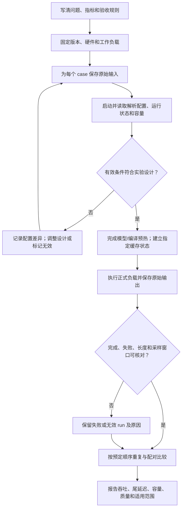
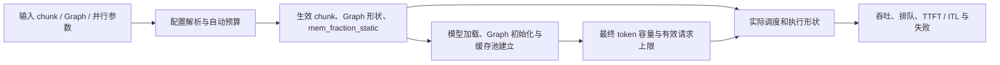

# 参数对照与性能实验记录

> **先建立架构心智模型：** [M11 · 网关服务治理与性能诊断全景](<../architecture/11-网关服务治理与性能诊断全景.md>)。先看职责、数据和生命周期，再回到本篇源码细节。

本文是**源码分析型学习资料**，面向已经知道 TTFT、ITL、吞吐与 Profiler，却还不确定“怎样证明某个参数带来了变化”的读者。

本篇主线是：**先确定比较的问题，再核对实际生效条件，用相同工作负载反复比较，最后把收益、代价和不确定性写进可复查的记录。** 本文提供实验设计与空白记录，不包含真实跑分。

## 0. 阅读基线与范围

| 项目 | 内容 |
| --- | --- |
| 源码路径基准 | SGLang 仓库根目录 `.`；所有源码位置使用仓内相对路径 |
| 读取工作区 | `sglang-source-study` 独立 Git worktree |
| 分支 | `codex/sglang-source-study-20260909`，基于官方 main |
| commit | `72d5c5bb73cadd7ffbf5114e5f81e29d36b6c61a` |
| 读取日期 | `2026-09-10` |
| 工作区状态 | 学习源码 worktree 干净；原源码工作区与 Wiki 其他资料保留 |
| 主线 | Python HTTP、普通文本 Dense、普通自回归、单实例；先用 TP/PP/DP=1 建立对照 |
| 比较维度 | batch、chunk、缓存、Graph、量化、并行；MoE/DP Attention 作为参数连带变化的扩展示例 |
| 测量入口 | benchmark 模块、one_batch_server、perf 测试辅助函数和 nightly 汇总 |
| 不展开 | 自动寻优算法、全部硬件支持组合、真实设备调参、生产压测及完整统计推断课程 |
| 操作边界 | 静态阅读、源码锚点核对与独立教学算术/模板检查；未启动服务、加载模型、运行项目测试、Profiler 或 GPU 实验 |

前置：[11-01 指标口径](01-Benchmark设计与指标口径.md)、[11-02 Profiler](02-Profiler与时间线阅读.md)、[11-03 性能排障](03-从现象定位性能瓶颈.md)。配置解析先看 [01-04](../01-getting-started/04-从参数声明到最终生效配置.md)，Graph 机制看 [05-05](../05-model-execution/05-CUDAGraph编译与执行模式.md)，量化机制看 [09-02](../09-model-specialization/02-量化格式与计算路径.md)。

本文的实验流程、A/B/C/D、R1/R2/R3、表格数字与 manifest 均为**教学设计**，不是运行观察。统计方法补充来自 NIST，读取于 2026-09-10：[按目标选择设计](https://www.itl.nist.gov/div898/handbook/pri/section3/pri33.htm)、[随机区组设计](https://www.itl.nist.gov/div898/handbook/pri/section3/pri332.htm)、[两水平全因子设计](https://www.itl.nist.gov/div898/handbook/pri/section3/pri333.htm)。SGLang 行为以本篇固定源码为准。

## 1. 人话版：先说明这场比较想回答什么

把参数实验想成比较两种厨房安排。你需要确定菜谱、订单、厨师、设备和计时规则；如果第二次同时换了菜谱、增加设备、减少订单，就无法只用“换了排班”解释结果。

SGLang 也如此。下面三个问题都合理，但需要不同记录：

| 问题类型 | 想知道什么 | 允许变化与结论边界 |
| --- | --- | --- |
| 机制对照 | 同样有效容量和负载下，某个执行选择有什么影响 | 尽量固定其他有效条件；说明仍无法隔离的差异 |
| 部署方案对照 | 同样硬件预算和业务目标下，哪套完整配置更合适 | 允许自动预算等连带变化；结论归属于整套配置 |
| 扩容对照 | 增加设备或实例后能多服务多少负载 | 资源数量变化是实验条件；同时报告总量与资源归一化结果 |

一次部署方案对照可以发现有用的配置，却不足以把所有收益归给某个 kernel。实验目标应在看到结果之前写清楚。NIST 也将比较、筛选主要因素和研究因素间相互作用区分为不同设计目标。[设计目标说明](https://www.itl.nist.gov/div898/handbook/pri/section3/pri33.htm)

| 术语 | 人话解释 | 本篇示例 |
| --- | --- | --- |
| 因素 / 水平 | 准备改变的条件 / 该条件的取值 | chunk / 2048 与 4096 |
| case | 一套明确的配置和负载条件 | A、B 两个 case |
| run | 某个 case 的一次执行尝试 | A 在第一组环境中的一次测量 |
| 区组 | 尽量共享干扰条件的一组比较 | 同一台机器、相近时间内比较 A/B |
| 重复 | 重新执行并产生一份独立记录 | 保存三组 A/B，而非复制同一行 |
| 连带变化 | 参数解析或运行初始化带来的其他变化 | Graph 大小影响预算，最终 KV 容量改变 |
| 相互作用 | 某因素的效果随另一因素变化 | Graph 的收益随实际 batch 形状改变 |
| SLO | 实验前约定的服务目标 | 指定负载下 TTFT p99 的上限 |
| 已验证负载点 | 在给定时长和验收规则下通过的测试点 | 测过 4 req/s，不自动等于最大容量就是 4 |

**最小可复查结论**至少包含：配置身份、负载身份、环境、成功/失败范围、时间窗口、重复结果、目标是否满足，以及哪些条件仍未验证。

## 2. 整体地图：每一次运行都要有进入和退出条件



**图意解读：** 这是整理者设计的实验流程，不是 SGLang 中的自动实验管理器。有效条件核对发生在测量前；执行结束后还需核对实际输出。一个程序正常退出，只能满足其中部分条件。

每个 run 的记录建议有如下状态：

| 状态 | 含义 | 结果如何处理 |
| --- | --- | --- |
| PLANNED | 尚未执行 | 数值留空，不填 0 |
| SKIPPED | 工具或实验规则决定不运行 | 保存触发条件，计入计划矩阵 |
| FAILED | 启动失败、请求失败、OOM 等 | 保留退出码、日志和失败请求 |
| MEASURED | 已取得可解释的测量 | 仍需检查质量、SLO 和重复稳定性 |
| INVALID | 运行发生了，但不符合预定比较条件 | 保存数据与剔除依据，不混入有效均值 |

MEASURED 不等于满足 SLO；FAILED 不等于“测得吞吐为 0”。如果部署方案在目标负载下发生 OOM，这也是该方案未通过该负载点的证据，不能从最终容量报告中消失。

## 3. 四层配置：输入、解析、运行状态、资源容量

### 3.1 为什么仅保存命令行不够

ServerArgs.resolve_once 是解析入口。pipeline 在 handler 运行前保存 _raw_input，再由一系列规则决定实际值。已经完成解析的 record 不重复解析；失败的 record 也拒绝直接重试，因为前面 handler 的部分结果可能已经存在。[S7] [S8]

因此配置实验至少保存四层：

| 层次 | 要保留的内容 | 主要源码与边界 |
| --- | --- | --- |
| 原始输入 | 命令参数数组、配置文件、相关环境变量、默认值来源 | launch_command 表达输入身份；未显式设置也需记录 [S7] [S13] |
| 启动解析 | 模型/硬件/并行规则之后的配置 | /server_info 顶层使用 server_args.resolved_dict() [S13] |
| 运行状态 | 各 DP 的 internal_states、控制面变更时间 | Scheduler 用 RuntimeContext 的覆盖值组成 readback [S12] [S14] |
| 实际容量 | token_capacity、有效运行请求上限、Graph/KV/权重内存 | memory_usage 与 effective_max_running_requests_per_dp [S14] |

/server_info 顶层不自动变成所有运行时修改后的配置。它同时返回启动配置和 internal_states；需要逐个 DP 保留，不能只取第一项代表全部实例。[S13] [S14]

RuntimeContext 的关键行为很短：

```python
d = self.server_args.resolved_dict() if base is None else dict(base)
for _source, fields in self._overrides_log:
    d.update(fields)
return d
```

**行为解释：** 先取解析结果，再覆盖本进程记录的运行时变更。它不是跨进程共享字典。TokenizerManager 还会在自己的配置快照上叠加 manager 所有的字段；在线换权重等控制面状态要核对相应模型信息，不能从旧启动参数推断当前模型。[S12] [S15]

实验中若允许在线修改，必须记录修改发生在哪个进程和测量窗口；普通参数对照更容易复查的做法是每个 case 从独立原始输入启动，保存启动后与测量结束时的快照。

### 3.2 改 chunk 为什么可能同时改了显存预算

Schedule 中 mem_fraction_static、max_running_requests、max_total_tokens、chunked_prefill_size 的输入缺省可以是 None；这些不是“最后运行时就是空值”。handle_gpu_memory_settings 会结合设备容量处理 chunk、Graph 大小和自动内存预算。[S1] [S9]

在未显式设置 mem_fraction_static 的相关分支中，源码会考虑激活、Graph、并行和额外预留；post-capture sizing 又有自己的预算分支。因此不能把函数头部的简化估算注释当成所有路径实际执行的公式。[S9]



**图意解读：** 箭头表示需要核查的影响关系，不保证每次改变输入都沿所有箭头改变结果。显式值、容量下限和分支选择可能使某些数值保持不变。最终测量前应读实际状态，而不是根据这张图猜变化大小。

这产生两种不同实验：

- **比较 chunk 机制：** 若希望控制缓存池容量，先检查是否能在合法且可运行的条件下固定预算与有效容量，并核对实际值。仅固定 mem_fraction_static 仍不保证容量相同。
- **比较默认部署方案：** 接受 chunk 连带改变的自动预算，完整报告这些差异，结论写成“配置 A/B 的差异”。

### 3.3 DP Attention 的一个具体连带变化

handle_data_parallelism 在 enable_dp_attention 生效时，将 schedule_conservativeness 乘 0.3，要求 tp_size 能被 dp_size 整除，并把 chunked_prefill_size 除以 dp_size。满足条件时还会重新限制未锁定的 Prefill Graph 最大形状和形状列表。[S10]

例如，**只推演这个 handler 的相应分支**：进入时 chunk=4096、dp_size=2、conservativeness=1，则分支后得到 chunk=2048、conservativeness=0.3。这个算术没有证明该模型或拓扑已能启动，也没有描述其他 handler 的全部结果。

所以“其他启动参数都一样，只开 DP Attention”不等于只改变一个有效因素。也不要把已经解析的字段复制回新的原始输入，期待它们不会再被缩放；每个 case 应从相同原始基线构造。[S7] [S10]

### 3.4 Graph 结束初始化后，容量仍可能调整

在启用相应 post-capture KV 路径、CUDA 平台且不是 draft worker 时，compute_post_capture_kv_resize 会读取 Graph 之后的可用内存，计算额外预留，再重定缓存池和分配器；有效 max_running_requests 也可能被进一步限制。[S16] [S17]

所以一个“Graph 开/关”的结果中，既可能有执行开销差异，也可能有缓存池和准入容量差异。运行记录需要同时保存：

| 需要对照 | 为什么 |
| --- | --- |
| 两个 phase 的 Graph backend 与 capture shapes | 只写 Graph=true 无法确定实际路径 |
| Graph 创建后的内存与 token_capacity | 相同静态比例不等于相同池容量 |
| effective_max_running_requests_per_dp | 输入上限和实际准入上限可能不同 |
| 正式运行的形状、padding 和回退情况 | 启用 Graph 不代表每次 forward 都在 replay |
| 启动/capture 时间与稳定测量时间 | 首次成本和长期服务成本分别回答 |

Graph 执行与回退细节回看 05-05；本文不由配置开关推断 replay 已发生。

## 4. 六类参数分别怎样设计对照

以下取值是**设计示例**，需先通过当前模型、硬件与组合约束检查；没有通用“最佳值”。

### 4.1 Batch：客户端并发、服务端上限、实际 batch 分开

| 对象 | 所有者 | 实验记录 |
| --- | --- | --- |
| 客户端并发与到达率 | 负载发生器 | 请求何时发出，最多多少请求在途 |
| max_running_requests | 服务端配置与实际容量限制 | 输入、解析值及每 DP 有效值 [S1] [S14] |
| 实际 batch | Scheduler 每轮选出的工作 | Prefill/Decode 类型、请求数、token 数、持续时间 |
| 单 batch 工具中的 batch_size | 该工具的请求构造/执行入口 | 不能自动等同于在线每轮调度形状 [S18] [S20] |

一种清晰的实验是先固定服务端配置，逐个提高客户端提供的负载，观察实际 batch 和尾延迟；另一种是固定到达负载，只改服务端有效请求上限。两者应分成不同矩阵。

**R1/R2/R3 例子：** R1 长 Prefill，R2/R3 已进入 Decode。客户端有 3 个在途请求，并不保证某一轮 forward 含 3 个请求；还要看调度选择、chunk 和预算。若只提高 max_running_requests，实际可运行工作仍不足，吞吐没有变化也符合设计预期。

### 4.2 Chunk：先固定长度与到达顺序

可以先比较合法的 chunk=2048 和 4096，输入超过两者的长请求与短请求按固定顺序混合；随后单独比较禁用分块的模式。chunked_prefill_size=-1 在字段与现有测试中用于禁用分块。[S1] [S41]

| 固定或核查 | 应观察 |
| --- | --- |
| 同一批 token IDs、输出限制、到达时间 | 长请求经历多少轮 Prefill |
| overlap、mixed chunk、调度策略 | Decode 得到执行机会的间隔 |
| 预算、page_size、实际 token 容量 | 预算变化是否改变准入或回撤 |
| 缓存前缀状态 | 实际新增 Prefill tokens，而非只看原始输入长 |
| 两个 Graph phase 的配置 | chunk 变化是否带来 capture 形状差异 |

若结果是短请求尾延迟降低而总吞吐下降，应同时报告。不要把吞吐变化符号预先写进“成功标准”，再只保留符合期待的结果。

### 4.3 缓存：重放工作负载比一个 hit 百分比更具体

Memory 声明了 disable_radix_cache、层级缓存等不同设置。禁用 Radix 前缀复用不等于自回归 Decode 不再使用 KV。[S2]

建议先明确缓存层级，设计以下矩阵，而不是只填“warmup=true”：

| case | 初始状态与请求关系 | 想检验的机制 |
| --- | --- | --- |
| A：冷起始、不共享前缀 | 每次重置后发送固定但相互独立的提示 | 基础执行与缓存管理成本 |
| B：冷起始、共享前缀 | R1/R2/R3 有明确相同 prefix，按固定时序到达 | 本轮请求之间的复用 |
| C：预先热前缀 | 先构建指定前缀，再进入正式测量 | 已存在条目能兑现多少少算 |
| D：同一负载禁用复用 | 保留同样请求身份和顺序 | 有无前缀复用的整体差异 |

“冷起始”不保证整个测量过程中没有命中；B 中 R1 完成并保留的前缀可能被后来的请求复用。读者需要区分**开始时缓存为空**与**每个请求都完全未命中**。

one_batch_server 的 cache_hit_rate 用于决定预热前缀长度，不是硬性设置服务端命中比例。_warmup_cache 发送每个 prompt 的前缀，并请求生成 1 个 token；真实命中还受长度、条目保留、调度和有效前缀处理影响。[S21]

该工具用 /metrics 前后 cached_tokens_total 与 prompt_tokens_total 的差值计算观测命中率。解析函数把匹配到的标签系列累加，并不主动筛选本 case 的请求，所以共享端点上的其他流量会污染差值；缺少可用快照或分母不正时结果也不能当成 0% 命中。[S23] [S24]

### 4.4 Graph：明确 phase、优先级与实际执行

当前 ExecGraph 同时包含 Prefill/Decode 配置、形状、禁用开关和 Torch compile。旧的全局 disable_cuda_graph 字段标为 no_cli，不能只从字段存在推断新 CLI 接受哪个旧旗标。[S4]

parse_cuda_graph_config 的优先关系是：**显式 JSON > phase 便捷参数 > 旧全局字段 > 默认值**；同一 phase 的显式 backend 选择也在布尔关闭开关之后写入。[S11]

如果显式 JSON 中 decode.backend=full，同时又传一个 Decode 关闭便捷参数，不能只看后者就把 case 标成“Graph off”。记录最终配置，并避免多处互相冲突地表达同一设置。

一组 Graph 对照应说明：比较 Prefill 还是 Decode、另一 phase 保持什么、是否启用 Torch compile、预热是否覆盖所测形状、哪些 batch 实际 replay/回退、启动耗时和稳态耗时分别是多少。Graph 与编译是有关联但不同的因素，不把两者一起打开后统称为单因素实验。[S4] [S11]

### 4.5 量化：权重、计算与 KV 存储各有身份

Model 中 dtype、quantization、kv_cache_dtype、quantization_param_path、revision 是不同字段。[S5]

| 对照轴 | 应固定或另列的条件 | 必须附带的验收 |
| --- | --- | --- |
| 权重量化格式 | 原模型身份、量化产物版本/哈希、加载方式、kernel/backend | 任务质量或精度基线 |
| 计算 dtype | 权重来源、Attention/GEMM 后端、支持路径 | 数值与输出行为 |
| KV cache dtype | 权重和采样保持不变，记录 scale 来源与池布局 | 长上下文、多轮等对应质量检查 |

更换量化权重并可能改变 EOS 时，实际输出长度也会变化。一个运行更短可能是计算更快，也可能是生成更早结束；必须同时报告实际 output tokens、finish reason 和质量结果。

模型与 tokenizer 不只保留可变分支名称，还应保留实际 revision 或本地文件清单哈希。缺少这些材料时记录未知，不从“模型名字一样”推断字节完全相同。完整机制与格式兼容边界在 09-02；本篇不保证任意三种设置都可自由组合。

### 4.6 并行：同设备预算与增加设备是两种实验

Parallel 声明 TP/PP/DP 等配置；实际 world_size 的计算还考虑 enable_dp_attention，不能始终使用 tp×dp×pp 作为真实设备数量。[S6] [S14]

| 比较问题 | 应记录 |
| --- | --- |
| 相同设备预算，改变并行分工 | 物理设备、rank→设备映射、进程组、每 DP 容量、请求路由 |
| 同样单实例配置，增加 DP 副本 | 总实例数、总到达率、分流、缓存亲和、每副本负载 |
| 增加 TP/PP 设备以容纳更大模型或负载 | 每轮形状、通信、层分配、microbatch、设备利用和总资源 |
| DP Attention / MoE 组合 | 实际组关系、chunk/Graph 连带解析、专家通信与负载分布 |

同一“总吞吐”应说明是一个 DP、一个 worker 还是全部实例；每 GPU 吞吐的分母来自真实资源清单。多设备方案是否更好还取决于尾延迟与质量目标，不能只比较增长后的总量。

## 5. 先核对工具执行了什么，再接受结果表

### 5.1 one_batch_server 的 case 生命周期

11-01 已区分 one_batch、offline_throughput、serving。这里补充经 HTTP 测量 batch 的 one_batch_server：当前实际实现位于 `python/sglang/benchmark/one_batch_server.py`，旧路径仍由包装模块转发，nightly 命令也使用旧模块名。[S30]

| 顺序 | 源码行为 | 记录影响 |
| --- | --- | --- |
| 连接或建立服务 | run_benchmark_internal 获取端点并读取 server_info [S19] | 保存实际端点对应的模型与实例身份 |
| 默认预热 | 按去重后的 batch size 调用 run_one_case，传入 I=1024、O=16 [S19] | 固定 prompt/GSP 等路径会改写实际长度；不要只抄入参 |
| 正式 case 容量筛选 | 矩阵循环先调用两类 should_skip 函数 [S19] [S25] [S26] | 未跳过的 case 才继续；默认预热是前面的独立步骤 |
| 每个 case 开始 | run_one_case 首先调用清缓存接口 [S20] [S22] | 即使连接已有 base_url，也会改变该端点缓存 |
| 构造输入 | 固定 prompt、生成数据或重放数据 [S20] | 保存实际 token IDs 与长度 |
| 可选前缀预热 | 按 cache_hit_rate 构造前缀请求 [S21] | 与前面的模型/编译预热不同 |
| 测量 | 发请求、消费流式输出、记录 token 与时间 [S20] | 原始输出决定计数口径 |
| 可选 profile | 在独立 case 循环采集 [S19] | 不把后一次 trace 的事件直接当成前一次性能样本 |

因此后续若执行这个工具，必须使用为该实验准备的端点。它不是只读取指标的工具；本文没有执行这些接口。

### 5.2 Seed 与 fixed prompt 都不能替代请求清单

run_benchmark_internal 用 bench_args.seed 设置 Python 和 NumPy 随机状态；run_one_case 构造 dataset_args 时又传入 BenchArgs.seed 类默认值。两个来源应分别核查，不能宣称所有数据集必然只由同一个 CLI seed 决定，也不能反向宣称 CLI seed 完全没有作用。[S18] [S19] [S20]

此外，随机数调用顺序、预热次数、数据过滤与 tokenizer 都会影响输入。可靠记录应保留**最终被发送的请求顺序及 token IDs 哈希**；seed 是补充复现条件。

fixed_prompt_file 路径会为 batch 中每条请求复制同一份 prompt IDs。这便于保持内容一致，却同时建立了共享前缀关系；它不是“彼此独立但等长的随机输入”。[S20]

### 5.3 同名 throughput 也要写公式

one_batch_server 在 Native SGLang 路径记录实际 completion tokens；当前 run_one_case 的 output_throughput 分母是 latency 减 last_ttft，其中 last_ttft 对应 batch 中所有请求都已开始输出的时间边界。[S20]

| 指标 | 当前 case 口径 | 不应混为 |
| --- | --- | --- |
| input_throughput | total_input_tokens / last_ttft | 全程输入输出合计吞吐 |
| output_throughput | decode_window_tokens / (latency − last_ttft) | 自动等于业务端到端输出吞吐 |
| overall_throughput | (total_input_tokens + total_output_tokens) / latency | 单独 Decode 性能 |
| last_gen_throughput | 从返回的 internal_states 逐项读取，后面的值可覆盖前面的值 | 多 DP 吞吐总和 |

尤其是 decode_window_tokens：ignore_eos 且不是重放文本数据集时，保留历史总输出 token 分子；其他对应路径扣除所有请求开始前的 token。修改 EOS 策略或数据集后，分子也可能变了。[S20]

**教学例子：** latency=2 s、last_ttft=0.5 s，总输出 300 tokens，其中 30 tokens 出现在所有请求开始前。若采用总量分子，结果是 200 tok/s；若采用窗口内 270 tokens，结果是 180 tok/s。同一次假设事件序列就能产生不同数字，所以不能把这 10% 差异当成代码提速。

工具中的 token-capacity 判断使用估算条件，且有端点/模式分支。被跳过的 case 没有产生性能证据；没有跳过也不是对 OOM、SLO 或所有真实输入长度的保证。[S19] [S25] [S26]

改变上述策略还需满足工具本身的输入约束：disable_ignore_eos 要求 SGLang backend、不能 fake_prefill、client_stream_interval 必须为 1；重放文本数据集也要求 SGLang backend，不能与 fixed_prompt_file 同用，input_len 最多给一个值，而且该值用于容量筛选估算，真实长度来自数据。这些检查发生在连接或启动服务之前，违反条件的 case 应记录为配置拒绝，不能算测得更差的性能。[S19]

### 5.4 Perf 测试：名称、helper、真正启动模块三层追踪

本轮选择阅读两份 perf 文件中的七个用例，未执行。它们是实验设计入口，不是本机性能验证。

| 已读用例 | 实际意图与关键输入 | 如何使用证据 |
| --- | --- | --- |
| test_offline_throughput_default [S39] | run_bench_serving，500 prompts，request_rate=inf | “offline” 名字仍走 serving helper |
| test_offline_throughput_without_radix_cache [S40] | 额外禁用 Radix | 回查 helper 负载和生效容量 |
| test_offline_throughput_without_chunked_prefill [S41] | chunk=-1 | 记录禁用后的派生配置 |
| test_offline_throughput_with_triton_attention_backend [S42] | 同时设置 backend 和 context_length=8192 | 不是仅改变 backend 的纯对照 |
| test_online_latency_default [S43] | 100 prompts，1 req/s | median 门槛不代表 p99 SLO |
| test_moe_tp2_bs1 [S44] | run_bench_offline_throughput，TP=2，Decode Graph 最大形状=2 | 文件叫 one_batch，但 helper 启动 offline_throughput |
| test_torch_compile_tp2_bs1 [S45] | 同一类 helper，加入 compile 参数 | 核查所用模型，不凭日志标题判断 |

run_bench_serving 会启动服务、构造参数、可选执行额外预热，再运行 benchmark 并清理进程；它在返回前检查 completed 等于 num_prompts。get_benchmark_args 还显式填写了 random_range_ratio=0.0 等参数，不能只凭随机长度两个数字推断负载分布。[S27] [S46]

与之不同，run_bench_one_batch 启动的是 one_batch，并解析 Prefill/Decode 文本结果；run_bench_offline_throughput 启动 offline_throughput，默认 1 条请求、I/O=256/256，从 stdout 提取 Last generation throughput，未匹配时初值为 -1。[S28] [S29]

所列 perf 用例的性能门槛放在 is_in_ci 分支中，部分还区分 AMD。不能将 CI 硬件门槛当成通用 SLA；对上述 offline helper 的本地调用，也不能只凭测试没有抛出异常认定解析有效，必须核查进程退出、原始输出及门槛是否实际执行。[S29] [S39] [S40] [S41] [S42] [S43] [S44] [S45]

### 5.5 Nightly 汇总：保留完整明细

NightlyBenchmarkRunner 启动模型服务并构造 batch-server 命令；server_args_for_metrics 保留传入的参数，不会替代运行状态快照。[S30] [S31]

run_performance_test 在收到成功且非空 results 后可返回 passed=True；其中可选的 speculative acceptance 阈值另行检查。这个函数本身并没有对所有吞吐和尾延迟都做通用回归判定。[S34]

还有三处应在读报表时展开：

| 汇总行为 | 当前源码 | 解释边界 |
| --- | --- | --- |
| 输入默认值存在层次差异 | PerformanceTestParams 与 run_performance_test 默认 batch/input 不完全相同 [S32] [S34] | 从真实调用参数确认所测矩阵 |
| “aggregate” 取一个结果 | 从 results 中取 batch_size 最大的那一项 [S33] [S34] | 不是全矩阵均值；完整 benchmark_results 才保留各项 |
| 表格 ITL 是推导值 | batch_size × 1000 / output_throughput [S35] [S36] | 不等于逐请求实测 ITL 分布或 p99 |

BenchmarkResult.to_markdown_row 的成本列使用代码内固定假设，包括 GPU 小时价格、设备数量和利用率，不能当作本次真实资源成本。generate_simple_markdown_report 若前两行 batch_size 相同，会省去第一行作为 warmup；重复实验不能仅靠相同 batch_size 识别预热，原始行与 run 身份仍需保留。[S35] [S36]

### 5.6 benchmark/ 下的搜索文件也未必在跑性能

例如 `benchmark/kernels/attention/sm90_config_search.py` 的 _check_fwd_config 用寄存器、SMEM 等公式过滤候选；find_feasible_fwd_configs 枚举配置，再按 tile_n 和估算流量排序。[S37] [S38]

这里的 feasible 是**满足脚本所编码约束**，没有执行真实服务、测量延迟或证明最优。它可以缩小候选范围，但必须另有 kernel 测量和端到端验证才能形成部署结论。

## 6. 一次完整的 A/B 实验怎样落到记录

以下仍是待执行设计。取“合法配置下，将 chunk 从 2048 调到 4096，对固定请求流有什么影响”为例：

1. **确定问题。** 先选择机制对照还是完整部署配置对照，并写出指标/SLO、测量窗口、失败核算和允许的派生差异。
2. **固定输入身份。** 冻结模型/权重/tokenizer、SGLang commit、依赖与镜像、设备/rank、请求 token IDs、到达顺序、采样和 EOS 策略。
3. **构造 A/B。** 从同一原始配置分别设置 chunk。保存全部输入，而非只保存“B 相对 A 改了一个值”。
4. **核对有效条件。** 对比启动配置、各 DP 运行配置、Graph、预算和容量。若变化超出实验设计，先记录并调整问题，不能继续称为同容量对照。
5. **建立测量前状态。** 完成编译/capture 预热，明确缓存冷/热协议、后台流量、进程复用与重启规则。
6. **执行与保留。** 每个 run 单独保存命令、时间、退出状态、服务日志、客户端原始结果、快照；核对实际输入/输出和完成数。
7. **重复与验收。** 按预先安排的区组/顺序比较，保留无效和失败尝试。报告重复波动、尾延迟、吞吐、质量与容量点，最后给出有限范围结论。

### 6.1 把“预热”拆成三件事

| 预热对象 | 想消除的首次成本 | 是否自然得到热前缀缓存 |
| --- | --- | --- |
| 模型/运行库 | 初始化、权重与依赖准备 | 不保证 |
| 编译/Graph | 编译、capture、形状相关准备 | 不保证，case 还可能清缓存 |
| 业务前缀 | 让指定 prefix 的条目先存在 | 需核对保留与后续兑现 |

如果研究启动性能，首次成本本来就是要测的对象，不能把它藏进 warmup。若研究稳定服务性能，则要明确定义何时开始正式窗口，不能边看数据边选择“看起来最好”的开始时刻。

### 6.2 重复、配对和顺序

同一机器、相近时段组成区组，在区组内安排 A/B，可以减少机器与时间差异混入配置比较；可控制的干扰因素应记录或分组，剩余顺序影响可用预先随机化安排处理。[NIST 区组设计](https://www.itl.nist.gov/div898/handbook/pri/section3/pri332.htm)

不要先运行所有 A，几小时后再运行所有 B，然后完全忽略温度、后台负载和环境变化。ABBA 可以作为平衡顺序的示例，但它不是完整随机化，也不能消除所有非线性漂移。

重复次数没有脱离噪声、成本和精度目标的统一答案。下面只用三组做算术教学，不据此声明统计显著：

| 区组 | A 吞吐 tok/s | B 吞吐 tok/s | A 的 TTFT p99 ms | B 的 TTFT p99 ms |
| --- | ---: | ---: | ---: | ---: |
| 1 | 100 | 108 | 280 | 350 |
| 2 | 102 | 109 | 300 | 360 |
| 3 | 98 | 107 | 290 | 340 |

等权 run 吞吐均值为 A=100、B=108 tok/s，按均值比计算增加 8%。若实验前约定“每个有效 run 的 TTFT p99≤320 ms”，则此教学表中 A 三次通过，B 三次不通过。不能因吞吐更高就给 B 写“整体通过”。

每组分别计算的提升率为 8%、约 6.86%、约 9.18%；它们的平均与“两个均值的比值”是不同统计量。记录中应声明采用哪个。若比较总体吞吐，应保留各 run 的 token 数与持续时间，再按明确权重汇总；不默认所有 run 都等长。

多个 run 的 p99 也不能平均后称为“所有请求的 p99”。若需要合并分布，应保留同口径样本，并声明为什么可以合并；研究尾部稳定性时，还应保留每个 run 的结果。

### 6.3 吞吐容量与显存容量分别记录

| 容量 | 单位与条件 | 不能据此推断 |
| --- | --- | --- |
| KV 池容量 | token_capacity、池布局、dtype | 能满足 SLO 的 req/s |
| 并发准入容量 | 每 DP 有效运行请求上限 | 实际每轮 batch 一定达到该值 |
| 服务能力 | 固定长度/到达分布、窗口与 SLO 下的有效负载点 | 任意业务负载的最大吞吐 |
| 稳定承载 | 实际到达、完成、失败、积压及测后排空情况 | 短暂跑完有限请求就可无限稳定运行 |

**教学容量记录：** 测试 2、4、6 req/s，2 与 4 满足预定目标，6 未满足。正确结论是“在这些条件和测试时长下，已验证的最高测试点为 4 req/s”；4 到 6 之间尚未测量，不能称真实最大值恰好是 4。

到达率要区分计划值和客户端实际发出的值；只有靠客户端阻塞降低实际到达，队列才未增长时，不能把计划值当成已经承载的流量。指标定义回看 11-01。

### 6.4 为什么还需要一个 2×2 对照

单因素比较能建立起点，却可能遗漏相互作用。若 Graph 的效果随 batch 不同，应把两种 batch 和 Graph 开/关的四种组合都列出；这属于两因素、各两水平的完整组合。[NIST 两水平设计](https://www.itl.nist.gov/div898/handbook/pri/section3/pri333.htm)

| 教学 batch 条件 | Graph off 延迟 ms | Graph on 延迟 ms | on − off |
| --- | ---: | ---: | ---: |
| 小形状 | 10 | 8 | -2 |
| 大形状 | 30 | 29 | -1 |

两种形状下的延迟差不同：差值之差为 1 ms；减少比例分别是 20% 和约 3.33%。这只演示“效果依赖另一个因素”的含义，不是真实 Graph 收益。每个组合仍需合法性、实际执行路径与重复检查。

不要立即穷举六个维度所有取值。先围绕有源码依据的假设筛选因素，再针对重要组合补矩阵；没有测试的组合明确留空。

## 7. 可复用的实验记录模板

### 7.1 实验身份：先保留未知项

下面是本文设计的 manifest，**不是 SGLang 的输入配置格式，也不是可直接执行的启动命令**。null 表示尚未取得，status=not_run。字段补齐并通过比较条件检查后，才进入实际运行。

```json
{
  "experiment_id": "chunk-comparison-01",
  "status": "not_run",
  "question": "compare two chunk settings under a fixed workload",
  "comparison_kind": "deployment_configuration",
  "source": {
    "repository": "sgl-project/sglang",
    "branch": "codex/sglang-source-study-20260909",
    "commit": "72d5c5bb73cadd7ffbf5114e5f81e29d36b6c61a",
    "paths_relative_to": "sglang_repo_root"
  },
  "model": {
    "id": null,
    "weights_revision_or_manifest_sha256": null,
    "tokenizer_revision_or_manifest_sha256": null,
    "chat_template_sha256": null
  },
  "environment": {
    "image_digest": null,
    "dependency_manifest_sha256": null,
    "hardware_inventory": null,
    "rank_to_device_map": null,
    "relevant_env_file": null
  },
  "workload": {
    "request_manifest_sha256": null,
    "token_ids_sha256": null,
    "arrival_schedule_sha256": null,
    "sampling_and_eos_policy": null,
    "generator_seed": 42,
    "warmup_protocol": null,
    "cache_protocol": null
  },
  "cases": [
    {"id": "A", "raw_overrides": {"chunked_prefill_size": 2048}},
    {"id": "B", "raw_overrides": {"chunked_prefill_size": 4096}}
  ],
  "acceptance": {
    "quality_rule": null,
    "slo_rule": null,
    "failure_accounting_rule": null,
    "allowed_resolved_config_diff": null
  },
  "execution": {
    "raw_base_config_file": null,
    "block_and_run_order_file": null,
    "measurement_window_rule": null,
    "repetition_rule": null,
    "raw_results": null
  }
}
```

这里把 comparison_kind 写成 deployment_configuration，允许比较包含自动预算变化的完整配置；若改成机制对照，应先把希望固定的有效值、容量和剩余差异写清楚。示例 seed=42 仅是计划字段，不表示已经生成或验证请求。

### 7.2 每个 run 的最小证据

| 记录组 | 必填材料 | 为什么要单独保存 |
| --- | --- | --- |
| 身份 | experiment_id、case_id、run_id、区组、开始/结束时刻 | 防止覆盖或混合重复记录 |
| 输入配置 | 参数数组、配置文件、相关环境变量 | 可以重建输入，不依赖终端历史 |
| 实际配置 | 启动 snapshot、每 DP internal_states、差异清单 | 核对输入与实际处理是否相符 |
| 模型身份 | 权重、tokenizer、模板、加载格式与量化信息 | 避免把内容变化归因于性能参数 |
| 环境 | 镜像、依赖、设备、rank、网络与后台负载 | 解释跨 run 干扰 |
| 负载 | 最终请求及顺序、实际到达、输入输出 lengths、采样与 EOS | 证明两组在比较什么 |
| 前置状态 | 重启/复用、模型和编译预热、缓存初始状态 | 分离首次成本与缓存效应 |
| 原始结果 | 每请求状态/时间/token、stdout、stderr、退出码 | 不只保存摘要截图 |
| 服务证据 | 日志、容量、缓存/队列/设备统计、必要时 trace | 核查机制假设和异常 |
| 有效性 | planned/sent/completed/failed/skipped/invalid 的定义和数量 | 区分没运行、失败和无效 |
| 结论 | 本 run 的质量/SLO 判定、未验证项 | MEASURED 与通过分开 |

这些数量应按**请求层**和**run 层**分别建账。例如一次 run 里部分请求失败，不能把整个 run 数量与请求数量相加。原始资料可能包含业务输入或鉴权信息，保存实验所需内容时应使用适合该实验的材料；环境记录限于相关配置，不要求倾倒全部环境。

### 7.3 可直接填写的比较表

| 比较项 | A | B | 是否满足预定比较条件 |
| --- | --- | --- | --- |
| 原始配置文件及哈希 | 待填 | 待填 | 待核对 |
| 启动配置 / 各 DP 运行快照 | 待填 | 待填 | 待核对 |
| 最终 token_capacity / 有效请求上限 | 待填 | 待填 | 待核对 |
| 工作负载 / token IDs / 到达表哈希 | 待填 | 待填 | 待核对 |
| 模型质量、EOS 与实际输出长度 | 未执行 | 未执行 | 未判定 |
| 预热和缓存协议 | 待填 | 待填 | 待核对 |
| 有效 / 失败 / 跳过 / 无效 runs | 未执行 | 未执行 | 未判定 |
| 实际到达、完成、失败与积压 | 未执行 | 未执行 | 未判定 |
| 吞吐及每 run 波动 | 未执行 | 未执行 | 未判定 |
| TTFT / ITL / E2E 分布 | 未执行 | 未执行 | 未判定 |
| 最高通过的测试负载点 | 未执行 | 未执行 | 未判定 |
| 证据支持的结论与剩余解释 | 待填 | 待填 | 未判定 |

目录可以按“实验主题 / case / run”保存原始材料，路径写在记录中；本文不创建空的结果目录，也不把教学数字填入此表。更多通用字段见 [A05](../appendices/05-实验记录与证据模板.md)。

## 8. 从异常结果反查哪里

| 现象 | 优先核查 | 对应源码或阅读入口 |
| --- | --- | --- |
| 只改 chunk，吞吐和容量一起变 | 自动预算、Graph shapes、post-capture sizing | [S9] [S16]，本篇 §3 |
| 命令写关闭 Graph，实际仍启用 | JSON、phase backend 与关闭参数的优先级 | [S11] |
| 同输入 chunk，开 DP Attention 后变小 | handler 的按 DP 除法与锁定 shape 重裁剪 | [S10] |
| 只保留 server_info 顶层，前后状态对不上 | internal_states 的运行覆盖与模型控制面 | [S12] [S13] [S14] [S15] |
| 指定缓存命中率却与观测不同 | prefix 构造、有效命中、驱逐与指标标签混入 | [S20] [S21] [S23] [S24] |
| 结果矩阵缺行 | token / running-request skip 条件 | [S19] [S25] [S26] |
| 本地测试没报错但吞吐为 -1 | stdout 解析失败、进程错误、CI 门槛未执行 | [S29] [S44] [S45] |
| 汇总 ITL 比请求 p99 小很多 | 报表是批量吞吐推导值，非相同统计量 | [S35] [S36] |
| summary 只有最大 batch | aggregate 取单项，继续读取完整明细 | [S33] [S34] |
| 换量化后吞吐升高、回答变短 | 质量、EOS、actual output tokens 与计数分母 | [S5] [S20]，09-02 |
| cache cold 却有命中 | case 内共享 prefix 和清理/预热顺序 | [S20] [S21] |
| 重复两次只展示一行 | simple report 按前两行 batch 相同省去首行 | [S36] |

排障的目标是把观察回连到具体条件，而非看到一个症状就自动更改参数。

## 9. 自测、验收与下一篇

### 9.1 自测题与检查方向

1. **A/B 都写相同 mem_fraction_static，能否称同容量对照？** 不能。检查 Graph 后的 token_capacity、有效请求上限与池布局；同一比例不保证实际字节和容量相同。[S14] [S16]
2. **所有 run 的 seed 相同，是否不必保存请求？** 不能。tokenizer、数据集参数、调用顺序和过滤都可能改变实际输入；one_batch_server 内还有两个 seed 来源。[S19] [S20]
3. **cache_hit_rate=0.5 是否证明正式测量命中一半？** 不能。它先决定预热 prefix 长度；还需核对真实请求和观测差值。[S21] [S24]
4. **吞吐增加 8%，但 B 的 p99 超出预定 SLO，应写通过吗？** 不能。分开报告吞吐收益和服务目标失败；不在看到结果后改目标。
5. **6 req/s 没通过，4 req/s 通过，是否证明最大容量=4？** 不能。只确定已测点的结果，区间与更长稳定性仍未知。
6. **文件名 one_batch 能保证测试走 one_batch 吗？** 不能。追踪具体用例→helper→模块；本篇两 GPU 文件实际调用 offline_throughput。[S29] [S44] [S45]

### 9.2 本篇完成与未完成

已完成：

- 固定 46 个 Python AST 源码锚点，串起配置输入、解析、运行覆盖和最终容量。
- 给出六类参数的对照边界、case 生命周期、工具与 CI 汇总限制。
- 两张 Mermaid 按文字和源码关系做静态核对；未进行图像渲染验证。
- 独立检查教学预算缩放、吞吐窗口、A/B 统计、SLO 判断和 2×2 差值；检查 manifest JSON 和文档引用。
- 选择阅读两份 perf 测试文件中的七个用例，以及相关 helper/runner；全部只读。

未完成：真实硬件启动、配置运行验证、数据重放、精度检查、GPU 压测、项目测试、置信区间估计和任何性能改善证明。本文没有实测“最佳参数”。

下一篇：[11-05《测试分层精度与失败复现》](05-测试分层精度与失败复现.md)，将区分单元、服务、精度、分布式和硬件测试，说明如何保留可复现的失败样例。

## 10. 源码入口索引

以下路径相对于 SGLang 仓库根目录；链接固定到本篇 commit。类锚点用于参数声明，函数锚点用于行为，均不代表已运行对应代码。

| 编号 | 仓内路径与符号 | 固定源码 |
| --- | --- | --- |
| S1 | `python/sglang/srt/arg_groups/fields/schedule.py::Schedule` | [S1] |
| S2 | `python/sglang/srt/arg_groups/fields/memory.py::Memory` | [S2] |
| S3 | `python/sglang/srt/arg_groups/fields/exec_.py::ExecKernel` | [S3] |
| S4 | `python/sglang/srt/arg_groups/fields/exec_.py::ExecGraph` | [S4] |
| S5 | `python/sglang/srt/arg_groups/fields/model.py::Model` | [S5] |
| S6 | `python/sglang/srt/arg_groups/fields/parallel.py::Parallel` | [S6] |
| S7 | `python/sglang/srt/server_args.py::ServerArgs.resolve_once` | [S7] |
| S8 | `python/sglang/srt/arg_groups/pipeline.py::run_resolution_pipeline` | [S8] |
| S9 | `python/sglang/srt/arg_groups/memory_hook.py::handle_gpu_memory_settings` | [S9] |
| S10 | `python/sglang/srt/arg_groups/parallel_hook.py::handle_data_parallelism` | [S10] |
| S11 | `python/sglang/srt/arg_groups/cuda_graph_hook.py::parse_cuda_graph_config` | [S11] |
| S12 | `python/sglang/srt/runtime_context.py::RuntimeContext.resolved_server_args_dict` | [S12] |
| S13 | `python/sglang/srt/entrypoints/http_server.py::server_info` | [S13] |
| S14 | `python/sglang/srt/managers/scheduler.py::Scheduler.get_internal_state` | [S14] |
| S15 | `python/sglang/srt/managers/tokenizer_manager.py::TokenizerManager.resolved_config_dict` | [S15] |
| S16 | `python/sglang/srt/model_executor/model_runner_components/kv_pool_runtime.py::compute_post_capture_kv_resize` | [S16] |
| S17 | `python/sglang/srt/model_executor/model_runner_components/kv_pool_runtime.py::is_post_capture_kv_active` | [S17] |
| S18 | `python/sglang/benchmark/one_batch_server.py::BenchArgs` | [S18] |
| S19 | `python/sglang/benchmark/one_batch_server.py::run_benchmark_internal` | [S19] |
| S20 | `python/sglang/benchmark/one_batch_server.py::run_one_case` | [S20] |
| S21 | `python/sglang/benchmark/one_batch_server.py::_warmup_cache` | [S21] |
| S22 | `python/sglang/benchmark/one_batch_server.py::_flush_cache_with_retry` | [S22] |
| S23 | `python/sglang/benchmark/one_batch_server.py::get_cache_tokens_from_metrics` | [S23] |
| S24 | `python/sglang/benchmark/one_batch_server.py::calculate_cache_hit_rate` | [S24] |
| S25 | `python/sglang/benchmark/one_batch_server.py::should_skip_due_to_token_capacity` | [S25] |
| S26 | `python/sglang/benchmark/one_batch_server.py::should_skip_due_to_max_running_requests` | [S26] |
| S27 | `python/sglang/test/test_utils.py::run_bench_serving` | [S27] |
| S28 | `python/sglang/test/test_utils.py::run_bench_one_batch` | [S28] |
| S29 | `python/sglang/test/test_utils.py::run_bench_offline_throughput` | [S29] |
| S30 | `python/sglang/test/nightly_utils.py::NightlyBenchmarkRunner.build_benchmark_command` | [S30] |
| S31 | `python/sglang/test/nightly_utils.py::NightlyBenchmarkRunner.run_benchmark_for_model` | [S31] |
| S32 | `python/sglang/test/performance_test_runner.py::PerformanceTestParams` | [S32] |
| S33 | `python/sglang/test/performance_test_runner.py::PerformanceTestResult` | [S33] |
| S34 | `python/sglang/test/performance_test_runner.py::run_performance_test` | [S34] |
| S35 | `python/sglang/test/nightly_bench_utils.py::BenchmarkResult.to_markdown_row` | [S35] |
| S36 | `python/sglang/test/nightly_bench_utils.py::generate_simple_markdown_report` | [S36] |
| S37 | `benchmark/kernels/attention/sm90_config_search.py::_check_fwd_config` | [S37] |
| S38 | `benchmark/kernels/attention/sm90_config_search.py::find_feasible_fwd_configs` | [S38] |
| S39 | `test/registered/perf/test_bench_serving_1gpu_part1.py::TestBenchServing1GPUPart1.test_offline_throughput_default` | [S39] |
| S40 | `test/registered/perf/test_bench_serving_1gpu_part1.py::TestBenchServing1GPUPart1.test_offline_throughput_without_radix_cache` | [S40] |
| S41 | `test/registered/perf/test_bench_serving_1gpu_part1.py::TestBenchServing1GPUPart1.test_offline_throughput_without_chunked_prefill` | [S41] |
| S42 | `test/registered/perf/test_bench_serving_1gpu_part1.py::TestBenchServing1GPUPart1.test_offline_throughput_with_triton_attention_backend` | [S42] |
| S43 | `test/registered/perf/test_bench_serving_1gpu_part1.py::TestBenchServing1GPUPart1.test_online_latency_default` | [S43] |
| S44 | `test/registered/perf/test_bench_one_batch_2gpu.py::TestBenchOneBatch2GPU.test_moe_tp2_bs1` | [S44] |
| S45 | `test/registered/perf/test_bench_one_batch_2gpu.py::TestBenchOneBatch2GPU.test_torch_compile_tp2_bs1` | [S45] |
| S46 | `python/sglang/test/test_utils.py::get_benchmark_args` | [S46] |

[S1]: https://github.com/sgl-project/sglang/blob/72d5c5bb73cadd7ffbf5114e5f81e29d36b6c61a/python/sglang/srt/arg_groups/fields/schedule.py#L26
[S2]: https://github.com/sgl-project/sglang/blob/72d5c5bb73cadd7ffbf5114e5f81e29d36b6c61a/python/sglang/srt/arg_groups/fields/memory.py#L28
[S3]: https://github.com/sgl-project/sglang/blob/72d5c5bb73cadd7ffbf5114e5f81e29d36b6c61a/python/sglang/srt/arg_groups/fields/exec_.py#L109
[S4]: https://github.com/sgl-project/sglang/blob/72d5c5bb73cadd7ffbf5114e5f81e29d36b6c61a/python/sglang/srt/arg_groups/fields/exec_.py#L434
[S5]: https://github.com/sgl-project/sglang/blob/72d5c5bb73cadd7ffbf5114e5f81e29d36b6c61a/python/sglang/srt/arg_groups/fields/model.py#L38
[S6]: https://github.com/sgl-project/sglang/blob/72d5c5bb73cadd7ffbf5114e5f81e29d36b6c61a/python/sglang/srt/arg_groups/fields/parallel.py#L24
[S7]: https://github.com/sgl-project/sglang/blob/72d5c5bb73cadd7ffbf5114e5f81e29d36b6c61a/python/sglang/srt/server_args.py#L231
[S8]: https://github.com/sgl-project/sglang/blob/72d5c5bb73cadd7ffbf5114e5f81e29d36b6c61a/python/sglang/srt/arg_groups/pipeline.py#L26
[S9]: https://github.com/sgl-project/sglang/blob/72d5c5bb73cadd7ffbf5114e5f81e29d36b6c61a/python/sglang/srt/arg_groups/memory_hook.py#L40
[S10]: https://github.com/sgl-project/sglang/blob/72d5c5bb73cadd7ffbf5114e5f81e29d36b6c61a/python/sglang/srt/arg_groups/parallel_hook.py#L151
[S11]: https://github.com/sgl-project/sglang/blob/72d5c5bb73cadd7ffbf5114e5f81e29d36b6c61a/python/sglang/srt/arg_groups/cuda_graph_hook.py#L37
[S12]: https://github.com/sgl-project/sglang/blob/72d5c5bb73cadd7ffbf5114e5f81e29d36b6c61a/python/sglang/srt/runtime_context.py#L1187
[S13]: https://github.com/sgl-project/sglang/blob/72d5c5bb73cadd7ffbf5114e5f81e29d36b6c61a/python/sglang/srt/entrypoints/http_server.py#L812
[S14]: https://github.com/sgl-project/sglang/blob/72d5c5bb73cadd7ffbf5114e5f81e29d36b6c61a/python/sglang/srt/managers/scheduler.py#L4966
[S15]: https://github.com/sgl-project/sglang/blob/72d5c5bb73cadd7ffbf5114e5f81e29d36b6c61a/python/sglang/srt/managers/tokenizer_manager.py#L2119
[S16]: https://github.com/sgl-project/sglang/blob/72d5c5bb73cadd7ffbf5114e5f81e29d36b6c61a/python/sglang/srt/model_executor/model_runner_components/kv_pool_runtime.py#L49
[S17]: https://github.com/sgl-project/sglang/blob/72d5c5bb73cadd7ffbf5114e5f81e29d36b6c61a/python/sglang/srt/model_executor/model_runner_components/kv_pool_runtime.py#L31
[S18]: https://github.com/sgl-project/sglang/blob/72d5c5bb73cadd7ffbf5114e5f81e29d36b6c61a/python/sglang/benchmark/one_batch_server.py#L114
[S19]: https://github.com/sgl-project/sglang/blob/72d5c5bb73cadd7ffbf5114e5f81e29d36b6c61a/python/sglang/benchmark/one_batch_server.py#L1112
[S20]: https://github.com/sgl-project/sglang/blob/72d5c5bb73cadd7ffbf5114e5f81e29d36b6c61a/python/sglang/benchmark/one_batch_server.py#L584
[S21]: https://github.com/sgl-project/sglang/blob/72d5c5bb73cadd7ffbf5114e5f81e29d36b6c61a/python/sglang/benchmark/one_batch_server.py#L462
[S22]: https://github.com/sgl-project/sglang/blob/72d5c5bb73cadd7ffbf5114e5f81e29d36b6c61a/python/sglang/benchmark/one_batch_server.py#L528
[S23]: https://github.com/sgl-project/sglang/blob/72d5c5bb73cadd7ffbf5114e5f81e29d36b6c61a/python/sglang/benchmark/one_batch_server.py#L57
[S24]: https://github.com/sgl-project/sglang/blob/72d5c5bb73cadd7ffbf5114e5f81e29d36b6c61a/python/sglang/benchmark/one_batch_server.py#L95
[S25]: https://github.com/sgl-project/sglang/blob/72d5c5bb73cadd7ffbf5114e5f81e29d36b6c61a/python/sglang/benchmark/one_batch_server.py#L994
[S26]: https://github.com/sgl-project/sglang/blob/72d5c5bb73cadd7ffbf5114e5f81e29d36b6c61a/python/sglang/benchmark/one_batch_server.py#L1007
[S27]: https://github.com/sgl-project/sglang/blob/72d5c5bb73cadd7ffbf5114e5f81e29d36b6c61a/python/sglang/test/test_utils.py#L986
[S28]: https://github.com/sgl-project/sglang/blob/72d5c5bb73cadd7ffbf5114e5f81e29d36b6c61a/python/sglang/test/test_utils.py#L1378
[S29]: https://github.com/sgl-project/sglang/blob/72d5c5bb73cadd7ffbf5114e5f81e29d36b6c61a/python/sglang/test/test_utils.py#L1442
[S30]: https://github.com/sgl-project/sglang/blob/72d5c5bb73cadd7ffbf5114e5f81e29d36b6c61a/python/sglang/test/nightly_utils.py#L81
[S31]: https://github.com/sgl-project/sglang/blob/72d5c5bb73cadd7ffbf5114e5f81e29d36b6c61a/python/sglang/test/nightly_utils.py#L200
[S32]: https://github.com/sgl-project/sglang/blob/72d5c5bb73cadd7ffbf5114e5f81e29d36b6c61a/python/sglang/test/performance_test_runner.py#L10
[S33]: https://github.com/sgl-project/sglang/blob/72d5c5bb73cadd7ffbf5114e5f81e29d36b6c61a/python/sglang/test/performance_test_runner.py#L23
[S34]: https://github.com/sgl-project/sglang/blob/72d5c5bb73cadd7ffbf5114e5f81e29d36b6c61a/python/sglang/test/performance_test_runner.py#L43
[S35]: https://github.com/sgl-project/sglang/blob/72d5c5bb73cadd7ffbf5114e5f81e29d36b6c61a/python/sglang/test/nightly_bench_utils.py#L33
[S36]: https://github.com/sgl-project/sglang/blob/72d5c5bb73cadd7ffbf5114e5f81e29d36b6c61a/python/sglang/test/nightly_bench_utils.py#L76
[S37]: https://github.com/sgl-project/sglang/blob/72d5c5bb73cadd7ffbf5114e5f81e29d36b6c61a/benchmark/kernels/attention/sm90_config_search.py#L272
[S38]: https://github.com/sgl-project/sglang/blob/72d5c5bb73cadd7ffbf5114e5f81e29d36b6c61a/benchmark/kernels/attention/sm90_config_search.py#L327
[S39]: https://github.com/sgl-project/sglang/blob/72d5c5bb73cadd7ffbf5114e5f81e29d36b6c61a/test/registered/perf/test_bench_serving_1gpu_part1.py#L27
[S40]: https://github.com/sgl-project/sglang/blob/72d5c5bb73cadd7ffbf5114e5f81e29d36b6c61a/test/registered/perf/test_bench_serving_1gpu_part1.py#L68
[S41]: https://github.com/sgl-project/sglang/blob/72d5c5bb73cadd7ffbf5114e5f81e29d36b6c61a/test/registered/perf/test_bench_serving_1gpu_part1.py#L86
[S42]: https://github.com/sgl-project/sglang/blob/72d5c5bb73cadd7ffbf5114e5f81e29d36b6c61a/test/registered/perf/test_bench_serving_1gpu_part1.py#L101
[S43]: https://github.com/sgl-project/sglang/blob/72d5c5bb73cadd7ffbf5114e5f81e29d36b6c61a/test/registered/perf/test_bench_serving_1gpu_part1.py#L124
[S44]: https://github.com/sgl-project/sglang/blob/72d5c5bb73cadd7ffbf5114e5f81e29d36b6c61a/test/registered/perf/test_bench_one_batch_2gpu.py#L19
[S45]: https://github.com/sgl-project/sglang/blob/72d5c5bb73cadd7ffbf5114e5f81e29d36b6c61a/test/registered/perf/test_bench_one_batch_2gpu.py#L35
[S46]: https://github.com/sgl-project/sglang/blob/72d5c5bb73cadd7ffbf5114e5f81e29d36b6c61a/python/sglang/test/test_utils.py#L912
