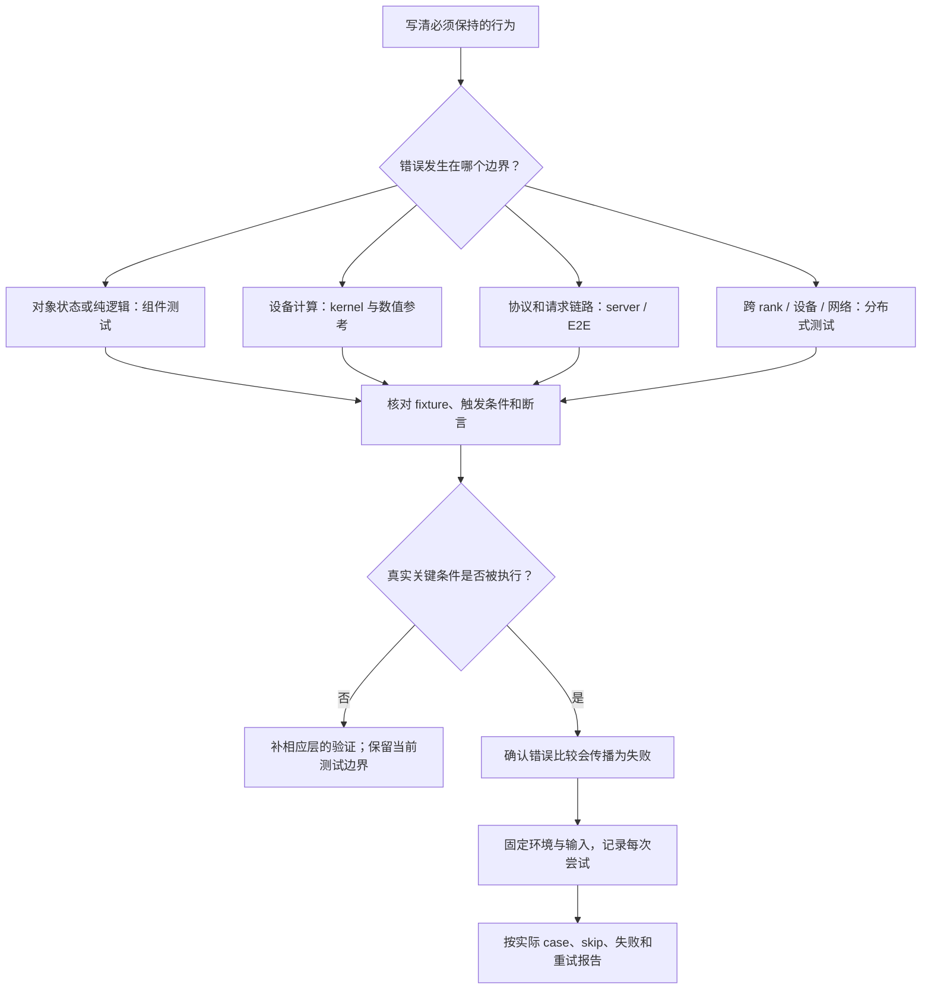
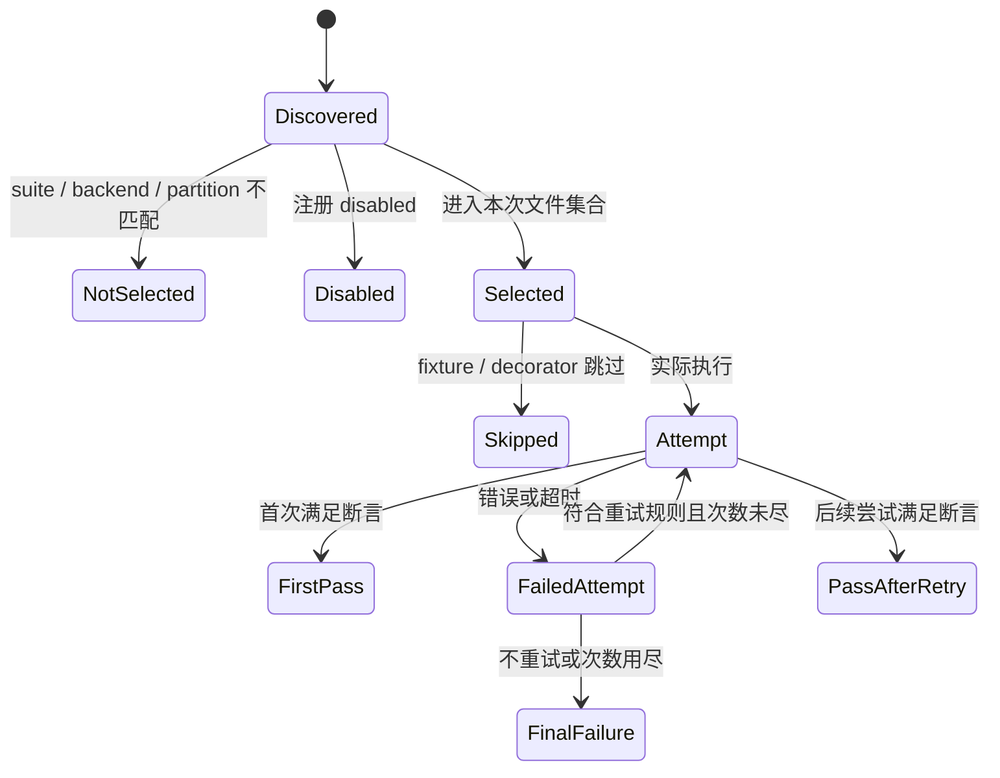

# 测试分层、精度与失败复现

> **先建立架构心智模型：** [M11 · 网关服务治理与性能诊断全景](<../architecture/11-网关服务治理与性能诊断全景.md>)。先看职责、数据和生命周期，再回到本篇源码细节。

本文是**源码分析型学习资料**，面向第一次为 SGLang 选择测试、解释 CI 结果或整理失败复现材料的读者。

本篇主线是：**从需要验证的行为出发，找到真正执行该行为的测试，再追到它的断言和失败传播；复现时固定输入、环境、状态与每一次尝试。** 有测试文件、进程退出成功和机制已经验证，是不同层次的证据。

## 0. 阅读基线与范围

| 项目 | 内容 |
| --- | --- |
| 源码路径基准 | SGLang 仓库根目录 `.`；所有源码位置使用仓内相对路径 |
| 读取工作区 | `sglang-source-study` 独立 Git worktree |
| 分支 | `codex/sglang-source-study-20260909`，基于官方 main |
| commit | `72d5c5bb73cadd7ffbf5114e5f81e29d36b6c61a` |
| 读取日期 | `2026-09-10` |
| 工作区状态 | 学习源码 worktree 干净；原源码工作区与 Wiki 其他资料保留 |
| 主线 | 测试发现/选择/执行 → 局部状态断言 → HTTP 结果 → 数值和任务精度 → 分布式/硬件边界 → 失败复现 |
| 代表路径 | CPU 延迟取消、整数 kernel、HTTP logprob、GSM8K、batch 确定性、CUDA 多卡 all-reduce |
| 不展开 | 所有 CI workflow 的触发权限、全部模型/后端测试、外部评测器内部实现、真实硬件故障定位 |
| 操作边界 | 只读源码与测试；编写学习资料，检查锚点、模板和独立教学算术；未导入项目执行、运行测试、启动服务、加载模型或使用 GPU |

前置：[11-03 性能排障](03-从现象定位性能瓶颈.md)、[11-04 参数实验](04-参数对照与性能实验记录.md)。请求与资源生命周期参考 [02-06](../02-request-lifecycle/06-完成取消与资源释放.md)、[04-07](../04-kv-cache/07-KV缓存全生命周期与排障.md)；并行机制参考阶段 06。

本文的测试选择树、R1/R2/R3、失败记录格式和数值示例均为**整理者教学归纳**。外部语义核对于 2026-09-10：[Python unittest](https://docs.python.org/3/library/unittest.html)、[PyTorch 2.14 可复现性](https://docs.pytorch.org/docs/2.14/notes/randomness.html)、[assert_close](https://docs.pytorch.org/docs/2.14/testing.html#torch.testing.assert_close)。这些文档版本不代表本机安装或运行版本。

## 1. 人话版：先写“什么错误必须被这项测试发现”

把测试想成不同范围的检查：

- 检查一段开关逻辑，不必搭建完整服务。
- 检查请求穿过 HTTP、分词和调度之后的结果，需要真实服务链路。
- 检查浮点计算，需要明确参考值、误差标准和执行后端。
- 检查多卡通信，需要相应 rank、进程组与真实数据传输。
- 检查模型答题质量，需要固定题目、提示方式、采样与评分器。

更大范围的测试不自动包含所有小范围断言。一次完整推理即使成功，也可能没有触发“请求取消后仍有在途 chunk”这种边界。

| 术语 | 人话解释 | 要问的问题 |
| --- | --- | --- |
| fixture | 为测试准备并收尾的环境 | 创建什么，谁释放，失败时是否收尾 |
| oracle / 判定依据 | 决定对错的规则或参考 | 比较状态、数值、文本还是任务分数 |
| assert / 断言 | 将判定不满足变成失败 | 比较结果是否真的传到了断言 |
| mock / stub | 替代某个依赖的假对象或接口 | 被替代的部分还剩什么未验证 |
| 参数化 | 用多组参数执行同一测试函数 | 一项函数展开成多少实际 case |
| skip / 未选择 | 测试显式跳过 / 没进入本次执行集合 | 两者都不是通过该行为 |
| flaky / 不稳定失败 | 同样记录条件下有时成功有时失败 | 原始失败是否仍保留，条件是否真的相同 |
| regression / 回归 | 以前满足的行为在变更后不满足 | 基线和候选是否采用同一判定 |
| tolerance / 容差 | 允许的数值差范围 | 为什么这个任务允许这样的误差 |

选择测试之前先写一句可检查的要求。例如：

> R1 离开 chunked_req 槽位后，已经登记的取消请求仍应作用到 R1，且 pending marker 应被清除。

这句话比“测试取消功能”具体：它给出触发状态、目标对象和预期变化。

## 2. 测试分层地图：层级按证据定义

当前 `test/README.md` 建议新测试按 unit、kernel、e2e、accuracy、perf、stress 等种类组织，硬件通过注册表达；旧路径正逐步迁移。`test/registered/README.md` 仍保留旧目录说明，不能仅凭该页或目录名字判断测试性质。[S1] [S2] [S3]

| 层次 | 代表证据 | 不能直接证明 |
| --- | --- | --- |
| 静态发现 / 注册检查 | 路径、suite、入口、参数字面量合法 | 用例执行过或断言有效 |
| CPU 组件单元 | 状态变化、预算、错误处理、协议构造 | GPU kernel、设备内存、真实通信 |
| Kernel 正确性 | 给定形状/dtype/backend 的张量结果 | 整个服务、任务质量、并发生命周期 |
| Server / E2E | 请求经过真实入口并产生满足断言的结果 | 未触发的异常、其他模型和拓扑 |
| 数值一致性 / 确定性 | 指定输入、路径及精度标准下的比较 | 任意版本/设备逐位一致 |
| 任务精度 | 固定评测协议下的分数与门槛 | 每个样例都正确或数值实现完全相同 |
| 分布式与硬件 | 特定设备、rank、通信与执行路径 | 其他厂商、跨节点网络、全部故障时序 |
| 性能 / 压力 | 给定负载下的 SLO、吞吐和长期状态 | 无关输入的正确性或所有故障安全性 |

“单元”也不是一个可以替代源码阅读的标签。当前 unit README 的目标是 CPU、无服务、无权重和无加速器；读到遗留文件时仍应检查实际 import、fixture 和执行路径。[S2]



**图意解读：** 这是测试选择方法，不是代码中的自动决策器。不同分支可以组合，例如取消问题先用 CPU 状态测试捕获控制流，再补真实 GPU/通信中的资源寿命验证。

## 3. CI 从“有文件”到“实际执行”经过哪些关口

### 3.1 注册函数是静态标记

register_cpu_ci 等函数运行时是 no-op；RegistryVisitor 通过 AST 读取模块级注册调用。CIRegistry.effective_suite 用 stage 与 runner_config 组成 suite，或取旧 suite 字段。[S4] [S5] [S7]

_parse_call_args 要求相关值是可读取的常量，并且只允许两种组合：

| 注册形式 | 示例含义 | 检查边界 |
| --- | --- | --- |
| stage + runner_config | 阶段和设备池组成 suite | 不再同时提供旧 suite |
| suite | 保留旧命名方式 | 不再同时提供 stage/runner_config |

不支持把动态表达式、展开参数或未知关键字当成这些注册信息；est_time 是估计耗时，不是实际测试成绩。[S6]

collect_tests 对启用的注册还要求文件有可执行 main 入口。当前 _is_main_block_with_call 检查 main 分支中是否出现调用，并不证明调用的一定是测试框架，也不计算实际测试数量。[S8] [S9]

所以注册检查减少了“文件执行却什么都没做”的机会，却不是完整的运行覆盖证明。

### 3.2 Suite 筛选发生在发现之后

run_a_suite 扫描 `test/registered/` 下的 Python 文件，排除 conftest.py 和 __init__.py，严格收集注册，再验证 suite 并筛选。当前实际代码没有按 README 的所有历史描述去扫描额外 JIT 目录；实际范围以这一入口为准。[S11] [S13]

筛选同时比较 backend、effective_suite 和 nightly 布尔值，再把 disabled 非 None 的项分到跳过集合。[S12]

这意味着：

- 传入硬件名不会自动执行该硬件的全部测试。
- suite 名含 nightly 和注册 nightly=True 是两个字段关系；当前 CUDA 命名套件通常依靠名称，不能机械添加 --nightly。[S11] [S12] [S15]
- 某文件注册错误可能在筛选目标 suite 前就阻止发现阶段完成。
- 一个 suite 的成功不能证明 disabled 或未分配到本分片的测试通过。

### 3.3 分片按估计时间分配文件

auto_partition 先按估计耗时从大到小排序，文件名用于同耗时的稳定排序，再把每个文件放入当前总估计耗时最少的分片。load_live_est 可提供历史估计，缺失或相应格式无法读取时回退到源码 est_time。[S10] [S14]

**教学账本：** 三个文件估时 90、60、30 秒，分为两片，依次分配后为 90 秒和 60+30=90 秒。这里平衡的是估计值，不保证实际都运行 90 秒。

复现某次 CI 分片时，需要保存：

| 身份 | 为什么 |
| --- | --- |
| 源码 commit 和注册列表 | 新增/改名会改变分配 |
| backend、suite 列表、nightly、disabled | 决定候选集合 |
| partition id / size | 决定本次拿到哪一组 |
| live estimate 文件及哈希 | 同一源码也可能被重新分配 |
| 实际文件列表与各文件实际 case | 文件分片不是 case 覆盖清单 |

--auto-partition-id 和 --auto-partition-size 必须成对指定，大小及 id 范围由 main 检查。[S15]

### 3.4 文件执行、failfast 与空集合

普通模式的 run_unittest_files 启动 `python3 <file> -f`。对 unittest，这是文件内 failfast；suite 的 continue_on_error 则决定一个文件失败之后是否继续其他文件，两层不能混为一谈。[S17] [Python failfast](https://docs.python.org/3/library/unittest.html#command-line-options)

pytest 文件是否接收这个参数取决于 main 包装。已读 add_constant 文件显式调用 pytest.main([__file__, "-v", "-s"])，没有转发传入的 -f；多 GPU wrapper 则主动把 -f 翻译成 pytest 的 -x。[S27] [S57]

fork_worker_batch_size>1 且未启用文件重试时，可使用预加载后每文件新建 fork child 的路径；这不是让多个文件共享同一个测试子进程。运行模式应进入复现记录。[S17] [S60]

还要核对**实际执行数量**：run_unittest_files 的初始 success=True，空文件列表不进入循环，最后仍可返回成功。因此“退出码为 0”不足以证明目标测试被选择过。[S17]

### 3.5 超时是多层预算

| 层次 | 当前代表逻辑 | 复现时要保留 |
| --- | --- | --- |
| 文件预算 | 固定 timeout，或由 est_time 推导 [S15] [S16] [S17] | 采用哪种来源 |
| 多 GPU world-size 子任务 | multigpu_pytest_main 默认每次 torchrun 600 秒 [S57] [S58] | 具体 world size 和到哪一项 |
| 服务启动 | helper 等待进程与 /health_generate [S36] [S37] | 启动日志、健康请求与子进程退出 |
| 请求或外部评测 | 各请求/评测入口自己的等待 | 区分启动、执行、评测器卡住 |

derive_timeout_per_file 的当前公式是 max(1.5×est_time, est_time+1800)。例如 est_time=100 秒时，推导预算为 1900 秒，不是 150 秒。开启文件重试时，固定预算还可能加入 retry_timeout_increase；推导预算走另一分支。[S11] [S16]

run_with_timeout 用线程等待执行函数；超时后由外层 runner 处理对应进程树或 fork worker。不能把“等待超时”直接解释成目标函数主动取消并安全收尾。[S17] [S63]

## 4. 一条请求 R1：CPU 单元测试到底证明哪一步

以 `test/registered/unit/managers/test_scheduler_chunked_abort_race.py` 为例，它构造少量必要状态，并调用实际 Scheduler.process_pending_chunked_abort。[S23] [S24] [S25] [S26]

### 4.1 Fixture 只保留要触发的状态

_make_scheduler 使用 Scheduler.__new__，手动设置 pending marker、chunked_req、running_batch 等字段，并把部分依赖替换为 Mock。它没有执行 Scheduler 的完整初始化，也没有加载模型。[S23]

maybe_stub_sgl_kernel 先尝试导入；遇到 ImportError 或 OSError 时才安装可生成假模块的 finder。其触发条件是导入结果，不只是“机器名叫 CPU”。这样的 stub 帮助测试控制逻辑，也明确排除了真实 kernel 的证明。[S22]

### 4.2 两个用例的状态账本

| 时刻 / 条件 | R1：已离开 chunk 槽，但还活着 | R2：已经结束 |
| --- | --- | --- |
| 调用前 | pending 指向请求，chunked_req=None，running_batch 含请求 | pending 指向请求，finished=True |
| 生产代码分支 | 发现目标不在 chunk 槽，清 marker，再按 rid 请求取消当前位置 [S26] | finished 分支仅清 marker [S26] |
| 用例断言 | to_finish 非 None，pending marker 为 None [S24] | to_finish 仍为 None，pending marker 为 None [S25] |
| 本用例未执行 | 真实 GPU forward、结果 drain、KV/网络 buffer 退役 | 真实服务中的结束竞态 |

R3 可以作为**后续测试设计**：取消到来时仍有已发出的 chunk 结果未返回。需要保留在途结果、释放条件和下一轮调度的关系；不能把它简化成一个立即完成的 Mock，再宣称覆盖了设备安全退役。

这就是“最小测试”的含义：去掉与要验证的状态关系无关的成本，同时保留真正触发错误的关系。它不是把关键并发或资源生命周期也删掉。

## 5. 从整数 kernel 到 HTTP：检查结果本身

### 5.1 Kernel 的参考计算与边界形状

add_constant 的测试建立 CUDA int32 tensor，将结果与 src+constant 比较；包含普通大小、边界附近长度、非对齐切片和较大输入。[S27] [S28] [S29] [S30]

四个测试函数在当前显式参数化下展开为：

| 函数类别 | 参数组合数量 |
| --- | ---: |
| 普通 size×constant | 8×5=40 |
| 非对齐输入 | 1 |
| 大输入的两个 size | 2 |
| 大非对齐输入 | 1 |
| 合计 | 44 |

这是从装饰器与函数推导的 **44 个 case**，本次没有收集或运行 pytest。整数相等适合这个参考关系，却不能直接成为浮点 Attention 的通用精度标准。

这个文件位于迁移中的旧 kernels 路径；正文按实际文件提供锚点，不把它改写成尚未存在的新目录。[S1] [S27]

### 5.2 HTTP 测试不仅是“服务能起来”

TestSRTEndpoint.setUpClass 启动共享服务，设置特定环境和参数，包括较小 logprob chunk、静态内存比例及 Decode Graph 形状上限；各测试方法复用该服务。[S31]

popen_launch_server 合并环境、启动服务并等待 /health_generate。启用离线模式而启动失败时，它还可能改为在线模式重新启动。实验记录要保留实际启动尝试，而不只保存最后一个 PID。[S36] [S37]

同一测试文件中，断言强度也不同：

| 已读路径 | 实际检查 | 证据边界 |
| --- | --- | --- |
| test_logprob → run_decode | 发送请求、解析并打印结果 [S32] [S33] | 不含针对内容正确性的显式业务断言 |
| test_logprob_start_len | prompt/completion 计数、logprob 数量与文本对应 [S34] | 主要验证结构与对齐关系 |
| test_logprob_match | 将首次生成的 token 拼回输入，再次打分，比较相应 logprob [S35] | 是两条执行路径的自一致性比较 |

结构检查能发现数量或拼接错误；数值自一致性可发现两路径差异，但如果两边共享同一缺陷，也可能一起出错。需要根据目标加入独立参考或任务级结果，不能把这些标准互相替代。

### 5.3 一个 logprob 对照怎样走完整链路

test_logprob_match 的步骤是：[S35]

1. 输入一段 prompt，要求生成 token 并返回 input/output logprobs。
2. 保存 input token IDs、output token IDs 和输出 token 的 logprob。
3. 将 input+output IDs 作为新 prompt，要求生成 0 个新 token，重新取得输入 logprob。
4. 按原 prompt 长度切出与首次 output 对应的部分。
5. 计算绝对差的最大值，并断言小于 0.35。

0.35 是该用例的现有阈值，不是所有模型、dtype 和比较目标的推荐值。复现失败时应保留 token 对齐、两个原始响应和最大差对应的位置；只抄“max_diff 超限”不够。

## 6. 精度、确定性和任务分数分别是什么

### 6.1 数值容差先说明参考方向

对有限、实数、非量化的 strided tensor，torch.testing.assert_close 使用：

```text
abs(actual - expected) <= atol + rtol * abs(expected)
```

它还检查形状及所选 dtype/device/layout 等条件；NaN 和无穷值有专门规则。设置 rtol 或 atol 时应同时明确另一项。[PyTorch assert_close](https://docs.pytorch.org/docs/2.14/testing.html#torch.testing.assert_close)

**教学例子：** expected=100、atol=0.01、rtol=0.0001，则容许差为 0.02。actual=100.015 可满足数值条件，100.05 不满足；若 expected=0，则容许差只有 0.01。不要只报告相对误差而忽略近零值，也不要事后不断放大阈值直到通过。

| 需要固定 | 为什么 |
| --- | --- |
| 参考实现及版本 | 参考也可能变化或共享缺陷 |
| shape、stride、dtype、设备 | 同值不同布局可能走不同 kernel |
| atol、rtol、NaN/Inf 处理 | 决定何时失败 |
| 最大/分布误差与首个分歧 | 区分单点异常、系统偏移和对齐错误 |
| 输入生成及哈希 | 复现的是同一组数据 |
| 接近阈值的样本 | 不能只留下均值 |

### 6.2 Seed 不能独自保证跨环境逐位相同

固定 Python、NumPy、设备采样的随机条件，是复现的一部分；算法选择、并发顺序、batch、版本和硬件也可能改变结果。PyTorch 明确不保证跨发布版本、commit 或平台完全重现，CPU/GPU 即使 seed 相同也不保证一样。[可复现性说明](https://docs.pytorch.org/docs/2.14/notes/randomness.html)

因此要把三个目标分开：

| 目标 | 比较对象 | 可能的判定 |
| --- | --- | --- |
| 同环境重复一致 | 相同输入与执行条件的多次结果 | 明确要求的逐位/token 一致 |
| 不同执行形状一致 | 单请求、batch、cached/uncached 等 | 根据功能契约选择数值或 token 标准 |
| 任务质量稳定 | 固定评测协议下的样例与分数 | 样例级差异和总体门槛 |

选中 deterministic 相关配置不自动证明它覆盖所有自定义 kernel；应核查具体执行路径。相关机制在 05-04 和 05-05，本文只追踪测试证据。

### 6.3 确定性 helper：一定要追到 return 与 assert

TestDeterministicBase 设置服务，基类本身通过 SkipTest 排除，派生类选择实际 backend，部分平台会跳过特定类。[S62] [S64]

BenchArgs 的输入缺省 temperature=0、sampling_seed=42。send_single/send_prefix 会把 sampling_seed 放入请求；prefix 路径还在客户端用随机方式分配不同前缀，并先清缓存。[S50] [S51] [S52]

本轮读到两处会影响“测试覆盖了什么”的具体细节：

| 路径 | 当前执行顺序 | 正确解读 |
| --- | --- | --- |
| TestDeterministicBase.test_single | 调用 test_deterministic 后才赋 temperature=0.5 [S46] | 该次调用仍使用前面的默认值；后置赋值不能证明测了 0.5 |
| test_prefix_with_logprobs | 调用前设置 temperature=0.5、return_logprob=True [S47] | 还要检查 helper 返回哪些判定结果 |

prefix 调用者的关键片段是：

```python
results = test_deterministic(args)
for result in results:
    assert result == 1
```

但 test_deterministic 的 prefix 分支返回的是各 prompt 的**文本去重数量**。logprob 比较通过 compare_logprobs 计算并打印，单独记录在 logprob_results 中，没有合并进返回的 results。[S48] [S49]

因此该调用者的断言不能单独证明打印出来的 logprob 全部一致。这是静态发现的验证边界，本次没有执行失败样例，也没有修改测试实现。

single 分支还有更具体的范围：它对 batch size=1..n_trials 发送相同 prompt，send_single 默认取 batch 的第一项文本，再比较各轮去重数量。它不是逐项比较每一条 batch 输出。[S48] [S51]

**教学反例：** 两次文本都为“答案是 42”，去重数量为 1；相应 logprob 为 -0.2 和 -0.3，严格数值相等不成立。检查文本相同可以通过，而 logprob 相同仍未证明。

### 6.4 任务精度：同名 GSM8K 也要固定评测协议

run_eval 的 GSM8K 路径根据 api 选择实现：[S38]

| 路径 | 本仓能确认的行为 | 还需固定的外部材料 |
| --- | --- | --- |
| api=sgl_eval | 调用外部 sgl-eval 命令，读取 metrics.json 的 aggregate.score [S39] | 评测器、数据集、preset、grader 的实际版本与产物 |
| 其他对应调用 | 构建本仓 GSM8KEval，默认 num_shots=5 [S38] [S40] | 数据文件内容、sampler/API 与提示模板 |

本仓 GSM8KEval 会把 few-shot 示例从评测集合排除，再按 num_examples 截取；数量超过可用样本时切片自然变短。get_answer_value 去掉逗号、提取最后一个数值作为答案；这与一般文本相等或其他数学判分协议不同。[S40] [S42]

GSM8KEval.__call__ 对 sampler 异常将 response_text 置空，再走评分。因此一个低分可能同时含答错与请求异常；要结合每题响应和错误材料，不能全部解释为模型能力降低。[S41]

外部 _run_sgl_eval 则检查子进程退出、唯一 metrics.json 及 aggregate.score，并记录实际结果文件位置。python/pyproject.toml 的 test 依赖声明 pin 了 sgl-eval==0.1.0，但这只能证明仓库的依赖要求，不能证明某次运行安装的就是它，也不能把外部内部逻辑当成本仓源码已完整验证。[S39] [S45]

### 6.5 评分门槛与样例清单一起保留

TestNightlyGsm8KEval.test_gsm8k_all_models 为模型启动服务、收集评分或错误，最后调用 check_evaluation_test_results 统一检查。虽然类名含 Nightly，当前文件注册使用 weekly 阶段；类别与触发频率仍回查注册。[S43]

check_evaluation_test_results 按阈值字典里的模型逐个核对分数和可选延迟，缺结果或存在错误会记录失败；结果先按模型名组成字典，所以同名多条结果可能被后者覆盖，model_count 参数也没有参与检查。[S44]

还应单独验证分数是有限数。例如该函数先用 >= 得到 status，再用 < / > 决定哪些失败原因进入 failed_models；NaN 不满足普通大小比较，可能出现标成失败却未追加对应失败原因的情况。这个边界来自当前分支的静态推演，不是本次真实评测结果。[S44]

**教学分数账本：** 100 道题中 80 道判对，平均分为 0.80；其中若有 5 道请求异常被计为错误，就需要同时报告“80/100”和“5 次请求异常”。将异常样例移出分母改成 80/95≈0.842，是另一种统计口径，不能偷偷替换门槛对应的分母。

write_results_to_json 保存模型级时间、metrics 和 score；这种汇总仍不足以重建每题输入、输出、判分或所有尝试。失败复现材料需要另存样例级记录，并防止同名结果文件覆盖。[S61]

## 7. 分布式与硬件：真正传输过哪些数据

### 7.1 All-reduce 用例的执行链

代表文件 `test/registered/kernels/ops/communication/test_custom_all_reduce.py` 检查 CustomAllReduceV2 相对独立 NCCL reference 的结果。[S53] [S54]

它的对象分工是：

| 对象 | 职责 | 生命周期 |
| --- | --- | --- |
| 外层 launcher | 按 world size 依次启动 torchrun | 每个规模一个子任务 [S58] |
| LOCAL_RANK / WORLD_SIZE | 选择设备与组大小 | 子进程环境 [S55] |
| CPU group | 初始化和控制交接 | 每 rank 缓存创建 [S55] |
| 独立 NCCL group | 参考 all-reduce | 与自定义 communicator 分开建立 [S54] |
| CustomAllReduceV2 | 被测通信路径 | 如果 disabled，测试抛错；注册收尾 [S56] |
| Eager 或 CUDA Graph | 两种执行方式 | Graph case 先 capture，后续复制输入并 replay [S53] |

每次循环构造小整数张量，NCCL 和自定义路径处理同一份输入，使用 rtol=0、atol=0 比较结果。小整数范围让这个特定测试可以要求精确相等；不能把它泛化为所有实数范围和通信算法都应该逐位相同。[S53]

### 7.2 实际矩阵受硬件与 CI 模式限制

get_ci_test_range 在一般 CI 中可用缩减范围，开启 full-tests 标志或非 CI 路径可用完整范围。当前该 all-reduce 文件的缩减参数为 4 个 size、1 个 dtype、3 个 algo、2 个 Graph 状态，即每个 world size 有 24 个参数组合；完整范围为 10×3×3×2=180 个。每个组合内部还循环 16 次，循环次数不等于独立参数 case 数。[S53] [S59]

文件 main 的默认规模包括 2、4、8、16；launcher 会依据可见设备过滤默认列表。显式 --num-gpu 请求超出设备数量则报错；默认过滤后没有可运行规模时，循环不会执行，仍能走到“All tests passed”日志。因此必须保存真正启动的 world-size 列表和 case 数。[S58]

这个 launcher 设置单机 torchrun，默认 GLOO_SOCKET_IFNAME=lo。通过该测试不能直接证明跨节点 RDMA、P/D KV 搬运、网络异常或取消后的槽位退役。[S58]

**原始输出也有采集边界：** torchrun 子进程进入此 launcher 后，LOCAL_RANK 非 0 的 Python sys.stdout 会被重定向到 os.devnull；这段代码没有同样重定向 sys.stderr。因此外层日志没有这些 rank 的标准输出，不足以说明它们没有执行或没有出现异常。复现清单应分别登记各 rank 的 stdout、stderr 和实际缺失项；若需要逐 rank 状态记录，应在后续隔离实验中补充并验证采集方式，不能把默认汇总日志称为完整的全 rank 证据。[S58]

### 7.3 哪些硬件条件不能被 mock 掉

| 问题 | 必须保留的真实条件 | 可先做的较小检查 |
| --- | --- | --- |
| kernel 越界或非对齐错误 | 设备、shape/stride、dtype、边界访问 | 输入/元数据构造与索引检查 |
| collective hang | 全部 rank、相同/不同 collective 顺序、真实进程组 | 组成员计算和调用顺序模型 |
| Graph buffer 生命周期 | capture/replay、真实地址、流与事件依赖 | 状态所有权与前置条件 |
| P/D 取消退役 | 在途传输、ACK/完成条件、接收写入与复用 | 控制消息、异常分支和局部状态机 |
| 厂商特定后端 | 实际设备与该后端 kernel/通信栈 | 能力选择与不支持路径的拒绝 |

最小化复现时，若错误依赖两卡通信，就不能降成一个立即返回的单进程 Mock 后称已经复现原问题。可以另建这样的逻辑测试，但保留原硬件验证缺口。

## 8. 重试和跳过怎样改变“通过”的含义

### 8.1 两层重试的状态范围不同

| 层次 | 当前规则 | 是否重新建立 fixture |
| --- | --- | --- |
| CustomTestCase 方法内 | 未显式设置时，CI 默认 max_retry=1，本地为 0；SGLANG_TEST_MAX_RETRY 可覆盖 [S19] | 只重新调用 test method，不自动重跑 setUp/setUpClass |
| common.retry | 默认允许重试普通 Exception；SkipTest 与 _ShouldStop 直接传播 [S21] | 保留当前对象状态 |
| suite 文件级 | enable_retry 后按输出模式或超时决定是否再次执行文件 [S17] [S18] | 再启动文件进程，fixture 会重新进入 |
| 服务启动 helper | 离线启动失败可回退在线重启 [S36] | 是启动尝试，不等于 test method 重试 |

方法内重试发生时，之前的请求、缓存、随机数状态和局部外部副作用可能已经改变；“第二次过了”不等于相同初始状态下重新通过。

**教学上界：** 文件最多 2 次 attempt，每次方法最多 1 次 retry，则某个普通失败方法最多进入 4 次。这个数只在相应失败被允许重试、流程确实到达该方法时成立；skip、failfast/subTest 或更早的 fixture 错误会改变实际次数。

### 8.2 文件重试分类是文本启发式

is_retriable_failure 先匹配特殊基础设施模式，再匹配不重试错误，最后匹配 accuracy/score/latency/throughput 等模式或 AssertionError。[S18]

| 示例输出片段 | 按当前模式的静态分类 | 不应据此认定 |
| --- | --- | --- |
| AssertionError: accuracy too low | 可重试候选 | 原因一定是统计波动 |
| RuntimeError: accuracy too low | 非重试错误模式先命中 | 已经确定源码根因 |
| RuntimeError: XPU out of memory | 特殊基础设施模式优先，可重试候选 | 硬件没有容量问题 |
| 无匹配的错误文字 | 未知失败，不重试 | 错误不重要 |

这些是匹配规则示例，不是运行日志。外层捕获的 TimeoutError 另有清理和重试分支，不完全经过上述文本分类。[S17]

### 8.3 跳过、未执行和重试后通过分开记



**图意解读：** 这是报告状态的教学模型，不是 SGLang 中已有的统一枚举。每次 FailedAttempt 都应该保留；PassAfterRetry 不会让之前的失败消失。

suite 的 TIMINGS 仅保留每文件最新 attempt 的 elapsed，failfast 后没执行的文件不会出现在其中；SGLANG_TEST_METRICS_FILE 的文件级记录也不是每个方法的完整尝试账本。[S17]

Python unittest 还区分 skip、expected failure、unexpected success 等结果。阅读整体“OK”时要继续看 skip/expected-failure 计数和实际断言覆盖。[unittest 结果语义](https://docs.python.org/3/library/unittest.html#skipping-tests-and-expected-failures)

CustomTestCase 会在 setUpClass 失败时尝试 tearDownClass，并压住清理错误以保留原异常。这是尽力收尾；应核查目标进程、端口或资源最终状态，不能由包装函数存在就声称所有失败都已清理。[S20]

## 9. 怎样做一个可复查的最小失败复现

### 9.1 先冻结失败，再逐项减少条件

| 步骤 | 要做什么 | 不能丢掉什么 |
| --- | --- | --- |
| 1. 保存原始失败 | 原始命令、源码与依赖、完整异常、所有 rank、原始请求 | 首次失败和第一次现场 |
| 2. 明确判定 | 预期/实际、具体断言、首个分歧位置、失败频率 | 不用“答案怪”替代可比较现象 |
| 3. 固定环境与输入 | 权重/tokenizer、token IDs、参数、seed、批次与缓存状态 | 原始输入顺序和实际生效值 |
| 4. 标记重试层 | test-method、file、server-launch attempts 分开 | 首次失败率与恢复成功率 |
| 5. 逐项缩小 | 请求数、长度、batch、功能组合、并行规模 | 保留同样错误触发与判定 |
| 6. 对照候选解释 | 只改变有意义的一项，并记录失败是否仍在 | 不同时关闭全部复杂功能 |
| 7. 保存最小案例 | 复现命令、输入文件、前置状态、预期断言、结果 | 原始案例与最小案例之间的变化记录 |

**R1/R2/R3 示例：** 原始失败需要 R1 长 Prefill，R2 触发共享缓存，R3 在 R1 的结果返回前发出取消。若只保留 R1 就不再复现，应记录“多请求时序可能必要”，而不是宣布问题消失。可以继续减少输入长度，但要保持取消相对于结果就绪的关系。

用固定 sleep 构造竞态往往只能得到一种概率；更可解释的后续测试设计是围绕真正的状态边界安排触发，并记录该边界是否到达。具体插桩或故障注入需要独立实现和验证，本篇没有执行。

### 9.2 最小命令也要核对真实符号

以下仅是**未执行的阅读后运行示例**。命令从 SGLang 仓库根目录执行，要求目标环境已具备依赖；server 示例会启动模型，不能当作 CPU 静态检查。

```bash
# CPU 状态测试：指定一个现存方法，并关闭方法级重试
SGLANG_TEST_MAX_RETRY=0 python3 \
  test/registered/unit/managers/test_scheduler_chunked_abort_race.py \
  TestPendingChunkedAbortRace.test_req_left_chunked_slot_is_aborted

# HTTP + 模型：指定实际存在的 logprob 对照方法
SGLANG_TEST_MAX_RETRY=0 python3 \
  test/registered/core/test_srt_endpoint.py \
  TestSRTEndpoint.test_logprob_match
```

这两个命令直接运行文件，不经过 suite 的文件级重试；helper 仍有自己的服务启动行为。[S19] [S36] 文件注释或旧 README 给出的名字也可能过时，例如当前 TestSRTEndpoint 没有名为 test_simple_decode 的方法，应该先回到实际定义核对。[S31] [S32] [S35]

不要默认 pytest --collect-only 或执行 --help 就一定是纯静态检查：框架发现通常会导入测试模块，模块级初始化也可能运行。本轮使用读取与 AST 核对，没有执行这些项目入口。[Python 测试发现](https://docs.python.org/3/library/unittest.html#test-discovery)

### 9.3 空白复现清单

下面是整理者设计的记录格式，**不是项目配置**。当前 status=not_run，实际环境和结果尚未填写。

```json
{
  "repro_id": "failure-case-01",
  "status": "not_run",
  "source": {
    "repository": "sgl-project/sglang",
    "branch": "codex/sglang-source-study-20260909",
    "commit": "72d5c5bb73cadd7ffbf5114e5f81e29d36b6c61a",
    "path_base": "sglang_repo_root",
    "local_patch_sha256": null
  },
  "selection": {
    "test_file": "test/registered/unit/managers/test_scheduler_chunked_abort_race.py",
    "test_symbol": "TestPendingChunkedAbortRace.test_req_left_chunked_slot_is_aborted",
    "backend": "cpu",
    "suite": null,
    "partition": null,
    "actual_collected_cases": null,
    "actual_executed_cases": null
  },
  "environment": {
    "image_and_dependencies": null,
    "hardware_and_rank_map": null,
    "model_and_tokenizer_revisions": null,
    "external_evaluator_version": null
  },
  "input_and_state": {
    "request_or_tensor_sha256": null,
    "sampling_seed_and_rng_states": null,
    "resolved_config_and_runtime_state": null,
    "cache_and_inflight_state": null,
    "arrival_and_fault_schedule": null
  },
  "oracle": {
    "expected": "abort remains effective after leaving the chunk slot",
    "assertion": "to_finish is set and the pending marker is cleared",
    "reference_version": null,
    "tolerance_and_finite_checks": null
  },
  "attempts": [],
  "result": {
    "first_failure": null,
    "first_divergence": null,
    "per_rank_outputs": null,
    "skip_or_retry_history": null,
    "cleanup_evidence": null,
    "remaining_gaps": null
  }
}
```

如果选纯 CPU 状态测试，模型/评测器等不适用项可明确写“不适用及原因”；真实 GPU 案例则必须补齐。null 表示未填写，不是已经验证不需要。

每个 attempt 至少追加：层级、序号、开始结束、命令/环境差异、实际 case、状态、原始日志路径、比较结果与收尾证据。用例输入、原始失败、最小化后输入各保留自己的哈希，不能覆盖成同一个文件却继续沿用旧结论。

## 10. 症状到测试证据的排查表

| 现象 | 首先检查 | 相关入口 |
| --- | --- | --- |
| CI 绿了，但目标功能仍有问题 | 是否选中/执行；断言是否比较该行为 | [S9] [S12] [S17] |
| suite 返回成功但没有目标文件 | suite/nightly/partition、空集合 | [S10] [S11] [S12] [S17] |
| 日志打印 mismatch，测试仍过 | 比较结果是否返回并进入 assert | [S47] [S48] [S49] |
| 参数声称 sampling=0.5，实际没覆盖 | 赋值在调用之前还是之后 | [S46] [S50] |
| score 变低 | 请求异常、模板、shot、样例集合、grader | [S38] [S39] [S40] [S41] |
| 两份同名模型结果只剩一份判定 | 按模型名建 dict 的覆盖 | [S44] |
| 出现非有限分数却没有对应失败原因 | NaN/Inf 显式校验与阈值分支 | [S44] |
| CPU 取消测试通过，多卡仍不安全 | mock 掉的设备/在途资源边界 | [S23] [S24] [S26] |
| GPU 测试“全部通过”但没有 torchrun | 过滤后的 runnable world sizes | [S58] |
| 本地与 CI 的 case 数不同 | 缩减/完整参数范围、skip 与注册 | [S59] [S62] |
| 重试后通过，首次失败材料不见 | 方法与文件 attempts、最新 elapsed 覆盖 | [S17] [S19] [S21] |
| 错误只在完整文件中出现 | 共享 fixture、缓存/随机状态、全局变量及顺序 | [S19] [S31] |
| 服务启动超时 | 进程退出、健康探测、离线→在线重启 | [S36] [S37] |
| 测试超时且缺 rank 输出 | 各 rank stderr、world-size 预算、文件预算 | [S17] [S57] [S58] |

“有覆盖率数字”只能说明哪些代码行在相应测量中执行过；它不能替代关键状态、独立 oracle 和失败传播检查。

## 11. 自测、验收与下一篇

### 11.1 自测题与检查方向

1. **Mock 测试调用了真实 Scheduler 方法，能否证明 GPU 退役安全？** 不能。列出被替代的 kernel、结果 drain 和传输条件；本例只检查取消标记与请求状态。[S23] [S24]
2. **打印 logprob 不一致，但文本一样，prefix 外层断言是否一定失败？** 当前不一定。返回的 results 是文本去重数量，logprob_results 未进入返回值。[S47] [S48]
3. **同样写 GSM8K，能否直接比较两个分数？** 先固定 API、数据、shot、提示、采样和评分器；本仓有两条不同入口。[S38]
4. **本地一次通过、CI 重试后通过，是否可统一记为首次成功？** 不能。保留方法、文件和服务启动 attempts 及原始失败。
5. **一个多卡测试函数只看到一项定义，实际只有一个 case 吗？** 不一定。参数化、world size 和 CI 缩减共同决定矩阵；case 内循环另计。[S53] [S58] [S59]
6. **把两卡竞态缩为单进程 Mock 后成功，是否已经复现并解决？** 没有。它可以验证局部逻辑，但原触发条件和真实通信仍需验证。
7. **退出码 0 且执行 case=0，应记录测试通过吗？** 只能记录执行入口正常结束，目标测试未验证；重新核查选择和实际硬件范围。[S17] [S58]

### 11.2 本篇的验证边界

已完成静态工作：

- 核对 64 个固定源码锚点：60 个 Python AST 符号、4 个文档/依赖行锚点。
- 从注册、筛选、分片、执行、重试和退出串起测试链路。
- 阅读六份代表性注册测试文件及确定性公共 fixture，细查状态、kernel、HTTP、评分和多卡断言。
- 两张 Mermaid 与文字/源码做静态对照；未执行图像渲染器。
- 独立检查参数 case 数、LPT 教学分配、超时公式、数值容差、评分分母、NaN 分支含义、重试上界和空白 JSON。
- 核对命令里的测试路径与符号；未执行这些命令。

尚未执行：项目测试、测试收集、服务启动、模型精度评测、外部 sgl-eval、GPU kernel、多卡通信、失败注入与真实失败复现。本文指出的是固定源码的证明范围，不是对当前 CI 运行状态的判断。

下一篇：[11-06《源码变更阅读与版本回归检查》](06-源码变更阅读与版本回归检查.md)，从一个变更追踪调用者、状态寿命和组合影响，建立文档与回归检查的更新方法。

## 12. 源码入口索引

路径均相对于 SGLang 仓库根目录；链接固定到本篇 commit。实际断言及其证明边界见对应正文，锚点存在不表示运行成功。

| 编号 | 仓内路径与符号 / 行 | 固定源码 |
| --- | --- | --- |
| S1 | `test/README.md:1` | [S1] |
| S2 | `test/registered/unit/README.md:1` | [S2] |
| S3 | `test/registered/README.md:1` | [S3] |
| S4 | `python/sglang/test/ci/ci_register.py::CIRegistry.effective_suite` | [S4] |
| S5 | `python/sglang/test/ci/ci_register.py::register_cpu_ci` | [S5] |
| S6 | `python/sglang/test/ci/ci_register.py::RegistryVisitor._parse_call_args` | [S6] |
| S7 | `python/sglang/test/ci/ci_register.py::RegistryVisitor.visit_Module` | [S7] |
| S8 | `python/sglang/test/ci/ci_register.py::RegistryVisitor._is_main_block_with_call` | [S8] |
| S9 | `python/sglang/test/ci/ci_register.py::collect_tests` | [S9] |
| S10 | `python/sglang/test/ci/ci_register.py::auto_partition` | [S10] |
| S11 | `test/run_suite.py::run_a_suite` | [S11] |
| S12 | `test/run_suite.py::filter_tests` | [S12] |
| S13 | `test/run_suite.py::validate_all_suites` | [S13] |
| S14 | `test/run_suite.py::load_live_est` | [S14] |
| S15 | `test/run_suite.py::main` | [S15] |
| S16 | `python/sglang/test/ci/ci_utils.py::derive_timeout_per_file` | [S16] |
| S17 | `python/sglang/test/ci/ci_utils.py::run_unittest_files` | [S17] |
| S18 | `python/sglang/test/ci/ci_utils.py::is_retriable_failure` | [S18] |
| S19 | `python/sglang/test/test_utils.py::CustomTestCase._callTestMethod` | [S19] |
| S20 | `python/sglang/test/test_utils.py::CustomTestCase.__init_subclass__` | [S20] |
| S21 | `python/sglang/srt/utils/common.py::retry` | [S21] |
| S22 | `python/sglang/test/test_utils.py::maybe_stub_sgl_kernel` | [S22] |
| S23 | `test/registered/unit/managers/test_scheduler_chunked_abort_race.py::_make_scheduler` | [S23] |
| S24 | `test/registered/unit/managers/test_scheduler_chunked_abort_race.py::TestPendingChunkedAbortRace.test_req_left_chunked_slot_is_aborted` | [S24] |
| S25 | `test/registered/unit/managers/test_scheduler_chunked_abort_race.py::TestPendingChunkedAbortRace.test_finished_req_only_clears_marker` | [S25] |
| S26 | `python/sglang/srt/managers/scheduler.py::Scheduler.process_pending_chunked_abort` | [S26] |
| S27 | `test/registered/kernels/ops/elementwise/test_add_constant.py::test_add_constant` | [S27] |
| S28 | `test/registered/kernels/ops/elementwise/test_add_constant.py::test_add_constant_unaligned_input` | [S28] |
| S29 | `test/registered/kernels/ops/elementwise/test_add_constant.py::test_add_constant_large_aligned_input` | [S29] |
| S30 | `test/registered/kernels/ops/elementwise/test_add_constant.py::test_add_constant_large_unaligned_input` | [S30] |
| S31 | `test/registered/core/test_srt_endpoint.py::TestSRTEndpoint.setUpClass` | [S31] |
| S32 | `test/registered/core/test_srt_endpoint.py::TestSRTEndpoint.run_decode` | [S32] |
| S33 | `test/registered/core/test_srt_endpoint.py::TestSRTEndpoint.test_logprob` | [S33] |
| S34 | `test/registered/core/test_srt_endpoint.py::TestSRTEndpoint.test_logprob_start_len` | [S34] |
| S35 | `test/registered/core/test_srt_endpoint.py::TestSRTEndpoint.test_logprob_match` | [S35] |
| S36 | `python/sglang/test/test_utils.py::popen_launch_server` | [S36] |
| S37 | `python/sglang/test/test_utils.py::_wait_for_server_health` | [S37] |
| S38 | `python/sglang/test/run_eval.py::run_eval` | [S38] |
| S39 | `python/sglang/test/run_eval.py::_run_sgl_eval` | [S39] |
| S40 | `python/sglang/test/simple_eval_mixed_prefix_gsm8k.py::GSM8KEval.__init__` | [S40] |
| S41 | `python/sglang/test/simple_eval_mixed_prefix_gsm8k.py::GSM8KEval.__call__` | [S41] |
| S42 | `python/sglang/test/simple_eval_mixed_prefix_gsm8k.py::get_answer_value` | [S42] |
| S43 | `test/registered/accuracy/models/test_text_models_gsm8k_eval.py::TestNightlyGsm8KEval.test_gsm8k_all_models` | [S43] |
| S44 | `python/sglang/test/test_utils.py::check_evaluation_test_results` | [S44] |
| S45 | `python/pyproject.toml:188` | [S45] |
| S46 | `python/sglang/test/test_deterministic_utils.py::TestDeterministicBase.test_single` | [S46] |
| S47 | `python/sglang/test/test_deterministic_utils.py::TestDeterministicBase.test_prefix_with_logprobs` | [S47] |
| S48 | `python/sglang/test/test_deterministic.py::test_deterministic` | [S48] |
| S49 | `python/sglang/test/test_deterministic.py::compare_logprobs` | [S49] |
| S50 | `python/sglang/test/test_deterministic.py::BenchArgs` | [S50] |
| S51 | `python/sglang/test/test_deterministic.py::send_single` | [S51] |
| S52 | `python/sglang/test/test_deterministic.py::send_prefix` | [S52] |
| S53 | `test/registered/kernels/ops/communication/test_custom_all_reduce.py::test_custom_all_reduce` | [S53] |
| S54 | `test/registered/kernels/ops/communication/test_custom_all_reduce.py::_init_nccl_group_once` | [S54] |
| S55 | `test/registered/kernels/ops/communication/test_custom_all_reduce.py::_init_cpu_group_once` | [S55] |
| S56 | `test/registered/kernels/ops/communication/test_custom_all_reduce.py::_init_comm_once` | [S56] |
| S57 | `python/sglang/test/kernels/utils.py::multigpu_pytest_main` | [S57] |
| S58 | `python/sglang/kernels/ops/communication/mp.py::multigpu_launch` | [S58] |
| S59 | `python/sglang/kernels/jit/utils/common.py::get_ci_test_range` | [S59] |
| S60 | `python/sglang/test/ci/fork_test_worker.py::run_file_in_fork` | [S60] |
| S61 | `python/sglang/test/test_utils.py::write_results_to_json` | [S61] |
| S62 | `test/registered/attention/test_deterministic.py::TestFlashinferDeterministic` | [S62] |
| S63 | `python/sglang/test/ci/ci_utils.py::run_with_timeout` | [S63] |
| S64 | `python/sglang/test/test_deterministic_utils.py::TestDeterministicBase.setUpClass` | [S64] |

[S1]: https://github.com/sgl-project/sglang/blob/72d5c5bb73cadd7ffbf5114e5f81e29d36b6c61a/test/README.md#L1
[S2]: https://github.com/sgl-project/sglang/blob/72d5c5bb73cadd7ffbf5114e5f81e29d36b6c61a/test/registered/unit/README.md#L1
[S3]: https://github.com/sgl-project/sglang/blob/72d5c5bb73cadd7ffbf5114e5f81e29d36b6c61a/test/registered/README.md#L1
[S4]: https://github.com/sgl-project/sglang/blob/72d5c5bb73cadd7ffbf5114e5f81e29d36b6c61a/python/sglang/test/ci/ci_register.py#L56
[S5]: https://github.com/sgl-project/sglang/blob/72d5c5bb73cadd7ffbf5114e5f81e29d36b6c61a/python/sglang/test/ci/ci_register.py#L62
[S6]: https://github.com/sgl-project/sglang/blob/72d5c5bb73cadd7ffbf5114e5f81e29d36b6c61a/python/sglang/test/ci/ci_register.py#L176
[S7]: https://github.com/sgl-project/sglang/blob/72d5c5bb73cadd7ffbf5114e5f81e29d36b6c61a/python/sglang/test/ci/ci_register.py#L313
[S8]: https://github.com/sgl-project/sglang/blob/72d5c5bb73cadd7ffbf5114e5f81e29d36b6c61a/python/sglang/test/ci/ci_register.py#L292
[S9]: https://github.com/sgl-project/sglang/blob/72d5c5bb73cadd7ffbf5114e5f81e29d36b6c61a/python/sglang/test/ci/ci_register.py#L379
[S10]: https://github.com/sgl-project/sglang/blob/72d5c5bb73cadd7ffbf5114e5f81e29d36b6c61a/python/sglang/test/ci/ci_register.py#L340
[S11]: https://github.com/sgl-project/sglang/blob/72d5c5bb73cadd7ffbf5114e5f81e29d36b6c61a/test/run_suite.py#L352
[S12]: https://github.com/sgl-project/sglang/blob/72d5c5bb73cadd7ffbf5114e5f81e29d36b6c61a/test/run_suite.py#L256
[S13]: https://github.com/sgl-project/sglang/blob/72d5c5bb73cadd7ffbf5114e5f81e29d36b6c61a/test/run_suite.py#L240
[S14]: https://github.com/sgl-project/sglang/blob/72d5c5bb73cadd7ffbf5114e5f81e29d36b6c61a/test/run_suite.py#L324
[S15]: https://github.com/sgl-project/sglang/blob/72d5c5bb73cadd7ffbf5114e5f81e29d36b6c61a/test/run_suite.py#L421
[S16]: https://github.com/sgl-project/sglang/blob/72d5c5bb73cadd7ffbf5114e5f81e29d36b6c61a/python/sglang/test/ci/ci_utils.py#L209
[S17]: https://github.com/sgl-project/sglang/blob/72d5c5bb73cadd7ffbf5114e5f81e29d36b6c61a/python/sglang/test/ci/ci_utils.py#L214
[S18]: https://github.com/sgl-project/sglang/blob/72d5c5bb73cadd7ffbf5114e5f81e29d36b6c61a/python/sglang/test/ci/ci_utils.py#L125
[S19]: https://github.com/sgl-project/sglang/blob/72d5c5bb73cadd7ffbf5114e5f81e29d36b6c61a/python/sglang/test/test_utils.py#L2191
[S20]: https://github.com/sgl-project/sglang/blob/72d5c5bb73cadd7ffbf5114e5f81e29d36b6c61a/python/sglang/test/test_utils.py#L2161
[S21]: https://github.com/sgl-project/sglang/blob/72d5c5bb73cadd7ffbf5114e5f81e29d36b6c61a/python/sglang/srt/utils/common.py#L3505
[S22]: https://github.com/sgl-project/sglang/blob/72d5c5bb73cadd7ffbf5114e5f81e29d36b6c61a/python/sglang/test/test_utils.py#L1961
[S23]: https://github.com/sgl-project/sglang/blob/72d5c5bb73cadd7ffbf5114e5f81e29d36b6c61a/test/registered/unit/managers/test_scheduler_chunked_abort_race.py#L31
[S24]: https://github.com/sgl-project/sglang/blob/72d5c5bb73cadd7ffbf5114e5f81e29d36b6c61a/test/registered/unit/managers/test_scheduler_chunked_abort_race.py#L48
[S25]: https://github.com/sgl-project/sglang/blob/72d5c5bb73cadd7ffbf5114e5f81e29d36b6c61a/test/registered/unit/managers/test_scheduler_chunked_abort_race.py#L57
[S26]: https://github.com/sgl-project/sglang/blob/72d5c5bb73cadd7ffbf5114e5f81e29d36b6c61a/python/sglang/srt/managers/scheduler.py#L3408
[S27]: https://github.com/sgl-project/sglang/blob/72d5c5bb73cadd7ffbf5114e5f81e29d36b6c61a/test/registered/kernels/ops/elementwise/test_add_constant.py#L15
[S28]: https://github.com/sgl-project/sglang/blob/72d5c5bb73cadd7ffbf5114e5f81e29d36b6c61a/test/registered/kernels/ops/elementwise/test_add_constant.py#L21
[S29]: https://github.com/sgl-project/sglang/blob/72d5c5bb73cadd7ffbf5114e5f81e29d36b6c61a/test/registered/kernels/ops/elementwise/test_add_constant.py#L28
[S30]: https://github.com/sgl-project/sglang/blob/72d5c5bb73cadd7ffbf5114e5f81e29d36b6c61a/test/registered/kernels/ops/elementwise/test_add_constant.py#L34
[S31]: https://github.com/sgl-project/sglang/blob/72d5c5bb73cadd7ffbf5114e5f81e29d36b6c61a/test/registered/core/test_srt_endpoint.py#L47
[S32]: https://github.com/sgl-project/sglang/blob/72d5c5bb73cadd7ffbf5114e5f81e29d36b6c61a/test/registered/core/test_srt_endpoint.py#L71
[S33]: https://github.com/sgl-project/sglang/blob/72d5c5bb73cadd7ffbf5114e5f81e29d36b6c61a/test/registered/core/test_srt_endpoint.py#L112
[S34]: https://github.com/sgl-project/sglang/blob/72d5c5bb73cadd7ffbf5114e5f81e29d36b6c61a/test/registered/core/test_srt_endpoint.py#L119
[S35]: https://github.com/sgl-project/sglang/blob/72d5c5bb73cadd7ffbf5114e5f81e29d36b6c61a/test/registered/core/test_srt_endpoint.py#L196
[S36]: https://github.com/sgl-project/sglang/blob/72d5c5bb73cadd7ffbf5114e5f81e29d36b6c61a/python/sglang/test/test_utils.py#L673
[S37]: https://github.com/sgl-project/sglang/blob/72d5c5bb73cadd7ffbf5114e5f81e29d36b6c61a/python/sglang/test/test_utils.py#L614
[S38]: https://github.com/sgl-project/sglang/blob/72d5c5bb73cadd7ffbf5114e5f81e29d36b6c61a/python/sglang/test/run_eval.py#L254
[S39]: https://github.com/sgl-project/sglang/blob/72d5c5bb73cadd7ffbf5114e5f81e29d36b6c61a/python/sglang/test/run_eval.py#L111
[S40]: https://github.com/sgl-project/sglang/blob/72d5c5bb73cadd7ffbf5114e5f81e29d36b6c61a/python/sglang/test/simple_eval_mixed_prefix_gsm8k.py#L47
[S41]: https://github.com/sgl-project/sglang/blob/72d5c5bb73cadd7ffbf5114e5f81e29d36b6c61a/python/sglang/test/simple_eval_mixed_prefix_gsm8k.py#L79
[S42]: https://github.com/sgl-project/sglang/blob/72d5c5bb73cadd7ffbf5114e5f81e29d36b6c61a/python/sglang/test/simple_eval_mixed_prefix_gsm8k.py#L35
[S43]: https://github.com/sgl-project/sglang/blob/72d5c5bb73cadd7ffbf5114e5f81e29d36b6c61a/test/registered/accuracy/models/test_text_models_gsm8k_eval.py#L59
[S44]: https://github.com/sgl-project/sglang/blob/72d5c5bb73cadd7ffbf5114e5f81e29d36b6c61a/python/sglang/test/test_utils.py#L2277
[S45]: https://github.com/sgl-project/sglang/blob/72d5c5bb73cadd7ffbf5114e5f81e29d36b6c61a/python/pyproject.toml#L188
[S46]: https://github.com/sgl-project/sglang/blob/72d5c5bb73cadd7ffbf5114e5f81e29d36b6c61a/python/sglang/test/test_deterministic_utils.py#L53
[S47]: https://github.com/sgl-project/sglang/blob/72d5c5bb73cadd7ffbf5114e5f81e29d36b6c61a/python/sglang/test/test_deterministic_utils.py#L65
[S48]: https://github.com/sgl-project/sglang/blob/72d5c5bb73cadd7ffbf5114e5f81e29d36b6c61a/python/sglang/test/test_deterministic.py#L460
[S49]: https://github.com/sgl-project/sglang/blob/72d5c5bb73cadd7ffbf5114e5f81e29d36b6c61a/python/sglang/test/test_deterministic.py#L241
[S50]: https://github.com/sgl-project/sglang/blob/72d5c5bb73cadd7ffbf5114e5f81e29d36b6c61a/python/sglang/test/test_deterministic.py#L34
[S51]: https://github.com/sgl-project/sglang/blob/72d5c5bb73cadd7ffbf5114e5f81e29d36b6c61a/python/sglang/test/test_deterministic.py#L96
[S52]: https://github.com/sgl-project/sglang/blob/72d5c5bb73cadd7ffbf5114e5f81e29d36b6c61a/python/sglang/test/test_deterministic.py#L190
[S53]: https://github.com/sgl-project/sglang/blob/72d5c5bb73cadd7ffbf5114e5f81e29d36b6c61a/test/registered/kernels/ops/communication/test_custom_all_reduce.py#L182
[S54]: https://github.com/sgl-project/sglang/blob/72d5c5bb73cadd7ffbf5114e5f81e29d36b6c61a/test/registered/kernels/ops/communication/test_custom_all_reduce.py#L143
[S55]: https://github.com/sgl-project/sglang/blob/72d5c5bb73cadd7ffbf5114e5f81e29d36b6c61a/test/registered/kernels/ops/communication/test_custom_all_reduce.py#L121
[S56]: https://github.com/sgl-project/sglang/blob/72d5c5bb73cadd7ffbf5114e5f81e29d36b6c61a/test/registered/kernels/ops/communication/test_custom_all_reduce.py#L157
[S57]: https://github.com/sgl-project/sglang/blob/72d5c5bb73cadd7ffbf5114e5f81e29d36b6c61a/python/sglang/test/kernels/utils.py#L9
[S58]: https://github.com/sgl-project/sglang/blob/72d5c5bb73cadd7ffbf5114e5f81e29d36b6c61a/python/sglang/kernels/ops/communication/mp.py#L112
[S59]: https://github.com/sgl-project/sglang/blob/72d5c5bb73cadd7ffbf5114e5f81e29d36b6c61a/python/sglang/kernels/jit/utils/common.py#L21
[S60]: https://github.com/sgl-project/sglang/blob/72d5c5bb73cadd7ffbf5114e5f81e29d36b6c61a/python/sglang/test/ci/fork_test_worker.py#L58
[S61]: https://github.com/sgl-project/sglang/blob/72d5c5bb73cadd7ffbf5114e5f81e29d36b6c61a/python/sglang/test/test_utils.py#L2371
[S62]: https://github.com/sgl-project/sglang/blob/72d5c5bb73cadd7ffbf5114e5f81e29d36b6c61a/test/registered/attention/test_deterministic.py#L36
[S63]: https://github.com/sgl-project/sglang/blob/72d5c5bb73cadd7ffbf5114e5f81e29d36b6c61a/python/sglang/test/ci/ci_utils.py#L155
[S64]: https://github.com/sgl-project/sglang/blob/72d5c5bb73cadd7ffbf5114e5f81e29d36b6c61a/python/sglang/test/test_deterministic_utils.py#L31
