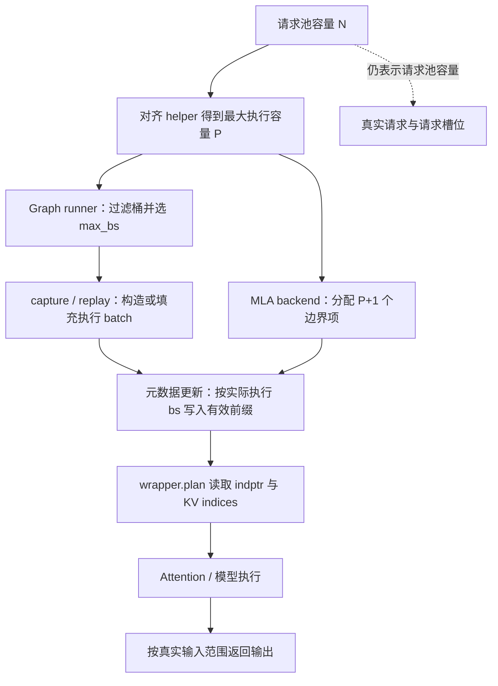
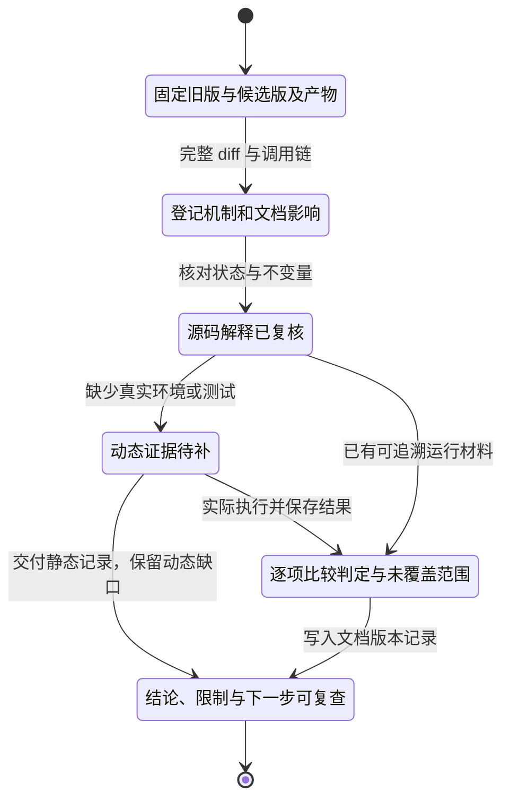

# 源码变更阅读与版本回归检查

> **先建立架构心智模型：** [M11 · 网关服务治理与性能诊断全景](<../architecture/11-网关服务治理与性能诊断全景.md>)。先看职责、数据和生命周期，再回到本篇源码细节。

本文是**源码分析型学习资料**，面向已经能沿着一条请求读代码、第一次需要判断“升级这段源码会影响什么”的读者。

本篇只走一条主线：**选定两个版本 → 阅读真实 diff → 找到输入、调用者和缓冲区寿命 → 判断测试是否触发同一个边界 → 留下可复查的升级与文档记录。** 主案例是 FlashInfer MLA 对齐批次的索引容量修复。

## 0. 阅读基线与范围

| 项目 | 内容 |
| --- | --- |
| 源码路径基准 | SGLang 仓库根目录 `.`；所有源码位置采用仓内相对路径 |
| 读取工作区 | `sglang-source-study` 独立 Git worktree |
| 分支 | `codex/sglang-source-study-20260909`，基于官方 main |
| 系列固定 commit | `72d5c5bb73cadd7ffbf5114e5f81e29d36b6c61a` |
| 读取日期 | `2026-09-10` |
| 工作区状态 | 学习源码 worktree 干净；原源码工作区和 Wiki 其他资料保留 |
| 主线 | 一次 MLA 缓冲区容量变更，以及调用、状态、测试、依赖和文档的复核方法 |
| 不展开 | 全部历史 PR、所有 Attention 后端、全部 CI 权限策略、多卡数值与性能实测 |
| 操作边界 | 只读当前文件和历史 Git 对象；编写、检查文档与独立教学算术。未切换或升级学习源码，未运行项目测试、导入项目、编译 kernel、启动服务或使用 GPU |

前置：[11-05 测试分层](05-测试分层精度与失败复现.md)、[05-03 Attention 元数据](../05-model-execution/03-Attention后端与执行元数据.md)、[05-05 CUDA Graph](../05-model-execution/05-CUDAGraph编译与执行模式.md)。涉及 MLP 同步时参考 [06-03 DP Attention](../06-parallelism/03-DataParallel与DPAttention.md)，涉及 draft 时参考 [08-04 EAGLE/MTP](../08-advanced-generation/04-EAGLE与MTP的源码主线.md)。

### 0.1 真实案例的两个端点

选取官方历史提交 [1ad3eb09：Size FlashInfer MLA indptr buffers to the padded max batch](https://github.com/sgl-project/sglang/commit/1ad3eb09a91f7389a087716dbe82ddb4b3e25d20)，对应 PR #38590。

| 身份 | 完整 commit | 作用 |
| --- | --- | --- |
| B：变更之前 | `32d7d943d1149f30b40b021c3a339cdcba1bb6a9` | C 的直接父提交 |
| C：本次修复 | `1ad3eb09a91f7389a087716dbe82ddb4b3e25d20` | 单文件增加 12 行、删除 4 行 |
| S：系列基线 | `72d5c5bb73cadd7ffbf5114e5f81e29d36b6c61a` | 包含 C；本系列仍使用 S |

改动文件是 `python/sglang/srt/layers/attention/flashinfer_mla_backend.py`。本轮用 Git 对象核对了 B→C 的 diff、父子关系以及 C 是 S 的祖先；本篇引用的 **17 份文件在 C 与 S 内容相同**，其中其余 16 份在 B 与 C 也相同。因此下面可以用系列固定 S 链接展示修复后的实现，并清楚标出 B 的旧表达式。

这是对历史修复的阅读，不代表重新拉取了 2026-09-10 的浮动 main，也不代表已经在 B/C 上复现故障。**源码事实、教学推演、待执行回归**在正文分开记录。

## 1. 人话版：改的是盒子尺寸，影响的是谁往盒子里放东西

假设仓库只能登记 3 个真实订单，但运输设备每次需要装满 2 的倍数。3 个订单会组成 4 个运输位置，最后一个是占位位置。

登记订单的容量仍然是 3；描述这趟运输的表格却需要容纳 4 个位置。若表格仍按 3 个位置制作，问题会在填写或读取运输表格时暴露。

本例的请求池类似订单登记表，经过对齐的执行批次类似运输位置，indptr 类似每一段数据的边界表。这是**教学类比**，不代表 SGLang 增加了一个真实请求。

| 术语 | 人话解释 | 本篇要区分的边界 |
| --- | --- | --- |
| diff | 两个指定版本的文本差异 | 改动行不是全部影响范围 |
| caller / consumer | 调用者 / 读取结果的组件 | 函数返回正确形状还要看谁使用它 |
| invariant | 必须一直满足的条件 | 如每个执行序列都有完整的边界项 |
| request pool size | 请求池的逻辑容量 N | 不等于所有执行形状的上限 |
| padded batch size | 为对齐或图桶增加占位后的批次大小 P | 占位行不是新增用户请求 |
| indptr | 每段起止边界的前缀数组 | B 段需要 B+1 个边界 |
| capacity / used prefix | 预分配空间 / 当前有效前缀 | 容量足够不等于内容已更新 |
| view / clone | 共享原存储的视图 / 独立复制 | 修改一边是否影响另一边 |
| capture / replay | 记录图执行 / 使用已记录的图 | 记录的地址与动态内容分别复核 |
| regression | 变更后原有要求不再满足 | 必须定义旧/新两边使用的同一判定 |

从 diff 出发，每次向外扩一层都回答一个问题：

1. 改动后的量表示什么，单位是什么？
2. 谁产生最大输入，谁依赖原来的上限？
3. 相关 buffer 谁分配，谁持有别名，何时写入或复用？
4. 哪条测试真的制造了这个输入，并检查了错误？
5. 什么证据足以更新对应文档，什么仍需要运行验证？

## 2. 固定比较对象，再读 diff

### 2.1 几种 Git 比较不是同一件事

下表只说明读取范围；命令在 SGLang 仓库根目录执行。Git 语义于 2026-09-10 核对官方 [git-diff 文档](https://git-scm.com/docs/git-diff)。

| 命令形式 | 比较什么 | 常见误读 |
| --- | --- | --- |
| `git diff` | 工作区与暂存区 | 无输出不代表没有未跟踪文件 |
| `git diff --cached` | 暂存区与 HEAD | 不包含未暂存修改 |
| `git diff B C` | B 与 C 两个端点的文件内容 | 适合本例直接父子比较 |
| `git diff B..C` | 与上一行等价的端点比较 | 不要套用 git log 的提交集合语义 |
| `git diff B...C` | B/C 的共同祖先与 C | B 已前进时不一定等于 B→C |

**先读全量变更文件，再按主题缩小。** 只看一个 Python 文件，可能漏掉依赖 pin、C++ 算子、schema 或测试入口的同步修改。

本次实际使用的只读历史比较可按下面重现；不会移动 HEAD：

```bash
# 在 SGLang 仓库根目录执行；B/C 为本文的历史端点。
review_base='32d7d943d1149f30b40b021c3a339cdcba1bb6a9'
review_candidate='1ad3eb09a91f7389a087716dbe82ddb4b3e25d20'

git diff --name-status "$review_base" "$review_candidate"
git diff --numstat "$review_base" "$review_candidate"
git diff --no-ext-diff --no-textconv --no-color \
  "$review_base" "$review_candidate" -- \
  python/sglang/srt/layers/attention/flashinfer_mla_backend.py
```

上面第三条 diff 的 UTF-8 原始输出 SHA256 为 `da57d675fb714eeae0e1b61191161bd6f2f09e43cfabff0b7dc29b170200aec8`。它只标识这份补丁文本；不能证明代码已经执行。

### 2.2 先把改动翻译成行为

核心变更只有下面两处容量表达式；diff 还新增 helper import 并更新说明：

```diff
-        max_bs = model_runner.req_to_token_pool.size
+        max_bs = get_cuda_graph_max_batch_size(model_runner.req_to_token_pool.size)
```

第二处位于多步 draft backend：

```diff
-        max_bs = model_runner.req_to_token_pool.size * self.topk
+        max_bs = (
+            get_cuda_graph_max_batch_size(model_runner.req_to_token_pool.size)
+            * self.topk
+        )
```

人话解释是：**先算执行对齐后的最大序列数，再据此分配元数据。** 不能停在“把一个赋值换成函数调用”。max_bs 还控制 q_indptr_decode、CPU fast-plan 数组等分配，改动会沿同一局部变量传播。[S2] [S20]

需要追历史时，`git log -G` 按增删行的正则匹配查找；`-S` 关注字符串出现次数变化。某个调用只是移动或替换参数、出现次数不变时，二者可返回不同结果。参见 [git-log 官方说明](https://git-scm.com/docs/git-log)。本轮限定到系列基线和目标文件查询 helper 名，定位到了上述 C，不使用其他分支的同名补丁代替。

## 3. 从容量生产者追到消费者

### 3.1 先确认确实选中了 MLA 实现

`python/sglang/srt/layers/attention/attention_registry.py::create_flashinfer_backend` 先检查 runner.use_mla_backend。普通 MHA 与 MLA 在这里分流；配置名 flashinfer 并不足以单独确定具体类。[S1]

本篇针对这个分支创建的 FlashInferMLAAttnBackend，不把结论扩展成“所有 FlashInfer 后端的全部组合已经验证”。

### 3.2 helper 的名字有 CUDA Graph，实际读它的公式

`get_cuda_graph_max_batch_size(N)` 返回 ceil_align(N, alignment)。alignment 来自以下规则：[S3] [S4] [S5]

| 步骤 | 当前实现 | 复核要点 |
| --- | --- | --- |
| 初始 | alignment=1 | 无额外条件时不增加容量 |
| Two Batch Overlap | 启用时乘 2 | 不能只看 TP 大小 |
| gathered buffer | require_gathered_buffer() 为真时乘 attn_tp_size | 条件需要沿 gather 选择链确认 |
| CP | 当前 alignment 不能被 attn_cp_size 整除时，再乘 attn_cp_size | 这是源码的条件乘法，不应擅自写成通用最小公倍数算法 |
| 最终 | 向上对齐 N | 最大执行容量 P 可能大于 N |

不能从注释“DP/DeepEP/MegaMoE”直接推出任意模型参数组合都触发相同 padding。实际运行的 runtime context、后端选择和拓扑才决定 helper 结果。

### 3.3 Graph runner 已经按对齐后的上限选桶

get_batch_sizes_to_capture 先读取配置中的 decode buckets，再将请求池容量对齐。必要时补入对齐后的上限，按照 alignment 与 captured_req_width 过滤，最后去重排序。[S6]

DecodeCudaGraphRunner 使用最大的有效桶作为 max_bs，然后调用 attention backend 的 init_cuda_graph_state，并分配自己的输入 buffers。capture_prepare 按桶大小构造 dummy ForwardBatch，batch_size 可以是对齐后的 P。[S7] [S8]

这就找到“谁可能提出比请求池更大的执行形状”：**Graph runner 的形状选择和 dummy batch 构造**。本次修复让 backend 自己的预分配容量与这条使用链一致。



**图意解读：** 方框是数据和代码职责，不代表新进程。P 同时约束形状生产方与元数据分配方；虚线强调请求登记容量没有因此变大。输出裁剪在 runner 中有自己的条件和对象类型，不能由“多分配一项”自动推出。[S15]

## 4. 贯穿例子：3 个请求为什么需要 5 个边界项

以下是**教学推演**，不是现场故障日志。设：

- 真实请求为 R1、R2、R3，请求池容量 N=3。
- helper 所得 alignment=2；普通 decode，每请求本轮 1 个 token。
- 原配置桶为 1、2、4、8，经过规则筛选后为 2、4。
- 最大执行容量 P=4；某轮 3 个请求使用 4 的桶。

本例只假设上述有效条件已经成立，不给出未经验证的整套模型启动命令。

### 4.1 算清容量和有效长度

| 项目 | B 旧实现 | C 修复后 | 解释 |
| --- | ---: | ---: | --- |
| 请求池容量 N | 3 | 3 | 没有新增请求槽位 |
| Graph 最大执行 bs | 4 | 4 | runner 规则未被本 diff 修改 |
| backend 的 max_bs | 3 | 4 | 修复的直接变化 |
| kv_indptr / q_indptr_decode 容量 | 4 | 5 | B 个序列需要 B+1 个边界 |
| 普通 prefill 的 qo_indptr 容量 | 4 | 5 | 仅非 skip_prefill 路径分配 |
| fast-plan kv_len_arr_cpu 容量 | 3 | 4 | 长度数组每序列一项，不加 1 |
| 真实输出请求数 | 3 | 3 | padding 不是第四个用户请求 |

现在假设执行视图中的 KV 长度为 [3,5,2,1]。末尾 1 是本例 dummy 行的教学长度；MLA backend 的 graph seq_len_fill_value 确实返回 1。[S44]

其边界数组应为：

```text
执行行：      R1  R2  R3  dummy
KV 长度：     3   5   2      1
kv_indptr： [0,  3,  8, 10, 11]
q_indptr：  [0,  1,  2,  3,  4]
```

正常 decode 的 call_begin_forward 会把长度的 cumsum 写到 `kv_indptr[1 : bs + 1]`。当 bs=4 时需要写 4 项。旧 buffer 总长为 4，切片 [1:5] 只有 3 项；新 buffer 总长为 5，切片有 4 项。[S12]

**可从源码推出的是容量不匹配。** 具体先在哪个 wrapper、赋值或设备操作报错，需要实际环境证据，本文不编造异常栈或断言一定是哪一种 CUDA 错误。

### 4.2 用反例检验自己是否理解

把 N 改成 4、alignment 仍为 2，则 P=4，旧新两边都分配 5 项。这样的测试即使通过，也没有制造“P>N”这个触发条件。

把 N 保持 3，却在测试 fixture 中主动将请求池扩大到 4，同样改变了要验证的前提。它可以测试 padded 输入正确性，却不能直接检验“请求池上限与执行上限不同”时的分配问题。

## 5. 不只看长度：把共享、复制、更新与复用分开

### 5.1 所有权与有效期账本

| 对象 | 分配或提供者 | 使用方式 | 何时可认为本轮内容就绪 |
| --- | --- | --- | --- |
| backend.kv_indptr | 普通 backend 自分配，或调用方注入 | updater 持有引用 | 本轮长度 cumsum / spec metadata 已填充 |
| backend.q_indptr_decode | 自分配 arange，或注入 | 描述普通 decode 的 query 边界 | 初始化完成且形状适用 |
| backend.qo_indptr | 非 skip_prefill 构造路径 | 普通 prefill updater 写有效前缀 | 当前 extend 长度已经计算 |
| cuda_graph_kv_indptr / qo_indptr | init_cuda_graph_state 中 clone | 与构造时原 buffer 分开 | 不能因为 clone 已分配就认定未来回放内容新鲜 |
| CPU graph indptr / lens | 图初始化时创建并保存 | replay 的 fast plan 使用 | 本轮 CPU 长度与 cumsum 更新完成 |
| cuda_graph_kv_indices | 图状态分配，或调用方提供 | 回放使用 capture-stable 存储 | 当前有效前缀写完，索引转换完成 |
| decode_cuda_graph_metadata[bs] | capture 创建 wrapper | 后续按 bs 查找复用 | 对应形状已完成初始化 |
| 多步 draft 的 kv_indptr 行 | MultiStepDraftBackend 分配二维数组 | 子 backend 接收行视图 | 对应 step 的索引生成与元数据准备完成 |

来源：[S2] [S9] [S10] [S11] [S12] [S20] [S21] [S43]。

这里的“就绪”描述源码中的数据依赖。没有 GPU 时间线或同步验证时，不能把表格写成“本轮已证明并发复用安全”。

### 5.2 为什么把某个局部 tensor 重新分配一遍不一定有效

graph replay 路径的 kv_indices 使用已经捕获的固定存储。call_begin_forward 的代码在 replay 时取 fast_decode_kwargs 中的 buffer，原位填入有效部分；需要 DCP 索引转换时也原位写回有效前缀。[S12]

如果只是给一个局部变量绑定新 tensor，捕获图仍可能读取旧地址。**长度、地址身份和内容版本是三个检查项。** 本次 patch 改的是初始化容量，不能据此认定其他地址复用、跨 stream 生命周期问题都已解决。

本例涉及的这些 backend buffer 也不会随着某个 R1 请求结束就逐项释放。它们由 backend / runner 持有并重复使用；请求 KV 的分配与归还是另一条生命周期，见 [04-07](../04-kv-cache/07-KV缓存全生命周期与排障.md)。

### 5.3 多步 draft 为什么必须一起改

MultiStepDraftBackend 在外层分配二维 kv_indptr，然后把第 i 行作为 kv_indptr_buf 交给子 backend。子类构造函数遇到外部 buffer 会直接接收，不重新扩容。因此只修改内层默认分配，不会修复外层仍按旧容量制作的行。[S2] [S20]

common_template 按 `topk × num_seqs` 建立本步 bs，索引生成 kernel 得到行 stride，再把 `self.kv_indptr[i, : bs + 1]` 交给本步。eager 路径的 call_fn 对 spec_info 中的 indptr 和 indices 做 clone；graph 路径另外准备长期复用的 indices buffers。[S21] [S22] [S23]

以 N=3、P=4、topk=1、speculative_num_steps=3 为教学例子，二维 indptr 由旧的 3×4 变为 3×5。源码在 topk>1 时直接抛 ValueError，所以不能把表达式里仍乘 topk 解读为已经支持任意分支数。[S20]

## 6. 沿未修改调用者检查组合边界

### 6.1 关闭 Graph 不能直接作为“问题不存在”的证明

ModelRunner._prepare_eager_forward_batch 在存在 global_num_tokens_cpu 时调用 prepare_mlp_sync_batch。它对各同步成员 token 数进行对齐，再按模式调整 batch_size 和输入。[S16] [S17]

普通 decode 且无 spec 的相应分支可以把 batch_size 设为同步后的 num_tokens；_pad_inputs_to_size 同步扩展请求索引、seq_lens 等。后处理再恢复原始 batch_size，并裁剪相关字段，防止后续消费者把 dummy 行当真实输入。[S18] [S19]

因此本例的复核应包括 eager 中相关的 MLP-sync 条件。不过，**不能仅凭 graph helper 的名字或这张表证明所有 eager/CP 组合的容量上界都一致**；应分别计算每条实际路径的最大 bs，再与分配容量对照。

### 6.2 extend 的“请求数”和“token 数”仍需分别限制

FlashInferMLAAttnBackend 保留 extend_dummy_seqs_capped_by_req_pool=True。maybe_flashinfer_autotune_extend 读到这一能力标记时，会把较大的 token 数打包到较少的请求行，以限制 dummy extend 序列数量。[S2] [S24] [S25]

例如 token 预算 10、pool_size=3：

```text
num_tokens_per_req = ceil(10 / 3) = 4
batch_size         = ceil(10 / 4) = 3
最终 dummy tokens  = 3 × 4 = 12
```

这是 packing 的教学算术，未执行 autotune。它说明“多分配对齐余量”不能解释成“extend 可以按 token 数随意制造同样多的序列”。该能力标记在本次 diff 中没有从 True 改成 False。

### 6.3 建立与变更直接相关的兼容矩阵

| 条件 | 源码读取结果 | 本篇结论等级 |
| --- | --- | --- |
| flashinfer + use_mla_backend | 进入 MLA 构造路径 [S1] | 源码事实 |
| N 已满足 alignment | 新旧容量表达式结果相同 [S2] [S3] | 教学推导；不能触发容量差异 |
| P>N 的普通 decode graph | runner 与 backend 要共享相容上界 [S6] [S7] | 本例主要回归目标，未执行 |
| skip_prefill=True | 不分配普通 prefill qo/CPU fast-plan 数组 [S2] | 源码事实 |
| 注入 kv_indptr_buf | 子 backend 直接使用外部 tensor [S2] | 必须检查外层分配 |
| multi-step topk>1 | 抛 ValueError [S20] | 源码拒绝，不做成功案例 |
| target verify / ragged verify | 元数据有自己的 token tier / key 分支 [S10] [S11] | 本篇只列关联，完整验证未做 |
| Eager MLP sync | 存在独立 padding 与恢复链 [S16]—[S19] | 需按实际模式补回归 |
| extend autotune | 请求行仍受 pool 标记约束 [S24] | 源码事实；未运行调优 |

## 7. 用现存测试检查“是否测到了同一件事”

本次历史 diff **没有修改测试文件**。这只是变更范围事实，既不能推断“没有任何相关测试”，也不能推断“原测试已经覆盖”。

### 7.1 从 test 方法追到 fixture 和 assert

已有方法：

`test/registered/attention/unittests/mla/test_flashinfer.py` 中的
`TestFlashInferMLAAttentionBackendCorrectness.test_runner_mode_cuda_graph_decode_cases`。[S26]

它调用 run_mla_cuda_graph_decode_case，默认 capture_batch_size=4，代表输入含 3 条不同 prefix 长度的 decode 请求。[S26] [S27]

继续读 helper，会看到：[S28] [S29] [S30] [S31]

1. 先建立 eager fixture，执行并与独立期望输出 assert_close。
2. 创建 graph fixture 时传入 runner_batch_size=capture_batch_size。
3. MockMLAModelRunner 用该值设置请求池容量，且配置 TP=1、DP=1、enable_dp_attention=False；模块也把 attn_tp_size 置为 1。
4. 调用 capture / replay 所需的 metadata 方法，再直接执行 forward。
5. 比较 replay 输出与 reference，并比较真实输入部分与 eager 输出。
6. replay helper 明确注明这里没有真实 CUDA Graph；它显式执行 in-graph metadata 步骤。

这项测试确实有数值比较和 padded metadata 检查，不能说它“只看形状”。但是：

| 要验证的条件 | 这条测试的实际设置 | 尚缺的证据 |
| --- | --- | --- |
| 原请求池 N 小于执行 P | graph fixture 的 pool 直接设为 capture_bs=4 | 没有保留 N=3、P=4 的容量差 |
| 多 rank 的对齐上下文 | TP/DP 设为 1 | 对齐组合本身未验证 |
| 真正图捕获与回放 | 直接调用相关 metadata 和 forward | 不证明捕获地址的实际 replay 行为 |
| 数值输出 | 有 reference 和真实行比较 | 仍只适用于被执行的形状与后端 |
| CUDA 不可用 / 后端构建失败 | 类或 fixture 可 skip | skip 不能算对应行为通过 |

### 7.2 由此设计最小回归，而不是照抄测试名字

下面是**待执行的回归设计**，没有创建或运行项目测试：

| 层次 | 必须保留的触发条件 | 应检查什么 | 局限 |
| --- | --- | --- | --- |
| 容量逻辑 | N=3，alignment=2，P=4 | 所有相应 indptr≥5、lens≥4；N 本身仍为 3 | 只验证尺寸关系 |
| 已对齐对照 | N=4，P=4 | 原行为仍成立 | 单独执行不能捕获本 bug |
| Backend 元数据 | 真实或受控的 N<P，bs=P | cumsum、单调边界、末项总长度、有效 indices | mock wrapper 不能证明 FlashInfer 设备执行 |
| 外部 buffer 注入 | 外层 multi-step 分配，topk=1，steps=3 | 每行容量、子 backend 共享关系、各步索引有效范围 | 不自动覆盖所有投机算法 |
| GPU 数值 | 同一输入在 B/C 的已支持路径 | shape、finite、reference、真实行输出 | 容差需继承明确数值依据 |
| 真 Graph | 同一 bucket 多轮不同长度，P>N | 实际捕获/replay、地址稳定、动态元数据更新 | metadata 模拟不能替代 |
| Eager 同步组合 | 能实际产生 P>N 的 MLP-sync 配置 | 元数据容量、padding 与恢复、结果一致 | 需要该拓扑与后端 |
| 压力与性能 | 正确性已满足后固定负载 | 多轮状态、显存、捕获成本、吞吐/延迟 | 不预设 patch 一定加速 |

核心判定应是：**B 在同一触发条件下暴露容量要求不满足，C 满足要求，同时已支持的对照仍满足。** 若 B/C 都通过，先确认测试是否真正保留了 N<P；若 B 无法构建，则记录构建失败，不能把它当成该逻辑 bug 的成功复现。

一个近邻测试的选择示例可以是下面的现存方法，但它只是阅读过的入口，**未执行，也不是本 bug 的充分回归**：

```bash
SGLANG_TEST_MAX_RETRY=0 python3 \
  test/registered/attention/unittests/mla/test_flashinfer.py \
  TestFlashInferMLAAttentionBackendCorrectness.test_runner_mode_cuda_graph_decode_cases
```

多步 draft 的同文件测试方法另见 [S32]；应继续追它的 fixture、真实图使用与断言范围，不能因为名字相邻就合并声称覆盖。

## 8. pre-commit、CI 和运行包必须分层判断

### 8.1 仓库检查回答的是哪些问题

固定版本的 .pre-commit-config.yaml 包含语法、格式、注册、路径与文档链接等检查。要读 files、exclude、stages、pass_filenames 及脚本内部扫描范围。[S36] [S37]

| 检查 | 固定配置中的行为 | 对升级阅读的意义 |
| --- | --- | --- |
| ruff | 选择 F401/F821/UP037，并带 --fix | 不是全部语义问题的证明，也可能修改文件 |
| 格式工具 | isort、ruff-format、clang-format 等 | 格式变更会混入 diff，应单独核对 |
| check-registered-tests | 匹配 registered Python 路径触发；pass_filenames=false | 触发文件与脚本内部扫描范围不同 |
| 注册脚本 main | 扫描 registered 文件，检查注册和入口等 [S35] | 静态有效不代表实际测试执行 |
| taxonomy 检查 | 仅对脚本识别的新加/复制/重命名路径应用 [S33] [S34] | 遗留目录存在不等于新测试可照搬 |
| mint-broken-links | manual 阶段，检查 docs 链接/anchors/redirects | 不能从普通 hook 成功推断已跑 |
| lychee | manual，文件模式为 README.md | 不代表全仓链接已检查 |

_changed_registered_files 优先看暂存区的 A/C/R 变更；该结果为空时，再找 origin/base 或 base 与 HEAD 的 merge-base 差异。它不是“全部 M 类型修改列表”。[S33]

本轮没有执行这些 hook。对只读源码学习任务，不应该运行可能自动修改源码的 formatter 再把工作区说成“始终只读”。

### 8.2 同一个主仓 SHA 不等于同一运行产物

主案例只改 Python 元数据分配；下面是将方法迁移到 kernel 变更时必须额外检查的边界。

官方贡献指南区分仓内 JIT、AOT sglang-kernel，以及另外发布的 DeepGEMM/DeepEP。AOT 源码在 `python/sglang/kernels/aot/`，但安装时使用单独发行包。[S39] 固定 pyproject 声明 sglang-kernel==0.4.6.post1、sgl-deep-ep==0.1.2、sgl-deep-gemm==0.1.7；声明不是当前环境已安装这些版本的证明。[S40]

| 运行材料 | 必须记录 | 为什么主仓 SHA 不够 |
| --- | --- | --- |
| Python 源码 | commit、dirty diff、实际导入位置 | 安装包可能不是正在看的 checkout |
| AOT kernel wheel | 版本、构建来源、artifact/hash | PR 本地构建与发布 pin 可以不同 |
| JIT | 源码、编译器、架构、缓存身份 | 同一源码可走不同编译/后端条件 |
| 外部包 | 实际版本与构建标识 | 主仓 commit 不固定所有安装结果 |
| 模型与 tokenizer | revision、配置、权重和输入模板 | 名字相同不等于内容相同 |
| 运行环境 | 镜像 digest、驱动、设备、拓扑 | 软件组合改变可执行路径 |

贡献指南说明 selective rerun 不构建/安装 PR-local AOT wheel；普通完整 PR CI 与发布 pin 的兼容性要分开证明。[S38] 当前 pr-test.yml 对 kernel build 还有 changes/gate/event 条件，并在相应 scheduled/parallel-dispatch JIT job 中强制走已发布依赖分支。[S41] [S42]

因此不要写“某项 CI 绿，所以合并后新的算子契约肯定可用”。应查明该次任务的实际 checkout、wheel 来源、选择集合、skip、日志和断言。若新 caller 必须依赖新 AOT 契约，发布与 pin 更新或正确 fallback 也属于变更的完整性检查。[S39]

## 9. 文档如何随版本更新，而不是只换 hash

### 9.1 给变更建立文档影响表

以下是本例的**整理者归纳**；它表示需要查阅哪些既有说明，不表示本轮已经升级这些文章的源码基线。

| 受影响的知识 | 对应文章 | 复核动作 |
| --- | --- | --- |
| indptr、请求数与有效前缀 | [05-03](../05-model-execution/03-Attention后端与执行元数据.md) | 检查是否把 pool.size 写成全部执行上界 |
| graph 桶、静态输入与回放 | [05-05](../05-model-execution/05-CUDAGraph编译与执行模式.md) | 核对 bucket 过滤、分配与使用方一致性 |
| MLP-sync padding 与真实计数 | [06-03](../06-parallelism/03-DataParallel与DPAttention.md) | 分开 eager / graph 和恢复路径 |
| 外层 draft 与子 backend | [08-04](../08-advanced-generation/04-EAGLE与MTP的源码主线.md) | 检查共享 buffer、step 与 topk 条件 |
| MLA backend 选择 | [09-04](../09-model-specialization/04-MLA稀疏注意力与混合状态模型.md) | 核对模型和 backend 分流 |
| 测试覆盖等级 | [11-05](05-测试分层精度与失败复现.md) | fixture、真实执行、reference 和失败传播 |
| 检索入口与版本状态 | [A02](../appendices/02-源码入口与调用链索引.md)、[A06](../appendices/06-学习进度与版本变更记录.md) | 更新准确入口，保留历史版本与未验证项 |

未来升级时，每条旧结论给出一种状态：**新版本已复核仍成立 / 实现变化需改写 / 范围收窄 / 尚待复核**。文件名或函数名仍存在，只能通过“入口存在”检查，不能自动转成“机制未变”。

### 9.2 把复核过程做成可追踪状态



**图意解读：** 这是整理者设计的工作记录状态，不是 SGLang 内部状态机。静态复核完成后，可以从 Pending 直接进入 Recorded，交付静态结论并逐项保留动态缺口；取得运行材料时再走 Evidence，按实际判定更新记录。图中的终点表示本次记录完整，不等于所有功能都通过验收。

只更换页首 hash 会抹去这种区别。本系列当前保持 S 不动；B/C 只作为本篇明确标注的历史案例。

## 10. 一份可直接填写的回归记录

下面是本轮静态记录的结构化例子。三个 SHA 有不同身份；候选 C 已包含于 S，不是待部署的新版本。runtime.status=not_run 必须保留。

```json
{
  "source_root": ".",
  "study_branch": "codex/sglang-source-study-20260909",
  "study_commit": "72d5c5bb73cadd7ffbf5114e5f81e29d36b6c61a",
  "base_commit": "32d7d943d1149f30b40b021c3a339cdcba1bb6a9",
  "candidate_commit": "1ad3eb09a91f7389a087716dbe82ddb4b3e25d20",
  "read_date": "2026-09-10",
  "change_path": "python/sglang/srt/layers/attention/flashinfer_mla_backend.py",
  "patch_sha256": "da57d675fb714eeae0e1b61191161bd6f2f09e43cfabff0b7dc29b170200aec8",
  "behavior": "MLA indptr capacity covers the padded execution batch",
  "teaching_case": {
    "request_pool_size": 3,
    "alignment": 2,
    "padded_batch_size": 4,
    "required_indptr_items": 5,
    "measured": false
  },
  "static": {
    "history_and_paths": "checked",
    "caller_and_buffer_lifetime": "reviewed",
    "existing_test_trigger_gap": "pool expanded to capture size",
    "existing_decode_helper_real_graph_replay": false
  },
  "runtime": {
    "status": "not_run",
    "base_result": null,
    "candidate_result": null,
    "environment": null,
    "actual_test_cases": null,
    "raw_evidence": [],
    "remaining": [
      "N less than padded batch metadata regression",
      "multi-step injected buffer capacity",
      "real GPU graph replay and numerical checks",
      "applicable eager MLP-sync combinations"
    ]
  },
  "source_baseline_changed": false
}
```

实际运行后应追加：每个 case 的参数、实际数量、skip/失败/重试、原始命令与日志、版本和产物身份、首个分歧、清理结果。性能对照另按 [11-04](04-参数对照与性能实验记录.md) 固定负载和指标，不能用“buffer 更大”推断吞吐提升。

## 11. 从现象反查到复核位置

| 现象 | 第一处检查 | 下一步证据 |
| --- | --- | --- |
| 小并发能跑，某个 graph bucket 初始化失败 | N、alignment、capture_bs、backend max_bs [S2] [S6] | 每个 indptr/lens 的真实 shape 与触发栈 |
| 主路径修好，draft 仍失败 | 外层 multi-step 行分配和注入 [S20] | 子 backend 的共享存储与本步 bs |
| 首轮正常、后续长度变化错误 | graph 固定地址与有效前缀更新 [S9] [S11] [S12] | 实际 replay、内容变化与 reference |
| 关闭 Graph 后仍出问题 | eager MLP-sync padding [S16]—[S19] | 实际生效模式、最大 bs 与恢复后的计数 |
| extend 调优时元数据超限 | pool cap 标记与每请求 token packing [S24] | token 数、序列数、最终 dummy shape |
| 测试叫 graph 但遗漏实际回放 | helper 中是否真的 capture/replay [S29] | 独立的真实图执行证据 |
| 旧版新版测试都绿 | fixture 是否把 pool 扩成 P [S28] [S30] | 保留 N<P 后重新判定 |
| PR CI 绿，安装后 operator 不匹配 | AOT wheel 来源与依赖 pin [S38]—[S42] | 实际安装文件、版本和构建标识 |
| 文档换了 commit 仍讲旧机制 | 逐条影响表与新版本锚点 | 结论状态、图、例子、测试同步复核 |

本篇没有将这些现象作为已发生的运行事件；它们是从源码边界构建的排查入口。

## 12. 练习、验收与源码阅读路线

### 12.1 自测问题

1. N=5、alignment=4 时，P、旧 indptr 容量、新容量分别是多少？
2. 为什么“batch 3 padding 到 4”这个描述仍不足以证明测试覆盖本 bug？
3. 子 backend 的构造函数改对了，为什么外层 multi-step 分配仍必须检查？
4. 为什么 clone 出来的 graph buffer 和注入的行视图不能写成同一类“共享变量”？
5. 当前 graph-named decode helper 能检查什么，不能检查什么？
6. 一个 PR 同时改 AOT 算子和 caller，为什么还要核对 wheel 发布与 pin？
7. 文档中应该用 C 还是 S 的路径锚点，怎样避免混用版本？

**参考判断：**

- 第 1 题：P=8；旧容量 6、新容量 9。三者单位都是序列/边界项，不能混入 token 总长度。
- 第 2 题：还要看真实请求池容量；若 fixture 已扩到 4，则 N<P 条件消失。
- 第 3 题：传入 kv_indptr_buf 时，内层采用外层给的存储，不走自分配扩容。
- 第 4 题：clone 的存储独立，行视图与原二维数组共享；更新与复用的对象不同。
- 第 5 题：可检查相关 metadata、padded forward 与数值参考；当前 helper 不做真实图 replay，也没制造 N<P。
- 第 6 题：CI 可能测试 PR-local wheel，而安装环境使用发布 pin；还需验证实际运行组合。
- 第 7 题：本系列统一用 S；本篇已用 Git 证明引用文件在 C/S 相同，并独立记录 B→C 的历史表达式。不能对未核对文件照搬该结论。

### 12.2 最短源码路线

| 顺序 | 问题 | 源码锚点 |
| --- | --- | --- |
| 1 | 从哪里选 MLA | `python/sglang/srt/layers/attention/attention_registry.py::create_flashinfer_backend` [S1] |
| 2 | 修复改变哪些分配 | `python/sglang/srt/layers/attention/flashinfer_mla_backend.py::FlashInferMLAAttnBackend.__init__` [S2] |
| 3 | 对齐上限怎么计算 | `python/sglang/srt/utils/common.py::get_cuda_graph_batch_size_alignment` [S4] |
| 4 | 谁产生最大执行形状 | `python/sglang/srt/model_executor/runner/base_cuda_graph_runner.py::get_batch_sizes_to_capture` [S6] |
| 5 | 边界数组怎样被写入和消费 | `python/sglang/srt/layers/attention/flashinfer_mla_backend.py::FlashInferMLAIndicesUpdaterDecode.call_begin_forward` [S12] |
| 6 | replay 怎样更新动态内容 | `python/sglang/srt/layers/attention/flashinfer_mla_backend.py::FlashInferMLAAttnBackend._apply_cuda_graph_metadata` [S11] |
| 7 | 注入 buffer 的上游在哪 | `python/sglang/srt/layers/attention/flashinfer_mla_backend.py::FlashInferMLAMultiStepDraftBackend.__init__` [S20] |
| 8 | 测试真实前提是什么 | `python/sglang/test/kits/attention_unittest/attention_methods/mla_attention.py::MockMLAModelRunner.__init__` [S30] |
| 9 | graph 测试实际执行了什么 | `python/sglang/test/kits/attention_unittest/runner_modes/cuda_graph_decode_runner.py::_init_cuda_graph_replay_metadata` [S29] |
| 10 | 注册准入和发布契约在哪 | `scripts/lint/check_registered_tests.py`、`docs/docs/developer_guide/contribution_guide.mdx` [S33]—[S39] |

### 12.3 本篇完成与未完成的验证

本轮核对了 44 个固定源码锚点（36 个 Python AST 符号、8 个配置/文档行锚点）、B/C/S 历史身份、单文件 diff、引用上下文的版本一致性、两张 Mermaid 图与正文关系，以及独立容量/前缀/packing 算术和 JSON 模板。

本轮没有执行上面列出的项目测试、真实 B/C 复现、GPU 数值、CUDA Graph、通信或性能实验。两张图仅静态检查，未运行 Mermaid 渲染器。

完成本篇后，应能拿着一个 diff 说明：**谁把输入形状变大、谁负责分配、哪些视图和复制沿用旧尺寸、哪些测试缺少触发条件，以及哪些文档结论需要重新核对。**

阶段 11 至此六篇齐备。下一篇：[12-01《Frontend DSL 与 Runtime 的关系》](../12-extensions-and-capstone/01-FrontendDSL与Runtime的关系.md)，从程序编排回到 SGLang 的语言层与服务运行时分工。

返回[总目录](../README.md)；检索[术语](../appendices/01-术语与对象速查.md)、[调用链](../appendices/02-源码入口与调用链索引.md)、[兼容矩阵](../appendices/03-配置解析与功能兼容矩阵.md)、[排障索引](../appendices/04-症状到源码的排障索引.md)与[实验记录](../appendices/05-实验记录与证据模板.md)。

[S1]: https://github.com/sgl-project/sglang/blob/72d5c5bb73cadd7ffbf5114e5f81e29d36b6c61a/python/sglang/srt/layers/attention/attention_registry.py#L52
[S2]: https://github.com/sgl-project/sglang/blob/72d5c5bb73cadd7ffbf5114e5f81e29d36b6c61a/python/sglang/srt/layers/attention/flashinfer_mla_backend.py#L222
[S3]: https://github.com/sgl-project/sglang/blob/72d5c5bb73cadd7ffbf5114e5f81e29d36b6c61a/python/sglang/srt/utils/common.py#L3925
[S4]: https://github.com/sgl-project/sglang/blob/72d5c5bb73cadd7ffbf5114e5f81e29d36b6c61a/python/sglang/srt/utils/common.py#L3914
[S5]: https://github.com/sgl-project/sglang/blob/72d5c5bb73cadd7ffbf5114e5f81e29d36b6c61a/python/sglang/srt/utils/common.py#L3905
[S6]: https://github.com/sgl-project/sglang/blob/72d5c5bb73cadd7ffbf5114e5f81e29d36b6c61a/python/sglang/srt/model_executor/runner/base_cuda_graph_runner.py#L64
[S7]: https://github.com/sgl-project/sglang/blob/72d5c5bb73cadd7ffbf5114e5f81e29d36b6c61a/python/sglang/srt/model_executor/runner/decode_cuda_graph_runner.py#L218
[S8]: https://github.com/sgl-project/sglang/blob/72d5c5bb73cadd7ffbf5114e5f81e29d36b6c61a/python/sglang/srt/model_executor/runner/decode_cuda_graph_runner.py#L866
[S9]: https://github.com/sgl-project/sglang/blob/72d5c5bb73cadd7ffbf5114e5f81e29d36b6c61a/python/sglang/srt/layers/attention/flashinfer_mla_backend.py#L491
[S10]: https://github.com/sgl-project/sglang/blob/72d5c5bb73cadd7ffbf5114e5f81e29d36b6c61a/python/sglang/srt/layers/attention/flashinfer_mla_backend.py#L336
[S11]: https://github.com/sgl-project/sglang/blob/72d5c5bb73cadd7ffbf5114e5f81e29d36b6c61a/python/sglang/srt/layers/attention/flashinfer_mla_backend.py#L531
[S12]: https://github.com/sgl-project/sglang/blob/72d5c5bb73cadd7ffbf5114e5f81e29d36b6c61a/python/sglang/srt/layers/attention/flashinfer_mla_backend.py#L876
[S13]: https://github.com/sgl-project/sglang/blob/72d5c5bb73cadd7ffbf5114e5f81e29d36b6c61a/python/sglang/srt/layers/attention/flashinfer_mla_backend.py#L419
[S14]: https://github.com/sgl-project/sglang/blob/72d5c5bb73cadd7ffbf5114e5f81e29d36b6c61a/python/sglang/srt/model_executor/runner/decode_cuda_graph_runner.py#L1275
[S15]: https://github.com/sgl-project/sglang/blob/72d5c5bb73cadd7ffbf5114e5f81e29d36b6c61a/python/sglang/srt/model_executor/runner/decode_cuda_graph_runner.py#L1448
[S16]: https://github.com/sgl-project/sglang/blob/72d5c5bb73cadd7ffbf5114e5f81e29d36b6c61a/python/sglang/srt/model_executor/model_runner.py#L1524
[S17]: https://github.com/sgl-project/sglang/blob/72d5c5bb73cadd7ffbf5114e5f81e29d36b6c61a/python/sglang/srt/model_executor/forward_batch_info.py#L1352
[S18]: https://github.com/sgl-project/sglang/blob/72d5c5bb73cadd7ffbf5114e5f81e29d36b6c61a/python/sglang/srt/model_executor/forward_batch_info.py#L1562
[S19]: https://github.com/sgl-project/sglang/blob/72d5c5bb73cadd7ffbf5114e5f81e29d36b6c61a/python/sglang/srt/model_executor/forward_batch_info.py#L1712
[S20]: https://github.com/sgl-project/sglang/blob/72d5c5bb73cadd7ffbf5114e5f81e29d36b6c61a/python/sglang/srt/layers/attention/flashinfer_mla_backend.py#L1169
[S21]: https://github.com/sgl-project/sglang/blob/72d5c5bb73cadd7ffbf5114e5f81e29d36b6c61a/python/sglang/srt/layers/attention/flashinfer_mla_backend.py#L1219
[S22]: https://github.com/sgl-project/sglang/blob/72d5c5bb73cadd7ffbf5114e5f81e29d36b6c61a/python/sglang/srt/layers/attention/flashinfer_mla_backend.py#L1268
[S23]: https://github.com/sgl-project/sglang/blob/72d5c5bb73cadd7ffbf5114e5f81e29d36b6c61a/python/sglang/srt/layers/attention/flashinfer_mla_backend.py#L1289
[S24]: https://github.com/sgl-project/sglang/blob/72d5c5bb73cadd7ffbf5114e5f81e29d36b6c61a/python/sglang/srt/model_executor/runner/flashinfer_autotune.py#L334
[S25]: https://github.com/sgl-project/sglang/blob/72d5c5bb73cadd7ffbf5114e5f81e29d36b6c61a/python/sglang/srt/layers/attention/base_attn_backend.py#L142
[S26]: https://github.com/sgl-project/sglang/blob/72d5c5bb73cadd7ffbf5114e5f81e29d36b6c61a/test/registered/attention/unittests/mla/test_flashinfer.py#L177
[S27]: https://github.com/sgl-project/sglang/blob/72d5c5bb73cadd7ffbf5114e5f81e29d36b6c61a/python/sglang/test/kits/attention_unittest/runner_modes/cuda_graph_decode_runner.py#L519
[S28]: https://github.com/sgl-project/sglang/blob/72d5c5bb73cadd7ffbf5114e5f81e29d36b6c61a/python/sglang/test/kits/attention_unittest/runner_modes/cuda_graph_decode_runner.py#L326
[S29]: https://github.com/sgl-project/sglang/blob/72d5c5bb73cadd7ffbf5114e5f81e29d36b6c61a/python/sglang/test/kits/attention_unittest/runner_modes/cuda_graph_decode_runner.py#L298
[S30]: https://github.com/sgl-project/sglang/blob/72d5c5bb73cadd7ffbf5114e5f81e29d36b6c61a/python/sglang/test/kits/attention_unittest/attention_methods/mla_attention.py#L211
[S31]: https://github.com/sgl-project/sglang/blob/72d5c5bb73cadd7ffbf5114e5f81e29d36b6c61a/python/sglang/test/kits/attention_unittest/attention_methods/mla_attention.py#L867
[S32]: https://github.com/sgl-project/sglang/blob/72d5c5bb73cadd7ffbf5114e5f81e29d36b6c61a/test/registered/attention/unittests/mla/test_flashinfer.py#L219
[S33]: https://github.com/sgl-project/sglang/blob/72d5c5bb73cadd7ffbf5114e5f81e29d36b6c61a/scripts/lint/check_registered_tests.py#L83
[S34]: https://github.com/sgl-project/sglang/blob/72d5c5bb73cadd7ffbf5114e5f81e29d36b6c61a/scripts/lint/check_registered_tests.py#L124
[S35]: https://github.com/sgl-project/sglang/blob/72d5c5bb73cadd7ffbf5114e5f81e29d36b6c61a/scripts/lint/check_registered_tests.py#L169
[S36]: https://github.com/sgl-project/sglang/blob/72d5c5bb73cadd7ffbf5114e5f81e29d36b6c61a/.pre-commit-config.yaml#L1
[S37]: https://github.com/sgl-project/sglang/blob/72d5c5bb73cadd7ffbf5114e5f81e29d36b6c61a/.pre-commit-config.yaml#L124
[S38]: https://github.com/sgl-project/sglang/blob/72d5c5bb73cadd7ffbf5114e5f81e29d36b6c61a/docs/docs/developer_guide/contribution_guide.mdx#L134
[S39]: https://github.com/sgl-project/sglang/blob/72d5c5bb73cadd7ffbf5114e5f81e29d36b6c61a/docs/docs/developer_guide/contribution_guide.mdx#L183
[S40]: https://github.com/sgl-project/sglang/blob/72d5c5bb73cadd7ffbf5114e5f81e29d36b6c61a/python/pyproject.toml#L77
[S41]: https://github.com/sgl-project/sglang/blob/72d5c5bb73cadd7ffbf5114e5f81e29d36b6c61a/.github/workflows/pr-test.yml#L176
[S42]: https://github.com/sgl-project/sglang/blob/72d5c5bb73cadd7ffbf5114e5f81e29d36b6c61a/.github/workflows/pr-test.yml#L286
[S43]: https://github.com/sgl-project/sglang/blob/72d5c5bb73cadd7ffbf5114e5f81e29d36b6c61a/python/sglang/srt/layers/attention/flashinfer_mla_backend.py#L1036
[S44]: https://github.com/sgl-project/sglang/blob/72d5c5bb73cadd7ffbf5114e5f81e29d36b6c61a/python/sglang/srt/layers/attention/flashinfer_mla_backend.py#L679
