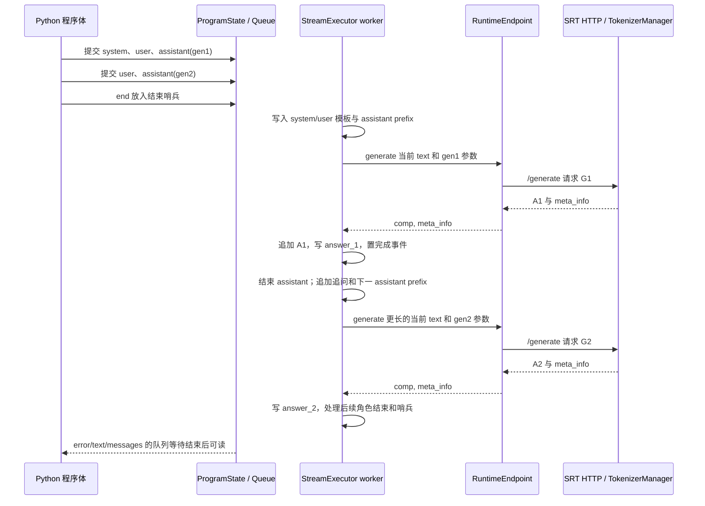
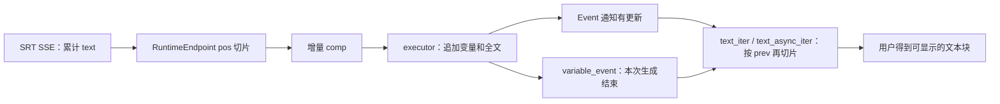

# Frontend DSL 与 Runtime 的关系

本文是**源码分析型学习资料**，面向已经知道 SGLang 能提供推理服务、但还不清楚 `@sgl.function` 和 `sgl.gen` 在系统哪一层工作的读者。

本篇沿一段“两轮问答”程序走通：**Python 函数 → 表达式 IR → ProgramState / StreamExecutor → RuntimeEndpoint → SRT 的 /generate → 生成结果回到变量和文本**。随后只扩展理解这条主线所需的流式、批量、fork/join、tracing 与错误边界。

## 0. 阅读基线与范围

| 项目 | 内容 |
| --- | --- |
| 源码路径基准 | SGLang 仓库根目录 `.`；本文源码位置均为仓内相对路径 |
| 读取工作区 | `sglang-source-study` 独立 Git worktree |
| 分支 | `codex/sglang-source-study-20260909`，基于官方 main |
| commit | `72d5c5bb73cadd7ffbf5114e5f81e29d36b6c61a` |
| 读取日期 | `2026-09-10` |
| 工作区状态 | 学习源码 worktree 干净；原源码工作区与 Wiki 其他资料保留 |
| 主线 | 纯文本、n=1、无 API speculative execution 的 DSL 程序，backend 使用 RuntimeEndpoint |
| 延伸 | role/template、流式文本、变量就绪、线程批量、fork 变量汇总、trace 前缀预热 |
| 不展开 | 全部第三方 API 适配、媒体编码、DSL API speculative execution 算法、完整 select 评分策略、全部 Python 控制流的 tracing |
| 操作边界 | 只读源码并编写、检查文档；代码示例未执行，未导入 SGLang、运行测试、发出 HTTP 请求、启动 Runtime/Engine、加载模型或使用 GPU |

前置：[01-01 源码地图](../01-getting-started/01-源码目录与最短阅读路线.md)。SRT 内部请求主线接续阶段 02；资源生命周期见 [02-06](../02-request-lifecycle/06-完成取消与资源释放.md)、[04-07](../04-kv-cache/07-KV缓存全生命周期与排障.md)。本篇的工作区基线继续沿用[总目录](../README.md)，没有升级源码。

**证据标识：** 文件/函数链接支持源码事实；示意图、假设输出、字符账本为整理者归纳；本轮没有服务运行观察。

## 1. 人话版：DSL 写流程，Runtime 负责执行模型请求

假设你要让模型先回答一个问题，再根据前一段回答继续追问。可以手工拼文本、调用接口、保存回答、追加追问；DSL 把这些动作组织成一个可执行的 Python 程序。

这里的“程序”仍然在客户端推进。服务端收到的是当时需要生成的文本与采样参数，而不是一整段 Python 函数。

| 名称 | 人话解释 | 控制范围 |
| --- | --- | --- |
| DSL | 针对生成程序提供的语法和对象 | 文本、角色、生成位置、变量、分支和组合 |
| SglFunction | 被装饰的 Python 函数包装 | 参数、默认采样配置、run/run_batch/trace |
| IR / SglExpr | 表示“追加文本、开始角色、生成”等动作的对象 | 尚未等于 GPU 执行计划 |
| ProgramState | 程序操作和读取结果的门面 | `s += ...`、`s["answer"]`、fork、text_iter |
| StreamExecutor | 按顺序解释表达式的执行器 | 本程序的文本、变量、事件和工作队列 |
| BaseBackend | 表达式执行器调用的适配接口 | 把生成/选择等动作交给具体服务 |
| RuntimeEndpoint | 已有 SRT HTTP 服务的客户端 | 拼装原生 /generate 请求、解析响应 |
| Runtime | 从 Python 启动 SRT HTTP 服务的包装 | 管理服务子进程，持有 endpoint |
| Engine | SRT 的直接 Python 入口 | 构造请求交给 TokenizerManager，不经这条 DSL HTTP 适配 |
| Scheduler | 服务端请求调度器 | 准入、组批、执行与请求资源生命周期 |

源码入口：[S1] [S4] [S9] [S11] [S19] [S25] [S27] [S53]。

**三个对象不要混淆：**

- `sgl.RuntimeEndpoint(url)` 连接已有服务；构造时会请求模型信息，并确定语言层 chat template。[S19]
- `sgl.Runtime(...)` 解析 ServerArgs、启动 HTTP 服务进程，轮询健康生成接口，最后创建 RuntimeEndpoint；shutdown 管理它启动的进程。[S25] [S26]
- `sgl.Engine(...)` 是另一条 SRT 入口。Engine.generate 接收 prompt/input_ids 等，构造请求并调用 TokenizerManager；它与 BaseBackend.generate 的“接收 StreamExecutor”契约不同，不能只因都有 generate 名字就直接互换。[S27] [S53]

`python/sglang/__init__.py` 导出了 DSL API、RuntimeEndpoint，并为 Engine 使用 LazyImport。[S65] 上述对象属于同一项目的不同层。

## 2. 先看一段完整但未执行的例子

下面示例基于本次读取的调用方式，**只做语法与源码对应检查**。调用 run_example 时传入已准备好的 RuntimeEndpoint；创建 endpoint 和启动服务的过程不混入教学程序。

```python
import sglang as sgl


@sgl.function
def two_turns(s, question_1, question_2):
    s += sgl.system("请用简短中文回答。")
    s += sgl.user(question_1)
    s += sgl.assistant(sgl.gen("answer_1", max_tokens=16))
    s += sgl.user(question_2)
    s += sgl.assistant(sgl.gen("answer_2", max_tokens=24))


def run_example(backend):
    # backend 应为指向已有 SRT 服务的 RuntimeEndpoint。
    state = two_turns.run(
        question_1="1 加 1 等于几？",
        question_2="把上一条答案写成中文数字。",
        backend=backend,
        temperature=0,
        max_new_tokens=64,
    )
    # 等待本程序执行器，并检查其记录的工作线程错误。
    error = state.error()
    if error is not None:
        raise error
    return state["answer_1"], state["answer_2"], state.messages()
```

这里未宣称模型一定输出“2”与“二”。后文用 A1/A2 代指**假设已经得到的两个字符串**；它们不是本轮模型结果。

默认 backend 可以通过 set_default_backend 设置，也可像示例这样显式传入。.run 中显式 backend 优先，否则读取进程级 global_config.default_backend；run_program 在二者都未提供时断言失败。[S5] [S9] [S54] [S55]

示例中的 64 是程序默认 max_new_tokens；两个 gen 分别覆盖为 16 和 24。它们表示生成上限，不是保证生成的长度。[S5] [S6] [S17]

## 3. 从 Python 表达式到 IR：现在发生了什么

### 3.1 function 装饰器不启动模型

`python/sglang/lang/api.py::function` 创建 SglFunction；构造函数保存原 Python 函数和参数信息，并要求第一个位置参数名为 s。[S1] [S4]

装饰完成时，并没有把函数体逐行交给模型。调用 .run 时才由 run_program 创建执行器，再由 run_internal 调用原函数：

```text
@sgl.function
    → SglFunction(func)

two_turns.run(...)
    → 构造默认 SglSamplingParams
    → run_program(...)
    → ProgramState(StreamExecutor(...))
    → program.func(state, ...)
```

在非流式默认路径中，Python 函数体在调用线程执行；表达式可以交给后台 worker。这个区分会影响“run 返回时完成了什么”。[S9] [S10] [S11]

### 3.2 gen 创建生成节点，而不是当场发 HTTP

gen 在普通路径返回 SglGen；SglGen 保存名称和采样覆盖值。若 choices 非空则返回 SglSelect；显式 regex 在创建阶段先经过 Python re.compile 检查。[S2] [S6]

因此：

```python
expr = sgl.gen("answer", max_tokens=16)
```

只是创建表达式对象。真正 backend.generate 出现在 StreamExecutor._execute_gen。[S32]

API 注释中“Call the model to generate”描述的是这个节点的用途，不能据此把构造节点与执行节点混成一个时刻。

### 3.3 role 是节点序列，字符串加法也可以组成节点列表

`sgl.assistant(sgl.gen(...))` 经 _role_common 组成：

```text
SglExprList
  ├── SglRoleBegin("assistant")
  ├── SglGen("answer", ...)
  └── SglRoleEnd("assistant")
```

`"A:" + sgl.gen(...)` 中，SglExpr 的加法逻辑会把字符串转成 SglConstantText，并构造/拼接 SglExprList。[S3] [S7] [S8]

最后执行 `s += expr`，ProgramState.__iadd__ 调用 submit；submit 先为生成变量登记 Event，再按 use_thread 选择入队或直接 _execute。[S12] [S13] [S14]

### 3.4 IR 和 CUDA Graph 是不同的图

IR 描述“构造程序文本、生成某个字段、收集变量”等语义。CUDA Graph 属于服务端设备执行路径，描述特定计算与存储地址上的回放关系，见 [05-05](../05-model-execution/05-CUDAGraph编译与执行模式.md)。

本例执行器直接分派 SglExpr 节点；没有把这些节点编译成一张 CUDA Graph。DSL 中一个 SglGen 可以引发多个 decode step，而服务端一个 batch 也可以包含来自不同程序的请求。

## 4. 谁保存哪些状态，谁拥有它们

### 4.1 程序对象账本

| 对象 / 字段 | 谁持有 | 内容 | 更新与读取条件 |
| --- | --- | --- | --- |
| SglFunction.func | SglFunction | 原 Python 函数 | run/trace 使用 |
| default_sampling_para | StreamExecutor | 程序级采样默认值 | 每个 gen 解析时 deepcopy 再覆盖 |
| text_ | StreamExecutor | 模板前后缀、输入文字、已经生成的文字 | 按节点执行顺序追加 |
| messages_ | StreamExecutor | 已结束角色的消息记录 | RoleEnd 才追加当前消息 |
| cur_role / begin_pos | StreamExecutor | 当前角色及其正文起点 | RoleBegin 设置，RoleEnd 收尾 |
| variables[name] | StreamExecutor | 已生成字段，或用户设置值 | 生成完成/流式增量时写入 |
| variable_event[name] | StreamExecutor | 该字段的完成通知 | 生成成功置位；错误清理也可能置位 |
| stream_var_event[name] | StreamExecutor | 流式变量有更新的通知 | 增量到达、完成或错误清理时唤醒 |
| queue | StreamExecutor，use_thread=True | 等待解释的表达式与结束哨兵 | worker 顺序取出 |
| sid | StreamExecutor | 本地 executor 的 UUID | 普通 generate 请求不把它作为 rid 发送 |
| SRT rid | 服务端 GenerateReqInput | 单个服务请求身份 | 未提供时归一化生成 |
| 请求 KV / 前缀缓存 | SRT 内部组件 | 模型计算状态与复用状态 | 由服务端生命周期控制 |

来源：[S4] [S11] [S14] [S17] [S20] [S24] [S28] [S29] [S32] [S35]。最后一行接续阶段 04，本地 variables 中的字符串不是 KV tensor。

### 4.2 role 怎样同时影响 text 和 messages

RoleBegin 首先拒绝嵌套角色。若还没有历史消息、当前不是 system，且模板有默认 system prompt，会先插入默认 system 消息。随后把本角色 prefix 写入 text_，记录正文起点。[S28]

RoleEnd 取正文区间并 lstrip，追加 suffix，再写入 messages_。因此：

- text_ 包含模板符号、提示词和生成文本。
- messages_ 保存结束后的 role/content 记录。
- 在 assistant 的 SglGen 执行时，assistant prefix 已进入 text_，但本条 assistant message 尚未结束。[S29] [S30]

本地 RuntimeEndpoint.generate 使用的是 text_，不是把 messages_ 发送到 /v1/chat/completions。[S20] 对已有服务调用 /generate 的主线，不应再假设服务端替这份 text 套一遍同样的 chat 模板。

RuntimeEndpoint 可按显式 chat_template_name 选择模板，否则根据 model_path 匹配语言层注册表；未匹配时回退 default 模板。[S19] [S31] 这不是“任意模型都自动采用正确的 tokenizer chat_template”的保证，实际模型模板适配仍要核对。

## 5. 两轮问答 walkthrough：完整文本怎样成为两次请求

### 5.1 先忽略流式，跟随一个 executor



**图意解读：** Queue 与 worker 在客户端；H 内部还会进入服务端调度链，此处折叠。图展示逻辑依赖，Python 提交与 worker 解释可以交错，不表示必须全部提交完才开始生成。角色符号不作为独立 HTTP 请求发送。[S9]—[S15] [S20] [S23] [S32]

### 5.2 每个生成点发出什么

假设用 U1、U2 表示两个已经格式化的 user 消息，用 P_A / S_A 表示 assistant prefix / suffix，SYS 表示 system 部分。下面是教学符号，不是某个真实模型的 special tokens。

| 时刻 | text_ 的相关内容 | 变量状态 | 普通 /generate 次数 |
| --- | --- | --- | ---: |
| 第一个 gen 前 | SYS + U1 + P_A | answer_1 Event 已登记，值尚未生成 | 0 |
| 第一个 gen 完成 | SYS + U1 + P_A + A1 | answer_1=A1，Event 置位 | 1 |
| 第二个 gen 前 | SYS + U1 + P_A + A1 + S_A + U2 + P_A | answer_2 等待；第一条 assistant 已加入 messages_ | 1 |
| 第二个 gen 完成 | 上一行 + A2 | answer_2=A2，Event 置位 | 2 |
| 程序队列收尾 | 再追加第二条 assistant suffix | 两个答案和全部角色消息可读取 | 2 |

限定条件是纯文本、无 fork/cache/choices、n=1、num_api_spec_tokens=None。endpoint 构造时的模型信息请求不算这里的生成次数。[S19] [S20] [S32]

两个 gen 都发送**当时的完整 text_**。G2 依赖 A1 已回到客户端；本例不是先把 G1/G2 一起交给服务端，让服务端执行整段 Python。

### 5.3 参数经过哪些转换

StreamExecutor._resolve_sampling_params deepcopy 程序默认参数，然后逐字段应用 gen 的非 None 值，再追加 chat_template.stop_str。[S17]

| 参数层 | 示例值 | G1 / G2 的效果 |
| --- | --- | --- |
| .run 的默认 max_new_tokens | 64 | 作为默认，随后被节点覆盖 |
| gen 的 max_tokens | 16 / 24 | 保存为 max_new_tokens=16 / 24 |
| .run 的 temperature | 0 | 两个 gen 未覆盖，沿用 0 |
| gen 的显式 stop | 未提供 | 继承程序默认，再叠加模板 stop |
| return_logprob 等 | 如被设置 | endpoint 放在请求顶层，而非 sampling_params 内 |
| regex / json_schema | 如被设置 | to_srt_kwargs 传给服务端采样参数 |

来源：[S5] [S6] [S17] [S18] [S20]。节点参数是 None 时继承默认值；显式 0 不是“未设置”。

客户端 Python 正则能编译，仅说明这一层语法检查成功；服务端约束生成后端仍有自己的支持范围，参见 [08-01](../08-advanced-generation/01-结构化输出与Grammar状态.md)。

### 5.4 HTTP 到哪里才进入 SRT

RuntimeEndpoint.generate 准备 text、sampling_params 及可选 logprob 字段，调用 http_request，检查 HTTP 状态，然后读取响应 text 和 meta_info。[S20] [S22] [S73]

服务端 /generate 的 generate_request 接收 GenerateReqInput，再调用 TokenizerManager.generate_request。非流式返回第一个结果；流式返回 SSE 并安排相应收尾处理。[S23]

原生单请求未提供 rid 时，GenerateReqInput._normalize_single_inputs 生成新 UUID。本篇的 RuntimeEndpoint.generate 请求体没有把 executor.sid 或变量名当作 rid 发出。[S20] [S24]

后续 TokenizerManager → Scheduler → Worker/Runner → 输出的路线在阶段 02 已展开。**前端决定“下一次问什么”，服务端决定“收到的这些请求怎样一起执行”。**

## 6. run 返回、变量就绪和队列完成不是一个条件

### 6.1 默认非流式也可以存在后台表达式执行

SglFunction.run 默认 use_thread=True；run_program 默认 sync=False。非流式 run_internal 会运行 Python 函数体并调用 end，但默认不会在这里等待 queue.join。[S5] [S9] [S10]

所以在本例这种“函数体只提交表达式”的程序中，.run 返回 ProgramState 时，后台生成可能仍在进行。

| 读取方式 | 等待什么 | 不等于什么 |
| --- | --- | --- |
| `state["answer_1"]` | 对应 variable_event，随后读字典 [S33] | 不等待第二次生成或全部 RoleEnd |
| `state.text()` / `state.messages()` | 执行器 sync 后读全文/消息 | 不替服务端检查全部资源释放 |
| `state.sync()` | use_thread=True 时 queue.join [S34] | 不是 Thread.join，也不是 GPU fence |
| `state.error()` | 先 sync，再读 error_ [S66] | 不保证错误自动在 .run 调用点抛出 |
| `use_thread=False` | submit 直接 _execute [S13] | 不是“开更多服务端并行” |

Python Queue.join 等待已入队任务的 task_done 计数归零，而不是证明业务成功。其标准语义核对于 2026-09-10 的 [Python queue 文档](https://docs.python.org/3/library/queue.html#queue.Queue.join)。SGLang worker 在错误清理中也会处理队列计数和唤醒事件，因此还应读取 error_。[S35]

### 6.2 变量读取可以成为 Python 控制流的依赖点

如果程序内这样写：

```python
s += sgl.gen("answer", max_tokens=16)
answer = s["answer"]  # 等待这一变量，然后 Python 才继续。
```

后面的 Python 分支依赖实际答案，get_var 的等待会把这个依赖落实到客户端线程。[S33] 这不要求服务端理解 Python 的 if/for。

但是不要在后台生成尚未登记对应变量时就随意读取名字：get_var 只有在 variable_event 已存在时才等待，最后仍直接访问 variables[name]。缺失变量、生成失败和合法结果要分别检查。[S33] [S35]

### 6.3 end 与取消、shutdown 的边界

StreamExecutor.end 在 worker 存活时放入 None 哨兵，并调用 backend.end_program。RuntimeEndpoint 没有覆盖 BaseBackend.end_program 的空实现。[S36] [S37]

因此这条路径中：

- end 表示客户端不再追加这段程序的正常表达式，并请求 worker 到队列尾部退出。
- 它不发送 /abort，也没有以 sid 为目标取消当前 HTTP 请求。
- Runtime.shutdown 则是管理它启动的服务进程树，范围与“结束一个 DSL 程序”不同。[S26]
- 某个 state 被删除或某个变量完成，不是服务端 KV 已释放的证据。

若 worker 当前阻塞在 backend 调用中，排到队尾的结束哨兵不能抢占该调用。实际请求超时、断连和服务端取消仍应回到对应网络与请求生命周期分析，不能只靠本地 end 的名字推断。

## 7. 流式：同一个答案经过两层增量处理

### 7.1 RuntimeEndpoint 从累计 text 中切出增量

stream=True 时 run_program 另启线程运行程序体，StreamExecutor._execute_gen 改用 generate_stream。[S9] [S32]

RuntimeEndpoint.generate_stream 发出 stream=true 的 /generate 请求，逐行读取 data:，遇到 [DONE] 停止；正常内容从返回的累计 text 中按 pos 切出新增部分。[S21]

假设服务端依次返回以下**教学字符串**：

| 累计 text | endpoint 先前 pos | 向执行器 yield | 新 pos |
| --- | ---: | --- | ---: |
| 北 | 0 | 北 | 1 |
| 北京 | 1 | 京 | 2 |
| 北京。 | 2 | 。 | 3 |

这里 pos 是 Python 字符串位置，不是 token ID 数，也不是 UTF-8 字节数。模型一次输出 token、网络一帧与客户端一次 yield 不保证一一对应。

### 7.2 执行器再维护变量与读取游标

_execute_gen 把增量同时追加到 text_ 和 variables[name]，更新 meta_info，并通知 stream_var_event / stream_text_event。生成结束后再设置 variable_event。[S32]

ProgramState.text_iter 自己还有一个 prev 游标：

- 不指定变量名时，读取整个 text_ 的新增部分，可能包含提示文字和角色模板。
- 指定变量名时，只读取对应生成变量的新增部分。
- event 只是“有变化”的通知，多个更新可能在消费者读取前合并；消费者按当前字符串和游标取增量。[S38]



**图意解读：** 图中的两次切片作用于不同存储层。第一层处理 HTTP 结果，第二层处理本地变量消费；Event 不是逐 token 的消息队列。[S21] [S32] [S38] [S39]

### 7.3 元信息和错误不能只看是否有文字

text_async_iter(var_name, return_meta_data=True) 可同时返回文本和元信息。对暂时没有文本的 metadata，它保存 pending_meta_info，并在下次有文字时合并指定的增量 logprob 列表。[S39] [S70]

这不应解释成“所有 SSE 帧都逐一暴露给调用方”，也不能凭文本看起来完整就证明所有元信息都完整消费。对应断言需要直接检查具体列表与计数。

HTTP 状态 200 之后，服务端流里仍可能产生 error 对象；当前 RuntimeEndpoint.generate_stream 的正常解析直接索引 data["text"] 和 data["meta_info"]，未在这里专门处理 error-only 对象。[S21] [S23] 因此诊断时要保留原始 SSE 与 worker error，不能只等同于建连失败或正常 [DONE]。本轮没有注入或复现该错误路径。

## 8. 批量、fork 与 cache：增加的是哪一层并发或状态

### 8.1 run_batch 是多个程序实例，不是一个固定 GPU batch

SglFunction.run_batch 检查参数列表，随后 run_program_batch 为各项调用 run_program。多个线程由 ThreadPoolExecutor 组织；每项都可拥有自己的 executor 和多次 backend 调用。[S40] [S42]

假设 R1/R2/R3 三个程序各有两个普通 gen，则教学上有 3 个程序实例、6 次生成调用。服务端可能把到达的请求重新组批；不能据此写成“一个 batch_size=6 的 GPU batch”。

run_program_batch 还可能在运行前做公共前缀 tracing/cache，因此“总 HTTP 请求数”应将预热调用另计。这个行为由 enable_precache_with_tracing 和参数数量等条件决定。[S40] [S55]

generator_style 分支按 200 项一组提交 futures，然后按提交列表逐个 future.result() 产生结果；虽然代码注释提到完成顺序，实际循环不是 as_completed。前面的慢项可阻塞后面已完成项的交付。[S41]

| 想回答的问题 | 应看什么 |
| --- | --- |
| 同时推进多少程序 | num_threads 与实际参数数 |
| 一项返回对应哪组输入 | result/future 的遍历顺序 |
| 用户何时拿到结果 | 当前等待的 future，而非仅看后台完成时刻 |
| 服务端实际 batch 是多少 | Scheduler 的执行记录 |
| HTTP 调用为何比 gen 数更多 | trace/cache、choices、fork 的附加路径 |

### 8.2 fork 复制程序视图，join 默认汇总新变量

StreamExecutor.fork 先在相应条件下提交 SglCommitLazy，再 sync；为子分支建立新 executor，复制文本、变量字典、消息列表等，并记录 fork_start_text_pos。[S43]

这些是本地程序状态的复制：dict/list 拷贝也不是所有嵌套内容的深复制，更不是把 GPU KV tensor 复制到 Python。子 executor 共享同一个 backend 对象，但各有 sid、队列和文本视图。

ProgramStateGroup.join 默认 gather_variable：同步每个子分支，把**父分支原来没有的变量名**收集为列表。父分支原来已有的同名变量不在这个“新增变量集合”中；默认 join 也不会自动拼接子分支全文。[S44]

教学例子：

```text
父变量：{"question": "Q"}
子 0：  {"question": "Q", "answer": "A"}
子 1：  {"question": "Q", "answer": "B"}

默认 join 后：
父变量：{"question": "Q", "answer": ["A", "B"]}
父 text：不因 gather_variable 自动追加 "AB"
```

如需正文拼接，要在程序里明确追加相应结果或采用另一种 join 模式，并核对 backend 能力。

### 8.3 某个优化方法存在，不等于端到端路径已验证

concate_and_append 分支可能选择文本拼接，也可能按全局配置与 backend 标志走 KV 拼接方法。后者用本地 sid 构造 src_rids/dst_rid，调用 RuntimeEndpoint.concatenate_and_append，其目标是 /concate_and_append_request。[S45] [S46]

本轮在固定 SRT 与 Gateway 源码中搜索该路径，**未找到对应服务端路径实现**；普通 generate 请求也未携带这里的 sid。[S20] 因此本篇不把这一客户端方法和 support_concate_and_append=True 当成“当前本地 SRT 已可完整使用 KV 拼接”的证明。它是需要单独核实的接口衔接边界；本轮没有调用或改写该路径。

对于入门主线，默认变量汇总就足以说明 fork/join；物理 KV 复用继续以服务端缓存机制为准。

### 8.4 trace/cache 不是通用 Python 编译器

SglFunction.trace 使用 TracerProgramState 执行原 Python 函数体，并为缺少的参数放入 SglArgument。它收集节点，而不是执行普通 backend.generate。[S49] [S51]

extract_prefix_by_tracing 使用 only_trace_prefix，尝试从节点开头提取连续 SglConstantText，遇到非恒定节点停止；它只捕获部分异常。SglArgument.__format__ 明确拒绝放入 f-string，以避免 tracer 不支持的参数格式化。[S47] [S50]

因此：

- trace 仍会运行函数体中的普通 Python 代码，不能理解成完全没有副作用的静态 AST 分析。
- 不承诺自动探索所有 if/for 分支或支持任意 Python 操作。
- bind 可以提前固定参数，改变可提取前缀；执行时绑定参数也会合入调用参数。[S9] [S52]
- cache_program 仅在前缀非空且 len(prefix)>64 时调用 cache_prefix，这里的长度是字符数。[S48]
- RuntimeEndpoint.cache_prefix 通过 /generate、max_new_tokens=0 请求前缀预处理。[S69]

一次 cache 请求结束，不表示前缀永不淘汰、后续一定命中或本地对象持有固定 KV 所有权。前缀匹配和缓存生命周期见阶段 04。

### 图解补充：不同应用为什么会共享一段输入


[查看原尺寸](../../../images/sglang-source-study/06-radix-sharing.jpg)（手机查看宽图时可横屏或放大）。

**图意解读：** 四列分别展示少样本提示、多次候选、多轮对话和树状推理。先找重复的蓝色前缀，再找各分支自己的绿色输入与黄色输出。

**对应本篇源码：** 回到 RuntimeEndpoint 如何提交前缀文本及 fork 的流程，区分前端组织分支与后端是否真正命中缓存。 [源码：python/sglang/lang/backend/runtime_endpoint.py][S19]

**来源与边界：** [Fast and Expressive LLM Inference with RadixAttention and SGLang](https://www.lmsys.org/blog/2024-01-17-sglang/)，Lianmin Zheng、Liangsheng Yin 等 / LMSYS，2024-01-17。图说明前缀复用的应用动机；可见文字重复不保证实际 token、模型状态和缓存命名空间兼容，也不保证仍有可复用 KV。 [来源档案 F06](../../../images/sglang-source-study/SOURCES.md#f06)。

## 9. 失败、约束和容易踩错的用法

### 9.1 错误传播分成程序体与 worker 两层

| 错误位置 | 当前行为 | 读取结果时的注意点 |
| --- | --- | --- |
| 原 Python 函数体 | run_internal 重新抛异常，finally 调 end [S10] | stream=False 的调用线程可直接遇到 |
| stream=True 的程序体线程 | 程序体在新线程运行 [S9] | 不等同于异常同步返回到 .run |
| worker 执行表达式 | 记录 warning，清理队列并设置 error_ [S35] | 调 state.error() 读取根因 |
| 变量等待 | 错误清理也设置变量事件 [S35] | Event 置位不证明 variables[name] 已成功写入 |
| 读取缺失变量 | get_var 最终按 key 访问字典 [S33] | 可能遇到 KeyError，应结合 error_ |
| HTTP 非 200 | _assert_success 从 JSON 或正文形成 RuntimeError [S73] | 保留状态、内容与具体 URL |
| SSE error-only 帧 | 正常 parser 仍读取 text/meta_info [S21] | 保留原始帧和执行器错误 |

state.error() 表示 worker 的错误槽，并不自动完整收集另一个程序体线程的所有异常。不能把一次返回 None 当成“任何线程都没有错误”的通用保证。

### 9.2 对照表：语法相似不代表行为相同

| 写法 / 条件 | 源码行为 | 本篇边界 |
| --- | --- | --- |
| 第一个函数参数不叫 s | SglFunction 构造时 assert [S4] | 不是自动识别任意名字 |
| s += None | ProgramState.__iadd__ 抛 ValueError [S12] | 检查返回值是否真的是表达式 |
| `sgl.user("Q")` | 只构造 role 表达式 [S3] | 需要追加到 s |
| `s.user("Q")` | 直接向 executor 提交 role 表达式 [S71] | 不要再把返回表达式重复追加 |
| `with s.user(): ...` | 进入/离开时提交 role begin/end [S71] | 角色不允许嵌套 [S28] |
| gen 参数为 None | 继承程序默认 [S17] | 与显式 0 不同 |
| gen 有非空 choices | 返回 SglSelect [S2] | 不是普通文本生成路径 |
| RuntimeEndpoint.select | 要求接近零温度，先预热前缀再对候选取 logprob [S68] | 一次 select 可包含多次请求 |
| stream + API speculative execution | _execute_gen 显式 assert 不支持 [S32] | 也不要与 SRT EAGLE/MTP 混淆 |
| n>1 | 语言参数可携带 n，部分返回值处理可接受 list [S6] [S32] | 本篇仅证明 n=1 主线，不宣称所有 backend 全链路一致 |
| set_default_backend | 修改进程级全局设置 [S54] [S55] | 多任务使用不同 backend 时应明确身份 |
| Runtime.shutdown | 管理自己启动的进程 [S26] | 不是结束某一个生成变量 |

“API speculative execution”参数在语言层自己的执行分支被读取。本篇不展开其算法，也不由名称推断它与阶段 08 的服务端投机验证/提交是同一个机制。

## 10. 怎样用测试验证这篇的理解

### 10.1 已有测试究竟断言了什么

本轮只读了下面指定定义，没有收集或运行测试。

| 代表入口 | 能从断言看到的范围 | 不能据此证明 |
| --- | --- | --- |
| test_programs.test_few_shot_qa [S58] | 单项和批量回答的期望文本 | 稳定适用于任意模型、性能或 KV 回收 |
| test_programs.test_mt_bench [S59] | 最终 messages 数量为 4 或 5 | 追问语义、两个答案质量或资源安全 |
| test_programs.test_parallel_decoding [S62] | 最终 summary 是字符串 | 各分支都并行执行、fork 的吞吐收益 |
| test_programs.test_stream [S60] | 遍历全文与变量流，累积文本 | 当前方法没有末端文本一致性 assert |
| test_programs.test_stream_logprobs [S61] | chunks 非空，logprob 长度增量与累计计数对应 | 所有流错误或末尾 metadata 完整性 |
| manual TestBind.test_bind / test_cache [S56] [S57] | trace 图打印 / cache 调用入口 | 本身没有缓存命中率或延迟断言 |
| manual TestSeparateReasoning.test_separate_reasoning_creation [S63] | IR 列表、节点类型、变量名 | 模型执行或解析器正确性 |
| manual TestSeparateReasoningExecution.test_execute_separate_reasoning [S64] | mock parser 调用、变量/文本更新、事件置位 | 真模型、HTTP 或真实解析算法 |

TestBind.setUpClass 会启动 Runtime；不是纯 CPU 语法检查。[S72] 这些 manual 文件与公共 test_programs helper 的存在，也不能直接等价为 registered CI 已运行。测试层级和证据判定参考 [11-05](../11-performance-engineering/05-测试分层精度与失败复现.md)。

### 10.2 适合这条主线的待执行验证矩阵

| 目标 | 输入与判定 | 需要的环境 |
| --- | --- | --- |
| gen 不立即发请求 | 创建节点时 fake backend 调用数为 0；提交后增加 | 可隔离的 frontend 测试 |
| 两轮依赖 | G2 的 text 包含指定的 A1 与追问；调用顺序固定 | 可记录请求的 fake backend |
| 参数覆盖 | default=64、gen=16/24；temperature=0；模板 stop 另计 | 受控模板与调用记录 |
| 变量与队列就绪 | 控制 G1/G2 的返回时刻，分别检查 answer_1 和全文 | 受控线程/事件 |
| worker 错误 | backend 抛异常后 error_ 可定位；未生成变量不冒充成功 | 不依赖 GPU 的故障替身 |
| 流式字符 | 累计“北→北京→北京。”得到“北/京/。”；全文和变量范围不同 | 可控流返回 |
| RuntimeEndpoint | 真 /generate 输入/输出、模板、两次 rid | 已启动的适配模型服务 |
| 真实释放和取消 | 按服务端请求生命周期检查 | 需要实际请求、设备与日志 |

表内全部**待执行**。没有为了验证文字而导入项目、启动 mock 线程或发起真实生成；本轮只做独立字符串/字典教学账本和 AST 静态核对。

## 11. 从现象回到源码

| 现象 | 优先看哪里 | 要区分的状态 |
| --- | --- | --- |
| 已创建 gen，却没有网络流量 | gen → ProgramState.__iadd__ → submit [S2] [S12] [S13] | 节点创建与执行 |
| run 返回了但读不到全部消息 | run_program / get_var / sync [S9] [S33] [S34] | 函数体、变量、队列 |
| 同样的 chat 问题结果奇怪 | RuntimeEndpoint 模板选择、role prefix/suffix [S19] [S28]—[S31] | text 模板与 messages 记录 |
| 第二轮不含第一轮内容 | _execute_gen 和 role 收尾 [S32] [S29] | 当前 text、生成写回及执行顺序 |
| 出现 KeyError，之前还有 warning | worker.error_ / get_var [S35] [S33] | 根因异常与变量缺失 |
| 流式输出带了 prompt | text_iter 没指定变量名 [S38] | 全文流与变量流 |
| 流式 chunk 大小不等于 token 数 | endpoint pos 与消费者 prev [S21] [S38] | 网络帧、字符串、token |
| run_batch 后完成项被前项挡住 | generator 的 futures 遍历 [S41] | 完成顺序与交付顺序 |
| fork.join 后父文本没有子答案 | gather_variable 分支 [S44] | 新变量列表与全文拼接 |
| cache 调用了但后续未命中 | prefix 长度/内容、服务端缓存状态 [S47]—[S49] [S69] | 预热请求与持续驻留 |
| 结束 state 后服务还在 | end 与 Runtime.shutdown [S36] [S26] | 程序 worker 与服务进程 |
| KV 拼接方法存在但调用不通 | 客户端 URL、sid 与服务端接口 [S45] [S46] | 方法声明与端到端接线 |

这些是按源码建立的排查方向，不是本轮观察到的现场故障。

## 12. 练习、源码路线与验收

### 12.1 自测问题

1. 本例的 5 次 s += 是否对应 5 次模型请求？
2. G2 为什么能包含 A1，即使 Python 很早就把 G2 节点入队？
3. answer_1 的 Event 置位时，为什么 state.messages() 仍可能等待？
4. 相同 sid 是否意味着两个 gen 在 SRT 使用同一个 rid？
5. 为什么 text_iter("answer_2") 通常比无参数版本更适合只显示追问答案？
6. 三个两轮程序用了 num_threads=3，能否断言服务端 GPU batch 恒为 3？
7. fork 默认 join 后，父程序原有变量和新增变量如何处理？
8. trace/cache 的“前缀超过 64”是 token 数还是字符数？能否保证持续命中？

**参考判断：**

- 第 1 题：在限定主线下是 2 次 /generate；role 和常量只是本地文本动作。
- 第 2 题：同一 executor 顺序解释；第一个 backend.generate 返回后才继续下一节点。
- 第 3 题：变量完成早于后续 RoleEnd/G2/队列收尾；messages 走整体 sync。
- 第 4 题：不是。普通 RuntimeEndpoint.generate 没传 sid，服务端未给 rid 时自行生成。
- 第 5 题：指定变量只读该字段；全文流包含其他文本和角色符号。
- 第 6 题：不能；客户端程序并发与服务端动态组批由不同层控制。
- 第 7 题：只汇总父分支原来没有的名字为列表，默认不自动合并全文。
- 第 8 题：字符数；只是触发 cache_prefix 请求，不是驻留或命中保证。

### 12.2 最短源码阅读路线

| 顺序 | 问题 | 位置 |
| --- | --- | --- |
| 1 | 装饰器包装什么 | `python/sglang/lang/api.py::function` [S1] |
| 2 | gen 保存什么 | `python/sglang/lang/ir.py::SglGen.__init__` [S6] |
| 3 | 谁执行原函数 | `python/sglang/lang/interpreter.py::run_program` / `python/sglang/lang/interpreter.py::run_internal` [S9] [S10] |
| 4 | s += 如何进入执行器 | `python/sglang/lang/interpreter.py::ProgramState.__iadd__` [S12] |
| 5 | 文本、角色、生成怎样分派 | `python/sglang/lang/interpreter.py::StreamExecutor._execute` [S15] |
| 6 | 默认参数怎样覆盖 | `python/sglang/lang/interpreter.py::StreamExecutor._resolve_sampling_params` [S17] |
| 7 | HTTP 请求是什么 | `python/sglang/lang/backend/runtime_endpoint.py::RuntimeEndpoint.generate` [S20] |
| 8 | SRT 怎样接收 | `python/sglang/srt/entrypoints/http_server.py::generate_request` [S23] |
| 9 | 结果、错误和结束条件 | `python/sglang/lang/interpreter.py::StreamExecutor._execute_gen` / `python/sglang/lang/interpreter.py::StreamExecutor._thread_worker_func` [S32] [S35] |
| 10 | 流式读取范围 | `python/sglang/lang/interpreter.py::ProgramState.text_iter` [S38] |
| 11 | 多程序与分支 | `python/sglang/lang/interpreter.py::run_program_batch` / `python/sglang/lang/interpreter.py::ProgramStateGroup.join` [S40] [S44] |
| 12 | 前缀如何提取和预热 | `python/sglang/lang/tracer.py::extract_prefix_by_tracing` / `python/sglang/lang/interpreter.py::cache_program` [S47] [S48] |

### 12.3 本轮验证边界

本轮核对 73 个固定源码锚点，其中 72 个 Python AST 符号、1 个公开导出行锚点；两张图按正文静态检查。示例 Python 只做 AST 解析，字符增量、采样覆盖、新变量汇总、生成调用数和 batch generator 顺序只做独立教学核对。

已有测试定义只读；未执行 DSL、网络、Runtime、Engine、真实模型、GPU、精度/性能或缓存释放实验。Mermaid 未运行渲染器。

完成本篇后，应能解释：**程序在哪里推进、表达式何时变成请求、答案如何写回、前端等待的是什么，以及哪些生命周期仍由 SRT 控制。**

下一篇：[12-02《Diffusion 服务与生成流程入门》](02-Diffusion服务与生成流程入门.md)，重新建立图像/视频生成的请求、pipeline 与去噪步骤地图。

返回[总目录](../README.md)，或查阅[术语](../appendices/01-术语与对象速查.md)、[源码索引](../appendices/02-源码入口与调用链索引.md)、[配置矩阵](../appendices/03-配置解析与功能兼容矩阵.md)、[排障索引](../appendices/04-症状到源码的排障索引.md)与[证据模板](../appendices/05-实验记录与证据模板.md)。

[S1]: https://github.com/sgl-project/sglang/blob/72d5c5bb73cadd7ffbf5114e5f81e29d36b6c61a/python/sglang/lang/api.py#L23
[S2]: https://github.com/sgl-project/sglang/blob/72d5c5bb73cadd7ffbf5114e5f81e29d36b6c61a/python/sglang/lang/api.py#L75
[S3]: https://github.com/sgl-project/sglang/blob/72d5c5bb73cadd7ffbf5114e5f81e29d36b6c61a/python/sglang/lang/api.py#L246
[S4]: https://github.com/sgl-project/sglang/blob/72d5c5bb73cadd7ffbf5114e5f81e29d36b6c61a/python/sglang/lang/ir.py#L142
[S5]: https://github.com/sgl-project/sglang/blob/72d5c5bb73cadd7ffbf5114e5f81e29d36b6c61a/python/sglang/lang/ir.py#L160
[S6]: https://github.com/sgl-project/sglang/blob/72d5c5bb73cadd7ffbf5114e5f81e29d36b6c61a/python/sglang/lang/ir.py#L452
[S7]: https://github.com/sgl-project/sglang/blob/72d5c5bb73cadd7ffbf5114e5f81e29d36b6c61a/python/sglang/lang/ir.py#L336
[S8]: https://github.com/sgl-project/sglang/blob/72d5c5bb73cadd7ffbf5114e5f81e29d36b6c61a/python/sglang/lang/ir.py#L350
[S9]: https://github.com/sgl-project/sglang/blob/72d5c5bb73cadd7ffbf5114e5f81e29d36b6c61a/python/sglang/lang/interpreter.py#L57
[S10]: https://github.com/sgl-project/sglang/blob/72d5c5bb73cadd7ffbf5114e5f81e29d36b6c61a/python/sglang/lang/interpreter.py#L42
[S11]: https://github.com/sgl-project/sglang/blob/72d5c5bb73cadd7ffbf5114e5f81e29d36b6c61a/python/sglang/lang/interpreter.py#L277
[S12]: https://github.com/sgl-project/sglang/blob/72d5c5bb73cadd7ffbf5114e5f81e29d36b6c61a/python/sglang/lang/interpreter.py#L1023
[S13]: https://github.com/sgl-project/sglang/blob/72d5c5bb73cadd7ffbf5114e5f81e29d36b6c61a/python/sglang/lang/interpreter.py#L342
[S14]: https://github.com/sgl-project/sglang/blob/72d5c5bb73cadd7ffbf5114e5f81e29d36b6c61a/python/sglang/lang/interpreter.py#L788
[S15]: https://github.com/sgl-project/sglang/blob/72d5c5bb73cadd7ffbf5114e5f81e29d36b6c61a/python/sglang/lang/interpreter.py#L461
[S16]: https://github.com/sgl-project/sglang/blob/72d5c5bb73cadd7ffbf5114e5f81e29d36b6c61a/python/sglang/lang/interpreter.py#L505
[S17]: https://github.com/sgl-project/sglang/blob/72d5c5bb73cadd7ffbf5114e5f81e29d36b6c61a/python/sglang/lang/interpreter.py#L799
[S18]: https://github.com/sgl-project/sglang/blob/72d5c5bb73cadd7ffbf5114e5f81e29d36b6c61a/python/sglang/lang/ir.py#L121
[S19]: https://github.com/sgl-project/sglang/blob/72d5c5bb73cadd7ffbf5114e5f81e29d36b6c61a/python/sglang/lang/backend/runtime_endpoint.py#L27
[S20]: https://github.com/sgl-project/sglang/blob/72d5c5bb73cadd7ffbf5114e5f81e29d36b6c61a/python/sglang/lang/backend/runtime_endpoint.py#L155
[S21]: https://github.com/sgl-project/sglang/blob/72d5c5bb73cadd7ffbf5114e5f81e29d36b6c61a/python/sglang/lang/backend/runtime_endpoint.py#L194
[S22]: https://github.com/sgl-project/sglang/blob/72d5c5bb73cadd7ffbf5114e5f81e29d36b6c61a/python/sglang/utils.py#L196
[S23]: https://github.com/sgl-project/sglang/blob/72d5c5bb73cadd7ffbf5114e5f81e29d36b6c61a/python/sglang/srt/entrypoints/http_server.py#L911
[S24]: https://github.com/sgl-project/sglang/blob/72d5c5bb73cadd7ffbf5114e5f81e29d36b6c61a/python/sglang/srt/managers/io_struct.py#L515
[S25]: https://github.com/sgl-project/sglang/blob/72d5c5bb73cadd7ffbf5114e5f81e29d36b6c61a/python/sglang/lang/backend/runtime_endpoint.py#L362
[S26]: https://github.com/sgl-project/sglang/blob/72d5c5bb73cadd7ffbf5114e5f81e29d36b6c61a/python/sglang/lang/backend/runtime_endpoint.py#L438
[S27]: https://github.com/sgl-project/sglang/blob/72d5c5bb73cadd7ffbf5114e5f81e29d36b6c61a/python/sglang/srt/entrypoints/engine.py#L382
[S28]: https://github.com/sgl-project/sglang/blob/72d5c5bb73cadd7ffbf5114e5f81e29d36b6c61a/python/sglang/lang/interpreter.py#L665
[S29]: https://github.com/sgl-project/sglang/blob/72d5c5bb73cadd7ffbf5114e5f81e29d36b6c61a/python/sglang/lang/interpreter.py#L683
[S30]: https://github.com/sgl-project/sglang/blob/72d5c5bb73cadd7ffbf5114e5f81e29d36b6c61a/python/sglang/lang/chat_template.py#L22
[S31]: https://github.com/sgl-project/sglang/blob/72d5c5bb73cadd7ffbf5114e5f81e29d36b6c61a/python/sglang/lang/chat_template.py#L73
[S32]: https://github.com/sgl-project/sglang/blob/72d5c5bb73cadd7ffbf5114e5f81e29d36b6c61a/python/sglang/lang/interpreter.py#L593
[S33]: https://github.com/sgl-project/sglang/blob/72d5c5bb73cadd7ffbf5114e5f81e29d36b6c61a/python/sglang/lang/interpreter.py#L354
[S34]: https://github.com/sgl-project/sglang/blob/72d5c5bb73cadd7ffbf5114e5f81e29d36b6c61a/python/sglang/lang/interpreter.py#L350
[S35]: https://github.com/sgl-project/sglang/blob/72d5c5bb73cadd7ffbf5114e5f81e29d36b6c61a/python/sglang/lang/interpreter.py#L422
[S36]: https://github.com/sgl-project/sglang/blob/72d5c5bb73cadd7ffbf5114e5f81e29d36b6c61a/python/sglang/lang/interpreter.py#L416
[S37]: https://github.com/sgl-project/sglang/blob/72d5c5bb73cadd7ffbf5114e5f81e29d36b6c61a/python/sglang/lang/backend/base_backend.py#L32
[S38]: https://github.com/sgl-project/sglang/blob/72d5c5bb73cadd7ffbf5114e5f81e29d36b6c61a/python/sglang/lang/interpreter.py#L918
[S39]: https://github.com/sgl-project/sglang/blob/72d5c5bb73cadd7ffbf5114e5f81e29d36b6c61a/python/sglang/lang/interpreter.py#L956
[S40]: https://github.com/sgl-project/sglang/blob/72d5c5bb73cadd7ffbf5114e5f81e29d36b6c61a/python/sglang/lang/interpreter.py#L93
[S41]: https://github.com/sgl-project/sglang/blob/72d5c5bb73cadd7ffbf5114e5f81e29d36b6c61a/python/sglang/lang/interpreter.py#L184
[S42]: https://github.com/sgl-project/sglang/blob/72d5c5bb73cadd7ffbf5114e5f81e29d36b6c61a/python/sglang/lang/ir.py#L223
[S43]: https://github.com/sgl-project/sglang/blob/72d5c5bb73cadd7ffbf5114e5f81e29d36b6c61a/python/sglang/lang/interpreter.py#L370
[S44]: https://github.com/sgl-project/sglang/blob/72d5c5bb73cadd7ffbf5114e5f81e29d36b6c61a/python/sglang/lang/interpreter.py#L1052
[S45]: https://github.com/sgl-project/sglang/blob/72d5c5bb73cadd7ffbf5114e5f81e29d36b6c61a/python/sglang/lang/interpreter.py#L738
[S46]: https://github.com/sgl-project/sglang/blob/72d5c5bb73cadd7ffbf5114e5f81e29d36b6c61a/python/sglang/lang/backend/runtime_endpoint.py#L313
[S47]: https://github.com/sgl-project/sglang/blob/72d5c5bb73cadd7ffbf5114e5f81e29d36b6c61a/python/sglang/lang/tracer.py#L29
[S48]: https://github.com/sgl-project/sglang/blob/72d5c5bb73cadd7ffbf5114e5f81e29d36b6c61a/python/sglang/lang/interpreter.py#L242
[S49]: https://github.com/sgl-project/sglang/blob/72d5c5bb73cadd7ffbf5114e5f81e29d36b6c61a/python/sglang/lang/tracer.py#L54
[S50]: https://github.com/sgl-project/sglang/blob/72d5c5bb73cadd7ffbf5114e5f81e29d36b6c61a/python/sglang/lang/ir.py#L427
[S51]: https://github.com/sgl-project/sglang/blob/72d5c5bb73cadd7ffbf5114e5f81e29d36b6c61a/python/sglang/lang/ir.py#L304
[S52]: https://github.com/sgl-project/sglang/blob/72d5c5bb73cadd7ffbf5114e5f81e29d36b6c61a/python/sglang/lang/ir.py#L154
[S53]: https://github.com/sgl-project/sglang/blob/72d5c5bb73cadd7ffbf5114e5f81e29d36b6c61a/python/sglang/lang/backend/base_backend.py#L49
[S54]: https://github.com/sgl-project/sglang/blob/72d5c5bb73cadd7ffbf5114e5f81e29d36b6c61a/python/sglang/lang/api.py#L49
[S55]: https://github.com/sgl-project/sglang/blob/72d5c5bb73cadd7ffbf5114e5f81e29d36b6c61a/python/sglang/lang/global_config.py#L7
[S56]: https://github.com/sgl-project/sglang/blob/72d5c5bb73cadd7ffbf5114e5f81e29d36b6c61a/test/manual/lang_frontend/test_bind_cache.py#L19
[S57]: https://github.com/sgl-project/sglang/blob/72d5c5bb73cadd7ffbf5114e5f81e29d36b6c61a/test/manual/lang_frontend/test_bind_cache.py#L35
[S58]: https://github.com/sgl-project/sglang/blob/72d5c5bb73cadd7ffbf5114e5f81e29d36b6c61a/python/sglang/test/test_programs.py#L17
[S59]: https://github.com/sgl-project/sglang/blob/72d5c5bb73cadd7ffbf5114e5f81e29d36b6c61a/python/sglang/test/test_programs.py#L45
[S60]: https://github.com/sgl-project/sglang/blob/72d5c5bb73cadd7ffbf5114e5f81e29d36b6c61a/python/sglang/test/test_programs.py#L332
[S61]: https://github.com/sgl-project/sglang/blob/72d5c5bb73cadd7ffbf5114e5f81e29d36b6c61a/python/sglang/test/test_programs.py#L356
[S62]: https://github.com/sgl-project/sglang/blob/72d5c5bb73cadd7ffbf5114e5f81e29d36b6c61a/python/sglang/test/test_programs.py#L244
[S63]: https://github.com/sgl-project/sglang/blob/72d5c5bb73cadd7ffbf5114e5f81e29d36b6c61a/test/manual/lang_frontend/test_separate_reasoning.py#L16
[S64]: https://github.com/sgl-project/sglang/blob/72d5c5bb73cadd7ffbf5114e5f81e29d36b6c61a/test/manual/lang_frontend/test_separate_reasoning_execution.py#L66
[S65]: https://github.com/sgl-project/sglang/blob/72d5c5bb73cadd7ffbf5114e5f81e29d36b6c61a/python/sglang/__init__.py#L32
[S66]: https://github.com/sgl-project/sglang/blob/72d5c5bb73cadd7ffbf5114e5f81e29d36b6c61a/python/sglang/lang/interpreter.py#L412
[S67]: https://github.com/sgl-project/sglang/blob/72d5c5bb73cadd7ffbf5114e5f81e29d36b6c61a/python/sglang/lang/interpreter.py#L647
[S68]: https://github.com/sgl-project/sglang/blob/72d5c5bb73cadd7ffbf5114e5f81e29d36b6c61a/python/sglang/lang/backend/runtime_endpoint.py#L244
[S69]: https://github.com/sgl-project/sglang/blob/72d5c5bb73cadd7ffbf5114e5f81e29d36b6c61a/python/sglang/lang/backend/runtime_endpoint.py#L80
[S70]: https://github.com/sgl-project/sglang/blob/72d5c5bb73cadd7ffbf5114e5f81e29d36b6c61a/python/sglang/lang/interpreter.py#L257
[S71]: https://github.com/sgl-project/sglang/blob/72d5c5bb73cadd7ffbf5114e5f81e29d36b6c61a/python/sglang/lang/interpreter.py#L858
[S72]: https://github.com/sgl-project/sglang/blob/72d5c5bb73cadd7ffbf5114e5f81e29d36b6c61a/test/manual/lang_frontend/test_bind_cache.py#L11
[S73]: https://github.com/sgl-project/sglang/blob/72d5c5bb73cadd7ffbf5114e5f81e29d36b6c61a/python/sglang/lang/backend/runtime_endpoint.py#L338
