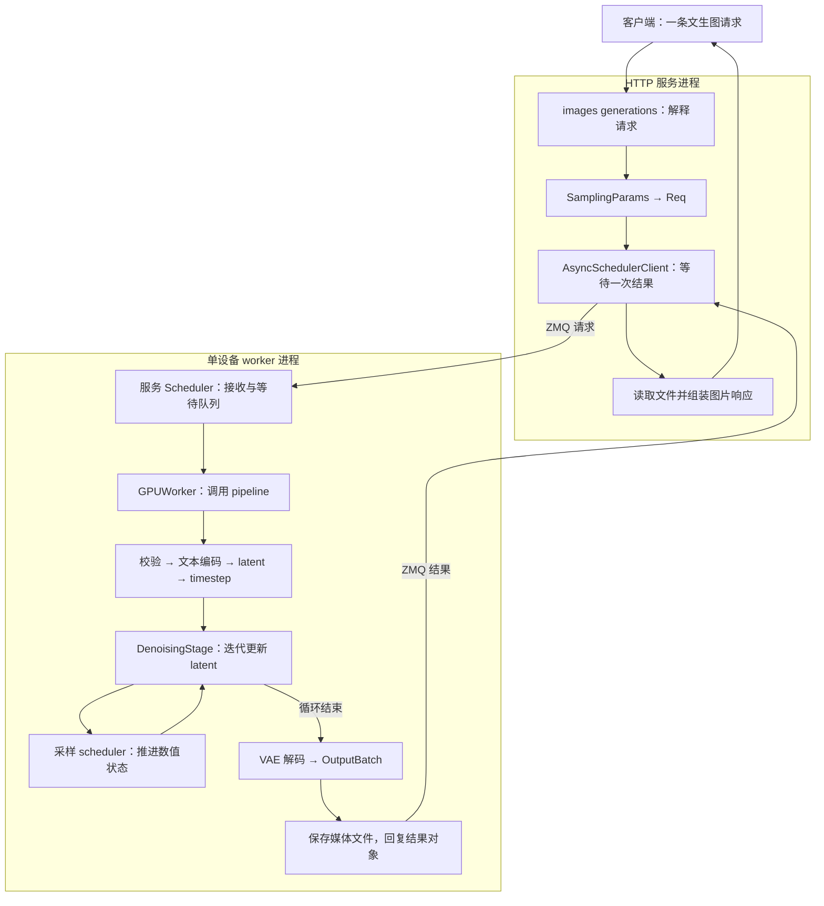
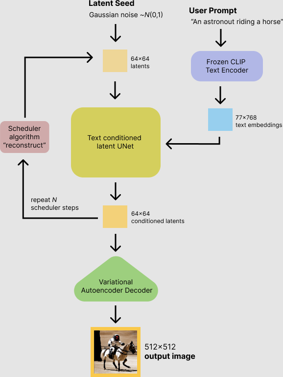
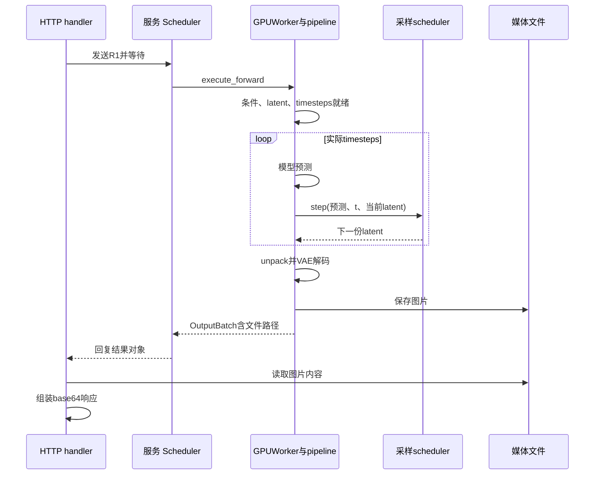

# Diffusion 服务与生成流程入门

本文是**源码分析型学习资料**，面向已经了解“一条文本请求如何进入 SGLang”、第一次阅读图像和视频生成代码的读者。

本篇沿 **Flux 单张文生图 → 普通一体化服务 → fullres 去噪 → 文件与图片响应**走通一条主线，再用视频任务接口和 Wan 的流水线说明扩展边界。重点是请求、条件、latent、采样步骤和最终媒体的生命周期。

## 0. 阅读基线与范围

| 项目 | 内容 |
| --- | --- |
| 源码路径基准 | SGLang 仓库根目录 `.`；本文源码位置均为仓内相对路径 |
| 读取工作区 | `sglang-source-study` 独立 Git worktree |
| 分支 | `codex/sglang-source-study-20260909`，基于官方 main |
| commit | `72d5c5bb73cadd7ffbf5114e5f81e29d36b6c61a` |
| 读取日期 | `2026-09-10` |
| 工作区状态 | 学习源码 worktree 干净；原源码工作区与 Wiki 其他资料保留 |
| 代表路径 | 原生 FluxPipeline，普通 MONOLITHIC 服务、单节点单设备、单请求单输出、纯文本条件、progressive_mode=fullres |
| 教学执行假设 | 无额外缓存跳算、graph runner、CFG 并行、LoRA、分离部署、rollout、轨迹解码或媒体增强；关注基础调用关系 |
| 采样器细化 | 模型配置选中仓内 FlowMatchEulerDiscreteScheduler；展开普通非随机、非 per-token timestep 的更新分支 |
| 延伸 | 视频任务接口、Wan 的时间维度与采样器差异；只建立接续阅读地图 |
| 操作边界 | 只读源码并编写、静态检查文档；未导入 SGLang、安装依赖、下载权重、启动服务、执行项目测试、调用生成接口或使用 GPU |

前置：[01-01 源码地图](../01-getting-started/01-源码目录与最短阅读路线.md)。与语言层编排的关系见 [12-01](01-FrontendDSL与Runtime的关系.md)；基线与路径规则见[总目录](../README.md)。

**证据标识：** 固定文件/函数链接支持源码事实；图、张量账本和标量运算是整理者归纳；没有运行观察。代表配置是阅读条件，不是已启动并验证的环境。SGLang commit 固定了仓内实现，没有自动固定模型仓 revision、实际加载的配置、权重或安装的外部依赖。

## 1. 人话版：从“接着写字”换成“反复更新一份画面表示”

文本自回归模型不断追加输出 token。这里的图像生成主线先准备一份带随机性的数值表示，再根据提示词和当前采样时刻，反复计算如何更新它；全部步骤结束后，才把它解码成像素。

可以把 latent 理解为模型使用的“压缩画布”。这个比喻只帮助识别对象：latent 的每个数值不是直接可展示的 RGB 像素，也不是一个输出汉字。

| 术语 | 人话解释 | 本篇要区分的对象 |
| --- | --- | --- |
| Diffusion / 扩散生成 | 本项目图像、视频等生成子系统的通称 | 具体模型可能采用 flow matching 等不同建模和采样方法 |
| T2I / T2V | 文本到图像 / 文本到视频 | 输出对象和时间维度不同 |
| conditioning / 条件 | 告诉模型“这次要生成什么”的数值信息 | 文本 embedding、参考图像等，不等于正在更新的 latent |
| latent | 生成过程使用的隐空间表示 | 会在采样步骤中更新；最终还要解码 |
| DiT / transformer | 本主线中执行条件预测的神经网络 | 返回更新所需的预测量，不直接返回 HTTP 图片 |
| timestep / sigma | 采样日程中的位置与噪声尺度 | 不是队列等待时间，也不是第几个输出 token |
| 服务 Scheduler | 选择并执行生成请求 | 等待队列、组批和结果回复 |
| 采样 scheduler | 给定预测量，推进采样状态 | timesteps、sigmas、step_index、下一份 latent |
| pipeline / stage | 把多个处理步骤按依赖组织起来 | stage 是处理组件，不能仅凭名称认定为独立进程或 PP rank |
| VAE decode | 将最终 latent 转成像素 | 与 LLM 的自回归 Decode 阶段含义不同 |
| OutputBatch | 向外传递结果、文件路径与指标的对象 | 不等于等待队列中的请求，也不等于已经送达客户端的响应 |

对应入口：[S18] [S32] [S35] [S50] [S55] [S61]。

FLUX.1-dev 的官方模型卡将其描述为 rectified flow transformer，并说明采用 guidance distillation。本文沿用源码中的“denoising / 去噪”命名表示迭代生成过程；不会把变量 noise_pred 一律解释成所有模型都预测同一种高斯噪声。[官方模型卡](https://huggingface.co/black-forest-labs/FLUX.1-dev)（读取于 2026-09-10）。

### 1.1 哪些概念能借用，哪些要重新建立

| 在 LLM 阶段学过的概念 | 可以迁移的理解 | 本篇重新核对的边界 |
| --- | --- | --- |
| HTTP → 内部请求 → worker | API 对象和执行对象分层 | 这里用 multimodal_gen 的 Req、Scheduler 和 GPUWorker |
| 输入 token 与 embedding | 文本需要编码成模型条件 | 文本编码器不是 SRT TokenizerManager 的同义词 |
| batch | 多份工作可合并计算 | 一条请求的 n 个输出与 n 条请求并不相同 |
| Decode 循环 | 多轮执行存在前后依赖 | 本主线更新整份 latent，形状通常保持；没有每轮追加一个词表 token |
| KV Cache | 中间结果复用需要明确键和生命周期 | 不能把 latent、文本 embedding 或 DiT 缓存直接叫作 SRT Radix KV |
| 流式输出 | 传输与计算完成是不同事件 | 图片 generations 本路径等待最终结果；视频任务状态不是每步像素流 |
| GPU OOM | 分层识别权重与中间结果 | 去噪成功后，VAE 解码和媒体输出仍可能失败 |

这张表是跨章节的教学归纳；本篇调用链依据 [S10] [S18] [S26] [S54] [S61] [S71]。

## 2. 先建立整体地图

### 2.1 一条 R1 如何穿过服务

下面的“服务进程”“worker 进程”表示本篇单设备启动路径的进程边界；其他方框是对象或处理步骤。



**图意解读：** 服务 Scheduler 控制请求执行顺序；DenoisingStage 控制一条请求内部的迭代；采样 scheduler 更新采样状态。后两者是 worker 内的对象关系，不是另外两台服务。[S4] [S5] [S15] [S18] [S54] [S55]

图中的文件输出采用主线的 save_output 与 return_file_paths_only 路径。其他传输方式可能直接返回帧或使用临时文件引用，不能用这一张图推断全部部署拓扑。[S63] [S64] [S67]

### 2.2 启动先固定“用哪套实现”

`python/sglang/cli/serve.py::_run_diffusion` 进入扩散专用 CLI；execute_serve_cmd 构造扩散 ServerArgs，随后 dispatch_launch 按 disagg_role 分发。MONOLITHIC 进入 launch_server，创建 worker 进程并等待 ready，再组织 HTTP 服务。[S1] [S2] [S3] [S4]

worker 的 run_scheduler_process 创建本子系统的 Scheduler；GPUWorker 初始化设备和模型时调用 build_pipeline。pipeline 可以由显式 pipeline_class_name 指定，否则依据 model_info 选择。选定的类加载模块并创建 stages。[S5] [S6] [S22] [S24]

因此，阅读前至少记下：

| 要固定的内容 | 为什么影响这条链 |
| --- | --- |
| 实际 pipeline 类 | native FluxPipeline 与其他 pipeline 的 stages 可以不同 |
| pipeline_config 与 sampling 参数类 | 决定模型组件、形状规则和请求默认值 |
| scheduler 类及配置 | 决定 timesteps、sigma 变换和 step 的数值规则 |
| model revision、组件配置和依赖版本 | 同一个模型名字不能完整标识一次执行 |
| 生效模式 | 分离部署、渐进分辨率、rollout 等会切换路径 |

HTTP create_app 挂载图片和视频路由；lifespan 初始化 AsyncSchedulerClient，管理服务预热任务和退出清理。worker ready、HTTP 已可访问、预热完成分别由不同代码处理，不能只看一条启动日志就认定首条请求已经成功。[S7] [S8]

### 图解补充：反复更新 latent，最后才解码成图像



[查看原尺寸](../../../images/sglang-source-study/36-latent-diffusion.png)。

**图意解读：** 从上方噪声与右侧文本条件进入，中间循环更新 latent，最后交给 VAE decoder 形成图片。左侧 Scheduler algorithm 指数值更新规则。

**对应本篇源码：** 只借图理解“条件编码 → latent 迭代 → 解码”的循环；接着沿本篇 FLUX pipeline 和 worker 找真实阶段，不把图中 UNet 当成当前类。 [源码：python/sglang/multimodal_gen/runtime/pipelines/flux.py][S23]

**来源与边界：** [Stable Diffusion with 🧨 Diffusers](https://huggingface.co/blog/stable_diffusion)，Suraj Patil、Pedro Cuenca、Nathan Lambert、Patrick von Platen / Hugging Face，2022-08-22。这是 Stable Diffusion/UNet 的背景图；本篇主线使用 FLUX，模型结构、文本编码器与尺寸不同。数值 scheduler 也不等同于服务层的请求调度器。 [来源档案 F36](../../../images/sglang-source-study/SOURCES.md#f36)。

## 3. API 参数如何变成内部 Req

### 3.1 本篇使用的教学请求

下面是发往 `POST /v1/images/generations` 的请求体示意，**未发送**。假定目标服务已加载本篇选定的 Flux pipeline；省略 model 字段，避免把请求字段误读成运行中换模型的命令。

```json
{
  "prompt": "A red cube on a plain white table",
  "n": 1,
  "size": "512x512",
  "seed": 7,
  "generator_device": "cpu",
  "num_inference_steps": 4,
  "guidance_scale": 3.5,
  "response_format": "b64_json",
  "output_format": "png",
  "progressive_mode": "fullres"
}
```

4 步只用于缩短教学账本，不是 Flux 画质推荐。CPU generator 表示随机数生成器的选择，不表示模型在 CPU 上运行。[S36] [S44] 本篇不展示或声称产生了相应图片。

ImageGenerationsRequest 声明了这些字段；generations 为请求创建 ID，并明确把 num_frames 设成 1，将 n 转成 num_outputs_per_prompt 后构造 sampling 参数。[S9] [S10]

### 3.2 三层配置，不能只读一张默认表

| 层次 | 本路径的实际动作 | R1 的结果或边界 |
| --- | --- | --- |
| HTTP 字段 | 接收 prompt、size、n、steps、输出格式等 | JSON 被解析，不代表模型已经开始 |
| build_sampling_params | size 只补尚未设置的 width/height；检查正整数字段；过滤 None | R1 得到 width=512、height=512；显式 width/height 可覆盖 size 对应维度 |
| 模型采样参数 | 创建模型对应参数类，合并显式字段，再调整、校验 | FluxSamplingParams 声明 50 步；R1 显式 4 步覆盖它 |
| prepare_request | 用 sampling_params 构造 Req，应用额外字段并校验 prompt/尺寸 | 请求状态与模型计算张量尚未齐备 |
| stages | 创建 generator、embedding、latent、timesteps | 执行时继续补充 Req |

源码：[S10] [S11] [S12] [S13] [S14]。

HTTP generations 的 n 表达式是 `max(1, min(int(request.n or 1), 10))`，所以这层会把输出数量夹在 1 到 10；这不是“所有底层 pipeline 任意 n 都已经受支持”的证明。[S10] 更具体的请求组合仍需经过模型和服务调度条件。

准备普通图片 Req 时，prompt 必须是字符串；内部 Req 虽然能表达多种工作形态，也不能据此宣称这条 HTTP 文生图入口接收任意 prompt 列表。[S14] [S32]

### 3.3 两类 batch 数量

在 Req.batch_size 中，prompt 是字符串时按一份 prompt 计算，再乘 num_outputs_per_prompt。因此 R1 的有效样本数为 1。[S33]

如果同一个 prompt 请求两张图，通常是一个逻辑请求、两个输出样本。两条独立 HTTP 请求则有各自请求 ID、返回者和失败边界。Scheduler 还可能按兼容条件组合多个请求；本篇的单请求路径不展开其准入算法。[S17] [S19] [S20]

AsyncSchedulerClient 为一次 RPC 新建一个 REQ socket，发送序列化请求并等待结果。普通 API helper 传入 [Req]，服务端规范化为一条队列项；多元素 list[Req] 的逻辑分组语义另外处理。[S15] [S16] [S17] [S68]

## 4. pipeline 怎样把各个阶段串起来

### 4.1 Flux 的顺序是源码明确添加的

FluxPipeline.create_pipeline_stages 调用 add_standard_t2i_stages，并提供两个 text_encoder/tokenizer，以及 prepare_mu。当前顺序如下：[S23] [S26]

| 顺序 | 阶段 | 消费什么 | 产生或更新什么 |
| --- | --- | --- | --- |
| 1 | InputValidationStage | 请求参数 | 检查输入，生成每输出 seed 和 generator |
| 2 | TextEncodingStage | prompt、文本编码器、tokenizer | prompt_embeds、pooled_embeds、mask 与序列长度 |
| 3 | LatentPreparationStage | 尺寸、batch size、generator | 初始 latents、raw_latent_shape |
| 4 | TimestepPreparationStage | 步数、scheduler、尺寸 | timesteps、sigmas、batch.scheduler、mu |
| 5 | 去噪 stage router | progressive_mode 与已备齐的状态 | fullres 转给普通 DenoisingStage |
| 6 | DecodingStage | 最终 latent、VAE | OutputBatch 中的像素 tensor 与指标 |

**注意 latent preparation 在 timestep preparation 前面。** 不应仅凭常见示意图把这两个阶段顺序写反。

Flux 虽然向 builder 传入 FluxProgressiveDenoisingStage，builder 实际创建的是 ProgressiveDenoisingStageRouter。fullres 直接调用 standard_stage.forward，不创建渐进 stage；只有渐进模式才按需创建并使用另一条路径。[S27] [S29]

### 4.2 默认 executor 的名字容易误导

ComposedPipelineBase.build_executor 当前返回 **ParallelExecutor**，SyncExecutor 只是代码里被注释的另一个选择。不能因为本篇只有一张 GPU 就把实际调用链改写成 SyncExecutor。[S25]

ParallelExecutor._execute_stages 仍按 stages 列表逐个推进，依据每个 stage 的 parallelism_type 决定哪些 rank 执行、是否广播或 barrier。“Parallel”描述阶段执行所遵循的并行规则，不表示六个阶段同时处理同一份尚未就绪的数据。[S30]

PipelineStage.__call__ 包住输入验证、forward、输出验证和阶段记录。依赖关系通过前一阶段返回的对象向后一阶段传递；最后阶段可以把 Req 转成 OutputBatch，并不要求全部阶段返回同一种业务对象。[S31] [S61]

## 5. 对象账本：谁持有，什么时候才可用

| 对象或字段 | 所有者 / 主要使用方 | 就绪条件 | 生命周期边界 |
| --- | --- | --- | --- |
| SamplingParams | Req 持有，阶段读取 | 请求参数合并、调整与校验完成 | 请求配置；不保存模型全部执行状态 |
| Req | 服务队列、worker、pipeline | API 可先创建空计算状态的 Req | 随阶段逐步补字段；不等于 SRT 的同名 Req |
| prompt_embeds / pooled_embeds | 文本编码阶段写入，去噪读取 | 文本编码完成 | 本次条件；不是每次采样都新增的一段文本 |
| generator / seeds | 输入阶段创建，latent 阶段使用 | seed 数与输出数对应 | 决定初始随机流；不能单独证明跨硬件输出一致 |
| latents | latent 阶段创建，去噪更新 | 尺寸、dtype、generator 已备齐 | 先 packed，再更新，最后 unpack 给 VAE |
| timesteps / sigmas | 采样准备阶段和采样 scheduler | set_timesteps 完成 | 本次采样日程；与请求队列时钟无关 |
| batch.scheduler | Req 引用，去噪使用 | TimestepPreparationStage 绑定实例 | 普通路径可引用 stage-local 实例，不保证每请求 deepcopy |
| DenoisingContext | DenoisingStage | 循环前汇集参数与条件 | ctx.latents 是循环内更新的主要变量 |
| DenoisingStepState | 每次迭代 | 选定本次 t、模型与相关元数据 | 本轮执行信息 |
| OutputBatch | 解码和输出处理 | 像素计算完成后建立 | output 可被文件路径或其他传输载荷替换 |
| 媒体文件 / API store 记录 | 输出处理与 HTTP 层 | 保存和记录步骤完成 | 独立于模型 tensor 的生存期 |

对应源码：[S32] [S35] [S36] [S37] [S44] [S45] [S48] [S52] [S54] [S61] [S64]。

Req 对 SamplingParams 重名字段实现了属性代理。例如读 batch.width 不意味着 Req 里有另一份与 sampling_params.width 无关的配置副本。[S32] 阅读字段更新时，应继续追到代理和原参数对象。

### 5.1 采样 scheduler 会复用，但循环状态必须重置

get_or_create_request_scheduler 在 batch.scheduler 为空时，默认把 scheduler_template 赋给请求；只有 isolate=True 才 deepcopy。普通 worker 路径执行一条请求时可以复用 stage-local scheduler。[S48]

这解释了两点：

- 名字叫“request scheduler”，不等于每条普通请求都新建一个 Python 实例。
- 复用实例不能沿用上次采样游标。set_timesteps 重置 _step_index / _begin_index，循环开始的 _before_denoising_loop 也处理重置并设 begin_index=0。[S50] [S53]

若未来让请求交错执行或让状态跨阶段长期存活，需要重新确认隔离契约。本篇不把普通串行路径的复用规则扩展成任意并发安全结论。

## 6. R1 walkthrough：从 512 × 512 到 1024 个 latent 位置

本节使用前面的请求。尺寸推导明确假设：生效 VAE 缩放因子为 8、Flux DiT in_channels=64、输出数为 1。仓内默认架构及 VAE 初始化规则支持这一组阅读假设；实际加载配置仍须在运行记录里核对。[S85] [S86]

### 6.1 输入与条件就绪

输入阶段为 seed=7、单输出建立 seeds=[7] 及相应 generator。若同一 prompt 的输出数改成 2，普通标量 seed 分支会展开为 [7, 8]，而不是让两张输出都复用同一个 seed。[S36]

TextEncodingStage 调用对应 tokenizer / encoder，把结果装入列表。Flux 配置中包含 CLIP 与 T5 两个文本编码器；去噪使用 T5 的 token embedding，并从 CLIP 的 pooled embedding 取整体条件。[S37] [S38] [S42]

本篇不把“提示词有几个字”直接当作 T5 embedding 的序列长度。编码器的截断、padding、postprocess 和 max_sequence_length 都影响该字段。Flux v1 配置对文本条件还要求固定长度的序列契约。[S38]

### 6.2 latent 不是把 512 × 512 个像素直接搬进模型

FluxPipelineConfig.prepare_latent_shape 的核心关系为：[S39]

```text
H_lat = 2 × floor(H / (vae_scale_factor × 2))
W_lat = 2 × floor(W / (vae_scale_factor × 2))
C_lat = DiT.in_channels / 4
shape = [B, C_lat, H_lat, W_lat]
```

代入 R1，得到 [1, 16, 64, 64]。LatentPreparationStage 用 generator 生成随机 tensor，再执行模型配置提供的 packing；并把 packed 结果记录为 batch.latents 和 raw_latent_shape。[S40] [S43] [S44]

| 位置 | R1 形状 | 元素数 | 人话解释 |
| --- | --- | ---: | --- |
| 初始空间 latent | [1, 16, 64, 64] | 65,536 | 64 × 64 的隐空间网格，每位置 16 个通道 |
| 2 × 2 packing 后 | [1, 1024, 64] | 65,536 | 把四个邻近位置的通道合并，形成 32 × 32 个位置 |
| 每步输入 / 预测 / 更新结果 | 基础主线保持 [1, 1024, 64] | 65,536 | 更新现有数值，不追加第 1025 个输出位置 |
| 去噪结束 unpack | [1, 16, 64, 64] | 65,536 | 恢复 VAE 所需空间布局 |
| VAE 像素输出 | 代表图像布局 [1, 3, 512, 512] | 786,432 | 进入后处理后才能保存为 PNG 等媒体格式 |

前四行由 packing/unpacking 与循环代码推导；最后一行是本节选定图像配置下的预期布局，未测量模型输出。[S39] [S41] [S43] [S55] [S60]

如果只计算一份 65,536 元素的 BF16 latent，占用 131,072 字节，即 128 KiB。**这不是模型显存需求**：权重、条件、Attention/GEMM 中间结果、预测量、转换副本和 VAE 工作集均未计入。

这里的 1024 可被叫作图像 latent 序列长度，不能拿它充当接口返回的 1024 个文本 token。

### 6.3 准备采样日程

Flux 的 prepare_sigmas 使用 ImagePipelineConfig._prepare_sigmas；未传自定义 sigmas 时，4 步的初始序列是 [1, 0.75, 0.5, 0.25]。[S38] [S77]

prepare_mu 根据 packed 图像序列长度计算分辨率相关参数。R1 的 image_seq_len=1024，代入 calculate_linear_shift 的默认参数得到 **mu=0.63**。[S46] [S47]

这些值还不能直接当作最终 timesteps：

1. TimestepPreparationStage 选定 scheduler，并准备 sigmas 和 mu。
2. scheduler.set_timesteps 按配置执行动态/静态 shift 及其他已启用变换。
3. 将最终日程写回 batch.timesteps，并持有 batch.scheduler。
4. 普通 FlowMatchEuler 路径在内部 sigmas 末尾追加终止值，使每次 step 都能读当前与下一个 sigma。[S45] [S50]

所以，**请求步数、实际 timesteps 数、sigma 表长度、训练时间尺度是不同计数**。本主线普通 4 步日程对应 4 次迭代和包含末端值的 5 项 sigma 表；不要推广到所有 scheduler.order、定制 timesteps 或模型专用循环。

SchedulerLoader 从组件配置读类名，允许 pipeline 的类覆盖，再交给模型 registry 解析。本文细化的 Euler 类位于仓内源码；不能把它等同于本机任意版本的 diffusers 同名类。[S49] [S50] [S51]

外部 [Diffusers 的 FlowMatchEuler 文档](https://huggingface.co/docs/diffusers/api/schedulers/flow_match_euler_discrete)可帮助理解 set_timesteps / step 接口（读取于 2026-09-10），但本文的数值分支以固定 SGLang 源码为准。

## 7. 一次去噪迭代究竟做了什么

### 7.1 外层一次请求，内层多次更新

服务 Scheduler.event_loop 先收请求、取待执行项，再调用 worker。单请求 _handle_generation 进入 worker.execute_forward，后者调用 pipeline.forward。[S18] [S20] [S21]

pipeline 内部的 DenoisingStage._denoise 遍历实际 timesteps。基础调用关系可读成：

```text
准备 DenoisingContext，绑定条件与 scheduler
    ↓
重置循环状态，准备 timesteps 的 CPU 视图
    ↓
对每个 step_index 和 t：
    准备本步状态
    将 latent 转为模型计算 dtype，准备 timestep
    scheduler.scale_model_input
    模型预测，按 CFGPolicy 组合
    scheduler.step → 更新 ctx.latents
    记录可选轨迹 / 本步指标
    ↓
收尾，按模型规则 unpack，并写回 batch.latents
```

源码：[S52] [S53] [S54] [S55] [S57]。

**在这条普通路径中，服务 Scheduler 不会每完成一个去噪 step 就重新回到接收队列。** worker 调用返回之前，同一请求的 pipeline 还没有结束。动态组批是另一项调度机制，不能仅凭“多次 step”就推导已经实现了 LLM 式逐轮插入新请求。[S18] [S20] [S54]

### 7.2 模型预测与采样更新分工

模型读取当前 latent、timestep 与条件，产生本次预测量；采样 scheduler 再结合当前 sample 和采样日程，计算下一份 latent。[S55] [S56]

普通 Euler 分支中的关系是：

```text
dt = sigma_next - sigma_current
next_latent = current_latent + dt × model_output
step_index += 1
```

这来自 [S51] 的普通、非随机、非 rollout、无 per_token_timesteps 分支。源码会先处理精度转换，再按条件转换结果 dtype。它不是所有扩散采样器的统一公式。

下面只取 latent 的一个标量位置，假定某一步 current=2.0、sigma_current=1.0、sigma_next=0.75、model_output=0.4，则 next=1.9。这里的 sigma 和预测量是**教学输入**，不是 R1 实际模型输出，也不是经过 mu shift 后的真实日程。

| 教学迭代 | 输入标量 | sigma 当前 → 下一项 | 假设模型预测 | 更新后标量 |
| --- | ---: | --- | ---: | ---: |
| 第 0 步 | 2.0 | 1.0 → 0.75 | 0.4 | 1.9 |
| 第 1 步 | 1.9 | 0.75 → 0.50 | 0.2 | 1.85 |

第二步要重新调用模型得到预测；不能把第一步的 0.4 默认复用，也不能把 latent 的“减小”解释为所有位置必然越来越接近零。

实际 t 传入的是 scheduler.timesteps 中的值。FlowMatchEuler.step 明确拒绝把 enumerate 得到的整数索引直接当作 timestep。[S51]

### 7.3 CFG 与 embedded guidance 分开看

CFG 可以理解为：用正向条件和另一份条件分别预测，再按比例组合。默认 CFGPolicy 总有 conditional 分支；Req.do_classifier_free_guidance 为真时才追加 unconditional 分支。只有一个预测时，combine 原样返回；两个预测的普通串行组合为 neg + scale × (pos - neg)，还可能有后处理。[S58] [S59]

Req.validate 根据 true_cfg_scale（若显式提供）或 guidance_scale，以及 negative_prompt 是否为 None，决定是否开启 CFG。R1 未给 negative_prompt，FluxSamplingParams 默认也是 None，因此本例不由 guidance_scale=3.5 单独触发双分支。[S13] [S34]

**Flux 的 embedded guidance 是另一条来源链。** 当前 DenoisingStage.get_or_build_guidance 读取 pipeline_config.embedded_cfg_scale；Flux v1 的 _build_guidance 还按实现做尺度转换，再传给支持 guidance 参数的模型。它没有在这里读取请求 sampling_params.guidance_scale。[S38] [S56] [S87] [S88]

所以，读者不能只改 JSON 的 guidance_scale 就声称已经修改模型实际收到的 embedded guidance；也不能从“3.5 大于 1”直接算出每步必然做两次模型 forward。

### 7.4 何时才算去噪结束

最后一步 scheduler.step 更新的是 ctx.latents。循环收尾调用 _post_denoising_loop，处理必要的收集与模型后处理，Flux 在这里 unpack，然后写回 batch.latents。[S54] [S57] [S41]

此时就绪的是最终隐空间表示，后续还要 VAE 解码、媒体保存和响应构造。不能把进度条走完等同于用户已经收到图片。

## 8. 从 latent 到图片文件，再到 HTTP 响应

### 8.1 VAE Decode 的边界

DecodingStage 取得 VAE，按配置做 latent 的 scale/shift 和必要预处理，调用 VAE 解码，再把像素值规范到 [0, 1]；forward 用结果创建 OutputBatch。[S60] [S61]

此处的 Decode 是隐空间到像素的转换。没有“采样一个词表 token → detokenize”的步骤。

还要注意源码注释与实际返回值：DecodingStage.decode 的说明文字提到 CPU float32，但函数主体结尾直接返回 image。**不能仅凭 docstring 宣称 tensor 已经搬到 CPU**；应继续追 worker 的输出传输和媒体后处理路径。[S60] [S63] [S66]

### 8.2 主线采用先保存文件，再返回路径

build_sampling_params 默认设置 save_output=True；SamplingParams 的 return_file_paths_only 默认 True。主线进入 GPUWorker 的文件路径传输分支：[S11] [S12] [S63]

1. 输出 rank 调用 _save_output_paths。
2. save_outputs 按数据类型组织媒体保存，生成 output_file_paths。
3. _materialize_file_path_transport 将 output、audio 等大载荷字段置空。
4. Scheduler 把 OutputBatch 序列化并回复给相应 ZMQ identity。
5. HTTP process_generation_batch 优先取已有 output_file_paths；若走返回 output 的其他路径，才在这里继续保存。[S64] [S65] [S66] [S67] [S68]

因此，**output 为 None 不一定是失败**。它可能已被成功保存的文件路径替代。API helper 判断“没有输出”时同时检查 output、output_file_paths 和 raw_frame_batches，而不是只检查一个字段。[S68]

### 8.3 base64、URL 与临时文件的生命周期

R1 显式请求 b64_json。generations 在可能清理本地文件的上传步骤之前读取 base64，随后组装响应。[S10] [S70]

| 输出方式 / 环境 | 代码如何处理 | 读者要核对什么 |
| --- | --- | --- |
| b64_json | 预读图片文件内容，写入响应 data | 文件确实可读，响应数据非空 |
| 持久输出目录、无云 URL | 可构造本服务 content URL | HTTP 层可访问对应文件，store 条目与文件对应 |
| 临时输出目录 | 退出 context 后删除目录 | 不应把临时本地路径作为长期下载位置 |
| URL 格式但没有可用云 URL 或持久本地回退 | 响应构造返回错误 | 文件曾生成不代表 URL 响应可以成立 |
| 多张输出 | 按路径顺序构造多个 data item | 下标、文件与 URL 不错位 |

源码：[S10] [S69] [S70]。本篇选定同机普通部署，不把“只传文件路径”扩展为跨主机文件系统自动共享的保证。

### 8.4 完成事件的顺序



**图意解读：** 箭头表示本篇正常路径上的调用和结果依赖；它不是实测 trace，也没有给出每段耗时。文件保存、ZMQ 回复、base64 编码仍位于去噪之后。[S54] [S61] [S64] [S68] [S10]

## 9. 视频沿用什么，又增加什么

视频生成也可以复用“输入 → 条件 → latent → 采样 → 解码”的框架，但不能把每个视频帧当作独立图片循环，或把 num_frames 当作 num_inference_steps。

### 9.1 Wan 的代表入口

WanPipeline.create_pipeline_stages 同样添加输入、文本编码、latent、timestep、去噪路由和解码。它在 initialize_pipeline 中替换 scheduler 为仓内 FlowUniPCMultistepScheduler。[S74] [S75] 所以前面 Euler 的更新公式不能直接套入 Wan。

通用 PipelineConfig.prepare_latent_shape 使用 [B, C, F_lat, H_lat, W_lat] 形式；视频帧数会受模型规则和 VAE 时间压缩等影响。这里的 F_lat 是隐空间时间长度，不应默认等于最终视频帧数。[S76] [S44]

| 参数或维度 | 控制什么 | 不代表什么 |
| --- | --- | --- |
| num_frames | 请求视频的帧数，后续可被模型规则调整 | 去噪迭代次数 |
| latent 的时间维度 | 模型内部处理的时间表示 | 同数量的完整 RGB 图像 |
| num_inference_steps | 采样日程的输入 | 视频播放时长 |
| fps | 媒体编码/播放的帧率 | 模型每秒实际算出的帧数 |
| reference image / video | 某些任务额外的条件 | 所有 T2V 路径都有这份输入 |

帧数调整与输出处理入口见 [S12] [S66]；本篇没有验证各视频模型的合法帧数、画质或耗时。

### 9.2 视频 API 先回任务记录

create_video 在准备和校验请求后，把初始 job 写入 VIDEO_STORE，再启动后台生成协程，返回 VideoResponse。_dispatch_job_async 等待生成、校验最终媒体、处理文件/URL，成功后更新 completed 和 progress=100；失败则写 failed 与错误信息。[S71] [S72]

| 时点 | 客户端能确认什么 | 尚不能确认什么 |
| --- | --- | --- |
| 收到 queued job | API 已建立任务记录 | GPU 已开始或视频已经可下载 |
| 查询仍是初始状态 | 当前记录尚未更新到完成 | 每步去噪正在前进；此路径没有自动逐步上报采样进度 |
| completed | 后台成功路径已写完成字段 | 全部播放端兼容、业务画质达到要求 |
| failed | 后台捕获并记录错误 | 失败一定发生在模型 forward |
| delete 返回 deleted | store 条目被移除并构造删除响应 | 在途 GPU 工作已取消、文件已清理 |

delete_video 的函数体没有向 Scheduler 发送 abort，也没有在这里取消后台生成 task 或删除媒体文件。[S73] 这是具体入口的源码边界，不能把任务记录删除当作完整取消协议。

实时视频、分段生成、音视频联合模型和分离式 encoder/denoiser/decoder 服务仍需沿各自入口分析，不由本节推导支持范围。

## 10. 错误与资源边界：按最后成功的一步定位

| 现象 | 首先分辨 | 回到哪里看 |
| --- | --- | --- |
| 配置能解析但模型无法启动 | 类选择、组件配置、权重与依赖是否匹配 | build_pipeline / loader [S22] [S24] [S49] |
| 512 × 512 请求形状不符 | 生效 scale factor、in_channels、packing 是否符合假设 | Flux 形状与 latent 准备 [S39] [S40] [S44] |
| 一开始就拒绝输入 | 字段类型、尺寸、steps、prompt、seed 数量 | API helper 与输入阶段 [S11] [S14] [S36] |
| guidance 参数改了但行为解释不通 | CFG 分支和 embedded guidance 来源是否混淆 | Req.validate / guidance 构建 [S34] [S87] |
| 采样器报 timestep 错误 | 把 step_index 当作 t，或自定义日程互相冲突 | timestep 准备 / step [S45] [S51] |
| 新请求长时间等待 | 前一条 pipeline 未返回，还是队列组批等待 | 服务 event_loop / 取批 [S18] [S19] |
| 去噪进度结束后报 OOM | VAE 工作集、闲置权重驻留和输出阶段 | DecodingStage.decode / worker [S60] [S62] |
| result.output 是 None | 是否已有 output_file_paths 或 raw frame 载荷 | transport / API helper [S63] [S68] |
| 模型结果已生成但 HTTP 仍失败 | 保存、文件可见性、base64、云上传、URL 格式 | 输出 helper / generations [S66] [S68] [S10] |
| 视频已接单但最终 failed | 后台生成还是最终媒体校验/上传失败 | _dispatch_job_async [S72] |
| RPC 超时或客户端取消 | 只是等待者退出，还是有真实工作取消链 | AsyncSchedulerClient._forward_one [S16] |

### 10.1 关闭 socket 不等于取消 GPU 工作

AsyncSchedulerClient._forward_one 在 finally 关闭临时 socket。接收超时会转为 TimeoutError；但该方法没有随之发送取消请求。[S16]

对应测试分别覆盖默认不设置接收 deadline、等待延迟回复、显式超时和取消后关闭 socket。它们没有证明服务端采样已停止，也没有证明 latent 或 GPU 资源已释放。[S78] [S79] [S80] [S81]

### 10.2 错误对象与资源回收分别记录

GPUWorker._execute_forward_common 捕获异常并填入 OutputBatch.error；非 CPU 平台还有清理缓存调用。服务 event_loop 也会将处理异常包装成错误结果并尝试回复。[S62] [S18]

但不能据此宣称：

- empty_cache 清除了所有仍被对象引用的 tensor；
- 模型权重在每个请求结束后都被销毁；
- 一次 OOM 后所有后续请求必然正常；
- 客户端已经看到回复，或者失败媒体一定被完整清理。

模型组件驻留由 pipeline 与 component residency 管理；请求 tensor、采样器状态、编码文件与 API store 记录又有各自边界。[S24] [S28] [S48] [S62] [S69] 这些生命周期应分别保留验证证据，细节接续下一篇。

## 11. 源码阅读路线与既有测试

### 11.1 按问题回到符号

下列路径均相对于 SGLang 仓库根目录。链接固定到本篇 commit，类中同名方法应连同类名定位。

| 读者的问题 | 主要源码锚点 |
| --- | --- |
| CLI 为什么进入扩散子系统 | `python/sglang/cli/serve.py::_run_diffusion` [S1] |
| 普通服务怎样启动 | `python/sglang/multimodal_gen/runtime/launch_server.py::launch_server` [S4] |
| 图片 API 怎样转参数 | `python/sglang/multimodal_gen/runtime/entrypoints/openai/image_api.py::generations` [S10] |
| 模型默认值怎样与请求合并 | `python/sglang/multimodal_gen/configs/sample/sampling_params.py::SamplingParams.from_user_sampling_params_args` [S12] |
| 谁在等待后端结果 | `python/sglang/multimodal_gen/runtime/scheduler_client.py::AsyncSchedulerClient._forward_one` [S16] |
| 一次服务调度推进到哪里 | `python/sglang/multimodal_gen/runtime/managers/scheduler.py::Scheduler.event_loop` [S18] |
| stages 由谁添加 | `python/sglang/multimodal_gen/runtime/pipelines_core/composed_pipeline_base.py::ComposedPipelineBase.add_standard_t2i_stages` [S26] |
| fullres 实际选哪条路 | `python/sglang/multimodal_gen/runtime/pipelines_core/stages/progressive_resolution/denoising.py::ProgressiveDenoisingStageRouter.forward` [S29] |
| 2 × 2 packing 改了什么 | `python/sglang/multimodal_gen/configs/pipeline_configs/qwen_image.py::_pack_latents` [S43] |
| 时刻表由谁准备 | `python/sglang/multimodal_gen/runtime/pipelines_core/stages/timestep_preparation.py::TimestepPreparationStage.forward` [S45] |
| 每步怎样推进数值 | `python/sglang/multimodal_gen/runtime/models/schedulers/scheduling_flow_match_euler_discrete.py::FlowMatchEulerDiscreteScheduler.step` [S51] |
| 请求内部循环在哪里 | `python/sglang/multimodal_gen/runtime/pipelines_core/stages/denoising.py::DenoisingStage._denoise` [S54] |
| 模型预测与 scheduler.step 如何衔接 | `python/sglang/multimodal_gen/runtime/pipelines_core/stages/denoising.py::DenoisingStage._run_denoising_step` [S55] |
| latent 何时变成像素 | `python/sglang/multimodal_gen/runtime/pipelines_core/stages/decoding.py::DecodingStage.forward` [S61] |
| 像素何时被文件路径替代 | `python/sglang/multimodal_gen/runtime/managers/gpu_worker.py::GPUWorker._materialize_file_path_transport` [S64] |
| 视频任务何时标为完成 | `python/sglang/multimodal_gen/runtime/entrypoints/openai/video_api.py::_dispatch_job_async` [S72] |

### 11.2 既有测试证明哪一层

以下测试仅静态阅读，**本轮全部未执行**。

| 测试入口 | 实际 fixture / 断言 | 不能据此声称 |
| --- | --- | --- |
| test_scheduler_client.py 的默认 deadline 用例 [S78] | Mock socket，断言未设置 RCVTIMEO、关闭 socket | 默认请求一定在某时限内完成 |
| 同文件 delayed response / explicit deadline [S79] [S80] | inproc ZMQ 对端，等待回复或断言 TimeoutError | 真实模型、网络和 GPU 路径通过 |
| 同文件 cancelled 用例 [S81] | Mock recv 阻塞，取消协程后断言 socket.close | 服务端请求取消或显存退役通过 |
| test_openai_image_api.py 的输出项用例 [S82] | 给定两条文件路径和云 URL，检查 data 项对应关系 | 文件真实存在或模型已生成图片 |
| 同文件 variant fallback 用例 [S83] | 检查本地 content URL 的 variant=0/1 | 下载接口、存储持久化已验证 |
| TestProgressiveRouter 的 fullres 用例 [S84] | Dummy stage，断言选 standard 且不创建 progressive | Flux 数值、画质或渐进模式性能通过 |

这样分层后，单测能够成为验证计划的入口，而不会被包装成尚未发生的端到端结果。

## 12. 练习、验收与下一篇

### 12.1 不需要 GPU 的理解检查

1. 在图中标出两种 scheduler，分别说出它们推进的是哪种状态。
2. 不看正文，写出 Flux 六个阶段的添加顺序，解释 fullres 为什么仍经过一个 router。
3. R1 的 n 改成 2，seed=7：有效 batch size、seed 列表、packed latent 形状分别是什么？
4. R1 改成 1024 × 512、仍单输出，scale factor=8、in_channels=64：空间 latent 和 packed latent 的形状分别是什么？
5. 为什么 4 次去噪迭代不等于 4 张图片、4 个视频帧或 4 个文本 token？
6. result.output=None、output_file_paths 含一条可用路径，是否一定失败？依据哪个判断？
7. 视频 delete 返回 deleted 后，还缺什么证据才能声称 GPU 工作已取消？
8. 只改请求 guidance_scale，是否已经证明改变 Flux 的 embedded guidance？

**参考判据：** 第 3 题为 B=2、seeds=[7,8]、[2,1024,64]；第 4 题按宽×高读为 W=1024、H=512，得到 [1,16,64,128] 和 [1,2048,64]。其余题应能回到 [S18] [S26] [S29] [S51] [S68] [S73] [S87] 的具体对象与分支。

### 12.2 日后运行验证应记录什么

本轮没有执行下表。这是一份检验本篇主线的实验设计；准备合适环境后再填入真实命令、结果与媒体产物。

| 验证项 | 必须保留的证据 | 通过判据的范围 |
| --- | --- | --- |
| 首条图片请求 | 源码 SHA、模型/组件 revision、生效配置、请求体、日志、响应、图片尺寸与 hash | 该配置的一条完整生成链 |
| 同环境同请求重复 | seed、generator device、dtype、backend、输出差异及判据 | 所记录环境的重复性，不泛化到任意硬件 |
| 第二条不同 seed 的请求 | 两次请求 ID、采样游标初始状态、输出文件、错误 | 请求状态没有明显串用；仍不是全并发证明 |
| 参数拒绝 | 请求体、拒绝位置、状态码和错误原文 | 指定非法输入确实被该层拒绝 |
| 超时 / 取消 | 客户端退出时间、服务端进度、GPU 工作与资源状态 | 分开证明等待结束与执行退役 |
| 视频任务 | queued 响应、后续记录、媒体解码结果、失败时的错误 | 任务状态与最终文件相符 |
| 性能 | 分辨率、帧数、steps、各阶段与端到端耗时、并行和缓存条件 | 同口径比较；不把 step/s 写成文本 tokens/s |

### 12.3 本篇完成状态

已完成固定源码的主线阅读、形状与采样教学账本、两张图的静态对照、接口和测试断言边界核查；未执行图片/视频生成、ZMQ 测试、模型数值、GPU 显存或性能验证。Mermaid 尚未做渲染器验证。

下一篇：[12-03《Diffusion 并行缓存与性能地图》](03-Diffusion并行缓存与性能地图.md)。在本篇的请求与采样生命周期上，继续分析代表 pipeline 的并行、缓存、图执行、组件驻留和性能测量。

返回[系列目录](../README.md)；查阅[术语与对象](../appendices/01-术语与对象速查.md)、[源码入口](../appendices/02-源码入口与调用链索引.md)、[配置矩阵](../appendices/03-配置解析与功能兼容矩阵.md)、[排障索引](../appendices/04-症状到源码的排障索引.md)、[实验记录](../appendices/05-实验记录与证据模板.md)和[学习进度](../appendices/06-学习进度与版本变更记录.md)。

[S1]: https://github.com/sgl-project/sglang/blob/72d5c5bb73cadd7ffbf5114e5f81e29d36b6c61a/python/sglang/cli/serve.py#L110
[S2]: https://github.com/sgl-project/sglang/blob/72d5c5bb73cadd7ffbf5114e5f81e29d36b6c61a/python/sglang/multimodal_gen/runtime/entrypoints/cli/serve.py#L30
[S3]: https://github.com/sgl-project/sglang/blob/72d5c5bb73cadd7ffbf5114e5f81e29d36b6c61a/python/sglang/multimodal_gen/runtime/launch_server.py#L812
[S4]: https://github.com/sgl-project/sglang/blob/72d5c5bb73cadd7ffbf5114e5f81e29d36b6c61a/python/sglang/multimodal_gen/runtime/launch_server.py#L132
[S5]: https://github.com/sgl-project/sglang/blob/72d5c5bb73cadd7ffbf5114e5f81e29d36b6c61a/python/sglang/multimodal_gen/runtime/managers/gpu_worker.py#L1551
[S6]: https://github.com/sgl-project/sglang/blob/72d5c5bb73cadd7ffbf5114e5f81e29d36b6c61a/python/sglang/multimodal_gen/runtime/managers/gpu_worker.py#L347
[S7]: https://github.com/sgl-project/sglang/blob/72d5c5bb73cadd7ffbf5114e5f81e29d36b6c61a/python/sglang/multimodal_gen/runtime/entrypoints/http_server.py#L394
[S8]: https://github.com/sgl-project/sglang/blob/72d5c5bb73cadd7ffbf5114e5f81e29d36b6c61a/python/sglang/multimodal_gen/runtime/entrypoints/http_server.py#L107
[S9]: https://github.com/sgl-project/sglang/blob/72d5c5bb73cadd7ffbf5114e5f81e29d36b6c61a/python/sglang/multimodal_gen/runtime/entrypoints/openai/protocol.py#L45
[S10]: https://github.com/sgl-project/sglang/blob/72d5c5bb73cadd7ffbf5114e5f81e29d36b6c61a/python/sglang/multimodal_gen/runtime/entrypoints/openai/image_api.py#L263
[S11]: https://github.com/sgl-project/sglang/blob/72d5c5bb73cadd7ffbf5114e5f81e29d36b6c61a/python/sglang/multimodal_gen/runtime/entrypoints/openai/utils.py#L205
[S12]: https://github.com/sgl-project/sglang/blob/72d5c5bb73cadd7ffbf5114e5f81e29d36b6c61a/python/sglang/multimodal_gen/configs/sample/sampling_params.py#L911
[S13]: https://github.com/sgl-project/sglang/blob/72d5c5bb73cadd7ffbf5114e5f81e29d36b6c61a/python/sglang/multimodal_gen/configs/sample/flux.py#L11
[S14]: https://github.com/sgl-project/sglang/blob/72d5c5bb73cadd7ffbf5114e5f81e29d36b6c61a/python/sglang/multimodal_gen/runtime/entrypoints/utils.py#L730
[S15]: https://github.com/sgl-project/sglang/blob/72d5c5bb73cadd7ffbf5114e5f81e29d36b6c61a/python/sglang/multimodal_gen/runtime/scheduler_client.py#L255
[S16]: https://github.com/sgl-project/sglang/blob/72d5c5bb73cadd7ffbf5114e5f81e29d36b6c61a/python/sglang/multimodal_gen/runtime/scheduler_client.py#L278
[S17]: https://github.com/sgl-project/sglang/blob/72d5c5bb73cadd7ffbf5114e5f81e29d36b6c61a/python/sglang/multimodal_gen/runtime/managers/scheduler.py#L1112
[S18]: https://github.com/sgl-project/sglang/blob/72d5c5bb73cadd7ffbf5114e5f81e29d36b6c61a/python/sglang/multimodal_gen/runtime/managers/scheduler.py#L1188
[S19]: https://github.com/sgl-project/sglang/blob/72d5c5bb73cadd7ffbf5114e5f81e29d36b6c61a/python/sglang/multimodal_gen/runtime/managers/scheduler.py#L996
[S20]: https://github.com/sgl-project/sglang/blob/72d5c5bb73cadd7ffbf5114e5f81e29d36b6c61a/python/sglang/multimodal_gen/runtime/managers/scheduler.py#L276
[S21]: https://github.com/sgl-project/sglang/blob/72d5c5bb73cadd7ffbf5114e5f81e29d36b6c61a/python/sglang/multimodal_gen/runtime/managers/gpu_worker.py#L490
[S22]: https://github.com/sgl-project/sglang/blob/72d5c5bb73cadd7ffbf5114e5f81e29d36b6c61a/python/sglang/multimodal_gen/runtime/pipelines_core/__init__.py#L36
[S23]: https://github.com/sgl-project/sglang/blob/72d5c5bb73cadd7ffbf5114e5f81e29d36b6c61a/python/sglang/multimodal_gen/runtime/pipelines/flux.py#L45
[S24]: https://github.com/sgl-project/sglang/blob/72d5c5bb73cadd7ffbf5114e5f81e29d36b6c61a/python/sglang/multimodal_gen/runtime/pipelines_core/composed_pipeline_base.py#L96
[S25]: https://github.com/sgl-project/sglang/blob/72d5c5bb73cadd7ffbf5114e5f81e29d36b6c61a/python/sglang/multimodal_gen/runtime/pipelines_core/composed_pipeline_base.py#L158
[S26]: https://github.com/sgl-project/sglang/blob/72d5c5bb73cadd7ffbf5114e5f81e29d36b6c61a/python/sglang/multimodal_gen/runtime/pipelines_core/composed_pipeline_base.py#L892
[S27]: https://github.com/sgl-project/sglang/blob/72d5c5bb73cadd7ffbf5114e5f81e29d36b6c61a/python/sglang/multimodal_gen/runtime/pipelines_core/composed_pipeline_base.py#L837
[S28]: https://github.com/sgl-project/sglang/blob/72d5c5bb73cadd7ffbf5114e5f81e29d36b6c61a/python/sglang/multimodal_gen/runtime/pipelines_core/composed_pipeline_base.py#L1062
[S29]: https://github.com/sgl-project/sglang/blob/72d5c5bb73cadd7ffbf5114e5f81e29d36b6c61a/python/sglang/multimodal_gen/runtime/pipelines_core/stages/progressive_resolution/denoising.py#L213
[S30]: https://github.com/sgl-project/sglang/blob/72d5c5bb73cadd7ffbf5114e5f81e29d36b6c61a/python/sglang/multimodal_gen/runtime/pipelines_core/executors/parallel_executor.py#L35
[S31]: https://github.com/sgl-project/sglang/blob/72d5c5bb73cadd7ffbf5114e5f81e29d36b6c61a/python/sglang/multimodal_gen/runtime/pipelines_core/stages/base.py#L390
[S32]: https://github.com/sgl-project/sglang/blob/72d5c5bb73cadd7ffbf5114e5f81e29d36b6c61a/python/sglang/multimodal_gen/runtime/pipelines_core/schedule_batch.py#L68
[S33]: https://github.com/sgl-project/sglang/blob/72d5c5bb73cadd7ffbf5114e5f81e29d36b6c61a/python/sglang/multimodal_gen/runtime/pipelines_core/schedule_batch.py#L306
[S34]: https://github.com/sgl-project/sglang/blob/72d5c5bb73cadd7ffbf5114e5f81e29d36b6c61a/python/sglang/multimodal_gen/runtime/pipelines_core/schedule_batch.py#L380
[S35]: https://github.com/sgl-project/sglang/blob/72d5c5bb73cadd7ffbf5114e5f81e29d36b6c61a/python/sglang/multimodal_gen/runtime/pipelines_core/schedule_batch.py#L473
[S36]: https://github.com/sgl-project/sglang/blob/72d5c5bb73cadd7ffbf5114e5f81e29d36b6c61a/python/sglang/multimodal_gen/runtime/pipelines_core/stages/input_validation.py#L93
[S37]: https://github.com/sgl-project/sglang/blob/72d5c5bb73cadd7ffbf5114e5f81e29d36b6c61a/python/sglang/multimodal_gen/runtime/pipelines_core/stages/text_encoding.py#L395
[S38]: https://github.com/sgl-project/sglang/blob/72d5c5bb73cadd7ffbf5114e5f81e29d36b6c61a/python/sglang/multimodal_gen/configs/pipeline_configs/flux.py#L37
[S39]: https://github.com/sgl-project/sglang/blob/72d5c5bb73cadd7ffbf5114e5f81e29d36b6c61a/python/sglang/multimodal_gen/configs/pipeline_configs/flux.py#L128
[S40]: https://github.com/sgl-project/sglang/blob/72d5c5bb73cadd7ffbf5114e5f81e29d36b6c61a/python/sglang/multimodal_gen/configs/pipeline_configs/flux.py#L137
[S41]: https://github.com/sgl-project/sglang/blob/72d5c5bb73cadd7ffbf5114e5f81e29d36b6c61a/python/sglang/multimodal_gen/configs/pipeline_configs/flux.py#L213
[S42]: https://github.com/sgl-project/sglang/blob/72d5c5bb73cadd7ffbf5114e5f81e29d36b6c61a/python/sglang/multimodal_gen/configs/pipeline_configs/flux.py#L225
[S43]: https://github.com/sgl-project/sglang/blob/72d5c5bb73cadd7ffbf5114e5f81e29d36b6c61a/python/sglang/multimodal_gen/configs/pipeline_configs/qwen_image.py#L134
[S44]: https://github.com/sgl-project/sglang/blob/72d5c5bb73cadd7ffbf5114e5f81e29d36b6c61a/python/sglang/multimodal_gen/runtime/pipelines_core/stages/latent_preparation.py#L105
[S45]: https://github.com/sgl-project/sglang/blob/72d5c5bb73cadd7ffbf5114e5f81e29d36b6c61a/python/sglang/multimodal_gen/runtime/pipelines_core/stages/timestep_preparation.py#L77
[S46]: https://github.com/sgl-project/sglang/blob/72d5c5bb73cadd7ffbf5114e5f81e29d36b6c61a/python/sglang/multimodal_gen/runtime/pipelines/flux.py#L19
[S47]: https://github.com/sgl-project/sglang/blob/72d5c5bb73cadd7ffbf5114e5f81e29d36b6c61a/python/sglang/multimodal_gen/runtime/pipelines_core/diffusion_scheduler_utils.py#L14
[S48]: https://github.com/sgl-project/sglang/blob/72d5c5bb73cadd7ffbf5114e5f81e29d36b6c61a/python/sglang/multimodal_gen/runtime/pipelines_core/diffusion_scheduler_utils.py#L32
[S49]: https://github.com/sgl-project/sglang/blob/72d5c5bb73cadd7ffbf5114e5f81e29d36b6c61a/python/sglang/multimodal_gen/runtime/loader/component_loaders/scheduler_loader.py#L42
[S50]: https://github.com/sgl-project/sglang/blob/72d5c5bb73cadd7ffbf5114e5f81e29d36b6c61a/python/sglang/multimodal_gen/runtime/models/schedulers/scheduling_flow_match_euler_discrete.py#L274
[S51]: https://github.com/sgl-project/sglang/blob/72d5c5bb73cadd7ffbf5114e5f81e29d36b6c61a/python/sglang/multimodal_gen/runtime/models/schedulers/scheduling_flow_match_euler_discrete.py#L446
[S52]: https://github.com/sgl-project/sglang/blob/72d5c5bb73cadd7ffbf5114e5f81e29d36b6c61a/python/sglang/multimodal_gen/runtime/pipelines_core/stages/denoising.py#L1207
[S53]: https://github.com/sgl-project/sglang/blob/72d5c5bb73cadd7ffbf5114e5f81e29d36b6c61a/python/sglang/multimodal_gen/runtime/pipelines_core/stages/denoising.py#L1429
[S54]: https://github.com/sgl-project/sglang/blob/72d5c5bb73cadd7ffbf5114e5f81e29d36b6c61a/python/sglang/multimodal_gen/runtime/pipelines_core/stages/denoising.py#L2010
[S55]: https://github.com/sgl-project/sglang/blob/72d5c5bb73cadd7ffbf5114e5f81e29d36b6c61a/python/sglang/multimodal_gen/runtime/pipelines_core/stages/denoising.py#L1599
[S56]: https://github.com/sgl-project/sglang/blob/72d5c5bb73cadd7ffbf5114e5f81e29d36b6c61a/python/sglang/multimodal_gen/runtime/pipelines_core/stages/denoising.py#L2453
[S57]: https://github.com/sgl-project/sglang/blob/72d5c5bb73cadd7ffbf5114e5f81e29d36b6c61a/python/sglang/multimodal_gen/runtime/pipelines_core/stages/denoising.py#L1732
[S58]: https://github.com/sgl-project/sglang/blob/72d5c5bb73cadd7ffbf5114e5f81e29d36b6c61a/python/sglang/multimodal_gen/runtime/distributed/cfg_policy.py#L47
[S59]: https://github.com/sgl-project/sglang/blob/72d5c5bb73cadd7ffbf5114e5f81e29d36b6c61a/python/sglang/multimodal_gen/runtime/distributed/cfg_policy.py#L66
[S60]: https://github.com/sgl-project/sglang/blob/72d5c5bb73cadd7ffbf5114e5f81e29d36b6c61a/python/sglang/multimodal_gen/runtime/pipelines_core/stages/decoding.py#L207
[S61]: https://github.com/sgl-project/sglang/blob/72d5c5bb73cadd7ffbf5114e5f81e29d36b6c61a/python/sglang/multimodal_gen/runtime/pipelines_core/stages/decoding.py#L311
[S62]: https://github.com/sgl-project/sglang/blob/72d5c5bb73cadd7ffbf5114e5f81e29d36b6c61a/python/sglang/multimodal_gen/runtime/managers/gpu_worker.py#L592
[S63]: https://github.com/sgl-project/sglang/blob/72d5c5bb73cadd7ffbf5114e5f81e29d36b6c61a/python/sglang/multimodal_gen/runtime/managers/gpu_worker.py#L880
[S64]: https://github.com/sgl-project/sglang/blob/72d5c5bb73cadd7ffbf5114e5f81e29d36b6c61a/python/sglang/multimodal_gen/runtime/managers/gpu_worker.py#L913
[S65]: https://github.com/sgl-project/sglang/blob/72d5c5bb73cadd7ffbf5114e5f81e29d36b6c61a/python/sglang/multimodal_gen/runtime/managers/gpu_worker.py#L1144
[S66]: https://github.com/sgl-project/sglang/blob/72d5c5bb73cadd7ffbf5114e5f81e29d36b6c61a/python/sglang/multimodal_gen/runtime/entrypoints/utils.py#L987
[S67]: https://github.com/sgl-project/sglang/blob/72d5c5bb73cadd7ffbf5114e5f81e29d36b6c61a/python/sglang/multimodal_gen/runtime/managers/scheduler.py#L718
[S68]: https://github.com/sgl-project/sglang/blob/72d5c5bb73cadd7ffbf5114e5f81e29d36b6c61a/python/sglang/multimodal_gen/runtime/entrypoints/openai/utils.py#L447
[S69]: https://github.com/sgl-project/sglang/blob/72d5c5bb73cadd7ffbf5114e5f81e29d36b6c61a/python/sglang/multimodal_gen/runtime/entrypoints/openai/utils.py#L178
[S70]: https://github.com/sgl-project/sglang/blob/72d5c5bb73cadd7ffbf5114e5f81e29d36b6c61a/python/sglang/multimodal_gen/runtime/entrypoints/openai/image_api.py#L161
[S71]: https://github.com/sgl-project/sglang/blob/72d5c5bb73cadd7ffbf5114e5f81e29d36b6c61a/python/sglang/multimodal_gen/runtime/entrypoints/openai/video_api.py#L464
[S72]: https://github.com/sgl-project/sglang/blob/72d5c5bb73cadd7ffbf5114e5f81e29d36b6c61a/python/sglang/multimodal_gen/runtime/entrypoints/openai/video_api.py#L374
[S73]: https://github.com/sgl-project/sglang/blob/72d5c5bb73cadd7ffbf5114e5f81e29d36b6c61a/python/sglang/multimodal_gen/runtime/entrypoints/openai/video_api.py#L822
[S74]: https://github.com/sgl-project/sglang/blob/72d5c5bb73cadd7ffbf5114e5f81e29d36b6c61a/python/sglang/multimodal_gen/runtime/pipelines/wan_pipeline.py#L42
[S75]: https://github.com/sgl-project/sglang/blob/72d5c5bb73cadd7ffbf5114e5f81e29d36b6c61a/python/sglang/multimodal_gen/runtime/pipelines/wan_pipeline.py#L48
[S76]: https://github.com/sgl-project/sglang/blob/72d5c5bb73cadd7ffbf5114e5f81e29d36b6c61a/python/sglang/multimodal_gen/configs/pipeline_configs/base.py#L401
[S77]: https://github.com/sgl-project/sglang/blob/72d5c5bb73cadd7ffbf5114e5f81e29d36b6c61a/python/sglang/multimodal_gen/configs/pipeline_configs/base.py#L1221
[S78]: https://github.com/sgl-project/sglang/blob/72d5c5bb73cadd7ffbf5114e5f81e29d36b6c61a/python/sglang/multimodal_gen/test/unit/test_scheduler_client.py#L33
[S79]: https://github.com/sgl-project/sglang/blob/72d5c5bb73cadd7ffbf5114e5f81e29d36b6c61a/python/sglang/multimodal_gen/test/unit/test_scheduler_client.py#L72
[S80]: https://github.com/sgl-project/sglang/blob/72d5c5bb73cadd7ffbf5114e5f81e29d36b6c61a/python/sglang/multimodal_gen/test/unit/test_scheduler_client.py#L99
[S81]: https://github.com/sgl-project/sglang/blob/72d5c5bb73cadd7ffbf5114e5f81e29d36b6c61a/python/sglang/multimodal_gen/test/unit/test_scheduler_client.py#L119
[S82]: https://github.com/sgl-project/sglang/blob/72d5c5bb73cadd7ffbf5114e5f81e29d36b6c61a/python/sglang/multimodal_gen/test/unit/test_openai_image_api.py#L39
[S83]: https://github.com/sgl-project/sglang/blob/72d5c5bb73cadd7ffbf5114e5f81e29d36b6c61a/python/sglang/multimodal_gen/test/unit/test_openai_image_api.py#L195
[S84]: https://github.com/sgl-project/sglang/blob/72d5c5bb73cadd7ffbf5114e5f81e29d36b6c61a/python/sglang/multimodal_gen/test/unit/progressive_resolution/test_progressive.py#L139
[S85]: https://github.com/sgl-project/sglang/blob/72d5c5bb73cadd7ffbf5114e5f81e29d36b6c61a/python/sglang/multimodal_gen/configs/models/dits/flux.py#L11
[S86]: https://github.com/sgl-project/sglang/blob/72d5c5bb73cadd7ffbf5114e5f81e29d36b6c61a/python/sglang/multimodal_gen/configs/models/vaes/flux.py#L49
[S87]: https://github.com/sgl-project/sglang/blob/72d5c5bb73cadd7ffbf5114e5f81e29d36b6c61a/python/sglang/multimodal_gen/runtime/pipelines_core/stages/denoising.py#L1159
[S88]: https://github.com/sgl-project/sglang/blob/72d5c5bb73cadd7ffbf5114e5f81e29d36b6c61a/python/sglang/multimodal_gen/runtime/pipelines_core/stages/denoising.py#L1146
