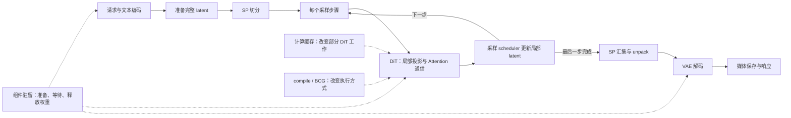
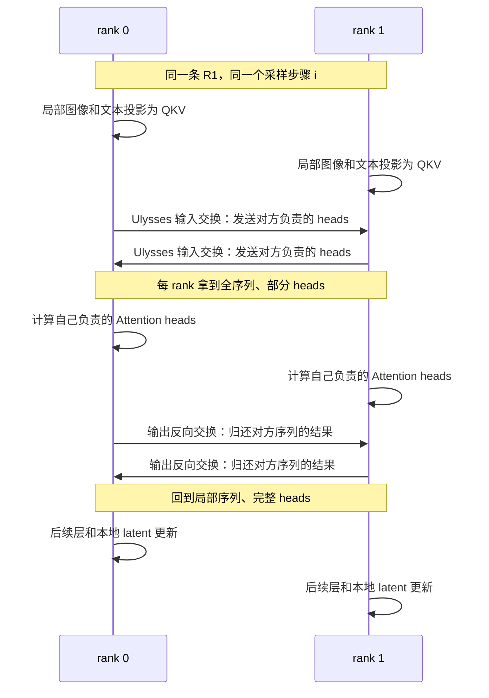
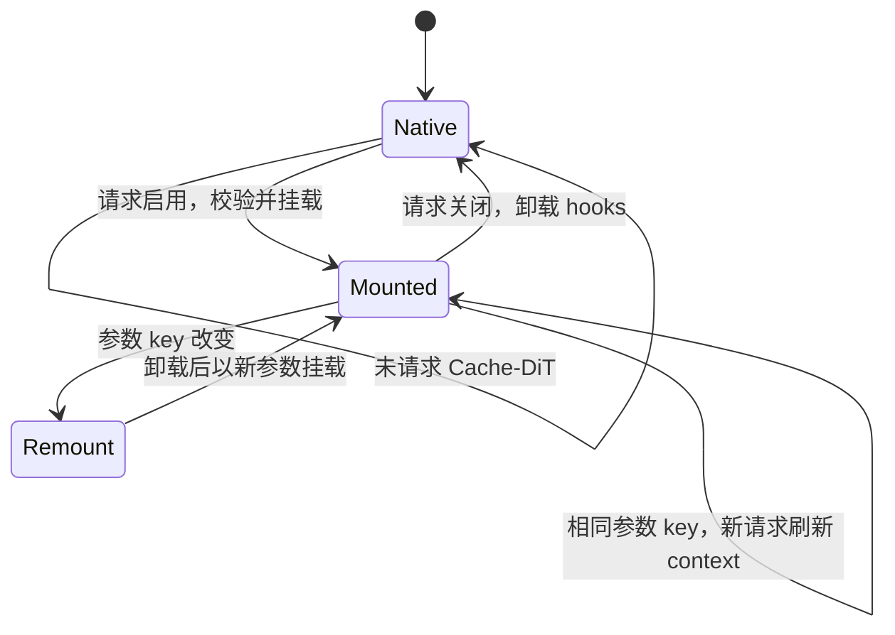

# Diffusion 并行缓存与性能地图

> **先建立架构心智模型：** [M12 · DSL与Diffusion及插件边界](<../architecture/12-DSL与Diffusion及插件边界.md>)。先看职责、数据和生命周期，再回到本篇源码细节。

本文是**源码分析型学习资料**。沿用上一章的原生 Flux 文生图主线，先把一条请求放到两张卡上，再逐项加入计算缓存、编译、图执行和组件卸载，最后解释如何测量它们。

目标是回答四个问题：**谁划分工作、哪些数据需要通信、复用对象何时失效、日志究竟测到了哪一段。**

## 0. 阅读基线与范围

| 项目 | 内容 |
| --- | --- |
| 源码路径基准 | SGLang 仓库根目录 `.`；所有源码位置均为仓内相对路径 |
| 读取工作区 | `sglang-source-study` 独立 Git worktree |
| 分支 | `codex/sglang-source-study-20260909`，基于官方 main |
| commit | `72d5c5bb73cadd7ffbf5114e5f81e29d36b6c61a` |
| 读取日期 | `2026-09-10` |
| 工作区状态 | 学习源码 worktree 干净；原源码工作区与 Wiki 其他资料保留 |
| 代表模型与请求 | 原生 FluxPipeline / FluxTransformer2DModel；普通 MONOLITHIC、fullres、纯文本条件、单请求单输出 |
| 基础拓扑 | 单节点两设备；DP=1、TP=1、CFG degree=1、SP=2、Ulysses=2、Ring=1、K/V gather degree=1 |
| 基础执行假设 | 明确选定稠密非因果 Attention；不启用量化特例、缓存跳算、compile、BCG、LoRA、分离部署或轨迹输出 |
| 后续对照 | Cache-DiT、Spectrum、torch.compile、Breakable CUDA Graph、组件驻留与计时，分别加入分析 |
| 操作边界 | 只读源码、编写与静态检查文档；未安装依赖、导入 SGLang、下载模型、启动服务、调用生成接口、执行项目测试或使用 GPU |

前置：[12-02 Diffusion 服务与生成流程](02-Diffusion服务与生成流程入门.md)、[05 模型执行阶段](../README.md)、[06 并行阶段](../README.md)。基线与路径约定见[总目录](../README.md)。

**证据标识：** 固定源码锚点支持源码事实；拓扑图、形状账本和数字例子是整理者归纳；本篇没有运行观察或性能结论。上述配置用于限定阅读分支，不是已经启动验证的配置清单。实际模型 revision、组件配置、驱动与安装包仍需独立固定。

本篇不展开全部视频模型、VAE 并行算法、稀疏 Attention、后训练或所有硬件实现。它们有各自的数据布局与兼容条件，不能从 Flux 两卡路径直接外推。

## 1. 人话版：先分清四种“少做一点工作”

多卡可以让几个人分工完成同一幅画；计算缓存尝试复用之前画出的中间结构；图执行减少重复提交计算的开销；卸载则在暂时不用某个组件时把它移出设备。

这些比喻对应不同对象，不能把所有开关都归为“开缓存”。

| 机制 | 主要改变什么 | 没有由此自动获得什么 |
| --- | --- | --- |
| SP / 序列并行 | 将图像、视频或文本的序列位置分给不同 rank，并在 Attention 中通信 | 整个模型权重减半、端到端时间减半 |
| TP / 张量并行 | 让线性层等计算使用分片权重和局部结果 | 免通信的模型复制 |
| DP / 数据并行 | 建立处理不同工作的副本维度 | 一条请求的去噪自动更快 |
| CFG 并行 | 将真实存在的条件/无条件等预测分支分工 | 所有 guidance 都能拆成两路 |
| Cache-DiT / Spectrum | 在部分迭代复用或预测模型中间结果 | 与原始逐层计算严格相同的输出 |
| torch.compile | 编译 module 或选定区域 | 省去所有 Python、通信、媒体处理 |
| BCG / 可中断 CUDA Graph | 捕获并重放 DiT 执行片段，保留需要 eager 执行的边界 | 缓存生成图片、复用旧请求的输出 |
| component residency / 组件驻留策略 | 决定权重组件何时留在设备、何时搬运或释放 | 推理激活和所有临时缓冲同时消失 |

源码入口：[S7] [S17] [S32] [S41] [S48] [S53] [S63]。表中的效果边界是依据对象职责做的归纳，不是 benchmark 结果。

### 1.1 一张性能地图



**图意解读：** 方框是处理步骤或策略，不是进程清单。SP 的最终汇集位于去噪之后；Attention 中仍有逐层通信。缓存和图执行作用在 DiT 路径上，媒体保存仍由后续代码完成。[S11] [S14] [S15] [S25] [S49] [S78]

## 2. 两卡配置：先读解析，再画 rank

### 2.1 为什么显式选 Ulysses

本篇用两张卡研究一条请求的序列切分，固定以下**生效字段**：

| 字段 | 教学取值 | 目的 |
| --- | ---: | --- |
| num_gpus / nnodes | 2 / 1 | 两个设备、单节点 |
| dp_size / tp_size | 1 / 1 | 暂不引入副本和权重分片 |
| cfg_parallel_degree | 1 | 不分配 CFG 分支组 |
| sp_degree | 2 | 两个 rank 分摊序列 |
| ulysses_degree / ring_degree | 2 / 1 | 选择 Ulysses 交换 |
| kv_gather_degree | 1 | 本轮不走 K/V gather 路径 |

这不是把字段声明值当成最终配置。ServerArgs._adjust_parallelism 会填 TP、CFG、SP 等值；CFG degree 显式为 1 时会关闭 CFG 并行；SP 未指定时，会结合 DP、TP、CFG 分配剩余设备。[S1]

**两卡默认选路有一个细节：** 当 Ulysses、Ring、K/V gather 都未显式指定，而解析得到 SP=2 时，此函数把 kv_gather_degree 设成 2，并标记 sp_split_auto。之后通过组构建所需的 Ulysses degree 别名组织通信组，但 Attention 的交换模式仍可能是 K/V gather。因此不能看到 Ulysses 组就认定实际执行了 Ulysses all-to-all。[S1] [S25]

本篇显式指定 Ulysses，避免把两种交换方式混入同一个形状例子。自动配置还受模型和性能模式影响；运行记录需要最终参数与实际层选择，不能只留原始命令。

### 2.2 约束应该按检查位置记录

| 条件 | 固定源码的处理 | 证据等级 |
| --- | --- | --- |
| SP 与 Ulysses、Ring 不一致 | 检查 sp_degree = ring_degree × ulysses_degree | 源码拒绝不匹配，[S2] |
| K/V gather degree > 1 | 必须与 SP degree 相等；组合还在调整阶段检查 | 源码约束，[S1] [S2] |
| 多节点 | 检查 node_rank、设备数整除、dist_init_addr 等 | 启动配置检查，[S2] |
| DP > 1 且为分离角色 | 拒绝；该路径只允许 MONOLITHIC 的 DP | 源码拒绝，[S2] |
| CFG 并行 | 需要模型 deployment config 声明支持，也不能只有一设备 | 源码拒绝部分组合，[S3] |
| Ring Attention | 后端需要提供用于逐跳结果合并的 softmax LSE 能力 | 层初始化检查，[S24] |
| varlen USP 与 Ring | 此 forward 分支明确抛出 NotImplementedError | 局部分支拒绝，[S25] |
| TP + SP + Cache-DiT | 部分配置检查仅打印 warning 后继续 | 不等于本次验证组合可用，[S2] |

LSE 可以先理解为合并多个局部 Attention 结果所需的归一化信息。后端只返回一个输出张量，并不自动满足 Ring 的合并契约。

### 2.3 通信组不是流水线 stage

initialize_model_parallel 按 TP、SP、PP、CFG、DP 维度建立通信组，rank 排列规则使用 tp-sp-pp-cfg-dp。它先检查 world_size 是否小于这些维度的乘积；不能把这个单项检查描述为验证了任意拓扑的全部合法性。[S7]

本篇各维度乘积是 1 × 2 × 1 × 1 × 1 = 2：

| 对象 | rank 0 | rank 1 | 协作含义 |
| --- | --- | --- | --- |
| SP 组 | 与 rank 1 同组 | 与 rank 0 同组 | 合作处理同一条 R1 的序列 |
| Ulysses 子组 | 包含两 rank | 包含两 rank | 交换序列与 head 的布局 |
| TP、CFG、DP 单轴组 | 对应维度为 1 | 对应维度为 1 | 本例不沿这些维度分工 |
| 去噪进度 | 步骤 i | 步骤 i | 通信参与者要执行相匹配的操作 |

普通初始化 helper 没有传入 pipeline_parallel_degree，沿用组构建函数的默认 1。[S8] 上一篇 pipeline 中的 TextEncodingStage、DenoisingStage、DecodingStage 是处理组件，不能仅凭 stage 一词把它们解释成这里的 PP rank。

## 3. R1 的张量如何在两卡之间移动

### 3.1 先固定数字的含义

继续使用 512×512、单张图片。沿用 12-02 的 Flux 配置，packed latent 为 **[1, 1024, 64]**。这里的 1024 是图像隐空间打包后的序列位置数，不是提示词 token 数。

为了演示联合 Attention，再假定文本编码输出有 **512 个位置**。采用前篇所读 Flux 架构的 24 个 heads、每 head 128 维；实际加载配置应另行核对。[Flux 架构配置](https://github.com/sgl-project/sglang/blob/72d5c5bb73cadd7ffbf5114e5f81e29d36b6c61a/python/sglang/multimodal_gen/configs/models/dits/flux.py#L12)

| 位置 | 每个 rank 持有的代表形状 | 本次发生了什么 |
| --- | --- | --- |
| 初始 packed latent | [1, 1024, 64] | 准备阶段尚未由本条 SP 路径切分 |
| SP latent 切分后 | [1, 512, 64] | rank 0 取前半，rank 1 取后半 |
| DiT 投影后的图像 hidden | [1, 512, 3072] | 3072 = 24 × 128；latent 通道数与 hidden 宽度不同 |
| 文本 hidden 切分后 | [1, 256, 3072] | 按对应文本计划分片 |
| 联合 Q、K、V | 各为 [1, 768, 24, 128] | 每卡 512 图像位置 + 256 文本位置 |
| Ulysses 输入交换后 | 各为 [1, 1536, 12, 128] | 全序列位置、半数 heads |
| Attention 输出反向交换后 | [1, 768, 24, 128] | 回到局部序列、完整 heads |
| 模型输出与采样更新 | 图像部分回到 [1, 512, 64] | 更新本 rank 的局部 latent |
| 最终 all-gather 后 | [1, 1024, 64] | 去噪循环结束，再 unpack / VAE 解码 |

本表是形状推导，依据 [S9] [S10] [S16] [S17] [S18] [S26] [S27]。它不表示每个中间张量一直同时存活，也不能把元素数直接加总当作峰值显存。

单份 packed latent 的 BF16 教学字节数是 1 × 1024 × 64 × 2 = **131072 字节，即 128 KiB**；每卡局部份额为 64 KiB。DiT 权重、hidden、QKV、工作区、通信与图缓冲都没有包含在这 64 KiB 中。

### 3.2 一次切分，逐步更新，最后汇集

_prepare_denoising_loop 在进入实际迭代之前调用 _preprocess_sp_latents，然后重新读取 batch.latents。该函数调用模型 pipeline config 的 shard_latents_for_sp，并保存 did_sp_shard_latents。[S11] [S12]

ImagePipelineConfig 的这条切分路径沿序列维操作，不能整除时先补到 SP 的倍数；如果 batch.enable_sequence_shard 表示已经采用相应切分路径，则返回原张量和 False，避免再次切分。[S9]

每个采样步骤拿当前局部 latent 做模型预测，再调用采样 scheduler.step 更新它。[S14] 因此没有“rank 0 只算前一半采样步、rank 1 只算后一半采样步”的分工。

循环结束后，_postprocess_sp_latents 只在 SP>1 且 did_sp_shard_latents 为真时汇集；Flux 的图像配置沿 dim=1 all-gather，再由后处理恢复空间布局。[S10] [S13] [S15] did_sp_shard_latents 记录的是这条准备路径是否切过，不能用 GPU 数量代替该状态。

### 3.3 一层 Attention 的通信时序



**图意解读：** 两条相向箭头表示一次 collective 中的数据关系，不表示实现逐条执行这两个阻塞 send。图只展开代表层；模型中多层 Attention 会重复相应通信。[S18] [S25] [S26] [S27]

_usp_input_all_to_all_qkv 有打包 QKV 的路径，也有不满足条件时分别处理 Q、K、V 的 fallback。两者服务同一布局契约，不能把示意图中的一次“交换”当成永远固定的一条底层通信调用。[S26]

全序列的物理排列可以是按 rank 拼接的局部联合序列，不必表现为“先所有文本，再所有图像”。判断正确性要同时看位置编码、分片计划、mask 和输出恢复，不能只看 shape 恰好相等。

### 3.4 文本 padding 为什么值得单独读

Flux forward 先判断 should_shard_text 对应的策略。plan_text_strategy 在 SP=1、文本太短或尾部 padding 无法满足本实现布局条件时选择复制；环境变量 SGLANG_SP_TEXT_SHARD_MIN 也会影响策略。[S16] [S21]

走文本切分时，文本 hidden 和文本 RoPE 使用同一个 shard plan；有 padding 时，join_seqs 将其移到局部联合序列的末尾，tail_attn_meta 提供相应范围，单流 blocks 的 RoPE 也跟随布局调整。[S19] [S20] [S22] [S23]

例如 T=15、SP=2，则每卡文本长度为 8，只有最后一份有 1 个 padding。若每卡有 512 个图像位置，局部联合长度为 520，全局长度为 1040；有效位置是 15 + 1024 = 1039。这个 padding 位置需要被识别，不能当作一个真实文本 token。

若选择复制文本，Attention 需要处理 replicated prefix，避免把两份相同文本当成双倍条件。[S25] 本篇的 512 文本位置例子采用分片路径，不能直接套到复制路径。

### 3.5 换一种并行，账本怎样变

| 变化 | 重新检查的工作 | 不能直接沿用的假设 |
| --- | --- | --- |
| 换 K/V gather | Q 保持局部序列，K/V 汇集；检查每次调用的准入与 fallback | Ulysses 的全序列、半 heads 中间形状 |
| 增加 Ring | 检查 Ring 组、后端 LSE、mask / varlen 限制 | Ring=1 时只调用一次本地后端的分支 |
| 增加 TP | FluxAttention 检查 shard_qkv，普通路径采用列并行 QKV 与行并行输出投影 | 每卡都拥有本例的 24 个 QKV heads |
| 增加 CFG 并行 | 确认本次请求确实有可拆的预测分支与模型支持 | embedded guidance 就是两路 CFG |
| 增加 DP | 核对副本布局、路由与吞吐口径 | 单条 R1 得到了更多 SP rank |

源码：[S1] [S3] [S7] [S17] [S24] [S25]。FluxAttention 对 Nunchaku 量化配置有单独选择，本篇普通路径不能覆盖该特例。[S17]

### 图解补充：在序列切分与 head 切分之间换布局


[查看原尺寸](../../../images/sglang-source-study/37-ulysses-exchange.png)（手机查看宽图时可横屏或放大）。

**图意解读：** 跟随两根红箭头：第一次 AllToAll 把各卡的局部序列换成部分 head 的完整序列，Attention 后第二次交换恢复序列分片。

**对应本篇源码：** 按本篇两卡张量账本重算本地序列长度与 head 数；通信组、AllToAll 两侧布局和最终恢复范围都要对应。 [源码：python/sglang/multimodal_gen/runtime/layers/usp.py][S26]

**来源与边界：** [DeepSpeed Ulysses: System Optimizations for Enabling Training of Extreme Long Sequence Transformer Models](https://raw.githubusercontent.com/deepspeedai/DeepSpeed/master/blogs/deepspeed-ulysses/README.md)，Sam Ade Jacobs 等 / DeepSpeed，2023；原项目文章。这是 DeepSpeed Ulysses 的训练项目原图，此处只借用前向布局关系；图设 P=hc=4，本篇两卡 FLUX 配置不能照抄该数字，也不能代替 Ring、PCP 或 DCP 的通信图。 [来源档案 F37](../../../images/sglang-source-study/SOURCES.md#f37)。

## 4. 计算缓存：复用的不是最后一张图片

### 4.1 先给不同对象分配寿命

| 对象 | 所有者或入口 | 寿命与失效边界 |
| --- | --- | --- |
| 局部 latent | 当前请求、DenoisingStage / 采样 scheduler | 每步更新；循环末尾汇集、解码 |
| 文本 hidden、RoPE 布局 | 请求条件与 Flux forward | 必须对应本请求及其分片/位置规则 |
| Cache-DiT 挂载关系 | transformer 上的适配与 hooks | 可跨请求保留；关闭或参数 key 改变时卸载 |
| Cache-DiT 本次计算上下文 | 外部库 context，经 SGLang 调用刷新 | 新请求沿 refresh 接口更新，不能解释为共享 prompt 前缀树 |
| Spectrum 特征与计数 | 模型 mixin 上的 forecaster / counters | 新生成的步骤 0 重置相应状态 |
| BCG 静态输入输出 | 对应 transformer 的 graph runner | 可跨调用复用缓冲；输入覆盖、输出 clone、签名匹配 |
| 权重组件 | pipeline modules / residency manager | 依配置移动、驻留或逐层准备；请求结束不等于销毁模型 |

源码：[S11] [S16] [S29] [S32] [S36] [S42] [S51] [S54] [S66]。这些缓存与 SRT 的 Radix 前缀 KV 不共享同一生命周期模型。

### 4.2 Cache-DiT 的边界：SGLang 负责接线，外部库负责缓存执行

固定主仓的 diffusion 依赖项声明 `cache-dit==1.3.0`。[依赖声明](https://github.com/sgl-project/sglang/blob/72d5c5bb73cadd7ffbf5114e5f81e29d36b6c61a/python/pyproject.toml#L111) 本次也核对了外部项目的 [v1.3.0 发布页](https://github.com/vipshop/cache-dit/releases/tag/v1.3.0)（读取于 2026-09-10）。

本篇没有安装或完整审计外部库。因此这里只证明 SGLang 如何传参、挂载、刷新与同步判断；DBCache 内部 blocks 的全部跳算、校正数学及版本实际行为仍需对相应外部源码和运行结果验证。

enable_cache_on_transformer 先确认配置与步数，再查询外部 BlockAdapterRegister。未注册时尝试仓内 custom adapter，仍无法匹配则抛错；错误消息中出现某模型家族，并不代替实际 transformer 类的注册判断。[S35]

| 参数或对象 | 人话解释 | 本篇能证明到哪里 |
| --- | --- | --- |
| enable_cache_dit | 本请求是否要求启用 Cache-DiT | 显式值优先，None 才使用服务器环境默认，[S28] |
| cache_dit_params | 本请求覆盖的缓存旋钮 | 校验字典/允许的字段，构造可比较 key，[S33] [S34] |
| Fn_compute_blocks / Bn_compute_blocks | 传给外部库的前后计算块配置 | 值进入 DBCacheConfig，不在此重写外部算法，[S31] [S35] |
| max_warmup_steps | 缓存算法先完整计算的配置 | 与服务启动预热不是同一个计数，[S31] |
| residual_diff_threshold | 用于相似性/差异判断的阈值配置 | 不能翻译成“图片最多差百分之几”，[S37] |
| max_continuous_cached_steps | 连续缓存步骤约束 | 传参存在不代表端到端加速倍数，[S31] |
| SCM | 按步骤描述计算/缓存安排的 mask 与 policy | mask 中 1 表达计算、0 表达缓存安排；具体执行还取决于库策略，[S39] |
| TaylorSeer 配置 | 传给外部校正器的可选参数 | 不等于 SGLang 的 Spectrum 分支，[S35] |

普通主 transformer 的 knob 优先使用请求覆盖，否则取环境值。双 transformer 有 secondary 字段和自己的继承规则，不要把两套专家的步数都机械写成总采样步数。[S30] [S31] [S32]

### 4.3 挂载关系可以保留，本次上下文仍要刷新

下面只画**BCG 关闭、普通请求、单 transformer**的状态：



**图意解读：** 状态表示 transformer 的挂载关系，不表示某一步已经命中缓存。Mounted 状态内部仍会执行本次计算安排；一次状态自环也可能对应完全不同的 prompt。[S28] [S29] [S32] [S34]

| 依次到来的请求 | 初始状态 | 控制动作 | 应保留的解释 |
| --- | --- | --- | --- |
| R1：enable=True、threshold=0.12、8 步 | Native | mount | 建立适配与配置 |
| R2：enable=True、相同参数、12 步 | Mounted | refresh context，传入新步数 | 保留 hooks 不等于沿用 R1 的计算历史 |
| R3：enable=True、threshold=0.10 | Mounted | unmount → mount | 参数 key 改变 |
| R4：enable=False | Mounted | unmount，返回普通路径 | 显式关闭优先于服务器默认 |
| 首次普通服务 warmup，compile 关闭 | Native | 跳过 mount | 服务预热与缓存算法 warmup 要分开 |

数字是生命周期示例，不是推荐阈值。[S32] 对 R2，单 transformer 的 refresh helper 传入步数以及由 scm_preset 重建的 mask；它没有直接接收所有本轮计算出的 custom mask / policy。若要验证自定义 SCM 跨请求保持语义，必须继续核对外部 refresh 行为，不能把普通 refresh 测试推广到所有旋钮。[S36]

### 4.4 多卡必须对“这一步怎么算”达成一致

Ulysses ranks 会在同一层相互通信。如果一边进入需要 collective 的真实计算，另一边按不同判断跳过相应路径，可能失去匹配。因此缓存判断不只是本地加速问题，还涉及通信参与者的一致性。

SGLang 在已有 SP/TP 组上给外部 context 接入同步信息，且调用 cache_dit.enable_cache 时传入 parallelism_config=None，避免把“已经做过的并行布局”误读成“再让缓存库切一次模型”。[S35] [S38]

_patch_cache_dit_similarity 对需要并行判断的路径，分别归约局部 mean_diff 和 mean_t1，再取比值；没有有效多 rank 目标组时返回外部原始方法。[S37]

**教学算术：**

| rank | 局部 mean_diff | 局部 mean_t1 | 局部比值 |
| --- | ---: | ---: | ---: |
| 0 | 1 | 10 | 0.1 |
| 1 | 1 | 2 | 0.5 |

该代码先 AVG 两个分子和两个分母，得到 1 / 6 ≈ 0.1667；不是平均局部比值得到 0.3。假设 threshold=0.2，这两个算法会给出不同判断。例子说明归约顺序，不是在评价真实模型阈值。

存在 important-condition 筛选时，各 rank 参与局部均值的元素数量也可能不同，因此不要进一步宣称这个比值总是严格的“全体有效 token 加权误差”。此外，混合 TP+SP 使用 get_dit_group 作为保守同步组的代码，不等于已经证明任意 DP/CFG 拓扑的集合都合适。[S35] [S37]

### 4.5 Spectrum：从真实 block 输出建立特征预测

Spectrum 的论文将 denoiser 特征看作随时间变化的信号，并使用 Chebyshev 基和回归预测后续特征；这是理解名称的第一方背景，本篇没有复现论文的误差界或速度数据。[论文 v1：Adaptive Spectral Feature Forecasting for Diffusion Sampling Acceleration](https://arxiv.org/abs/2603.01623v1)（读取于 2026-09-10）。

在本篇实际 Flux forward 中，关键边界是：[S16]

1. 图像/文本投影、时间条件、分片与位置准备仍先执行。
2. enable_spectrum 为真时，begin_spectrum_step 决定是否运行 transformer_blocks 和 single_transformer_blocks。
3. 真实计算路径记录 hidden features；跳过 blocks 时走 spectrum_predict_features。
4. norm_out 与 proj_out 仍继续执行；外层采样 scheduler 也仍推进本步骤。

因此“跳过一次 blocks 计算”不等于“删除一个采样 timestep”，更不等于跳过文本编码、VAE 和媒体输出。

begin_spectrum_step 在 current_step=0 且不是负分支时重置生成状态。它先按 warmup_steps 做真实计算，再依据连续跳过次数、floor(window_size) 和 flex_window 安排真实计算。[S41] [S42]

采用声明默认 warmup_steps=5、window_size=2、flex_window=0.75，按源码控制逻辑演算 12 个步骤：

| 步骤索引 | 是否运行 blocks | 说明 |
| --- | --- | --- |
| 0—4 | 运行 | 最初 5 次真实计算 |
| 5 | 跳过 | 连续跳过数到 1 |
| 6 | 运行 | 窗口 2 到点；下一段窗口值增到 2.75 |
| 7 | 跳过 | floor(2.75)=2 |
| 8 | 运行 | 下一段窗口值增到 3.5 |
| 9—10 | 跳过 | floor(3.5)=3 |
| 11 | 运行 | 达到下一次真实计算位置 |

这是控制逻辑演算，不是生成结果；总计 8 次真实 blocks、4 次跳过安排。上一章用于讲采样的 4 步例子，在这个 warmup 配置下根本不会进入跳过阶段。[S41] [S45]

spectrum_record_features 使用真实结果更新 forecaster；debug 模式还会计算 shadow prediction 的相对误差。spectrum_predict_features 在 forecaster 缺失或尚未 ready 时直接返回 template，因此不能把每个“跳过”都报告为已成功完成成熟的特征预测。[S43] [S44]

### 4.6 类里有能力，主线不一定调用

CachableDiT 同时继承 SpectrumMixin 和 TeaCacheMixin，但本篇 FluxTransformer2DModel.forward 的实际显式缓存分支是 Spectrum。不能只根据父类名单宣称这个 forward 已使用 TeaCache。[S40] [S16]

SamplingParams._validate 明确拒绝 enable_teacache 与 enable_spectrum 同时为真。[S46] 对 Cache-DiT、Spectrum、BCG 的其他叠加，本篇不以“没有在这一处看到报错”认定支持，分别建立基线再检查完整调用链与实验结果。

## 5. compile 与 BCG：复用执行方式，仍需正确的数据

### 5.1 编译在哪里接入

DenoisingStage._maybe_enable_cache_dit_and_torch_compile 先处理本次 Attention 等设置，再处理 Cache-DiT，最后对 transformer 调用编译入口。[S47]

_maybe_torch_compile 有几个实际条件：[S48]

| 条件 | 动作 |
| --- | --- |
| BCG 开启 | 直接返回；本路径不先做 torch.compile |
| enable_torch_compile 关闭，或对象不是 nn.Module | 不编译 |
| 服务器默认要求 Cache-DiT，但尚未挂载 | 推迟编译，等待缓存接线完成 |
| 已登记编译过该 module | 不重复提交编译配置 |
| regional_compile 开启 | 编译匹配的子区域 |
| 普通编译路径 | 对 module 调用 compile |

CompiledModuleRegistry 按 module 身份记录；regional 路径还要找到模型声明的匹配区域。[S59] [S60] 声明 compile 开关、登记 module、首次实际编译耗时以及后续执行是否重新编译，是不同证据。

### 5.2 BCG 捕获的是一次 DiT 调用

_predict_noise 可以把一次模型调用交给 BCG runner；runner 按 current_model 的对象身份保存，每个 transformer 有独立静态输入与图状态。[S49] [S51]

捕获过程创建静态输入叶子，在专用 stream 上做准备性 forward，然后在 TP graph-capture context 与 BreakableCUDAGraphCapture 内执行 transformer，得到图和静态输出。[S57]

“Breakable”表示底层图执行支持把不宜直接录入图的工作放到 eager 边界。它没有把整条 HTTP 请求、完整采样循环、VAE 和图片编码封装成一个可以直接返回旧结果的缓存。[S25] [S57]

### 5.3 签名、捕获、重放与退回 eager

| 情况 | runner 行为 | 对使用者的含义 |
| --- | --- | --- |
| warmup 中遇到新签名 | 子类允许触发 capture | 预热耗时可能包含额外模型调用 |
| 服务请求命中已捕获签名 | replay | 使用本次输入覆盖静态缓冲 |
| 服务请求未命中签名 | eager 执行 transformer | 普通服务调用不临时捕获新图 |
| capture 抛异常 | 记录 warning，把签名加入 blocked，返回 fallback | 开关开启不等于每条请求都在重放 |
| capture 超过片段上限 | reset 并关闭该 runner 的图路径 | 限制触发不是成功捕获 |
| reset | 清理 entries、blocked、pool 等状态 | 图缓冲有独立清理生命周期 |

源码：[S52] [S53] [S56] [S57] [S58]。

签名按 tensor 的 shape / dtype，以及非 tensor 控制值构造；可变对象以身份避免误用旧请求状态。prompt 文本相同不等于签名相同，prompt 不同也不一定产生新签名。[S55]

replay 先把 live tensor 复制进静态输入，随后 graph.replay，最后 **clone 输出**。[S54] clone 的意义是：调用者持有本次结果时，下次重放不会直接覆盖它所引用的那份静态输出。它不是“从缓存取回上次画好的图”。

模型与 pipeline allowlist 会影响 BCG 是否保留开启；预热分辨率、视频帧数和文本 bucket 影响可命中的形状范围。[S4] [S5] [S50] 如果 512×512 已预热而另一分辨率没有命中签名，该请求可能正常完成但走 eager；不能把延迟变化直接判成模型计算退化。

### 5.4 组合矩阵要写出实际行为

| 组合 | 固定主线的处理 | 当前可下的结论 |
| --- | --- | --- |
| BCG + Cache-DiT | _maybe_enable_cache_dit 提前返回；请求了缓存时打印提示 | 该路径不会新挂载 Cache-DiT，[S32] |
| BCG + torch.compile | _maybe_torch_compile 直接返回 | 不能把两个开关都算作同时生效，[S48] |
| BCG + DiT snapshot-offload | 配置检查抛错，原因是权重地址变化 | 源码拒绝，[S6] |
| BCG + 不在支持集合中的模型/pipeline | 调整阶段关闭 BCG | 应检查最终参数，[S5] |
| BCG + 新服务签名 | eager fallback | 成功响应不等于 graph hit，[S53] |
| BCG + TP | capture 外包 TP 的图捕获上下文 | 有接线与测试入口；本次未做多卡验证，[S57] [S85] |
| BCG + Spectrum 或其他动态加速 | 本篇未建立完整组合证明 | 待单独确认，不能任意叠加 |
| Cache-DiT + 自定义 SCM 跨请求 | 单模型 refresh 参数边界与首次挂载不同 | 需外部版本及运行复核，[S35] [S36] |

## 6. 显存优化：谁决定权重什么时候能用

### 6.1 用一次完整请求理解组件驻留

文本编码器、DiT、VAE 通常不会在本主线的同一时刻承担相同工作。ComponentResidencyManager 根据 stages 声明的 ComponentUse 建立顺序使用计划，再把具体动作交给 residency strategy。[S61] [S62]

可以把 ComponentUse 看成“这个阶段需要哪个组件、以什么 dtype 使用、是否适合预取”的使用说明。它不拥有生成 latent，也不代替模型的采样 scheduler。

| 生命周期位置 | manager 的动作 | 就绪与释放含义 |
| --- | --- | --- |
| begin_request | 重建有序 uses，清理本轮 active / seen / prefetch 跟踪 | 开始本次使用账本，不删除全部模型 |
| begin_use | 处理上一个使用区间，定位当前 module | 同组件连续使用可能延长区间 |
| _prepare_forward_use | strategy.prepare_for_use 后 wait_for_use | “开始搬运”和“当前计算可使用”分开 |
| _finish_use | 根据未来使用、warmup 与驻留策略决定是否 finish | 使用区间结束，不必总是搬回 CPU |
| finish_request | 收尾 active use，再处理已使用组件的请求末尾策略 | preferred、resident、warmup 等影响结果 |
| 预取 | 对允许的未来 use 尝试 prepare，记录状态 | 并非所有相邻大组件都能同时装入设备 |

源码：[S62] [S63] [S64] [S65] [S66] [S67]。

PipelineExecutor 在请求与 stage 上均使用 finally 收尾。[S72] [S73] 这证明正常 Python 异常传播时会进入相应清理调用，不能推广成 GPU 进程崩溃或设备失联后也已经完成所有资源回收。

### 6.2 四种策略分开看

| 策略 | 代表动作 | 需要付出的代价或约束 |
| --- | --- | --- |
| ResidentStrategy | 使用前确保 module 在本地设备；FSDP 管理的模块另行处理 | 权重长期占用设备容量 |
| ComponentOffloadStrategy | 整组件移到设备，使用后移回 CPU | 组件大小级别的搬运、准备与同步 |
| SnapshotOffloadStrategy | 保留 CPU 权重快照，卸载时恢复 CPU 权重存储 | 主机容量与地址生命周期；本路径 DiT 不兼容 BCG |
| LayerwiseOffloadStrategy | 驱动已配置的逐层管理器、准备非层权重、收尾 release_all / park | 需要模型与管理器支持，不是任意 module 的通用包装 |

源码：[S68] [S69] [S70] [S71]。本表描述仓内策略接口；不会把独立设备内存与共享主机内存平台的具体动作混为一谈。

组件预取在 CUDA 路径通过 stream 和 event 建立等待关系。但 manager._prefetch_use 在当前已有 active use 且目标是 ComponentOffloadStrategy 时会直接返回；存在预取函数不表示整组件搬运总能与上一组件计算重叠。[S67] [S69]

对于普通请求，ComponentOffloadStrategy.finish_request 即使收到 preferred=True 仍走 finish_use；warmup 且 preferred 时才执行 prepare / wait 的保留准备路径。[S69] 因此“预热后权重还在卡上”不能用来预测普通请求间的驻留状态。

### 6.3 一张显存账本，至少分五项

| 项目 | R1 中的例子 | 不能如何统计 |
| --- | --- | --- |
| 权重 | 文本编码器、DiT、VAE | 不能由 packed latent 大小推算 |
| 当前激活 | hidden、QKV、Attention 输出 | 不能假设所有层的峰值同时出现 |
| 通信与工作区 | all-to-all staging、后端 workspace | 不能视为 SP=2 就恰好减半 |
| 复用状态 | 特征历史、BCG 静态输入输出与图 pool | 不能把释放当前请求等同于清空全部状态 |
| 媒体与主机侧 | 输出像素、编码、文件传输及 CPU 权重 | 不能只看某张卡的 allocated 值 |

本表是基于前述调用链的分类建议。峰值必须注明 rank、采样时刻、allocated / reserved / 设备可用量以及是否包含输出处理；不同口径不能混成一个“模型显存”数字。

## 7. 怎样测量，才能知道优化了哪里

### 7.1 不同计时器的起止点

| 指标/代码位置 | 覆盖范围 | 主要遗漏或注意事项 |
| --- | --- | --- |
| RequestMetrics.stages | StageProfiler 记录的 stage 用时，存储单位 ms | 嵌套关系、异步执行与开关影响解释 |
| RequestMetrics.steps | 去噪 step 的记录，存储单位 ms | 是去噪过程的分解，不能再与完整去噪 stage 简单相加 |
| GPUWorker 中 total_duration_ms | worker forward 主体及其周边代码至赋值点 | 在 SAVE_OUTPUTS / _materialize_output_transport 之前结束 |
| process_generation_batch 的 total_time | 从等待 scheduler RPC 到取得/保存文件列表 | 仍不是完整 HTTP 客户端往返 |
| 客户端端到端时间 | 应由客户端明确请求开始、读完响应的边界 | 包含排队、网络和响应媒体等，需要单独采集 |
| profiler trace | 被采集窗口中的 CPU、设备活动与事件关系 | 不是无开销的常态吞吐测试 |

源码：[S75] [S76] [S77] [S78] [S79]。RequestMetrics.total_duration_s 只是对 total_duration_ms 除以 1000，不会因此扩大计时范围。[S75]

**不要将 stages + steps + total_duration_ms 相加。** 它们包含嵌套窗口；异步 kernel 的实际完成又可能落在另一个阻塞位置。

### 7.2 默认 stage 计时不等于同步 GPU 耗时

StageProfiler 使用 time.perf_counter。只有打开 `SGLANG_DIFFUSION_SYNC_STAGE_PROFILING=1` 且设备可用时，才会在计时入口、出口同步设备。[S76]

默认不开这个诊断开关时，某个 stage 可能只提交了计算，后面的操作才等待设备完成。于是“VAE stage 看起来更慢”既可能是 VAE 本身，也可能包含此前排队工作的等待。必须结合 trace，而不是直接用一个日志数值给 kernel 定责。

开启同步又会改变重叠与调度条件。建议将**诊断用同步测量**和**常态服务性能对照**记录成两组实验，不能混用结果。

### 7.3 profiler 应先确认窗口与 rank

PipelineExecutor 只在 batch.profile 且不是 warmup 时建立 SGLDiffusionProfiler；依据 profile_all_stages 选择全阶段或去噪窗口，结束时 stop。[S74] [S77]

普通 execute_with_profiling 的调用约定是 dump_rank=0；profiler 的 stop 支持按 dump_rank 限定导出，trace 文件名携带请求 ID、模式与 global rank。[S77] 因而只有 rank 0 的 trace，不能证明 rank 1 没有停顿、通信等待或异常。

num_profiled_timesteps 也不能只按名字理解成“文件恰好只含 N 次模型 forward”。当前实现还设置 profiler warmup、active 计数并由去噪 step 调用推进；解释采样窗口要回到这些代码和真实事件。[S77]

### 7.4 一个控制变量的实验顺序

下面是**待执行设计**；本次没有运行。

| 对照 | 只增加的变化 | 应同时保留的证据 |
| --- | --- | --- |
| A：单卡普通执行 | 建立 baseline | 完整生效配置、模型 revision、输出、端到端与各阶段口径 |
| B：显式 Ulysses 两卡 | 改变 SP 布局 | 每 rank 分组、shape、通信与输出对照 |
| C：固定拓扑 + Cache-DiT | 增加一种缓存 | 实际参数、mount/refresh、计算安排、输出质量与耗时 |
| D：固定拓扑 + Spectrum | 改用另一种缓存 | 真实/跳过计数、历史重置、debug 状态、输出质量 |
| E：固定拓扑 + compile | 编译执行 | 首次编译与稳定请求分开，区域、重编译现象 |
| F：固定拓扑 + BCG | 图执行 | 捕获范围、命中/fallback、输出引用稳定性、图容量 |
| G：固定计算设置 + residency | 权重摆放 | 主机/设备峰值、搬运、准备等待、请求间状态 |

不同组均需锁定请求内容、负样本条件、随机 seed、生成器、分辨率/帧数、步数、dtype、权重、batch、到达方式、输出格式与是否保存媒体。这里的 A→G 是实验组织建议，不是要求把前面所有开关累加。

缓存会改变模型计算结果，应该同时保留关闭缓存的参考输出与误差/质量标准。速度提高但结果不满足目标，不能判成有效优化；标准与阈值应在比较前确定。

### 7.5 一个端到端算术例子

假设一次请求耗时 100 个单位，其中去噪占 60，其他阶段占 40。如果去噪恰好加速 2 倍且没有新增开销：

```text
新时间 = 60 / 2 + 40 = 70
端到端加速比 = 100 / 70 ≈ 1.43
```

如果多卡额外带来 5 个单位通信和同步开销，新时间是 75，加速比约 1.33。数字只是教学推导；真实通信、VAE、输出与重叠需要测量，不能把某个 blocks 的加速直接当作整条服务链路的加速。

## 8. 从现象回到源码

| 现象 | 优先记录什么 | 回查入口与判别问题 |
| --- | --- | --- |
| 两卡日志与 Ulysses 教程不一致 | 生效 SP / Ulysses / Ring / kv_gather，实际 Attention 模式 | 是否自动选到 K/V gather？[S1] [S25] |
| SP 开启后结果变化异常 | 原始长度、padding、RoPE、局部序列与 mask | shape 相同是否仍错位？[S16] [S19] [S23] |
| 多卡某一步不再前进 | 各 rank 最后一次 collective 与缓存分支 | 是否各方进入了不同计算路径？[S25] [S37] |
| 请求了 Cache-DiT 却未挂载 | 请求值、环境默认、warmup、BCG | 命中哪个提前返回？[S28] [S32] |
| 第二条请求表现不同 | 参数 key、步数、SCM、mount/refresh 记录 | 是否把首次挂载与刷新语义混用？[S32] [S36] |
| Spectrum 开启但短请求未跳过 | 总步骤与 warmup_steps | 总步数是否小于 warmup？[S41] [S45] |
| BCG 开启却没有加速 | 最终开关、捕获与服务签名、warning | 是 allowlist 调整、签名 miss 还是 blocked？[S5] [S52] [S53] |
| 请求后显存没有完全下降 | residency、图 entries、特征历史、allocator 口径 | 哪个对象仍被有意保留？[S42] [S58] [S66] |
| worker 很快但客户端仍很慢 | GPU 主体、保存、RPC、响应、排队 | total_duration_ms 是否漏掉后续媒体工作？[S78] [S79] |
| VAE 日志突然变长 | 同步开关与跨阶段 trace | 是否承担前序异步工作等待？[S76] |
| debug 模式看起来慢 | Spectrum debug 与 profiler 窗口 | 是否增加 shadow error、同步与 trace 工作？[S43] [S77] |

这些是排查假设入口；没有运行记录时，不据此断言某个现象已经由特定原因造成。

## 9. 测试证据、源码阅读路线与练习

### 9.1 已有测试能证明什么

本轮只静态阅读下列测试，没有导入或执行：

| 已读测试 | 实际关注点 | 不能代替的验证 |
| --- | --- | --- |
| test_shard_like_chunks_align_across_tensors | CPU 张量的 shard 与 RoPE 位置对应关系，[S80] | 两卡完整 Attention 或 Flux 生成一致性 |
| test_same_overrides_refresh_without_remount | 用 fake mount / refresh 记录同参数新请求的动作，[S81] | 外部 Cache-DiT 真正的历史清理、质量和速度 |
| test_changed_overrides_unmount_and_remount | fake hooks 上的参数 key 转换，[S82] | compile 与缓存动态组合的实际行为 |
| test_explicit_disable_wins_over_env_default | 请求关闭优先于环境默认，[S83] | 所有请求混批、模型与后端组合 |
| test_chebyshev_prediction_error_is_bounded_on_smooth_signal | 人工平滑特征上的误差阈值断言，[S84] | 真实图片/视频质量、论文误差界复现 |
| test_graph_capture_enters_custom_allreduce_capture | mock context 的进入/退出顺序，[S85] | 两卡 CUDA Graph replay、通信数值正确性 |
| 两个 component-offload 请求末尾测试 | mock prepare / wait / finish，区分普通请求与 warmup，[S86] [S87] | 实际设备峰值、PCIe 搬运与输出正确性 |

有测试入口只是后续验证地图。上述局部测试即便在其他环境通过，也不能自动证明本篇所有配置组合已受支持。

### 9.2 从长链拆成六次阅读

| 阅读目标 | SGLang 仓内路径与符号 | 要带着什么问题看 |
| --- | --- | --- |
| 选定并行模式 | `python/sglang/multimodal_gen/runtime/server_args/server_args.py::ServerArgs._adjust_parallelism`，[S1] | 用户值怎样成为最终模式？ |
| 建立通信组 | `python/sglang/multimodal_gen/runtime/distributed/parallel_state.py::initialize_model_parallel`，[S7] | 哪些 rank 合作处理这条请求？ |
| 看见张量移动 | `python/sglang/multimodal_gen/runtime/models/dits/flux.py::FluxTransformer2DModel.forward`，[S16] | 局部图像、文本、RoPE 如何对齐？ |
| 解释 Attention | `python/sglang/multimodal_gen/runtime/layers/attention/layer.py::USPAttention.forward`，[S25] | 这次调用实际使用哪种交换？ |
| 解释复用与执行 | `python/sglang/multimodal_gen/runtime/pipelines_core/stages/denoising.py::DenoisingStage._maybe_enable_cache_dit`，[S32]；`python/sglang/multimodal_gen/runtime/breakable_cuda_graph/runner.py::BaseBreakableCudaGraphRunner.__call__`，[S53] | 哪个对象保留，哪个状态刷新？ |
| 回到测量 | `python/sglang/multimodal_gen/runtime/utils/perf_logger.py::StageProfiler`，[S76]；`python/sglang/multimodal_gen/runtime/managers/gpu_worker.py::GPUWorker._execute_forward_common`，[S78] | 这个数值的开始和结束在哪里？ |

### 9.3 自测与验收

1. **1024 图像位置、512 文本位置、24 heads、SP=2 时，Ulysses 交换前后分别是什么形状？**

   应能给出局部 [1,768,24,128] 与交换后 [1,1536,12,128]，并解释为什么这不是权重减半。

2. **R2 与 R1 参数 key 相同，只有步数从 8 改为 12，是否需要先卸载 hooks？**

   普通单 transformer 路径刷新 context；仍需区分一般步数刷新与 custom SCM 的外部语义。

3. **Spectrum 声明 warmup_steps=5，4 步请求能用它证明跳算收益吗？**

   不能；该控制路径还未进入跳过阶段。增加步数也仍需验证输出质量和端到端口径。

4. **BCG 预热后，新分辨率请求成功返回，能否判定 graph hit？**

   不能；新签名可能走 eager。需要捕获、签名与重放证据。

5. **日志显示 DiT 时间减半，端到端加速比为什么可能只有 1.43 而不是 2？**

   应检查去噪占比、通信、编码和输出，按完整起止边界算端到端比例。

6. **本篇哪里还没有运行证明？**

   两卡通信与输出、缓存质量、外部库刷新、compile / BCG 组合、卸载峰值和所有性能实验都未执行；本轮完成的是静态机制阅读与文档检查。

本轮完成源码锚点、数字账本与三张图的静态核对。Mermaid 尚未做渲染器验证。

读完本篇，应能把“多卡、缓存、图执行、卸载、性能”拆回具体对象与调用位置，再为一个明确问题设计对照。下一篇是 [12-04《硬件后端插件与生态边界》](04-硬件后端插件与生态边界.md)。

导航：[上一章](02-Diffusion服务与生成流程入门.md) · [总目录](../README.md) · [配置与兼容矩阵](../appendices/03-配置解析与功能兼容矩阵.md) · [实验与证据模板](../appendices/05-实验记录与证据模板.md) · [学习进度](../appendices/06-学习进度与版本变更记录.md)

[S1]: https://github.com/sgl-project/sglang/blob/72d5c5bb73cadd7ffbf5114e5f81e29d36b6c61a/python/sglang/multimodal_gen/runtime/server_args/server_args.py#L1414
[S2]: https://github.com/sgl-project/sglang/blob/72d5c5bb73cadd7ffbf5114e5f81e29d36b6c61a/python/sglang/multimodal_gen/runtime/server_args/server_args.py#L3677
[S3]: https://github.com/sgl-project/sglang/blob/72d5c5bb73cadd7ffbf5114e5f81e29d36b6c61a/python/sglang/multimodal_gen/runtime/server_args/server_args.py#L3761
[S4]: https://github.com/sgl-project/sglang/blob/72d5c5bb73cadd7ffbf5114e5f81e29d36b6c61a/python/sglang/multimodal_gen/runtime/server_args/server_args.py#L697
[S5]: https://github.com/sgl-project/sglang/blob/72d5c5bb73cadd7ffbf5114e5f81e29d36b6c61a/python/sglang/multimodal_gen/runtime/server_args/server_args.py#L754
[S6]: https://github.com/sgl-project/sglang/blob/72d5c5bb73cadd7ffbf5114e5f81e29d36b6c61a/python/sglang/multimodal_gen/runtime/server_args/server_args.py#L939
[S7]: https://github.com/sgl-project/sglang/blob/72d5c5bb73cadd7ffbf5114e5f81e29d36b6c61a/python/sglang/multimodal_gen/runtime/distributed/parallel_state.py#L399
[S8]: https://github.com/sgl-project/sglang/blob/72d5c5bb73cadd7ffbf5114e5f81e29d36b6c61a/python/sglang/multimodal_gen/runtime/distributed/parallel_state.py#L662
[S9]: https://github.com/sgl-project/sglang/blob/72d5c5bb73cadd7ffbf5114e5f81e29d36b6c61a/python/sglang/multimodal_gen/configs/pipeline_configs/base.py#L1229
[S10]: https://github.com/sgl-project/sglang/blob/72d5c5bb73cadd7ffbf5114e5f81e29d36b6c61a/python/sglang/multimodal_gen/configs/pipeline_configs/base.py#L1253
[S11]: https://github.com/sgl-project/sglang/blob/72d5c5bb73cadd7ffbf5114e5f81e29d36b6c61a/python/sglang/multimodal_gen/runtime/pipelines_core/stages/denoising.py#L1207
[S12]: https://github.com/sgl-project/sglang/blob/72d5c5bb73cadd7ffbf5114e5f81e29d36b6c61a/python/sglang/multimodal_gen/runtime/pipelines_core/stages/denoising.py#L1811
[S13]: https://github.com/sgl-project/sglang/blob/72d5c5bb73cadd7ffbf5114e5f81e29d36b6c61a/python/sglang/multimodal_gen/runtime/pipelines_core/stages/denoising.py#L1844
[S14]: https://github.com/sgl-project/sglang/blob/72d5c5bb73cadd7ffbf5114e5f81e29d36b6c61a/python/sglang/multimodal_gen/runtime/pipelines_core/stages/denoising.py#L1599
[S15]: https://github.com/sgl-project/sglang/blob/72d5c5bb73cadd7ffbf5114e5f81e29d36b6c61a/python/sglang/multimodal_gen/runtime/pipelines_core/stages/denoising.py#L1732
[S16]: https://github.com/sgl-project/sglang/blob/72d5c5bb73cadd7ffbf5114e5f81e29d36b6c61a/python/sglang/multimodal_gen/runtime/models/dits/flux.py#L1245
[S17]: https://github.com/sgl-project/sglang/blob/72d5c5bb73cadd7ffbf5114e5f81e29d36b6c61a/python/sglang/multimodal_gen/runtime/models/dits/flux.py#L472
[S18]: https://github.com/sgl-project/sglang/blob/72d5c5bb73cadd7ffbf5114e5f81e29d36b6c61a/python/sglang/multimodal_gen/runtime/models/dits/flux.py#L631
[S19]: https://github.com/sgl-project/sglang/blob/72d5c5bb73cadd7ffbf5114e5f81e29d36b6c61a/python/sglang/multimodal_gen/runtime/distributed/sp_shard_utils.py#L52
[S20]: https://github.com/sgl-project/sglang/blob/72d5c5bb73cadd7ffbf5114e5f81e29d36b6c61a/python/sglang/multimodal_gen/runtime/distributed/sp_shard_utils.py#L67
[S21]: https://github.com/sgl-project/sglang/blob/72d5c5bb73cadd7ffbf5114e5f81e29d36b6c61a/python/sglang/multimodal_gen/runtime/distributed/sp_shard_utils.py#L211
[S22]: https://github.com/sgl-project/sglang/blob/72d5c5bb73cadd7ffbf5114e5f81e29d36b6c61a/python/sglang/multimodal_gen/runtime/distributed/sp_shard_utils.py#L125
[S23]: https://github.com/sgl-project/sglang/blob/72d5c5bb73cadd7ffbf5114e5f81e29d36b6c61a/python/sglang/multimodal_gen/runtime/distributed/sp_shard_utils.py#L184
[S24]: https://github.com/sgl-project/sglang/blob/72d5c5bb73cadd7ffbf5114e5f81e29d36b6c61a/python/sglang/multimodal_gen/runtime/layers/attention/layer.py#L785
[S25]: https://github.com/sgl-project/sglang/blob/72d5c5bb73cadd7ffbf5114e5f81e29d36b6c61a/python/sglang/multimodal_gen/runtime/layers/attention/layer.py#L882
[S26]: https://github.com/sgl-project/sglang/blob/72d5c5bb73cadd7ffbf5114e5f81e29d36b6c61a/python/sglang/multimodal_gen/runtime/layers/usp.py#L419
[S27]: https://github.com/sgl-project/sglang/blob/72d5c5bb73cadd7ffbf5114e5f81e29d36b6c61a/python/sglang/multimodal_gen/runtime/layers/usp.py#L554
[S28]: https://github.com/sgl-project/sglang/blob/72d5c5bb73cadd7ffbf5114e5f81e29d36b6c61a/python/sglang/multimodal_gen/runtime/pipelines_core/stages/denoising.py#L812
[S29]: https://github.com/sgl-project/sglang/blob/72d5c5bb73cadd7ffbf5114e5f81e29d36b6c61a/python/sglang/multimodal_gen/runtime/pipelines_core/stages/denoising.py#L819
[S30]: https://github.com/sgl-project/sglang/blob/72d5c5bb73cadd7ffbf5114e5f81e29d36b6c61a/python/sglang/multimodal_gen/runtime/pipelines_core/stages/denoising.py#L916
[S31]: https://github.com/sgl-project/sglang/blob/72d5c5bb73cadd7ffbf5114e5f81e29d36b6c61a/python/sglang/multimodal_gen/runtime/pipelines_core/stages/denoising.py#L928
[S32]: https://github.com/sgl-project/sglang/blob/72d5c5bb73cadd7ffbf5114e5f81e29d36b6c61a/python/sglang/multimodal_gen/runtime/pipelines_core/stages/denoising.py#L986
[S33]: https://github.com/sgl-project/sglang/blob/72d5c5bb73cadd7ffbf5114e5f81e29d36b6c61a/python/sglang/multimodal_gen/runtime/cache/cache_dit_integration.py#L223
[S34]: https://github.com/sgl-project/sglang/blob/72d5c5bb73cadd7ffbf5114e5f81e29d36b6c61a/python/sglang/multimodal_gen/runtime/cache/cache_dit_integration.py#L253
[S35]: https://github.com/sgl-project/sglang/blob/72d5c5bb73cadd7ffbf5114e5f81e29d36b6c61a/python/sglang/multimodal_gen/runtime/cache/cache_dit_integration.py#L393
[S36]: https://github.com/sgl-project/sglang/blob/72d5c5bb73cadd7ffbf5114e5f81e29d36b6c61a/python/sglang/multimodal_gen/runtime/cache/cache_dit_integration.py#L711
[S37]: https://github.com/sgl-project/sglang/blob/72d5c5bb73cadd7ffbf5114e5f81e29d36b6c61a/python/sglang/multimodal_gen/runtime/cache/cache_dit_integration.py#L55
[S38]: https://github.com/sgl-project/sglang/blob/72d5c5bb73cadd7ffbf5114e5f81e29d36b6c61a/python/sglang/multimodal_gen/runtime/cache/cache_dit_integration.py#L121
[S39]: https://github.com/sgl-project/sglang/blob/72d5c5bb73cadd7ffbf5114e5f81e29d36b6c61a/python/sglang/multimodal_gen/runtime/cache/cache_dit_integration.py#L154
[S40]: https://github.com/sgl-project/sglang/blob/72d5c5bb73cadd7ffbf5114e5f81e29d36b6c61a/python/sglang/multimodal_gen/runtime/models/dits/base.py#L150
[S41]: https://github.com/sgl-project/sglang/blob/72d5c5bb73cadd7ffbf5114e5f81e29d36b6c61a/python/sglang/multimodal_gen/runtime/cache/spectrum.py#L526
[S42]: https://github.com/sgl-project/sglang/blob/72d5c5bb73cadd7ffbf5114e5f81e29d36b6c61a/python/sglang/multimodal_gen/runtime/cache/spectrum.py#L373
[S43]: https://github.com/sgl-project/sglang/blob/72d5c5bb73cadd7ffbf5114e5f81e29d36b6c61a/python/sglang/multimodal_gen/runtime/cache/spectrum.py#L594
[S44]: https://github.com/sgl-project/sglang/blob/72d5c5bb73cadd7ffbf5114e5f81e29d36b6c61a/python/sglang/multimodal_gen/runtime/cache/spectrum.py#L635
[S45]: https://github.com/sgl-project/sglang/blob/72d5c5bb73cadd7ffbf5114e5f81e29d36b6c61a/python/sglang/multimodal_gen/configs/sample/spectrum.py#L11
[S46]: https://github.com/sgl-project/sglang/blob/72d5c5bb73cadd7ffbf5114e5f81e29d36b6c61a/python/sglang/multimodal_gen/configs/sample/sampling_params.py#L582
[S47]: https://github.com/sgl-project/sglang/blob/72d5c5bb73cadd7ffbf5114e5f81e29d36b6c61a/python/sglang/multimodal_gen/runtime/pipelines_core/stages/denoising.py#L587
[S48]: https://github.com/sgl-project/sglang/blob/72d5c5bb73cadd7ffbf5114e5f81e29d36b6c61a/python/sglang/multimodal_gen/runtime/pipelines_core/stages/denoising.py#L537
[S49]: https://github.com/sgl-project/sglang/blob/72d5c5bb73cadd7ffbf5114e5f81e29d36b6c61a/python/sglang/multimodal_gen/runtime/pipelines_core/stages/denoising.py#L2453
[S50]: https://github.com/sgl-project/sglang/blob/72d5c5bb73cadd7ffbf5114e5f81e29d36b6c61a/python/sglang/multimodal_gen/runtime/pipelines_core/stages/denoising.py#L2492
[S51]: https://github.com/sgl-project/sglang/blob/72d5c5bb73cadd7ffbf5114e5f81e29d36b6c61a/python/sglang/multimodal_gen/runtime/pipelines_core/stages/denoising.py#L2546
[S52]: https://github.com/sgl-project/sglang/blob/72d5c5bb73cadd7ffbf5114e5f81e29d36b6c61a/python/sglang/multimodal_gen/runtime/breakable_cuda_graph/runner.py#L260
[S53]: https://github.com/sgl-project/sglang/blob/72d5c5bb73cadd7ffbf5114e5f81e29d36b6c61a/python/sglang/multimodal_gen/runtime/breakable_cuda_graph/runner.py#L300
[S54]: https://github.com/sgl-project/sglang/blob/72d5c5bb73cadd7ffbf5114e5f81e29d36b6c61a/python/sglang/multimodal_gen/runtime/breakable_cuda_graph/runner.py#L407
[S55]: https://github.com/sgl-project/sglang/blob/72d5c5bb73cadd7ffbf5114e5f81e29d36b6c61a/python/sglang/multimodal_gen/runtime/breakable_cuda_graph/runner.py#L425
[S56]: https://github.com/sgl-project/sglang/blob/72d5c5bb73cadd7ffbf5114e5f81e29d36b6c61a/python/sglang/multimodal_gen/runtime/breakable_cuda_graph/runner.py#L575
[S57]: https://github.com/sgl-project/sglang/blob/72d5c5bb73cadd7ffbf5114e5f81e29d36b6c61a/python/sglang/multimodal_gen/runtime/breakable_cuda_graph/runner.py#L501
[S58]: https://github.com/sgl-project/sglang/blob/72d5c5bb73cadd7ffbf5114e5f81e29d36b6c61a/python/sglang/multimodal_gen/runtime/breakable_cuda_graph/runner.py#L468
[S59]: https://github.com/sgl-project/sglang/blob/72d5c5bb73cadd7ffbf5114e5f81e29d36b6c61a/python/sglang/multimodal_gen/runtime/utils/torch_compile.py#L93
[S60]: https://github.com/sgl-project/sglang/blob/72d5c5bb73cadd7ffbf5114e5f81e29d36b6c61a/python/sglang/multimodal_gen/runtime/utils/torch_compile.py#L106
[S61]: https://github.com/sgl-project/sglang/blob/72d5c5bb73cadd7ffbf5114e5f81e29d36b6c61a/python/sglang/multimodal_gen/runtime/managers/memory_managers/component_manager.py#L40
[S62]: https://github.com/sgl-project/sglang/blob/72d5c5bb73cadd7ffbf5114e5f81e29d36b6c61a/python/sglang/multimodal_gen/runtime/managers/memory_managers/component_manager.py#L193
[S63]: https://github.com/sgl-project/sglang/blob/72d5c5bb73cadd7ffbf5114e5f81e29d36b6c61a/python/sglang/multimodal_gen/runtime/managers/memory_managers/component_manager.py#L345
[S64]: https://github.com/sgl-project/sglang/blob/72d5c5bb73cadd7ffbf5114e5f81e29d36b6c61a/python/sglang/multimodal_gen/runtime/managers/memory_managers/component_manager.py#L505
[S65]: https://github.com/sgl-project/sglang/blob/72d5c5bb73cadd7ffbf5114e5f81e29d36b6c61a/python/sglang/multimodal_gen/runtime/managers/memory_managers/component_manager.py#L604
[S66]: https://github.com/sgl-project/sglang/blob/72d5c5bb73cadd7ffbf5114e5f81e29d36b6c61a/python/sglang/multimodal_gen/runtime/managers/memory_managers/component_manager.py#L631
[S67]: https://github.com/sgl-project/sglang/blob/72d5c5bb73cadd7ffbf5114e5f81e29d36b6c61a/python/sglang/multimodal_gen/runtime/managers/memory_managers/component_manager.py#L580
[S68]: https://github.com/sgl-project/sglang/blob/72d5c5bb73cadd7ffbf5114e5f81e29d36b6c61a/python/sglang/multimodal_gen/runtime/managers/memory_managers/component_residency_strategies.py#L124
[S69]: https://github.com/sgl-project/sglang/blob/72d5c5bb73cadd7ffbf5114e5f81e29d36b6c61a/python/sglang/multimodal_gen/runtime/managers/memory_managers/component_residency_strategies.py#L136
[S70]: https://github.com/sgl-project/sglang/blob/72d5c5bb73cadd7ffbf5114e5f81e29d36b6c61a/python/sglang/multimodal_gen/runtime/managers/memory_managers/component_residency_strategies.py#L222
[S71]: https://github.com/sgl-project/sglang/blob/72d5c5bb73cadd7ffbf5114e5f81e29d36b6c61a/python/sglang/multimodal_gen/runtime/managers/memory_managers/component_residency_strategies.py#L252
[S72]: https://github.com/sgl-project/sglang/blob/72d5c5bb73cadd7ffbf5114e5f81e29d36b6c61a/python/sglang/multimodal_gen/runtime/pipelines_core/executors/pipeline_executor.py#L82
[S73]: https://github.com/sgl-project/sglang/blob/72d5c5bb73cadd7ffbf5114e5f81e29d36b6c61a/python/sglang/multimodal_gen/runtime/pipelines_core/executors/pipeline_executor.py#L194
[S74]: https://github.com/sgl-project/sglang/blob/72d5c5bb73cadd7ffbf5114e5f81e29d36b6c61a/python/sglang/multimodal_gen/runtime/pipelines_core/executors/pipeline_executor.py#L282
[S75]: https://github.com/sgl-project/sglang/blob/72d5c5bb73cadd7ffbf5114e5f81e29d36b6c61a/python/sglang/multimodal_gen/runtime/utils/perf_logger.py#L54
[S76]: https://github.com/sgl-project/sglang/blob/72d5c5bb73cadd7ffbf5114e5f81e29d36b6c61a/python/sglang/multimodal_gen/runtime/utils/perf_logger.py#L281
[S77]: https://github.com/sgl-project/sglang/blob/72d5c5bb73cadd7ffbf5114e5f81e29d36b6c61a/python/sglang/multimodal_gen/runtime/utils/profiler.py#L50
[S78]: https://github.com/sgl-project/sglang/blob/72d5c5bb73cadd7ffbf5114e5f81e29d36b6c61a/python/sglang/multimodal_gen/runtime/managers/gpu_worker.py#L592
[S79]: https://github.com/sgl-project/sglang/blob/72d5c5bb73cadd7ffbf5114e5f81e29d36b6c61a/python/sglang/multimodal_gen/runtime/entrypoints/openai/utils.py#L447
[S80]: https://github.com/sgl-project/sglang/blob/72d5c5bb73cadd7ffbf5114e5f81e29d36b6c61a/python/sglang/multimodal_gen/test/unit/test_sp_shard.py#L68
[S81]: https://github.com/sgl-project/sglang/blob/72d5c5bb73cadd7ffbf5114e5f81e29d36b6c61a/python/sglang/multimodal_gen/test/unit/test_cache_dit_per_request.py#L145
[S82]: https://github.com/sgl-project/sglang/blob/72d5c5bb73cadd7ffbf5114e5f81e29d36b6c61a/python/sglang/multimodal_gen/test/unit/test_cache_dit_per_request.py#L157
[S83]: https://github.com/sgl-project/sglang/blob/72d5c5bb73cadd7ffbf5114e5f81e29d36b6c61a/python/sglang/multimodal_gen/test/unit/test_cache_dit_per_request.py#L138
[S84]: https://github.com/sgl-project/sglang/blob/72d5c5bb73cadd7ffbf5114e5f81e29d36b6c61a/python/sglang/multimodal_gen/test/unit/test_spectrum.py#L60
[S85]: https://github.com/sgl-project/sglang/blob/72d5c5bb73cadd7ffbf5114e5f81e29d36b6c61a/python/sglang/multimodal_gen/test/unit/test_diffusion_bcg_tp_graph_capture.py#L142
[S86]: https://github.com/sgl-project/sglang/blob/72d5c5bb73cadd7ffbf5114e5f81e29d36b6c61a/python/sglang/multimodal_gen/test/unit/test_component_residency.py#L53
[S87]: https://github.com/sgl-project/sglang/blob/72d5c5bb73cadd7ffbf5114e5f81e29d36b6c61a/python/sglang/multimodal_gen/test/unit/test_component_residency.py#L204
