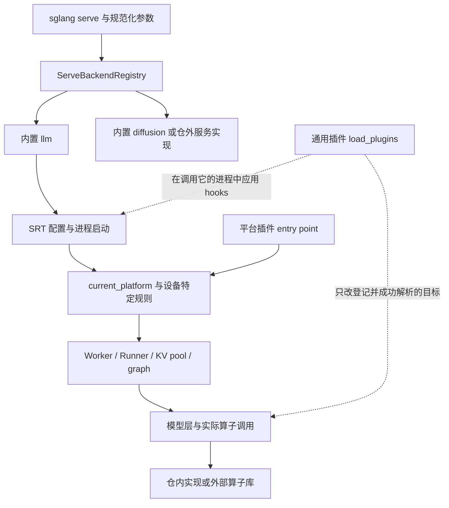
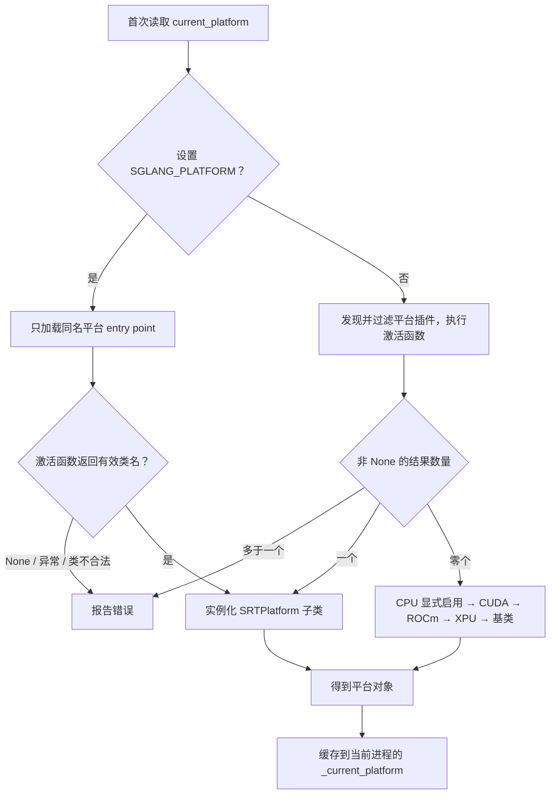
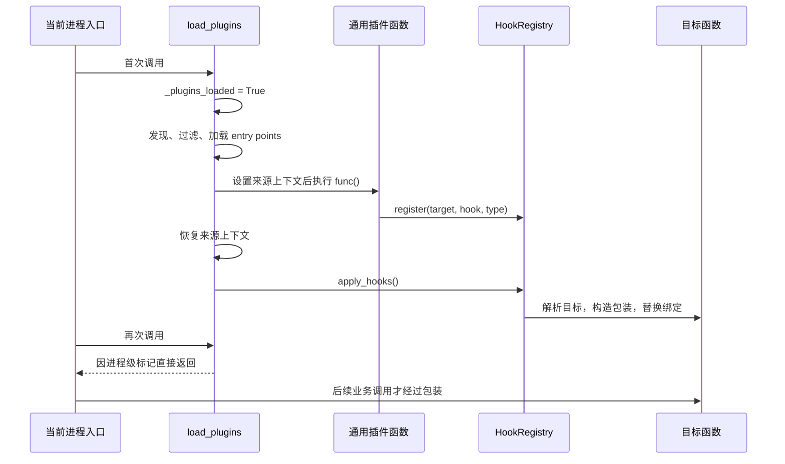

# 硬件后端插件与生态边界

> **先建立架构心智模型：** [M12 · DSL与Diffusion及插件边界](<../architecture/12-DSL与Diffusion及插件边界.md>)。先看职责、数据和生命周期，再回到本篇源码细节。

本文是**源码分析型学习资料**。从一条普通文本请求 R1 的服务启动出发，追踪“选择服务实现 → 确定平台和配置 → 创建执行组件 → 调用算子”的过程，再分别对照 CPU、MLX、NPU 和外部平台插件。

读完应能回答：**这个 backend 替换了哪一层，谁仍然负责调度和资源生命周期，看到哪个状态才算接入生效。**

## 0. 阅读基线与范围

| 项目 | 内容 |
| --- | --- |
| 源码路径基准 | SGLang 仓库根目录 `.`；所有源码位置均为仓内相对路径 |
| 读取工作区 | `sglang-source-study` 独立 Git worktree |
| 分支 | `codex/sglang-source-study-20260909`，基于官方 main |
| commit | `72d5c5bb73cadd7ffbf5114e5f81e29d36b6c61a` |
| 读取日期 | `2026-09-10` |
| 工作区状态 | 学习源码 worktree 干净；原源码工作区及 Wiki 其他资料保留 |
| 基础主线 | 内置 llm 服务、普通 Dense/MHA 模型、单实例、TP=1、PP=1，无 PD、投机、LoRA 和模型量化特例 |
| 教学负载 | R1 输入 8 个 token、期望生成 3 个 token；这里只说明路由和对象，不虚构输出或耗时 |
| 对照方式 | 每次单独换平台或接入方式；不把 CUDA、CPU、MLX、NPU 拼成一次混合部署 |
| 操作边界 | 只读源码、编写和静态检查文档；未安装插件或依赖、导入 SGLang、下载模型、启动服务、执行项目测试或使用加速器 |

前置：[01-03 启动](../01-getting-started/03-从CLI到服务进程启动.md)、[01-04 配置解析](../01-getting-started/04-从参数声明到最终生效配置.md)、[05 模型执行阶段](../README.md)及 [09 模型专题阶段](../README.md)。扩散生成的独立流程见 [12-02](02-Diffusion服务与生成流程入门.md) 与 [12-03](03-Diffusion并行缓存与性能地图.md)。

**证据标识：** 固定源码链接支持源码事实；职责图、例子与接入步骤是整理者归纳；本篇没有运行观察。外部项目主页只用于确认项目归属，不展开未固定外部 commit 的内部算法、性能或兼容性结论。本篇覆盖代表接入路径，不逐个认证所有设备和模型组合。

## 1. 人话版：先问“替换的是哪一层”

可以把服务想成一家处理订单的工厂：入口决定交给哪种工厂，平台决定工厂使用哪类设备，算子实现决定某道工序用哪套工具。通用 hook 则可以改写已有工序的入口或出口。它们有不同的控制范围。

| 名字 | 人话解释 | 本篇的控制边界 |
| --- | --- | --- |
| serve backend / 服务实现 | 接管一组命令参数，并运行一种服务 | 可以拥有自己的参数解析、进程结构、接口和硬件管理 |
| SRT platform / 平台对象 | SRT 用来询问设备身份、能力和部分组件工厂的对象 | 接入 SRT；不因换平台就自动换掉所有调度策略 |
| hardware backend / 硬件适配代码 | 设备特有的 worker、runner、Attention、缓存或辅助逻辑 | 是代码组织与实现范围，不是统一的第四种插件协议 |
| kernel backend / 算子实现来源 | 同一运算来自 AOT、JIT、Triton、Torch 或某个外部库 | 决定具体 callable，不负责服务生命周期 |
| entry point / 包入口登记 | 安装包声明“这个名字可以从哪个 Python 符号加载” | 发现元数据和导入模块是两步 |
| OOT / out of tree | 仓外扩展；平台代码还用 OOT 枚举触发专门分支 | 仓外包来源与 `is_out_of_tree()` 判断要分别核对 |
| hook / 挂钩 | 在原函数之前、之后、周围执行，或直接替换目标 | 可改变参数、结果甚至是否调用原实现 |
| dispatch / 分发 | 按名字、平台或输入条件选择执行函数 | 选择成功尚未证明函数对这组输入可运行 |

源码入口：[服务协议][S2]、[平台接口][S9]、[hook 类型与登记][S34]、[算子来源枚举][S86]。

### 1.1 三条边界放在同一张图里

**图意解读：** 方框表示职责层，不是一框一个进程；虚线表示可能的 hook 目标，不表示每次请求重新加载插件。仓外服务实现有自己的执行流程，不能从它的命令名推断一定经过图中的 SRT worker。扩散系统也不能直接套用本篇的 SRT 平台结论。[SRT 服务入口][S1]、[插件调用点][S31] [S32] [S33]。

### 1.2 三组 entry point，三份不同合同

| entry point group | 提供什么 | 选择方式 | 返回值或契约 |
| --- | --- | --- | --- |
| `sglang.serve_backends` | 无参数的服务工厂 | `--model-type`，或 detector 自动匹配 | 返回 `ServeBackend`；本基线 API version 为 1 |
| `sglang.srt.platforms` | 平台激活函数 | `SGLANG_PLATFORM` 指定名字，或自动发现 | 返回平台类的限定名称字符串；不适用可返回 None |
| `sglang.srt.plugins` | 通用插件函数 | `load_plugins()`，受过滤规则影响 | 通过副作用登记 hooks 等；返回值忽略 |

第一组的重复 provider、API 版本检查，不能直接当作后两组也具备的保证。平台和通用插件的当前实现按名字组织字典，不能用服务注册表的冲突处理规则替它们背书。[S3] [S4] [S6] [S28]

## 2. R1 启动第一步：选择哪种服务

### 2.1 从命令参数到 ServeRequest

**源码事实：** `serve()` 先提取 `--model-type`，把开头的位置模型参数规范化成 `--model-path`，再构造包含 `argv`、`model_path` 和位置参数标记的 `ServeRequest`。内置注册表包含 `llm` 与 `diffusion`。[S1]

用教学命令 `sglang serve MODEL --model-type llm` 表示显式选择：`MODEL` 是占位符，本文未执行此命令。R1 尚未进入系统，此时处理的是**服务启动参数**，不是 HTTP 请求。

注册表初始化先枚举包元数据；查看可用名字不等于已经导入外部实现。显式 `get(name)` 才加载所选 entry point、调用工厂、检查返回类型和 API 版本，再缓存已加载结果。[S3] [S4]

| 条件 | 当前行为 | 阅读时要分清 |
| --- | --- | --- |
| 名字不存在 | 显式选择报错 | 不是模型权重加载错误 |
| 外部包占用保留名或内置名 | 注册表构造时拒绝 | 不能用外部插件替换内置 llm 名称 |
| 同一外部名字有多个 provider | 选择该名字时拒绝 | 发现冲突与实际选择不是同一步 |
| 工厂失败、类型不对、API version 不匹配 | 显式加载报错 | 本基线期望版本 1 |
| 同一注册表再次获取已加载项 | 返回缓存项 | 缓存的是服务实现对象，不是模型输出 |

### 2.2 auto 不是“哪个 import 成功就用哪个”

自动检测遍历除 llm 外的候选服务，实现没有 detector 就不参加匹配。加载或探测异常记录日志并继续；只有 `MATCH` 计入匹配集合，`UNKNOWN` 不算匹配。结果恰好一个就采用；多个匹配报歧义错误；零匹配回到 llm。[S5]

因此，同一个坏插件可能在 auto 中被跳过，却在显式选择时导致失败。这个差异是注册表控制流，不能从一次 llm 回退推断该插件可用。[对应测试断言][S74]。

### 2.3 服务运行与清理的边界

帮助参数在正常加载通用插件之前走专门分支。普通启动调用 `load_plugins()`，随后在 `try/finally` 内选服务、检查所需模型路径并执行 `backend.run(request)`；finally 调用子进程清理。通用插件加载发生在这段 try 之前，不能把所有启动早期失败都说成经过同一个 finally。[S1]

服务合同要求 `run` 在服务存续期间阻塞，返回或抛异常后才结束这段运行边界；它不是“服务 ready 后立刻返回”的通知接口。外部 backend 可以声明不要求模型路径，也必须自行处理自己的帮助和参数。相同的 `sglang serve` 入口，不自动保证相同的 API、健康检查或停止语义。[S2]

## 3. 第二步：SRT 怎样确定平台并修正配置

### 3.1 current_platform 是进程内的懒初始化对象

第一次访问 `current_platform` 时，模块级 `__getattr__` 调用解析函数并存入 `_current_platform`；后续读取复用它。这里缓存的是平台实例。模块本身仍会导入依赖，不能把“懒初始化”理解为整个模块不做任何 import。[S7]

**图意解读：** 自动路径中插件加载或激活异常会记录并继续；得到选定类名后的类型解析仍可能失败。图中“有效”包含类名能解析且是 `SRTPlatform` 子类，不代表设备计算验证通过。CPU 优先级只发生在**没有激活外部平台插件**的内置回退阶段。[S6] [S8]

三个常见误读：

1. `SGLANG_PLATFORM` 匹配的是 **entry point 名字**。没有叫 cuda 的平台插件时，写 `SGLANG_PLATFORM=cuda` 不会被当作内置 CUDA 选择器。
2. 最终回到基类不等于启用了 CPU 推理。基类身份是 UNSPECIFIED，虽然默认 device type 字符串为 cpu；CPU engine 有独立启用条件。
3. `PlatformEnum` 中有某设备名字，不等于内置解析器存在它的完整自动路径。当前这个函数的内置回退只有 CPU、CUDA、ROCm、XPU；NPU、MPS、MUSA 等还要追到其他设备判断与适配代码。[S6] [S10] [S15]

### 3.2 同一个设备存在多套识别入口

`utils/common.py::get_device` 还按照 CPU engine、CUDA API 可用性、XPU、NPU、HPU、MUSA、MPS 等条件选择 device，最后才尝试平台对象。`is_cpu()` 要求 CPU engine 环境开关、支持的主机架构和 Torch CPU 可用；平台解析器的 CPU 回退判断本身只检查环境开关。[S15] [S16]

算子侧还有 `PlatformInfo.detect()` 和 `_platform_key()`，并不是同一个对象的别名。例如前者的实现检测 HIP、NPU、CUDA 等信息，后者还有 CPU AMX、XPU、MUSA 分支。排查“设备识别错了”时，要先说清是哪一个调用者的判断。[S87] [S88]

**整理者归纳：** 环境变量应在进程启动前固定，并记录各 worker 实际选择；不要期望处理 R1 后再改环境变量，就让已经缓存的平台、模块级标记和算子实例自动重建。

### 3.3 平台给默认值，配置流水线仍然继续

在硬件相关配置阶段，流水线依次处理 HPU、CPU、NPU、MPS、XPU 和对称内存设备约束，然后通过 `declare_direct_writes` 调用平台的 `apply_server_args_defaults`，记录这个外部方法直接改写的字段。之后还有内存、模型等规则；平台 hook 不是最终配置的唯一作者。[S17]

| 条件 | 本阶段源码行为 | 证据边界 |
| --- | --- | --- |
| device=cpu 且未指定 Attention backend | ARM 主机选 torch_native，其他主机选 intel_amx；sampling 设为 pytorch | 选择 intel_amx 字符串没有证明主机具备所需指令或依赖 [S18] |
| device=npu | 进入 NPU 默认配置；非 eager 的 prefill 编译选择被调整 | 仍须核对最终生效配置与 NPU 模型限制 [S19] |
| device=mps 且未启用 MLX | 禁用普通 overlap schedule | 不能据此说 MLX 也只能同步运行 [S20] |
| device=xpu | Decode graph 默认关闭；显式设置时仅 disabled/full 留在本规则允许范围 | 平台能力返回 true 不等于默认开启 graph [S21] |
| 设置 SGLANG_USE_MLX | 参数流水线调用运行环境校验 | 版本或设备不满足时可以在请求前失败 [S22] |

每行表示这段源码中的规则，不是所有后续规则执行后的完整兼容矩阵。最终值的追踪方法沿用 [01-04](../01-getting-started/04-从参数声明到最终生效配置.md)。

## 4. 第三步：平台接口究竟接管哪些对象

### 4.1 核心对象与寿命

| 对象 | 谁创建或登记 | 主要内容 | 生命周期与完成含义 |
| --- | --- | --- | --- |
| RegisteredServeBackend | 服务注册表 | 名字、包来源、ServeBackend | 注册表实例缓存；加载完成不等于服务 ready |
| current_platform | 当前进程首次访问时解析 | 设备身份、能力、组件工厂 | 进程内缓存；不属于 R1 |
| hook 登记与 patched 集合 | 通用插件和 HookRegistry | 目标、类型、函数、来源、已应用目标 | 进程级；成功替换不等于目标已执行 |
| KV pool / allocator | KVCacheConfigurator 经工厂创建 | KV 缓冲、物理 token 槽位分配接口 | runner 的长寿命资源；请求只占用其中一部分 |
| graph runner | 图捕获路径按平台或 device 选类 | 捕获与重放所需执行对象 | 初始化和图捕获有各自前提；类存在不等于已捕获 |
| BaseFusedOp 实例 | 算子模块或模型层 | backend 方法、能力条件、缓存的 forward | 实例级；缓存分发函数不等于缓存计算结果 |
| MLX 请求状态 | MlxModelRunner | 请求 token、采样信息、KV/辅助状态映射 | 按 rid 存取和清理；区别于持久 attention pool |

依据：[S4] [S7] [S35] [S23] [S25] [S26] [S40] [S63]。

### 4.2 用普通 MHA 模型走一次 OOT 组件选择

**源码事实：** 平台接口提供 MHA/MLA/DSA KV pool、paged allocator、graph runner、编译 backend 等工厂。但不是每条内置路径都无条件调用这些工厂。若基类方法抛 `NotImplementedError`，要同时检查其调用条件，不能据此断言内置 CUDA 无法运行。[S9]

将基础主线单独改成一个教学外部平台 Q，假设它正确报告 OOT，且已经实现所需工厂：

1. `_build_token_to_kv_pool` 先处理 DSV4 特例。对本文的普通模型，满足 OOT 且没有 mambaish 配置后，才按 MLA/DSA 等条件分支；普通 MHA 进入 `_build_oot_mha_kv_pool`。
2. 工厂取得 Q 返回的 pool 类，使用容量、页大小、dtype、KV head 数、head dim、层数和设备等实参创建 pool。
3. allocator 尚未创建且进入 OOT 路径时，再取得 Q 的 paged allocator 类，并把 token 容量、页大小、device 和上述 pool 传进去。
4. 若配置与模型条件允许进入 Decode graph 捕获，OOT 路径使用 Q 的 graph runner；内置路径则按 device 选择 CPU/NPU/XPU 等类和默认 runner。

源码锚点：[S23] [S24] [S25] [S26]。

Q 是教学符号，本文没有创建或安装这样的插件。上述条件中的“没有 mambaish 配置”不能删掉：否则会把普通 MHA 工厂路线错误推广到混合状态模型。

**控制权与数据流：** 平台返回“使用哪个类”，配置器负责实例化，allocator 管理物理槽位，调度与缓存代码仍决定 R1 何时入批、哪些槽位保留为前缀、何时允许回收。提供一个可写 KV buffer，并不自动获得整条请求的生命周期策略；替换实现必须满足这些调用接口和资源条件。相关主线见 [04-07](../04-kv-cache/07-KV缓存全生命周期与排障.md)。

### 4.3 init_backend 不要读成每次 forward 的回调

当前 `model_runner.py` 在模块级计算设备标记后，NPU 路径调用 `init_npu_backend()`，否则 OOT 路径调用 `current_platform.init_backend()`。这是模块导入阶段的副作用，不在 R1 的逐 token forward 内。[S27]

平台对象的惰性创建、模块导入、通用插件加载和 worker 初始化是相关但不同的时点。排查插件“加载晚了”时，要核对实际导入顺序与进程，而不是只看某处存在 `load_plugins()`。

### 4.4 一个外部平台包需要接齐什么

下面是依据接口与调用者归纳的接入清单，Q 仍为教学符号，不是已安装插件：

| 要交付的部分 | 为什么需要它 |
| --- | --- |
| 在 `sglang.srt.platforms` 登记 Q 的激活函数 | 使解析器能按名字发现、导入，并取得平台类名；不能只创建一个源码文件 |
| 提供合法的 SRTPlatform 子类与设备身份 | `is_out_of_tree()` 当前检查枚举是否为 OOT，不检查代码安装目录；希望使用 OOT 分支就要让身份与预期一致 |
| 实现所选模型路径需要的工厂和设备方法 | 普通 MHA pool、allocator、图执行等各有消费者和参数合同；不能用空方法只满足类定义 |
| 在适当初始化阶段接入实际算子 | 可以实现对应平台方法或登记精确 op 类的 OOT forward；仍需核对真实模型调用是否经过该入口 |
| 对已有逻辑确需改写时，再登记通用 hooks | 平台工厂与任意函数替换是不同接口；hook 目标、调用时点和返回值合同必须单独说明 |

依据：[平台解析与类检查][S6] [S8]、[身份判断][S10]、[接口与消费者][S9] [S23] [S25] [S26]、[算子登记][S43]、[通用插件][S30]。如果扩展需要完整接管服务参数、进程和 API，应先评估服务 backend 合同，而不是默认用 SRT hooks 拼接所有变化。

## 5. 通用插件：登记、应用与调用不是同一件事

### 5.1 先过滤，再加载，再执行，再应用

`load_plugins_by_group` 读取 entry point 元数据，按名字白名单和排除的 distribution 过滤后才执行 `ep.load()`。`SGLANG_PLUGINS` 的非空值按逗号拆成名字集合；空字符串不表示禁用全部插件。[S28]

这个函数同时用于自动发现平台插件，因此白名单也会影响**平台自动发现**；显式 `SGLANG_PLATFORM` 路径直接加载指定项，不经过这个白名单函数。服务 backend 使用自己的注册表，也不受这份函数内白名单自动管理。[S6] [S3]

指定平台时，`_get_excluded_dists` 收集“平台 entry point 名字不等于所选名字”的包来源，将这些 distribution 对应的通用插件排除。它比较的是包名集合，不能简单改写成“所有别的 entry point 都被隔离”；一个包登记多个平台名时也应按实际集合核对。[S29]

**图意解读：** 图画成功主线；插件执行异常会记录并继续，来源上下文在 finally 中恢复。标记在发现和执行之前就置为 true，后续再调用加载器不构成自动重试。应用某个目标失败会记录日志，其他目标仍可处理；已做的副作用没有事务回滚。[S30] [S35]

CLI、Engine 构造、Engine 子进程启动准备和 Scheduler 进程入口都有加载调用点；每个进程都有自己的 Python 状态。父进程日志不是所有 worker 均按相同顺序完成加载的证明。[S1] [S31] [S32] [S33]

### 5.2 四种 hook 的函数合同

| 类型 | hook 接收什么 | hook 返回什么 | 原函数是否执行 |
| --- | --- | --- | --- |
| BEFORE | 原 args、kwargs | None 保留参数；否则返回新的 (args, kwargs) | 随后执行 |
| AFTER | 原调用结果，再加该包装收到的 args、kwargs | None 保留原结果；其他值替换结果 | 先执行，抛异常时不会正常进入 AFTER |
| AROUND | 内层 callable，再加 args、kwargs | 最终返回值 | hook 自己决定是否调用内层 |
| REPLACE | args、kwargs；类替换时可直接给类 | 替代实现的结果或类 | 被替代的原逻辑不自动执行 |

依据：[S37]。其中 AFTER 的 None 是“保留原结果”，不能用它把非 None 结果改成 None。这套包装没有显式 await 逻辑，不能把同步返回边界当作异步任务已经完成的保证。

**教学例子，未执行插件：** 原函数 `f(x)=x+1`，依次登记 BEFORE“把 x 乘 2”、AFTER“结果加 3”。输入 4，调用顺序为 4 → 8 → 9 → 12。再加入 REPLACE“返回 10*x”，得到 4 → 8 → 80 → 83。

原因是同一个目标先按“REPLACE 在前、其他类型在后”稳定排序，再逐层包装；最后登记的非 REPLACE 包在外层。REPLACE 的登记位置不会把已有 BEFORE/AFTER 抹掉，但多个 REPLACE 最终由最后登记者生效。多个 AROUND 中，外层若不调用内层，内层 hooks 都可能被跳过。[S36]

源码测试使用自己的数字：原函数返回 x，REPLACE 乘 10，BEFORE 乘 2，AFTER 加 100；输入 3 断言为 160。本篇只阅读该断言，没有运行测试。[S79]

### 5.3 替换目标后的引用与撤销边界

应用顺序还会把**类 REPLACE 目标**排到其他目标之前，使后续方法查找有机会指向替换后的类。类目标仅允许 REPLACE；已存在的旧类实例不会因名字重绑定就自动变成新类实例。[S35] [S36]

函数替换后，`_propagate_patch` 扫描 `sys.modules` 中模块属性，把与旧对象满足 `is` 的绑定改成新对象。这能处理一部分 `from module import fn` 的旧绑定；它不递归改写闭包、容器、实例或所有已缓存 callable。[S38]

最后看清两份状态：

| 状态 | 意味着什么 | 不意味着什么 |
| --- | --- | --- |
| target 在 `_patched` 中 | 该目标已成功走完本轮应用函数 | 新登记的 hook 会自动重新包装它 |
| `HookRegistry.reset()` 清空登记和 patched 集合 | 可以重新建立登记状态 | 已替换函数、类和模块绑定已恢复原样 |

`reset()` 的函数体只有两次 clear，没有保存和恢复原对象的动作。本文因此不把它当作运行中的卸载接口；要比较两套插件配置，应使用独立的新进程和独立记录，避免把旧包装带入对照。[S39]

## 6. 第四步：沿实际调用找到算子实现

### 6.1 算子来源和硬件身份分开读

`KernelBackend` 表达 AOT、JIT、Torch、Triton、AITER、torch_npu 等**实现来源**。AOT 表示预先编译的实现，JIT 表示运行环境中按需编译的实现；它们不是 CUDA 和 ROCm 的同义词。设备能力另由 capability 条件判断。[S86] [S87]

当前存在两类分发机制：

| 入口 | 怎么选择 | 关键边界 |
| --- | --- | --- |
| `select_kernel(op, backend)` | 指定 backend 则按登记项找；只有一个登记项直接返回；多个时按平台过滤，恰好一个才能自动返回 | 多个仍可用时要求调用者指定，不按性能优先级排名；显式选择和单登记项路径不执行该多项平台过滤 [S45] |
| `BaseFusedOp.forward` | 显式调用参数 → 全局强制选择 → 缓存的自动分发；自动分发可包含 OOT、优先级与平台方法 | 是否有输入 shape/dtype 的逐次检查，取决于子类是否提供相应判断 [S42] [S41] [S44] |

`get_kernel` 缓存解析到的 callable，不缓存它处理 R1 后的 tensor 结果。[S46]

### 6.2 BaseFusedOp 的 OOT 与回退条件

常规自动解析在 OOT 平台上先取 dispatch key，再按**平台 key + 精确 op 类**寻找已登记的 forward；找到则绑定到实例。没有登记项时寻找对应平台方法，再没有就返回 native。这个 OOT 分支选到 native 后，不继续尝试后面的内置优化优先级。[S43] [S41]

非 OOT 路径可根据候选优先级和 capability 选优化方法；若子类覆盖 `backend_eligible`，就保留逐调用判断输入条件的动态分发，否则可以缓存静态方法。只有知道**真实 op 类及其实参**，才能判定某个输入最终走哪里。

以下回退边界尤其重要：

- 调用者显式传 `backend=` 时，直接执行指定方法；不是先逐项证明设备和 shape 合法，再保证成功。
- 全局强制 backend 是尽力选择，但只捕获 `NotImplementedError` 后退回常规分发；一般 ImportError、设备异常或其他 RuntimeError 不会由这段逻辑自动兜底。
- 自动选中的实现一旦执行报错，这段 forward 也没有“捕获所有错误、继续试下一个库”的通用机制。[S42]

### 6.3 一个 RMSNorm 例子，两条真实入口

**人话版：** RMSNorm 对每行特征计算一个缩放因子，再乘权重。为了说明接口，假设 R1 在某层有 `[8,H]` 的输入和 `[H]` 的权重；H 是教学隐藏维度符号，不指定真实模型。

公共算子 `kernels/ops/layernorm` 中，`rmsnorm` 调用模块级 `RMSNormOp` 实例。该类有 Torch reference、AOT、JIT、AITER、torch_npu 方法；AOT 方法调用外部 `sgl_kernel.rmsnorm`，JIT 方法调用仓内 norm 模块。native 路径转 fp32 计算均方、缩放并乘权重，再转回输入 dtype；传入 out 时写入并返回 out。[S48] [S47]

但本基线 SRT 模型层的 `RMSNorm` 是**另一个类**。其 `forward_cuda` 先处理空输入、variance override、确定性路径、融合量化等条件；在本文限定的普通、无 residual、无特殊 cast 路径，调用本模块导入的 `rmsnorm`。这个导入来自 `sgl_kernel`，不能只因公共 API 有同名函数，就把模型层调用画成必然经过 `RMSNormOp`。[S49] [S50] [S85]

| 本文限定的步骤 | 控制或数据变化 | 结束后还要检查什么 |
| --- | --- | --- |
| SRT RMSNorm 对象初始化 | 保存 weight、eps 和特例标记；某些条件可直接设置 forward | 是否有 force_native、AITER 等覆盖 |
| BaseFusedOp 分发 | 选择该类的实际方法 | 选中 forward_cuda 不等于每个分支都调用同一 kernel |
| 普通 CUDA 无 residual 路径 | 将输入和 weight 交给已导入的 rmsnorm | dtype、shape、外部库版本、输出语义 |
| 返回结果给模型层 | 后续模型计算使用归一化 tensor | R1 的请求结束与 KV 回收由上层处理 |
| 单独研究公共 RMSNormOp | 可对照 native/AOT/JIT 等方法合同 | 这是另一条调用入口，不能冒充上一行的实测执行链 |

表格是源码主线的整理，不表示本次执行了 RMSNorm。对于带 residual 的路径，还要区分原位修改和多返回值；不能把无 residual 的输出所有权直接搬过去。平台接入时，应优先检查实际模型 import 与调用，而不是按目录名猜测“已经统一分发”。

## 7. 逐个换平台，观察接管范围

### 7.1 CUDA、ROCm、XPU 与 CPU

| 路线 | 本基线的代表入口 | 能确认的事实 | 仍需具体环境验证 |
| --- | --- | --- | --- |
| CUDA | CudaSRTPlatform、Torch CUDA 设备操作、各模型/算子分支 | 平台能力方法声明支持 FP8 和图相关能力 | 每个设备架构、算子、dtype 和模型组合 |
| ROCm | RocmDeviceMixin、旧 is_hip 分支、AITER 等实现 | 该 mixin 继承 CUDA 设备操作接口，device type 仍为 cuda | 不可用 capability 默认值代替全部 AMD 调用点判断 |
| XPU | XpuSRTPlatform、XPU 参数规则、XPUGraphRunner | 平台图能力与参数默认关闭图可以同时存在 | 显式 full graph、具体模型与算子 |
| CPU | CpuDeviceMixin、CPU engine、CPU Attention 和采样规则 | CPU 回退需显式启用；ARM 与非 ARM 默认选择不同 | 指令集、依赖、线程/NUMA、模型内存和实际速度 |

依据：[S12] [S13] [S14] [S21] [S11] [S18]。

CPU 还有一个观测陷阱：`CpuDeviceMixin.get_current_memory_usage` 使用整机 `total - available`，不是 SGLang 进程 RSS，也不是该进程峰值。其 `empty_cache` 调用 Python GC，不代表操作系统立刻归还全部内存。把这类设备抽象方法用于比较内存时，必须保留统计口径。[S11]

### 7.2 MLX：保留调度衔接，换实际模型执行与缓存适配

MLX 路线由 `SGLANG_USE_MLX` 显式启用。`use_mlx()` 和运行校验有缓存；启用时要求 stable Torch **2.13.x**、stable MLX **至少 0.32.0**，并分别检查 PyTorch MPS 与 MLX Metal 可用。预发布版本不满足此处稳定版门槛。这些数字来自固定代码的检查，不是对当前安装环境的检测报告。[S52] [S53]

一条 MLX 版 R1 可按下面顺序阅读：

1. Scheduler 选择 `MlxTpModelWorker`。普通非 PD、非 PP 等前置分支下，MLX overlap 有自己的 event loop 选择；不能把它和普通 CUDA overlap 合并成同一机制。[S54] [S55]
2. worker 创建实际 `MlxModelRunner`，再建立衔接 SRT 请求槽位和 pool 接口的 stub；首次需要时初始化 MLX pool。stub 是适配对象，不是负责真实模型 forward 的 runner。[S56] [S57]
3. 模型加载先解析指定 revision 对应的目录，检查该目录的 remote-code 条件，再把**同一个目录**交给外部 mlx-lm loader。外部包和权重 revision 都需要另外固定。[S61] [S84]
4. runner 修改模型 Attention 接入并识别缓存布局；没有支持的 Attention 层会失败，带辅助状态但没有 make_cache 会失败，当前辅助状态与滑动窗口组合还存在显式拒绝条件。版本门槛通过不等于模型适配完成。[S89]
5. worker 提交 lazy 输出；Decode 使用 `mx.async_eval`，finalize 在特定结果上通过 `.tolist()` 等等待求值，再组装 SRT 的结果对象。禁用 overlap 的同步路径也复用 launch + finalize，只是紧接着完成两步。[S58] [S60] [S59] [S62]

**R1 的状态账本：**

| 时点 | 数据或状态 | 就绪与释放边界 |
| --- | --- | --- |
| worker/pool 初始化 | 长寿命模型与 pool 接口 | 不属于 R1 的一次输出 |
| launch 返回 | MlxLaunch、pending、lazy token 数组 | 返回 pending 不等于 token 已成为普通 Python 整数 |
| finalize 完成 | 物化 token，并更新对应 rid 的 token 记录 | 本轮结果可交给上层；不是整个请求状态都已清空 |
| 请求准备缓存收尾 | prepare_for_kv_cache_release 可快照辅助状态 | 为 Scheduler 的 radix 插入衔接状态 |
| 清除陈旧 rid | Decode batch 对比 active rid，调用 remove_request | radix 启用时先同步剩余 Decode KV，再移除映射并释放请求缓存 |
| runner clear | 清理所有请求映射、缓存以及 attention pool | 与单请求 remove 的范围不同 |

依据：[S58] [S62] [S66] [S65] [S63] [S64]。表格只说明这些实际入口的顺序和职责，没有证明所有取消、跨批与异常分支的运行安全性；需要专门验证时，接续 [02-06](../02-request-lifecycle/06-完成取消与资源释放.md) 和对应 MLX 测试。

### 7.3 NPU：专用配置、模块初始化和算子库

NPU 并不需要先被假想成内置 `NpuSRTPlatform` 才能理解。当前已有 device=npu 的配置规则、NPU Attention/pool/graph 路径和 `hardware_backend/npu` 适配。普通 MHA pool 选择中，ascend Attention 是 OOT 分支之外的另一组条件。[S19] [S23] [S26]

配置函数把通用、Prefill、Decode Attention backend 声明为 ascend；page_size 未给时设为 128，还按设备内存处理部分设置。这是固定代码规则，不是本文推荐所有 NPU 配置都手动填 128。[S68]

`init_npu_backend` 的步骤也有不同错误边界：

- 尝试导入 custom_ops 和 sgl_kernel_npu，ImportError 在这里记录 warning。
- 随后导入 torch_npu；不在上述可选导入的异常保护中。
- 未加载 multimodal_gen 模块时，使用 transfer_to_npu 相关适配，并重设 CUDA 可用性检查和内部格式开关。
- 设置 NPU 编译模式；SRT RMSNorm 的 NPU 方法可直接调用 torch_npu 运算。[S67] [S51]

所以“可选包导入失败只报警”不等于后续所有 kernel 都能自动走 Torch fallback。其他模块仍可能硬性依赖该包；需要追到真实消费者，而不是只看初始化日志。

独立 `.so` 接入可从 `TorchOpLoader` 学起：

| 步骤 | 检查内容 | 未证明的内容 |
| --- | --- | --- |
| 先检查 required_ops | torch.ops 命名空间是否已经有要求的名字 | 已登记运算的数值正确性 |
| 预加载依赖 | 按 OpLibSpec 的 pre_load_imports 导入 | 所有设备运行库都匹配 |
| 解析库路径 | 从指定环境变量取路径，要求文件存在 | 当前函数没有注释所暗示的通用默认目录搜索 |
| 检查 Python ABI 标签 | 文件名含 cpython 标签时比较 Python 主次版本 | Torch、CANN、驱动和其他二进制 ABI 全部兼容 |
| load_library 后再查 required_ops | 要求符号存在，成功后保存加载路径 | 实际执行、输出精度、异步错误和释放正确 |

依据：[S69] [S71] [S72] [S70]。已注册时 initialize 返回 None；这表示本次不需要再加载，不能反推出它具体来自哪个构建产物。

## 8. 仓内源码、安装依赖与外部项目分别固定

| 对象 | 本篇读到了什么 | 版本怎样记录 |
| --- | --- | --- |
| SGLang 仓内 platforms/plugins/hardware_backend/kernels | 上述固定 commit 的接口、分支和调用者 | 由本文 SHA 固定 |
| Python 安装依赖 | pyproject 声明 `sglang-kernel==0.4.6.post1`；模型层调用的导入名可为 sgl_kernel | 声明版本是预期依赖；实际 wheel、构建、环境需另取证 [S83] [S85] |
| mlx-lm | 仓内 runner 调用外部 loader/量化入口 | 另记录包版本或外部 commit、模型 revision；不能认为被 SGLang SHA 固定 [S61] |
| torch_npu、sgl_kernel_npu 与独立 .so | 仓内初始化、调用或加载检查 | 分别记录包/构建与依赖环境；文件可加载不代表兼容全部运算 [S67] [S70] |
| 仓外服务或平台插件 | entry point、工厂接口、hook 目标与调用条件 | 另记录 distribution 版本、源 commit、插件目标与生效结果 |
| SGLang-JAX | 独立项目的官方入口 | 需要独立源码基线；不能把本系列 PyTorch SRT 调用链直接迁过去 |

外部来源边界：2026-09-10 阅读 [MLX LM 官方仓库](https://github.com/ml-explore/mlx-lm)，仅用于确认其是用 MLX 运行语言模型的独立包；阅读 [SGLang-JAX 官方仓库](https://github.com/sgl-project/sglang-jax)，仅用于确认独立的 JAX/TPU 推理项目定位。本篇未下载并固定这两个项目的源码，因而不展开其调度、缓存实现或性能结论。

**整理者归纳：** 完成一次平台接入的证据应逐层累积：能发现名字 → 能加载接口 → 配置解析正确 → 组件创建成功 → 真实模型调用落到预期实现 → 输出/取消/释放验证 → 在固定负载下测量。前一个状态不能替代后一个状态；无需把所有平台都运行一遍，先选业务实际需要的一条路线。

## 9. 从症状回到选择边界

| 症状 | 先核对什么 | 源码位置 |
| --- | --- | --- |
| --model-type 名字能列出，显式启动失败 | provider 冲突、工厂异常、返回类型、API version | [S4] |
| auto 回到 llm，但指定插件会失败 | detector 是否 UNKNOWN/异常，是否真正 MATCH | [S5] [S74] |
| SGLANG_PLATFORM=cuda 报未发现 | cuda 是否确为已登记的平台 entry point 名字 | [S6] |
| 多个设备包安装后平台歧义 | 激活结果数量、指定平台名与包来源 | [S6] |
| 插件已加载日志有了，改写却未生效 | register/apply 目标、错误日志、来源、目标是否早已 patched | [S30] [S35] |
| 调用 reset 后行为仍是旧 hook | reset 只清集合，目标绑定是否仍被包装 | [S39] [S38] |
| 换平台后 KV pool 或 graph 工厂抛异常 | 是否进入 OOT，所需工厂是否实现，前置模型分支 | [S23] [S26] |
| 强制 kernel backend 仍报 ImportError | 此处只对 NotImplementedError 做常规回退 | [S42] |
| RMSNorm 的实际库与预期不同 | 真实模型层的 import、类、forward 分支和特例 | [S50] [S47] |
| CPU 的“当前内存”随其他程序变化 | 统计是否为整机 total-available | [S11] |
| MLX 启动前被拒绝 | 稳定版本门槛、Torch MPS、MLX Metal、模型 cache layout | [S53] [S89] |
| MLX pending 已返回却没有可读 token | lazy 提交与 finalize 是否完成，具体 rid 是否对应 | [S58] [S62] |
| NPU .so 存在仍无法用 | 路径、Python ABI、依赖库、命名空间、required_ops | [S71] [S72] [S70] |

这些是定位问题的索引，不是已复现故障。性能和内存排查应继续使用 [11 阶段](../README.md) 的工作负载与证据口径。

## 10. 阅读路线、练习与验证记录

### 10.1 建议的源码锚点

以下从入口到消费者排列。路径都从 SGLang 仓库根目录起算；不要只读抽象接口而跳过调用条件。

| 要理解的行为 | 仓内文件与符号 |
| --- | --- |
| 服务入口与生命周期 | [`python/sglang/cli/serve.py::serve`][S1] |
| 外部服务加载与错误 | [`python/sglang/cli/serve_backends.py::ServeBackendRegistry.get`][S4] |
| 自动选择与回退 | [`python/sglang/cli/serve_backends.py::ServeBackendRegistry.auto_detect`][S5] |
| 平台激活与内置回退 | [`python/sglang/srt/platforms/__init__.py::_resolve_platform`][S6] |
| 平台接口与组件工厂 | [`python/sglang/srt/platforms/interface.py::SRTPlatform`][S9] |
| 硬件配置流水线 | [`python/sglang/srt/arg_groups/pipeline.py::run_resolution_pipeline`][S17] |
| KV pool 选择与模型条件 | [`python/sglang/srt/mem_cache/kv_cache_configurator.py::KVCacheConfigurator._build_token_to_kv_pool`][S23] |
| OOT MHA pool 构造 | [`python/sglang/srt/mem_cache/kv_cache_configurator.py::KVCacheConfigurator._build_oot_mha_kv_pool`][S24] |
| allocator 接口 | [`python/sglang/srt/mem_cache/kv_cache_configurator.py::KVCacheConfigurator._build_token_to_kv_pool_allocator`][S25] |
| Decode graph 工厂 | [`python/sglang/srt/model_executor/model_runner_components/cuda_graph_setup.py::capture_decode_graph`][S26] |
| 通用插件过滤 | [`python/sglang/srt/plugins/__init__.py::load_plugins_by_group`][S28] |
| 通用插件进程级加载 | [`python/sglang/srt/plugins/__init__.py::load_plugins`][S30] |
| 目标登记、顺序与应用 | [`python/sglang/srt/plugins/hook_registry.py::HookRegistry._apply_target`][S36] |
| 四类包装的实参和返回值 | [`python/sglang/srt/plugins/hook_registry.py::_wrap_fn`][S37] |
| 模块引用传播 | [`python/sglang/srt/plugins/hook_registry.py::_propagate_patch`][S38] |
| reset 边界 | [`python/sglang/srt/plugins/hook_registry.py::HookRegistry.reset`][S39] |
| 算子选择器 | [`python/sglang/kernels/selector.py::select_kernel`][S45] |
| FusedOp 实际分发 | [`python/sglang/kernels/fused_op.py::BaseFusedOp.forward`][S42] |
| 公共 RMSNorm 实现 | [`python/sglang/kernels/ops/layernorm/__init__.py::RMSNormOp`][S47] |
| SRT 模型层的 CUDA 路径 | [`python/sglang/srt/layers/layernorm.py::RMSNorm.forward_cuda`][S50] |
| MLX 启用与版本门槛 | [`python/sglang/srt/hardware_backend/mlx/runtime.py::_validate_runtime`][S53] |
| MLX worker 和 stub 初始化 | [`python/sglang/srt/hardware_backend/mlx/tp_worker.py::MlxTpModelWorker._init_model_runner`][S56] |
| MLX pending 提交 | [`python/sglang/srt/hardware_backend/mlx/tp_worker.py::MlxTpModelWorker.async_forward_batch_generation_mlx`][S58] |
| MLX 结果物化 | [`python/sglang/srt/hardware_backend/mlx/tp_worker.py::MlxTpModelWorker.finalize_mlx_result`][S60] |
| MLX 请求清理 | [`python/sglang/srt/hardware_backend/mlx/model_runner.py::MlxModelRunner.remove_request`][S63] |
| NPU 初始化 | [`python/sglang/srt/hardware_backend/npu/utils.py::init_npu_backend`][S67] |
| 独立算子库加载 | [`python/sglang/srt/hardware_backend/npu/extra_ops_loader.py::TorchOpLoader.initialize`][S70] |

### 10.2 有测试入口，本次未执行

| 已阅读的测试与断言 | 证明范围若实际通过 | 不能据此证明 |
| --- | --- | --- |
| 服务显式选择只加载所选 provider；坏可选项不阻断 auto 回退 [S73] [S74] | mock 注册表的加载与选择逻辑 | 外部服务能启动或接口兼容 |
| CPU 显式启用胜过 CUDA 回退；多个激活平台报错 [S75] [S76] | mock 平台解析分支 | CPU/GPU 的实际计算 |
| 通用插件加载幂等、白名单过滤 [S77] [S78] | 测试进程内的加载逻辑 | 所有 worker import 顺序一致 |
| REPLACE/BEFORE/AFTER 得到 160；同一模块引用传播 [S79] [S80] | 示例 hook 顺序、特定模块绑定更新 | 任意闭包/实例更新与运行中卸载 |
| MLX 不合版本被拒绝、任一 Metal 设备不可用报错 [S81] [S82] | mock 版本和设备门槛 | 真实模型精度、延迟和缓存生命周期 |

测试本身有依赖、部分 MLX 用例有设备条件；存在测试文件不等于本机可以直接运行，也不等于本篇已运行。

### 10.3 能检验理解的练习

1. auto 返回 llm，显式选择一个外部 backend 却 ImportError，是否矛盾？写出自动和显式路径的异常处理差异。
2. 没有外部平台激活，同时 CPU engine 开启且 CUDA 可用，当前平台回退到谁？若外部平台 Q 已激活，CPU 优先级还适用吗？
3. 同一个目标依次登记 BEFORE 乘 2、AFTER 加 3、REPLACE 乘 10，输入 4 得到多少？外层 AROUND 不调用 inner 时会怎样？
4. 为什么能创建 MHA pool 不能证明 R1 取消后槽位已经安全复用？列出工厂、allocator、调度与缓存策略的职责。
5. 强制某个算子 backend 后缺少外部包，这段 BaseFusedOp 是否保证 native 回退？写出它真正捕获的异常类型。
6. MLX 版本门槛通过、pending 返回、finalize 完成和 remove_request 分别改变什么？哪些是进程级，哪些是请求级？
7. 为什么 SGLang 的 commit 不能固定 mlx-lm、NPU .so 或 SGLang-JAX 的全部实现？

**自检要点：** 1 看 detector/加载异常的容错与显式严格选择；2 仅零插件时 CPU 优先；3 为 83，AROUND 可截断内层；4 组件接口不拥有全部生命周期策略；5 仅 NotImplementedError；6 平台/运行环境与 rid/lazy 结果分开；7 各自具有独立版本和构建来源。

### 10.4 本篇完成的检查与未完成的运行证据

本篇完成固定源码阅读、关键函数与路径复查、三张 Mermaid 的静态一致性核对，以及文档链接、表格、基线和变更范围检查。hook 数字例子按函数合同手工推导；图未在硬件环境中验证，也没有用示例输出充当实测。

实际接入验证时，应在[实验记录附录](../appendices/05-实验记录与证据模板.md)记录：主仓与外部包版本、每个 worker 的插件/平台选择、最终配置、实际 op 类和分发路径、模型与 dtype、输入输出、取消与回收结果、原始日志，以及测试执行和跳过状态。

下一篇为 [12-05《从需求到源码与验证的综合案例》](05-从需求到源码与验证的综合案例.md)。返回[系列目录](../README.md)。

[S1]: https://github.com/sgl-project/sglang/blob/72d5c5bb73cadd7ffbf5114e5f81e29d36b6c61a/python/sglang/cli/serve.py#L166
[S2]: https://github.com/sgl-project/sglang/blob/72d5c5bb73cadd7ffbf5114e5f81e29d36b6c61a/python/sglang/cli/serve_backends.py#L50
[S3]: https://github.com/sgl-project/sglang/blob/72d5c5bb73cadd7ffbf5114e5f81e29d36b6c61a/python/sglang/cli/serve_backends.py#L82
[S4]: https://github.com/sgl-project/sglang/blob/72d5c5bb73cadd7ffbf5114e5f81e29d36b6c61a/python/sglang/cli/serve_backends.py#L119
[S5]: https://github.com/sgl-project/sglang/blob/72d5c5bb73cadd7ffbf5114e5f81e29d36b6c61a/python/sglang/cli/serve_backends.py#L173
[S6]: https://github.com/sgl-project/sglang/blob/72d5c5bb73cadd7ffbf5114e5f81e29d36b6c61a/python/sglang/srt/platforms/__init__.py#L49
[S7]: https://github.com/sgl-project/sglang/blob/72d5c5bb73cadd7ffbf5114e5f81e29d36b6c61a/python/sglang/srt/platforms/__init__.py#L166
[S8]: https://github.com/sgl-project/sglang/blob/72d5c5bb73cadd7ffbf5114e5f81e29d36b6c61a/python/sglang/srt/platforms/__init__.py#L153
[S9]: https://github.com/sgl-project/sglang/blob/72d5c5bb73cadd7ffbf5114e5f81e29d36b6c61a/python/sglang/srt/platforms/interface.py#L26
[S10]: https://github.com/sgl-project/sglang/blob/72d5c5bb73cadd7ffbf5114e5f81e29d36b6c61a/python/sglang/srt/platforms/device_mixin.py#L96
[S11]: https://github.com/sgl-project/sglang/blob/72d5c5bb73cadd7ffbf5114e5f81e29d36b6c61a/python/sglang/srt/platforms/cpu.py#L20
[S12]: https://github.com/sgl-project/sglang/blob/72d5c5bb73cadd7ffbf5114e5f81e29d36b6c61a/python/sglang/srt/platforms/cuda.py#L103
[S13]: https://github.com/sgl-project/sglang/blob/72d5c5bb73cadd7ffbf5114e5f81e29d36b6c61a/python/sglang/srt/platforms/rocm.py#L14
[S14]: https://github.com/sgl-project/sglang/blob/72d5c5bb73cadd7ffbf5114e5f81e29d36b6c61a/python/sglang/srt/platforms/xpu.py#L94
[S15]: https://github.com/sgl-project/sglang/blob/72d5c5bb73cadd7ffbf5114e5f81e29d36b6c61a/python/sglang/srt/utils/common.py#L884
[S16]: https://github.com/sgl-project/sglang/blob/72d5c5bb73cadd7ffbf5114e5f81e29d36b6c61a/python/sglang/srt/utils/common.py#L218
[S17]: https://github.com/sgl-project/sglang/blob/72d5c5bb73cadd7ffbf5114e5f81e29d36b6c61a/python/sglang/srt/arg_groups/pipeline.py#L26
[S18]: https://github.com/sgl-project/sglang/blob/72d5c5bb73cadd7ffbf5114e5f81e29d36b6c61a/python/sglang/srt/arg_groups/platform_hook.py#L133
[S19]: https://github.com/sgl-project/sglang/blob/72d5c5bb73cadd7ffbf5114e5f81e29d36b6c61a/python/sglang/srt/arg_groups/platform_hook.py#L30
[S20]: https://github.com/sgl-project/sglang/blob/72d5c5bb73cadd7ffbf5114e5f81e29d36b6c61a/python/sglang/srt/arg_groups/platform_hook.py#L52
[S21]: https://github.com/sgl-project/sglang/blob/72d5c5bb73cadd7ffbf5114e5f81e29d36b6c61a/python/sglang/srt/arg_groups/platform_hook.py#L101
[S22]: https://github.com/sgl-project/sglang/blob/72d5c5bb73cadd7ffbf5114e5f81e29d36b6c61a/python/sglang/srt/arg_groups/platform_hook.py#L22
[S23]: https://github.com/sgl-project/sglang/blob/72d5c5bb73cadd7ffbf5114e5f81e29d36b6c61a/python/sglang/srt/mem_cache/kv_cache_configurator.py#L1187
[S24]: https://github.com/sgl-project/sglang/blob/72d5c5bb73cadd7ffbf5114e5f81e29d36b6c61a/python/sglang/srt/mem_cache/kv_cache_configurator.py#L1427
[S25]: https://github.com/sgl-project/sglang/blob/72d5c5bb73cadd7ffbf5114e5f81e29d36b6c61a/python/sglang/srt/mem_cache/kv_cache_configurator.py#L1965
[S26]: https://github.com/sgl-project/sglang/blob/72d5c5bb73cadd7ffbf5114e5f81e29d36b6c61a/python/sglang/srt/model_executor/model_runner_components/cuda_graph_setup.py#L514
[S27]: https://github.com/sgl-project/sglang/blob/72d5c5bb73cadd7ffbf5114e5f81e29d36b6c61a/python/sglang/srt/model_executor/model_runner.py#L242
[S28]: https://github.com/sgl-project/sglang/blob/72d5c5bb73cadd7ffbf5114e5f81e29d36b6c61a/python/sglang/srt/plugins/__init__.py#L35
[S29]: https://github.com/sgl-project/sglang/blob/72d5c5bb73cadd7ffbf5114e5f81e29d36b6c61a/python/sglang/srt/plugins/__init__.py#L89
[S30]: https://github.com/sgl-project/sglang/blob/72d5c5bb73cadd7ffbf5114e5f81e29d36b6c61a/python/sglang/srt/plugins/__init__.py#L103
[S31]: https://github.com/sgl-project/sglang/blob/72d5c5bb73cadd7ffbf5114e5f81e29d36b6c61a/python/sglang/srt/entrypoints/engine.py#L246
[S32]: https://github.com/sgl-project/sglang/blob/72d5c5bb73cadd7ffbf5114e5f81e29d36b6c61a/python/sglang/srt/entrypoints/engine.py#L1050
[S33]: https://github.com/sgl-project/sglang/blob/72d5c5bb73cadd7ffbf5114e5f81e29d36b6c61a/python/sglang/srt/managers/scheduler.py#L5744
[S34]: https://github.com/sgl-project/sglang/blob/72d5c5bb73cadd7ffbf5114e5f81e29d36b6c61a/python/sglang/srt/plugins/hook_registry.py#L84
[S35]: https://github.com/sgl-project/sglang/blob/72d5c5bb73cadd7ffbf5114e5f81e29d36b6c61a/python/sglang/srt/plugins/hook_registry.py#L146
[S36]: https://github.com/sgl-project/sglang/blob/72d5c5bb73cadd7ffbf5114e5f81e29d36b6c61a/python/sglang/srt/plugins/hook_registry.py#L182
[S37]: https://github.com/sgl-project/sglang/blob/72d5c5bb73cadd7ffbf5114e5f81e29d36b6c61a/python/sglang/srt/plugins/hook_registry.py#L350
[S38]: https://github.com/sgl-project/sglang/blob/72d5c5bb73cadd7ffbf5114e5f81e29d36b6c61a/python/sglang/srt/plugins/hook_registry.py#L320
[S39]: https://github.com/sgl-project/sglang/blob/72d5c5bb73cadd7ffbf5114e5f81e29d36b6c61a/python/sglang/srt/plugins/hook_registry.py#L314
[S40]: https://github.com/sgl-project/sglang/blob/72d5c5bb73cadd7ffbf5114e5f81e29d36b6c61a/python/sglang/kernels/fused_op.py#L395
[S41]: https://github.com/sgl-project/sglang/blob/72d5c5bb73cadd7ffbf5114e5f81e29d36b6c61a/python/sglang/kernels/fused_op.py#L538
[S42]: https://github.com/sgl-project/sglang/blob/72d5c5bb73cadd7ffbf5114e5f81e29d36b6c61a/python/sglang/kernels/fused_op.py#L630
[S43]: https://github.com/sgl-project/sglang/blob/72d5c5bb73cadd7ffbf5114e5f81e29d36b6c61a/python/sglang/kernels/fused_op.py#L388
[S44]: https://github.com/sgl-project/sglang/blob/72d5c5bb73cadd7ffbf5114e5f81e29d36b6c61a/python/sglang/kernels/fused_op.py#L569
[S45]: https://github.com/sgl-project/sglang/blob/72d5c5bb73cadd7ffbf5114e5f81e29d36b6c61a/python/sglang/kernels/selector.py#L38
[S46]: https://github.com/sgl-project/sglang/blob/72d5c5bb73cadd7ffbf5114e5f81e29d36b6c61a/python/sglang/kernels/selector.py#L92
[S47]: https://github.com/sgl-project/sglang/blob/72d5c5bb73cadd7ffbf5114e5f81e29d36b6c61a/python/sglang/kernels/ops/layernorm/__init__.py#L49
[S48]: https://github.com/sgl-project/sglang/blob/72d5c5bb73cadd7ffbf5114e5f81e29d36b6c61a/python/sglang/kernels/ops/layernorm/__init__.py#L452
[S49]: https://github.com/sgl-project/sglang/blob/72d5c5bb73cadd7ffbf5114e5f81e29d36b6c61a/python/sglang/srt/layers/layernorm.py#L439
[S50]: https://github.com/sgl-project/sglang/blob/72d5c5bb73cadd7ffbf5114e5f81e29d36b6c61a/python/sglang/srt/layers/layernorm.py#L490
[S51]: https://github.com/sgl-project/sglang/blob/72d5c5bb73cadd7ffbf5114e5f81e29d36b6c61a/python/sglang/srt/layers/layernorm.py#L611
[S52]: https://github.com/sgl-project/sglang/blob/72d5c5bb73cadd7ffbf5114e5f81e29d36b6c61a/python/sglang/srt/hardware_backend/mlx/runtime.py#L64
[S53]: https://github.com/sgl-project/sglang/blob/72d5c5bb73cadd7ffbf5114e5f81e29d36b6c61a/python/sglang/srt/hardware_backend/mlx/runtime.py#L31
[S54]: https://github.com/sgl-project/sglang/blob/72d5c5bb73cadd7ffbf5114e5f81e29d36b6c61a/python/sglang/srt/managers/scheduler.py#L1002
[S55]: https://github.com/sgl-project/sglang/blob/72d5c5bb73cadd7ffbf5114e5f81e29d36b6c61a/python/sglang/srt/managers/scheduler.py#L5646
[S56]: https://github.com/sgl-project/sglang/blob/72d5c5bb73cadd7ffbf5114e5f81e29d36b6c61a/python/sglang/srt/hardware_backend/mlx/tp_worker.py#L79
[S57]: https://github.com/sgl-project/sglang/blob/72d5c5bb73cadd7ffbf5114e5f81e29d36b6c61a/python/sglang/srt/hardware_backend/mlx/tp_worker.py#L128
[S58]: https://github.com/sgl-project/sglang/blob/72d5c5bb73cadd7ffbf5114e5f81e29d36b6c61a/python/sglang/srt/hardware_backend/mlx/tp_worker.py#L403
[S59]: https://github.com/sgl-project/sglang/blob/72d5c5bb73cadd7ffbf5114e5f81e29d36b6c61a/python/sglang/srt/hardware_backend/mlx/tp_worker.py#L379
[S60]: https://github.com/sgl-project/sglang/blob/72d5c5bb73cadd7ffbf5114e5f81e29d36b6c61a/python/sglang/srt/hardware_backend/mlx/tp_worker.py#L592
[S61]: https://github.com/sgl-project/sglang/blob/72d5c5bb73cadd7ffbf5114e5f81e29d36b6c61a/python/sglang/srt/hardware_backend/mlx/model_runner.py#L495
[S62]: https://github.com/sgl-project/sglang/blob/72d5c5bb73cadd7ffbf5114e5f81e29d36b6c61a/python/sglang/srt/hardware_backend/mlx/model_runner.py#L1650
[S63]: https://github.com/sgl-project/sglang/blob/72d5c5bb73cadd7ffbf5114e5f81e29d36b6c61a/python/sglang/srt/hardware_backend/mlx/model_runner.py#L1681
[S64]: https://github.com/sgl-project/sglang/blob/72d5c5bb73cadd7ffbf5114e5f81e29d36b6c61a/python/sglang/srt/hardware_backend/mlx/model_runner.py#L1694
[S65]: https://github.com/sgl-project/sglang/blob/72d5c5bb73cadd7ffbf5114e5f81e29d36b6c61a/python/sglang/srt/hardware_backend/mlx/tp_worker.py#L159
[S66]: https://github.com/sgl-project/sglang/blob/72d5c5bb73cadd7ffbf5114e5f81e29d36b6c61a/python/sglang/srt/hardware_backend/mlx/tp_worker.py#L169
[S67]: https://github.com/sgl-project/sglang/blob/72d5c5bb73cadd7ffbf5114e5f81e29d36b6c61a/python/sglang/srt/hardware_backend/npu/utils.py#L195
[S68]: https://github.com/sgl-project/sglang/blob/72d5c5bb73cadd7ffbf5114e5f81e29d36b6c61a/python/sglang/srt/hardware_backend/npu/utils.py#L73
[S69]: https://github.com/sgl-project/sglang/blob/72d5c5bb73cadd7ffbf5114e5f81e29d36b6c61a/python/sglang/srt/hardware_backend/npu/extra_ops_loader.py#L17
[S70]: https://github.com/sgl-project/sglang/blob/72d5c5bb73cadd7ffbf5114e5f81e29d36b6c61a/python/sglang/srt/hardware_backend/npu/extra_ops_loader.py#L95
[S71]: https://github.com/sgl-project/sglang/blob/72d5c5bb73cadd7ffbf5114e5f81e29d36b6c61a/python/sglang/srt/hardware_backend/npu/extra_ops_loader.py#L73
[S72]: https://github.com/sgl-project/sglang/blob/72d5c5bb73cadd7ffbf5114e5f81e29d36b6c61a/python/sglang/srt/hardware_backend/npu/extra_ops_loader.py#L85
[S73]: https://github.com/sgl-project/sglang/blob/72d5c5bb73cadd7ffbf5114e5f81e29d36b6c61a/test/registered/unit/cli/test_serve_backends.py#L58
[S74]: https://github.com/sgl-project/sglang/blob/72d5c5bb73cadd7ffbf5114e5f81e29d36b6c61a/test/registered/unit/cli/test_serve_backends.py#L115
[S75]: https://github.com/sgl-project/sglang/blob/72d5c5bb73cadd7ffbf5114e5f81e29d36b6c61a/test/registered/unit/platforms/test_platform_interface.py#L645
[S76]: https://github.com/sgl-project/sglang/blob/72d5c5bb73cadd7ffbf5114e5f81e29d36b6c61a/test/registered/unit/platforms/test_platform_interface.py#L673
[S77]: https://github.com/sgl-project/sglang/blob/72d5c5bb73cadd7ffbf5114e5f81e29d36b6c61a/test/registered/unit/plugins/test_load_plugins.py#L58
[S78]: https://github.com/sgl-project/sglang/blob/72d5c5bb73cadd7ffbf5114e5f81e29d36b6c61a/test/registered/unit/plugins/test_load_plugins.py#L102
[S79]: https://github.com/sgl-project/sglang/blob/72d5c5bb73cadd7ffbf5114e5f81e29d36b6c61a/test/registered/unit/plugins/test_hook_registry.py#L283
[S80]: https://github.com/sgl-project/sglang/blob/72d5c5bb73cadd7ffbf5114e5f81e29d36b6c61a/test/registered/unit/plugins/test_hook_registry.py#L346
[S81]: https://github.com/sgl-project/sglang/blob/72d5c5bb73cadd7ffbf5114e5f81e29d36b6c61a/test/registered/unit/hardware_backend/mlx/test_runtime.py#L80
[S82]: https://github.com/sgl-project/sglang/blob/72d5c5bb73cadd7ffbf5114e5f81e29d36b6c61a/test/registered/unit/hardware_backend/mlx/test_runtime.py#L135
[S83]: https://github.com/sgl-project/sglang/blob/72d5c5bb73cadd7ffbf5114e5f81e29d36b6c61a/python/pyproject.toml#L79
[S84]: https://github.com/sgl-project/sglang/blob/72d5c5bb73cadd7ffbf5114e5f81e29d36b6c61a/python/sglang/srt/hardware_backend/mlx/remote_code_gate.py#L69
[S85]: https://github.com/sgl-project/sglang/blob/72d5c5bb73cadd7ffbf5114e5f81e29d36b6c61a/python/sglang/srt/layers/layernorm.py#L102
[S86]: https://github.com/sgl-project/sglang/blob/72d5c5bb73cadd7ffbf5114e5f81e29d36b6c61a/python/sglang/kernels/spec.py#L29
[S87]: https://github.com/sgl-project/sglang/blob/72d5c5bb73cadd7ffbf5114e5f81e29d36b6c61a/python/sglang/kernels/spec.py#L92
[S88]: https://github.com/sgl-project/sglang/blob/72d5c5bb73cadd7ffbf5114e5f81e29d36b6c61a/python/sglang/kernels/fused_op.py#L166
[S89]: https://github.com/sgl-project/sglang/blob/72d5c5bb73cadd7ffbf5114e5f81e29d36b6c61a/python/sglang/srt/hardware_backend/mlx/model_runner.py#L165
