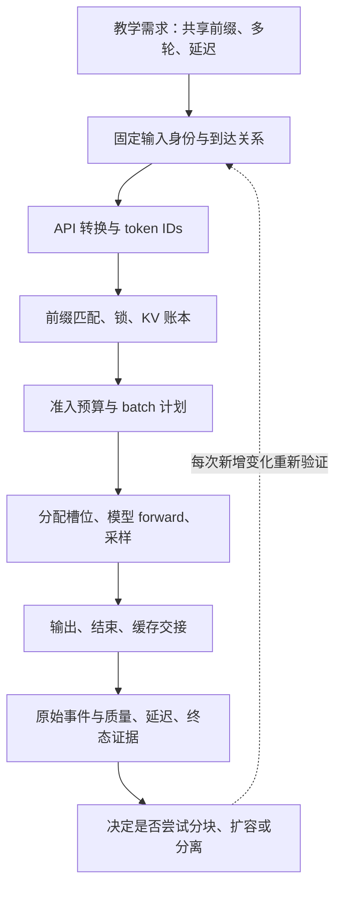
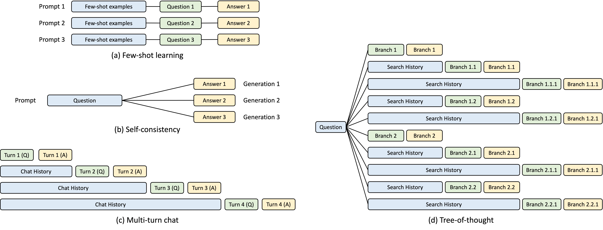
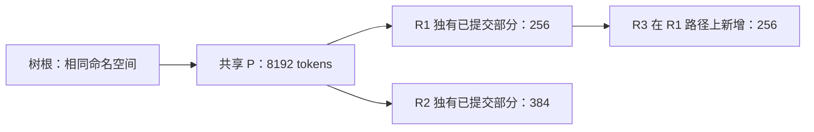
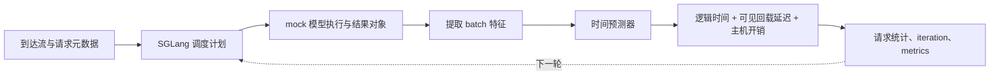

# 从需求到源码与验证的综合案例

本文是**源码分析型学习资料**。我们把“共享长前缀、多轮交互、延迟目标”变成一个能逐步核对的案例：先算清三条请求，沿源码找到控制点，再决定测什么、什么结果才支持下一步。本文没有运行服务、模拟器或 GPU；所有数字账本均为明确假设下的教学推导。

## 0. 阅读基线与范围

| 项目 | 内容 |
| --- | --- |
| 源码与路径基准 | 官方 `sgl-project/sglang`；所有源码路径相对于 SGLang 仓库根目录 `.` |
| 分支 | `codex/sglang-source-study-20260909`，跟踪 `upstream/main` |
| 固定 commit | `72d5c5bb73cadd7ffbf5114e5f81e29d36b6c61a` |
| 读取时间 | 2026-09-10 |
| 实际读取工作区 | 独立 worktree `sglang-source-study`；本轮未更新源码基线 |
| 工作区状态 | 学习源码工作区干净；原 `muxi-main` 工作区及其 26 个未跟踪文件保留；Wiki 仅追加本文和必要导航、附录 |
| 操作边界 | 只读固定源码、阅读测试定义、编写文档与独立核算；未导入项目、运行测试、模拟器、模型或网络实验 |
| 前置阅读 | 02 的请求生命周期、03 的准入与组批、04 的 KV 生命周期、05 的执行；部署分支再回看 06—07、10；测量方法见 11 |
| 主线 | 普通文本、代表 Dense 模型、Full KV、同一缓存命名空间、单实例；先完整 Prefill，再独立讨论分块、突发和部署变化 |
| 不直接展开 | 混合状态、LoRA、多模态、投机、PD 实际传输与全部模型/硬件实现；模拟器预测器的外部项目不做未固定版本的源码展开 |

**证据标识：** “源码事实”指下列固定锚点支持的行为；“教学假设/整理者推导”指人为构造的负载和算术；“运行观察”必须来自实际命令及输出。本篇没有运行观察。仓内模拟器代码与主仓使用同一 commit，但它调用的外部库、预测数据库仍需另记版本。

## 1. 先把需求改写成能判断的句子

### 1.1 人话版：先确定什么叫完成，再讨论优化

假设我们做一个知识助手。所有请求都有一段长公共说明，用户还会继续上一轮对话。业务方希望第一段回答尽快出现，后续输出也不要忽快忽慢。

这句话至少隐含四个不同问题：公共说明是否真的变成相同 token？旧 KV 是否仍在同一个实例？请求何时获得运行机会？前一个输出到后一个输出之间，究竟耗在模型还是其他环节？“开缓存”只能改变其中一部分。

下面是**待业务确认的教学合同**，不是用户已有 SLO，也不是 SGLang 默认值：

| 维度 | 本案例约定 | 真正验收时必须记录 |
| --- | --- | --- |
| 正确性 | 在固定权重、tokenizer、模板与采样条件下比较质量 | 用例、参考输出/评分方法、容差与失败样本；不能只看 HTTP 200 |
| 首 token | 示例目标为成功请求 p95 TTFT ≤ 1000 ms | 测量起点、流式事件口径、样本数、成功与失败分母 |
| 后续速度 | 示例目标为成功请求 p95 TPOT ≤ 50 ms | 每请求 TPOT 算法、输出长度、是否实际流式、多 token chunk |
| 卡顿 | 另观察 ITL 分布和慢请求时间线 | ITL 是 token 间隔还是客户端事件间隔；如何处理合并输出 |
| 负载 | 同时保留顺序功能案例、开放到达流量和真实多轮会话 | 到达时间、并发限制、think time、输入/输出长度与缓存身份 |
| 稳定性 | 记录全部终态、错误、取消和未完成请求 | 不把缺失请求丢出分母；排查恢复、回收及重试重复成本 |

TPOT 是一条请求的平均后续生成耗时，ITL 则保留每个可观测输出间隔。两者统计对象不同。源码中的服务 benchmark 对成功样本汇总 TTFT/E2E，输出长度大于 1 时用 `(latency - ttft) / (output_len - 1)` 计算 TPOT；失败样本不会进入同一套成功延迟分布。故需要同时报告失败与缺失，而非只摘好看的 p95。[源码][S33]

**不能相加分位数。** p95(TTFT) 加 128 倍 p95(TPOT)，通常不是 p95(E2E)，因为它们可能来自不同请求。只有对某一条生成 129 tokens 的请求，已知它 TTFT 不超过 1 秒，且其 128 个后续 token 间隔各不超过 50 ms，才能得到该条请求 E2E ≤ 7.4 秒的上界；这也要求事件与 token 对齐。

### 1.2 需求到源码的地图



**图意解读：** 这是学习与验证顺序，不是八个独立进程。缓存组件维护状态索引与引用，Scheduler 决定调度，ModelRunner 执行模型路径，客户端看到最终响应；没有哪个单独指标能代表整张图。

## 2. 固定输入身份与初始方案

### 2.1 先选可解释的基线 C0

C0 是学习用控制组：单实例，TP/PP/DP 为 1，普通调度，代表 Dense 模型与 Full KV；暂不增加投机、Overlap、CUDA Graph、分层缓存、外部 KV 存储、PD、LoRA 或媒体路径。实际模型和硬件尚未选择，下面的层数、容量均是算术假设，不能据此给出可运行部署命令。

固定源码的默认缓存工厂会先检查若干特殊后端条件，然后进入 Unified Radix 的创建路径。这里限定为 `UnifiedRadixCache` 的 FULL 路径及 Python tree core，避免把传统 `RadixCache` 的代表算法误说成所有启动条件下的默认实现。[源码][S10] [源码][S11]

| 身份/配置层 | 本案例如何固定 | 未固定会导致什么混淆 |
| --- | --- | --- |
| 模型 | 同一架构配置与不可变权重版本 | 同一句话背后的模型状态不同 |
| 输入 | 比较模板处理后的最终 token IDs | 肉眼相同文本、不同角色标记/空白/模板未必共享前缀 |
| tokenizer | 同一版本及特殊 token 设置 | 字符相等不保证 token 序列相等 |
| 缓存空间 | 相同 `extra_key`、`cache_salt` 等相关身份 | 复用实验可能实际上跨了隔离边界 |
| 请求模式 | 普通生成，不额外请求会改变可匹配边界的 prompt logprob | 命中长度与预期不一致 |
| 执行 | 相同解析后配置及内部生效值 | CLI 相同不代表后端、容量和模式相同 |
| 初始缓存 | 明确冷态、R1 提交后、R2 提交后 | 顺序变化被误解释为优化收益 |

`RadixKey` 携带 token 序列及命名空间相关字段；模型/权重隔离不能仅凭“Key 类里有没有模型字符串”作判断，还涉及实例和权重生命周期。[源码][S9] 配置需沿 `ServerArgs.resolve_once`、解析流水线再到 `Scheduler.get_internal_state` 记录，真实容量要用启动后的内部状态核对。[源码][S1] [源码][S2] [源码][S32]

### 2.2 三条请求的最终 IDs 由我们显式构造

这里使用最终 token 序列定义问题，暂不猜测某个真实 chat template 的拼接结果：

- P 是公共前缀，长度 8192；A 与 B 是不同后缀，长度分别为 128、256，分叉后不再共享有效前缀。
- R1 的输入是 P+A，共 8320 tokens；生成 129 tokens，编号为 y1…y129。
- R2 的输入是 P+B，共 8448 tokens；它在 R1 完成并提交缓存之后到达，也生成 129 tokens。
- R3 继续 R1：输入是 R1 原输入 + R1 的全部 129 个输出 + 127 个新 token，共 8576；在 R2 完成后到达，也生成 129 tokens。
- 三条请求均无提前停止、无取消、无缓存驱逐、无身份变化。page size 为 16；先不分块。

这是**教学构造**。真实会话不能保证重新套模板后恰好得到上述拼接：应重新记录最终 IDs，计算最长公共前缀；“同一个会话 ID”本身不证明相同 KV 可复用。本案例也不依赖专用 session 缓存路径。

API 边界要区分：`Engine.generate` 是 Python 入口之一；Chat 接口有自己的消息转换，随后才能谈 tokenizer 和内部生成请求。[源码][S3] [源码][S6] `TokenizerManager._tokenize_one_request` 分别处理 input IDs、文本和其他输入分支，不能跳过这一步就把字符长度当 token 长度。[源码][S4] [源码][S5]

### 图解补充：不同应用为什么会共享一段输入



[查看原尺寸](../../../images/sglang-source-study/06-radix-sharing.jpg)（手机查看宽图时可横屏或放大）。

**图意解读：** 四列分别展示少样本提示、多次候选、多轮对话和树状推理。先找重复的蓝色前缀，再找各分支自己的绿色输入与黄色输出。

**对应本篇源码：** 用四类共享场景检查需求是否真有公共前缀，再按本篇 token/namespace/状态与冷热缓存记录验证收益条件。 [源码：python/sglang/srt/mem_cache/radix_cache.py][S9]

**来源与边界：** [Fast and Expressive LLM Inference with RadixAttention and SGLang](https://www.lmsys.org/blog/2024-01-17-sglang/)，Lianmin Zheng、Liangsheng Yin 等 / LMSYS，2024-01-17。图说明前缀复用的应用动机；可见文字重复不保证实际 token、模型状态和缓存命名空间兼容，也不保证仍有可复用 KV。 [来源档案 F06](../../../images/sglang-source-study/SOURCES.md#f06)。

## 3. 让 R1 走完整条链

### 3.1 谁控制什么，什么时候可以交接

| 步骤 | 核心对象/所有者 | R1 的变化 | 源码入口 |
| --- | --- | --- | --- |
| 转换输入 | API 与 TokenizerManager | 明确 8320 个输入 IDs、采样和请求身份 | [源码][S6] [源码][S5] |
| 初始化候选输入 | `Req` 与 tree cache | 刷新 fill IDs，按可匹配上限查询；冷态 prefix 长度 0 | [源码][S7] [源码][S8] |
| 准入与计划 | Scheduler、PrefillAdder | 排队后检查预算，决定是否进入本轮计划 | [源码][S17] [源码][S18] [源码][S19] [源码][S16] |
| 分配和映射 | 请求行、KV allocator | 将逻辑 token 位置映射到物理槽位，形成当前 batch 的输入 | [源码][S21] |
| 执行 | TpModelWorker、ModelRunner | forward 输入经过模型层，计算下一 token 所需结果 | [源码][S20] [源码][S23] [源码][S24] |
| 模型内部 | 代表 Llama 实现 | 嵌入、局部层循环、Attention、输出侧处理；本例 PP=1 | [源码][S25] [源码][S26] |
| 处理 Prefill 结果 | 结果处理组件 | 采样得到 y1；下一轮的输入是已生成 token | [源码][S27] |
| 后续 Decode | Scheduler、allocator、结果处理组件 | 每次把待处理 token 的 KV 写入相应位置，再产生下一输出 | [源码][S22] [源码][S28] |
| 中途可复用与最终结束 | tree cache、请求资源清理 | 中途提交要遵守发布与锁规则；结束后交接有效 KV，释放请求映射 | [源码][S29] [源码][S13] [源码][S14] [源码][S15] |

普通循环按“收请求 → 取计划 → 执行 → 处理结果”推进；空闲分支并不执行模型。以上将调用链按职责压缩展示，不表示表中每个函数都直接调用下一行。[源码][S17]

**数据流单独看：** 输入 IDs 与 batch 元数据进入执行；模型读写每层 KV；请求映射指向物理槽位；树索引让别的请求找到可复用前缀；最终输出 token 与结束信息回到客户端。输出列表、树节点和 KV 槽位不是同一个对象。

### 3.2 最后一个输出 token 为什么还没有自己的 KV

先把模型当成“读入一段已有 token，计算它们的状态，然后预测下一个 token”的机器：

| 时点 | 已送进模型的序列长度 | 已得到输出数量 | 最后一个输出是否已经再次送入模型 |
| --- | ---: | ---: | --- |
| R1 完成 Prefill | 8320 | 1，即 y1 | 尚未 |
| R1 完成第一次 Decode | 8321 | 2，即 y1、y2 | y2 尚未 |
| R1 生成结束 | 8448 = 8320 + 128 | 129 | y129 尚未 |

这解释了结束时可提交的有效 KV 长度为何是 8448，而不是 8449。源码收尾使用请求实际有效/已提交长度处理输入与输出的拼接，并按组件和页边界决定缓存及释放范围；不能直接把输出列表长度全部当成已计算 KV。[源码][S14] [源码][S15]

如果有投机、回撤、混合状态、额外预留或特殊停止路径，应回到相应的已提交字段核对，不能机械套用本表。本例普通逐 token 路径的详细生命周期见 [04-07](../04-kv-cache/07-KV缓存全生命周期与排障.md)。

## 4. 三条请求的命中、容量与时间账本

### 4.1 命中账本：输入越像，也要看实际提交边界

| 请求 | 输入长度 | 到达前可用的匹配前缀 | 本次需新增 Prefill | 生成数量 | 结束有效 KV |
| --- | ---: | ---: | ---: | ---: | ---: |
| R1 | 8320 | 0 | 8320 | 129 | 8448 |
| R2 | 8448 | 8192，即 P | 256 | 129 | 8576 |
| R3 | 8576 | 8448，即 R1 已提交路径 | 128 | 129 | 8704 |
| 合计 | 25344 | 16640 | 8704 | 387 | 各路径共享，不能把这一列直接相加当占用 |

R3 的 128 个新增输入由 **y129 + 127 个新 token** 构成。第一次读到这里，可以手写 y128、y129 所在位置：y128 已进入上轮模型，y129 只是上轮最后的预测输出。这是跨轮复用最容易多算一个 token 的地方。

`Req.init_next_round_input` 刷新输入并计算匹配范围；`UnifiedRadixCache.match_prefix` 还会经过 session、组件等处理。本例限定普通 FULL 分支。[源码][S7] [源码][S12]

教学比例为：

- R2 输入复用比例：8192 / 8448 ≈ 96.97%。
- R3 输入复用比例：8448 / 8576 ≈ 98.51%。
- 三请求总输入复用比例：16640 / 25344 ≈ 65.66%，分母包含冷启动 R1。

**这三个比例都不是延迟加速比。** R2 仍需排队、处理 256 个输入 token、访问已有 KV，并生成 129 个输出；Decode 的历史长度没有因“前缀命中”自动变短。

### 4.2 相同整段输入也可能重算一页

普通路径可匹配长度通常最多到 `input_len - 1`；需要留下位置计算下一 token 的分布，其他模式还可能进一步限制。[源码][S8]

例如重复一个 8448-token 输入，已有完整状态且页大小为 16：

```text
最多尝试匹配 8448 - 1 = 8447
完整页前缀 = floor(8447 / 16) * 16 = 8432
仍需输入计算 = 8448 - 8432 = 16 tokens
```

这是普通分页前缀路径的推导，不表示所有缓存组件和所有输入模式都如此。统计“所有可复用 token 已命中”与“输入复用比例 100%”不是同一个判断；后面的模拟器测试还给出另一个 7/8 例子。

### 4.3 物理 KV 账本：共享部分只算一次

再加一组**假想模型参数**：32 层、每层 8 个 KV heads、head dimension 为 128、K/V 均用 BF16，每元素 2 bytes，TP=1，所有 token 保存 Full KV。

```text
每 token KV payload
= K/V 两份 × 32 层 × 8 KV heads × 128 × 2 bytes
= 131072 bytes = 128 KiB

每 16-token 页 payload = 2 MiB
假定 token 池容量 12288，则 KV payload 容量 = 1536 MiB
```

这只是 KV 数据体的字节数，不包含权重、激活、workspace、图捕获、allocator 元数据和瞬时预留，也不证明某张显卡能提供该容量。实际 `max_total_num_tokens` 要从真实环境取证。

| 请求全部完成后的树 | 已保留唯一路径 token 数 | 页数 | KV payload | 在假定池内的算术余量 |
| --- | ---: | ---: | ---: | ---: |
| R1 后 | 8448 | 528 | 1056 MiB | 3840 tokens / 480 MiB |
| R2 后 | 8448 + 8576 − 8192 = 8832 | 552 | 1104 MiB | 3456 tokens / 432 MiB |
| R3 后 | 8576 + 8704 − 8192 = 9088 | 568 | 1136 MiB | 3200 tokens / 400 MiB |

R3 延长了 R1 路径，因此第三行不再另加一份 R1。R2 后若按两请求长度直接相加，会得到 17024 tokens / 2128 MiB；多算的正是 8192-token 共享前缀，等于 1024 MiB。



**图意解读：** 方框是完成后的逻辑路径区间，不是实际树节点拆分保证，也不包含请求行布局。唯一 token 数是 8192+256+384+256=9088。共享区间可由多个请求引用，但物理 KV 不因此复制；真实内存峰值还受引用锁、暂存、页尾与并发影响。

此账本只能解释这三条顺序请求的保留状态，不能推出最大并发或部署成本。实际空闲量、可驱逐量与受保护量必须分开，详见 [04-07](../04-kv-cache/07-KV缓存全生命周期与排障.md)。

### 4.4 请求命中了，为什么仍然进不了 batch

`PrefillAdder.add_one_req` 同时考虑本轮输入、未来生成估计、页等预算，并在临时锁住前缀后再次检查。锁会改变可驱逐空间，所以“检查前看似够用”不能替代锁后的结果。[源码][S16]

以 R2 为例，假设生成估计裁剪上限至少为 129、无额外模型特例：

```text
candidate extend = 8448 - 8192 = 256
remaining max-new estimate = 129
page allowance = 16
total_tokens = 256 + 129 + 16 = 401
```

源码的该道总预算判断使用 `total_tokens >= rem_total_tokens`：剩余 401 时仍拒绝；剩余 402 只说明通过这一道判断，不能保证通过锁后复查、输入预算或其他条件。默认生成估计裁剪环境值为 4096，但实验必须记录环境覆盖，不能把它当永远不变的约束。[源码][S16]

现在做两个独立变体：

| 变体 | 可推导的内容 | 不能直接推导的内容 |
| --- | --- | --- |
| 将完整 Prefill 改为 chunk=2048 | 若每轮都有完整预算，R1 需 2048×4+128，共 5 个输入块 | 实际五轮耗时、它与 Decode 的交错、TTFT 一定改善 |
| 改为 chunk=4096 | 同条件下 R1 需 4096×2+128，共 3 块 | 一定比 2048 更快或更稳定 |
| R2 提前到 R1 仍在运行时 | 需重新检查已发布前缀、当前锁、正在运行的 batch 与准入 | 不能沿用“R1 已完成”的 8192 命中和容量账本 |

分块处理的不只是“把数字除一下”：源码会按剩余预算和页对齐截断，且首请求与其他候选的输入预算判断存在区别。中途共享又依赖 `cache_unfinished_req` 发布与引用保护。[源码][S16] [源码][S13]

## 5. 从证据决定下一种部署变化

初始决策是**先完成 C0 的正确性与测量闭环**。下面是后续实验分支；没有测量结果时，不指定“最优开关组合”。

| 观察到的现象 | 先排除什么 | 下一步单独比较 | 应回读 |
| --- | --- | --- | --- |
| 相同请求命中很低 | 最终 IDs、salt/extra key、实例归属、驱逐、可匹配边界 | 输入身份与缓存亲和 | [04-03](../04-kv-cache/03-命中条件与缓存隔离.md)、[10-01](../10-serving-operations/01-ModelGateway注册路由与缓存亲和.md) |
| 长 Prefill 期间短请求/Decode 卡顿 | 到达突发、排队、真实 batch 时间线 | chunk 档位，再单独比较 Overlap | [03-03](../03-scheduling/03-排序策略与准入预算.md)、[11-02](../11-performance-engineering/02-Profiler与时间线阅读.md) |
| 模型或并发状态装不下 | 权重与 KV、预留和真实容量是否混算 | 模型支持的并行方案；不要套用本例 TP=1 字节数 | [06-01 并行坐标系](../06-parallelism/01-Rank进程组与通信基础.md) |
| 多副本后命中下降 | 请求是否换实例、亲和与负载是否失衡 | 固定副本数下比较路由，报告队列与命中两面 | [10-01](../10-serving-operations/01-ModelGateway注册路由与缓存亲和.md) |
| 长前缀频繁被驱逐 | 工作集/容量比、复用间隔、受保护量 | 独立研究 HiCache 回载成本与准入 | [04-05 HiCache](../04-kv-cache/05-HiCache分层存储与回载.md) |
| Prefill 与 Decode 干扰显著 | 分块、组批和资源竞争是否已经量化 | 再研究 PD，加入传输、路由、bootstrap、取消与退役 | [07-01 PD 地图](../07-disaggregation/01-PD分离职责与端到端请求地图.md) |

表中的链接提供后续阅读导航，具体可支持拓扑仍以该阶段源码约束为准。多副本会产生独立缓存工作集；TP 涉及模型与 KV 分布；PD 会增加跨实例所有权和网络状态。它们解决的问题不同，不能把上述 token 账本乘除卡数就当作完整性能模型。

**取消也在综合案例中。** 后续应分别在排队、已分配未返回、Decode 和分离传输期间设计取消用例。当前普通路径入口为 `Scheduler.abort_request`，但“调用返回”并不证明所有异步资源已安全回收。[源码][S30] 需要沿对应模式逐项检查请求终态、引用、在途操作和槽位复用；PD 的条件回到阶段 07。

## 6. 把比较方案写成完整实验，而非一张跑分表

### 6.1 三类负载各有用途

| 负载 | 到达关系 | 回答什么 | 不回答什么 |
| --- | --- | --- | --- |
| F：顺序功能案例 | R1 完成 → R2 → R3 | 核对输入身份、前缀、结束 KV、资源交接 | 三个样本不足以估计 p95/p99 |
| O：开放到达流量 | 预先固定时间戳或到达率，不等待上一响应 | 饱和、排队、负载曲线与丢失请求 | 不自动还原真实多轮依赖 |
| C：闭环多轮会话 | 上轮完成 + think time 后构造下一轮 | 真实历史增长、输出质量、用户等待 | 并发限制可能压低到达率，不能与 O 无条件比较 |

R3 在逻辑上依赖 R1 的真实输出。若把预先写好的 R3 放在 R1 完成之前发送，它变成了一条预构造长输入，不能再声称测到了真实多轮交互。

### 6.2 实验矩阵与验收信号

所有行当前状态均为 **未执行**。每次比较固定相同权重、最终 IDs、到达流、并发、测量窗口与生效配置，只改变表中指定项；需要改变多个维度时先拆开，再做组合实验。

| 编号 | 对照/变化 | 必须采集 | 成功判断与反例 |
| --- | --- | --- | --- |
| F0 | 冷态运行 R1/R2/R3 | 每请求输入/输出长度、命中、有效 KV、终态、缓存状态 | 解释本篇账本或定位偏差；长度对上不等于质量合格 |
| F1 | 同一输入分别跨 salt/extra key | 实际最终 IDs、namespace 与匹配节点 | 隔离后不应复用另一空间；不同文本不是有效隔离对照 |
| P0 | 冷/暖缓存配对 | warmup 是否计入、真实清缓存结果、成功和错误数量 | 不把第二轮模型热身、编译或缓存状态变化混为一个原因 |
| P1 | 完整 Prefill 对 chunk=2048 | batch 组成、等待时间、TTFT/TPOT/ITL、吞吐 | 判断首响应与后续卡顿的取舍；不能只报平均 token/s |
| P2 | 固定 chunk，对照普通/Overlap | 解析后配置、CPU/GPU 时间线、峰值状态 | 证明实际重叠窗口与延迟变化；不能只看开关值 |
| P3 | 固定配置改变到达率/突发 | 所有请求的到达、许可等待、结束、缺失及窗口 | 找出错误和 SLO 同时可接受的区间 |
| Q0 | 每次性能变化配套正确性检查 | 固定模型的原始输出、评分、容差与反例 | 缓存命中与吞吐提高不能替代质量证据 |
| L0 | 排队/Decode 取消及恢复 | 请求终态、锁/池状态、重复请求与后续成功 | 需要实际故障/恢复证据；日志没有报错不足以证明安全 |
| D0 | 确有证据后增加副本、HiCache 或 PD | 新拓扑、路由/回载/传输时序及失败路径 | 报告新增成本；不能沿用 C0 的单实例容量和时间 |

冷态处理需可核验。`Scheduler.flush_cache` 仅在完整空闲条件下执行重置，忙时会拒绝；因此“发了 flush 请求”不等于“清缓存成功”。[源码][S31] 也可以使用独立启动的实验实例定义冷态，但依然要把热身、编译、连接建立与测量窗口分开。

### 6.3 最小证据包应该能回答什么

| 记录 | 具体内容 | 缺失后的限制 |
| --- | --- | --- |
| manifest | commit、环境/依赖、模型权重/tokenizer 修订、设备、全部有效配置 | 无法判断两个结果是否真在比较同一系统 |
| workload | 最终输入长度与身份、输出约束、到达/会话关系、随机种子、数据 hash | 无法重建冷热与多轮关系 |
| 原始客户端事件 | request ID、发送/首输出/后续输出/终态、错误、取消和未完成 | 汇总无法证明没有丢样本 |
| 服务侧记录 | request/batch 关联、队列、缓存/容量、Profile 或相关日志 | 难以把现象定位到控制与数据路径 |
| 质量结果 | 用例、输出、判定与失败例子 | 性能结果不支持业务可用性 |
| 分析 | 单位/分母/过滤规则、置信或重复波动、SLO 与吞吐 | 无法复核“提高了多少” |

如果报告 SLO goodput，应明确定义“质量合格且满足哪些单请求条件的完成数 / 哪个时间窗口”，并保留失败、超时和未完成数。不要把成功样本的 token throughput 改个名称就当成 goodput。更多测量口径见 [11-01](../11-performance-engineering/01-Benchmark设计与指标口径.md) 与 [11-04](../11-performance-engineering/04-参数对照与性能实验记录.md)。

## 7. 模拟器能替我们验证哪一层

### 7.1 人话版：保留部分调度行为，把模型时间换成预测

固定仓内的 `tools/sglang-simulator/` 提供模拟入口、hook、时间预测器和示例；它不是一份已经完成本案例 GPU 验证的报告。[源码][S63] [源码][S64]

启动安装模拟器 hooks 后，部分 SGLang 类的方法被替换。模型加载改为 mock，forward 构造未填入真实模型分数的 logits 张量，采样生成值为 1 的 token ID；它们不能验证真实模型输出质量。[源码][S34] [源码][S37]

| 层次 | 模拟中保留/利用的内容 | 被替换或限制的内容 |
| --- | --- | --- |
| 请求与调度 | 使用 SGLang 请求、队列、计划及结果处理接口 | 调度方法包装、到达控制、模拟时间和统计 |
| 模型 | 保留相关模型配置供容量/预测使用 | 不执行真实权重对应的模型 forward/采样语义 |
| KV 池 | 利用原生配置/生命周期的一部分逻辑 | 创建池时压缩维度并恢复逻辑元信息；CPU 实际占用不等于真实 GPU KV payload |
| 运行拓扑 | 实际 SGLang runtime 使用各并行维度为 1 | 外部配置的目标拓扑是预测参数，不是在跑对应多卡网络 |
| 时间 | 预测器估计当前 batch 的 forward 时长 | 预测精度取决于数据库、特征、目标环境及回退 |
| 性能输出 | 组合逻辑时间、缓存/请求统计、迭代记录 | 不能替代真实 GPU kernel、网络、质量、异步释放的验证 |

KV 配置 hook 可以用显式 token 容量反推模型化预算，也会调整实际池存储；比较真实服务时需对齐逻辑容量并另记真实资源占用。[源码][S38]

兼容层将 TP/EP/DP/PP/attention CP/DCP 全部固定为 1，关闭 Overlap 与 CUDA Graph，并指定 torch_native 相关后端。[源码][S36] [源码][S35] `ConfigManager.set_scheduler_config` 又可从模拟 JSON 更新目标 TP/PP/DP/EP/CP 等预测配置；这两个“拓扑”不是同一层。[源码][S45]

### 7.2 一轮模拟如何经过调度与时钟



**图意解读：** 方框表示模拟包装后的职责，不表示真实 GPU 时间线。源码包装 `run_batch` 时先调用原方法，而其模型执行已被 mock；随后把 batch 转成预测输入。包装结果处理时还统计回载与主机开销。[源码][S39]

预测 `ScheduleBatch` 的请求特征包含 extend length 和 past KV length。[源码][S40] Scheduler hook 对当前请求构造这些字段；不能只根据字段名字，就假定它在所有分块/模式下等于真实 Attention 的完整序列长度。预测数据库必须与这套特征提取规则一致。[源码][S39]

| 模式/成本 | 源码行为 | 解读边界 |
| --- | --- | --- |
| BLOCKING | 对预测时长做实际等待，并记录主机经过的时间 | 墙钟受 Python/系统调度影响，不只是预测值 |
| OFFLINE | 以预测值推进逻辑时间，空闲时可跳到后续到达点 | 不代表整个进程完全没有 CPU 成本或任何等待 |
| L2 回载 | 可见延迟函数根据 overlap 标志处理隐藏量 | 支持的模拟入口关闭 Overlap；不能据此宣称已模拟真实 CPU/GPU 重叠 |
| 迭代结果 | 记录预测 forward、回载、主机开销与时间点 | 不应把总时长统统归到模型计算 |

上述行为来自 Scheduler hook 与 `effective_l2_load_delay`，属于源码阅读，尚未在本机运行。[源码][S39] [源码][S56]

### 7.3 Replay 的零毫秒不等于模型不需要计算

工厂可选择 AIConfigurator、ML 或 Replay；选择分支存在不证明外部数据库适合本案例。[源码][S46] Replay 用排序后的每请求 `[extend_length, past_kv_length]` 列表序列化成精确查询键。[源码][S42]

仓内示例表包含三项：

| batch 键 | 示例预测秒数 | 转成毫秒 |
| --- | ---: | ---: |
| `[[1, 3]]` | 0.001 | 1 |
| `[[4, 0]]` | 0.005 | 5 |
| `[[8, 0]]` | 0.008 | 8 |

这些数值来自演示资产，**不在本篇作为硬件实测数据使用**。[源码][S62]

对缺失键 `[[3, 1]]`，默认 `miss_strategy="zero"`、`miss_fallback_seconds=0.0` 会得到 0。若它占了大量迭代，汇总可能异常乐观，不能当成优化成果。[源码][S41]

选择 KNN 时，代码用 batch size、总 extend、总 past KV 三个聚合特征，标准化后找近邻，再取邻居时间的简单平均。若 k=3 且只有上述三项，缺失键的回退值就是 (1+5+8)/3 ≈ 4.667 ms；这仍是近邻估计。[源码][S43]

验收至少要保留源码原始字段 `replay_exact_match_steps`、`replay_miss_steps`、`replay_zero_fallback_steps`、`replay_knn_fallback_steps` 和 `replay_fallback_rate`。比例的分母是精确命中与缺失次数之和；总次数为 0 时函数也返回 0.0，因此回退率为零还需核对样本数，不能单独证明预测覆盖充分。另记录数据库来源、单位、hash、硬件/模型配置和特征构造。[源码][S44] 本例前缀长达 8192，与这个三项演示表没有可直接采用的校准关系。

### 7.4 到达流与多轮交互有额外边界

模拟 benchmark 的 OFFLINE 请求生成器可把预设时间戳排序、归一化，并将毫秒时间元数据随请求送入；接收侧再转成秒。没有时间戳时可按到达率生成到达间隔。[源码][S53] [源码][S54] 数据集读取还会处理 prompt、输出长度与其他行字段，不能只保留输入文本而丢掉到达条件。[源码][S55]

这支持预构造输入的开放到达实验，不自动实现“读取真实 y129 后再拼接 R3”的闭环。固定版本模拟 benchmark 明确拒绝 `mooncake` 多轮数据集路径，并要求对应 backend；不能因为其他模式有相近字段，就宣称该适配器支持完整多轮会话。[源码][S52]

### 7.5 三个统计陷阱

| 陷阱 | 固定源码行为 | 必须补充的验证 |
| --- | --- | --- |
| 把模拟 completed 当最终成功 | `calc_metrics` 检查 `is_complete()`，但当前 `RequestStats.is_complete` 无条件返回 True | 独立关联终止响应、实际输出长度、错误和原始请求集合 |
| 把旧 metrics 当新一轮结果 | adapter 读取输出目录中的 `metrics.json`，加载函数未做 run ID/新鲜度核验 | 服务和客户端使用同一新目录，保存运行标识、时间与有效原始文件 |
| 把客户端与模拟时间混用 | 无 backend metrics 时返回原客户端统计；有文件时按字段替换，缺字段可为 -1 | 明确指标来自哪套时钟；缺失值不当成负延迟或零成本 |

对应源码：[源码][S47] [源码][S48] [源码][S50] [源码][S51]。模拟 profiling 收尾还会写 `metrics.json`、`iteration.jsonl`、`request.jsonl`；写文件失败会记录异常，不能仅凭 profile 接口响应判定证据文件已成功生成。[源码][S39]

输入复用统计以总输入 token 数为分母，并计算新增输入量；设备/主机/存储层命中也有各自差分口径。[源码][S49] [源码][S47] 仓内测试第二次重复三条 8-token 输入，期望可复用 7-token 前缀，合计复用 21/24=87.5%，新增 3 tokens；测试名里的“全部可复用前缀命中”不等于总输入 100%。[源码][S60]

## 8. 本案例的证据结论与尚待执行的记录

### 8.1 已经能作出的设计决定

| 问题 | 本篇静态结论 | 仍不能作出的结论 |
| --- | --- | --- |
| 从哪里开始 | 先固定 C0、最终 IDs 与顺序 F 负载，核对输入/缓存/终态 | 未选模型硬件，不能给出可部署配置或 SLO 达标保证 |
| 前缀是否值得研究 | 在教学身份与时序下，R2/R3 分别少做 8192/8448 个输入 token 的 Prefill | 不能把输入复用率直接换成性能提升 |
| 多轮如何核对 | 区分上轮全部输出与已提交 KV，R3 新增 128 tokens | 真实模板和输出尚未验证，不能宣称真实会话完全复用 |
| 容量怎么算 | 按共享唯一路径计数，最终保留 9088 tokens / 1136 MiB payload | 不能用该数证明峰值显存、最大并发或不会 OOM |
| 下一步优化 | 先测队列/执行/缓存，再逐项增加 chunk、Overlap 或部署变化 | 没有数据不能选出最佳并行、PD 或缓存层级 |
| 模拟器如何用 | 用固定预测器和到达流研究其覆盖的调度行为，统计回退 | 不支持真实质量、网络、GPU 性能与多轮闭环验收 |

这些是填好的教学设计结论，不是空白实验模板，也不是运行报告。

### 8.2 测试入口证明了什么

本轮只阅读下列 **4 份文件中的 5 个用例定义**，未执行它们：

| 用例 | 它检查的局部合同 | 本案例仍需要什么 |
| --- | --- | --- |
| `UnifiedRadixCacheSuite.test_cache_salt_and_extra_key_form_independent_namespaces` | 相同 IDs 的 salt/extra key 组合保持独立，默认空间不混入 | 真实服务的请求字段传递与权重/实例身份 |
| `TestPrefillAdder.test_delayer_not_consulted_when_kv_budget_rejects` | KV 预算拒绝时不提前调用 delayer | 实际负载下每次拒绝原因与等待时间 |
| `TestPrefillAdder.test_delayer_not_consulted_when_post_lock_recheck_rejects` | 锁改变可驱逐量后再次拒绝，仍不调用 delayer | 并发引用与真实 allocator 状态 |
| `test_second_replay_benchmark_hits_all_reusable_prefix_tokens` | 重复输入的可复用 token 和统计分母 | 本文 page=16 与长输入、多轮语义 |
| `test_request_rate_offline_matches_blocking` | 给定测试条件与容差下对照两种模拟时钟模式 | 模拟器对真实 GPU 的校准与预测误差 |

源码依次为 [源码][S57]、[源码][S58]、[源码][S59]、[源码][S60]、[源码][S61]。最后一个测试对不同指标采用不同容差，不是逐 bit 一致证明；它依赖的预测环境也不等于本篇假想模型。

### 8.3 填写示例：未执行就保留 null

下面是一份**本篇静态教学记录**，不是可以直接提交给 SGLang 的配置文件：

```json
{
  "record_type": "static_teaching_case",
  "source_commit": "72d5c5bb73cadd7ffbf5114e5f81e29d36b6c61a",
  "source_path_base": ".",
  "read_date": "2026-09-10",
  "case": "shared-prefix-three-requests",
  "assumptions": {
    "page_size_tokens": 16,
    "logical_kv_capacity_tokens": 12288,
    "kv_payload_bytes_per_token": 131072,
    "requests": [
      {"id": "R1", "input": 8320, "reused": 0, "generated": 129, "end_kv": 8448},
      {"id": "R2", "input": 8448, "reused": 8192, "generated": 129, "end_kv": 8576},
      {"id": "R3", "input": 8576, "reused": 8448, "generated": 129, "end_kv": 8704}
    ]
  },
  "derived": {
    "new_prefill_tokens": 8704,
    "retained_unique_kv_tokens": 9088,
    "retained_kv_payload_mib": 1136
  },
  "runtime": {
    "status": "not_run",
    "model_revision": null,
    "hardware": null,
    "p95_ttft_ms": null,
    "p95_tpot_ms": null,
    "quality_result": null
  },
  "simulator": {
    "status": "not_run",
    "predictor_database_hash": null,
    "replay_exact_match_steps": null,
    "replay_miss_steps": null,
    "replay_zero_fallback_steps": null,
    "replay_knn_fallback_steps": null,
    "replay_fallback_rate": null
  }
}
```

这里的 null 表示未取得证据。把它改为 0 会把“没测”误写成“没有延迟/没有失败”。真正执行时，另建具有不可变运行标识的记录，补齐有效配置、原始事件与质量材料，不覆盖本篇的教学假设。

## 9. 源码回查路线与自测

### 9.1 从一个症状回到具体边界

| 症状/问题 | 首先查看的仓内相对路径与符号 | 重点 |
| --- | --- | --- |
| 文本相同但命中不同 | `python/sglang/srt/managers/tokenizer_manager.py::TokenizerManager._tokenize_one_request`；`python/sglang/srt/managers/schedule_batch.py::Req.init_next_round_input` | 最终 IDs、命名空间、匹配上限 |
| 完成后缓存少一个 token/一页 | `python/sglang/srt/mem_cache/unified_radix_cache.py::UnifiedRadixCache.cache_finished_req` | 有效提交长度与页对齐 |
| 命中高仍排队 | `python/sglang/srt/managers/schedule_policy.py::PrefillAdder.add_one_req` | 首次预算与锁后复查、候选是否真正入批 |
| batch 时间不符合预期 | `python/sglang/srt/managers/scheduler.py::Scheduler.run_batch`；`python/sglang/srt/model_executor/model_runner.py::ModelRunner.forward` | 模式、执行后端及真实时间线 |
| 清缓存没效果 | `python/sglang/srt/managers/scheduler.py::Scheduler.flush_cache` | 是否完整空闲、返回是否成功 |
| 模拟器快得不合理 | `tools/sglang-simulator/src/sglang_simulator/time_predictor/replay.py::ReplayTimePredictor.predict_infer_time` | 数据库覆盖、单位与缺失回退 |
| 模拟多卡结果被当成实测 | `tools/sglang-simulator/src/sglang_simulator/compat.py`；`tools/sglang-simulator/src/sglang_simulator/simulation/manager/config.py::ConfigManager.set_scheduler_config` | 实际 runtime 与被建模拓扑分层 |
| 模拟结果数量对不上 | `tools/sglang-simulator/src/sglang_simulator/simulation/types.py::RequestStats.is_complete`；`benchmark/simulator/bench_serving.py::_load_backend_metrics` | 真正终态、文件新鲜度与请求全集 |

先读 [11-03 的排障方法](../11-performance-engineering/03-从现象定位性能瓶颈.md)，按能排除的假设选择下一份证据。源代码存在某个分支只是定位起点，不是该分支已经在你的环境执行的证明。

### 9.2 练习与参考答案

| 练习 | 参考答案 |
| --- | --- |
| R3 为什么不是只 Prefill 127 个新 token？ | R1 的 y129 尚未进入上轮模型；它加上 127 个新 token，一共 128 |
| R2 后为何不是 17024 个唯一 KV token？ | 两条路径共享 P 的 8192 个槽位；17024−8192=8832 |
| R3 后为什么不再加一份完整 R1？ | R1 已提交路径是 R3 路径的前缀，新增的是延长部分 |
| 剩余预算恰好 401 能否容纳本例 R2？ | 该道判断使用大于等于，仍拒绝；402 也只通过第一道检查 |
| 2048 分块把 8320 拆成五块，是否说明 TTFT 一定更小？ | 不能；需测量每块调度、模型与其他请求交错的开销 |
| Repeat 输入命中 87.5% 是否必然出问题？ | 不一定；测试中每条 8-token 输入有 7 个可复用位置，全部命中也只有 7/8 |
| Replay 缺失键得到 0 秒，能否当成吞吐提升？ | 不能；默认回退可能为零，应报告覆盖率并补校准数据 |
| 模拟器配置写 TP=8，是否证明 8 卡通信通过？ | 不能；runtime 并行维度被固定为 1，目标拓扑只参与预测配置 |
| completed 等于请求数，是否能签署模型质量验收？ | 不能；还须独立终态/输出和质量证据，且模拟器采样是 mock |
| 现在能否断言本案例满足 1 秒/50 ms 目标？ | 不能；当前只有静态源码与教学账本，SLO、硬件和模型均未实测 |

### 9.3 单篇完成状态与整套收尾

本篇完成了需求拆分、R1/R2/R3 控制与容量账本、实验矩阵、模拟器边界和测试入口阅读。源码锚点、独立算术、JSON、相对链接与标题进行静态检查；Mermaid 与文字逐项对照，未运行图像渲染器。

这也是目录中的第 75 篇正文。**正文齐备与整套资料验收是两件事：** 接下来仍需对 75 篇、6 份附录和总目录做覆盖、导航、基线、术语与证据边界的整体复核。GPU、模型质量、网络和性能实验的未执行状态保持明确，不会因为文档齐备而变成通过。

上一专题：[12-04《硬件后端插件与生态边界》](04-硬件后端插件与生态边界.md)。返回[系列目录](../README.md)，整体复核状态见[学习进度与版本记录](../appendices/06-学习进度与版本变更记录.md)。

[S1]: https://github.com/sgl-project/sglang/blob/72d5c5bb73cadd7ffbf5114e5f81e29d36b6c61a/python/sglang/srt/server_args.py#L231
[S2]: https://github.com/sgl-project/sglang/blob/72d5c5bb73cadd7ffbf5114e5f81e29d36b6c61a/python/sglang/srt/arg_groups/pipeline.py#L26
[S3]: https://github.com/sgl-project/sglang/blob/72d5c5bb73cadd7ffbf5114e5f81e29d36b6c61a/python/sglang/srt/entrypoints/engine.py#L382
[S4]: https://github.com/sgl-project/sglang/blob/72d5c5bb73cadd7ffbf5114e5f81e29d36b6c61a/python/sglang/srt/managers/tokenizer_manager.py#L776
[S5]: https://github.com/sgl-project/sglang/blob/72d5c5bb73cadd7ffbf5114e5f81e29d36b6c61a/python/sglang/srt/managers/tokenizer_manager.py#L970
[S6]: https://github.com/sgl-project/sglang/blob/72d5c5bb73cadd7ffbf5114e5f81e29d36b6c61a/python/sglang/srt/entrypoints/openai/serving_chat.py#L1046
[S7]: https://github.com/sgl-project/sglang/blob/72d5c5bb73cadd7ffbf5114e5f81e29d36b6c61a/python/sglang/srt/managers/schedule_batch.py#L1440
[S8]: https://github.com/sgl-project/sglang/blob/72d5c5bb73cadd7ffbf5114e5f81e29d36b6c61a/python/sglang/srt/managers/schedule_batch.py#L1561
[S9]: https://github.com/sgl-project/sglang/blob/72d5c5bb73cadd7ffbf5114e5f81e29d36b6c61a/python/sglang/srt/mem_cache/radix_cache.py#L59
[S10]: https://github.com/sgl-project/sglang/blob/72d5c5bb73cadd7ffbf5114e5f81e29d36b6c61a/python/sglang/srt/mem_cache/registry.py#L80
[S11]: https://github.com/sgl-project/sglang/blob/72d5c5bb73cadd7ffbf5114e5f81e29d36b6c61a/python/sglang/srt/mem_cache/registry.py#L149
[S12]: https://github.com/sgl-project/sglang/blob/72d5c5bb73cadd7ffbf5114e5f81e29d36b6c61a/python/sglang/srt/mem_cache/unified_radix_cache.py#L521
[S13]: https://github.com/sgl-project/sglang/blob/72d5c5bb73cadd7ffbf5114e5f81e29d36b6c61a/python/sglang/srt/mem_cache/unified_radix_cache.py#L941
[S14]: https://github.com/sgl-project/sglang/blob/72d5c5bb73cadd7ffbf5114e5f81e29d36b6c61a/python/sglang/srt/mem_cache/unified_radix_cache.py#L852
[S15]: https://github.com/sgl-project/sglang/blob/72d5c5bb73cadd7ffbf5114e5f81e29d36b6c61a/python/sglang/srt/mem_cache/common.py#L238
[S16]: https://github.com/sgl-project/sglang/blob/72d5c5bb73cadd7ffbf5114e5f81e29d36b6c61a/python/sglang/srt/managers/schedule_policy.py#L1271
[S17]: https://github.com/sgl-project/sglang/blob/72d5c5bb73cadd7ffbf5114e5f81e29d36b6c61a/python/sglang/srt/managers/scheduler.py#L1893
[S18]: https://github.com/sgl-project/sglang/blob/72d5c5bb73cadd7ffbf5114e5f81e29d36b6c61a/python/sglang/srt/managers/scheduler.py#L3499
[S19]: https://github.com/sgl-project/sglang/blob/72d5c5bb73cadd7ffbf5114e5f81e29d36b6c61a/python/sglang/srt/managers/scheduler.py#L3666
[S20]: https://github.com/sgl-project/sglang/blob/72d5c5bb73cadd7ffbf5114e5f81e29d36b6c61a/python/sglang/srt/managers/scheduler.py#L4199
[S21]: https://github.com/sgl-project/sglang/blob/72d5c5bb73cadd7ffbf5114e5f81e29d36b6c61a/python/sglang/srt/mem_cache/allocation.py#L282
[S22]: https://github.com/sgl-project/sglang/blob/72d5c5bb73cadd7ffbf5114e5f81e29d36b6c61a/python/sglang/srt/mem_cache/allocation.py#L521
[S23]: https://github.com/sgl-project/sglang/blob/72d5c5bb73cadd7ffbf5114e5f81e29d36b6c61a/python/sglang/srt/managers/tp_worker.py#L593
[S24]: https://github.com/sgl-project/sglang/blob/72d5c5bb73cadd7ffbf5114e5f81e29d36b6c61a/python/sglang/srt/model_executor/model_runner.py#L1612
[S25]: https://github.com/sgl-project/sglang/blob/72d5c5bb73cadd7ffbf5114e5f81e29d36b6c61a/python/sglang/srt/models/llama.py#L418
[S26]: https://github.com/sgl-project/sglang/blob/72d5c5bb73cadd7ffbf5114e5f81e29d36b6c61a/python/sglang/srt/models/llama.py#L239
[S27]: https://github.com/sgl-project/sglang/blob/72d5c5bb73cadd7ffbf5114e5f81e29d36b6c61a/python/sglang/srt/managers/scheduler_components/batch_result_processor.py#L253
[S28]: https://github.com/sgl-project/sglang/blob/72d5c5bb73cadd7ffbf5114e5f81e29d36b6c61a/python/sglang/srt/managers/scheduler_components/batch_result_processor.py#L889
[S29]: https://github.com/sgl-project/sglang/blob/72d5c5bb73cadd7ffbf5114e5f81e29d36b6c61a/python/sglang/srt/mem_cache/common.py#L145
[S30]: https://github.com/sgl-project/sglang/blob/72d5c5bb73cadd7ffbf5114e5f81e29d36b6c61a/python/sglang/srt/managers/scheduler.py#L5171
[S31]: https://github.com/sgl-project/sglang/blob/72d5c5bb73cadd7ffbf5114e5f81e29d36b6c61a/python/sglang/srt/managers/scheduler.py#L4935
[S32]: https://github.com/sgl-project/sglang/blob/72d5c5bb73cadd7ffbf5114e5f81e29d36b6c61a/python/sglang/srt/managers/scheduler.py#L4966
[S33]: https://github.com/sgl-project/sglang/blob/72d5c5bb73cadd7ffbf5114e5f81e29d36b6c61a/python/sglang/benchmark/serving.py#L1096
[S34]: https://github.com/sgl-project/sglang/blob/72d5c5bb73cadd7ffbf5114e5f81e29d36b6c61a/tools/sglang-simulator/src/sglang_simulator/simulation/sglang/hook_bootstrap.py#L29
[S35]: https://github.com/sgl-project/sglang/blob/72d5c5bb73cadd7ffbf5114e5f81e29d36b6c61a/tools/sglang-simulator/src/sglang_simulator/compat.py#L46
[S36]: https://github.com/sgl-project/sglang/blob/72d5c5bb73cadd7ffbf5114e5f81e29d36b6c61a/tools/sglang-simulator/src/sglang_simulator/compat.py#L6
[S37]: https://github.com/sgl-project/sglang/blob/72d5c5bb73cadd7ffbf5114e5f81e29d36b6c61a/tools/sglang-simulator/src/sglang_simulator/simulation/sglang/model_runner.py#L43
[S38]: https://github.com/sgl-project/sglang/blob/72d5c5bb73cadd7ffbf5114e5f81e29d36b6c61a/tools/sglang-simulator/src/sglang_simulator/simulation/sglang/model_runner.py#L134
[S39]: https://github.com/sgl-project/sglang/blob/72d5c5bb73cadd7ffbf5114e5f81e29d36b6c61a/tools/sglang-simulator/src/sglang_simulator/simulation/sglang/scheduler.py#L289
[S40]: https://github.com/sgl-project/sglang/blob/72d5c5bb73cadd7ffbf5114e5f81e29d36b6c61a/tools/sglang-simulator/src/sglang_simulator/time_predictor/base.py#L19
[S41]: https://github.com/sgl-project/sglang/blob/72d5c5bb73cadd7ffbf5114e5f81e29d36b6c61a/tools/sglang-simulator/src/sglang_simulator/time_predictor/replay.py#L64
[S42]: https://github.com/sgl-project/sglang/blob/72d5c5bb73cadd7ffbf5114e5f81e29d36b6c61a/tools/sglang-simulator/src/sglang_simulator/time_predictor/replay.py#L156
[S43]: https://github.com/sgl-project/sglang/blob/72d5c5bb73cadd7ffbf5114e5f81e29d36b6c61a/tools/sglang-simulator/src/sglang_simulator/time_predictor/replay.py#L136
[S44]: https://github.com/sgl-project/sglang/blob/72d5c5bb73cadd7ffbf5114e5f81e29d36b6c61a/tools/sglang-simulator/src/sglang_simulator/time_predictor/replay.py#L173
[S45]: https://github.com/sgl-project/sglang/blob/72d5c5bb73cadd7ffbf5114e5f81e29d36b6c61a/tools/sglang-simulator/src/sglang_simulator/simulation/manager/config.py#L119
[S46]: https://github.com/sgl-project/sglang/blob/72d5c5bb73cadd7ffbf5114e5f81e29d36b6c61a/tools/sglang-simulator/src/sglang_simulator/simulation/manager/config.py#L191
[S47]: https://github.com/sgl-project/sglang/blob/72d5c5bb73cadd7ffbf5114e5f81e29d36b6c61a/tools/sglang-simulator/src/sglang_simulator/simulation/utils.py#L107
[S48]: https://github.com/sgl-project/sglang/blob/72d5c5bb73cadd7ffbf5114e5f81e29d36b6c61a/tools/sglang-simulator/src/sglang_simulator/simulation/types.py#L106
[S49]: https://github.com/sgl-project/sglang/blob/72d5c5bb73cadd7ffbf5114e5f81e29d36b6c61a/tools/sglang-simulator/src/sglang_simulator/simulation/utils.py#L58
[S50]: https://github.com/sgl-project/sglang/blob/72d5c5bb73cadd7ffbf5114e5f81e29d36b6c61a/benchmark/simulator/bench_serving.py#L49
[S51]: https://github.com/sgl-project/sglang/blob/72d5c5bb73cadd7ffbf5114e5f81e29d36b6c61a/benchmark/simulator/bench_serving.py#L164
[S52]: https://github.com/sgl-project/sglang/blob/72d5c5bb73cadd7ffbf5114e5f81e29d36b6c61a/benchmark/simulator/bench_serving.py#L198
[S53]: https://github.com/sgl-project/sglang/blob/72d5c5bb73cadd7ffbf5114e5f81e29d36b6c61a/benchmark/simulator/bench_serving.py#L87
[S54]: https://github.com/sgl-project/sglang/blob/72d5c5bb73cadd7ffbf5114e5f81e29d36b6c61a/tools/sglang-simulator/src/sglang_simulator/simulation/sglang/scheduler.py#L110
[S55]: https://github.com/sgl-project/sglang/blob/72d5c5bb73cadd7ffbf5114e5f81e29d36b6c61a/tools/sglang-simulator/src/sglang_simulator/dataset/autobench.py#L159
[S56]: https://github.com/sgl-project/sglang/blob/72d5c5bb73cadd7ffbf5114e5f81e29d36b6c61a/tools/sglang-simulator/src/sglang_simulator/simulation/sglang/scheduler.py#L43
[S57]: https://github.com/sgl-project/sglang/blob/72d5c5bb73cadd7ffbf5114e5f81e29d36b6c61a/test/registered/unit/mem_cache/test_unified_radix_cache_unittest.py#L1364
[S58]: https://github.com/sgl-project/sglang/blob/72d5c5bb73cadd7ffbf5114e5f81e29d36b6c61a/test/registered/unit/managers/test_prefill_adder.py#L677
[S59]: https://github.com/sgl-project/sglang/blob/72d5c5bb73cadd7ffbf5114e5f81e29d36b6c61a/test/registered/unit/managers/test_prefill_adder.py#L700
[S60]: https://github.com/sgl-project/sglang/blob/72d5c5bb73cadd7ffbf5114e5f81e29d36b6c61a/tools/sglang-simulator/test/test_simulation_cache_hit_ratio.py#L39
[S61]: https://github.com/sgl-project/sglang/blob/72d5c5bb73cadd7ffbf5114e5f81e29d36b6c61a/tools/sglang-simulator/test/test_simulation_offline_blocking.py#L49
[S62]: https://github.com/sgl-project/sglang/blob/72d5c5bb73cadd7ffbf5114e5f81e29d36b6c61a/tools/sglang-simulator/examples/assets/replay_table.json#L1
[S63]: https://github.com/sgl-project/sglang/blob/72d5c5bb73cadd7ffbf5114e5f81e29d36b6c61a/tools/sglang-simulator/README.md#L1
[S64]: https://github.com/sgl-project/sglang/blob/72d5c5bb73cadd7ffbf5114e5f81e29d36b6c61a/tools/sglang-simulator/examples/README.md#L1
