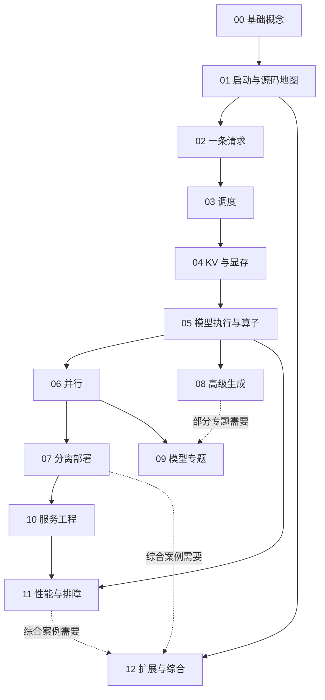

# 从零学习 SGLang 源码：分阶段目录与学习进度

[返回 SGLang 学习导航](../README.md) · [按技术领域选择专题](../README.md#按领域深入)

本文是**源码分析型学习资料的目录与进度索引**，面向会一点 Python、尚未系统读过推理引擎源码的读者。目标是从“一条请求怎样得到回答”，逐步走到调度、缓存、模型执行、多卡通信、分离部署和性能分析。

**当前状态：整套学习资料已完成静态内容复核与文档检查。** 用户已于 2026-09-09 指示按本目录持续阅读和生成资料；现已完成 **13 个阶段、75 / 75 篇正文、6 / 6 份附录**，并逐项核对全部阶段产物与跨篇一致性。运行实验仍为未执行，文档完成不代表 GPU、精度、网络或性能测试通过。逐篇范围和验收记录见[学习进度与版本记录](appendices/06-学习进度与版本变更记录.md)。

**配图补充（2026-09-10）：** 已逐篇评估全部 75 篇，为其中 **39 篇补入 37 张不同原图，共 45 处引用**，保留原有 193 个 Mermaid 图块。每处新增原图均有中文图解、源码对应、来源和使用边界；图片保存在 Wiki 顶层 `images/sglang-source-study/`。可先读 [Unified Cache](04-kv-cache/04-UnifiedRadix与混合状态组件.md)、[TP 层内通信](06-parallelism/02-TensorParallel与层内通信.md)、[EAGLE/MTP](08-advanced-generation/04-EAGLE与MTP的源码主线.md) 的配图示例，或查看[逐篇配图记录](appendices/06-学习进度与版本变更记录.md#6-原图补充与逐篇配图记录)与[图片来源档案](../../images/sglang-source-study/SOURCES.md)。

## 先建立宏观心智模型

**建议先读[架构与心智模型导读](architecture/README.md)。** 本次覆盖审计确认：原有 193 个 Mermaid 图已经包含不少局部与整体结构，但缺少先总后分的集中入口。现补充 **12 篇架构导读、38 张机制图和 12 份本地 SVG 预览**，并为全部 75 篇正文增加对应导读链接。

- 初学者先走：整体架构 → 请求生命周期 → 调度 → 缓存 → 模型执行。
- 准备部署再走：启动装配 → 多卡并行 → PD / Encoder 分离 → 服务治理与性能诊断。
- 理解特性再走：高级生成 → 模型适配与输入输出 → DSL / Diffusion / 插件。

导读与原有 75 篇正文互相链接，原阶段编号保留；源码仍固定在下表版本。覆盖缺口分析、特性地图和全部正文的对应入口见[导读索引](architecture/README.md)。

## 0. 源码基线、目录位置与证据边界

### 0.1 已完成的源码准备

| 项目 | 内容 |
| --- | --- |
| 官方源码 | [sgl-project/sglang](https://github.com/sgl-project/sglang) |
| 仓库与路径基准 | `sgl-project/sglang`；源码路径统一相对于 SGLang 仓库根目录 `.` |
| 官方 remote | `upstream` → `git@github.com:sgl-project/sglang.git`；已实时核对，区别于个人 fork 与内部仓库 |
| 上游分支 | `main`，同时核对官方默认分支为 `main` |
| 本地学习分支 | `codex/sglang-source-study-20260909`，创建于上述仓库，跟踪 `upstream/main` |
| 源码读取工作区 | 独立 Git worktree `sglang-source-study`，共享原 `sglang` 仓的对象库和分支；正文路径均从该 worktree 的仓库根目录起算 |
| 固定 commit | `72d5c5bb73cadd7ffbf5114e5f81e29d36b6c61a` |
| commit 说明 | `[Kimi-K3] Accept fp32 routing weights in the fused MoE finalize (#38612)` |
| commit 时间 | `2026-09-09 16:33:39 +08:00` |
| 读取与远端核对时间 | `2026-09-09`；北京时间 `17:07` 再次核对，官方 `main` 与本地学习分支 commit 一致 |
| 学习工作区状态 | 新 worktree 干净；未修改源码，未安装依赖、导入 SGLang、启动服务或运行模型 |
| 原工作区状态 | 保留 `muxi-main`，HEAD 为 `e8d7e7fe004419902c04641e2ae2f4a973339c60`；原有 26 个未跟踪文件保留 |
| 文档工作区状态 | Wiki 原本已有已修改和未跟踪资料；系列正文、附录及导航已按确认计划完成，保留其他资料 |
| 操作边界 | 源码准备已完成；后续默认只读固定源码并编写、检查学习文档。实际实验另在对应正文记录环境和结果；当前没有 SGLang 代码 patch、提交、推送或运行验证 |

这里的“最新”指**本次拉取并核对时的官方 `main`**，不是某个 release tag，也不意味着后续一直跟随浮动分支。逐篇写作默认使用这个固定 commit；需要升级时，先记录新旧基线和受影响章节，再明确更新，避免一套文档混用不同版本。

已执行的核心 Git 操作如下，保留供追溯，不需要重复创建分支：

```bash
# 以下历史操作在原 SGLang 仓库根目录执行。
git fetch --no-tags \
  upstream refs/heads/main:refs/remotes/upstream/main

git worktree add \
  -b codex/sglang-source-study-20260909 \
  ../sglang-source-study upstream/main
```

学习时打开 `sglang-source-study` worktree，并以其仓库根目录为 `.`。原 `sglang` 工作区继续保持原工作分支。

**路径约定：** 按用户要求，本系列的源码位置统一写为 SGLang 仓内相对路径，例如 `python/sglang/srt/managers/scheduler.py`；不写本机绝对路径。Git 操作中的 `../sglang-source-study` 仅说明相邻 worktree 的组织关系，不作为源码锚点。文档之间的链接仍相对于当前 Markdown 文件，固定 commit 的 GitHub 链接继续保留。

这条约定同时适用于阅读基线、正文、代码片段注释、源码索引与附录，并优先于仓库通用规范中“源码目录使用绝对路径”的要求。需要定位符号时，写成 `python/sglang/srt/managers/scheduler.py::Scheduler.event_loop_normal`，路径起点仍是 SGLang 仓库根目录。

### 0.2 文档为什么放在这里

已查看 Wiki 的 `sglang/`、`llm-inference/`、`vllm/` 目录，并参考[PD 分离下的 PP 源码学习文档](<../disaggregation/PD 分离下的 PP 源码学习文档.md>)的“人话解释 → 源码锚点 → 机制图 → 请求例子”节奏，以及[调度机制总览与学习路线](<../runtime/SGLang 调度机制总览与学习路线.md>)的问题分层方式。

本系列以官方固定版本源码为连续主线，适合放在 `sglang/source-study/`。现有 `sglang/` 专题作为延伸阅读保留；不把旧分支结论直接迁入本系列，也不移动已有文档。

- `sglang/source-study/README.md` 承载完整目录与进度入口，已生成正文在下表提供链接。
- 各篇放入下面按技术主题划分的目录；目录前缀表达推荐学习顺序。
- Mermaid 图直接写在 Markdown 中；借鉴原图统一保存在 Wiki 根目录的 `images/sglang-source-study/`，通过文档相对路径引用，不在各阶段下创建图片目录。
- 本页已链接全部正文与附录。后续扩展也只为已落盘文件补充链接和进度，避免产生失效导航。

### 0.3 目录设计依据与证据边界

下表保留目录设计时确认的入口与模块关系。各篇现已按固定源码完成主线阅读、机制解释与内容复核，具体范围见正文和 A06；入口存在、静态分析与运行验证仍分别记录。

| 本次静态发现 | 对目录设计的影响 | 固定源码依据 |
| --- | --- | --- |
| 入口包含 `sglang serve` 的 CLI 分发，旧 `launch_server` 入口仍在 | 先从当前 CLI 建立入口地图，再追到服务启动 | [CLI](https://github.com/sgl-project/sglang/blob/72d5c5bb73cadd7ffbf5114e5f81e29d36b6c61a/python/sglang/cli/main.py)、[启动分发](https://github.com/sgl-project/sglang/blob/72d5c5bb73cadd7ffbf5114e5f81e29d36b6c61a/python/sglang/launch_server.py) |
| 参数字段、解析与模型/平台规则分布在 `server_args.py` 和 `arg_groups/` | 单独安排“声明值到生效配置”，不只摘一张默认值表 | [配置入口](https://github.com/sgl-project/sglang/blob/72d5c5bb73cadd7ffbf5114e5f81e29d36b6c61a/python/sglang/srt/server_args.py)、[解析流水线](https://github.com/sgl-project/sglang/blob/72d5c5bb73cadd7ffbf5114e5f81e29d36b6c61a/python/sglang/srt/arg_groups/pipeline.py) |
| Scheduler 中有 `dispatch_event_loop`，普通循环使用 `NextBatchPlan`；结果处理等职责已有独立组件 | 先读普通循环和对象边界，之后引入 Overlap、PP、PD 等分支 | [Scheduler](https://github.com/sgl-project/sglang/blob/72d5c5bb73cadd7ffbf5114e5f81e29d36b6c61a/python/sglang/srt/managers/scheduler.py)、[Batch 对象](https://github.com/sgl-project/sglang/blob/72d5c5bb73cadd7ffbf5114e5f81e29d36b6c61a/python/sglang/srt/managers/schedule_batch.py) |
| 缓存包含传统 Radix、Unified Radix、混合池与分层存储相关实现 | 从请求视图和物理槽位开始，再讲索引、组件、回载与生命周期 | [缓存源码树](https://github.com/sgl-project/sglang/tree/72d5c5bb73cadd7ffbf5114e5f81e29d36b6c61a/python/sglang/srt/mem_cache) |
| 当前算子入口位于 `python/sglang/kernels/`；旧 `sglang.jit_kernel` 已移除 | kernel 章节按当前 registry、ops、jit、aot 组织，外部依赖单独标注版本 | [Kernel 说明](https://github.com/sgl-project/sglang/blob/72d5c5bb73cadd7ffbf5114e5f81e29d36b6c61a/python/sglang/kernels/README.md) |

**实现选择补充（04-02 复核）：** 固定基线的默认缓存工厂在未命中特殊分支时最终创建 `UnifiedRadixCache`，并支持显式注册 backend。前文及 04-02 采用传统 `RadixCache` 的部分例子是基本机制的代表阅读，不表示普通服务默认选中该类；实际组件路径在 04-04 展开。[选择链](https://github.com/sgl-project/sglang/blob/72d5c5bb73cadd7ffbf5114e5f81e29d36b6c61a/python/sglang/srt/mem_cache/registry.py#L80)，详见 [04-02](04-kv-cache/02-RadixAttention与前缀匹配.md)。

本系列统一使用三种证据标识：**源码事实**需要固定 commit 的文件/符号；**整理者归纳**用于比喻、教学图和推导；**运行观察**必须有命令、环境和输出。本次没有运行观察，也没有测得性能或精度结论。官方 README 或博客的宣传数字不作为本系列实验结论。

## 1. 先看整套学习路线

### 1.1 读到不同阶段，应该能做什么

共规划 **13 个阶段、75 篇正文、6 份附录**。这是一套可分批完成的长期目录，不要求小白一次读完。

| 阶段 | 主题目录 | 篇数 | 前置阶段 | 完成本阶段后的能力 |
| --- | --- | ---: | --- | --- |
| 00 | `00-foundations/` 基础坐标系 | 5 | 会读简单 Python | 解释 token、两阶段推理、KV 和性能指标 |
| 01 | `01-getting-started/` 源码与启动 | 5 | 00 | 找到入口，解释进程和生效配置，识别运行条件 |
| 02 | `02-request-lifecycle/` 一条请求 | 6 | 01 | 从 API 一直追到输出、停止和资源回收 |
| 03 | `03-scheduling/` 调度 | 6 | 02 | 区分排序、准入、组批与 CPU/GPU 重叠 |
| 04 | `04-kv-cache/` 缓存与显存 | 7 | 03 | 画出请求映射、物理槽位、前缀树和分层回载 |
| 05 | `05-model-execution/` 执行与算子 | 6 | 03、04 | 把一个 batch 追进模型、Attention、采样和 kernel |
| 06 | `06-parallelism/` 多卡与多节点 | 6 | 05 | 画出 TP/PP/DP/EP/CP 的 rank 与通信关系 |
| 07 | `07-disaggregation/` 分离部署 | 6 | 04、06 | 分开请求路由、KV 传输、就绪判断与释放条件 |
| 08 | `08-advanced-generation/` 高级生成 | 6 | 03—05 | 理解受约束生成、分支搜索和投机验证/提交 |
| 09 | `09-model-specialization/` 模型专题 | 6 | 04—06；部分需 08 | 阅读量化、LoRA、混合状态、多模态和模型适配 |
| 10 | `10-serving-operations/` 服务工程 | 5 | 02、06、07 | 关联网关、健康检查、观测和在线生命周期 |
| 11 | `11-performance-engineering/` 测量与排障 | 6 | 03—05、10 | 设计可解释的性能对照，建立故障与测试证据链 |
| 12 | `12-extensions-and-capstone/` 扩展与综合 | 5 | 按专题选修 | 认识 DSL、扩散生成、硬件插件和完整案例 |

**基础主线：** 00—05，共 35 篇。先把单实例里的请求、状态、内存与计算连起来。

**分布式主线：** 06—07，共 12 篇。在理解本地生命周期之后，引入跨 rank 和跨实例协作。

**专题主线：** 08—12，共 28 篇。按业务需要选读；不把模型特例、投机、分离和所有优化开关同时塞进第一个例子。

### 1.2 阶段依赖图



**图意解读：** 方框是学习阶段，不是 SGLang 的运行模块。实线表示主要知识依赖，虚线表示部分文章的前置条件。08 与 09 可以分支选读；12 中的 DSL 和 Diffusion 入口可较早浏览，综合案例则放到最后。

### 1.3 给小白的第一轮阅读方式

第一轮只求建立地图，可以先读 [00-01](00-foundations/01-推理系统与SGLang职责地图.md) → [00-03](00-foundations/03-从文本到Token再到模型输出.md) → [00-04](00-foundations/04-Prefill与Decode及KVCache入门.md) → [01-01](01-getting-started/01-源码目录与最短阅读路线.md) → [01-03](01-getting-started/03-从CLI到服务进程启动.md) → [02-01](02-request-lifecycle/01-API协议到内部请求对象.md) → [02-03](02-request-lifecycle/03-Req与多种Batch对象的分工.md) → [03-01](03-scheduling/01-NormalEventLoop与调度主循环.md) → [03-02](03-scheduling/02-连续批处理与队列状态.md) → [04-01](04-kv-cache/01-请求视图物理槽位与分配器.md) → [05-01](05-model-execution/01-Worker与ModelRunner执行边界.md) → [05-02](05-model-execution/02-以Llama为例读懂模型Forward.md)，再回到各阶段补齐细节。

建议反复使用同一个教学负载：R1 有 8 个输入 token、生成 3 个输出 token；R2 与它共享前 6 个输入 token；R3 是一个更长输入。后续逐次加入缓存、分块、取消、多卡、PD 和投机。数字只用于教学，不代表默认配置或 benchmark。

每次只增加一个变化，并回答四个问题：**谁做决定、数据在哪里、什么时候可用、什么时候可释放。** 先能口述，再看图，最后回源码找条件。

## 2. 目录与命名

```text
ai-infra-wiki/
├── sglang/
│   ├── 已有专题文档……
│   └── source-study/
│       ├── README.md                         # 本页；系列目录与进度入口
│       ├── 00-foundations/                   # 5 篇，已完成静态阅读与文档检查
│       ├── 01-getting-started/                # 5 篇，已完成静态阅读与文档检查
│       ├── 02-request-lifecycle/              # 6 篇，已完成静态阅读与文档检查
│       ├── 03-scheduling/                     # 6 篇，已完成静态阅读与文档检查
│       ├── 04-kv-cache/                       # 已完成 7/7 篇
│       ├── 05-model-execution/                # 已完成 6/6 篇
│       ├── 06-parallelism/                    # 已完成 6/6 篇
│       ├── 07-disaggregation/                 # 已完成 6/6 篇
│       ├── 08-advanced-generation/            # 已完成 6/6 篇
│       ├── 09-model-specialization/           # 已完成 6/6 篇
│       ├── 10-serving-operations/             # 已完成 5/5 篇
│       ├── 11-performance-engineering/        # 已完成 6/6 篇
│       ├── 12-extensions-and-capstone/        # 已完成 5/5 篇
│       └── appendices/                        # 6 份附录，内容复核完成
└── images/
    └── sglang-source-study/                   # 借鉴原图与 SOURCES.md 来源档案
```

各阶段表格中的“文档文件”就是最终相对文件名；已落盘文件以链接显示，例如 `00-foundations/01-推理系统与SGLang职责地图.md`。文章编号用 `阶段-序号` 表示，例如 `00-01`。阶段内不另设只有占位内容的 README，导航集中在本页。

下表源码入口均使用相对于 **SGLang 仓库根目录**的路径，例如 `python/sglang/srt/`、`python/sglang/cli/`、`test/registered/`。

源码入口用于明确阅读起点；详细调用链、行号、状态机、组合约束和测试覆盖见对应正文。源码中存在某模块，不等于其与另一功能组合已经受支持。

## 3. 各阶段详细文档清单

### 阶段 00：先建立推理系统的基础坐标系

**前置：** 会读变量、函数、类和简单循环即可。**目录：** `00-foundations/`。

| 编号 | 文档文件 | 要回答的问题与核心内容 | 首要源码入口 |
| --- | --- | --- | --- |
| 00-01 | [01-推理系统与SGLang职责地图.md](00-foundations/01-推理系统与SGLang职责地图.md) | SGLang 接管哪部分工作？拆清客户端、服务 API、SRT、模型执行、Gateway、DSL 与 Diffusion 的职责。 | `python/sglang/__init__.py`；`python/sglang/cli/main.py` |
| 00-02 | [02-读源码必备的Python与并发基础.md](00-foundations/02-读源码必备的Python与并发基础.md) | 怎样读 dataclass、异步生成器、多进程、ZMQ、回调与 mixin？用真实对象理解“一个类不等于一个进程”。 | `python/sglang/srt/entrypoints/engine.py`；`python/sglang/srt/managers/tokenizer_manager.py` |
| 00-03 | [03-从文本到Token再到模型输出.md](00-foundations/03-从文本到Token再到模型输出.md) | token ID、embedding、hidden states、logits 与采样各是什么？输入长度、输出长度和停止条件怎么区分？ | `python/sglang/srt/tokenizer/`；`python/sglang/srt/models/llama.py`；`python/sglang/srt/layers/sampler.py` |
| 00-04 | [04-Prefill与Decode及KVCache入门.md](00-foundations/04-Prefill与Decode及KVCache入门.md) | 为什么要分 Prefill/Decode？首 token 在哪里产生？权重、激活、KV 的用途与寿命有何区别？ | `python/sglang/srt/model_executor/forward_batch_info.py`；`python/sglang/srt/layers/radix_attention.py` |
| 00-05 | [05-吞吐延迟与显存的基本账本.md](00-foundations/05-吞吐延迟与显存的基本账本.md) | TTFT、ITL、TPOT、端到端延迟、tokens/s 怎样定义？怎样做一个带维度与假设的 KV 容量估算？ | `python/sglang/benchmark/serving.py`（旧 `bench_serving.py` 转发）；`python/sglang/srt/observability/req_time_stats.py` |

**阶段产物与验收：** 一张组件职责图、一张 R1 的输入/输出 token 时间线、一份术语表。读者应能解释“为什么 prompt 长度和生成长度影响不同阶段”，并区分计算量估算与实测耗时。此阶段不要求 GPU。

### 阶段 01：认识代码仓库，读懂服务如何启动

**前置：** 00。**目录：** `01-getting-started/`。

| 编号 | 文档文件 | 要回答的问题与核心内容 | 首要源码入口 |
| --- | --- | --- | --- |
| 01-01 | [01-源码目录与最短阅读路线.md](01-getting-started/01-源码目录与最短阅读路线.md) | 从哪里开始看？建立 CLI → API/Engine → Tokenizer → Scheduler → Worker/Runner → 输出的阅读导航。 | `python/sglang/cli/`；`python/sglang/srt/entrypoints/`；`python/sglang/srt/managers/` |
| 01-02 | [02-环境依赖与最小运行准备.md](01-getting-started/02-环境依赖与最小运行准备.md) | 阅读源码、安装包、加载权重、运行模型分别需要什么？核对平台、驱动、依赖、模型文件与显存；分别给离线阅读和可运行路线。 | `python/pyproject.toml`；`python/sglang/check_env.py`；`docs/docs/get-started/install.mdx` |
| 01-03 | [03-从CLI到服务进程启动.md](01-getting-started/03-从CLI到服务进程启动.md) | `sglang serve` 怎样选择 backend？HTTP、Engine、Tokenizer、Scheduler 与 Detokenizer 如何创建并报告启动状态？ | `python/sglang/cli/serve.py`；`python/sglang/launch_server.py`；`python/sglang/srt/entrypoints/engine.py` |
| 01-04 | [04-从参数声明到最终生效配置.md](01-getting-started/04-从参数声明到最终生效配置.md) | 参数字段、环境变量、模型规则、平台规则、resolve 和 validation 怎么衔接？为什么声明默认值不等于最终配置？ | `python/sglang/srt/server_args.py`；`python/sglang/srt/arg_groups/pipeline.py`；`python/sglang/srt/environ.py` |
| 01-05 | [05-最小请求与启动故障定位.md](01-getting-started/05-最小请求与启动故障定位.md) | 普通文本请求怎样提交？启动超时、模型加载失败、端口冲突与第一条请求失败分别从哪里看？设计首个 smoke check。 | `python/sglang/srt/entrypoints/warmup.py`；`python/sglang/srt/entrypoints/http_server.py`；`docs/docs/basic_usage/send_request.mdx` |

**阶段产物与验收：** 一张进程/线程/组件关系图、一张配置解析顺序图、一份最小请求检查表。无 GPU 时完成静态启动时序，并明确标记运行步骤“未执行”；有合适环境时才记录真实启动和请求输出。

### 阶段 02：完整跟踪一条请求的生命周期

**前置：** 01。**目录：** `02-request-lifecycle/`。

| 编号 | 文档文件 | 要回答的问题与核心内容 | 首要源码入口 |
| --- | --- | --- | --- |
| 02-01 | [01-API协议到内部请求对象.md](02-request-lifecycle/01-API协议到内部请求对象.md) | OpenAI 兼容请求和原生请求如何进入引擎？验证、chat template、采样参数与 request ID 在哪层处理？ | `python/sglang/srt/entrypoints/openai/`；`python/sglang/srt/managers/io_struct.py` |
| 02-02 | [02-Tokenizer与进程间消息通路.md](02-request-lifecycle/02-Tokenizer与进程间消息通路.md) | 谁负责分词和输入预处理？消息怎样发给 Scheduler？批量分词、共享输入和 rank 广播分别是什么边界？ | `python/sglang/srt/managers/tokenizer_manager.py`；`python/sglang/srt/managers/scheduler_components/request_receiver.py` |
| 02-03 | [03-Req与多种Batch对象的分工.md](02-request-lifecycle/03-Req与多种Batch对象的分工.md) | `Req`、`ScheduleBatch`、Worker 输入、`ForwardBatch`、`NextBatchPlan` 谁持有什么？区分请求进度、执行快照和本轮计划。 | `python/sglang/srt/managers/schedule_batch.py`；`python/sglang/srt/managers/tp_worker.py`；`python/sglang/srt/model_executor/forward_batch_info.py` |
| 02-04 | [04-一次Prefill到多轮Decode.md](02-request-lifecycle/04-一次Prefill到多轮Decode.md) | R1 如何被接纳、补算输入、得到首 token，再逐轮更新？每一步改变哪些长度、映射、输出和完成状态？ | `python/sglang/srt/managers/scheduler.py`；`python/sglang/srt/managers/scheduler_components/batch_result_processor.py` |
| 02-05 | [05-Detokenizer与流式输出.md](02-request-lifecycle/05-Detokenizer与流式输出.md) | token 如何增量变回文本？SSE、流式间隔、logprobs 和 finish reason 怎样保持请求对应关系？ | `python/sglang/srt/managers/detokenizer_manager.py`；`python/sglang/srt/managers/scheduler_components/output_streamer.py` |
| 02-06 | [06-完成取消与资源释放.md](02-request-lifecycle/06-完成取消与资源释放.md) | 正常结束、长度上限、客户端断开、abort 如何推进？区分请求结束、batch 收尾、KV 可缓存与槽位可复用。 | `python/sglang/srt/mem_cache/common.py::release_kv_cache`；`python/sglang/srt/managers/scheduler.py::Scheduler.abort_request`；`python/sglang/srt/managers/tokenizer_manager.py` |

**阶段产物与验收：** 一张端到端时序图、一张请求状态机，以及 R1 每轮的字段变化表。练习在不同阶段取消请求，静态列出需要检查的对象；未做故障注入时不得写成取消安全性已经验证。PD 的跨实例退役留到 07。

### 阶段 03：调度器怎样选择、组批并推进请求

**前置：** 02。**目录：** `03-scheduling/`。

| 编号 | 文档文件 | 要回答的问题与核心内容 | 首要源码入口 |
| --- | --- | --- | --- |
| 03-01 | [01-NormalEventLoop与调度主循环.md](03-scheduling/01-NormalEventLoop与调度主循环.md) | 先不引入 Overlap，一轮循环怎样接收、选批、执行、处理结果和空闲检查？`dispatch_event_loop` 如何选择路径？ | `python/sglang/srt/managers/scheduler.py::dispatch_event_loop`；`python/sglang/srt/managers/scheduler.py::Scheduler.event_loop_normal` |
| 03-02 | [02-连续批处理与队列状态.md](03-scheduling/02-连续批处理与队列状态.md) | waiting、running、last batch 和 chunked request 怎样关联？filter、merge、retract 是哪些状态变化？ | `python/sglang/srt/managers/scheduler.py::Scheduler.get_next_batch_to_run`；`python/sglang/srt/managers/schedule_batch.py` |
| 03-03 | [03-排序策略与准入预算.md](03-scheduling/03-排序策略与准入预算.md) | FCFS、缓存感知排序、优先级与 admission 有何区别？为何排第一仍可能不能执行？拆开 token 与请求槽位预算。 | `python/sglang/srt/managers/schedule_policy.py::SchedulePolicy`；`python/sglang/srt/managers/schedule_policy.py::PrefillAdder` |
| 03-04 | [04-ChunkedPrefill与长请求调度.md](03-scheduling/04-ChunkedPrefill与长请求调度.md) | 长输入如何分轮？chunk 余量、动态 chunk、mixed batch 与 Decode 时机怎样关联？不能从切块直接推出公平性保证。 | `python/sglang/srt/managers/scheduler.py`；`python/sglang/srt/managers/scheduler_components/dynamic_chunk_sizer.py`；`python/sglang/srt/managers/schedule_policy.py` |
| 03-05 | [05-Overlap中的CPU与GPU依赖.md](03-scheduling/05-Overlap中的CPU与GPU依赖.md) | CPU 调度与 GPU 计算怎样交叠？result queue、future、stream/event 如何约束读取、写入和收尾？ | `python/sglang/srt/managers/scheduler.py::Scheduler.event_loop_overlap`；`python/sglang/srt/managers/overlap_utils.py` |
| 03-06 | [06-回撤背压饥饿与调度排障.md](03-scheduling/06-回撤背压饥饿与调度排障.md) | 显存不足、队列增长、请求不前进时如何查？区分等待策略、延迟接纳、retract、输入阻塞和真实 hang。 | `python/sglang/srt/managers/prefill_delayer.py`；`python/sglang/srt/managers/scheduler_input_blocker.py`；`python/sglang/srt/managers/scheduler_components/invariant_checker.py` |

**阶段产物与验收：** R1/R2/R3 连续 5 轮的调度账本、普通与 Overlap 对照时序图、排序/准入/执行的职责表。必须能解释“Overlap 隐藏部分开销”所依赖的时序，而不把它说成 GPU 接管了调度。

### 阶段 04：KV Cache、前缀复用与显存生命周期

**前置：** 03。**目录：** `04-kv-cache/`。

| 编号 | 文档文件 | 要回答的问题与核心内容 | 首要源码入口 |
| --- | --- | --- | --- |
| 04-01 | [01-请求视图物理槽位与分配器.md](04-kv-cache/01-请求视图物理槽位与分配器.md) | 请求位置怎样映射到 KV？ReqToToken、pool、allocator、page 与 batch 分配策略各管什么？ | `python/sglang/srt/mem_cache/memory_pool.py`；`python/sglang/srt/mem_cache/allocator/`；`python/sglang/srt/mem_cache/allocation.py` |
| 04-02 | [02-RadixAttention与前缀匹配.md](04-kv-cache/02-RadixAttention与前缀匹配.md) | 一棵前缀树如何找可复用 KV？拆解 key、匹配、分裂、插入、引用与淘汰；追踪 R1/R2 的共享前缀。 | `python/sglang/srt/mem_cache/radix_cache.py::RadixCache`；`python/sglang/srt/mem_cache/base_prefix_cache.py` |
| 04-03 | [03-命中条件与缓存隔离.md](04-kv-cache/03-命中条件与缓存隔离.md) | 相同文本为何不一定可复用？核查 token、模型、LoRA、salt、多模态输入和会话的实际缓存键及隔离路径。 | `python/sglang/srt/mem_cache/radix_cache.py::RadixKey`；`python/sglang/srt/managers/schedule_batch.py`；`python/sglang/srt/session/` |
| 04-04 | [04-UnifiedRadix与混合状态组件.md](04-kv-cache/04-UnifiedRadix与混合状态组件.md) | Full、SWA、Mamba 等状态怎样组成可复用前缀？组件、检查点、复制和安全匹配深度如何交互？ | `python/sglang/srt/mem_cache/unified_radix_cache.py::UnifiedRadixCache`；`python/sglang/srt/mem_cache/unified_cache/`；`python/sglang/srt/mem_cache/hybrid_cache/` |
| 04-05 | [05-HiCache分层存储与回载.md](04-kv-cache/05-HiCache分层存储与回载.md) | GPU、主存和外部存储怎样协作？写回、预取、回载、锁定、传输完成与 admission 如何衔接？ | `python/sglang/srt/mem_cache/unified_radix_cache.py`；`python/sglang/srt/managers/cache_controller.py`；`python/sglang/srt/mem_cache/hybrid_cache/hybrid_cache_controller.py`；`python/sglang/srt/mem_cache/storage/` |
| 04-06 | [06-容量规划碎片与显存回收.md](04-kv-cache/06-容量规划碎片与显存回收.md) | 显存预算由哪些对象决定？解释 page 对齐、缓存保留、淘汰、回撤、混合池与可选统一内存机制的空间账本。 | `python/sglang/srt/mem_cache/kv_cache_configurator.py`；`python/sglang/srt/mem_cache/allocation_sizing.py`；`python/sglang/srt/mem_cache/unified_memory_pool.py` |
| 04-07 | [07-KV缓存全生命周期与排障.md](04-kv-cache/07-KV缓存全生命周期与排障.md) | 逻辑命中却无性能收益、KV 不足、共享状态污染、回载等待如何定位？检查索引、数据、锁和释放的对应关系。 | `python/sglang/srt/mem_cache/kv_cache_builder.py`；`python/sglang/srt/managers/scheduler_components/pool_stats_observer.py`；`python/sglang/srt/managers/scheduler_components/invariant_checker.py`；`test/registered/unit/managers/` |

**阶段产物与验收：** 请求索引→槽位→每层物理状态的示意图、R1/R2 的树变化图、L1/L2/L3 回载时序、生命周期所有权表。必须区分“索引命中”“状态可恢复”“GPU 数据已就绪”“资源可以回收”。

### 阶段 05：从一次 Batch 进入模型和算子

**前置：** 03、04。**目录：** `05-model-execution/`。

| 编号 | 文档文件 | 要回答的问题与核心内容 | 首要源码入口 |
| --- | --- | --- | --- |
| 05-01 | [01-Worker与ModelRunner执行边界.md](05-model-execution/01-Worker与ModelRunner执行边界.md) | Scheduler 怎样把执行计划交给 worker/runner？CPU 元数据如何成为设备输入？谁选择 forward 路径并返回结果？ | `python/sglang/srt/managers/tp_worker.py`；`python/sglang/srt/model_executor/model_runner.py::ModelRunner.forward`；`python/sglang/srt/model_executor/forward_batch_info.py` |
| 05-02 | [02-以Llama为例读懂模型Forward.md](05-model-execution/02-以Llama为例读懂模型Forward.md) | 从 embedding、norm、Attention、MLP 到 lm_head，逐层标注主要 tensor shape、残差与 KV 读写位置。 | `python/sglang/srt/models/llama.py`；`python/sglang/srt/layers/linear.py`；`python/sglang/srt/layers/radix_attention.py` |
| 05-03 | [03-Attention后端与执行元数据.md](05-model-execution/03-Attention后端与执行元数据.md) | Attention 接口如何连接不同 backend？Prefill/Decode 需要哪些长度、位置与 KV 索引？算法、接口和实现如何区分？ | `python/sglang/srt/layers/attention/base_attn_backend.py`；`python/sglang/srt/layers/attention/attention_registry.py`；`python/sglang/srt/model_executor/model_runner_components/attention_backend_setup.py` |
| 05-04 | [04-Logits采样与输出概率.md](05-model-execution/04-Logits采样与输出概率.md) | logits 如何经过 penalty、temperature、top-k/top-p、采样和 logprob 提取？哪些工作可分批或延迟执行？ | `python/sglang/srt/layers/logits_processor.py`；`python/sglang/srt/layers/sampler.py`；`python/sglang/srt/sampling/` |
| 05-05 | [05-CUDAGraph编译与执行模式.md](05-model-execution/05-CUDAGraph编译与执行模式.md) | eager、图捕获、重放、分段/可中断图如何选择？batch shape、输入 buffer、输出共享与回退条件如何约束执行？ | `python/sglang/srt/model_executor/runner_backend/`；`python/sglang/srt/model_executor/cuda_graph_config.py`；`python/sglang/srt/compilation/` |
| 05-06 | [06-Kernel注册选择与实现阅读.md](05-model-execution/06-Kernel注册选择与实现阅读.md) | 从 Python 算子入口怎样追到实际后端？读 registry、selector、ops、JIT/AOT 边界，用一个小算子说明正确性与性能的检查层次。 | `python/sglang/kernels/registry.py`；`python/sglang/kernels/selector.py`；`python/sglang/kernels/ops/`；`python/sglang/kernels/jit/` |

**阶段产物与验收：** R1 的一次 forward 数据流图、主要 tensor shape 表、backend 选择图、一个算子调用链。此阶段只选代表模型与代表后端，不逐个展开所有模型文件；外部算子源码需要另行固定依赖版本。

### 阶段 06：多卡、多节点与并行坐标系

**前置：** 05。**目录：** `06-parallelism/`。

| 编号 | 文档文件 | 要回答的问题与核心内容 | 首要源码入口 |
| --- | --- | --- | --- |
| 06-01 | [01-Rank进程组与通信基础.md](06-parallelism/01-Rank进程组与通信基础.md) | world/global/local rank、group、设备编号是什么？广播、all-reduce、all-gather、all-to-all、send/recv 分别传什么？ | `python/sglang/srt/distributed/parallel_state.py`；`python/sglang/srt/distributed/bootstrap.py`；`python/sglang/srt/distributed/communication_op.py` |
| 06-02 | [02-TensorParallel与层内通信.md](06-parallelism/02-TensorParallel与层内通信.md) | 同一层如何切 tensor？线性层、Attention head、词表与采样怎样分布？哪些张量需要规约或收集？ | `python/sglang/srt/layers/linear.py`；`python/sglang/srt/distributed/device_communicators/`；`python/sglang/srt/models/llama.py` |
| 06-03 | [03-DataParallel与DPAttention.md](06-parallelism/03-DataParallel与DPAttention.md) | 独立实例 DP、引擎内控制器与 DP Attention 怎么区分？请求分发和跨 rank 同步属于谁？ | `python/sglang/srt/managers/data_parallel_controller.py`；`python/sglang/srt/managers/scheduler_components/dp_attn.py`；`python/sglang/srt/layers/dp_attention.py` |
| 06-04 | [04-PipelineParallel与Microbatch.md](06-parallelism/04-PipelineParallel与Microbatch.md) | 如何切模型层和流水推进 batch？hidden states、proxy tensor、控制消息和 KV cache 分别有什么生命周期？ | `python/sglang/srt/managers/scheduler_pp_mixin.py`；`python/sglang/srt/model_executor/forward_batch_info.py` |
| 06-05 | [05-MoE专家并行与负载均衡.md](06-parallelism/05-MoE专家并行与负载均衡.md) | token 路由、dispatch、专家计算、combine、EPLB 与弹性 EP 怎样分工？区分 token 负载和请求负载。 | `python/sglang/srt/layers/moe/`；`python/sglang/srt/eplb/`；`python/sglang/srt/elastic_ep/` |
| 06-06 | [06-ContextParallel与并行组合.md](06-parallelism/06-ContextParallel与并行组合.md) | 长上下文 token、KV、Attention 计算怎样分片？区分 Prefill/Decode context parallel，逐项核查与 TP/PP/DP/EP 的合法组合。 | `python/sglang/srt/arg_groups/parallel_hook.py`；`python/sglang/srt/distributed/parallel_state.py`；`test/registered/cp/`；`test/registered/dcp/` |

**阶段产物与验收：** 用一个 8 卡教学拓扑分别画 TP、PP、DP、EP、CP 的切分对象和通信；它们是独立示例，不能当作全部叠加后的可运行配置。选一个基线明确支持的组合追踪 R1，并列出配置限制和未验证项。

### 阶段 07：Prefill、Decode 与 Encoder 分离

**前置：** 04、06。**目录：** `07-disaggregation/`。

| 编号 | 文档文件 | 要回答的问题与核心内容 | 首要源码入口 |
| --- | --- | --- | --- |
| 07-01 | [01-PD分离职责与端到端请求地图.md](07-disaggregation/01-PD分离职责与端到端请求地图.md) | 为什么拆分 P/D？谁路由、谁产生 KV、谁准备接收空间、谁决定开始 Decode？区分控制通道和数据通道。 | `python/sglang/srt/disaggregation/prefill.py`；`python/sglang/srt/disaggregation/decode.py`；`sgl-model-gateway/src/` |
| 07-02 | [02-Prefill侧Bootstrap与传输状态.md](07-disaggregation/02-Prefill侧Bootstrap与传输状态.md) | P 侧怎样登记、握手、排队、计算和发送？传输任务、请求、发送 buffer 的寿命如何关联？ | `python/sglang/srt/disaggregation/prefill.py`；`python/sglang/srt/disaggregation/common/` |
| 07-03 | [03-Decode侧预分配接收与就绪.md](07-disaggregation/03-Decode侧预分配接收与就绪.md) | D 侧如何预分配、等待 KV、处理错误并进入可调度状态？映射完成、接收完成和模型可读取怎样判定？ | `python/sglang/srt/disaggregation/decode.py`；`python/sglang/srt/disaggregation/decode_schedule_batch_mixin.py` |
| 07-04 | [04-KV传输接口与后端实现地图.md](07-disaggregation/04-KV传输接口与后端实现地图.md) | 公共传输抽象如何接入 Mooncake、NIXL、MoRI 等？内存注册、rank mapping、metadata、数据搬运和 poll 各属于哪层？ | `python/sglang/srt/disaggregation/base/`；`python/sglang/srt/disaggregation/mooncake/`；`python/sglang/srt/disaggregation/nixl/`；`python/sglang/srt/disaggregation/mori/` |
| 07-05 | [05-PD异常取消与资源退役.md](07-disaggregation/05-PD异常取消与资源退役.md) | 请求取消、超时、对端失败或重启时有哪些未完成操作？逐项核查跨 rank 清理、异步写入与槽位复用边界。 | `python/sglang/srt/disaggregation/prefill.py`；`python/sglang/srt/disaggregation/decode.py`；`test/registered/disaggregation/` |
| 07-06 | [06-PD与PP及Encoder分离的组合.md](07-disaggregation/06-PD与PP及Encoder分离的组合.md) | PP stage 与 KV 分片如何对应？Encoder 输出怎样进入后续阶段？区分 embedding、激活和 KV 的转移，建立组合约束表。 | `python/sglang/srt/managers/scheduler_pp_mixin.py`；`python/sglang/srt/disaggregation/encoder/`；`python/sglang/srt/arg_groups/pd_disaggregation_hook.py` |

**阶段产物与验收：** 一张 P/D 时序图、两侧状态表、一张 KV 分片拓扑、一份取消/失败时仍在途的对象清单。不能用健康检查或消息 ACK 单独证明 DMA 完成和资源可复用。先读这版官方实现，历史内部协议只在另立版本对照专题时讨论。

### 阶段 08：结构化输出、搜索与投机解码

**前置：** 03—05；涉及跨 rank/PD 组合时再读 06—07。**目录：** `08-advanced-generation/`。

| 编号 | 文档文件 | 要回答的问题与核心内容 | 首要源码入口 |
| --- | --- | --- | --- |
| 08-01 | [01-结构化输出与Grammar状态.md](08-advanced-generation/01-结构化输出与Grammar状态.md) | JSON/regex/grammar 如何约束允许生成的 token？grammar 编译、缓存、请求状态与采样 mask 如何连接？ | `python/sglang/srt/constrained/`；`python/sglang/srt/sampling/sampling_batch_info.py` |
| 08-02 | [02-BeamSearch与请求分支状态.md](08-advanced-generation/02-BeamSearch与请求分支状态.md) | 多候选如何扩展、排序、保留和完成？分支的输出历史与 KV 共享/复制分别怎样管理？ | `python/sglang/srt/beam_search/`；`python/sglang/srt/managers/scheduler_components/batch_result_processor.py` |
| 08-03 | [03-投机解码的DraftVerifyCommit.md](08-advanced-generation/03-投机解码的DraftVerifyCommit.md) | 为什么先猜多个 token 再验证？接受率、拒绝位置、补充 token、随机采样语义和最终提交如何区分？ | `python/sglang/srt/speculative/spec_info.py`；`python/sglang/srt/speculative/spec_registry.py`；`python/sglang/srt/speculative/base_spec_worker.py` |
| 08-04 | [04-EAGLE与MTP的源码主线.md](08-advanced-generation/04-EAGLE与MTP的源码主线.md) | draft、target、隐藏状态、候选树和 KV 分别属于谁？以一个明确算法走通 draft→verify→更新，再比较 MTP 路径。 | `python/sglang/srt/speculative/eagle_worker_v2.py`；`python/sglang/srt/speculative/eagle_info.py`；`python/sglang/srt/speculative/frozen_kv_mtp_worker_v2.py` |
| 08-05 | [05-DFlashNgram与自适应投机.md](08-advanced-generation/05-DFlashNgram与自适应投机.md) | 不同候选来源改变了什么？查阅 DFlash、Ngram、独立 draft 与自适应参数入口，按模型条件决定展开深度。 | `python/sglang/srt/speculative/dflash_worker_v2.py`；`python/sglang/srt/speculative/ngram_worker.py`；`python/sglang/srt/speculative/adaptive_spec_params.py` |
| 08-06 | [06-投机中的OverlapKV与组合约束.md](08-advanced-generation/06-投机中的OverlapKV与组合约束.md) | 验证完成前哪些状态只能暂存？拒绝后怎样回收？核查 LoRA、grammar、图执行、TP/PP/PD 的支持与回退。 | `python/sglang/srt/speculative/spec_tp_sync.py`；`python/sglang/srt/arg_groups/speculative_hook.py`；`test/registered/spec/` |

**阶段产物与验收：** “猜 4 个、接受 2 个”的教学时序、暂存/提交/回收状态表、功能组合检查表。算法语义需要对应原始论文或正式说明；源码与算法阅读不等于精度等价证明，也不假定高接受率必然带来加速。

### 阶段 09：量化、LoRA、混合架构与多模态模型

**前置：** 04—06；09-04 的投机交互需要 08。**目录：** `09-model-specialization/`。

| 编号 | 文档文件 | 要回答的问题与核心内容 | 首要源码入口 |
| --- | --- | --- | --- |
| 09-01 | [01-模型注册配置与权重加载.md](09-model-specialization/01-模型注册配置与权重加载.md) | architecture 名称如何选择模型类？配置、分片权重、参数名映射、dtype 和加载器如何连接？ | `python/sglang/srt/models/registry.py`；`python/sglang/srt/configs/model_config.py`；`python/sglang/srt/model_loader/` |
| 09-02 | [02-量化格式与计算路径.md](09-model-specialization/02-量化格式与计算路径.md) | 权重、激活、KV 量化分别改变什么？scale、布局、加载转换和 kernel 支持如何约束 FP8/FP4/INT4 等路径？ | `python/sglang/srt/layers/quantization/`；`python/sglang/srt/mem_cache/kv_cache_dtype.py`；`test/registered/quant/` |
| 09-03 | [03-MultiLoRA加载调度与隔离.md](09-model-specialization/03-MultiLoRA加载调度与隔离.md) | adapter 怎样登记、驻留、切换和卸载？同 batch 多 LoRA 如何执行，缓存键与 drain 条件怎样保证正确关联？ | `python/sglang/srt/lora/lora_manager.py`；`python/sglang/srt/lora/mem_pool.py`；`python/sglang/srt/lora/lora_drainer.py` |
| 09-04 | [04-MLA稀疏注意力与混合状态模型.md](09-model-specialization/04-MLA稀疏注意力与混合状态模型.md) | 从 Dense 模型扩展到 DeepSeek/Kimi/Qwen 混合架构时，哪些层、KV 布局、检查点和模型钩子改变？选代表路径追踪。 | `python/sglang/srt/models/deepseek_v2.py`；`python/sglang/srt/models/deepseek_v4.py`；`python/sglang/srt/models/kimi_k3.py`；`python/sglang/srt/layers/attention/` |
| 09-05 | [05-图像视频音频输入的处理链路.md](09-model-specialization/05-图像视频音频输入的处理链路.md) | 多模态如何读取、预处理、编码、占位和对齐 token？区分媒体缓存、embedding 缓存、encoder 输出与生成 KV。 | `python/sglang/srt/managers/multimodal_processor.py`；`python/sglang/srt/multimodal/processors/`；`python/sglang/srt/mem_cache/multimodal_cache.py` |
| 09-06 | [06-EmbeddingRerank与模型适配清单.md](09-model-specialization/06-EmbeddingRerank与模型适配清单.md) | 非生成任务如何走输出路径？怎样为一个模型建立最小注册、加载、forward、输出协议与验证清单？ | `python/sglang/srt/models/llama_embedding.py`；`python/sglang/srt/entrypoints/engine_score_mixin.py`；`test/registered/model_loading/` |

**阶段产物与验收：** 模型能力→配置→层/算子→状态→测试的适配表，选一个模型家族与 Llama 基线做差异图。每个案例声明确切模型与配置；不对所有家族逐文件解读，不把某硬件或量化格式的结果泛化。

### 阶段 10：从单实例走向可靠服务

**前置：** 02、06、07。**目录：** `10-serving-operations/`。

| 编号 | 文档文件 | 要回答的问题与核心内容 | 首要源码入口 |
| --- | --- | --- | --- |
| 10-01 | [01-ModelGateway注册路由与缓存亲和.md](10-serving-operations/01-ModelGateway注册路由与缓存亲和.md) | Gateway 如何发现 worker、选择普通/P/D 实例并处理负载？网关路由与实例内调度有什么不同？ | `sgl-model-gateway/src/`；`sgl-model-gateway/README.md` |
| 10-02 | [02-HTTPgRPC与Rust服务边界.md](10-serving-operations/02-HTTPgRPC与Rust服务边界.md) | Python HTTP、gRPC bridge、Rust server、Gateway 分别承担什么？协议转换、分词、流式与错误如何跨边界？ | `python/sglang/srt/entrypoints/grpc_bridge.py`；`python/sglang/srt/rust_server/`；`rust/sglang-server/`；`proto/` |
| 10-03 | [03-健康检查超时限流与优雅退出.md](10-serving-operations/03-健康检查超时限流与优雅退出.md) | 存活、就绪、可服务和请求成功怎么区分？看 watchdog、队列、重试、断连和退出路径，说明重试的适用语义。 | `python/sglang/srt/entrypoints/http_server.py`；`python/sglang/srt/utils/watchdog.py`；`sgl-model-gateway/src/` |
| 10-04 | [04-Metrics日志与Trace关联.md](10-serving-operations/04-Metrics日志与Trace关联.md) | 如何用 request ID 把 API、队列、Prefill、Decode、传输和输出串起来？指标归属、标签与时间边界如何检查？ | `python/sglang/srt/observability/`；`python/sglang/srt/managers/scheduler_components/metrics_reporter.py` |
| 10-05 | [05-权重更新暂停恢复与RL接口.md](10-serving-operations/05-权重更新暂停恢复与RL接口.md) | 在线更新、暂停/恢复、权重导出与 rollout 如何协作？在途请求、KV、权重版本和控制接口怎样保持一致？ | `python/sglang/srt/model_executor/model_runner_components/weight_updater.py`；`python/sglang/srt/managers/tokenizer_control_mixin.py`；`python/sglang/srt/weight_sync/`；`test/registered/rl/` |

**阶段产物与验收：** 一张 Gateway→Runtime 请求图、一张服务状态表、一次请求的观测字段清单。部署脚本只作为阅读或后续隔离实验材料；Kubernetes 运维、生产变更及外部训练框架内部实现不混入本系列默认实践范围。

### 阶段 11：性能测量、系统排障与测试方法

**前置：** 03—05、10；分布式问题需 06—07。**目录：** `11-performance-engineering/`。

| 编号 | 文档文件 | 要回答的问题与核心内容 | 首要源码入口 |
| --- | --- | --- | --- |
| 11-01 | [01-Benchmark设计与指标口径.md](11-performance-engineering/01-Benchmark设计与指标口径.md) | 单 batch、离线吞吐、在线 serving benchmark 各回答什么？记录输入/输出分布、并发、到达率、warmup、缓存与失败请求。 | `python/sglang/benchmark/one_batch.py`；`python/sglang/benchmark/offline_throughput.py`；`python/sglang/benchmark/serving.py`（三种旧 `bench_*.py` 均转发） |
| 11-02 | [02-Profiler与时间线阅读.md](11-performance-engineering/02-Profiler与时间线阅读.md) | 如何采集并解释 CPU/GPU 时间线？识别调度空洞、同步、Attention/GEMM、通信和数据搬运，避免只看总耗时。 | `python/sglang/profiler.py`；`python/sglang/srt/managers/scheduler_components/profiler_manager.py`；`docs/docs/developer_guide/benchmark_and_profiling.mdx` |
| 11-03 | [03-从现象定位性能瓶颈.md](11-performance-engineering/03-从现象定位性能瓶颈.md) | TTFT 高、ITL 抖动、吞吐低、cache hit 无收益分别怎样提出可证伪假设？建立逐层排除的排障树。 | `python/sglang/srt/observability/scheduler_stage_metrics.py`；`python/sglang/srt/observability/forward_pass_metrics.py`；`python/sglang/srt/debug_utils/` |
| 11-04 | [04-参数对照与性能实验记录.md](11-performance-engineering/04-参数对照与性能实验记录.md) | 如何隔离 batch、chunk、缓存、graph、量化和并行的影响？怎样比较相同负载下的吞吐、延迟分位数与容量？ | `python/sglang/srt/arg_groups/fields/`；`benchmark/`；`test/registered/perf/` |
| 11-05 | [05-测试分层精度与失败复现.md](11-performance-engineering/05-测试分层精度与失败复现.md) | 单元、server、精度、分布式与硬件测试各覆盖什么？如何选择最小测试、固定 seed/配置、保留失败样例和证据？ | `test/README.md`；`test/registered/unit/`；`test/registered/accuracy/`；`test/run_suite.py` |
| 11-06 | [06-源码变更阅读与版本回归检查.md](11-performance-engineering/06-源码变更阅读与版本回归检查.md) | 如何从一个 diff 追踪调用者、状态寿命和组合影响？怎样判断文档需更新，设计能发现退化的最小回归检查？ | `docs/docs/developer_guide/contribution_guide.mdx`；`.pre-commit-config.yaml`；`test/registered/` |

**阶段产物与验收：** 一份完整实验记录模板、一张性能排障树、一份静态审阅与动态验证分开的报告。GPU 不可用时，可以设计实验并分析已有可追溯材料，但不能生成虚构 trace、跑分或测试成功结论。

### 阶段 12：扩展视野与综合案例

**前置：** 前两篇至少 01；12-03 需 05、06；12-04 需 05、09；12-05 需 07、11。**目录：** `12-extensions-and-capstone/`。

| 编号 | 文档文件 | 要回答的问题与核心内容 | 首要源码入口 |
| --- | --- | --- | --- |
| 12-01 | [01-FrontendDSL与Runtime的关系.md](12-extensions-and-capstone/01-FrontendDSL与Runtime的关系.md) | `function`、`gen`、IR、interpreter、backend 怎样组织一次程序执行？DSL 编排和 SRT 请求调度如何分工？ | `python/sglang/lang/api.py`；`python/sglang/lang/ir.py`；`python/sglang/lang/interpreter.py`；`python/sglang/lang/backend/` |
| 12-02 | [02-Diffusion服务与生成流程入门.md](12-extensions-and-capstone/02-Diffusion服务与生成流程入门.md) | 图像/视频扩散生成的请求、pipeline、去噪步骤和输出怎样流动？哪些概念可以类比自回归 LLM，哪些需要重新建立？ | `python/sglang/multimodal_gen/runtime/entrypoints/`；`python/sglang/multimodal_gen/runtime/pipelines_core/`；`python/sglang/multimodal_gen/runtime/managers/` |
| 12-03 | [03-Diffusion并行缓存与性能地图.md](12-extensions-and-capstone/03-Diffusion并行缓存与性能地图.md) | 扩散模型如何处理并行、缓存和图执行？选择一个模型 pipeline，拆开模型计算、通信、媒体处理及其专用配置。 | `python/sglang/multimodal_gen/runtime/distributed/`；`python/sglang/multimodal_gen/runtime/cache/`；`docs/docs/sglang-diffusion/` |
| 12-04 | [04-硬件后端插件与生态边界.md](12-extensions-and-capstone/04-硬件后端插件与生态边界.md) | 平台检测、硬件 backend、kernel 和插件怎样接入？认识 GPU、CPU、MLX、NPU 等现有入口，区分仓内实现和外部项目。 | `python/sglang/srt/platforms/`；`python/sglang/srt/hardware_backend/`；`python/sglang/srt/plugins/`；`python/sglang/cli/serve_backends.py` |
| 12-05 | [05-从需求到源码与验证的综合案例.md](12-extensions-and-capstone/05-从需求到源码与验证的综合案例.md) | 给定共享长前缀、多轮交互与延迟目标，怎样连接请求、缓存、调度、模型、拓扑与测量？形成可追溯的设计与验证记录。 | `python/sglang/srt/entrypoints/engine.py`；`python/sglang/srt/managers/scheduler.py`；`tools/sglang-simulator/`；`test/registered/` |

**阶段产物与验收：** DSL 与 Runtime 对照图、Diffusion 独立流程图、硬件/插件接入地图、一个综合案例。模拟器结果必须标明模拟假设，不代表真实 GPU/网络表现；外部项目另固定仓库与 commit 后才能展开源码结论。

## 4. 六份附录与检索工具

六份附录已覆盖全部阶段，集中回答横跨多个阶段的问题，并随版本更新维护。完整机制与适用条件仍见对应正文。

| 编号 | 附录文件（位于 `appendices/`） | 内容 | 首次积累阶段 |
| --- | --- | --- | --- |
| A01 | [01-术语与对象速查.md](appendices/01-术语与对象速查.md) | 人话解释、英文缩写、关键类、不同生命周期对象的区分 | 00—02 |
| A02 | [02-源码入口与调用链索引.md](appendices/02-源码入口与调用链索引.md) | 问题→文件/符号→固定 commit 链接→所属正文；源码重构时更新映射 | 00 起滚动积累 |
| A03 | [03-配置解析与功能兼容矩阵.md](appendices/03-配置解析与功能兼容矩阵.md) | 声明值、解析规则、生效值、模型/硬件/并行限制、回退条件与证据等级 | 01，06 起扩充 |
| A04 | [04-症状到源码的排障索引.md](appendices/04-症状到源码的排障索引.md) | 卡住、OOM、命中异常、延迟、输出错误、传输失败→对象/状态→检查入口 | 02，11 汇总 |
| A05 | [05-实验记录与证据模板.md](appendices/05-实验记录与证据模板.md) | commit、环境、模型、权重版本、命令、请求负载、原始输出、图表、限制、复现步骤 | 01，11 完善 |
| A06 | [06-学习进度与版本变更记录.md](appendices/06-学习进度与版本变更记录.md) | 文章状态、完成时间、基线、复核范围、未解问题和升级影响 | 第一篇正文落盘时 |

## 5. 与现有 Wiki 资料的关系

现有资料帮助预习和比较；是否与本次官方源码一致，需要正文按固定版本重新核查。尤其要保留源码型资料和第三方资料整理的证据区别。

| 已有资料 | 在新系列中的用途 | 使用边界 |
| --- | --- | --- |
| [LLM Prefill 与 Decode 阶段源码学习](<../../llm-inference/foundations/LLM Prefill 与 Decode 阶段源码学习文档.md>) | 00、02 的两阶段心智模型参考 | 回到本文 commit 重新核对路径 |
| [调度机制总览与学习路线](<../runtime/SGLang 调度机制总览与学习路线.md>) | 03 的排序/准入/重叠职责参考 | 它是第三方整理并附固定版抽查，不等于本系列完整源码证明 |
| [调度器请求生命周期与重叠调度](<../runtime/SGLang 调度器请求生命周期与重叠调度学习文档.md>) | 02、03 的教学节奏与对象拆分 | 重核当前 `NextBatchPlan` 和组件边界 |
| [Chunked Prefill 与调度器显存预算](<../runtime/SGLang Chunked Prefill 与调度器显存预算学习文档.md>) | 03、04 的预算与分块问题 | 不复用未对应当前配置的默认值 |
| [RadixAttention 与 HiCache 技术主线](<../kv-cache/SGLang RadixAttention 与 HiCache KV Cache 技术主线学习文档.md>) | 04 的技术背景 | 区分来源信息、当前实现和实验结论 |
| [Unified Radix Cache](<../kv-cache/SGLang Unified Radix Cache 学习文档.md>) | 04、09 的混合状态概念预习 | 回查当前组件实现及选择规则 |
| [PD 分离下的 PP 源码学习](<../disaggregation/PD 分离下的 PP 源码学习文档.md>) | 写作风格与 06、07 的对照阅读 | 该文基于历史 `muxi-main`，不直接代入当前官方协议 |
| [Torch Profiler 与 Trace](<../performance-engineering/SGLang Torch Profiler 与 Trace 性能分析学习文档.md>) | 11 的观测入门参考 | 旧 trace、命令和结果保留自己的环境及版本 |

## 6. 每篇正文的统一写作与验收要求

### 6.1 单篇结构

每篇只讲一条可以走通的主线。一般采用下列结构，必要时合并小节，避免为了格式重复概念：

1. **阅读基线与范围**：以 SGLang 仓库根目录为基准的相对源码路径、分支、commit、日期、工作区状态、操作边界、前置文章和本篇不覆盖的路径。
2. **人话版与术语**：先说明要解决什么问题，再引入源码名。新术语在第一次出现处解释。
3. **整体地图**：标出入口、参与对象和控制权；说明方框是进程、组件还是教学抽象。
4. **核心对象与约束**：列出字段用途、所有者、生命周期、就绪/释放条件，以及启动限制。
5. **逐步 walkthrough**：用 R1/R2/R3 或一个固定 rank 拓扑贯穿，分开控制流、数据流与状态变化。
6. **源码锚点与关键片段**：提供文件/符号和固定 commit 链接，只摘必要分支；先解释行为，再解释设计作用。
7. **边界与排障**：列出失败、回退、取消、重试及兼容条件，把现象反查到对象或状态。
8. **练习、验收与下一篇**：至少一个能检验理解的问题；如有运行步骤，记录结果与条件；明确哪些仍仅静态分析。

复杂的调度、缓存与分布式章节，通常至少有一张 Mermaid 流程/时序/状态图和一个字段或状态变化表。非 Mermaid 图只有在有助于表达布局、真实 trace 或性能结果时才使用，并说明图的来源与图意。

### 6.2 深度与边界

- 基础篇以“读者能沿调用链解释一条请求”为完成标准，不以文件数、字数或术语数衡量。
- 核心篇要走到状态变更、数据依赖和资源释放条件；路径存在只算阅读入口，不算机制验证。
- 先建立普通文本、代表 Dense 模型、单实例主线；再独立增加 Overlap、缓存、并行或模型特例。
- 配置与兼容矩阵使用“源码允许 / 源码拒绝 / 有测试入口 / 本次实测 / 待确认”等明确状态；有测试文件不等于测试已通过。
- 算法正确性涉及论文时追加第一方来源；下载到本地的外部源码单独记录版本，不能假定由主仓 commit 自动固定。
- 性能结果必须保留硬件、模型/权重、dtype、并行、输入/输出长度分布、请求到达方式、缓存条件与测量口径。
- 本系列覆盖主要机制与代表实现，不承诺逐文件解释全部模型、kernel、硬件平台、外部训练框架或部署平台。

### 6.3 文档完成检查

以下是后续新增或修订单篇时复用的检查清单；保留空框便于复制。本轮整套完成证据见 A06 第 5 节。

- [ ] 基线与实际读取目录一致，源码事实、整理者归纳、运行观察分别标注。
- [ ] 关键符号、路径和固定 commit 链接已复查，图与文字一致。
- [ ] 读者能回答谁控制、数据在哪里、何时就绪、何时释放。
- [ ] 练习与验收问题可检验本篇理解；已执行/未执行步骤写清楚。
- [ ] 标题层级清晰；本地文档与图片相对链接能解析；不引用未创建文件。
- [ ] 所有图片位于 Wiki 顶层 `images/`，关键图有原创图意解读。
- [ ] 差异检查只涉及本篇及必要索引；保留仓库原有未提交资料。

## 7. 已完成批次与后续维护

| 批次 | 写作范围 | 本批重点 | 阶段完成标志 |
| --- | --- | --- | --- |
| 第 1 批 | 00—01，10 篇 | 先补基础，再认识源码和启动 | 能解释一次请求涉及哪些组件，并找到启动入口 |
| 第 2 批 | 02—03，12 篇 | 请求生命周期和调度 | 能独立填写 R1/R2/R3 的状态变化与组批账本 |
| 第 3 批 | 04—05，13 篇 | KV 与模型执行 | 能把请求位置、物理 KV、forward 和结果收尾串起来 |
| 第 4 批 | 06—07，12 篇 | 多卡拓扑和分离部署 | 能分开 rank 通信、KV 搬运和资源退役 |
| 第 5 批 | 08—09，12 篇 | 生成与模型专题 | 能说明功能改变了哪些状态与约束 |
| 第 6 批 | 10—11，11 篇 | 服务工程与测量排障 | 能形成带证据与限制的诊断或实验报告 |
| 第 7 批 | 12，5 篇 | 扩展与综合案例 | 能从需求回到源码，再设计验证路线 |

上述七批正文、六份附录及整体复核均已完成。批次同时作为分段阅读路线，读者可按自己的节奏完成练习。

后续修订先记录问题、涉及文章与源码基线；升级版本时逐项重核受影响机制，再更新导航和进度。未执行实验继续保留明确状态，取得真实材料后再追加运行观察。
