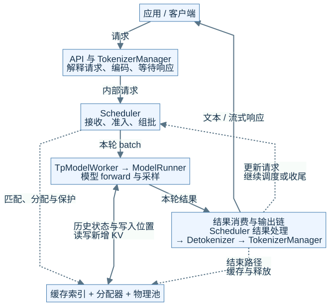
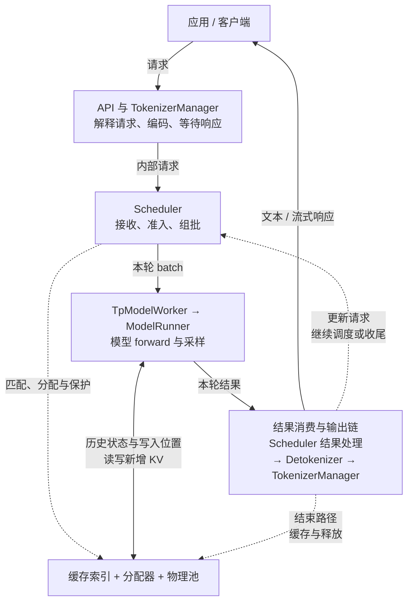
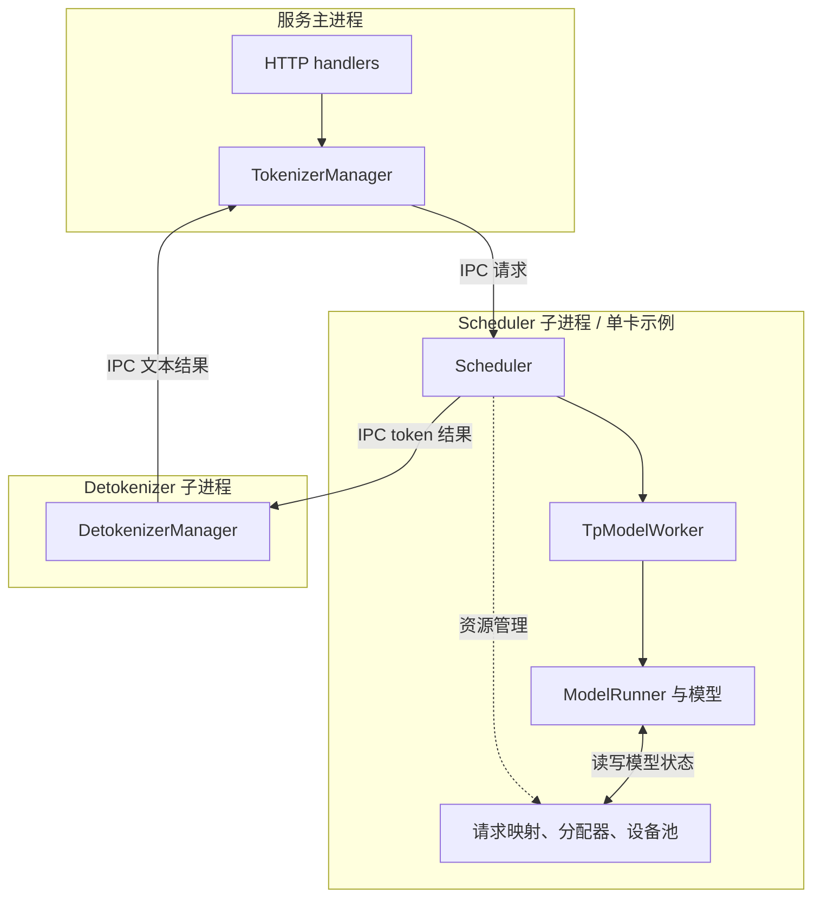
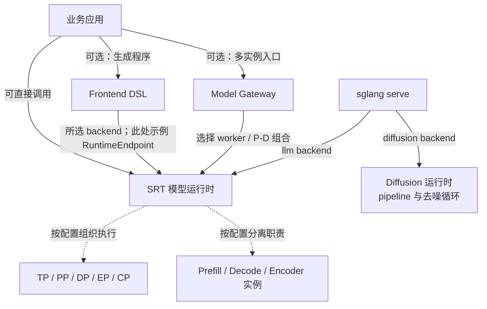

# M01 · SGLang全景与四种架构视图

**先回答：SGLang 到底是一套什么系统，组件、进程、数据和时间应怎样分别看？**

本文是面向初学者的源码分析型架构导读。先看图和图解，再沿文末的链接深入原有源码章节。

## 0. 阅读基线与图例

| 项目 | 内容 |
| --- | --- |
| 源码目录 | SGLang 仓库根目录 `.`；下文路径均为仓内相对路径 |
| 本地学习分支 | `codex/sglang-source-study-20260909` |
| 固定 commit | `72d5c5bb73cadd7ffbf5114e5f81e29d36b6c61a` |
| 读取日期 | 2026-09-10 |
| 工作区状态 | 学习源码 worktree 干净；Wiki 有既有已发布内容与未提交状态，本次只改学习文档和架构配图 |
| 范围 | 先限定普通 Python HTTP、单卡、合并式自回归文本生成；其他部署作为有条件的扩展展示。 |
| 操作边界 | 静态源码复核与图文编写；未运行模型、GPU / 网络实验或性能测试 |

**图例与证据：** 图中每根箭头的标签说明交接内容；虚线通常表示控制、配置或依赖，具体以标签为准。进程、实例、rank 外框会显式标注；未标注的框表示职责或对象。所有图均为整理者依据固定源码绘制的教学视图，省略条件分支，不代表完整类图或已验证部署。`[S编号]` 对应文末源码锚点。

| 术语 | 人话解释 |
| --- | --- |
| 实例 | 一套接受请求并执行模型的运行时；可能由多个进程和多张卡组成 |
| 控制流 | 决定下一步做什么的调用、消息和状态变化 |
| 数据流 | token、激活、KV 和输出等数据的移动 |
| rank | 某个通信组内的成员编号，不是某张卡的通用名字 |
## 1. 先在一张图里找到自己

**人话版：** 应用提交“想生成什么”，入口把它变成内部请求，调度器安排“现在算谁”，执行层完成计算，输出链把 token 变回答案。缓存保留计算历史，供下一轮继续使用。先记这条闭环，再记各种优化名称。[S1]、[S2]、[S3]

本图为整理者依据固定源码绘制的架构视图。SVG 与下面的可编辑 Mermaid 表达同一组关系。宽图可[打开原尺寸 SVG](../../../images/sglang-architecture/01-system-overview.svg)查看；手机端建议横屏或打开原图放大，图后文字提供逐步解读。

查看可编辑 Mermaid 源图

**图意解读：** 这是**职责图**，外面的每个框还不能数成一个进程。实线按标签追踪请求、结果或模型数据；虚线表示资源管理动作。图中“结果消费与输出链”合并了三个既有组件的返回职责，不是新增进程；“缓存”是三类对象的合并视图，真正的所有权在 M05 拆开；模型写 KV 与 Scheduler 决定何时归还槽位是两件事。

**走一遍 R1：** 假设已编码输入是 8 个 token，最多生成 3 个 token。入口交出输入，Scheduler 接纳 R1，Prefill 计算输入的 KV 并预测 O1；后续 Decode 继续推进。每轮模型结果先影响请求账本，再由输出链返回文本。客户端收到一段文字，并不能反推刚刚运行了哪一个 batch。

## 2. 一套系统需要四张不同的地图

| 视图 | 它回答的问题 | 一个框通常表示什么 | 最容易混淆的地方 |
| --- | --- | --- | --- |
| 职责视图 | 谁负责这件事？ | API、Scheduler、缓存、执行层 | 把多个对象误认为多个服务 |
| 进程与部署视图 | 在哪里运行，跨什么边界？ | 进程、实例、rank、节点 | 把同进程调用画成网络请求 |
| 数据与所有权视图 | 保存什么，谁能回收？ | Req、batch、请求行、KV 页 | 把索引命中当成数据已经可读 |
| 时间视图 | 先后依赖是什么，能否重叠？ | 接收、选批、forward、消费结果 | 把提交 GPU 工作当成工作已完成 |

下面把第一张职责图投影为**普通单卡 Python HTTP 路径的进程图**。[S1]

**图意解读：** 外框才是进程边界。Worker 与 Runner 在 Scheduler 进程中承担不同职责；复用 `Engine._launch_subprocesses` 启动逻辑也不等于增加一个“Engine 进程”。图中没有强行把 CPU 对象和 GPU 分配拆成两个进程：设备内存由主机进程中的对象管理。[S1]、[S3]

这只是指定条件下的投影。多 rank、多 tokenizer、Ray、嵌入式 Rust server 都要重画外框，不能把这个进程数量当成 SGLang 的固定配置。

## 3. 从单实例向外扩展，哪些东西才会出现

**图意解读：** 这张图是**产品与部署关系**，不是一条请求必须经过的完整流水线。直接调用 SRT 不要求先经过 DSL 或 Gateway。CLI 的不同 backend 是分支；Diffusion 有自己的请求和执行主线，不能塞进普通 LLM 的 Decode 循环。[S4]、[S5]、[S6]

## 4. 将特性放回主链，而不是背功能列表

| 你听到的名字 | 首先改变哪一层 | 接下来必须追问 | 对应地图 |
| --- | --- | --- | --- |
| Continuous Batching、Chunked Prefill | 本轮工作量与请求集合 | 谁可被接纳、长输入怎样切轮次？ | M04 |
| RadixAttention、Unified Cache、HiCache | 可复用状态与存储层级 | 命中边界、数据就绪、引用保护分别在哪？ | M05 |
| Attention backend、CUDA Graph、kernel | 执行方式 | 算什么、怎样发起、用哪个算子分别由谁选？ | M06 |
| TP / PP / DP / EP / CP | 工作和状态在 rank 间的划分 | 切的是参数、层、请求、专家还是上下文？ | M07 |
| PD / Encoder 分离 | 实例职责与跨实例数据交接 | 请求、KV、embedding 分别怎么走？ | M08 |
| Grammar、Beam、Speculation | 生成状态和结果提交 | 候选 token 什么时候成为正式输出？ | M09 |
| 量化、LoRA、MLA、多模态 | 模型装配、状态和输入输出 | 哪些对象和布局变了？ | M10 |
| 路由、限流、观测、在线更新 | 实例之外和服务生命周期 | 谁接纳请求，谁有证据说明模型已就绪？ | M11 |
| DSL、Diffusion、插件 | 运行时之外或入口分支 | 是否仍在本文同一条执行主线上？ | M12 |

这些是教学定位，不是“所有特性可同时开启”的兼容性保证。判断组合必须回到配置解析、执行分发与各自的完成条件。

## 5. 读图自测

**问题：** 为什么一次“没有首 token”的故障可能跨越四张图？

**答案要点：** 职责图找入口或调度；进程图找消息是否越过边界；数据图检查 KV/语法等前置条件；时间图区分还没执行、执行未完成、结果尚未送达。先确认 R1 最后完成了哪次交接，再缩小到函数，不能仅凭“GPU 利用率低”认定某个模块有错。

## 源码锚点与继续阅读

| 标识 | 图中行为 | 仓内文件 / 符号 |
| --- | --- | --- |
| S1 | 进程创建与普通 / Rust 等分支 | [`python/sglang/srt/entrypoints/engine.py::Engine._launch_subprocesses`][S1] |
| S2 | 请求和调度主循环 | [`python/sglang/srt/managers/scheduler.py::Scheduler.event_loop_normal`][S2] |
| S3 | 同进程执行与采样入口 | [`python/sglang/srt/managers/tp_worker.py::TpModelWorker.forward_batch_generation`][S3] |
| S4 | 服务 backend 分发 | [`python/sglang/cli/serve.py::serve`][S4] |
| S5 | DSL 公开接口 | [`python/sglang/lang/api.py`][S5] |
| S6 | 网关的产品职责说明 | [`sgl-model-gateway/README.md`][S6] |

**下一步：**

- [推理系统与 SGLang 职责地图](<../00-foundations/01-推理系统与SGLang职责地图.md>)
- [源码目录与最短阅读路线](<../01-getting-started/01-源码目录与最短阅读路线.md>)
- [Worker 与 ModelRunner 执行边界](<../05-model-execution/01-Worker与ModelRunner执行边界.md>)

返回[架构导读与覆盖审计](README.md)或[完整阶段目录](../README.md)。

[S1]: https://github.com/sgl-project/sglang/blob/72d5c5bb73cadd7ffbf5114e5f81e29d36b6c61a/python/sglang/srt/entrypoints/engine.py#L1050
[S2]: https://github.com/sgl-project/sglang/blob/72d5c5bb73cadd7ffbf5114e5f81e29d36b6c61a/python/sglang/srt/managers/scheduler.py#L1893
[S3]: https://github.com/sgl-project/sglang/blob/72d5c5bb73cadd7ffbf5114e5f81e29d36b6c61a/python/sglang/srt/managers/tp_worker.py#L593
[S4]: https://github.com/sgl-project/sglang/blob/72d5c5bb73cadd7ffbf5114e5f81e29d36b6c61a/python/sglang/cli/serve.py#L166
[S5]: https://github.com/sgl-project/sglang/blob/72d5c5bb73cadd7ffbf5114e5f81e29d36b6c61a/python/sglang/lang/api.py
[S6]: https://github.com/sgl-project/sglang/blob/72d5c5bb73cadd7ffbf5114e5f81e29d36b6c61a/sgl-model-gateway/README.md
