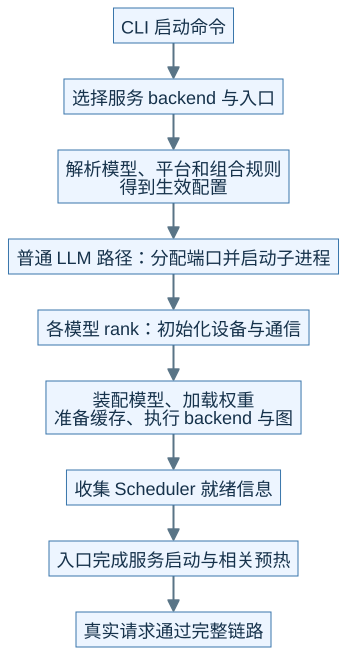
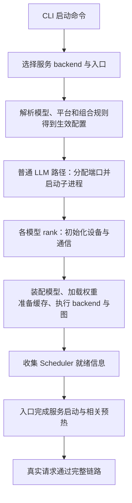
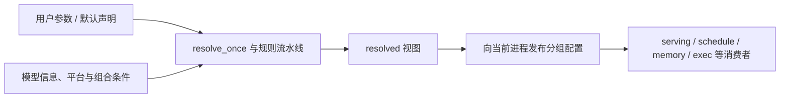
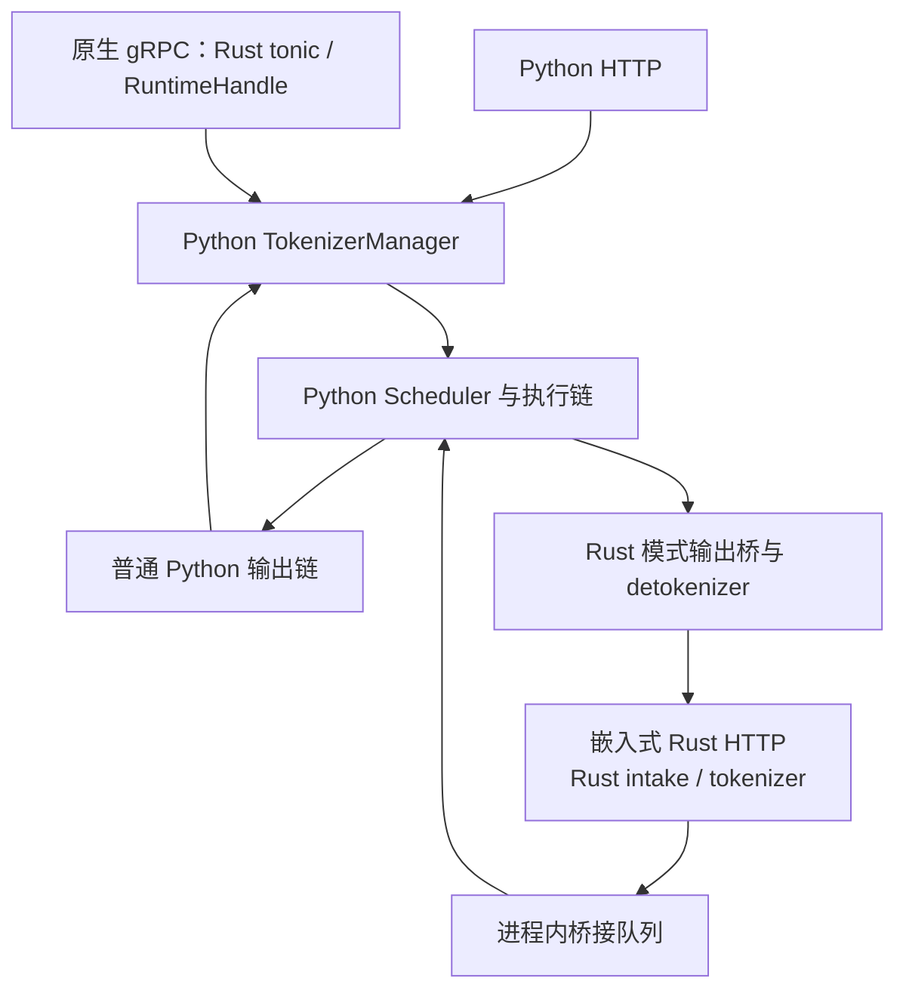

# M02 · 启动装配与运行时边界

**先回答：从一条启动命令到可接收请求，中间到底装配了哪些东西？**

本文是面向初学者的源码分析型架构导读。先看图和图解，再沿文末的链接深入原有源码章节。

## 0. 阅读基线与图例

| 项目 | 内容 |
| --- | --- |
| 源码目录 | SGLang 仓库根目录 `.`；下文路径均为仓内相对路径 |
| 本地学习分支 | `codex/sglang-source-study-20260909` |
| 固定 commit | `72d5c5bb73cadd7ffbf5114e5f81e29d36b6c61a` |
| 读取日期 | 2026-09-10 |
| 工作区状态 | 学习源码 worktree 干净；Wiki 有既有已发布内容与未提交状态，本次只改学习文档和架构配图 |
| 范围 | 普通 LLM 服务启动为主，集中比较 Python HTTP、原生 gRPC、嵌入式 Rust、Ray 与其他 backend 的边界；不提供通用可运行命令。 |
| 操作边界 | 静态源码复核与图文编写；未运行模型、GPU / 网络实验或性能测试 |

**图例与证据：** 图中每根箭头的标签说明交接内容；虚线通常表示控制、配置或依赖，具体以标签为准。进程、实例、rank 外框会显式标注；未标注的框表示职责或对象。所有图均为整理者依据固定源码绘制的教学视图，省略条件分支，不代表完整类图或已验证部署。`[S编号]` 对应文末源码锚点。

| 术语 | 人话解释 |
| --- | --- |
| 解析 | 把用户输入变为经过模型、平台和组合规则处理的配置 |
| 装配 | 依据配置构造模型、缓存、进程和执行器 |
| 就绪 | 某个阶段完成的证据；必须说明是哪一阶段 |
| backend | 某层的实现选择，服务 backend 和 Attention backend 不是同一层 |
## 1. 启动是一段装配过程

**人话版：** 启动命令更像一张配货单。系统先检查单子能否成立，再决定用哪条服务入口、启动哪些进程、装哪种模型和缓存、准备哪些执行方式，最后才能接请求。每一步都可能失败，日志出现“参数已解析”只说明走过了前面的一站。[S1]、[S2]

本图为整理者依据固定源码绘制的架构视图。SVG 与下面的可编辑 Mermaid 表达同一组关系。宽图可[打开原尺寸 SVG](../../../images/sglang-architecture/02-startup-assembly.svg)查看；手机端建议横屏或打开原图放大，图后文字提供逐步解读。

查看可编辑 Mermaid 源图

**图意解读：** 这是阶段图，模型、缓存与图的框合并了较多初始化步骤，不承诺所有 backend 都按图中相同细序执行。`Engine._launch_subprocesses` 创建并等待 Scheduler；各 rank 的模型装配在下游继续发生。API 可连接、子进程存活、模型已加载、真实请求成功分别需要自己的证据。[S2]、[S3]

上面的装配路线取 CLI 普通 Python HTTP 服务。Python `Engine` 直接调用运行时启动逻辑，不经过 `sglang serve` 的服务 backend 分发；不能把两种入口当成同一条最上游调用链。[S2]

## 2. 同一个参数有“声明值”和“生效值”

**图意解读：** 配置不是一个从头到尾随便改的共享字典。解析、发布和运行期覆盖有各自入口；比较行为时应核对生效配置及来源，不能把 CLI 字面值直接等同于运行路径。不同进程也不能靠“父进程改了一个全局变量”就假定同时更新。[S1]、[S2]

**例子：** R1 所在服务是否走 Overlap，要看解析后的选项和 `dispatch_event_loop`。代码中还存在 PP、PD、PDMux、MLX 等更具体的分支；研究 Normal 循环前先确认它确实被选中。[S4]

## 3. 协议名字不能替代进程图

**图意解读：** 这是几个**可选路径的对照**，不是一个实例同时启用所有框。原生 gRPC 的 Rust 传输层可以接到 Python TokenizerManager；嵌入式 Rust server 则会跳过普通 Python tokenizer/detokenizer 的创建。旧 SMG gRPC、Ray、encoder-only 还有独立入口，必须继续读服务专题，不能从“用了 Rust”猜测对象被替换了哪些。[S2]、[S5]

## 4. 启动问题的层级定位

| 最后成功的一步 | 下一步看什么 | 还不能断言什么 |
| --- | --- | --- |
| CLI 接受了参数 | backend 分发、配置解析及组合检查 | 模型或硬件一定受支持 |
| 子进程创建完成 | rank 初始化、权重文件、模型装配 | 模型已能 forward |
| 权重加载结束 | 缓存预算、backend 初始化、capture / warmup | 所有请求形状可用 |
| HTTP 可以连接 | 就绪语义和最小真实请求 | 分离传输或多卡通信已验证 |
| 一条短请求成功 | 长度、模式、并行、取消等独立范围 | 各特性组合均正确或性能达标 |

**读图自测：** 在图上圈出“服务 backend”“Attention backend”“通信 backend”可能出现的位置。答案：它们分别在入口分发、模型执行装配、rank 通信组初始化附近；同叫 backend，选择的抽象层级不同。

## 源码锚点与继续阅读

| 标识 | 图中行为 | 仓内文件 / 符号 |
| --- | --- | --- |
| S1 | 配置解析记录 | [`python/sglang/srt/server_args.py::ServerArgs.resolve_once`][S1] |
| S2 | 进程创建、发布配置与就绪等待 | [`python/sglang/srt/entrypoints/engine.py::Engine._launch_subprocesses`][S2] |
| S3 | Runner 的初始化装配 | [`python/sglang/srt/model_executor/model_runner.py::ModelRunner.__init__`][S3] |
| S4 | 主循环模式分发 | [`python/sglang/srt/managers/scheduler.py::dispatch_event_loop`][S4] |
| S5 | 嵌入式 Rust 模式的 Python 桥 | [`python/sglang/srt/managers/scheduler.py`][S5] |

**下一步：**

- [从 CLI 到服务进程启动](<../01-getting-started/03-从CLI到服务进程启动.md>)
- [从参数声明到最终生效配置](<../01-getting-started/04-从参数声明到最终生效配置.md>)
- [HTTP、gRPC 与 Rust 服务边界](<../10-serving-operations/02-HTTPgRPC与Rust服务边界.md>)
- [硬件后端插件与生态边界](<../12-extensions-and-capstone/04-硬件后端插件与生态边界.md>)

返回[架构导读与覆盖审计](README.md)或[完整阶段目录](../README.md)。

[S1]: https://github.com/sgl-project/sglang/blob/72d5c5bb73cadd7ffbf5114e5f81e29d36b6c61a/python/sglang/srt/server_args.py#L231
[S2]: https://github.com/sgl-project/sglang/blob/72d5c5bb73cadd7ffbf5114e5f81e29d36b6c61a/python/sglang/srt/entrypoints/engine.py#L1050
[S3]: https://github.com/sgl-project/sglang/blob/72d5c5bb73cadd7ffbf5114e5f81e29d36b6c61a/python/sglang/srt/model_executor/model_runner.py#L318
[S4]: https://github.com/sgl-project/sglang/blob/72d5c5bb73cadd7ffbf5114e5f81e29d36b6c61a/python/sglang/srt/managers/scheduler.py#L5646
[S5]: https://github.com/sgl-project/sglang/blob/72d5c5bb73cadd7ffbf5114e5f81e29d36b6c61a/python/sglang/srt/managers/scheduler.py
