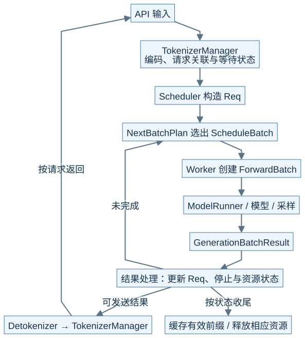
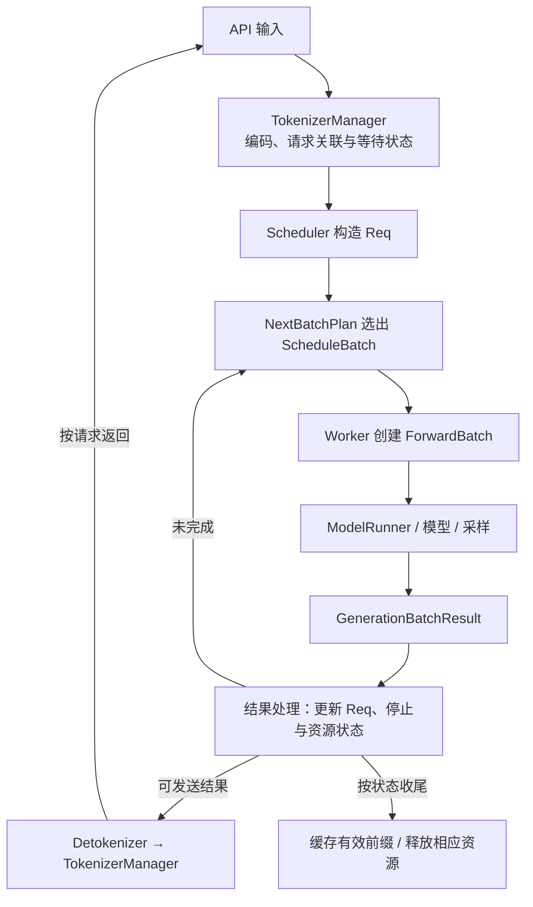
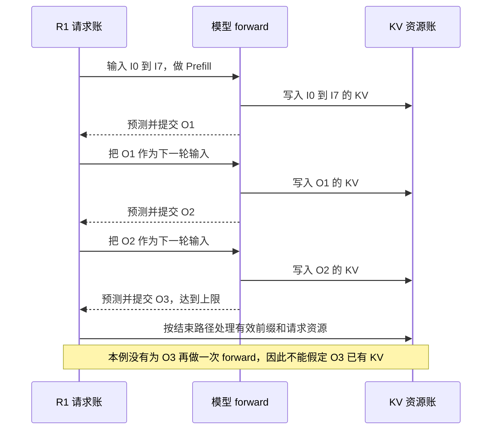
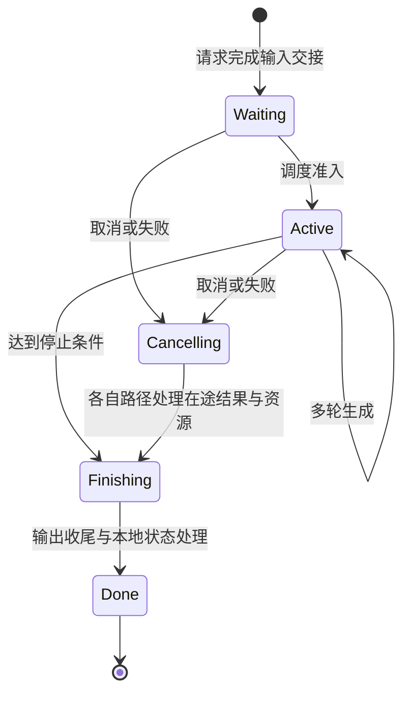

# M03 · 请求对象与生命周期全景

**先回答：一条请求跨越多个 batch 后，谁还记得它是谁，输出与资源什么时候才算结束？**

本文是面向初学者的源码分析型架构导读。先看图和图解，再沿文末的链接深入原有源码章节。

## 0. 阅读基线与图例

| 项目 | 内容 |
| --- | --- |
| 源码目录 | SGLang 仓库根目录 `.`；下文路径均为仓内相对路径 |
| 本地学习分支 | `codex/sglang-source-study-20260909` |
| 固定 commit | `72d5c5bb73cadd7ffbf5114e5f81e29d36b6c61a` |
| 读取日期 | 2026-09-10 |
| 工作区状态 | 学习源码 worktree 干净；Wiki 有既有已发布内容与未提交状态，本次只改学习文档和架构配图 |
| 范围 | 普通单实例生成闭环；用教学状态描述交接，不将状态图中的名字冒充源码枚举。 |
| 操作边界 | 静态源码复核与图文编写；未运行模型、GPU / 网络实验或性能测试 |

**图例与证据：** 图中每根箭头的标签说明交接内容；虚线通常表示控制、配置或依赖，具体以标签为准。进程、实例、rank 外框会显式标注；未标注的框表示职责或对象。所有图均为整理者依据固定源码绘制的教学视图，省略条件分支，不代表完整类图或已验证部署。`[S编号]` 对应文末源码锚点。

| 术语 | 人话解释 |
| --- | --- |
| rid | 关联同一请求的标识 |
| Req | 调度侧贯穿多轮的请求状态 |
| batch | 某一轮共同执行的请求与输入视图 |
| KV | 历史输入计算得到、后续 Attention 要读取的状态 |
## 1. 先沿闭环走一圈

**人话版：** R1 是一张长期工单，batch 是这一轮发给机器的工作单。R1 可以从 B0 走到 B1、B2；工单还在，工作单会换。返回结果也不是模型直接向用户写字符串，中间仍有结果更新、增量解码和响应关联。[S1]、[S2]、[S3]

本图为整理者依据固定源码绘制的架构视图。SVG 与下面的可编辑 Mermaid 表达同一组关系。宽图可[打开原尺寸 SVG](../../../images/sglang-architecture/03-request-lifecycle.svg)查看；手机端建议横屏或打开原图放大，图后文字提供逐步解读。

查看可编辑 Mermaid 源图

**图意解读：** `NextBatchPlan` 描述本轮选择，`ScheduleBatch` 保存调度视图，`ForwardBatch` 提供执行所需的 tensor 与元数据。它们不等于三次独立拷贝所有数据，更不能给其中一个对象贴上“GPU 已经运行完”的标签。[S2]、[S3]

## 2. 三本账必须同步看

| 账本 | 核心问题 | 持续时间 | 一个典型误判 |
| --- | --- | --- | --- |
| 请求账 | R1 已输出什么，是否结束？ | 多轮生成 | 看到一个结果对象就认定客户端收到 |
| 执行账 | 本轮哪些输入进入 forward？结果是否消费？ | 一轮或跨轮等待 | running 集合等于本轮全部输入 |
| 资源账 | 请求行、KV 页、引用和在途操作由谁持有？ | 可短于或长于请求 | 请求结束就将所有前缀页立刻归还 |

下面用 **8 个输入 token + 最多 3 个输出** 建立时间模型。假设没有提前停止、投机、分块和前缀命中。

**图意解读：** “产出一个 token”与“这个 token 的 KV 已计算”相差一次被作为输入的 forward。这个区别会影响前缀缓存、PD 首 token 交接和投机接受长度的理解。图中序列是教学例子，不是实测时间线。[S3]、[S4]

## 3. 取消是另一条控制路径

**图意解读：** 这是教学状态，不对应某个统一枚举。等待中的请求和已提交到 GPU 的请求，取消时可做的事情不同；移出队列、向客户端报错、停止后续执行、释放物理页是不同动作。PD 的在途传输还要沿 M08 单独检查，不能用这张单实例图证明 DMA 已停止。[S4]、[S5]

## 4. 读图自测与排障入口

| 现象 | 先对齐哪个交接点 | 该补的证据 |
| --- | --- | --- |
| R1 发出后没有首字 | 入站关联 → Scheduler 接收 → 准入 | 同一 rid 的各层状态 |
| 模型在算，客户端不更新 | 结果处理 → 输出消息 → 增量解码 → 回程 | batch 与 rid 对应、发送 / 接收时间 |
| 取消后显存未立即下降 | 请求行、缓存引用、池保留和在途工作 | 具体资源所有者及可回收条件 |
| 输出数量与 KV 长度不一致 | 哪个 token 已提交、哪个已作为输入 | input_ids、有效长度、写入位置 |

**问题：** R1 和 R2 同批运行，R1 先完成，是否要求 R2 一起结束？**答案：** 请求结束条件按请求推进；后续 batch 可以过滤完成成员。完整 batch 并不意味着所有请求共享生命周期。

## 源码锚点与继续阅读

| 标识 | 图中行为 | 仓内文件 / 符号 |
| --- | --- | --- |
| S1 | 内部请求与入口等待 | [`python/sglang/srt/managers/tokenizer_manager.py::TokenizerManager.generate_request`][S1] |
| S2 | 请求与 batch 数据结构 | [`python/sglang/srt/managers/schedule_batch.py`][S2] |
| S3 | 执行视图和结果包装 | [`python/sglang/srt/managers/tp_worker.py::TpModelWorker.forward_batch_generation`][S3] |
| S4 | 结果消费与完成处理 | [`python/sglang/srt/managers/scheduler_components/batch_result_processor.py::SchedulerBatchResultProcessor`][S4] |
| S5 | 取消分发与状态处理 | [`python/sglang/srt/managers/scheduler.py::Scheduler.abort_request`][S5] |

**下一步：**

- [Req 与多种 Batch 对象的分工](<../02-request-lifecycle/03-Req与多种Batch对象的分工.md>)
- [一次 Prefill 到多轮 Decode](<../02-request-lifecycle/04-一次Prefill到多轮Decode.md>)
- [Detokenizer 与流式输出](<../02-request-lifecycle/05-Detokenizer与流式输出.md>)
- [完成、取消与资源释放](<../02-request-lifecycle/06-完成取消与资源释放.md>)

返回[架构导读与覆盖审计](README.md)或[完整阶段目录](../README.md)。

[S1]: https://github.com/sgl-project/sglang/blob/72d5c5bb73cadd7ffbf5114e5f81e29d36b6c61a/python/sglang/srt/managers/tokenizer_manager.py#L776
[S2]: https://github.com/sgl-project/sglang/blob/72d5c5bb73cadd7ffbf5114e5f81e29d36b6c61a/python/sglang/srt/managers/schedule_batch.py
[S3]: https://github.com/sgl-project/sglang/blob/72d5c5bb73cadd7ffbf5114e5f81e29d36b6c61a/python/sglang/srt/managers/tp_worker.py#L593
[S4]: https://github.com/sgl-project/sglang/blob/72d5c5bb73cadd7ffbf5114e5f81e29d36b6c61a/python/sglang/srt/managers/scheduler_components/batch_result_processor.py#L92
[S5]: https://github.com/sgl-project/sglang/blob/72d5c5bb73cadd7ffbf5114e5f81e29d36b6c61a/python/sglang/srt/managers/scheduler.py#L5171
