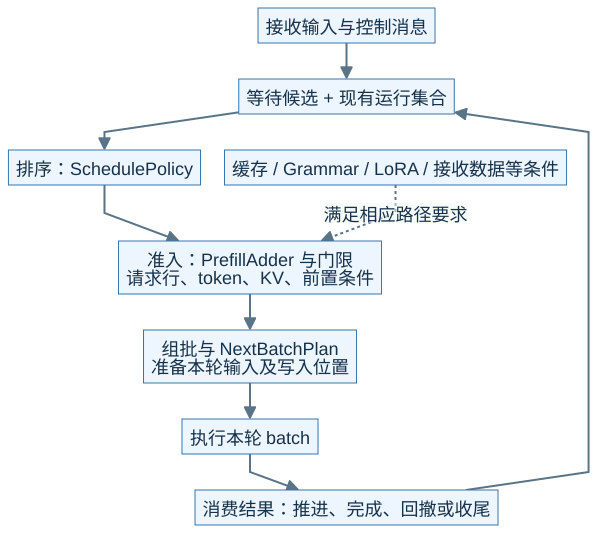
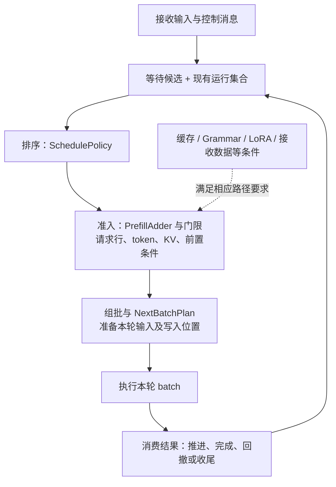
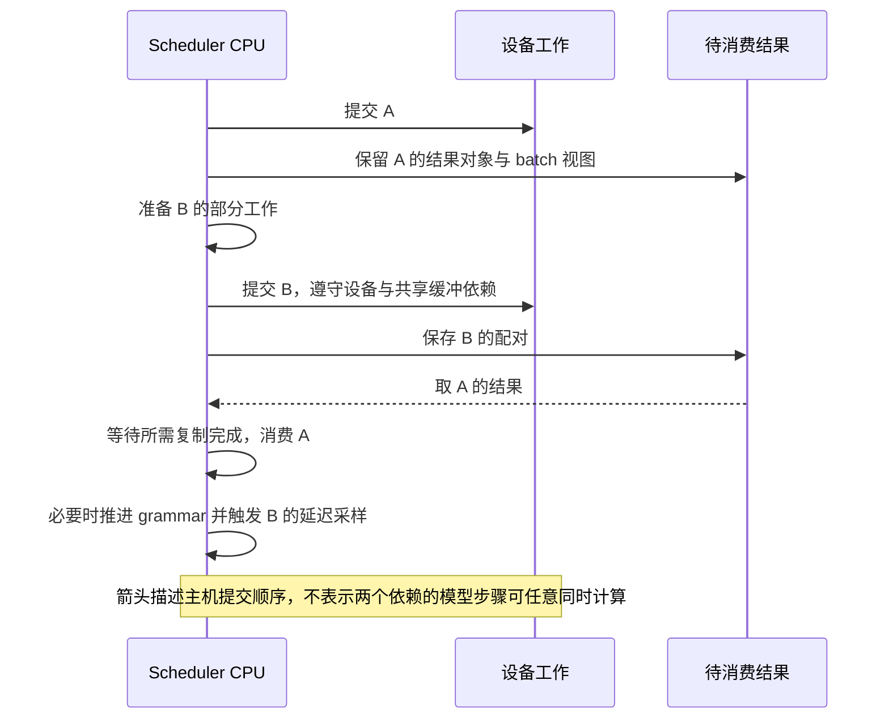
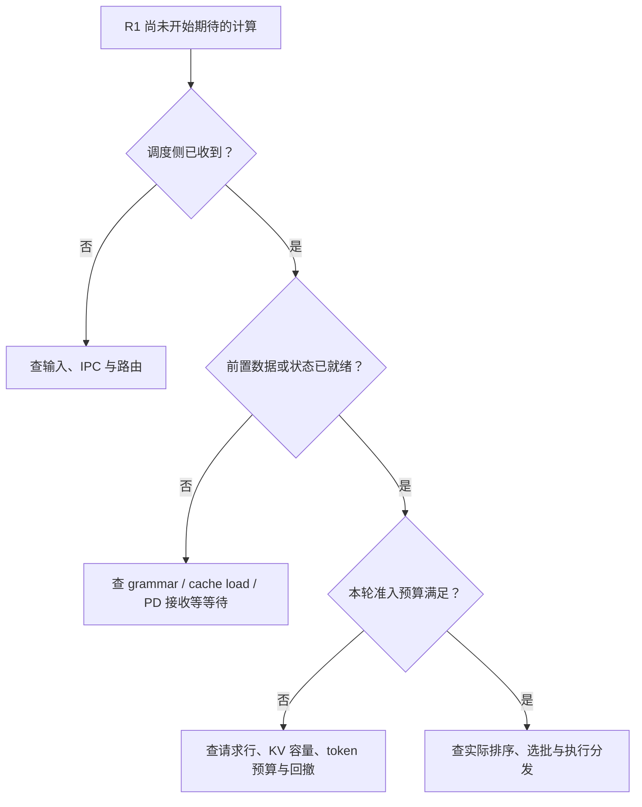

# M04 · 调度器架构与时间模型

**先回答：调度器内部到底有哪些决策，连续批处理、分块和 Overlap 分别改变了什么？**

本文是面向初学者的源码分析型架构导读。先看图和图解，再沿文末的链接深入原有源码章节。

## 0. 阅读基线与图例

| 项目 | 内容 |
| --- | --- |
| 源码目录 | SGLang 仓库根目录 `.`；下文路径均为仓内相对路径 |
| 本地学习分支 | `codex/sglang-source-study-20260909` |
| 固定 commit | `72d5c5bb73cadd7ffbf5114e5f81e29d36b6c61a` |
| 读取日期 | 2026-09-10 |
| 工作区状态 | 学习源码 worktree 干净；Wiki 有既有已发布内容与未提交状态，本次只改学习文档和架构配图 |
| 范围 | 普通生成调度作为基线；比较各特性的作用位置，不把 Normal 例子当作默认运行模式。 |
| 操作边界 | 静态源码复核与图文编写；未运行模型、GPU / 网络实验或性能测试 |

**图例与证据：** 图中每根箭头的标签说明交接内容；虚线通常表示控制、配置或依赖，具体以标签为准。进程、实例、rank 外框会显式标注；未标注的框表示职责或对象。所有图均为整理者依据固定源码绘制的教学视图，省略条件分支，不代表完整类图或已验证部署。`[S编号]` 对应文末源码锚点。

| 术语 | 人话解释 |
| --- | --- |
| 排序 | 给等待候选安排优先次序 |
| 准入 | 检查预算和前置条件，决定这轮能否加入 |
| 连续批处理 | 在迭代边界持续调整参与执行的请求集合 |
| Overlap | 让部分 CPU 工作与设备执行重叠，仍保留数据依赖 |
## 1. 把“调度”拆成四个问题

**人话版：** 排队靠前不等于已经拿到入场券，拿到入场券不等于设备已执行，设备提交了也不等于结果已写回请求。Scheduler 把这些步骤串起来，缓存、语法、LoRA、分离接收等子系统则提供条件或资源。[S1]、[S2]

本图为整理者依据固定源码绘制的架构视图。SVG 与下面的可编辑 Mermaid 表达同一组关系。宽图可[打开原尺寸 SVG](../../../images/sglang-architecture/04-scheduler-overview.svg)查看；手机端建议横屏或打开原图放大，图后文字提供逐步解读。

查看可编辑 Mermaid 源图

**图意解读：** 图是职责分解；真实条件检查分散在接收、候选准备、准入、执行前等位置，不存在统一名为 Ready 的中心服务。排序只改变候选顺序；准入还需要预算及具体路径的就绪状态。`running_batch` 和 `batch_to_run` 也不是同一个问题的答案。[S1]、[S2]

## 2. 三个常见优化作用在不同的轴上

| 特性 | 改变的轴 | R1/R2 的直观例子 | 没有自动解决什么 |
| --- | --- | --- | --- |
| Continuous Batching | 各轮成员 | R1 结束后，R2 继续，R3 可在后续轮次加入 | 准入预算和每个请求的公平性 |
| Chunked Prefill | 一条长输入分几轮计算 | R3 的长 prompt 被切成若干输入段 | 总计算量不会凭切块消失 |
| Overlap | CPU 与设备的提交 / 消费时序 | 提交 B 的工作后再消费 A 的主机结果 | 不取消共享 buffer 和 grammar 的依赖 |
| 排序策略 | 谁先成为候选 | 优先考虑可能共享前缀的 R2 | 不保证 R2 一定可入场 |
| 回撤 / 背压 | 资源不足时怎样缩小或延缓工作 | R2 暂退或新请求等待 | 不保证客户端延迟不受影响 |

这些关系来自调度主循环、准入器与结果处理的不同职责，不是建议同时打开全部特性。[S1]、[S2]、[S3]

## 3. 先读 Normal，再看 Overlap 的时间差

**图意解读：** Normal 循环在本轮执行后消费本轮结果；Overlap 保留待消费结果，使 CPU 可以推进另一轮的部分工作。共享内存读写仍有 WAR 保护；需要上一轮语法状态的采样也不能抢跑。某些 batch 会显式禁用重叠，转入同步边界。[S3]

## 4. 一张门诊图定位“排队但没跑”

**图意解读：** 这是排障问答顺序，不是源码中每个 if 的固定顺序。先找 R1 最后一个已知状态，能避免把所有等待都归因于排序策略。[S1]、[S2]

**自测：** R3 切成 4 个 Prefill chunk，是 4 个用户请求吗？答案：仍是同一请求的输入处理跨轮推进；每轮 batch 可以不同，请求身份和有效 KV 需要连续记账。

## 源码锚点与继续阅读

| 标识 | 图中行为 | 仓内文件 / 符号 |
| --- | --- | --- |
| S1 | 调度计划与候选入口 | [`python/sglang/srt/managers/scheduler.py::Scheduler.get_next_batch_to_run`][S1] |
| S2 | 排序和 Prefill 准入器 | [`python/sglang/srt/managers/schedule_policy.py`][S2] |
| S3 | Overlap 提交、结果队列与延迟采样 | [`python/sglang/srt/managers/scheduler.py::Scheduler.event_loop_overlap`][S3] |
| S4 | 主循环分发条件 | [`python/sglang/srt/managers/scheduler.py::dispatch_event_loop`][S4] |

**下一步：**

- [Normal Event Loop 与调度主循环](<../03-scheduling/01-NormalEventLoop与调度主循环.md>)
- [连续批处理与队列状态](<../03-scheduling/02-连续批处理与队列状态.md>)
- [排序策略与准入预算](<../03-scheduling/03-排序策略与准入预算.md>)
- [Chunked Prefill 与长请求调度](<../03-scheduling/04-ChunkedPrefill与长请求调度.md>)
- [Overlap 中的 CPU 与 GPU 依赖](<../03-scheduling/05-Overlap中的CPU与GPU依赖.md>)
- [回撤、背压、饥饿与调度排障](<../03-scheduling/06-回撤背压饥饿与调度排障.md>)

返回[架构导读与覆盖审计](README.md)或[完整阶段目录](../README.md)。

[S1]: https://github.com/sgl-project/sglang/blob/72d5c5bb73cadd7ffbf5114e5f81e29d36b6c61a/python/sglang/srt/managers/scheduler.py#L3499
[S2]: https://github.com/sgl-project/sglang/blob/72d5c5bb73cadd7ffbf5114e5f81e29d36b6c61a/python/sglang/srt/managers/schedule_policy.py
[S3]: https://github.com/sgl-project/sglang/blob/72d5c5bb73cadd7ffbf5114e5f81e29d36b6c61a/python/sglang/srt/managers/scheduler.py#L1928
[S4]: https://github.com/sgl-project/sglang/blob/72d5c5bb73cadd7ffbf5114e5f81e29d36b6c61a/python/sglang/srt/managers/scheduler.py#L5646
