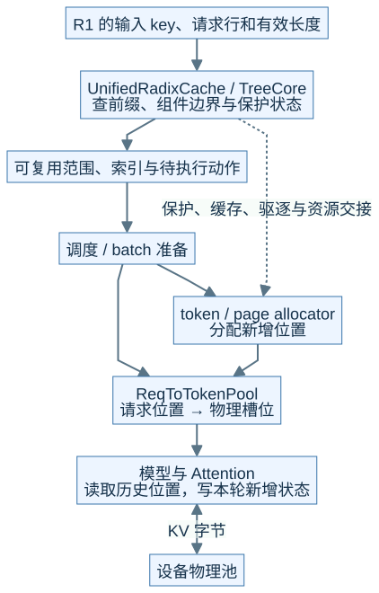
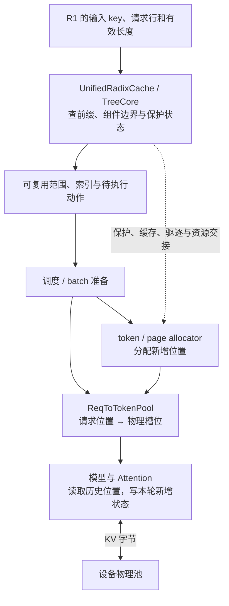
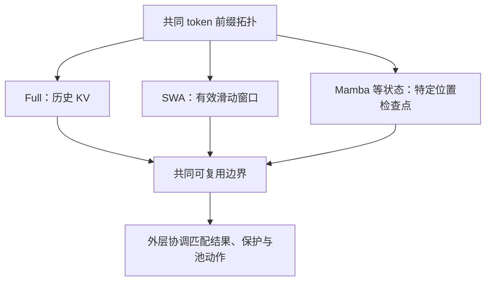
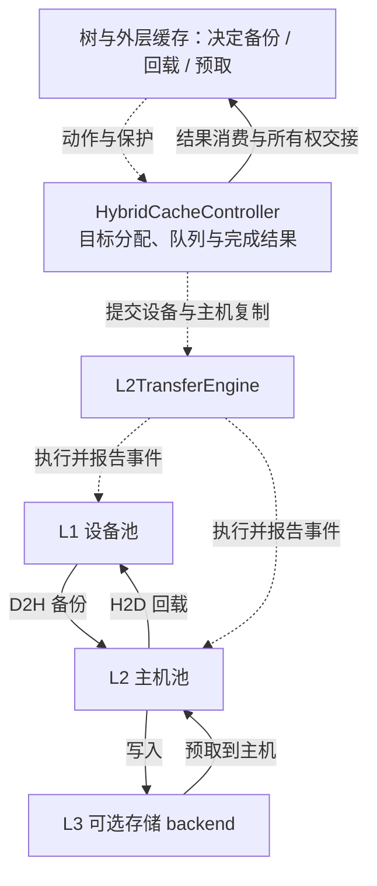

# M05 · 缓存架构与资源所有权

**先回答：Radix、Unified Cache、HiCache、分配器和 KV pool 各管什么，命中后为什么还可能等待？**

本文是面向初学者的源码分析型架构导读。先看图和图解，再沿文末的链接深入原有源码章节。

## 0. 阅读基线与图例

| 项目 | 内容 |
| --- | --- |
| 源码目录 | SGLang 仓库根目录 `.`；下文路径均为仓内相对路径 |
| 本地学习分支 | `codex/sglang-source-study-20260909` |
| 固定 commit | `72d5c5bb73cadd7ffbf5114e5f81e29d36b6c61a` |
| 读取日期 | 2026-09-10 |
| 工作区状态 | 学习源码 worktree 干净；Wiki 有既有已发布内容与未提交状态，本次只改学习文档和架构配图 |
| 范围 | 固定基线默认缓存工厂最终落到 UnifiedRadixCache 的普通分支；特殊工厂和外部实现另列边界。 |
| 操作边界 | 静态源码复核与图文编写；未运行模型、GPU / 网络实验或性能测试 |

**图例与证据：** 图中每根箭头的标签说明交接内容；虚线通常表示控制、配置或依赖，具体以标签为准。进程、实例、rank 外框会显式标注；未标注的框表示职责或对象。所有图均为整理者依据固定源码绘制的教学视图，省略条件分支，不代表完整类图或已验证部署。`[S编号]` 对应文末源码锚点。

| 术语 | 人话解释 |
| --- | --- |
| 索引 | 记录哪些输入前缀或状态可以被找到 |
| 分配器 | 管理哪些物理位置空闲、占用或可归还 |
| 物理池 | 真正保存 KV 或混合模型状态的存储 |
| 保护引用 | 阻止仍在使用或传输的状态被过早回收的约束 |
## 1. 同一个“缓存”其实至少有三层

**人话版：** 索引像目录，分配器管理空位，物理池保存内容。目录告诉你“这段历史在哪里”，并不等于它已经在 GPU 上、也不等于它可以立即被删除。固定基线的普通默认选择最终是 `UnifiedRadixCache`；传统 `RadixCache` 章节是理解基本机制的代表路径，不能据此误认默认实现。[S1]

本图为整理者依据固定源码绘制的架构视图。SVG 与下面的可编辑 Mermaid 表达同一组关系。宽图可[打开原尺寸 SVG](../../../images/sglang-architecture/05-cache-ownership.svg)查看；手机端建议横屏或打开原图放大，图后文字提供逐步解读。

查看可编辑 Mermaid 源图

**图意解读：** `ReqToTokenPool` 是请求位置到槽位的映射，不能当成 KV tensor 本体。索引节点、请求行、物理页是不同资源。共享前缀可以被多个请求引用；谁最后解除保护、何时允许驱逐，需要沿缓存和结果收尾路径看。[S2]、[S3]

## 2. Unified 统一的是协调框架，不是所有状态的形状

**图意解读：** 找到较深的 token 节点，不等于每个组件都在同一位置有合法状态。窗口、递推检查点与完整 KV 的有效性条件不同，最终应使用可共同恢复的边界。图中列出的是典型组件，不表示所有模型同时启用三种状态。[S2]、[S4]

## 3. HiCache 把“找到”和“搬到可用位置”分开

**图意解读：** 上半部是动作与完成控制，下半部是数据所在层级。L3 命中后通常还需要经过主机和设备交接，不能画成“存储命中直接进入 Attention”。登记主机索引也不等于复制已经完成；保护解除必须对应具体完成条件。[S5]

**例子：** R2 与 R1 共享 6 个输入 token。若 6 个 token 的可用状态已在设备且匹配条件一致，R2 可以复用相应前缀；若状态只在主机，R2 还要等回载路径；若混合状态仅在第 4 个 token 有合法共同边界，可复用范围可能缩短。这里的 6 和 4 是教学数值，实际还受 page 对齐和实现条件影响。

## 4. 完成请求与释放页之间隔着所有权

| 事件 | 可以改变什么 | 仍须确认什么 |
| --- | --- | --- |
| R1 完成 | 请求输出与请求行进入收尾 | 哪些前缀继续由树持有 |
| 某个引用解除 | 对应保护计数或组件引用减少 | 是否还有其他请求或传输使用 |
| 一次传输提交 | 操作进入在途状态 | 设备事件 / 完成结果是否已消费 |
| 前缀允许驱逐 | 缓存可以选择淘汰 | 哪些页属于该节点，尾部和共享范围如何处理 |
| 物理页归还 | 分配器可以后续复用 | 所有合法消费者都已经不再使用 |

**自测：** 命中率高但 TTFT 没下降，先查什么？答案：命中的层级和单位、真正跳过的 Prefill 范围、回载等待，以及排队、输出等其他延迟。目录命中率不能单独证明设备计算减少了多少。

## 源码锚点与继续阅读

| 标识 | 图中行为 | 仓内文件 / 符号 |
| --- | --- | --- |
| S1 | 默认实现与特殊分支选择 | [`python/sglang/srt/mem_cache/registry.py::default_radix_cache_factory`][S1] |
| S2 | Unified 外层协调 | [`python/sglang/srt/mem_cache/unified_radix_cache.py::UnifiedRadixCache`][S2] |
| S3 | 请求映射与物理池定义 | [`python/sglang/srt/mem_cache/memory_pool.py`][S3] |
| S4 | 共同拓扑及组件动作 | [`python/sglang/srt/mem_cache/unified_cache/unified_tree_core.py`][S4] |
| S5 | 分层缓存控制器 | [`python/sglang/srt/mem_cache/hybrid_cache/hybrid_cache_controller.py::HybridCacheController`][S5] |

**下一步：**

- [请求视图、物理槽位与分配器](<../04-kv-cache/01-请求视图物理槽位与分配器.md>)
- [RadixAttention 与前缀匹配](<../04-kv-cache/02-RadixAttention与前缀匹配.md>)
- [UnifiedRadix 与混合状态组件](<../04-kv-cache/04-UnifiedRadix与混合状态组件.md>)
- [HiCache 分层存储与回载](<../04-kv-cache/05-HiCache分层存储与回载.md>)
- [KV 缓存全生命周期与排障](<../04-kv-cache/07-KV缓存全生命周期与排障.md>)

返回[架构导读与覆盖审计](README.md)或[完整阶段目录](../README.md)。

[S1]: https://github.com/sgl-project/sglang/blob/72d5c5bb73cadd7ffbf5114e5f81e29d36b6c61a/python/sglang/srt/mem_cache/registry.py#L80
[S2]: https://github.com/sgl-project/sglang/blob/72d5c5bb73cadd7ffbf5114e5f81e29d36b6c61a/python/sglang/srt/mem_cache/unified_radix_cache.py#L148
[S3]: https://github.com/sgl-project/sglang/blob/72d5c5bb73cadd7ffbf5114e5f81e29d36b6c61a/python/sglang/srt/mem_cache/memory_pool.py
[S4]: https://github.com/sgl-project/sglang/blob/72d5c5bb73cadd7ffbf5114e5f81e29d36b6c61a/python/sglang/srt/mem_cache/unified_cache/unified_tree_core.py
[S5]: https://github.com/sgl-project/sglang/blob/72d5c5bb73cadd7ffbf5114e5f81e29d36b6c61a/python/sglang/srt/mem_cache/hybrid_cache/hybrid_cache_controller.py#L92
