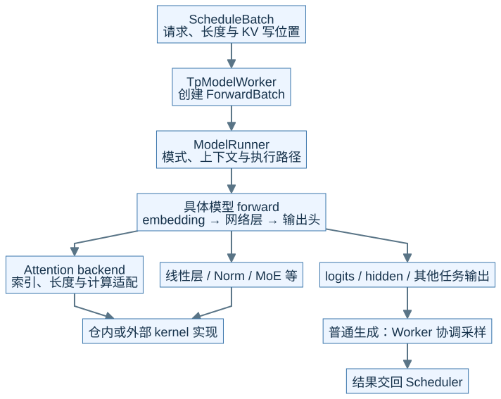
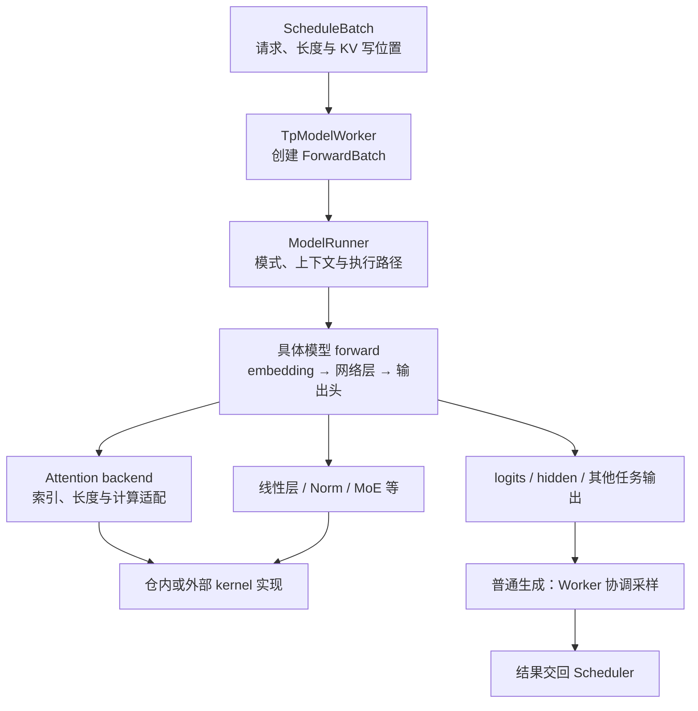
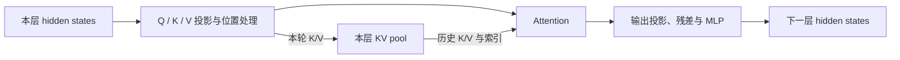
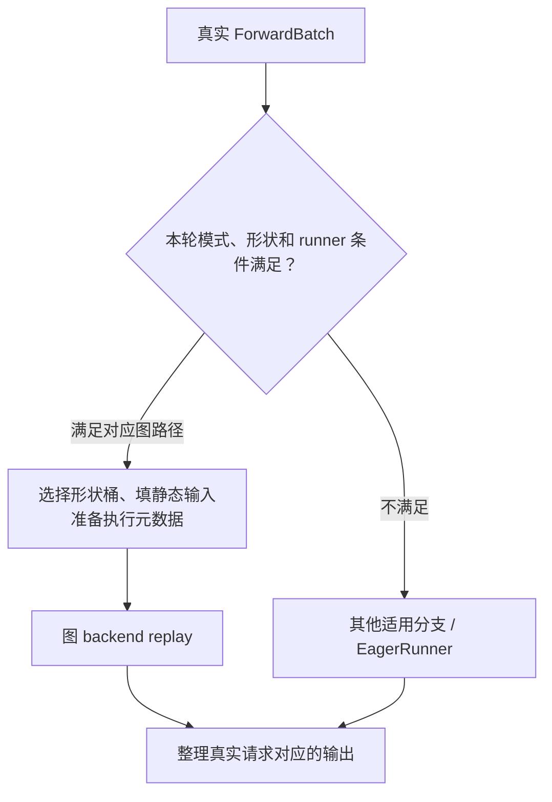

# M06 · 模型执行与算子分层

**先回答：一次 batch 怎么穿过 Worker、Runner、模型、Attention backend 和 kernel，CUDA Graph 又在哪一层？**

本文是面向初学者的源码分析型架构导读。先看图和图解，再沿文末的链接深入原有源码章节。

## 0. 阅读基线与图例

| 项目 | 内容 |
| --- | --- |
| 源码目录 | SGLang 仓库根目录 `.`；下文路径均为仓内相对路径 |
| 本地学习分支 | `codex/sglang-source-study-20260909` |
| 固定 commit | `72d5c5bb73cadd7ffbf5114e5f81e29d36b6c61a` |
| 读取日期 | 2026-09-10 |
| 工作区状态 | 学习源码 worktree 干净；Wiki 有既有已发布内容与未提交状态，本次只改学习文档和架构配图 |
| 范围 | 以普通 Llama 生成的执行分层为基线；显示可选分支，不承诺每个模型都使用统一 kernel 入口。 |
| 操作边界 | 静态源码复核与图文编写；未运行模型、GPU / 网络实验或性能测试 |

**图例与证据：** 图中每根箭头的标签说明交接内容；虚线通常表示控制、配置或依赖，具体以标签为准。进程、实例、rank 外框会显式标注；未标注的框表示职责或对象。所有图均为整理者依据固定源码绘制的教学视图，省略条件分支，不代表完整类图或已验证部署。`[S编号]` 对应文末源码锚点。

| 术语 | 人话解释 |
| --- | --- |
| forward | 把本轮输入送入模型完成一次前向计算 |
| logits | 采样前各候选 token 的分数 |
| Attention backend | 负责 Attention 元数据与实际计算实现的适配层 |
| CUDA Graph | 捕获和重放设备工作的一种执行机制 |
## 1. 把“算什么”与“怎么执行”分开

**人话版：** Scheduler 选好本轮工作，Worker 把它整理成执行视图，Runner 准备环境和执行方式，模型描述网络计算，backend 和 kernel 完成具体操作。调用经过多层对象，不等于经过多个进程。[S1]、[S2]

本图为整理者依据固定源码绘制的架构视图。SVG 与下面的可编辑 Mermaid 表达同一组关系。宽图可[打开原尺寸 SVG](../../../images/sglang-architecture/06-execution-layers.svg)查看；手机端建议横屏或打开原图放大，图后文字提供逐步解读。

查看可编辑 Mermaid 源图

**图意解读：** 图中的模型输出箭头表示整体 forward 返回，计算期间会调用下方 backend/kernel。普通生成的采样与 forward 可以分开；投机 Verify、Embedding、PP 非末 stage 等不沿“普通 logits → 采样”这条尾部路径。[S1]、[S2]

## 2. 模型层是计算图，KV 是持续状态

**图意解读：** 这是普通 Attention 的教学图，省略了 Norm 等细节。hidden states 沿网络层向前流动，KV 被保存供后续 token 使用。PP 传递的 proxy 属于前者；PD 传递历史 KV 属于后者。MLA、混合状态和稀疏 Attention 需要在 M10 的状态图里重新解释。[S3]

## 3. CUDA Graph 放在执行方式这一层

**图意解读：** CUDA Graph 不负责替 Scheduler 挑请求，也不是模型网络结构图。比如 3 条请求可能进入容量为 4 的图桶，补齐行不能变成第四条真实请求。图执行还有静态输入、共享输出、元数据以及实际调用条件的约束；“打开图配置”不等于所有 batch 都 replay。[S2]、[S4]

## 4. 三个选择点怎样影响排障

| 选择点 | 决定什么 | 先读哪个证据 | 常见误判 |
| --- | --- | --- | --- |
| 模型装配 | 实际模型类、权重布局、量化与层实现 | 模型配置和加载记录 | 模型名字相似就沿同一代码路径 |
| Attention backend | Prefill / Decode 的适配和元数据 | 两侧生效 backend、模型 wrapper | 一个名字适用于所有阶段 |
| kernel 路径 | 设备、dtype、shape 下真正执行的实现 | 调用点、注册选择、外部依赖边界 | 存在 registry 就断言所有算子都通过它 |
| 图 runner | 某个 batch 能否捕获 / 重放对应工作 | `can_run_graph`、shape 和回退记录 | 吞吐变化必然来自模型计算量变化 |

固定基线的部分模型调用仍可直接进入 `sgl_kernel` 或其他库；阅读 `python/sglang/kernels/` 时，要从模型实际调用点反查，不把统一 API 的能力表画成已被全模型采用的架构。[S5]

**自测：** backend 初始化成功后某个 batch 仍报错，应该回到哪张图？答案：同时检查执行输入与元数据、实际模型状态布局、本轮图资格和 kernel 条件；启动成功不证明所有运行形状都合法。

## 源码锚点与继续阅读

| 标识 | 图中行为 | 仓内文件 / 符号 |
| --- | --- | --- |
| S1 | Worker 输入、普通采样与 Verify 分支 | [`python/sglang/srt/managers/tp_worker.py::TpModelWorker.forward_batch_generation`][S1] |
| S2 | Runner 模式和图路径选择 | [`python/sglang/srt/model_executor/model_runner.py::ModelRunner._forward_raw`][S2] |
| S3 | Llama 层内计算 | [`python/sglang/srt/models/llama.py`][S3] |
| S4 | Decode 图 runner | [`python/sglang/srt/model_executor/runner/decode_cuda_graph_runner.py`][S4] |
| S5 | kernel 注册与实际调用范围 | [`python/sglang/kernels/README.md`][S5] |
| S6 | Attention backend 装配 | [`python/sglang/srt/model_executor/model_runner_components/attention_backend_setup.py`][S6] |

**下一步：**

- [Worker 与 ModelRunner 执行边界](<../05-model-execution/01-Worker与ModelRunner执行边界.md>)
- [以 Llama 为例读懂模型 Forward](<../05-model-execution/02-以Llama为例读懂模型Forward.md>)
- [Attention 后端与执行元数据](<../05-model-execution/03-Attention后端与执行元数据.md>)
- [CUDA Graph、编译与执行模式](<../05-model-execution/05-CUDAGraph编译与执行模式.md>)
- [Kernel 注册、选择与实现阅读](<../05-model-execution/06-Kernel注册选择与实现阅读.md>)

返回[架构导读与覆盖审计](README.md)或[完整阶段目录](../README.md)。

[S1]: https://github.com/sgl-project/sglang/blob/72d5c5bb73cadd7ffbf5114e5f81e29d36b6c61a/python/sglang/srt/managers/tp_worker.py#L593
[S2]: https://github.com/sgl-project/sglang/blob/72d5c5bb73cadd7ffbf5114e5f81e29d36b6c61a/python/sglang/srt/model_executor/model_runner.py#L1756
[S3]: https://github.com/sgl-project/sglang/blob/72d5c5bb73cadd7ffbf5114e5f81e29d36b6c61a/python/sglang/srt/models/llama.py
[S4]: https://github.com/sgl-project/sglang/blob/72d5c5bb73cadd7ffbf5114e5f81e29d36b6c61a/python/sglang/srt/model_executor/runner/decode_cuda_graph_runner.py
[S5]: https://github.com/sgl-project/sglang/blob/72d5c5bb73cadd7ffbf5114e5f81e29d36b6c61a/python/sglang/kernels/README.md
[S6]: https://github.com/sgl-project/sglang/blob/72d5c5bb73cadd7ffbf5114e5f81e29d36b6c61a/python/sglang/srt/model_executor/model_runner_components/attention_backend_setup.py
