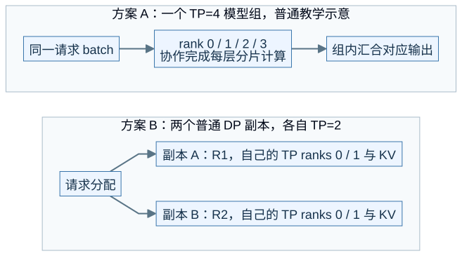
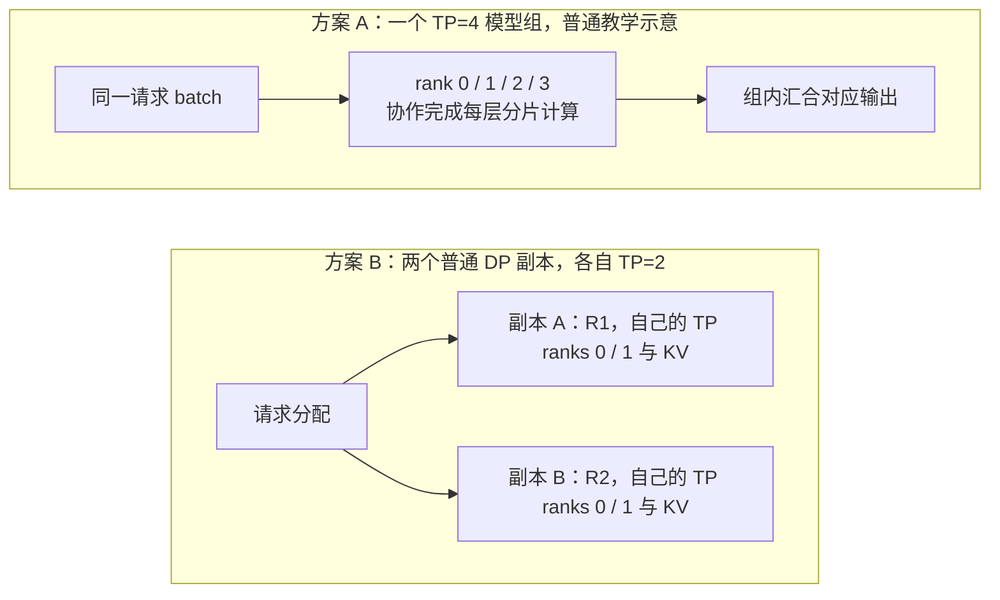
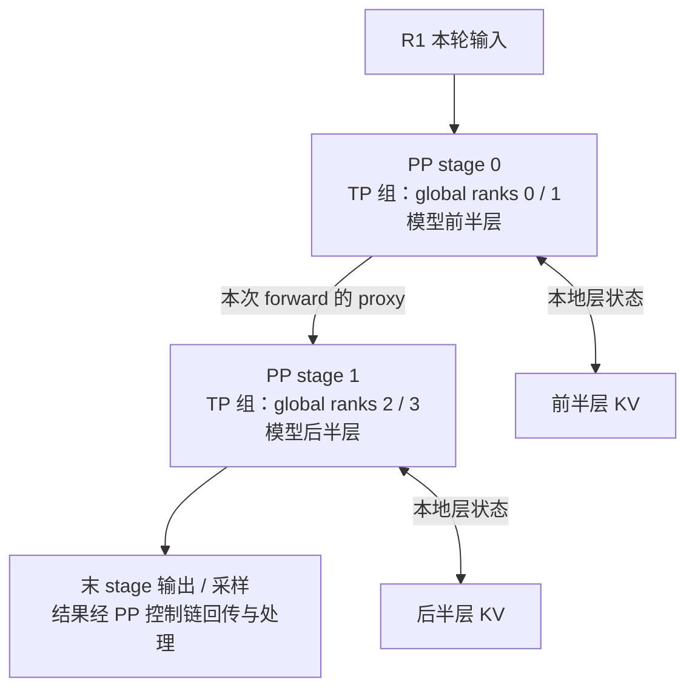
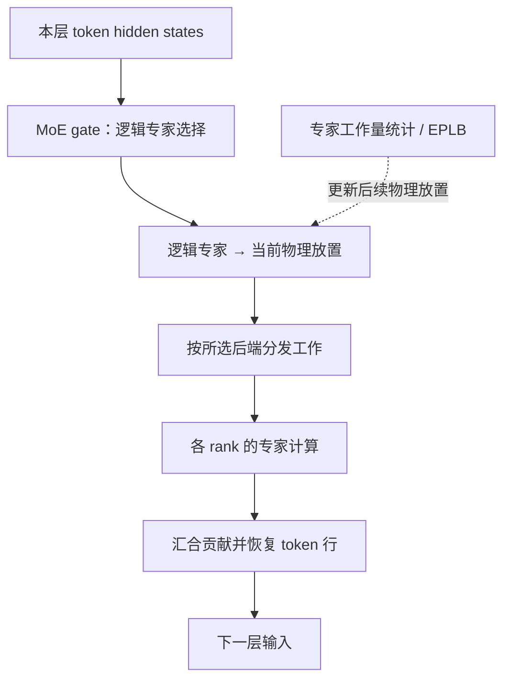

# M07 · 并行部署与通信拓扑

**先回答：TP、PP、DP、EP、CP 到底分别切了什么，怎样从一张卡扩展到多张卡而不把关系画错？**

本文是面向初学者的源码分析型架构导读。先看图和图解，再沿文末的链接深入原有源码章节。

## 0. 阅读基线与图例

| 项目 | 内容 |
| --- | --- |
| 源码目录 | SGLang 仓库根目录 `.`；下文路径均为仓内相对路径 |
| 本地学习分支 | `codex/sglang-source-study-20260909` |
| 固定 commit | `72d5c5bb73cadd7ffbf5114e5f81e29d36b6c61a` |
| 读取日期 | 2026-09-10 |
| 工作区状态 | 学习源码 worktree 干净；Wiki 有既有已发布内容与未提交状态，本次只改学习文档和架构配图 |
| 范围 | 分别展示教学拓扑；并行参数与 rank 关系按选定模式解释，不把所有尺寸相乘作为通用 GPU 数公式。 |
| 操作边界 | 静态源码复核与图文编写；未运行模型、GPU / 网络实验或性能测试 |

**图例与证据：** 图中每根箭头的标签说明交接内容；虚线通常表示控制、配置或依赖，具体以标签为准。进程、实例、rank 外框会显式标注；未标注的框表示职责或对象。所有图均为整理者依据固定源码绘制的教学视图，省略条件分支，不代表完整类图或已验证部署。`[S编号]` 对应文末源码锚点。

| 术语 | 人话解释 |
| --- | --- |
| TP | 同一层的 tensor / 参数计算分给组内成员 |
| PP | 把模型层分成前后相接的 stage |
| DP | 把不同请求分给多个执行分组；普通 DP 与 DP Attention 需区分 |
| EP / CP | 分别按专家或上下文工作划分成员职责 |
## 1. 先问“切什么”，再问“用了几张卡”

| 并行维度 | 主要划分的对象 | 跨边界常见内容 | 需要保持的关系 |
| --- | --- | --- | --- |
| TP | 层内参数 / tensor 计算 | 局部激活、规约结果 | 同一层分片组合成合法输出 |
| PP | 层与 microbatch 的前后 stage | 当前 forward 的 hidden / residual proxy、结果控制 | stage 顺序及批次对应 |
| 普通 DP | 请求流与独立模型副本组 | 入站路由与结果；组内另有 TP/PP | 请求归属及各自 KV |
| DP Attention | Attention 的请求/KV 分组 | 跨子组汇合的模型激活与行数 | Attention 局部行与后续计算对齐 |
| EP | 专家参数及 token 到专家的工作 | dispatch / combine，或特定实现的规约 | token 行、专家 ID 与返回顺序 |
| CP | 查询 token 或历史 KV 的工作 | K/V 汇合、局部 Attention 结果等 | 位置、因果关系与结果归并 |

**人话版：** 多卡不是“每张卡都各做完整请求”。有时一起算一层，有时接力算不同层，有时分别处理请求，有时专门处理某些专家。具体通信方式由实现路径决定，EP 也并非必定 AllToAll。[S1]、[S2]、[S3]

## 2. 四卡的两种部署，卡数相同而请求路线不同

本图为整理者依据固定源码绘制的架构视图。SVG 与下面的可编辑 Mermaid 表达同一组关系。宽图可[打开原尺寸 SVG](../../../images/sglang-architecture/07-parallel-topologies.svg)查看；手机端建议横屏或打开原图放大，图后文字提供逐步解读。

查看可编辑 Mermaid 源图

**图意解读：** 两个独立 WORLD 中都可以有 rank 0，这不意味着同一进程。设备编号、WORLD rank 和 TP rank 是不同坐标。方案 B 是普通 DP；DP Attention 则可能在一个较大的并行世界里划分 Attention 子组，并在 MLP/MoE 位置重新协作，不能照搬普通副本图。[S1]、[S2]

## 3. 再叠一层 PP，区分激活与 KV

**图意解读：** 本图取 TP=2、PP=2 的教学布局。传向下一 stage 的 proxy 是这一轮的中间激活，KV 则按本地层保留。图中每条 PP 箭头是概括后的 stage 通路；实际可能按 TP 伙伴发送分片并在目标组内恢复，不代表单根完整 tensor 连接。[S3]

**例子：** 若 R1 当前处理 O2，stage 0 先计算前半层，再把中间激活交给 stage 1。每个 stage 都读写自己负责层的历史状态。加入 R2 的 microbatch 能否填补空隙，还取决于循环深度、依赖和可用工作，不能把理想流水图当作测得吞吐。

## 4. EP 和 CP 是另一种数据划分

**图意解读：** 模型 gate、专家物理位置、传输 backend 和 EPLB 是不同职责。逻辑选中某专家后，还要知道它当前在哪个 rank；重新放置专家并不等于替模型重写语义上的路由函数。[S4]

CP 则关注上下文：Prefill CP 可以按查询 token 分工并交换需要的 K/V；Decode CP 可以让各成员读自己的历史 KV，计算局部输出，再按相应归并规则组合。二者切分对象和通信公式不同，不能凭 `cp_size` 就推导所有阶段同样切 KV。[S5]

## 5. 画多卡图之前填五个坐标

1. 每个物理节点上有哪些设备，哪个进程使用哪张卡？
2. 请求属于哪个普通副本或 DP Attention 子组？
3. 同一层、同一 stage、同一专家组分别有哪些 rank？
4. 每根箭头上传什么：请求、激活、规约结果、KV 还是控制消息？
5. 每种数据在哪些 rank 有有效副本，谁决定下一步可以开始？

**自测：** TP=8、Attention DP=2，是否必须再乘出 16 张卡？答案：不能这样推导。要看 Attention 子组如何从现有并行世界划分、MLP/MoE 如何组织，以及配置约束；某些尺寸表达的是同一组设备的不同分组坐标。

## 源码锚点与继续阅读

| 标识 | 图中行为 | 仓内文件 / 符号 |
| --- | --- | --- |
| S1 | 通信组、rank 与组内调用 | [`python/sglang/srt/distributed/parallel_state.py`][S1] |
| S2 | DP 请求分配与进程组织 | [`python/sglang/srt/managers/data_parallel_controller.py`][S2] |
| S3 | PP microbatch 与 proxy / 结果通路 | [`python/sglang/srt/managers/scheduler_pp_mixin.py`][S3] |
| S4 | MoE 层与专家执行入口 | [`python/sglang/srt/layers/moe`][S4] |
| S5 | CP 分组与参数约束入口 | [`python/sglang/srt/arg_groups`][S5] |

**下一步：**

- [Rank、进程组与通信基础](<../06-parallelism/01-Rank进程组与通信基础.md>)
- [Tensor Parallel 与层内通信](<../06-parallelism/02-TensorParallel与层内通信.md>)
- [Data Parallel 与 DP Attention](<../06-parallelism/03-DataParallel与DPAttention.md>)
- [Pipeline Parallel 与 Microbatch](<../06-parallelism/04-PipelineParallel与Microbatch.md>)
- [MoE 专家并行与负载均衡](<../06-parallelism/05-MoE专家并行与负载均衡.md>)
- [Context Parallel 与并行组合](<../06-parallelism/06-ContextParallel与并行组合.md>)

返回[架构导读与覆盖审计](README.md)或[完整阶段目录](../README.md)。

[S1]: https://github.com/sgl-project/sglang/blob/72d5c5bb73cadd7ffbf5114e5f81e29d36b6c61a/python/sglang/srt/distributed/parallel_state.py
[S2]: https://github.com/sgl-project/sglang/blob/72d5c5bb73cadd7ffbf5114e5f81e29d36b6c61a/python/sglang/srt/managers/data_parallel_controller.py
[S3]: https://github.com/sgl-project/sglang/blob/72d5c5bb73cadd7ffbf5114e5f81e29d36b6c61a/python/sglang/srt/managers/scheduler_pp_mixin.py
[S4]: https://github.com/sgl-project/sglang/tree/72d5c5bb73cadd7ffbf5114e5f81e29d36b6c61a/python/sglang/srt/layers/moe
[S5]: https://github.com/sgl-project/sglang/tree/72d5c5bb73cadd7ffbf5114e5f81e29d36b6c61a/python/sglang/srt/arg_groups
