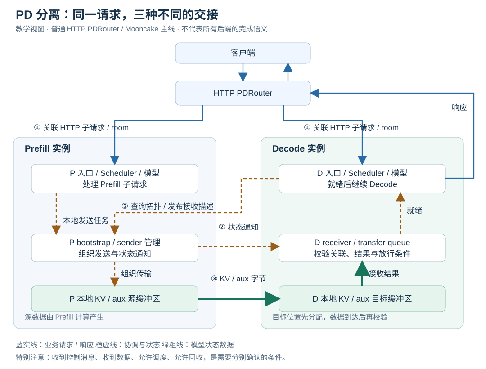
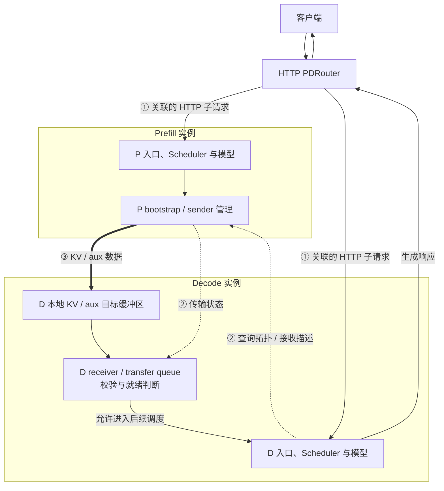
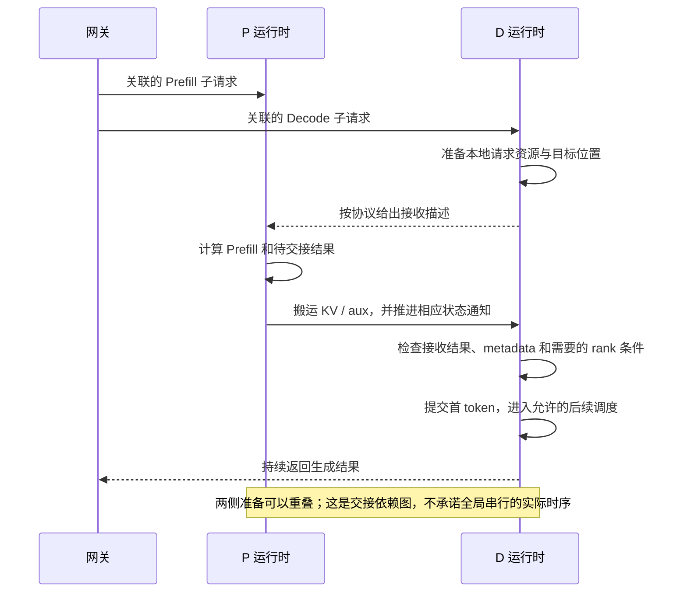
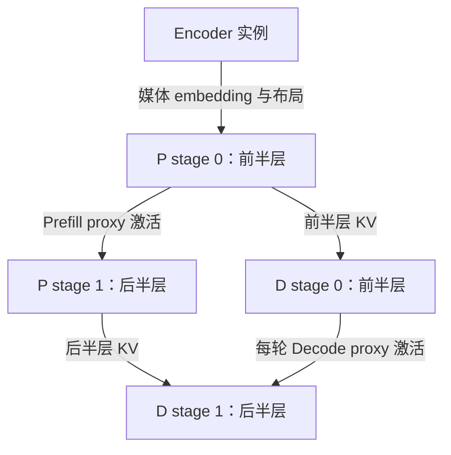

# M08 · PD与Encoder分离的三条通路

**先回答：P/D 分离后，一条请求、控制消息和 KV 字节如何分别到达正确实例？**

本文是面向初学者的源码分析型架构导读。先看图和图解，再沿文末的链接深入原有源码章节。

## 0. 阅读基线与图例

| 项目 | 内容 |
| --- | --- |
| 源码目录 | SGLang 仓库根目录 `.`；下文路径均为仓内相对路径 |
| 本地学习分支 | `codex/sglang-source-study-20260909` |
| 固定 commit | `72d5c5bb73cadd7ffbf5114e5f81e29d36b6c61a` |
| 读取日期 | 2026-09-10 |
| 工作区状态 | 学习源码 worktree 干净；Wiki 有既有已发布内容与未提交状态，本次只改学习文档和架构配图 |
| 范围 | 以系列已读的 Rust HTTP PDRouter 与 Mooncake 路径为主；PP / Encoder 仅作结构扩展，不泛化其他后端完成语义。 |
| 操作边界 | 静态源码复核与图文编写；未运行模型、GPU / 网络实验或性能测试 |

**图例与证据：** 图中每根箭头的标签说明交接内容；虚线通常表示控制、配置或依赖，具体以标签为准。进程、实例、rank 外框会显式标注；未标注的框表示职责或对象。所有图均为整理者依据固定源码绘制的教学视图，省略条件分支，不代表完整类图或已验证部署。`[S编号]` 对应文末源码锚点。

| 术语 | 人话解释 |
| --- | --- |
| P / D | 分别主要负责 Prefill 与后续 Decode 的运行时实例 |
| bootstrap room | 把请求两侧及一次传输关联起来的协议标识 |
| 接收描述 | 告知发送端目标位置、布局和关联信息 |
| 就绪 | 相关数据、元数据及 rank 条件均满足当前路径的放行要求 |
## 1. 请求路线与数据路线分开画

**人话版：** 网关安排 P 和 D 接受同一业务请求的相关工作，P 算出历史状态，再交给 D 继续生成。交接前，D 必须准备接收位置；交接后，D 必须确认拿到可用状态。网关的 HTTP 请求、Bootstrap/状态控制、KV 大块传输是三种通路。[S1]、[S2]、[S3]

本图为整理者依据固定源码绘制的架构视图。SVG 调整了空间布局，并显式标出源 / 目标缓冲区；可编辑 Mermaid 保留对应的控制和数据关系。宽图可[打开原尺寸 SVG](../../../images/sglang-architecture/08-pd-three-paths.svg)查看；手机端建议横屏或打开原图放大，图后文字提供逐步解读。

查看可编辑 Mermaid 源图

**图意解读：** ①传业务请求，②协调接收位置与状态，③搬模型状态。Bootstrap 不是实际 KV 数据通道；KV manager 能访问缓冲区，也不因此拥有 Scheduler 的全部准入策略。图省略 P 子请求响应等支路，完整路线见 07-01。[S1]、[S2]、[S3]

## 2. D 不是拿 P 的页号直接使用

| 对象 | P 侧示例 | D 侧示例 | 跨侧真正需要一致的内容 |
| --- | --- | --- | --- |
| 请求行 | 行 2 | 行 5 | 请求关联和有效 token 位置 |
| 物理页 | 源页 7、12 | 目标页 3、9 | 字节布局、长度、层与对应关系 |
| aux 槽 | 槽 3 | 槽 7 | 首 token、room 等当前协议元数据 |
| rank | P 的 TP/PP 坐标 | D 的 TP/PP 坐标 | 兼容布局下正确的发送 / 接收映射 |

以上数字都是教学示例。索引是各自池里的本地地址，不能直接共享。传输前要交换目标描述，传输后要将接收结果接入 D 的请求映射和状态机。[S2]、[S3]

**图意解读：** 第一次 Decode 要使用 P 已产生的有效状态；第一输出 token 与其自身 KV 的区别继续沿 M03 的时间模型理解。进入 waiting 状态也不保证此刻就执行，仍有本地调度预算。[S2]、[S3]

## 3. 加上 PP 与 Encoder 后，画三种不同的 tensor

**图意解读：** 这是层分片兼容的教学拓扑，真实 rank 映射还要检查协议与配置。Encoder embedding 是媒体编码结果；PP proxy 是本次 forward 的中间激活；PD KV 是可供后续 Attention 使用的历史状态。三种数据的接收方、生命周期和完成条件都不同。[S4]、[S5]

## 4. 取消时先辨认“完成”的对象

| 看到的状态 | 可以支持的有限结论 | 不能单独证明 |
| --- | --- | --- |
| HTTP 已返回错误 | 客户端交互已进入错误路径 | 远端所有传输已停止 |
| 取消意图已登记 | 本地后续调度 / 发送有取消状态可查 | 已提交设备工作都已排空 |
| 某控制 ACK 已收到 | 对应控制协议的一步发生 | 所有 DMA / scatter 都不再访问缓冲区 |
| 接收器报告结果 | 该接口定义的 poll / 状态条件满足 | 任意其他后端、rank 或组合也具有同样语义 |
| 本地槽位已归还 | 本地分配器允许后续复用 | 旧写入必然不可能到达 |

本版异常收尾存在默认回收、条件性暂留和超时分支，不能把教学图改画成统一可靠的“远端全部排空后才释放”。源码事实与运行安全证明应分别记录；本次没有执行传输或故障注入。[S2]、[S3]

**自测：** “D 的 KV 已分配”离“D 可以执行”还差什么？答案：对端知道正确目标、数据和 aux 到达、关联及长度等校验、需要的多 rank 条件、最终本地调度准入。

## 源码锚点与继续阅读

| 标识 | 图中行为 | 仓内文件 / 符号 |
| --- | --- | --- |
| S1 | HTTP 双侧请求及 room 关联 | [`sgl-model-gateway/src/routers/http/pd_router.rs`][S1] |
| S2 | P 的 bootstrap / inflight 与结束路径 | [`python/sglang/srt/disaggregation/prefill.py`][S2] |
| S3 | D 的预分配 / 接收 / 结果与回收 | [`python/sglang/srt/disaggregation/decode.py`][S3] |
| S4 | PP 的 P/D 调度主线 | [`python/sglang/srt/managers/scheduler_pp_mixin.py`][S4] |
| S5 | Encoder 分离接入 | [`python/sglang/srt/disaggregation`][S5] |

**下一步：**

- [PD 分离职责与端到端请求地图](<../07-disaggregation/01-PD分离职责与端到端请求地图.md>)
- [Prefill 侧 Bootstrap 与传输状态](<../07-disaggregation/02-Prefill侧Bootstrap与传输状态.md>)
- [Decode 侧预分配、接收与就绪](<../07-disaggregation/03-Decode侧预分配接收与就绪.md>)
- [KV 传输接口与后端实现地图](<../07-disaggregation/04-KV传输接口与后端实现地图.md>)
- [PD 异常取消与资源退役](<../07-disaggregation/05-PD异常取消与资源退役.md>)
- [PD 与 PP 及 Encoder 分离的组合](<../07-disaggregation/06-PD与PP及Encoder分离的组合.md>)

返回[架构导读与覆盖审计](README.md)或[完整阶段目录](../README.md)。

[S1]: https://github.com/sgl-project/sglang/blob/72d5c5bb73cadd7ffbf5114e5f81e29d36b6c61a/sgl-model-gateway/src/routers/http/pd_router.rs
[S2]: https://github.com/sgl-project/sglang/blob/72d5c5bb73cadd7ffbf5114e5f81e29d36b6c61a/python/sglang/srt/disaggregation/prefill.py
[S3]: https://github.com/sgl-project/sglang/blob/72d5c5bb73cadd7ffbf5114e5f81e29d36b6c61a/python/sglang/srt/disaggregation/decode.py
[S4]: https://github.com/sgl-project/sglang/blob/72d5c5bb73cadd7ffbf5114e5f81e29d36b6c61a/python/sglang/srt/managers/scheduler_pp_mixin.py
[S5]: https://github.com/sgl-project/sglang/tree/72d5c5bb73cadd7ffbf5114e5f81e29d36b6c61a/python/sglang/srt/disaggregation
