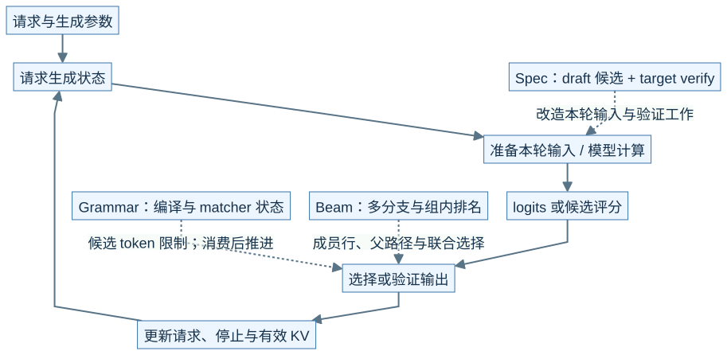
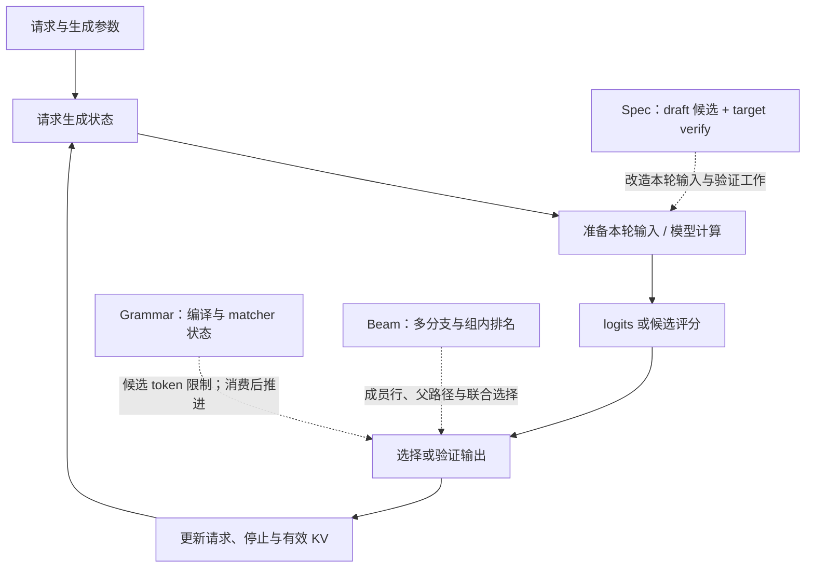
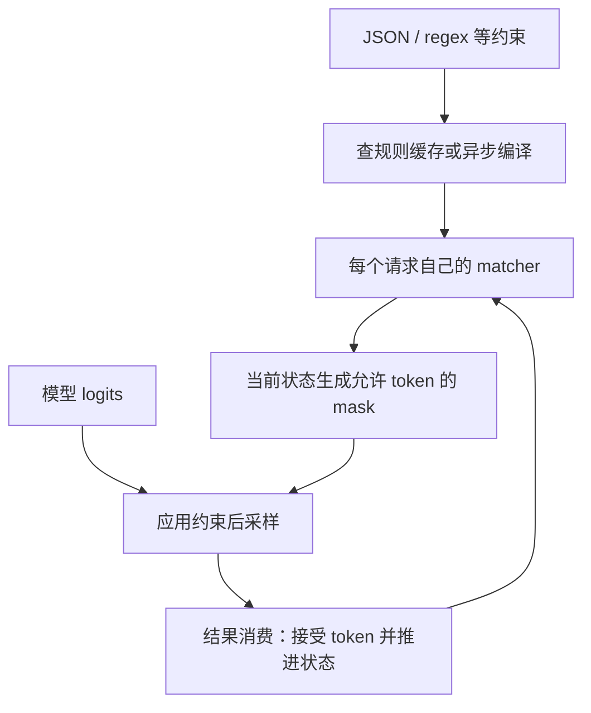
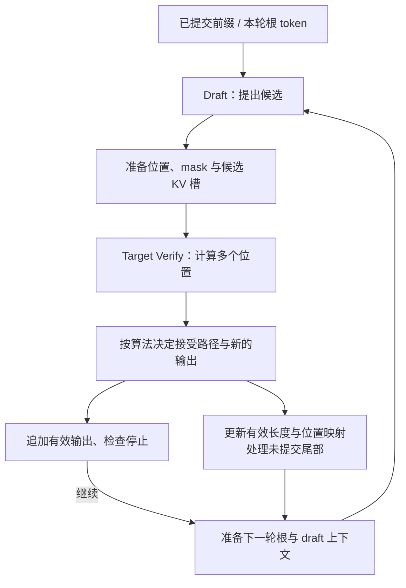
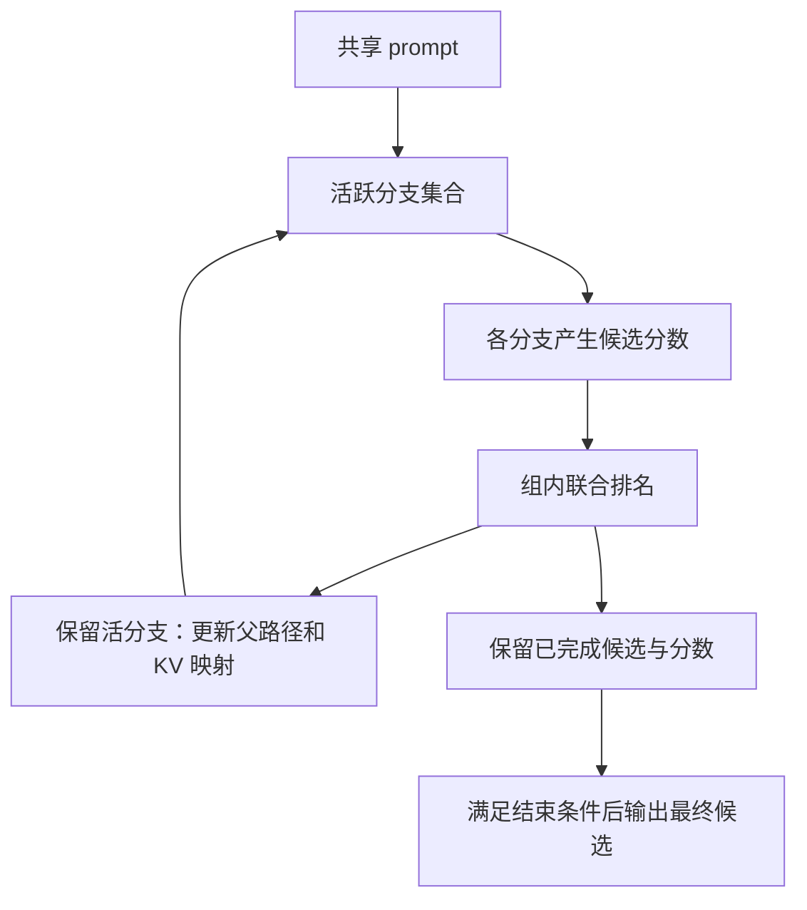

# M09 · 高级生成特性插入位置

**先回答：Grammar、Beam Search、EAGLE、MTP、DFlash 和 Ngram 如何改变同一条生成主链？**

本文是面向初学者的源码分析型架构导读。先看图和图解，再沿文末的链接深入原有源码章节。

## 0. 阅读基线与图例

| 项目 | 内容 |
| --- | --- |
| 源码目录 | SGLang 仓库根目录 `.`；下文路径均为仓内相对路径 |
| 本地学习分支 | `codex/sglang-source-study-20260909` |
| 固定 commit | `72d5c5bb73cadd7ffbf5114e5f81e29d36b6c61a` |
| 读取日期 | 2026-09-10 |
| 工作区状态 | 学习源码 worktree 干净；Wiki 有既有已发布内容与未提交状态，本次只改学习文档和架构配图 |
| 范围 | 先把高级生成定位为输出约束、分支搜索或候选验证，再追其新增状态；不提供算法精度或性能保证。 |
| 操作边界 | 静态源码复核与图文编写；未运行模型、GPU / 网络实验或性能测试 |

**图例与证据：** 图中每根箭头的标签说明交接内容；虚线通常表示控制、配置或依赖，具体以标签为准。进程、实例、rank 外框会显式标注；未标注的框表示职责或对象。所有图均为整理者依据固定源码绘制的教学视图，省略条件分支，不代表完整类图或已验证部署。`[S编号]` 对应文末源码锚点。

| 术语 | 人话解释 |
| --- | --- |
| Grammar | 用每个请求的语法状态约束当前允许的 token |
| Beam | 同时保留并比较多条候选路径 |
| Draft / Verify | 先提出候选，再由目标模型验证 |
| Commit | 把有效结果纳入请求和资源账本；这里是教学过程名 |
## 1. 先按改变的位置分类

本图为整理者依据固定源码绘制的架构视图。SVG 与下面的可编辑 Mermaid 表达同一组关系。宽图可[打开原尺寸 SVG](../../../images/sglang-architecture/09-generation-features.svg)查看；手机端建议横屏或打开原图放大，图后文字提供逐步解读。

查看可编辑 Mermaid 源图

**图意解读：** 三个功能框不是可直接拼接的固定调用链。Grammar 在请求与采样之间维持语法状态，Beam 管多条活路径，Spec 改变一次目标计算尝试验证的 token 数量。它们都要接回结果和资源生命周期。[S1]、[S2]、[S3]

## 2. Grammar 是“先准备规则，再按当前状态筛选”

**图意解读：** 编译缓存可以共享规则模板，但各请求的生成进度必须独立。Overlap 可让部分 CPU 准备提前发生，当前采样仍要用正确的状态；不能把异步编译画成“模型计算永远不用等规则”。[S1]

## 3. Spec 把一轮变成候选、验证和有效提交

**图意解读：** 候选已经写入 KV，不表示候选已成为正式输出；槽位预留、候选写入、有效提交、最终回收是四个阶段。不同实现会保留、覆盖或压缩未接受的尾部，不能统一画成每轮立刻释放所有拒绝位置。[S3]、[S4]

| 名称 | 在这张图里先关注哪里 | 下一步去看什么 |
| --- | --- | --- |
| EAGLE / MTP | Draft 如何利用模型特征或附加预测结构 | draft 模型、target 特征与下一轮上下文 |
| DFlash | 候选块怎样构造和验证 | 专用 worker、位置与 mask、接受和输出口径 |
| Ngram | 候选来自哪些已有 token 模式 | 候选生成器和统一验证 / 结果接口 |
| 自适应投机 | 本轮候选预算怎么调整 | 统计窗口、当前工作量与回退条件 |

这是定位表，不把不同算法统一成相同模型结构。以生效配置选出的 worker 和算法分发为准。[S3]、[S4]

## 4. Beam 管的是路径集合

**图意解读：** 多个 Beam 分支不是多个互不相关的 HTTP 请求，分支之间可能共享 prompt 或祖先状态。一个候选结束也不必等于整个组结束；组结果输出、父子路径和物理槽位的关系都需要独立追踪。[S2]

## 5. 特性组合先查状态依赖

**例子：** 给投机生成再加 Grammar，应该问：候选树各位置使用哪份语法状态？接受路径如何推进正式 matcher？Overlap 下何时读取、何时更新？停止后有没有多算结果仍待处理？这些问题的答案来自具体组合实现，不能由两个单独功能都存在推出。

**自测：** 目标模型一次验证了 5 个位置，客户端是否一定收到 5 个 token？答案：不一定。位置中可能包含根，候选只接受一部分，也可能提前停止；验证位置数、接受长度和有效输出数量要分别记账。

## 源码锚点与继续阅读

| 标识 | 图中行为 | 仓内文件 / 符号 |
| --- | --- | --- |
| S1 | Grammar 管理与状态推进入口 | [`python/sglang/srt/constrained/grammar_manager.py::GrammarManager`][S1] |
| S2 | Beam 请求分支与结果处理 | [`python/sglang/srt/beam_search/coordinator.py::BeamCoordinator`][S2] |
| S3 | 算法与 worker 选择 | [`python/sglang/srt/speculative/spec_info.py::SpeculativeAlgorithm.create_worker`][S3] |
| S4 | 候选验证的公共接口 | [`python/sglang/srt/speculative/base_spec_worker.py::BaseSpecWorker`][S4] |

**下一步：**

- [结构化输出与 Grammar 状态](<../08-advanced-generation/01-结构化输出与Grammar状态.md>)
- [Beam Search 与请求分支状态](<../08-advanced-generation/02-BeamSearch与请求分支状态.md>)
- [投机解码的 Draft、Verify、Commit](<../08-advanced-generation/03-投机解码的DraftVerifyCommit.md>)
- [EAGLE 与 MTP 的源码主线](<../08-advanced-generation/04-EAGLE与MTP的源码主线.md>)
- [DFlash、Ngram 与自适应投机](<../08-advanced-generation/05-DFlashNgram与自适应投机.md>)
- [投机中的 Overlap、KV 与组合约束](<../08-advanced-generation/06-投机中的OverlapKV与组合约束.md>)

返回[架构导读与覆盖审计](README.md)或[完整阶段目录](../README.md)。

[S1]: https://github.com/sgl-project/sglang/blob/72d5c5bb73cadd7ffbf5114e5f81e29d36b6c61a/python/sglang/srt/constrained/grammar_manager.py#L30
[S2]: https://github.com/sgl-project/sglang/blob/72d5c5bb73cadd7ffbf5114e5f81e29d36b6c61a/python/sglang/srt/beam_search/coordinator.py#L101
[S3]: https://github.com/sgl-project/sglang/blob/72d5c5bb73cadd7ffbf5114e5f81e29d36b6c61a/python/sglang/srt/speculative/spec_info.py#L301
[S4]: https://github.com/sgl-project/sglang/blob/72d5c5bb73cadd7ffbf5114e5f81e29d36b6c61a/python/sglang/srt/speculative/base_spec_worker.py#L154
