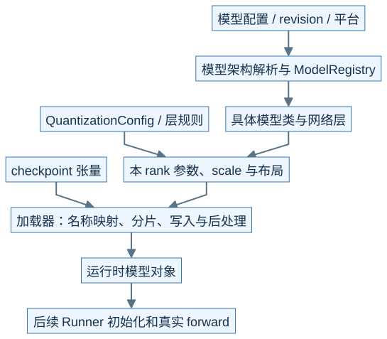
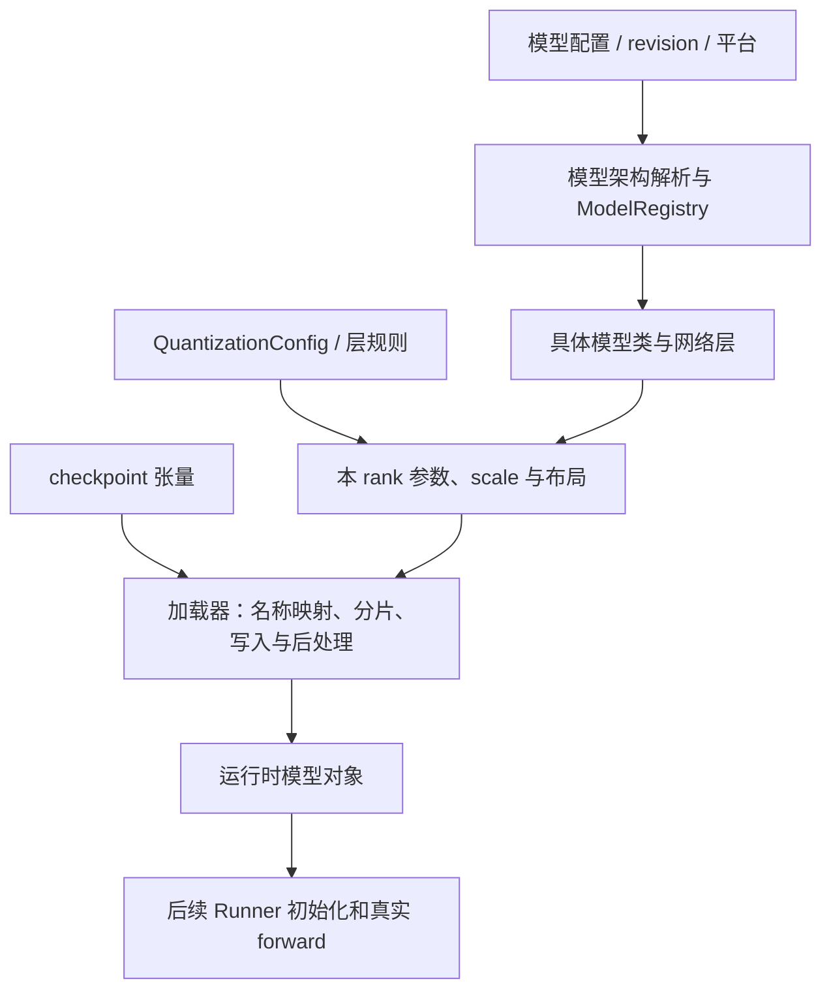
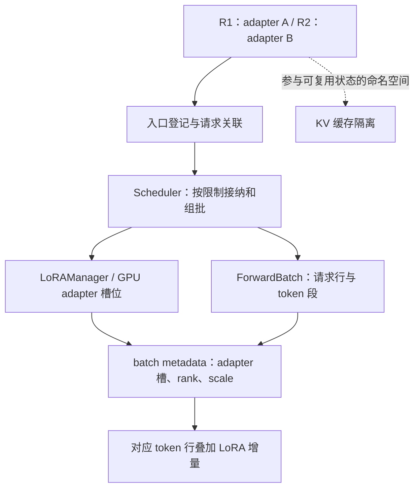
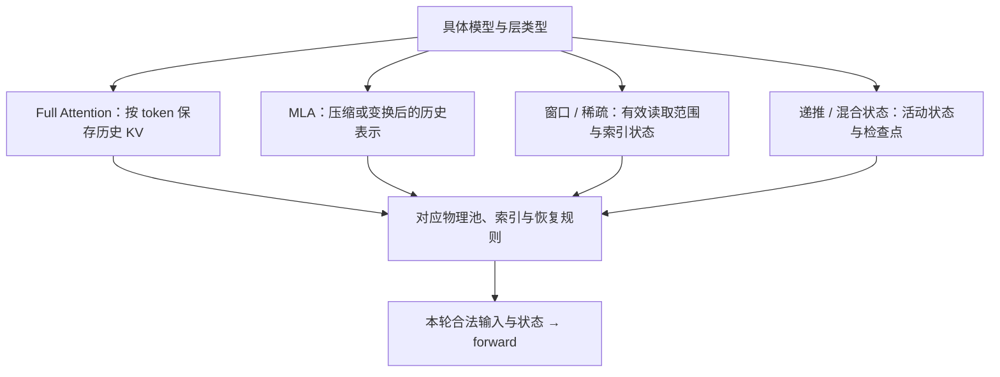
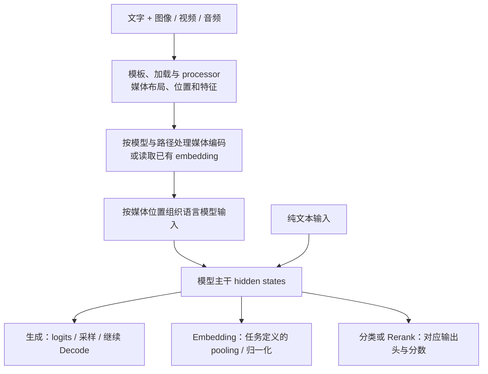

# M10 · 模型装配状态形态与输入输出

**先回答：换模型、做量化、加载 LoRA 或加入图像之后，哪些层变化，哪些主线仍可复用？**

本文是面向初学者的源码分析型架构导读。先看图和图解，再沿文末的链接深入原有源码章节。

## 0. 阅读基线与图例

| 项目 | 内容 |
| --- | --- |
| 源码目录 | SGLang 仓库根目录 `.`；下文路径均为仓内相对路径 |
| 本地学习分支 | `codex/sglang-source-study-20260909` |
| 固定 commit | `72d5c5bb73cadd7ffbf5114e5f81e29d36b6c61a` |
| 读取日期 | 2026-09-10 |
| 工作区状态 | 学习源码 worktree 干净；Wiki 有既有已发布内容与未提交状态，本次只改学习文档和架构配图 |
| 范围 | 按装配、层内状态、输入、输出四个轴比较模型特性；具体模型只作为代表，不把 Llama 的布局套到全部模型。 |
| 操作边界 | 静态源码复核与图文编写；未运行模型、GPU / 网络实验或性能测试 |

**图例与证据：** 图中每根箭头的标签说明交接内容；虚线通常表示控制、配置或依赖，具体以标签为准。进程、实例、rank 外框会显式标注；未标注的框表示职责或对象。所有图均为整理者依据固定源码绘制的教学视图，省略条件分支，不代表完整类图或已验证部署。`[S编号]` 对应文末源码锚点。

| 术语 | 人话解释 |
| --- | --- |
| 模型装配 | 选模型类、构造参数布局、加载并处理权重 |
| 量化 | 权重或激活的格式与计算方法选择，KV 格式另看 |
| LoRA | 共享基础权重上的请求相关低秩增量 |
| pooling | 把输入的 hidden states 按任务规则汇聚成输出 |
## 1. 模型文件不是直接被 GPU 执行的程序

本图为整理者依据固定源码绘制的架构视图。SVG 与下面的可编辑 Mermaid 表达同一组关系。宽图可[打开原尺寸 SVG](../../../images/sglang-architecture/10-model-assembly.svg)查看；手机端建议横屏或打开原图放大，图后文字提供逐步解读。

查看可编辑 Mermaid 源图

**人话版与图解：** 配置决定搭哪种机器，加载器把 checkpoint 中的数据放进对应零件，量化方法会影响零件的形状、scale 和实际计算。下载到权重文件、成功构造模型、加载结束、真实计算正确是不同阶段。[S1]、[S2]

量化至少要分开权重格式、激活处理、KV dtype 和实际 kernel。文件名带 FP8，不能直接推出所有层、所有缓存和输出都采用同一种 FP8 路径。

## 2. LoRA 让“请求身份”进入计算和缓存隔离

**图意解读：** 基础权重可共享，LoRA 仍有 CPU/GPU 驻留、槽位和引用生命周期。R1/R2 在同一 batch 中也必须让 token 行匹配正确 adapter。相同文本在不同 LoRA 下的状态不能仅凭 token 相同就共享。[S3]

## 3. 换 Attention，保存的“历史”也会变

**图意解读：** 图按状态形态归类；实际模型可同时包含多个分支。MLA、稀疏索引和递推检查点不能画成同一张普通 K/V 表。Unified Cache 协调不同组件，不能让不同形态天然拥有同样的前缀恢复条件。[S4]、[S5]

## 4. 多模态改变入站链，任务类型改变出站链

**图意解读：** 这是任务关系图，不是一种模型保证支持全部出口。普通图文生成仍可能接回语言模型 Prefill/Decode；Embedding 和 Rerank 输出的是向量或分数，不需要把每次结果都解释成 token 生成循环。媒体编码所在进程和是否分离由具体路径决定，Encoder 分离见 M08。[S6]、[S7]

**例子：** 同一个“文字加图片”请求，在 API 是媒体 URL/数据，在 processor 是特征和布局，在模型入口可能变成媒体位置对应的 embedding，之后才进入语言层状态。若 token 数或 KV 复用异常，应追这些转换的边界，而非只比较用户看到的文字。

## 5. 接入或切换模型时的四问

| 轴 | 需要补画的内容 | 对应潜在故障 |
| --- | --- | --- |
| 装配 | 模型类、权重名称与分片、量化后处理 | 加载失败、shape 或精度异常 |
| 状态 | 每层历史形态、窗口 / 检查点及池 | cache match 错误、恢复不完整、容量判断错误 |
| 输入 | 模板、分词、媒体位置、adapter 身份 | 输入长度、对齐或隔离异常 |
| 输出 | logits、pooling、分类 head、媒体解码 | 输出类型或后处理不匹配 |

**自测：** 支持某模型的普通生成，是否意味着其 LoRA、量化、PD、图执行都已支持？答案：不能推出。每个特性可能触及上述不同契约，要分别核对配置、接口、实现路径和验证范围。

## 源码锚点与继续阅读

| 标识 | 图中行为 | 仓内文件 / 符号 |
| --- | --- | --- |
| S1 | 模型 registry | [`python/sglang/srt/models/registry.py`][S1] |
| S2 | 模型加载与参数写入 | [`python/sglang/srt/model_loader/loader.py`][S2] |
| S3 | LoRA 管理 | [`python/sglang/srt/lora/lora_manager.py::LoRAManager`][S3] |
| S4 | MLA 与模型实际路径 | [`python/sglang/srt/models/deepseek_v2.py`][S4] |
| S5 | 混合状态组件 | [`python/sglang/srt/mem_cache/unified_cache/components`][S5] |
| S6 | 媒体输入处理 | [`python/sglang/srt/managers/multimodal_processor.py`][S6] |
| S7 | Pooling 输出 | [`python/sglang/srt/layers/pooler.py`][S7] |

**下一步：**

- [模型注册、配置与权重加载](<../09-model-specialization/01-模型注册配置与权重加载.md>)
- [量化格式与计算路径](<../09-model-specialization/02-量化格式与计算路径.md>)
- [MultiLoRA 加载、调度与隔离](<../09-model-specialization/03-MultiLoRA加载调度与隔离.md>)
- [MLA、稀疏注意力与混合状态模型](<../09-model-specialization/04-MLA稀疏注意力与混合状态模型.md>)
- [图像、视频、音频输入的处理链路](<../09-model-specialization/05-图像视频音频输入的处理链路.md>)
- [Embedding、Rerank 与模型适配清单](<../09-model-specialization/06-EmbeddingRerank与模型适配清单.md>)

返回[架构导读与覆盖审计](README.md)或[完整阶段目录](../README.md)。

[S1]: https://github.com/sgl-project/sglang/blob/72d5c5bb73cadd7ffbf5114e5f81e29d36b6c61a/python/sglang/srt/models/registry.py
[S2]: https://github.com/sgl-project/sglang/blob/72d5c5bb73cadd7ffbf5114e5f81e29d36b6c61a/python/sglang/srt/model_loader/loader.py
[S3]: https://github.com/sgl-project/sglang/blob/72d5c5bb73cadd7ffbf5114e5f81e29d36b6c61a/python/sglang/srt/lora/lora_manager.py#L65
[S4]: https://github.com/sgl-project/sglang/blob/72d5c5bb73cadd7ffbf5114e5f81e29d36b6c61a/python/sglang/srt/models/deepseek_v2.py
[S5]: https://github.com/sgl-project/sglang/tree/72d5c5bb73cadd7ffbf5114e5f81e29d36b6c61a/python/sglang/srt/mem_cache/unified_cache/components
[S6]: https://github.com/sgl-project/sglang/blob/72d5c5bb73cadd7ffbf5114e5f81e29d36b6c61a/python/sglang/srt/managers/multimodal_processor.py
[S7]: https://github.com/sgl-project/sglang/blob/72d5c5bb73cadd7ffbf5114e5f81e29d36b6c61a/python/sglang/srt/layers/pooler.py
