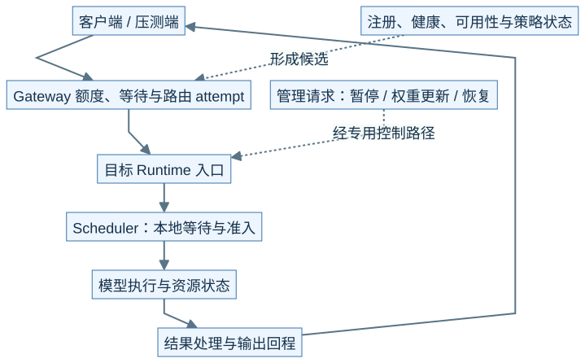
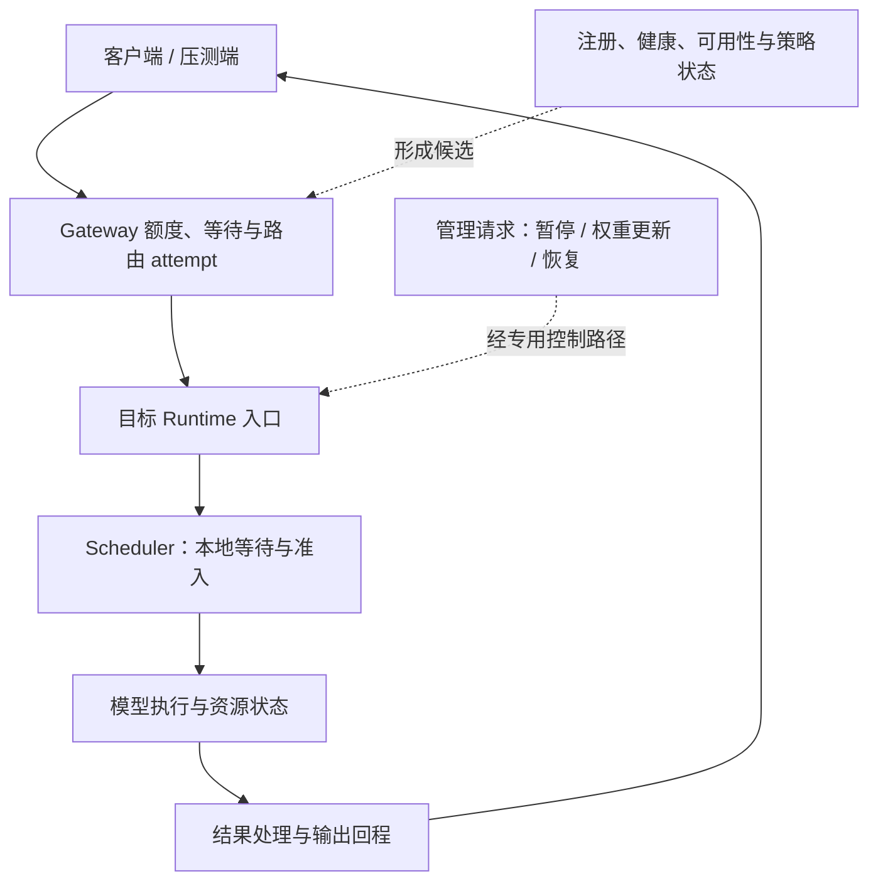
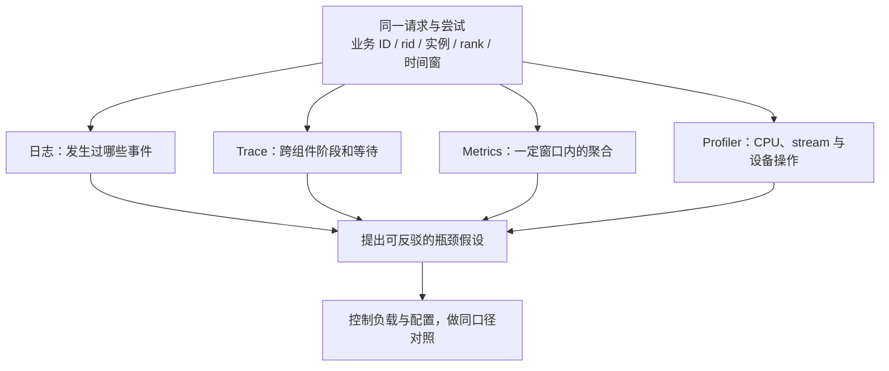
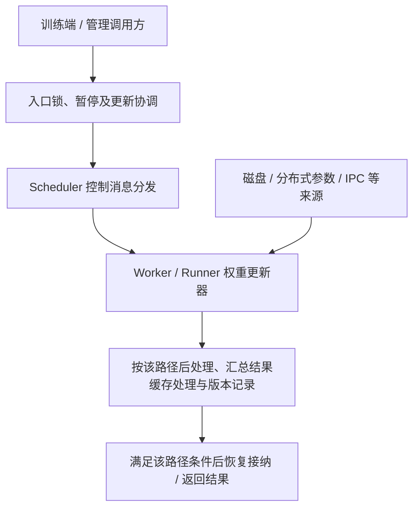

# M11 · 网关服务治理与性能诊断全景

**先回答：实例外的路由、限流、健康和观测怎样连到实例内的请求、调度和 GPU 工作？**

本文是面向初学者的源码分析型架构导读。先看图和图解，再沿文末的链接深入原有源码章节。

## 0. 阅读基线与图例

| 项目 | 内容 |
| --- | --- |
| 源码目录 | SGLang 仓库根目录 `.`；下文路径均为仓内相对路径 |
| 本地学习分支 | `codex/sglang-source-study-20260909` |
| 固定 commit | `72d5c5bb73cadd7ffbf5114e5f81e29d36b6c61a` |
| 读取日期 | 2026-09-10 |
| 工作区状态 | 学习源码 worktree 干净；Wiki 有既有已发布内容与未提交状态，本次只改学习文档和架构配图 |
| 范围 | 集中展示服务控制与观测边界；时间分解是教学定位，实际归因仍需同口径 Trace、日志和实验。 |
| 操作边界 | 静态源码复核与图文编写；未运行模型、GPU / 网络实验或性能测试 |

**图例与证据：** 图中每根箭头的标签说明交接内容；虚线通常表示控制、配置或依赖，具体以标签为准。进程、实例、rank 外框会显式标注；未标注的框表示职责或对象。所有图均为整理者依据固定源码绘制的教学视图，省略条件分支，不代表完整类图或已验证部署。`[S编号]` 对应文末源码锚点。

| 术语 | 人话解释 |
| --- | --- |
| Gateway | 在多个 worker 之间转发和治理请求的入口 |
| 准入 | 是否允许进入某一层；网关与 Scheduler 各有自己的准入 |
| TTFT / ITL | 首 token 延迟 / 输出 token 间隔，需注明测量端点 |
| 观测 | Metrics、日志、Trace 和设备时间线提供的不同证据 |
## 1. 服务治理至少有实例外、实例内两层

本图为整理者依据固定源码绘制的架构视图。SVG 与下面的可编辑 Mermaid 表达同一组关系。宽图可[打开原尺寸 SVG](../../../images/sglang-architecture/11-serving-observability.svg)查看；手机端建议横屏或打开原图放大，图后文字提供逐步解读。

查看可编辑 Mermaid 源图

**图意解读：** Gateway 选择实例，Scheduler 决定实例内本轮工作；网关缓存亲和策略的历史信息也不是直接读取设备池的真实驻留状态。注册、健康和可用性帮助筛候选，但单独一项状态不能证明特定请求可成功。[S1]、[S2]

**例子：** R1 被路由到 A 后没有首字，原因可能是网关之前已经等待、A 内部等待、模型执行或回程。应先按同一请求找到分段时间，不能只看 A 的 GPU 时间。

## 2. 观测不是一张万能仪表盘

**图意解读：** Metrics 能展示趋势，但通常不能单独还原某条请求。Trace 只有在上下文真实传播时才连得起来；CPU/设备时钟、异步提交和流式输出还会影响对齐。一个层级的短耗时不能抵消其他层级的等待。[S3]、[S4]

| 测量问题 | 教学上分成哪些段 | 关键边界 |
| --- | --- | --- |
| TTFT 高 | 客户端发出、网关、前端、排队、首轮计算、首输出回程 | 并行 / 重叠段不能重复相加 |
| ITL 抖动 | 各轮计算、调度间隔、输出分块与网络接收 | 客户端 chunk 不一定一 token 一包 |
| 吞吐低 | 到达率、并发、准入、有效 token、失败和观察窗口 | 请求吞吐与 token 吞吐、服务端与客户端口径不同 |
| 命中高收益低 | 命中层级、实际跳过计算、回载与其他等待 | 命中数不等于节省的 wall time |
| 显存紧张 | 权重、KV、图 / 工作区、adapter、在途保留 | 池容量、活跃引用与设备占用不能混算 |

## 3. 在线更新是另一条生命周期

**图意解读：** 控制消息决定何时更新，权重数据从对应来源进入模型。暂停、参数写入、缓存处理、版本记录和恢复是多个步骤；某个 rank 返回成功，不能自动证明全部 rank、draft/target 或 P/D 组合处于同一版本。应沿选定更新接口核对错误汇总和组合限制。[S5]

## 4. 从现象到地图，再到实验

1. 先固定模型、revision、配置、输入 / 输出长度和到达方式。
2. 标出客户端和服务端各自测量的位置，以及成功 / 失败样本的筛选。
3. 从 M01 找到涉及的层，再进入 M04 调度、M05 缓存、M06 执行或 M08 传输。
4. 写出一个有反证条件的假设，例如“R1 的首字主要等在 H2D 回载”，再找同一请求的事件和时间线。
5. 只改变能够检验该假设的因素，记录精度、错误和资源行为，避免仅比较一个总吞吐数字。

**自测：** 健康检查通过但请求超时，是否矛盾？答案：不矛盾。先查健康端点到底测了什么，再分别检查请求等待、推理、回程和超时预算的作用范围。

## 源码锚点与继续阅读

| 标识 | 图中行为 | 仓内文件 / 符号 |
| --- | --- | --- |
| S1 | HTTP 请求路由 | [`sgl-model-gateway/src/routers/http/router.rs`][S1] |
| S2 | 缓存亲和策略 | [`sgl-model-gateway/src/policies/cache_aware.rs`][S2] |
| S3 | Scheduler 指标采集 | [`python/sglang/srt/managers/scheduler_components/metrics_reporter.py`][S3] |
| S4 | Profiler 启停及数据输出 | [`python/sglang/srt/managers/scheduler_components/profiler_manager.py`][S4] |
| S5 | 权重更新和缓存处理 | [`python/sglang/srt/managers/scheduler_components/weight_updater.py::SchedulerWeightUpdaterManager`][S5] |

**下一步：**

- [Model Gateway 注册、路由与缓存亲和](<../10-serving-operations/01-ModelGateway注册路由与缓存亲和.md>)
- [健康检查、超时、限流与优雅退出](<../10-serving-operations/03-健康检查超时限流与优雅退出.md>)
- [Metrics、日志与 Trace 关联](<../10-serving-operations/04-Metrics日志与Trace关联.md>)
- [权重更新、暂停恢复与 RL 接口](<../10-serving-operations/05-权重更新暂停恢复与RL接口.md>)
- [Benchmark 设计与指标口径](<../11-performance-engineering/01-Benchmark设计与指标口径.md>)
- [Profiler 与时间线阅读](<../11-performance-engineering/02-Profiler与时间线阅读.md>)
- [从现象定位性能瓶颈](<../11-performance-engineering/03-从现象定位性能瓶颈.md>)
- [测试分层、精度与失败复现](<../11-performance-engineering/05-测试分层精度与失败复现.md>)

返回[架构导读与覆盖审计](README.md)或[完整阶段目录](../README.md)。

[S1]: https://github.com/sgl-project/sglang/blob/72d5c5bb73cadd7ffbf5114e5f81e29d36b6c61a/sgl-model-gateway/src/routers/http/router.rs
[S2]: https://github.com/sgl-project/sglang/blob/72d5c5bb73cadd7ffbf5114e5f81e29d36b6c61a/sgl-model-gateway/src/policies/cache_aware.rs
[S3]: https://github.com/sgl-project/sglang/blob/72d5c5bb73cadd7ffbf5114e5f81e29d36b6c61a/python/sglang/srt/managers/scheduler_components/metrics_reporter.py
[S4]: https://github.com/sgl-project/sglang/blob/72d5c5bb73cadd7ffbf5114e5f81e29d36b6c61a/python/sglang/srt/managers/scheduler_components/profiler_manager.py
[S5]: https://github.com/sgl-project/sglang/blob/72d5c5bb73cadd7ffbf5114e5f81e29d36b6c61a/python/sglang/srt/managers/scheduler_components/weight_updater.py#L77
