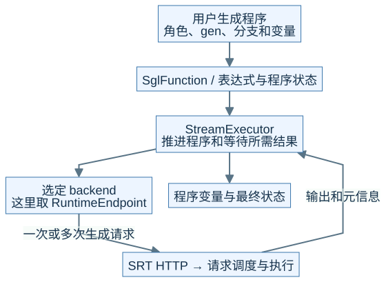
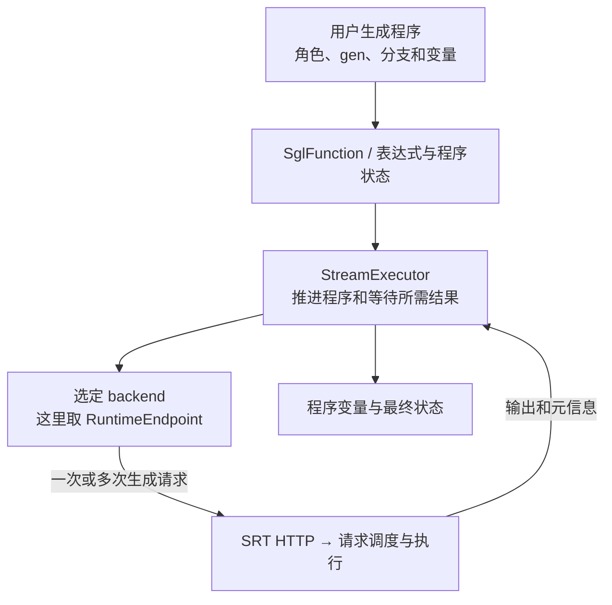
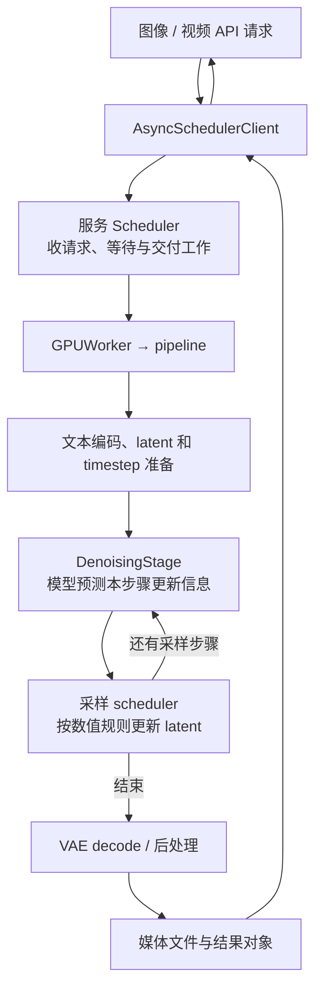
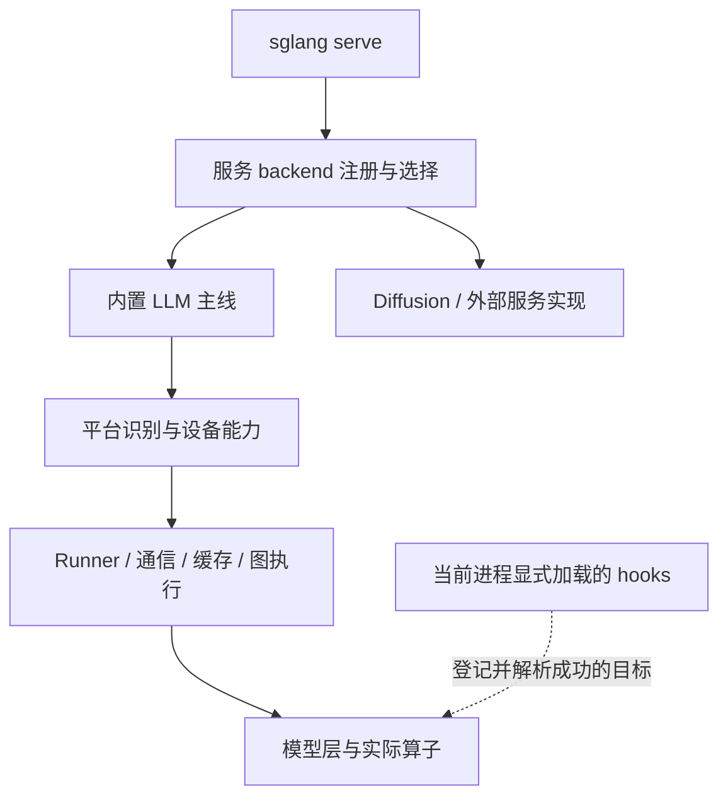

# M12 · DSL与Diffusion及插件边界

**先回答：哪些 SGLang 能力是主运行时之外的另一条主线，为什么不能都套用 Tokenizer—Scheduler—Decode 图？**

本文是面向初学者的源码分析型架构导读。先看图和图解，再沿文末的链接深入原有源码章节。

## 0. 阅读基线与图例

| 项目 | 内容 |
| --- | --- |
| 源码目录 | SGLang 仓库根目录 `.`；下文路径均为仓内相对路径 |
| 本地学习分支 | `codex/sglang-source-study-20260909` |
| 固定 commit | `72d5c5bb73cadd7ffbf5114e5f81e29d36b6c61a` |
| 读取日期 | 2026-09-10 |
| 工作区状态 | 学习源码 worktree 干净；Wiki 有既有已发布内容与未提交状态，本次只改学习文档和架构配图 |
| 范围 | Frontend DSL 取 RuntimeEndpoint 示例；Diffusion 取文生图 pipeline；插件按服务、平台和实现 hooks 分层。 |
| 操作边界 | 静态源码复核与图文编写；未运行模型、GPU / 网络实验或性能测试 |

**图例与证据：** 图中每根箭头的标签说明交接内容；虚线通常表示控制、配置或依赖，具体以标签为准。进程、实例、rank 外框会显式标注；未标注的框表示职责或对象。所有图均为整理者依据固定源码绘制的教学视图，省略条件分支，不代表完整类图或已验证部署。`[S编号]` 对应文末源码锚点。

| 术语 | 人话解释 |
| --- | --- |
| DSL | 组织多步生成程序的前端接口 |
| IR | 生成程序内部的表达结构，不等于 CUDA Graph |
| latent | 扩散生成反复更新的潜在表示 |
| 插件 hook | 在明确注册和加载的边界扩展或替换实现 |
## 1. DSL 管程序，Runtime 管进入系统的请求

本图为整理者依据固定源码绘制的架构视图。SVG 与下面的可编辑 Mermaid 表达同一组关系。宽图可[打开原尺寸 SVG](../../../images/sglang-architecture/12-dsl-runtime.svg)查看；手机端建议横屏或打开原图放大，图后文字提供逐步解读。

查看可编辑 Mermaid 源图

**图意解读：** 一次 DSL 程序运行可以提交多次生成请求。程序的分支与变量生命周期、服务请求的生命周期、GPU batch 的生命周期不相同。其他 DSL backend 未必访问本地 SRT；直接使用 HTTP 或 Engine 也不要求 DSL。[S1]、[S2]

**例子：** 先让模型回答 R1，再把答案追加到上下文中发 R2。程序等待答案变量就绪后才能组织依赖它的后续动作；服务内部仍可独立对 R1/R2 与其他用户请求进行调度。前缀是否复用，最终取决于提交给服务的输入和缓存条件。

## 2. Diffusion 中两个 Scheduler 不是同一个角色

**图意解读：** 服务 Scheduler 管任务，采样 scheduler 管扩散数值步骤。这里反复更新的是 latent，不能把每步理解为新生成一个文本 token，也不能把 DiT 计算缓存简单当成自回归 KV Cache。[S3]、[S4]

| 优化位置 | Diffusion 中先观察什么 | 不应照搬的 LLM 结论 |
| --- | --- | --- |
| 并行 | latent / 序列 / head 布局与每步通信 | TP/CP 名称相近就有同样 rank 和状态布局 |
| 计算缓存 | 哪些模型步骤或计算结果复用、何时失效 | 共享文本前缀就共享同一种 KV |
| Graph / compile | 被捕获的计算段和合法形状 | 普通 LLM Decode 图桶适用于媒体 pipeline |
| 驻留 / offload | 文本编码器、DiT、VAE 在何时驻留 | 每个组件一直同时占据设备内存 |

这些机制的实际接线与外部依赖边界在 12-03 展开；本篇只提供看图的坐标。

## 3. 插件也有不同的入口层

**图意解读：** 注册一个服务 backend，决定的是进入哪条服务主线；平台插件影响设备抽象；实现 hook 作用于明确目标。插件安装在环境中、在某个进程加载成功、某次实际调用命中它，是三个不同条件。[S5]、[S6]

## 4. 一张新架构图是否合格

面对新模型或新特性，先按以下顺序自检，再沿附录复核源码：

- **入口：** 还在普通 SRT 主线吗？哪个分发条件选中了它？
- **边界：** 框代表对象、线程、进程、rank 还是实例？
- **数据：** 箭头携带 token、hidden、KV、latent、embedding 还是控制消息？
- **生命周期：** 谁持有资源，哪些事件允许下一步或回收？
- **证据：** 哪些边是源码明确调用，哪些是压缩后的教学关系，哪些还需要运行验证？

**自测：** 为什么“用了同一个 Scheduler 名称”不足以复用整张图？答案：名称可能对应不同系统里的不同对象。只有输入、状态、调度单位、输出和生命周期相匹配时，才适合复用心智模型。

## 源码锚点与继续阅读

| 标识 | 图中行为 | 仓内文件 / 符号 |
| --- | --- | --- |
| S1 | DSL API 与表达式 | [`python/sglang/lang/api.py`][S1] |
| S2 | DSL 程序执行 | [`python/sglang/lang/interpreter.py`][S2] |
| S3 | Diffusion 服务 Worker | [`python/sglang/multimodal_gen/runtime/managers/gpu_worker.py`][S3] |
| S4 | Diffusion pipeline stages | [`python/sglang/multimodal_gen/runtime/pipelines_core/stages`][S4] |
| S5 | 服务 backend 分发 | [`python/sglang/cli/serve.py::serve`][S5] |
| S6 | 通用插件 hooks | [`python/sglang/srt/plugins/hook_registry.py`][S6] |

**下一步：**

- [Frontend DSL 与 Runtime 的关系](<../12-extensions-and-capstone/01-FrontendDSL与Runtime的关系.md>)
- [Diffusion 服务与生成流程入门](<../12-extensions-and-capstone/02-Diffusion服务与生成流程入门.md>)
- [Diffusion 并行缓存与性能地图](<../12-extensions-and-capstone/03-Diffusion并行缓存与性能地图.md>)
- [硬件后端插件与生态边界](<../12-extensions-and-capstone/04-硬件后端插件与生态边界.md>)
- [从需求到源码与验证的综合案例](<../12-extensions-and-capstone/05-从需求到源码与验证的综合案例.md>)

返回[架构导读与覆盖审计](README.md)或[完整阶段目录](../README.md)。

[S1]: https://github.com/sgl-project/sglang/blob/72d5c5bb73cadd7ffbf5114e5f81e29d36b6c61a/python/sglang/lang/api.py
[S2]: https://github.com/sgl-project/sglang/blob/72d5c5bb73cadd7ffbf5114e5f81e29d36b6c61a/python/sglang/lang/interpreter.py
[S3]: https://github.com/sgl-project/sglang/blob/72d5c5bb73cadd7ffbf5114e5f81e29d36b6c61a/python/sglang/multimodal_gen/runtime/managers/gpu_worker.py
[S4]: https://github.com/sgl-project/sglang/tree/72d5c5bb73cadd7ffbf5114e5f81e29d36b6c61a/python/sglang/multimodal_gen/runtime/pipelines_core/stages
[S5]: https://github.com/sgl-project/sglang/blob/72d5c5bb73cadd7ffbf5114e5f81e29d36b6c61a/python/sglang/cli/serve.py#L166
[S6]: https://github.com/sgl-project/sglang/blob/72d5c5bb73cadd7ffbf5114e5f81e29d36b6c61a/python/sglang/srt/plugins/hook_registry.py
