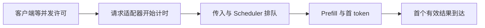
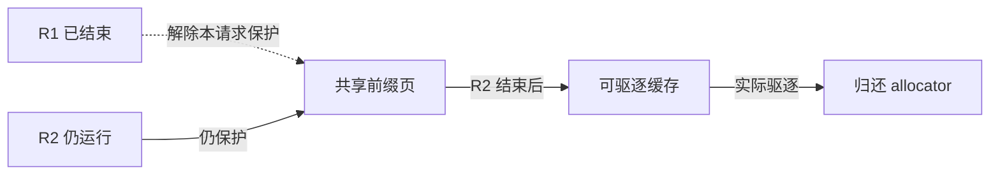
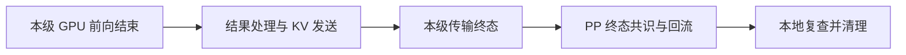

# SGLang 跨模块机制验证练习

先写下可被推翻的预测，再改变图中的一个条件，最后回到源码核对。三条练习分别连接请求、资源与跨角色依赖；它们不是同一条线上请求的 trace。

[Pages 练习入口](https://asher-xunzhang.github.io/ai-infra-wiki/sglang/pd-prefill-pp-loop/quick.html#cross-module-practice) · [源码课程目录](README.md) · [系统边界与学习地图](../runtime/SGLang%20系统边界与学习地图学习文档.md)

## 0. 基线与验证边界

本文是源码分析型学习资料，以已有教学模型和仓内资料组织验证练习。

| 项目 | 内容 |
| --- | --- |
| 公开仓库 | [sgl-project/sglang](https://github.com/sgl-project/sglang) |
| 分支 / commit | 公开上游 `main` 快照 / [279339f113b79af84f27fd3ac92d0a13bd3f4cbd](https://github.com/sgl-project/sglang/tree/279339f113b79af84f27fd3ac92d0a13bd3f4cbd) |
| 读取时间 | 2026-09-23 |
| 工作区 | 只读本地固定 Git 对象；检出分支与原有未跟踪文件均保持原状。 |
| 已做 | 静态源码核对、教学模型与页面验证。 |
| 未做 | SGLang 服务、GPU、精度、吞吐、网络传输或线上故障复现实验。 |
| 独立基线 | 原源码课程 `72d5c5bb`、PD 数据流状态机 `882577451e` 保持各自版本；本文不升级或合并它们。 |

先修：沿 [01 系统地图](https://asher-xunzhang.github.io/ai-infra-wiki/sglang/system-overview/) 分清职责、进程、副本与角色。每个练习再按问题打开相关模块，不把十二个模块机械排成必修链。

## 1. 请求变慢：先找到计时起点

**预测：** 客户端多等 120 ms 与 Scheduler 多等 120 ms，会使基准工具的 TTFT 同样增加吗？把预测写在操作之前。

图中 A 在所选适配器的 TTFT 区间之外；B 到 E 才是本练习对照的区间。增加某一段时间，先看它是否处于计时边界内，再讨论指标。

打开 [11 性能分析](https://asher-xunzhang.github.io/ai-infra-wiki/sglang/performance-engineering/) 的“请求秒表”：依次选择基准、客户端许可多等、Scheduler 多等，最后选择 Prefill 耗时减半。只改一项，比较时间轴和 TTFT。不要同时更改并发、输入长度和缓存状态。

**应观察到：** 教学基准 TTFT 为 220 ms；客户端多等许可仍为 220 ms，而 Scheduler 多等使它变为 340 ms。Prefill 减半只减少所选计算段；它无法消除排队和回程。数字是本图设定，不是源码常数或性能测量。

源码核对：[`limited_request_func`](https://github.com/sgl-project/sglang/blob/279339f113b79af84f27fd3ac92d0a13bd3f4cbd/python/sglang/benchmark/serving.py#L1389) 先取得 semaphore，再调用请求函数；所选 [`async_request_sglang_generate` 计时起点](https://github.com/sgl-project/sglang/blob/279339f113b79af84f27fd3ac92d0a13bd3f4cbd/python/sglang/benchmark/serving.py#L701) 位于适配器内部。其他工具和 API 的口径需要另行核对。

继续定位时，用 [02 请求运行时](https://asher-xunzhang.github.io/ai-infra-wiki/sglang/request-runtime/) 找最后完成的交接，用 [05 调度](https://asher-xunzhang.github.io/ai-infra-wiki/sglang/scheduling/) 判断准入，再用 [03 执行](https://asher-xunzhang.github.io/ai-infra-wiki/sglang/model-execution/) 检查执行层。若请求根本没有进入可用服务，转到 [10 服务治理](https://asher-xunzhang.github.io/ai-infra-wiki/sglang/serving-operations/)。

**运行验证要补什么：** 同一请求的许可获取、实际发送、调度、首包与结束时间，以及成功/失败样本口径。跨机器时间需要处理时钟差；仅有总 TTFT 不能唯一定位某一段。

## 2. 请求结束：谁仍持有共享 KV？

**预测：** R1 与 R2 共用前缀页。R1 结束后，分配器能否立即把该页分给 R3？

虚线表示 R1 的保护已经解除，R2 的实线仍在。R1 和 R2 都结束，只会使该缓存页满足可驱逐条件；分配器重新获得容量还需要实际驱逐。普通预分配设备 buffer 不随每次请求结束销毁。

打开 [04 KV 与内存](https://asher-xunzhang.github.io/ai-infra-wiki/sglang/kv-memory/) 的“共享回收”。依次观察 R1 结束、驱逐尝试、R2 结束和再次驱逐。记录共享页保护数 `2 → 1 → 0`，以及“可驱逐”和“已归还”的不同帧。不要把请求槽位、页分配和设备 buffer 总容量当成一个指标。

源码核对：[`dec_lock_ref`](https://github.com/sgl-project/sglang/blob/279339f113b79af84f27fd3ac92d0a13bd3f4cbd/python/sglang/srt/mem_cache/radix_cache.py#L683) 更新保护和可驱逐计数；[`evict`](https://github.com/sgl-project/sglang/blob/279339f113b79af84f27fd3ac92d0a13bd3f4cbd/python/sglang/srt/mem_cache/radix_cache.py#L638) 才对选定叶节点执行 `free_segment`。这里选普通 RadixCache 分页路径，未推广到所有 cache backend。

回到 [05 调度](https://asher-xunzhang.github.io/ai-infra-wiki/sglang/scheduling/) 看容量如何影响下一次准入；再打开 [09 模型与生成](https://asher-xunzhang.github.io/ai-infra-wiki/sglang/advanced-generation/) 的历史状态图，比较 recurrent checkpoint 与逐 token KV。解释为什么同一套“页数”直觉不能直接覆盖所有模型状态。

**运行验证要补什么：** 请求保护引用、protected/evictable 计数、驱逐事件与 allocator 可用容量。仅凭进程显存没有下降，不能判定泄漏；计数能解释引用关系，也不独自证明设备访问已经安全退役。

## 3. GPU 都算完了：清理为什么还在继续？

**预测：** 仅延长 PD KV 传输，是否同时推迟最后一段 GPU 前向和所有请求清理？

计算终点只是链条上的一个节点。传输和共识尚未结束时，请求仍可能被持有。终态包括 Success 和 Failed，共识不是“每级均成功”的别名。

在 [12 PP loop 案例](https://asher-xunzhang.github.io/ai-infra-wiki/sglang/pd-prefill-pp-loop/quick.html) 比较“原示例”与“PD KV 传输偏慢”。跟踪同一份 batch 的 GPU、KV 在途和释放轨道；再去 [依赖图](https://asher-xunzhang.github.io/ai-infra-wiki/sglang/pd-prefill-pp-loop/) 找使清理延后的那条依赖。

**应观察到：** 固定选批、资源充足的教学场景中，GPU 完成点保持 75.05 u，全部清理由 101.72 u 延到 162.00 u。真实服务若受到容量反压，后续选批与计算也可能变化，不能把本例“不变”外推成实现保证。u 不是实测毫秒。

源码核对：[`_pp_pd_get_prefill_transferred_ids`](https://github.com/sgl-project/sglang/blob/279339f113b79af84f27fd3ac92d0a13bd3f4cbd/python/sglang/srt/managers/scheduler_pp_mixin.py#L635) 沿 PP 求 Success/Failed 请求集合的交集；[`process_disagg_prefill_inflight_queue`](https://github.com/sgl-project/sglang/blob/279339f113b79af84f27fd3ac92d0a13bd3f4cbd/python/sglang/srt/disaggregation/prefill.py#L971) 本地复查并分别收尾。`pending_bootstrap`、非终态与失败都有独立分支。

再用 [06 并行拓扑](https://asher-xunzhang.github.io/ai-infra-wiki/sglang/parallelism/) 区分 PP 激活、TP collective 和跨角色 KV；在 [07 通信](https://asher-xunzhang.github.io/ai-infra-wiki/sglang/communication/) 的“就绪与回收”比较元数据晚到、room 不匹配与 HiCache 恢复。用 [08 两侧条件图](https://asher-xunzhang.github.io/ai-infra-wiki/sglang/inference-overview/deployment.html#handoff-boundaries) 解释：P 能清理，并不证明 D 已开始 Decode。

**运行验证要补什么：** 各级 sender poll、终态集合、release 回流、本地清理，以及 D 侧接收、metadata、回载和选批时刻。需要确定后端所报告完成的含义，不能用一个传输等待桶直接代替物理网络拷贝时间。

## 4. 留下一份可复核的记录

每次练习保留以下六项即可，不先扩展成大表：

1. **问题与预测：** 哪一个状态应变、哪一个应不变，什么结果会推翻判断。
2. **配置与基线：** 图的参数、源码 commit、启用路径和未覆盖分支。
3. **唯一改动：** 改动前后取值；其他条件是否保持。
4. **观察证据：** 图中的具体帧、连线或容量变化；若是运行实验，记录原始观测。
5. **源码解释：** 仓库相对路径、函数和固定链接，说明对应分支。
6. **结论边界：** 是源码事实、教学模型结果还是运行观察；下一步还缺什么。

页面验证只证明所选教学机制符合模型，不自动证明生产环境的性能、精度、兼容性或故障原因。

## 5. 仓内对应资料

- [指标口径与性能定位](../performance-engineering/SGLang%20指标口径与性能定位学习文档.md)：计时与样本边界。
- [KV 映射与回收](../kv-cache/SGLang%20KV%20映射与共享回收学习文档.md)：页、引用与 buffer。
- [PP loop 交互图](../disaggregation/PD%20Prefill%20PP%20loop%20交互图.md)：示意时间模型与配置约束。
- [通信与传输机制](../parallelism/SGLang%20通信与传输机制学习文档.md)：载荷、就绪与退役。

各资料保留自己的范围；历史源码课程可用于追踪实现结构，引用其结论时仍需核对版本。
