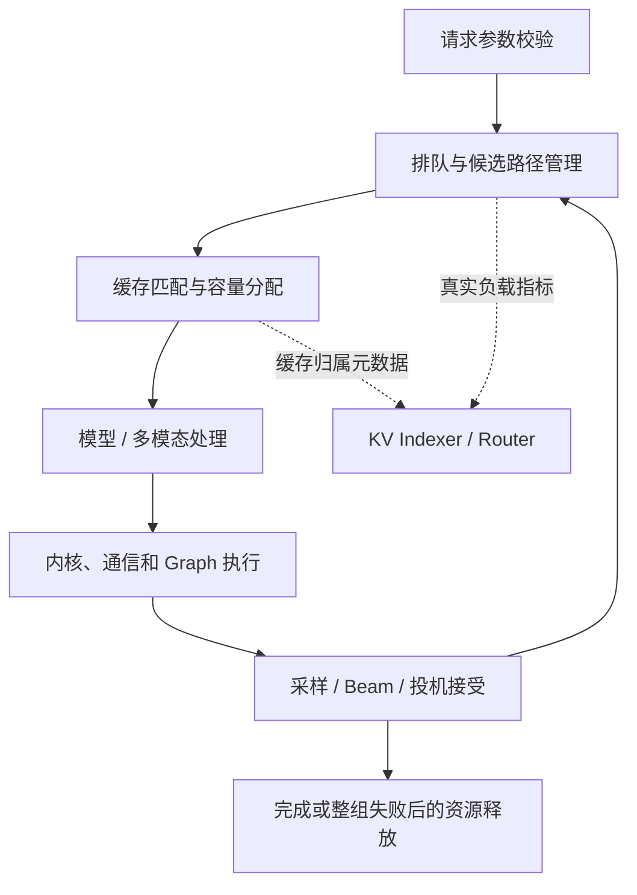
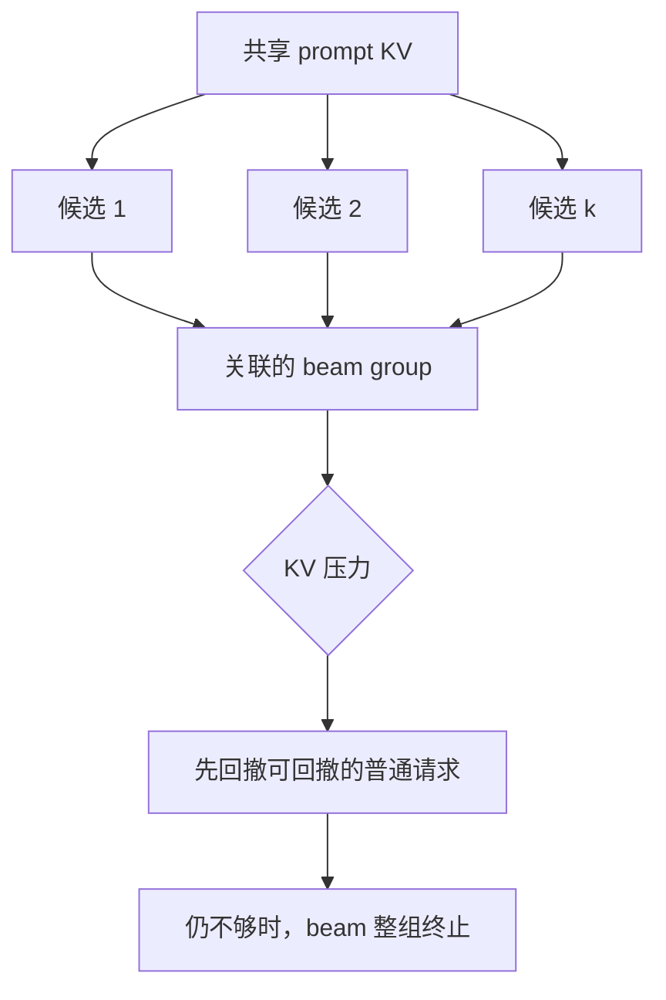

# SGLang v0.5.19 功能组合与升级边界学习文档

理解一个推理版本，不能只记新增开关。更有用的问题是：请求多了哪些状态，默认行为改变了什么，哪些优化可以组合，性能数字到底测了哪一段。

本文是第三方资料整理型学习文档。以发布解读为主，核对官方 Release 和关键 PR 的描述，不是源码审计、升级执行记录或 benchmark 复现。

## 0. 阅读基线与范围

| 项目 | 内容 |
| --- | --- |
| 原文标题 | SGLang v0.5.19 发布：Beam Search 落地，统一缓存与多模态推理持续优化 |
| 原文链接 | [发布解读](https://mp.weixin.qq.com/s/ecpKuo1Q_H9avsUBDjur_Q) |
| 作者 / 机构 | 未署个人作者；发布账号为“模型基建局” |
| 原文发布时间 | 2026-09-06 |
| 读取时间 | 2026-09-09 |
| 版本基线 | [v0.5.19 Release](https://github.com/sgl-project/sglang/releases/tag/v0.5.19)，API 标注发布于 2026-09-05 02:27:42 UTC，即北京时间 10:27:42；786 个 PR、214 位贡献者 |
| 整理范围 | Beam Search、统一缓存、投机解码、通信与量化、多模态、服务配置变化 |
| 核对深度 | 已读 Release；进一步读取 PR #31626、#35081、#33722 描述。其余 PR 作为原文对应的追踪入口，未逐项审计代码或复现实验 |
| 图片情况 | 正文无技术位图；两个 45×13 SVG 为小型装饰图形。本篇用 Mermaid 解释机制 |

### 术语速查

| 术语 | 人话解释 |
| --- | --- |
| beam width | 生成过程中维持多少条候选路径 |
| `n` | 最后返回多少条结果；Beam Search 下需不超过宽度 |
| retraction | 内存压力下暂时回撤请求，之后重新调度 |
| Unified Radix Tree | 用统一树实现管理缓存逻辑 |
| Unified Memory | 不同状态对象分享物理容量的可选模式 |
| W4A8 / W4A16 | 权重 4-bit，激活分别为 8-bit / 16-bit |
| CUDA Graph | 把满足捕获条件的执行序列整体回放 |
| KV Indexer | 记录缓存归属信息，帮助路由决策；不保存 KV 正文 |

## 1. 把版本变化放回请求链路



**图意解读：** 这是整理者绘制的能力地图，不是类调用关系。一个新解码策略会改变候选数和内存生命周期；新的通信后端会改变 Graph 可捕获性；服务指标决定外部能否看见实际负载。

## 2. Beam Search：一条请求变成一组关联路径

### 人话版

普通采样通常每步选一个后续 token；Beam Search 维持多条候选，再依据序列评分保留其中一组。因此它并不等于独立生成 `n` 次，也不保证评分最高的答案在业务上最正确。

原文给出的请求参数可写成以下 JSON 片段，仅用于理解接口，本次未提交请求：

```json
{
  "sampling_params": {
    "beam_width": 8,
    "n": 3,
    "max_new_tokens": 64
  }
}
```

宽度为 8，最后返回 3 条结果。原文与 [PR #31626](https://github.com/sgl-project/sglang/pull/31626) 说明：这是请求级功能，不需专用服务端开关，可以与普通请求使用相同 batch 和内存池。

### 为什么内存压力不能按普通请求处理



**图意解读：** 候选行共享 leader 的 prompt KV，不能把其中一行当完全独立请求随意回撤。PR 描述的压力路径会整组终止并返回 HTTP 500，而不是自动重新排队。这里解释的是 v0.5.19 引入方案的已知边界，不能当成永久设计不变量。

### 当前组合限制

PR 描述明确列出不支持投机解码、PD、DP Attention、PP、HiCache、SWA/Mamba 混合缓存、HiSparse、LoRA、sessions、约束解码，以及多种额外返回和停止条件；`page_size > 1` 也被拒绝。

对业务最直接的影响是：**如果实际服务依赖混合注意力缓存或合法输出约束，不能只看到“支持 Beam Search”就认为它可直接替代原解码方式。** Beam width 还会放大候选容量，即使 `n=1` 也不代表只需一条路径的内存。

## 3. 统一缓存成为默认，但共享容量仍是另一件事

### 人话版

前缀树像地址簿，内存池像仓库货架。统一地址簿的实现，与让不同货物共享剩余货架，是两层变化。

| 变化 | 影响 | 追踪入口 |
| --- | --- | --- |
| Unified Radix Tree 扩展到纯 Full Attention 并成为默认 | 相同启动参数升级后，也会走不同缓存实现 | [#35081](https://github.com/sgl-project/sglang/pull/35081) |
| `SGLANG_ENABLE_UNIFIED_RADIX_TREE` 弃用 | 不能继续把该旧变量当作唯一生效条件 | 同上，已核对 PR 描述 |
| L3 后端可运行时挂载/卸载 | 控制操作仍有空闲等状态要求 | [#35269](https://github.com/sgl-project/sglang/pull/35269) |
| PP 与 HiCache L3 完成事件/命中长度对齐 | 一个 stage 完成不足以证明所有 stage 都可推进 | [#27010](https://github.com/sgl-project/sglang/pull/27010) |
| 共享池避免过度淘汰 | 分配需求已经满足后保留更多可复用前缀 | [#33091](https://github.com/sgl-project/sglang/pull/33091) |

原文中 RTX 5090、Qwen3.5-4B 的受控压力测试，前缀保留率 35.7%→67.9%，28 次重放总耗时下降 37.9%，对应 `--enable-unified-memory` 路径。这不能证明所有默认统一树配置都有同样收益。

排障例子：升级后显存总量相近但多轮 TTFT 变化，先对比树实现、淘汰量、有效命中边界和运行请求分布；不能立刻归因于“新版本的算子变慢”。

## 4. 投机解码：草稿质量与状态提交分别优化

### DFlash2：运行时升级不会改变旧草稿权重

原文把 DFlash2 的变化概括为局部卷积与候选选择器，需匹配的草稿 checkpoint。Qwen3.8-27B、单 H200、GSM8K 中，相对普通自回归，输出吞吐在并发 1 为 3.43 倍，在并发 32 为 1.45 倍。它们是不同负载点，不能只保留较大的数字。[对应 PR #35371](https://github.com/sgl-project/sglang/pull/35371)

### KDA fused-accept：改变下一轮从哪里读状态

常规路径可能先把“上一轮接受位置的状态”复制回正式池，再由下一轮读出。fused-accept 让下一轮直接读取已接受状态所在位置，减少复制和启动开销。

[PR #33722](https://github.com/sgl-project/sglang/pull/33722) 的重要限制是：

- 默认关闭，以 `SGLANG_OPT_KDA_FUSED_ACCEPT_STATE=1` 启用。
- 要求 FlashInfer KDA 后端和 `--disable-radix-cache`；两轮之间正式 SSM 池可能不是最新状态，不能让缓存路径误读。
- 与 `--enable-linear-replayssm-spec` 互斥，因为二者都管理验证轮次间的状态提交。
- PR 明确把 Kimi K3 DSpark 路径的扩展列为后续工作，不能把 Kimi-Linear 的测试直接写成 K3 已获得相同收益。

原文的 44.5%–62.5% 对应 B200、Kimi-Linear-48B 形状下的 verify + commit 子流程，不是整请求延迟。本次读取 PR 描述确认了这个口径；没有重新执行它的精度和性能测试。

## 5. 通信、量化和 Graph：先看可组合条件

| 更新 | 机制上的收益 | 范围或代价 |
| --- | --- | --- |
| DeepEP v2 ElasticBuffer | 固定容量缓冲有利于跨节点 Decode Graph 捕获 | 原文限定 DeepSeek-V3/V4、Qwen3-MoE 对应动态分块 FP8 和 `deep_gemm` 路径；不能自动覆盖 BF16 专家或任意新模型 |
| Hopper MXFP4 W4A8 | 权重压缩之外，再用 FP8 激活改善 MoE 执行 | SM90 和相应 FlashInfer 接口；MoE kernel 1.63–2.08 倍，对应整模型吞吐约 +11.7% |
| NVFP4 W4A16 CuTe DSL | 保留低位权重，同时用 BF16 激活和输出 | 显式后端和硬件条件，不能与 W4A8 互换术语 |
| PP Prefill CUDA Graph | 减少较小 forward 的启动与控制空档 | GB300、Qwen3.5-397B 的 2.48 倍峰值结果，2K 是单 forward 聚合预算，原请求输入为 8K |
| LayerNorm SP | 每个 TP rank 只处理自己的 token 分片 | Dense Qwen3 对应 Prefill；原文列出 DP Attention、投机解码组合限制 |
| `trtllm_mla` DCP | 分摊历史 KV 读取，以集合通信合并注意力结果 | 长上下文更容易获益，短上下文或低并发可能不划算 |

以上以原文说明为主。对应入口：[DeepEP v2](https://github.com/sgl-project/sglang/pull/35634)、[W4A8](https://github.com/sgl-project/sglang/pull/34967)、[NVFP4](https://github.com/sgl-project/sglang/pull/35120)、[PP Graph](https://github.com/sgl-project/sglang/pull/36248)、[LayerNorm SP](https://github.com/sgl-project/sglang/pull/30915)、[DCP](https://github.com/sgl-project/sglang/pull/33926)。本次没有逐 PR 验证实现。

量化还有正确性链路：加载 checkpoint 时若忽略 `k_scale/v_scale`，或者 PD 只传 KV、不传对应 scale，即使主数据搬到了，接收侧也不一定能正确解释。原文分别对应 [#35455](https://github.com/sgl-project/sglang/pull/35455)、[#35718](https://github.com/sgl-project/sglang/pull/35718)。

## 6. 多模态：速度、容量与正确性要分开看

### PaddleOCR-VL 的例子

原文在单 H200、PaddleOCR-VL-0.9B、1080p 页面、128 输出 token、关闭前缀和多模态缓存的设置中，报告：

| 指标 | 优化前 | 优化后 |
| --- | ---: | ---: |
| 单请求中位 TTFT | 235.1 ms | 119.6 ms |
| 并发 32 吞吐 | 6.67 req/s | 12.26 req/s |

这里包括预处理并发、视觉编码与 projector 打包、重复工作和同步等变化。不能把所有收益归给 CUDA Graph；含 embeddings 的 batch 仍可能使用 eager。[对应 #35318](https://github.com/sgl-project/sglang/pull/35318)

### Qwen3-VL 的两个不同问题

原文的 DeepStack 修复关乎 FP8 视觉定位的计算顺序与输出正确性；embedding 写入从展开 mask 转为行索引，则主要降低临时显存峰值，未宣称 kernel 更快。业务应分别观察坐标质量、峰值分配和耗时。[#34690](https://github.com/sgl-project/sglang/pull/34690)、[#37070](https://github.com/sgl-project/sglang/pull/37070)

## 7. 服务控制面与平台支持

KV Indexer 保存“worker 有哪些块”的元数据，让 Router 更容易找缓存；KV 正文仍在 worker。原文说明这一版本是实验性单进程内存状态，不具备完整持久化和事件恢复能力。[#33370](https://github.com/sgl-project/sglang/pull/33370)

Scheduler 可经独立 ZMQ socket 发布运行数、排队数和 KV 占用，原文入口为 `--load-publish-endpoint`，依赖 `--kv-events-config`。发布负载提供了可见性，路由器仍需制定策略。[#34608](https://github.com/sgl-project/sglang/pull/34608)

AMD Lean Attention 把长短不均的 KV 工作重新分给计算单元；原文 MI355X 测试的最高吞吐 1.52 倍、ITL 最低为原来的约 1/3.62，属于特定工作集。GLM-5.2 PD + MTP 在 8×MI355X、并发 4 的 TPOT 23.16→7.94 ms，也不能移作其他模型的性能承诺。[#33576](https://github.com/sgl-project/sglang/pull/33576)、[#36714](https://github.com/sgl-project/sglang/pull/36714)

新增模型覆盖 Qwen3.8 系列、dots3.note、Ling-3.0 flash/tiny、Spark2.5、MiniCPM-SALA、Granite 4.2，以及 LongCat-Image-Edit/Edit-Turbo。新增模型名称只是入口，硬件、精度、解码和 Graph 的组合仍要单独查阅。

## 8. 把升级变成可解释的对比

| 配置变化 | 需要检查的行为 |
| --- | --- |
| `ServerArgs` 构造不自动解析 | 自行构造并读取结果的程序需按新契约调用 `resolve_once()` |
| 统一树默认启用、旧变量弃用 | 冷/热缓存、淘汰、状态恢复和高压容量 |
| Spark3 更名 Spark2.5 | 工具调用 parser `spark`→`spark25` |
| stop string 与 stop regex 各最多 32 项、每项最多 256 字节 | 超限请求返回 HTTP 400；字节数不等于字符数 |
| W4A4 MegaMoE 参数迁移 | 对照 `--enable-w4a4-megamoe`，清理对旧变量行为的依赖 |

官方 Release 已核对这些升级事项。原文还列出 FlashInfer 0.6.18、sgl-deep-ep 0.1.2、sgl-deep-gemm 0.1.7、mooncake 0.3.13、tilelang 0.1.12、compressed-tensors 0.18.0；这不是所有后端通用的最小安装清单。

**整理者建议的学习实验顺序（本次未运行）：** 固定模型与负载，先比较输出和失败行为，再比较 TTFT、TPOT、尾延迟、吞吐、峰值显存和 cache replay 长度；最后一次只改变一个优化组合。这样才能解释收益来自哪个环节。

## 9. 继续阅读

- [v0.5.18 推理系统协同演进](<./SGLang v0.5.18 推理系统协同演进学习文档.md>)：版本演进的前一站。
- [Unified Radix Cache](<../kv-cache/SGLang Unified Radix Cache 学习文档.md>)：逻辑缓存结构。
- [Kimi K3 推理协同优化](<../model-support/SGLang Kimi K3 推理协同优化学习文档.md>)：理解可变状态与投机提交。
- [官方 v0.5.19 Release](https://github.com/sgl-project/sglang/releases/tag/v0.5.19)：完整清单与版本边界。
