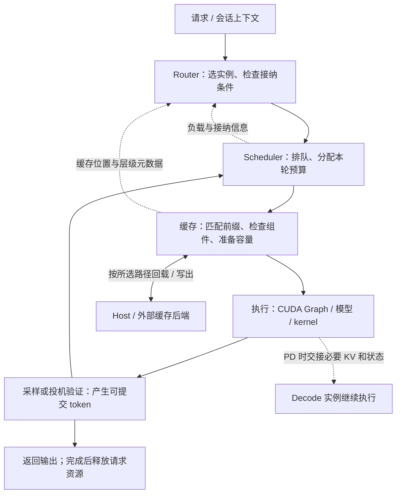
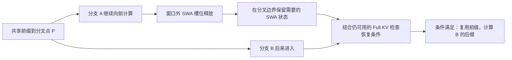
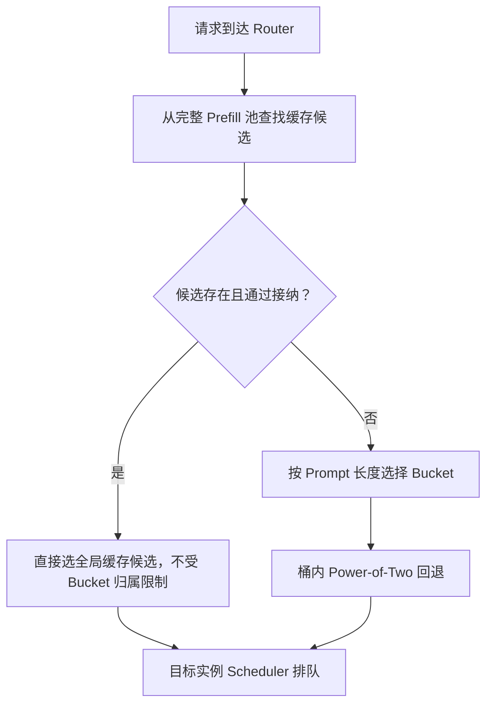
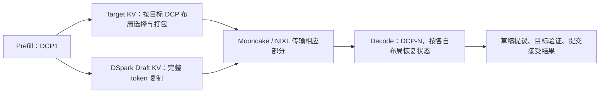
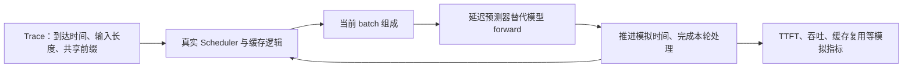
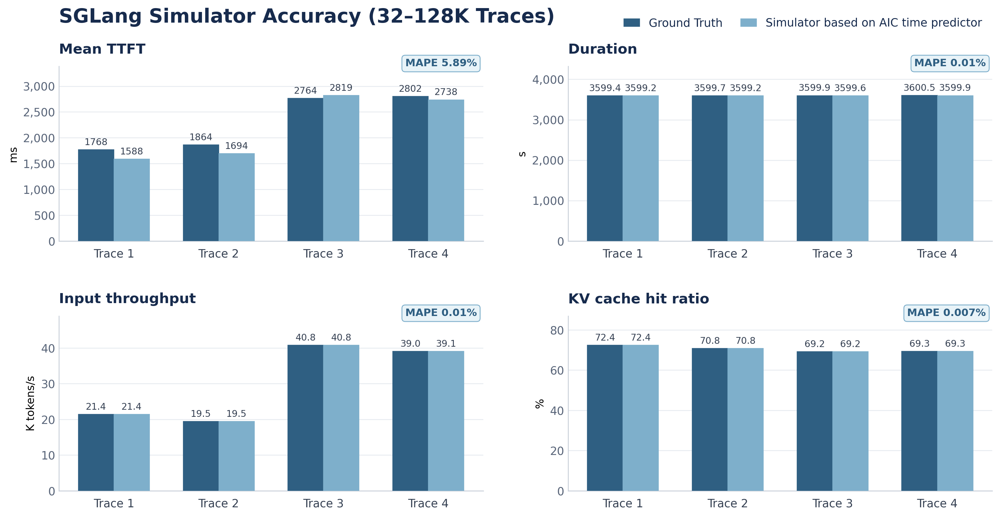

# SGLang v0.5.20 缓存调度与 Serving 协同学习文档

一条请求能否更快完成，不只取决于模型算得多快，还取决于它被送到哪里、排队多久、已有状态能否复用，以及计算和传输之间有没有空等。本文把两篇 v0.5.20 发布解读串成这条请求主线。

本文属于**第三方资料整理型学习文档**：已读取两篇原文、官方 Release 和关键 PR 描述；没有逐文件审计版本源码，没有运行模型、模拟器或性能实验。“走向完整 Serving 系统”是原文作者对演进方向的判断，不是所有能力已可任意组合的保证。

## 0. 阅读基线与范围

### 两篇原始资料

| 项目 | 资料 A | 资料 B |
| --- | --- | --- |
| 完整标题 | SGLang v0.5.20：共享前缀命中率从 43.8% 提到 60.8%，推理框架开始抠细节了 | SGLang v0.5.20 发布：从推理引擎走向完整的 LLM Serving 系统 |
| 原文链接 | [资料 A](https://mp.weixin.qq.com/s/BsAO489ZKggPasg-Ps4mog?scene=1&click_id=1) | [资料 B](https://mp.weixin.qq.com/s/Y8FTNLoLZrRVxHPqtHhqbA) |
| 作者 / 发布账号 | 未署个人作者；账号“养虾农户” | 作者“一只努力的微服务”；账号“Database 笔记本” |
| 发布时间 | 2026-09-19 07:33:57，Asia/Shanghai | 2026-09-20 07:04:37，Asia/Shanghai |
| 资料类型 | 发布解读，侧重缓存、采样、模拟器、加载与存储默认值 | 发布解读，侧重跨模块机制、Serving 架构与兼容性 |
| 读取时间 | 2026-09-20 | 2026-09-20 |
| 图片情况 | 正文无技术图片、内嵌 SVG 或 CSS 背景图片 | 正文无技术图片、内嵌 SVG 或 CSS 背景图片 |

发布时间由网页 `ct` 转换为北京时间，账号由正文外的发布信息核对。已读取两篇 `js_content` 完整正文及末尾章节；封面和页面装饰不作为技术图。本文的 Mermaid 均为整理者归纳；第 8 节另保留官方 Simulator PR 的验证原图。

### 官方核对基线

| 项目 | 内容 |
| --- | --- |
| 官方发布 | [sgl-project/sglang v0.5.20 Release](https://github.com/sgl-project/sglang/releases/tag/v0.5.20)，记载 713 个 PR、237 位贡献者 |
| Release 发布时间 | 2026-09-18 22:41:33 UTC，即北京时间 2026-09-19 06:41:33 |
| 版本固定点 | `v0.5.20` 标签解引用到 commit [`94602c9c2b7cbdb8efd5c52802dac6a1c180089e`](https://github.com/sgl-project/sglang/tree/94602c9c2b7cbdb8efd5c52802dac6a1c180089e)；不以滚动 `main` 代替版本基线 |
| 深读的 PR 描述 | [#34565](https://github.com/sgl-project/sglang/pull/34565)、[#37381](https://github.com/sgl-project/sglang/pull/37381)、[#37709](https://github.com/sgl-project/sglang/pull/37709)、[#32911](https://github.com/sgl-project/sglang/pull/32911)、[#36631](https://github.com/sgl-project/sglang/pull/36631)、[#38117](https://github.com/sgl-project/sglang/pull/38117)、[#38814](https://github.com/sgl-project/sglang/pull/38814)、[#33824](https://github.com/sgl-project/sglang/pull/33824)、[#37720](https://github.com/sgl-project/sglang/pull/37720)、[#39122](https://github.com/sgl-project/sglang/pull/39122)、[#36228](https://github.com/sgl-project/sglang/pull/36228) |
| 整理范围 | 缓存状态完整性、请求调度、路由、Graph、投机与 PD、采样、模拟器、硬件优化和升级契约 |
| 不展开 | 713 个 PR 的逐项清单、Diffusion 全部变化、新模型逐个部署、kernel 实现及生产升级执行 |
| 验证边界 | PR 描述和 Release 是来源方的陈述；其中测试可能使用早于 v0.5.20 的基线。本文复核其条件与口径，不把来源方实验写成本仓复现结果 |

先修建议：[推理全景](<../runtime/SGLang 推理全景学习指南.md>) → [前缀缓存与分层存储](<../kv-cache/README.md>)。只想看升级影响，可直接读第 10 节；只想理解标题数字，读第 2 节。

### 术语速查

| 术语 | 人话解释 | 本文容易混淆的边界 |
| --- | --- | --- |
| TTFT / TPOT | 等到首个 token 的时间 / 后续每个输出 token 的平均耗时 | 平均值、P50、P99 不是同一个指标 |
| SLO | 服务想满足的延迟、成功率等目标 | 有调度策略不代表已经保证 SLO |
| SWA | Sliding Window Attention，只关注局部窗口的注意力 | 前缀文字相同，不代表所需窗口状态还在 |
| Unified Radix Tree | 统一组织前缀和不同模型状态的树 | 逻辑索引不等于 GPU 内存池或集群调度器 |
| HiCache / Linker | 分层缓存路径 / 可选外部缓存接入路径 | 能访问远端内存，不等于远端接管缓存生命周期 |
| PD / DCP | Prefill、Decode 分离 / Decode 上下文并行 | 角色分离和 KV 布局切分是不同维度 |
| Draft / Target | 提议候选 token 的草稿模型 / 验证候选的目标模型 | 两者的 KV 布局不一定相同 |
| HRRN | 等待越久、预计剩余工作越少，排序分数越高 | 估算代价不是实际执行时间的精确预言 |
| Cache Affinity / Bucket | 优先靠近已有缓存 / 按提示长度等条件划分候选 worker | 桶内均衡不能随意丢掉全局缓存候选 |
| Sampling Mask | 这一步实际允许采样的 token 集合 | 不等于 attention mask，也不只是一个 `top_k` 数字 |

## 1. 把变化放回一条请求

### 人话版

可以把系统想成一组协作的工位：Router 选工位，Scheduler 安排轮次，缓存管理器找已有状态，执行层完成计算，采样器选下一个 token。PD 部署还要在工位之间交接状态。



**图意解读：** 实线表示教学模型中的请求处理或数据准备，虚线表示跨组件信息与可选 PD 路径，不是源码调用图。Router 不执行 attention；存储和传输后端不自动拥有请求的调度权；请求完成后，也可能留下可复用的缓存。

**小例子：** 两个助手共享同一段系统提示，但分别回答不同问题。Router 先判断哪里有这段前缀，再考虑该实例能否接纳；Scheduler 决定何时计算；缓存层必须确认该模型恢复所需的状态完整；执行层才有机会减少重复工作。任何一步不满足，都不能只凭“命中过前缀”推断首 token 一定更快。

## 2. SWA 分叉点缓存：命中前缀还要命中可恢复状态

### 为什么有 Full KV 仍会重算

资料 A 用“把分叉点状态存下来”概括优化。官方 [PR #34565](https://github.com/sgl-project/sglang/pull/34565) 补充了原因：Chunked Prefill 向前推进时会释放滑动窗口之外的 SWA 槽位。后来请求若从较早的共享前缀分叉，Full KV 可能还在，相应的 SWA 状态却已经被释放。

因此，这一变化是**对统一树的 SWA 组件补充分叉点缓存**，不能把统一树整体说成到 v0.5.20 才出现。前一版本的演进见 [v0.5.19 学习文档](<SGLang v0.5.19 功能组合与升级边界学习文档.md>)。



**图意解读：** 保留的是能支撑分叉恢复的窗口状态，不是永久保存全部历史 SWA。缓存占用、淘汰和组件一致性仍然存在。教学图省略页面对齐和具体插入边界；PR 还涉及 Device/Host Full KV 和 EAGLE 插入测试。

### 标题中的数字实际测了什么

PR 的合成共享前缀实验采用 `DeepSeek-V4-Flash-0731`、TP2、DSpark、64 个请求（8 组，每组 8 个），系统提示 24,576 token、问题 8,192 token、输出 128 token，请求速率 2、最大并发 8；开启窗口外槽位释放。以下是该组 Before/After，而非任意 v0.5.19→v0.5.20 的整版本对比：

| 指标 | Baseline | PR 方案 | 解释 |
| --- | ---: | ---: | --- |
| Token Hit Rate | 43.81% | 60.75% | 增加 16.94 个百分点；Release 四舍五入为 43.8%→60.8% |
| Mean TTFT | 1,569.93 ms | 1,069.58 ms | 下降约 31.9%，不是所有延迟都下降三分之一 |
| P95 TTFT | 3,427.47 ms | 2,372.52 ms | 这是 P95，不能换称 P99 |
| 输入吞吐 | 66,310.37 token/s | 70,509.72 token/s | 约 +6.3%，与命中率增幅不是同一件事 |

**对照更能说明适用范围：** 同一 PR 的 AgentX 场景中，窗口外释放开启时，整体命中率为 94.90%→94.96%，Mean TTFT 为 628.74→625.07 ms，整体收益很小；新分叉子请求子集的命中率才更明显改善（50.26%→54.13%）。已有会话续写通常已有可用窗口状态，所以它与大量新分叉的合成负载表现不同。

**排障提示：** 发现逻辑前缀很长而实际复用较短时，分别查 Full KV、SWA 状态、分叉边界和淘汰，不要只看树上匹配了多少 token。这里是由 PR 机制归纳的排查方向，本次未执行排障实验。

## 3. HiCache 与外部 Linker：数据放远处，谁仍然负责管理

### 人话版

地址簿、仓库和搬运工具分别解决“在哪里”“放多少”“怎么搬”。接上 Mooncake 不意味着这三种职责都交给 Mooncake。

资料 B 将 HiCache、Unified Tree、Mooncake 和 NIXL 放在一起讨论。核对 [PR #37381](https://github.com/sgl-project/sglang/pull/37381) 后，需要明确：外部 Linker 是 **opt-in 的替代接入路径**，原有 hierarchical cache 路径保持不变；树仍拥有分配、插入、组件一致性和节点生命周期的控制权。

| 层次 | 本文关心的职责 | 不应混为一谈的事 |
| --- | --- | --- |
| Unified Radix Cache | 组织前缀及 Full KV、SWA、模型 sidecar 等状态 | 有共同索引不代表所有组件都已可恢复 |
| HiCache 分层路径 | 协调 GPU、Host、外部存储之间的缓存使用 | 扩大容量仍需承担回载时间和策略成本 |
| External Linker | 通过 Mooncake、UMBP 等后端访问共享 Global Memory pool | 不是把树的节点生命周期转移给存储后端 |
| Router 的缓存视图 | 根据缓存归属和层级信号选择实例 | 元数据视图不等于持有 KV 正文 |

**小例子：** 一个前缀在远端存储中存在，只回答了“可能找得到”。还要确认恢复组件齐全、目标容量足够、回载完成且代价合适，才能用于当前请求。因此“存在远端命中”和“本轮可立即执行”应分开记录。

“整个集群的 KV 索引”是资料 B 的趋势归纳。本文据官方说明确认的是可选后端接入及所有权边界，不据此推导出全局一致性、持久化或跨实例自动调度保证。

## 4. Scheduler 与 Router：先分清两种排序

### HRRN 解决实例内部谁先计算

人话版：短工作更容易快速完成，但长请求等得越久，也应逐渐获得更高优先级。[PR #32911](https://github.com/sgl-project/sglang/pull/32911) 使用 token 计数形式：

```text
score = 1 + waited_prefill_tokens / uncached_input_tokens
```

这表示 PR 描述的排序思想；分母边界处理应以实现为准。PR 将等待量定义为请求进入等待队列后累计处理的 Prefill token 数，以避免各 rank 的本地时钟差异；同分使用 `rid` 决定顺序。启用入口是 `--schedule-policy hrrn`。

设计口径还需与计数实现分开。仓内 [排序策略与准入预算](<../source-study/03-scheduling/03-排序策略与准入预算.md#52-计数来源要比注释多追一步>) 在其独立固定基线中指出：计数于 `run_batch` 入口按 `extend_num_tokens` 增加，不是 GPU 完成通知，也不能仅凭字段注释认定每次增量都是已完成的 Prefill 计算。本篇未对 v0.5.20 重做这段源码审计，因此公式用于解释 PR 设计，不作为实际计数等同于完成量的证明。

**教学例子：** A 等待期间处理了 8,000 token，自身尚需计算 4,000 token，分数为 3；B 等待量 2,000，自身尚需 500，分数为 5。这轮 B 更靠前。后续 A 的等待量增加，也会抬高其优先级。例子只解释排序，不代表真实耗时或 batch 接纳结果。

PR 报告 Mean TTFT 24.2→7.48 s（约 -69%）、P99 60.5→55.48 s（约 -8%）。条件是 GLM-5.2 NVFP4、并发 100、2×8×B200 的 1P1D，Prefill 使用 CP8、HiCache、65,536 chunk，生产 agent 混合流量最长输入达 1M；测试基线写的是 `v0.5.15.post1`。它证明的是该测试中策略的效果，不能写成所有 v0.5.20 部署自动降延迟。

未缓存 token 数只是工作量估计。PR 自己说明：稀疏注意力较适合该估计；密集注意力每 token 的代价还可能随上下文增长。本文不采用 PR 中“理论最优”等宽泛表述，也不把等待加权视为无条件 SLO 保证。

### Router 解决请求去哪个实例

资料 B 引用的 Bucket + Cache Affinity 改动，具体是 [PR #38814](https://github.com/sgl-project/sglang/pull/38814) 的语义修复：**先从完整 Prefill worker 池中选全局缓存候选；候选通过 admission 后直接采用；不存在候选或被拒绝时，才进入长度桶内的 Power-of-Two 回退。**



**图意解读：** 缓存偏好和接纳控制共同决定是否能走直接分支。选出 worker 之后，实例内仍有自己的调度和容量约束。不能把这一改动理解成“无论多忙都去缓存最多的机器”。

### 18.5% 必须连同反例一起读

PR 明确标注以下是 `simulator_predicted_relative`，**不是实卡或 PD KV 传输性能**。实验为 256 worker、两个各 128 worker 的桶、4,096-token 分界、每组 3 次有效重复，共 27,558 个测量请求；表格为重复实验中位数。

| 负载 / 指标 | Bucket PO2 | Bucket CA | 能得出的结论 |
| --- | ---: | ---: | --- |
| TraceLab / TTFT P50 | 31.121 ms | 25.364 ms | 预测值下降约 18.5% |
| SWE-bench / TTFT P50 | 167.932 ms | 3,762.825 ms | CA 在此配置显著变差，PR 指出负载集中 |
| SWE-bench / Cache Hit Rate | 41.29% | 66.14% | 更高命中率没有带来更低延迟 |

整理者归纳：该 PR 首先恢复了全局缓存候选的正确路由语义，性能取决于负载。资料 B 没有展开模拟器性质与 SWE-bench 反例，阅读时应补上这两个条件。

## 5. CUDA Graph 与采样：减少计算之间的空档

### Graph 池不是任意动态形状的通行证

人话版：CUDA Graph 像把符合条件的一段 GPU 执行流程预先录好，再整体回放。在线请求大小变化时，需要选择适用的图、容量和执行变体，也可能回到其他执行路径。

Release 的对应变化包括按 warmup 测量池容量（[#36911](https://github.com/sgl-project/sglang/pull/36911)）、复用 Prefill 输出存储（[#38038](https://github.com/sgl-project/sglang/pull/38038)）、分开管理 ragged graph 的请求数和 token 容量（[#37300](https://github.com/sgl-project/sglang/pull/37300)）、泛化 attention graph variant（[#38993](https://github.com/sgl-project/sglang/pull/38993)）。本次仅核对这些 Release 条目，未逐项审计代码。

资料 B 将其归纳为动态 Serving 执行层的发展。更准确的职责表达是：Scheduler 决定本轮工作，运行时的执行与 Graph 管理路径处理能否捕获、选择和回放；不能仅凭文章把所有图选择职责归给 Scheduler。图池也占容量，Graph 捕获成功不证明任意 batch、后端或并行组合都兼容。

### Sampling Mask 与 overlap

Mask 返回采样器这一步实际使用的 token 支持集及选中 token 在该采样分布下的 log-probability，帮助 RL rollout 的训练侧理解行为分布。它本身不是完整训练提速方案，也不自动保证整个训练过程可复现。

[PR #36631](https://github.com/sgl-project/sglang/pull/36631) 把 mask 输出先留在 GPU，再异步复制到 CPU，于结果处理阶段组织响应，减少采样时 CPU/GPU 同步对 overlap 的阻塞。容量由 `--sampling-mask-max-tokens` 控制，默认 4096；实际支持集可能因阈值并列而大于 `top_k`，不能只用 `top_k` 判定一定不会溢出。

| 来源方测量条件 | Batch 1 | Batch 64 |
| --- | ---: | ---: |
| Qwen3-8B BF16、单 H200、TP1、FlashInfer、CUDA Graph；128 输入 / 512 输出；返回 mask | 155.47→182.37 token/s | 3,179.15→4,826.58 token/s |
| 相对变化 | +17.30% | +51.82% |

这是旧非 overlap 实现与新 overlap 实现的组合对比，测量稳定 Decode 满 batch 区间，排除 Prefill、warmup 和最终 HTTP 响应序列化。实验将容量设为 8192，实际 mask 为 4096–4396 个 token。因此不能称为“打开默认开关，全请求或 RL 训练就快 52%”。

### Gumbel-Max 是另一条优化

[PR #38117](https://github.com/sgl-project/sglang/pull/38117) 在主 sampler 的相应 PyTorch 路径用随机指数变量变换后取最大值，减少 `torch.multinomial` 路径的 CPU 调度成本。它与 mask overlap 是不同改动，性能数字不能叠加。

来源方在 RTX 5090、Qwen3.5-2B 上报告 Batch 1 输出吞吐约 +75%、Batch 32 约 +23%；这针对采样调度成为瓶颈的模型。分布等价不等于随机序列逐 token 相同，PR 对确定性 seed 路径保持不变。较大模型若瓶颈在其他计算环节，不能据此推算同样收益。

## 6. 投机解码与 PD、DCP：交接的状态不止一份

### 人话版

草稿模型先提议，目标模型再验收。P/D 分离以后，Decode 不仅需要目标模型的历史状态，还可能需要草稿模型的历史状态；而它们跨 DCP rank 的分布方式不同。

[PR #37709](https://github.com/sgl-project/sglang/pull/37709) 补充的是 **DCP1 Prefill → DCP-N Decode 的 DSpark draft KV 传输**。该 PR 中 target 按 DCP 分片并打包，draft 保留完整 token 副本、不走同样的 target 打包路径。



**图意解读：** 草稿和目标共用一次逻辑交接，但索引宽度、分片和传输内容不能混用。图不表示每个后端只发送一个包，也不表示拷贝结束就能跳过接收完成与资源就绪条件。

官方测试说明为 Kimi-Linear-48B-A3B-Instruct、8×B300、TP4、DCP1→DCP4，覆盖 NIXL 和 Mooncake，输入至 256K。需要保留两条限制：

- PR 明确不覆盖 Prefill DCP>1，也不覆盖异构 P/D TP 与 DSpark 的组合。
- 速度测试使用 dummy DSpark 和 `SGLANG_SIMULATE_ACC_LEN=4`，Mooncake 表标注 TCP；它不能证明真实草稿接受率、RDMA 性能或所有混合模型的投机收益。

## 7. 硬件优化：区分算子、推理与模型加载

| 改动 | 原文 / Release 报告的结果与条件 | 应保留的边界 |
| --- | --- | --- |
| DeepSeek-V4 TRT-LLM Attention | B200、SM100/103 的 CSA/HCA，Prefill 约为 FlashMLA 的 1.2 倍，Decode 约 1.45 倍；[#30805](https://github.com/sgl-project/sglang/pull/30805) | kernel 级结果，不是完整请求吞吐 |
| FlashInfer MegaMoE | DeepSeek-V4-Flash NVFP4、TP4/DP4、每 rank 8192 token，Prefill 吞吐最高 +11.9%；[#31470](https://github.com/sgl-project/sglang/pull/31470) | 对照 trtllm runner；饱和 Decode 在约 2% 范围内，不能把最高点泛化 |
| ROCm 权重加载 | GLM-5.2、4×MI355X、TP4，最慢 rank 505.7→40.4 s；[#37720](https://github.com/sgl-project/sglang/pull/37720) | 测到 `Load weight end`，不等于完整服务 Ready，更不是 Decode 加速 |
| NPU 与其他发行平台 | Release 列出 NPU DFlash/MTP、HiCache、Memfabric/URMA 等条目，以及版本化 XPU 镜像、MUSA 安装路径 | 逐项适配不能推导出平台功能矩阵完全一致；Prefill CP 仍有明确限制 |

### ROCm 为什么少做“直接访问”反而更快

资料 A 的“分阶段拷贝”需要结合 [PR #37720](https://github.com/sgl-project/sglang/pull/37720) 理解。来源方定位的链条是：safetensors 权重由 `mmap` 提供文件页，大块 H2D 触发 HIP 将这些页直接注册给 GPU；页回收等通知又引发 KFD 暂停相关 GPU 队列，加载时间主要耗在反复暂停，而非实际拷贝。

该 PR 在 HIP 路径把 `GPU_PINNED_MIN_XFER_SIZE` 的默认阈值从 1 MB 提高到 4 GiB，让这些拷贝使用 staging 路径；采用 `setdefault` 保留操作者已有设置。这是具体平台上的阈值调整，不是普遍增加一个“分阶段加载器”。来源方的每 rank 加载尾部明显缩短；本次没有复核 KFD 事件或执行同样的加载。

NPU 依赖版本也有时间边界：资料 B 写 `sgl-kernel-npu 2026.9.0`，Release 确实列有对应 [#37399](https://github.com/sgl-project/sglang/pull/37399)，同时另有后续依赖调整 [#38437](https://github.com/sgl-project/sglang/pull/38437)。本文不把某一 PR 的版本号当作所有最终安装路径的锁定清单。

## 8. Simulator：真实调度逻辑配上预测执行时间

### 哪部分是真运行，哪部分是模型

[PR #33824](https://github.com/sgl-project/sglang/pull/33824) 的 Simulator 复用 Scheduler、缓存分配器、Radix/Hierarchical Cache 和请求生命周期，以延迟预测器替代真实模型 forward。支持 AIConfigurator、兼容 sklearn 的 ML 预测器和 batch-composition replay。



**图意解读：** 控制逻辑复用有助于研究策略，但执行时间来自预测。`OFFLINE` 推进逻辑时钟，应看服务端模拟指标，不能把客户端墙钟时间当成模型性能；`BLOCKING` 按预测时间等待，仍没有真的执行 GPU kernel。

### 官方验证原图与读法



来源：[PR #33824](https://github.com/sgl-project/sglang/pull/33824) 的 [原始验证图](https://github.com/user-attachments/assets/d6e4d758-56c5-4bc7-96ec-8a7b7705d7ec)。本地保存原始 3089×1600 PNG，未重绘；窄屏可打开原图查看，关键数值在下文转写。

**图意解读：** 深色为真实服务测量，浅色为 AIConfigurator 延迟预测器驱动的模拟。四格分别比较 Mean TTFT、总时长、输入吞吐和 KV 命中率；前三者的纵轴分别为 ms、s、千 token/s，不能横向比较柱高。数据面执行时间由预测器提供，缓存状态和请求推进仍由被复用的控制逻辑管理。

这张图对应 v0.5.16 基线的四组 32K–128K trace：Mean TTFT MAPE 为 5.89%，时长和输入吞吐 MAPE 约 0.011%（图中舍入为 0.01%）。前两组 TTFT 显示 1768→1588 ms、1864→1694 ms，后两组为 2764→2819 ms、2802→2738 ms。平均误差不能代替单个 trace 的误差上限。

图中命中率格标的是相对 MAPE；PR 正文另给最大绝对 prefix-reuse 误差低于 0.011 **个百分点**。它们不能混成“误差 0.011%”。覆盖更多模型与预测器的总表中，TTFT 有 6.12% 和最高 10.17% 的条目，所以资料 A 的“大多数在 6% 内”只能理解为近似概括，不能理解为统一上限。

### 怎样把模拟结果用对

来源方特别指出 KV 容量参数会影响 Host 容量与淘汰；要按真实服务启动日志中的 `max_total_num_tokens` 对齐模拟器的 `--max-total-tokens`。部分 GLM/DeepSeek trace 只有一个输出 token，不能用它们验证长 Decode 的 TPOT/ITL。

整理者建议的研究顺序是：固定 trace、容量与预测器 → 比较策略 → 检查负载集中和尾延迟 → 再把候选配置放到真实硬件验证。模拟器适合筛选问题和方案，不能验收 GPU 正确性、RDMA 传输或真实草稿接受率。本次没有运行这条实验路线。

## 9. 两篇解读中需要补全的结论

| 原文表达 | 本文保留的理解 | 官方核对后补充的限制 |
| --- | --- | --- |
| A：缓存升级成统一树 | SWA 分叉状态复用确有改善 | 本版重点是已有统一树的组件增强；43.8%→60.8% 对应特定合成负载 |
| A：给强化学习训练提速 | 返回真实采样支持集有助于 rollout 数据解释 | 17%/52% 测的是返回 mask 的稳定 Decode 吞吐，未测训练端全流程 |
| A：CPU 模拟器不用抢卡 | CPU 可以执行调度和缓存策略研究 | 延迟依赖预测器和校准 trace，最终硬件验收仍需实测 |
| A：某接口默认不留结果 | 服务端收回默认内存保留 | 具体是 `/v1/responses`，不是 KV Cache，也不是所有接口的响应 |
| B：Bucket Routing 降低 TTFT P50 18.5% | 一个 TraceLab 模拟实验中成立 | 同 PR 的 SWE-bench 模拟出现显著退化，不能省略 |
| B：缓存成为整个系统核心资源 | 有助于建立跨模块视角 | Linker、HiCache、Router 索引和 KV 传输各有不同职责与兼容条件 |
| B：走向完整 Serving 系统 | 可作为理解版本方向的框架 | 这是作者归纳，不能据此认定所有组合已就绪或完成生产验证 |

资料 A 还提出“模型架构趋同、框架效率更决定竞争”的观点。两篇文章和所读 PR 没有提供足够的跨模型产业证据，本文将其保留为作者观点，不据此推出技术事实或成本收益结论。

## 10. 升级影响：默认值和接口也是版本的一部分

以下根据官方 Release 的 Breaking Changes 整理，是学习时要追踪的契约变化，不表示本次已升级服务。

| 变化 | 用户实际可能遇到什么 | 核对入口 |
| --- | --- | --- |
| 不再发布 CUDA 12 lane 的 wheel/image | 旧安装方式找不到新的 `-cu12` / `-cu129` 发布物；已有旧标签不受影响 | [#38404](https://github.com/sgl-project/sglang/pull/38404)，v0.5.19 为该 lane 最后版本；不据此判断所有自编译方案 |
| Prefill CP v1 移除 | 旧 runtime、开关和部分 API 名称不可沿用 | [#36228](https://github.com/sgl-project/sglang/pull/36228)、[#36229](https://github.com/sgl-project/sglang/pull/36229) |
| HIP/NPU/MUSA 暂拒 `--enable-prefill-cp` | 多硬件发行支持不等于此 CP 路径可用；Decode CP 和非 CP 推理不受该项影响 | [#38293](https://github.com/sgl-project/sglang/pull/38293)；这是后续平台门控，不能只看 #36228 的中间描述 |
| Responses 存储默认关闭 | retrieval、`previous_response_id`、background 等受能力门控 | [#39122](https://github.com/sgl-project/sglang/pull/39122)；详见下段 |
| Sampling Mask 容量配置迁移 | 旧 `SGLANG_DISAGGREGATION_SAMPLING_MASK_MAX_TOKENS` 导致启动拒绝 | 改为 `--sampling-mask-max-tokens`；PD 两端还需 `SGLANG_ENABLE_DISAGG_SAMPLING_MASK=1`；[#36631](https://github.com/sgl-project/sglang/pull/36631) |
| 配置对象和访问接口变化 | 自定义 Python 集成中的旧 accessor、dataclass 反射失效 | `get_global_server_args` 抛错，已解析值从 namespace bags 读取；`ServerArgs` 改为 `msgspec.Struct`；[#38375](https://github.com/sgl-project/sglang/pull/38375)、[#38753](https://github.com/sgl-project/sglang/pull/38753) |
| gRPC readiness 接口替换 | 旧客户端不能继续依赖 `GetIsReady` | 改用 `WatchEngineState` 状态流；[#39915](https://github.com/sgl-project/sglang/pull/39915) |
| DCP 通信默认值按平台解析 | 同样命令的通信路径可能变化 | Blackwell 对应域内用 `fi_a2a`，其他 CUDA/ROCm 用 `a2a`；显式 `ag_rs` 恢复旧默认，见 [#39165](https://github.com/sgl-project/sglang/pull/39165) |
| 部分量化/attention 后端删除 | 旧 `cutlass_mla`、非 Marlin `gptq` 等不能原样选择 | GPTQ checkpoint 通过 `gptq_marlin`；[#32114](https://github.com/sgl-project/sglang/pull/32114) |
| ROCm 发布 lane 变化 | 需要重新匹配镜像、kernel wheel 与设备 | Release 说明 ROCm 10 为默认 lane，7.0 退出相关发布路径，7.2.x 镜像仍保留 |

### Responses 存储与 KV 缓存没有同样的生命周期

人话版：KV 缓存留下的是以后计算可复用的模型状态；Response Store 留下的是能按 response ID 取回、串接的结果与消息记录。关闭后者不等于关闭前缀复用。

[PR #39122](https://github.com/sgl-project/sglang/pull/39122) 说明原有进程内字典没有 TTL 和淘汰，PD 下还存在两端 prompt 重建及后台记录不一致问题。该版本默认关闭存储；普通前台生成和 streaming 仍可接受请求默认的 `store=true`，但实际保留由服务端能力控制。

Standalone 若确实需要 retrieval、链式请求或后台请求，需显式 `--enable-response-store`；PD 不能打开它，相关状态型请求提前以 400 拒绝；`background=true` 与 `store=false` 也被拒绝。显式开启仍是进程本地、内存内、无界存储，不能当作持久会话数据库。以上是该 PR 的契约描述，本次未提交 API 请求验证。

## 11. 阅读路线与自测

### 按问题继续深入

- 想弄懂“树匹配了但为什么不能复用”：读 [Unified Radix Cache](<../kv-cache/SGLang Unified Radix Cache 学习文档.md>)，分别追踪逻辑前缀、组件状态和物理槽位。
- 想理解排队代价：从 [请求、调度与执行主链](<../runtime/README.md>) 进入调度专题，再回来看 HRRN 的工作量估计。
- 想组合投机、DCP、PD：先读 [分离部署与状态交接](<../disaggregation/README.md>)，逐项核对 target/draft 状态与布局。
- 想做升级对比：结合 [v0.5.19 功能组合与升级边界](<SGLang v0.5.19 功能组合与升级边界学习文档.md>) 和 [性能观察与调优案例](<../performance-engineering/README.md>)，将版本行为、实验条件和测量指标分开记录。

### 自测问题

1. Full KV 还在，为什么 SWA 模型仍可能无法在旧前缀处分叉？
2. Linker 能访问远端内存，为什么不等于它拥有缓存节点生命周期？
3. HRRN 的等待量为何使用处理过的 token 数，而不是每个 rank 的本地时钟？
4. 为什么命中率从 41.29% 升到 66.14%，TTFT 仍可能变差？
5. Simulator 对单输出 token trace 的 TTFT 拟合很好，能否据此证明长 Decode 的 TPOT？
6. 请求的 `store=true` 与服务端启用 Response Store，为什么需要分别判断？

能把这些问题回答清楚，就抓住了本版本资料的主线：**复用、调度、计算和传输共同决定请求表现，每个性能数字都必须带着自己的状态条件和测量范围阅读。**
