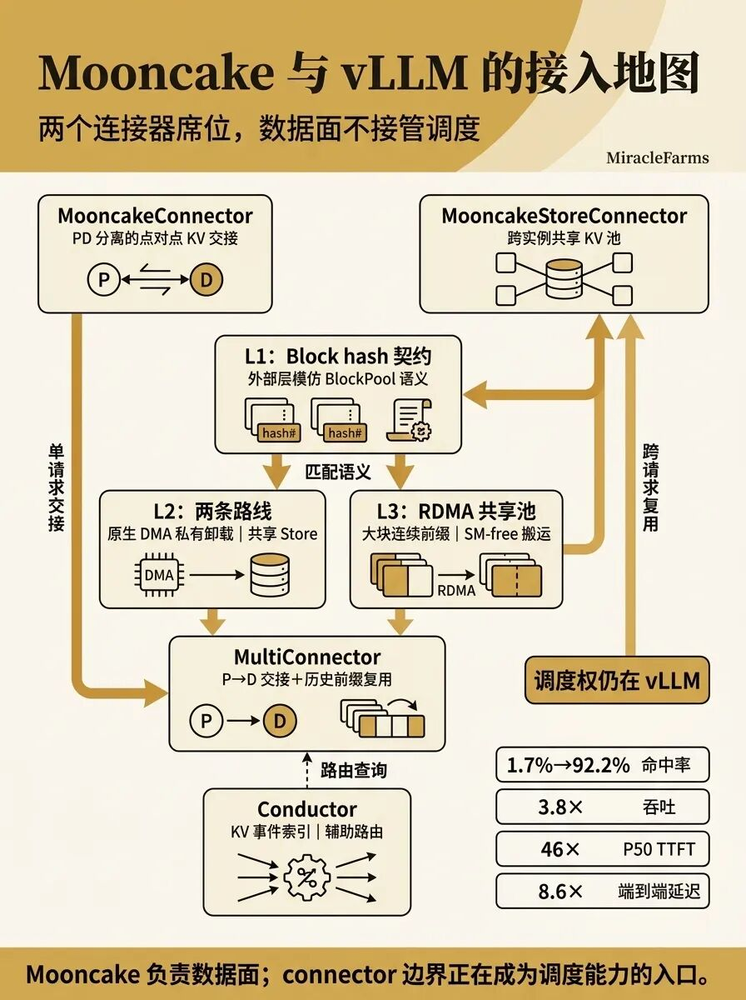
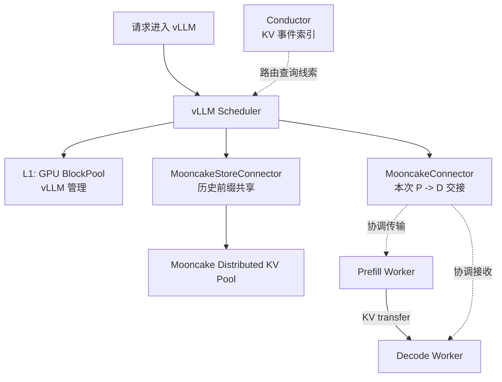
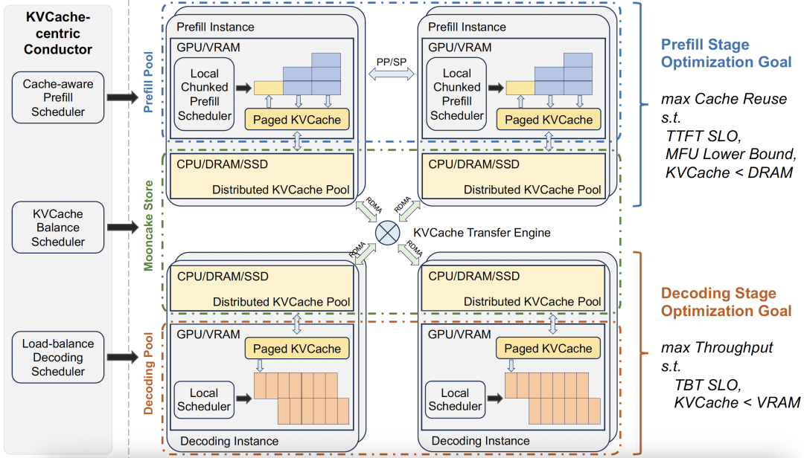
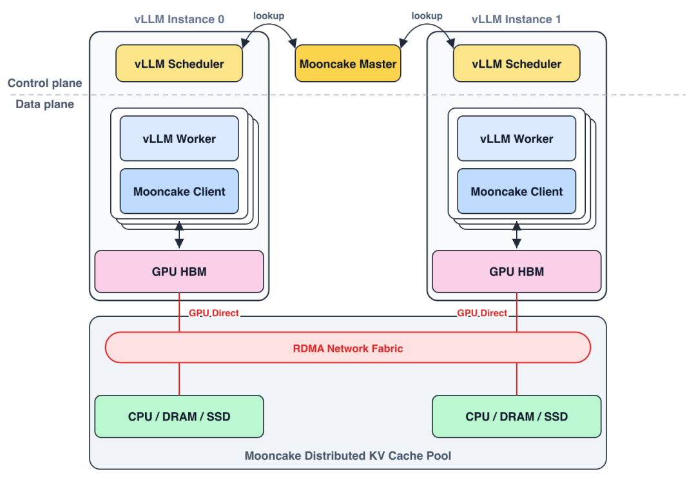
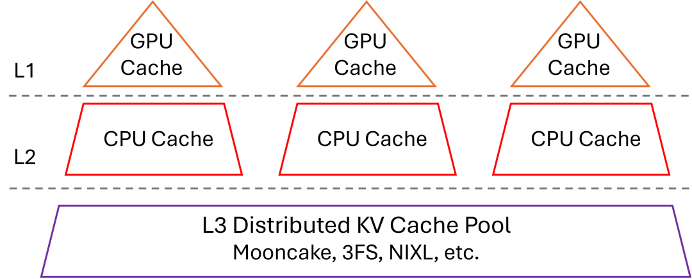
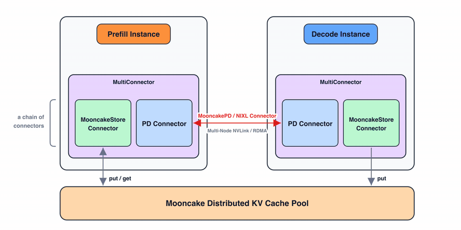

# Mooncake 与 vLLM 接入地图学习文档

本文面向第一次读 Mooncake x vLLM 资料的同学，整理原文《Mooncake 与 vLLM 的结合点全景：L1/L2/L3 卸载与 PD 分离的接入地图》的图文内容。本文是基于文章与配图的学习笔记，不做 vLLM / Mooncake 源码级复核。

## 0. 阅读基线与范围

**图文基线**

| 项目 | 内容 |
| --- | --- |
| 原文标题 | Mooncake 与 vLLM 的结合点全景：L1/L2/L3 卸载与 PD 分离的接入地图 |
| 原文链接 | <https://mp.weixin.qq.com/s/I_YpLl3cMYYyPU33Pk7o2w> |
| 作者 | Ethan |
| 读取时间 | 2026-07-17 |
| 整理范围 | MooncakeConnector、MooncakeStoreConnector、L1/L2/L3 语义、MultiConnector、Conductor、PD 分离和共享池边界 |
| 不展开内容 | 不逐行审计 vLLM / Mooncake 源码，不验证原文引用 PR 的最新状态 |

**产物假设**

文档以 Markdown 为核心，原文配图下载到 `../images/mooncake-articles/vllm/` 并用相对路径嵌入。图下说明是基于图片内容的二次理解，不复刻原文图注。

**怎么读本文**

每章尽量按四件事展开：

1. 先讲人话：把 connector、共享池和 PD 分离翻译成普通语言。
2. 再拆机制：说明哪个接口负责 P -> D，哪个接口负责跨实例复用。
3. 再读图片：解释图里的数据面、控制面和缓存层级。
4. 最后给例子或排障提示：把抽象接口拉回具体部署判断。

**术语速查**

| 术语 | 人话解释 | 在本文中的重点 |
| --- | --- | --- |
| MooncakeConnector | vLLM 中服务 PD 分离的 connector | 负责本次请求的 prefill -> decode KV 交接 |
| MooncakeStoreConnector | vLLM 中服务跨实例共享 KV 的 connector | 负责历史前缀复用和远端 Store 查询/读写 |
| MultiConnector | 把多个 connector 串在一起使用 | 让 P -> D 交接和共享池复用同时生效 |
| L1 | GPU HBM 上的 block cache | 由 vLLM BlockPool / KV cache manager 管理 |
| L2 | CPU / host memory 层 | 可能是 vLLM 私有 offload，也可能贡献给 Mooncake 共享池 |
| L3 | 分布式 KV cache pool | Mooncake、3FS、NIXL 等都可能承接这个位置 |
| Block hash | vLLM 判断连续前缀命中的 block key | 外部缓存必须模仿 vLLM 的命中语义 |
| Conductor | Mooncake 侧事件索引层 | 订阅 KV 事件，为路由器提供命中线索 |
| PD 分离 | Prefill 与 Decode 分离部署 | 解决“本次算出的 KV 怎么交给 decode” |

---

## 1. 先把接口数清楚

### 人话版

在 vLLM 里找 Mooncake 时，最容易混的是几组名字：

- MooncakeConnector
- MooncakeStoreConnector
- L1/L2/L3 卸载
- PD 分离
- MultiConnector
- Conductor

它们不在同一层。Mooncake 在 vLLM 主线里可以理解成两个正式席位：

| 接口 | 解决的问题 | 关键词 |
| --- | --- | --- |
| MooncakeConnector | 本次请求中，prefill 算完的 KV 如何交给 decode | P -> D 点对点传输 |
| MooncakeStoreConnector | 历史请求算过的前缀，另一台实例能否复用 | 跨实例共享 KV pool |

另外还有几条间接通道：LMCache 可以把 Mooncake 当 remote backend，NIXL 可以把 Mooncake Transfer Engine 当搬运后端，Conductor 可以订阅 KV 事件并维护命中索引。它们都没有改变一个边界：batch、block 生命周期和调度决策仍在 vLLM。

### 总览图



### 图意解读

这张图适合当 vLLM 接入地图：

- 左上是 MooncakeConnector，负责 PD 分离的 P -> D KV 交接。
- 右上是 MooncakeStoreConnector，负责跨实例共享 KV 池。
- 中间的 L1 block hash 契约提醒我们：外部缓存必须遵守 vLLM 的 block 匹配语义。
- L2 不是一个固定实现：可以是原生 DMA 私有卸载，也可以是共享 Store 里的 DRAM segment。
- L3 是 RDMA 共享池，偏向大块连续前缀复用。
- MultiConnector 把 Store 复用和 P -> D 交接组合起来。
- Conductor 通过 KV 事件索引辅助路由，但不直接拥有 vLLM 调度主路径。

图里“调度权仍在 vLLM”是关键：Mooncake 负责数据面，connector 边界正在变成调度能力的入口，但不是调度器本身。

### Mermaid 版接口图



---

## 2. L1 没有外接插槽，只有 block hash 契约

### 人话版

L1 是 GPU HBM 上的前缀缓存。它太热，也太靠近调度主路径，所以外部系统不应该接管它。vLLM 仍然负责：

- block 分配。
- 引用计数。
- LRU 驱逐。
- sliding window / hybrid attention 的窗口语义。
- 哪些 block 能算连续前缀命中。

Mooncake 与 L1 的连接不是“插进 GPU cache”，而是遵守 vLLM 的 block hash 语义。外部 Store 可以告诉 vLLM：这些 block hash 在远端存在。但连续命中如何截断、哪些 token 可复用，仍按 vLLM 的规则判断。

### 机制拆解

vLLM 的全 block 前缀匹配有一个重要约束：从 token 0 开始连续增长，中间断一块，后面的块都不能算进这次命中。MooncakeStoreConnector 要把远端 block 集合伪装成 vLLM 能理解的缓存池，而不是重新发明一套命中规则。

这个边界保护了 vLLM 的调度一致性：

| vLLM 保留 | Mooncake 提供 |
| --- | --- |
| BlockPool 语义 | 远端对象存在性 |
| KV cache manager 匹配 | Store 查询和读写 |
| hybrid attention / sliding window 规则 | 与 block hash 对齐的对象 key |
| L1 驱逐和引用计数 | 远端容量和复制 |

### 小例子

假设请求前缀被切成 6 个 block：

```text
B0 B1 B2 B3 B4 B5
```

远端 Store 有 `B0 B1 B2 B4 B5`，但缺 `B3`。这次连续前缀只能算到 `B2`。`B4/B5` 即使存在，也不能跳过缺口直接复用。

---

## 3. Mooncake 原生视角：Prefill/Decode 池与分布式 KV 池

### 架构图



### 图意解读

这张图从 Mooncake 自己的角度看系统：

- 上半部分是 Prefill Pool，目标是最大化 cache reuse，同时满足 TTFT、MFU 和 DRAM 容量约束。
- 下半部分是 Decoding Pool，目标是最大化 throughput，同时满足 TBT 和 VRAM 容量约束。
- 每个实例都有 GPU/VRAM 的 Paged KVCache。
- CPU/DRAM/SSD 组成 Distributed KVCache Pool。
- 中间的 KVCache Transfer Engine 通过 RDMA 把各实例和共享池连接起来。

映射到 vLLM 后：

| Mooncake 图中概念 | vLLM 接入口 |
| --- | --- |
| Transfer Engine | MooncakeConnector / NIXL backend 等传输通道 |
| Distributed KVCache Pool | MooncakeStoreConnector |
| Cache-aware prefill scheduler | vLLM scheduler 或外部路由器的输入 |
| KVCache event/index | Conductor |

### 人话版

Mooncake 想做的是推理数据面：让 KV 能跨实例保存、查询和搬运。vLLM 想保留的是调度主权：哪些请求进 batch、哪些 block 可复用、哪些资源应该释放。connector 是二者之间的边界。

---

## 4. L2 的分界线：私有 host offload 还是跨实例共享

### 人话版

CPU / host memory 层最容易被叫成 L2，但它在不同路径里语义不一样：

- vLLM 原生 offload：GPU block 异步 DMA 到本机 pinned host memory，这是单实例私有资源。
- Mooncake embedded Store：每个 rank 把一段 CPU/DRAM 贡献给共享池，其他实例也能通过 RDMA 读取。
- Mooncake standalone Store：vLLM rank 只是请求方，Store 容量由外部 Mooncake client 持有。

所以 L2 的关键问题不是配置名，而是：这段前缀会不会被第二台机器使用？

### Embedded 共享池图



### 图意解读

图里有两台 vLLM instance：

- control plane 上，vLLM Scheduler 向 Mooncake Master lookup。
- data plane 上，vLLM Worker 内有 Mooncake Client。
- GPU HBM 仍在各实例本地。
- 下方是 RDMA Network Fabric 和 Mooncake Distributed KV Cache Pool。
- CPU/DRAM/SSD 是共享池资源，不只是某台机器自己的私有 L2。

这个图说明了 embedded 模式的本质：每台实例既运行 vLLM，也贡献一部分本地内存给分布式 KV 池。它比本机 offload 多了跨实例复用能力，也多了 master lookup、对象封装和网络开销。

### 选型提示

| 场景 | 更像哪条路 |
| --- | --- |
| 单实例，working set 没越过本机 CPU 容量 | vLLM 原生 offload 更简单 |
| 负载均衡会把相同前缀打到不同 replica | Mooncake Store 更有意义 |
| 需要独立扩容 KV 存储服务 | standalone Store 更贴近目标 |
| 前缀短、访问零散、复用率低 | Store 可能比重算更贵 |

---

## 5. L3 是共享池主场，但适合大块连续前缀

### L1/L2/L3 抽象图



### 图意解读

这张图把层级抽象得很干净：

- L1 是每台 host 上方的 GPU cache。
- L2 是每台 host 的 CPU cache。
- L3 是横跨多台 host 的 Distributed KV Cache Pool。
- L3 后端不只能是 Mooncake，也可能是 3FS、NIXL 等。

它提醒我们不要把 L3 误解成“再挂一个本地目录”。L3 的价值在于跨实例、跨请求的共享寻址；如果请求永远留在一台机器上，L3 的网络路径可能只是额外成本。

### 人话版

Mooncake 的 L3 不是普通文件缓存，而是面向大块 KV 前缀的分布式对象池。它适合：

- 多实例之间共享稳定前缀。
- Agent 或长上下文请求多轮复用。
- 大块连续 block 能被一次性查询和搬运。
- RDMA / GPUDirect 能避开大量 CPU 中转和 copy kernel。

它不适合：

- 命中很短的零散 block。
- 稀疏注意力逐层 demand fetch。
- 每次请求都独一无二、没有跨实例复用。
- 本地 L1/L2 已经足够容纳工作集。

### 机制拆解

Store 的关键不是“更远的一层存储”，而是对象语义和数据路径：

| 能力 | 价值 |
| --- | --- |
| 对象 key 与 block hash 对齐 | vLLM 能把远端命中纳入前缀匹配 |
| RDMA / GPUDirect 搬运 | 大块连续 KV 读写更适合走数据面 |
| embedded / standalone 拓扑 | 可以在实例内共享，也可以独立成存储服务 |
| 后台提交与事件确认 | 避免把未完成写入误当成可复用对象 |

---

## 6. PD 分离是一条点对点交接线

### 人话版

PD 分离解决的是“本次请求”的空间交接：Prefill 节点已经算好的 KV，要交给 Decode 节点继续生成。

这和共享池不同：

- 共享池问的是：历史上有没有算过这个前缀？
- PD connector 问的是：这次 prefill 算出的 KV 怎么准时交给 decode？

MooncakeConnector 负责后者。它用 side channel 协调握手和请求，再让 prefill 向 decode 注册好的 KV 内存做数据写入。观测时要记住方向：很多成功传输的延迟和字节数更可能记在 prefill worker 上，decode 侧更常看到失败或等待。

### MultiConnector 图



### 图意解读

图里 prefill 和 decode 两侧都挂了 MultiConnector：

- MooncakeStoreConnector 连接底部的 Mooncake Distributed KV Cache Pool，负责 put/get 历史前缀。
- PD Connector 在 prefill 和 decode 之间做 P -> D 传输。
- 两条线彼此正交：一个跨请求复用历史，一个交接本次请求。

这就是 MultiConnector 的价值。一个请求可以先从 Store 复用历史前缀，只计算新增 suffix，然后把本次完整或增量 KV 通过 PD connector 交给 decode。

### 排障提示

排查 PD 分离时，不要只看 decode：

- Prefill worker 是否发起并完成写入。
- Decode 是否完成握手并注册目标 KV 内存。
- transfer plan 是否和 TP / rank 布局一致。
- 请求中断时 prefill 侧 block 是否超时释放。
- Store 命中和 P -> D 传输是否被混为一谈。

---

## 7. Conductor：开始靠近路由，但还不是 vLLM 调度器

### 人话版

Conductor 订阅 BlockStored、BlockRemoved 等 KV 事件，维护一个外部命中索引。它的目标是给路由器提供输入：某个请求如果路由到某台实例或某个池，可能获得更高缓存命中。

这比单纯的 Store 更接近控制面，但还没有改变 vLLM 的核心边界：

- vLLM 仍决定 batch、block 生命周期和执行节奏。
- Conductor 提供的是路由线索，不是直接调度 GPU。
- Mooncake 得到更多元数据，但仍不是 vLLM 内部的 KV cache manager。

### 例子

如果两个 replica 都能处理请求，但 Conductor 知道 replica A 所在池里有更长前缀，路由器可以优先把请求交给 A。进入 vLLM 后，vLLM 仍要按自己的 block hash 和 KV cache manager 规则确认命中。

---

## 8. vLLM 与 SGLang 给 Mooncake 的语义深度不同

### 人话版

同一个 Mooncake，在 vLLM 和 SGLang 里拿到的调度语义深度不同。

SGLang HiCache 把 L1/L2/L3 写进自己的分层系统：HiRadixTree 记录缓存位置，prefetch 有等待策略，write-back 有档位，Mooncake 常作为 L3 backend 深度参与这条链。

vLLM 更强调 connector 边界：调度器需要知道外部有多少 token 可以复用，但外部系统通常拿不到完整的延迟预算、优先级和层间决策上下文。好处是主线保持中立，P2P connector 和共享池都能替换；代价是外部系统要自己补更多索引、路由和状态能力。

### 对照表

| 维度 | vLLM | SGLang |
| --- | --- | --- |
| 集成形态 | connector 边界 | HiCache 分层体系 |
| Mooncake 常见位置 | PD connector / Store connector | L3 backend / PD transfer backend |
| L1 所有权 | vLLM BlockPool | SGLang GPU KV pool |
| L2/L3 策略 | vLLM 保留主调度，外部提供命中信息 | HiCache 直接组织预取、恢复、写回 |
| 外部路由 | Conductor 提供事件索引 | HiRadixTree / HiCache 内部状态更深 |
| 替换性 | connector 更容易替换 | backend factory 仍可替换，但语义更深 |

### 一句话判断

如果问题是“本次 P 算出的 KV 怎么交给 D”，看 MooncakeConnector。  
如果问题是“历史上算过的前缀能不能跨实例复用”，看 MooncakeStoreConnector。  
如果两个问题都存在，用 MultiConnector，但仍要记住调度权在 vLLM。

---

## 9. 小白排障地图

| 现象 | 优先检查 |
| --- | --- |
| Store 命中率低 | block hash 是否一致、是否连续 miss、路由是否把相同前缀打散 |
| TTFT 没有下降 | 命中长度是否足够大、RDMA 是否等待、GPU 恢复是否成为瓶颈 |
| PD 传输卡住 | decode 目标内存注册、prefill 侧写入指标、transfer plan、超时释放 |
| 只在单机复用 | 原生 offload 可能比分布式 Store 更合适 |
| 指标只在一侧出现 | P-push 方向下，成功传输更可能出现在 prefill 侧 |
| L3 读写很多小块 | 传输原语和访问模式可能不匹配，应考虑重算或更本地的 tier |

---

## 10. 一句话总结

Mooncake 在 vLLM 里不是一整套接管调度的缓存系统，而是两个清晰的 connector 席位：MooncakeConnector 管本次 P -> D KV 交接，MooncakeStoreConnector 管历史前缀跨实例复用；MultiConnector 能把两条线叠起来，但 L1/L2/L3 的可用性和 batch/block 生命周期仍要回到 vLLM 的语义里判断。

## 11. 参考与延伸

- 原文：<https://mp.weixin.qq.com/s/I_YpLl3cMYYyPU33Pk7o2w>
- 原文作者：Ethan
- 本文图片来自原文页面，已下载到 `../images/mooncake-articles/vllm/`。
- 本文是图文整理和学习笔记，技术结论以原文描述为基础；若用于生产决策，需要再对照 vLLM 与 Mooncake 当前主线源码复核。
