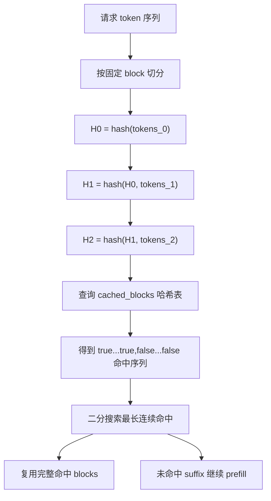
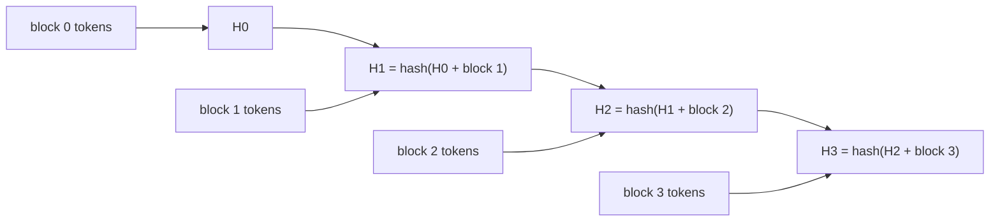
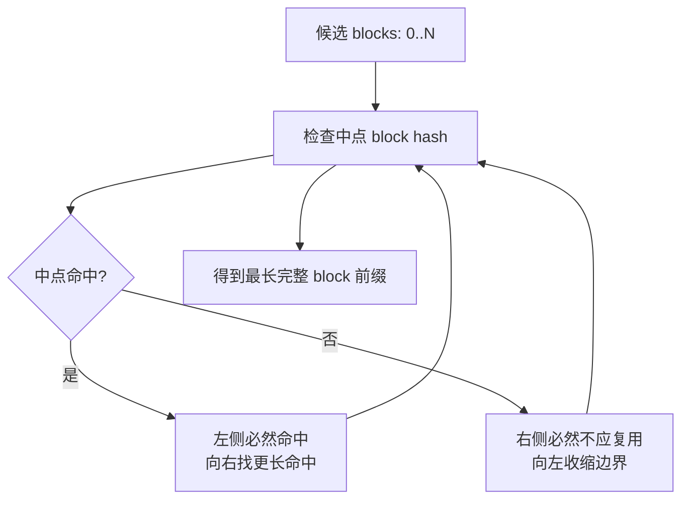

# vLLM APC 链式哈希学习文档

本文面向第一次理解 vLLM Automatic Prefix Caching 的同学，整理原文《KV Cache 前缀匹配的设计分野》的 vLLM 相关内容。本文只关注 vLLM，不展开原文中的其他框架；本文是第三方资料整理型学习资料，未做 vLLM 源码级复核。

## 0. 阅读基线与范围

| 项目 | 内容 |
| --- | --- |
| 原文标题 | KV Cache 前缀匹配的设计分野 |
| 原文链接 | <https://mp.weixin.qq.com/s/GciJebFszheSqU-s3yZPMQ> |
| 作者 | Lychee & Ethan |
| 读取时间 | 2026-07-17 |
| 整理范围 | vLLM APC 的 block-level prefix cache、链式哈希、平坦哈希表、二分搜索、完整 block 粒度、延迟标记 |
| 不展开内容 | 不分析原文中的其他框架；不做源码级复核 |

**术语速查**

| 术语 | 人话解释 | 在本文中的重点 |
| --- | --- | --- |
| APC | Automatic Prefix Caching，自动前缀缓存 | vLLM 的前缀复用机制 |
| block | vLLM KV cache 的固定粒度块 | vLLM 只复用完整 block |
| block hash | block 内容与前序 hash 共同计算出的 key | 把从 0 到当前 block 的前缀编码进去 |
| 平坦哈希表 | key -> physical block id 的表 | 没有树，也没有节点分裂 |
| 二分搜索 | 在 true...false 命中序列上找边界 | O(log N) 次查询定位最长命中前缀 |
| 延迟标记 | 本调度步完成后再注册新缓存 block | 避免同一 batch 内复用未稳定 block |

---

## 1. 先建立整体地图

### 人话版

vLLM 的 APC 选择了一条工程上很稳的路：不维护动态前缀树，也不追求任意 token 边界命中，而是把请求切成固定 block，用链式哈希给每个完整 block 生成 key，再去一张平坦哈希表里查是否存在。

这个选择的好处是简单、稳定、好调试；代价是最后不满一个 block 的残缺尾巴不能作为命中前缀复用。

### 总览图



### 一句话边界

vLLM 的目标不是 token 级极限命中，而是在生产可维护性和前缀复用收益之间取一个清晰、稳定的 block-level 平衡。

---

## 2. 链式哈希：每个 block 都带着前缀历史

### 人话版

链式哈希的关键是：第 `i` 个 block 的 hash 不只包含第 `i` 个 block 自己的 token，还包含前一个 block 的 hash。

所以如果第 5 个 block 的 hash 命中，它隐含表示从第 0 到第 5 个 block 的完整前缀都一致。

### 机制图



### 机制拆解

| 设计点 | 作用 |
| --- | --- |
| 前序 hash 参与当前 hash | 保证当前 block key 编码完整前缀 |
| 平坦哈希表 | 查询路径简单，key 直接映射物理 block |
| 固定 block 粒度 | 实现稳定，但无法命中残缺 block |
| 没有节点分裂 | 调试和维护更容易 |

### 小例子

假设 block size 是 16 tokens，一个请求有 49 tokens：

```text
block 0: 16 tokens
block 1: 16 tokens
block 2: 16 tokens
tail:    1 token
```

前 48 个 token 可以形成 3 个完整 block 并参与 APC；最后 1 个 token 没有完整 block hash，自然不能作为可复用命中。

---

## 3. 命中序列为什么能二分搜索

### 人话版

链式哈希带来一个重要性质：如果第 `i` 个 block 命中，那么前面的所有 block 也应该命中。因为第 `i` 个 hash 已经依赖前一个 hash，而前一个 hash 又依赖更前面的内容。

因此命中序列天然像这样：

```text
true true true false false false
```

有了这个单调结构，就可以用二分搜索找最长命中前缀。

### 二分搜索图



### 机制拆解

| 查询方式 | 代价 | 前提 |
| --- | --- | --- |
| 逐 block 查询 | O(N) | 不需要单调性 |
| 二分查询 | O(log N) | 命中序列是 true...false |

vLLM 的链式哈希正好给了二分搜索需要的单调性。

---

## 4. 完整 block 粒度：简单稳定，也会丢尾巴

### 人话版

vLLM APC 的最大取舍在粒度上：它只认完整 block。默认 block 边界下，最后不满一个 block 的部分没有完整 hash，因此不能算命中。

这让系统更简单：

- 不需要动态节点分裂。
- 不需要维护前缀树结构。
- 不需要处理任意 token 边界的生命周期。

但也会带来稳定损失：如果你的系统 prompt 总是比完整 block 多一两个 token，这一小段就会反复重算。

### 例子

```text
block size = 16
共享前缀 = 33 tokens
```

vLLM APC 能稳定复用前 32 tokens，最后 1 token 不算完整 block，需要走后续计算。这个损失通常可以接受，但在前缀长度总是卡在边界后一点点的 workload 中会持续出现。

### 对比边界

只保留一个必要判断：SGLang 更偏向精细命中，vLLM 更偏向简单稳定。vLLM 的 block-level APC 牺牲部分命中精度，换来更少的数据结构维护和更清楚的调试路径。

---

## 5. 哈希碰撞与延迟标记

### 哈希碰撞

原文提到 vLLM 使用非加密哈希时，碰撞概率在大规模 block 下不是零。工程上这个概率很低，但一旦碰撞，错误 block 复用会影响输出正确性。

这类风险不应该被夸大，也不应该被忽略：

- 对普通规模，碰撞通常不是主要瓶颈。
- 对极大规模、多租户或高正确性敏感场景，hash 选择和隔离边界要被纳入风险评估。

### 延迟标记

vLLM 还用延迟标记处理同一调度步内的竞争：一个 batch 里刚算完的 block，不会立刻注册到 `_cached_blocks` 给同一轮其他请求复用，而是在调度步结束后统一标记。

### 人话版

这像是考试收卷：本轮刚写完的答案不能马上拿给同考场另一个人抄，必须等这一轮结束、结果稳定后再登记进资料库。

### 机制拆解

| 机制 | 解决的问题 |
| --- | --- |
| 链式哈希 | 保证 block key 携带完整前缀历史 |
| 平坦哈希表 | 简化查询和调试 |
| 二分搜索 | 快速定位最长命中前缀 |
| 完整 block 粒度 | 减少部分匹配复杂度 |
| 延迟标记 | 避免同 batch 内复用未稳定 block |

---

## 6. 小白排障地图

| 现象 | 优先检查 |
| --- | --- |
| 前缀看起来相同但没命中 | tokenization 是否一致，是否完整 block 对齐 |
| 只差几个 token 却重算 | 共享部分是否落在 block 边界后 |
| 命中率低于预期 | 请求是否真的共享完整 block，block size 是否合适 |
| 同一 batch 内没有复用刚生成 block | 延迟标记是否符合预期 |
| 怀疑错误复用 | hash 碰撞、命名空间隔离、block 内容一致性 |

---

## 7. 一句话总结

vLLM APC 把 prefix cache 命中定义在完整 block 上：链式哈希让每个 block key 携带完整前缀历史，平坦哈希表让查询简单，二分搜索快速定位最长命中，延迟标记维护调度步内边界；它用较粗的匹配粒度换取稳定、清晰、可生产维护的实现。

## 8. 参考与延伸

- 原文：<https://mp.weixin.qq.com/s/GciJebFszheSqU-s3yZPMQ>
- 原文作者：Lychee & Ethan
- 本文未使用原文装饰图；机制图使用 Mermaid 重绘。
- 本文只整理 vLLM 相关内容，未做源码级复核；源码判断请再对照当前 vLLM 主线确认。
