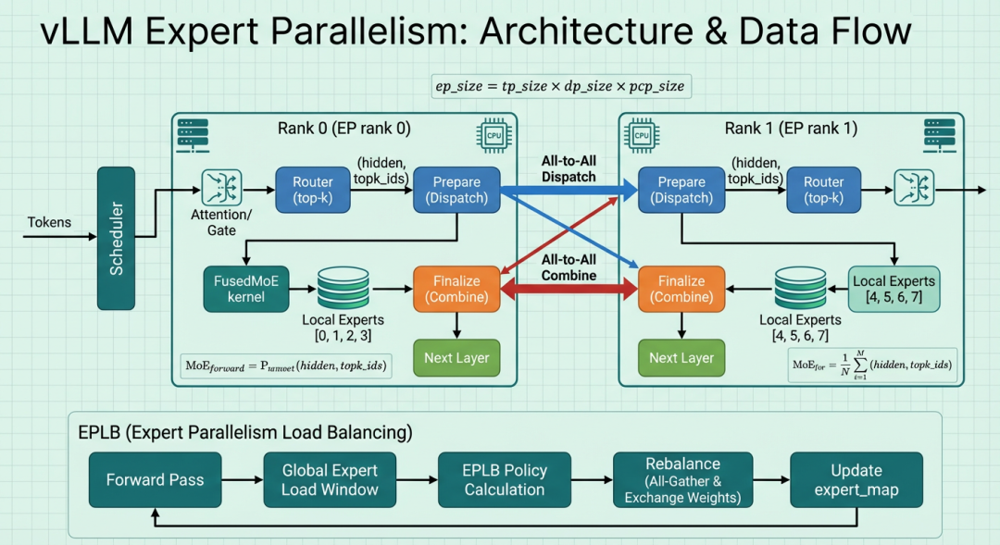
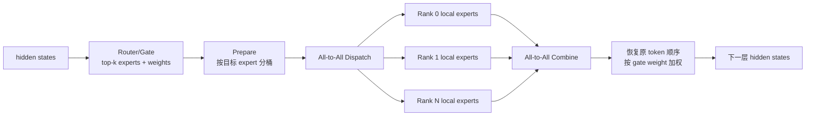
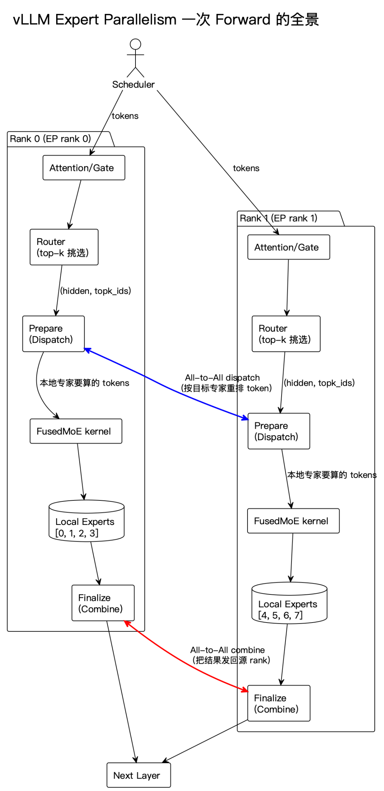
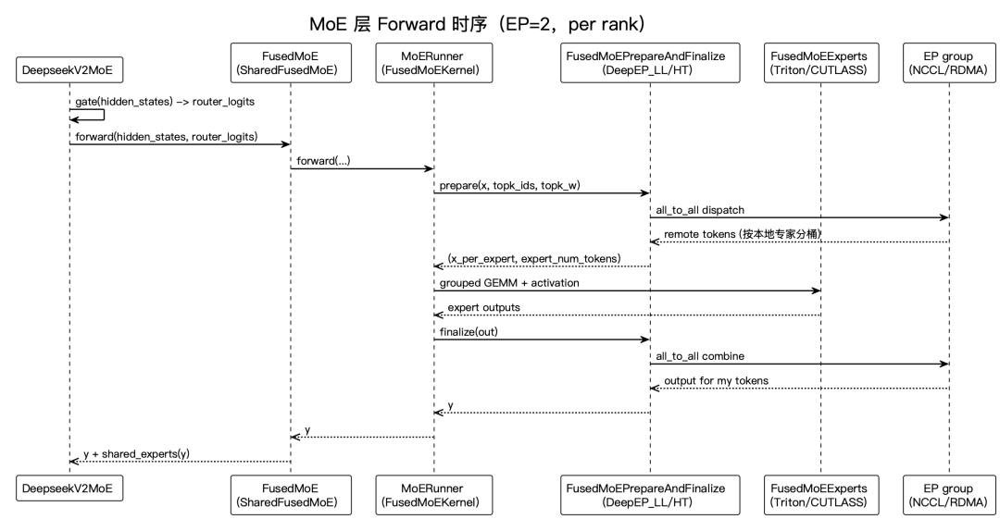
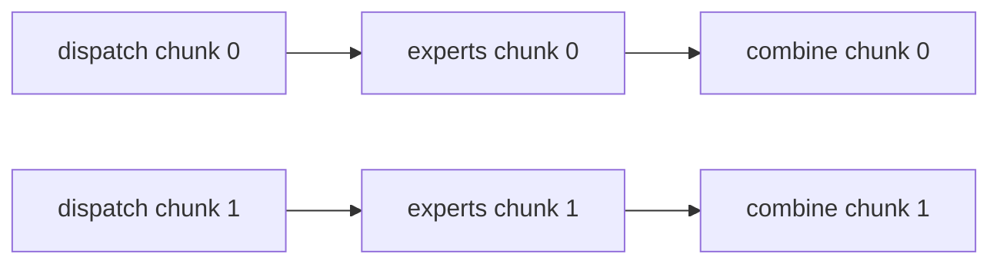
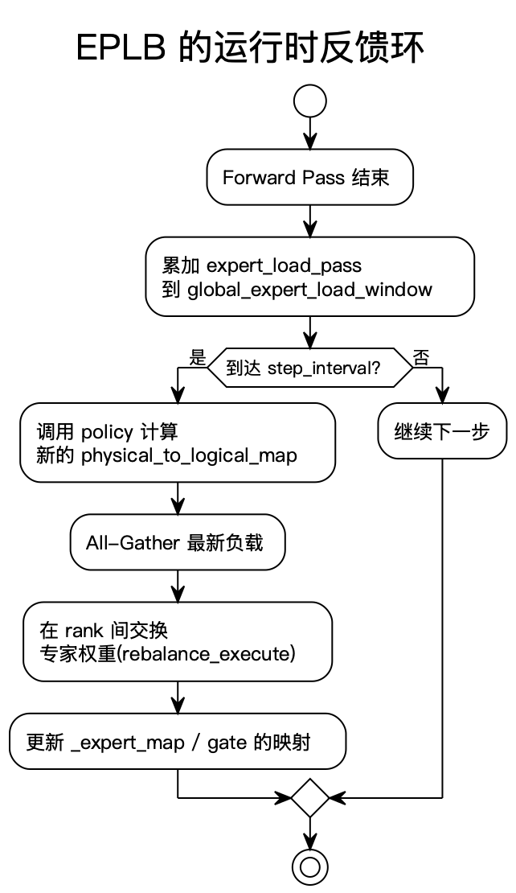

# vLLM Expert Parallel 与 EPLB 学习文档

本文面向第一次接触 MoE 推理并行的同学，沿着一层 MoE forward 的数据流解释 vLLM Expert Parallel：

```text
router 选专家
-> dispatch 把 token 发到专家所在 rank
-> 本地 experts 计算
-> combine 把结果送回来源 rank
```

然后再解释 EPLB 怎样观察专家热度、放置冗余专家并调整映射。

本文是第三方文章整理，不是当前 vLLM 源码审计。原文引用了大量参数、类名和后端名，但本文没有核对它们在当前版本中的默认值、签名和支持状态。

## 0. 阅读基线与范围

| 项目 | 内容 |
| --- | --- |
| 原文标题 | LLM推理优化-vLLM EP并行 |
| 原文链接 | [https://mp.weixin.qq.com/s/BikdIZrIrn7U13f5VtC4pA](https://mp.weixin.qq.com/s/BikdIZrIrn7U13f5VtC4pA) |
| 作者 | elrond-g |
| 发布时间 | 2026-05-03 |
| 读取时间 | 2026-07-27 |
| 资料类型 | 基于源码路径和后端实现的第三方图文讲解 |
| 整理范围 | EP 进程组、expert placement、dispatch/combine、all-to-all backend、EPLB |
| 不展开内容 | MoE 训练、量化 kernel 细节、某个后端的安装教程、当前源码逐行审计 |
| 验证边界 | 未复现原文 benchmark，未确认参数默认值和 backend 支持矩阵 |

### 怎么读本文

先区分三件事：

1. **逻辑专家**：模型定义里编号为 0、1、2... 的专家。
2. **物理专家副本**：某张 GPU 上真正加载的一份专家权重。
3. **token 路由**：每次 forward 把 token 发给哪些物理专家。

EP 决定逻辑专家怎样分布；EPLB 在运行时根据负载调整逻辑到物理的映射。

### 术语速查

| 术语 | 人话解释 | 本文重点 |
| --- | --- | --- |
| MoE | 每层有很多专家，每个 token 只激活 top-k 个 | 计算稀疏、路由通信密集 |
| EP | Expert Parallel，把不同专家放到不同 rank | 专家权重分片与 token 交换 |
| Router/Gate | 为每个 token 选 top-k 专家和权重 | 决定 dispatch 目的地 |
| Dispatch | 按专家 owner 重排并发送 token | 第一次 all-to-all |
| Combine | 把专家输出送回来源 rank并按权重合并 | 第二次 all-to-all |
| FusedMoE | 把排序、专家 GEMM、激活等融合的 MoE 实现 | 本地专家计算 |
| `expert_map` | 逻辑专家到物理槽位/rank 的映射 | placement 和 EPLB 的核心状态 |
| EPLB | Expert Parallel Load Balancing | 根据窗口负载重分配专家 |
| redundant expert | 热门逻辑专家的额外物理副本 | 分摊热点 |
| HT | High Throughput 通信模式 | 原文倾向用于 prefill/吞吐 |
| LL | Low Latency 通信模式 | 原文倾向用于 decode/低延迟 |

---

## 1. 先建立整体地图

### 人话版

Dense FFN 里，每个 rank 都要参与同一套权重计算。MoE 不一样：

- 模型有很多专家；
- 一个 token 只去 top-k 个专家；
- 不同专家放在不同 GPU；
- token 必须跨 GPU 去找专家；
- 算完还要回到原来的 token 顺序。

因此 EP 的核心不是普通 all-reduce，而是两次重排：

```text
按专家目的地分发
-> 本地专家计算
-> 按 token 来源返回
```



**图意解读**

- 上半部分每个 rank 只持有部分 local experts。
- Router 产生 `topk_ids` 后，Prepare 阶段按目标专家重排 token。
- 蓝色箭头表示 all-to-all dispatch，红色箭头表示 all-to-all combine。
- 下半部分 EPLB 从 forward 负载窗口出发，计算新映射并交换权重。
- 这张原图是概念总览；其中模块摆放和公式不能替代具体 backend 的真实调用顺序。

### 总览图



### 控制面与数据面

| 类型 | 内容 |
| --- | --- |
| 控制面 | `topk_ids`、每个专家 token 数、offset、逻辑/物理专家映射 |
| 数据面 | token hidden states、top-k weights、专家输出 |
| 长期状态 | expert weights、`expert_map`、EPLB 负载窗口 |

如果控制面映射错了，即使 all-to-all 成功，token 也会送到错误专家。

---

## 2. EP 与 DP、TP、PCP 的关系

### 2.1 不同并行维切什么

| 并行 | 切分对象 | MoE 层中的作用 |
| --- | --- | --- |
| TP | 专家内部矩阵/head | 一个专家可能仍由多个 TP rank 一起算 |
| DP | 请求/token batch | 不同副本处理不同请求 |
| PCP | 长请求的序列 token | 一条请求可能分布到多个 PCP rank |
| EP | 专家集合 | 每个 rank 只加载一部分专家 |

### 2.2 原文中的 EP size 心智模型

原文把某些 MoE 视图下的 EP 规模概括为：

```text
ep_size = tp_size × dp_size × pcp_size
```

它表达的是：在 MoE 层，原来属于不同 TP/DP/PCP 位置的 worker，可能共同组成更大的专家分布和 all-to-all 域。

这不是所有配置的通用公式。具体是否折叠某个维度取决于：

- 是否启用 expert parallel；
- attention 和 MoE 是否使用不同并行组；
- 专家内部是否还有 local TP；
- DP attention、PCP 与 EP 的实现版本；
- backend 对 group size 的限制。

### 2.3 为什么 attention 和 MoE 会切换布局

一层 Transformer 里：

```text
Attention 输出布局
-> MoE token/expert 布局
-> 下一层 Attention 输入布局
```

如果 attention 按 TP/head 分片，而 MoE 按 expert 分片，中间就必须：

- all-gather token；
- reduce-scatter；
- all-to-all；
- 或使用融合 prepare/finalize 完成等价布局转换。

性能问题常常不在专家 GEMM 本身，而在两侧布局转换。

---

## 3. 专家怎样放到 rank

### 3.1 基本均分

假设有 8 个逻辑专家、2 个 EP rank：

```text
rank 0: experts 0,1,2,3
rank 1: experts 4,5,6,7
```

每个 rank 只加载自己的专家权重，显存约按 EP size 分摊。

### 3.2 `linear` placement

连续编号放在同一个 rank：

```text
rank 0: 0,1,2,3
rank 1: 4,5,6,7
```

优点：

- 映射简单；
- checkpoint 分片和调试直观；
- 连续内存布局可能更友好。

风险：

- 如果相邻专家热度相关，热点可能集中到一个 rank。

### 3.3 `round_robin` placement

专家轮转分配：

```text
rank 0: 0,2,4,6
rank 1: 1,3,5,7
```

优点：

- 有机会打散相邻热点；
- 静态负载可能更均匀。

风险：

- 不能保证真实流量均衡；
- 权重加载和映射更分散；
- 对模型特定的共享/分组专家要额外处理。

### 3.4 `expert_map`

应把它理解成一张路由表：

```text
逻辑 expert id
-> 物理 rank
-> rank 内 local expert slot
```

Router 产生的是逻辑 expert id。Prepare 阶段必须先查 `expert_map`，才能知道 token 发给哪个 rank、落在哪个本地专家槽位。

---

## 4. 一次 MoE forward 的完整流程



**图意解读**

- 两个 rank 都先运行 attention/gate，得到本地 token 的 top-k 专家。
- Prepare 根据目标专家重新排列 token；蓝色箭头把远端专家所需 token 发过去。
- 每个 rank 的 FusedMoE 只运行 local experts。
- 红色箭头把专家结果送回 token 的来源 rank。
- Finalize 恢复原 token 顺序，并按 top-k gate weight 合并多个专家输出。

### 4.1 Gate

输入：

```text
hidden_states: [num_tokens, hidden_size]
```

输出至少包括：

```text
topk_ids:     [num_tokens, top_k]
topk_weights: [num_tokens, top_k]
```

同一个 token 被选中 `top_k` 次时，后续 dispatch 逻辑会把它复制成多个 expert assignment。

### 4.2 Prepare / Dispatch

Prepare 通常要做：

1. 根据 `topk_ids` 查 `expert_map`；
2. 统计每个目标 rank、每个 local expert 有多少 token；
3. 计算 offset；
4. 按目标专家排序/打包 hidden states；
5. 交换 count/metadata；
6. 发起 all-to-all dispatch。

输出是按本地专家分桶后的 token，例如：

```text
expert 0: tokens [a, f, k]
expert 1: tokens [b]
expert 2: tokens [c, d, e]
```

### 4.3 Local experts

每个本地专家对自己的 token 子批做 FFN：

```text
y = W2(activation(W1(x)))
```

实际常使用 grouped GEMM：

- 多个专家的不同 token 数放进一套融合 kernel；
- 通过 offset 告诉 kernel 每个专家的边界；
- 减少逐专家 kernel launch。

### 4.4 Finalize / Combine

本地专家算完后：

1. 根据来源 rank 分桶输出；
2. all-to-all combine；
3. 恢复原 token、top-k 槽位顺序；
4. 乘 `topk_weights`；
5. 对同一 token 的多个专家结果求和；
6. 返回下一层所需布局。

### 时序图



**图意解读**

- `DeepseekV2MoE`/模型层先产生 router logits。
- `FusedMoE` 把工作交给 runner。
- Prepare/Finalize backend 发起 dispatch，再把本地 expert token 交给 Triton/CUTLASS 等专家 kernel。
- expert 输出返回后，Finalize 发起 combine。
- shared expert 可能在主 MoE 输出后再合入。
- 类名与 backend 名来自原文对应版本，应把图读作职责链，而不是当前源码的固定调用栈。

---

## 5. 为什么需要 all-to-all backend

### 5.1 EP 不是普通 all-reduce

all-reduce 的典型语义是每个 rank 输入同形状张量，最后每个 rank 得到相同归约结果。

EP dispatch 不一样：

- 每个 rank 发给其他 rank 的 token 数不同；
- token 目的地由 router 动态决定；
- 每个 expert 的负载不均；
- 输出还要按来源返回。

因此更像 variable-size all-to-all。

### 5.2 原文列出的后端类别

原文讨论了：

- DeepEP；
- FlashInfer；
- MORI；
- NIXL；
- all-gather + reduce-scatter 类 fallback；
- 其他平台/设备特定实现。

这些名字和可用性会快速变化。选择时不要只看后端名，应确认：

| 能力 | 要问的问题 |
| --- | --- |
| 设备 | 支持哪种 GPU/互联？ |
| 通信 | 支持跨节点 RDMA 吗？ |
| shape | 支持 variable token count 吗？ |
| 模式 | prefill 与 decode 是否分别优化？ |
| graph | 支持 CUDA Graph 吗？ |
| quant | 支持目标权重/激活数据类型吗？ |
| EPLB | 能否使用动态 expert map？ |

### 5.3 HT 与 LL

原文把 DeepEP 两种模式概括为：

| 模式 | 目标 | 更常见场景 |
| --- | --- | --- |
| HT（High Throughput） | 大批 token 的总带宽 | prefill、高吞吐 |
| LL（Low Latency） | 小批 token 的启动延迟 | decode、低延迟 |

不要机械按阶段绑定。一次 prefill 的 token 很少或一次 decode 的 batch 很大时，最佳模式可能变化。应按真实 token count 和网络测试。

### 5.4 通信与计算重叠

理想流水：



若后端支持分块和多 stream，可能让：

- 下一批 token 正在 dispatch；
- 当前批 token 正在 expert GEMM；
- 上一批 token 正在 combine；

同时发生。实际是否重叠要看 buffer 依赖和 backend。

---

## 6. 专家负载为什么会失衡

### 人话版

Router 不会平均选择所有专家。输入分布变化时，一些专家可能非常热：

```text
expert 3: 30% tokens
expert 7: 25% tokens
其他专家: 各 1%~5%
```

如果 expert 3 和 7 恰好在同一 rank：

- 这个 rank 收到最多 token；
- 其他 rank 很快算完后等待；
- 整层延迟由热点 rank 决定。

### 负载的三个层次

| 层次 | 要看什么 |
| --- | --- |
| expert 级 | 每个逻辑专家收到多少 token |
| rank 级 | 每个 rank 所有本地专家 token 总量 |
| 通信级 | 每对 rank 之间实际发送多少数据 |

专家 token 数均衡，不代表通信也均衡；同一节点内和跨节点的代价也不同。

---

## 7. EPLB 的运行时反馈环

### 人话版

EPLB 像一个定期调座位的管理器：

1. 观察最近一段时间每个专家有多忙；
2. 判断哪些专家需要额外副本；
3. 计算新的逻辑专家到物理槽位映射；
4. 在 rank 间交换权重；
5. 更新 router/`expert_map`；
6. 继续观察。



**图意解读**

- 每次 forward 后，专家负载被累积到滑动窗口。
- 只有达到 `step_interval` 才触发重平衡，避免每步都搬权重。
- policy 先计算新的 `physical_to_logical_map`。
- rank 间交换权重并更新映射后，新请求才按新 owner 路由。
- 控制面的关键是“权重已到位”和“映射已切换”必须一致，不能先改路由再搬权重。

### 7.1 逻辑专家与物理专家

假设模型有 8 个逻辑专家，但允许 10 个物理槽位：

```text
logical experts: 0..7
physical slots:  0..9
```

多出的 2 个槽位可以复制最热专家：

```text
logical expert 3 -> physical slot 3, 8
logical expert 7 -> physical slot 7, 9
```

Router 或 dispatch policy 再把 expert 3 的 token 分给两个副本。

### 7.2 负载窗口

只看单步会受偶然 batch 影响。EPLB 通常维护窗口：

```text
global_expert_load_window
```

窗口太短：

- 对噪声敏感；
- 频繁搬权重；
- 映射抖动。

窗口太长：

- 反应慢；
- 热点已经变化，旧统计仍占主导。

### 7.3 重平衡成本

EPLB 不是免费优化。一次重平衡可能包含：

- all-gather 最新负载；
- policy 计算；
- 大块 expert weight 传输；
- 等待在途 forward 安全点；
- 更新多个映射；
- CUDA Graph 或 kernel metadata 刷新。

因此只有热点造成的持续拖尾大于这些成本，EPLB 才值得。

### 7.4 原文中的规模例子

原文举例：

```text
256 个逻辑专家
+ 32 个冗余物理专家
= 288 个物理专家
32 张 GPU
=> 每卡 9 个物理专家
```

这是用于说明“冗余专家怎样均分到物理槽位”的算术示例，不是所有 DeepSeek 部署的固定推荐。

---

## 8. 配置项怎样理解

原文列出过下列配置概念：

```text
enable_expert_parallel
enable_ep_weight_filter
enable_eplb
eplb_config
expert_placement_strategy
all2all_backend
```

在目标版本中，应从 `vllm serve --help` 或配置类确认真实 CLI 名。概念上可分为：

| 类别 | 作用 |
| --- | --- |
| EP 开关 | 是否把专家集合分到多个 rank |
| placement | 初始逻辑专家怎样放置 |
| all-to-all backend | dispatch/combine 使用什么通信实现 |
| weight filter | 每个 rank 是否只加载本地所需专家权重 |
| EPLB | 是否收集负载并动态重排 |
| EPLB policy/window | 多久、按什么目标重平衡 |

### `enable_ep_weight_filter` 的意义

如果每个 rank 从 checkpoint 加载时先读全部专家再丢弃：

- 启动内存高；
- I/O 浪费；
- 大模型加载慢。

权重过滤的目标是只保留本 rank 的专家分片。需要注意：

- checkpoint 命名必须能映射到逻辑 expert id；
- EPLB 需要的冗余槽位也要提前或按需加载；
- 动态迁移不能假设其他 rank 永远没有该专家权重来源。

---

## 9. 性能怎么判断

### 一层 MoE 的粗略时间

```text
T_moe
= T_gate
+ T_prepare
+ T_dispatch
+ max_rank(T_local_experts)
+ T_combine
+ T_finalize
```

其中 `max_rank` 很关键：整层必须等最慢 expert rank。

### 需要同时看的指标

| 指标 | 说明 |
| --- | --- |
| 每专家 token 数 | Router 热点 |
| 每 rank token 总数 | 计算负载是否均衡 |
| dispatch/combine 字节数 | 通信矩阵 |
| expert GEMM 时间 | 本地 kernel 效率 |
| all-to-all 时间 | backend 与网络效率 |
| padding/capacity 丢弃 | 是否为等形状浪费或丢 token |
| EPLB 搬权重时间 | 动态平衡的成本 |
| TTFT/TPOT | prefill 与 decode 的最终效果 |

### 原文经验的边界

原文给出了不同 backend、prefill/decode 模式和模型的调优建议。它们只能作为候选起点，因为结果高度依赖：

- 单机 NVLink 还是跨机 RDMA；
- token 数和 top-k；
- expert hidden size；
- 量化格式；
- GPU 架构；
- backend 版本；
- 专家热点分布。

---

## 10. 小白排障地图

| 现象 | 可能原因 | 优先检查 |
| --- | --- | --- |
| 某 rank 长期比其他 rank 慢 | 热专家集中 | expert/rank load histogram |
| all-to-all hang | group 不一致、count/offset 错 | 每 rank send/recv count |
| token 输出错位 | combine 没恢复原顺序 | token source index、top-k slot |
| 某些 token 结果为零 | expert assignment 丢失或 capacity 截断 | dispatch count、mask |
| EP 显存没有下降 | 每 rank 仍加载全部专家 | weight filter、checkpoint loader |
| EPLB 开启后周期性抖动 | 搬权重或映射切换阻塞 | step interval、迁移时间 |
| EPLB 后结果错误 | 权重和 `expert_map` 切换不同步 | 安全点、版本号/ACK |
| prefill 快、decode 慢 | backend 只适合大消息 | HT/LL 或消息规模 |
| decode 快、prefill 慢 | 小消息优化牺牲吞吐 | backend 模式与 batch |
| 增加 EP size 反而变慢 | local GEMM 太小、网络放大 | expert token 数、跨节点流量 |

### 最小排障问题

对任意一个 token，记录：

```text
原始 token index
top-k logical expert ids
每个逻辑 expert 的 physical owner
dispatch 后位置
本地 expert 输出位置
combine 后恢复位置
最终 gate weight
```

只要这条链完整，正确性问题通常能定位到具体阶段。

---

## 11. 一句话总结

**vLLM EP 把专家权重分散到不同 rank，再用 all-to-all 把 token 送到专家、把结果送回来源；EPLB 则在更长时间尺度上调整逻辑专家到物理副本的映射，目标是减少最慢热点 rank 的拖尾。**

## 12. 参考与延伸

- [LLM推理优化-vLLM EP并行](https://mp.weixin.qq.com/s/BikdIZrIrn7U13f5VtC4pA)
- [SGLang 数据并行、负载均衡与专家并行边界学习文档](../../sglang/parallelism/SGLang%20数据并行、负载均衡与专家并行边界学习文档.md)
- [PCP 长上下文 Prefill 并行学习文档](../../llm-inference/parallelism/PCP%20长上下文%20Prefill%20并行学习文档.md)

本文是基于原文的结构化学习笔记，没有对当前 vLLM 的类名、参数和后端行为做源码级复核。
